# [Prefill 최적화] vLLM Automatic Prefix Cache(RadixAttention) 원리와 도해: 첫 토큰 지연 최적화

> 원문: https://zhuanlan.zhihu.com/p/693556044

**목차**
- 0x00 서문
- 0x01 Prefix Caching: RadixAttention 원리 분석
- 0x02 vLLM Automatic Prefix Caching: Hash RadixAttention
- 0x03 vLLM Automatic Prefix Caching: Hash Prefix Tree
- 0x04 vLLM Automatic Prefix Caching: Prefix/Generate 단계 Hash 처리
- 0x05 vLLM Automatic Prefix Caching: Prefix + Generated KV Caching
- 0x06 vLLM Automatic Prefix Caching: 몇 가지 경계 상황
- 0x07 vLLM Automatic Prefix Caching: 다중 턴 대화 적용 분석
- 0x08 vLLM Automatic Prefix Caching: Prefix Prefill Kernel과 Attention Kernel의 차이
- 0x09 vLLM Automatic Prefix Caching: 적용 실습
- 0x0a Prefix Caching 최적화 관련 다른 논문
- 0x0b 정리

### 0x00 서문

Prefix Caching 관련 글을 몇 편 봤는데 아주 명확하게 설명한 글은 많지 않다고 느꼈습니다. 최근 저도 관련 기술을 정리하고 싶어서 이 글을 쓰게 되었습니다. vLLM Automatic Prefix Caching의 소스 코드와 직접 그린 도해를 함께 보며 이 문제를 최대한 분명하게 설명해 보겠습니다.

최근 PagedAttention, Prefix Cache(RadixAttention), Chunk Prefills의 기술 포인트를 정리하려고 합니다. 이 세 기술은 TensorRT-LLM과 vLLM이라는 대표적인 LLM 추론 프레임워크에서 이미 지원됩니다. 따라서 실제 적용 관점에서도 원리를 이해할 가치가 있습니다. PagedAttention 관련 글은 이미 인터넷에 많으므로 여기서는 자세히 반복하지 않고, 시간이 되면 PagedAttention V1/V2 글을 따로 보충하겠습니다. 이 글은 그 시리즈의 첫 번째 글이며, Prefix Cache의 기술 포인트를 정리하고 도해와 소스 분석을 결합해 vLLM Automatic Prefix Caching 구현을 살펴봅니다. 관련 기술의 전체 timeline과 논문은 대략 다음과 같습니다.

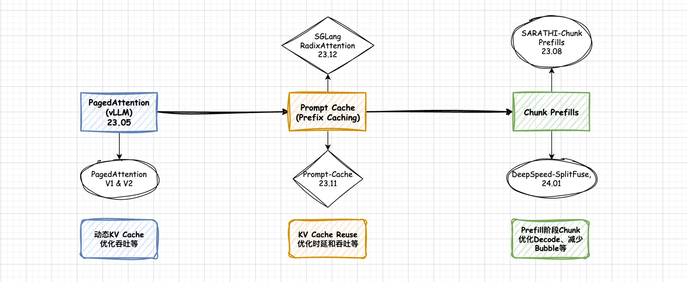
*전체 timeline*

이 글은 약 1.5만 자 분량이며, PagedAttention 원리를 알고 있는 독자에게 적합합니다. 내용은 다음과 같습니다.

- 0x01 Prefix Caching: RadixAttention 원리 분석
- 0x02 vLLM Automatic Prefix Caching: Hash RadixAttention
- 0x03 vLLM Automatic Prefix Caching: Hash Prefix Tree
- 0x04 vLLM Automatic Prefix Caching: Prefix/Generate 단계 Hash 처리
- 0x05 vLLM Automatic Prefix Caching: Prefix + Generated KV Caching
- 0x06 vLLM Automatic Prefix Caching: 몇 가지 경계 상황
- 0x07 vLLM Automatic Prefix Caching: 다중 턴 대화 적용 분석
- 0x08 vLLM Automatic Prefix Caching: Prefix Prefill Kernel과 Attention Kernel의 차이
- 0x09 vLLM Automatic Prefix Caching: 적용 실습
- 0x0a Prefix Caching 최적화 관련 다른 논문

### 0x01 Prefix Caching: RadixAttention 원리 분석

논문: **Efficiently Programming Large Language Models using SGLang**

LLM 추론 응용에서는 긴 system prompt가 있는 장면과 다중 턴 대화 장면을 자주 만납니다. 긴 system prompt 장면에서는 서로 다른 request라도 system prompt가 같고, KV Cache 계산도 같습니다. 다중 턴 대화에서는 매 턴의 대화가 모든 이전 턴의 context에 의존하므로, 이전 턴의 KV Cache가 이후 매 턴에서 다시 계산됩니다.

이 두 경우 system prompt와 이전 턴의 KV Cache를 저장해 두고 후속 request에서 재사용할 수 있다면 첫 토큰 지연을 크게 줄일 수 있습니다. Prefix Cache와 Generated KV Cache를 모두 caching할 수 있다면, 다중 턴 대화에서는 경계 상황을 제외할 때 이전 턴 생성 대화의 recompute가 거의 사라진다고 볼 수 있습니다. 아래 그림처럼 매 턴 대화에서 prefill 단계에 계산해야 하는 것은 현재 턴 prompt뿐입니다. 이전 턴의 Prefix + Generated KV Cache는 모두 cache hit됩니다. 다중 턴 대화 적용 분석은 뒤 절에서 더 자세히 다룹니다.

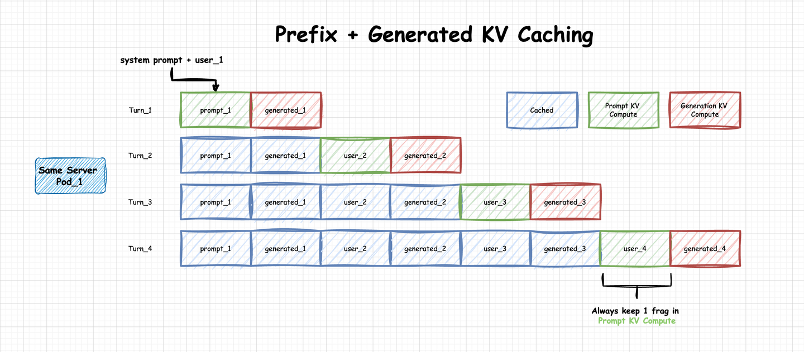
*Prefix + Generated KV Caching*

RadixAttention이 해결하려는 문제가 바로 이것입니다. RadixAttention은 SGLang 논문인 **Efficiently Programming Large Language Models using SGLang**에서 제안되었으며, 목적은 Automatic KV Cache Reuse입니다. 이 글은 RadixAttention에만 집중하고 SGLang의 다른 내용은 다루지 않습니다.

RadixAttention은 prefix tree가 아니라 radix tree를 사용합니다. Radix Tree의 가장 큰 특징은 node가 단일 원소일 수도 있고 가변 길이 sequence일 수도 있다는 점입니다. 구체적으로는 이미 tree 안에 있는 큰 node를 필요할 때 작은 node로 동적으로 split하여 shared prefix 요구를 만족할 수 있습니다. 원리 설명이 지나치게 추상적으로 흐르지 않도록, 논문에 있는 LRU 전략을 포함한 RadixAttention 동작 예시로 설명하겠습니다.

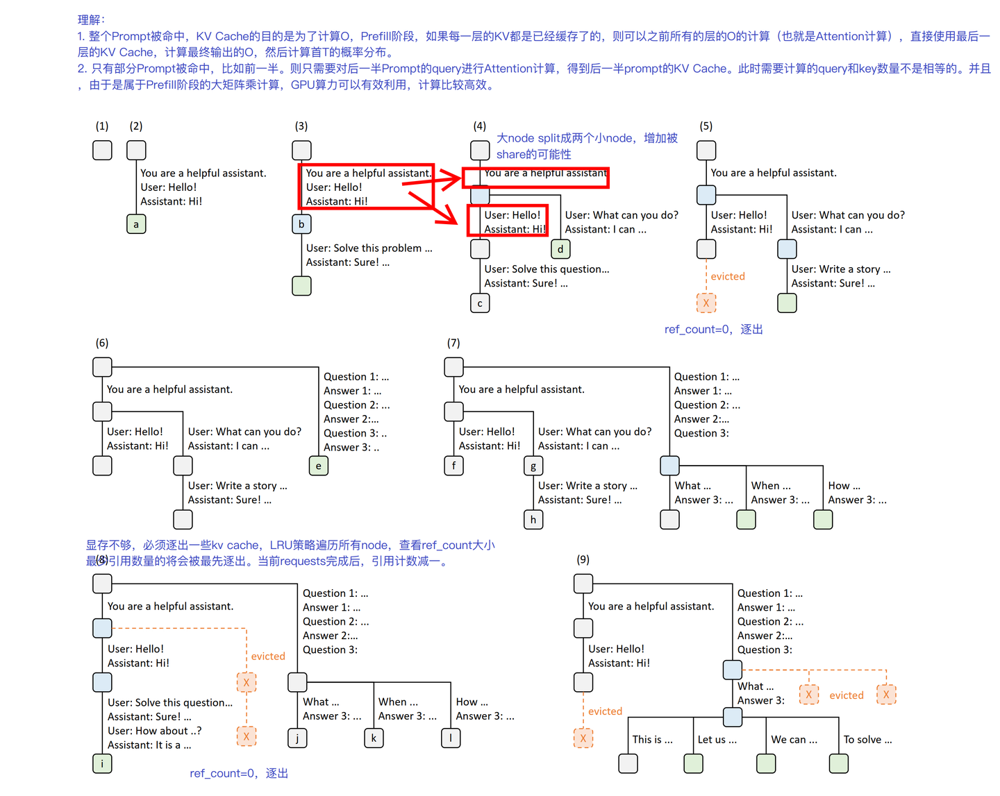
*SGLang RadixAttention*

그림의 (1)~(9)는 Radix Tree의 동적 변화를 나타냅니다. 각 tree edge는 substring 또는 token sequence를 뜻하는 label을 가집니다. node 색은 상태를 나타냅니다. 초록색은 새로 추가된 node, 파란색은 cached node, 빨간색은 evict된 node입니다. 앞의 다섯 단계를 설명하면 다음과 같습니다.

**단계 (1)**에서 Radix Tree는 비어 있습니다. **단계 (2)**에서 서버는 들어온 사용자 메시지 `"Hello"`를 처리하고 LLM 출력 `"Hi"`로 응답합니다. system prompt는 `"You are a helpful assistant"`, user prompt는 `"Hello!"`, LLM 응답은 `"Hi!"`입니다. 전체 대화는 하나의 큰 node로 합쳐져 Radix Tree의 node a에 저장됩니다. **단계 (3)**에서 같은 사용자가 새로운 prompt를 입력하면, 서버는 Radix Tree에서 이전 대화 prefix, 즉 첫 번째 대화 턴을 찾아 KV Cache를 재사용합니다. 새 턴은 tree에 새 node로 붙습니다. **단계 (4)**에서는 새로운 chat session이 시작됩니다. Radix Tree는 (3)의 큰 node b를 두 node로 동적으로 split하여 두 chat session이 system prompt를 공유할 수 있게 합니다. **단계 (5)**에서 두 번째 chat이 계속됩니다. 다만 memory 제한 때문에 (4)의 node c는 제거되어야 하고, 새로운 대화는 새 node d에 cache됩니다.

직관적으로 보면 Radix Tree와 Prefix Tree는 비슷한 점이 많습니다. 주목할 점은 RadixAttention에서는 Prefix뿐 아니라 Generate 단계에서 생성된 KV Cache도 cache된다는 것입니다. 이는 새 request가 KV Cache를 재사용할 가능성을 최대한 높입니다.

### 0x02 vLLM Automatic Prefix Caching: Hash RadixAttention

Prefix Caching 기능은 현재 TensorRT-LLM과 vLLM 모두에서 지원됩니다. 서비스 시작 시 옵션으로 켤 수 있습니다. TensorRT-LLM에서는 `enableBlockReuse=True`를 설정해야 하고, vLLM에서는 `--enable-prefix-caching`을 지정해야 합니다. TensorRT-LLM은 현재 반오픈소스 상태이고 blockManager와 일부 핵심 kernel 코드가 비공개라, 이 글에서는 vLLM의 Prefix Caching 구현을 분석합니다.

vLLM의 Prefix Caching은 RadixAttention 알고리즘을 사용하지만, 물리 KV Block의 고유 식별자로 hash code를 사용합니다. 공학적으로는 더 단순하게 느껴집니다. 여기서는 이 구현을 임시로 **Hash RadixAttention**이라고 부르겠습니다.

vLLM은 `BlockSpaceManagerV1` 클래스로 block allocation을 관리합니다. 아래는 `BlockSpaceManagerV1.allocate` 메서드입니다. 코드를 분석하기 전에 `SequenceGroup` 자료구조를 설명하겠습니다. `SequenceGroup`은 vLLM에서 sampling 구현을 돕기 위해 사용됩니다. group 안의 모든 seq는 같은 prompt를 가집니다. 같은 prompt에서 생성된 서로 다른 sampling 결과라고 이해할 수 있습니다. 가장 단순한 greedy search에서는 group 안에 seq가 하나만 있다고 생각해도 됩니다.

prefix caching을 보면 `enable_caching` branch로 들어가고, `gpu_allocator.allocate`를 호출해 block을 할당합니다. 이 `gpu_allocator.allocate`에는 현재 block의 hash code와 이미 hash 처리된 token 수를 전달해야 합니다.

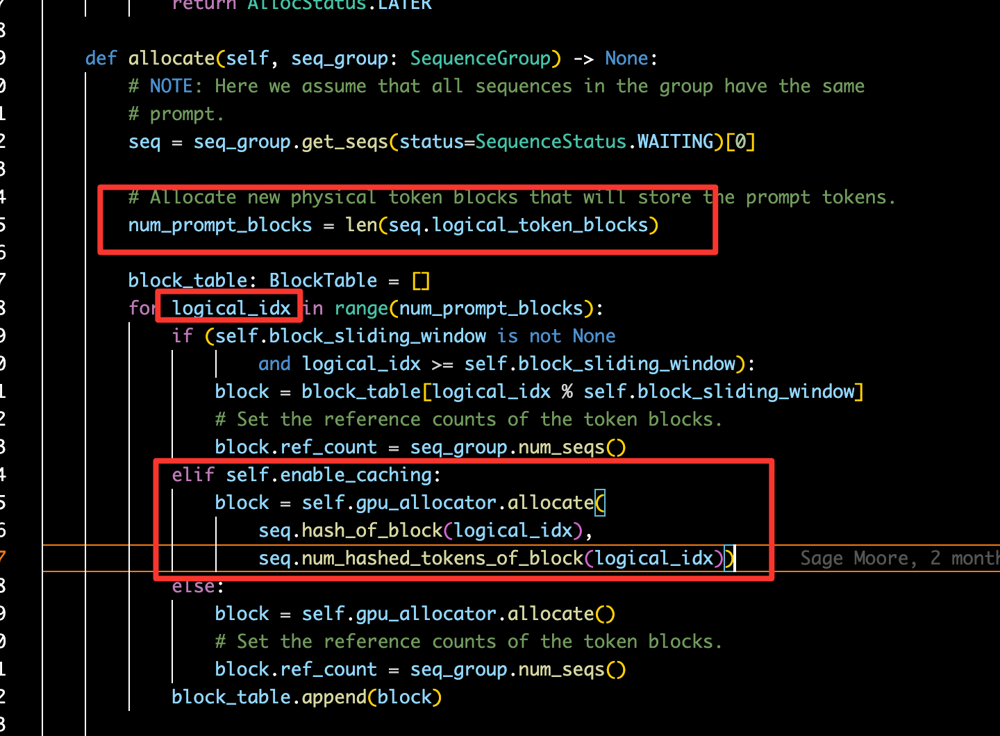
*BlockSpaceManagerV1: allocate*

`hash_of_block` 함수로 들어가 보면, vLLM은 prompt의 `token_ids`를 통해 hash 값을 얻고 이를 cache block의 고유 식별자로 사용합니다. 서로 다른 request의 prompt에서 `logical_idx`가 중복될 수는 있지만, hash 단계에서 사용하는 `token_ids`는 다릅니다. 예를 들어 request A와 B의 prompt 길이는 같지만 내용이 다르다고 합시다. 이때 A와 B의 `num_prompt_blocks`와 `logical_idx`는 같습니다. 그러나 `hash_of_block`에서 실제 hash code 생성에 쓰는 것은 초기 `logical_idx`가 아니라, 이 `logical_idx`와 `block_size`로 얻은 `token_ids`라는 실제 object입니다. 따라서 서로 다른 prompt의 cache block은 고유한 hash code를 얻을 수 있습니다.

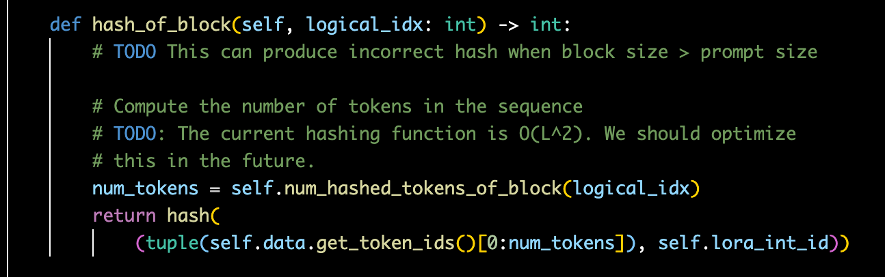
*SequenceGroup: hash_of_block*

### 0x03 vLLM Automatic Prefix Caching: Hash Prefix Tree

이 hash encoding 구현을 자세히 생각해 보면, 모든 현재 block의 hash code가 **이전 모든 block의 token_ids에 의존**한다는 것을 알 수 있습니다. 따라서 이 고유한 hash code는 사실상 **고유한 prefix 관계**를 표현합니다. 이 점은 중요합니다. 고유한 prefix 관계가 보장되어야 Prefix Cache KV Blocks에서 가져온 block sequence가 **같은 context**를 가진다는 것도 보장할 수 있습니다. 이 코드의 논리를 그림으로 표현하면 대략 다음과 같습니다.

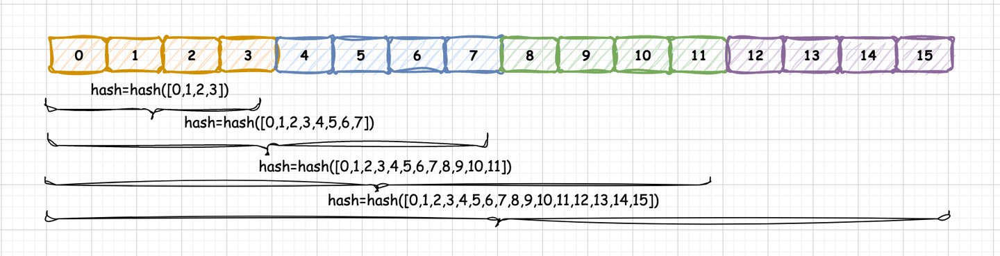
*Prefix Caching Hash Code*

즉 이런 hash encoding 구현은 실제로 **Prefix Tree** 기능을 갖습니다. 이 prefix tree는 `PhysicalTokenBlock` 단위입니다. tree의 각 node는 실제 `PhysicalTokenBlock` 하나를 나타내며, node의 내용은 이 `PhysicalTokenBlock`의 hash code입니다. 이 hash code는 tree root에서 현재 `PhysicalTokenBlock`까지의 고유 경로를 의미합니다. 이해를 돕기 위해 Prefix Caching 구현 그림을 그려 보았습니다. 오류가 있으면 지적 부탁드립니다.

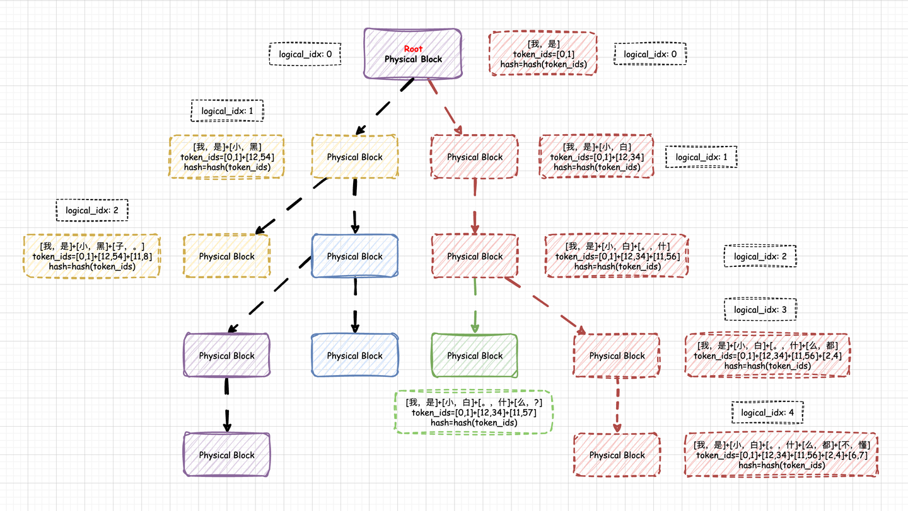
*vLLM Prefix Caching: Hash Prefix Tree*

### 0x04 vLLM Automatic Prefix Caching: Prefix/Generate 단계 Hash 처리

Prefix의 경우 모든 `token_ids`는 inference 전에 이미 알려져 있습니다. 따라서 `token_ids`로 대응되는 block hash code를 얻을 수 있습니다. 문제는 Generate 단계입니다. Generate 단계의 `token_ids`는 아직 생성되지 않았으므로 사전에 알 수 없습니다. 하지만 모순적으로, Generate 단계에서 생성되는 KV Cache를 저장하려면 먼저 block을 할당해야 합니다.

그렇다면 어떻게 해야 할까요? vLLM의 처리는 다음과 같습니다. Generate 단계에 필요한 block에 **먼저 fake hash를 할당하고 generation을 수행한 뒤, 이 block이 생성 token으로 가득 차면 실제 생성된 `token_ids`에 따라 hash code를 갱신합니다.** 구체적인 호출 흐름은 다음과 같습니다.

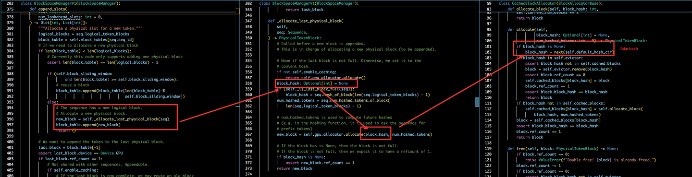
*fake hash 호출 경로*

이미 생성된 `token_ids`에 따라 hash code를 갱신하는 호출 흐름은 다음과 같습니다. `_promote_last_block` 함수는 현재 `logical_token_blocks`(prefix와 generated를 포함)를 바탕으로 `hash_of_block`을 호출해 `new_hash`를 다시 얻고, `gpu_allocator.update_hash` 함수로 last block의 hash code를 갱신합니다.

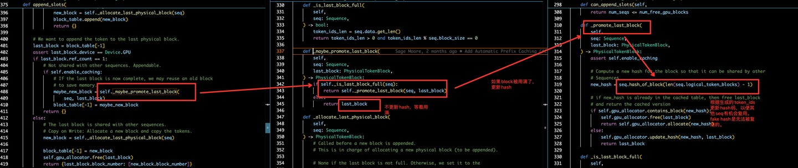
*hash encoding 갱신*

### 0x05 vLLM Automatic Prefix Caching: Prefix + Generated KV Caching

앞의 분석에서 보았듯 RadixAttention 알고리즘의 Prefix Caching은 Prefix와 Generated KV Cache를 모두 포함합니다. Generated KV Cache까지 cache할 수 있다면 다중 턴 대화에서 첫 토큰 지연에 더 큰 이점이 있습니다. 그래서 저도 vLLM 실제 구현이 RadixAttention 알고리즘 설명과 일치하는지 관심이 있었습니다. vLLM 팀에 issue로 문의했고, 답은 yes였습니다. 즉 vLLM의 Prefix Caching 기능은 Prefix Cache만 cache하는 것이 아니라 Generated KV Cache도 cache합니다. 다중 턴 대화 응용에서는 역사적 턴에서 생성된 대화의 recompute를 거의 제거할 수 있습니다. issue 링크는 원문을 참고하면 됩니다.

vLLM에서 `enable_caching`인 경우 실제 사용하는 `gpu_allocator`는 `CachedBlockAllocator`입니다. `BlockSpaceManagerV1`부터 `CachedBlockAllocator`까지의 호출 경로는 대략 아래와 같습니다. 다소 복잡해 보이지만 두 핵심 포인트만 잡으면 vLLM이 구현한 Prefix + Generated KV Caching 기능을 더 쉽게 이해할 수 있습니다.

- 핵심 1: `CachedBlockAllocator`는 **범용 Cache 기능**을 구현합니다. **Prefix 단계인지 Generate 단계인지 구분하지 않고, KV Cache가 생성되기만 하면 먼저 `cached_blocks` table에 cache합니다.** key는 `block_hash`, value는 `block_id`입니다.
- 핵심 2: Prefix 단계든 Generate 단계든 호출하는 interface는 `allocate` 하나뿐입니다.

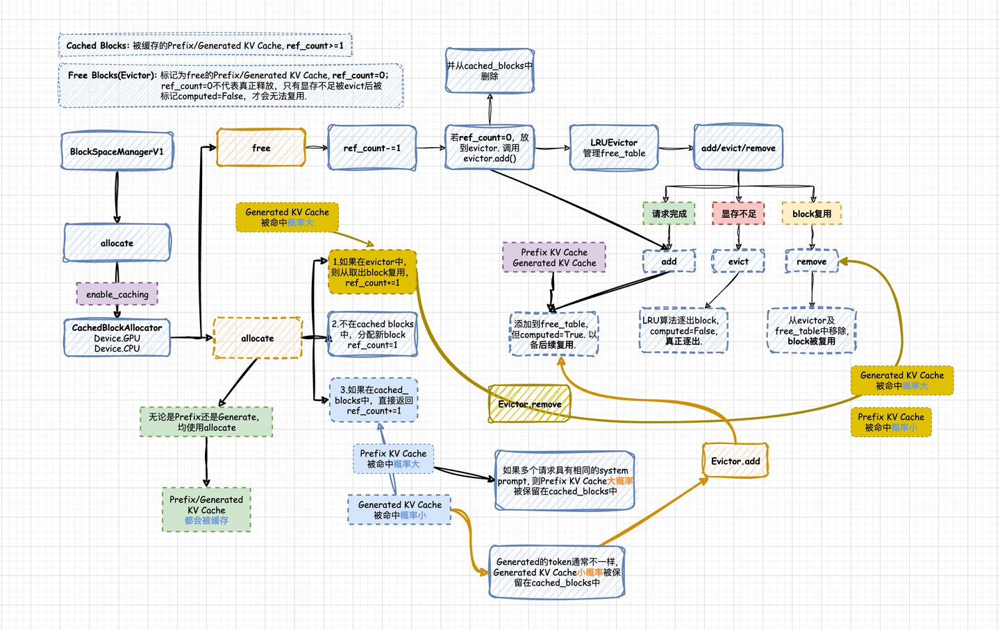
*vLLM CachedBlockAllocator: Prefix + Generated KV Caching*

`CachedBlockAllocator`에는 중요한 개념인 **ref_count**가 있습니다. 이는 block이 참조된 횟수입니다. block의 **ref_count >= 1**이면 block은 `cached_blocks`에 저장됩니다. 반대로 **ref_count = 0**이면 block은 `cached_blocks`에서 제거되고 `evictor.add()`를 통해 `LRUEvictor`의 **free_table**에 추가되어 **진짜 evict되거나 재사용되기를 기다립니다.**

여기서 주의할 점은 **ref_count = 0이 진짜 release를 의미하지 않는다**는 것입니다. GPU memory가 부족해 evict되고 `computed=False`로 표시된 뒤에야 재사용할 수 없게 됩니다. vLLM 소스에서 해당 처리 로직은 다음과 같이 볼 수 있습니다.

**CachedBlockAllocator: allocate**

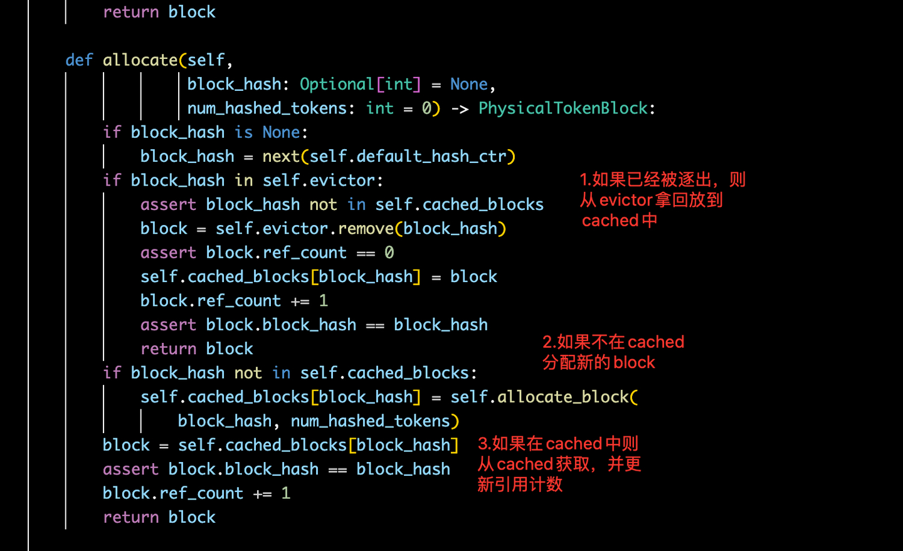
*CachedBlockAllocator: allocate*

위 그림의 세 가지 allocate branch가 실제로 어떤 상황에 대응하는지도 추론해 볼 수 있습니다. 즉 언제 Prefix KV Cache를 hit하고, 언제 Generated KV Cache를 hit하는지입니다.

**(1) evictor 안에 있으면 block을 꺼내 재사용하고 ref_count += 1 합니다.** 이때는 **Generated KV Cache를 hit할 가능성이 더 큽니다.** Generate 단계에서 생성된 tokens는 request마다 거의 다르므로 참조 횟수가 낮은 편이고 보통 1입니다. 요청이 generation을 끝내고 사용자에게 반환되면 해당 KV Blocks의 실제 `ref_count`는 0이 됩니다. 그러면 `CachedBlockAllocator`가 `free` 함수를 호출해 이를 `LRUEvictor`에 넣습니다. 즉 `LRUEvictor.free_table`에는 많은 Generated KV Cache가 저장됩니다. 이 Generated KV Cache들은 이후 hit되어 재사용될 수도 있고, GPU memory 부족 시 실제로 evict될 수도 있습니다.

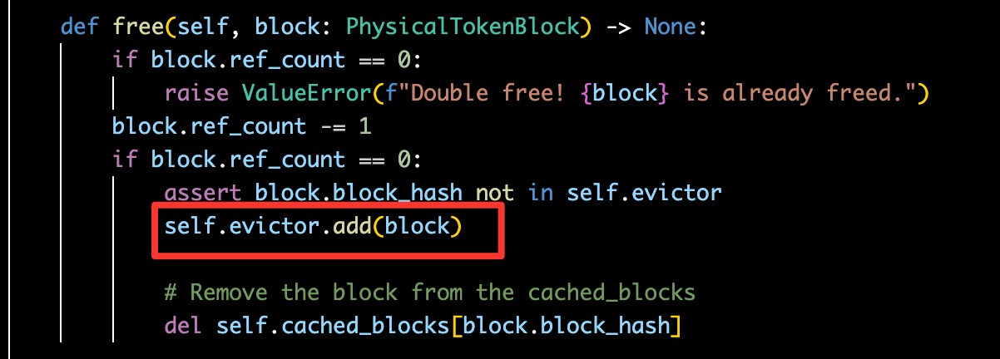
*CachedBlockAllocator: free*

**(2) `cached_blocks`에도 없고 evictor에도 없으면** `allocate_block`을 직접 호출해 새 block을 할당하고 `ref_count`를 1로 설정합니다. 이때는 **Prefix KV Cache도 Generated KV Cache도 hit하지 못한 상황**입니다. 새로 할당된 block은 `cache_blocks` table에 추가되어 새로운 cache가 됩니다.

**(3) `cached_blocks` 안에 있으면** `block_hash`로 대응되는 cached block을 얻고 **ref_count += 1** 합니다. 이때는 **Prefix KV Cache를 hit할 가능성이 더 큽니다.** 특히 여러 request가 같은 system prompt를 갖는 경우, system prompt에 대응되는 Prefix KV Cache는 `ref_count`가 계속 1 이상이므로 `cached_blocks`에 오래 머물고, 같은 system prompt를 가진 request가 hit할 수 있습니다.

**CachedBlockAllocator: LRUEvictor**

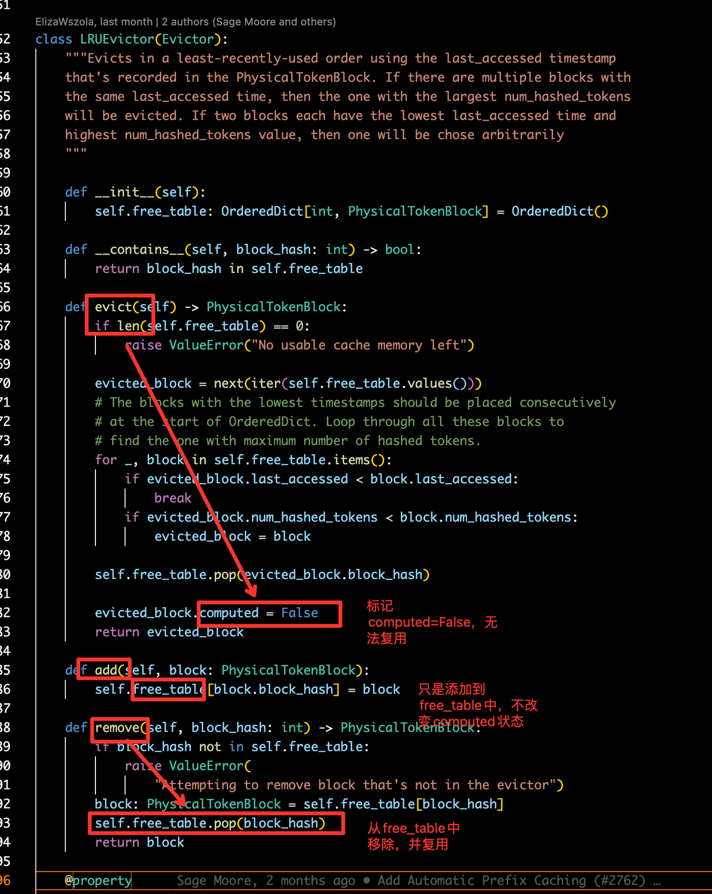
*CachedBlockAllocator: LRUEvictor*

이 부분은 `LRUEvictor` 구현입니다. `LRUEvictor`는 주로 `add`, `remove`, `evict` 세 기능을 제공하고, `free_table` member variable을 가집니다.

**(1) Evictor.add:** 이 함수는 `ref_count`가 0인 block을 `free_table`에 추가해 후속 scheduling을 기다리게 합니다. `free_table` 안의 모든 block은 `computed=True`입니다. 따라서 `Evictor.add()`는 `ref_count=0`인 block을 단순히 기록할 뿐, computed 상태를 완전히 지우지 않습니다. 이는 `free_table`에 기록된 block이 이후 새로운 request에서 hit되어 재사용될 수 있거나(`Evictor.remove`), GPU memory 부족 시 진짜 evict될 수 있음(`Evictor.evict`)을 뜻합니다.

**(2) Evictor.remove:** 전달된 `block_hash`에 따라 대응되는 block을 `free_table`에서 꺼내 재사용합니다.

**(3) Evictor.evict:** 실제 evict를 수행합니다. `free_table`에서 현재 시점과 가장 멀리 떨어진 access time을 가진 block을 evict합니다. `free_table`은 `OrderedDict`를 사용하므로, 먼저 들어간 block이 현재 시점에서 가장 오래된 block이라고 볼 수 있습니다. 만약 다른 block의 `access_time`이 선택된 `evicted_block`보다 작다면, `num_hashed_tokens` 수가 가장 큰 block을 evict합니다. 이는 합리적입니다. `num_hashed_tokens`가 클수록 block이 reuse될 가능성이 낮으므로 더 먼저 evict하는 편이 좋습니다.

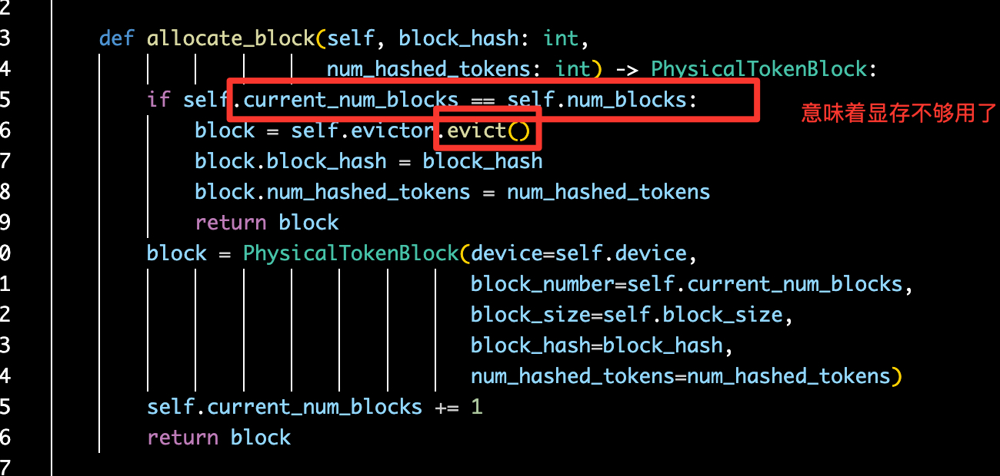
*CachedBlockAllocator: allocate_block*

코드를 분석해 보면 `current_num_blocks == self.num_blocks`는 더 이상 non-computed block을 사용할 수 없다는 뜻입니다. 이때 `evictor.evict()`를 호출해 `free_table`에서 `ref_count=0`인 block 하나를 꺼내 새로운 request에 사용합니다. 아직 사용하지 않은 block이 충분하다면 새 block을 직접 할당하고 `evictor.evict()` 로직을 거치지 않습니다. 다시 강조하지만, `free_table` 안의 block도 사용된 block이며 `computed=True` 상태입니다. 진짜 빈 block이 아닙니다.

### 0x06 vLLM Automatic Prefix Caching: 몇 가지 경계 상황

vLLM Automatic Prefix Caching의 원리와 코드는 거의 설명했습니다. 이제 흥미로운 질문을 생각해 봅니다. 언제 Prefix/Generated KV Cache를 영원히 hit할 수 없을까요? 답은 `block_size` 설정과 last block 처리 로직에 관련됩니다. cache를 hit할 수 없는 경계 상황은 두 가지입니다.

**(1) 먼저 last block의 slots가 가득 차지 않은 경우입니다.** vLLM은 Copy-on-write 전략을 사용합니다. 이런 상황에서 제 이해로는 last block이 서로 다른 seq 사이에서 공유되지 않고, 곧 서로 다른 request 사이에서도 공유되지 않습니다.

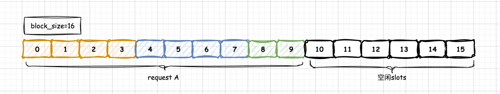
*last block이 가득 차지 않은 경우*

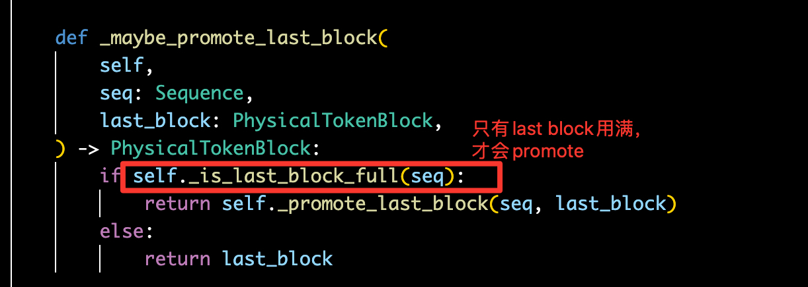
*last block이 가득 찼는지 판단*

last block이 가득 차지 않았기 때문에 **`_is_last_block_full` 결과가 False**입니다. 따라서 **`_promote_last_block`** 함수로 들어가 실제 생성된 `token_ids`에 따라 hash code를 갱신하지 않고 fake hash를 유지합니다. 새 request의 hash code는 block을 최소 단위로 하며, hash 값은 실제 `token_ids`에 의해 결정되므로 fake hash와 같을 수 없습니다. 따라서 이후 request의 cache로 hit될 수 없습니다. 이해가 틀렸다면 지적 부탁드립니다.

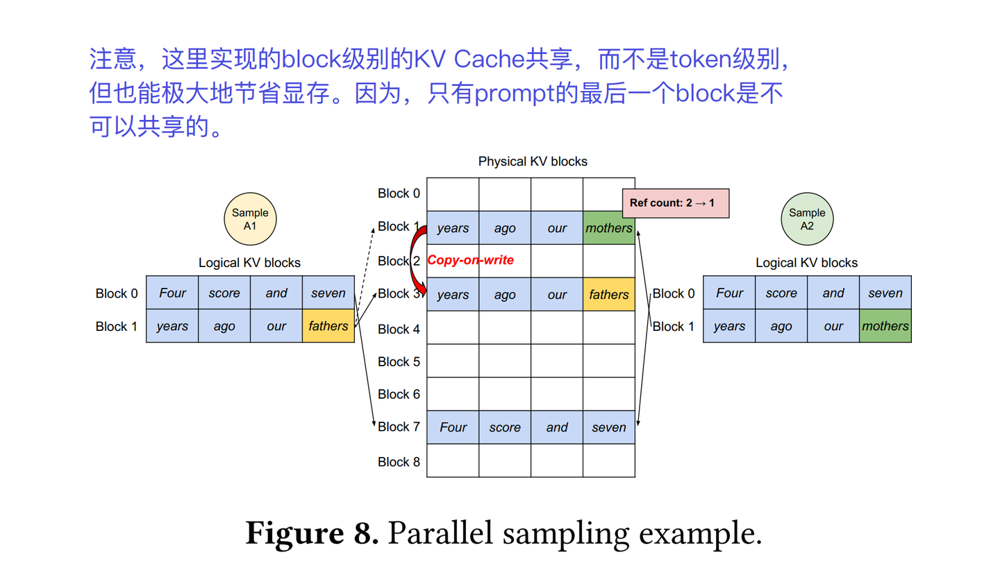
*Copy on write*

**(2) 다음으로 request의 prefix + generated token 수가 block_size보다 작은 경우입니다.** 이때 last block은 first block이기도 하므로 (1)의 이해와 같은 상황이 됩니다. 같은 request가 vLLM에 두 번째로 도착해도 cache hit가 일어나지 않을 것이라 추론할 수 있습니다. 현재 vLLM 소스를 보면 이 문제를 설명하는 듯한 주석도 있습니다.

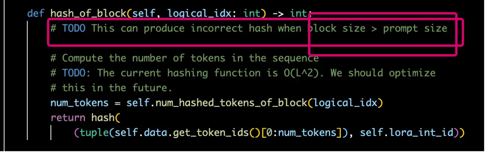

### 0x07 vLLM Automatic Prefix Caching: 다중 턴 대화 적용 분석

Prefix Caching은 긴 system prompt가 있는 장면과 다중 턴 대화 장면에서 큰 활용 가치가 있습니다. 특히 다중 턴 대화에서는 이전 대화 턴이 늘어날수록 새 턴 request의 prefix(prompt)가 점점 길어집니다. 매 턴 512 token을 생성한다고 가정하면 8턴만 지나도 4K 길이에 도달합니다. 따라서 모델 서비스가 prefix caching 기능을 갖고 있으면 첫 토큰 지연을 크게 줄여 사용자 경험을 개선할 수 있습니다.

vLLM의 prefix caching 구현은 Prefix와 Generated KV Cache를 모두 포함합니다. 이제 Prefix만 있는 경우와 Prefix + Generated KV Cache가 모두 있는 경우를 다중 턴 대화에서 비교해 봅니다.

**(1) Prefix Caching만 있는 최적화의 다중 턴 대화 분석.** 아래 그림처럼 Prefix Caching만 있을 때, 매 새 대화 턴에는 prefill 단계에서 계산해야 하는 prompt fragment가 항상 2개 있습니다. 하나는 이전 턴 대화의 출력이고, 다른 하나는 현재 턴 대화의 입력입니다. 이전 턴 대화의 출력은 caching되지 않았으므로 현재 턴의 prefill 단계에서 recompute되어야 합니다. 이 recompute 시간은 이전 턴에서 생성된 token 수에 따라 달라집니다.

Chunk Prefills 논문 **SARATHI: Efficient LLM Inference by Piggybacking Decodes with Chunked Prefills**의 관찰에 따르면, "at small batch sizes, the decode cost per token can be as high as ∼ 200 times the prefill cost per token"입니다. 즉 prefill에서 200 tokens를 계산하는 시간은 generate 단계에서 token 하나를 계산하는 시간과 대략 같습니다. **따라서 이전 턴에서 200 tokens를 생성했다면, 현재 턴 prefill recompute로 늘어나는 시간은 generate 단계에서 token 하나를 더 생성하는 시간과 비슷합니다.**

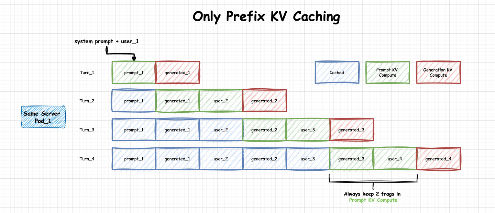
*Only Prefix KV Caching*

**(2) Prefix + Generated KV Caching 최적화의 다중 턴 대화 분석.** Prefix Cache만 cache하는 것과 비교해, vLLM의 Prefix Caching 기능은 Generated KV Cache도 cache합니다. 다중 턴 대화 응용에서는 경계 상황을 제외하면 이전 턴 생성 대화의 recompute를 거의 제거한다고 볼 수 있습니다. 아래 그림처럼 이 경우 각 대화 턴에서 prefill 단계에 계산해야 하는 것은 현재 턴 prompt뿐입니다. 이전 턴의 Prefix + Generated KV Cache는 모두 cache hit됩니다.


*Prefix + Generated KV Caching*

실제 응용에서는 QPS가 비교적 크고 GPU memory가 부족할 때, vLLM이 Prefix + Generated KV Cache 중 일부를 LRU 알고리즘에 따라 evict하여 새로운 request에 필요한 free blocks를 확보합니다. 따라서 vLLM Automatic Prefix Caching 특성을 잘 활용하려면 몇 가지를 고려해야 합니다.

- 각 모델 서비스 instance의 **load balancing**을 최대한 보장해 pending이 생기지 않게 하고, 각 instance에 할당되는 QPS가 너무 높지 않도록 합니다.
- 같은 conversation session의 서로 다른 턴 request는 **가능한 한 같은 모델 서비스 instance로 보내 역사 cache를 충분히 활용**합니다. instance 사이의 KV Cache는 공유되지 않으므로, 같은 conversation session의 multi-turn history cache는 같은 instance에 있을 때만 의미가 있습니다.
- **같거나 유사한 긴 system prompt를 가진 request는 가능한 한 같은 모델 서비스 instance로 보내** 추론합니다.

### 0x08 vLLM Automatic Prefix Caching: Prefix Prefill Kernel과 Attention Kernel의 차이

Prefix Caching을 사용하면 일반 Attention kernel로 Prefill 단계의 attention 결과를 계산할 수 없습니다. 일반 kernel은 암묵적으로 `Q_len == KV_len`이고, 둘 다 `prompt_len`과 같다는 가정을 갖습니다. 하지만 Prefix Caching에서는 이 가정이 성립하지 않습니다. 현재 request의 prompt 중 일부는 cached KV Cache에 hit되어 반복 계산할 필요가 없습니다. 즉 `Q_len < prompt_len`입니다. 반면 각 query는 모든 과거 KV와 Attention을 해야 하므로 `KV_len`은 여전히 `prompt_len`과 같습니다. 따라서 이때는 **Q_len < KV_len = prompt_len**이고, 이를 처리할 새로운 kernel이 필요합니다.

vLLM도 바로 이렇게 처리합니다. 현재 prefix prefill kernel 구현은 `vllm/attention/ops/prefix_prefill.py`에 있습니다. prefix caching을 사용하면 여기에 구현된 Triton 기반 prefix prefill kernel로 들어갑니다.

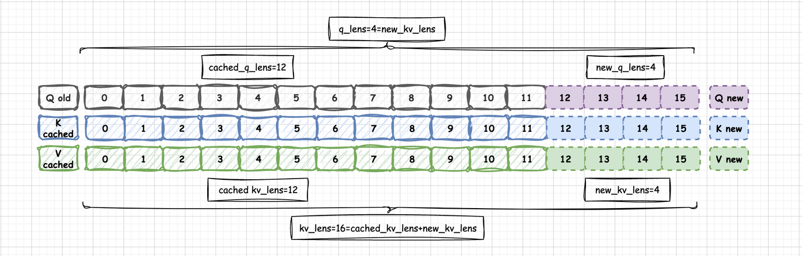
*prefix prefill kernel*

prefix prefill kernel에는 관련 세부 사항이 꽤 많습니다. 여기서는 이 kernel이 해결하는 문제만 간단히 설명했습니다. 이후 별도의 kernel 설명 글에서 자세히 다루겠습니다. 이후 해당 글도 작성했습니다. kernel 부분 분석은 관련 글을 참고해 주세요.

### 0x09 vLLM Automatic Prefix Caching: 적용 실습

vLLM에서 Prefix Caching을 어떻게 켜는지 간단히 보겠습니다. 사용법은 매우 단순합니다.

**오프라인 추론:** `enable_prefix_caching=True`만 지정하면 됩니다. 예시는 `vllm/bechmark_prefix_caching.py`에서 가져왔습니다.

```python
import time
from vllm import LLM, SamplingParams
PROMPT = "You are a helpful assistant in recognizes the content of tables in markdown format. Here is a table as fellows. You need to answer my question about the table.\n# Table\n|Opening|Opening|Sl. No.|Film|Cast|Director|Music Director|Notes|\n|----|----|----|----|----|----|----|----|\n|J A N|9|1|Agni Pushpam|Jayabharathi, Kamalahasan|Jeassy|M. K. Arjunan||\n|J A N|16|2|Priyamvada|Mohan Sharma, Lakshmi, KPAC Lalitha|K. S. Sethumadhavan|V. Dakshinamoorthy||\n|J A N|23|3|Yakshagaanam|Madhu, Sheela|Sheela|M. S. Viswanathan||\n|J A N|30|4|Paalkkadal|Sheela, Sharada|T. K. Prasad|A. T. Ummer||\n|F E B|5|5|Amma|Madhu, Srividya|M. Krishnan Nair|M. K. Arjunan||\n|F E B|13|6|Appooppan|Thikkurissi Sukumaran Nair, Kamal Haasan|P. Bhaskaran|M. S. Baburaj||\n|F E B|20|7|Srishti|Chowalloor Krishnankutty, Ravi Alummoodu|K. T. Muhammad|M. S. Baburaj||\n|F E B|20|8|Vanadevatha|Prem Nazir, Madhubala|Yusufali Kechery|G. Devarajan||\n|F E B|27|9|Samasya|Madhu, Kamalahaasan|K. Thankappan|Shyam||\n|F E B|27|10|Yudhabhoomi|K. P. Ummer, Vidhubala|Crossbelt Mani|R. K. Shekhar||\n|M A R|5|11|Seemantha Puthran|Prem Nazir, Jayabharathi|A. B. Raj|M. K. Arjunan||\n|M A R|12|12|Swapnadanam|Rani Chandra, Dr. Mohandas|K. G. George|Bhaskar Chandavarkar||\n|M A R|19|13|Thulavarsham|Prem Nazir, sreedevi, Sudheer|N. Sankaran Nair|V. Dakshinamoorthy||\n|M A R|20|14|Aruthu|Kaviyoor Ponnamma, Kamalahasan|Ravi|G. Devarajan||\n|M A R|26|15|Swimming Pool|Kamal Haasan, M. G. Soman|J. Sasikumar|M. K. Arjunan||\n\n# Question\nWhat' s the content in the (1,1) cells\n"  # noqa: E501

def test_prefix(llm=None, sampling_params=None, prompts=None):
    start_time = time.time()
    llm.generate(prompts, sampling_params=sampling_params)
    end_time = time.time()
    print(f"cost time {end_time - start_time}")

def main(args):
    llm = LLM(model="baichuan-inc/Baichuan2-13B-Chat",
              tokenizer_mode='auto',
              trust_remote_code=True,
              enforce_eager=True,
              tensor_parallel_size=2,
              enable_prefix_caching=True)

    num_prompts = 100
    prompts = [PROMPT] * num_prompts
    sampling_params = SamplingParams(temperature=0, max_tokens=10)
    print("------warm up------")
    test_prefix(llm=llm,prompts=prompts,sampling_params=sampling_params)
    print("------start generating------")
    test_prefix(llm=llm,prompts=prompts,sampling_params=sampling_params,)
```

**온라인 서비스화:** 서비스 시작 시 `--enable-prefix-caching`만 추가하면 됩니다.

```bash
python3 -m vllm.entrypoints.openai.api_server \
    --model Qwen/Qwen1.5-72B-Chat \
    --tensor-parallel-size 8 \
    --trust-remote-code \
    --enable-prefix-caching \  # vLLM Automatic Prefix Caching 활성화
    --enforce-eager \
    --gpu-memory-utilization 0.9
```

### 0x0a Prefix Caching 최적화 관련 다른 논문

Prefix Caching 최적화 아이디어가 SGLang RadixAttention과 vLLM 구현에만 있는 것은 아닙니다. 같은 시기의 논문으로 Prompt Cache, Share Prefixes, ChunkAttention 등이 있습니다. 다만 이 논문들은 모두 Prefix 자체에만 집중합니다. 즉 "Only Prefix Caching" 상황에 속합니다. 여전히 참고 가치가 있지만 범용성에서는 SGLang RadixAttention과 vLLM의 Hash 버전 RadixAttention 구현만큼 좋지는 않다고 봅니다.

개인적으로는 vLLM Hash RadixAttention 구현을 더 좋아합니다. token_ids로 hash code를 구성하는 방식이 영리합니다. 이렇게 구성한 hash code는 동시에 prefix tree 기능을 가지며, Prefix/Generated KV Caching에서 context 의미의 유일성과 정확성을 보장합니다.

**Prompt Cache**

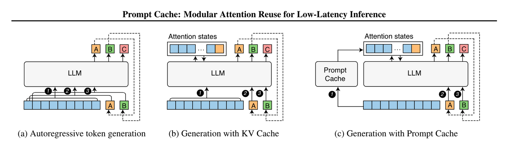
*Prompt Cache*

**Shared Prefixes**

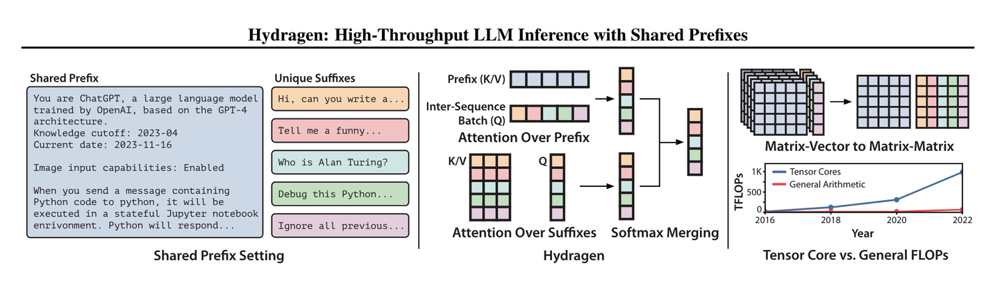
*Shared Prefixes*

**ChunkAttention**

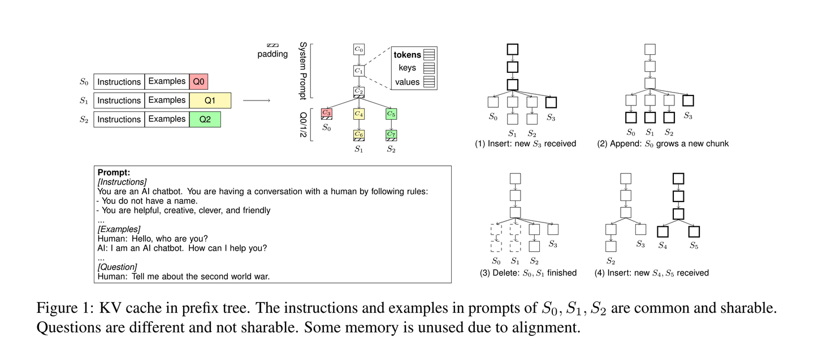
*ChunkAttention*

- **Prompt Cache**: Modular Attention Reuse for Low-Latency Inference(@yale.edu)
- **Cache Similarity**: Efficient Prompt Caching via Embedding Similarity(@UC Berkeley)
- **Shared Prefixes**: Hydragen: High-Throughput LLM Inference with Shared Prefixes(@Stanford University)
- **ChunkAttention**: ChunkAttention: Efficient Self-Attention with Prefix-Aware KV Cache and Two-Phase Partition(@microsoft.com)

더 많은 KV Cache 최적화 관련 논문 자료는 제가 정리한 Awesome LLM Inference 저장소를 참고해 주세요.


### 0x0b 정리

이 글에서는 SGLang RadixAttention 원리를 설명하고, 도해와 코드를 함께 보며 vLLM의 Hash RadixAttention 구현을 자세히 분석했습니다. vLLM의 Hash RadixAttention 내용은 Hash RadixAttention, Hash Prefix Tree, Prefix/Generate 단계 Hash 처리, Prefix + Generated KV Caching scheduling 로직, 경계 상황 분석, vLLM Automatic Prefix Caching의 다중 턴 대화 적용 분석, 코드 적용 실습을 포함합니다.

오타는 먼저 올린 뒤 계속 수정하겠습니다.
