# 원리편: Online-Softmax에서 FlashAttention V1/V2/V3까지

> 원문: https://zhuanlan.zhihu.com/p/668888063

**목차**
- 0x00 머리말
- 0x01 Standard Self-Attention
- 0x02 (Safe) Softmax: 3-pass
- 0x03 Online Softmax: 2-pass
- 0x04 FlashAttention V1
- 0x05 FlashAttention V2
- 0x06 Analysis: FlashAttention의 IO 복잡도
- 0x07 분산 학습/추론에서 FlashAttention 사용
- 0x08 Memory-Efficient Attention
- 0x09 FlashAttention의 MQA/GQA·Causal Mask 처리
- 0x0a 번외: FlashDecoding / FlashDecoding++
- 0x0b FlashAttention V3: V2보다 빠르고 Hopper FP8 지원
- 0x0c 정리

## 0x00 머리말

**보너스.** FlashAttention-2의 핵심인 **Split Q** 기법을 이해하기 위해 **Tensor Cores MMA PTX**로 FlashAttention-1 **Split-KV**와 FlashAttention-2 Split-Q를 짜서 성능을 비교했다. FlashAttention 공식 코드와 비교할 수도 있지만 여기서는 MMA로 다시 작성했다. 순수히 Write for Fun.

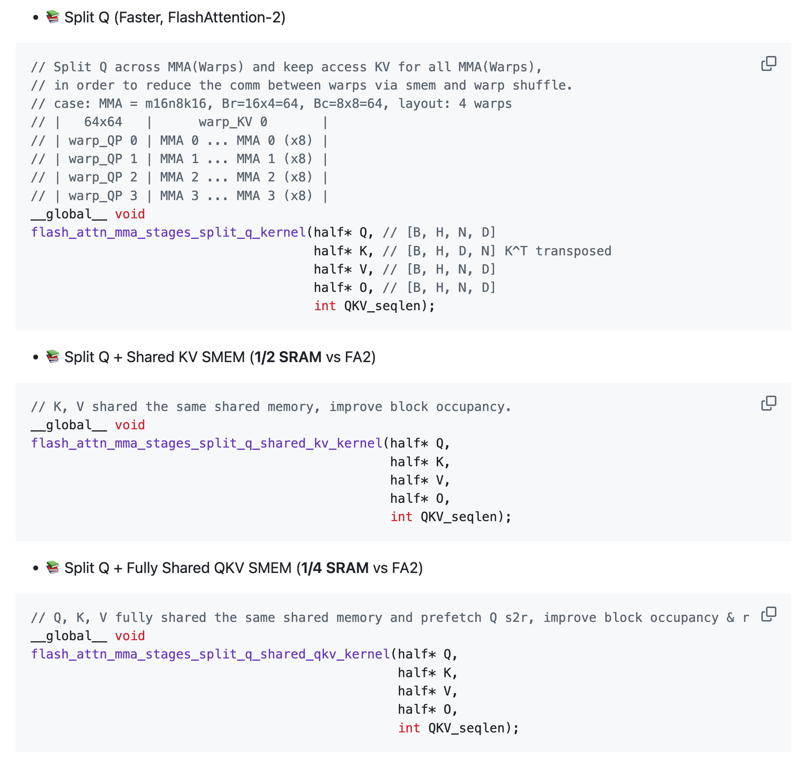
*Split Q + Fully Shared QKV SMEM*

일부 카드에서는 Split-Q가 15%~20%의 성능 향상을 가져온다. 이외에도 더 많은 최적화를 시도했다. QKV를 공유 메모리에 묶는 방향으로 **Shared KV SMEM**과 **Fully Shared QKV SMEM**도 만들었다. 더 나아가 Split-Q 전제 아래 Headdim ≤ 128인 경우 **Prefetch Q s2r** 전략을 구현해 Q SMEM에 대한 block의 IO Access를 직접 줄였다. 특히 Headdim ≤ 64에서 추가 성능 향상이 있었다. 일부 카드(예: NVIDIA RTX 3080 Laptop, 내 구형 컴퓨터에 달린 카드)에서는 **SMEM/Block Swizzle을 통한 Bank conflict와 L2 Cache hit rate 최적화가 아직 없는 상태**에서도 FA2보다 꽤 빠르다(FA2가 consumer 카드용으로 최적화돼 있지 않은 영향으로 추정).

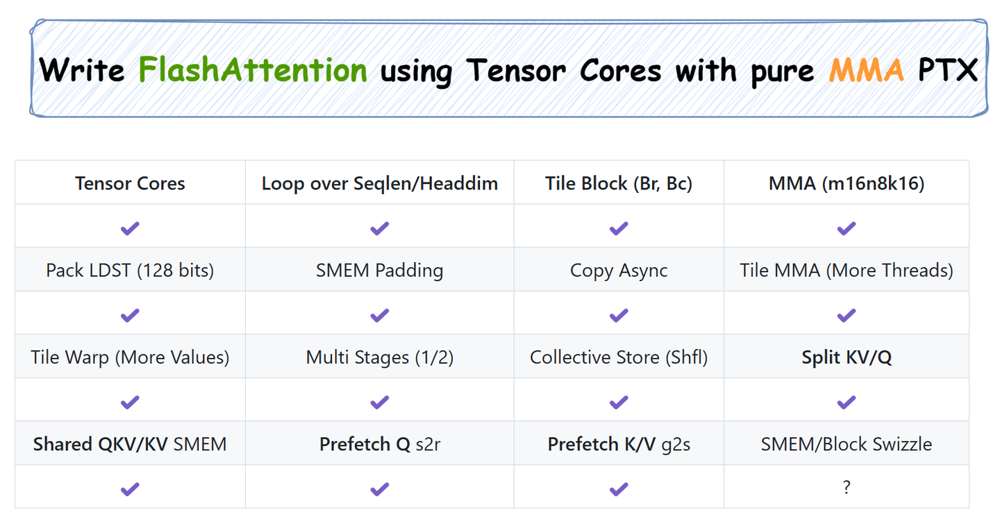
*현재 지원하는 최적화 전략*

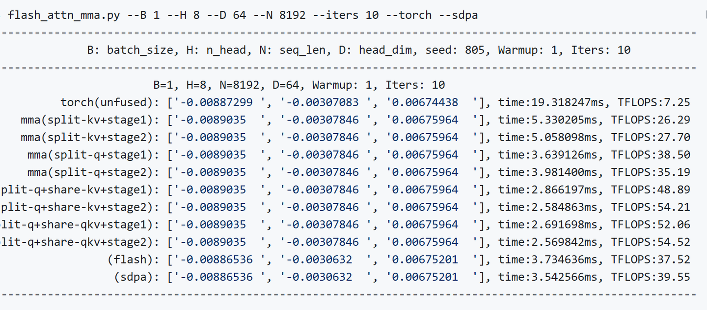
*torch unfused MHA 대비 8~10x*

코드는 아래 링크. star 환영(가까운 시일 안에 코드 해설 글을 따로 쓸 예정이다).

저자의 더 많은 기술 노트와 CUDA 학습 노트는 LeetCUDA(CUDA Learn Notes with PyTorch)에서 확인할 수 있다. LeetCUDA에는 LLM/VLM 글 정리와 FlashAttention, SGEMM, HGEMM, GEMV 같은 대표 CUDA kernel 예제 구현이 포함되어 있고, 누적 3k+ stars를 기록 중이다. 링크: https://github.com/xlite-dev/LeetCUDA

본 글은 원리 분석과 도해로 FlashAttention 시리즈 알고리즘을 풀어낸다. FlashAttention V1/V2는 LLM 영역에서 이미 매우 널리 쓰이고, 관련 논문도 여러 번 정독할 가치가 있다. FA1, FA2 논문 모두 추천한다(FA2 논문에는 공식 오류가 적지 않으니 주의).

본 글은 약 2.1만 자로, 다음을 다룬다.

- 0x01 Standard Self-Attention
- 0x02 (Safe) Softmax: 3-pass
- 0x03 Online Softmax: 2-pass
- 0x04 FlashAttention V1
- 0x05 FlashAttention V2
- 0x06 FlashAttention의 IO 복잡도 분석
- 0x07 분산 학습/추론에서 FlashAttention 사용
- 0x08 Memory-Efficient Attention
- 0x09 FlashAttention의 MQA/GQA·Causal Mask 처리
- 0x0a 번외: FlashDecoding / FlashDecoding++
- 0x0b FlashAttention V3
- 0x0c 정리

FlashAttention 입문에는 「From Online Softmax to FlashAttention」 수고(手稿)를 강력 추천한다.

본 글은 FlashAttention 논문을 읽으며 정리한 노트이며, 새로운 견해를 추구하기보다 옛것을 되짚는 데 무게가 있다. 주로 참고한 논문은 아래와 같다. Online Softmax 관점에서 FlashAttention을 이해한 뒤 디테일을 다듬어 가는 순서로 읽기를 권한다(논문 링크는 글 말미 참고).

- From Online Softmax to FlashAttention [1]
- FlashAttention: Fast and Memory-Efficient Exact Attention with IO-Awareness [2]
- FlashAttention-2: Faster Attention with Better Parallelism and Work Partitioning [3]
- The I/O Complexity of Attention, or How Optimal is Flash Attention? [4]
- A Case Study in CUDA Kernel Fusion: Implementing FlashAttention-2 on NVIDIA Hopper Architecture using CUTLASS [5]
- Megatron-LM [6]

FA1/2 논문은 반복해서 읽을 가치가 있다. FA2 논문이 직관적으로 잡힐 만큼 잘 정리되어 있지만, 많은 디테일의 증명은 FA1에 있다. 예컨대 IO 복잡도 계산을 놓치면 **왜 FA가 지금도 큰 headdim을 지원하지 못하는지**(headdim > 256) 잘 안 잡힌다. 그래서 FA1 논문 정독도 추천한다. 개인적으로는 FA1과 FA2를 하나의 완전한 논문으로 보는 편이 좋다(게다가 FA2에 잘못된 공식이 적지 않아 FA1과 대조하며 읽으면 함정에 덜 빠진다).


*Attention 최적화 발전 개요*

## 0x01 Standard Self-Attention

표기 편의를 위해 Attention Mask와 Scale을 생략한 표준 Self-Attention 식:

```
O = softmax(Q Kᵀ) V
```

Q, K, V, O는 2D 행렬로 shape는 (N, d)이다. N은 seqlen, d는 headdim. MultiHeadAttention의 각 head는 동일한 계산 로직을 따르므로 단일 head 기준으로만 설명한다. 식을 풀면 3-pass Self-Attention이 된다.

```
S = Q Kᵀ          (N × N)
P = softmax(S)    (N × N)
O = P V           (N × d)
```

QKᵀ로 각 query와 모든 key의 내적을 얻는다. Q, K, V가 layernorm을 거쳤다고 가정하면 직관적으로 내적이 클수록 어떤 Q row와 어떤 Kᵀ column의 상관성이 크다. 3-pass에서 1, 2단계는 중간 행렬 S와 P를 만들며, 메모리 수요는 모두 O(N²), HBM IO Access 수요는 O(Nd + N²) [2]이다. 따라서 이 원시 구현은 seqlen(N)이 커지면 메모리 폭발과 동시에 HBM access 부담이 급증한다.

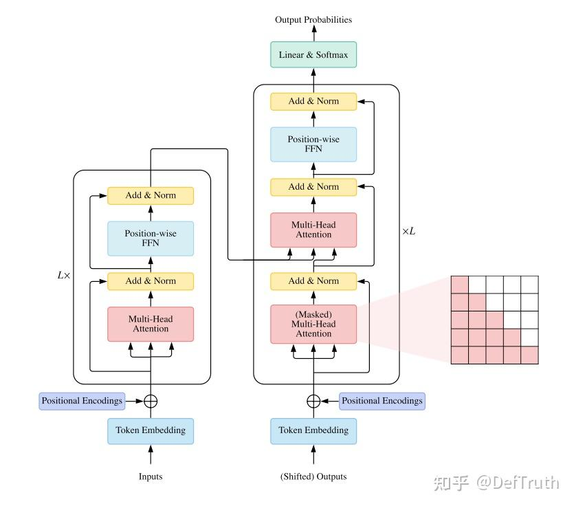
*Transformer Multi-Head Attention (출처: xformers)*

Attention은 Transformer의 표준 구성요소다. 흔한 변형으로 MHA, Mask MHA, Cross Attention, MQA, GQA 등이 있다. 대부분의 LLM과 Stable Diffusion 류 모델이 Transformer 기반이므로 Transformer 학습/추론 성능 최적화 기법도 많이 등장했다. 그중 Attention의 연산·메모리 효율 최적화가 가장 중요한 축이고, FlashAttention은 그 중심에 있는 알고리즘이다. 최근 내가 좋아하는 알고리즘 중 하나다. FlashAttention은 중간 S, P 행렬을 보관하지 않고, Attention 전체를 단일 CUDA Kernel로 fuse한다. forward는 Tiling, backward는 Recompute를 사용한다. 특히 forward의 tiling은 online-softmax의 자연스러운 연장으로 볼 수 있다.

행렬 곱은 분할 가능하며 누적 합산이 가능하다는 점은 알려진 사실이다. 큰 matmul은 Tiling으로 chip 상에서 처리 가능한 작은 matmul로 나눈 뒤, 분할 행렬 곱 결과들을 누적해 최종 결과를 얻는다.

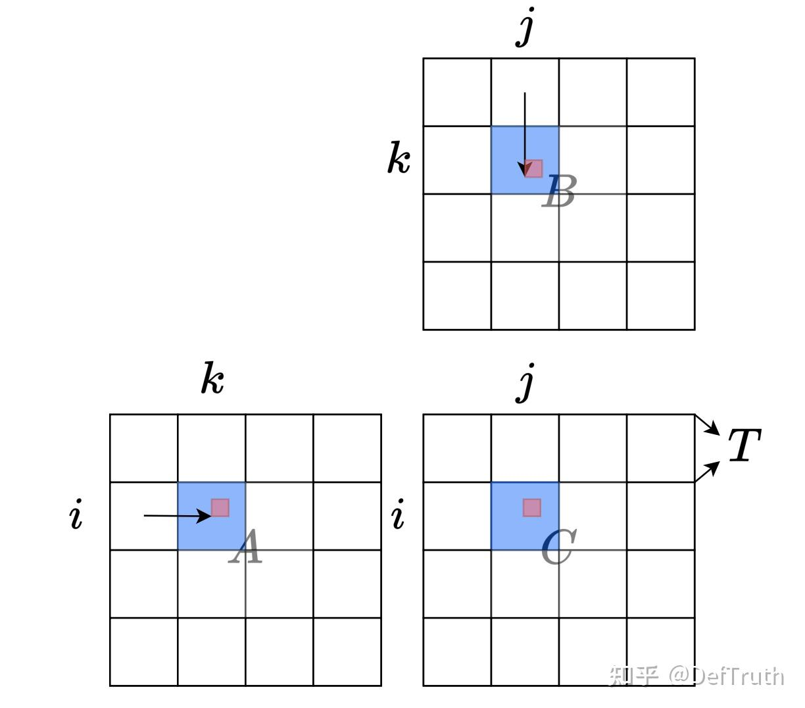
*행렬 분할 계산*

아쉽게도 Attention의 Softmax 계산은 그런 누적 특성이 없다. 분모가 전역에 의존하기 때문이다. FlashAttention과 online softmax가 풀고자 하는 핵심 문제는 알고리즘 자체를 이 전역 의존에서 떼어내는 것이다. 그래야 Tiling을 통해 chip 상 빠른 계산이 가능해진다. 결과적으로 원시 3-pass에 비해 online-softmax는 2-pass, FlashAttention은 1-pass다.

## 0x02 (Safe) Softmax: 3-pass

safe softmax부터. 원리는 단순하다. 원시 softmax에서 max를 먼저 빼서 계산 도중 수치 오버플로우를 막는다(예: float16은 최댓값 65536, 지수항 > 11이면 오버플로우). 원시 softmax:

```
softmax({x₁, ..., x_N}) = { eˣⁱ / Σⱼ eˣʲ }, i=1..N
```

safe-softmax는 다음과 같이 m을 빼서 x_i − m ≤ 0이 되므로 softmax 계산에서 오버플로우가 발생하지 않는다.

```
safe-softmax = eˣⁱ / Σⱼ eˣʲ
             = e^(xᵢ−m) / Σⱼ e^(xⱼ−m),   m = maxⱼ xⱼ
```

### Algorithm: 3-pass safe softmax

엔지니어링적으로는 [1]의 아래 알고리즘으로 구현한다.

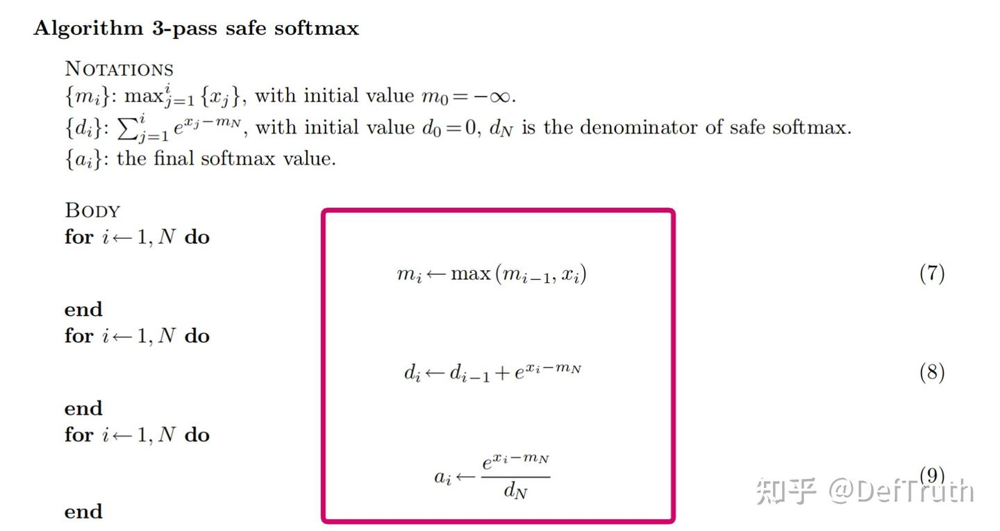
*Algorithm 3-pass safe softmax*

이 알고리즘은 [1, N]을 3번 반복한다. Transformer Self-Attention에서 x는 Q·Kᵀ에서 계산된 pre-softmax logit이다. pre-softmax logit을 담을 만큼 큰 SRAM이 없다면(O(N²) 필요), Q, K를 3번 읽고 x를 실시간으로 재계산해야 한다. 메모리 IO 관점에서 매우 비효율적이다.

## 0x03 Online Softmax: 2-pass

위 알고리즘의 (7), (8), (9)를 하나의 계산으로 fuse해 전역 메모리 접근을 3회에서 1회로 줄일 수 있을까? 안타깝게도 (7)과 (8)을 그대로 합칠 수는 없다. (8)이 m_N에 의존하기 때문이다. m_N은 (7)의 loop가 끝나야 알 수 있다.

그렇다면 (8)이 m_N에 의존하지 않도록 할 방법이 있을까? 식의 모습이 "현재 step이 이전 step에 의존"하는 수학적 귀납의 전형 같다. d_i와 d_{i-1} 사이에 m_N에 의존하지 않는 점화식이 가능하다면

```
d'_i ← d'_{i-1} · e^(m_{i-1} − m_i) + e^(xᵢ − m_i)
```

처럼 (7)과 (8)을 같은 loop로 합칠 수 있다. From Online Softmax to FlashAttention [1]에 따르면 그런 방법이 존재한다. d_i와 d_{i-1} 사이에는 m_N에 의존하지 않는 점화 관계가 없지만, 우회해서 d'_i와 d'_{i-1} 사이의 점화 관계는 만들 수 있다. d'_i를 다음으로 정의한다.

```
d'_i := Σⱼ₌₁..i e^(xⱼ − m_i)
```

d'_i는 중요한 성질을 갖는다. [1, N]에서 i=N일 때

```
d_N = d'_N := Σⱼ₌₁..N e^(xⱼ − m_N)
```

d'_i와 d'_{i-1}의 점화 관계는 다음과 같다.

```
d'_i = Σⱼ₌₁..i e^(xⱼ − m_i)
     = (Σⱼ₌₁..i-1 e^(xⱼ − m_i)) + e^(xᵢ − m_i)
     = (Σⱼ₌₁..i-1 e^(xⱼ − m_{i-1})) · e^(m_{i-1} − m_i) + e^(xᵢ − m_i)
     = d'_{i-1} · e^(m_{i-1} − m_i) + e^(xᵢ − m_i)
```

훌륭하다. d'_i와 d'_{i-1}의 점화 관계가 m_{i-1}, m_i에만 의존한다. 그래서 d'_i와 m_i 계산을 같은 loop에 둘 수 있고, 이 loop가 i=N에 도달하면 d'_N(=d_N)을 얻는다.

### Algorithm: 2-pass online softmax

위 유도를 구현으로 옮기면 2-pass online-softmax가 된다.

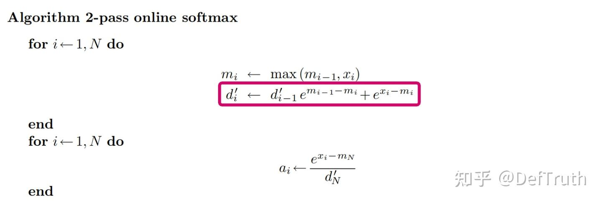
*Algorithm 2-pass online softmax*

(7)과 (8)이 같은 loop 안에 들어왔다. 그러면 2-pass가 3-pass 대비 어떤 이점이 있는가? FLOPs는 줄지 않고, 오히려 매번 추가 scale(d'_{i-1} · e^(m_{i-1} − m_i))을 계산하니 살짝 늘었다. 이 점이 중요하니 한 번 짚는다. 다음 가정을 기억하자.

> x값(pre-softmax logits)은 O(N²) 메모리가 필요해 SRAM에 못 담는다. 따라서:
> 1. x를 미리 계산해 전역 메모리에 저장 → O(N²) 메모리, 폭발 위험
> 2. 알고리즘에서 online으로 계산 → 매 iteration마다 Q, K 일부를 chip으로 load해 x를 다시 계산

Attention 최적화 목표는 1번을 피하고 메모리를 최대한 절약하는 것이다. 그래야 LLM이 100K 이상 long context를 다룰 수 있다. 2번은 중간 행렬 x를 안 저장해 메모리를 절약하지만 계산은 줄지 않고 HBM IO Access는 늘어난다(Q, K를 반복 load). 이 상황에서 2-pass는 3-pass 대비 전체 Q, K load를 한 번 줄이고 x_i online recompute를 한 번 줄인다. 2-pass의 첫 pass에서 x_i가 두 계산에 공유되기 때문이다. online-softmax류 알고리즘을 Attention에 적용한 것이 Memory Efficient Attention이다(FlashAttention과는 다르다).

## 0x04 FlashAttention V1

이번 절부터 FlashAttention로 들어간다. 2-pass online softmax에 이어, 1-pass online softmax가 가능할까? 안타깝게도 safe softmax에는 1-pass 알고리즘이 없다 [1]. 그러나! Attention의 목표는 softmax 자체가 아니라 최종 O이다.

```
O = softmax(Q Kᵀ) V
```

softmax는 1-pass가 안 되더라도 Attention은 가능하다. 그것이 FlashAttention이다. 먼저 원시 Multi-pass Self-Attention의 엔지니어링 알고리즘을 보자.

### Algorithm: Multi-pass Self-Attention

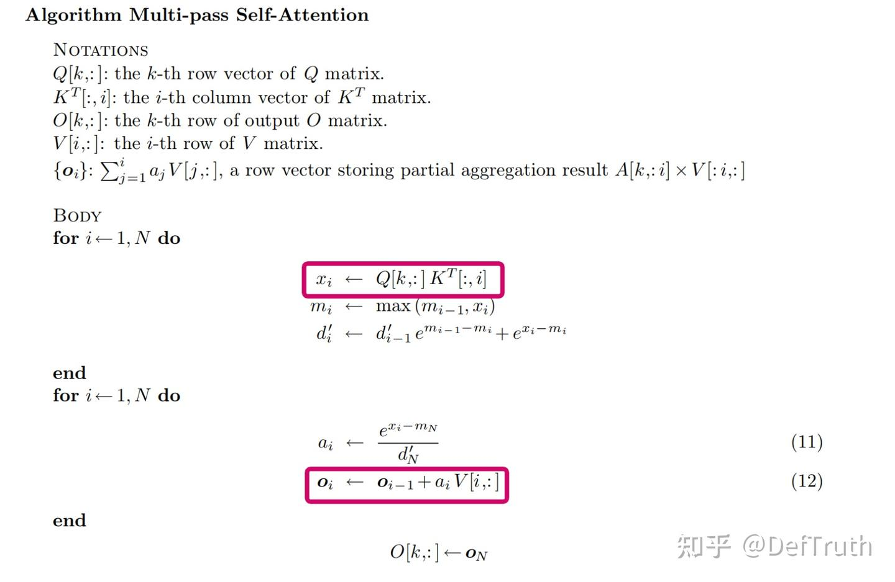
*Algorithm Multi-pass Self-Attention*

2-pass online softmax 위에 얹은 2-pass FlashAttention 알고리즘이다. 첫 loop는 2-pass online-softmax의 식을 그대로 쓰며, x_i 계산이 추가된 정도다.

```
x_i ← Q[k, :] · Kᵀ[:, i]
m_i ← max(m_{i-1}, x_i)
d'_i ← d'_{i-1} · e^(m_{i-1} − m_i) + e^(xᵢ − m_i)
```

두 번째 loop에서는 확률값과 현재 iteration의 o_i를 계산한다.

```
a_i ← e^(xᵢ − m_N) / d'_N
o_i ← o_{i-1} + a_i · V[i, :]
```

2-pass online softmax 대비 두 번째 loop에 `o_i ← o_{i-1} + a_i · V[i, :]`이 더해졌다. 이것이 Multi-Pass FlashAttention이다. `o_i ← o_{i-1} + a_i · V[i, :]`는 `d_i ← d_{i-1} + e^(xᵢ − m_N)`과 같은 꼴이다. o_i는 m_N에 의존하므로 첫 loop와는 합쳐지지 않는다. 첫 loop가 끝나 m_N이 확정된 뒤에야 가능하다.

```
o_i ← o_{i-1} + (e^(xᵢ − m_N) / d'_N) · V[i, :]
```

2-pass online softmax 유도처럼, o_i와 o_{i-1}의 m_N에 의존하지 않는 점화 관계도 가능한가?

### Algorithm: 1-pass FlashAttention

2-pass FlashAttention과 online-softmax 유도를 따라 1-pass 버전을 만들어 보자. o'_i를 다음으로 정의한다.

```
o'_i := Σⱼ₌₁..i ( e^(xⱼ − m_i) / d'_i ) · V[j, :]
```

이때

```
o'_N = o_N := Σⱼ₌₁..N ( e^(xⱼ − m_N) / d'_N ) · V[j, :]
```

o'_i와 o'_{i-1}의 점화 관계는:

```
o'_i = Σⱼ₌₁..i ( e^(xⱼ − m_i) / d'_i ) · V[j, :]
     = (Σⱼ₌₁..i-1 ...) + ( e^(xᵢ − m_i) / d'_i ) · V[i, :]
     = o'_{i-1} · ( d'_{i-1} · e^(m_{i-1} − m_i) / d'_i ) + ( e^(xᵢ − m_i) / d'_i ) · V[i, :]
```

o'_i와 o'_{i-1}의 점화 관계가 d'_i, d'_{i-1}, m_i, m_{i-1}, x_i에만 의존하고 m_N에는 의존하지 않는다. 그래서 두 번째 loop의 계산을 첫 번째 loop에 완전히 통합할 수 있다. 1-pass FlashAttention이다.

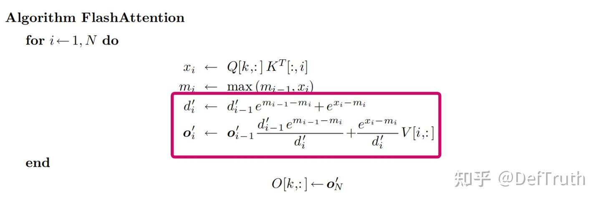
*Algorithm 1-pass FlashAttention*

여기에 Q, K Tiling을 더하면 분할 Tiling 버전의 FlashAttention이 된다.

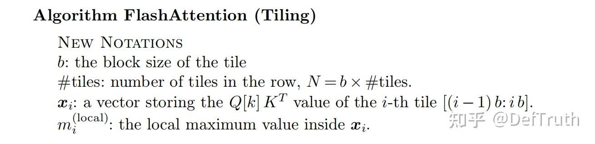
*FlashAttention Tiling*

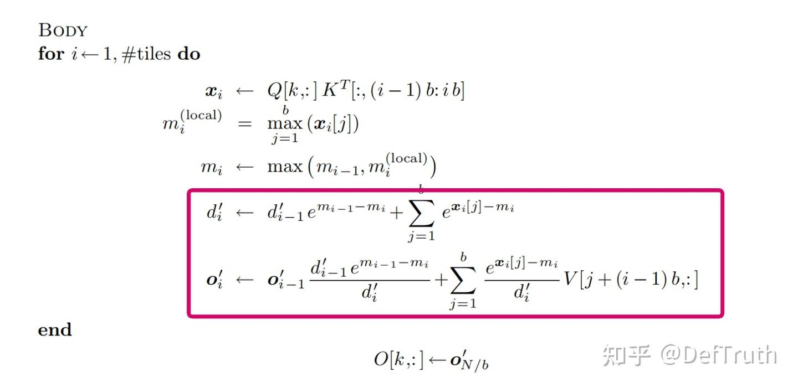
*FlashAttention Tiling*

여기서 K 행렬을 여러 블록으로 나눈다(Q도 같은 방식으로 나눌 수 있다). 작은 블록을 SRAM에 load한 뒤 x_i를 계산하고 이후 계산을 이어 간다. 알고리즘 관점에서 Q, K, V를 한 번만 load하면 kernel 내에서 Attention을 모두 끝낼 수 있다. 3-pass 원시 Self Attention에서 1-pass FlashAttention으로 가면서 S, P의 메모리를 절약하고 Q, K의 HBM IO Access도 줄였다.

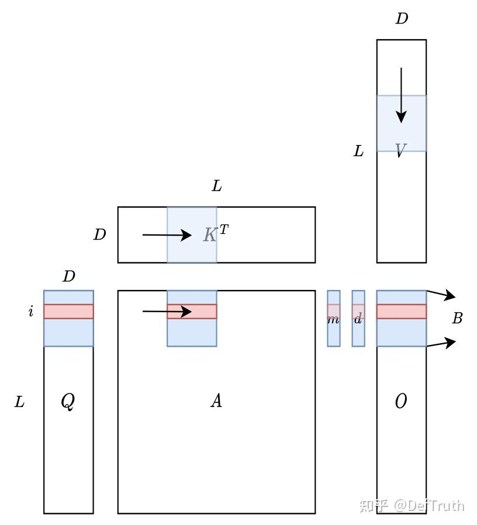
*FlashAttention Tiling*

위 1-pass FlashAttention 알고리즘 로직은 From Online Softmax to FlashAttention [1] 기반이다. 이 절의 마지막으로 FA1 논문의 알고리즘 의사 코드를 본다.

### FlashAttention-1 forward pass

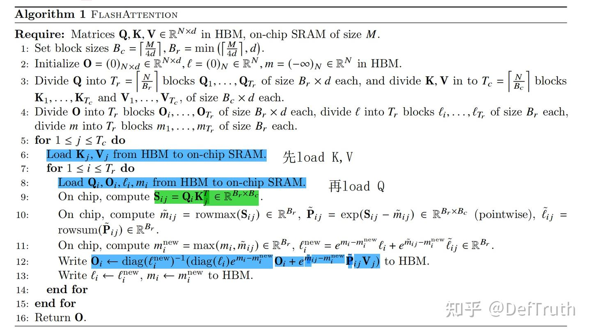
*Algorithm 1 FlashAttention forward pass*

여기서

```
O_i ← diag(ℓ_i^new)⁻¹ ( diag(ℓ_i) · e^(m_i − m_i^new) · O_i + e^(m̃_{ij} − m_i^new) · P̃_{ij} · V_j )
```

는 사실상

```
o'_i ← o'_{i-1} · ( d'_{i-1} · e^(m_{i-1} − m_i) / d'_i ) + ( e^(xᵢ − m_i) / d'_i ) · V[i, :]
```

이다.

FA 논문의 완전한 식과 유도를 보면 다음과 같다. From Online Softmax to FlashAttention [1]의 증명을 이해했다면 FA1 논문의 증명도 어렵지 않다. forward pass에서 FA는 online-softmax와 비슷한 Tiling을 쓴다. Q, K, V를 분할하고, 작은 분할을 느린 global memory에서 빠른 SRAM으로 load해 현재 block의 Attention 계산을 SRAM 위에서 마친 뒤 HBM에 쓴다. 중간 S, P 행렬은 보관하지 않는다. 논문 [2]의 증명을 그대로 옮긴다(원리는 위에서 다뤘으므로 중복 설명은 생략).

(1) 벡터 x ∈ ℝᴮ에 대한 일반 softmax:

```
m(x) := max_i x_i
f(x) := [ e^(x_1 − m(x)), ..., e^(x_B − m(x)) ]
ℓ(x) := Σ_i f(x)_i
softmax(x) := f(x) / ℓ(x)
```

(2) online-softmax 기법으로 x = [x^(1) x^(2)] ∈ ℝ^(2B)를 x^(1), x^(2) ∈ ℝᴮ로 분해.

(3) online-softmax 분할 논리:

```
m(x) = max( m(x^(1)), m(x^(2)) )
f(x) = [ e^(m(x^(1)) − m(x)) · f(x^(1)),  e^(m(x^(2)) − m(x)) · f(x^(2)) ]
ℓ(x) = e^(m(x^(1)) − m(x)) · ℓ(x^(1)) + e^(m(x^(2)) − m(x)) · ℓ(x^(2))
softmax(x) = f(x) / ℓ(x)
```

(4) (3)에 출력값 O 계산을 합치면

```
O_i ← diag(ℓ_i^new)⁻¹ ( diag(ℓ_i) · e^(m_i − m_i^new) · O_i + e^(m̃_{ij} − m_i^new) · P̃_{ij} · V_j )
```

(5) 구체 증명. 논문 부록의 증명을 그대로 따라간다. 복잡해 보이지만 앞서 1-pass FlashAttention 증명과 본질이 같다. 두 증명 중 어느 한 쪽만 이해해도 된다.

```
m^(j) = rowmax(S_{:, :j}) ∈ ℝ^N
ℓ^(j) = rowsum( exp( S_{:, :j} − m^(j) ) ) ∈ ℝ^N
O^(j) = P_{:, :j} · V_{:j} ∈ ℝ^(N × d)
```

(6) (j+1)번째 iteration에서 m^(j+1) = max(m^(j), m̃), 여기서 m̃ = rowmax(S_{:, j:j+1}). 따라서 m^(j+1) = rowmax(S_{:, :j+1}).

(7) 같은 식으로 ℓ^(j+1) = e^(m^(j) − m^(j+1)) · ℓ^(j) + e^(m̃ − m^(j+1)) · ℓ̃. 결국 ℓ^(j+1) = rowsum( exp(S_{:, :j+1} − m^(j+1)) ).

(8) V_{j:j+1}을 V의 j_Bc ~ (j+1)_Bc-1 열 절편이라 하면

```
O^(j+1) = diag(ℓ^(j+1))⁻¹ · ( diag(ℓ^(j)) · e^(m^(j) − m^(j+1)) · O^(j)
                              + e^(m̃ − m^(j+1)) · exp(S_{j:j+1} − m̃) · V_{j:j+1} )
        = ... (전개 생략)
        = softmax(S_{:, :j+1}) · V_{:, j+1}
```

마지막 iteration(j = T_c)에서 O = softmax(S) V = softmax(QKᵀ) V를 얻는다.

### Block Size의 효과

FlashAttention에는 Block Size 개념(B_r, B_c)이 있다.

```
B_c = ⌈M / (4d)⌉
B_r = min(⌈M / (4d)⌉, d)
```

이렇게 설정하는 목적은 Q, K, V 분할이 모두 SRAM에 들어가게 하기 위함이다. M은 시스템이 사용할 수 있는 SRAM 상한이다. 각 Q 분할 Q_i, O_i와 K, V 분할 K_j, V_j가 필요로 하는 shared memory는

```
SRAM(Q_i) = B_r · d = min(⌈M/(4d)⌉, d) · d  < ⌈M/4⌉
SRAM(O_i) = B_r · d = min(⌈M/(4d)⌉, d) · d  < ⌈M/4⌉
SRAM(K_j, V_j) = 2 · B_c · d = 2 · ⌈M/(4d)⌉ · d  < ⌈M/2⌉
```

여기에 ℓ_i, m_i가 차지하는 저장 공간을 더하면 가용 SRAM이 거의 다 찬다. 의사 코드 수준의 분석이며 엔지니어링 구현에는 세부 차이가 있다. SRAM 관련 인지를 보태자면, A100은 L1 Cache(SRAM)가 192KB이고 이는 SM 단위 값이다. SM마다 192KB이고 A100은 108개 SM이라 카드 전체 SRAM은 약 20MB. 그러나 각 thread block은 하나의 SM에서만 실행되며 SM 간 SRAM은 공유되지 않는다. 따라서 실제 알고리즘 설계에서는 thread block 모델 관점에서 192KB 안에 들어갈 데이터량을 따져야 한다.

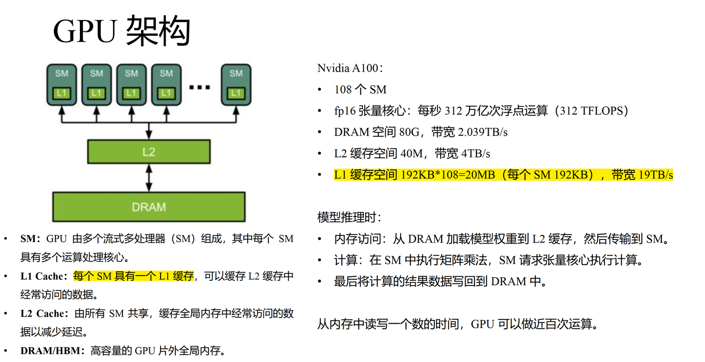

알고리즘에서 Block Size 설정의 영향. 자세한 내용은 FA1 원문을 추천. Block Size가 클수록 HBM Access가 줄고, 256 근처에서 효율이 정점을 찍는다.

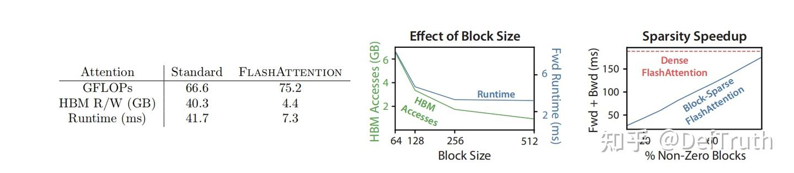
*Block Size의 효과*

### Block-Sparse FlashAttention forward pass

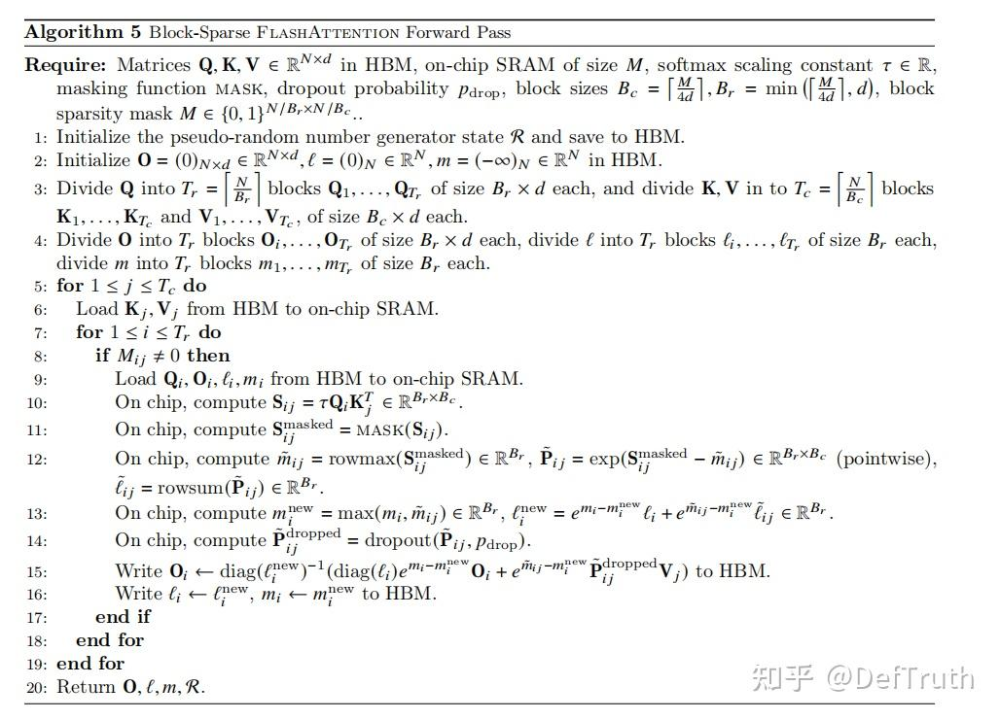
*Block-Sparse FlashAttention forward pass*

간단히. Block-Sparse FlashAttention은 butterfly 형태의 sparse Attention mask M을 전제로, M_{ij}=0인 부분은 sparse 처리해 해당 block 계산을 건너뛰는 확장이다.

### FlashAttention-1 backward pass

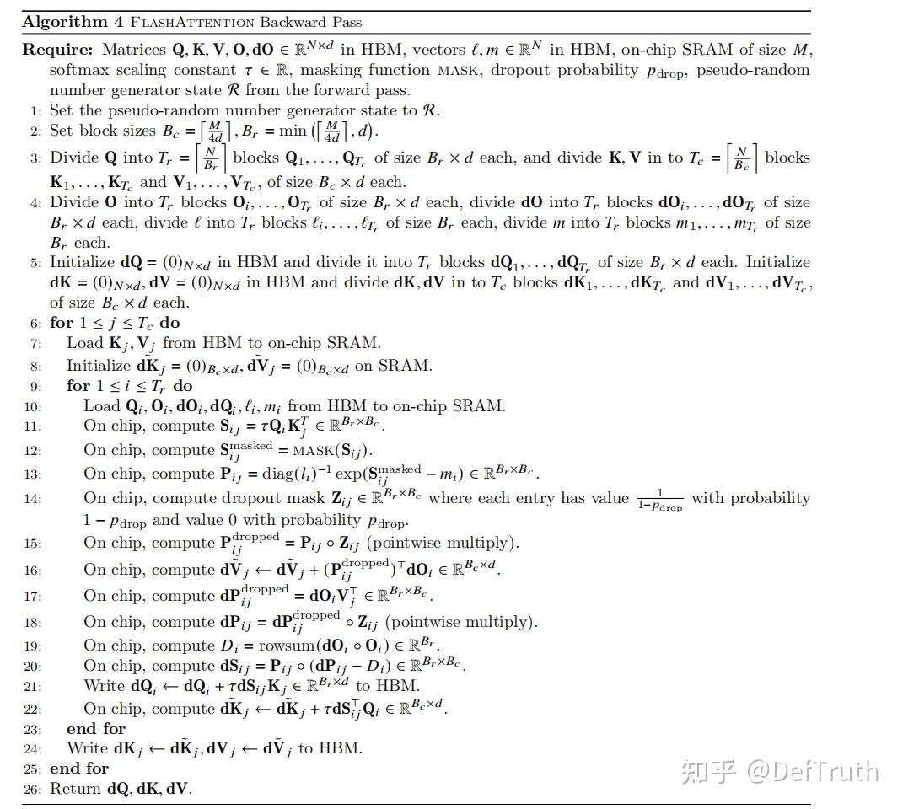
*FlashAttention-1 backward pass*

backward의 핵심 최적화는 Recompute다. 표준 Self Attention 대비 FlashAttention은 forward에서 S, P를 보관하지 않지만, backward에서 gradient를 계산하려면 S, P 값이 다시 필요하다. 어떻게 하나? forward와 마찬가지로 Tiling으로 Q, K, V를 SRAM에 분할 load한 뒤 online으로 현재 block의 S, P를 다시 계산한다.

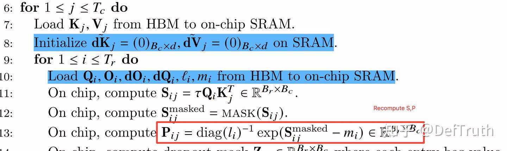
*Backward pass Recompute*

이렇게 해서 얻는 이득은? Q, K, V는 recompute 여부와 관계없이 어차피 SRAM에 load해야 한다(gradient 계산 때문에). recompute가 없으면 P는 미리 HBM에 저장되어 있어 backward에서 Q, K, V, dO, dS와 P, dP를 load하고 dS, dP, dQ, dV, dK를 write해야 한다.

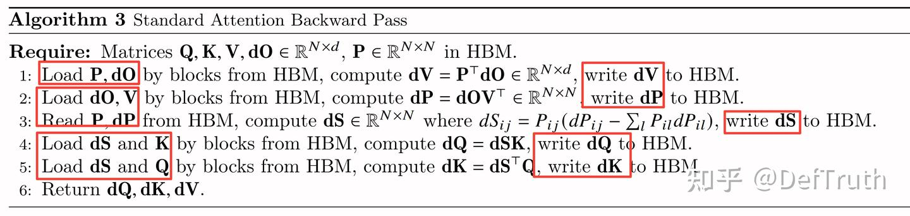
*Standard Attention Backward Pass*

recompute + tiling을 적용하면 Q, K, V, dO load와 dQ, dV, dK write만 남고 S, P, dS, dP의 load/write IO가 사라진다. recompute로 FLOPs는 늘지만 IO 감소로 얻는 이득이 더 크다. NV PTX ISA 8.1 6.6장 Operand Costs에 따르면 GPU HBM IO Access는 보통 100 cycle 이상이고, 계산 명령은 몇 cycle이면 된다.

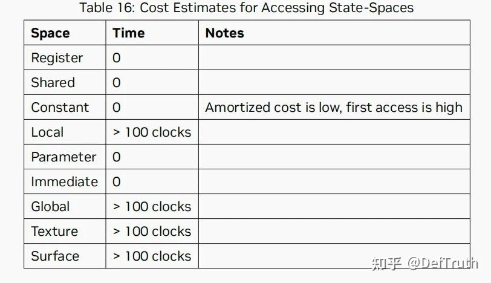
*NV PTX ISA 8.1 6.6-Operand Costs*

## 0x05 FlashAttention V2

현재 널리 쓰이는 것은 FlashAttention-2 [3]이다. FA2는 FA1 대비 주로 엔지니어링 최적화를 더한 것이고, Tiling과 Recompute의 핵심 아이디어는 FA1과 같다. FA2 논문이 학회 본문에 실리지 않고 arxiv에만 올라온 점, 그리고 일부 잘못된 공식이 이후로도 수정되지 않은 점은 아쉽다. 어쨌든 FA2의 최적화 포인트는 다음과 같다.

> 1. 비 matmul의 중복 계산 축소, Tensor Cores 연산 비중 증대
> 2. forward/backward에 seqlen 차원 병렬 추가, forward에서 Q, K, V 루프 순서 교체
> 3. 더 나은 Warp Partitioning 전략으로 Split-K 회피 (이 부분은 스토리상 끼워 넣은 인상이 있다)

### 비 matmul 중복 계산 축소

왜 비 matmul 계산을 줄이는가? 비 matmul의 FLOPs가 matmul보다 적기는 해도 비 matmul은 CUDA Cores를 쓰고 matmul은 Tensor Cores 가속을 쓸 수 있다. Tensor Cores 기반 matmul throughput은 비 matmul 대비 **16배** [3]이다. FA2에서는 forward를 다음과 같이 수정했다.

```
m^(1) = rowmax(S^(1)) ∈ ℝ^Br
ℓ^(1) = rowsum( e^(S^(1) − m^(1)) ) ∈ ℝ^Br
Õ^(1) = e^(S^(1) − m^(1)) · V^(1) ∈ ℝ^(Br × d)

m^(2) = max( m^(1), rowmax(S^(2)) ) = m
ℓ^(2) = e^(m^(1) − m^(2)) · ℓ^(1) + rowsum(e^(S^(2) − m^(2)))
      = rowsum(e^(S^(1) − m)) + rowsum(e^(S^(2) − m)) = ℓ
Õ^(2) = e^(S^(1) − m) · V^(1) + e^(S^(2) − m) · V^(2)
O^(2) = diag(ℓ^(2))⁻¹ · Õ^(2) = O
```

FA1에서는 O 계산이

```
O_i ← diag(ℓ_i^new)⁻¹ ( diag(ℓ_i) · e^(m_i − m_i^new) · O_i + e^(m̃_{ij} − m_i^new) · P̃_{ij} · V_j )
```

이었다. FA2는 매 block iteration마다 전체 rescale을 수행하지 않고 마지막에 한 번만 수행한다. 매 iteration의 분자 Õ^(1), Õ^(2)가 올바른 값으로 scale되고 분모 ℓ^(1), ℓ^(2)이 올바르게 계산되기만 하면 되므로 가능한 최적화다. backward에서는 m^(j), ℓ^(j)를 따로 저장하지 않고

```
logsumexp L^(j) = m^(j) + log(ℓ^(j))
```

를 저장한다. 그러면 backward에서 P_{ij} 계산도 줄어든다.

```
P_{ij} = diag(l_i)⁻¹ · exp(S_{ij}^masked − m_i) ∈ ℝ^(Br × Bc)
       →  P_i^(j) = exp(S_{ij} − L_i) ∈ ℝ^(Br × Bc)
```

### seqlen 차원 병렬

FA1의 forward를 보면 어색한 부분이 있다. 이중 루프에서 외부에서 K, V를 load하고 내부에서 Q를 load한다. 결과적으로 내부 루프는 매번 Q_i의 일부만 계산하고, iteration마다 O_i에 대해 global memory R/W가 발생한다. Attention에서 query마다의 Attention 계산은 완전히 독립적이므로, 외부 루프에서 Q를 먼저 load하면 서로 다른 query block을 서로 다른 thread block에 할당할 수 있고 thread block 간 통신은 필요 없다. FA2는 정확히 이렇게 한다. forward에서 루프 순서를 바꿔 Q를 먼저, 그 다음 K, V를 load한다.


*FlashAttention-2 forward pass*

순서를 바꾸면 내부 루프에서 매번 O_i, ℓ_i, m_i를 HBM에 R/W할 필요가 없어 IO Access가 줄고 시간이 단축된다. row seqlen 병렬은 FA1, FA2 모두 가능했지만 FA1은 batch_size와 head num에서만 병렬화했고, seqlen이 길고 bs가 작은 경우 효율이 급락했다. FA2는 seqlen 병렬을 추가해 occupancy를 끌어올렸고, forward에서 Q*Kᵀ는 row 방향 seqlen에서 자연스럽게 병렬이라 thread block 간 추가 통신이 없다.

backward에서도 FA2는 seqlen 병렬을 추가했지만, forward와 달리 루프 순서는 그대로다. backward는 column 방향 seqlen 병렬을 채택한다.

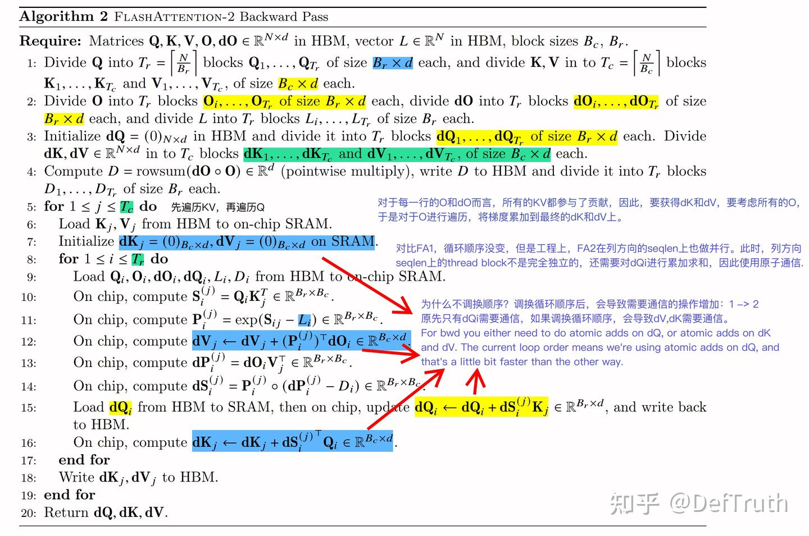
*FlashAttention-2 Backward Pass*

forward와 backward의 seqlen 병렬 방향 차이:

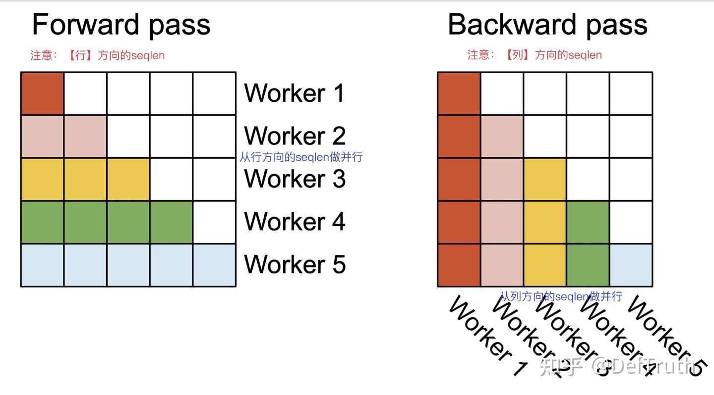
*Fwd row 방향 seqlen 병렬 vs Bwd column 방향 seqlen 병렬*

처음에는 왜 backward에서 루프 순서를 바꾸지 않는지 이해되지 않아 FlashAttention 공식 repo에 issue를 올려 저자에게 물어봤다. 답변에 감사. 결론: 순서를 바꾸면 통신이 필요한 연산이 1 → 2로 늘어난다. 원래는 dQi만 통신이 필요한데, 순서를 바꾸면 dV, dK 통신까지 필요해진다. 그래서 K, V → Q 순서가 약간 더 빠르다.

> For bwd you either need to do atomic adds on dQ, or atomic adds on dK and dV. The current loop order means we're using atomic adds on dQ, and that's a little bit faster than the other way.

### 더 나은 Warp Partitioning, Split-K 회피

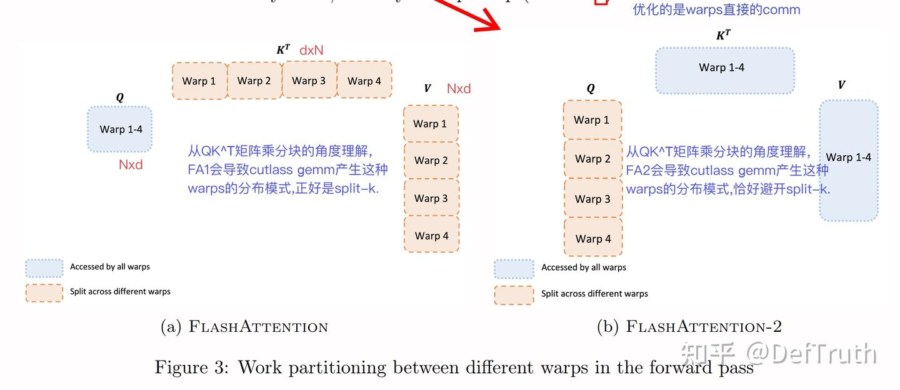

이 부분은 아직 완전히 이해하지 못했다. 잠정적으로 이렇게 받아들이고 있다. QKᵀ matmul 분할 관점에서 FA1은 cutlass gemm이 split-k 형태의 warp 데이터 분포를 만들도록 하고, FA2는 그 반대로 split-k를 회피하는 형태가 되도록 한다. cutlass 저수준 구현과 Tensor Cores 관련 디테일이 엮인다. Warp Level 병렬에 대해서는 「Antinomi: FlashAttention 핵심 로직과 V1 V2 차이 정리」를 강력 추천한다. 아래는 그 글에서 가져온 분석이다.

> "fwd부터 보면, V2는 V1 대비 Warp Partition을 개선했다. 4개의 warp가 smem의 K/V tile에서 같은 데이터를 load해 mma를 하되, 서로 다른 Q를 load한다. V1의 sliced-K sliced-V를 V2의 sliced-Q로 바꾼 셈이다. V1 방식은 warp 간 동기 통신이 필요하다. QK 결과에 V를 곱할 때 그림처럼 cross-warp reduction으로 O를 얻어야 하고, fwd는 행 방향 softmax를 계산하므로 행 방향 정보를 최종 집계해야 해서 역시 cross-warp 동기가 필요하기 때문이다. V2는 이게 필요 없어 동기 비용을 줄였다."

저자도 약 1년 뒤 MMA PTX로 FlashAttention-2를 손수 짜고 나서야 이 MMA(Warp) Layout 최적화 로직을 이해할 수 있었다. CUDA-Learn-Notes의 kernels/flash-attn에 Split-Q 최적화 전략을 구현해 두었다. 동시에 비교용으로 Split-KV도 구현했고, 대부분의 경우 Split-Q가 Split-KV 대비 15% 이상의 성능 향상을 보였다. "드디어 식물 같던 내가 알아봤다"라며 그림 한 장 보탠다.

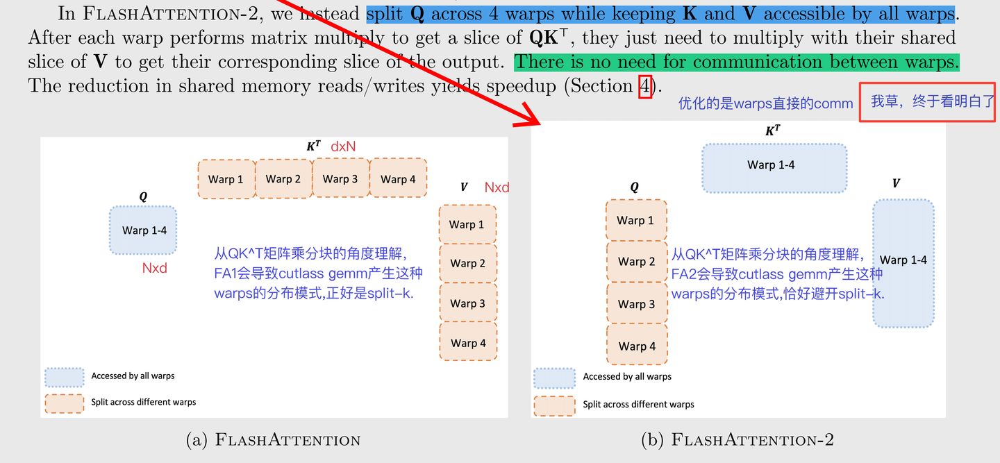
*Split-KV vs Split-Q*

구현한 두 kernel의 모습은 대략 다음과 같다. 코드: https://github.com/xlite-dev/CUDA-Learn-Notes. 글머리에서도 적었듯 이외에 **Shared KV SMEM**, **Fully Shared QKV SMEM**도 구현했고, Split-Q 전제에서 Headdim ≤ 128 케이스에 **Prefetch Q s2r** 전략으로 Q SMEM IO Access를 줄였다. 추후 MMA로 성능이 괜찮은 FlashAttention을 손수 만드는 방법을 글로 다룰 예정이다.

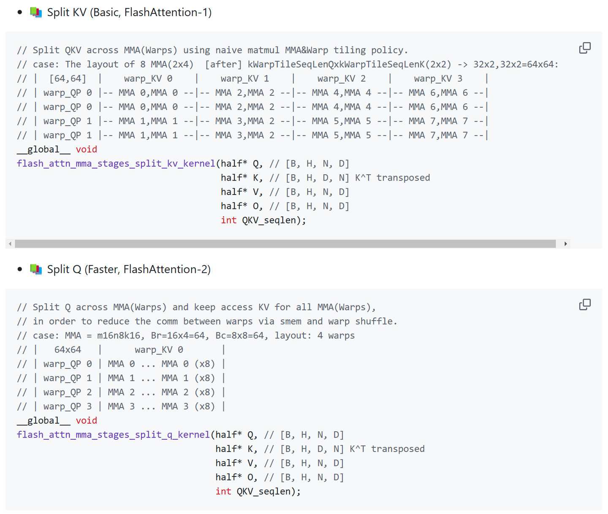
*Split-KV Kernel vs Split-Q Kernel*

위 분석을 바탕으로 FlashAttention V2의 Tiling 로직을 그려 볼 수 있다. batch=8, heads=8, 분할 크기 BLOCK_M × BLOCK_N = 128 × 128을 예로 들면 다음과 같다. skip으로 표시된 부분은 Early Exit 가능한 블록이며 계산을 건너뛸 수 있다(자세한 내용은 이후 절 참고).

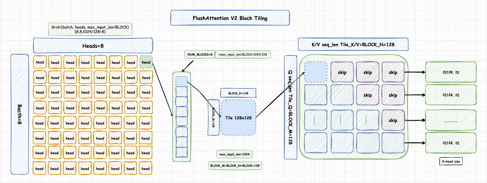
*FlashAttention V2 Block Tiling*

## 0x06 FlashAttention의 IO 복잡도 분석

IO 복잡도 분석은 FA1과 FA2에 공통이라 여기에 묶었다. 많은 블로그에서 놓치기 쉬운 부분인데 의외로 중요하다. FlashAttention이 언제 이득인지를 파악하는 데 도움이 된다. 이 절을 쓰게 된 계기는 TensorRT MHA/Myelin과 FlashAttention-2의 성능 비교 분석을 시도한 적이 있어서다(별도 글 참고).

당시 FlashAttention의 한계도 발견했다.

> 1. FlashAttention/MHA는 현재 headdim > 256을 지원하지 않는다. d > 256이면 FA/MHA 가속을 사용할 수 없다.
> 2. headdim > 128에서는 MHA와 FlashAttention 각자의 장단이 있고, FA가 항상 최적은 아니다.

본 글은 2번을 다루지 않는다(TensorRT MHA 내부 구현과 FA 구현 차이로 보인다). 1번에 대해서는 왜인지 궁금하다. 글머리에서 던진 작은 의문, "왜 FA는 지금도 큰 headdim 계산을 지원하지 못하나(예: headdim > 256)"에 답하려면 IO 복잡도 분석이 필요하다. 이 문제에 대해서도 저자에게 issue로 물었다.

> with numhead = 1 and large headdim, i think it's faster to compute attention naively rather than using flash-attn.

요지: numhead=1, large headdim에서는 원시 Attention이 FlashAttention보다 빠를 수 있다.

FA 알고리즘과 Block Size 영향을 복습하자.

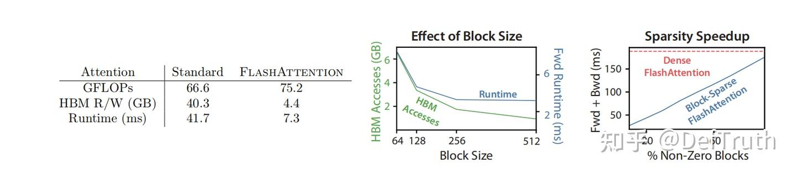
*Block Size의 효과*

Block Size 식:

```
B_c = ⌈M / (4d)⌉
B_r = min(⌈M / (4d)⌉, d)
```

이렇게 설정하는 목적은 Q, K, V 작은 block들이 모두 SRAM에 들어가도록 함이다. M은 사용 가능 SRAM 상한. 각 Q 분할 Q_i, O_i와 K, V 분할 K_j, V_j의 shared memory 수요는

```
SRAM(Q_i) = B_r · d = min(⌈M/(4d)⌉, d) · d < ⌈M/4⌉
SRAM(O_i) = B_r · d = min(⌈M/(4d)⌉, d) · d < ⌈M/4⌉
SRAM(K_j, V_j) = 2 · B_c · d = 2 · ⌈M/(4d)⌉ · d < ⌈M/2⌉
```

여기에 ℓ_i, m_i가 차지하는 공간을 더하면 가용 SRAM이 거의 다 찬다. FA1 + FA2 알고리즘에 따르면 **headdim = d가 커질수록 B_r, B_c가 작아진다.** 즉 Block Size가 작아진다. **Block Size가 작아지면 Runtime이 커진다.** thread block의 SRAM 용량이 한정적이라 시스템에 활성화되는 SM 상한을 제약하기 때문이다. d가 커지면 같은 seqlen에 대해 더 많이 순회해야 한다(더 많은 thread block). 같은 occupancy에서 스케줄링 횟수가 많아지므로 시간이 늘어난다. 또 B_r이 작아져 외부 Q 루프 횟수가 늘어나고, Q 루프마다 K, V 전체를 SRAM에 분할 로드해야 하므로 Memory Access도 증가한다. FA2가 Memory Access를 줄이려는 목표에서 멀어진다는 뜻이다. 논문이 제시한 FA의 Memory Access 식은 다음과 같다.

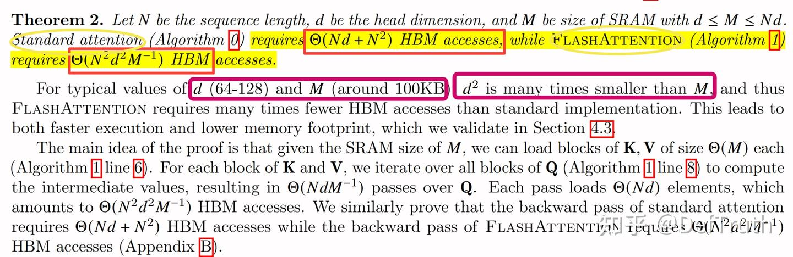
*FlashAttention IO Complexity*

Memory Access는 d²에 비례한다. d가 커지면 FA의 Memory Access는 급격히 증가한다. 예컨대 N=2K, M=192KB일 때 d=256까지는 FA IO Access < Naive Attention IO Access가 성립하지만, **d=512가 되면 결론이 뒤집힌다**. **FA IO Access > Naive Attention IO Access**. FA 자체의 FLOPs도 Naive Attention보다 높으므로, 이 경우 IO와 FLOPs 모두에서 FA가 불리하고 메모리 절약(중간 S, P 보관 불필요, O(N²) 절약)만이 유일한 이점으로 남는다.

```
# N=2048, d=256, M=192KB(A100): FA IO Access < Naive
>>> 2048*256 + 2048*2048              # Naive
4718592
>>> 2048*2048*256*256/(192*1024)      # FA
1398101.33

# N=2048, d=512, M=192KB(A100): FA IO Access > Naive
>>> 2048*512 + 2048*2048              # Naive
5242880
>>> 2048*2048*512*512/(192*1024)      # FA
5592405.33
```

IO 복잡도에 대한 FA1 [2]의 다른 결론도 많지만 여기서는 생략한다. 원문 참고를 권한다. 최근 arxiv에 「The I/O Complexity of Attention, or How Optimal is FlashAttention?」 [4]가 올라왔는데, d² < M과 d² ≥ M 관점에서 FA와 표준 Attention의 IO 복잡도를 분석한다. 자세한 내용은 추후 보강하겠다.

## 0x07 분산 학습/추론에서 FlashAttention 사용

FlashAttention 공식 repo에는 다중 카드 버전이 구현되어 있지 않다. 코드를 훑어봐도 nccl 같은 분산 통신 코드는 없다. FlashAttention 자체가 메모리를 크게 절약해 O(N)이면 충분하므로 매우 긴 seqlen의 Attention이 가능하다. 80GB 메모리라면 약 80 × (1024³) / (1024 × 2) ≈ 4,190만 K, 즉 **천만 K 단위**(half=2byte)의 seqlen까지 받쳐 준다. 현재 Long LLM 흐름에서도 FlashAttention 자체가 메모리 폭발을 겪을 만큼은 아니다. 그래서 다중 카드 버전을 굳이 만들 필요는 없다. 오히려 Q, K, V, O, word embedding, lm_head, KV Cache가 차지하는 메모리가 더 큰 병목이 된다.

### Megatron-LM Self Attention Tensor Parallel [6]

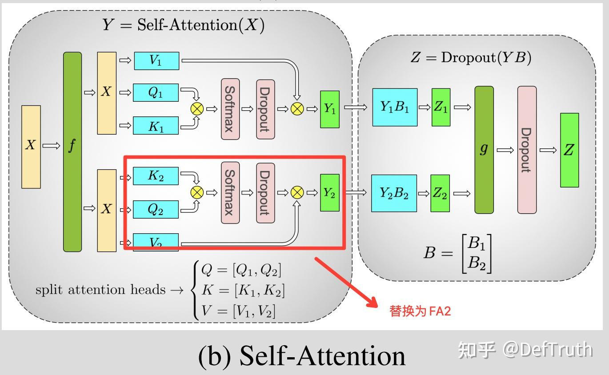
*Megatron-LM Self Attention Tensor Parallel*

각 카드가 하나의 head를 가지고 자신의 Attention을 독립적으로 계산한다. 카드 간 Attention은 완전히 독립적이다. 자연스러운 아이디어는 단일 카드의 Attention 부분을 FlashAttention으로 교체하는 것이다. Megatron-LM ParallelAttention 일부 소스:

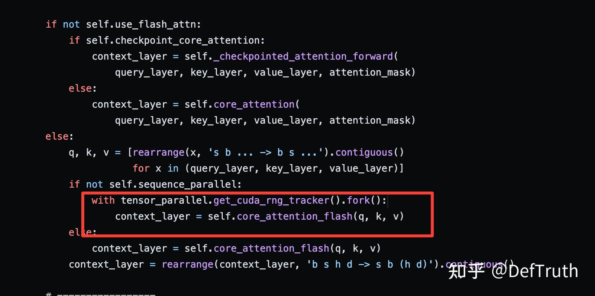
*FlashAttention in Megatron-LM ParallelAttention*

분산 학습은 저자의 주력 분야가 아니다. 이해에 오류가 있다면 지적 환영.

## 0x08 Memory-Efficient Attention

### Memory-efficient forward pass

FlashAttention 등장 전에도 Memory-Efficient Attention이 있었다. 간단히 짚는다. xformers의 `memory_efficient_attention`이 이를 포함한다.

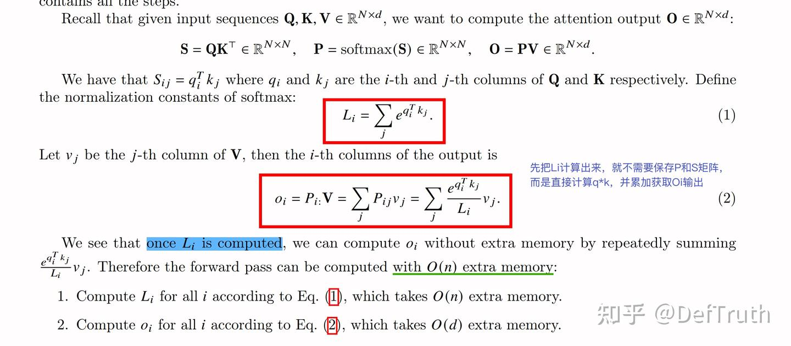
*Memory-efficient forward pass*

Memory-Efficient Attention은 L_i = Σⱼ e^(q_iᵀ k_j)를 먼저 계산한다. L_i를 계산할 때 대응되는 q_i, k_j만 load하고 중간 결과 q_iᵀ k_j는 보관하지 않으며 L_i만 저장한다. S와 P 행렬의 메모리를 절약하면서 L_i 시퀀스는 O(N)만 차지한다. o_i 계산도 마찬가지다. 모든 L_i 계산이 끝나면 다시 q_i, k_j를 load해 softmax를 online으로 계산한다.

```
o_i = P_{i:} · V = Σⱼ P_{ij} · v_j = Σⱼ ( e^(q_iᵀ k_j) / L_i ) · v_j
```

### Memory-efficient backward pass

backward는 gradient 계산이 들어가 다소 복잡하지만, 메모리 절약 원리는 동일하다. 합산 항 L_i = Σⱼ e^(q_iᵀ k_j)는 미리 계산한다. 확률 항 P_{ij}는 매번 q_i, k_j를 load해 online으로 계산하고 중간 결과는 보관하지 않는다. 이렇게 하면 dv_j 계산 시 메모리를 크게 절약할 수 있다.

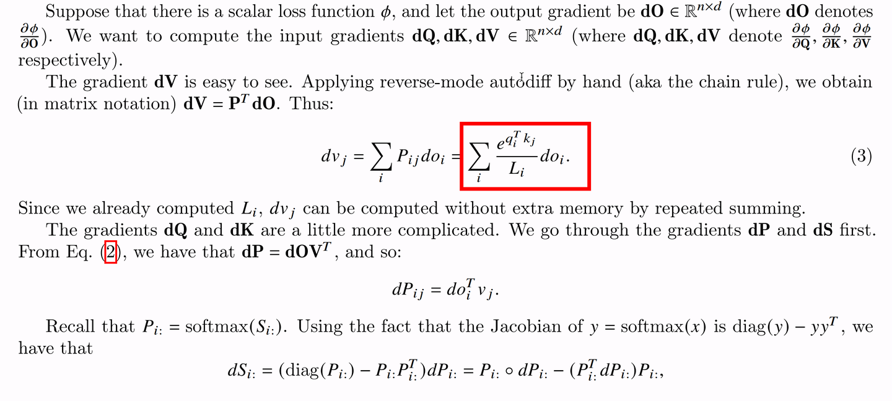
*Memory-efficient backward pass part1*

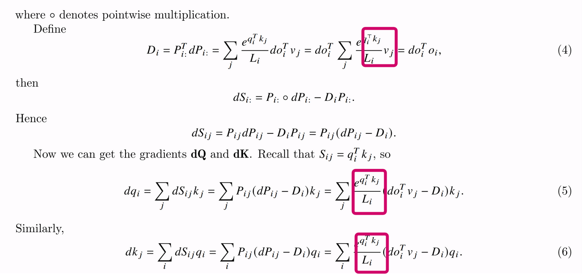
*Memory-efficient backward pass part2*

dq_j, dk_j 계산에도 같은 기법을 적용할 수 있다. 확률 항 P_{ij}가 online 계산 가능하고, o_i, do_i가 알고리즘 입력으로 이미 알려져 있어 dS_{ij}, D_i 역시 online으로 계산할 수 있다. dq_j, dk_j는 dS_{ij}, D_i, k_j, q_j에 의존하므로 모두 online으로 계산 가능하다.

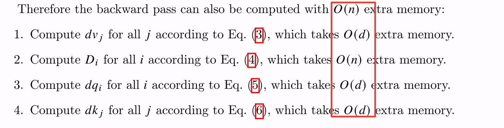
*Memory-efficient backward pass part3*

FlashAttention 대비 Memory-Efficient Attention도 메모리를 절약하지만 HBM IO Access는 줄지 않고 여전히 quadratic O(N²)이다. 자세한 내용은 「Self-attention Does Not Need O(n²) Memory」 [7] 참고.

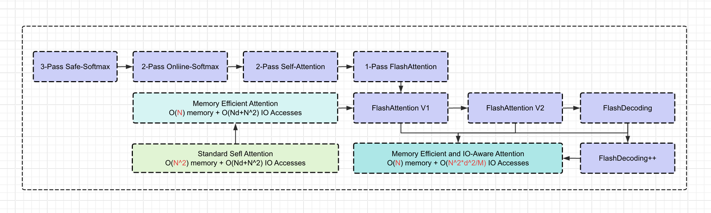

## 0x09 FlashAttention의 MQA/GQA·Causal Mask 처리

추가 디테일 몇 가지를 이 절에 모아 둔다.

### MHA / MQA / GQA


*MHA/GQA/MQA*

표준 MHA(Multi Head Attention)에서는 KV Head 수가 Query Head 수와 같고, 각 Query Head가 독립적인 KV Head를 가진다. 모델 층이 깊어지고 head 수가 많아지면 QKV Attention의 연산·IO가 빠르게 늘어난다. 이를 완화하기 위해 MQA와 GQA가 제안되었다.

**MQA (Multi Queries Attention)**: 극단적이게도 KV Head를 하나만 둔다. 여러 Query Head가 같은 KV Head를 공유한다. head별 차이를 모두 Query에 몰아넣고, 모델이 서로 다른 Query Head로부터 다양한 정보를 길어내도록 요구한다. KV Cache 부담은 크게 줄지만 모델 성능이 다소 하락한다.


**GQA (Grouped Query Attention)**: 절충안. Query Head를 그룹으로 묶고 각 그룹이 하나의 KV Head를 공유한다. 예컨대 Query Head 8개를 4그룹으로 묶으면 그룹마다 Query Head 2개, KV Head는 4개. 연산·KV Cache 부담을 줄이면서 모델 성능 손실은 작다.


FlashAttention도 MQA/GQA를 지원한다. KV Head 내용을 메모리로 복제하지 않고 Indexing으로 처리한다. KV/KV Head 인덱스를 kernel에 전달해 메모리 주소를 계산하고 메모리에서 KV를 직접 읽는다.


### Causal Mask 처리

Causal Mask 개념은 LLM에 익숙한 독자라면 다 아는 내용이다. FlashAttention은 이미 block 단위로 계산하므로 Early Exit 가능성이 있다. 즉, mask가 전부 0인 block이나 인덱스가 특정 조건을 만족하는 block은 계산 없이 바로 반환할 수 있다.

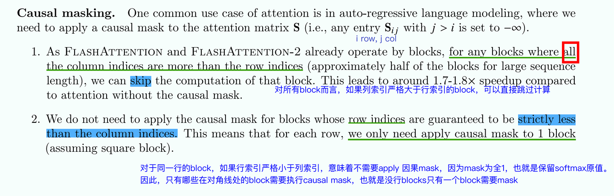

Early Exit 최적화를 그림으로 보자. FA2 forward, seq_len_q = seq_len_k = 9를 가정하면 causal mask는 9×9 하삼각이다. FA2는 Q의 seqlen 방향(row)에 병렬을 두므로 Q 기준으로 Attention 계산을 thread block들로 분할한다. 예: tile_q = 3이면 query 3개의 Attention 계산이 하나의 Thread block에. 그 block 내에서 K는 tile_k = 3 단위로 SRAM에 분할 로드되며 후속 계산에 공유된다. block 내 KV 루프는 한 K micro block 단위 순회이며, 매 iteration이 3×3 micro block, causal mask 역시 3×3 micro block 단위가 된다.

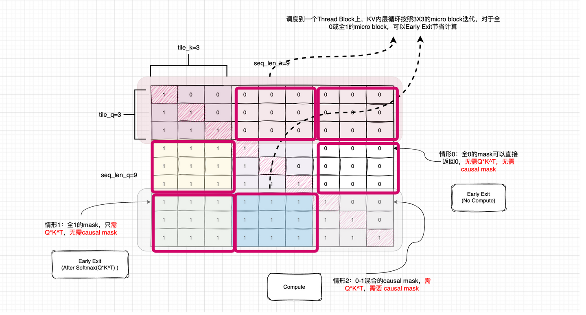

이 micro block 단위에 Early Exit 여지가 있다. 세 가지 경우:

> *케이스 0: 완전 Early Exit. mask 전부 0 → 0 반환, QKᵀ도 causal mask도 불필요.*
> *케이스 1: 부분 Early Exit. mask 전부 1 → Softmax(QKᵀ)만 계산, causal mask 불필요.*
> *케이스 2: Early Exit 불가. 0/1 혼합 mask → QKᵀ 필요, causal mask 필요, 이후 Softmax(Mask(QKᵀ)).*

따라서 케이스 0, 1에서 FA2는 상당한 계산을 절약한다. 또한 seq_len_q ≠ seq_len_k일 때 v2.1 이후 FA 구현에는 Causal Mask 우측 하단 정렬 개념이 있다.

> If `causal=True`, the causal mask is aligned to the bottom right corner of the attention matrix.
> seqlen_q = 2, seqlen_k = 5일 때 mask는 1 1 1 1 0 / 1 1 1 1 1.
> seqlen_q = 5, seqlen_k = 2일 때 mask는 0 0 / 0 0 / 0 0 / 1 0 / 1 1.
> mask의 한 row가 전부 0이면 출력은 0.

말로는 어렵지만 그림으로 보면 명확하다.

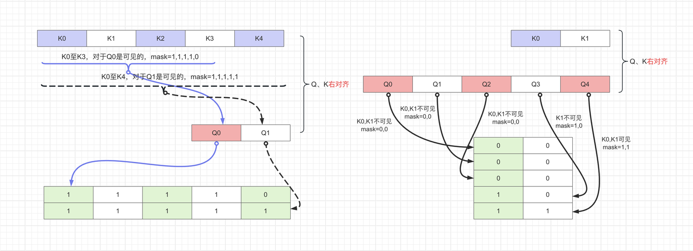
*FlashAttention Causal Mask 우측 하단 정렬 약속*

## 0x0a 번외: FlashDecoding / FlashDecoding++

분량 문제와 FlashDecoding/FlashDecoding++가 Decoding 부분 최적화에 집중되어 있다는 점을 고려해, Decoding 최적화 내용은 별도 글로 분리했다. 관심 있는 분은 그 글을 참고.

## 0x0b FlashAttention V3: V2보다 빠르고 Hopper FP8 지원

FlashAttention V3가 최근 정식 공개되었다. FP16에서 FA2보다 빠르고 Hopper FP8을 지원한다. 한동안 FA에 큰 업데이트가 없었는데 알고 보니 큰 한 방을 준비하고 있던 셈이다. 실험 결과부터 붙이고, 원리 분석은 추후 보강 예정(TODO). 논문: https://tridao.me/publications/flash3/flash3.pdf, blog: https://tridao.me/blog/2024/flash3/

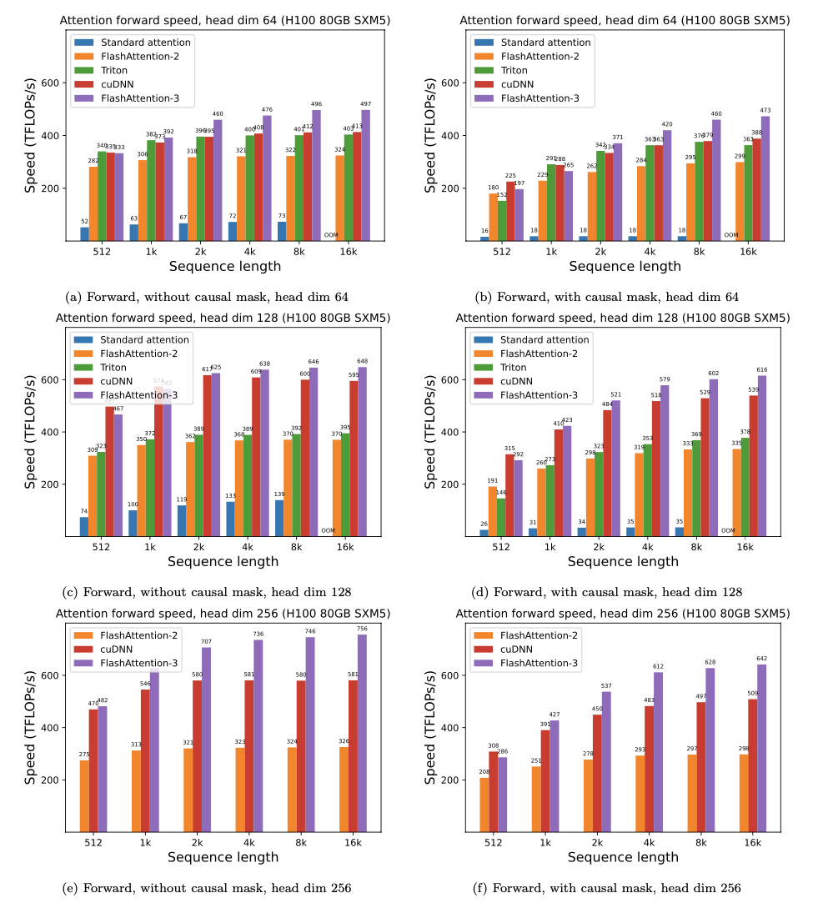
*FlashAttention V3 vs V2*

head dim이 큰 경우(예: 256) Hopper에서 FA3 FP16은 FA2 FP16 대비 2배 이상 성능 향상을 보인다.

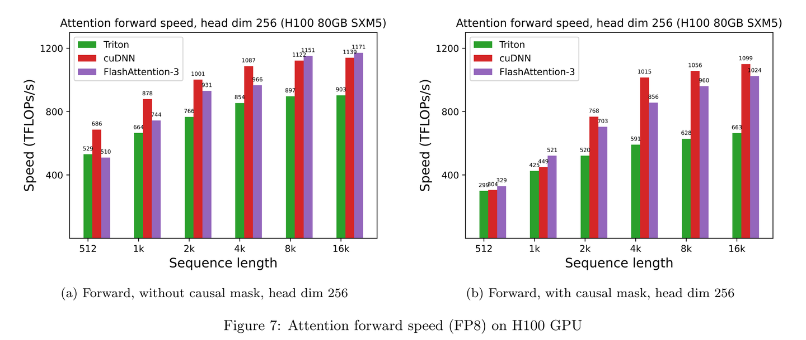
*FA3 FP8 vs cuDNN FP8*

FP8 정밀도에서 FA3는 cuDNN보다 약간 못하지만(cuDNN 강력), block quantization 사용 덕분에 수치 정확도는 더 낫다. FA3 FP8은 Hopper만 지원한다. 커뮤니티에서 ada 아키텍처용 FA3 FP8을 만들기도 했다(추천: https://github.com/weishengying/cutlass_flash_atten_fp8).

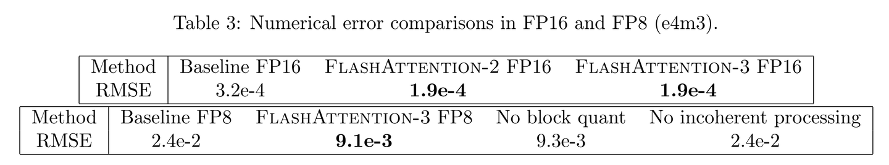
*FA3 FP8 수치 정확도*

## 0x0c 정리

본 글은 먼저 Online-Softmax 관점에서 3-pass Safe-Softmax, 2-pass Online-Softmax, 1-pass FlashAttention 원리를 짚었다. 이어 FlashAttention-1과 FlashAttention-2의 최적화 포인트, FlashAttention IO 복잡도 분석과 적용 시나리오, 분산 학습/추론에서의 활용을 자세히 다뤘다. 도해로 MQA/GQA와 Causal Mask 처리도 살펴봤고, 마지막으로 Memory-Efficient Attention의 기본 원리를 정리했다.


## 참고

- [1] From Online Softmax to FlashAttention. https://courses.cs.washington.edu/courses/cse599m/23sp/notes/flashattn.pdf
- [2] FlashAttention: Fast and Memory-Efficient Exact Attention with IO-Awareness. https://arxiv.org/pdf/2205.14135.pdf
- [3] FlashAttention-2: Faster Attention with Better Parallelism and Work Partitioning. https://arxiv.org/pdf/2307.08691.pdf
- [4] The I/O Complexity of Attention, or How Optimal is Flash Attention? https://arxiv.org/pdf/2402.07443.pdf
- [5] A Case Study in CUDA Kernel Fusion: Implementing FlashAttention-2 on NVIDIA Hopper Architecture using the CUTLASS Library. https://research.colfax-intl.com/wp-content/uploads/2023/12/colfax-flashattention.pdf
- [6] Megatron-LM: Training Multi-Billion Parameter Language Models Using Model Parallelism. https://arxiv.org/pdf/1909.08053.pdf
- [7] Self-attention Does Not Need O(n²) Memory. https://arxiv.org/abs/2112.05682
