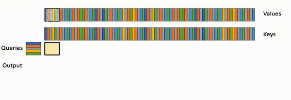
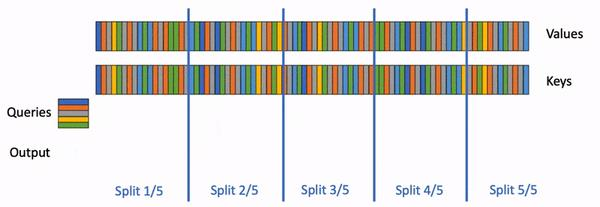
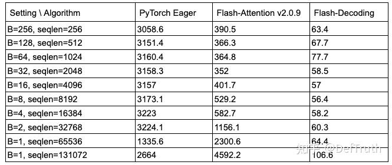
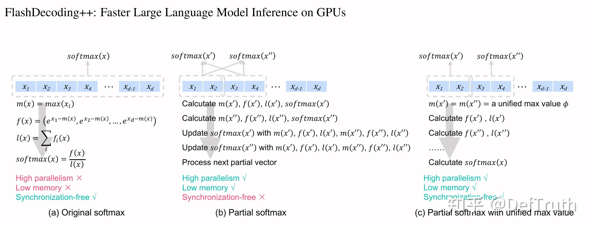
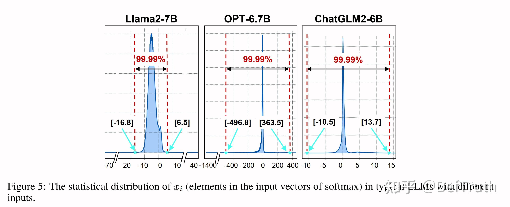
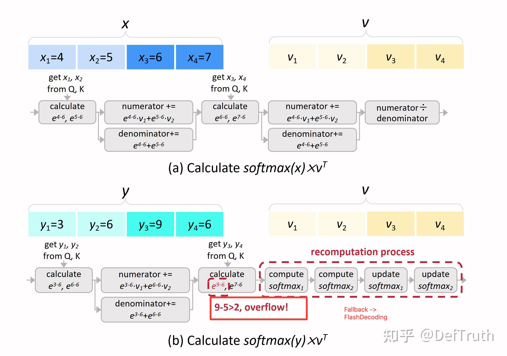
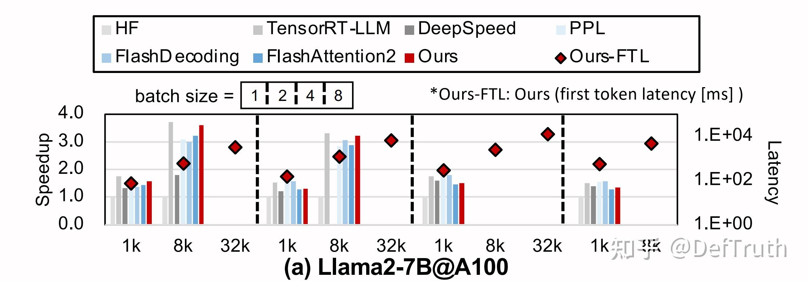
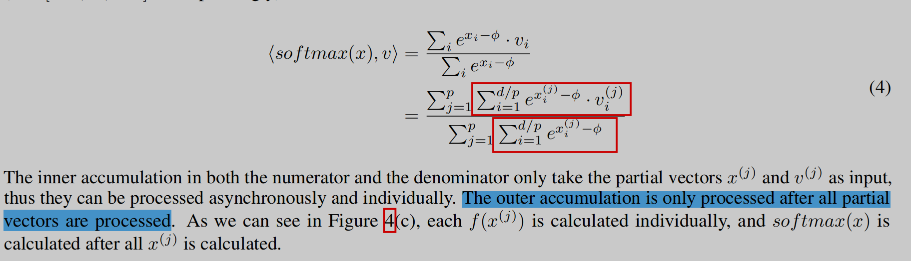
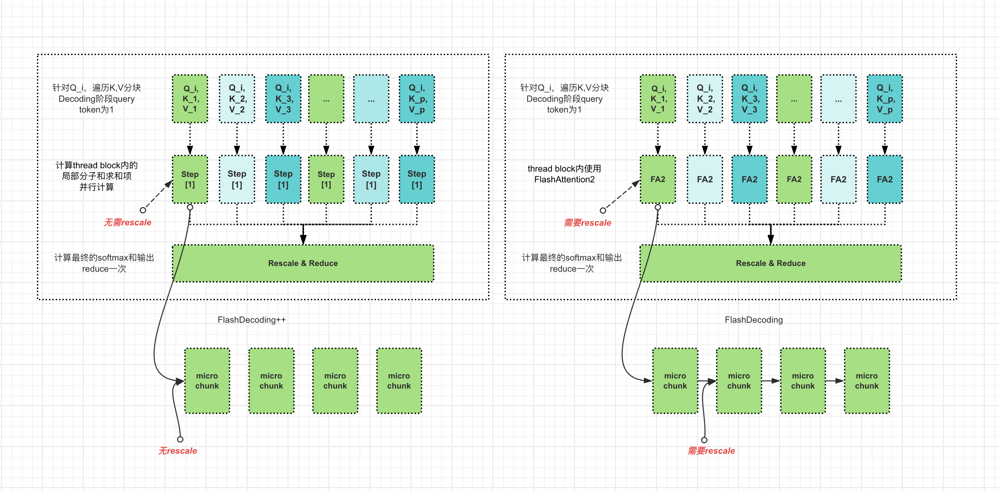

# [LLM 추론 최적화][Decoding 최적화] 원리 & 도해 FlashDecoding/FlashDecoding++

> 원문: https://zhuanlan.zhihu.com/p/696075602

### 0x00 서문

FlashDecoding과 FlashDecoding++를 별도로 분리하여 Decoding 최적화에 관한 글을 정리하려고 합니다. 이후 더 많은 세부 내용을 보충할 예정입니다. 이전 Attention 최적화 글에서는 FlashAttention-1과 FlashAttention-2 알고리즘의 각 최적화 포인트, FlashAttention IO 복잡도 분석 및 적용 시나리오, FlashAttention의 분산 훈련/추론에서의 활용을 상세히 설명했으며, 도해를 통해 FlashAttention의 MQA/GQA 및 Causal Mask 처리를 쉽게 설명했습니다. 마지막으로 Memory-Efficient Attention도 정리했습니다. 이전 글을 먼저 읽고 본 글을 읽는 것을 추천합니다.

### 0x01 FlashDecoding

일반적으로 FlashAttention forward pass는 Q의 seqlen 차원과 batch_size 차원에서 병렬화합니다. 현재 Q의 분할된 Queries에 대해, forward pass는 thread block 내에서 모든 K, V 블록을 순차적으로 순회하며 각 블록의 국소 Attention 출력을 계산합니다. 각 국소 Attention 출력은 thread block 내부 순회 과정에서 매 반복마다 현재 반복의 값에 따라 scale되며, K, V를 따른 반복이 완료되면 최종적으로 올바른 Output을 얻습니다.

FlashAttention forward pass: 쿼리 블록과 배치 크기에 걸쳐 병렬화

이 방식은 훈련의 forward에서는 작동합니다. 훈련 시 seqlen이나 bs가 비교적 크기 때문에 GPU 리소스를 효과적으로 활용할 수 있기 때문입니다. 하지만 추론의 Generation 단계에서는 토큰을 하나씩 생성하므로, KV Cache를 활용하는 상황에서 매 추론 시 실제 queries 토큰 수가 1이 되어 더 이상 queries로 병렬화할 수 없습니다. GPU 리소스를 효과적으로 활용할 수 없으며, 특히 bs도 작으면 GPU 리소스 낭비가 더욱 심해집니다. 이러한 상황에 대응하여 FlashAttention 저자가 FlashDecoding을 개발하여 추론 단계의 forward를 최적화했습니다. 기본 아이디어는 매우 직관적입니다: Q와 BS로 더 이상 병렬화할 수 없다면, K, V에 대해 병렬화하면 되지 않을까? 맞습니다, 이것이 FlashDecoding의 아이디어입니다.

FlashDecoding: K와 V에 걸쳐 병렬화

FlashDecoding의 방법은 다음과 같습니다:
> 1. 먼저 K/V를 더 작은 블록으로 분할, 예를 들어 5블록;
> 2. 그 다음 이 K/V 블록들에 대해 표준 FlashAttention으로 계산하여 모든 작은 블록의 국소 결과를 얻음
> 3. 마지막으로 추가 kernel로 전역 reduce를 수행하여 올바른 출력을 얻음

128K context 상황에서 FlashDecoding은 표준 FlashAttention보다 50배 빠릅니다.

FlashDecoding vs FlashAttention

FlashAttention 레포 자체 외에도, 현재 TRT-LLM과 vLLM 모두 generation 단계에서 작은 bs*headnum에 대해 FlashDecoding 아이디어로 최적화를 수행합니다. TRT-LLM에서는 multi_block_mode 옵션으로 제어하며, vLLM에서는 PagedAttention V2를 구현하여 지원합니다. prompt 단계에서 vLLM은 xformers의 flash-attn 백엔드로 추론합니다.

### 0x02 FlashDecoding++(비공식)

FlashDecoding++의 가장 주요한 혁신점은 통일 max 값 기반의 비동기 softmax를 제안한 것입니다. safe-softmax의 계산 공식에서는 먼저 각 행 x의 최대값을 구한 후, 이 max(x)를 뺀 다음 softmax를 수행하여 수치 오버플로를 방지해야 합니다.

$$\operatorname{softmax}(x) = \frac{[e^{x_1-m(x)}, \ldots, e^{x_d-m(x)}]}{\sum_i e^{x_i-m(x)}} = \frac{[e^{x_1-\phi}, \ldots, e^{x_d-\phi}]}{\sum_i e^{x_i-\phi}}, \forall \phi \in \mathbb{R}$$

FlashDecoding++는 이 max 값이 반드시 online으로 max(x)를 계산할 필요 없이, 합리적인 사전 값 φ가 될 수 있다고 주장합니다. 위 공식의 분자분모에서 공통인수를 추출하면:

분자분모에서 공통인수를 추출하면, 사전 값 φ를 사용하든 직접 max(x)를 계산하든, 최종 softmax 결과는 수학적으로 등가임을 발견할 수 있습니다. 문제는 수치 이상을 방지하기 위해 이 사전 값 φ를 어떻게 결정하느냐입니다. 예를 들어 매우 작은 x에 대해 매우 큰 사전 값 φ를 사용하면 확률값이 이상해질 수 있습니다. FlashDecoding++는 합리적인 사전 값 φ를 데이터셋에서 직접 통계적으로 얻을 수 있다고 주장합니다. 모델마다 이 사전 값도 다릅니다.

엔지니어링 구현에서 FlashDecoding++는 Fallback 방식을 채택합니다. 데이터셋에서 통계적으로 얻은 사전 값 φ로도 모든 코너 케이스를 커버할 수 없어 여전히 오버플로가 발생할 수 있기 때문입니다. 따라서 수치 오버플로가 발생하면 FlashDecoding++는 FlashDecoding의 계산으로 Fallback합니다.

GEMV/GEMM Tensor Cores 패딩과 Kernel 스케줄링 최적화를 결합하여, FlashDecoding++는 FlashDecoding 대비 약 37%의 성능 향상을 달성했으며, 성능 향상이 상당히 뚜렷합니다. 다만 FlashDecoding++ 코드는 오픈소스되지 않아 구체적인 구현을 탐구할 수 없습니다. 또한 논문에서 언급한 비동기 softmax에 대해 의문이 있는데, FlashDecoding++가 통일 사전 값 φ를 제안하여 max(x) 구하는 문제를 해결했지만, softmax가 의존하는 합산항 ∑ᵢeˣⁱ 문제는 여전히 해결하지 못했기 때문입니다. 따라서 이 논리에 따르면 softmax 계산은 진정한 의미에서의 병렬화가 불가능할 것입니다. 하지만 분자 계산에서 매 iteration마다 rescale을 수행할 필요가 없어지므로, 각 thread block의 내부 루프는 K, V에 대해 현재 블록의 softmax 분자 계산과 누적 합산항만 담당하면 되어, 확실히 non-matmul 계산량을 절약할 수 있습니다. 이 최적화는 FlashAttention-2에서 non-matmul 계산을 줄이는 논리와 이곡동공(異曲同工)합니다.

FlashDecoding++ vs FlashDecoding

여기서 먼저 @MathsCode 님의 댓글 힌트에 감사드립니다. 논문에서 제시된 알고리즘 논리의 "비동기" 아이디어를 정리해보겠습니다.

FlashDecoding++ asynchronously softmax

max(x) 구하기 의존성을 제거한 후, Attention 계산은 위와 같이 간소화할 수 있습니다. 이것이 무슨 의미일까요? 분자 부분 ∑e^(xᵢ⁽ʲ⁾-φ)·vᵢ⁽ʲ⁾와 분모 부분 ∑e^(xᵢ⁽ʲ⁾-φ)가 이제 m=max(x)에 의존하지 않으므로, 분자분모의 국소 블록이 N과 무관해질 수 있습니다. 공식의 p는 K, V를 p개 블록으로 나누는 것으로 이해할 수 있으며, x=[x⁽¹⁾,...,x⁽ᵖ⁾]는 QKᵀ의 결과에 해당합니다. 각 블록의 결과가 xᵢ⁽ʲ⁾이고, 특정 j에 대해 i는 1부터 d/p까지이므로, Attention 계산을 두 step으로 분해할 수 있습니다:

(1) 분자 부분과 분모 부분을 하나의 thread block에서 계산하면 됩니다. 각 thread block 간에 rescale이 필요 없으므로 통신도 불필요하며, thread block 간 병렬화가 가능합니다;

(2) (1)에서 각 thread block이 국소 결과를 얻은 후, 한 번의 전체 softmax 계산을 수행합니다.

FlashDecoding++와 FlashDecoding의 계산 흐름 비교를 그려보면 다음과 같습니다. 최적화 포인트는 FlashDecoding++가 Step[1]에서 FlashDecoding이 직접 사용하는 FA2보다 계산량이 적다는 것입니다.

FlashDecoding++에 해당하는 forward pass는 대략 다음과 같을 것입니다: (FA2 forward pass에서 수정)

FA2 forward pass에서 FlashDecoding++로의 차이를 보면, FlashDecoding++의 forward pass는 step[1]의 내부 루프에서 각 반복 단계의 계산이 완전히 병렬화 가능하며 추가 rescale이 필요 없습니다. 반면 FA2는 rescale이 필요하므로 KV 내부 루프의 매 반복이 독립적이지 않아, 현재 반복에서 이전 반복의 결과를 rescale해야 합니다. 따라서 FlashDecoding++는 K, V 차원을 여러 chunk로 나누어 다른 thread block에 분배하여 병렬 계산한 후, 마지막에 한 번의 보정만 수행하면 됩니다. FlashDecoding도 KV 차원을 여러 chunk로 나누지만, 각 chunk 내부에서 FlashAttention2 계산을 사용하며, FlashAttention2에는 KV 루프의 micro chunk이 있어 이 루프에서 매 반복마다 rescale을 수행해야 합니다.

### 0x03 총결

본 글은 FlashDecoding과 FlashDecoding++의 원리를 분석하고 두 알고리즘의 차이를 비교했습니다. 참고로 LLM 추론 배포 각 방향의 새로운 진전은 제가 정리한 Awesome-LLM-Inference를 추천합니다. 링크: https://github.com/xlite-dev/Awesome-LLM-Inference

## 참고

- Flash-Decoding for long-context inference. https://crfm.stanford.edu/2023/10/12/flashdecoding.html
- FLASHDECODING++: FASTER LARGE LANGUAGE MODEL INFERENCE ON GPUS. https://arxiv.org/pdf/2311.01282.pdf
