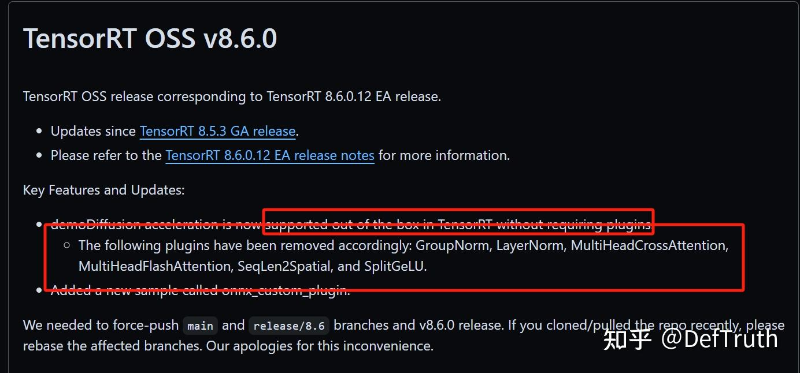
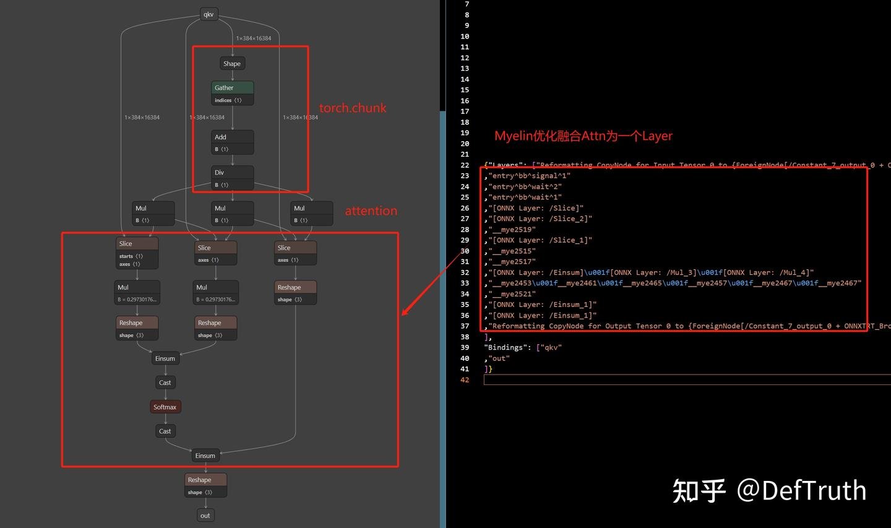
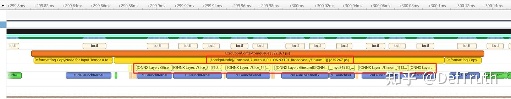
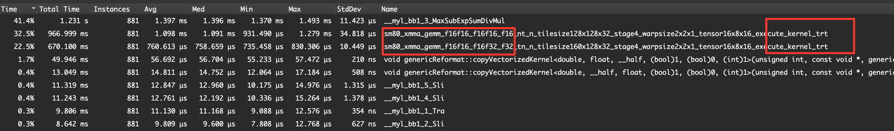
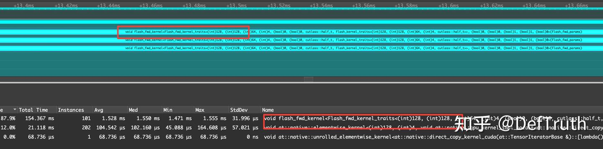
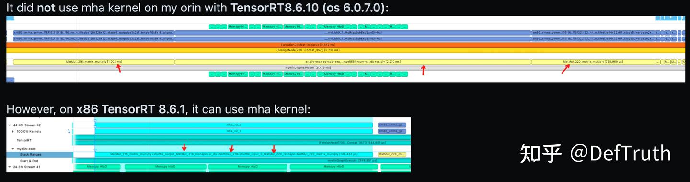
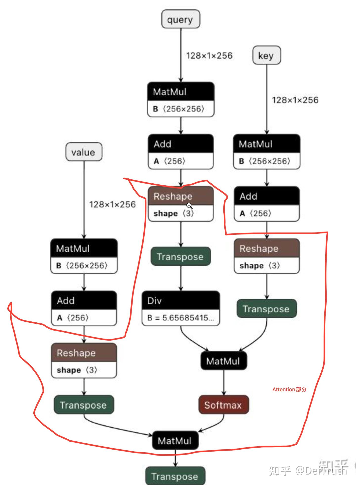
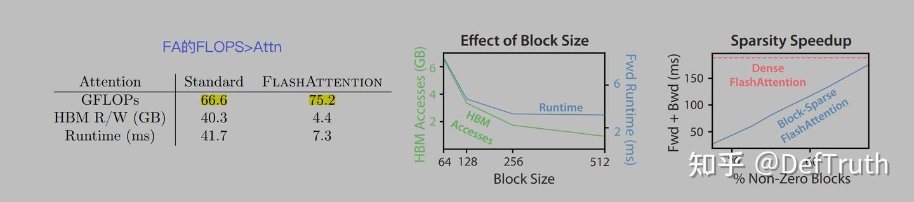
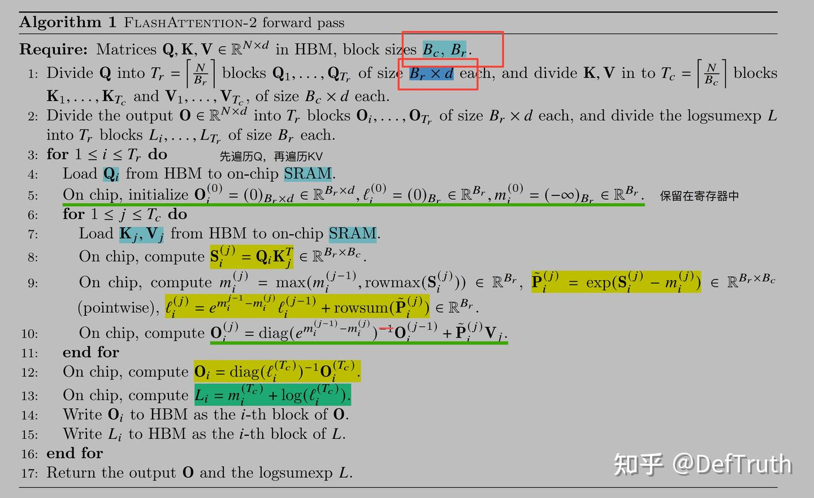
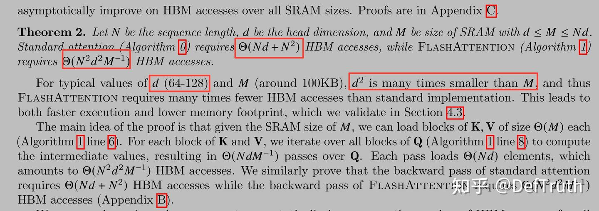

# [Attention 최적화] TensorRT 9.2 MHA/Myelin Optimize vs FlashAttention-2 profile

> 원문: https://zhuanlan.zhihu.com/p/678873216

**목차**
- 0x00 서문
- 0x01 TensorRT MHA Kernel
- 0x02 TensorRT Myelin Optimization
- 0x03 TensorRT가 MHA를 사용했는지 확인하기
- 0x04 TensorRT 9.2 구성
- 0x05 최신 FlashAttention 설치
- 0x06 MHA에 hit되지 않는 Attention
- 0x07 TensorRT Myelin vs FA2 성능 비교
- 0x08 Nsight System 분석
- 0x09 MHA에 hit되는 Attention
- 0x0a FA2 IO-Accesses 분석
- 0x0b 남은 사항

### 0x00 서문

가장 먼저 적어 둘 말은 이것입니다. **profile 없이는 최적화도 없습니다.** 물론 profile이 틀렸다면 최적화도 없겠지만요.

최근 FA2가 TensorRT 최적화와 비교해 Attention 성능을 얼마나 개선하는지 보고 싶어 여가 시간에 profile을 해 보기로 했습니다. TensorRT 8.6.1 이후에는 MHA/FMHA plugin이 제거되었고, MHA/FMHA 구현이 TensorRT 내부로 들어갔습니다. 저는 TensorRT 9.2를 사용했습니다. 따라서 QKV Attention이 이미 graph optimization에 hit되어 FMHA kernel에서 실행되고 있을 수 있습니다. 그러면 실제로 측정하는 것은 원래의 흩어진 kernel 성능이 아니라 FMHA 성능입니다.

만약 FMHA kernel 자체 성능이 이미 FA2보다 좋다면, FA2를 이식한 뒤 오히려 기존보다 느려질 가능성도 있습니다. 그래서 profile이 중요합니다. 보충하자면, 처음에는 FA2와 TensorRT MHA v2의 성능 비교를 직접 쓰려고 했습니다. 그런데 가져다 쓴 첫 번째 Attention 구현이 TensorRT MHA v2 kernel에 hit되지 않는다는 것을 발견했습니다. 그래서 글의 방향이 TensorRT Myelin으로 최적화된 Attention과 FA2 비교, MHA v2에 hit될 수 있는 Attention 작성법 정리, 그리고 FA2와 MHA v2가 큰 head_dim(d > 256, 512 등)을 지원하지 않는 로직 분석으로 바뀌었습니다.

### 0x01 TensorRT MHA Kernel

먼저 배경을 설명합니다. TRT 8.6 이후 기존 일부 plugin이 TensorRT 내부로 들어갔습니다. MHA/FMHA도 포함됩니다. 아래는 8.6 release notes입니다. 장점은 plugin을 수동으로 연결하지 않아도 MHA 최적화를 사용할 수 있다는 것입니다. 단점도 있습니다. 사용자가 잃는 자율성이 생깁니다. MHA에 hit되는지 여부는 완전히 TensorRT 내부 제어에 달려 있고, 현재 engine이 이미 MHA에서 실행되는지 판단하기가 쉽지 않습니다.


*TensorRT 8.6 Release Notes*

### 0x02 TensorRT Myelin Optimization

Myelin은 TRT 내부의 개념입니다. 현재 TensorRT는 Myelin에 대한 문서를 제공할 계획이 없어 보입니다. 관련 issue는 원문을 참고하면 됩니다.

TensorRT graph optimization 단계에서는 사람이 작성한 fusion, 예를 들어 ConvBNFusion, PWN 등을 수행하는 것 외에도 Myelin으로 추가 최적화를 합니다. hit된 nodes는 하나의 큰 layer로 조합됩니다. `trtexec`로 engine을 build할 때 layer info를 dump하면, 이 layer가 `"Myelin"`이라는 신비로운 이름을 갖고 `ForeignNode`로 표시되는 것을 볼 수 있습니다. `ForeignNode`는 Tactic 단계에서 skip되는 듯하고, `TacticValue`는 `0x000000000`입니다.

```text
{ForeignNode[/Constant_7_output_0 + ONNXTRT_Broadcast.../Einsum_1]}
"LayerType": "Myelin"
```

FusedMHA와 비교하면 공식은 Myelin 사용을 추천합니다. 사실 사용하지 않을 방법도 없어 보입니다. Myelin을 끄는 API가 제공되지 않기 때문입니다. 그래프의 특정 부분을 직접 작성한 plugin으로 수동 교체하지 않는 한 그렇습니다.

Myelin 최적화 관련 자료가 너무 적어, 검색해 찾은 자료를 간단히 정리합니다.

| link | notes |
| --- | --- |
| https://github.com/NVIDIA/TensorRT/issues/3243 | Myelin: attention fusion and FlashAttention |
| https://github.com/NVIDIA/TensorRT/issues/2577 | Myelin ForeignNode takes most time at engine build & inference |
| https://github.com/NVIDIA/TensorRT/issues/3108 | Difference of Myelin optimization and FusedMHA plugin |
| https://github.com/NVIDIA/TensorRT/issues/2576 | Detail when Myelin is used and why |
| https://github.com/NVIDIA/TensorRT/issues/2308 | Two of the ForeignNodes consumes 60% inference time, among 1000 nodes |
| https://github.com/NVIDIA/TensorRT/issues/3520 | Custom Attention implementation not well optimised by TensorRT |
| https://github.com/NVIDIA/TensorRT/issues/2981 | trt8.6.1 Multi-Head Attention(MHA) fusions |
| https://github.com/NVIDIA/TensorRT/issues/3620 | Myelin fused Attn but not run at MHA Kernel |
| https://github.com/NVIDIA/TensorRT/issues/3575 | Attention did not use mha kernel (multi head attention) on orin TRT8.6.10 |

> ForeignNode is operators handled by Myelin(a non open-source DL compiler) or DLA. usually it is NOT a node but contain many nodes. e.g. Myelin will fuse lots of operators into a big operator(ForeignNode) to improve performance. in you case `{ForeignNode[ReduceMean_4492...Mul_4557]}` all node between ReduceMean_4492 and Mul_4557.

### 0x03 TensorRT가 MHA를 사용했는지 확인하기

답은 nsys profile과 ncu profile입니다. TensorRT 공식 issue에 따르면, Myelin으로 최적화된 layer가 MHA kernel을 사용하는지 판단하려면 현재는 Nsight Systems로 profile하는 수밖에 없습니다. 이름에 `_mha`가 포함된 kernel이 보이면 MHA/FMHA에서 실행된 것입니다. 그렇지 않으면 MHA를 사용하지 않은 것입니다.

즉 attention이 Myelin에 의해 최적화되더라도, 하위에서 실행되는 kernel이 반드시 MHA인 것은 아닐 수 있습니다. 이 부분 코드는 closed source라 profile로 검증할 수밖에 없습니다.

짧게 요약하면 다음과 같습니다.

> For now, you can only check the Nsight Systems profiles: https://docs.nvidia.com/deeplearning/tensorrt/developer-guide/index.html#nvprof If the MHA is fused, there should be kernel names with _mha in the profile. In next TRT version, you will be able to get this info by using the IEngineInspector (or --profilingVerbosity=detailed --dumpLayerInfo if you're using trtexec).

### 0x04 TensorRT 9.2 구성

NVIDIA 공식 사이트에서 받을 수 있는 것은 아직 8.6GA이고, 최신 TensorRT 9.2는 GitHub repo에서 제공하는 링크로 다운로드해야 합니다. 아래는 `release/9.2` branch의 Dockerfile 일부입니다.

```dockerfile
RUN if [ "${CUDA_VERSION:0:2}" = "11" ]; then \
    wget https://developer.nvidia.com/downloads/compute/machine-learning/tensorrt/9.2.0/tensorrt-9.2.0.5.linux.x86_64-gnu.cuda-11.8.tar.gz \
        && tar -xf tensorrt-9.2.0.5.linux.x86_64-gnu.cuda-11.8.tar.gz \
        && cp -a TensorRT-9.2.0.5/lib/*.so* /usr/lib/x86_64-linux-gnu \
        && pip install TensorRT-9.2.0.5/python/tensorrt-9.2.0.post11.dev5-cp38-none-linux_x86_64.whl ;\
elif [ "${CUDA_VERSION:0:2}" = "12" ]; then \
    wget https://developer.nvidia.com/downloads/compute/machine-learning/tensorrt/9.2.0/tensorrt-9.2.0.5.linux.x86_64-gnu.cuda-12.2.tar.gz \
        && tar -xf tensorrt-9.2.0.5.linux.x86_64-gnu.cuda-12.2.tar.gz \
        && cp -a TensorRT-9.2.0.5/lib/*.so* /usr/lib/x86_64-linux-gnu \
        && pip install TensorRT-9.2.0.5/python/tensorrt-9.2.0.post12.dev5-cp38-none-linux_x86_64.whl ;\
```

저는 CUDA 12.2를 사용했으므로 CUDA 12 대응 TensorRT package를 다운로드했습니다.

```bash
wget https://developer.nvidia.com/downloads/compute/machine-learning/tensorrt/9.2.0/tensorrt-9.2.0.5.linux.x86_64-gnu.cuda-12.2.tar.gz
```

whl package 설치 후 환경 변수를 설정합니다.

```bash
export TENSORRT_HOME=/home/qiuyanjun/TensorRT-9.2.0.5
export PATH=$TENSORRT_HOME/bin:$PATH
export LD_LIBRARY_PATH=$TENSORRT_HOME/lib:$LD_LIBRARY_PATH
```

`trtexec`로 환경이 정상인지 확인합니다.

```text
trtexec --help
&&&& RUNNING TensorRT.trtexec [TensorRT v9200] # trtexec --help
=== Model Options ===
  --onnx=<file>               ONNX model
....
```

### 0x05 최신 FlashAttention 설치

최신 flash-attention으로 테스트하기 위해 소스에서 직접 빌드해 설치합니다. 소스 빌드는 memory를 꽤 많이 사용합니다. 머신 memory가 작다면(<=16GB) `MAX_JOBS=1`로 빌드하는 것이 좋습니다. 그렇지 않으면 빌드 프로세스가 시스템에 의해 kill될 수 있습니다.

```bash
git clone https://github.com/Dao-AILab/flash-attention.git
cd flash-attention 
git submodule update --init --recursive --force
```

FlashAttention을 소스 빌드합니다. WSL2에서 빌드한다면 `.wslconfig`에 memory 제한을 설정해 두세요. 그렇지 않으면 빌드 프로세스가 kill될 확률이 높습니다.

```bash
MAX_JOBS=1 python setup.py install # 잠시 기다림
```

### 0x06 MHA에 hit되지 않는 Attention

테스트 비교를 위해 가장 단순한 Attention을 하나 가져왔습니다. 코드는 아래와 같습니다. 이 Attention 구현은 `einsum` op를 사용하므로 TensorRT 9.2에서 MHA v2에 hit되지 않습니다. 개인적으로는 TRT의 Attention pattern 지원이 아직 여러 형태에 충분히 완성되지 않았고, `einsum` 자체가 너무 복잡해서 현재는 MHA v2 pattern에 match되지 않는 것으로 보입니다. 이 Attention은 naive Attention with Myelin Optimize와 FlashAttention2의 성능을 비교하는 데 사용할 수 있습니다.

```python
# attn.py 
import math
import torch
import torch.nn as nn  
import argparse 

class QKVAttention(nn.Module):
    def __init__(self, n_heads=1):
        super().__init__()
        self.n_heads = n_heads
    
    @torch.no_grad()
    def forward(self, qkv):
        """
        Apply QKV attention.
        :param qkv: an [b,3c,h*w] tensor of Qs, Ks, and Vs.
        :return: an [b,c,h*w] tensor after attention.
        """
        bs, width, length = qkv.shape
        assert width % (3 * self.n_heads) == 0
        ch = width // (3 * self.n_heads) # ch가 head_dim. width는 정확히 3*ch(Q, K, V)
        q, k, v = qkv.chunk(3, dim=1) # [b,c,h*w], [b,c,h*w], [b,c,h*w]
        scale = 1 / math.sqrt(math.sqrt(ch))
        weight = torch.einsum(
            "bct,bcs->bts",
            (q * scale).view(bs * self.n_heads, ch, length), 
            (k * scale).view(bs * self.n_heads, ch, length),
        ) # [b,h*w,h*w]
        weight = torch.softmax(weight.float(), dim=-1).type(weight.dtype) # [b,h*w,h*w]
        a = torch.einsum("bts,bcs->bct", weight,
                      v.reshape(bs * self.n_heads, ch, length)) # [b,h*w,h*w] * [b,c,h*w] -> [b,c,h*w]
        return a.reshape(bs, -1, length) # [b,c,h*w]
```

이는 Diffusion에서 사용하는 Attention으로, pixel-level feature에 대해 attention을 계산합니다. 더 자세한 설명은 Diffusion 관련 글, 예를 들어 "小小将: 扩散模型之DDPM"을 참고할 수 있습니다.

ONNX로 export하는 예시는 다음과 같습니다.

```python
from attn import QKVAttention  
import torch  
import argparse  
import onnx

def get_args():
    parser = argparse.ArgumentParser()
    parser.add_argument("--head_num", type=int, default=1)
    parser.add_argument("--h", type=int, default=128)
    parser.add_argument("--w", type=int, default=128)
    parser.add_argument("--bs", type=int, default=1)
    parser.add_argument("--channel", type=int, default=128)
    args = parser.parse_args()
    return args

if __name__ == "__main__":
    args = get_args()
    attn_model = QKVAttention(args.head_num)
    qkv = torch.randn((args.bs, 3*args.channel, args.h*args.w)).float()
    torch.onnx.export(attn_model, qkv, f"attn-{args.channel}-{args.h}x{args.w}.onnx", 
                      input_names=["qkv"], output_names=["out"])
    model = onnx.load(f"attn-{args.channel}-{args.h}x{args.w}.onnx")
    onnx.checker.check_model(model)
    print(f"attn-{args.channel}-{args.h}x{args.w}.onnx generated.")
```

TensorRT에서 테스트하려면 먼저 Attention을 ONNX로 export한 뒤 `trtexec`로 engine 파일을 build해야 합니다. TRT 최적 성능을 얻기 위해 서로 다른 `seq_len`, 즉 `H*W`, 그리고 서로 다른 `head_dim`, 즉 `ch`에 대해 각각 정적 graph를 export합니다. 제 3080에서는 256x256=64K seq_len을 임시로 테스트하지 못했습니다. 구성은 다음과 같습니다.

| head_num | seq_len(H*W) | head_dim(CH) |
| --- | --- | --- |
| 1 | 128*128(16384, 16K) | 128 |
| 1 | 128*96(12288, 12K) | 128 |
| 1 | 64*64(4096, 4K) | 128 |
| 1 | 32*32(1024, 1K) | 128 |
| 1 | 128*128(16384, 16K) | 256 |
| 1 | 128*96(12288, 12K) | 256 |
| 1 | 64*64(4096, 4K) | 256 |
| 1 | 32*32(1024, 1K) | 256 |
| 1 | 128*128(16384, 16K) | 512 |
| 1 | 128*96(12288, 12K) | 512 |
| 1 | 64*64(4096, 4K) | 512 |
| 1 | 32*32(1024, 1K) | 512 |

```bash
# channel 128
python3 export.py --head_num 1 --h 128 --w 128 --bs 1 --channel 128
python3 export.py --head_num 1 --h 128 --w 96 --bs 1 --channel 128
python3 export.py --head_num 1 --h 64 --w 64 --bs 1 --channel 128
python3 export.py --head_num 1 --h 32 --w 32 --bs 1 --channel 128
# channel 256
python3 export.py --head_num 1 --h 128 --w 128 --bs 1 --channel 256
python3 export.py --head_num 1 --h 128 --w 96 --bs 1 --channel 256
python3 export.py --head_num 1 --h 64 --w 64 --bs 1 --channel 256
python3 export.py --head_num 1 --h 32 --w 32 --bs 1 --channel 256
# channel 512
python3 export.py --head_num 1 --h 128 --w 128 --bs 1 --channel 512
python3 export.py --head_num 1 --h 128 --w 96 --bs 1 --channel 512
python3 export.py --head_num 1 --h 64 --w 64 --bs 1 --channel 512
python3 export.py --head_num 1 --h 32 --w 32 --bs 1 --channel 512
```

TensorRT Engine으로 변환하는 예시는 다음과 같습니다. FP16을 사용합니다. 현재 FA는 FP16과 BF16 input만 지원하기 때문입니다.

```bash
trtexec --onnx=attn-128-128x128.onnx --saveEngine=attn-128-128x128.fp16.engine --fp16 --verbose # fp16
```

Myelin graph optimization 부분 로그는 아래와 같습니다. 계산 부분이 이미 Myelin optimization에 hit되었고, Tactic 값은 `0x0000000000000000`입니다.

```text
[I] [TRT] Engine generation completed in 6.7165 seconds.
[01/20/2024-19:48:39] [V] [TRT] Engine Layer Information:
Layer(Reformat): Reformatting CopyNode for Input Tensor 0 to {ForeignNode[/Constant_7_output_0 + ONNXTRT_Broadcast.../Einsum_1]}, Tactic: 0x00000000000003ea, qkv (Float[1,384,16384]) -> Reformatted Input Tensor 0 to {ForeignNode[/Constant_7_output_0 + ONNXTRT_Broadcast.../Einsum_1]} (Half[1,384,16384])
Layer(Myelin): {ForeignNode[/Constant_7_output_0 + ONNXTRT_Broadcast.../Einsum_1]}, Tactic: 0x0000000000000000, Reformatted Input Tensor 0 to {ForeignNode[/Constant_7_output_0 + ONNXTRT_Broadcast.../Einsum_1]} (Half[1,384,16384]) -> Reformatted Output Tensor 0 to {ForeignNode[/Constant_7_output_0 + ONNXTRT_Broadcast.../Einsum_1]} (Half[1,128,16384])
Layer(Reformat): Reformatting CopyNode for Output Tensor 0 to {ForeignNode[/Constant_7_output_0 + ONNXTRT_Broadcast.../Einsum_1]}, Tactic: 0x00000000000003e8, Reformatted Output Tensor 0 to {ForeignNode[/Constant_7_output_0 + ONNXTRT_Broadcast.../Einsum_1]} (Half[1,128,16384]) -> out (Float[1,128,16384])
```

FlashAttention으로 교체한 구현은 다음과 같습니다.

```python
import torch
import torch.nn as nn  
from flash_attn import flash_attn_qkvpacked_func, flash_attn_func
import argparse  

class FlashQKVAttention(nn.Module):
    def __init__(self, n_heads=1):
        super().__init__()
        self.n_heads = n_heads
    
    @torch.no_grad()
    def forward(self, qkv):
        """
        Apply QKV attention.

        :param qkv: an [b,3c, h*w] tensor of Qs, Ks, and Vs.
        :return: an [b,c,h*w] tensor after attention.
        """
        qkv = qkv.permute(0, 2, 1).contiguous() # [b,h*w,3c]
        bs, seqlen, headdims = qkv.shape
        assert headdims % (3 * self.n_heads) == 0
        headdim = headdims // (3 * self.n_heads) # headdims는 정확히 3*headdim(Q, K, V)
        q, k, v = qkv.chunk(3, dim=-1) # [b,h*w,c], [b,h*w,c], [b,h*w,c]
        q = q.view(bs, seqlen, self.n_heads, headdim)
        k = k.view(bs, seqlen, self.n_heads, headdim)
        v = v.view(bs, seqlen, self.n_heads, headdim)
        a = flash_attn_func(q, k, v) # [b,h*w,1,c] (batch_size, seqlen, nheads, headdim).
        a = a.view(bs, seqlen, self.n_heads * headdim) # [b,h*w,1*c]
        return a.permute(0, 2, 1).contiguous() # [b,1*c,h*w]
```

정확성 검증 결과도 일치합니다.

```text
(py10) ➜  test python3 equal.py
torch.Size([1, 128, 1024])
tensor(276.2500, device='cuda:0', dtype=torch.float16)
torch.Size([1, 128, 1024])
tensor(276.2500, device='cuda:0', dtype=torch.float16)
tensor(2.4676e-05, device='cuda:0', dtype=torch.float16)
```

### 0x07 TensorRT Myelin vs FA2 성능 비교

Attention 안에는 view와 chunk operation이 있지만 시간은 무시해도 됩니다. 제 3080에서 테스트했을 때 약 0.02~0.04ms 정도이고, 큰 계산 비용은 여전히 Attention 자체입니다. 테스트 머신은 다음과 같습니다.

```text
[01/21/2024-11:43:23] [I] === Device Information ===
[01/21/2024-11:43:24] [I] Available Devices:
[01/21/2024-11:43:24] [I]   Device 0: "NVIDIA GeForce RTX 3080 Laptop GPU" UUID: GPU-6319d056-d1b0-6700-58cc-461d7dc800ce
[01/21/2024-11:43:24] [I] Selected Device: NVIDIA GeForce RTX 3080 Laptop GPU
[01/21/2024-11:43:24] [I] Selected Device ID: 0
[01/21/2024-11:43:24] [I] Selected Device UUID: GPU-6319d056-d1b0-6700-58cc-461d7dc800ce
[01/21/2024-11:43:24] [I] Compute Capability: 8.6
[01/21/2024-11:43:24] [I] SMs: 48
[01/21/2024-11:43:24] [I] Device Global Memory: 16383 MiB
[01/21/2024-11:43:24] [I] Shared Memory per SM: 100 KiB
[01/21/2024-11:43:24] [I] Memory Bus Width: 256 bits (ECC disabled)
[01/21/2024-11:43:24] [I] Application Compute Clock Rate: 1.545 GHz
[01/21/2024-11:43:24] [I] Application Memory Clock Rate: 7.001 GHz
```

성능 데이터입니다. `warmup=1`, `repeat=200`이며, 32*32의 시간은 전체적으로 너무 낮아 크게 참고하지 않아도 됩니다. 단위는 ms입니다.

| seq_len(H*W) | head_dim(CH) | TensorRT Myelin | FA2(latest) | Improved |
| --- | --- | ---: | ---: | ---: |
| 128*128(16K) | 128 | 5.92569 | 4.17991 | 29.46% |
| 128*96(12K) | 128 | 3.57897 | 2.22953 | 37.70% |
| 64*64(4K) | 128 | 0.53193 | 0.41962 | 21.11% |
| 32*32(1K) | 128 | 0.08912 | 0.11228 | -25.98% |
| 128*128(16K) | 256 | 7.23734 | 8.89753 | -22.93% |
| 128*96(12K) | 256 | 4.33378 | 4.70810 | -8.637% |
| 64*64(4K) | 256 | 0.68057 | 0.80922 | -18.90% |
| 32*32(1K) | 256 | 0.16251 | 0.15305 | 5.821% |
| 128*128(16K) | 512 | 10.9623 | Not Support | Not Support |
| 128*96(12K) | 512 | 6.41423 | Not Support | Not Support |
| 64*64(4K) | 512 | 0.97440 | Not Support | Not Support |
| 32*32(1K) | 512 | 0.27201 | Not Support | Not Support |

PyTorch + FP16 데이터도 하나 붙입니다. 성능이 TRT와 FA2보다 훨씬 낮아 모든 case를 하나씩 테스트하지는 않았습니다. 단위는 ms입니다.

| seq_len(H*W) | head_dim(CH) | PyTorch |
| --- | --- | ---: |
| 128*128(16K) | 128 | 22.37282 |
| 128*96(12K) | 128 | 12.55808 |
| 128*128(16K) | 256 | 26.42017 |
| 128*96(12K) | 256 | 14.93722 |

이 결과를 보면 FA2가 TensorRT의 Myelin 최적화보다 모든 설정에서 유리한 것은 아닙니다. `head_dim=128`에서는 128x128, 128x96, 64x64 seq_len에서 FA2가 TRT보다 약 20~25% 빠릅니다. 반면 `head_dim=256`에서는 결론이 뒤집혀 TensorRT Myelin Attn이 FA2보다 좋습니다. `head_dim=512`는 FA2가 지원하지 않고 TensorRT는 지원합니다.

주의: 여기서 비교한 것은 TensorRT가 실행한 **naive Attention with Myelin**이며, **MHA v2가 아닙니다.** 이유는 아래 분석을 참고하세요. 그래도 이 데이터는 참고 가치가 있으므로 삭제하지 않았습니다.

### 0x08 Nsight System 분석

TensorRT + FP16:

```bash
trtexec --loadEngine=attn-128-128x128.fp16.engine --iterations=100 --dumpProfile --dumpLayerInfo --exportProfile=profile.json --exportLayerInfo=layer.json --verbose
```

출력 로그에서 대부분의 시간은 Myelin ForeignNode가 차지합니다.

```text
[01/20/2024-20:25:39] [I] === Profile (290 iterations ) ===
[01/20/2024-20:25:39] [I]    Time(ms)     Avg.(ms)   Median(ms)   Time(%)   Layer
[01/20/2024-20:25:39] [I]       29.17       0.1006       0.0973       1.7   Reformatting CopyNode for Input Tensor 0 to {ForeignNode[/Constant_7_output_0 + ONNXTRT_Broadcast.../Einsum_1]}
[01/20/2024-20:25:39] [I]     1667.74       5.7508       5.7308      97.7   {ForeignNode[/Constant_7_output_0 + ONNXTRT_Broadcast.../Einsum_1]}
[01/20/2024-20:25:39] [I]       10.39       0.0358       0.0338       0.6   Reformatting CopyNode for Output Tensor 0 to {ForeignNode[/Constant_7_output_0 + ONNXTRT_Broadcast.../Einsum_1]}
[01/20/2024-20:25:39] [I]     1707.30       5.8873       5.8619     100.0   Total
```

원래 ONNX 모델과 비교해 보면, Myelin에 hit된 nodes가 정확히 전체 attention 부분임을 알 수 있습니다. 남은 Add, Mul 몇 개는 원래 `torch.chunk`에 대응되는 것으로 보입니다. chunk 이후 각 tensor의 원래 index를 계산해 Slice Op에 전달하는 역할입니다. 세 Slice의 결과가 각각 Q, K, V입니다.


*ONNX vs Myelin Optimization*

다음 명령으로 nsys를 확인합니다.

```bash
nsys profile --stats=true -t cuda,osrt,nvtx -o attn-128-128x128.fp16 --force-overwrite true trtexec --loadEngine=attn-128-128x128.fp16.engine
```


*WSL2 nsys profile timeline view*

제 컴퓨터에서는 WSL2가 아직 CUDA kernel data collect를 지원하지 않아 위 timeline만 얻었고, 실제 어떤 kernel이 실행되었는지는 볼 수 없었습니다. 이후 Linux에서 profile한 결과를 보충했습니다.

TensorRT profile:


*Nsight Timeline View*


*Nsight Stats View*

아쉽게도 nsys 결과를 보면 이번에 Myelin으로 최적화된 Attention은 이름에 `_mha`가 포함된 kernel에서 실행되지 않았습니다. 두 `einsum` 연산은 최종적으로 두 개의 대응되는 `xmma_gemm` kernel로 변환되었습니다. 물론 이 두 kernel이 충분히 빨라서, TensorRT가 일부 설정에서 FA2보다 더 유리합니다. 예를 들어 head_dim=256, 즉 K >= 256일 때 그렇습니다. stats view에서 시간 비중이 가장 큰 것은 `__myl_bb1_3_MaxSubExpSumDivMul` kernel입니다. 이는 softmax와 그 전후 일부 op를 fusion한 것으로 보입니다.

flash_attn profile:

```bash
nsys profile --stats=true -t cuda,osrt,nvtx -o flashattn-128-128x128.fp16 --force-overwrite true python3 flashattn.py --head_num 1 --h 128 --w 128 --bs 1 --channel 128
```


*Timeline + Stats*

profile 결과만 보면 `head_dim=128`, `seq_len=128x128=16K` 상황에서 FA2는 TensorRT Myelin보다 꽤 빠릅니다. 하나의 fused kernel만 실행하기 때문입니다. TRT는 두 matrix multiplication을 분리해서 실행해야 합니다. 다른 구성의 실험은 시간이 되면 보충할 예정입니다.

도움 요청: Myelin의 Attention 최적화를 profile해 보고 `_mha` kernel을 발견한 분이 있다면 알려 주세요. 개인적으로 이 문제를 검증해 보고 싶습니다.

### 0x09 MHA에 hit되는 Attention

보충: GitHub issue에서 본 profile에 따르면 어떤 경우에는 `mha_v2_0` kernel에 hit됩니다. 결국 pattern matching 문제로 보입니다. 현재는 다양한 attn pattern에 잘 hit된다고 말하기 어렵습니다.



> from the issue: could you share the ONNX with the LayerNorm? TRT 8.6 has quite restricted MHA pattern matching code > and we need to find out why it didn't trigger the fusion. TRT 9.2 has much looser checking. I would also try to make the MHA looks like:

```text
Q: [B, S, H] -MatMul-> [B, S, H] -Reshape-> [B, S, N, h] -Transpose-> [B, N, S, h] -> MatMul -> [B, N, S, S] -> MatMul -> [B, N, S, h] -Transpose-> [B, S, N, h] -Reshape-> [B, S, H] -LayerNorm->...
K: [B, S, H] -MatMul-> [B, S, H] -Reshape-> [B, S, N, h] -Transpose-> [B, N, h, S] ---^                           ^
V: [B, S, H] -MatMul-> [B, S, H] -Reshape-> [B, S, N, h] -Transpose-> [B, N, S, h] --------------------------------
```

여기서 `B=1, S=128, H=256, N=8, h=32`입니다.

마지막에 확인한 결과 `mha_v2` kernel에 hit되지 않은 이유는 graph matching 문제였습니다. 이번 테스트에 사용한 attention은 `einsum` op를 사용했고, 현재 Attention Pattern에 match되지 않은 듯합니다. 위 issue 답변처럼 Attention을 수정해 `torch.matmul`로 matrix multiplication을 수행하면 TensorRT의 Attention pattern이 match되어 `mha_v2` kernel을 사용할 수 있습니다. GitHub의 사용자가 제공한 ONNX 파일을 직접 사용해 TensorRT 9.2에서 이 결론을 재현할 수 있었습니다.

```bash
wget https://github.com/NVIDIA/TensorRT/files/13810286/attention.zip
```


*Attention*

그림처럼 이 pattern에 맞춰 Attention을 수정하면 `mha_v2` kernel을 사용할 수 있습니다. Q, K, V가 들어온 뒤 각자 MatMul 하나를 수행하는데, 이는 linear transform입니다. 진짜 Attention 부분은 세 branch의 Reshape, Transpose Op부터 시작됩니다. Div는 scale 처리이고, QK의 첫 번째 MatMul + Softmax가 Attention을 계산합니다. 마지막 MatMul은 V를 Attention에 따라 합칩니다.

아래는 MHA pattern에 맞는 Attention 코드입니다. 댓글에서 lavita님이 제공한 Pastebin.com 코드입니다.

```python
class QKVAttention(nn.Module):
    def __init__(self, n_heads=1):
        super().__init__()
        self.n_heads = n_heads
    
    @torch.no_grad()
    def forward(self, qkv):
        """
        Apply QKV attention.
        :param qkv: an [b,3c,h*w] tensor of Qs, Ks, and Vs.
        :return: an [b,c,h*w] tensor after attention.
        """
        bs, width, length = qkv.shape
        assert width % (3 * self.n_heads) == 0
        ch = width // (3 * self.n_heads) # ch가 head_dim. width는 정확히 3*ch(Q, K, V)
        qkv = qkv.transpose(-2, -1)
        q, k, v = qkv.chunk(3, dim=2) # [b,h*w,c], [b,h*w,c], [b,h*w,c]
        scale = 1 / math.sqrt(math.sqrt(ch))
        weight = torch.matmul(
            (q * scale).view(bs, self.n_heads, length, ch),
            (k * scale).view(bs, self.n_heads, length, ch).transpose(-2, -1)
        ) # [b,n,h*w,h*w]
        weight = torch.softmax(weight.float(), dim=-1).type(weight.dtype) # [b,n,h*w,h*w]
        a = torch.matmul(
            weight,
            v.reshape(bs, self.n_heads, length, ch)
        ) # [b,n,h*w,h*w] * [b,n,h*w,c] -> [b,n,h*w,c]
        return a.reshape(bs, length, -1).transpose(-2, -1) # [b,c,h*w]
```

nsys 결과는 다음과 같습니다.

```text
Time (%)     Avg (ns)               Name
 --------    ---------   ----------------------------------------------------------------------------------------------------
     90.7    1779139.1  __mye8037_gemm_mha_v2
      5.2     101288.2  __myl_bb1_2_TraSliSliResTraResMovSli
      2.9    56295.7    void genericReformat::copyVectorizedKernel<double, float, __half, (bool)1, (bool)0, (int)1>(unsigne…
      0.7    13240.8    void genericReformat::copyVectorizedKernel<double, __half, float, (bool)1, (bool)0, (int)1>(unsigne…
      0.6     11709.0   __myl_bb1_1_TraMov
```

`__mye8037_gemm_mha_v2` kernel에 hit된 것을 볼 수 있습니다.

### 0x0a FA2 IO-Accesses 분석

이 글은 TensorRT 9.2의 Attention 최적화(Myelin optimization과 MHA v2 두 종류)와 FlashAttention-2의 차이를 비교했습니다. 테스트 결과를 보면 FA2가 TensorRT Myelin 최적화보다 모든 구성에서 유리한 것은 아닙니다. `head_dim=128`에서는 128x128, 128x96, 64x64 seq_len에서 FA2가 TRT보다 약 20~25% 빠릅니다. 반면 `head_dim=256`에서는 TensorRT가 FA2보다 좋습니다. `head_dim=512`에서는 FA2가 지원하지 않고, TensorRT MHA v2도 hit되지 않지만 `xmma_gemm` kernel로 직접 계산합니다.

`head_dim > 256` 문제에 대해 FA2 저자에게 issue로 문의했습니다. 의미는 `numhead=1`, `headdim>256`일 때는 flash-attn을 사용하는 것보다 native Attn을 계산하는 편이 더 빠를 수 있다는 것입니다.

> with numhead = 1 and large headdim i think it's faster to compute attention naively rather than using flash-attn.


*FA1 Effect of Block Size*


*FA2 Forward Pass*

개인적인 이해는 다음과 같습니다. 논문 알고리즘(FA1 + FA2)에 따르면 head_dim `d`가 커질수록 `Br`과 `Bc`가 작아집니다. 즉 Block Size가 작아집니다. Block Size가 작을수록 runtime은 증가합니다. 각 thread block의 SRAM에 담을 수 있는 데이터가 제한되어 있고, 이것이 시스템의 active SM 상한을 제한하기 때문입니다. `d`가 클수록 같은 seq_len에 대해 더 많은 반복, 즉 더 많은 thread block이 필요합니다. 같은 occupancy에서는 더 많이 scheduling해야 계산이 끝나므로 시간이 늘어납니다.

또한 `Br`이 작아진다는 것은 바깥쪽 Q loop 횟수가 많아진다는 뜻입니다. 매 Q loop마다 전체 K, V를 block 단위로 SRAM에 load해야 합니다. 즉 memory accesses도 증가하고, 시간도 늘어납니다. 이는 FA2가 memory accesses를 최적화하려는 목표와도 멀어집니다. 논문에서 제시한 FA의 memory accesses 계산식은 다음과 같습니다.


*FA HBM Memory Accesses*

Memory Accesses는 `d^2`에 비례합니다. 따라서 d가 커질수록 FA의 Memory Accesses는 급격히 증가합니다. 예를 들어 `N=2K`, `M=192KB`에서 `d=256`이면 여전히 FA IO Accesses < Naive Attention입니다. 하지만 **d=512에서는 결론이 반대로 바뀌어 FA IO Accesses > Naive Attention IO Accesses**가 됩니다. FA 자체의 FLOPS도 Naive Attention보다 높기 때문에, 이때는 IO와 FLOPS 모두 FA가 Naive Attention보다 불리합니다. memory access와 계산량 모두에서 장점이 없고, 남는 장점은 중간 S/P matrix를 저장하지 않아도 되는 GPU memory 절약, 즉 `O(N^2)` memory complexity 회피 정도입니다.

```python
# N=2048, d=256, M=192KB(A100) FA IO Acesses < Naive Attention IO Acesses
>>> 2048*256 + 2048*2048  # Naive Attention 
4718592
>>> 2048*2048*256*256/(192*1024) # FA
1398101.3333333333 
# N=2048, d=512, M=192KB(A100) FA IO Acesses > Naive Attention IO Acesses
>>> 2048*512 + 2048*2048  # Naive Attention 
5242880
>>> 2048*2048*512*512/(192*1024) # FA
5592405.333333333
```

### 0x0b 남은 사항

- Linux에서 profile을 보충해 Myelin 최적화 이후 Attention이 MHA Kernel에서 실행되는지 확인하기. 완료.
- 계속 업데이트 중입니다. 오류가 있으면 먼저 올린 뒤 수정하겠습니다. 지적 환영합니다.
- issue를 올려 도움을 요청했고, 해결되었습니다.
