# FlashAttention fp8 구현 (Ada 아키텍처)

> 원문: https://zhuanlan.zhihu.com/p/712314257

본 글은 [shengying.wei: FlashAttention 노트](../B31_flash_attention_notes/README.md)를 기반으로 한 추가 시도로, **Ada(sm_89) 아키텍처에서 FlashAttention fp8 버전 구현**입니다. 학습용으로 적합. 코드: https://github.com/weishengying/cutlass_flash_atten_fp8 (https://github.com/66RING/tiny-flash-attention 기반 수정).

벤치마크:

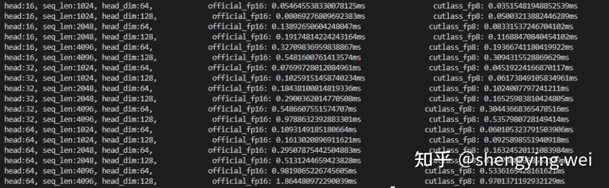

## 주요 변경점

핵심 변경은 두 가지:

1. **sm_89에서 fp8 mma 명령 세트 선택**, shared memory layout·swizzle 정의 조정
2. 첫 gemm 결과 C의 Layout을 둘째 gemm의 A layout 요구에 맞게 **조정** — 스레드 내 데이터 교환·layout 정의 포함

## MMA 명령 세트 선택

### SM80_16x8x16_F16F16F16F16_TN

CuTe에는 sm_89의 fp8 mma 캡슐화가 없으므로 직접 캡슐화 필요. 캡슐화 전 SM80 MMA 명령 학습 — `SM80_16x8x16_F16F16F16F16_TN` 예. https://github.com/NVIDIA/cutlass/blob/v3.5.0/include/cute/arch/mma_sm80.hpp#L92

```cpp
// MMA 16x8x16 TN
struct SM80_16x8x16_F16F16F16F16_TN
{
  using DRegisters = uint32_t[2];
  using ARegisters = uint32_t[4];
  using BRegisters = uint32_t[2];
  using CRegisters = uint32_t[2];

  CUTE_HOST_DEVICE static void
  fma(uint32_t      & d0, uint32_t      & d1,
      uint32_t const& a0, uint32_t const& a1, uint32_t const& a2, uint32_t const& a3,
      uint32_t const& b0, uint32_t const& b1,
      uint32_t const& c0, uint32_t const& c1)
  {
#if defined(CUTE_ARCH_MMA_SM80_ENABLED)
    asm volatile(
      "mma.sync.aligned.m16n8k16.row.col.f16.f16.f16.f16 "
      "{%0,  %1},"
      "{%2,  %3,  %4,  %5},"
      "{%6,  %7},"
      "{%8,  %9};\n"
      : "=r"(d0), "=r"(d1)
      :  "r"(a0),  "r"(a1),  "r"(a2),  "r"(a3),
         "r"(b0),  "r"(b1),
         "r"(c0),  "r"(c1));
#else
    CUTE_INVALID_CONTROL_PATH("Attempting to use SM80_16x8x16_F16F16F16F16_TN without CUTE_ARCH_MMA_SM80_ENABLED");
#endif
  }
};
```

레지스터 수 주의. `mma.sync.aligned.m16n8k16` PTX 문서 참고. 각 스레드가 처리할 A(m=16, k=16) 원소 수 = `16*16/32 = 8`, 8개 half = 4 uint32_t → **`ARegisters = uint32_t[4]`**.

마찬가지로 B·C는 `16*8/32 = 4` 원소 → `BRegisters = uint32_t[2]`, `CRegisters = uint32_t[2]`.

대응 Traits — 입출력 dtype·기대 Layout 기술:

```cpp
// (T32,V4) -> (M16,N8)
using SM80_16x8_Row = Layout<Shape <Shape < _4,_8>,Shape < _2,_2>>,
                             Stride<Stride<_32,_1>,Stride<_16,_8>>>;

template <>
struct MMA_Traits<SM80_16x8x16_F16F16F16F16_TN>
{
  using ValTypeD = half_t;
  using ValTypeA = half_t;
  using ValTypeB = half_t;
  using ValTypeC = half_t;

  using Shape_MNK = Shape<_16,_8,_16>;
  using ThrID   = Layout<_32>;
  using ALayout = Layout<Shape <Shape < _4,_8>,Shape < _2,_2,  _2>>,
                         Stride<Stride<_32,_1>,Stride<_16,_8,_128>>>;
  using BLayout = Layout<Shape <Shape < _4,_8>,Shape <_2, _2>>,
                         Stride<Stride<_16,_1>,Stride<_8,_64>>>;
  using CLayout = SM80_16x8_Row;
};
```

`ValTypeD` 등은 입출력 dtype, `Shape_MNK`는 MMA atom 처리 가능 크기. Ampere에서 MMA는 warp level이라 **`ThrID` size = 32**.

ALayout·BLayout·CLayout: `(warp_thread_id, value_id) → (m, n)` 매핑.

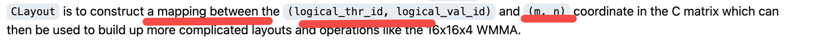

좌표 (m, n) 인코딩 방식:

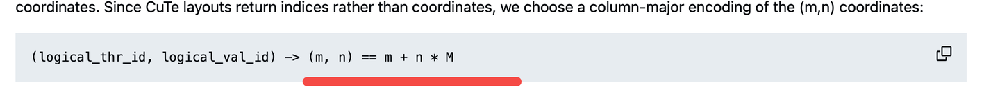

`SM80_16x8x16_F16F16F16F16_TN` MMA latex:

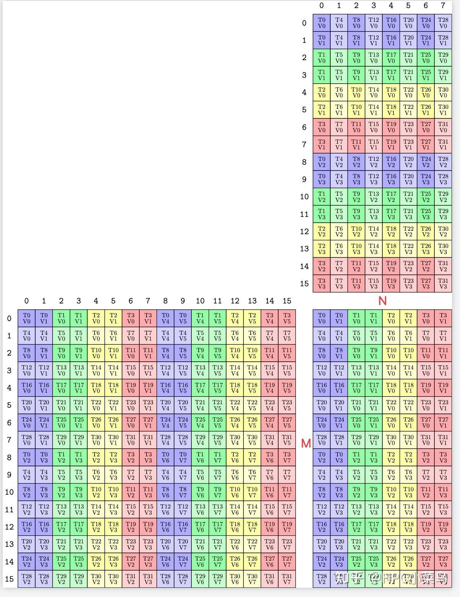

CLayout 예 — `SM80_16x8_Row` 출력(부분):

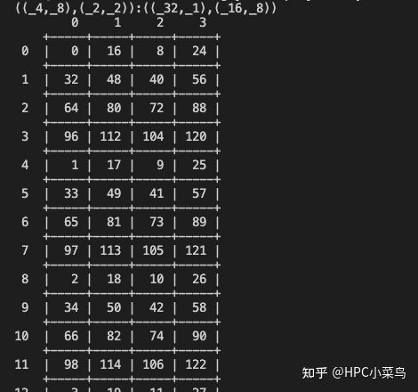

대응 관계:

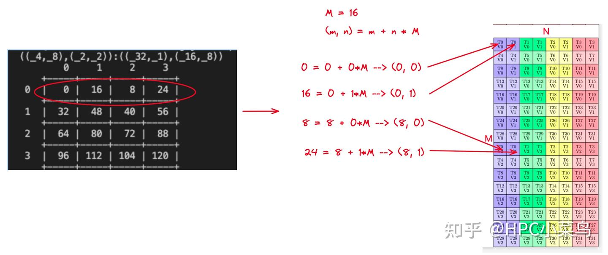

ALayout·BLayout 의미 동일.

### SM89_16x8x32_F32F8F8F32_E4M3_TN

sm_89 지원 fp8 명령:

```
mma.sync.aligned.m16n8k32.row.col.f32.e4m3.e4m3.f32
mma.sync.aligned.m16n8k32.row.col.f32.e5m2.e5m2.f32
```

PTX 문서: https://docs.nvidia.com/cuda/parallel-thread-execution/index.html#matrix-fragments-for-mma-m16n8k32

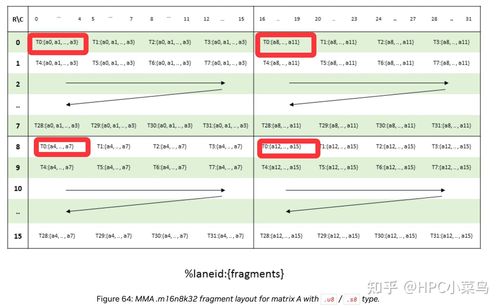

입력은 fp8, 출력은 fp32.

- A (m=16, k=32): 스레드당 `16*32/32 = 16` fp8 = 16B = 4 uint32_t
- B (n=8, k=32): 스레드당 `8*32/32 = 8` fp8 = 8B = 2 uint32_t
- C/D (m=16, n=8): 스레드당 `16*8/32 = 4` fp32 = 4 float

PTX 캡슐화:

```cpp
struct SM89_16x8x32_F32F8F8F32_E4M3_TN
{
    using DRegisters = float[4];
    using ARegisters = uint32_t[4];
    using BRegisters = uint32_t[2];
    using CRegisters = float[4];

    CUTE_HOST_DEVICE static void
    fma(float    & d0, float      & d1, float      & d2, float      & d3,
        uint32_t const& a0, uint32_t const& a1, uint32_t const& a2, uint32_t const& a3,
        uint32_t const& b0, uint32_t const& b1,
        float const& c0, float const& c1, float const& c2, float const& c3)
    {
        asm volatile(
        "mma.sync.aligned.m16n8k32.row.col.f32.e4m3.e4m3.f32 "
        "{%0,  %1,  %2,  %3},"
        "{%4,  %5,  %6,  %7},"
        "{%8,  %9},"
        "{%10, %11, %12, %13};\n"
        : "=f"(d0), "=f"(d1), "=f"(d2), "=f"(d3)
        :  "r"(a0),  "r"(a1),  "r"(a2),  "r"(a3),
            "r"(b0),  "r"(b1),
            "f"(c0),  "f"(c1),  "f"(c2),  "f"(c3));
    }
};
```

MMA_Traits:

```cpp
template <>
struct MMA_Traits<SM89_16x8x32_F32F8F8F32_E4M3_TN>
{
     using ValTypeD = float;
     using ValTypeA = cutlass::float_e4m3_t;
     using ValTypeB = cutlass::float_e4m3_t;
     using ValTypeC = float;

     using Shape_MNK = Shape<_16,_8,_32>;
     using ThrID   = Layout<_32>;
     using ALayout = Layout<Shape <Shape < _4,_8>,Shape < _4,_2,  _2>>,
     Stride<Stride<_64,_1>,Stride<_16,_8,_256>>>;
     using BLayout = Layout<Shape <Shape < _4,_8>, Shape <_4,  _2>>,
     Stride<Stride<_32,_1>, Stride<_8,_128>>>;
     using CLayout = SM80_16x8_Row;
};
```

MMA_Atom 검증 코드:

```cpp
int main(int argc, char** argv) {
  using namespace cute;
  using MMA_Atom_Arch = MMA_Atom<SM89_16x8x32_F32F8F8F32_E4M3_TN>;
  using TiledMma = TiledMMA<
        MMA_Atom_Arch,
        Layout<Shape<_1,_1,_1>>,
        Tile<_16, _8, _32>>;
  print_latex(TiledMma{});
}
```

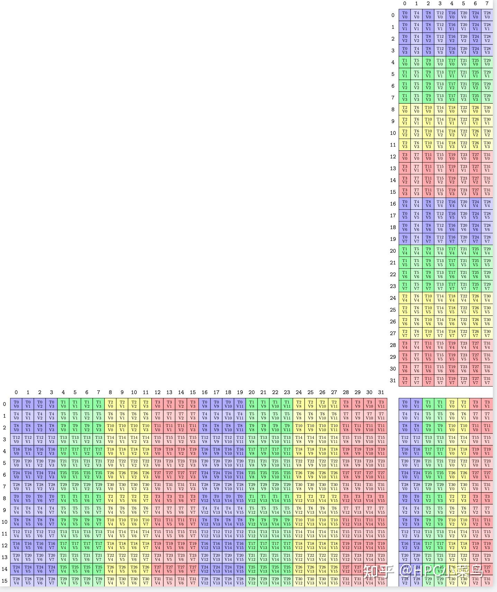

## gemm-I 출력 결과 변환

코드의 TileMMA 정의 — M에 thread repeat, N에 value repeat:

```cpp
using TiledMma = TiledMMA<
        typename Base::MMA_Atom_Arch,
        Layout<Shape<Int<kNWarps>,_1,_1>>,  // 4x1x1 or 8x1x1 thread group
        Tile<Int<16 * kNWarps>, _16, _32>>;
```

대응 MMA latex(한 warp 내 LayoutA·LayoutC):

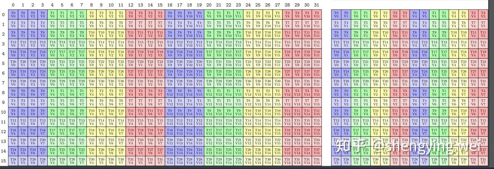

**gemm-I 출력(register) LayoutC가 gemm-II의 LayoutA 요구를 충족하지 않음**. gemm-II에서 T0이 필요한 4 데이터는 T0·T1에, T1이 필요한 4 데이터는 T2·T3에 있어 **스레드 내부 데이터 교환** 필요. 코드:

- https://github.com/weishengying/cutlass_flash_atten_fp8/blob/main/csrc/flash_attention.cu#L525
- https://github.com/weishengying/cutlass_flash_atten_fp8/blob/main/csrc/reg2reg.h#L31

원래 fp16 구현의 `SM80_16x8x16_F16F16F16F16_TN`은 LayoutA·LayoutC가 다음과 같음:

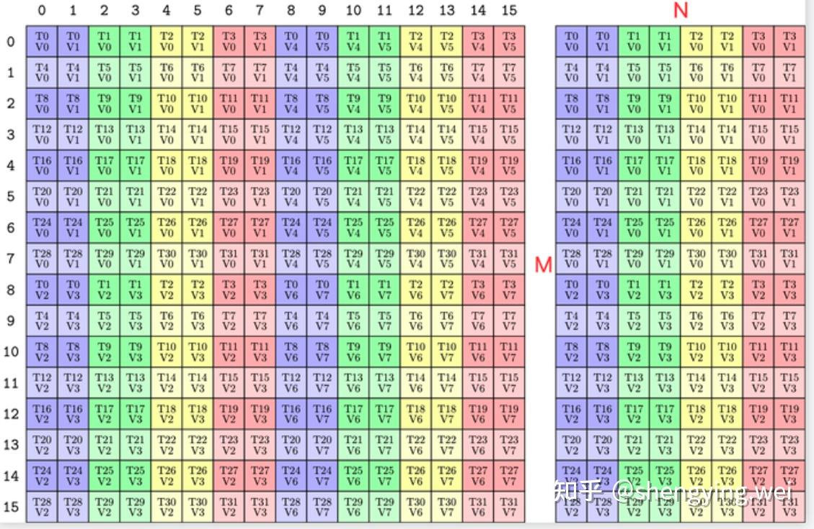

이 경우 **gemm-I 출력이 gemm-II의 입력 A로 직접 사용 가능 — 스레드 내 교환 불요**. https://github.com/weishengying/tiny-flash-attention/blob/main/csrc/flash_attention.cu#L556

## 토론

위 두 번째 점은 TileMMA 정의를 수정해 LayoutA·LayoutC를 일치시키면 해결 가능:

```cpp
using namespace cute;
using MMA_Atom_Arch = MMA_Atom<SM89_16x8x32_F32F8F8F32_E4M3_TN>;
using TiledMma = TiledMMA<
        MMA_Atom_Arch,
        Layout<Shape<_1,_1,_1>>,
        Tile<_16,
            Layout<Shape <_2,_4,_2>,
                    Stride<_1,_4,_2>>, // N에 size 16 Permutation
            _32>>;

print_latex(TiledMma{});
```

이런 정의의 의미는 공식 GitHub 토론 참고: https://github.com/NVIDIA/cutlass/discussions/1345

대응 LayoutA·LayoutC:

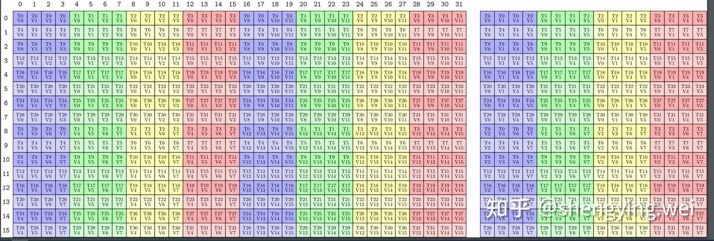

이 경우 **gemm-I 출력 LayoutC가 gemm-II의 LayoutA 요구 충족** — 스레드 내 데이터 교환 불요 가능성.
