# FlashAttention 노트

> 원문: https://zhuanlan.zhihu.com/p/708867810

## 참고

- From Online Softmax to FlashAttention
- FlashAttention: Fast and Memory-Efficient Exact Attention with IO-Awareness
- FlashAttention-2: Faster Attention with Better Parallelism and Work Partitioning

## 1. Online Softmax

### 1.1) Safe Softmax

일반 softmax 공식:

$$\text{softmax}(\{x_1, ..., x_n\}) = \left\{\frac{e^{x_i}}{\sum_{j=1}^N e^{x_j}}\right\}_{i=1}^N$$

수치 오버플로 회피를 위해:

$$\frac{e^{x_i}}{\sum_{j=1}^N e^{x_j}} = \frac{e^{x_i - m}}{\sum_{j=1}^N e^{x_j - m}}, \quad m = \max_{j=1}^N(x_j)$$

### 1.2) 3-pass safe softmax 알고리즘

벡터 $x$ 에 대한 가장 기본적인 흐름:

- $m_i = \max_{j=1}^i \{x_j\}$, 초기 $m_0 = -\infty$
- $l_i = \sum_{j=1}^i e^{x_j - m_N}$, 초기 $l_0 = 0$
- $a_i$: 최종 softmax 값

**for** $i$ in $1, ..., N$: $m_i = \max(m_{i-1}, x_i)$
**for** $i$ in $1, ..., N$: $l_i = l_{i-1} + e^{x_i - m_N}$
**for** $i$ in $1, ..., N$: $a_i = e^{x_i - m_N} / l_N$

3개 for 루프 — 첫째 최댓값, 둘째 EXP·합, 셋째 결과. 비효율적. 개선판은 1회 줄임.

### 1.3) 2-pass online softmax

$l_i$ 정의 수정 — 반복 $i$에서는 현재 최댓값 $m_i$만 알고 전역 최댓값은 모름. 현재 최댓값으로 EXP·합:

$$l_i = \sum_{j=1}^i e^{x_j - m_i}$$

**for** $i$ in $1, ..., N$: $m_i = \max(m_{i-1}, x_i)$, $l_i = l_{i-1} e^{m_{i-1} - m_i} + e^{x_i - m_i}$
**for** $i$ in $1, ..., N$: $a_i = e^{x_i - m_N} / l_N$

핵심은 **rescale**:

$$l_{i-1}^{\text{new}} = \sum_{j=1}^{i-1} e^{x_j - m_i} = \sum_{j=1}^{i-1} e^{x_j - m_{i-1}} e^{m_{i-1} - m_i} = l_{i-1} e^{m_{i-1} - m_i}$$

## 2. Multi-Pass Self-Attention

기호 정의:
- $Q[k, :]$, $K^T[:, i]$, $O[k, :]$, $V[j, :]$
- $\{o\}: \sum_{m=1}^j a_m V[m, :] = o_{j-1} + a_j V[j, :]$

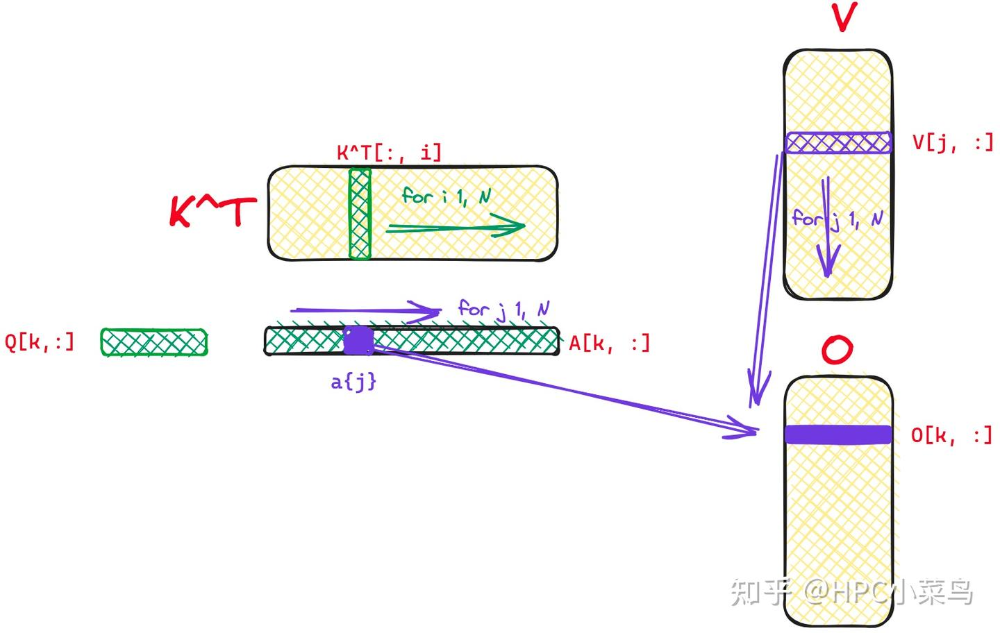

**for** $i$ in $1, ..., N$: $x_i = Q[k, :] K^T[:, i]$, $m_i = \max(m_{i-1}, x_i)$, $l_i = l_{i-1} e^{m_{i-1} - m_i} + e^{x_i - m_i}$
**for** $j$ in $1, ..., N$: $a_j = e^{x_j - m_N} / l_N$, $o_j = o_{j-1} + a_j V[j, :]$
$O[k, :] = o_N$

2 for 루프. online-softmax 사상 확장 — $a_i$ 계산 시 $l_N$, $m_N$이 꼭 필요한 게 아니라 $l_i$, $m_i$ 사용 가능: $a_i = e^{x_i - m_i} / l_i$. V의 $i$행과 곱하면 됨.

## 3. One-pass Self-Attention

**for** $i$ in $1, ..., N$:
- $x_i = Q[k, :] K^T[:, i]$
- $m_i = \max(m_{i-1}, x_i)$
- $l_i = l_{i-1} e^{m_{i-1} - m_i} + e^{x_i - m_i}$
- $a_i = e^{x_i - m_i} / l_i$
- $o_i = \sum_{j=1}^i \frac{e^{x_j - m_i}}{l_i} V[j, :]$

$O[k, :] = o_N$

$o_i$를 반복형으로:

$$o_i = \sum_{j=1}^{i-1} \frac{e^{x_j - m_i}}{l_i} V[j, :] + a_i V[i, :]$$

$$\sum_{j=1}^{i-1} \frac{e^{x_j - m_i}}{l_i} V[j, :] = o_{i-1} \frac{l_{i-1} e^{m_{i-1} - m_i}}{l_i}$$

따라서 **one-pass self-attention**:

$$o_i = o_{i-1} \frac{l_{i-1} e^{m_{i-1} - m_i}}{l_i} + \frac{e^{x_i - m_i}}{l_i} V[i, :]$$

## 4. FlashAttention V1

위 기반에 **Tiling** 적용 — 핵심은 one-pass self-attention과 완전 동일.

Q, K, V shape `(N, d)`. $B_r$ 행을 한 블록 — Q·O 분할, $B_c$ 열(행)을 한 블록 — $K^T$·V 분할.

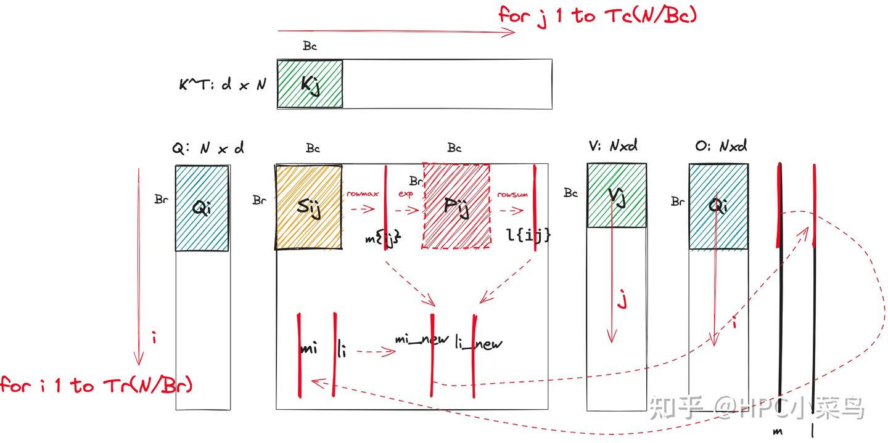

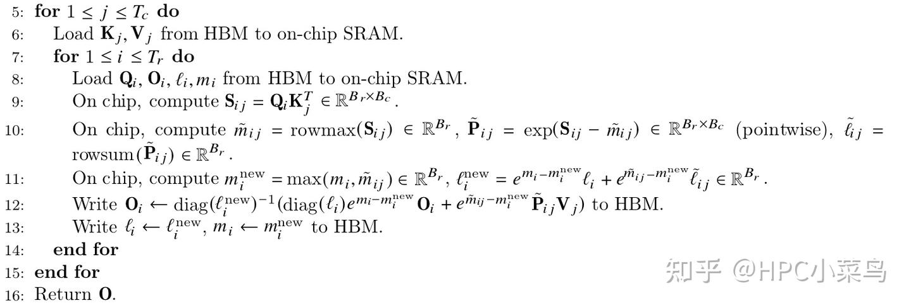

그림의 $\tilde{m}_{ij}$는 공식의 $m_{ij}$ (위에 물결). 여기 one-pass self-attention 공식과 비교:


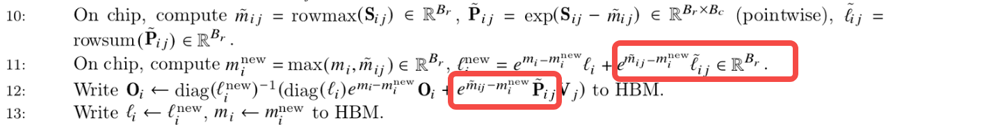

flash-attention 그림 10단계: $\tilde{m}_{ij}$ 계산 후 — 블록 최댓값(국소 최댓값)으로 $P_{ij}$·$\tilde{l}_{ij}$ 계산. 이는 직관적이지 않음. 11단계 $l_i^{\text{new}}$ 계산 시 보정:

$$e^{\tilde{m}_{ij} - m_i^{\text{new}}} \tilde{l}_{ij} = e^{\tilde{m}_{ij} - m_i^{\text{new}}} \sum \exp(S_{ij} - \tilde{m}_{ij}) = \sum \exp(S_{ij} - m_i^{\text{new}})$$

12단계도 같은 작업. 이로써 flash-attention의 수학 로직이 one-pass self-attention과 완전 일치.

### 4.1) flash-attention-minimal

교육적 최소 demo:

```cpp
__global__
void forward_kernel(const float* Q, const float* K, const float* V,
                    const int N, const int d,
                    const int Tc, const int Tr, const int Bc, const int Br,
                    const float softmax_scale,
                    float* l, float *m, float* O) {
    int tx = threadIdx.x;
    int bx = blockIdx.x; int by = blockIdx.y;

    int qkv_offset = (bx * gridDim.y * N * d) + (by * N * d);
    int lm_offset = (bx * gridDim.y * N) + (by * N);

    extern __shared__ float sram[];
    int tile_size = Bc * d;
    float* Qi = sram;
    float* Kj = &sram[tile_size];
    float* Vj = &sram[tile_size * 2];
    float* S = &sram[tile_size * 3];

    for (int j = 0; j < Tc; j++) {
        // Kj, Vj를 SRAM으로 로드
        for (int x = 0; x < d; x++) {
            Kj[(tx * d) + x] = K[qkv_offset + (tile_size * j) + (tx * d) + x];
            Vj[(tx * d) + x] = V[qkv_offset + (tile_size * j) + (tx * d) + x];
        }
        __syncthreads();

        for (int i = 0; i < Tr; i++) {
            for (int x = 0; x < d; x++) {
                Qi[(tx * d) + x] = Q[qkv_offset + (tile_size * i) + (tx * d) + x];
            }
            float row_m_prev = m[lm_offset + (Br * i) + tx];
            float row_l_prev = l[lm_offset + (Br * i) + tx];

            // S = QK^T, row_m = rowmax(S)
            float row_m = -INFINITY;
            for (int y = 0; y < Bc; y++) {
                float sum = 0;
                for (int x = 0; x < d; x++) {
                    sum += Qi[(tx * d) + x] * Kj[(y * d) + x];
                }
                sum *= softmax_scale;
                S[(Bc * tx) + y] = sum;
                if (sum > row_m) row_m = sum;
            }

            // P = exp(S - row_m), row_l = rowsum(P)
            float row_l = 0;
            for (int y = 0; y < Bc; y++) {
                S[(Bc * tx) + y] = __expf(S[(Bc * tx) + y] - row_m);
                row_l += S[(Bc * tx) + y];
            }

            // 새 m, l 계산
            float row_m_new = max(row_m_prev, row_m);
            float row_l_new = (__expf(row_m_prev - row_m_new) * row_l_prev)
                              + (__expf(row_m - row_m_new) * row_l);

            // O, l, m을 HBM에 쓰기
            for (int x = 0; x < d; x++) {
                float pv = 0;
                for (int y = 0; y < Bc; y++) {
                    pv += S[(Bc * tx) + y] * Vj[(y * d) + x];
                }
                O[qkv_offset + (tile_size * i) + (tx * d) + x] = (1 / row_l_new) *
                    ((row_l_prev * __expf(row_m_prev - row_m_new) *
                      O[qkv_offset + (tile_size * i) + (tx * d) + x])
                    + (__expf(row_m - row_m_new) * pv));
            }
            m[lm_offset + (Br * i) + tx] = row_m_new;
            l[lm_offset + (Br * i) + tx] = row_l_new;
        }
        __syncthreads();
    }
}
```

## 5. FlashAttention V2

FA2의 주요 변경:

### 1) 비-matmul 계산 감소

FA1 형태:

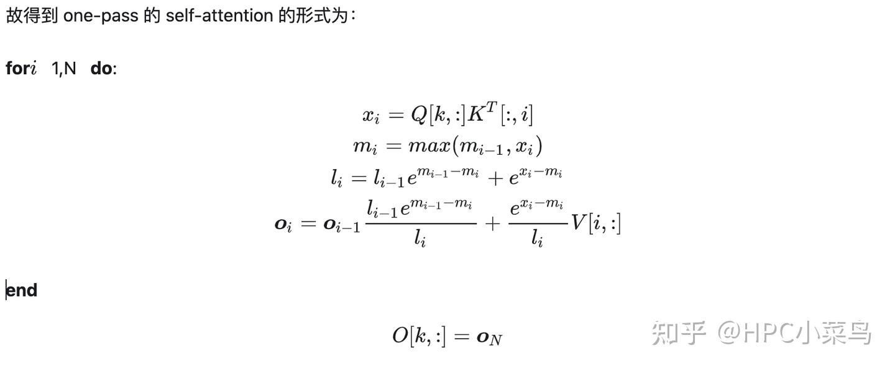

$o_i$는 $o_j = \sum_{j=1}^i \frac{e^{x_j - m_i}}{l_i} V[j, :]$에서 유도. 분모 나눗셈을 매 반복 안 하고 **루프 종료 후 한 번에** $l_N$로 나누면 됨:

$$o_i = o_{i-1} e^{m_{i-1} - m_i} + e^{x_i - m_i} V[i, :]$$

flash-attention 2 핵심:

**for** $i$: $x_i = Q[k, :] K^T[:, i]$, $m_i = \max(m_{i-1}, x_i)$, $l_i = l_{i-1} e^{m_{i-1} - m_i} + e^{x_i - m_i}$, $o_i = o_{i-1} e^{m_{i-1} - m_i} + e^{x_i - m_i} V[i, :]$
**end** $O[k, :] = o_N / l_N$

논문 흐름:

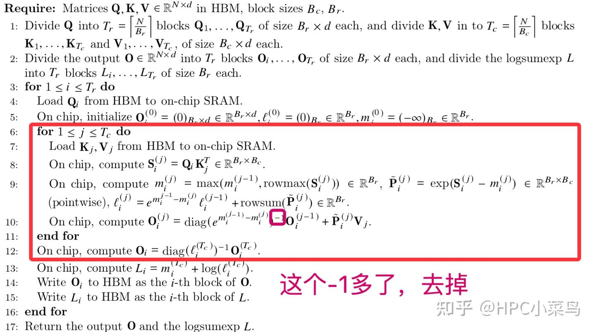

($L_i$는 backward용, inference에는 무관)

### 2) $Q_i$ 방향 병렬화

알고리즘은 두 루프 — 외층 Q, 내층 KV. 구현 시 외층 Q 루프를 **thread block 병렬**로 대체:

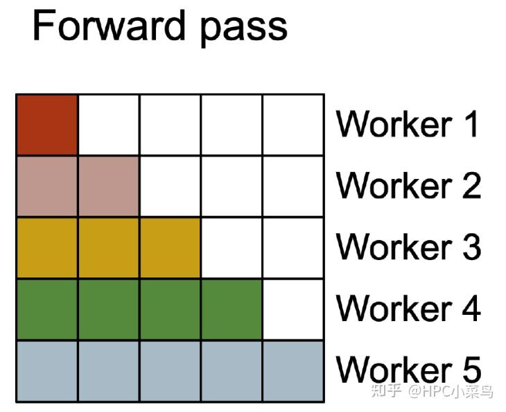

worker 1-5 = 다른 thread block. causal mask 때문에 계단형.

### 3) warp 내부 분할

$S_{ij} = Q_i K_j^T$에서 한 CTA가 `(kBlockM, kBlockN)` 블록 처리. CTA 내 여러 warp의 처리 분할:

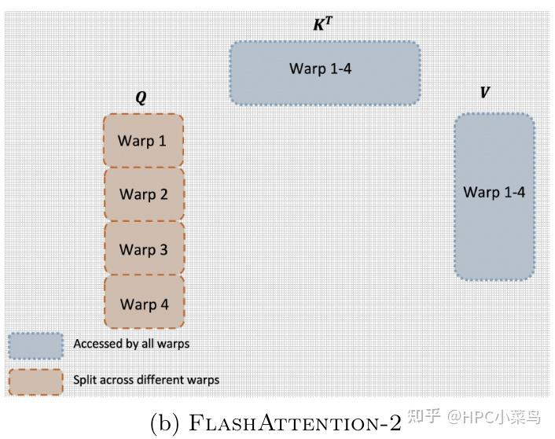

장점은? 구현상 TiledMMA 정의 시 **M 방향 스레드 확장만, N 방향은 확장 X**. 한 warp이 $S_{ij}$의 모든 열을 처리 → rowsum·rowmax 계산 시 **warp 내 shuffle 명령**만으로 완료. shared memory를 거치는 warp 간 데이터 교환 불요 → shared 읽기·쓰기 감소.

## 6. 소스 해독 — tiny-flash-attention

Tri Dao 버전 flash-attention은 너무 방대(다양한 시나리오 고려)하므로 https://github.com/66RING/tiny-flash-attention/blob/main/flash_attention_cutlass/csrc/flash_attention.cu 부터 보는 게 좋음. 일부 중복 코드 제거·CuTe layout 정의 단순화, 학습용으로 적합.

### 6.1) TiledMMA

```cpp
using MMA_Atom_Arch = std::conditional_t<
        std::is_same_v<elem_type, cutlass::half_t>,
        MMA_Atom<SM80_16x8x16_F32F16F16F32_TN>,
        MMA_Atom<SM80_16x8x16_F32BF16BF16F32_TN>
    >;
using ValLayoutMNK = Layout<Shape<_1, _2, _1>>;
using TiledMma = TiledMMA<
        typename Base::MMA_Atom_Arch,
        Layout<Shape<Int<kNWarps>,_1,_1>>,  // 4x1x1
        Tile<Int<16 * kNWarps>, _16, _16>>;
```

CTA가 MNK 행렬 곱을 어떻게 협력 처리할지 정의. 4 warp(kNWarps) = 128 스레드. thread block 레벨 1회 루프에서 MNK `(64, 16, 16)` 처리.

### 6.2) SmemLayoutQ, SmemLayoutKV

```cpp
using SmemLayoutAtomQ = decltype(
    composition(Swizzle<kSwizzle, 3, 3>{},
                Layout<Shape<_8, Int<kBlockKSmem>>,
                       Stride<Int<kBlockKSmem>, _1>>{}));

using SmemLayoutQ = decltype(tile_to_shape(
    SmemLayoutAtomQ{},
    Shape<Int<kBlockM>, Int<kHeadDim>>{}));

using SmemLayoutKV = decltype(tile_to_shape(
    SmemLayoutAtomQ{},
    Shape<Int<kBlockN>, Int<kHeadDim>>{}));
```

Q·K shared memory 정의. Swizzle로 bank conflict 회피.

### 6.3) TiledCopy (gmem → smem)

```cpp
static constexpr int kGmemElemsPerLoad = sizeof(cute::uint128_t) / sizeof(Element);
static constexpr int kGmemThreadsPerRow = kBlockKSmem / kGmemElemsPerLoad;
using GmemLayoutAtom = Layout<Shape <Int<kNThreads / kGmemThreadsPerRow>, Int<kGmemThreadsPerRow>>,
                              Stride<Int<kGmemThreadsPerRow>, _1>>;

using Gmem_copy_struct = std::conditional_t<
    Has_cp_async,
    SM80_CP_ASYNC_CACHEGLOBAL<cute::uint128_t>,
    DefaultCopy>;
using GmemTiledCopyQKV = decltype(
    make_tiled_copy(Copy_Atom<Gmem_copy_struct, Element>{},
                    GmemLayoutAtom{},
                    Layout<Shape<_1, _8>>{}));  // 8 vals per read
```

`kNThreads`개 스레드를 `(kNThreads / kGmemThreadsPerRow, kGmemThreadsPerRow)` layout으로 조직, 각 스레드가 한 행의 8 데이터 복사.

half-precision이면 GmemTiledCopyQKV의 thread block 1회 루프에 `(16, 8×8)` 원소 복사 가능. SRC `(64, 64)` tensor와 DST `(64, 64)` tensor에 주기적 평탄화.

```cpp
Tensor tQgQ = gmem_thr_copy_QKV.partition_S(gQ(_, _, 0));
Tensor tQsQ = gmem_thr_copy_QKV.partition_D(sQ); // ((8,1),4,1)
Tensor tKgK = gmem_thr_copy_QKV.partition_S(gK(_, _, 0));
Tensor tKsK = gmem_thr_copy_QKV.partition_D(sK);
```

마찬가지로 TiledMMA로 각 스레드가 처리할 **레지스터** 데이터 획득:

```cpp
Tensor tSrQ = thr_mma.partition_fragment_A(sQ);  // (MMA, MMA_M, MMA_K)
Tensor tSrK = thr_mma.partition_fragment_B(sK);  // (MMA, MMA_N, MMA_K)
```

`sQ:(64, 64)`, TiledMMA MK `(64, 16)` → tSrQ shape `((2,2,2), 1, 4)`.
`sK:(64, 64)`, TiledMMA NK `(16/2, 16)` → shape `((2,2), 8, 4)`.

### 6.4) Ldmatrix (smem → register), warp level load

Tensor Core(MMA)와 ldmatrix는 warp level. 각 스레드가 8 원소를 레지스터로 복사 후 스레드 간 교환 — mma 명령 데이터 배치 요구 충족.

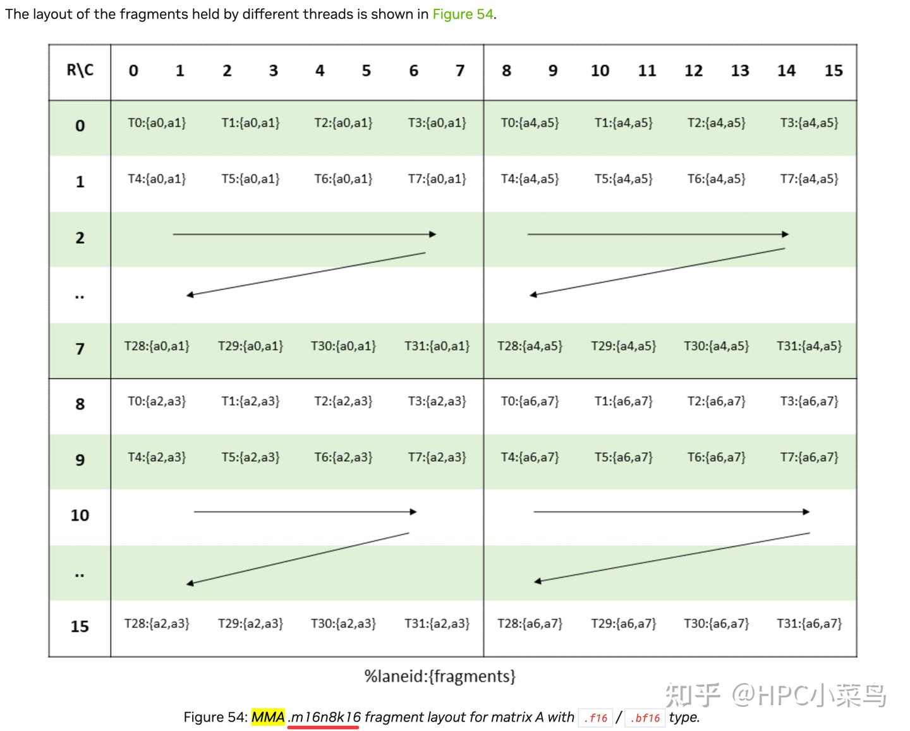

```cpp
using SmemCopyAtom = Copy_Atom<SM75_U32x4_LDSM_N, elem_type>;
auto smem_tiled_copy_Q = make_tiled_copy_A(typename Kernel_traits::SmemCopyAtom{}, tiled_mma);
auto smem_thr_copy_Q = smem_tiled_copy_Q.get_thread_slice(tidx);
Tensor tSsQ = smem_thr_copy_Q.partition_S(sQ);

auto smem_tiled_copy_K = make_tiled_copy_B(typename Kernel_traits::SmemCopyAtom{}, tiled_mma);
auto smem_thr_copy_K = smem_tiled_copy_K.get_thread_slice(tidx);
Tensor tSsK = smem_thr_copy_K.partition_S(sK);
```

`SM75_U32x4_LDSM_N`은 ldmatrix 캡슐화. mma 명령 세트와 연관되므로 `tiled_copy_Q` 구성 시 `tiled_mma`도 전달. `partition_S`로 각 스레드의 src 획득.

src는 위에서, dst(register)는 TieldCopy의 `partition_fragment`에서 이미 정의:

```cpp
Tensor tSrQ = thr_mma.partition_fragment_A(sQ);
Tensor tSrK = thr_mma.partition_fragment_B(sK);
```

gmem → smem과 달리 mem → register는 thread level src·dst tensor가 다른 요구로 분할(`smem_tiled_copy_Q`와 TiledMMA). `retile`로 dst tensor의 layout을 src와 일치시킴:

```cpp
tSrQ_copy_view = smem_thr_copy_A.retile_D(tSrQ);
```

흐름 요약:

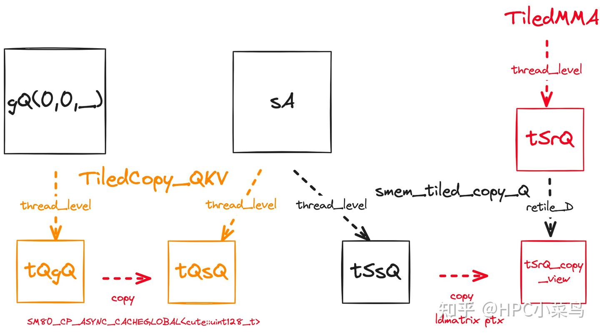

### 6.5) Causal Mask

여기서부터는 thread 레지스터 레벨 작업.

MMA로 $Q_i K_j^T = S_{ij}$ 계산 후 **causal mask** 추가. $S_{ij}$의 행 인덱스는 $Q_i$의 토큰 시퀀스, 열 인덱스는 $K_j^T$의 토큰 시퀀스. `kBlockN * nbi + j > kBlockM * m_block + i` 일 때 마스크.

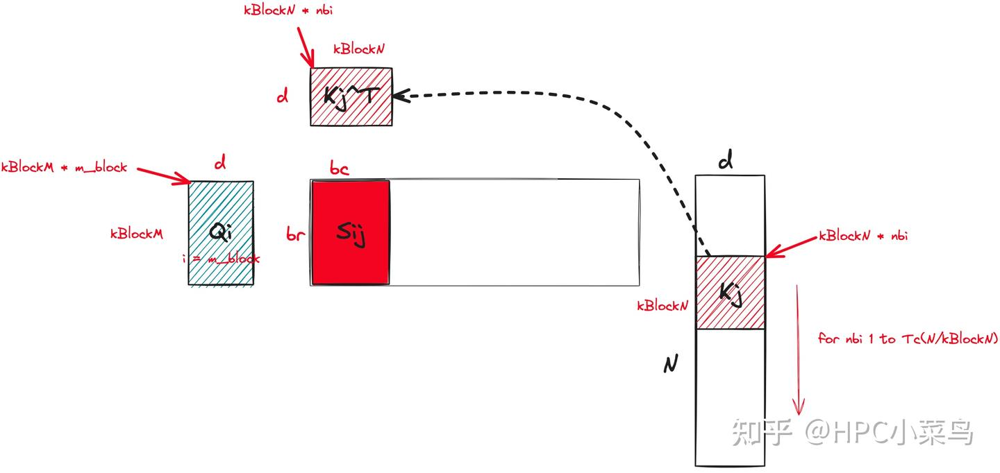

**$S_{ij}$는 CTA 내 모든 스레드의 레지스터에 분산 저장**. 각 스레드가 담당하는 원소의 row_idx·col_idx 분석. MMA 특성으로:

```cpp
const int lane_id = threadIdx.x % 32;
const int col_idx_offset = kBlockN * nbi + (lane_id % 4) * 2;
const int nrow_group = threadIdx.x / 32;
const int row_idx_offset = kBlockM * m_block + lane_id / 4 + nrow_group * 16;
```

각 스레드의 레지스터 C는 `(nrow=(2, MMA_M), ncol=(2, MMA_N))` 형태로 reshape.

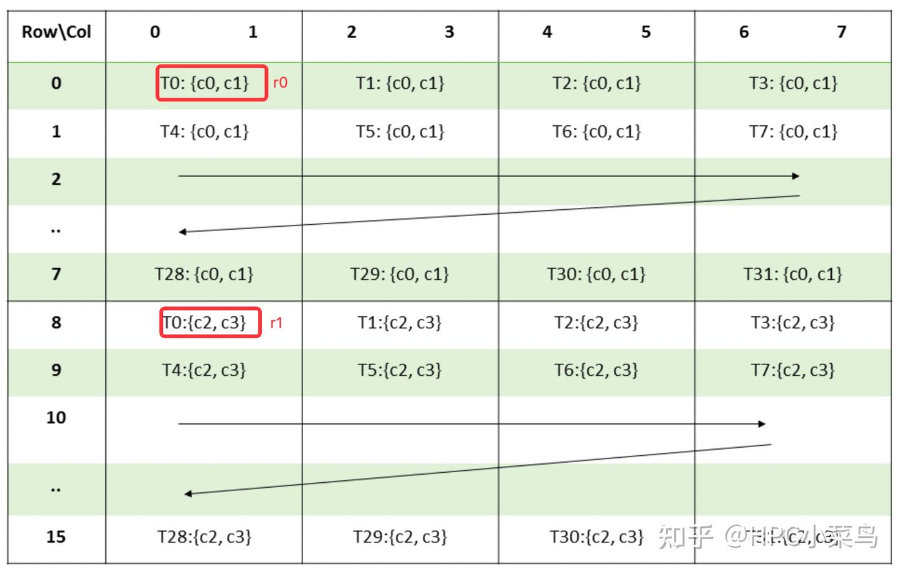

전체 코드:

```cpp
template <int kBlockM, int kBlockN, int kNWarps,typename Engine, typename Layout>
inline __device__ void mask_within_nblock(Tensor<Engine, Layout> &tensor,
                                          const int m_block, const int nbi) {
    static_assert(Layout::rank == 2, "Only support 2D Tensor");

    const int lane_id = threadIdx.x % 32;
    const int col_idx_offset = kBlockN * nbi + (lane_id % 4) * 2;
    const int nrow_group = threadIdx.x / 32;
    const int row_idx_offset = kBlockM * m_block + lane_id / 4 + nrow_group * 16;
    const int group_stride = kNWarps * 16;

    #pragma unroll
    for (int nj = 0; nj < size<1, 1>(tensor); ++nj) {
        const int col_idx_base = col_idx_offset + nj * 8;
        #pragma unroll
        for (int j = 0; j < size<1, 0>(tensor); ++j) {
            const int col_idx = col_idx_base + j;
            #pragma unroll
            for (int mi = 0; mi < size<0, 0>(tensor); ++mi) {
              #pragma unroll
              for (int mj = 0; mj < size<0, 1>(tensor); ++mj) {
                const int row_idx = row_idx_offset + mi * 8 + mj * group_stride;
                if (col_idx > row_idx) {
                  tensor(make_coord(mi, mj), make_coord(j, nj)) = -INFINITY;
                }
              }
            }
        }
    }
}
```

$S_i^{(j)}$ 계산 완료:

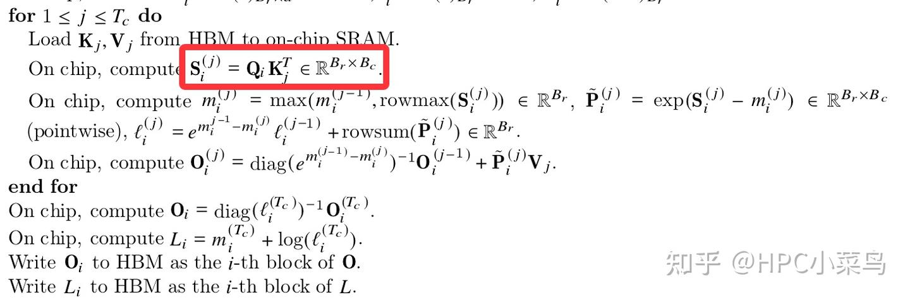

### 6.6) Softmax, rescale, $P_i^j @ V_j$

다음은 rowmax·rowsum·softmax·rescale (이전 $l_i$, $o_i$ 등):

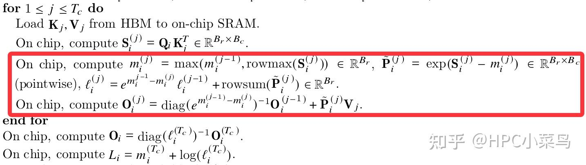

**CTA level과 알고리즘 관점에서 코드 고민, thread level 디테일 주의**(각 스레드는 자기 레지스터만 처리).

`softmax_rescale_o`:

```cpp
// scores: ((2, MMA_M), (2, MMA_N)) — causal 후 Q_i × K_j^T
// scores_max: (2 * MMA_N) — rowmax
// scores_sum: (2 * MMA_N) — rowsum
// acc_o: ((2, 2), (MMA_M, MMA_N)) — 최종 결과
template<bool Is_first, typename Tensor0, typename Tensor1, typename Tensor2>
inline __device__ void softmax_rescale_o(Tensor0 &scores, Tensor1 &scores_max,
                                         Tensor1 &scores_sum, Tensor2 &acc_o,
                                         float softmax_scale_log2) {
    if (Is_first) {
        // 첫 softmax는 rescale 불요, S_ij의 rowmax·rowsum만 기록
        reduce_max</*zero_init=*/true>(scores, scores_max);
        flash::scale_apply_exp2(scores, scores_max, softmax_scale_log2);
        reduce_sum(scores, scores_sum);
    } else {
        // 이전 rowmax 기록
        Tensor scores_max_prev = make_fragment_like(scores_max);  // m_i^{j-1}
        cute::copy(scores_max, scores_max_prev);

        // 최신 max 계산
        // 1. thread 내 max
        // 2. shuffle로 thread 간 max
        reduce_max</*zero_init=*/false>(scores, scores_max);  // m_i^j

        // acc_o를 (nrow=(2, MMA_M), ncol=(2, MMA_K))로 reshape
        Tensor acc_o_rowcol = make_tensor(acc_o.data(),
                                          flash::convert_layout_acc_rowcol(acc_o.layout()));
        #pragma unroll
        for (int mi = 0; mi < size(scores_max); ++mi) {
            float scores_max_cur = scores_max(mi);
            // 이전 score_sum의 rescale 값
            float scores_scale = expf((scores_max_prev(mi) - scores_max_cur) * softmax_scale_log2);
            // e^{m_i^{j-1} - m_i^j} l_i^{j-1}
            scores_sum(mi) *= scores_scale;
            #pragma unroll
            for (int ni = 0; ni < size<1>(acc_o_rowcol); ++ni) {
                acc_o_rowcol(mi, ni) *= scores_scale;  // e^{m_i^{j-1} - m_i^j} O_i^{j-1}
            }
        }
        // 새 max로 모든 원소에 exp — P_i^j
        flash::scale_apply_exp2(scores, scores_max, softmax_scale_log2);

        Tensor scores_sum_cur = make_fragment_like(scores_sum);
        reduce_sum(scores, scores_sum_cur);  // rowsum(P_i^j)
        #pragma unroll
        for (int mi = 0; mi < size(scores_sum); ++mi) {
            // l^{ij} = e^{m_i^{j-1} - m_i^j} l_i^{j-1} + rowsum(P_i^j)
            scores_sum(mi) += scores_sum_cur(mi);
        }
    }
}
```

이 단계 후 score tensor에는 $P_i^{(j)}$ 값. $V_j$와 곱셈 — $P_i^{(j)}$는 이미 레지스터에 있으므로 $V_j$만 레지스터 로드. 코드의 **`flash::gemm_A_in_regs`** 에 대응. 루프 종료 후 결과를 softmax 분모로 나누고 레지스터 결과를 global memory로 복사.
