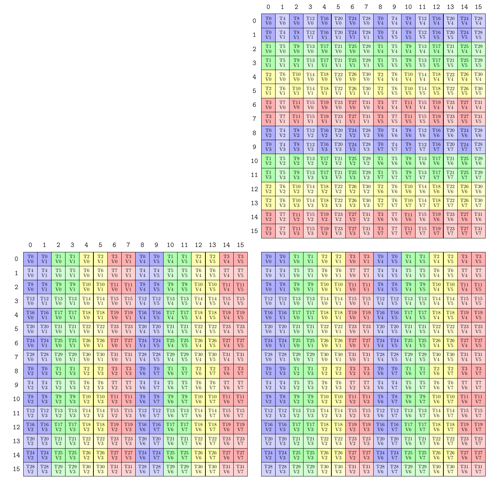
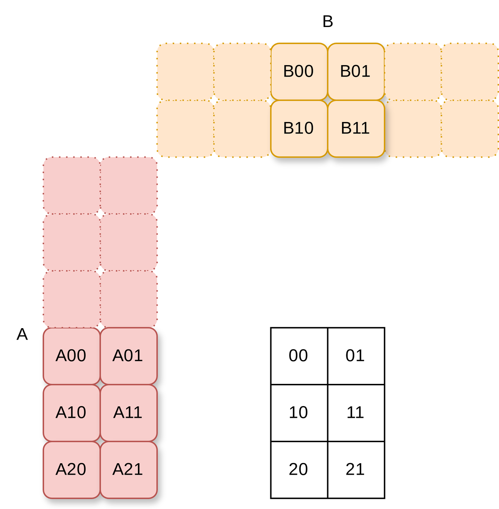

# CUTLASS CuTe로 FlashAttention 복원

> 원문: https://zhuanlan.zhihu.com/p/696323042

코드: https://github.com/66RING/tiny-flash-attention/tree/main/flash_attention_cutlass

**핵심과 함정은 한 그림에**: **출력 C layout(아래 그림 우하단)이 입력 A layout(좌하단)과 일치해야 두 gemm을 융합할 수 있음**. ColfaxResearch 구현은 이를 신경 쓰지 않는 듯한데, `rs_op_selector`·`ss_op_selector` 두 API 사용법은 미상.


## 감사

- Flash attention 코드를 직접 베낌 — 0부터 다시 쓰며 베끼기
- 많은 함정 회피
- FA의 엔지니어링 고려 대부분을 단순화, 핵심 코드만 유지
- 순수 CUDA, pybind 미고려 버전은 standalone 폴더 참고

## 위에서 아래로 CUTLASS CuTe FlashAttention

위에서 아래로 학습이 빠른 진입에 적합. CuTe 도움으로 사용자가 다음 CUDA 패러다임을 편리히 구현 가능:

- **CUDA 패러다임**: global mem → shared mem → reg → compute
- **block tiling**: smem 재사용, gmem → smem 복사
- **thread tiling**: reg 재사용, smem → reg 복사
- **결합 접근, 벡터 접근**: 벡터 명령, LDSM, ldmatrix
- **warp divergence**: warp 부하 균형, 파이프라인 bubble
- **bank conflict 해소**: swizzle (메모리 다중 채널 활용)
- **double buffering**: 로드·계산 파이프라인

### Flash Attention 빠른 정리

TODO: FA 본질 간단 설명 — flash attention three easy pieces:
- Online safe softmax
- 두 gemm 융합
- Rescale 수학 원리

### 위에서 아래로 CuTe FlashAttention

CUTLASS 미사용 시 순수 CUDA 고성능 연산자 작성 방법:

- **다차원 block tiling**: gmem → smem, smem 재사용으로 gmem 접근 감소
- **다차원 thread tiling**: smem → reg, register 재사용
- 추가 최적화: 벡터 명령 비동기 로드, LDSM/ldmatrix, 결합 접근, bank conflict 해소
- 전송·계산 오버랩 파이프라인: gmem → smem 복사 + reg gemm 동시

CuTe는 thread 협동 코드를 추상 캡슐화 — 협동 복사는 `make_tiled_copy`, 협동 계산은 `TiledMMA<T>`로 mma 객체 생성.

**MMA layout만 이해하면 thread 간 협동 방식을 알 수 있음**.

### 용어 설명

- **명명 관습**: `tQgQ`
  - `t`(to): 무엇을 위한지 — 여기선 추상 한 층, Q 자체이므로 `tQ`
  - `g`: global memory 위치
  - 예: `tSrQ`·`tSrK` = attention **S**core 계산용, **r**egister의 Q·K
  - 예: `tOrVt` = 최종 **o**utput용, register의 transposed V
- **MNK 행렬 곱 표기**: 두 행렬에 적어도 한 차원 동일 — K
  - `A[M, K] @ B[N, K]`
- **MMA**(matrix multiply accumulate): thread tiling 규모 = thread block의 thread 수와 계산 방식
  - 표기: DABC + MNK
  - DABC: 레지스터 타입. 예: `SM75_16x8x8_F32F16F16F32_TN`의 `F32F16F16F32` — DABC가 F32, F16, F16, F32
  - MNK: `D[M, N] = A[M, K] * B[N, K] + C[M, N]`
- **Tiled_MMA**: 여러 MMA_Atom 협동
  - `AtomLayoutMNK`: MNK 방향 Atom 반복(다중 스레드)
  - `ValueLayoutMNK`: Atom 내 MNK 방향 계산 반복(단일 스레드)
- **BlockM**: Q 분할 단위
- **BlockN**: KV 분할 단위

### 인프라

> "blade learner와 강조 native learner의 차이는 사용 도구와 사용자 매뉴얼뿐" — 혼돈 성경 ch16

**MMA layout 출력**

print 스크립트로 다른 mma 명령(`SM80_16x8x16_F32F16F16F32_TN` 등) 테스트 가능:

```cpp
{
    auto tiled_mma = make_tiled_mma(SM80_16x8x16_F32F16F16F32_TN{},
                                    Layout<Shape<_1,_1, _1>>{},  // AtomLayoutMNK
                                    Layout<Shape<_1,_2, _1>>{}); // ValLayoutMNK
    print_mma_content("flash2: SM80_16x8x16_F32F16F16F32_TN", tiled_mma);
}
```



T0, T1...은 thread, T0 안 V0, V1은 thread 담당 데이터.

**Tensor 출력**

`print_tensor`·`print_layout`로 디버깅:

```cpp
const int M = 4, K = 8;
Tensor A = make_tensor(c_host_ptr, make_shape(M, K), make_stride(K, 1));
cute::print_tensor(A);
cute::print_layout(A.layout());

/*
ptr[32b](...) o (4,8):(8,1):
    0    1    2    3    4    5    6    7
    8    9   10   11   12   13   14   15
   16   17   18   19   20   21   22   23
   24   25   26   27   28   29   30   31
*/
```

`local_tile`로 tile 출력:

```cpp
auto A00 = local_tile(A, make_tile(2, 2), make_coord(0, 0));
auto A01 = local_tile(A, make_tile(2, 2), make_coord(0, 1));
auto A10 = local_tile(A, make_tile(2, 2), make_coord(1, 0));
```

### Attention 계산 스레드 모델

단일 스레드 attention: `q[seqlen, headdim] @ k[seqlen, headdim].T @ v[seqlen, headdim]`.

다중 스레드 attention은 **Q 차원만 분할**(자기회귀 시나리오에서 한 번에 한 토큰의 attention 계산을 병렬로). 각 thread가 BlockM 토큰의 single head attention 담당.

입력 `[bs, head, seqlen, headdim]` → **총 thread 수 = `bs × head × seqlen/BlockM`**, 각 thread가 `[BlockM, headdim]` query attention 계산. `bs × head` 차원과 `seqlen` 차원에서 병렬.

```cpp
dim3 grid(ceil_div(params.seqlen, BlockM), params.bs * params.head, 1);
```

### 2D block tiling

FA2 계산 흐름: Q를 inner loop 순서대로 K·V와 분리 계산해 partial sum 획득, 마지막에 partial sum 누적해 Q와 같은 형상의 출력. 의사코드:

```python
flash_attention_2():
    # outer loop
    parallel do q[NUM_BLOCK_M]:
        # inner loop
        for i in range(NUM_BLOCK_N):
            qk = q @ k[i].T
            score = online_softmax(qk)
            out += score @ v[i]
        rescale(out)
```

CuTe API로 빠르게 q·k·v 분할:

- `make_tensor()` — raw pointer를 tensor로 포장
- `local_tile(tensor, tile, coord)` — tensor에서 분할 추출
- `Copy_Atom` 객체로 gmem → smem 복사

```cpp
const int m_block = blockIdx.x;
const int bs_head_offset = blockIdx.y * params.seqlen * params.dim;

Tensor Q = make_tensor(
    make_gmem_ptr(reinterpret_cast<Element *>(params.q_ptr) + bs_head_offset),
    make_shape(params.seqlen, params.dim),
    make_stride(params.dim, Int<1>{}));
Tensor K = make_tensor(
    make_gmem_ptr(reinterpret_cast<Element *>(params.k_ptr) + bs_head_offset),
    make_shape(params.seqlen, params.dim),
    make_stride(params.dim, Int<1>{}));
Tensor V = make_tensor(
    make_gmem_ptr(reinterpret_cast<Element *>(params.v_ptr) + bs_head_offset),
    make_shape(params.seqlen, params.dim),
    make_stride(params.dim, Int<1>{}));
```

block id에 따라 thread block의 qkv 분할 로드. `local_tile(tensor, tile, coord)`은 tensor를 여러 tile로 추상화 후 coord로 인덱싱:

```cpp
// (kBlockM, kHeadDim, num_tile_n)
Tensor gQ = local_tile(Q, make_tile(Int<kBlockM>{}, Int<kHeadDim>{}), make_coord(m_block, _));

// (kBlockN, kHeadDim, num_tile_n) — loading 파이프라인용 K, V
Tensor gK = local_tile(K, make_tile(Int<kBlockN>{}, Int<kHeadDim>{}), make_coord(0, _));
Tensor gV = local_tile(V, make_tile(Int<kBlockN>{}, Int<kHeadDim>{}), make_coord(0, _));
```

**gmem → smem 복사로 다차원 block tiling**:

```cpp
// SMEM tensor 구성
Tensor sQ = make_tensor(make_smem_ptr(shared_storage.smem_q.data()), SmemLayoutQ{});
Tensor sK = make_tensor(make_smem_ptr(shared_storage.smem_k.data()), SmemLayoutK{});
Tensor sV = make_tensor(make_smem_ptr(shared_storage.smem_v.data()), SmemLayoutV{});
Tensor sVt = make_tensor(make_smem_ptr(shared_storage.smem_v.data()), SmemLayoutVt{});
Tensor sVtNoSwizzle = make_tensor(make_smem_ptr(shared_storage.smem_v.data()), SmemLayoutVtNoSwizzle{});

// gmem → smem 복사 src·dst
Tensor tQgQ = gmem_thr_copy_QKV.partition_S(gQ(_, _, 0));
Tensor tQsQ = gmem_thr_copy_QKV.partition_D(sQ);
Tensor tKgK = gmem_thr_copy_QKV.partition_S(gK(_, _, 0));
Tensor tKsK = gmem_thr_copy_QKV.partition_D(sK);
Tensor tVgV = gmem_thr_copy_QKV.partition_S(gV(_, _, 0));
Tensor tVsV = gmem_thr_copy_QKV.partition_D(sV);
```

API 한 줄로 다차원 데이터 복사:

```cpp
cute::copy(gmem_tiled_copy_QKV, tQgQ, tQsQ);
cute::cp_async_fence();
```

### 2D thread tiling

inner loop 진입.

```python
flash_attention_2():
    parallel do q[NUM_BLOCK_M]:
        for i in range(NUM_BLOCK_N):
            qk = q @ k[i].T
            score = online_softmax(qk)
            out += score @ v[i]
        rescale(out)
```

전체 흐름:

- pipeline prefill: load(q), load(k[0])
- pipeline 시작
- async_load(next(v)) && compute q @ k.T
- softmax(qk)
- async_load(next(k)) && compute qk @ v
- pipeline 종료
- rescale

gemm 시 smem에서 다차원 데이터를 register로 복사해 thread tiling. **레지스터에 이미 복사된 데이터 재사용**:



`cute::copy`로 smem `tCsA` → register `tCrA` 후 `cute::gemm`으로 다차원 thread tiling gemm:

```cpp
template<typename Tensor0, typename Tensor1, typename Tensor2,
         typename Tensor3, typename Tensor4,
         typename TiledMma, typename TiledCopyA, typename TiledCopyB,
         typename ThrCopyA, typename ThrCopyB>
inline __device__ void gemm_smem(Tensor0 &acc, Tensor1 &tCrA, Tensor2 &tCrB,
                                 Tensor3 const& tCsA, Tensor4 const& tCsB,
                                 TiledMma tiled_mma,
                                 TiledCopyA smem_tiled_copy_A, TiledCopyB smem_tiled_copy_B,
                                 ThrCopyA smem_thr_copy_A, ThrCopyB smem_thr_copy_B) {
    Tensor tCrA_copy_view = smem_thr_copy_A.retile_D(tCrA);
    Tensor tCrB_copy_view = smem_thr_copy_B.retile_D(tCrB);

    // s → reg
    cute::copy(smem_tiled_copy_A, tCsA(_, _, _0{}), tCrA_copy_view(_, _, _0{}));
    cute::copy(smem_tiled_copy_B, tCsB(_, _, _0{}), tCrB_copy_view(_, _, _0{}));

    #pragma unroll
    for (int i = 0; i < size<2>(tCrA); ++i) {
        if (i < size<2>(tCrA) - 1) {
            cute::copy(smem_tiled_copy_A, tCsA(_, _, i + 1), tCrA_copy_view(_, _, i + 1));
            cute::copy(smem_tiled_copy_B, tCsB(_, _, i + 1), tCrB_copy_view(_, _, i + 1));
        }
        cute::gemm(tiled_mma, tCrA(_, _, i), tCrB(_, _, i), acc);
    }
}
```

for 루프 전 `cute::copy`로 **전송·계산 오버랩 파이프라인** 구축 — smem→reg 복사와 gemm 동시.

`partition_fragment_A`·`partition_fragment_B`·`partition_fragment_C`로 register 객체 생성:

```cpp
// smem → reg 복사 dst — partition_fragment는 register 표현 반환
Tensor tSrQ = thr_mma.partition_fragment_A(sQ);  // (MMA, MMA_M, MMA_K)
Tensor tSrK = thr_mma.partition_fragment_B(sK);  // (MMA, MMA_N, MMA_K)
Tensor tOrVt = thr_mma.partition_fragment_B(sVtNoSwizzle);  // (MMA, MMA_K, MMA_N)
Tensor rAccOut = partition_fragment_C(tiled_mma, Shape<Int<kBlockM>, Int<kHeadDim>>{});

// smem → reg 복사 객체
auto smem_tiled_copy_Q = make_tiled_copy_A(typename Kernel_traits::SmemCopyAtom{}, tiled_mma);
auto smem_thr_copy_Q = smem_tiled_copy_Q.get_thread_slice(tidx);
Tensor tSsQ = smem_thr_copy_Q.partition_S(sQ);
// ...
```

inner loop. `auto rAccScore = partition_fragment_C()`로 **두 gemm 융합** — `score = q@k.T`(gemm-I)과 `out = score @ v`(gemm-II).

**융합 함정**: gemm-I 출력 C layout이 gemm-II 입력 A layout과 **일치**해야 직접 사용 가능. `SM80_16x8x16_F32F16F16F32_TN`이 이를 충족.


```cpp
for (int nbi = n_block_min; nbi < n_block_max; nbi++) {
    auto rAccScore = partition_fragment_C(tiled_mma, make_shape(Int<kBlockM>{}, Int<kBlockN>{}));
    clear(rAccScore);

    // Q, K의 gmem→smem 완료 대기
    flash::cp_async_wait<0>();
    __syncthreads();

    // gemm 동시에 V 비동기 로드
    gV = local_tile(V, make_tile(Int<kBlockN>{}, Int<kHeadDim>{}), make_coord(nbi, _));
    tVgV = gmem_thr_copy_QKV.partition_S(gV(_, _, 0));
    flash::copy(gmem_tiled_copy_QKV, tVgV, tVsV);
    cute::cp_async_fence();

    // O = Q@K.T — smem 데이터를 reg로 로드 후 gemm, 로드 중 retile
    flash::gemm_smem(rAccScore, tSrQ, tSrK, tSsQ, tSsK, tiled_mma,
                     smem_tiled_copy_Q, smem_tiled_copy_K,
                     smem_thr_copy_Q, smem_thr_copy_K);

    Tensor scores = make_tensor(rAccScore.data(),
                                flash::convert_layout_acc_rowcol(rAccScore.layout()));

    // N BLOCKs 내 mask
    if (Is_causal == true && nbi * kBlockN >= seqlen_start) {
        flash::mask_within_nblock<kBlockM, kBlockN, kNWarps>(scores, m_block, nbi);
    }

    // V 로드 완료 대기, 다음 K 로드 초기 상태 준비
    flash::cp_async_wait<0>();
    __syncthreads();

    // K 진행
    if (nbi != n_block_max - 1) {
        gK = local_tile(K, make_tile(Int<kBlockN>{}, Int<kHeadDim>{}), make_coord(nbi + 1, _));
        tKgK = gmem_thr_copy_QKV.partition_S(gK(_, _, 0));
        flash::copy(gmem_tiled_copy_QKV, tKgK, tKsK);
        cute::cp_async_fence();
    }

    // softmax 계산
    nbi == 0
        ? flash::softmax_rescale_o</*Is_first=*/true>(scores, scores_max, scores_sum,
                                                      rAccOut, params.softmax_scale)
        : flash::softmax_rescale_o</*Is_first=*/false>(scores, scores_max, scores_sum,
                                                       rAccOut, params.softmax_scale);

    // QK @ V
    Tensor rP = flash::convert_type_f32_to_f16(rAccScore);
    Tensor tOrP = make_tensor(rP.data(),
                              flash::convert_layout_rowcol_Aregs<TiledMMA>(scores.layout()));

    flash::gemm_A_in_regs(rAccOut, tOrP, tOrVt, tOsVt, tiled_mma,
                          smem_tiled_copy_V, smem_thr_copy_V);
}
```

의사코드 ↔ 코드 대응:

```python
# inner loop
for nbi in range(NUM_BLOCK_N):
    # k[nbi]: gK = local_tile(...)
    qk = q @ k[nbi].T              # flash::gemm_smem()
    score = online_softmax(qk)     # softmax_rescale_o()
    # v[nbi]: gV = local_tile(...)
    out += score @ v[nbi]          # gemm_A_in_regs()
```

### 전송·계산 오버랩 파이프라인

**비동기 복사**: `SM80_CP_ASYNC_CACHEGLOBAL`로 비동기 Copy atom 생성:

```cpp
using Gmem_copy_struct = std::conditional_t<
    Has_cp_async,
    SM80_CP_ASYNC_CACHEGLOBAL<cute::uint128_t>,
    DefaultCopy>;
using GmemTiledCopyQKV = decltype(
    make_tiled_copy(Copy_Atom<Gmem_copy_struct, Element>{},
                    GmemLayoutAtom{},
                    Layout<Shape<_1, _8>>{}));
```

**파이프라인** 의사코드:

```python
# inner loop
async_load(k[0])
for nbi in range(NUM_BLOCK_N):
    # v 로드 + q@k 계산
    async_load(v[nbi])
    qk = q @ k[nbi].T
    score = online_softmax(qk)

    # 다음 반복 k 로드 + qk@v 계산
    async_load(k[nbi])
    out += score @ v[nbi]
```

### 기타 세부

- **causal 모드 조기 반환** — block 간 early exit
- **block 내 mask**: thread의 mma 내 위치 결정 알고리즘
- **결과 global memory 반환** — smem 활용(reg → smem → gmem)으로 더 큰 비트 폭 사용
- Online safe softmax
- pybind와 템플릿 전개 — 공식 구현은 (1) 가능한 모든 분할 전략 enumerate (2) 각 config 별도 파일로 컴파일 가속 (3) 각 템플릿 별도 파일로 최적 config tune

### 기타 최적화

- **bank conflict 회피** — swizzle (CuTe가 캡슐화)
- **전치 최적화** — 복사 시 변환된 대상 주소로 직접 복사, 새 공간 불요
- **고성능 reduce 구현** — warp divergence 최적화

### 약간 아래에서 위로

> 깊은 아래에서 위로는 reed 선생 시리즈 참고

### 주요 함정

- 두 gemm 융합 layout 문제: gemm-I, gemm-II
- 입출력 layout 까다로움: **gemm-I 출력 C layout이 gemm-II 입력 A layout과 일치**해야 함
