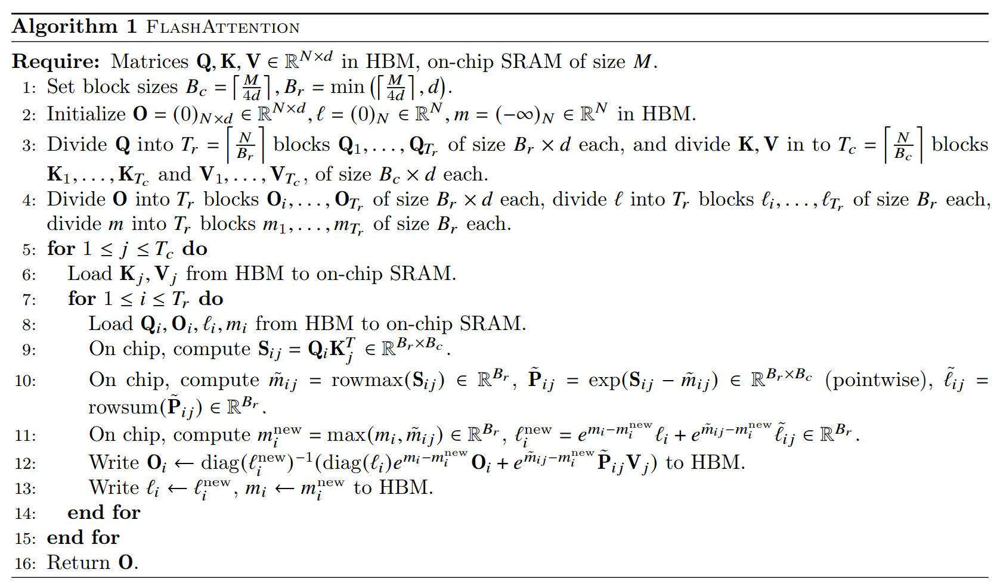
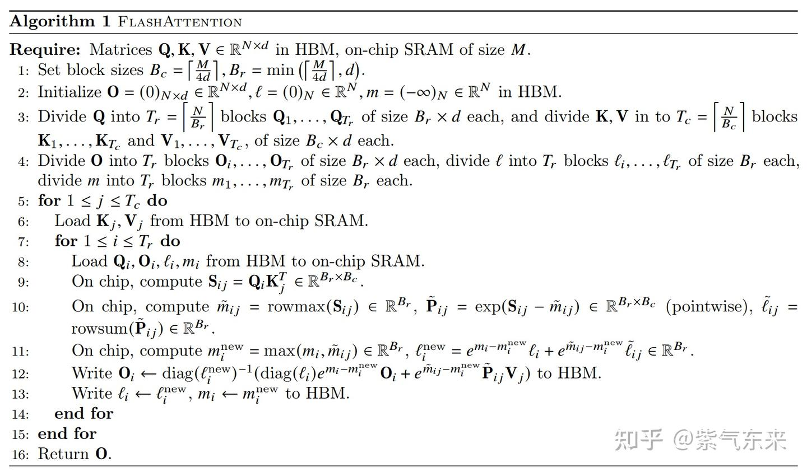
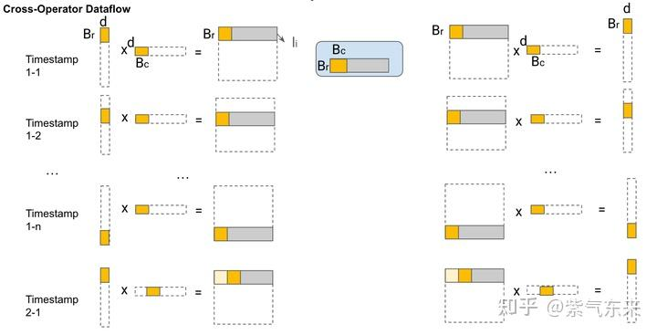
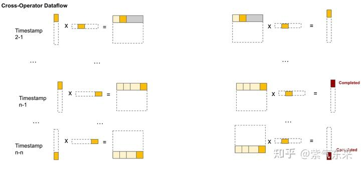
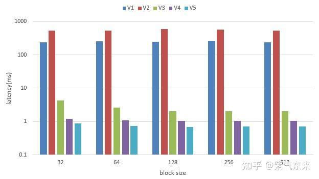

# ops(7): self-attention의 CUDA 구현과 최적화 (상)

> 원문: https://zhuanlan.zhihu.com/p/695898274

**목차**
- 1. self-attention의 단순 CUDA 구현
  - 1.1 CPU 버전
  - 1.2 단순 CUDA 구현 (V1)
  - 1.3 flash attention 단순 구현 (V2)
- 2. self-attention의 고효율 구현
  - 2.1 cuBLAS 라이브러리 사용 (V3)
  - 2.2 연산자 융합 + online softmax (V4)
  - 2.3 FP16 행렬 연산 (V5)
- 참고 자료

self-attention은 Transformer에서 가장 핵심적이고 가장 복잡한 부분이자 최적화의 중심입니다. self-attention을 이해하는 것은 Transformer 전체를 깊이 이해하는 데 결정적입니다. 본 글은 self-attention만 집중적으로 다루며, 분량이 많아 상·하편으로 나눕니다. 본 글은 상편입니다.

## 1. self-attention의 단순 CUDA 구현

self-attention 원리는 흔하고 이전 글에서도 많이 다뤘기에, 여기선 원리를 다루지 않고 코드만 해석합니다.

### 1.1 CPU 버전

기준 CPU 버전입니다. 흐름:

- 입력 `inp`는 x와 `QKV_weight`을 곱한 `QKV` 값. `b(batch)`, `t(seq)`, `h(head)`의 q(query_t) 인덱스는 `inp[b, t, h*hs : (h+1)*hs]`. k(key_t2)는 여기서 C 만큼 오프셋된 위치, 즉 `inp[b, t, h*hs+C : (h+1)*hs+C]`.
- q, k에서 점곱으로 attention 값을 계산. 한 값을 만든 뒤 scale하면서 동시에 max를 추적(softmax 준비). 한 행이 끝나면 mask 처리.
- softmax 수행, attn 값을 얻음.
- v(value_t2)를 인덱싱해 attn 값과 행렬 곱.

```cpp
void attention_forward_cpu(float* out, float* preatt, float* att,
                           const float* inp,
                           int B, int T, int C, int NH) {
    // inp: (B, T, 3C) — Q, K, V
    // preatt, att: (B, NH, T, T)
    // out: (B, T, C)
    int C3 = C*3;
    int hs = C / NH;
    float scale = 1.0 / sqrtf(hs);

    for (int b = 0; b < B; b++) {
        for (int t = 0; t < T; t++) {
            for (int h = 0; h < NH; h++) {
                const float* query_t = inp + b * T * C3 + t * C3 + h * hs;
                float* preatt_bth = preatt + b*NH*T*T + h*T*T + t*T;
                float* att_bth    = att    + b*NH*T*T + h*T*T + t*T;

                // 1. q·k와 max
                float maxval = -10000.0f;
                for (int t2 = 0; t2 <= t; t2++) {
                    const float* key_t2 = inp + b * T * C3 + t2 * C3 + h * hs + C;
                    float val = 0.0f;
                    for (int i = 0; i < hs; i++) val += query_t[i] * key_t2[i];
                    val *= scale;
                    if (val > maxval) maxval = val;
                    preatt_bth[t2] = val;
                }
                // autoregressive 밖은 -INF
                for (int t2 = t+1; t2 < T; t2++) preatt_bth[t2] = -INFINITY;

                // 2. exp와 합
                float expsum = 0.0f;
                for (int t2 = 0; t2 <= t; t2++) {
                    float expv = expf(preatt_bth[t2] - maxval);
                    expsum += expv;
                    att_bth[t2] = expv;
                }
                float expsum_inv = expsum == 0.0f ? 0.0f : 1.0f / expsum;

                // 3. softmax 정규화
                for (int t2 = 0; t2 < T; t2++) {
                    if (t2 <= t) att_bth[t2] *= expsum_inv;
                    else att_bth[t2] = 0.0f;
                }

                // 4. att · v 누적
                float* out_bth = out + b * T * C + t * C + h * hs;
                for (int i = 0; i < hs; i++) out_bth[i] = 0.0f;
                for (int t2 = 0; t2 <= t; t2++) {
                    const float* value_t2 = inp + b * T * C3 + t2 * C3 + h * hs + C*2;
                    float att_btht2 = att_bth[t2];
                    for (int i = 0; i < hs; i++) out_bth[i] += att_btht2 * value_t2[i];
                }
            }
        }
    }
}
```

### 1.2 단순 CUDA 구현 (V1)

CPU 흐름을 그대로 두고 계산을 3개 커널로 분할.

- (1) attention 값 계산. 총 `B*NH*T*T` thread, 즉 thread 하나당 값 1개.

```cpp
int total_threads = B * NH * T * T;
int num_blocks = ceil_div(total_threads, block_size);
attention_query_key_kernel1<<<num_blocks, block_size>>>(preatt, inp, B, T, C, NH);
```

```cpp
__global__ void attention_query_key_kernel1(float* preatt, const float* inp,
                                           int B, int T, int C, int NH) {
    int idx = blockIdx.x * blockDim.x + threadIdx.x;
    int total_threads = B * NH * T * T;
    if (idx < total_threads) {
        int t2 = idx % T;
        int t  = (idx / T) % T;
        if (t2 > t) { preatt[idx] = -INFINITY; return; }
        int h = (idx / (T * T)) % NH;
        int b = idx / (NH * T * T);

        int C3 = C*3;
        int hs = C / NH;
        const float* query_t = inp + b * T * C3 + t * C3 + h * hs;
        const float* key_t2  = inp + b * T * C3 + t2 * C3 + h * hs + C;

        float val = 0.0f;
        for (int i = 0; i < hs; i++) val += query_t[i] * key_t2[i];
        val *= 1.0 / sqrtf(hs);
        preatt[idx] = val;
    }
}
```

- (2) softmax. 이전 op 최적화에서 다뤘으므로 설명 생략.

```cpp
__global__ void attention_softmax_kernel1(float* att, const float* preatt,
                                          int B, int T, int NH) {
    int idx = blockIdx.x * blockDim.x + threadIdx.x;
    int total_threads = B * T * NH;
    if (idx < total_threads) {
        int h = idx % NH;
        int t = (idx / NH) % T;
        int b = idx / (NH * T);

        const float* preatt_bth = preatt + b*NH*T*T + h*T*T + t*T;
        float* att_bth = att + b*NH*T*T + h*T*T + t*T;

        float maxval = -10000.0f;
        for (int t2 = 0; t2 <= t; t2++) {
            if (preatt_bth[t2] > maxval) maxval = preatt_bth[t2];
        }
        float expsum = 0.0f;
        for (int t2 = 0; t2 <= t; t2++) {
            float expv = expf(preatt_bth[t2] - maxval);
            expsum += expv;
            att_bth[t2] = expv;
        }
        float expsum_inv = expsum == 0.0f ? 0.0f : 1.0f / expsum;

        for (int t2 = 0; t2 < T; t2++) {
            if (t2 <= t) att_bth[t2] *= expsum_inv;
            else att_bth[t2] = 0.0f;
        }
    }
}
```

- (3) attention 값 × v.

```cpp
__global__ void attention_value_kernel1(float* out, const float* att, const float* inp,
                                        int B, int T, int C, int NH) {
    int idx = blockIdx.x * blockDim.x + threadIdx.x;
    int total_threads = B * T * NH;

    if (idx < total_threads) {
        int h = idx % NH;
        int t = (idx / NH) % T;
        int b = idx / (NH * T);

        int C3 = C*3;
        int hs = C / NH;

        float* out_bth = out + b * T * C + t * C + h * hs;
        const float* att_bth = att + b*NH*T*T + h*T*T + t*T;

        for (int i = 0; i < hs; i++) out_bth[i] = 0.0f;
        for (int t2 = 0; t2 <= t; t2++) {
            const float* value_t2 = inp + b * T * C3 + t2 * C3 + h * hs + C*2;
            float att_btht2 = att_bth[t2];
            for (int i = 0; i < hs; i++) out_bth[i] += att_btht2 * value_t2[i];
        }
    }
}
```

기본형 self-attention 완성. 성능:

```
block_size   32 | time 238.912872 ms
block_size   64 | time 252.689301 ms
block_size  128 | time 246.945175 ms
block_size  256 | time 261.469421 ms
block_size  512 | time 241.190613 ms
```

### 1.3 flash attention 단순 구현 (V2)

flash attention은 GPU 메모리 체계를 고려해 self-attention에 가한 매우 중요한 최적화입니다. 원리는 이전 글에서 자세히 다뤘으니 알고리즘만 첨부합니다.


*紫氣東來: FlashAttention → PagedAttention, Attention 추가 최적화 (1401 추천)*



핵심 파라미터 초기화:

```cpp
const int Bc = 32;
const int Br = 32;
const int nh = NH;
const int N  = T;
const int d  = C / NH;
const int Tc = ceil((float) N / Bc);
const int Tr = ceil((float) N / Br);
const float softmax_scale = 1.0 / sqrt(d);
```

block당 SRAM 사이즈 확인:

```cpp
int col_tile_size = Bc * d;       // Kj, Vj
int row_tile_size = Br * d;       // Qi
const int sram_size =
    (2 * col_tile_size * sizeof(float))  // Kj, Vj
    + (row_tile_size * sizeof(float))    // Qi
    + (Bc * Br * sizeof(float));          // S
int max_sram_size;
cudaDeviceGetAttribute(&max_sram_size, cudaDevAttrMaxSharedMemoryPerBlock, 0);
if (sram_size > max_sram_size) {
    printf("Max shared memory: %d, requested: %d\n", max_sram_size, sram_size);
    exit(1);
}
```

flash attention 안에서 복잡한 인덱싱·reshape·permute를 피하려고, 별도 커널로 permute를 먼저 수행:

```cpp
__global__ void permute_kernel(float* q, float* k, float* v,
                               const float* inp,
                               int B, int N, int NH, int d) {
    // 원하는 모양은 Q,K,V = (B, NH, N, d). 단일 텐서 QKV(inp) = (B, N, 3, NH, d).
    int idx = blockIdx.x * blockDim.x + threadIdx.x;
    if (idx < B * NH * N * d) {
        int b = idx / (NH * N * d);
        int rest = idx % (NH * N * d);
        int nh_ = rest / (N * d);
        rest = rest % (N * d);
        int n = rest / d;
        int d_ = rest % d;

        int inp_idx = (b * N * 3 * NH * d)
                    + (n * 3 * NH * d)
                    + (0 * NH * d)
                    + (nh_ * d)
                    + d_;

        q[idx] = inp[inp_idx];
        k[idx] = inp[inp_idx + NH * d];
        v[idx] = inp[inp_idx + 2 * (NH * d)];
    }
}
```

flash attention 본체:





```cpp
__global__ void attention_forward_kernel2(
    const float* Q, const float* K, const float* V,
    const int N, const int d,
    const int Tc, const int Tr,
    const int Bc, const int Br,
    const float softmax_scale,
    float* l, float* m, float* O)
{
    int tx = threadIdx.x;
    int bx = blockIdx.x; int by = blockIdx.y;

    int qkv_offset = (bx * gridDim.y * N * d) + (by * N * d);
    int lm_offset  = (bx * gridDim.y * N) + (by * N);

    extern __shared__ float sram[];
    int tile_size = Bc * d;
    float* Qi = sram;
    float* Kj = &sram[tile_size];
    float* Vj = &sram[tile_size * 2];
    float* S  = &sram[tile_size * 3];

    for (int j = 0; j < Tc; j++) {
        for (int x = 0; x < d; x++) {
            Kj[(tx * d) + x] = K[qkv_offset + (tile_size * j) + (tx * d) + x];
            Vj[(tx * d) + x] = V[qkv_offset + (tile_size * j) + (tx * d) + x];
        }
        __syncthreads();

        for (int i = 0; i < Tr; i++) {
            if (i * Br + tx >= N) break;

            for (int x = 0; x < d; x++) {
                Qi[(tx * d) + x] = Q[qkv_offset + (tile_size * i) + (tx * d) + x];
            }
            float row_m_prev = m[lm_offset + (Br * i) + tx];
            float row_l_prev = l[lm_offset + (Br * i) + tx];

            // S = QK^T, row_m
            float row_m = -INFINITY;
            for (int y = 0; y < Bc; y++) {
                if (j * Bc + y >= N) break;
                float sum = 0;
                for (int x = 0; x < d; x++) sum += Qi[(tx * d) + x] * Kj[(y * d) + x];
                sum *= softmax_scale;
                if (i * Br + tx < j * Bc + y) sum = -INFINITY;
                S[(Bc * tx) + y] = sum;
                if (sum > row_m) row_m = sum;
            }

            // P = exp(S - row_m), row_l = rowsum(P)
            float row_l = 0;
            for (int y = 0; y < Bc; y++) {
                if (j * Bc + y >= N) break;
                if (i * Br + tx < j * Bc + y) S[(Bc * tx) + y] = 0;
                else S[(Bc * tx) + y] = __expf(S[(Bc * tx) + y] - row_m);
                row_l += S[(Bc * tx) + y];
            }

            // new m, l
            float row_m_new = max(row_m_prev, row_m);
            float row_l_new = (__expf(row_m_prev - row_m_new) * row_l_prev)
                             + (__expf(row_m - row_m_new) * row_l);

            for (int x = 0; x < d; x++) {
                float pv = 0;
                for (int y = 0; y < Bc; y++) {
                    if (j * Bc + y >= N) break;
                    pv += S[(Bc * tx) + y] * Vj[(y * d) + x];
                }
                O[qkv_offset + (tile_size * i) + (tx * d) + x] =
                    (1 / row_l_new)
                    * ((row_l_prev * __expf(row_m_prev - row_m_new) * O[qkv_offset + (tile_size * i) + (tx * d) + x])
                     + (__expf(row_m - row_m_new) * pv));
            }
            m[lm_offset + (Br * i) + tx] = row_m_new;
            l[lm_offset + (Br * i) + tx] = row_l_new;
        }
        __syncthreads();
    }
}
```

이후 unpermute로 원 모양으로 되돌립니다.

```cpp
__global__ void unpermute_kernel(const float* inp, float *out, int B, int N, int NH, int d) {
    int idx = blockIdx.x * blockDim.x + threadIdx.x;
    if (idx < B * NH * N * d) {
        int b = idx / (NH * N * d);
        int rest = idx % (NH * N * d);
        int nh_ = rest / (N * d);
        rest = rest % (N * d);
        int n = rest / d;
        int d_ = rest % d;
        int other_idx = (b * NH * N * d) + (n * NH * d) + (nh_ * d) + d_;
        out[other_idx] = inp[idx];
    }
}
```

flash attention 1의 단순 순전파 구현 완료. 데이터 양이 적어서 오히려 V1보다 느립니다.

```
block_size   32 | time 536.709961 ms
block_size   64 | time 526.100098 ms
block_size  128 | time 583.016235 ms
block_size  256 | time 573.955994 ms
block_size  512 | time 534.477051 ms
```

## 2. self-attention의 고효율 구현

### 2.1 cuBLAS 라이브러리 사용 (V3)

지금까지는 행렬 곱도 손수 구현했지만, 공식 라이브러리에 비해 성능 차이가 큽니다. 이번엔 cuBLAS를 씁니다. cuBLAS는 [B50](../B50_gemm_intro_to_proficient/README.md) 참고.

`q @ k.T`:

```cpp
const float alpha = 1.0f;
const float beta  = 0.0f;
cublasCheck(cublasSgemmStridedBatched(cublas_handle,
                        CUBLAS_OP_T, CUBLAS_OP_N,
                        T, T, HS,
                        &alpha,
                        k, HS, T * HS,
                        q, HS, T * HS,
                        &beta,
                        preatt, T, T * T,
                        B * NH));
```

`att @ v`:

```cpp
// y = att @ v  (B, nh, T, T) @ (B, nh, T, hs) -> (B, nh, T, hs)
cublasCheck(cublasSgemmStridedBatched(cublas_handle,
                        CUBLAS_OP_N, CUBLAS_OP_N,
                        HS, T, T,
                        &alpha,
                        v, HS, T * HS,
                        att, T, T * T,
                        &beta,
                        vaccum, HS, T * HS,
                        B * NH));
```

V1 대비 100배 이상:

```
block_size   32 | time 4.318913 ms
block_size   64 | time 2.606850 ms
block_size  128 | time 2.034935 ms
block_size  256 | time 2.031407 ms
block_size  512 | time 2.064406 ms
```

### 2.2 연산자 융합 + online softmax (V4)

V3 위에 online softmax를 쓰고 scale을 융합:

```cpp
__global__ void softmax_forward_kernel5(float* out, float inv_temperature, const float* inp, int N, int T) {
    // inp, out: (N, T, T), N = B * NH
    // attention scale 곱셈을 내부 융합, autoregressive — lower triangular만 계산
    assert(T % 4 == 0);
    namespace cg = cooperative_groups;
    cg::thread_block block = cg::this_thread_block();
    cg::thread_block_tile<32> warp = cg::tiled_partition<32>(block);
    int idx = blockIdx.x * warp.meta_group_size() + warp.meta_group_rank();
    if (idx >= N * T) return;
    int own_pos = idx % T;
    int pos_by_4 = own_pos / 4;

    const float* x = inp + idx * T;

    float maxval = -FLT_MAX;
    float sumval = 0.0f;

    const float4* x_vec = reinterpret_cast<const float4*>(x);
    for (int i = warp.thread_rank(); i < pos_by_4; i += warp.size()) {
        float4 v = x_vec[i];
        float old_maxval = maxval;
        for (int k = 0; k < 4; ++k) maxval = fmaxf(maxval, vec_at(v, k));
        sumval *= expf(inv_temperature * (old_maxval - maxval));
        for (int k = 0; k < 4; ++k) sumval += expf(inv_temperature * (vec_at(v, k) - maxval));
    }

    if (4*pos_by_4 + warp.thread_rank() <= own_pos) {
        float old_maxval = maxval;
        maxval = fmaxf(maxval, x[4*pos_by_4 + warp.thread_rank()]);
        sumval *= expf(inv_temperature * (old_maxval - maxval));
        sumval += expf(inv_temperature * (x[4*pos_by_4 + warp.thread_rank()] - maxval));
    }

    float global_maxval = cg::reduce(warp, maxval, cg::greater<float>{});
    sumval *= expf(inv_temperature * (maxval - global_maxval));

    float sum  = cg::reduce(warp, sumval, cg::plus<float>{});
    float norm = 1.f / sum;

    for (int i = warp.thread_rank(); i <= own_pos; i += warp.size()) {
        float ev = expf(inv_temperature * (__ldcs(x + i) - global_maxval));
        __stcs(out + idx * T + i, ev * norm);
    }
}
```

성능 약간 향상:

```
block_size   32 | time 1.198167 ms
block_size   64 | time 1.073088 ms
block_size  128 | time 1.042434 ms
block_size  256 | time 1.041798 ms
block_size  512 | time 1.044009 ms
```

### 2.3 FP16 행렬 연산 (V5)

permute/unpermute 단계에서 FP32 ↔ FP16 변환:

```cpp
if (!skip_permute || first_run_validation) {
    permute_kernel_lowp<<<num_blocks, block_size>>>(q, k, v, inp, B, T, NH, HS);
}
...
if (!skip_permute || first_run_validation) {
    unpermute_kernel_lowp<<<num_blocks, block_size>>>(vaccum, out, B, T, NH, HS);
}
```

성능:

```
block_size   32 | time 0.866851 ms
block_size   64 | time 0.743674 ms
block_size  128 | time 0.703196 ms
block_size  256 | time 0.713902 ms
block_size  512 | time 0.712848 ms
```

여러 방법의 비교(A100-80G, y축은 지수 스케일):



코드: [attention_forward.cu](https://github.com/ifromeast/cuda_learning/blob/main/04_transformer/ops/attention_forward.cu).

## 참고 자료

1. https://github.com/karpathy/llm.c/blob/master/dev/cuda/attention_forward.cu
2. https://github.com/karpathy/llm.c/blob/master/dev/cuda/attention_backward.cu
3. 紫氣東來: FlashAttention → PagedAttention, Attention 추가 최적화

> 人生到處知何似, 應似飛鴻踏雪泥 — 蘇軾 《和子由澠池懷舊》
