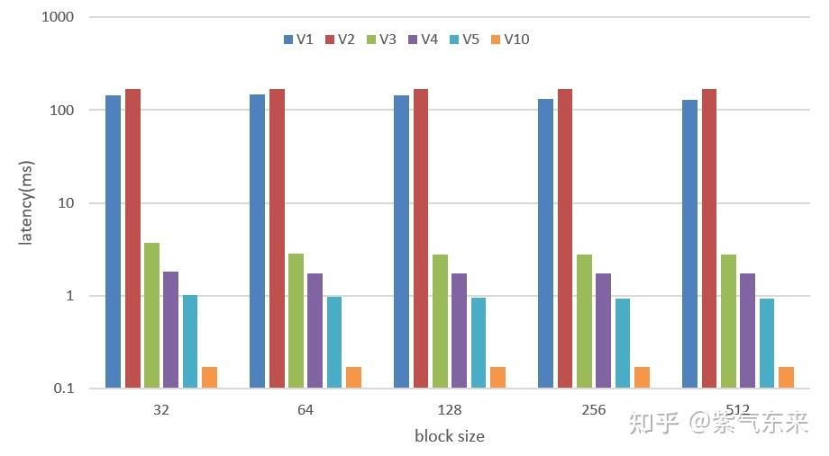
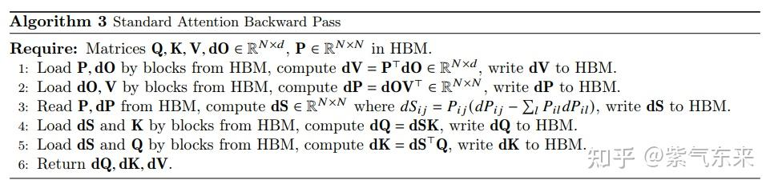
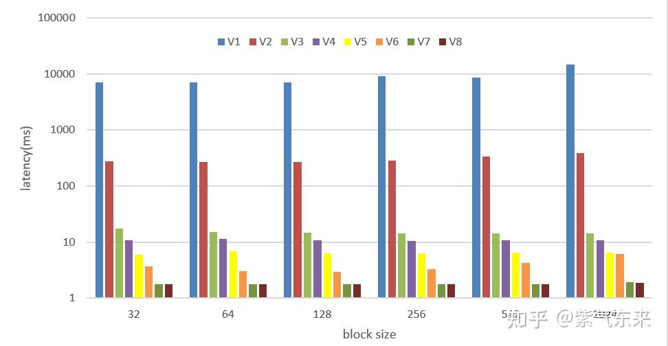

# ops(8): self-attention의 CUDA 구현과 최적화 (하)

> 원문: https://zhuanlan.zhihu.com/p/696197013

**목차**
- 1. cuDNN 인터페이스로 구현
  - 1.1 cuDNN 개요와 attention 구현
  - 1.2 cuDNN 인터페이스 호출 (V10)
- 2. self-attention 역전파 구현
  - 2.1 역전파 유도
  - 2.2 CPU 구현
  - 2.3 단순 CUDA 구현 (V1)
  - 2.4 역전파 최적화 (V2~V8)
- 참고 자료

상편에서 self-attention의 CUDA 기본 구현과 최적화를 다뤘습니다 ([B57](../B57_ops7_self_attention_upper/README.md) 참고).


*紫氣東來: ops(7) self-attention의 CUDA 구현과 최적화 (상) (94 추천)*

본 글은 하편으로, cuDNN 기반 구현과 역전파 구현을 다룹니다.

## 1. cuDNN 인터페이스로 구현

### 1.1 cuDNN 개요와 attention 구현

cuDNN(NVIDIA CUDA Deep Neural Network Library)은 딥러닝 연산자 수준 GPU 가속 라이브러리 모음입니다. 딥러닝 알고리즘에서 자주 쓰이는 연산자의 고효율 구현을 제공해, TensorRT·TVM 같은 상위 추론 엔진의 하부 튜닝용 연산자 대체 구현으로도 사용됩니다.

cuDNN의 대표적인 연산자:

- 순/역 합성곱
- 행렬 곱
- 순/역 풀링
- 순/역 Softmax
- 순/역 활성화: ReLU/Tanh/Sigmoid/ELU/GELU/Softplus/Swish
- 순/역 정규화: BN/IN/LN/LRN/LCN
- 기본 수치 연산 (point-wise)
- 텐서 변환

이번 절은 Scaled Dot Product Attention 구현과 인터페이스만 다룹니다. cuDNN의 구현은 FlashAttention-2 알고리즘을 사용합니다. 원리는 생략하고 파라미터·인터페이스 사용법만 봅니다. cuDNN은 Python·C++ 두 인터페이스를 제공합니다.

**Python 인터페이스**

```
Args:
    q (cudnn_tensor): query
    k (cudnn_tensor): key
    v (cudnn_tensor): value
    is_inference (bool)
    attn_scale (Optional[Union[float, cudnn_tensor]])
    bias (Optional[cudnn_tensor])
    use_alibi_mask (Optional[bool])
    use_padding_mask (Optional[bool])
    seq_len_q (Optional[cudnn_tensor])
    seq_len_kv (Optional[cudnn_tensor])
    use_causal_mask (Optional[bool])
    dropout (Optional[...])
    compute_data_type (Optional[cudnn.data_type])
    name (Optional[str])

Returns:
    o (cudnn_tensor): output
    stats (Optional[cudnn_tensor]): training 시 softmax 통계
```

**C++ API**

```cpp
// returns [output, softmax_stats]
std::array<std::shared_ptr<Tensor_attributes>, 2>
sdpa(std::shared_ptr<Tensor_attributes> q,
     std::shared_ptr<Tensor_attributes> k,
     std::shared_ptr<Tensor_attributes> v,
     SDPA_attributes options);
```

`SDPA_attributes`의 setter:

```cpp
set_is_inference(bool);
set_attn_scale(std::shared_ptr<Tensor_attributes>);
set_attn_scale(float);
set_bias(std::shared_ptr<Tensor_attributes>);
set_alibi_mask(bool);
set_padding_mask(bool);
set_seq_len_q(std::shared_ptr<Tensor_attributes>);
set_seq_len_kv(std::shared_ptr<Tensor_attributes>);
set_causal_mask(bool);
set_dropout(float probability,
            std::shared_ptr<Tensor_attributes> seed,
            std::shared_ptr<Tensor_attributes> offset);
set_dropout(std::shared_ptr<Tensor_attributes> mask,
            std::shared_ptr<Tensor_attributes> scale);
set_compute_data_type(DataType_t);
```

### 1.2 cuDNN 인터페이스 호출 (V10)

입출력 텐서 묶음 타입:

```cpp
using graph_tensors_fwd = std::tuple<std::shared_ptr<fe::graph::Graph>,
                                     std::shared_ptr<fe::graph::Tensor_attributes>,  // Q
                                     std::shared_ptr<fe::graph::Tensor_attributes>,  // K
                                     std::shared_ptr<fe::graph::Tensor_attributes>,  // V
                                     std::shared_ptr<fe::graph::Tensor_attributes>,  // Attn_scale
                                     std::shared_ptr<fe::graph::Tensor_attributes>,  // O
                                     std::shared_ptr<fe::graph::Tensor_attributes>>; // Stats

using cache_type_fwd = std::unordered_map<std::size_t, graph_tensors_fwd>;
```

cuDNN frontend로 그래프를 만들고 파라미터·텐서 매핑:

```cpp
template <typename... Args>
auto lookup_cache_or_build_graph_fwd(Args... args) {
    static cache_type_fwd user_maintained_cache_fwd;
    auto [B, H, T, HS, is_inference_only] = std::make_tuple(args...);

    auto graph = std::make_shared<fe::graph::Graph>();
    graph->set_io_data_type(CUDNN_16BIT)
          .set_intermediate_data_type(fe::DataType_t::FLOAT)
          .set_compute_data_type(fe::DataType_t::FLOAT);

    // QKV가 (B, T, 3, NH, HS)이라 cuDNN이 external permute 없이 처리 가능
    auto Q = graph->tensor(fe::graph::Tensor_attributes()
                               .set_name("Q")
                               .set_dim({B, H, T, HS})
                               .set_stride({3 * H * HS * T, HS, 3 * H * HS, 1}));
    auto K = graph->tensor(fe::graph::Tensor_attributes()
                               .set_name("K")
                               .set_dim({B, H, T, HS})
                               .set_stride({3 * H * HS * T, HS, 3 * H * HS, 1}));
    auto V = graph->tensor(fe::graph::Tensor_attributes()
                               .set_name("V")
                               .set_dim({B, H, T, HS})
                               .set_stride({3 * H * HS * T, HS, 3 * H * HS, 1}));
    auto attn_scale = graph->tensor(fe::graph::Tensor_attributes()
                                .set_name("attn_scale")
                                .set_dim({1, 1, 1, 1})
                                .set_stride({1, 1, 1, 1})
                                .set_is_pass_by_value(true)
                                .set_data_type(fe::DataType_t::FLOAT));

    auto sdpa_options = fe::graph::SDPA_attributes().set_name("flash_attention");
    sdpa_options.set_is_inference(is_inference_only);
    sdpa_options.set_attn_scale(attn_scale);
    sdpa_options.set_causal_mask(true);

    auto [O, stats] = graph->sdpa(Q, K, V, sdpa_options);

    O->set_output(true).set_dim({B, H, T, HS}).set_stride({H * HS * T, HS, H * HS, 1});

    assert(stats == nullptr || is_inference_only == false);
    if (is_inference_only == false) {
        stats->set_output(true).set_data_type(fe::DataType_t::FLOAT)
                               .set_dim({B, H, T, 1})
                               .set_stride({H * T, T, 1, 1});
    }

    assert(graph->validate().is_good());
    auto key = graph->key();
    auto it = user_maintained_cache_fwd.find(key);
    if (it != user_maintained_cache_fwd.end()) return it->second;

    // 매우 느린 부분
    assert(graph->build_operation_graph(cudnn_handle).is_good());
    auto plans = graph->create_execution_plans({fe::HeurMode_t::A});
    assert(graph->check_support(cudnn_handle).is_good());
    assert(graph->build_plans(cudnn_handle).is_good());

    auto tuple = std::make_tuple(graph, Q, K, V, attn_scale, O, stats);
    user_maintained_cache_fwd.insert({key, tuple});
    return tuple;
}
```

전체 커널:

```cpp
void attention_forward_cudnn(floatX* out, float* stats,
                             floatX* inp,
                             float* in_fp32, float* out_fp32,
                             int B, int T, int C, int NH) {
    static bool first_run_validation = true;
    int HS = C / NH;
    bool is_inference_only = (stats == nullptr);

    const int block_size = 64;
    if (first_run_validation) {
        int total_threads = B * T * C * 3;
        assert(total_threads % block_size == 0);
        int num_blocks = total_threads / block_size;
        fp32_to_lowp_kernel<<<num_blocks, block_size>>>(inp, in_fp32);
    }

    auto [graph, Q, K, V, attn_scale, O, softmax_stats] =
        lookup_cache_or_build_graph_fwd(B, NH, T, HS, is_inference_only);

    void* devPtrQ = inp;
    void* devPtrK = (inp + C);
    void* devPtrV = (inp + 2 * C);
    float attn_scale_cpu = 1.0 / sqrtf(HS);
    void* devPtrO = out;

    std::unordered_map<std::shared_ptr<fe::graph::Tensor_attributes>, void*> variant_pack = {
        {Q, devPtrQ}, {K, devPtrK}, {V, devPtrV}, {attn_scale, &attn_scale_cpu}, {O, devPtrO}};

    if (!is_inference_only) variant_pack[softmax_stats] = stats;

    if (graph->get_workspace_size() > cudnn_workspace_size) {
        if (cudnn_workspace_size > 0) cudaCheck(cudaFree(cudnn_workspace));
        cudnn_workspace_size = graph->get_workspace_size();
        cudaCheck(cudaMalloc(&cudnn_workspace, cudnn_workspace_size));
    }

    assert(graph->execute(cudnn_handle, variant_pack, cudnn_workspace).is_good());
    cudaCheck(cudaGetLastError());

    if (first_run_validation) {
        int total_threads = B * T * C;
        assert(total_threads % block_size == 0);
        int num_blocks = total_threads / block_size;
        lowp_to_fp32_kernel<<<num_blocks, block_size>>>(out, out_fp32);
    }
    cudaCheck(cudaGetLastError());
    first_run_validation = false;
}
```

성능:

```
block_size   32 | time 0.169061 ms
block_size   64 | time 0.165807 ms
block_size  128 | time 0.167423 ms
block_size  256 | time 0.165734 ms
block_size  512 | time 0.167426 ms
```

RTX 4090 + CUDA 12.4에서 V1~V5와 cuDNN을 다시 측정한 비교:



## 2. self-attention 역전파 구현

### 2.1 역전파 유도

먼저 행렬 곱의 미분. `Y = W X`, 목적 함수 값 `φ`라 하고 `dY, dW, dX`를 각각 `∂φ/∂Y, ∂φ/∂W, ∂φ/∂X`로 표기하면:

```
dW = dY · Xᵀ
dX = Wᵀ · dY
```

다음으로 softmax 미분.

`X = [x₁, ..., xₙ]`, `Y = softmax(X) = [y₁, ..., yₙ]`. `yᵢ = exp(xᵢ) / Σ exp(xⱼ)`이고 `Σ yᵢ = 1`. `∂yᵢ/∂xⱼ`:

- `i = j`: `yᵢ(1 − yᵢ)`
- `i ≠ j`: `−yᵢ · yⱼ`

이 두 결과를 사용해 attention 역전파가 가능합니다.

`P = Softmax(S)`, `S = Q Kᵀ / √dₖ`, `O = P V` 라 하면 역전파는:



### 2.2 CPU 구현

```cpp
// scale의 시점을 preatt "동안"이 아니라 이후로 옮긴 점에 주의
// 또한 mask로 가려지는 부분도 모두 materialize
void attention_backward_cpu(float* dinp, float* dpreatt, float* datt,
                            float* dout, float* inp, float* att,
                            int B, int T, int C, int NH) {
    int C3 = C*3;
    int hs = C / NH;
    float scale = 1.0 / sqrtf(hs);

    for (int b = 0; b < B; b++) {
        for (int t = 0; t < T; t++) {
            for (int h = 0; h < NH; h++) {
                float* att_bth      = att      + b*NH*T*T + h*T*T + t*T;
                float* datt_bth     = datt     + b*NH*T*T + h*T*T + t*T;
                float* dpreatt_bth  = dpreatt  + b*NH*T*T + h*T*T + t*T;
                float* dquery_t     = dinp + b * T * C3 + t * C3 + h * hs;
                float* query_t      = inp  + b * T * C3 + t * C3 + h * hs;

                // (4) value 누적 역전파
                float* dout_bth = dout + b * T * C + t * C + h * hs;
                for (int t2 = 0; t2 < T; t2++) {
                    float* value_t2  = inp  + b * T * C3 + t2 * C3 + h * hs + C*2;
                    float* dvalue_t2 = dinp + b * T * C3 + t2 * C3 + h * hs + C*2;
                    for (int i = 0; i < hs; i++) {
                        datt_bth[t2] += value_t2[i] * dout_bth[i];
                        dvalue_t2[i] += att_bth[t2] * dout_bth[i];
                    }
                }

                // (2 & 3) softmax 역전파
                for (int t2 = 0; t2 <= t; t2++) {
                    for (int t3 = 0; t3 <= t; t3++) {
                        float indicator = t2 == t3 ? 1.0f : 0.0f;
                        float local_derivative = att_bth[t2] * (indicator - att_bth[t3]);
                        dpreatt_bth[t3] += scale * local_derivative * datt_bth[t2];
                    }
                }

                // (1) query · key 역전파
                for (int t2 = 0; t2 <= t; t2++) {
                    float* key_t2  = inp  + b * T * C3 + t2 * C3 + h * hs + C;
                    float* dkey_t2 = dinp + b * T * C3 + t2 * C3 + h * hs + C;
                    for (int i = 0; i < hs; i++) {
                        dquery_t[i] += key_t2[i]  * dpreatt_bth[t2];
                        dkey_t2[i]  += query_t[i] * dpreatt_bth[t2];
                    }
                }
            }
        }
    }
}
```

### 2.3 단순 CUDA 구현 (V1)

같은 흐름에 cublas로 행렬 곱:

```cpp
// inp (B,T,3C) -> qkvr (B,T,3C) -> preatt (B,NH,T,T) -> att (B,NH,T,T) -> vaccum (B,T,C) -> out
template<class SoftmaxKernel>
void attention_backward1(float* dinp, float* dqkvr, float* dpreatt, float* datt, float* dvaccum,
                         const float* dout,
                         const float* inp, const float* qkvr, const float* preatt, const float* att, const float* vaccum,
                         int B, int T, int C, int NH,
                         SoftmaxKernel softmax_autoregressive_backward,
                         const int block_size) {
    int HS = C / NH;
    const float alpha = 1.0f;
    const float beta  = 1.0f; // gradient 누적 (+=)
    const float *q, *k, *v;
    q = qkvr + 0 * B * T * C;
    k = qkvr + 1 * B * T * C;
    v = qkvr + 2 * B * T * C;
    float *dq, *dk, *dv;
    dq = dqkvr + 0 * B * T * C;
    dk = dqkvr + 1 * B * T * C;
    dv = dqkvr + 2 * B * T * C;

    int num_blocks = ceil_div(B * T * C, block_size);
    unpermute_kernel_backward<<<num_blocks, block_size>>>(dvaccum, dout, B, T, NH, HS);

    // datt
    cublasCheck(cublasSgemmStridedBatched(cublas_handle,
                            CUBLAS_OP_T, CUBLAS_OP_N,
                            T, T, HS,
                            &alpha, v, HS, T * HS,
                            dvaccum, HS, T * HS,
                            &beta, datt, T, T * T,
                            B * NH));

    // dv
    cublasCheck(cublasSgemmStridedBatched(cublas_handle,
            CUBLAS_OP_N, CUBLAS_OP_T,
            HS, T, T,
            &alpha, dvaccum, HS, T * HS,
            att, T, T * T,
            &beta, dv, HS, T * HS,
            B * NH));

    // dpreatt (softmax backward)
    softmax_autoregressive_backward(dpreatt, datt, att, B, T, C, NH, block_size);

    // dq
    cublasCheck(cublasSgemmStridedBatched(cublas_handle,
                            CUBLAS_OP_N, CUBLAS_OP_N,
                            HS, T, T,
                            &alpha, k, HS, T * HS,
                            dpreatt, T, T * T,
                            &beta, dq, HS, T * HS,
                            B * NH));
    // dk
    cublasCheck(cublasSgemmStridedBatched(cublas_handle,
                            CUBLAS_OP_N, CUBLAS_OP_T,
                            HS, T, T,
                            &alpha, q, HS, T * HS,
                            dpreatt, T, T * T,
                            &beta, dk, HS, T * HS,
                            B * NH));

    num_blocks = ceil_div(B * NH * T * HS, block_size);
    permute_kernel_backward<<<num_blocks, block_size>>>(dinp, dq, dk, dv, B, T, NH, HS);
}
```

RTX 4090 성능:

```
block_size   32 | time 7084.399902 ms
block_size   64 | time 7067.519531 ms
block_size  128 | time 7077.885254 ms
block_size  256 | time 9231.899414 ms
block_size  512 | time 8673.948242 ms
block_size 1024 | time 14843.697266 ms
```

### 2.4 역전파 최적화 (V2~V8)

행렬 곱은 cuBLAS를 쓰니, 이후 최적화는 softmax 중심입니다.

- **V2**: `t, b, h`에서 병렬화
- **V3**: V2 + cooperative groups
- **V4**: V3 + UNROLL
- **V5**: V4의 특수 케이스 최적화
- **V6**: 루프 재구성·메모리 접근 최적화
- **V7**: 수학 단순화 + cooperative groups reduce
- **V8**: V7 + 잔잔한 트릭

각 단계 성능:

```
V2:
block_size   32 | time 273.880554 ms
block_size 1024 | time 388.895203 ms

V3:
block_size   32 | time 17.532518 ms
block_size 1024 | time 14.197658 ms

V4:
block_size   32 | time 10.701917 ms
block_size 1024 | time 10.808935 ms

V5:
block_size   32 | time  6.028288 ms
block_size 1024 | time  6.442598 ms

V6:
block_size   32 | time  3.683847 ms
block_size 1024 | time  6.089725 ms

V7:
block_size   32 | time  1.766189 ms
block_size 1024 | time  1.897673 ms

V8:
block_size   32 | time  1.781242 ms
block_size 1024 | time  1.875651 ms
```

여러 방법 비교:



코드: [attention_backward.cu](https://github.com/ifromeast/cuda_learning/blob/main/04_transformer/ops/attention_backward.cu).

## 참고 자료

1. https://github.com/karpathy/llm.c/blob/master/dev/cuda/attention_forward.cu
2. https://github.com/karpathy/llm.c/blob/master/dev/cuda/attention_backward.cu
3. https://github.com/NVIDIA/cudnn-frontend/blob/main/docs/operations/Attention.md
4. https://github.com/NVIDIA/cudnn-frontend/blob/main/samples/cpp/mha.cpp
5. Not understanding derivative of a matrix-matrix product
6. https://www.math.uwaterloo.ca/~hwolkowi/matrixcookbook.pdf
7. 無用: 역전파 (1) — softmax 함수

> 休言萬事轉頭空, 未轉頭時皆夢 — 蘇軾 《西江月·平山堂》
