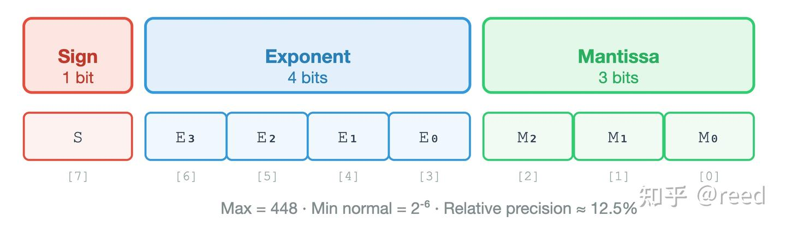
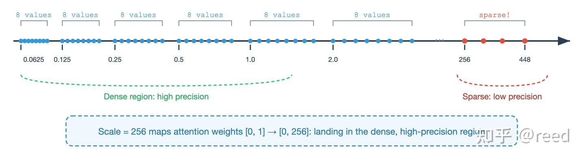
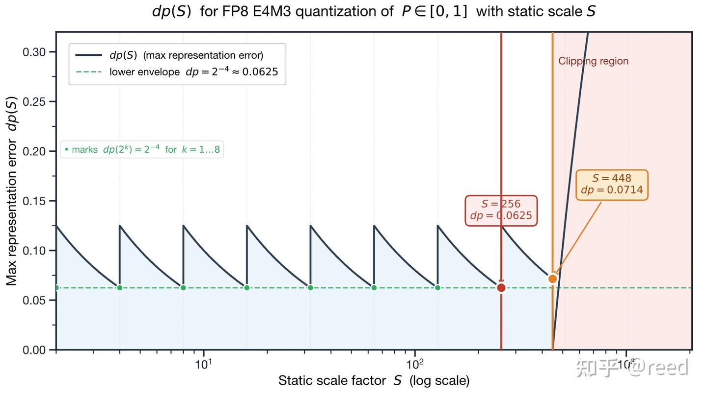
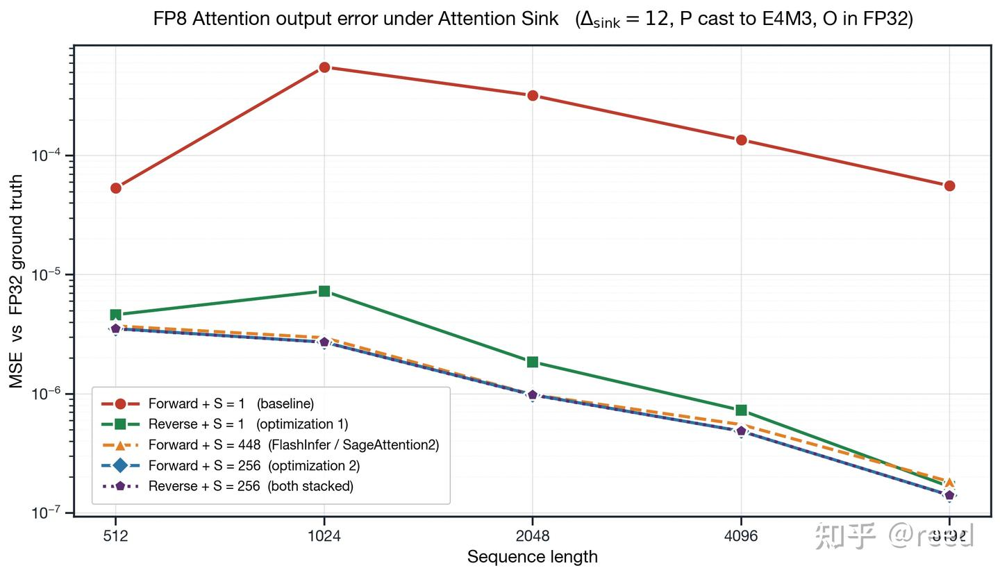

# FP8 Attention의 정밀도 최적화 - 역순 계산과 스케일 팩터 선택

> 원문: https://zhuanlan.zhihu.com/p/2038747362596737621

LLM 모델 규모가 계속 커지면서, 저정밀도 계산은 학습과 추론 throughput을 끌어올리는 핵심 수단이 되었습니다. Hopper 아키텍처는 Tensor Core에서 FP8(E4M3와 E5M2 포함)을 처음으로 네이티브 지원했고, FlashAttention-3는 그 위에서 attention 연산자의 중간 결과까지 통째로 FP8로 내렸습니다. 그러나 FP8과 BF16 / FP16의 수치 표현 격차는 자릿수 단위입니다. E4M3는 mantissa를 3비트로만 기술하므로 상대 정밀도가 $2^{- 3} = 12.5\%$에 불과하며, FP16보다 한두 자릿수 떨어집니다. FP16 / BF16 시대에는 대수롭지 않다고 여겨지던 구현 디테일 — 예를 들어 KV block의 iteration 방향, softmax 이후 P의 quantization scaling factor 값 — 이 FP8에서는 크게 증폭되어 최종 정밀도에 영향을 줍니다.

본 글은 Hopper의 주류 FP8 FlashAttention 레이아웃(O accumulator는 전 구간 FP32, P는 명시적으로 E4M3로 cast)을 중심으로 이 두 문제를 다루고, 대응하는 엔지니어링 수정 방법으로 **KV block 역방향 iteration**과 **$S = 256 = 2^{8}$의 static quantization scale**을 제시합니다. 글의 구성은 다음과 같습니다. 먼저 FP8 E4M3의 수치 구조와, Attention Sink가 정방향 iteration에서 어떻게 P 행렬을 subnormal 영역 아래로 붕괴시키는지를 되짚어 메커니즘 측면에서 역순 계산 전략을 끌어냅니다. 다음으로 IEEE 754 부동소수점 수학과 E4M3 수직선 기하라는 두 관점에서 $S = 256$이 최적해임을 논증합니다. 마지막으로 주류 FP8 attention 구현들의 구체적 선택을 대조하고 대조 실험 결과를 제시합니다.

미리 짚어 둘 점이 있습니다. Attention Sink에는 learnable sink token, clipped softmax 같은 학습 측 해결 경로도 있습니다. 본 글은 그와 직교하는 다른 방향, 즉 sink가 이미 존재하는 사전학습 모델 위에서 kernel 레벨로 FP8 quantization이 유발하는 정밀도 저하를 회피하는 방향을 택하며, 재학습을 필요로 하지 않습니다.

## Attention Sink와 P의 정밀도 저하

Self-Attention은 Transformer의 핵심 연산자입니다.

$$O = {softmax}\!\left( \frac{QK^{T}}{\sqrt{d_{k}}} \right)V.$$

실제 구현에서는 $K$, $V$를 시퀀스 차원을 따라 여러 block으로 분할하고, Online Softmax로 running max와 running sum을 유지하면서 block 단위로 iteration하여 정확한 정규화를 완성합니다. Hopper의 FP8 FlashAttention이 취하는 정밀도 전략은 다음과 같습니다. $Q$, $K$는 첫 번째 행렬 곱 이전에 이미 FP8이고, 행렬 곱의 accumulator와 출력 $O$는 전 구간 FP32를 유지하며, softmax 이후의 $P$는 FP32이지만 $P \cdot V$로 보내기 전에 FP8 E4M3로 명시적으로 cast해야 합니다. $P$는 이 경로에서 실제로 FP8 quantization이 일어나는 텐서이며, 본 글이 다루는 정밀도 문제는 모두 이것을 중심으로 전개됩니다.

### FP8 E4M3의 정밀도 구조

E4M3의 비트 폭 배치는 부호 1비트, exponent 4비트, mantissa 3비트입니다. 최대 양수 값은 $448 = 7 \times 2^{6}$, 최소 양의 normal 수는 $2^{- 6}$, 최소 양의 subnormal 수는 $2^{- 9} \approx 1.95 \times 10^{- 3}$입니다.



mantissa 3비트라는 것은 임의의 binade $\lbrack 2^{n},2^{n + 1})$ 구간 안에 균일하게 분포하는 표현 가능 값이 $2^{3} = 8$개뿐이라는 뜻이며, 상대 정밀도는 $2^{- 3} = 12.5\%$입니다. E4M3의 필드 정의는 그림 1에, 양의 반축에서 표현 가능한 값의 분포는 그림 2에 나타나 있습니다.



E4M3의 표현 가능 값 사이의 절대 간격(LSB)은 binade가 올라갈수록 배수로 커지며, $\lbrack 256,512)$ 구간에서는 LSB가 이미 32에 이릅니다. 연속인 실수가 FP8로 양자화될 때, 그 양자화 오차는 그 값이 속한 binade에 의해 직접 결정됩니다. 아래 표는 뒤의 기하 분석에서 반복적으로 사용할 핵심 binade들을 정리한 것입니다.

| binade | LSB | 반 LSB (최악 양자화 오차) |
|--------|-----|---------------------------|
| [2^-9, 2^-6) (subnormal) | 2^-9 | 2^-10 |
| [64, 128) | 8 | 4 |
| [128, 256) | 16 | 8 |
| [256, 512) (max_normal = 448 포함) | 32 | 16 |

### Attention Sink와 P 붕괴

Attention Sink는 충분히 학습된 Transformer에서 널리 관찰되는 현상으로, 시퀀스 앞부분의 몇몇 token이 비정상적으로 높은 attention weight를 얻는 것을 말합니다. logit 행렬 $S = QK^{T}/\sqrt{d_{k}}$ 위에서는 시퀀스 선두 몇 개 열의 score가 다른 위치보다 현저히 크게 나타납니다. 여러 실증 연구에 따르면, 주류 사전학습 LLM에서 sink 강도 $\Delta = S_{\text{sink}} - S_{\text{normal}}$는 context 길이가 수천 규모일 때 대체로 $\Delta \in \lbrack 6,13\rbrack$ 구간에 들어갑니다.

아래에서는 Online Softmax가 정방향 iteration에서 sink와 어떻게 상호작용하는지 분석합니다. 새로운 KV block을 하나 처리할 때마다 다섯 단계를 거칩니다. (i) 국소 score $S_{\text{local}}$을 계산합니다. (ii) 전역 최댓값을 $m_{\text{new}} = \max(m_{\text{old}},m_{\text{local}})$로 갱신합니다. (iii) 보정 인자 $\alpha = \exp(m_{\text{old}} - m_{\text{new}})$를 계산합니다. (iv) 국소 확률 $P_{\text{local}} = \exp(S_{\text{local}} - m_{\text{new}})$를 계산하고 FP8 E4M3로 cast합니다. (v) FP32 accumulator를 $O_{\text{new}} = \alpha \cdot O_{\text{old}} + P_{\text{local}}^{\text{fp8}} \cdot V_{\text{local}}^{\text{fp8}}$로 갱신합니다.

표준적인 정방향 iteration에서 sink는 $\text{Block}_{0}$에 위치하므로, 첫 단계에서 곧바로 $m_{\text{global}}$이 $\Delta$ 규모로 밀려 올라갑니다. 이후 정상 block의 국소 score는 대략 $\lbrack - 1,1\rbrack$에 분포하므로, 두 번째 단계부터 $P_{\text{local}} \sim \exp( - \Delta)$가 됩니다. $\Delta \gtrsim 9$이기만 하면 $\exp( - \Delta) \lesssim 10^{- 4}$로, 이미 E4M3 subnormal 하한 $2 \times 10^{- 3}$보다 낮습니다. 그 결과 P에서 sink가 아닌 모든 위치의 원소가 cast 시점에 0으로 반올림되고, 최종적으로 $P^{\text{fp8}} \cdot V$의 결과에는 sink token 한 열의 기여만 남아 정상 token의 attention 정보가 cast 단계에서 통째로 사라집니다.

짚어 둘 점은, 이 정밀도 저하의 근원이 accumulator에 있지 않고(O는 전 구간 FP32로 누적됩니다) FP8로 cast해야 하는 중간 텐서 P에 있다는 것입니다. 또한 P 붕괴는 sink 강도의 임계 현상입니다. sink가 약하면 cast 후에도 상대적 구조가 유지되며, sink가 P를 subnormal 아래로 밀어낼 만큼 강해졌을 때에만 열 전체가 0이 되는 재앙이 발생합니다. 본 글의 실험은 $\Delta_{\text{sink}} = 12$에서 검증하며, 이는 주류 사전학습 모델에서 비교적 전형적인 sink 규모에 해당합니다.

## 역순 계산 전략

정방향 iteration에서 Attention Sink가 유발하는 P 붕괴에 대해, 직접적이면서 효과적인 해결책은 block iteration 순서를 반전시키는 것입니다. 즉 $\text{Block}_{n}\rightarrow\text{Block}_{n - 1}\rightarrow\cdots\rightarrow\text{Block}_{0}$입니다. Online Softmax는 결합법칙 아래에서 iteration 순서와 무관하며, 무한 정밀도에서는 결과가 엄밀하게 동등합니다. 역순은 알고리즘의 수학적 정확성을 바꾸지 않고, 차이는 유한 정밀도에서 반올림 오차가 누적되는 방식에만 나타납니다.

역순이 P 붕괴를 회피하는 메커니즘은 다음과 같습니다. 역순 iteration은 $\text{Block}_{n}$에서 시작합니다. 시퀀스의 대다수 token의 attention score는 상대적으로 균일하고 온건한 범위에 있으므로, 앞쪽 $n$ 스텝의 iteration 동안 $m_{\text{global}}$은 계속 낮은 수준으로 유지됩니다(예: $m_{\text{global}} \approx 0.6$). 대응하는 $P_{\text{local}}$ 원소는 $\lbrack\exp( - 2),1\rbrack \approx \lbrack 0.14,1\rbrack$ 구간에 분포하여 완전히 E4M3 normal 영역 안에 들어가며, cast 오차는 정상적인 round-to-nearest에서만 발생하고 subnormal 절단은 없습니다. iteration이 마지막 스텝에 이르러 sink를 만났을 때 비로소 $m_{\text{global}}$에 한 번의 큰 점프가 일어납니다. 이때 그전까지 누적된 $O_{\text{old}}$에 매우 작은 보정 인자 $\alpha$를 곱해야 하지만, O는 전 구간 FP32로 누적되며 FP32의 23비트 mantissa는 $O_{\text{old}}$ 각 성분 사이의 상대적 구조를 보존하기에 충분합니다. 동시에 이 스텝의 P는 sink block 자신에서 오므로 원소 값이 전체적으로 1에 가깝고, E4M3로 cast한 뒤에도 높은 정밀도를 유지합니다. 역순은 P가 subnormal 아래로 붕괴하는 재앙적 사건을 완전히 회피하고, 정밀도 저하를 마지막 스텝의 통제 가능한 $\alpha \cdot O_{\text{old}}$ 스케일링으로 압축합니다.

구현으로 내려오면 역순 계산의 수정은 매우 간결합니다. KV block의 iteration 루프 방향만 반전시키면 됩니다.

```text
# 표준 FlashAttention (Forward Order)
for j in range(0, num_kv_blocks):           # 0, 1, 2, ..., n
    # online softmax + P cast to FP8 + P_fp8 @ V

# 역순 FlashAttention (Reverse Order)
for j in range(num_kv_blocks - 1, -1, -1):  # n, n-1, ..., 1, 0
    # 알고리즘 로직은 완전히 동일
```

다만 지적해 둘 점이 있습니다. FlashAttention 계열(FA2 / FA3 / FA4)의 KV 주 루프는 그 자체로 이미 역방향을 채택하고 있지만, 소스 코드 주석이 제시하는 동기는 mask phase 분할과 레지스터 절약이며 정밀도와는 무관합니다. 본 절은 이미 존재하는 이 엔지니어링 기본값에 독립적인 정밀도 근거를 하나 덧붙이며, 이로써 hpc-ops, TensorRT-LLM XQA처럼 여전히 정방향 K-loop를 쓰는 구현들에도 이 선택을 단독으로 적용할 수 있게 합니다.

## 스케일 팩터 256의 선택

iteration 순서 외에 FP8 Attention의 정밀도에 직접 영향을 주는 또 하나의 구현 선택은 P를 cast하기 전에 곱하는 static scaling factor $S$입니다. 전체 계산 경로는 다음과 같습니다.

$$O = \frac{(P \cdot S)_{\text{fp8}} \cdot V_{\text{fp8}}}{S}.$$

$S$의 선택이 이 경로 전체의 정밀도 상한을 결정합니다. 본 절에서는 IEEE 754 부동소수점 수학과 E4M3 수직선 기하라는 두 관점에서 $S = 256$이 최적해임을 논증하고, 앞의 두 조건이 구현 레벨에서 어떻게 반영되는지에 대해 약간의 설명을 덧붙입니다.

### 2의 거듭제곱 스케일링은 곱셈·나눗셈을 bit-exact로 만든다

IEEE 754 부동소수점 체계에서 $2^{k}$를 곱하거나 나누는 것은 정확한 연산입니다. exponent 필드만 바꾸고 mantissa 필드는 건드리지 않으므로 어떤 반올림 오차도 도입하지 않습니다. $S = 2^{k}$일 때 경로 전체의 $P \cdot S$와 $O/S$는 모두 bit-exact이며, 전체 수식에서 오차를 도입하는 단계는 P를 FP8로 cast하는 한 곳뿐이고 나머지 모든 스케일링과 역스케일링은 비트 단위로 정확합니다. $S$가 2의 거듭제곱이 아닌 값(예: 250, 300, 448)일 때는 그렇지 않습니다. $P \cdot S$와 $O/S$ 각각이 진짜 FP32 부동소수점 곱셈·나눗셈이 되어, 매번 약 $2^{- 23}$ 규모의 mantissa 반올림 오차를 추가로 도입합니다. 주목할 점은 E4M3의 최대 양수 값 $448 = 7 \times 2^{6}$이 2의 거듭제곱이 아니라는 것이며, 주류 구현이 채택하는 amax/448 류의 값은 이 성질을 누리지 못합니다.

### dp(S) 톱니파가 2의 거듭제곱 중에서 S = 256을 확정한다

2의 거듭제곱이라는 조건만으로는 최적 $S$를 유일하게 확정할 수 없으며, "최대 표현 오차" 분석이라는 한 겹을 더 도입해야 합니다. P의 임의의 $p \in \lbrack 0,1\rbrack$에 대해, $S$를 곱하면 $\lbrack 0,S\rbrack$ 안의 어떤 binade에 떨어지고, FP8로 cast할 때 그 binade의 표현 가능 값으로 반올림됩니다. 이를 원래 도메인으로 되돌린 최악 양자화 오차는 다음과 같습니다.

$$dp(S) = \frac{\max\limits_{x \in \lbrack 0,\,\min(S,\, 448)\rbrack}{LSB}_{E4M3}(x)}{S},$$

즉 $\lbrack 0,S\rbrack$ 안에서 가장 성긴 binade의 LSB를 $S$로 나눈 값입니다. 이는 P의 임의 원소가 cast 후에 보장받을 수 있는 최악 정밀도를 알려 줍니다. $dp(S)$를 $S \in \lbrack 2,2048\rbrack$ 범위에서 그리면 그림 3을 얻습니다.



곡선의 형태는 $S$ 선택의 기하 구조 전부를 드러냅니다. (i) 각 binade $\lbrack 2^{k},2^{k + 1})$ 안에서 $dp(S) = 2^{k - 3}/S$는 단조 감소하다가, 2의 거듭제곱 경계를 넘으면 점프한 뒤 다시 감소하여 톱니파를 이룹니다. (ii) 각 2의 거듭제곱 경계 $S = 2^{k}$에서 $dp(2^{k}) = 2^{- 4} \approx 0.0625$이며, 모든 $k$에 대해 같은 값이라 하포락선을 구성합니다. 2의 거듭제곱이 아닌 임의의 $S$에 대한 $dp(S)$는 엄밀히 $2^{- 4}$보다 크고 최악의 경우 $2^{- 3}$까지(두 배 차이) 올라갑니다. (iii) $S > 448$이면 amax가 max_normal을 넘어 clamp되며, $dp(S) = 1 - 448/S$가 되어 $S$가 커질수록 급격히 나빠집니다.

이로부터 그림 3에서 $S = 256$의 최적성을 읽어낼 수 있습니다. $S \leq 448$이라는 오버플로 없음 제약 아래에서, 2의 거듭제곱 후보 $\{ 2,4,\ldots,128,256\}$는 모두 최저값 $dp = 2^{- 4}$를 주며 하포락선 위에 놓입니다. 주류 구현이 채택하는 $S = 448$은 binade $\lbrack 256,512)$ 내부에 떨어져 $dp = 32/448 \approx 0.0714$로, $S = 256$보다 약 14% 높습니다. 하포락선 위에 놓이는 2의 거듭제곱 후보는 하나가 아닌데, 그중 가장 큰 $k$에는 추가적인 이점이 하나 더 따라옵니다. E4M3 normal 영역에 들어갈 수 있는 P 작은 값의 범위가 가장 넓어진다는 점입니다. E4M3 normal 영역의 하한은 $2^{- 6}$이고, 이를 원래 도메인으로 되돌리면 $2^{- 6 - k}$이므로 $S$가 클수록 이 임계값이 낮아집니다. $S = 256$은 이 하한을 $2^{- 14} \approx 6.1 \times 10^{- 5}$까지 내리며, 이는 $S = 128$의 $1.22 \times 10^{- 4}$보다 두 배 낮습니다.

S = 256은 최대 오차를 최소화하고, S = 448은 subnormal을 최소화합니다. 우선순위상으로는 "최대 오차"가 앞이고 "subnormal 보호"가 뒤입니다. $O = P \cdot V$의 합산 구조 때문에 amax 규모 원소의 오차는 높은 가중치로 최종 출력까지 전달되는 반면, subnormal 규모 원소는 값 자체가 작아 $O$에 대한 기여가 애초에 억제되어 있기 때문입니다. 이에 따라 먼저 $dp(S)$ 하포락선이라는 강한 조건으로 2의 거듭제곱이 아닌 모든 후보($S = 448$ 포함)를 탈락시키고, 통과한 2의 거듭제곱 후보 중 최대 $k$를 취하면, 두 목표를 동시에 만족하는 유일한 최적해 $S = 256$을 얻습니다.

### 구현 레벨 보충: 정밀도 우위가 곧 엔지니어링 우위의 전부

세 번째 조건은 구현 레벨에 대한 설명으로만 다룹니다. Hopper SASS에는 $e^{x}$를 직접 계산하는 명령이 없고 $2^{x}$를 계산하는 다기능 유닛 명령 `MUFU.EX2`만 있습니다. 그래서 주류 FlashAttention 구현은 $\log_{2}e$를 softmax_scale에 접어 넣고 $\exp_{2}$로 softmax를 계산합니다. P는 cast 이전에 $S$를 곱해야 하는데, 구현상으로는 `MUFU.EX2`의 입력 항에 상수 $\log_{2}S$를 하나 더 붙이는 것이 되고, finalize 단계에서는 $1/S$를 곱합니다.

설명이 필요한 부분은 다음입니다. GPU에서 부동소수점 곱셈(FFMA 포함)은 그 자체로 이미 매우 효율적이며, $256$을 곱하는 것과 $1/256$을 곱하는 것은 명령 오버헤드 측면에서 다른 임의의 부동소수점 상수를 곱하는 것과 아무 차이가 없습니다. "$2^{k}$는 정수 bit-shift로 처리되어 부동소수점 나눗셈보다 빠르다" 같은 하드웨어 trick은 존재하지 않습니다. $S$를 $2^{k}$로 두는 것과 $448$로 두는 것은 성능상 동등하며, 유일한 차이는 앞서 이유 하나에서 다룬 그 항목입니다. 즉 $S = 2^{k}$일 때 $S$와 $1/S$가 모두 IEEE 754에서 정확히 표현 가능한 부동소수점 상수이고 finite 수에 대한 곱셈이 exponent-only 연산이라 어떤 반올림도 도입하지 않는 반면, $1/448$은 IEEE 754에서 정확히 표현 가능한 부동소수점 수가 아니어서 대응하는 곱셈이 매번 약 $2^{- 23}$ 규모의 round-to-nearest 반올림을 도입한다는 점입니다. 다시 말해 $S = 2^{k}$가 2의 거듭제곱이 아닌 값 대비 구현 레벨에서 갖는 우위는 전부 **정밀도상의 우위**이며, 추가적인 명령 레벨 이득은 없습니다.

이상의 성질들을 합치면, $S = 256$은 다음 세 조건을 동시에 만족하는 유일한 값입니다. (i) 2의 거듭제곱이므로 $\times S$와 $\times (1/S)$가 모두 IEEE 754에서 정확히 표현 가능한 상수이고, finite 수에 대한 부동소수점 곱셈이 exponent-only 연산이라 어떤 반올림도 도입하지 않습니다. (ii) $dp(S)$ 톱니파의 하포락선 $2^{- 4}$ 위에 놓여 최대 표현 오차가 최소입니다. (iii) $S \leq 448$이라는 오버플로 없음 제약 아래에서 최댓값을 취하여, normal 영역의 작은 값 커버리지를 최대화합니다. $S = 128$은 normal 영역 동적 범위의 절반을 낭비합니다. $S = 512$는 max_normal을 넘어 clipping을 유발합니다. $S = 448$은 (i)과 (ii)를 동시에 위반하며, $dp(S)$에서 $S = 256$과 약 14%의 차이가 있고, 이는 제곱 차수인 출력 MSE로 반영되면 약 $(1.14)^{2} - 1 \approx 30\%$가 됩니다.

## 주류 구현 비교와 실험 검증

### 주류 FP8 Attention 구현의 설계 선택

아래 표는 주류 FlashAttention 계열 구현 및 외부 FP8 attention kernel 몇 가지가 KV 순서와 P scale에서 취한 구체적 선택을 정리한 것이며, 모두 소스 코드에서 실제로 읽어낸 값입니다.

| 구현 | KV 순서 | P quantization scale | 2^k | accumulator |
|------|---------|----------------------|-----|-------------|
| FA2 / FA3 (BF16) | 역방향 | — (P를 cast하지 않음) | — | FP32 |
| FA3 / FA4 (FP8) | 역방향 | S = 256 = 2^8 | 예 | FP32 |
| Tencent hpc-ops | 정방향 | S = 1 (직접 cast) | 예 | FP32 |
| FlashInfer | 역방향 | S = 448 (max_normal에 맞춤) | 아니오 | FP32 |
| TensorRT-LLM XQA | 정방향 | S = 448 (max_normal에 맞춤) | 아니오 | FP32 |
| SageAttention2 | 정방향 | S = 448 (per-block) | 아니오 | FP32 |
| SageAttention2++ | 정방향 | S = 112 (FP16 accumulator 제약) | 아니오 | FP16 |
| 본 글 | 역방향 | S = 256 | 예 | FP32 |

구체적으로 살펴보면 다음과 같습니다.

- **FlashAttention 계열**. 역방향 K-loop는 FA2부터 이미 존재했고 FA3 / FA4가 그대로 이어받았습니다. $S = 2^{8}$의 P-scaling은 FA3에서 도입되어 FA4가 SM100 경로에서 그대로 유지하고 있습니다. 두 선택 모두 소스 코드 주석이 제시하는 동기는 정밀도 논증과 무관합니다. 역방향은 mask phase 분할과 레지스터 절약을 위한 것이고, $S = 2^{8}$에 대한 주석은 "use more of the FP8 range to reduce underflow", 즉 P를 $\lbrack 0,1\rbrack$에서 $\lbrack 0,256\rbrack$으로 끌어올려 underflow를 줄인다고만 말할 뿐, "왜 다른 $2^{k}$가 아니라 $2^{8}$인가"에 대한 기하적·정밀도적 논증은 제시하지 않습니다. 이 두 엔지니어링 기본값이 FP8 + Attention Sink 상황에서 정밀도상 가져다주는 이점이 본 글이 주목하는 부수 효과입니다.
- **직접 cast 경로(hpc-ops, $S = 1$과 동등)**. 이 구현의 prefill kernel은 softmax 이후의 P를 곧바로 E4M3로 cast하며 명시적인 scaling factor를 도입하지 않습니다. K-loop는 정방향이고, P×V는 FP32 accumulator를 쓰며, O는 epilogue에서 v-scale을 곱한 뒤 BF16으로 cast해 HBM에 씁니다. 이 구현은 sink에 매우 민감합니다. sink가 정방향 첫 스텝에서 $m_{\text{global}}$을 못 박아 버린 뒤, 이후 P 원소가 전체적으로 subnormal 아래로 떨어져 cast 시 0이 되기 때문입니다.
- **max_normal에 맞추는 경로(FlashInfer)**. softmax 이후 P에 E4M3 max_normal(즉 448)을 곱한 뒤 FP8로 cast하고, epilogue에서 다시 나누어 되돌립니다. $S = 448$과 동등합니다. K-loop는 역방향이며, 자신의 BF16 경로와 완전히 동형으로, 순전히 FA3 템플릿을 그대로 따른 결과입니다.
- **max_normal에 맞추는 경로(TensorRT-LLM XQA)**. NVIDIA TensorRT-LLM의 generation 단계는 자체 개발한 XQA kernel을 사용하며, FA3 / FlashInfer와 완전히 독립적입니다. K-loop는 정방향이고, P는 cast 전에 고정 상수 448을 곱한 뒤 epilogue에서 역스케일합니다. 소스 코드 주석에 scale 선택의 설계 철학이 제시되어 있습니다. "softmax 출력 값역 $\lbrack 0,1\rbrack$의 상한 1을 E4M3 풀 스케일 448에 그대로 매핑한다."
- **max_normal에 맞추는 경로(SageAttention2 / 2++)**. SageAttention-2는 P에 per-block static $S = 448$을 적용합니다. SageAttention-2++는 P×V accumulator를 FP16으로 바꾸고, 오버플로 제약 $|32 \cdot PV| \leq 65504$에서 역으로 $P_{r} = 112$, $V_{r} = 4.5$를 도출하는데, 실질적으로 $S = 112$와 동등합니다.

$S = 256$과 $S = 448$은 두 개의 독립적인 설계 선택이며, 서로 다른 두 설계 논리에 대응합니다. 256은 "2의 거듭제곱", "$dp(S)$ 하포락선", "오버플로 없이 최대 $k$ 취하기"라는 세 가지 기하 조건으로 유일하게 확정됩니다. 448은 "max_normal에 맞추어 임의의 amax에 대해 오버플로하지 않는다"는 엔지니어링 호환성 한 가지 고려에서 나온 값입니다.

### 실험: 두 최적화의 유효성 검증

두 최적화의 구체적 효용을 정량적으로 검증하기 위해 대조 실험을 구성했습니다. "Forward + $S = 1$"(현재 hpc-ops 구현에 대응)을 기준선으로 두고, "Reverse + $S = 1$"(최적화 1만 적용), "Forward + $S = 448$"(amax/448 경로), "Forward + $S = 256$"(최적화 2만 적용), "Reverse + $S = 256$"(두 최적화 중첩)의 네 가지 구성을 동일한 합성 attention 입력에서 MSE로 비교했습니다. 실험은 Hopper FP8 layout에서 시뮬레이션했고, $\Delta_{\text{sink}} = 12$의 Attention Sink를 주입했으며, 시퀀스 길이를 512에서 8192까지 스윕하고 각 구성마다 5회 반복해 평균을 취했습니다.



그림 4가 전체 대조 결과를 보여 주며, 다음 네 가지 사실을 관찰할 수 있습니다.

1. **기준선의 심각한 저하**. Forward + $S = 1$의 MSE는 나머지 네 구성보다 1~3 자릿수 높습니다. 이는 sink에 의해 subnormal 아래로 밀려난 P 원소가 cast 시 0이 되는 현상이 그대로 드러난 것입니다.
2. **역순과 scale 추가는 각각 독립적으로 기준선을 복구한다**. Reverse + $S = 1$과 Forward + $S = 448$은 모두 MSE를 $10^{- 4}$ 규모에서 $10^{- 7} \sim 10^{- 6}$ 규모로 되돌리며, 긴 시퀀스에서는 같은 자릿수에 수렴합니다. 역순은 $m_{\text{global}}$의 궤적을 통제해 P가 subnormal에 떨어지는 것을 막고, scale 추가는 P 전체를 끌어올려 subnormal 하한에서 멀어지게 합니다. 두 경로는 P 붕괴를 복구한다는 점에서 동등합니다.
3. **$S = 256$은 $S = 448$보다 엄밀히 우수하다**. 긴 시퀀스에서 Forward + $S = 256$은 Forward + $S = 448$보다 약 30% 낮으며(seq_len=8192에서 $1.4 \times 10^{- 7}$ vs $1.8 \times 10^{- 7}$), $dp(S)$ 기하 예측과 일치합니다.
4. **두 최적화의 중첩은 $S = 256$ 단독과 거의 겹친다**. Reverse + $S = 256$과 Forward + $S = 256$의 차이는 모두 1% 이내이며, 같은 정밀도 하한 $dp = 2^{- 4}$ 위에 놓입니다. 이는 두 최적화가 복구하는 대상이 동일한 메커니즘(subnormal 붕괴)이며 중첩해도 곱셈적 이득이 더 생기지는 않는다는 점을 실험적으로 확인해 줍니다.

종합하면, 역순 계산은 주로 P scale로는 보호가 충분하지 않은 구현 경로(hpc-ops의 $S = 1$, TensorRT-LLM XQA의 정방향 K-loop)에서 효과를 발휘하며, 단독으로 적용해도 MSE를 1~3 자릿수 개선할 수 있습니다. $S = 256$은 이미 scale 보호가 있는 경로에서 $S = 448$ 같은 비 2의 거듭제곱 값 대비 약 30%의 추가 개선을 줍니다. 두 최적화는 메커니즘이 다르고 독립적으로 적용할 수 있으며, 중첩하면 같은 하한으로 포화합니다. 두 방법 모두 구현 비용은 극히 낮습니다. 전자는 for 루프 방향을 반전시키는 것이고, 후자는 scale을 $1/448$에서 $1/256$으로 바꾸는 것입니다.

## 정리

본 글은 FP8 E4M3의 수치 구조에서 출발해, Hopper FP8 Attention의 주류 구현 경로에서 나타나는 두 가지 핵심 정밀도 문제를 분석하고 각각에 대응하는 엔지니어링 최적화를 제시했습니다. 첫 번째 문제는 정방향 iteration에서 Attention Sink가 유발하는 P 붕괴이며, 해결책으로 KV block 역순 iteration을 제시했습니다. 두 번째 문제는 P를 cast할 때의 scaling factor 선택이며, IEEE 754 부동소수점 수학과 $dp(S)$ 톱니파 기하라는 두 관점에서 $S = 256 = 2^{8}$이 $S \leq 448$이라는 오버플로 없음 제약 아래에서 유일한 최적해임을 논증했습니다. 마지막으로 대조 실험을 통해 두 최적화의 유효성을 정량적으로 검증했고, FlashAttention-3 / 4, FlashInfer, TensorRT-LLM XQA, Tencent hpc-ops, SageAttention2 / 2++ 등 주류 구현이 KV 순서와 P scale이라는 두 구현 선택에서 취한 구체적 값을 대조했습니다.

## 참고

- NVidia GPU 명령어 집합 아키텍처 - 부동소수점 연산. https://zhuanlan.zhihu.com/p/695667044
- https://en.wikipedia.org/wiki/Binade
- https://github.com/Dao-AILab/flash-attention
- https://github.com/flashinfer-ai/flashinfer
- https://github.com/NVIDIA/TensorRT-LLM
- https://github.com/Tencent/hpc-ops
- https://github.com/thu-ml/sageattention
