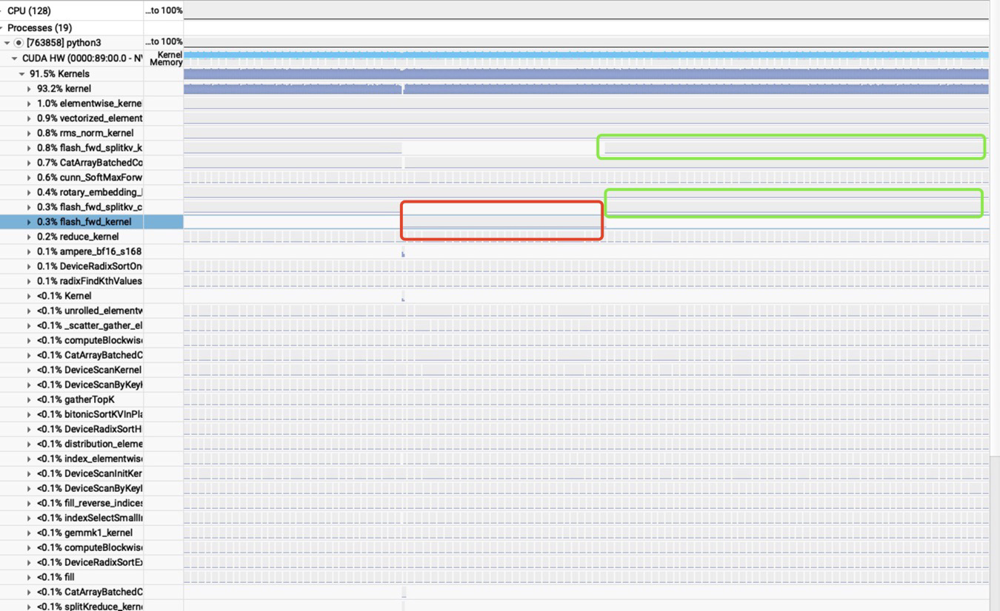
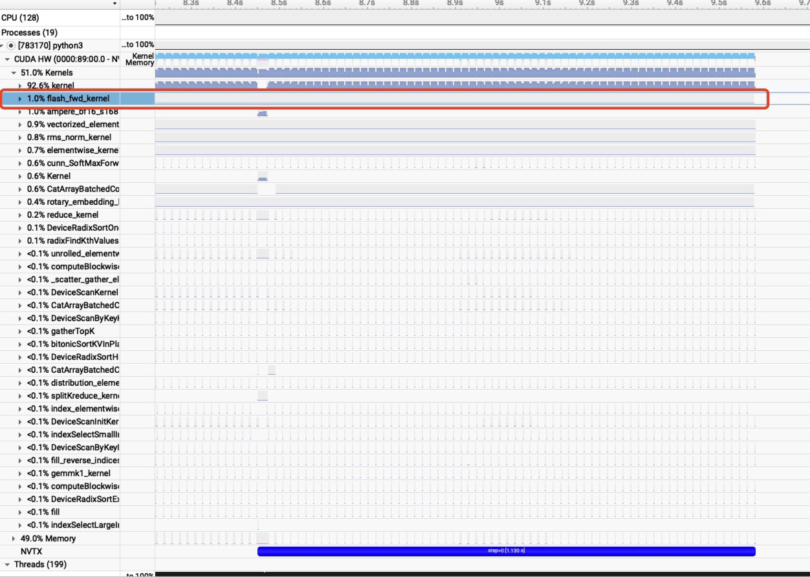
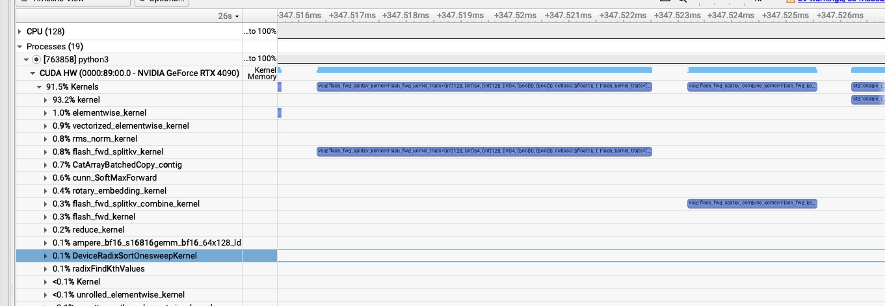
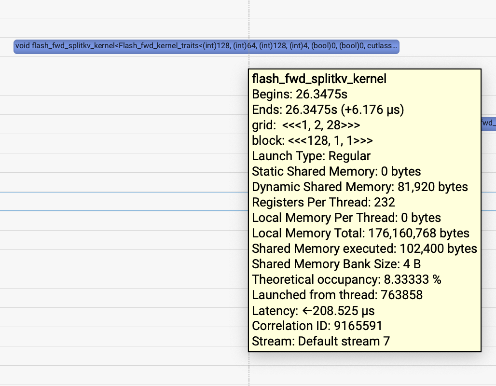
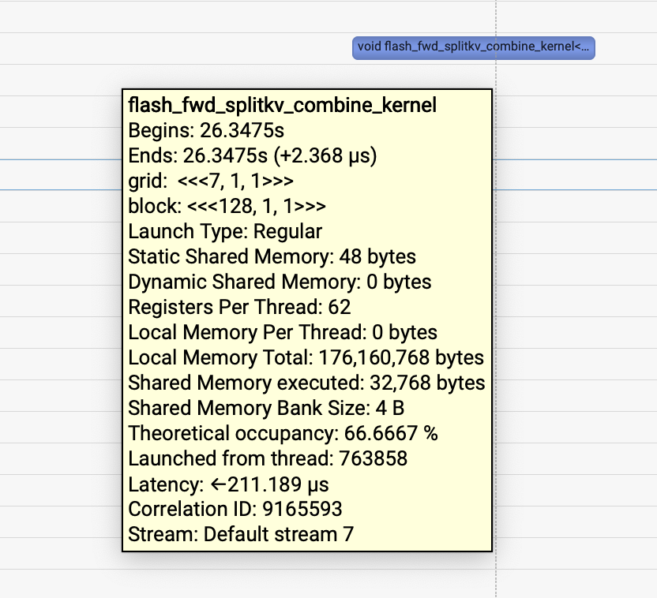

# Flash Attention의 dispatch 로직 정리

## 0x1. 들어가며

이 글의 출발점은 아래 코드로 HuggingFace Qwen2.5-7B-Instruct 모델에서 Flash Attention을 사용해 실행했을 때다. Nsight System 도구로 kernel trace를 잡아 보면 prefill과 decode 단계에서 Flash Attention이 서로 다른 kernel을 호출하고, decoding의 Flash Attention kernel은 split_kv 구현을 사용한다는 것을 발견할 수 있다. 그런데 아래 코드에서 `max_new_tokens`를 64로 바꾸면, Nsight System으로 잡은 kernel trace에서 decode 단계의 Flash Attention kernel이 다시 prefill 단계와 같은 kernel로 바뀌고 split_kv 구현을 사용하지 않는다. 이 글은 Flash Attention의 dispatch 로직을 추적해, 어떤 경우 decode 단계의 Flash Attention kernel이 split_kv 구현을 사용하는지 파악하려는 글이다. split_kv 구현은 Flash Decoding이라고도 불리며, 대형 모델의 Decoding 단계에 특화되어 있다.

```python
# /opt/nvidia/nsight-systems/2024.5.1/bin/nsys profile --trace-fork-before-exec=true --cuda-graph-trace=node -o hf_qwen2.5_7b_flash_attn python3 debug.py
import os
os.environ["CUDA_VISIBLE_DEVICES"] = "0"
os.environ["TOKENIZERS_PARALLELISM"] = "false"

import nvtx
import torch

from transformers import AutoModelForCausalLM, AutoTokenizer

model_name = "/mnt/bbuf/Qwen2.5-7B-Instruct"

model = AutoModelForCausalLM.from_pretrained(
    model_name,
    torch_dtype="auto",
    device_map="auto",
    trust_remote_code=True
)
tokenizer = AutoTokenizer.from_pretrained(model_name, trust_remote_code=True)

prompt = "내년에 봄에 출발해서 베이징으로 약 5일 동안 여행하려고 해. 계획을 짜줘."

model_inputs = tokenizer(prompt, return_tensors="pt").to(model.device)

for i in range(1):
    with nvtx.annotate(f"step={i}", color="blue"):
        
        generated_ids = model.generate(
            **model_inputs,
            max_new_tokens=512
        )

generated_ids = [
    output_ids[len(input_ids):] for input_ids, output_ids in zip(model_inputs.input_ids, generated_ids)
]

response = tokenizer.batch_decode(generated_ids, skip_special_tokens=True)[0]
print(response)
```



이 그림은 `max_new_tokens=512`일 때 prefill과 decode 단계의 Flash Attention kernel trace다. 빨간 박스는 prefill 단계에서 호출된 Flash Attention kernel을, 초록 박스는 decode 단계에서 호출된 Flash Attention kernel을 나타낸다. prefill 단계에서는 `flash_fwd_kernel`이 호출되고, decode 단계에서는 `flash_fwd_splitkv_kernel`과 `flash_fwd_splitkv_combine_kernel` 두 종류의 kernel이 호출되는 것을 볼 수 있다.



이 그림은 `max_new_tokens=64`일 때 prefill과 decode 단계의 Flash Attention kernel trace다. 두 단계 모두 같은 `flash_fwd_kernel`을 호출하는 것을 볼 수 있다.

왜 이런 차이가 생겼을까? 어떤 경우 decode 단계의 Flash Attention kernel이 split_kv 구현을 사용할까? Flash Attention의 관련 Dispatch 로직을 깊이 살펴볼 필요가 있다.

## 0x2. Qwen2는 Flash Attention API에 어떻게 접근하는가

아래는 HuggingFace Qwen2 모델의 Qwen2FlashAttention2 module 구현이다. 이 코드에서 flash attention API가 어떻게 호출되는지 볼 수 있다. 여기서 호출하는 `_flash_attention_forward`는 실제로 flash-attention library(https://github.com/Dao-AILab/flash-attention)의 `flash_attn_varlen_func` api를 다시 호출한다. 이 api는 flash attention library에서 Attention forward 계산을 처리하는 핵심 함수이며, 이름에서 알 수 있듯 여러 variable-length sequence의 Attention 계산도 지원한다.

```python
class Qwen2FlashAttention2(Qwen2Attention):
    # ...
    def forward(
        self,
        hidden_states: torch.Tensor,  # 입력 hidden states
        attention_mask: Optional[torch.Tensor] = None,  # attention mask
        position_ids: Optional[torch.LongTensor] = None,  # position encoding id
        past_key_value: Optional[Cache] = None,  # KV cache
        output_attentions: bool = False,  # attention weight를 출력할지 여부
        use_cache: bool = False,  # KV cache를 사용할지 여부
        cache_position: Optional[torch.LongTensor] = None,  # cache position
        position_embeddings: Optional[Tuple[torch.Tensor, torch.Tensor]] = None,  # position encoding, v4.46에서 필수가 될 예정
    ):
        # 입력 dimension을 가져온다
        bsz, q_len, _ = hidden_states.size()

        # QKV projection
        query_states = self.q_proj(hidden_states)
        key_states = self.k_proj(hidden_states)
        value_states = self.v_proj(hidden_states)

        # multi-head attention에 맞도록 dimension을 reshape한다
        query_states = query_states.view(-1, self.num_heads*self.head_dim)
        key_states = key_states.view(-1, self.num_key_value_heads*self.head_dim)
        value_states = value_states.view(-1, self.num_key_value_heads*self.head_dim)
        
        # rotary position encoding(RoPE)을 적용한다
        query_states, key_states = self.rotary_emb(position_ids, query_states, key_states)

        # dimension을 [batch_size, num_heads, seq_len, head_dim]으로 reshape한다
        query_states = query_states.view(bsz, q_len, self.num_heads, self.head_dim).transpose(1, 2)
        key_states = key_states.view(bsz, q_len, self.num_key_value_heads, self.head_dim).transpose(1, 2)
        value_states = value_states.view(bsz, q_len, self.num_key_value_heads, self.head_dim).transpose(1, 2)
        
        # KV cache를 처리한다
        if past_key_value is not None:
            cache_kwargs = {"cache_position": cache_position}  # RoPE model에 특화된 parameter
            key_states, value_states = past_key_value.update(key_states, value_states, self.layer_idx, cache_kwargs)

        # KV head 수가 attention head 수보다 작으면 KV를 반복해야 한다
        key_states = repeat_kv(key_states, self.num_key_value_groups)
        value_states = repeat_kv(value_states, self.num_key_value_groups)
        dropout_rate = 0.0 if not self.training else self.attention_dropout

        # dtype conversion을 처리한다
        input_dtype = query_states.dtype
        if input_dtype == torch.float32:
            if torch.is_autocast_enabled():
                target_dtype = torch.get_autocast_gpu_dtype()
            elif hasattr(self.config, "_pre_quantization_dtype"):
                target_dtype = self.config._pre_quantization_dtype
            else:
                target_dtype = self.q_proj.weight.dtype

            logger.warning_once(
                f"input hidden states seem to be silently converted to float32, which may be related to embedding or layer norm upcasting to float32."
                f"We will cast the input back to {target_dtype}."
            )

            query_states = query_states.to(target_dtype)
            key_states = key_states.to(target_dtype)
            value_states = value_states.to(target_dtype)

        # Flash Attention에 맞도록 dimension을 reshape한다
        query_states = query_states.transpose(1, 2)
        key_states = key_states.transpose(1, 2)
        value_states = value_states.transpose(1, 2)

        # sliding window attention을 처리한다
        if (
            self.config.use_sliding_window
            and getattr(self.config, "sliding_window", None) is not None
            and self.layer_idx >= self.config.max_window_layers
        ):
            sliding_window = self.config.sliding_window
        else:
            sliding_window = None

        # Flash Attention forward propagation을 호출한다
        attn_output = _flash_attention_forward(
            query_states,
            key_states,
            value_states,
            attention_mask,
            q_len,
            position_ids=position_ids,
            dropout=dropout_rate,
            sliding_window=sliding_window,
            is_causal=self.is_causal,
            use_top_left_mask=self._flash_attn_uses_top_left_mask,
        )

        # output을 reshape하고 output projection을 적용한다
        attn_output = attn_output.reshape(bsz, q_len, self.hidden_size).contiguous()
        attn_output = self.o_proj(attn_output)

        if not output_attentions:
            attn_weights = None

        return attn_output, attn_weights, past_key_value
```

여기 코드에서는 class 관련 initialization을 생략했다. forward 함수에는 rope, kv cache update, Flash Attention 입력 형식에 맞추기 위한 reshape, Flash Attention 호출, output projection 적용 같은 Attention 계산 세부 사항이 포함된다.

## 0x3. Flash Attention 단독 호출 예제

여기서는 `flash_attn_varlen_func` api를 사용하는 독립 예제에 주목하자. 이 함수는 여러 서로 다른 sequence를 지원하므로, 여기서는 sequence 2개로 호출해 본다. 다음과 같은 테스트 script를 작성했다.

```python
import torch
import math

from flash_attn import flash_attn_varlen_func

# naive 구현의 scaled dot-product attention 함수
# Efficient implementation equivalent to the following:
def scaled_dot_product_attention(query, key, value, attn_mask=None, dropout_p=0.0, is_causal=False, scale=None) -> torch.Tensor:
    # 입력 tensor의 dimension 순서를 조정한다
    query = query.transpose(0, 1)  # [nheads, seqlen, headdim]
    key = key.transpose(0, 1)      # [nheads, seqlen, headdim]
    value = value.transpose(0, 1)  # [nheads, seqlen, headdim]
    
    L, S = query.size(1), key.size(1)
    scale_factor = 1 / math.sqrt(query.size(-1)) if scale is None else scale
    attn_bias = torch.zeros(L, S, dtype=query.dtype, device=query.device)
    
    if is_causal:
        assert attn_mask is None
        temp_mask = torch.ones(L, S, dtype=torch.bool, device=query.device).tril(diagonal=0)
        attn_bias.masked_fill_(temp_mask.logical_not(), float("-inf"))
        attn_bias = attn_bias.to(query.dtype)

    if attn_mask is not None:
        if attn_mask.dtype == torch.bool:
            attn_bias.masked_fill_(attn_mask.logical_not(), float("-inf"))
        else:
            attn_bias += attn_mask
    
    # multi-head에 맞도록 attention 계산을 조정한다
    attn_weight = torch.matmul(query, key.transpose(-2, -1)) * scale_factor  # [nheads, L, S]
    attn_weight = attn_weight + attn_bias.unsqueeze(0)  # attn_bias를 모든 head에 broadcast한다
    attn_weight = torch.softmax(attn_weight, dim=-1)
    
    if dropout_p > 0.0:
        attn_weight = torch.nn.functional.dropout(attn_weight, p=dropout_p, training=True)
    
    output = torch.matmul(attn_weight, value)  # [nheads, L, headdim]
    return output.transpose(0, 1)  # [L, nheads, headdim]을 반환한다


# 결과를 재현할 수 있도록 random seed를 설정한다
torch.manual_seed(0)

# parameter 설정
batch_size = 2
seq_lengths = [128, 256]  # 두 sequence의 길이
nheads = 16
headdim = 32
dropout_p = 0.0
causal = True  # causal mask 사용 여부
scale = None   # scaling factor, 기본값은 1 / sqrt(headdim)

# 각 sequence에 대해 random q, k, v tensor를 생성한다
qs = []
ks = []
vs = []
for seqlen in seq_lengths:
    q = torch.randn(seqlen, nheads, headdim, requires_grad=True, dtype=torch.bfloat16, device="cuda")  # (L, nheads, headdim)
    k = torch.randn(seqlen, nheads, headdim, requires_grad=True, dtype=torch.bfloat16, device="cuda")
    v = torch.randn(seqlen, nheads, headdim, requires_grad=True, dtype=torch.bfloat16, device="cuda")
    qs.append(q)
    ks.append(k)
    vs.append(v)

# 모든 sequence의 q, k, v를 concatenate한다
q_total = torch.cat(qs, dim=0)  # (total_q, nheads, headdim)
k_total = torch.cat(ks, dim=0)
v_total = torch.cat(vs, dim=0)

# indexing에 사용할 cumulative sequence length를 계산한다
cu_seqlens_q = torch.zeros(batch_size + 1, dtype=torch.int32, device="cuda")
cu_seqlens_q[1:] = torch.cumsum(torch.tensor(seq_lengths, dtype=torch.int32), dim=0)
cu_seqlens_k = cu_seqlens_q.clone()

print('cu_seqlens_q: ', cu_seqlens_q)

# 최대 sequence length
max_seqlen_q = max(seq_lengths)
max_seqlen_k = max(seq_lengths)

# softmax_scale을 임의로 하나 전달한다
softmax_scale = 0.2

# flash_attn_varlen_func 함수를 호출한다
out_flash = flash_attn_varlen_func(
    q_total,
    k_total,
    v_total,
    cu_seqlens_q,
    cu_seqlens_k,
    max_seqlen_q,
    max_seqlen_k,
    dropout_p=dropout_p,
    softmax_scale=softmax_scale,
    causal=causal,
)

# naive 구현으로 각 sequence를 계산하고 output을 concatenate한다
outputs_naive = []
for i in range(batch_size):
    q = qs[i]  # (L_i, nheads, headdim)
    k = ks[i]
    v = vs[i]
    out = scaled_dot_product_attention(
        q,
        k,
        v,
        attn_mask=None,
        dropout_p=dropout_p,
        is_causal=causal,
        scale=softmax_scale
    )  # output shape은 (L_i, nheads, headdim)
    outputs_naive.append(out)

# naive 구현의 output을 concatenate한다
out_naive = torch.cat(outputs_naive, dim=0)  # (total_q, nheads, headdim)


print('out_naive st: ', out_naive.flatten()[:10])
print('out_flash st: ', out_flash.flatten()[:10])
print('='*20)
print('out_naive en: ', out_naive.flatten()[-10:])
print('out_flash en: ', out_flash.flatten()[-10:])

# 두 구현의 output이 일치하는지 비교한다
assert torch.allclose(out_flash, out_naive, atol=1e-2), "Outputs do not match!"

print("테스트 통과")
```

이 테스트는 통과한다. 위의 상위 interface 호출 예제 두 개를 통해 Flash Attention interface 호출을 비교적 명확히 이해할 수 있을 것이다. 이제 Flash Attention interface의 구현에 주목하자. cuda 구현 안쪽까지 깊이 들어갈 필요는 없고, 전체 호출 로직을 파악해 글 앞에서 던진 문제만 이해하면 된다.

## 0x4. flash_attn_interface.py의 상위 interface

flash-attention library는 cuda로 Flash Attention 계산을 구현하고, Torch Binding을 통해 `varlen_fwd` interface를 Python에 노출한다. `flash_attn_varlen_func`는 `varlen_fwd`를 한 번 더 감싼 wrapper다. https://github.com/Dao-AILab/flash-attention/blob/main/flash_attn/flash_attn_interface.py 에서 `flash_attn_varlen_func` interface 구현을 확인할 수 있다. backward 관련 로직을 제거하면 다음과 같다.

```python
def _flash_attn_varlen_forward(
    q: torch.Tensor,
    k: torch.Tensor, 
    v: torch.Tensor,
    cu_seqlens_q: torch.Tensor,  # Q sequence의 cumulative length
    cu_seqlens_k: torch.Tensor,  # K sequence의 cumulative length
    max_seqlen_q: int,          # Q sequence의 최대 길이
    max_seqlen_k: int,          # K sequence의 최대 길이
    dropout_p: float,           # dropout probability
    softmax_scale: float,       # softmax scaling factor
    causal: bool,               # causal mask 사용 여부
    window_size_left: int = -1,  # sliding window 왼쪽 크기
    window_size_right: int = -1, # sliding window 오른쪽 크기
    softcap: float = 0.0,       # softmax upper bound
    alibi_slopes: Optional[torch.Tensor] = None,  # ALiBi position encoding slope
    return_softmax: bool = False,  # softmax 결과를 반환할지 여부
    block_table: Optional[torch.Tensor] = None,  # block table
    leftpad_k: Optional[torch.Tensor] = None,    # K sequence left padding
    seqused_k: Optional[torch.Tensor] = None,    # K sequence에서 사용한 길이
) -> Tuple[torch.Tensor, torch.Tensor, torch.Tensor, torch.Tensor]:
    # 입력 tensor가 contiguous memory layout인지 보장한다
    q, k, v = [maybe_contiguous(x) for x in (q, k, v)]
    
    # CUDA로 구현한 forward propagation 함수를 호출한다
    out, softmax_lse, S_dmask, rng_state = flash_attn_cuda.varlen_fwd(
        q, k, v,
        None,  # 원본 mask matrix(사용하지 않음)
        cu_seqlens_q,
        cu_seqlens_k,
        seqused_k,
        leftpad_k,
        block_table,
        alibi_slopes,
        max_seqlen_q,
        max_seqlen_k,
        dropout_p,
        softmax_scale,
        False,  # 사용하지 않는 parameter
        causal,
        window_size_left,
        window_size_right,
        softcap,
        return_softmax,
        None,  # random number generator state(사용하지 않음)
    )
    return out, softmax_lse, S_dmask, rng_state

# FlashAttnVarlenQKVPackedFunc class는 PyTorch autograd interface를 구현한다
class FlashAttnVarlenQKVPackedFunc(torch.autograd.Function):
    @staticmethod
    def forward(
        ctx,  # backward propagation에 필요한 정보를 저장하는 context object
        qkv,  # packed QKV tensor
        cu_seqlens,  # cumulative sequence length
        max_seqlen,  # maximum sequence length
        dropout_p,   # dropout probability
        softmax_scale,  # softmax scaling factor
        causal,      # causal mask 사용 여부
        window_size,  # sliding window 크기
        softcap,     # softmax upper bound
        alibi_slopes,  # ALiBi position encoding slope
        deterministic,  # deterministic calculation 여부
        return_softmax,  # softmax 결과를 반환할지 여부
    ):
        # scaling factor를 지정하지 않았으면 기본값 1/sqrt(head_dim)을 사용한다
        if softmax_scale is None:
            softmax_scale = qkv.shape[-1] ** (-0.5)
            
        # Q, K, V를 분리하고 detach해 backward graph 생성을 피한다
        q, k, v = qkv[:, 0].detach(), qkv[:, 1].detach(), qkv[:, 2].detach()
        
        # 원래 head size를 가져온다
        head_size_og = q.size(2)
        
        # head size가 8의 배수가 아니면 padding한다
        if head_size_og % 8 != 0:
            q = torch.nn.functional.pad(q, [0, 8 - head_size_og % 8])
            k = torch.nn.functional.pad(k, [0, 8 - head_size_og % 8])
            v = torch.nn.functional.pad(v, [0, 8 - head_size_og % 8])
            
        # forward 계산 함수를 호출한다    
        out_padded, softmax_lse, S_dmask, rng_state = _flash_attn_varlen_forward(
            q, k, v,
            cu_seqlens,
            cu_seqlens,
            max_seqlen,
            max_seqlen,
            dropout_p,
            softmax_scale,
            causal=causal,
            window_size_left=window_size[0],
            window_size_right=window_size[1],
            softcap=softcap,
            alibi_slopes=alibi_slopes,
            return_softmax=return_softmax and dropout_p > 0,
            block_table=None,
        )
        # padding을 제거하고 원래 head size로 복원한다
        out = out_padded[..., :head_size_og]
        
        # 필요에 따라 softmax 결과를 반환한다
        return out if not return_softmax else (out, softmax_lse, S_dmask)

def flash_attn_varlen_func(
    q,
    k,
    v,
    cu_seqlens_q,
    cu_seqlens_k,
    max_seqlen_q,
    max_seqlen_k,
    dropout_p=0.0,
    softmax_scale=None,
    causal=False,
    window_size=(-1, -1),  # -1 means infinite context window
    softcap=0.0, # 0.0 means deactivated
    alibi_slopes=None,
    deterministic=False,
    return_attn_probs=False,
    block_table=None,
):
    return FlashAttnVarlenFunc.apply(
        q,
        k,
        v,
        cu_seqlens_q,
        cu_seqlens_k,
        max_seqlen_q,
        max_seqlen_k,
        dropout_p,
        softmax_scale,
        causal,
        window_size,
        softcap,
        alibi_slopes,
        deterministic,
        return_attn_probs,
        block_table,
    )
```

위 코드는 `flash_attn_varlen_func` interface의 호출 로직을 명확히 보여준다. 이제 `flash_attn_cuda.varlen_fwd` interface의 구체적인 dispatch 로직을 살펴보자.

## 0x5. flash_attn_cuda.varlen_fwd의 초기 dispatch 로직

먼저 여기로 간다: https://github.com/Dao-AILab/flash-attention/blob/main/csrc/flash_attn/flash_api.cpp#L1518 ,

```c++
PYBIND11_MODULE(TORCH_EXTENSION_NAME, m) {
    m.doc() = "FlashAttention";
    m.def("fwd", &mha_fwd, "Forward pass");
    m.def("varlen_fwd", &mha_varlen_fwd, "Forward pass (variable length)");
    m.def("bwd", &mha_bwd, "Backward pass");
    m.def("varlen_bwd", &mha_varlen_bwd, "Backward pass (variable length)");
    m.def("fwd_kvcache", &mha_fwd_kvcache, "Forward pass, with KV-cache");
}
```

`flash_attn_cuda.varlen_fwd` interface는 `mha_varlen_fwd` C++ 함수에 대응한다. 여기서 flash attention forward의 dispatch 로직을 볼 수 있다.

```c++
std::vector<at::Tensor>
mha_varlen_fwd(at::Tensor &q,  // total_q x num_heads x head_size, total_q는 각 batch sequence length의 합
               const at::Tensor &k,  // total_k x num_heads_k x head_size, total_k는 각 batch sequence length의 합. block_table이 있으면 num_blocks x page_block_size x num_heads_k x head_size
               const at::Tensor &v,  // total_k x num_heads_k x head_size, total_k는 각 batch sequence length의 합. block_table이 있으면 num_blocks x page_block_size x num_heads_k x head_size
               c10::optional<at::Tensor> &out_, // total_q x num_heads x head_size, total_q는 각 batch sequence length의 합
               const at::Tensor &cu_seqlens_q,  // b+1
               const at::Tensor &cu_seqlens_k,  // b+1
               c10::optional<at::Tensor> &seqused_k, // b. 제공되면 각 batch element는 이만큼의 key만 사용한다
               c10::optional<const at::Tensor> &leftpad_k_, // batch_size
               c10::optional<at::Tensor> &block_table_, // batch_size x max_num_blocks_per_seq
               c10::optional<at::Tensor> &alibi_slopes_, // num_heads 또는 b x num_heads
               int max_seqlen_q,
               const int max_seqlen_k,
               const float p_dropout,
               const float softmax_scale,
               const bool zero_tensors,
               bool is_causal,
               int window_size_left,
               int window_size_right,
               const float softcap,
               const bool return_softmax,
               c10::optional<at::Generator> gen_) {

    // 현재 CUDA device의 property를 가져온다
    auto dprops = at::cuda::getCurrentDeviceProperties();
    
    // GPU architecture version을 검사한다
    // Ampere(SM8x) architecture인지 판단한다
    bool is_sm8x = dprops->major == 8 && dprops->minor >= 0;
    // Hopper(SM90) architecture인지 판단한다 
    bool is_sm90 = dprops->major == 9 && dprops->minor == 0;
    
    // GPU architecture 요구 사항을 검사한다. 현재는 Ampere 이상만 지원한다
    TORCH_CHECK(is_sm90 || is_sm8x, "FlashAttention only supports Ampere GPUs or newer.");
    
    // 입력 dtype을 검사한다
    auto q_dtype = q.dtype();
    // fp16과 bf16 dtype만 지원한다
    TORCH_CHECK(q_dtype == torch::kFloat16 || q_dtype == torch::kBFloat16,
                "FlashAttention only support fp16 and bf16 data type");
                
    // bf16은 Ampere 이상 architecture에서만 지원한다
    if (q_dtype == torch::kBFloat16) {
        TORCH_CHECK(is_sm90 || is_sm8x, "bfloat16 is only supported on Ampere GPUs or newer");
    }
    
    // QKV dtype 일관성을 검사한다
    TORCH_CHECK(k.dtype() == q_dtype, "query and key must have the same dtype");
    TORCH_CHECK(v.dtype() == q_dtype, "query and value must have the same dtype");
    
    // sequence length cumulative sum dtype이 int32인지 검사한다
    TORCH_CHECK(cu_seqlens_q.dtype() == torch::kInt32, "cu_seqlens_q must have dtype int32");
    TORCH_CHECK(cu_seqlens_k.dtype() == torch::kInt32, "cu_seqlens_k must have dtype int32");

    // 모든 입력 tensor가 같은 device에 있는지 검사한다
    CHECK_DEVICE(q); CHECK_DEVICE(k); CHECK_DEVICE(v);
    CHECK_DEVICE(cu_seqlens_q);
    CHECK_DEVICE(cu_seqlens_k);

    // block table 관련 parameter를 검사한다
    at::Tensor block_table;
    const bool paged_KV = block_table_.has_value(); // paged KV cache 사용 여부
    if (paged_KV) {
        block_table = block_table_.value();
        CHECK_DEVICE(block_table); // device를 검사한다
        TORCH_CHECK(block_table.dtype() == torch::kInt32, "block_table must be int32");
        TORCH_CHECK(block_table.stride(-1) == 1, "last dimension of block_table must be contiguous");
    }

    // QKV tensor memory layout을 검사한다
    TORCH_CHECK(q.stride(-1) == 1, "last dimension of input tensor must be contiguous");
    TORCH_CHECK(k.stride(-1) == 1, "last dimension of input tensor must be contiguous"); 
    TORCH_CHECK(v.stride(-1) == 1, "last dimension of input tensor must be contiguous");
    CHECK_CONTIGUOUS(cu_seqlens_q); // sequence length cumulative sum이 contiguous인지 검사한다
    CHECK_CONTIGUOUS(cu_seqlens_k);

    const auto sizes = q.sizes(); // Q shape을 가져온다

    // 기본 parameter를 가져온다
    const int batch_size = cu_seqlens_q.numel() - 1; // batch size
    int num_heads = sizes[1];  // Q attention head 수
    const int head_size = sizes[2]; // 각 head의 dimension
    const int num_heads_k = paged_KV ? k.size(2) : k.size(1); // K attention head 수

    // softcap과 dropout은 동시에 사용할 수 없다
    if (softcap > 0.f) { TORCH_CHECK(p_dropout == 0.f, "Softcapping does not support dropout yet"); }

    // paged KV cache 관련 parameter
    const int max_num_blocks_per_seq = !paged_KV ? 0 : block_table.size(1); // sequence당 최대 block 수
    const int num_blocks = !paged_KV ? 0 : k.size(0); // 전체 block 수
    const int page_block_size = !paged_KV ? 1 : k.size(1); // block당 크기
    TORCH_CHECK(!paged_KV || page_block_size % 256 == 0, "paged KV cache block size must be a multiple of 256");

    // causal mask와 window size 관련 처리
    if (max_seqlen_q == 1 && !alibi_slopes_.has_value()) { is_causal = false; }
    if (is_causal) { window_size_right = 0; }

    void *cu_seqlens_q_d = cu_seqlens_q.data_ptr();

    // Q를 rearrange해야 하는지 판단한다
    // 다음 조건을 만족하면 rearrange가 필요하다:
    // 1. Q sequence length가 1이다. 즉 decoding 단계다
    // 2. Q attention head 수가 K attention head 수보다 크다. 즉 MQA/GQA scenario다
    // 3. sliding window를 사용하지 않는다(window_size_left와 window_size_right가 모두 -1)
    // 4. dropout을 사용하지 않는다
    // 5. head_size가 8의 배수다
    // 6. ALiBi position encoding을 사용하지 않는다
    const int seqlenq_ngroups_swapped = max_seqlen_q == 1 && num_heads > num_heads_k 
        && window_size_left < 0 && window_size_right < 0 
        && p_dropout == 0.f && head_size % 8 == 0 
        && !alibi_slopes_.has_value();
    
    // 각 K/V head에 대응하는 Q head가 몇 개인지 계산한다
    const int ngroups = num_heads / num_heads_k;

    // rearrange가 필요하면
    if (seqlenq_ngroups_swapped) {
        // Q shape을 (batch_size, 1, num_heads_k * ngroups, head_size)에서
        // (batch_size * ngroups, num_heads_k, head_size)로 rearrange한다
        // 이렇게 하면 같은 K/V head에 대응하는 Q head가 memory에서 contiguous해져 access efficiency가 높아진다
        q = q.reshape({batch_size, num_heads_k, ngroups, head_size})
             .transpose(1, 2)
             .reshape({batch_size * ngroups, num_heads_k, head_size});
        
        // 관련 parameter를 update한다
        max_seqlen_q = ngroups;  // Q sequence length가 ngroups가 된다
        num_heads = num_heads_k;  // Q head 수가 K head 수가 된다
        cu_seqlens_q_d = nullptr;  // Q sequence length cumulative sum이 더 이상 필요 없다
    }

    const int total_q = q.sizes()[0]; // Q의 전체 token 수

    // 입력 parameter의 validity를 검사한다
    // 1. batch_size는 양수여야 한다
    TORCH_CHECK(batch_size > 0, "batch size must be positive");
    // 2. head_size는 256 이하이어야 한다. 이는 Flash Attention의 제한이다
    TORCH_CHECK(head_size <= 256, "FlashAttention forward only supports head dimension at most 256");
    // 3. head_size는 8의 배수여야 한다. memory alignment와 CUDA optimization 때문이다
    TORCH_CHECK(head_size % 8 == 0, "query, key, value, and out_ must have a head_size that is a multiple of 8");
    // 4. Q의 head 수는 K/V head 수의 정수배여야 한다. MQA/GQA 지원을 위해서다
    TORCH_CHECK(num_heads % num_heads_k == 0, "Number of heads in key/value must divide number of heads in query");

    // sliding window size가 K sequence 최대 길이를 넘으면 -1로 설정해 sliding window를 사용하지 않음을 나타낸다
    if (window_size_left >= max_seqlen_k) { window_size_left = -1; }
    if (window_size_right >= max_seqlen_k) { window_size_right = -1; }

    // Q tensor shape이 올바른지 검사한다: [total_q, num_heads, head_size]
    CHECK_SHAPE(q, total_q, num_heads, head_size);
    
    // paged KV cache 사용 여부에 따라 K/V tensor shape을 검사한다
    if (!paged_KV) {
        // paged KV cache를 사용하지 않으면 K/V shape은 [total_k, num_heads_k, head_size]여야 한다
        const int total_k = k.size(0);
        CHECK_SHAPE(k, total_k, num_heads_k, head_size);
        CHECK_SHAPE(v, total_k, num_heads_k, head_size);
    } else {
        // paged KV cache를 사용하면 K/V shape은 [num_blocks, page_block_size, num_heads_k, head_size]여야 한다
        // block_table shape은 [batch_size, max_num_blocks_per_seq]여야 한다
        CHECK_SHAPE(k, num_blocks, page_block_size, num_heads_k, head_size);
        CHECK_SHAPE(v, num_blocks, page_block_size, num_heads_k, head_size);
        CHECK_SHAPE(block_table, batch_size, max_num_blocks_per_seq);
    }

    // sequence length cumulative sum tensor shape을 검사한다. [batch_size + 1]이어야 한다
    CHECK_SHAPE(cu_seqlens_q, batch_size + 1);
    CHECK_SHAPE(cu_seqlens_k, batch_size + 1);
    
    // K sequence used length 정보가 제공되면 그 property를 검사한다
    if (seqused_k.has_value()){
        auto seqused_k_ = seqused_k.value();
        // dtype은 int32여야 한다
        TORCH_CHECK(seqused_k_.dtype() == torch::kInt32, "seqused_k must have dtype int32");
        // CUDA device 위에 있어야 한다
        TORCH_CHECK(seqused_k_.is_cuda(), "seqused_k must be on CUDA device");
        // contiguous memory layout이어야 한다
        TORCH_CHECK(seqused_k_.is_contiguous(), "seqused_k must be contiguous");
        // shape은 [batch_size]여야 한다
        CHECK_SHAPE(seqused_k_, batch_size);
    }

    // output tensor를 생성한다
    at::Tensor out;
    // output tensor가 제공된 경우
    if (out_.has_value()) {
        out = out_.value();
        // output tensor property를 검사한다:
        // 1. dtype은 input과 같아야 한다
        TORCH_CHECK(out.dtype() == q_dtype, "Output must have the same dtype as inputs");
        // 2. 같은 device 위에 있어야 한다
        CHECK_DEVICE(out);
        // 3. 마지막 dimension은 contiguous해야 한다
        TORCH_CHECK(out.stride(-1) == 1, "Output tensor must have contiguous last dimension");
        // 4. shape이 올바라야 한다
        CHECK_SHAPE(out, sizes[0], sizes[1], head_size);
        // sequence length와 group 수를 swap해야 하는 경우
        if (seqlenq_ngroups_swapped) {
            // grouped attention 처리를 위해 tensor dimension을 reshape하고 transpose한다
            out = out.reshape({batch_size, num_heads_k, ngroups, head_size})
                     .transpose(1, 2)
                     .reshape({batch_size * ngroups, num_heads_k, head_size});
        }
    } else {
        // output tensor가 제공되지 않으면 input shape과 같은 empty tensor를 만든다
        out = torch::empty_like(q);
    }

    // 숫자를 m의 배수로 올림하는 lambda function을 정의한다
    auto round_multiple = [](int x, int m) { return (x + m - 1) / m * m; };
    // head_size의 aligned value를 계산한다:
    // - head_size <= 192이면 32의 배수로 올림한다
    // - 그렇지 않으면 256으로 설정한다
    const int head_size_rounded = head_size <= 192 ? round_multiple(head_size, 32) : 256;
    // Q sequence length를 128의 배수로 올림한다
    const int seqlen_q_rounded = round_multiple(max_seqlen_q, 128);
    // K sequence length를 128의 배수로 올림한다
    const int seqlen_k_rounded = round_multiple(max_seqlen_k, 128);

    // CUDA device를 설정해 올바른 GPU에서 실행되도록 한다
    at::cuda::CUDAGuard device_guard{(char)q.get_device()};

    // input tensor q의 option(device, dtype 등)을 가져온다
    auto opts = q.options();
    // 각 attention head의 log-sum-exp 값을 저장할 softmax_lse tensor를 만든다
    auto softmax_lse = torch::empty({num_heads, total_q}, opts.dtype(at::kFloat));
    at::Tensor p;
    // compile 시간을 줄이기 위해 dropout이 있을 때만 softmax 결과를 반환한다
    if (return_softmax) {
        // dropout probability가 0보다 큰지 보장한다
        TORCH_CHECK(p_dropout > 0.0f, "return_softmax is only supported when p_dropout > 0.0");
        // softmax 결과를 저장할 p tensor를 만든다
        p = torch::empty({ batch_size, num_heads, seqlen_q_rounded, seqlen_k_rounded }, opts);
    }
    else {
        // softmax를 반환할 필요가 없으면 empty tensor를 만든다
        p = torch::empty({ 0 }, opts);
    }

    // tensor를 0으로 initialize해야 하는 경우
    if (zero_tensors) {
        out.zero_();  // output tensor를 0으로 둔다
        softmax_lse.fill_(-std::numeric_limits<float>::infinity());  // softmax_lse를 negative infinity로 채운다
        if (return_softmax) {p.zero_();}  // softmax result tensor를 0으로 둔다
    }

    // forward propagation parameter struct를 만든다
    Flash_fwd_params params;
    // forward propagation의 여러 parameter를 설정한다
    set_params_fprop(params,
                     batch_size,
                     max_seqlen_q, max_seqlen_k,
                     seqlen_q_rounded, seqlen_k_rounded,
                     num_heads, num_heads_k,
                     head_size, head_size_rounded,
                     q, k, v, out,
                     cu_seqlens_q_d,
                     cu_seqlens_k.data_ptr(),
                     seqused_k.has_value() ? seqused_k.value().data_ptr() : nullptr,
                     return_softmax ? p.data_ptr() : nullptr,
                     softmax_lse.data_ptr(),
                     p_dropout,
                     softmax_scale,
                     window_size_left,
                     window_size_right,
                     softcap,
                     seqlenq_ngroups_swapped,
                     /*unpadded_lse*/true);
    params.total_q = total_q;

    // paged KV cache를 사용하는 경우
    if (paged_KV) {
        params.block_table = block_table.data_ptr<int>();  // block table pointer를 설정한다
        params.block_table_batch_stride = block_table.stride(0);  // block table의 batch stride를 설정한다
        params.k_batch_stride = k.stride(0);  // K의 batch stride를 설정한다
        params.v_batch_stride = v.stride(0);  // V의 batch stride를 설정한다
    }
    params.page_block_size = page_block_size;  // page block size를 설정한다

    // 수명을 늘리기 위해 이 tensor들에 대한 reference를 유지한다
    at::Tensor softmax_lse_accum, out_accum;
    if (seqlenq_ngroups_swapped) {
        // decoding 때만 split-k를 적용한다
        std::tie(softmax_lse_accum, out_accum) =
            set_params_splitkv(params, batch_size, num_heads, head_size,
                               max_seqlen_k, max_seqlen_q, head_size_rounded,
                               p_dropout, /*num_splits*/ 0, dprops, opts);
    }

    // K sequence의 left padding 정보가 제공된 경우
    if (leftpad_k_.has_value()) {
        auto leftpad_k = leftpad_k_.value();
        // 검사: paged KV와 leftpad_k를 동시에 사용할 수 없다
        TORCH_CHECK(!paged_KV, "We don't support Paged KV and leftpad_k running at the same time yet");
        // dtype은 int32여야 한다
        TORCH_CHECK(leftpad_k.dtype() == torch::kInt32, "leftpad_k must have dtype int32");
        CHECK_DEVICE(leftpad_k);  // device를 검사한다
        CHECK_CONTIGUOUS(leftpad_k);  // contiguity를 검사한다
        CHECK_SHAPE(leftpad_k, batch_size);  // shape을 검사한다
        params.leftpad_k = static_cast<int *>(leftpad_k.data_ptr());  // left padding pointer를 설정한다
    }

    // 각 thread가 random number를 생성하는 횟수로, THC random state의 philox counter offset에 사용한다
    // custom RNG를 사용하고 offset을 batch_size * num_heads * 32만큼 증가시킨다
    int64_t counter_offset = params.b * params.h * 32;
    // CUDA 위의 float32 type tensor option을 만든다
    auto options = torch::TensorOptions().dtype(torch::kFloat32).device(torch::kCUDA);
    // RNG state 저장에 사용할 size 2의 int64 empty tensor를 만든다
    auto rng_state = torch::empty({2}, options.dtype(torch::kInt64));
    // forward propagation kernel은 seed와 offset으로 memory를 채운다
    params.rng_state = reinterpret_cast<uint64_t*>(rng_state.data_ptr());

    // dropout이 설정된 경우
    if (p_dropout > 0.0)  {
        // 기본 CUDA generator를 가져오거나 제공된 generator를 사용한다
        auto gen = at::get_generator_or_default<at::CUDAGeneratorImpl>(
            gen_, at::cuda::detail::getDefaultCUDAGenerator());
        // mutex lock으로 random number generator 접근을 보호한다
        std::lock_guard<std::mutex> lock(gen->mutex_);
        // philox random number generator state를 설정한다
        params.philox_args = gen->philox_cuda_state(counter_offset);
    }

    // ALiBi(Attention with Linear Biases) parameter를 설정한다
    set_params_alibi(params, alibi_slopes_, batch_size, num_heads);

    // K sequence length가 0보다 크면 forward propagation을 실행한다
    if (max_seqlen_k > 0) {
        // 현재 CUDA stream을 가져온다
        auto stream = at::cuda::getCurrentCUDAStream().stream();
        // forward propagation kernel을 실행한다
        run_mha_fwd(params, stream, paged_KV);
    } else {
        // K sequence length가 0이면 empty tensor라는 뜻이므로 output을 0으로 둔다
        out.zero_();
        // softmax log-sum을 infinity로 채운다
        softmax_lse.fill_(std::numeric_limits<float>::infinity());
    }

    // sequence length와 group 수를 swap한 경우
    if (seqlenq_ngroups_swapped) {
        // reshape 전후 dimension size를 정의한다
        int64_t size_before[] = {batch_size, max_seqlen_q, num_heads_k, head_size};
        int64_t size_after[] = {batch_size, num_heads_k * max_seqlen_q, head_size};
        // output tensor dimension을 rearrange한다
        out = out.reshape(size_before).transpose(1, 2).reshape(size_after);
        q = q.reshape(size_before).transpose(1, 2).reshape(size_after);
        // softmax log-sum dimension을 rearrange한다
        softmax_lse = softmax_lse.reshape({num_heads * max_seqlen_q, batch_size});
    }

    // output tensor, softmax log-sum, attention distribution(필요한 경우), RNG state를 반환한다
    return {out, softmax_lse, p, rng_state};
}
```

Flash Attention의 준비 작업이 많기 때문에 위 코드는 길다. 우리가 주로 볼 부분은 다음 코드다.

```c++
if (seqlenq_ngroups_swapped) {
        // decoding 때만 split-k를 적용한다
        std::tie(softmax_lse_accum, out_accum) =
            set_params_splitkv(params, batch_size, num_heads, head_size,
                               max_seqlen_k, max_seqlen_q, head_size_rounded,
                               p_dropout, /*num_splits*/ 0, dprops, opts);
    }
```

그리고 다음 코드다.

```c++
if (max_seqlen_k > 0) {
        // 현재 CUDA stream을 가져온다
        auto stream = at::cuda::getCurrentCUDAStream().stream();
        // forward propagation kernel을 실행한다
        run_mha_fwd(params, stream, paged_KV);
    }
```

이 몇 줄이면 충분하다. `set_params_splitkv`는 split-k를 사용할지, 그리고 kv sequence dimension에서 몇 번 나눌지를 결정한다. `run_mha_fwd`는 `set_params_splitkv`의 configuration과 위 함수의 다른 부분에서 설정한 params를 바탕으로 서로 다른 kernel을 dispatch한다. 이제 `set_params_splitkv` 구현을 보자.

```c++
std::tuple<at::Tensor, at::Tensor> set_params_splitkv(Flash_fwd_params &params, const int batch_size,
    const int num_heads, const int head_size, const int max_seqlen_k, const int max_seqlen_q,
    const int head_size_rounded, const float p_dropout,
    const int num_splits, cudaDeviceProp *dprops, struct c10::TensorOptions opts) {

    // 여기의 block_n은 run_mha_fwd_splitkv_dispatch의 configuration과 맞아야 한다
    // head_size 크기에 따라 서로 다른 block_n을 선택한다:
    // - head_size <= 64: block_n = 256
    // - 64 < head_size <= 128: block_n = 128  
    // - head_size > 128: block_n = 64
    const int block_n = head_size <= 64 ? 256 : (head_size <= 128 ? 128 : 64);
    
    // K sequence dimension에서 필요한 block 수를 계산한다
    const int num_n_blocks = (max_seqlen_k + block_n - 1) / block_n;
    
    // splitKV kernel에서는 kBlockM이 64로 고정된다
    // 일반적으로 inference 때 Q sequence length는 64를 넘지 않는다
    const int num_m_blocks = (max_seqlen_q + 64 - 1) / 64;
    
    // split 수를 설정한다
    params.num_splits = num_splits;
    
    // intermediate result 저장에 사용할 tensor를 선언한다
    at::Tensor softmax_lse_accum;
    at::Tensor out_accum;

    // splitKV는 현재 dropout을 지원하지 않는다
    if (p_dropout == 0.0f) {  
        if (num_splits < 1) {
            // num_splits < 1이면 heuristic으로 split 수를 계산한다
            // 여기서 2를 곱하는 이유는 각 block이 128 thread를 사용하기 때문이다
            params.num_splits = num_splits_heuristic(batch_size * num_heads * num_m_blocks, 
                                                   dprops->multiProcessorCount * 2, 
                                                   num_n_blocks, 128);
        }
        
        // split이 필요한 경우(num_splits > 1)
        if (params.num_splits > 1) {
            // intermediate result 저장 tensor를 할당한다
            softmax_lse_accum = torch::empty({params.num_splits, batch_size, num_heads, max_seqlen_q}, 
                                           opts.dtype(at::kFloat));
            out_accum = torch::empty({params.num_splits, batch_size, num_heads, max_seqlen_q, head_size_rounded}, 
                                   opts.dtype(at::kFloat));
            
            // intermediate result pointer를 설정한다
            params.softmax_lseaccum_ptr = softmax_lse_accum.data_ptr();
            params.oaccum_ptr = out_accum.data_ptr();
        }
        
        // split 수는 128을 넘을 수 없다
        TORCH_CHECK(params.num_splits <= 128, "num_splits > 128 not supported");
    }

    return std::make_tuple(softmax_lse_accum, out_accum);
}
```

`set_params_splitkv`를 호출할 때 `num_splits=0`으로 설정했으므로 위 코드는 heuristic으로 split 수를 계산하는 로직에 들어간다. heuristic 계산 로직은 `num_splits_heuristic`에 있다. 이 함수 구현을 보자.

```python
// 이 함수는 GPU occupancy를 최대화하는 split 수를 찾는 데 사용된다.
// 예를 들어 batch * n_heads = 48이고 SM이 108개라면:
// - split 2개(효율 = 0.89)를 사용하는 것이 split 3개(효율 = 0.67)를 사용하는 것보다 낫다
// 하지만 split이 너무 많아지는 것도 원하지 않는다. HBM read/write가 더 많아지기 때문이다.
// 그래서 먼저 최적 efficiency를 찾고, 그 최적 efficiency의 85%에 도달하는 최소 split 수를 찾는다.
inline int num_splits_heuristic(int batch_nheads_mblocks, int num_SMs, int num_n_blocks, int max_splits) {
    // 현재 batch_nheads_mblocks가 이미 SM의 80%를 채울 수 있으면 split이 필요 없다
    if (batch_nheads_mblocks >= 0.8f * num_SMs) { return 1; }
    
    // max_splits, SM 수, n_blocks 세 값의 최솟값을 최대 split 수로 삼는다
    max_splits = std::min({max_splits, num_SMs, num_n_blocks});
    float max_efficiency = 0.f;
    std::vector<float> efficiency;
    efficiency.reserve(max_splits);
    
    // ceil division
    auto ceildiv = [](int a, int b) { return (a + b - 1) / b; };
    
    // 어떤 split 수는 유효하지 않다. 예를 들어 block이 64개라면:
    // - split 11개를 선택하면 6 * 10 + 4개의 block이 된다
    // - split 12개를 선택하면 6 * 11 + (-2)개의 block이 된다. 실제로는 여전히 split 11개다
    // 그래서 각 split의 block 수가 이전 split 수와 같은지 검사해야 한다
    auto is_split_eligible = [&ceildiv, &num_n_blocks](int num_splits) {
        return num_splits == 1 || ceildiv(num_n_blocks, num_splits) != ceildiv(num_n_blocks, num_splits - 1);
    };
    
    // 첫 번째 loop: 각 split 수의 efficiency를 계산하고 최대 efficiency를 찾는다
    for (int num_splits = 1; num_splits <= max_splits; num_splits++) {
        if (!is_split_eligible(num_splits)) {
            efficiency.push_back(0.f);
        } else {
            // n_waves는 각 SM이 평균적으로 처리해야 하는 block wave 수를 의미한다
            float n_waves = float(batch_nheads_mblocks * num_splits) / num_SMs;
            // efficiency = theoretical processing time / actual processing time
            float eff = n_waves / ceil(n_waves);
            if (eff > max_efficiency) { max_efficiency = eff; }
            efficiency.push_back(eff);
        }
    }
    
    // 두 번째 loop: 최적 efficiency의 85%에 도달하는 최소 split 수를 찾는다
    for (int num_splits = 1; num_splits <= max_splits; num_splits++) {
        if (!is_split_eligible(num_splits)) { continue; }
        if (efficiency[num_splits - 1] >= 0.85 * max_efficiency) {
            return num_splits;
        }
    }
    return 1;
}
```

위 코드에서 splitkv에 영향을 주는 parameter가 `max_seqlen_k`, `head_num`뿐 아니라 SM 개수 등도 포함한다는 것을 알 수 있다. 글 앞의 예제에서는 `head_num`과 SM 개수는 고정되어 있지만, `max_new_tokens`가 512에서 64로 바뀌면서 `max_seqlen_k`가 달라지고, 이로 인해 `num_splits`가 달라진다. 최종적으로 `max_new_tokens`가 512일 때의 nsys에서는 decoding 중 splitkv flash attention 구현이 관찰되고, `max_new_tokens`가 64일 때의 nsys에서는 splitkv flash attention 구현을 사용하지 않는 현상으로 나타난다.

`run_mha_fwd`의 dispatch 로직은 다음과 같다.

```c++
void run_mha_fwd(Flash_fwd_params &params, cudaStream_t stream, bool force_split_kernel=false) {
    FP16_SWITCH(!params.is_bf16, [&] {
        HEADDIM_SWITCH(params.d, [&] {
            BOOL_SWITCH(params.is_causal, Is_causal, [&] {
                if (params.num_splits <= 1 && !force_split_kernel) {  // If we don't set it num_splits == 0
                    run_mha_fwd_<elem_type, kHeadDim, Is_causal>(params, stream);
                } else {
                    run_mha_fwd_splitkv_dispatch<elem_type, kHeadDim, Is_causal>(params, stream);
                }
            });
        });
    });
}
```

여기서는 `num_splits`를 판단한다. `num_splits <= 1`이고 `force_split_kernel`이 설정되지 않았으면 splitkv를 사용하지 않는 kernel을 dispatch하고, 그렇지 않으면 splitkv kernel을 dispatch한다.

`flash_attn_cuda.varlen_fwd`의 초기 dispatch 로직은 여기까지 정리할 수 있다. 다만 글 앞의 nsys에서 보았듯 splitkv 구현을 호출할 때 각 decoding step의 각 Attention 계산에는 kernel이 2개 있다.









KV의 seq dimension을 split한 뒤에는 각각 계산한 결과를 최종 계산 결과로 combine해야 한다. 이것이 `flash_fwd_splitkv_combine_kernel`의 역할이다. 실제로 이것도 Flash Decoding이라고 불린다. 소개는 [https://mp.weixin.qq.com/s/hvqPhNo3l0tL_-lf978euw](https://mp.weixin.qq.com/s/hvqPhNo3l0tL_-lf978euw) 를 참고할 수 있다.


## 0x5. run_mha_fwd_splitkv_dispatch의 상위 구현 로직

```python
template<typename Kernel_traits, bool Is_causal>
void run_flash_splitkv_fwd(Flash_fwd_params &params, cudaStream_t stream) {
    // kernel trait가 Q in registers와 Q/K shared shared memory를 지원하지 않음을 보장한다
    static_assert(!Kernel_traits::Is_Q_in_regs, "SplitKV implementation does not support Is_Q_in_regs");
    static_assert(!Kernel_traits::Share_Q_K_smem, "SplitKV implementation does not support Share_Q_K_smem");
    
    // shared memory size를 가져온다
    constexpr size_t smem_size = Kernel_traits::kSmemSize;
    
    // M dimension의 block 수를 계산한다
    const int num_m_block = (params.seqlen_q + Kernel_traits::kBlockM - 1) / Kernel_traits::kBlockM;
    
    // grid dimension을 설정한다:
    // x: M dimension block 수
    // y: splits가 있으면 split 수, 없으면 batch size
    // z: splits가 있으면 batch*heads, 없으면 heads 수
    dim3 grid(num_m_block, params.num_splits > 1 ? params.num_splits : params.b, params.num_splits > 1 ? params.b * params.h : params.h);

    // sequence length가 block size로 나누어떨어지는지 판단한다
    const bool is_even_MN = params.cu_seqlens_q == nullptr && params.cu_seqlens_k == nullptr && params.seqlen_k % Kernel_traits::kBlockN == 0 && params.seqlen_q % Kernel_traits::kBlockM == 0;
    
    // head dimension이 match하는지 판단한다
    const bool is_even_K = params.d == Kernel_traits::kHeadDim;

    // 여러 macro를 사용해 조건에 따라 다른 kernel 구현을 선택한다
    BOOL_SWITCH(is_even_MN, IsEvenMNConst, [&] {
        EVENK_SWITCH(is_even_K, IsEvenKConst, [&] {
            LOCAL_SWITCH((params.window_size_left >= 0 || params.window_size_right >= 0) && !Is_causal, Is_local, [&] {
                BOOL_SWITCH(params.num_splits > 1, Split, [&] {
                    BOOL_SWITCH(params.knew_ptr != nullptr, Append_KV, [&] {
                        ALIBI_SWITCH(params.alibi_slopes_ptr != nullptr, Has_alibi, [&] {
                            SOFTCAP_SWITCH(params.softcap > 0.0, Is_softcap, [&] {
                                // 적절한 kernel 구현을 선택한다
                                auto kernel = &flash_fwd_splitkv_kernel<Kernel_traits, Is_causal, Is_local && !Is_causal, Has_alibi, IsEvenMNConst && !Append_KV && IsEvenKConst && !Is_local && Kernel_traits::kHeadDim <= 128, IsEvenKConst, Is_softcap, Split, Append_KV>;
                                
                                // shared memory가 48KB를 넘으면 attribute 설정이 필요하다
                                if (smem_size >= 48 * 1024) {
                                    C10_CUDA_CHECK(cudaFuncSetAttribute(
                                        kernel, cudaFuncAttributeMaxDynamicSharedMemorySize, smem_size));
                                }
                                
                                // kernel을 launch한다
                                kernel<<<grid, Kernel_traits::kNThreads, smem_size, stream>>>(params);
                                C10_CUDA_KERNEL_LAUNCH_CHECK();
                            });
                        });
                    });
                });
            });
        });
    });

    // splits가 있으면 결과를 merge하기 위해 combine kernel을 launch해야 한다
    if (params.num_splits > 1) {
        // head dimension에 따라 적절한 block size를 선택한다
        constexpr static int kBlockM = Kernel_traits::kHeadDim % 128 == 0 ? 4 : (Kernel_traits::kHeadDim % 64 == 0 ? 8 : 16);
        dim3 grid_combine((params.b * params.h * params.seqlen_q + kBlockM - 1) / kBlockM);
        
        // split 수에 따라 적절한 combine kernel을 선택한다
        EVENK_SWITCH(is_even_K, IsEvenKConst, [&] {
            if (params.num_splits <= 2) {
                flash_fwd_splitkv_combine_kernel<Kernel_traits, kBlockM, 1, IsEvenKConst><<<grid_combine, Kernel_traits::kNThreads, 0, stream>>>(params);
            } else if (params.num_splits <= 4) {
                flash_fwd_splitkv_combine_kernel<Kernel_traits, kBlockM, 2, IsEvenKConst><<<grid_combine, Kernel_traits::kNThreads, 0, stream>>>(params);
            } else if (params.num_splits <= 8) {
                flash_fwd_splitkv_combine_kernel<Kernel_traits, kBlockM, 3, IsEvenKConst><<<grid_combine, Kernel_traits::kNThreads, 0, stream>>>(params);
            } else if (params.num_splits <= 16) {
                flash_fwd_splitkv_combine_kernel<Kernel_traits, kBlockM, 4, IsEvenKConst><<<grid_combine, Kernel_traits::kNThreads, 0, stream>>>(params);
            } else if (params.num_splits <= 32) {
                flash_fwd_splitkv_combine_kernel<Kernel_traits, kBlockM, 5, IsEvenKConst><<<grid_combine, Kernel_traits::kNThreads, 0, stream>>>(params);
            } else if (params.num_splits <= 64) {
                flash_fwd_splitkv_combine_kernel<Kernel_traits, kBlockM, 6, IsEvenKConst><<<grid_combine, Kernel_traits::kNThreads, 0, stream>>>(params);
            } else if (params.num_splits <= 128) {
                flash_fwd_splitkv_combine_kernel<Kernel_traits, kBlockM, 7, IsEvenKConst><<<grid_combine, Kernel_traits::kNThreads, 0, stream>>>(params);
            }
            C10_CUDA_KERNEL_LAUNCH_CHECK();
        });
    }
}

// head dimension에 따라 적절한 block size를 선택하고 run_flash_splitkv_fwd를 호출한다
template<typename T, int Headdim, bool Is_causal>
void run_mha_fwd_splitkv_dispatch(Flash_fwd_params &params, cudaStream_t stream) {
    constexpr static int kBlockM = 64;  // M dimension block size를 64로 고정한다
    // head dimension에 따라 N dimension block size를 선택한다:
    // head dimension <=64: 256
    // head dimension <=128: 128 
    // 그 외: 64
    constexpr static int kBlockN = Headdim <= 64 ? 256 : (Headdim <= 128 ? 128 : 64);
    run_flash_splitkv_fwd<Flash_fwd_kernel_traits<Headdim, kBlockM, kBlockN, 4, false, false, T>, Is_causal>(params, stream);
}
```

sequence dimension을 split해 계산하는 `flash_fwd_split_kv_kernel`이든 마지막에 결과를 merge하는 `flash_fwd_splitkv_combine_kernel`이든, 현재 입력에서 어떤 kernel을 사용해야 최적 성능을 얻을 수 있는지 결정하는 template이 매우 많다는 것을 볼 수 있다. 이 cuda 구현에 관심이 있다면 source를 직접 읽고 학습하거나 수정해 볼 수 있다.


## 0x6. 정리

이 글은 Flash Attention이 서로 다른 scenario에서 kernel을 dispatch하는 로직, 특히 decode 단계에서 split_kv 구현을 사용하는 trigger condition을 주로 살펴보았다. source 분석을 통해 Flash Attention의 dispatch 로직은 주로 `max_seqlen_k`(K sequence의 최대 길이), `head_num`(attention head 수), SM 수(GPU streaming processor 수) 등의 요인으로 결정된다는 것을 알 수 있었다. 이 요인들은 heuristic function `num_splits_heuristic`을 통해 `num_splits`(KV sequence dimension의 split 수)를 계산한다. 이 함수의 목표는 GPU utilization을 최대화하는 split 수를 찾는 것이다. 계산 결과 `num_splits > 1`이면 split_kv 구현을 사용한다. 이 구현은 두 kernel을 launch한다. `flash_fwd_splitkv_kernel`은 KV sequence dimension에서 split 계산을 수행하고, `flash_fwd_splitkv_combine_kernel`은 각 split의 계산 결과를 merge한다. 이것은 글 앞의 예제를 설명한다. `max_new_tokens=512`일 때는 sequence length가 길어 `num_splits > 1`이 되어 split_kv 구현을 사용하고, `max_new_tokens=64`일 때는 sequence length가 짧아 `num_splits <= 1`이 되어 일반 구현을 사용한다. 이러한 유연한 dispatch mechanism 설계 덕분에 Flash Attention은 여러 scenario에서 좋은 성능을 얻을 수 있다. 긴 sequence scenario에서는 split_kv로 GPU resource를 더 잘 활용하고, 짧은 sequence scenario에서는 불필요한 overhead를 피한다.

