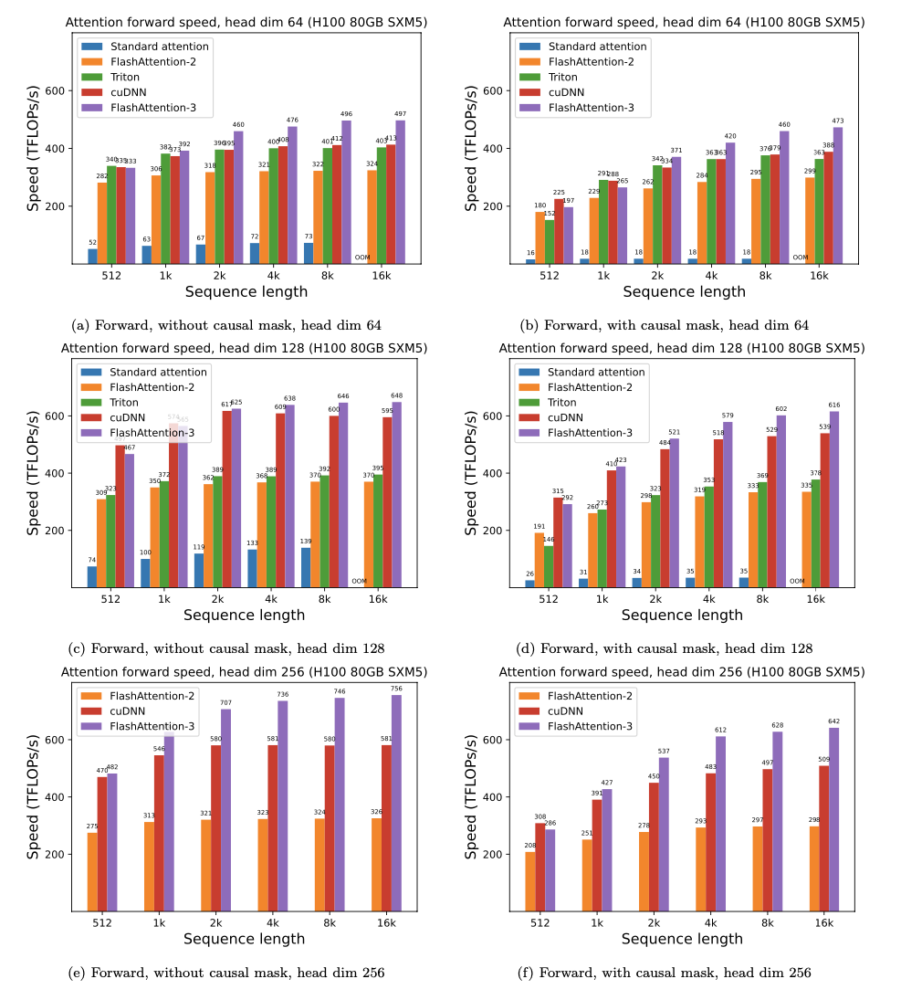
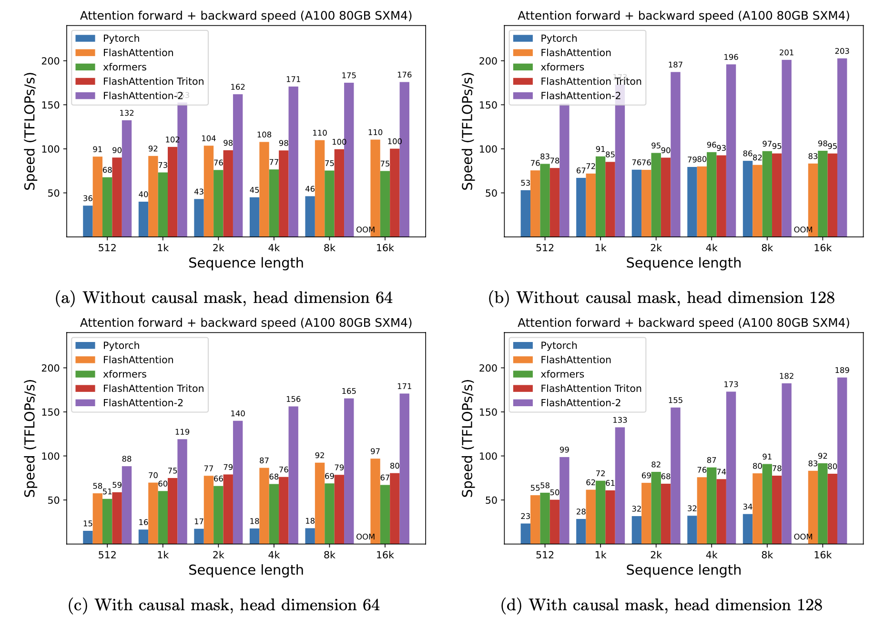
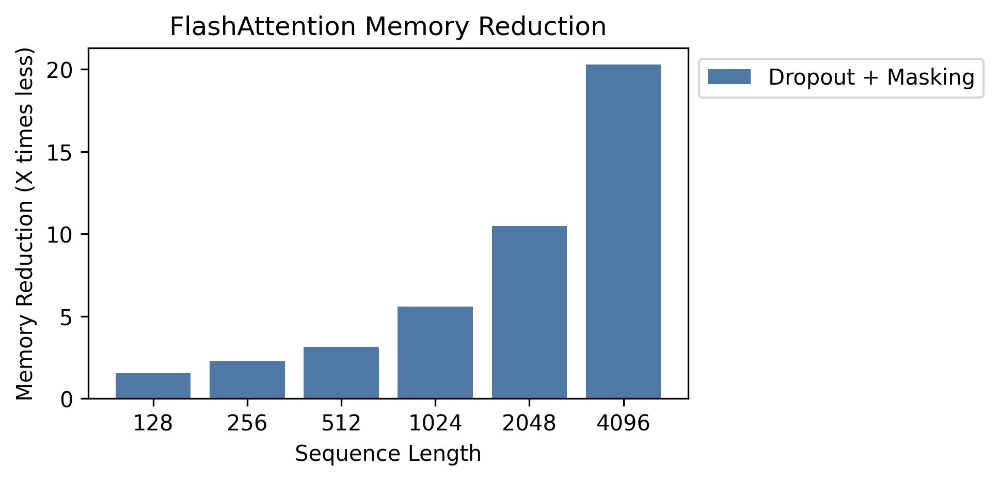
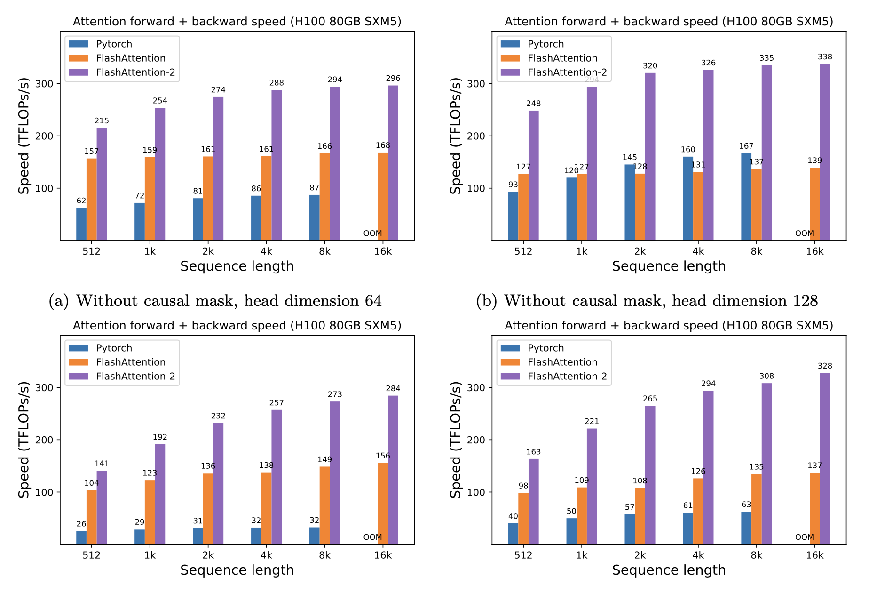

# FlashAttention
이 저장소는 아래 논문들의 FlashAttention 및 FlashAttention-2 공식 구현을 제공합니다.

**FlashAttention: IO-aware를 갖춘 빠르고 memory-efficient한 exact attention**  
Tri Dao, Daniel Y. Fu, Stefano Ermon, Atri Rudra, Christopher Ré  
논문: https://arxiv.org/abs/2205.14135  
IEEE Spectrum [글](https://spectrum.ieee.org/mlperf-rankings-2022)은 우리가 FlashAttention을 사용해 MLPerf 2.0 benchmark에 제출한 내용을 다룹니다.


**FlashAttention-2: 더 나은 parallelism과 work partitioning을 갖춘 더 빠른 attention**  
Tri Dao

논문: https://tridao.me/publications/flash2/flash2.pdf

## 사용 방법

FlashAttention이 공개된 뒤 이렇게 짧은 시간 안에 널리 채택되는 것을 보게 되어 매우 기쁩니다. 이 [페이지](https://github.com/Dao-AILab/flash-attention/blob/main/usage.md)에는 FlashAttention이 사용되는 곳의 일부 목록이 담겨 있습니다.

FlashAttention과 FlashAttention-2는 자유롭게 사용하고 수정할 수 있습니다(LICENSE 참고). 사용한다면 FlashAttention을 인용하고 출처를 밝혀 주세요.


## FlashAttention-3 beta 버전 공개
FlashAttention-3는 Hopper GPU(예: H100)에 최적화되어 있습니다.

블로그 글: https://tridao.me/blog/2024/flash3/

논문: https://tridao.me/publications/flash3/flash3.pdf



이는 beta 버전이며, 저장소의 다른 부분에 통합하기 전에 test/benchmark 용도로 사용됩니다.

현재 공개된 기능:
- FP16 forward 및 backward

며칠 내/다음 주에 공개될 기능:
- BF16
- variable length(FP16, BF16)
- FP8 forward

요구사항: H100 / H800 GPU, CUDA >= 12.3.

설치 방법:


## 설치와 기능
**요구사항:**
- CUDA toolkit 또는 ROCm toolkit
- PyTorch 1.12 이상.
- `packaging` Python package(`pip install packaging`)
- `ninja` Python package(`pip install ninja`) *
- Linux. v2.3.2부터 Windows가 지원될 수도 있습니다(긍정적인 [보고](https://github.com/Dao-AILab/flash-attention/issues/595)가 있었습니다). 하지만 Windows compilation은 여전히 더 많은 test가 필요합니다. Windows용 prebuilt CUDA wheel 설정 방법에 대한 아이디어가 있다면 Github issue로 연락해 주세요.

\* `ninja`가 설치되어 있고 정상 동작하는지 확인하세요(예: `ninja --version` 이후 `echo $?`가 exit code 0을 반환해야 합니다). 그렇지 않다면(가끔 `ninja --version` 이후 `echo $?`가 non-zero exit code를 반환합니다) `ninja`를 uninstall한 뒤 다시 install하세요(`pip uninstall -y ninja && pip install ninja`). `ninja`가 없으면 여러 CPU core를 사용하지 않기 때문에 compilation에 매우 오랜 시간(2시간)이 걸릴 수 있습니다. `ninja`를 사용하면 64-core machine에서 CUDA toolkit으로 compile하는 데 3-5분이 걸립니다.

**설치 방법:**


## FlashAttention 사용법

주요 함수들은 scaled dot-product attention(`softmax(Q @ K^T * softmax_scale) @ V`)을 구현합니다.
```python
from flash_attn import flash_attn_qkvpacked_func, flash_attn_func
```

```python
flash_attn_qkvpacked_func(qkv, dropout_p=0.0, softmax_scale=None, causal=False,
                          window_size=(-1, -1), alibi_slopes=None, deterministic=False):
"""evaluation 동안 dropout_p는 0.0으로 설정해야 합니다.
Q, K, V가 이미 하나의 tensor로 stack되어 있다면 이 함수는 flash_attn_func를 호출하는 것보다 빠릅니다. backward에서 Q, K, V gradient의 explicit concat을 피하기 때문입니다.
window_size != (-1, -1)이면 sliding window local attention을 구현합니다. 위치 i의 query는 [i - window_size[0], i + window_size[1]] 범위의 key에만 attention합니다.
인자:
    qkv: (batch_size, seqlen, 3, nheads, headdim)
    dropout_p: float. Dropout probability.
    softmax_scale: float. softmax 적용 전에 QK^T에 적용하는 scaling.
        기본값은 1 / sqrt(headdim).
    causal: bool. causal attention mask를 적용할지 여부(예: autoregressive modeling).
    window_size: (left, right). (-1, -1)이 아니면 sliding window local attention을 구현합니다.
    alibi_slopes: (nheads,) 또는 (batch_size, nheads), fp32. query i와 key j의 attention score에 (-alibi_slope * |i - j|) bias를 더합니다.
    deterministic: bool. deterministic backward implementation을 사용할지 여부입니다. 이 구현은 약간 느리고 더 많은 memory를 사용합니다. forward는 항상 deterministic입니다.
반환:
    out: (batch_size, seqlen, nheads, headdim).
"""
```

```python
flash_attn_func(q, k, v, dropout_p=0.0, softmax_scale=None, causal=False,
                window_size=(-1, -1), alibi_slopes=None, deterministic=False):
"""evaluation 동안 dropout_p는 0.0으로 설정해야 합니다.
Q보다 더 적은 KV head를 전달해 multi-query attention과 grouped-query attention(MQA/GQA)을 지원합니다. 단, Q의 head 수는 KV의 head 수로 나누어떨어져야 합니다.
예를 들어 Q에 head가 6개 있고 K와 V에 head가 2개 있다면, Q의 head 0, 1, 2는 K와 V의 head 0에 attention하고 Q의 head 3, 4, 5는 K와 V의 head 1에 attention합니다.
window_size != (-1, -1)이면 sliding window local attention을 구현합니다. 위치 i의 query는
[i + seqlen_k - seqlen_q - window_size[0], i + seqlen_k - seqlen_q + window_size[1]] 범위의 key에만 attention합니다.

인자:
    q: (batch_size, seqlen, nheads, headdim)
    k: (batch_size, seqlen, nheads_k, headdim)
    v: (batch_size, seqlen, nheads_k, headdim)
    dropout_p: float. Dropout probability.
    softmax_scale: float. softmax 적용 전에 QK^T에 적용하는 scaling.
        기본값은 1 / sqrt(headdim).
    causal: bool. causal attention mask를 적용할지 여부(예: autoregressive modeling).
    window_size: (left, right). (-1, -1)이 아니면 sliding window local attention을 구현합니다.
    alibi_slopes: (nheads,) 또는 (batch_size, nheads), fp32. query i와 key j의 attention score에 (-alibi_slope * |i + seqlen_k - seqlen_q - j|) bias를 더합니다.
    deterministic: bool. deterministic backward implementation을 사용할지 여부입니다. 이 구현은 약간 느리고 더 많은 memory를 사용합니다. forward는 항상 deterministic입니다.
반환:
    out: (batch_size, seqlen, nheads, headdim).
"""
```

```python
def flash_attn_with_kvcache(
    q,
    k_cache,
    v_cache,
    k=None,
    v=None,
    rotary_cos=None,
    rotary_sin=None,
    cache_seqlens: Optional[Union[(int, torch.Tensor)]] = None,
    cache_batch_idx: Optional[torch.Tensor] = None,
    block_table: Optional[torch.Tensor] = None,
    softmax_scale=None,
    causal=False,
    window_size=(-1, -1),  # -1 means infinite context window
    rotary_interleaved=True,
    alibi_slopes=None,
):
    """
    k와 v가 None이 아니면 k_cache와 v_cache는 k와 v의 새 값으로 in-place update됩니다. 이는 incremental decoding에 매우 유용합니다. 이전 step에서 cache한 key/value를 넘기고, 현재 step의 새 key/value로 update한 뒤, 한 kernel 안에서 update된 cache로 attention을 계산할 수 있습니다.

    k / v를 넘긴다면 cache가 새 값을 담기에 충분히 큰지 보장해야 합니다. 예를 들어 KV Cache를 최대 sequence length로 미리 allocate하고, cache_seqlens로 batch 안의 각 sequence의 현재 sequence length를 추적할 수 있습니다.

    rotary_cos와 rotary_sin을 넘기면 rotary embedding을 적용합니다. key @k는 index cache_seqlens, cache_seqlens + 1 등에서 rotary_cos와 rotary_sin을 통해 rotate됩니다. causal 또는 local(window_size != (-1, -1))이면 query @q도 index cache_seqlens, cache_seqlens + 1 등에서 rotary_cos와 rotary_sin을 통해 rotate됩니다. causal도 local도 아니면 query @q는 index cache_seqlens에서만 rotary_cos와 rotary_sin을 통해 rotate됩니다(즉 @q의 모든 token이 위치 cache_seqlens에 있다고 봅니다).

    이 함수 사용 예시는 tests/test_flash_attn.py::test_flash_attn_kvcache를 참고하세요.

    Q보다 더 적은 KV head를 전달해 multi-query attention과 grouped-query attention(MQA/GQA)을 지원합니다. Q의 head 수는 KV의 head 수로 나누어떨어져야 합니다. 예를 들어 Q에 head가 6개 있고 K와 V에 head가 2개 있으면, Q의 head 0, 1, 2는 K와 V의 head 0에 attention하고 Q의 head 3, 4, 5는 K와 V의 head 1에 attention합니다.

    causal=True이면 causal mask는 attention matrix의 오른쪽 아래에 맞춰 정렬됩니다. 예를 들어 seqlen_q = 2, seqlen_k = 5이면 causal mask(1 = keep, 0 = mask)는 다음과 같습니다.
        1 1 1 1 0
        1 1 1 1 1
    seqlen_q = 5, seqlen_k = 2이면 causal mask는 다음과 같습니다.
        0 0
        0 0
        0 0
        1 0
        1 1
    mask의 어떤 row가 모두 0이면 output은 0이 됩니다.

    window_size != (-1, -1)이면 sliding window local attention을 구현합니다. 위치 i의 query는 key가
    [i + seqlen_k - seqlen_q - window_size[0], i + seqlen_k - seqlen_q + window_size[1]] 범위 안에 있는 key에만 attention합니다.

    참고: backward는 지원하지 않습니다.

    인자:
        q: (batch_size, seqlen, nheads, headdim)
        k_cache: block_table이 없으면 (batch_size_cache, seqlen_cache, nheads_k, headdim), block_table이 있으면(즉 paged KV Cache) (num_blocks, page_block_size, nheads_k, headdim)
            page_block_size는 256의 배수여야 합니다.
        v_cache: block_table이 없으면 (batch_size_cache, seqlen_cache, nheads_k, headdim), block_table이 있으면(즉 paged KV Cache) (num_blocks, page_block_size, nheads_k, headdim)
        k [optional]: (batch_size, seqlen_new, nheads_k, headdim). None이 아니면 cache_seqlens가 지정한 index부터 k를 k_cache에 연결합니다.
        v [optional]: (batch_size, seqlen_new, nheads_k, headdim). k와 유사합니다.
        rotary_cos [optional]: (seqlen_ro, rotary_dim / 2). None이 아니면 k와 q에 rotary embedding을 적용합니다. k와 v를 넘길 때만 적용됩니다. rotary_dim은 16으로 나누어떨어져야 합니다.
        rotary_sin [optional]: (seqlen_ro, rotary_dim / 2). rotary_cos와 유사합니다.
        cache_seqlens: int 또는 (batch_size,), dtype torch.int32. KV Cache의 sequence length.
        block_table [optional]: (batch_size, max_num_blocks_per_seq), dtype torch.int32.
        cache_batch_idx: (batch_size,), dtype torch.int32. KV Cache index에 사용합니다. None이면 batch index가 [0, 1, 2, ..., batch_size - 1]이라고 가정합니다.
            index가 unique하지 않고 k와 v가 제공되면 cache에 update되는 값은 중복 index 중 어느 것에서든 올 수 있습니다.
        softmax_scale: float. softmax 적용 전에 QK^T에 적용하는 scaling.
            기본값은 1 / sqrt(headdim).
        causal: bool. causal attention mask를 적용할지 여부(예: autoregressive modeling).
        window_size: (left, right). (-1, -1)이 아니면 sliding window local attention을 구현합니다.
        rotary_interleaved: bool. rotary_cos와 rotary_sin을 넘길 때만 적용됩니다.
            True이면 rotary embedding은 dimension 0 & 1, 2 & 3 등을 조합합니다. False이면 dimension 0 & rotary_dim / 2, 1 & rotary_dim / 2 + 1을 조합합니다(즉 GPT-NeoX style).
        alibi_slopes: (nheads,) 또는 (batch_size, nheads), fp32. query i와 key j의 attention score에 (-alibi_slope * |i + seqlen_k - seqlen_q - j|) bias를 더합니다.

    반환:
        out: (batch_size, seqlen, nheads, headdim).
    """
```

이 함수들이 multi-head attention layer에서 어떻게 사용되는지(QKV projection과 output projection 포함) 보려면 MHA [구현](https://github.com/Dao-AILab/flash-attention/blob/main/flash_attn/modules/mha.py)을 참고하세요.

## Change Log

### 2.0: 완전 재작성, 2배 속도 향상
FlashAttention(1.x)에서 FlashAttention-2로 upgrade

이 함수들은 rename되었습니다.
- `flash_attn_unpadded_func` -> `flash_attn_varlen_func`
- `flash_attn_unpadded_qkvpacked_func` -> `flash_attn_varlen_qkvpacked_func`
- `flash_attn_unpadded_kvpacked_func` -> `flash_attn_varlen_kvpacked_func`

입력이 같은 batch 안에서 동일한 sequence length를 갖는다면, 아래 함수들을 사용하는 것이 더 단순하고 빠릅니다.

```python
flash_attn_qkvpacked_func(qkv, dropout_p=0.0, softmax_scale=None, causal=False)
```

```python
flash_attn_func(q, k, v, dropout_p=0.0, softmax_scale=None, causal=False)
```


### 2.1: causal flag 동작 변경

seqlen_q != seqlen_k이고 causal=True이면 causal mask는 attention matrix의 왼쪽 위가 아니라 오른쪽 아래에 정렬됩니다.

예를 들어 seqlen_q = 2, seqlen_k = 5이면 causal mask(1 = keep, 0 = mask)는 다음과 같습니다.  
v2.0:  
    1 0 0 0 0  
    1 1 0 0 0  
v2.1:  
    1 1 1 1 0  
    1 1 1 1 1  

seqlen_q = 5, seqlen_k = 2이면 causal mask는 다음과 같습니다.  
v2.0:  
    1 0  
    1 1  
    1 1  
    1 1  
    1 1  
v2.1:  
    0 0  
    0 0  
    0 0  
    1 0  
    1 1  
mask의 어떤 row가 모두 0이면 output은 0이 됩니다.

### 2.2: 추론 최적화

query sequence length가 매우 작을 때(예: query sequence length = 1) 추론(iterative decoding)을 최적화했습니다. 이때 병목은 KV cache를 최대한 빠르게 load하는 것이므로, load를 서로 다른 thread block으로 분산하고 별도 kernel로 결과를 합칩니다.

rotary embedding 실행, KV cache in-place update 등 더 많은 추론 기능은 `flash_attn_with_kvcache` 함수를 확인하세요.

이 협업에 기여해 준 xformers team, 특히 Daniel Haziza에게 감사드립니다.

### 2.3: local(즉 sliding window) attention

sliding window attention(즉 local attention)을 구현했습니다. [Mistral AI](https://mistral.ai/), 특히 Timothée Lacroix의 기여에 감사드립니다. sliding window는 [Mistral 7B](https://mistral.ai/news/announcing-mistral-7b/) 모델에서 사용됩니다.

### 2.4: ALiBi(Attention with Linear Biases), deterministic backward

ALiBi(Press et al., 2021)를 구현했습니다. Kakao Brain의 Sanghun Cho에게 감사드립니다.

deterministic backward를 구현했습니다. [Meituan](www.meituan.com) engineer들의 기여에 감사드립니다.

### 2.5: paged KV cache

paged KV cache(즉 [PagedAttention](https://arxiv.org/abs/2309.06180))를 지원합니다. @beginlner의 기여에 감사드립니다.

### 2.6: softcap

Gemma-2와 Grok 모델에서 사용하는 softcap attention을 지원합니다. @Narsil과 @lucidrains의 기여에 감사드립니다.

## 성능

FlashAttention을 사용할 때 PyTorch standard attention 대비 기대할 수 있는 speedup(forward+backward pass 조합)과 memory saving을, GPU별 sequence length에 따라 보여 줍니다(speedup은 memory bandwidth에 의존합니다. 더 느린 GPU memory에서는 더 큰 speedup을 봅니다).

현재 benchmark한 GPU는 다음과 같습니다.
* [A100](#a100)
* [H100](#h100)
<!-- * [RTX 3090](#rtx-3090) -->
<!-- * [T4](#t4) -->

### A100

FlashAttention의 speedup을 아래 parameter로 보여 줍니다.
* head dimension 64 또는 128, hidden dimension 2048(즉 32 또는 16 heads).
* sequence length 512, 1k, 2k, 4k, 8k, 16k.
* batch size는 16k / sequence length로 설정합니다.

#### Speedup



#### Memory



이 그림에서는 memory saving을 보여 줍니다. dropout 또는 mask 사용 여부와 관계없이 memory usage는 동일합니다.
memory saving은 sequence length에 비례합니다. standard attention은 sequence length에 대해 quadratic memory를 쓰지만, FlashAttention은 linear memory를 쓰기 때문입니다.
sequence length 2K에서 10배, 4K에서 20배의 memory saving을 확인했습니다.
따라서 FlashAttention은 더 긴 sequence length로 확장할 수 있습니다.

### H100



## 전체 모델 코드와 학습 script

우리는 GPT 모델의 전체
[구현](https://github.com/Dao-AILab/flash-attention/blob/main/flash_attn/models/gpt.py)을 공개했습니다.
또한 MLP, LayerNorm,
cross entropy loss, rotary embedding 같은 다른 layer의 optimized implementation도 제공합니다. 전체적으로 이는 Huggingface baseline implementation보다 3-5배 빠르며,
A100당 최대 225 TFLOPs/s에 도달합니다. 이는 72% model FLOPs utilization에 해당합니다(어떤 activation checkpoint도 필요하지 않습니다).

또한 Openwebtext에서 GPT2를, The Pile에서 GPT3를 학습하는
[script](https://github.com/Dao-AILab/flash-attention/tree/main/training)도 포함합니다.

## FlashAttention의 Triton 구현

Phil Tillet(OpenAI)은 Triton에서 experimental FlashAttention implementation을 가지고 있습니다.
https://github.com/openai/triton/blob/master/python/tutorials/06-fused-attention.py

Triton은 CUDA보다 high-level이므로 이해하고 실험하기 더 쉬울 수 있습니다.
Triton implementation의 symbol도 논문에서 사용한 notation과 더 가깝습니다.

attention bias(예: ALiBi)를 지원하는 experimental Triton implementation도 있습니다.
https://github.com/Dao-AILab/flash-attention/blob/main/flash_attn/flash_attn_triton.py


## Test
우리는 FlashAttention이 생성하는 output과 gradient가 reference implementation과 일정 numerical tolerance 안에서 같음을 test합니다.
특히 FlashAttention의 최대 numerical error가 PyTorch baseline implementation numerical error의 최대 두 배 이하인지 확인합니다(서로 다른 head dimension, input dtype, sequence length, causal/non-causal 조건에서).

test 실행:

```python
pytest -q -s tests/test_flash_attn.py
```

## 문제가 발생하면

이 새 버전의 FlashAttention-2는 여러 GPT style 모델에서 test되었고, 주로 A100 GPU에서 test되었습니다.

오류가 발생하면 GitHub에 Issue를 제출해 주세요!

## Test

test 실행:

```python
pytest tests/test_flash_attn_ck.py
```

## Citation

이 codebase를 사용하거나 우리의 작업이 가치 있다고 생각한다면 아래를 인용해 주세요.

```
@inproceedings{dao2022flashattention,
  title={Flash{A}ttention: Fast and Memory-Efficient Exact Attention with {IO}-Awareness},
  author={Dao, Tri and Fu, Daniel Y. and Ermon, Stefano and Rudra, Atri and R{\'e}, Christopher},
  booktitle={Advances in Neural Information Processing Systems (NeurIPS)},
  year={2022}
}
@inproceedings{dao2023flashattention2,
  title={Flash{A}ttention-2: Faster Attention with Better Parallelism and Work Partitioning},
  author={Dao, Tri},
  booktitle={International Conference on Learning Representations (ICLR)},
  year={2024}
}
```
