# 시퀀스 병렬: BPT, Ring-Attention, Striped-Attention 노트

> 원문: https://zhuanlan.zhihu.com/p/6456708235

**목차**
- 0x00 머리말
- 0x01 FlashAttention V2
- 0x02 BPT
- 0x03 Ring-Attention
- 0x04 Striped-Attention
- 0x05 PyTorch Native Context Parallel
- 0x06 정리

## 0x00 머리말

최근 업무에서 여러 시퀀스 병렬 기법이 필요해, 정리할 겸 짧은 글을 몇 편 써 두려 한다. 이전 글에서는 Megatron-LM TP+SP와 DeepSpeed-Ulysses를 다루며 통신량과 장단점을 비교했다. 링크: 「[Tensor/Sequence Parallel] DeepSpeed-Ulysses & Megatron-LM TP/SP 도해」. 본 글은 또 다른 시퀀스 병렬 알고리즘인 Ring-Attention을 다룬다. Blockwise Parallel Transformer(BPT), Ring-Attention, Striped Attention을 포함한다.

BPT는 FA2의 확장이다. Attention 분할뿐 아니라 MLP 분할까지 고려하고, Attention과 MLP를 하나의 분할 알고리즘으로 융합해 MLP 중간 activation 메모리를 크게 절약한다(**19bsh → 2bsh**). Ring-Attention은 BPT를 다중 GPU 환경으로 확장한다. Attention을 진입점으로 삼아 시퀀스 병렬을 펼치고, 원형 통신 토폴로지를 설계해 계산과 통신의 overlap을 실현하여 시퀀스 병렬에도 큰 추가 통신 비용이 없다. Striped Attention(Faster Ring Attention)은 Ring-Attention의 부하 불균형 문제를 해결해 성능을 한 단계 더 끌어올렸다. 본 글은 개인적인 이해를 정리한 것이라 오류가 있을 수 있다. 지적은 언제든 환영한다.

저자의 더 많은 기술 노트와 CUDA 학습 노트는 LeetCUDA에서 확인할 수 있다. LLM/VLM 글 정리와 FlashAttention, SGEMM, HGEMM, GEMV 같은 대표 CUDA kernel 예제 구현이 포함되어 있고, 누적 3k+ stars를 기록했다. 링크: xlite-dev/LeetCUDA.

## 0x01 FlashAttention V2

Ring-Attention은 Attention의 분할 계산에 의존한다. 따라서 먼저 FlashAttention V2의 계산 흐름을 간단히 복습한다. 단순화를 위해 forward(FWD)만 본다.

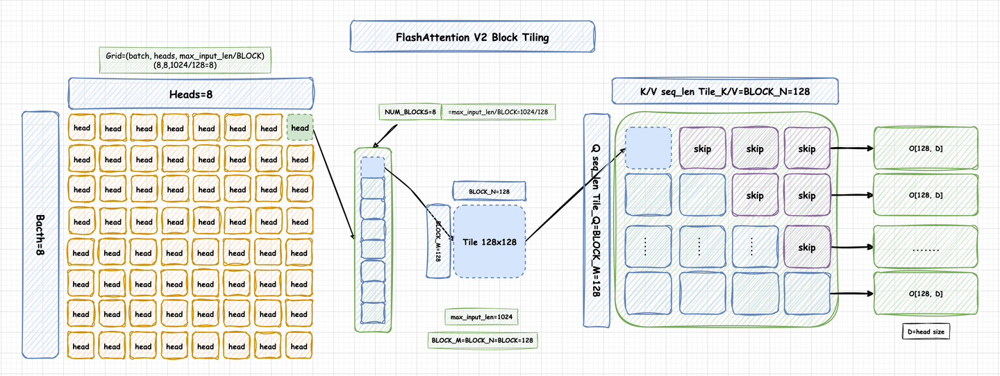
*FlashAttention V2 Block Tiling*

FlashAttention의 가장 중요한 아이디어는 attention을 분할 계산하는 것이다. 현재 널리 쓰이는 것은 FlashAttention-2 (Faster Attention with Better Parallelism and Work Partitioning)다. FA-2는 FA-1 대비 엔지니어링 최적화를 더한 것으로, Tiling·Recompute의 핵심 아이디어는 FA-1과 동일하다. 최적화 포인트는 다음과 같다.

> 1. matmul이 아닌 중복 연산을 대폭 줄이고 Tensor Core 연산 비중을 늘림
> 2. forward / backward 모두 seqlen 차원의 병렬화를 추가, forward에서는 Q, K, V 루프 순서를 교체
> 3. 더 나은 Warp Partitioning 전략으로 Split-K를 피함 (이 부분은 스토리상 끼워 넣은 느낌이 있다…)

### seqlen 차원 병렬

FA-1의 forward pass 알고리즘을 되짚어 보면 다소 어색한 부분이 있다. FA-1의 이중 루프는 외부에서 K, V를 load하고 내부에서 Q를 load한다. 그러면 내부 루프는 매번 Qi의 일부만 처리하게 되고, iteration마다 Oi에 대해 global memory R/W가 발생한다. 한편 Attention 계산은 query마다 완전히 독립적이라는 자명한 사실이 있다. 즉 외부 루프에서 먼저 Q를 load하면, 서로 다른 query block의 Attention을 서로 다른 thread block에 할당할 수 있고, 이들 thread block은 서로 통신할 필요가 없다. FA-2는 정확히 이렇게 한다. forward pass에서 루프 순서를 바꿔 Q를 먼저 load하고 그다음 K, V를 load한다.

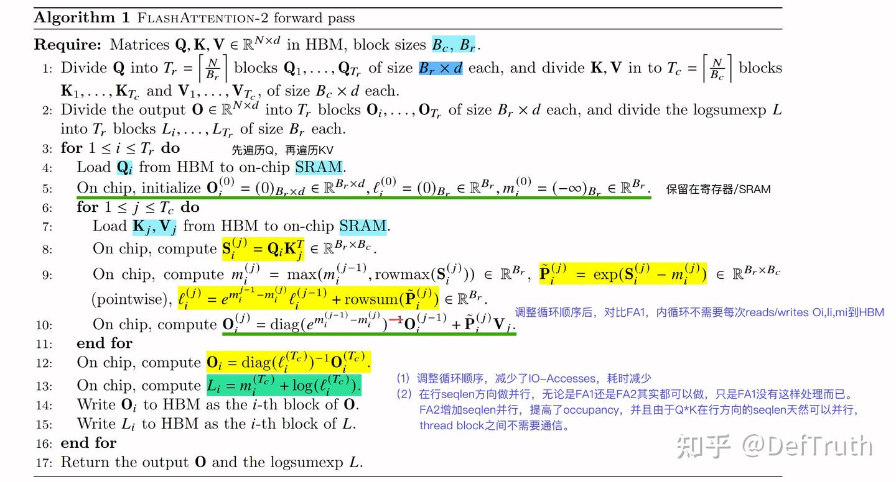
*FlashAttention-2 forward pass*

순서를 바꾸면 FA-1과 달리 내부 루프에서 매번 O_i, ℓ_i, m_i를 HBM에 R/W할 필요가 없어 IO access가 줄고 시간도 단축된다. row(seqlen) 방향 병렬화는 FA-1, FA-2 어느 쪽에서도 가능하지만 FA-1은 그렇게 하지 않았을 뿐이다. FA-1은 batch_size와 head 수에서만 병렬화했는데, seqlen이 길고 bs가 작은 경우 효율이 급락한다. FA-2는 seqlen 병렬을 추가해 occupancy를 끌어올렸고, forward에서 Q*Kᵀ는 row 방향 seqlen에서 자연스럽게 병렬이라 thread block 간 추가 통신이 필요 없다.

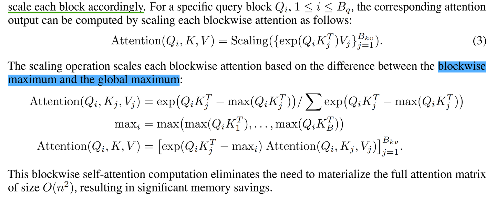
*Q에 대한 Blockwise*

## 0x02 BPT

BPT(Blockwise Parallel Transformer)는 FlashAttention 위에서 한 걸음 더 나간다. FFN(즉 MLP)에도 blockwise를 적용한다. 즉 BPT는 FA-2의 확장으로, Attention 분할뿐 아니라 MLP 분할도 고려하며, Attention + MLP를 하나의 분할 알고리즘으로 융합해 MLP의 중간 activation 메모리를 크게 줄인다(**19bsh → 2bsh**).

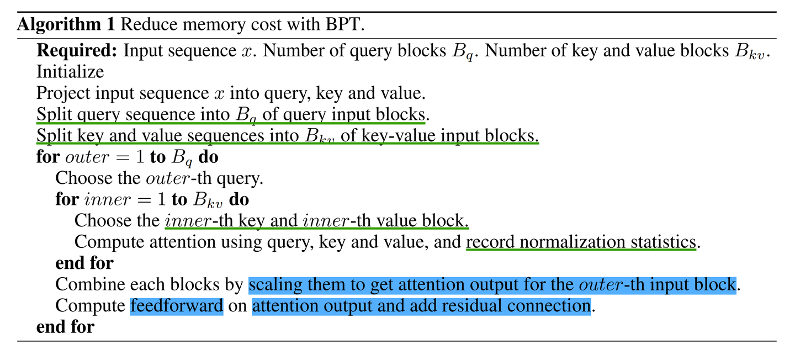
*BPT 알고리즘 흐름*

BPT 저자의 관찰은, Attention만 분할 가능한 것이 아니라 FFN(MLP) 역시 모든 분할 Attention이 끝날 때까지 기다릴 필요 없이 Q block 단위로 차례차례 계산할 수 있다는 점이다. token 차원에서 독립적이기 때문이다. 실제로는 각 Q block마다 KV가 완비되어 있고, 현재 Q block 안에서만 내부 루프를 도므로 각 Q block의 Attention Output은 본래 병렬 가능하다. 따라서 각 Q block의 결과 O block을 얻으면 즉시 FFN 계산을 이어 갈 수 있다. 모든 O block을 큰 O 행렬에 저장한 뒤에 한꺼번에 FFN을 돌리지 않아도 된다. FFN까지 병렬화하면 큰 O에 대한 메모리 수요가 사라진다.

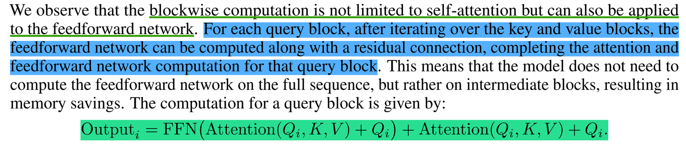
*FFN 병렬화*

마지막으로, 현재의 Q block을 두고 보면 FlashAttention이든 BPT이든 KV block을 inner loop로 돌 때 KV block 순서는 최종 Attention Output에 영향을 주지 않는다. 모든 KV block 순회 결과를 끝에서 올바르게 scaling만 해 주면 된다. 즉 n개의 KV block이 있을 때 inner loop에서 KV_0을 먼저 계산하든 KV_n을 먼저 계산하든 결과는 같다.

## 0x03 Ring-Attention

### 해결하려는 문제

FlashAttention-2와 BPT를 깔아 두고 Ring-Attention으로 넘어가자. Ring-Attention은 본질적으로 BPT를 **다중 GPU**로 확장한 것이다. Attention을 진입점으로 시퀀스 병렬을 펼치고 원형 통신 토폴로지를 설계해 계산과 통신을 overlap한다. 그래서 시퀀스 병렬 도입에도 통신 부담이 크게 증가하지 않는다. 다시 말해 Ring-Attention은 BPT + FA-2의 분산 버전이며, Attention과 FFN 모두에 blockwise(즉 sequence 차원 분할)를 적용한다.

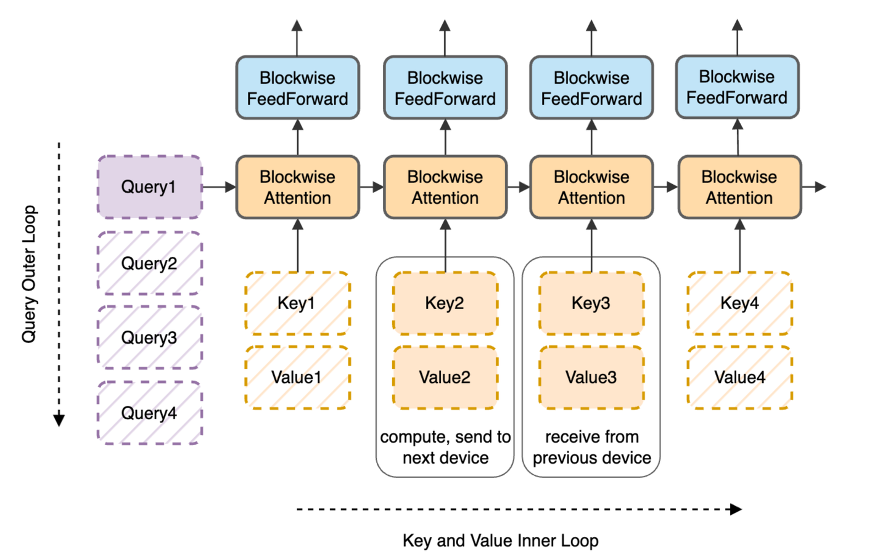
*Ring Attention Loop*

앞서 살펴봤듯 FlashAttention-2는 Attention 내부의 O(S²) 메모리 의존을 해결해 QK 중간 결과를 저장할 필요가 없게 했고, BPT는 한 발 더 나아가 Attention 출력 큰 O 행렬에 대한 메모리 의존을 해결해 분할된 Attention Output을 그대로 FFN에 넘겼다. 그러나 FlashAttention-2와 BPT를 모두 쓰더라도 FFN 출력 Z는 여전히 큰 Z 행렬로 완전히 저장해야 한다. Z의 메모리 수요는 seqlen에 선형 비례하므로 seqlen이 더 늘어나면 단일 GPU OOM 문제가 다시 발생한다. 여기서 Ring-Attention이 등장한다. 표면적으로 Ring-Attention의 시퀀스 분할은 Q에서 시작하지만, 결과적으로 각 GPU는 Q block 크기만큼의 Z만 보관하면 된다. Z를 단일 GPU에 완전히 담을 수 없는 문제를 해결한다. 따라서 Ring-Attention은 BPT에서 FFN(MLP) 출력이 여전히 전체로 보존(즉 완전한 N)되어야 한다는 문제를 해결해 output을 여러 GPU에 분산시킨다고도 이해할 수 있다.

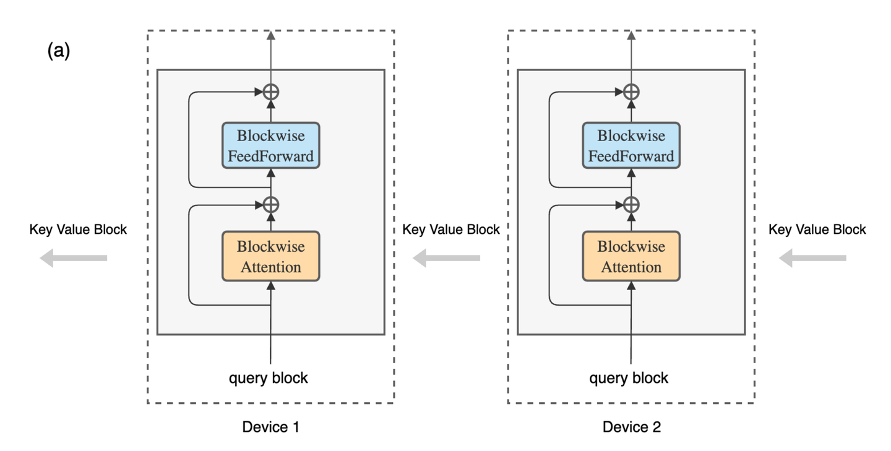
*Q를 잘라 서로 다른 카드에 분배*

### 원형 통신

BPT를 분산화하면 다음으로 카드 간 KV block 통신을 처리해야 한다. Ring-Attention은 원형 통신 토폴로지를 도입해 통신과 계산을 overlap한다. 이름이 "Ring"-Attention인 이유다.

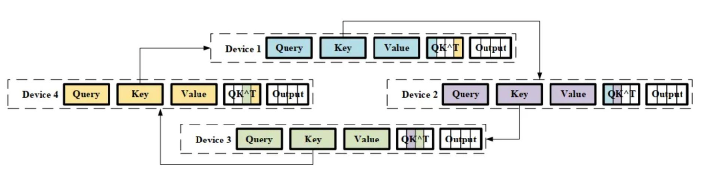
*원형 통신*

예를 들어 Device 1은 **파란색** QKV block에 대해 Attention을 계산하는 동시에, Device 2가 다음 라운드에 필요로 할 **보라색** KV block을 송신하고, Device 4로부터 자신(Device 1)이 다음 라운드에 필요로 하는 **노란색** KV block을 수신한다. KV block의 송수신과 Attention 계산이 overlap되므로 계산 시간 ≥ 통신 시간이면 통신 시간은 완전히 가려진다. Device 1 ~ Device 4가 이런 식으로 양방향 연결되어 원형 통신 토폴로지를 이룬다.

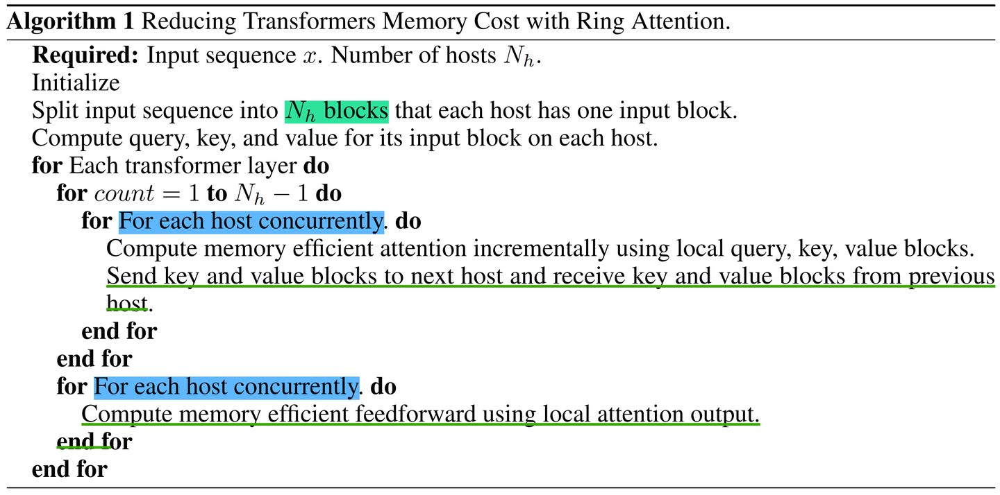
*계산과 통신 overlap*

### 메모리와 block size 설정

Ring-Attention 논문의 activation 분석 그림을 같이 본다. 각 layer가 필요로 하는 activation을 나타내며, c는 분할된 block size, b는 batch size, h는 hidden size, s는 sequence length, n은 head 수다. block size(c)는 sequence length(s)와 무관하다.

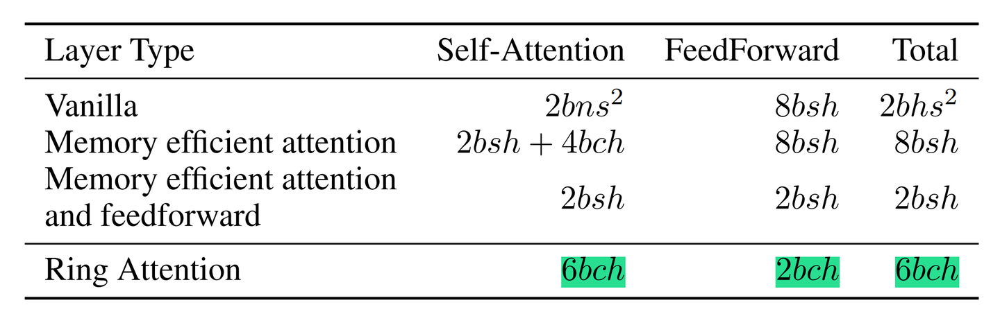
*activation 크기(메모리)*

통신이 계산과 overlap되면 통신 비용은 무시할 수 있다. Ring-Attention 저자는 통신·계산 overlap을 보장하는 권장 block size를 환경별로 제시한다. 예를 들어 A100, 카드 간 NVLink, 대역폭 300 GB/s라면 최소 block size는 1024, 최소 seqlen은 약 8K다. 같은 식으로, NVLink가 없는 L20처럼 PCIe 64 GB/s를 쓰는 환경이라면 block size가 최소 4K는 되어야 효율적인 통신·계산 overlap이 가능하다. seqlen이 작은 경우(예: 8K 이하)에는 Ring Attention이 그리 적합하지 않다. rank 수가 4를 넘으면 ulysses보다 못할 수도 있다.

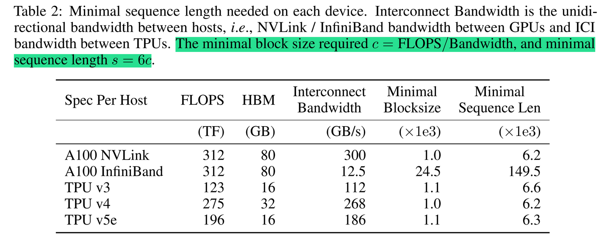
*block size 설정*

block size를 어떻게 산정하는지에 대해서는 다음 글을 추천한다: 「猛猿: 도해 대모델 훈련 시리즈: 시퀀스 병렬 3, Ring Attention」. 단일 카드에서 어떤 QKV block에 attention을 계산할 때 Q*Kᵀ = (c, d) * (d, c)이므로 Attention Score 계산량은 2dc² FLOPs(QK matmul, 다른 부동소수점 연산은 무시, M=N=c, K=d, 계산량 2MNK)이다. Score * V = (c, c) * (c, d)이므로 score*v 계산량도 2dc² FLOPs. 즉 단일 카드 분할 attention의 총 계산량은 4dc² FLOPs다. bf16/fp16 학습을 가정하면 전송되는 KV 데이터량(bytes): K block 2dc bytes, V block 2dc bytes, 합 4dc bytes. **"전송 시간 ≤ 계산 시간"** 조건에서:

```
4dc / B  ≤  4dc² / F
   ⇒  c  ≥  F / B
```

따라서 하드웨어의 F(FLOPS)와 B(Bandwidth)로 최적 block size c를 산정할 수 있다.

### 엔지니어링 구현과 세부 유도

Ring-Attention의 엔지니어링 구현과 세부 유도에 대해서는 다음 글들을 강력히 추천한다: 「LLM迷思: 분산 학습 기술 공유 15편 — Ring Attention + Flash Attention forward 유도 디테일」, 「朱小霖: ring attention + flash attention: 초장기 context로 가는 길」. 매우 잘 쓰였다.

## 0x04 Striped-Attention

Striped Attention(Faster Ring Attention)은 Ring-Attention의 부하 불균형 문제를 해결해 성능을 한 단계 더 끌어올린다.

### 부하 불균형

이 부분 내용은 「朱小霖: ring attention + flash attention: 초장기 context로 가는 길」을 참고했다. GPT 같은 causal mask attention 모델에서, Q를 앞뒤 위치로 그대로 잘라 분배하면 카드별 계산량이 균등하지 않다. 예를 들어 길이 16 시퀀스를 4장의 카드에 자르면 attention mask가 다음과 같이 분포한다.

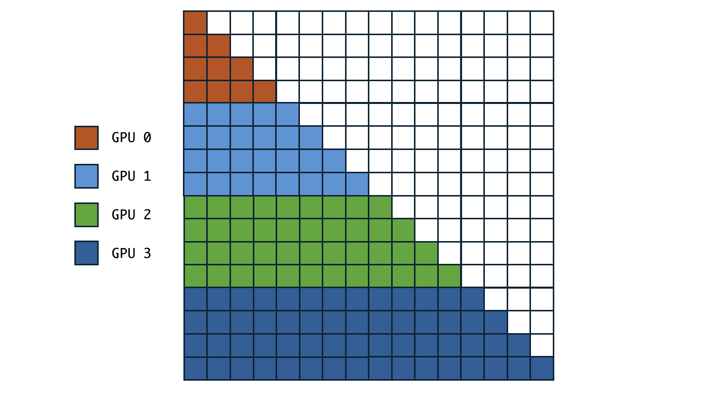
*부하 불균형, 그림 출처: https://zhuanlan.zhihu.com/p/683714620*

GPU 0의 실제 계산량은 GPU 3의 약 1/4 ~ 1/7에 불과해 GPU 0이 충분히 활용되지 않는다. Q block 4개를 GPU 0 ~ GPU 3에 순서대로 분배(GPU 0이 Q Block 0, GPU 3이 Q Block 3을 담당)하면 뒤쪽 Q block(즉 GPU)일수록 계산량이 커진다. **causal 조건을 만족하는 이전 모든 KV와 attention을 계산해야 하기 때문**이다. GPU 간 계산 부하 불균형의 원인이며, 균형 잡기가 Ring Attention 최적화의 핵심이 된다.

### Stripe Permutation

부하 불균형 해결을 위해 striped ring attention은 계산량을 띠 모양으로 잘게 자른다. 본질적으로 원래의 큰 block size를 더 작게 쪼개고, permutation으로 섞는다. 즉 striped ring attention은 시퀀스 뒤쪽에 있어야 할 Q 일부를 앞쪽 GPU로 옮겨 계산하게 만들고, 그 반대도 마찬가지다. 그 결과 각 GPU의 Attention 계산량이 대체로 균형을 이룬다(각 GPU가 보유한 attention mask가 균형 잡힘).

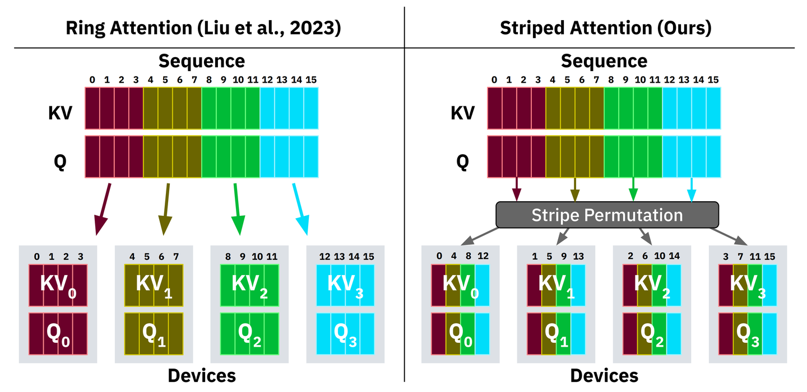
*Stripe Attention*

Striped Attention 적용 후 GPU별 Attention Mask 분포(즉 계산량 분포)는 다음과 같다.

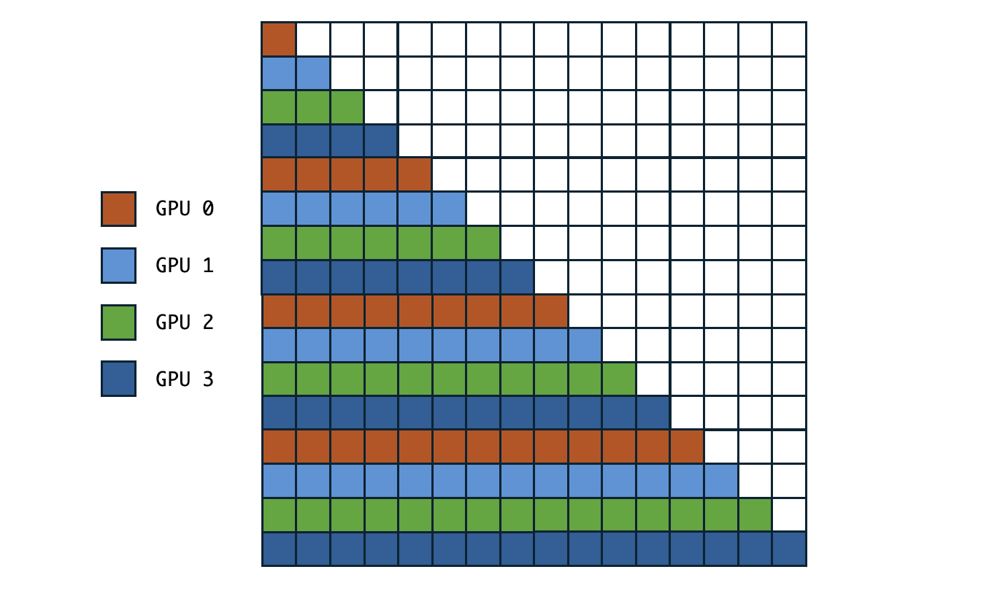
*그림 출처: https://zhuanlan.zhihu.com/p/683714620*

## 0x05 PyTorch Native Context Parallel

PyTorch 2.7이 드디어 발표되었고, native sequence parallelism 기능을 지원한다. 문서: Introduction to Context Parallel. PyTorch 2.7은 Ring Attention 알고리즘으로 native Context Parallel을 지원한다. 긴 입력 시퀀스를 여러 GPU에 sharding해 peak activation을 낮추고, Transformer 모듈에서 activation 저장으로 인한 peak memory가 입력 시퀀스 길이를 제한하던 문제를 푼다. 현재 두 가지 Ring Attention 변형이 구현되어 있다: all-gather 기반 pass-KV와 all-to-all 기반 pass-KV.

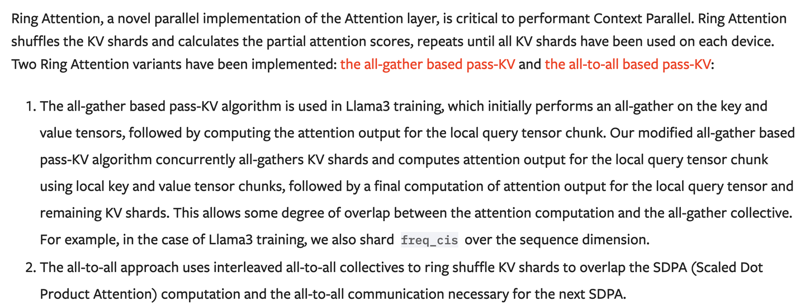
*PyTorch Native Ring Attention*

all-gather 통신 기반 Ring Attention은 LLaMA 3에서 사용된 알고리즘이고, all-to-all 통신 기반은 본 글에서 다룬 원조 Ring Attention이다. PyTorch Native Ring Attention이 부하 균형 최적화를 적용했는지에 대해서는 아직 공식 설명을 보지 못했다. PyTorch Native Context Parallel 사용 예는 다음과 같다.

```python
# file: cp_sdpa_example.py
import os

import torch
import torch.distributed as dist
import torch.nn.functional as F
from torch.distributed.device_mesh import init_device_mesh
from torch.distributed.tensor.experimental import context_parallel
from torch.distributed.tensor.experimental._attention import context_parallel_unshard
from torch.nn.attention import sdpa_kernel, SDPBackend


def context_parallel_sdpa_example(world_size: int, rank: int):
    assert torch.cuda.is_available()
    assert dist.is_nccl_available()
    torch.cuda.set_device(f"cuda:{rank}")
    torch.cuda.manual_seed(0)

    dist.init_process_group(
        backend="nccl",
        init_method="env://",
        world_size=world_size,
        rank=rank,
    )
    device_mesh = init_device_mesh(
        device_type="cuda", mesh_shape=(world_size,), mesh_dim_names=("cp",)
    )

    batch = 8
    nheads = 8
    qkv_len = 64
    dim = 32
    backend = SDPBackend.FLASH_ATTENTION
    dtype = (
        torch.bfloat16
        if backend == SDPBackend.FLASH_ATTENTION
        or backend == SDPBackend.CUDNN_ATTENTION
        else torch.float32
    )

    qkv = [
        torch.rand(
            (batch, nheads, qkv_len, dim),
            dtype=dtype,
            requires_grad=True,
            device='cuda',
        )
        for _ in range(3)
    ]
    # specify the SDPBackend to use
    with sdpa_kernel(backend):
        out = F.scaled_dot_product_attention(*qkv, is_causal=True)

    # make a clean copy of QKV for output comparison
    cp_qkv = [t.detach().clone() for t in qkv]

    with sdpa_kernel(backend):
        # This `context_parallel()` performs two actions:
        # 1. Shard the tensor objects in `buffers` in-place along the dimension
        #    specified in `buffer_seq_dims`, the tensors in `buffers` and their
        #    sharding dims in `buffer_seq_dims` are organized in the same order.
        # 2. Replace the execution of `F.scaled_dot_product_attention` with a
        #    context-paralleled-enabled Ring Attention.
        with context_parallel(
            device_mesh, buffers=tuple(cp_qkv), buffer_seq_dims=(2, 2, 2)
        ):
            cp_out = F.scaled_dot_product_attention(*cp_qkv, is_causal=True)

        # The output `cp_out` is still sharded in the same way as QKV
        # the `context_parallel_unshard` API allows users to easily
        # unshard to gain the full tensor.
        (cp_out,) = context_parallel_unshard(device_mesh, [cp_out], [2])

    assert torch.allclose(
        cp_out,
        out,
        atol=(1e-08 if dtype == torch.float32 else 1e-03 * world_size),
    )


if __name__ == "__main__":
    rank = int(os.environ["RANK"])
    world_size = int(os.environ["WORLD_SIZE"])

    try:
        context_parallel_sdpa_example(world_size, rank)
    finally:
        dist.barrier()
        dist.destroy_process_group()
```

## 0x06 정리

본 글은 FlashAttention-2, BPT, Ring-Attention, Striped Attention 알고리즘을 간단히 소개했다. 발전 흐름을 보면 이들 알고리즘은 서로 잇닿아 있어 함께 학습해 두면 좋다. FlashAttention-2, BPT는 단일 카드에서 Attention과 FFN(MLP) 모듈의 계산 효율·메모리 수요 문제를 해결한다. Ring-Attention은 이를 다중 카드로 확장해 초장기 context를 위한 시퀀스 병렬을 가능하게 한다. Striped Attention은 Ring-Attention의 계산 부하 불균형 문제를 한 단계 더 풀어 성능을 끌어올렸다.

저자의 더 많은 기술 노트와 CUDA 학습 노트는 LeetCUDA를 참고하면 된다. LLM/VLM 글 정리와 FlashAttention, SGEMM, HGEMM, GEMV 같은 대표 CUDA kernel 예제 구현이 포함되어 있으며, 누적 3k+ stars를 기록 중이다.

늘 그렇듯, 오류는 발견 즉시 갱신하고 수정해 나가겠다.
