# [Tensor/Sequence Parallel] DeepSpeed-Ulysses & Megatron-LM TP/SP 도해

> 원문: https://zhuanlan.zhihu.com/p/5750410146

**목차**
- 0x00 서문
- 0x01 Megatron-LM Tensor Parallelism
- 0x02 Megatron-LM Sequence Parallelism
- 0x03 DeepSpeed-Ulysses Sequence Parallelism
- 0x04 통신량 분석
- 0x05 Ulysses + Zero3
- 0x06 정리

### 0x00 서문

최근 여러 sequence parallel 기술을 업무에서 사용할 일이 있어, 제 이해를 기록하는 짧은 글을 몇 편 작성하려고 합니다. DeepSpeed-Ulysses Sequence Parallelism은 비교적 직관적으로 이해하기 어렵고, Megatron-LM의 Tensor/Sequence Parallelism은 그보다 더 바로 보입니다. 따라서 이 글에서는 도해 방식으로 DeepSpeed-Ulysses와 Megatron-LM TP/SP를 얕은 곳에서 깊은 곳으로 순서대로 정리합니다.

더 많은 기술 노트와 CUDA 학습 노트는 LeetCUDA(CUDA Learn Notes with PyTorch)를 참고해 주세요. LeetCUDA에는 **LLM/VLM** 글 정리와 **FlashAttention, SGEMM, HGEMM, GEMV** 등 흔히 쓰이는 **CUDA Kernel**의 **예제 구현**이 포함되어 있으며, 현재 누적 **3k+ stars**를 달성했습니다. 링크: https://github.com/xlite-dev/LeetCUDA


*CUDA Learn Notes with PyTorch*

이 글의 내용은 다음과 같습니다.

- 0x01 Megatron-LM Tensor Parallelism
- 행렬곱 분할
- Row Parallel
- Column Parallel
- MLP tensor parallel
- Attention tensor parallel
- 0x02 Megatron-LM Sequence Parallelism
- 분산되지 않은 activation memory
- sequence parallel + tensor parallel
- activation memory 점유 분석
- 0x03 DeepSpeed-Ulysses Sequence Parallelism
- DeepSpeed-Ulysses 전체 흐름
- 입력 O의 분할
- d 차원 All-To-All
- Full Attention 계산
- N 차원 All-To-All
- Wo 곱셈
- MLP 계산
- 0x04 통신량 분석
- DeepSpeed-Ulysses 통신 복잡도
- Megatron-LM SP 통신 복잡도
- DeepSpeed-Ulysses의 단점
- 0x05 Ulysses + Zero3
- 0x06 정리

### 0x01 Megatron-LM Tensor Parallelism

먼저 Megatron-LM의 Tensor Parallelism과 Sequence Parallelism[1]을 간단히 설명합니다. Megatron-LM은 2020년 논문에서 Transformers 구조를 대상으로 처음에는 Tensor Parallelism을 제안했습니다. 바로 아래와 같은 고전적인 그림입니다.

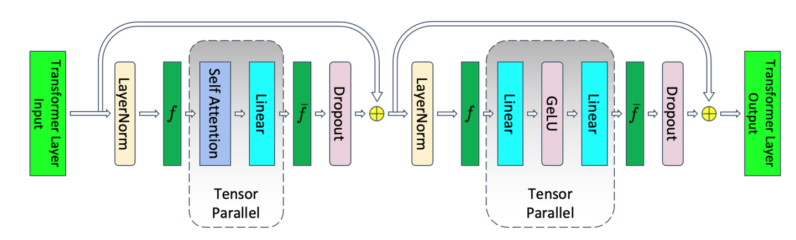
*Megatron Tensor Parallelism*

Megatron Tensor Parallelism은 Transformers 구조의 Self Attention과 MLP(Linear) 모듈에 tensor parallel을 적용합니다. 이를 통해 두 모듈의 weight와 계산을 P개의 GPU에 균등하게 나눌 수 있습니다. MLP와 Attention에 적용되는 tensor parallel 전략은 다음과 같습니다.

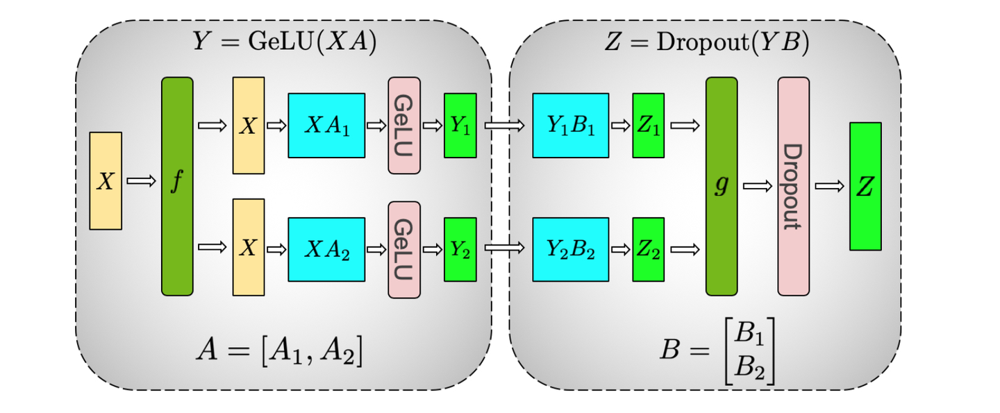
*MLP Tensor Parallelism*

행렬곱은 block으로 나누어 계산할 수 있으므로, MLP에 Tensor Parallelism을 적용할 수 있습니다.

**행렬곱 분할**

Tensor Parallelism의 기반은 행렬곱이 분할 가능하다는 점입니다. CUDA에서 GEMM(SGEMM/HGEMM 등)은 공학적으로 block matrix multiplication을 통해 구현됩니다. 고대역폭 SRAM과 on-chip storage/register를 활용해 데이터를 재사용합니다. 이 block matrix multiplication 개념을 단일 GPU에서 multi-GPU로 확장하면, 각 rank가 행렬의 한 block을 처리하고 전체 행렬곱 결과는 NCCL 같은 collective communication 라이브러리 인터페이스로 집계하는 형태가 됩니다.

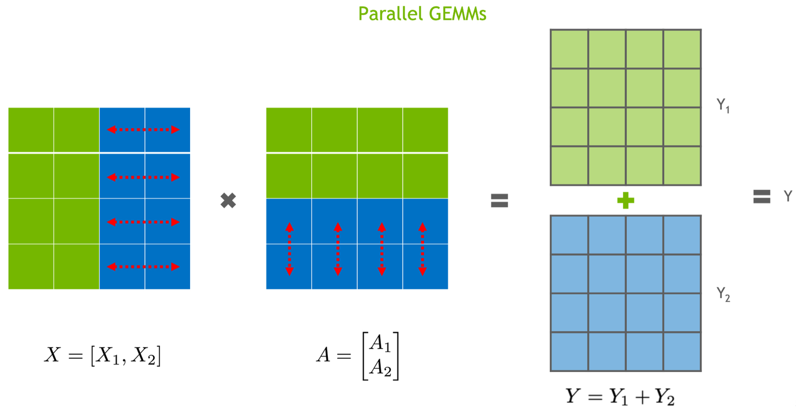
*Parallel GEMMs*

**weight matrix A의 관점**에서 보면, 행렬 A의 block 분할 방식은 두 가지입니다. 하나는 행 방향 분할이고, 다른 하나는 열 방향 분할입니다.

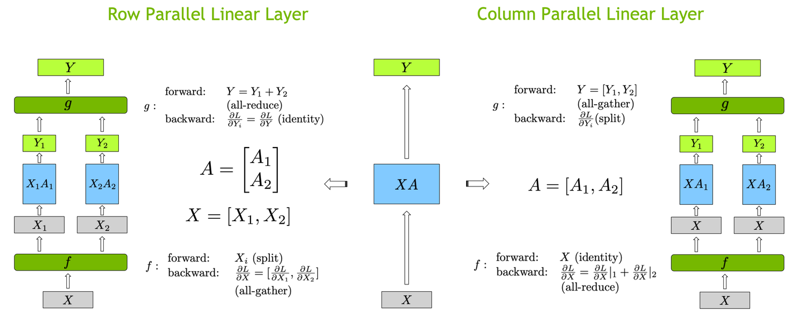
*weight A의 행/열 분할*

**Row Parallel**

2개 GPU가 있다고 가정합니다. weight matrix A를 **행 방향**으로 분할하면 A1, A2 block의 차원은 `[d/2, d]`가 됩니다. 행렬곱이 제대로 수행되려면 X `[N, d]`는 열 방향으로 분할되어야 합니다. 즉 X1, X2 block의 차원은 `[N, d/2]`입니다. 각 block은 자신의 결과 **`[N, d]`**를 계산하고, 마지막에는 **All-Reduce**로 결과를 누적해 최종 출력 `Y = Y1 + Y2 = X1A1 + X2A2`를 얻습니다.

**Column Parallel**

weight matrix A를 **열 방향**으로 분할하면 A1, A2 block의 차원은 `[d, d/2]`가 됩니다. 이때 행렬곱을 수행하려면 X `[N, d]`는 그대로 유지되어야 합니다. 즉 각 rank는 완전한 X 한 벌을 가져야 합니다. 각 block은 자신의 결과 **`[N, d/2]`**를 계산하고, 마지막에는 **All-Gather**로 결과를 모아 최종 출력 `Y = [Y1, Y2] = [XA1, XA2]`를 얻습니다.

**MLP tensor parallel**

weight matrix를 서로 다르게 분할할 수 있다면, MLP 모듈에서 우리의 목표는 당연히 **통신량이 가장 낮은 방식**을 찾는 것입니다. 먼저 MLP 모듈의 계산식을 보겠습니다.

```text
Z = Dropout(GeLU(XA)B)
```

MLP에는 두 번의 행렬곱과 GELU, Dropout이 있습니다. GELU와 Dropout은 element-wise operation이라 어떻게 분할하든 영향이 크지 않으므로 일단 무시할 수 있습니다. `(XA)B`에서 우리가 원하는 것은 `XA` 이후 얻은 결과를 곧바로 B와의 행렬곱에 사용할 수 있게 하여 통신량을 최소화하는 것입니다. 이는 가능합니다.

Megatron에서 MLP weight matrix A와 B의 분할 방식은 **A는 column split, B는 row split**입니다. 그러면 다음과 같습니다.

```text
Z = Dropout(GeLU(XA)B)
  = Dropout(GeLU(X[A_1, A_2])[B_1; B_2])
  = Dropout(GeLU([XA_1, XA_2])[B_1; B_2])
  = Dropout([GeLU(XA_1), GeLU(XA_2)][B_1; B_2])
  = Dropout(GeLU(XA_1)B_1 + GeLU(XA_2)B_2)
```

이 경우 GPU 1은 `GeLU(XA_1)B_1`을 계산하고, GPU 2는 `GeLU(XA_2)B_2`를 계산할 수 있습니다. `XA_1`의 결과는 현재 rank에서 바로 `B_1`과 곱할 수 있으므로 추가 통신이 필요 없습니다. 모든 계산이 끝난 뒤 한 번의 all-reduce 통신만 수행하면 됩니다. 이렇게 계산 전체를 통신 한 번으로 끝낼 수 있습니다.

**Attention tensor parallel**

Attention 부분에서는 MHA의 각 head가 서로 독립적입니다. 따라서 자연스럽게 head 단위로 분할할 수 있습니다. 서로 다른 head를 서로 다른 GPU에 올려 계산하면 됩니다.

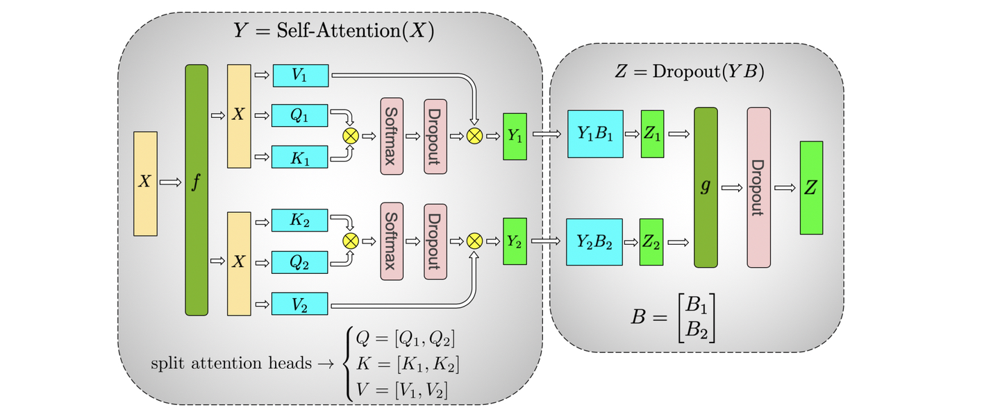
*Self Attention Tensor Parallelism*

### 0x02 Megatron-LM Sequence Parallelism

**분산되지 않은 activation memory**

Megatron의 Tensor Parallelism을 다시 보면, Tensor Parallelism은 Transformers의 Attention과 MLP 모듈만 처리합니다. LayerNorm과 Dropout은 원래 형태로 유지됩니다. 즉 두 연산자에서 각 GPU의 입력과 출력은 모두 완전한 activation입니다. long context 상황, 예를 들어 128K에서는 LayerNorm과 Dropout의 계산 비중은 크지 않지만 activation memory 점유는 작지 않습니다. tensor parallel 이후 per-layer activation memory 점유 계산식은 다음과 같습니다.

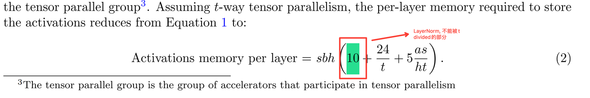
*tensor parallel 이후 per-layer activation memory 점유*

여기서 더해지는 `10sbh` 항(s는 seq_len, b는 batch size, h는 hidden_size)은 LayerNorm에서 옵니다. 이 부분은 tensor parallel로 분산할 수 없습니다. sequence length가 길어지면 `10sbh`가 선형으로 증가하고, 학습과 추론 과정의 memory 병목이 됩니다.

**sequence parallel + tensor parallel**

그렇다면 자연스러운 방법은 LayerNorm과 Dropout을 seq_len 차원에서 병렬화해 memory 압력을 사용하는 모든 GPU에 나누는 것입니다. 이 방식이 Sequence Parallelism입니다.

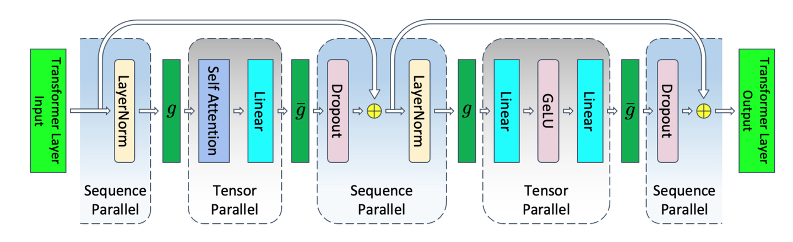
*Megatron-LM Sequence Parallelism*

Megatron-LM의 방식은 Tensor Parallel 전후에 Sequence Parallel을 삽입하는 것입니다. 여기서 주의할 점은 Megatron-LM의 Sequence Parallel이 자체 Tensor Parallel과 함께 사용된다는 점입니다. 반면 DeepSpeed-Ulysses의 sequence parallel은 Tensor Parallel과 함께 사용할 필요가 없습니다. Megatron-LM에서는 tensor parallel 부분은 그대로 두고, Attention과 MLP의 입력/출력에만 sequence parallel을 적용합니다.

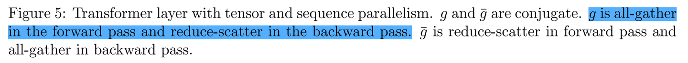
*통신 방식의 변화*

병렬화 방식이 바뀌면 통신 방식도 바뀝니다. 기존 pure Tensor Parallel은 all-reduce 2회가 필요했습니다. Sequence Parallel + Tensor Parallel 상황에서는 all-gather 2회와 reduce-scatter 2회로 바뀝니다. 논문 설명에 따르면 두 경우의 통신량은 같습니다.

**activation memory 점유 분석**

sequence parallel을 사용한 뒤 각 layer의 activation에 필요한 memory 점유는 다음과 같습니다.

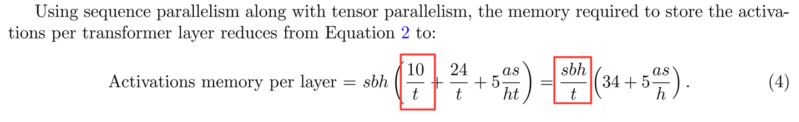
*SP: 각 layer activation memory 점유*

`10sbh` 항이 이제 분모의 `t`로 분산될 수 있음을 볼 수 있습니다. 마지막으로 논문에서 제시한 서로 다른 병렬화 상황의 per-layer memory 요구량을 붙입니다. recompute를 더하면 설정에 따라 memory 요구량은 더 줄어듭니다.

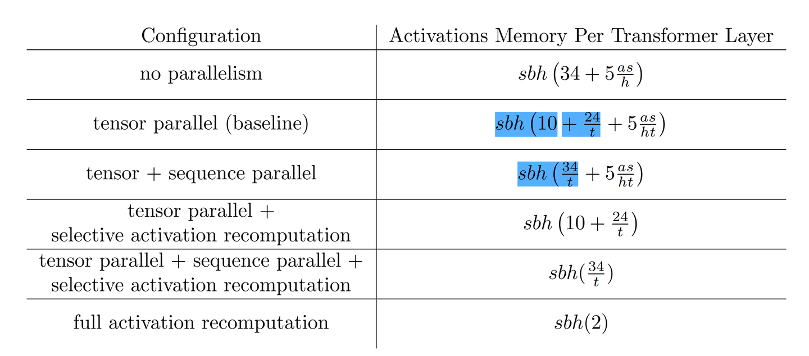
*여러 상황에서 per-layer memory 요구량*

더 자세한 분석은 "猛猿: 图解大模型训练系列: 序列并行1, Megatron SP"를 추천합니다.

### 0x03 DeepSpeed-Ulysses Sequence Parallelism

DeepSpeed의 Ulysses는 Sequence Parallelism을 구현하는 또 다른 방식입니다. 이 방식은 단독으로 사용할 수 있으며, Megatron-LM의 Sequence Parallelism처럼 Tensor Parallelism과 결합할 필요가 없습니다. Ulysses는 현재 여러 sequence parallel 알고리즘이 suboptimal communication efficiency 때문에 더 긴 sequence, 즉 million token 이상으로 확장하기 어렵다고 봅니다. 따라서 **낮은 통신량은 Ulysses의 핵심 장점 중 하나**입니다.

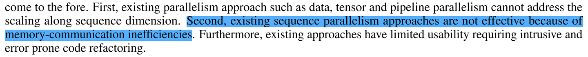
*핵심 장점: 낮은 통신량*

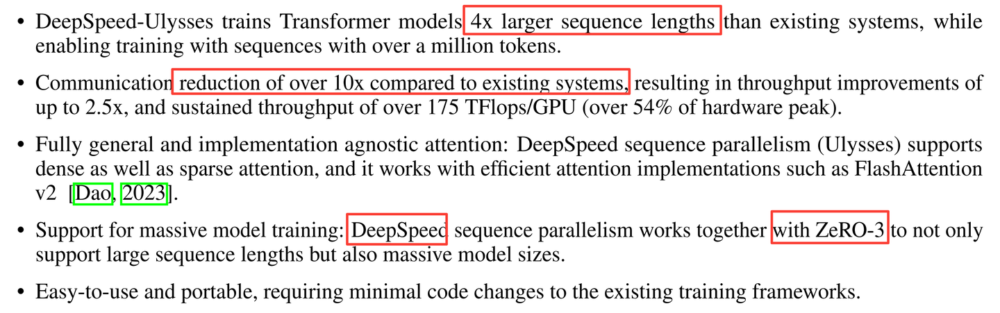
*주요 혁신*

다만 처음 DeepSpeed-Ulysses를 볼 때는 꽤 헷갈렸습니다. 특히 논문 안의 단순한 흐름도만으로는 이해가 잘 되지 않았습니다. 이제 본론으로 들어가겠습니다. 먼저 순수한 MHA 방식을 봅니다.

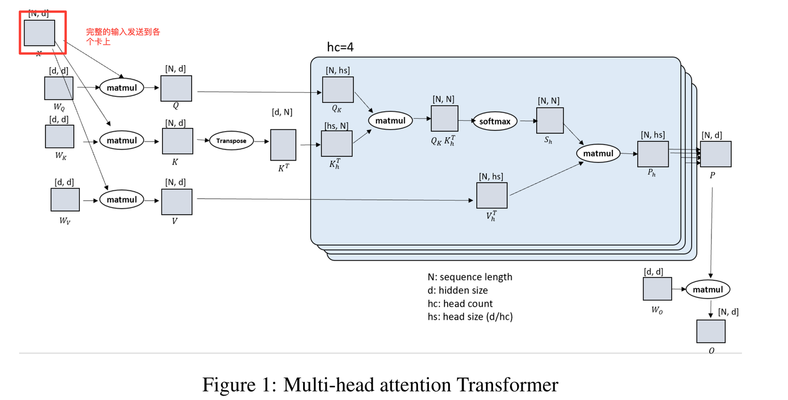
*순수 MHA*

Sequence Parallelism이 없으면 완전한 입력 Tensor `[N, d]`가 각 GPU에 broadcast됩니다. 이후 각 GPU는 완전한 입력으로 자신의 QKV와 뒤쪽 Attention 및 MLP를 계산합니다.

**DeepSpeed-Ulysses 전체 흐름**

DeepSpeed-Ulysses는 먼저 sequence를 분할한 뒤 서로 다른 GPU로 보내 연산합니다. 구체적으로는 먼저 batch 안의 각 sample을 sequence dimension을 따라 분할합니다. 이후 attention을 계산하기 전에 All-To-All 통신을 사용해 Query, Key, Value를 재배치합니다. 그 결과 각 GPU는 완전한 sequence length를 갖게 되고, 동시에 각 GPU는 일부 attention head만 처리하므로 attention score를 병렬 계산할 수 있습니다. 마지막으로 다시 All-To-All을 사용해 attention head 방향 결과를 모으면서 sequence dimension을 따라 다시 partition합니다.

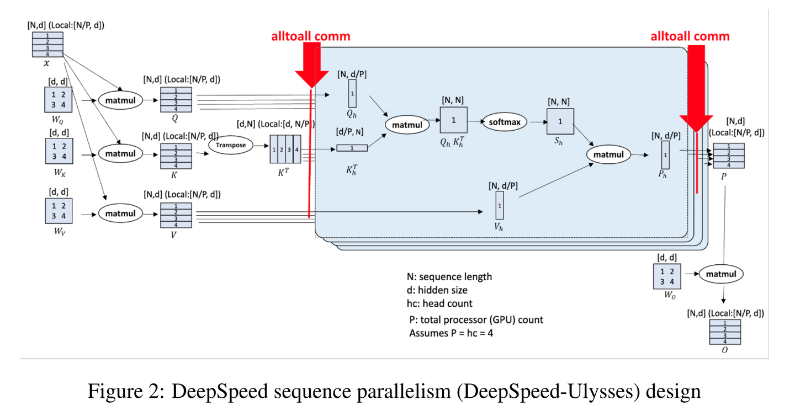
*DeepSpeed-Ulysses Sequence Parallelism*

하지만 이 설명과 그림만으로 DeepSpeed-Ulysses를 잘 이해하기는 쉽지 않습니다. 특히 두 번의 All-To-All이 어떤 역할을 하는지가 핵심입니다. 아래는 제 이해를 바탕으로 그린 DeepSpeed-Ulysses sequence parallel 흐름도입니다. 오류가 있다면 지적 부탁드립니다. 이 그림을 기준으로 알고리즘을 간단히 설명합니다.

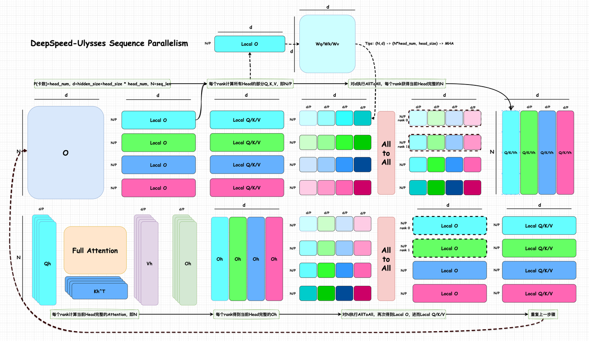
*DeepSpeed-Ulysses 흐름도*

**기본 가정과 표기**

이해를 단순화하기 위해 사용하는 GPU 수 P가 MHA의 attention head 수와 같다고 가정합니다. 실제로는 P와 head num이 나누어떨어지는 관계를 만족해야 합니다. 즉 head num이 P로 나누어떨어져야 합니다.

그림에서 Local O/Q/K/V는 각 rank의 데이터를 의미합니다. Qh, Kh, Vh, Oh는 현재 head에서 N dimension이 완전한 데이터를 의미합니다. N은 sequence length, d는 hidden size, head size는 각 attention head가 사용하는 hidden vector의 차원입니다. 또한 `d = hidden_size = head_size * head_num`을 만족합니다.

P와 head num이 나누어떨어져야 한다는 조건은 다른 관점에서 보면 MHA 계산의 수치적 정확성도 보장합니다. 각 head 자체의 hd dimension은 완전해야 attention score가 수치적으로 올바릅니다. 따라서 Ulysses 그림의 `d/P`는 실제로 head num을 기준으로 분할한다는 뜻이며, 각 head 내부의 hd를 다시 자르는 것이 아닙니다.

**입력 O의 분할**

먼저 입력 행렬 O를 분할합니다. 각 GPU는 `[N/P, d]` 크기 block, 즉 Local O를 얻습니다. DeepSpeed-Ulysses는 weight를 분할하지 않습니다. 각 GPU는 완전한 Wq/Wk/Wv weight를 보유합니다. 따라서 각 GPU의 `[N/P, d]` block은 현재 GPU의 Wq/Wk/Wv와 바로 곱해져 `[N/P, d]` 크기의 Q, K, V matrix, 즉 Local Q/K/V를 출력합니다. 이 Q, K, V matrix의 성질은 모든 head에 대해 N/P 부분만 가진 Q, K, V라는 점입니다.

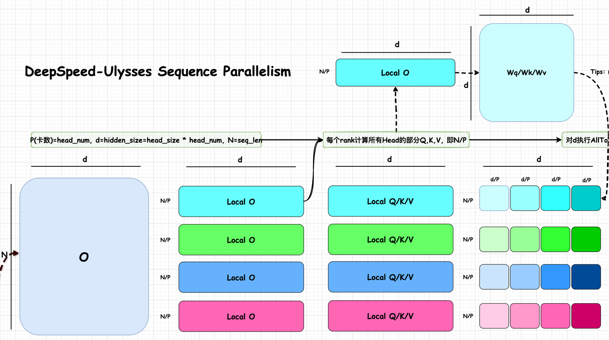
*O 분할 - Local O - Local Q/K/V*

**d 차원 All-To-All**

이전 단계에서 얻은 Local Q/K/V는 각 GPU가 N/P 부분만 보유합니다. 그러나 Attention은 완전한 N에 대해 attention을 계산해야 합니다. 동시에 Attention 자체도 분산 연산으로 수행하는 것이 좋습니다. 이를 위해 각 GPU가 정확히 하나의 Attention Head에 대해 N dimension이 완전한 Q/K/V 값을 갖도록 만들어야 합니다.

어떻게 할 수 있을까요? DeepSpeed 팀은 이 시점에서 d dimension에 대해 All-To-All을 수행하면 정확히 이 기능을 구현할 수 있음을 발견했습니다.

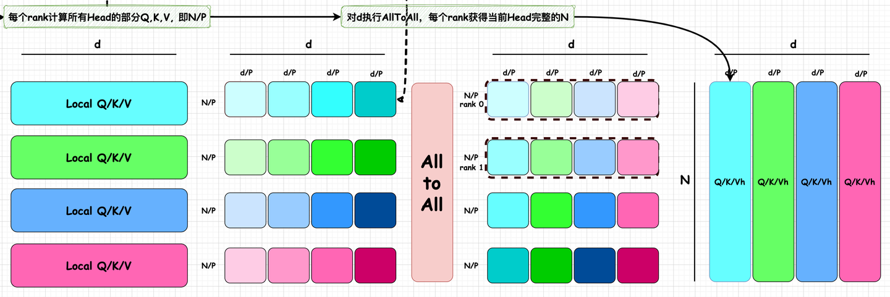
*d 차원 All-To-All*

All-To-All은 All-Reduce와 마찬가지로 분산 학습의 collective function입니다. All-To-All에서는 각 process가 다른 모든 process로 message의 일부를 보내고, 마지막에는 각 processor가 여러 process message의 일부를 보유합니다. 이 연산은 분산 행렬 transpose로 이해할 수 있습니다.

아래 그림을 예로 들면, All-To-All 이후 rank 0은 4개의 `[N/P, d/P]` 데이터를 갖습니다. 이들은 각각 N의 서로 다른 부분에 속하므로, 더 합치면 `[N, d/P=head_size]`가 됩니다. 이는 정확히 하나의 head가 필요로 하는, N dimension이 완전한 Q/K/V입니다.

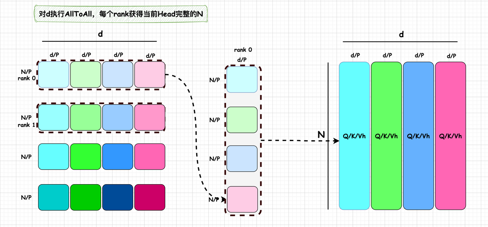
*reshape/reorder*

**Full Attention 계산**

All-To-All 이후 각 rank는 정확히 하나의 head에 대해 N dimension이 완전한 Q/K/V, 즉 Qh, Kh, Vh를 얻습니다. 따라서 일반 Attention 흐름대로 attention을 계산할 수 있고, 각 rank는 현재 head의 완전한 Oh를 얻습니다.

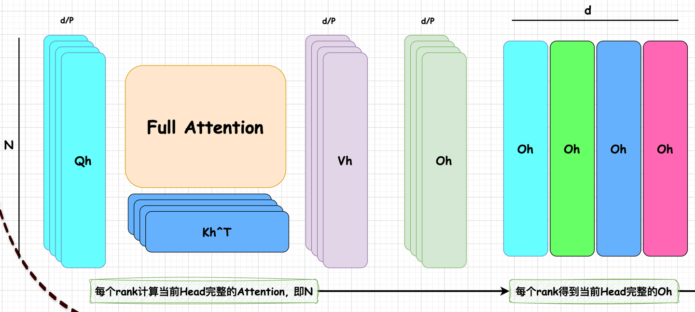
*각 rank에서 Full Attention*

**N 차원 All-To-All**

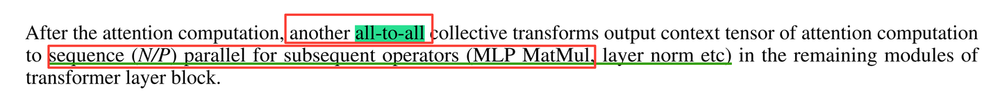

각 rank가 현재 head의 완전한 Oh를 얻은 뒤에는, 뒤쪽 Wo 곱셈과 MLP 모듈을 sequence parallel 형태로 바로 수행하기 위해 Oh `[N, d/P]`를 Local O `[N/P, d]` 형태로 바꿔야 합니다. 이는 또 한 번의 All-To-All로 정확히 완성할 수 있습니다. 이번에는 N dimension에 대해 All-To-All을 수행합니다. 결과는 정확히 Local O 형태가 되며, 이 결과를 Wo 및 MLP에 바로 전달해 sequence parallel을 계속 수행할 수 있습니다.

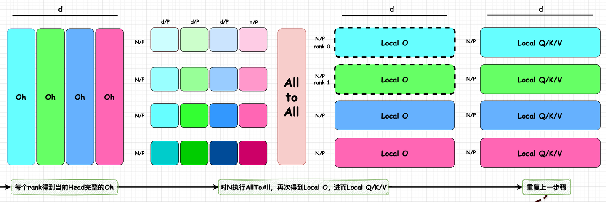
*N 차원 All-To-All Part-1*

이 그림을 더 펼쳐 보면, 원래 파란색 계열의 작은 block `[N/P, d/P]`들이 서로 다른 rank에 흩어져 있습니다. All-To-All collective communication 이후에는 같은 색 계열 block들이 같은 rank에 모입니다. 이 `[N/P, d/P]` block들을 d dimension으로 concat하면 Local O에 필요한, d dimension이 완전한 data block `[N/P, d]`를 얻습니다.

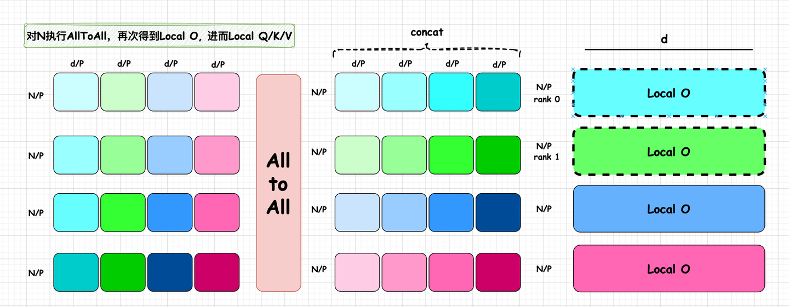
*N 차원 All-To-All Part-2*

**Wo 곱셈**

표준 Attention은 `softmax(QK^T) * V` 이후 결과에 Wo를 곱해 O에 한 번 linear transform을 수행합니다. N dimension All-To-All 이후 우리는 Local O를 얻었고, 그 차원은 `[N/P, d]`입니다. d dimension이 완전합니다. Wo matrix는 각 rank에 완전하게 한 벌씩 저장되어 있으며 차원은 `[d, d]`입니다. 따라서 각 rank의 local O와 Wo를 바로 곱해 `[N/P, d]`를 얻을 수 있습니다.

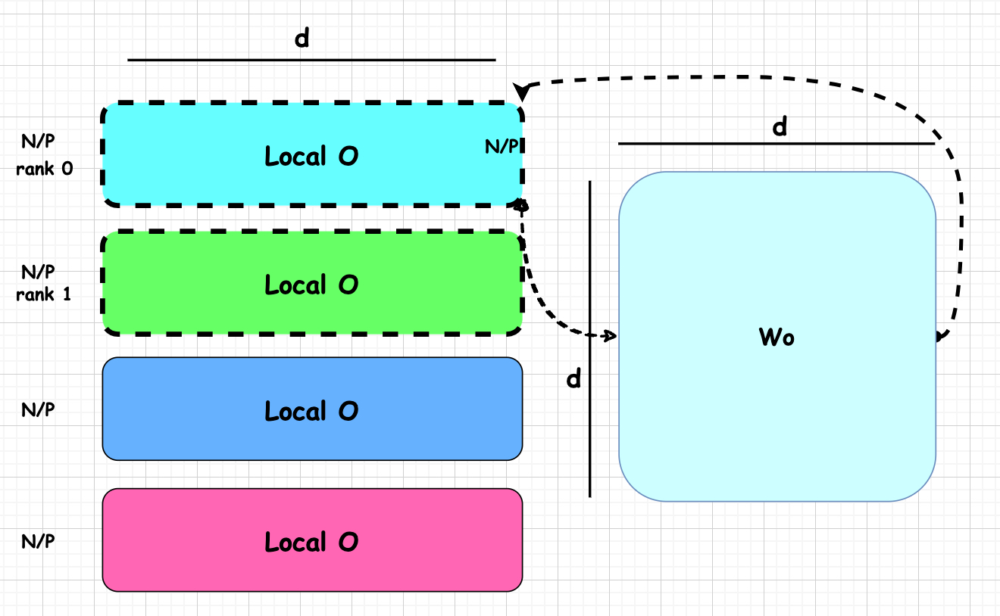
*Wo 곱셈*

**MLP 계산**

MLP 계산은 이해하기 쉽습니다. Local O `[N/P, d]`를 얻은 뒤에는 MLP 계산이 Attention처럼 완전한 N dimension을 필요로 하지 않습니다. **각 token의 계산은 서로 독립적**입니다. 계산식은 다음과 같습니다.

```text
Local Z_[N/P, d] = Dropout(GeLU(X_[N/P,d] A_[d,d]) B_[d,d])
```

얻어진 Local Z도 여전히 `[N/P, d]` 형태입니다. 따라서 다음 Transformer Block의 Wq/Wk/Wv와 바로 곱해 Local Q/K/V를 얻고, 다음 sequence parallel 단계로 들어갈 수 있습니다. 이 과정은 loss 계산 또는 token 출력 생성까지 반복됩니다.

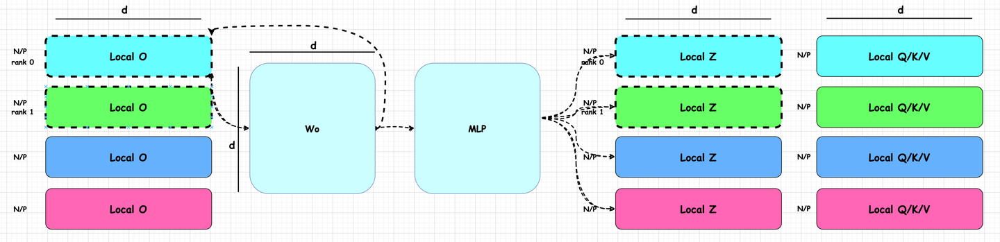
*MLP 계산*

여기까지가 DeepSpeed-Ulysses Sequence Parallelism의 알고리즘 흐름입니다. 아래는 논문에 나온 DeepSpeed-Ulysses와 당시 Megatron-LM SP+TP의 학습 성능 비교입니다. 다만 이후 Megatron-LM이 CP(**Context Parallelism**)를 지원했기 때문에, 이 비교 그림은 현재 기준으로는 다소 오래되었습니다.

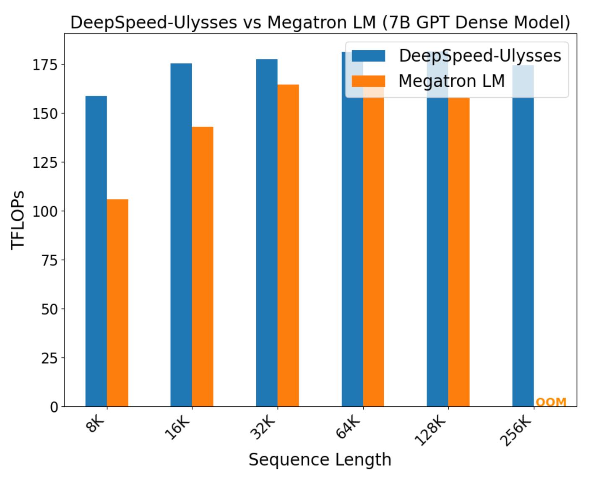
*DeepSpeed-Ulysses vs Megatron-LM SP+TP*

### 0x04 통신량 분석

이 절에서는 DeepSpeed-Ulysses와 Megatron-LM SP의 통신량을 간단히 분석합니다. 내용은 기존 분석 결론을 정리한 것이며, 주로 DeepSpeed-Ulysses[2]와 Megatron-LM SP[1] 논문, 그리고 여러 글[3][4][5]을 참고했습니다. 여기서는 fwd 단계에 집중합니다. 먼저 DeepSpeed-Ulysses 논문의 결론을 봅니다.

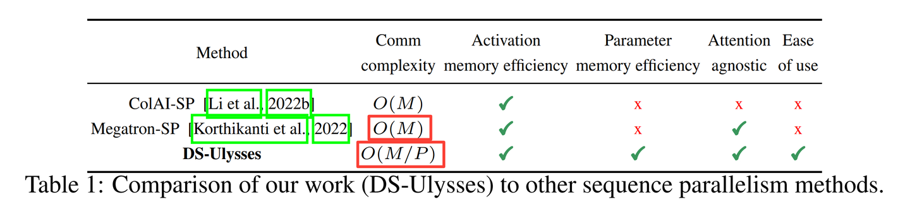
*sequence parallel 통신 복잡도*

**DeepSpeed-Ulysses 통신 복잡도**

통신 복잡도의 관점에서 DeepSpeed-Ulysses의 통신 복잡도는 `O(M/P)`이고, Megatron-SP의 통신 복잡도는 `O(M)`입니다. 여기서 M은 message, 즉 각 rank가 보내야 하는 정보 총량입니다(send만 봅니다).

모든 GPU 사이의 All-to-All 통신에서 message 총 크기가 M이면 각 link가 전송하는 통신량은 `M/P`입니다. hidden layer size d, sequence length N, parallel degree P(P개의 GPU)를 갖는 Transformer 모델을 생각해 보겠습니다.

DeepSpeed-Ulysses는 Attention 계산 전에 QKV projection에 대해 All-to-All 통신을 수행합니다. message 총 크기는 **3Nd**입니다(Q, K, V 각각 한 벌). Attention으로 각 rank의 Oh를 얻은 뒤에는 N dimension에 대해 다시 All-to-All 통신을 수행합니다. 이때 message 크기는 **Nd**입니다(이번에는 O만 통신).

따라서 DeepSpeed-Ulysses sequence parallel에서 각 link에 필요한 collective communication 양은 **4Nd/P**입니다. 복잡도로는 `O(N/P)`이며, `4d`는 상수로 볼 수 있습니다. 주목할 점은 `4Nd/P`가 P와 관련된다는 것입니다. N과 P가 비례해서 증가하면 각 GPU의 통신량은 유지될 수 있습니다. 즉 **DeepSpeed-Ulysses sequence parallel에서는 sequence length N이 매우 클 때 GPU 수를 늘리면 통신량을 낮출 수 있습니다.** 이 결론이 매우 중요합니다.[2]

**Megatron-LM SP 통신 복잡도**

반면 Megatron-LM 같은 기존 방법은 P가 어떻게 변하든 통신량이 정보량 M에 따라 선형으로 증가하므로 통신 복잡도는 `O(M)`입니다. 예를 들어 Megatron-LM은 각 Transformer layer에서 All-Gather를 2회 수행하고(각 통신량 Nd), Reduce-Scatter도 2회 수행합니다(각 통신량 Nd). 따라서 총 통신량은 `4Nd`입니다.

하지만 P가 1보다 훨씬 커도 매 All-Gather와 Reduce-Scatter의 통신량은 Nd로 유지됩니다. 이 값은 P가 커져도 줄어들지 않습니다. 따라서 Megatron-LM SP의 각 link 통신량은 **4Nd**이며, DeepSpeed-Ulysses sequence parallel의 통신량보다 P배 큽니다. 이는 모델 sequence length가 길어져 N이 커질 때, **Megatron-LM SP는 GPU 수를 늘려 단일 GPU 통신량을 줄일 수 없다**는 뜻입니다. 그러면 단일 GPU가 통신에 쓰는 시간이 더 많아지고, 학습 속도가 낮아질 수 있습니다.[4]

**DeepSpeed-Ulysses의 단점**

겉으로 보면 DeepSpeed-Ulysses는 GPU 수를 늘려 통신량을 줄일 수 있어 매우 좋아 보입니다. **하지만 실제로 P는 무한히 늘릴 수 없고 head_num에 의해 제한됩니다.** 실제 사용에서는 DeepSpeed-Ulysses가 `head_num`이 P(GPU 수)로 나누어떨어져야 한다는 조건을 만족해야 합니다. `head_num`은 무한히 늘어날 수 없으므로 `P <= head_num`입니다.

예를 들어 GQA나 MQA 상황에서는 K, V의 head_num이 작습니다. 이때 GPU 수 P도 크게 늘릴 수 없습니다. 또한 DeepSpeed-Ulysses는 All-to-All 통신을 사용하므로, 하위 NCCL 구현과 network hardware topology에 대한 요구가 높습니다. 일반적으로 All2All은 cross-machine에서 congestion control 문제가 생기고 bandwidth가 비교적 나쁩니다.[5]

### 0x05 Ulysses + Zero3

sequence parallel 자체의 문제는 모델 파라미터를 복제해야 한다는 점입니다. DeepSpeed-Ulysses는 DS 계열에서 제공하는 Zero3를 사용해 중복 모델 파라미터 저장을 줄입니다. 즉 **Ulysses sequence parallel + Zero3 model parallel**이라는 분산 구성을 만듭니다.

왜 Zero3이고 Zero 1이나 2가 아닐까요? Zero 논문의 정의에 따르면 Zero-1은 optimizer를 분할하고, Zero-2는 optimizer와 gradient를 분할하며, Zero-3는 optimizer, gradient, model parameters를 모두 분할합니다. 따라서 모델 파라미터 복제 문제를 해결하려면 Zero-3를 사용해야 합니다.

Zero-3 model parallel의 구체적인 동작은 모델 weight를 각 GPU에 나누어 저장하는 것입니다. 예를 들어 4개 GPU가 있다면 모델 각 layer의 weight는 균등하게 4부분 `[L0, L1, L2, L3]`으로 나뉩니다. Ulysses fwd에서는 각 layer의 실제 연산을 수행하기 전에 All-Gather로 현재 layer의 완전한 weight를 가져옵니다. 즉 `L = Gather([L0, L1, L2, L3])`를 만든 뒤 실제 연산에 들어갑니다. 계산이 끝나면 해당 layer weight를 버리고 다음 layer를 가져옵니다.

물론 weight fetch와 계산은 pipeline으로 overlap할 수 있습니다. 이 세부 사항은 여기서 더 깊게 다루지 않고 넘어가겠습니다. 따라서 Zero3는 겉으로는 model parallel처럼 보이고 실제로 모델을 분할하지만, fwd 시점에는 완전한 weight를 가져와 연산하므로 연산 중 weight는 분할되어 있지 않습니다. 이 점에서 실제 동작은 data parallel에 가깝습니다.

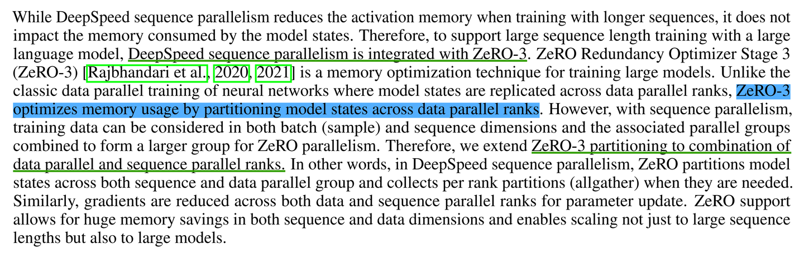
*DeepSpeed-Ulysses + Zero3*

### 0x06 정리

이 글에서는 Megatron-LM에서 자주 사용하는 Tensor Parallelism과 Sequence Parallelism의 원리를 간단히 설명했습니다. Sequence Parallelism 사용 전후의 per-layer activation memory 점유를 분석했고, Megatron-LM의 Sequence Parallelism은 자체 Tensor Parallelism과 함께 사용되어야 한다는 점도 보았습니다.

또한 도해 방식으로 DeepSpeed-Ulysses Sequence Parallelism 알고리즘 원리를 설명했습니다. 논문 설명에 따르면 DeepSpeed-Ulysses는 두 번의 All-To-All을 통해 sequence parallel을 구현하며, Megatron-LM의 Sequence Parallelism과 비교했을 때 더 낮은 통신량을 가집니다. 다만 실제 사용에서는 `head_num`이 P(GPU 수)로 나누어떨어져야 한다는 조건이 있습니다. `head_num`은 무한히 늘릴 수 없으므로 P는 실제로 `head_num`에 의해 제한됩니다.

더 많은 기술 노트와 CUDA 학습 노트는 LeetCUDA(CUDA Learn Notes with PyTorch)를 참고해 주세요. LeetCUDA에는 **LLM/VLM** 글 정리와 **FlashAttention, SGEMM, HGEMM, GEMV** 등 흔히 쓰이는 **CUDA Kernel**의 **예제 구현**이 포함되어 있으며, 현재 누적 **3k+ stars**를 달성했습니다. 링크: https://github.com/xlite-dev/LeetCUDA


*CUDA Learn Notes with PyTorch*

늘 그렇듯 오류가 있으면 먼저 올린 뒤 계속 수정하겠습니다.

## 참고

- [1] Reducing Activation Recomputation in Large Transformer Models: https://arxiv.org/pdf/2205.05198
- [2] DeepSpeed Ulysses: System Optimizations for Enabling Training of Extreme Long Sequence Transformer Models: https://arxiv.org/pdf/2309.14509
- [3] 图解大模型训练系列: 序列并行2, DeepSpeed Ulysses: https://zhuanlan.zhihu.com/p/4496065391
- [4] 图解大模型训练系列: 序列并行1, Megatron SP: https://zhuanlan.zhihu.com/p/4083427292
- [5] 大模型训练之序列并行双雄: DeepSpeed Ulysses & Ring-Attention: https://zhuanlan.zhihu.com/p/689067888
