# NVIDIA GPGPU (4) - 통신 아키텍처

> 원문: https://zhuanlan.zhihu.com/p/680262016

**목차**
- 들어가며
- NVLink 이전
  - 전통적 상호연결 통로의 한계 - PCIe는 너무 느리다
  - RDMA 네트워크의 개입 - IB / Mellanox 제품군
- 고속 상호연결 장치 - NVLink와 NVSwitch
  - NVLink
  - NVSwitch
- NCCL 소프트웨어 스택 개관
  - 기본 예제
  - 자원 준비
  - enqueue 호출 흐름
  - stream 메커니즘
- Fabric Manager 개관
  - FM이란
  - NVLink 초기화
  - FM 모드
  - 기본 흐름 스택
  - MIG와 Fabric Manager
  - DCGM
  - NVML
- Host driver의 역할
  - NVSwitch
  - NVLink
- 통신 토폴로지 종류
  - Ring
  - Tree
  - COLLNET-SHARP
- 세대별 네트워크 아키텍처
  - Cube-Mesh — 가장 단순한 토폴로지
  - DGX-1 — 비대칭 토폴로지
  - DGX-2 — switch 등장
  - DGX-A100
  - H100 SuperPod
  - GH200 SuperPod
- 부록 1: NVprof / profiling 도구
- 부록 2: PXN - PCI × NVLink

## 들어가며

본 글에서는 NVLink, NCCL, NVSwitch, GPGPU가 어떻게 맞물려 동작하는지를 다룹니다. 통신 시스템 자체와 그것이 계산과 어떻게 결합되는지에 초점을 둡니다. NVLink·NVSwitch 시스템은 NVIDIA GPGPU의 대규모 컴퓨팅과 초고연산 능력을 떠받치는 핵심이라 별도 장으로 정리할 가치가 있습니다.

이전 글:

- Bruce 仗劍走天涯: NVIDIA GPGPU (1) 총람
- Bruce 仗劍走天涯: NVIDIA GPGPU (2) 점점 범용화로
- Bruce 仗劍走天涯: NVIDIA GPGPU (3) 새 시대

## NVLink 이전

### 전통적 상호연결 통로의 한계 - PCIe는 너무 느리다

PCIe는 PCI의 확장으로 2001년 Intel이 발표한 원래 이름 3GIO(3rd Generation IO). 2002년 PCI-SIG가 통과시키며 PCI Express로 개명. 세대마다 대역폭이 두 배. PCIe Gen5는 lane당 32 Gbps(= 3938 MB/s), x16 = 64 GB/s. 2022년 Gen6는 lane당 64 Gbps, x16 1 Tbps 이상.

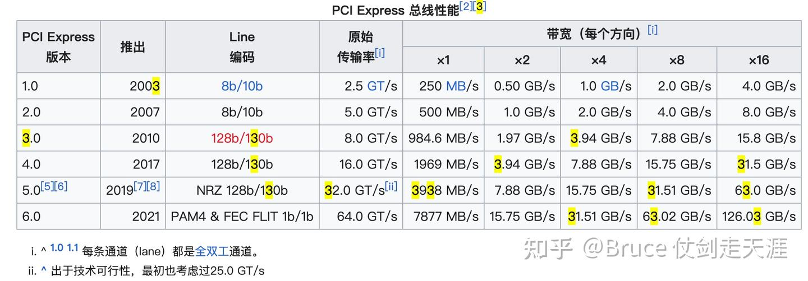

1세대 NVLink는 Pascal에 도입(2016). 당시 PCIe Gen3 x16은 128 Gbps(16 GB/s) — 그것도 머신 내 모든 장치가 공유. 1 머신 8 GPU 고성능 컴퓨팅 요구엔 한참 부족. 카당 16 Gbps(2 GB/s)에 NIC까지 가세하면 더 빈약.

**P100이 요구한 대역폭은 얼마인가? NVIDIA가 PCIe를 버리고 독자 고속 상호연결로 간 이유는?**

P100의 FP32 성능은 10.6 TFLOPS, 즉 초당 10.6×10¹² 회의 FP32 연산. 모든 피연산자가 GPU 외부에서 반입되고 재사용이 전혀 없다면 필요 대역폭은 10.6×10³ × 32 Gbps ≈ 40,000 GB/s. 실제로는 데이터 재사용이 있긴 하지만, 카당 2 GB/s만으로는 20,000배가 모자라 비현실적입니다.

2016년 NVLink v1은 어떤가? GPU당 NVLink 4개, 각 link 단방향 20 GB/s, 카당 양방향 160 GB/s. PCIe 3 x16 대비 2자릿수 향상 — 데이터 재사용 요구를 크게 완화.

### RDMA 네트워크의 개입 - IB / Mellanox 제품군

전통 PCIe 외에 CPU와 TCP 통로도 GPU 학습에서 대역폭 한계를 드러냈고, 이는 PCIe보다 일찍 드러났습니다. NVIDIA는 2012년 Kepler부터 데이터 전송에서 CPU를 우회하는 GPUDirect를 도입하고 RDMA 활용을 강조 → 후에 GPUDirectRDMA(GDR). 이후 10년간 HPC 영역은 TCP에서 RDMA NIC로 옮겨갔습니다.

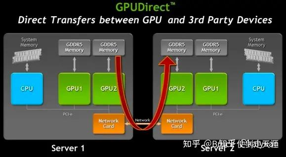
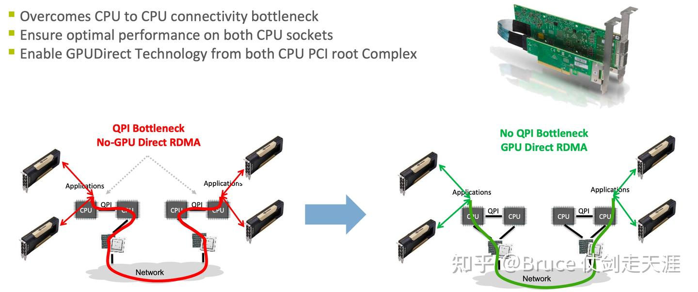

2020년 NVIDIA가 Mellanox를 인수, Ampere부터 Mellanox NIC·제품을 지원. RDMA 대역폭은 10 Gbps에서 CX7의 400 Gbps까지 발전.

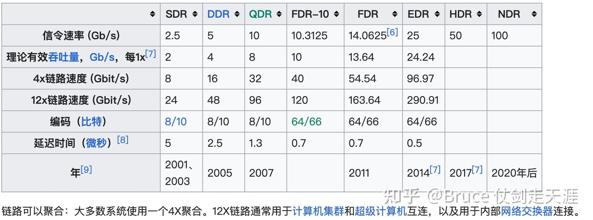

2009년 세계 500위 슈퍼컴퓨터 중 259대는 기가비트 이더넷, 181대가 InfiniBand. RDMA/IB 대역폭은 케이블 성능 향상과 함께 가파르게 상승해 CX7은 NDR × 4 = 400 Gbps. 2016년 Mellanox가 in-network 계산 프로토콜 SHARP를 제안 — 스위치에서 aggregation reduction을 수행해 reduce 연산을 오프로드. 2020년 인수 후 SHARP v2가 Mellanox 스위치에서 구현되었고, 현재 SHARP v3가 Quantum에서 사용됩니다. NCCL은 2019년부터 SHARP를 지원. 자세한 원리는 뒤에서.

**NV-SLI / SLI Bridge**

NVLink 이전에 알아둘 SLI(Scalable Link Interface). 초기 다중 GPU 상호연결. SLI로 연결된 GPU는 저장·연산을 공유. 브리지 부품을 **SLI Bridge** 라 함. NVLink는 SLI의 진화판이라 볼 수 있습니다. Turing에서 NVLink가 SLI를 다시 지원했지만 성능은 낮음(지원 채널 수 적음). 이후엔 SLI를 거의 언급하지 않아 하위 호환 목적으로 추정.

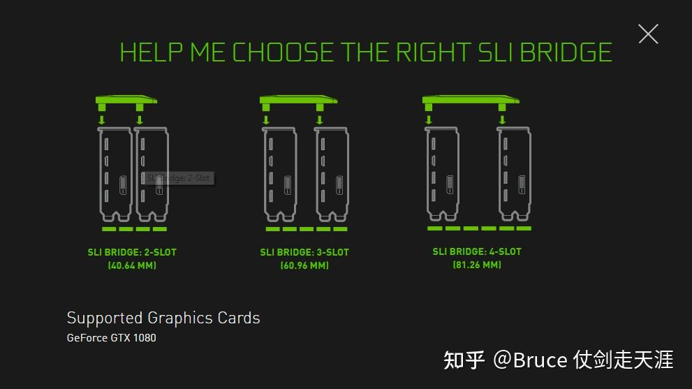

## 고속 상호연결 장치 - NVLink와 NVSwitch

### NVLink

Pascal 이래 4세대까지. lane당 대역폭과 link당 link 수가 꾸준히 증가.

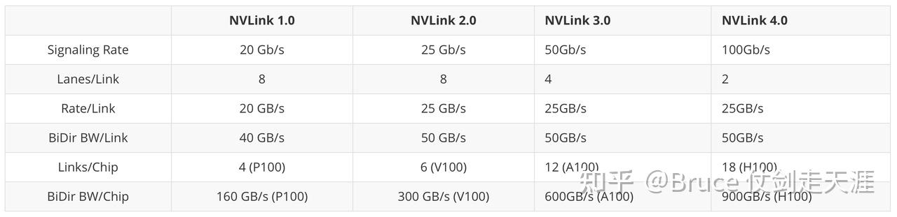

**V1**

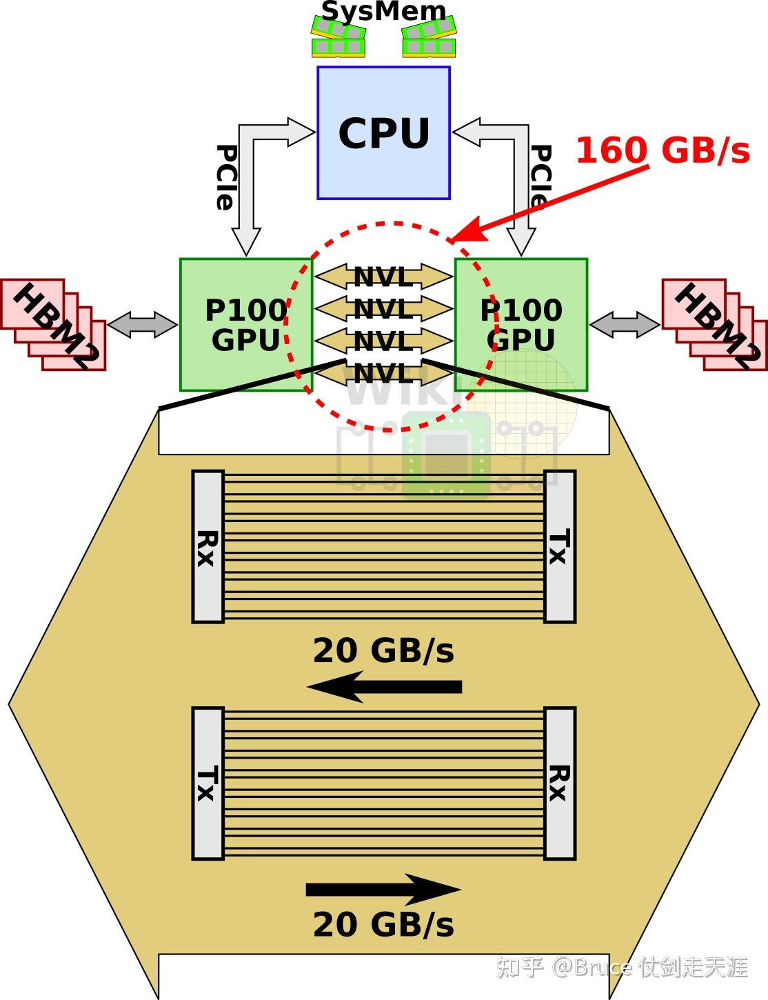

GPU-GPU, GPU-CPU 고속 상호연결. 상대 CPU/GPU 메모리에 직접 R/W 가능(모든 메모리가 공유 주소 공간에).

- 각 link 양방향, 한 방향 8 lane, lane당 최대 20 Gbps, link당 단방향 20 GB/s, 양방향 40 GB/s
- 단일 GPU(P100) 4 NVLink, 총 양방향 160 GB/s
- load/store 의미 제공, peer GPU 메모리 R/W 가능, atomic도 지원
- 패킷 기반 프로토콜, 가변 길이
- 멀티 큐 미지원, 멀티 VC(virtual channel) 지원
- Flow control: 요청 패킷에 credit 포함
- CRC로 데이터 오류 검출
- Replay: Go-back-N 재전송
- 일부 CPU(IBM Power 시리즈)만 상호연결 지원

**프로토콜**

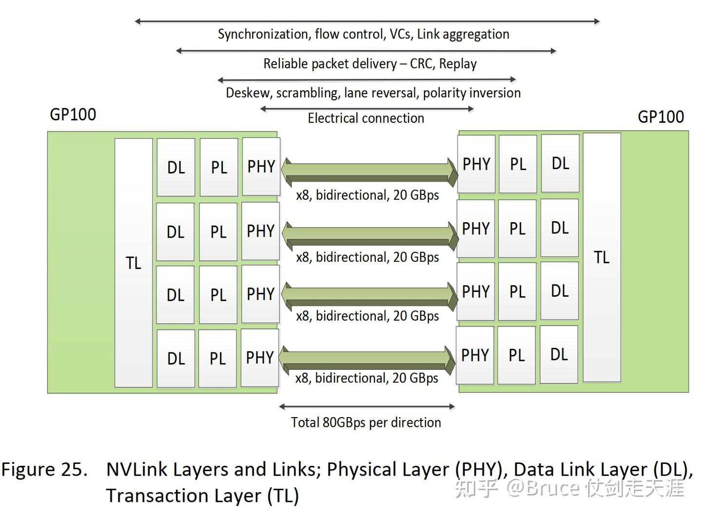

PCIe와 비슷하게 Physical / Data Link / Transaction Layer 3계층.

- Physical Layer: PHY 접속, deskew, framing, (de)scrambling, polarity inversion, lane reversal
- Data Link Layer: CRC/ACK로 신뢰성 전송
- Transaction Layer: 동기, link flow control, VC, 여러 NVLink 결합

**패킷 형식**

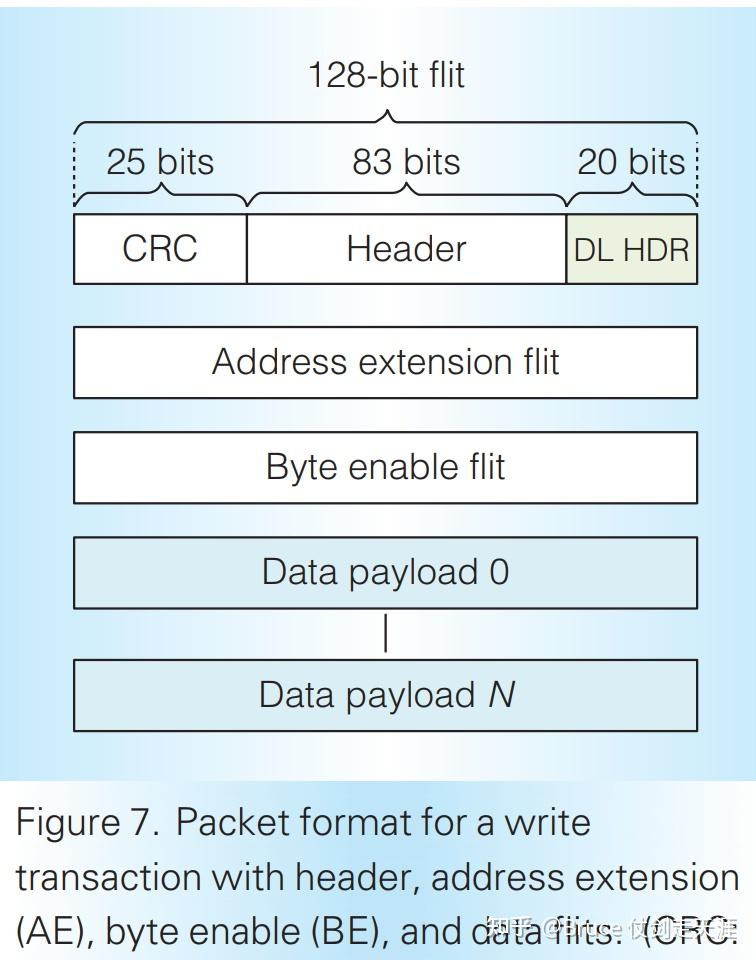
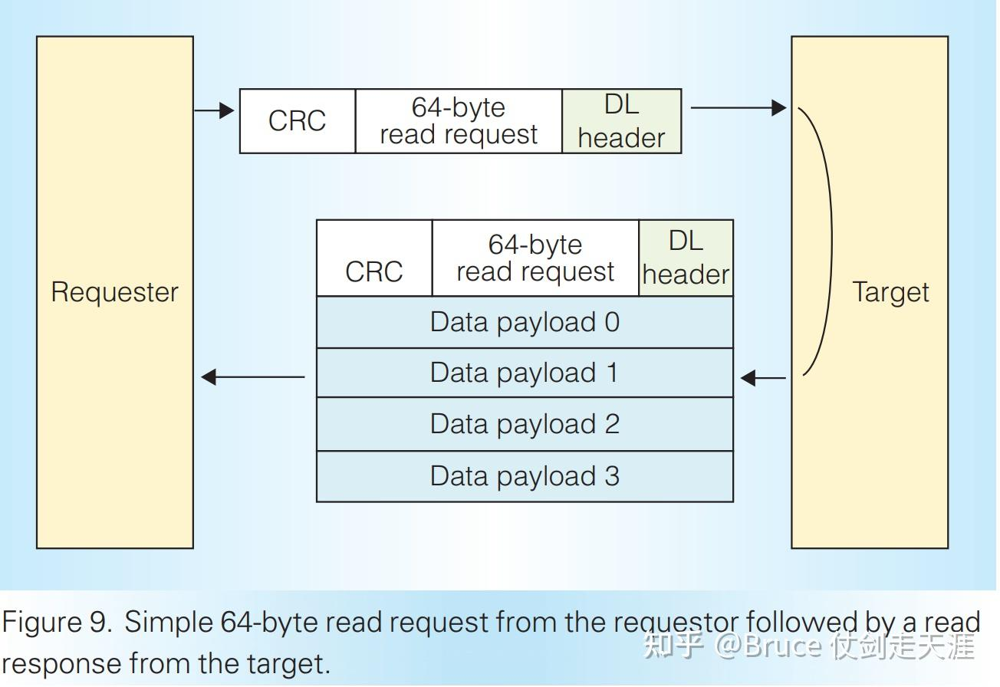

- transaction 당 request 1, response 1 이상(Posted operation 제외)
- 128 bit 단위(flit), 패킷당 1~18 flit, 데이터 flit 0~16개 → 최대 256 B 데이터
- 헤더 3부분: CRC, Header(request type, address, flow credit, tag), DL Header(ack id, length, app number tag)
- AE(선택): command-specific 정보 전달 또는 default 변경, **변할 때만 전송**
- BE(선택): write/atomic의 바이트 마스크

**CRC와 재전송**

- CRC 성공 → positive ack, 실패 → ack 없음
- 요청 측 데이터는 replay buffer에 캐시
- 올바른 ack 시퀀스 수신 시 replay buffer에서 제거
- 잘못된 ack 시퀀스 / timeout → 마지막 ack된 패킷부터 재전송 (Go-back-N)

**다른 모듈과의 접점**

NVLink는 High Speed Hub를 통해 다른 모듈과 연결. HSHub는 GPU의 Crossbar, High Speed Copy Engine, PCIe 등에 연결. Copy Engine은 PCIe / NVLink 중 선택 가능.

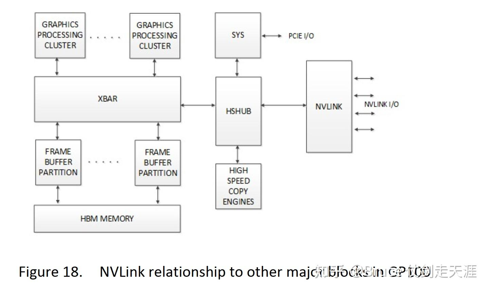

**기본 토폴로지**

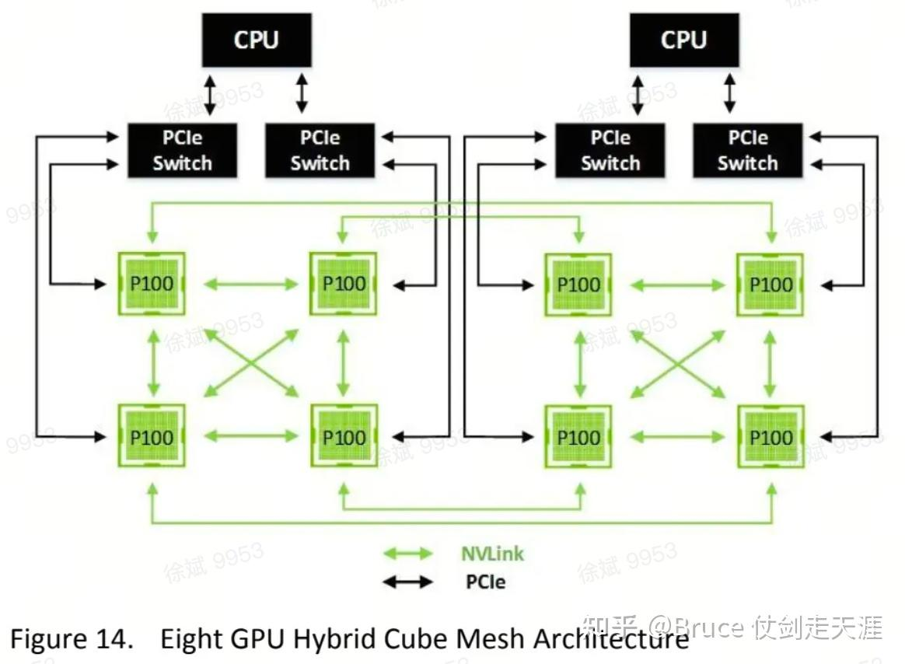
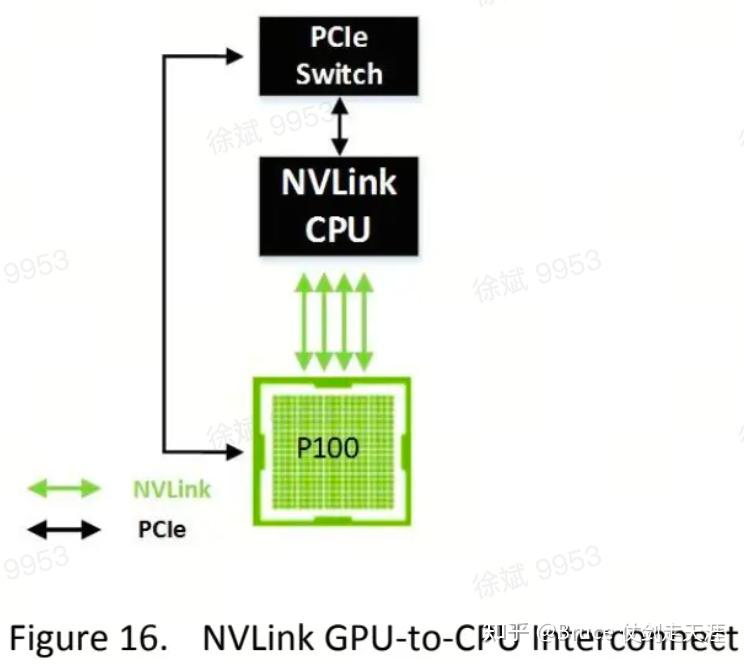
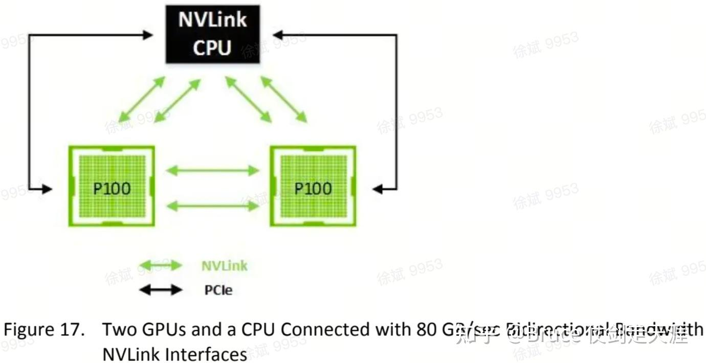

**V2** (Volta, V100)

- NVLink당 40 → 50 GB/s, GPU당 NVLink 6개, 총 300 GB/s
- low-power 모드 지원
- CPU 측 강화: 캐시 일관성 향상, CPU의 nvlink로 캐시 read, GPU-CPU atomic 보강, ATS 지원

IBM과의 협업으로 슈퍼컴퓨터를 노려 CPU 측 보강이 많은 세대. GPU 측은 규격 키움. NVSwitch 1.0 등장도 이 세대.

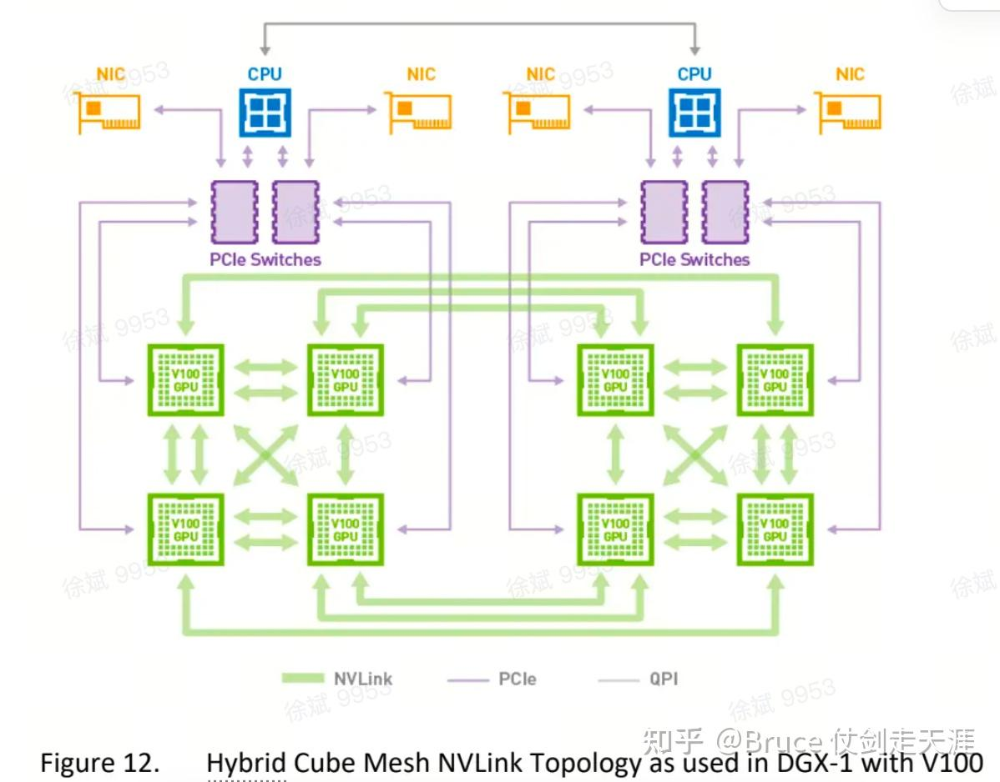
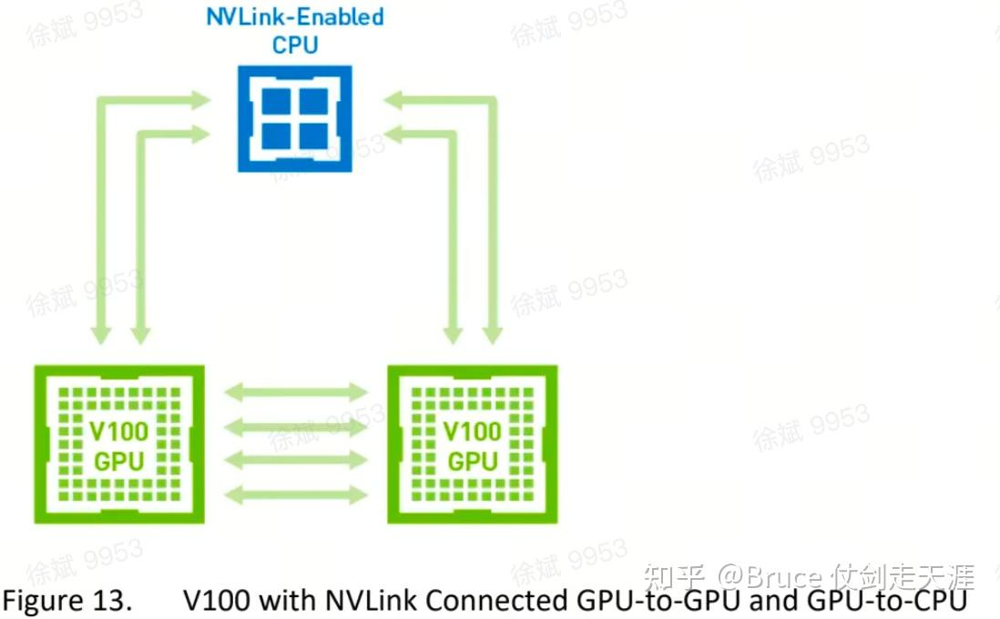

**V3** (Ampere)

무손실, 고대역폭, 저지연 공유 메모리 상호연결. link-level 에러 검출 + replay로 신뢰성.

- 대역폭 증가, 신호선 절반, GPU당 NVLink 12개
- 에러 검출·복구 강화
- Write가 non-posted로 변경되어 요청 측 동기·에러 처리 개선
- 작은 payload write와 데이터 없는 response 효율 최적화

**V4** (Hopper)

- 단일 NVLink가 2 lane으로 단방향 25 GB/s, GPU당 NVLink 18개, 총 900 GB/s — 직전 1.5배
- 다중 노드 클러스터 지원을 위해 **NVLink Network** 도입
- 모든 GPU가 주소 공간을 공유하던 모델에서 벗어나 **Network Address Space** 도입(GPU 주소 공간과 격리), H100은 주소 변환 지원
- IB처럼 user software가 연결을 먼저 수립해야 함

### NVSwitch

Volta 이래 3세대까지.

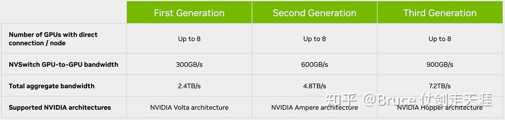

**V1**

독립 NVLink 칩. NVLink 2.0 기준 양방향 50 GB/s × 18 port = **총 900 GB/s**. 전력 100 W, TSMC 12 nm FinFET FFN 커스텀 공정(16 nm 향상판), 2 b 트랜지스터.

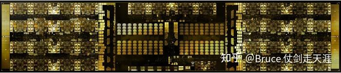

다이는 4 cm² 1940 pin BGA. 576 pin이 18 NVLink 전용, 나머지는 전력·관리(x4 PCIe, I²C, GPIO 등).

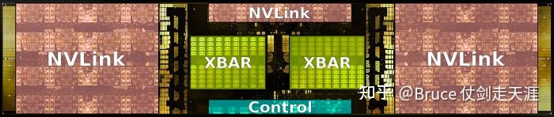

18 port 덕에 16-GPU 완전 비차단 시스템 설계 가능. V100 1장당 6 NVLink를 6 NVSwitch에 분산해 8 V100 + 6 NVSwitch로 baseboard 구성.

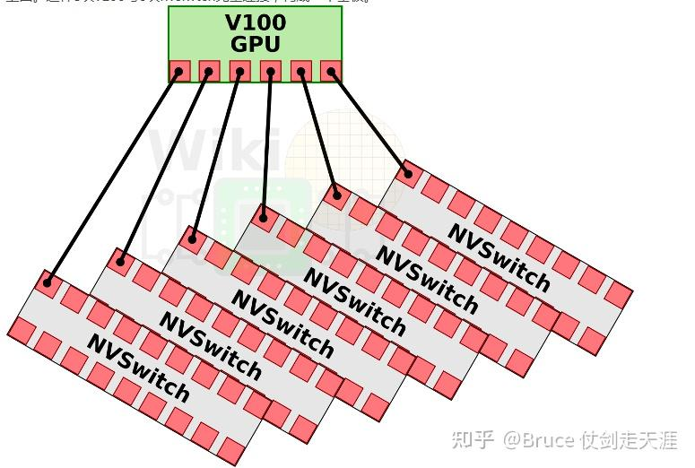

**V2**

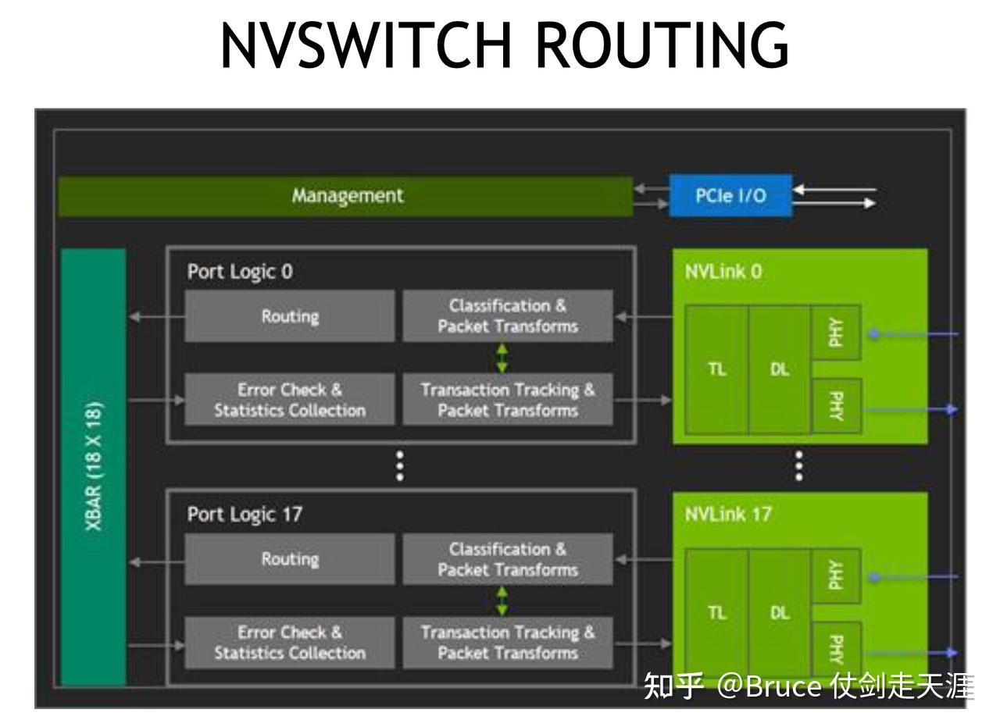

switch당 18 link.

**V3**

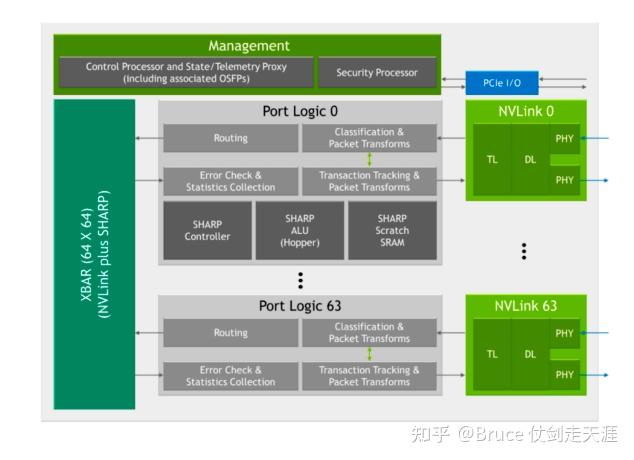

- 단일 칩 64 port, 12.8 Tbps
- 노드 내·외 어디에나 배치 가능
- 집단 통신 하드웨어 가속 — multicast와 SHARP. allreduce, reduce_scatter 가속
- 2-hop 스위칭: L1 NVSwitch ↔ GPU는 NVLink, L2 스위치 연결은 OSFP
- 칩당 64 NVLink → 4 NVLink가 1 OSFP, 즉 16 OSFP

## NCCL 소프트웨어 스택 개관

NCCL 자체는 매우 복잡. OneFlow의 NCCL 시리즈 추천. 본 글은 GPU·NVLink 링크에 한정.

### 기본 예제

집단 통신 예:

```cpp
int main(int argc, char* argv[]) {
    int size = 32*1024*1024;
    int myRank, nRanks, localRank = 0;

    MPICHECK(MPI_Init(&argc, &argv));
    MPICHECK(MPI_Comm_rank(MPI_COMM_WORLD, &myRank));
    MPICHECK(MPI_Comm_size(MPI_COMM_WORLD, &nRanks));

    // localRank 결정 (GPU 선택용)
    uint64_t hostHashs[nRanks];
    char hostname[1024];
    getHostName(hostname, 1024);
    hostHashs[myRank] = getHostHash(hostname);
    MPICHECK(MPI_Allgather(MPI_IN_PLACE, 0, MPI_DATATYPE_NULL,
                           hostHashs, sizeof(uint64_t), MPI_BYTE, MPI_COMM_WORLD));
    for (int p = 0; p < nRanks; p++) {
        if (p == myRank) break;
        if (hostHashs[p] == hostHashs[myRank]) localRank++;
    }

    int nDev = 2;
    float** sendbuff = (float**)malloc(nDev * sizeof(float*));
    float** recvbuff = (float**)malloc(nDev * sizeof(float*));
    cudaStream_t* s = (cudaStream_t*)malloc(sizeof(cudaStream_t)*nDev);

    for (int i = 0; i < nDev; ++i) {
        CUDACHECK(cudaSetDevice(localRank*nDev + i));
        CUDACHECK(cudaMalloc(sendbuff + i, size * sizeof(float)));
        CUDACHECK(cudaMalloc(recvbuff + i, size * sizeof(float)));
        CUDACHECK(cudaMemset(sendbuff[i], 1, size * sizeof(float)));
        CUDACHECK(cudaMemset(recvbuff[i], 0, size * sizeof(float)));
        CUDACHECK(cudaStreamCreate(s+i));
    }

    ncclUniqueId id;
    ncclComm_t comms[nDev];
    if (myRank == 0) ncclGetUniqueId(&id);
    MPICHECK(MPI_Bcast((void*)&id, sizeof(id), MPI_BYTE, 0, MPI_COMM_WORLD));

    NCCLCHECK(ncclGroupStart());
    for (int i = 0; i < nDev; i++) {
        CUDACHECK(cudaSetDevice(localRank*nDev + i));
        NCCLCHECK(ncclCommInitRank(comms+i, nRanks*nDev, id, myRank*nDev + i));
    }
    NCCLCHECK(ncclGroupEnd());

    NCCLCHECK(ncclGroupStart());
    for (int i = 0; i < nDev; i++)
        NCCLCHECK(ncclAllReduce((const void*)sendbuff[i], (void*)recvbuff[i],
                                size, ncclFloat, ncclSum, comms[i], s[i]));
    NCCLCHECK(ncclGroupEnd());

    for (int i = 0; i < nDev; i++) CUDACHECK(cudaStreamSynchronize(s[i]));

    for (int i = 0; i < nDev; i++) {
        CUDACHECK(cudaFree(sendbuff[i]));
        CUDACHECK(cudaFree(recvbuff[i]));
    }
    for (int i = 0; i < nDev; i++) ncclCommDestroy(comms[i]);

    MPICHECK(MPI_Finalize());
    printf("[MPI Rank %d] Success \n", myRank);
    return 0;
}
```

핵심:

- communicator 생성 — 통신 작업의 단위
- rank 결정 — MPI 프로세스 간 토폴로지 관계 확정
- rank ↔ device 바인딩 (`setdevice`)
- group 단위로 집단 통신 제출
- 비동기 완료 통지

이 예제가 다루지 않는 초기화 부분:

- 머신의 GPU·NVLink 발견
- GPU·NVLink·NVSwitch 초기화
- GPU 간 통신 가능 토폴로지 구축
- 통신 데이터량에 맞춰 NVLink 수 선택
- 하드웨어로 통신 작업 디스패치
- 계산과 통신의 연관성

초기화·예외는 FM 장에서, 본 절은 통신 작업 관련 질문에 집중.

### 자원 준비

**토폴로지 구축** (`getUniqueId`)

먼저 머신의 모든 통신 장치(NIC, QPI/CPU, PCIe RC·switch, NVLink/NVSwitch/GPU)를 탐사하고 active 상태에 따라 통신 가능 그래프를 만듭니다. 노드 수와 경로 수, 도달성을 확정.

**토폴로지 계산** (`commRankInit`)

발견된 그래프에서 노드 간 최적 경로(대역폭 최대 기준) 탐색. 모든 경로를 다 점유하지는 않음. 단일 작업이 대역폭을 다 채우면 활용률이 떨어지므로 부하·경로 균형이 핵심.

**CommRankInit**

`commID`와 `rankId`를 GPU에 할당. 그 후 GPU가 link 통신을 시작할 때 자신의 통신 범위를 알아 멀티캐스트로 진행해 불필요한 대역폭 점유를 줄임.

```cpp
NCCL_API(ncclResult_t, ncclCommInitRank, ncclComm_t* newcomm, int nranks, ncclUniqueId commId, int myrank);
ncclResult_t ncclCommInitRank(ncclComm_t* newcomm, int nranks, ncclUniqueId commId, int myrank) {
    (void)ncclCudaLibraryInit();
    int cudaDev;
    ncclConfig_t config = NCCL_CONFIG_INITIALIZER;
    CUDACHECK(cudaGetDevice(&cudaDev));
    NvtxParamsCommInitRank payload{myrank, nranks, cudaDev};
    NVTX3_FUNC_WITH_PARAMS(CommInitRank, CommInitRankSchema, payload)
    NCCLCHECK(ncclCommInitRankDev(newcomm, nranks, commId, myrank, cudaDev, &config));
    return ncclSuccess;
}
```

최종적으로 `CommInitRankDev`는 async job으로 GPU(cudaLaunch)에 내려가 설정을 완료. `commId`와 `nRanks`는 외부에서 주어진 값으로, 상위 통신 환 구축 과정에서 계산.

`CommInitRank`는 rank ↔ comm 대응 device를 확정하고 comm의 stream 객체를 구성 — 즉 **NCCL 각 communicator는 자기 stream**을 가집니다. 코드 추적:

```
CommInitRankDev → CommInitRankFunc → CommAlloc → ncclStrongStreamConstruct
                              → cudaStreamCreateWithFlags, cudaEventCreateWithFlags
```

**ComputeChannel**

전역 그래프와 자기 통신 범위를 알았으니, 작업별 link 수(정적 대역폭)를 계산. 통신 작업의 최종 실행은 cudaLaunchKernel이라 grid·block을 정해야 함. channel·thread 결정이 grid·block에 매핑.

- thread당 전송 가능 데이터에 참고값 → 작업당 thread 수 결정
- Channel은 thread 상위 개념 — grid:block 관계
- 최적 대역폭 달성을 위한 최소 channel·thread 수 탐색. 먼저 channel 줄이고, 1이 되면 thread 줄임(단위는 warp)
- 주 통신 thread 외에 관리·동기 warp도 — ring은 1, tree는 2

계산된 channel 수만큼 launch kernel. 각 channel = 1 grid. block 크기로 thread 수 계산. launch마다 plan(자원 정보) → launch는 plan 제출.

또한 모든 작업은 group 단위 스케줄. 사용자가 호출할 때 즉시 GPU로 가는 게 아니라 group 종료 후 비동기로 디스패치.

### enqueue 호출 흐름

```cpp
NCCL_API(ncclResult_t, ncclReduce, const void* sendbuff, void* recvbuff, size_t count,
    ncclDataType_t datatype, ncclRedOp_t op, int root, ncclComm_t comm, cudaStream_t stream);
ncclResult_t ncclReduce(...) {
    ...
    struct ncclInfo info = {
        ncclFuncReduce, "Reduce",
        sendbuff, recvbuff, count, datatype, op, root, comm, stream,
        REDUCE_CHUNKSTEPS, REDUCE_SLICESTEPS
    };
    return ncclEnqueueCheck(&info);
}
```

호스트가 비동기로 job(통신 명령 포함)을 제출, 큐·그룹 스케줄을 거쳐 cudaLaunchKernel로 GPU에 전달. GPU 내부 MCU가 device 코드를 실행. 즉 NVLink 실제 송수신은 device 측에서 발생.

서로 다른 통신 원시(reduce, gather, allreduce, scatter)는 인터페이스만 다를 뿐 메커니즘은 같음.

서로 다른 통신 유형(peer2peer, collective)은 큐도 다름. 각 통신은 큐 태스크로 변환되고 NCCL이 plan(채널/grid, thread/warp 등)을 편성.

### stream 메커니즘

**Communicator의 stream**

```cpp
if (parent == NULL || !parent->config.splitShare) {
    struct ncclSharedResources* sharedRes = NULL;
    NCCLCHECK(ncclCalloc(&sharedRes, 1));
    sharedRes->owner = comm;
    sharedRes->tpNRanks = comm->nRanks;
    NCCLCHECK(ncclCalloc(&sharedRes->tpRankToLocalRank, comm->nRanks));
    NCCLCHECK(ncclStrongStreamConstruct(&sharedRes->deviceStream));
    NCCLCHECK(ncclStrongStreamConstruct(&sharedRes->hostStream));
    comm->sharedRes = sharedRes;
    sharedRes->refCount = 1;
} else {
    comm->sharedRes = parent->sharedRes;
    ncclAtomicRefCountIncrement(&parent->sharedRes->refCount);
}
```

이 communicator의 stream: `hostStream`은 proxy 부분(RDMA/TCP)에 대응, `deviceStream`은 NVLink 부분 kernel code에 대응.

**작업의 stream**

`ncclReduce`의 시그니처에 외부 stream을 받음. 왜? 외부 stream(작업의 stream)일 가능성이 높음. CUDA Graph 능력 때문 — graph는 stream 간 협동을 허용.

`taskAppend`에서 `comm->task` stream과 `info->stream`이 일치하는지 판단. 일치하면 같은 stream, 아니거나 task가 비어 있으면 `info->stream`을 할당. 한 comm에서 여러 task가 실행되면 stream list를 FIFO로 유지.

```cpp
if (info->stream != tasks->streamRecent || tasks->streams == nullptr) {
    tasks->streamRecent = info->stream;
    struct ncclCudaStreamList* l = tasks->streams;
    while (true) {
        if (l == nullptr) {
            struct ncclCudaGraph graph;
            NCCLCHECK(ncclCudaGetCapturingGraph(&graph, info->stream))
            if (tasks->streams != nullptr && !ncclCudaGraphSame(tasks->capturingGraph, graph)) {
                WARN("Streams given to a communicator within a NCCL group must either be all uncaptured or all captured by the same graph.");
                return ncclInvalidUsage;
            }
            tasks->capturingGraph = graph;
            l = ncclMemoryStackAlloc<struct ncclCudaStreamList>(&comm->memScoped);
            l->stream = info->stream;
            l->next = tasks->streams;
            tasks->streams = l;
            break;
        }
        if (l->stream == info->stream) break;
        l = l->next;
    }
}
```

**Launch 시 stream 관계**

```
// Semantically:
//   1. Launch host task on hostStream.
//   2. Launch kernel, depends on {deviceStream, hostStream, userStream[i]...}
//   3. {deviceStream, userStream[i]...} depend on kernel.
// Realized by:
//   1. userStream[0] waits on deviceStream
//   2. deviceStream waits on each of userStream[1...]
//   3. host task launch on hostStream
//   4. userStream[0] waits on hostStream
//   5. kernel launch on userStream[0]
//   6. deviceStream waits on userStream[0]
//   7. userStream[1...] each waits on deviceStream
```

NVLink는 `deviceStream`, RDMA/TCP는 `hostStream`. 둘 다 task stream과 의존 관계.

**계산-통신 관계**

위 stream 흐름에서 CUDA Graph의 그림자가 보임. `taskAppend`에서 stream의 graph를 시도해 가져옴(없으면 null).

```cpp
NCCLCHECK(ncclCudaGetCapturingGraph(&graph, info->stream))
```

이 task는 통신만 담당하지만 외부에서 전달된 stream의 graph는 계산일 수도, 상위 프레임워크일 수도 있음. `ncclStrongStreamAcquire`/`ncclStrongStreamWaitStream`은 graph가 0이어도 허용(event 로직만 동작).

```cpp
ncclResult_t ncclStrongStreamAcquire(struct ncclCudaGraph graph, struct ncclStrongStream* ss) {
#if CUDART_VERSION >= 11030
    bool mixing = ncclParamGraphMixingSupport();
    if (graph.graph == nullptr) {
        if (mixing && ss->everCaptured) {
            CUDACHECK(cudaStreamWaitEvent(ss->cudaStream, ss->serialEvent, 0));
            ss->serialEventNeedsRecord = false;
        }
    } else {
        ss->everCaptured = true;
        struct ncclStrongStreamGraph** pg = &ss->graphHead;
        struct ncclStrongStreamGraph* g;
        while (*pg != nullptr) {
            g = *pg;
            if (g->graphId == graph.graphId) {
                *pg = g->next;
                g->next = ss->graphHead;
                ss->graphHead = g;
                return ncclSuccess;
            } else if (false == __atomic_load_n(&g->alive, __ATOMIC_ACQUIRE)) {
                *pg = g->next;
                ncclStrongStreamGraphDelete(g);
            } else {
                pg = &g->next;
            }
        }
    }
#endif
    ...
}
```

task의 stream이 graph 안이면 comm stream도 graph 안에서 같이 실행. 아니면 stream들이 event-wait로 동기.

```cpp
cudaStream_t launchStream = tasks->streams->stream;
NCCLCHECKGOTO(ncclStrongStreamAcquire(tasks->capturingGraph, &comm->sharedRes->deviceStream), result, failure);

for (struct ncclCudaStreamList* l = tasks->streams->next; l != nullptr; l = l->next) {
    NCCLCHECKGOTO(ncclStrongStreamWaitStream(tasks->capturingGraph, &comm->sharedRes->deviceStream, l->stream), result, failure);
}
NCCLCHECKGOTO(ncclStrongStreamWaitStream(tasks->capturingGraph, launchStream, &comm->sharedRes->deviceStream), result, failure);
```

마지막 의문: NCCL은 결국 cudaLaunch를 호출하는데, graph 실행은 graphLaunch가 필요. 어떻게 처리? graph가 있으면 그 task를 persistent task로 보고 GPU에 복사하고 NCCL clean group 시 우회. 이후 흐름은 미상.

결론: 계산과 통신은 한 graph에 둘 수 있고, 협동 가능합니다. (이전 시리즈의 CUDA Graph 설명 참고)

## Fabric Manager 개관

NCCL 외에 GPU의 가용성을 가능케 하는 것이 Fabric Manager.

### FM이란

FM은 NVSwitch memory fabric을 구성해 참여 GPU 사이에 메모리 fabric을 형성하고, 이를 지탱하는 NVLink를 모니터링. 책임:

- NVSwitch port 간 라우팅 구성
- GPU 드라이버와 함께 GPU 초기화
- fabric 내 NVLink·NVSwitch 오류 모니터링

ALI(Autonomous Link Initialization) 미지원 시스템(1·2세대 NVSwitch, H100 이전)에선 추가로:

- NVSwitch 드라이버와 협력해 NVSwitch-NVSwitch NVLink 학습
- GPU 드라이버와 협력해 NVSwitch-GPU NVLink 학습

### NVLink 초기화

NVIDIA GPU와 NVSwitch memory fabric은 PCIe endpoint device로 NVIDIA 커널 드라이버가 필요. ALI 미지원(DGX-2, HGX-2, DGX A100, HGX A100)에선 시스템 부팅 후 드라이버 로드 시 NVLink 활성화, FM이 구성. 응용이 FM 초기화 전에 시작되거나 FM이 실패하면 CUDA 초기화가 `cudaErrorSystemNotReady` 오류로 실패.

ALI 지원(DGX H100, HGX H100)에선 NVLink가 GPU와 NVSwitch 하드웨어 차원에서 학습되어 FM이 불필요. NVLink peer 지원을 위해 GPU가 NVLink fabric에 등록되어야 함. 등록 실패 시 peer 능력 상실 — non-peer 용도로만 사용. 등록 완료 후 CUDA 초기화 시작.

### FM 모드

주요 4(+1) 모드:

- 초기화 실패 시
- Access link 실패 (GPU ↔ NVSwitch NVLink)
- Trunk link 실패 (스위치 간 OSFP)
- Switch 자체 실패
- FM 중단 시 job 동작 (GPU 작업 실패)

세부 실패 유형은 fabric-manager-user-guide.pdf 부록 D.

### 기본 흐름 스택

운영 관점 전체 스택: NVML(nvidia-smi, monitor API), DCGM(monitor backend agent), FM service(backend service), GPU & NVSwitch driver, BMC 등.

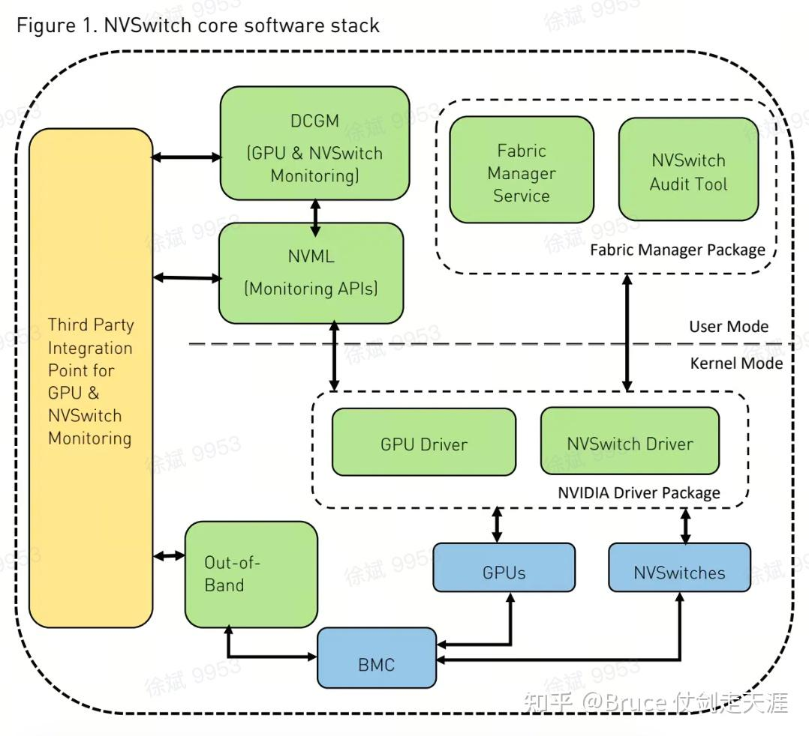

### MIG와 Fabric Manager

MIG는 A100/H100을 여러 독립 GPU 인스턴스로 분할(각 인스턴스 자체 메모리·캐시·SM). MIG 활성화 시 GPU NVLink는 비활성, NVLink P2P 상실. MIG 비활성화 후엔 NVLink P2P 복구.

NVSwitch DGX/HGX에서 FM 서비스는 MIG 인스턴스와 함께 동작. MIG 비활성화 후 NVLink peer 복구를 위해 FM이 반드시 실행 중이어야 함. DGX A100 / HGX A100에선 MIG 활성 시 NVLink·NVSwitch 측 link가 down, MIG 비활성 시 재학습. DGX H100 / HGX H100에선 MIG 동안에도 NVLink가 active 유지.

### DCGM

NVIDIA Data Center GPU Manager — 클러스터 환경의 GPU 관리·모니터링 도구 모음. 능동 헬스 모니터링, 진단, 시스템 경보, 거버넌스(전력·클럭 등), link 상태, GPU 작업 상태 모니터링.

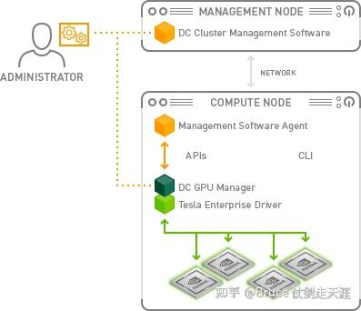

https://docs.nvidia.com/datacenter/dcgm/1.6/pdf/dcgm-user-guide.pdf

### NVML

관리 도구. 실제 도구는 `nvidia-smi`. 온도·전압, 보드 타입 ID 등, GPU 활용률·활성 CE 수.

https://developer.download.nvidia.cn/assets/cuda/files/CUDADownloads/NVML/nvml.pdf

`nvidia-smi topo -m`으로 머신 토폴로지도 확인 가능.

## Host driver의 역할

NVLink·NVSwitch host driver는 주로 FM·NVML을 위한 것으로 실제 데이터 평면 동작과는 무관. 설정·관리 정보 위주.

### NVSwitch

NVSwitch driver의 기능은 단순:

- NVSwitch 초기화(probe)·디이니셜라이즈
- 관리 기능:
  - 정보 획득 (온도·BIOS·각종 버전·내부 지연·하드웨어 설정·카운터·상태·오류·I²C 등)
  - 접근 (ingress/egress request/response table, link table, link config 등)
  - 트래픽 (패킷·대역폭 통계)
  - 접근 제어 (라우팅·블랙리스트 변경, 레지스터 직접 R/W)
  - 오류 클리어

### NVLink

조금 더 복잡하지만 기본 부류는:

- GPU와 NVLink 관계 바인딩 (add/remove)
- NVLink 초기화·학습
- NVLink topo 발견 (FM·NVML이 topo와 상대 link 정보 요구)
- NVLink 연결 상태
- NVLink 모드 변화 (low power 등)

장치 관리 능력이 주. NVOC(NVIDIA 내부 시럽 문법) 캡슐화 때문에 가독성이 떨어지는 면이 있음.

## 통신 토폴로지 종류

### Ring

GPU를 ring 형태로 조직. A, B, C라면 A→B, B→C, C→A. 주로 NVLink(물리 토폴로지) 환경에 사용.

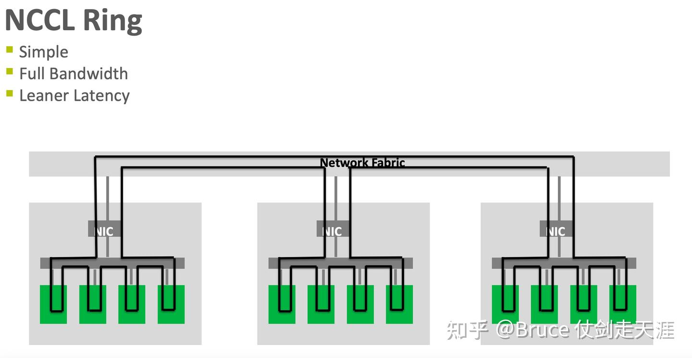

### Tree

데이터센터의 fat tree에 가까움. 주로 데이터센터 네트워크에서 사용.

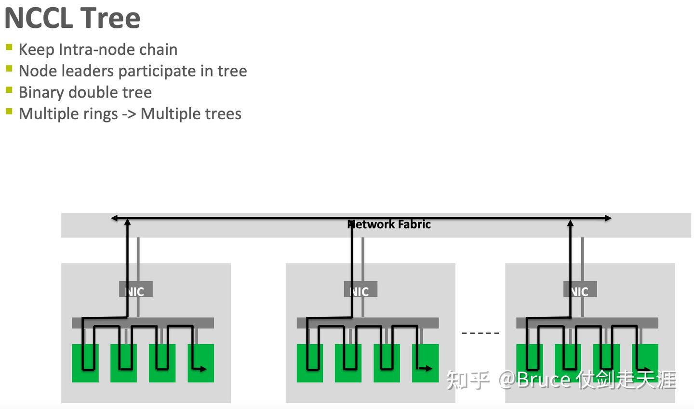

### COLLNET-SHARP

SHARP는 reduce를 in-network로 최적화하는 아키텍처. 스위치에 reduce를 오프로드해 통신 부담·횟수를 줄이고 유효 대역폭을 늘리며 지연을 단축.

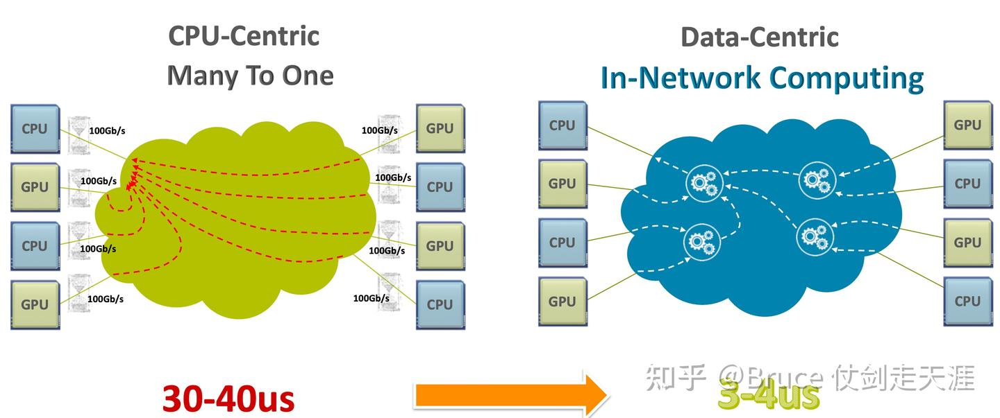
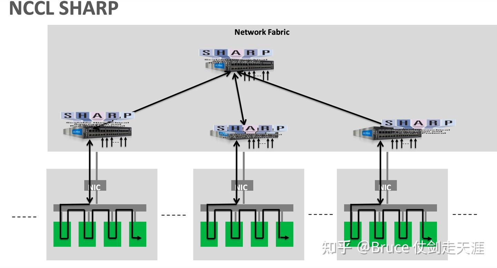
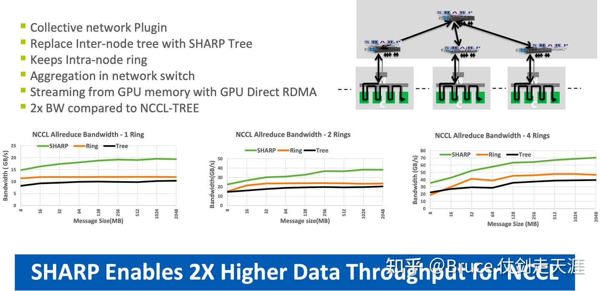

## 세대별 네트워크 아키텍처

### Cube-Mesh — 가장 단순한 토폴로지

link 균일.

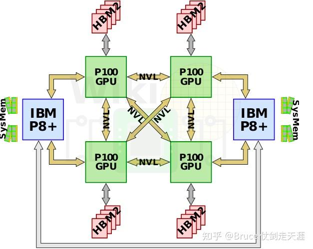

### DGX-1 — 비대칭 토폴로지

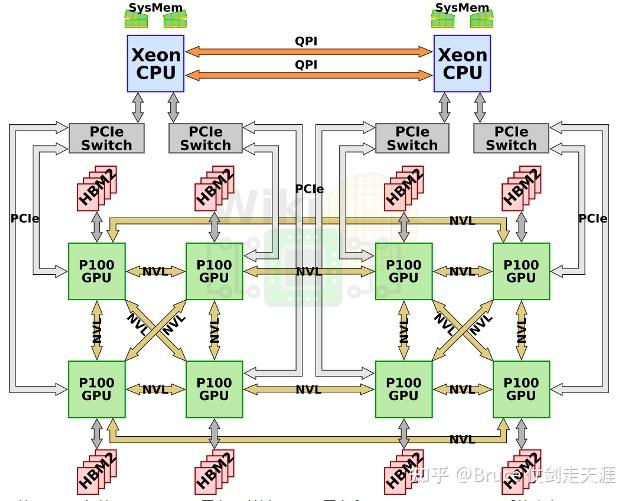
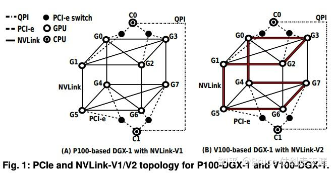

V100과 P100의 차이 — P100은 cube의 모든 에지가 1 link, V100은 노드당 2 에지가 2 link, 2 에지가 1 link. cube의 일부 GPU는 2-hop이고 일부는 1-hop이라 지연이 두 배 차이. 이 토폴로지를 cube-mesh라 부르는 이유.

### DGX-2 — switch 등장

GTC 2018 발표. V100 16장(HBM2 32 GB × 16 = 512 GB), CPU는 듀얼 2.7 GHz 24코어 Xeon 8168.

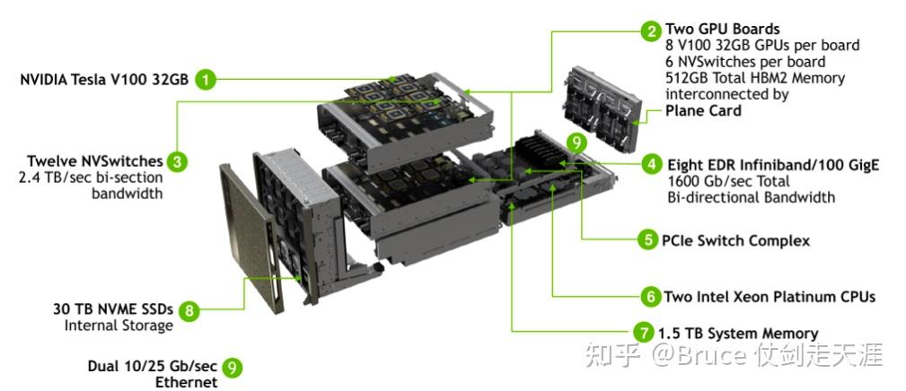

두 베이스보드가 NVSwitch의 나머지 port를 통해 완전 상호연결 → 16-GPU 전연결 구조. 두 베이스보드 NVSwitch 사이 8 link, 16 GPU 각 6 NVLink → 총 양방향 2400 GB/s. 흥미롭게도 NVSwitch는 18 port인데 16만 사용. IBM Power9 지원 여지로 추정.

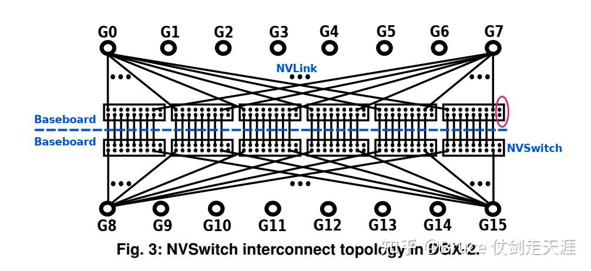

각 NVSwitch는 18×18 crossbar:

- 8 port: 베이스보드 내 통신
- 8 port: 상대 베이스보드와 통신
- 2 hop 필요하지만 양쪽 스위치가 절반 직접 연결되어 1 hop처럼 동작
- 나머지 2 port 예약

### DGX-A100

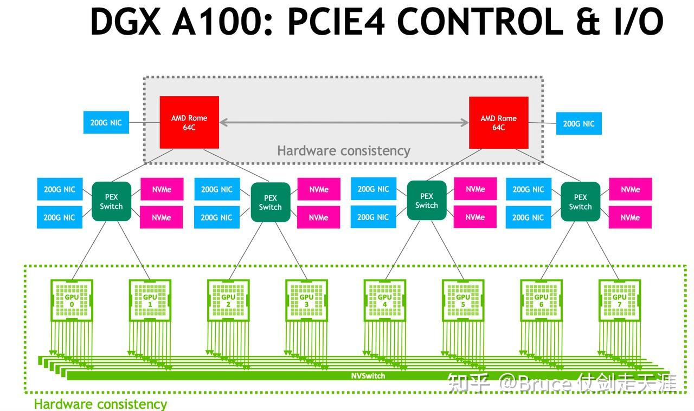

### H100 SuperPod

NVSwitch 수렴비 ingress:egress = 2:1.

머신 1대 = H100 8장 + NVSwitch 4개. H100 18 link를 5/4/4/5로 4 L1 NVSwitch에 연결. 각 NVSwitch 단일 칩, 칩당 64 link.

머신 내 L1 NVSwitch 4개의 연결 수가 달라 link당 50 GB/s 기준 ingress가 각각 2 TB/s, 1.6 TB/s, 1.6 TB/s, 2 TB/s (link 40, 32, 32, 40).

L1 → L2 스위치 연결은 OSFP, OSFP 1개 = 4 link, 200 Gbps. egress 2:1 수렴이라 각각 1, 0.8, 0.8, 1 TB/s — OSFP 5, 4, 4, 5개 = link 20, 16, 16, 20.

L1 link 활용: (40+20)/64, (32+16)/64, (32+16)/64, (40+20)/64.

SuperPod 32대 = 32 × (1 + 0.8 + 0.8 + 1) TB/s = 115.2 TB/s = 32 × (5+4+4+5) OSFP = 576 OSFP. L2 스위치는 OSFP 16개 → 576/16 = **L2 스위치 36대**.

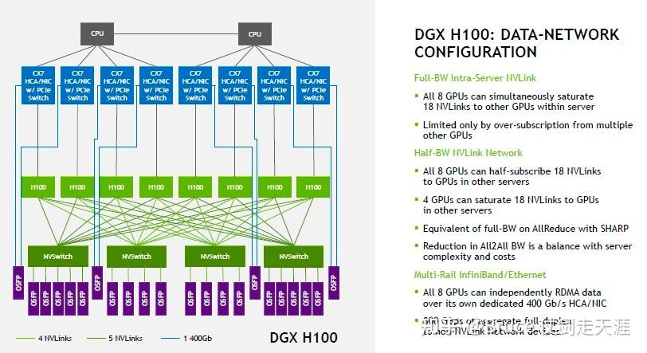

### GH200 SuperPod

Grace Hopper 토폴로지. DPU는 Quantum-2에, GPU는 NVLink/NVSwitch에.

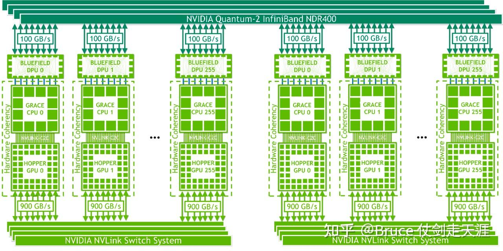

NVSwitch 수렴비 ingress:egress = 1:1 (H100보다 높음 → 총 대역폭 증가).

머신당 H100 8장(+ Grace CPU), H100당 18 link. 스위치 3개, switch당 2 chip, chip당 64 link → switch당 128 link.

H100을 6/6/6 link로 3 스위치에 균등 연결 (각 switch chip이 3 link 담당). chip당 24 link ingress, switch당 48 link ingress.

link당 50 GB/s. 단일 chip 1.2 TB/s, switch 2.4 TB/s. 1:1 수렴 → egress도 2.4 TB/s = OSFP 12개 = link 48개 egress.

L1 ingress + egress = 96 link, 활용 96/128, 32 port 여유.

머신당 L1 3개, egress 합계 7.2 TB/s = OSFP 36개.

SuperPod 32대 → L2 총 ingress 7.2 × 32 = OSFP 1152. L2 스위치 1대 128 link = OSFP 32. **L2 스위치 36대**.

GH200과 H100은 L2 스위치 수·머신 수·GPU 수가 같지만 수렴비 차이로 총 대역폭이 다름 — GH200의 switch 한 대 능력이 H100 토폴로지의 2배.

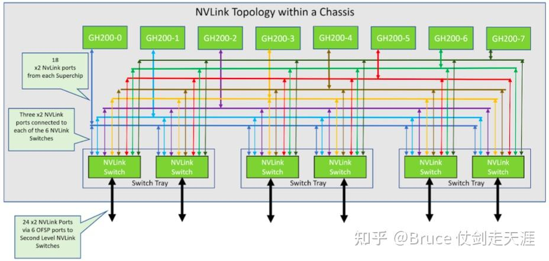

NVLink·NVSwitch가 만드는 고대역폭 망 외에 RDMA가 또 하나의 망을 형성 — 두 망이 합쳐 **Railway 아키텍처**. 본 글은 NVLink 망 중심으로, Pod 내 GPU 통신은 NVLink, Pod 간은 RDMA. 가정: M Pod, 각 Pod에 K GPU. Pod 내 K GPU는 NVLink/NVSwitch 상호연결, 각 Pod의 i번째 GPU는 RDMA로 같은 스위치에 연결 → K개 rail switch. Pod 간 통신은 rail switch를 통하고, rail switch는 spine switch에 연결. spine switch는 외부 인터페이스와 rail switch가 부족할 때의 보장. 실제로 대모델 학습에선 NVLink가 통신의 70% 이상, rail switch가 나머지 대부분, spine은 거의 트래픽 없음.

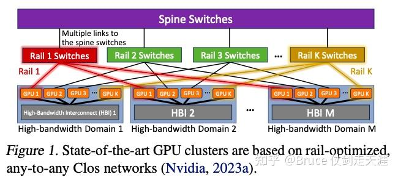

## 부록 1 — NVprof / Profiling 도구

NVIDIA profiling 도구. GPU·link·CPU 성능 데이터 캡처. NVLink엔 주로 대역폭·topo.

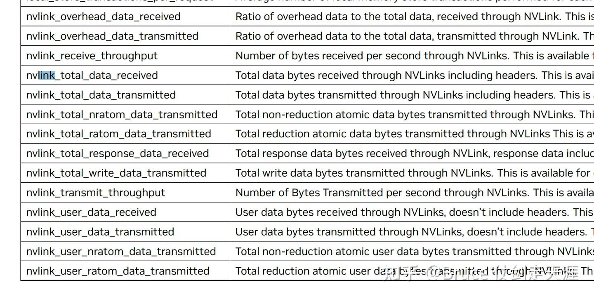

Visual Profiler는 NVLink 토폴로지와 송수신 처리량 메트릭을 수집해 토폴로지에 매핑. 기본은 timeline과 함께. NVLink 옵션 선택 시 처리량·활용률 메트릭 생성. *Guided Analysis*의 *CUDA Application Analysis* → *Examine GPU Usage*에서 NVLink 정보 확인. *NVLink Analysis*는 디바이스 간 논리 NVLink 연결 토폴로지를 보여 줌. 논리 link는 같은 속성의 물리 NVLink 1~4개로 구성. *Logical NVLink Properties* / *Logical NVLink Throughput* 표 제공.

공식 문서: https://docs.nvidia.com/cuda/pdf/CUDA_Profiler_Users_Guide.pdf

## 부록 2 — PXN: PCI × NVLink

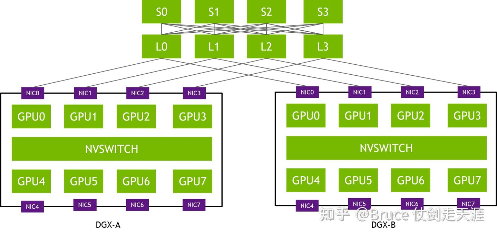

NCCL 2.12 신기능 PXN(PCI × NVLink). GPU가 NVLink → PCI 경로로 노드 내 NIC와 통신 가능. CPU의 QPI 등 inter-CPU 프로토콜을 우회해 풀 대역폭 달성. 각 GPU가 자기 로컬 NIC를 최대한 쓰되 필요하면 다른 NIC에도 도달 가능. 즉 노드 외 NIC, 노드 내 NVLink — 새 기능이지만 기존 토폴로지를 활용. 노드 외 학습은 doubling 구현 사용.
