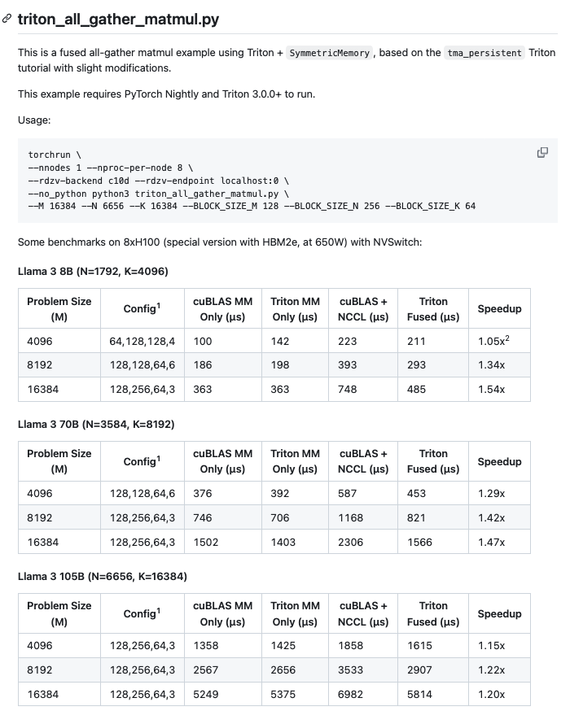
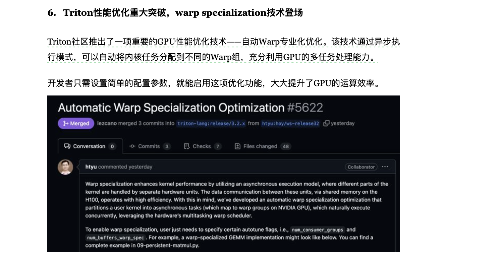

# Fused AllGather MatMul Triton 엔지니어링 구현

## 0x0. 서문

yifuwang은 https://github.com/yifuwang/symm-mem-recipes 에서 `triton_all_gather_matmul.py`를 구현했습니다. 즉 AllGather와 MatMul kernel을 fuse해 하나의 kernel로 만들 수 있으며, NVLink로 연결된 H100에서 LLama3 각 규모의 행렬 곱셈을 테스트했을 때 상당한 가속을 얻었습니다. 아래는 이 fuse 연산자에 대한 설명입니다.



왜 이 작업을 읽어 보려 할까요?

이 엔지니어링 구현이 마침 2024년 Triton의 최신 진전 일부를 잘 보여준다는 것을 발견했기 때문입니다. 또한 Meta PyTorch 팀이 Triton과 TorchTitan에서 진행한 탐색들을 연결해 볼 수도 있습니다. 2024년에 나온 몇몇 PyTorch Blog와도 이 작업은 매우 관련이 높습니다. 그래서 여기서는 관련 지식과 `triton_all_gather_matmul` Kernel의 새로운 특성을 정리해 보려고 합니다.

## 0x1. 관련 작업

### SymmetricMemory (TorchTitan Async AllGather + MatMul)

먼저 https://github.com/yifuwang/symm-mem-recipes 의 `triton_all_gather_matmul.py` 구현이 PyTorch Nightly의 SymmetricMemory에 의존한다는 것을 볼 수 있습니다. 이 데이터 구조는 바로 PyTorch가 Matmul과 AllGather를 Overlap하기 위해 추상화한 것입니다. 이전 글 [[분산 학습과 TorchTitan] PyTorch의 Async Tensor Parallelism 소개](https://mp.weixin.qq.com/s/Jx4B-sF9dudg7OOT-FbsLg) 에 이 데이터 구조에 대한 소개가 있었습니다. 구체적으로는 다음과 같습니다.

통신을 분해할 때 NCCL의 send/recv 작업을 사용하고 싶을 수 있습니다. 사용하기 쉽기 때문입니다. 하지만 NCCL의 send/recv 작업에는 async tensor parallelism에 그다지 적합하지 않은 몇 가지 특성이 있습니다.

- **겹치는 계산과 통신 사이의 경쟁** - 일반적으로 계산과 통신은 독립적으로 사용할 수 있는 두 종류의 자원이라고 생각하지만, 실제로는 그 독립성에 미묘한 차이가 있고 실제 경쟁이 발생합니다. 노드 내 설정(TP에서 가장 흔한 경우)에서는 NCCL의 send/recv kernel이 NVLink로 데이터를 전송하기 위해 SM을 사용합니다. 이는 겹치는 행렬 곱셈 kernel에 사용할 수 있는 SM 수를 줄여 속도를 낮춥니다. 흥미롭게도 관찰된 속도 저하는 통신 kernel이 소비한 자원 비율을 초과할 수 있습니다. cuBLAS는 full waves로 실행되는 kernel을 선택하려고 하므로, 통신 kernel이 점유한 SM이 균형을 깨뜨려 행렬 곱셈 kernel이 추가 wave를 실행하게 만들 수 있기 때문입니다.

- **양방향 동기화** - NCCL의 send/recv kernel은 양방향 동기화를 수행합니다. 이는 sender와 receiver가 작업 완료까지 모두 blocking된다는 뜻입니다. 이 방식은 연산자 내부 병렬의 데이터 전송에서 항상 최적은 아닙니다. 구체적 상황에 따라 여러 데이터 전송에 대해 한 번만 동기화하는 것이 더 적합하거나, remote node로 데이터를 push할지 remote node에서 데이터를 pull할지 선택하는 것이 더 적합할 수 있습니다.

다행히 CUDA의 P2P 메커니즘을 활용하면 앞서 언급한 단점을 피할 수 있습니다. 이 메커니즘은 peer device에 할당된 메모리를 virtual memory address space에 매핑해 device가 접근할 수 있게 합니다. 이 메커니즘 덕분에 memory operation(load/store/atomic 등)이 NVLink를 통해 실행될 수 있습니다. 현재 PyTorch의 async-TP 구현은 가속을 위해 모든 device pair 사이에 NVLink 연결(예: NVSwitch)이 필요합니다. 이는 우리가 향후 해결할 계획인 제한입니다. 또한 `cudaMemcpyAsync`로 peer device 사이에 연속 데이터를 전송할 때, 이 작업은 copy engine(GPU의 전용 하드웨어 유닛으로, 서로 다른 메모리 위치 사이의 데이터 이동을 관리하며 GPU compute core(SM)와 독립적으로 실행됨)이 처리하므로 SM이 필요하지 않습니다. 따라서 앞서 논의한 경쟁 문제를 피할 수 있습니다. copy engine을 통한 데이터 전송도 같은 메모리 대역폭을 공유하기는 합니다. 하지만 (1) 전송 속도가 NVLink 대역폭에 의해 제한되어 메모리 대역폭 경쟁을 피할 만큼 낮고, (2) 겹치는 행렬 곱셈이 compute-intensive이기 때문에 큰 경쟁을 만들 가능성은 낮습니다.

향후 이 메커니즘을 사용해 async-TP와 비슷한 use case를 구현하기 위해, **우리는 SymmetricMemory라는 실험적 추상화(https://github.com/pytorch/pytorch/blob/main/torch/csrc/distributed/c10d/SymmetricMemory.hpp)를 개발했습니다. 개념적으로 이는 device group 사이에 대칭적으로 할당된 buffer를 나타내며, virtual memory/multicast address를 통해 각 GPU가 peer device의 모든 대응 buffer에 접근할 수 있게 합니다. async-TP를 사용할 때 SymmetricMemory를 직접 다룰 필요는 없지만, 사용자는 이를 이용해 async-TP와 유사한 custom fine-grained, intra-node/operator-internal 최적화를 만들 수 있습니다**.

SymmetricMemory 구현은 `https://github.com/pytorch/pytorch/blob/d62e900d8ce895a4bb5c152b2d7b3d084f97efed/torch/distributed/_symmetric_memory/__init__.py`에 있습니다.

SymmetricMemory의 세부 사항은 직접 코드를 읽어야 합니다. 여기서는 간단히 요약하겠습니다.

1. symmetric_memory는 PyTorch의 분산 메모리 관리 메커니즘이며, 주로 여러 GPU 사이에서 메모리를 효율적으로 공유하는 데 사용됩니다.

```python
def empty(
    *size: Any,
    dtype: Optional[_dtype] = None,
    device: Optional[_device] = None,
) -> torch.Tensor:
    """여러 process 사이에서 공유할 수 있는 symmetric memory tensor를 만든다."""
    return _SymmetricMemory.empty_strided_p2p(
        size=size,
        stride=torch._prims_common.make_contiguous_strides_for(size),
        dtype=dtype,
        device=torch.device(device),
    )
```

2. 주요 특징은 모든 GPU에 같은 크기의 메모리 공간을 할당하고, GPU 사이의 직접 메모리 접근(P2P)을 지원하며, CPU 참여가 필요 없고 barrier 같은 fine-grained synchronization primitive도 제공한다는 것입니다.

```python
def rendezvous(tensor: torch.Tensor, group: Union[str, "ProcessGroup"]) -> _SymmetricMemory:
    """여러 process 사이의 symmetric memory tensor를 수립한다."""
    enable_symm_mem_for_group(group_name)
    return _SymmetricMemory.rendezvous(tensor, group_name)
```

3. 일반적인 사용 흐름

- 메모리 할당

```python
a_shard = symm_mem.empty(m // world_size, k, dtype=torch.bfloat16, device=device)
```

- 데이터 접근:

```python
# remote buffer를 가져온다.
src_buf = symm_mem_hdl.get_buffer(
    src_rank,          # source GPU rank
    chunks[0].shape,   # buffer shape
    inp.dtype,        # data type
    chunks[0].numel() * split_id  # offset
)
```

- 동기화 메커니즘

```python
# synchronization value를 쓴다.
symm_mem_hdl.stream_write_value32(
    progress,
    offset=src_rank * splits_per_rank + split_id,
    val=1,
)


# barrier synchronization, 모든 rank 완료를 기다린다.
symm_mem_hdl.barrier()
```

### TMA와 WarpSpecialization Matmul

Triton은 현재 Hopper 아키텍처에서 WarpSpecialization + TMA GEMM을 지원합니다. 실제로 2024년 동안 PyTorch도 이 방면에서 계속 실험했습니다. 예를 들면 다음과 같습니다.

- [번역: Hopper TMA Unit의 FP8 GEMM 적용 깊이 살펴보기](https://mp.weixin.qq.com/s/cZRoRq_gzAdA2iaMpZ08VA)
- [PyTorch Blog CUTLASS Ping-Pong GEMM Kernel 소개](https://mp.weixin.qq.com/s/QWS9YEjsbM7hzy5tJm--1g)
- [PyTorch Blog "Triton으로 2D Dynamic Block Quantized Float8 GEMM 가속하기 소개"](https://mp.weixin.qq.com/s/oK45nVPTctIHW-rXbJ128Q)

PyTorch가 지원하는 WarpSpecialization 개조 Triton:

https://github.com/facebookexperimental/triton/tree/ws

얼마 전 관련 작업도 Triton main branch에 들어갔습니다.



### Persistent Matmul

위의 매우 새로운 특성 외에도 Triton은 Hopper 아키텍처에서 persistent GEMM을 지원해 GPU가 가능한 한 계속 Kernel을 실행하도록 합니다. 이것은 Epilogue fusion에 대응하는 것으로 보입니다. Triton도 공식 튜토리얼을 만들었습니다: https://github.com/triton-lang/triton/blob/main/python/tutorials/09-persistent-matmul.py

SymmetricMemory와 Triton의 Persistent Matmul, TMA 추상화를 기반으로 yifuwang은 https://github.com/yifuwang/symm-mem-recipes 에서 `triton_all_gather_matmul.py`를 구현했습니다.

## 0x2. triton_all_gather_matmul.py 핵심

### pipeline

이 프로그램의 Matmul은 Triton 튜토리얼의 Persistent Matmul https://github.com/triton-lang/triton/blob/main/python/tutorials/09-persistent-matmul.py#L154-L226 에서 수정한 뒤, SymmetricMemory 기반 allgather를 추가한 것입니다. 여기서는 제가 발견한 점을 간단히 말하겠습니다.

우선 코드에는 allgather를 수행하는 `backend_stream`이 있습니다. 코드 조각은 다음과 같고, assert 문을 많이 줄였습니다.

```python
def all_gather_matmul_tma_persistent(a_shard, b, a_out, c_out, configs, mm_only: bool = False):
    # communication block size를 계산한다.
    SPLITS_PER_RANK = 1
    COMM_BLOCK_SIZE_M = M // world_size // SPLITS_PER_RANK
    
    # synchronization을 위한 progress array를 설정한다.
    progress = torch.zeros(world_size, dtype=torch.uint32, device="cuda")
    
    # background stream에서 all_gather를 실행한다.
    backend_stream.wait_stream(torch.cuda.current_stream())
    with torch.cuda.stream(backend_stream):
        all_gather_with_progress(a_out, a_shard, progress, SPLITS_PER_RANK)
```

이어서 프로그램은 행렬 A를 rank 수에 따라 chunk로 나누고, 각 rank가 한 chunk를 담당합니다(총 world_size개의 rank). 그리고 위의 progress array를 사용해 각 chunk의 완료 상태를 추적합니다. `matmul_kernel_tma_persistent` Triton 구현에는 다음 코드가 있습니다.

```python
# data source(local or remote)를 결정한다.
comm_block_id = pid_m // NUM_PID_M_PER_COMM_BLOCK
if comm_block_id // NUM_COMM_BLOCKS_PER_RANK == RANK:
    # local shard에서 읽는다.
    offs_am_src = (pid_m * BLOCK_SIZE_M) % COMM_BLOCK_SIZE_M
    a_ptr = a_shard_desc_ptr
else:
    # 기다린 뒤 remote shard에서 읽는다. 데이터가 도착하지 않았으면 기다린다.
    wait_signal((progress_ptr + comm_block_id).to(tl.uint64), flat_tid)
    offs_am_src = pid_m * BLOCK_SIZE_M
    a_ptr = a_desc_ptr
```

여기서 기다린 뒤 remote shard에서 읽는 부분은 매우 tricky한 작성 방식입니다.

```python
@triton.jit
def wait_signal(addr, flat_tid):
    if flat_tid == 0:
        tl.inline_asm_elementwise(
            """
            {
                .reg .pred  %p<1>;

                wait_block:
                    ld.global.relaxed.gpu.u32 $0, [$1];
                    setp.eq.u32 %p0, $0, 1;
                    @!%p0 bra wait_block;
            }
            """,
            "=r, l",
            [addr],
            dtype=tl.int32,
            is_pure=False,
            pack=1,
        )

    tl.inline_asm_elementwise(
        "bar.sync 0;", "=r", [], dtype=tl.int32, is_pure=False, pack=1
    )

```

대략적으로 판단하면 한 thread block의 Thread 0만 wait 작업을 수행하면 됩니다. 현재 thread block의 데이터가 도착하기만 하면 즉시 계산을 시작할 수 있습니다. `backend_stream` 안의 데이터 copy가 계산보다 빠르기만 하면 all_gather와 matmul은 overlap될 수 있습니다. 여기서는 TMA가 독립 하드웨어 지원을 사용하므로 memory copy를 가속할 수 있습니다.

`wait_signal` 함수는 특정 메모리 주소의 값이 1이 될 때까지 기다리는 spin-wait 메커니즘을 구현합니다. 첫 번째 thread(`flat_tid=0`)만 wait 작업을 수행해 과도한 memory access를 피하고, 이후 barrier로 전체 thread block을 동기화합니다. 내장 PTX는 다음과 같습니다.

```shell
.reg .pred  %p<1>;        # 조건 판단을 위한 predicate register 선언
wait_block:               # loop label
    # global memory에서 값을 읽고, relaxed memory ordering을 사용한다.
    ld.global.relaxed.gpu.u32 $0, [$1];
    # 값이 1인지 비교한다.
    setp.eq.u32 %p0, $0, 1;
    # 1이 아니면 loop를 계속한다.
    @!%p0 bra wait_block;
```

### index 매핑

main loop 안의 좌표 매핑은 조금 복잡합니다. 여기서는 예를 하나 들어 보겠습니다.

```python
# main loop, 모든 tile을 처리한다.
    for _ in range(0, k_tiles * tiles_per_SM):
        # K dimension의 tile index를 갱신한다.
        ki = tl.where(ki == k_tiles - 1, 0, ki + 1)
        if ki == 0:
            # tile ID와 관련 index를 갱신한다.
            tile_id += NUM_SMS
            group_id = tile_id // num_pid_in_group
            first_pid_m = group_id * GROUP_SIZE_M
            group_size_m = min(num_pid_m - first_pid_m, GROUP_SIZE_M)
            pid_m = first_pid_m + (tile_id % group_size_m)
            pid_n = (tile_id % num_pid_in_group) // group_size_m

            # communication 관련 block size와 개수를 계산한다.
            NUM_COMM_BLOCKS = M // COMM_BLOCK_SIZE_M
            NUM_COMM_BLOCKS_PER_RANK = NUM_COMM_BLOCKS // WORLD_SIZE
            NUM_PID_M_PER_COMM_BLOCK = COMM_BLOCK_SIZE_M // BLOCK_SIZE_M

            # 위의 pid_m은 shard를 고려하지 않은 pid_m이므로 여기서 shard 상황을 고려해야 한다.
            pid_m = (pid_m + NUM_PID_M_PER_COMM_BLOCK * RANK) % num_pid_m

            # data source(local or remote)를 결정한다.
            comm_block_id = pid_m // NUM_PID_M_PER_COMM_BLOCK
            if comm_block_id // NUM_COMM_BLOCKS_PER_RANK == RANK:
                # local shard에서 읽는다.
                offs_am_src = (pid_m * BLOCK_SIZE_M) % COMM_BLOCK_SIZE_M
                a_ptr = a_shard_desc_ptr
            else:
                # 기다린 뒤 remote shard에서 읽는다.
                wait_signal((progress_ptr + comm_block_id).to(tl.uint64), flat_tid)
                offs_am_src = pid_m * BLOCK_SIZE_M
                a_ptr = a_desc_ptr
```

다음 설정이 있다고 가정합니다.

- M = 1024 (행렬 A의 전체 행 수)
- WORLD_SIZE = 4 (GPU 4개)
- COMM_BLOCK_SIZE_M = 256 (communication block size)
- BLOCK_SIZE_M = 64 (compute block size)

그러면 다음과 같습니다.

```shell
# 여러 block 개수를 계산한다.
NUM_COMM_BLOCKS = M // COMM_BLOCK_SIZE_M = 1024 // 256 = 4  # 전체 communication block 수
NUM_COMM_BLOCKS_PER_RANK = NUM_COMM_BLOCKS // WORLD_SIZE = 4 // 4 = 1  # rank마다 담당하는 communication block 수
NUM_PID_M_PER_COMM_BLOCK = COMM_BLOCK_SIZE_M // BLOCK_SIZE_M = 256 // 64 = 4  # communication block마다 포함된 compute block 수

```

그리고 현재 global `pid_m=2`이고 `RANK=1`이라고 가정합니다.

```shell
# pid_m = (pid_m + NUM_PID_M_PER_COMM_BLOCK * RANK) % num_pid_m
pid_m = (2 + 4 * 1) % 16 = 6

comm_block_id = pid_m // NUM_PID_M_PER_COMM_BLOCK = 6 // 4 = 1

if comm_block_id // NUM_COMM_BLOCKS_PER_RANK == RANK:  # 1 // 4 == 0 (true)
```

global `pid_m=2`와 `RANK=1`에 대해, `pid_0`부터 `pid_4`까지 모두 첫 번째 카드로 나뉘어 있으므로 여기서는 자연스럽게 코드의 기다린 뒤 remote shard에서 읽는 branch를 실행해야 합니다.

```python
            # data source(local or remote)를 결정한다.
            comm_block_id = pid_m // NUM_PID_M_PER_COMM_BLOCK
            if comm_block_id // NUM_COMM_BLOCKS_PER_RANK == RANK:
                # local shard에서 읽는다.
                offs_am_src = (pid_m * BLOCK_SIZE_M) % COMM_BLOCK_SIZE_M
                a_ptr = a_shard_desc_ptr
            else:
                # 기다린 뒤 remote shard에서 읽는다.
                wait_signal((progress_ptr + comm_block_id).to(tl.uint64), flat_tid)
                offs_am_src = pid_m * BLOCK_SIZE_M
                a_ptr = a_desc_ptr
```

## 0x3. 정리

Fused AllGather와 MatMul의 Overlap Triton 엔지니어링 구현을 간단히 살펴보았습니다. Triton이 제공하는 TMA Persistent Matmul과 PyTorch의 SymmetricMemory 추상화를 통해 AllGather와 MatMul을 직접 overlap할 수 있는 kernel을 구현했습니다. 이 프로젝트에는 SymmetricMemory 기반의 더 효율적인 Triton 연산자도 구현되어 있으니, 관심이 있다면 확인해 볼 수 있습니다. 다만 PyTorch가 제공하는 fused_all_gather_matmul(https://github.com/pytorch/pytorch/blob/f08b9bc7e4e7398c23507722abb9520205fe8a2d/test/distributed/test_symmetric_memory.py#L402) 연산자와 마찬가지로 NVLink가 있는 Hopper 아키텍처 GPU에서만 사용할 수 있습니다.
