> 내 강의 노트다. 관심 있으면 봐도 좋다: https://github.com/BBuf/how-to-optim-algorithm-in-cuda/tree/master/cuda-mode .

> 이 강의는 NVIDIA의 NCCL(NVIDIA Collective Communications Library) communication library를 소개하고, distributed deep learning에서의 적용을 중점적으로 설명한다. 먼저 PyTorch DDP 예시를 통해 NCCL이 효율적인 gradient synchronization을 어떻게 구현하는지 보여준다. 이어 NCCL의 기본 개념, API 사용, communicator initialization 방식도 소개하고, Ring AllReduce algorithm의 동작 원리를 깊이 분석한다.

# 17강, GPU 집합 통신(NCCL)

## 강의 노트

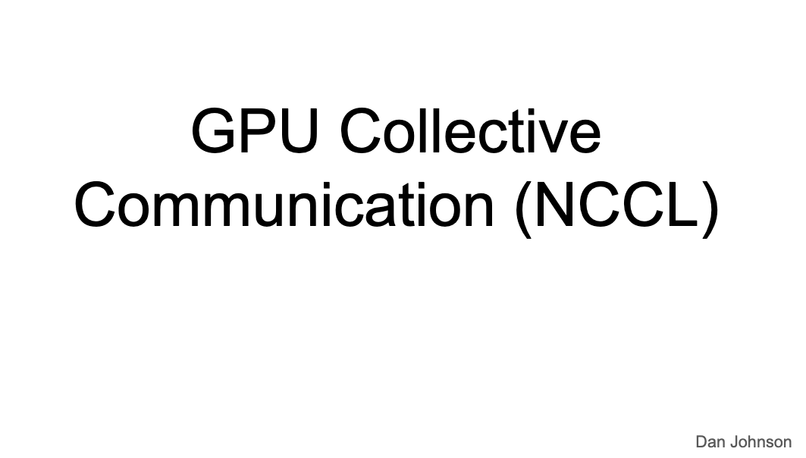

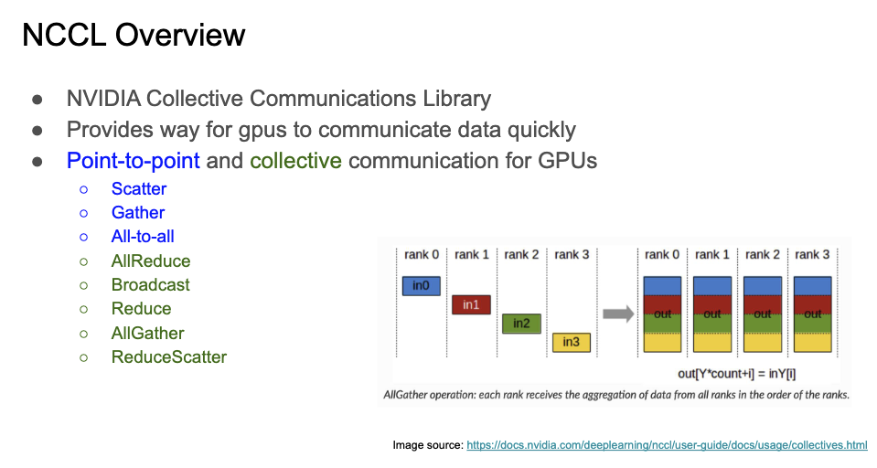

이 Slides는 NVIDIA의 NCCL(NVIDIA Collective Communications Library) communication library를 소개한다. GPU 사이의 빠른 data communication에 특화된 library이며, point-to-point와 collective communication 두 mode를 지원한다. Scatter, Gather, All-to-all, AllReduce, Broadcast, Reduce, AllGather, ReduceScatter 같은 다양한 communication primitive를 제공한다. Slides 아래쪽 그림은 AllGather operation의 workflow를 보여주고, 위쪽은 Broadcast와 Scatter의 schematic을 보여준다.

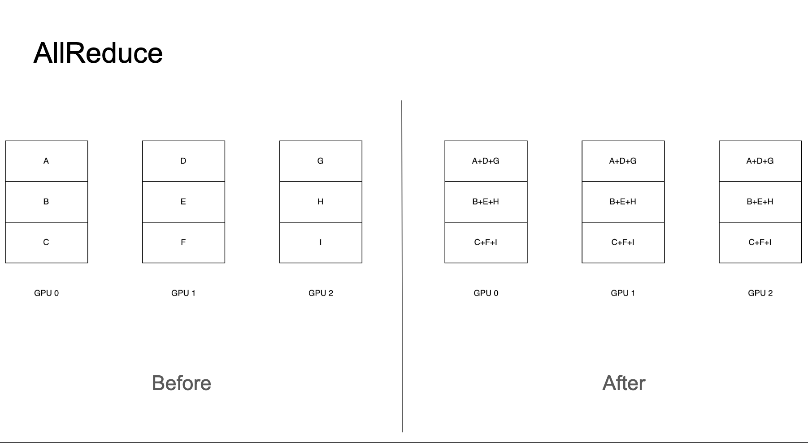

이 Slides는 nccl AllReduce(Reduce Sum) operation을 간단히 보여준다. 그림은 "Before"와 "After" 두 부분으로 나뉘며, GPU 0, GPU 1, GPU 2의 data 처리 과정을 보여준다. 초기 상태에서 각 GPU는 서로 다른 data block 3개를 가진다. GPU 0에는 A, B, C가 있고, GPU 1에는 D, E, F가 있으며, GPU 2에는 G, H, I가 있다. AllReduce operation 뒤에는 각 GPU가 같은 위치 data의 합, 즉 A+D+G, B+E+H, C+F+I를 얻는다. 이렇게 세 GPU는 최종적으로 같은 계산 결과를 갖는다.

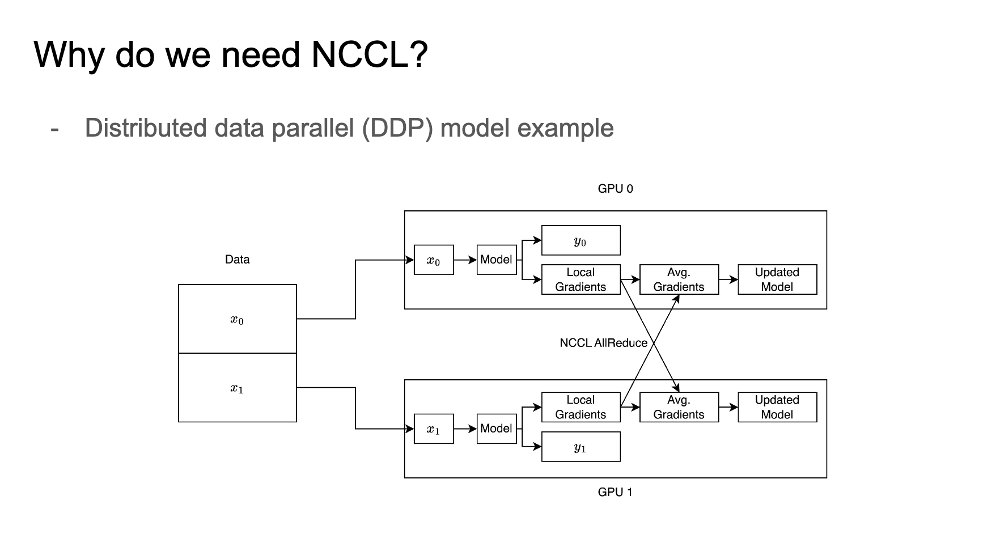

이 Slides는 DDP 안에서 NCCL이 필요한 지점을 설명한다. 바로 global gradient를 synchronize할 때다. 구체적으로 이 예시에서는 data가 두 부분(x₀, x₁)으로 나뉘어 각각 두 GPU에서 처리된다. 각 GPU는 같은 model을 실행하고 자기 local gradient를 계산한 뒤, NCCL의 AllReduce operation으로 모든 GPU의 gradient를 synchronize하고 평균낸다. 마지막으로 각 GPU는 이 average gradient로 자기 model parameter를 update해 모든 GPU의 model이 synchronized 상태를 유지하게 한다.

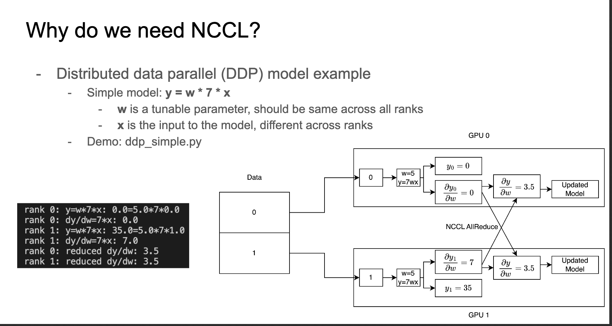

이 Slides는 조금 더 구체적으로 `y = w * 7 * x` 예시를 사용해 DDP에서 gradient synchronization 때 NCCL AllReduce operation으로 모든 GPU의 gradient를 synchronize하고 평균내는 방법을 보여준다. 작성자는 이 예시에 대한 code도 제공했다.

```python
# modified from https://pytorch.org/tutorials/intermediate/ddp_tutorial.html

import torch
import torch.distributed as dist
import torch.nn as nn
from torch.profiler import profile

from torch.nn.parallel import DistributedDataParallel as DDP

# 간단한 toy model class 정의
class ToyModel(nn.Module):
    def __init__(self):
        super(ToyModel, self).__init__()
        # trainable parameter w 정의, 초기값은 5.0
        self.w = nn.Parameter(torch.tensor(5.0))

    def forward(self, x):
        # forward propagation: y = w * 7 * x
        return self.w * 7.0 * x


def demo_basic():
    # process group 초기화, NCCL backend 사용
    dist.init_process_group("nccl")
    # 현재 process의 rank 획득
    rank = dist.get_rank()
    print(f"Start running basic DDP example on rank {rank}.")

    # model instance를 만들고 해당 GPU로 이동
    model = ToyModel().to(rank)
    # DDP로 model wrapping
    ddp_model = DDP(model, device_ids=[rank])

    # PyTorch profiler로 performance data 수집
    with profile() as prof:
        # input tensor 생성, 값은 현재 process rank
        x = torch.tensor(dist.get_rank(), dtype=torch.float)
        # forward propagation
        y = ddp_model(x)
        # computation result 출력
        print(f"rank {rank}: y=w*7*x: {y.item()}={ddp_model.module.w.item()}*7*{x.item()}")
        # w에 대한 derivative 출력
        print(f"rank {rank}: dy/dw=7*x: {7.0*x.item()}")
        # backward propagation
        y.backward()
        # AllReduce 이후 gradient 출력
        print(f"rank {rank}: reduced dy/dw: {ddp_model.module.w.grad.item()}")
    # rank 0이 performance trace file export 담당
    if rank == 0:
        print("exporting trace")
        prof.export_chrome_trace("trace_ddp_simple.json")
    # process group 정리
    dist.destroy_process_group()


if __name__ == "__main__":
    print("Running")
    demo_basic()

# torchrun --nnodes=1 --nproc_per_node=2 --rdzv_id=100 --rdzv_backend=c10d --rdzv_endpoint=localhost:29400 ddp_simple.py
```

이어 작성자는 Linear와 ReLU로 구성되고 optimizer가 parameter를 update하는 과정을 포함한 조금 더 완전한 예시를 제공한다.

```python
# modified from https://pytorch.org/tutorials/intermediate/ddp_tutorial.html

import torch
import torch.distributed as dist
import torch.nn as nn

from torch.nn.parallel import DistributedDataParallel as DDP
from torch.profiler import profile
import torch.optim as optim

SIZE = 4000


class ToyModel(nn.Module):
    def __init__(self):
        super(ToyModel, self).__init__()
        self.net1 = nn.Linear(SIZE, SIZE)
        self.relu = nn.ReLU()
        self.net2 = nn.Linear(SIZE, SIZE)
        self.net3 = nn.Linear(SIZE, SIZE)

    def forward(self, x):
        return self.net3(self.relu(self.net2(self.relu(self.net1(x)))))


def demo_basic():
    dist.init_process_group("nccl")
    rank = dist.get_rank()
    print(f"Start running basic DDP example on rank {rank}.")

    model = ToyModel().to(rank)
    ddp_model = DDP(model, bucket_cap_mb=25, device_ids=[rank])

    loss_fn = nn.MSELoss()
    optimizer = optim.SGD(ddp_model.parameters(), lr=0.001)

    with profile(
        record_shapes=True,
        activities=[
            torch.profiler.ProfilerActivity.CPU,
            torch.profiler.ProfilerActivity.CUDA,
        ],
    ) as prof:
        for i in range(10):
            optimizer.zero_grad()
            outputs = ddp_model(torch.randn(1000, SIZE, device=rank))
            labels = torch.randn(1000, SIZE, device=rank)
            loss_fn(outputs, labels).backward()
            optimizer.step()
    if rank == 0:
        prof.export_chrome_trace("trace_ddp_example.json")


if __name__ == "__main__":
    demo_basic()

# torchrun --nnodes=1 --nproc_per_node=2 --rdzv_id=100 --rdzv_backend=c10d --rdzv_endpoint=localhost:29400 ddp_example.py
```

작성자는 이 code의 한 iteration에 대한 PyTorch profiler 결과를 몇 분 동안 분석했다. forward pass, backward pass, optimizer parameter update, AllReduce communication time, 그리고 일부 AllReduce가 backward computation과 overlap되는 모습을 볼 수 있다. 이것이 다음 slide로 이어진다.

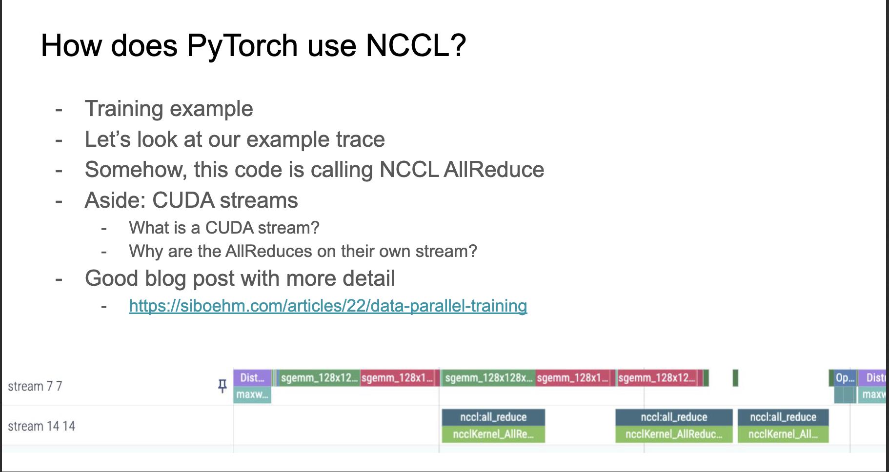

여기서 작성자는 DDP 안의 AllReduce가 Backward Pass와 어떻게 overlap되는지 설명한다. 이 블로그를 읽어보는 것을 권한다: https://zhuanlan.zhihu.com/p/485208899 . 이 Slides의 PyTorch Profiler 그림에서도 다른 정보를 발견할 수 있다. 예를 들어 같은 Stream 위의 kernel은 순차 실행되므로, compute와 communication을 overlap하기 위해 여기서는 두 Stream을 사용한다. network의 처음 몇 layer는 gradient 계산이 끝나야 AllReduce를 시작할 수 있으므로 overlap할 수 없는 layer가 존재한다.

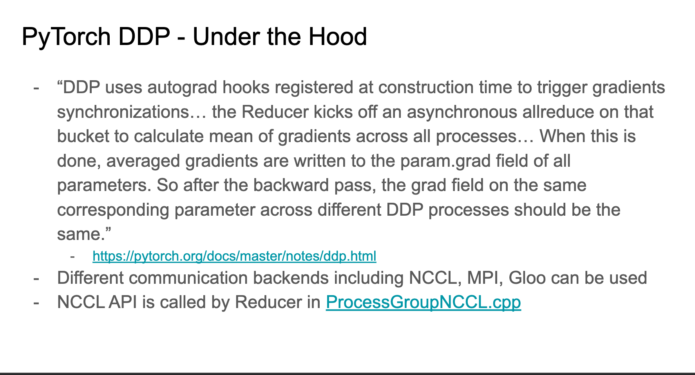

이 Slides는 PyTorch DDP의 내부 mechanism을 언급한다.
- DDP gradient synchronization mechanism:
    - build 시 autograd hooks를 등록해 gradient synchronization을 trigger한다.
    - Reducer component가 async allreduce operation을 실행해 모든 process 사이의 gradient average를 계산한다.
    - 계산 완료 후 average gradient가 모든 parameter의 `param.grad` field에 기록된다.
    - backward propagation 완료 후 서로 다른 DDP process의 같은 parameter gradient 값은 일치해야 한다.
- communication backend support:
    - DDP는 여러 communication backend를 지원한다.
        - NCCL
        - MPI
        - Gloo
- 구체 구현:
    - NCCL API 호출은 PyTorch의 `ProcessGroupNCCL.cpp` 파일에서 Reducer를 통해 완료된다.

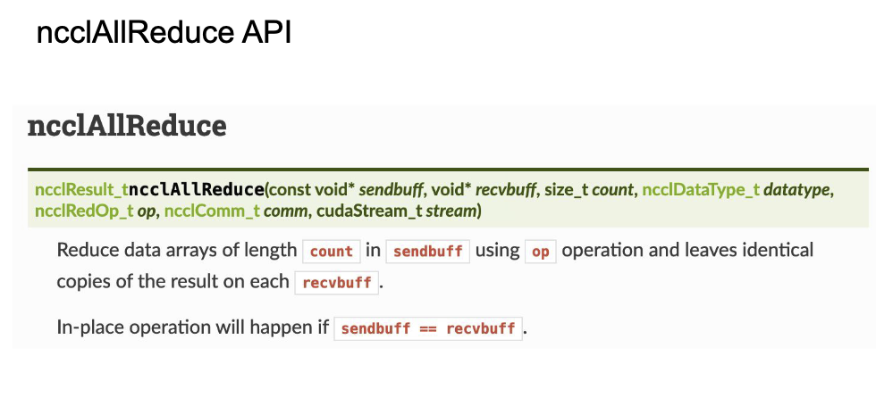

이 Slides는 NCCL library의 `ncclAllReduce` API function을 소개하기 시작한다. 이 function은 길이가 count인 data array에 대해 지정한 op operator로 reduce operation을 수행하고, 같은 결과를 각 `recvbuff`에 copy한다. `sendbuff`와 `recvbuff`가 같은 위치를 가리키면 in-place operation을 수행한다. distributed deep learning에서 자주 쓰는 collective communication operation이며, 여러 GPU 사이에서 data를 synchronize하고 aggregate하는 데 사용된다.

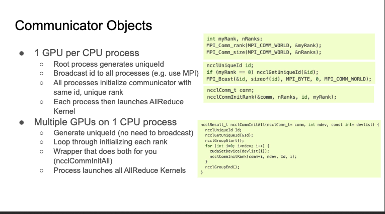

이 Slides는 NCCL communicator object의 두 가지 사용 장면을 소개한다. 하나는 CPU process 하나가 GPU 하나에 대응되는 경우다. 이때 root process가 unique ID를 생성하고 모든 process에 broadcast한다. 모든 process는 같은 ID와 unique rank로 communicator를 initialize한다. MPI 같은 경우다. 다른 하나는 단일 CPU process가 여러 GPU를 관리하는 경우다. 이때는 ID를 broadcast할 필요가 없으며, loop로 각 rank를 initialize할 수 있고, wrapper인 `ncclCommInitAll` function으로 이 과정을 단순화할 수 있다. Slides 오른쪽 code 예시는 이런 initialization operation의 구체 구현을 보여준다.

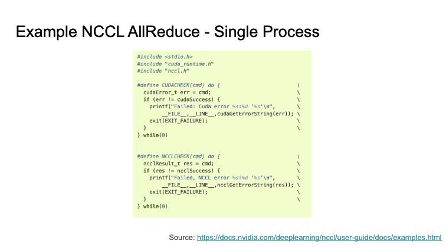

이 Slides는 error handling macro definition을 보여준다.

```c++
#define CUDACHECK(cmd) {                    
    cudaError_t err = cmd;                  
    if (err != cudaSuccess) {              
        printf("Failed: Cuda error %s:%d\n",
            __FILE__,__LINE__,cudaGetErrorString(err));
        exit(EXIT_FAILURE);               
    }
}

#define NCCLCHECK(cmd) {                    
    ncclResult_t res = cmd;               
    if (res != ncclSuccess) {             
        printf("Failed: NCCL error %s:%d\n",
            __FILE__,__LINE__,ncclGetErrorString(res));
        exit(EXIT_FAILURE);               
    }
}
```

이 부분은 두 error handling macro를 정의한다.
- `CUDACHECK`: CUDA API call의 error를 검사한다.
- `NCCLCHECK`: NCCL operation의 error를 검사한다.

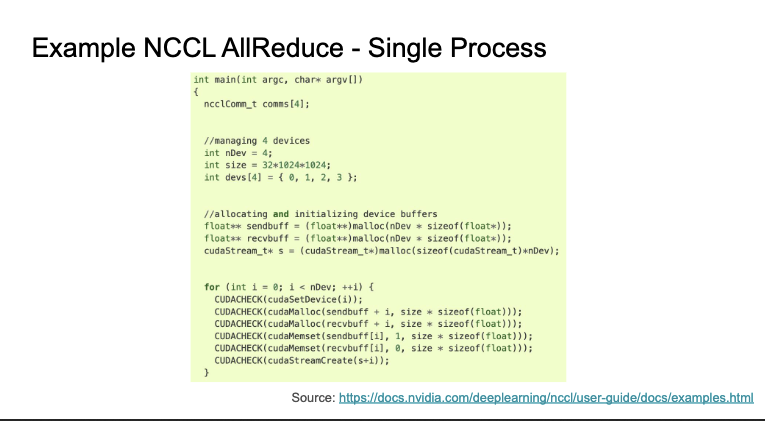

```c++
int main(int argc, char* argv[]) {
    ncclComm_t comms[4];
    
    // 4개 device 관리
    int nDev = 4;
    int size = 32*1024*1024;
    int devs[4] = { 0, 1, 2, 3 };
    
    // device buffer 할당 및 초기화
    float** sendbuff = (float**)malloc(nDev * sizeof(float*));
    float** recvbuff = (float**)malloc(nDev * sizeof(float*));
    cudaStream_t* s = (cudaStream_t*)malloc(sizeof(cudaStream_t)*nDev);
```

이 code는 NCCL communicator array를 만들고, GPU device 4개를 설정하며, data size(32MB)를 정의한다. 또한 send/receive buffer memory를 allocate하고 각 device용 CUDA stream을 만든다. 이어 아래 loop가 있다.

```c++
for (int i = 0; i < nDev; ++i) {
    CUDACHECK(cudaSetDevice(i));
    CUDACHECK(cudaMalloc(sendbuff + i, size * sizeof(float)));
    CUDACHECK(cudaMalloc(recvbuff + i, size * sizeof(float)));
    CUDACHECK(cudaMemset(sendbuff[i], 1, size * sizeof(float)));
    CUDACHECK(cudaMemset(recvbuff[i], 0, size * sizeof(float)));
    CUDACHECK(cudaStreamCreate(s+i));
}
```

이 loop는 각 GPU를 current device로 설정하고, send/receive buffer용 GPU memory를 allocate한다. send buffer를 1로, receive buffer를 0으로 initialize하고, 마지막으로 각 device에 CUDA stream을 만든다.

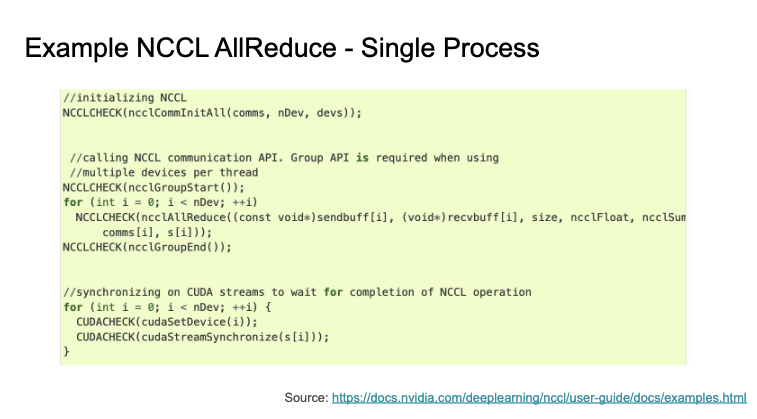

```c++
// NCCL 초기화
NCCLCHECK(ncclCommInitAll(comms, nDev, devs));

// NCCL communication API 호출
NCCLCHECK(ncclGroupStart());
for (int i = 0; i < nDev; ++i)
    NCCLCHECK(ncclAllReduce((const void*)sendbuff[i], (void*)recvbuff[i], size, ncclFloat, ncclSum,
        comms[i], s[i]));
NCCLCHECK(ncclGroupEnd());

// CUDA stream을 synchronize해 NCCL operation 완료 대기
for (int i = 0; i < nDev; ++i) {
    CUDACHECK(cudaSetDevice(i));
    CUDACHECK(cudaStreamSynchronize(s[i]));
}
```

이 code는 NCCL communicator를 initialize하고 AllReduce operation을 실행한다. 모든 device data를 sum하고 모든 device에 distribute한다. 마지막으로 모든 CUDA stream을 synchronize해 operation 완료를 보장한다.

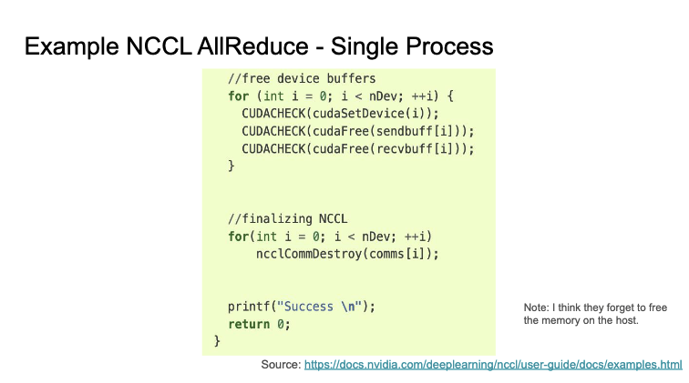

```c++
// device buffer 해제
for (int i = 0; i < nDev; ++i) {
    CUDACHECK(cudaSetDevice(i));
    CUDACHECK(cudaFree(sendbuff[i]));
    CUDACHECK(cudaFree(recvbuff[i]));
}

// NCCL 종료
for(int i = 0; i < nDev; ++i)
    ncclCommDestroy(comms[i]);
```

마지막으로 resource cleanup을 수행한다. GPU에 할당한 memory를 해제하고 NCCL communicator를 destroy한다.

위 4장의 slides는 단일 process에서 NCCL을 사용해 AllReduce operation을 수행하는 방법을 함께 보여준다.

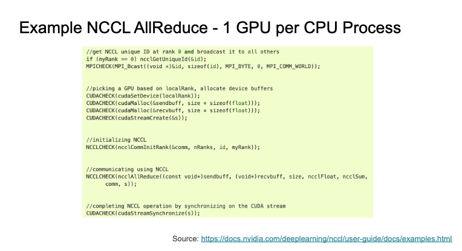

이 Slides는 "CPU process 하나당 GPU 하나" 장면의 구현을 보여준다. code에는 다음 단계가 있다.

- NCCL unique ID를 얻고 모든 process 사이에 broadcast한다.
- local rank에 따라 GPU를 선택하고 device buffer를 allocate한다.
- NCCL communicator를 initialize한다.
- NCCL로 AllReduce collective communication operation을 수행한다. code에서 각 rank가 이 operation을 launch한다는 점을 볼 수 있다.
- CUDA stream을 synchronize해 NCCL operation을 완료한다.

사실 이 예시는 PyTorch Distributed Data Parallel의 AllReduce operation에 대응된다. 위 Single Process 예시는 PyTorch Data Parallel 안의 AllReduce operation에 대응된다.

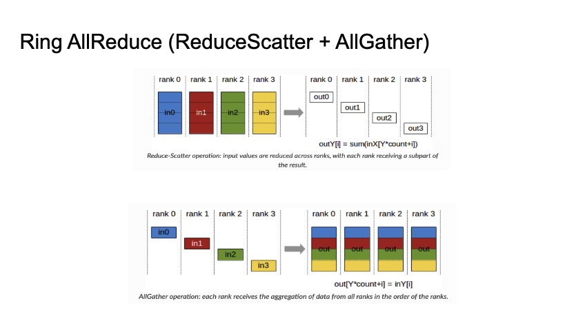

여기서는 ring-shaped AllReduce algorithm의 원리를 보여준다. 이는 두 operation으로 구성된다.
- ReduceScatter operation: input data가 서로 다른 rank(process/node)에 분포한다(rank 0부터 rank 3). 각 rank는 data 일부에 대해 reduction operation을 담당한다. reduction 결과는 서로 다른 rank에 흩어진다. 그림에는 `out[i] = sum(in[j]^count+i))`가 표시된다.
- AllGather operation: ReduceScatter 뒤에 실행된다. 각 rank는 자기 partial result를 다른 모든 rank에 broadcast한다. 최종적으로 각 rank가 complete reduction result를 얻는다. 그림에는 `out[Ycount+i] = in[Y][i]`가 표시된다.

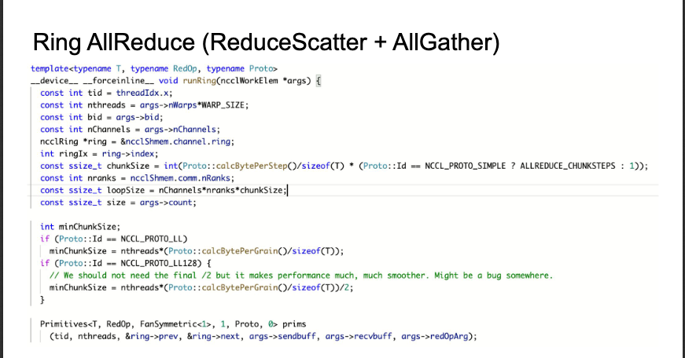

이 Slides는 Ring Allreduce의 CUDA code 구현 일부를 잘라 보여준다. code를 대략 훑어보면 된다.

```c++
// Ring AllReduce algorithm 구현(ReduceScatter와 AllGather operation 결합)
template<typename T, typename RedOp, typename Proto>
__device__ __forceinline__ void run(ncclWorkElem *args) {
    const int tid = threadIdx.x;      // 현재 thread ID 획득
    const int nthreads = args->nWarps*WARP_SIZE;  // 전체 thread 수 계산
    const int bid = args->bid;        // block ID 획득
    const int nChannels = args->nChannels;  // channel 수 획득
    ncclRing *ring = &ncclShmem.channel.ring;  // ring communication structure pointer 획득
    int ringIx = ring->index;         // ring index 획득
    
    // 각 step에서 처리할 data block size 계산
    const size_t chunkSize = int(Proto::calcBytePerStep()/sizeof(T)) * (Proto::Id == NCCL_PROTO_SIMPLE ? ALLREDUCE_CHUNKSTEPS : 1));
    const int nranks = ncclShmem.comm.nRanks;  // 전체 process 수 획득
    const size_t loopSize = nChannels*nranks*chunkSize;  // loop size 계산
    const size_t size = args->count;  // 처리해야 할 전체 data amount 획득

    int minChunkSize;  // 최소 data block size
    if (Proto::Id == NCCL_PROTO_LL) {
        // LL protocol에서 최소 data block size 계산
        minChunkSize = nthreads*(Proto::calcBytePerGrain()/sizeof(T));
    }
    if (Proto::Id == NCCL_PROTO_LL128) {
        // LL128 protocol의 특수 처리
        // 주석은 여기서 2로 나누는 것이 bug일 수 있지만 performance를 높인다고 설명한다
        minChunkSize = nthreads*(Proto::calcBytePerGrain()/sizeof(T))/2;
    }

    // Primitives template class로 reduction operation 처리
    Primitives<T, RedOp, FanSymmetric<1>, Proto, 0> prims
        (tid, nthreads, &ring->prev, &ring->next, args->sendbuff, args->recvbuff, args->redOpArg);
}
```

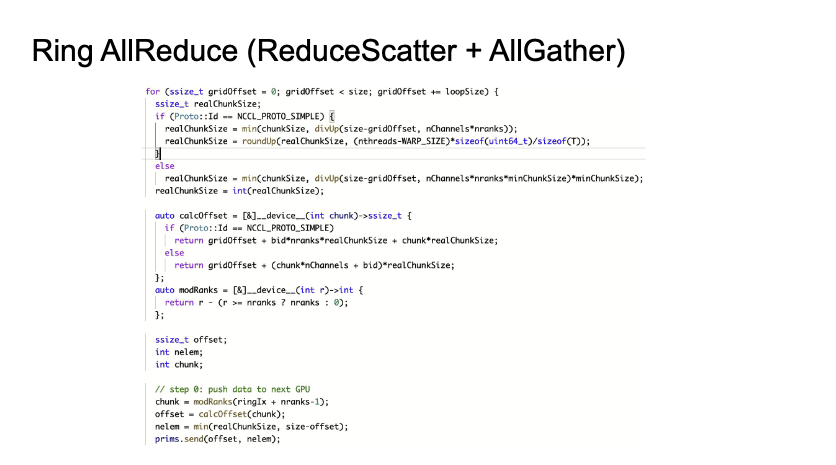

```c++
// Ring AllReduce 구현(ReduceScatter + AllGather)
for (size_t gridOffset = 0; gridOffset < size; gridOffset += loopSize) {
    size_t realChunkSize;
    
    // NCCL protocol simple mode 처리
    if (Proto::id == NCCL_PROTO_SIMPLE) {
        // grid offset과 channel 수를 고려해 실제 chunk size 계산
        realChunkSize = min(chunkSize, divide(size-gridOffset, nChannels*nranks));
        // thread 수와 data type size에 따라 chunk size 조정
        realChunkSize = roundUp(realChunkSize, (nthreads*WARP_SIZE)*sizeof(uint64_t)/sizeof(T));
    } else {
        // non-simple mode의 chunk size 계산
        realChunkSize = min(chunkSize, divide(size-gridOffset, nChannels*nranks*minChunkSize));
        realChunkSize = int(realChunkSize);
    }

    // 각 chunk의 offset 계산
    auto calcOffset = [&]__device__(int chunk)->size_t {
        if (Proto::id == NCCL_PROTO_SIMPLE)
            return gridOffset + bid*nranks*realChunkSize + chunk*realChunkSize;
        else
            return gridOffset + (chunk*nChannels + bid)*realChunkSize;
    };

    // 각 rank의 modulo 위치 계산
    auto modRanks = [&]__device__(int r)->int {
        return r >= nranks ? r-nranks : r;
    };

    // variable 선언
    size_t offset;
    int nelem;
    int chunk;

    // step 0: data를 다음 GPU로 push
    chunk = modRanks(ringIx + nranks-1);  // chunk index 계산
    offset = calcOffset(chunk);           // offset 계산
    nelem = min(realChunkSize, size-offset); // element 수 계산
    prims.send(offset, nelem);           // data 전송
}

```

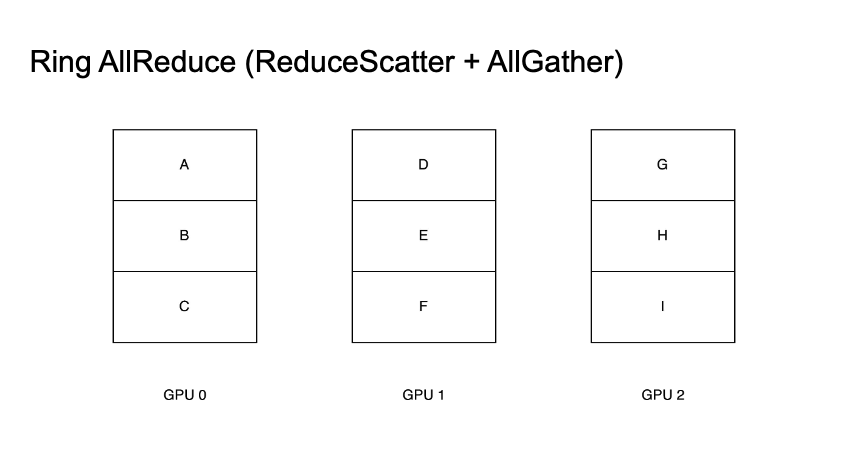

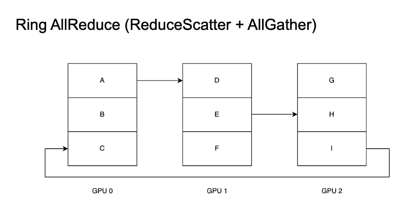

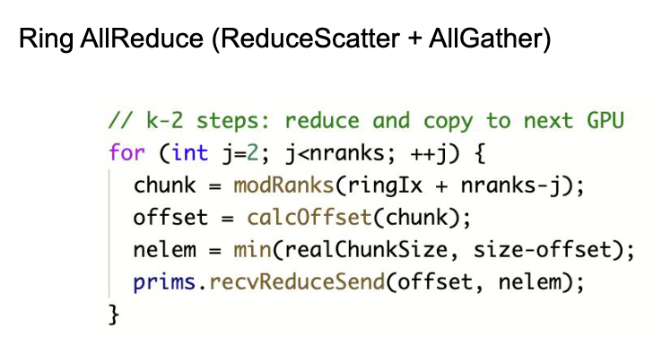

이 몇 장의 Slides는 Ring AllReduce algorithm의 동작 원리를 보여준다. 이는 ReduceScatter와 AllGather 두 operation을 조합해 구현된다. 첫 번째 Slides 그림은 초기 상태를 보여준다.

- GPU 3개(GPU 0, 1, 2)가 있다.
- 각 GPU에는 data block 3개가 있다(A/B/C, D/E/F, G/H/I).

두 번째 Slides 그림은 data transfer pattern을 보여준다.

- data는 ring 방식으로 GPU 사이를 전달한다.
- GPU 0은 GPU 1로 전송한다.
- GPU 1은 GPU 2로 전송한다.
- GPU 2는 다시 GPU 0으로 전송해 ring을 형성한다.

```c++
// k-2 step: reduction operation을 수행하고 결과를 다음 GPU로 copy
for (int j=2; j<nranks; ++j) {
    // 현재 처리해야 할 data block index 계산
    // ringIx는 현재 GPU index이며 modulo operation으로 index가 valid range에 있도록 보장한다
    chunk = modRanks(ringIx + nranks-j);
    
    // chunk에 따라 buffer 안 offset 계산
    offset = calcOffset(chunk);
    
    // 이번에 전송해야 할 실제 element 수 계산
    // 실제 block size와 remaining size 중 작은 값을 사용해 out-of-bounds를 피한다
    nelem = min(realChunkSize, size-offset);
    
    // receive-reduce-send operation 수행
    // 이전 GPU에서 data를 받고 local data와 reduce한 뒤 다음 GPU로 전송한다
    prims.recvReduceSend(offset, nelem);
}
```

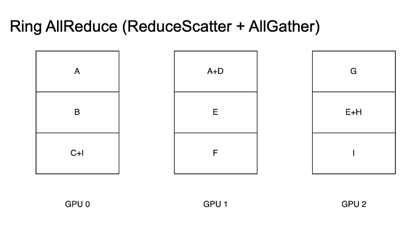

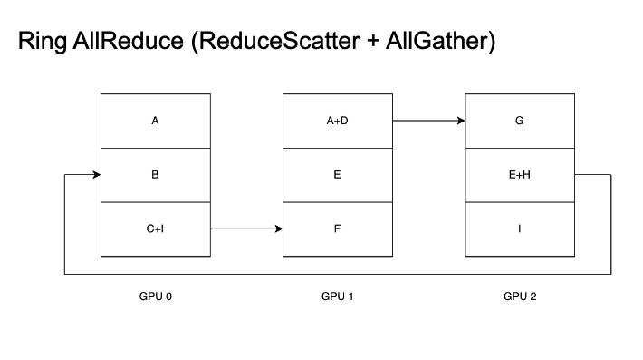

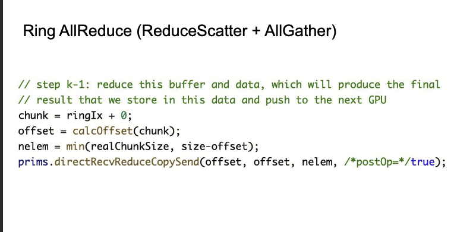

여기서는 Ring AllReduce의 k-1 step이 하는 일을 보여준다.

```c++
// step k-1: 현재 GPU에서 buffer와 data를 reduce
// reduction result는 현재 data에 저장되고 다음 GPU로 전송된다

// 현재 처리할 data block index 계산
// ringIx는 ring communication 안의 index position
chunk = ringIx + 0;

// chunk에 따라 memory 안 offset 계산
// buffer 안 data의 구체 위치를 정하는 데 사용
offset = calcOffset(chunk);

// 이번에 처리해야 할 실제 element 수 계산
// realChunkSize: standard block size
// size-offset: 남은 처리 가능 element 수
// 둘 중 작은 값을 취해 out-of-bounds를 방지
nelem = min(realChunkSize, size-offset);

// receive-reduce-copy-send operation 수행
// offset: source data offset
// offset: target data offset
// nelem: 처리할 element 수
// true: postOp parameter, 후속 operation 수행 여부를 뜻함
prims.directRecvReduceCopySend(offset, offset, nelem, /*postOp=*/true);
```

위 과정은 실제로 ReduceScatter operation에 대응된다.

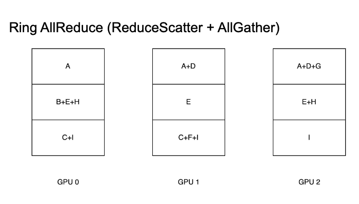

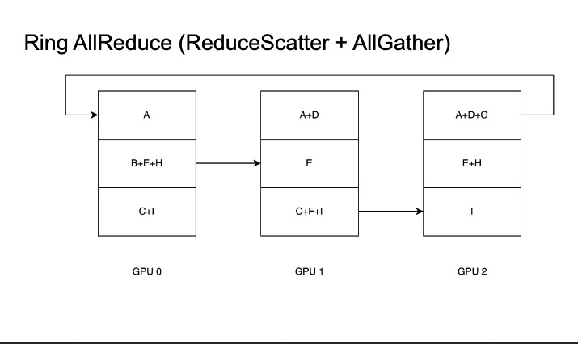

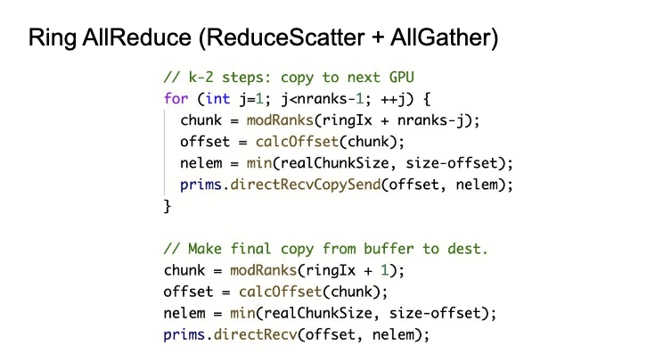

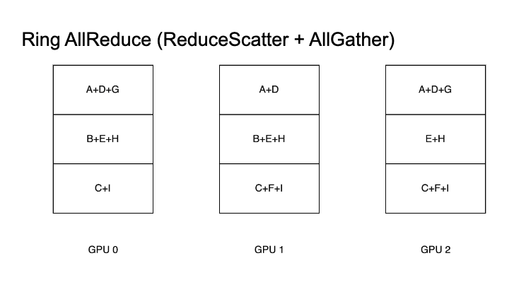

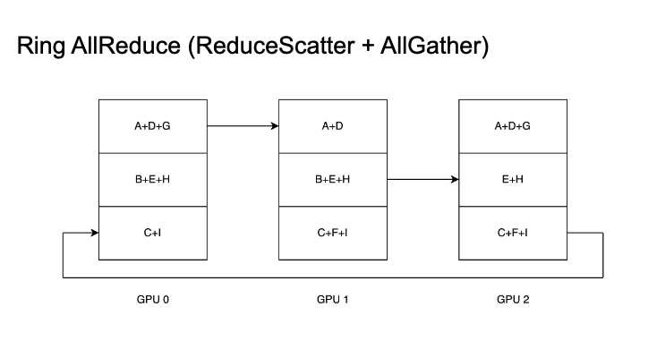

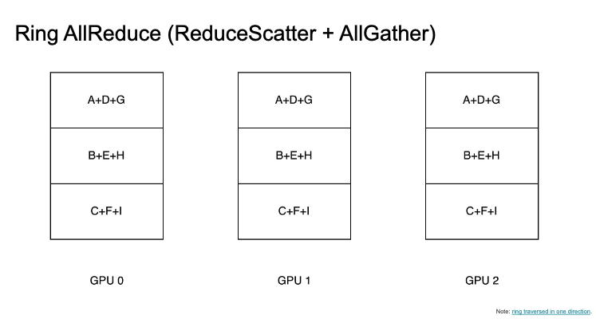

이 몇 장의 그림은 AllGather operation에 관한 것이다. data copy만 있고 data Reduce operation은 없다. operation 완료 후 모든 rank의 data가 같은 sum value를 갖는 것을 볼 수 있다.

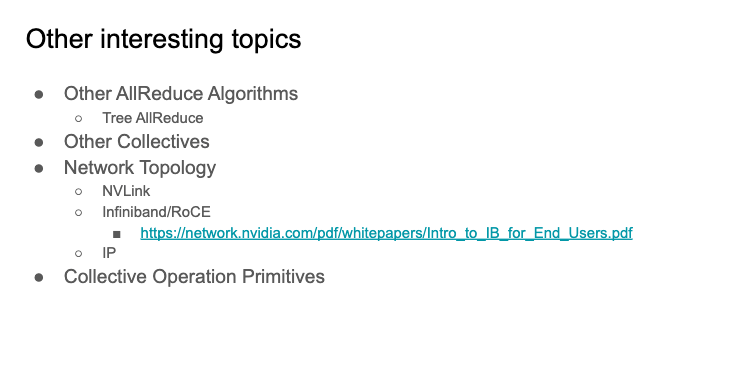

여기서 몇 가지 흥미로운 지식을 언급한다.
- Ring Allreduce 외에도 Tree AllReduce algorithm 같은 다른 AllReduce algorithm이 있다. https://developer.nvidia.com/blog/massively-scale-deep-learning-training-nccl-2-4/ 를 참고할 수 있다.
- Other Collectives
- network topology 관련 기술. NVLink, Infiniband/RoCE(NVIDIA 공식 whitepaper link 제공), IP network를 포함한다.
- Collective Operation Primitives

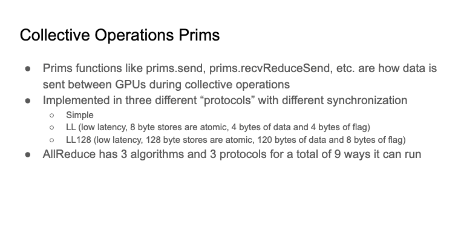

마지막 Slides는 CUDA의 다른 collective operation primitives를 소개한다. 주로 `prims.send`, `prims.recvReduceSend` 같은 function이 GPU 사이에서 collective operation data transfer를 어떻게 수행하는지 설명한다. 이 primitive들은 세 가지 서로 다른 protocol을 구현한다. Simple, LL(low latency protocol, 8-byte atomic store, 4-byte data와 4-byte flag), LL128(low latency 128-bit protocol, 128-byte atomic store, 120-byte data와 8-byte flag)이다. 또한 AllReduce operation은 3가지 algorithm과 3가지 protocol을 조합해 총 9가지 서로 다른 run mode를 가질 수 있다. 이런 primitive는 GPU cluster의 parallel computing과 data communication에 유연한 performance 선택지를 제공한다.

## 정리

이 강의는 NVIDIA의 NCCL(NVIDIA Collective Communications Library) communication library를 소개하고, distributed deep learning에서의 적용을 중점적으로 설명한다. 먼저 PyTorch DDP 예시를 통해 NCCL이 효율적인 gradient synchronization을 어떻게 구현하는지 보여준다. 이어 NCCL의 기본 개념, API 사용, communicator initialization 방식도 소개하고, Ring AllReduce algorithm의 동작 원리를 깊이 분석한다.
