# NVIDIA 기술 살롱 [대규모 EP 최적화: PD 분리 MoE 병렬 방식] 강의 노트

> Slides는 BiliBili NVIDIA 엔비디아 채널에 업로드된 NVIDIA 전문가 대면 기술 살롱 《대규모 EP 최적화: PD 분리 MoE 병렬 방식》 영상 설명에서 가져왔다. 여기서는 영상을 참고해 Slides의 핵심을 더 자세히 기록했고, 학습용으로 사용한다. 이 발표가 실제로 대응하는 것은 SGLang의 Large-Scale EP+PD 분리 방안이며, 일부 Slides도 SGLang 블로그 https://lmsys.org/blog/2025-05-05-large-scale-ep/ 에서 발췌한 것이다.

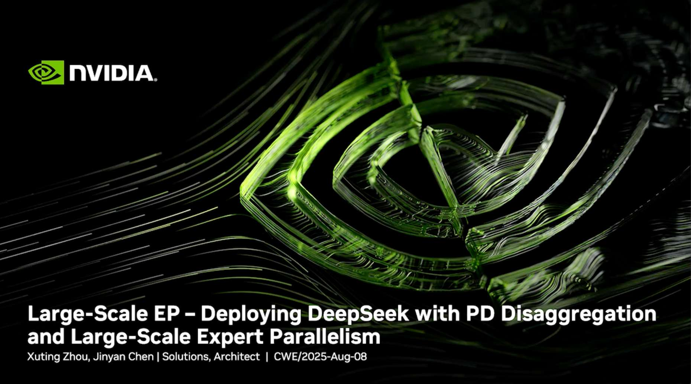

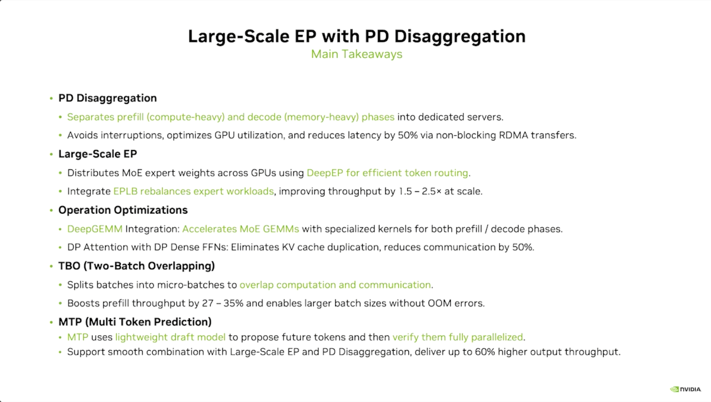

이 Slides는 주로 다섯 가지 핵심 기술 혁신을 설명한다.
- PD 분리(Prefill-Decode Disaggregation)는 Compute-Bound인 Prefill 단계와 Memory-Bound인 Decoding 단계를 전용 서버로 분리해 interruption을 피하고 GPU 이용률을 최적화하며, non-blocking RDMA 전송을 통해 latency를 50% 낮춘다.
- 대규모 전문가 병렬(Large-Scale EP)은 DeepEP를 사용해 MoE expert weight를 여러 GPU에 분산하고, EPLB expert parallel load balancing을 통합해 scale-out 환경에서 throughput을 1.5-2.5배 향상시킨다.
- operator 최적화에는 DeepGEMM 통합을 통한 MoE 행렬곱 가속, 그리고 DP Attention과 DP Dense FFNs(DeepSeek-V3/R1의 앞 3개 Dense layer 대상)가 포함된다. KV Cache 중복을 제거하고 communication overhead를 50% 줄인다.
- TBO(dual-batch Overlap)는 batch를 Micro-Batch로 나누어 계산과 communication을 overlap하며, Prefill throughput을 27-35% 향상시키고 더 큰 batch를 지원한다.
- MTP(Multi-Token Prediction)는 lightweight Draft 모델을 사용해 미래 Token을 병렬로 예측하고 검증하며, 대규모 EP와 PD 분리에 부드럽게 결합되어 최대 60%의 output throughput 향상을 제공한다.

이 기술들은 함께 효율적인 대규모 추론 시스템 최적화 방안을 구성한다.

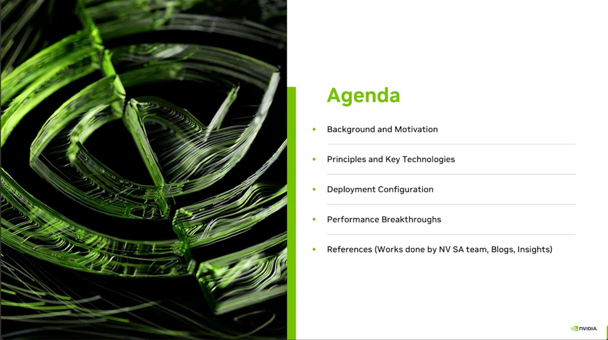

이번 발표의 목차는 다음과 같다. 배경과 동기(Background and Motivation)는 기술 발전의 배경과 추진력을 소개한다. 원리와 핵심 기술(Principles and Key Technologies)은 core 기술 원리를 깊이 설명한다. 배포 설정(Deployment Configuration)은 실제 배포 방안을 설명한다. 성능 돌파(Performance Breakthroughs)는 최적화 효과와 성능 향상을 보여 준다. 참고 자료(References)는 NVIDIA SA 팀의 작업 성과, 블로그 글, 기술 insight를 포함한다.

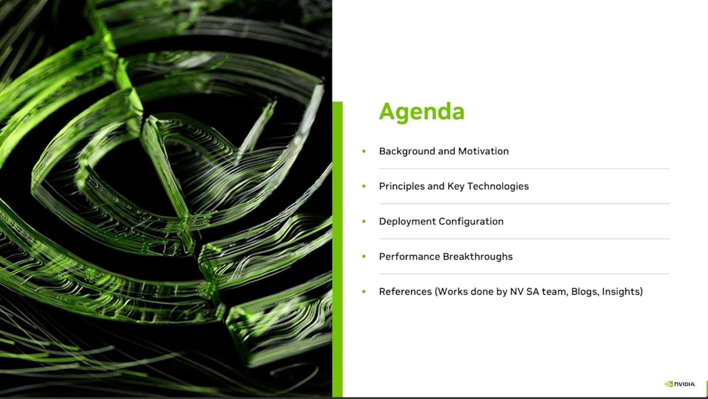

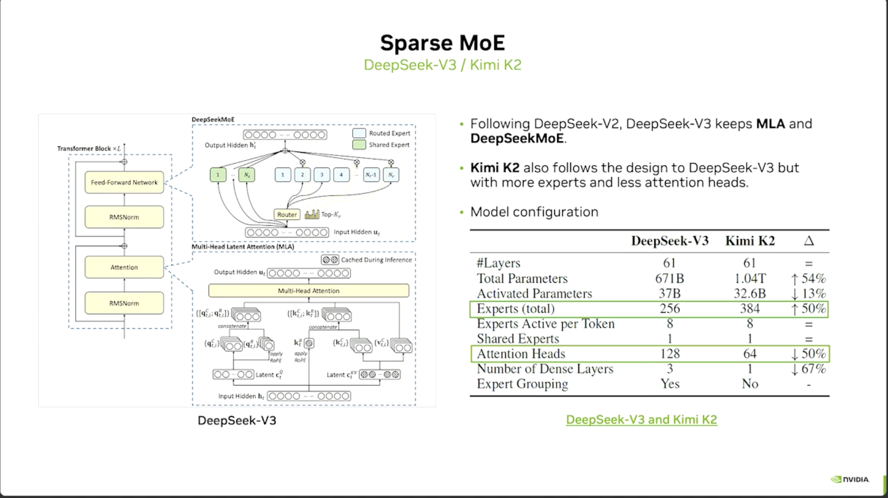

여기서는 DeepSeek-V3 배경을 간단히 되짚었다. Slides는 DeepSeek-V3의 전체 구조를 보여 준다. 표준 Transformer Block(Feed-Forward Network, RMSNorm, Attention 구성 요소 포함)에서 DeepSeekMoE 모듈로 연결되고, 이 모듈은 Router를 통해 여러 expert 중 Top-K를 선택해 routing하며, Routed Expert(초록색 실선 박스)와 Shared Expert(초록색 점선 박스)를 구분한다. 또한 Multi-Head Latent Attention(MLA)의 구조를 자세히 보여 주며, 입력 hidden layer가 multi-head Attention 메커니즘을 통해 q, k, v를 처리하고 RoPE를 적용해 latent representation을 생성하는 과정도 포함한다. 오른쪽에는 상세한 모델 설정 비교 표가 제공된다. Kimi K2는 총 parameter 수가 1.04T(DeepSeek-V3의 671B보다 54% 증가)에 이르고 expert 총수도 384개(DeepSeek-V3의 256개보다 50% 증가)에 이르지만, activated parameter 수(32.6B vs 37B), Attention head 수(64 vs 128), dense layer 수(1 vs 3)는 모두 줄어들었고, 더 sparse해졌음을 보여 준다.

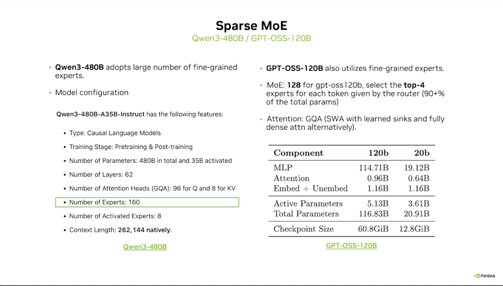

여기서는 Qwen3-480B와 GPT-OSS-120B 모델의 아키텍처 설계와 설정 특징을 계속 비교했다. 왼쪽은 Qwen3-480B 모델을 보여 주며, 구체적으로 Qwen3-480B-A35B-Instruct 모델을 설정했다. 이는 pre-training과 post-training을 거친 causal language model로, 총 parameter 수는 480B이고 activated parameter는 35B이며, 모델 깊이는 62 layer이다. Attention 메커니즘은 GQA(Grouped Query Attention) 설정을 사용하고, 96개의 Q head와 8개의 KV head를 포함한다. 총 160개의 expert가 배치되고, 각 token은 8개의 expert를 activate하며, native context length는 최대 262,144 token에 이른다.

오른쪽은 GPT-OSS-120B 모델을 자세히 소개한다. 마찬가지로 fine-grained expert 설계를 사용하며, MoE 설정은 128 expert이고 router가 각 token마다 Top-4 expert를 선택한다(총 parameter의 90% 이상을 커버). Attention 메커니즘은 GQA를 지원한다(SWA with learned sink 또는 full dense Attention). 오른쪽에는 상세한 parameter 구성 비교 표도 제공된다. 120b 버전은 MLP parameter 114.71B, Attention parameter 0.96B, embedding 및 non-embedding parameter 1.16B, activated parameter 5.13B, 총 parameter 116.83B, checkpoint size 60.8GiB이고, 20b 버전은 각각 MLP parameter 19.12B, Attention parameter 0.64B, embedding 및 non-embedding parameter 1.16B, activated parameter 3.61B, 총 parameter 20.91B, checkpoint size 12.8GiB이다. 여기서는 두 GPT-OSS 모델의 아키텍처 차이를 명확히 보여 준다.

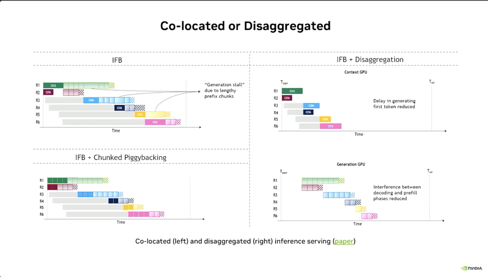

이 Slides는 두 가지 대형 언어 모델 추론 serving 아키텍처의 성능 특징과 최적화 전략을 보여 준다. 왼쪽의 "Co-located(공배치)" 아키텍처는 전통적인 추론 batching 모드의 문제를 보여 준다. IFB(In-Flight Batching) 모드에서 여러 request(R1-R6)의 Prefill 단계(실색 블록)와 Decode 단계(줄무늬 블록)가 모두 같은 GPU 그룹에서 실행된다. 긴 prefix block 때문에 "Generation stall"(생성 정체)이 발생하고 Decode 단계가 뚜렷하게 지연된다. 반면 "Chunked Piggybacking" 기술을 도입해 Prefill을 더 작은 chunk로 분해하면, Decode 단계가 더 일찍 시작되고 이후 request의 Prefill과 overlap될 수 있어 generation stall 문제를 효과적으로 완화한다. 오른쪽의 "Disaggregated(분리)" 아키텍처는 Prefill과 Decode 작업을 서로 다른 GPU로 분리해 근본적으로 최적화한다. Context GPU는 Prefill 작업을 전담하며 여러 request의 Prefill 단계를 효율적으로 병렬 처리할 수 있어 "첫 token 생성 latency 감소"를 크게 이룬다. Generation GPU는 Decode 작업을 전담하고 이후 token 생성에 집중한다. 계산 집약적인 Prefill과 memory 집약적인 Decode를 분리함으로써 "Decode와 Prefill 단계 사이의 간섭을 줄이고", Generation GPU가 더 매끄럽고 연속적으로 token 생성을 수행하게 해 전체 throughput과 효율을 높인다.

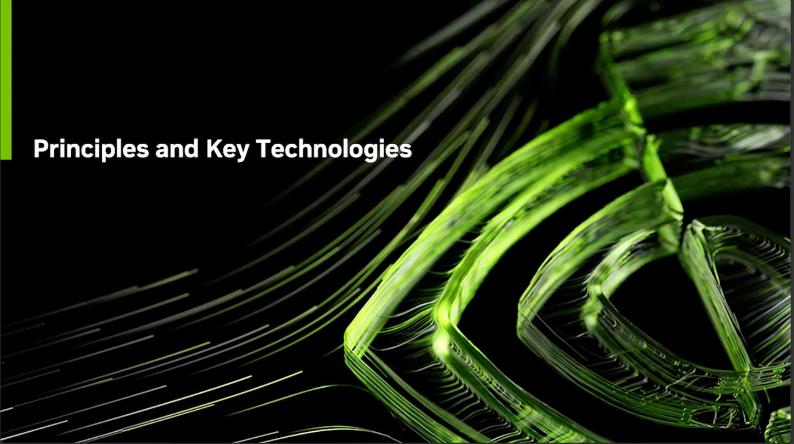

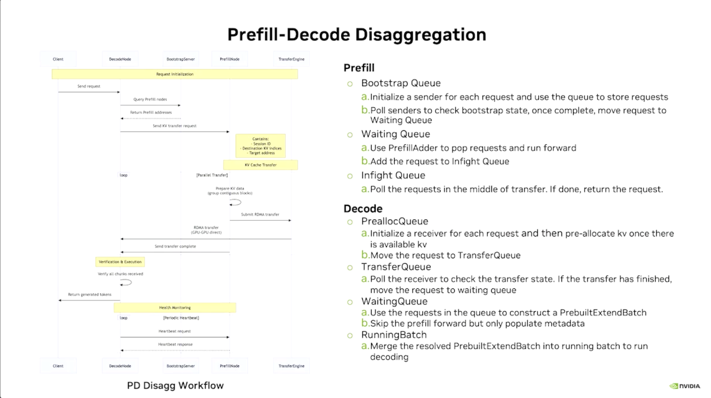

이 Slides는 SGLang PD 분리의 아키텍처 flow chart를 보여 준다. 그림은 다섯 가지 core component(클라이언트, Decode node, bootstrap server, Prefill node, Transfer Engine) 사이의 상호작용 흐름을 보여 준다. request 초기화 단계(클라이언트가 Decode node에 request를 보내고, Decode node가 bootstrap server를 통해 Prefill node 주소를 조회한 뒤 KV 전송 request를 보냄)에서 KV Cache 전송 단계(Prefill node가 KV 데이터를 준비하고 contiguous block을 grouping한 뒤 Transfer Engine을 통해 GPU-GPU 직접 RDMA 전송을 수행하며, 전송 내용은 session ID, target KV index, target address를 포함하고 "Parallel Transfer" loop로 표시됨), 다시 검증과 실행 단계(Decode node가 모든 block 수신 완료 여부를 검증하고 클라이언트에 생성 token을 반환), 그리고 health monitoring 단계(Decode node가 주기적으로 bootstrap server에 heartbeat request를 보내며 "Periodic Heartbeat" loop로 표시됨)까지 이어진다.

오른쪽 내용은 직접 기록하면 매우 추상적이고 이해하기 어렵다. 위의 아키텍처 그림도 그다지 선명하지 않다. SGLang PD 분리 아키텍처를 이해하려면 아래 자료를 읽는 것을 권한다.

SGLang PD 분리 아키텍처를 설명한 Zhihu 글 두 편 https://zhuanlan.zhihu.com/p/1912106909617624371 & https://zhuanlan.zhihu.com/p/1921162497592886258 을 참고할 수 있다.

그리고 이 발표에 대응하는 원 Blog는 https://mp.weixin.qq.com/s/DJpuqJnTCelMvNerDD2_Og 이다.

가장 권위 있는 SGLang PD 분리 공식 설계 문서는 https://docs.google.com/document/d/1rQXJwKd5b9b1aOzLh98mnyMhBMhlxXA5ATZTHoQrwvc/edit?tab=t.0#heading=h.i3s2t1j0e1ik 이다.

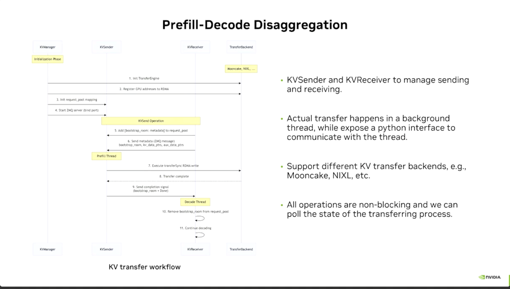

이 Slides는 "Prefill-Decode Disaggregation" 아키텍처에서 KV(Key-Value) 전송의 전체 workflow와 기술 구현을 보여 준다. 왼쪽 sequence diagram은 네 가지 core component(KVManager, KVSender, KVReceiver, TransferBackend) 사이의 상호작용 과정을 보여 준다. 초기화 단계에서 KVManager는 먼저 KVSender에 "Init TransferEngine" 명령을 보내고, KVSender는 이어 TransferBackend에 GPU address를 등록해 RDMA(Remote Direct Memory Access)를 수행한다. 동시에 KVManager는 KVReceiver에 "Init request_pool mapping" 명령을 보내고 "Start ZMQ server (bind port)"를 시작하도록 지시한다. KV send operation 단계에서 KVSender는 [bootstrap_room: metadata]를 내부 request_pool에 추가하고, ZMQ message를 통해 bootstrap_room, kv_data_ptrs, aux_data_ptrs를 포함한 metadata를 KVReceiver에 보낸다. Prefill thread 단계에서 KVSender는 TransferBackend를 통해 transferSync RDMA write 작업을 수행해 KV 데이터를 쓴다. TransferBackend는 데이터 전송 완료 후 KVSender에 "Transfer complete" signal을 반환하고, 이후 KVSender는 KVReceiver에 "Send completion signal (bootstrap_room + Done)"을 보내 KV 데이터 전송 완료를 알린다. Decode thread 단계에서는 KVReceiver가 completion signal을 받은 뒤 request_pool에서 해당 bootstrap_room을 제거하고 Decode 작업을 계속 수행한다.

오른쪽 내용은 다음과 같다. KVSender와 KVReceiver는 KV 데이터의 송신과 수신 과정을 관리한다. background transfer는 실제 데이터 전송 thread 안에서 수행되며, 동시에 Python interface를 노출해 이 thread와 통신하고 main program의 non-blocking 특성을 보장한다. 시스템은 Mooncake, NIXL 등 다양한 KV transfer backend를 지원해 flexibility와 extensibility를 제공한다. 모든 작업은 non-blocking이며, 전송 과정 상태를 polling할 수 있어 효율적인 asynchronous 처리를 구현한다.

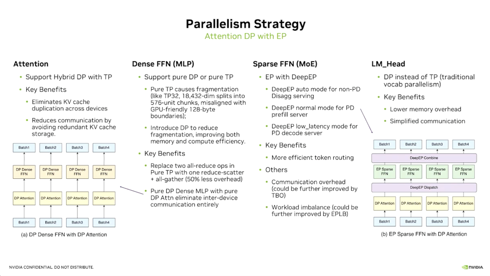

이 Slides는 SGLang 대규모 EP로 DeepSeek-V3를 배포하는 병렬 방안을 보여 준다. Slides는 네 가지 주요 부분으로 나뉜다. Attention 메커니즘의 병렬 최적화는 hybrid DP와 TP 전략을 지원하며, 핵심 장점은 cross-device KV Cache 중복을 제거하는 데 있다. redundant KV Cache 저장을 피함으로써 communication overhead를 줄인다. 그림 (a)는 "DP Dense FFN Network와 DP Attention" 아키텍처를 보여 주며, 각 batch(Batch1-4)가 독립적으로 DP Dense FFN과 DP Attention module을 통과한다. Dense FFN의 병렬 최적화는 pure DP 또는 pure TP를 지원한다. pure TP는 fragmentation 문제를 일으킨다고 지적한다(예: TP32가 18,432 dimension을 576 unit block으로 분할하면 GPU-friendly한 128-byte boundary와 정렬되지 않음). DP 도입의 목적은 fragmentation을 줄여 memory와 compute efficiency를 높이는 것이다. 핵심 장점에는 pure TP의 두 번 all-reduce 작업을 한 번의 reduce-scatter와 한 번의 all-gather로 대체해 50% overhead를 줄이는 것, 그리고 pure DP Dense MLP와 pure DP Attention 결합으로 inter-device communication을 완전히 제거할 수 있다는 점이 포함된다.

Sparse FFN Network의 병렬 최적화는 expert parallelism과 DeepEP 결합을 사용한다. DeepEP는 여러 모드(non-PD 분리 service용 automatic mode, PD Prefill server용 Normal mode, PD Decode server용 low-latency mode)를 제공한다. 핵심 장점은 더 효율적인 token routing이다. 다른 최적화 방향에는 communication overhead(TBO로 추가 개선 가능)와 workload imbalance(EPLB로 추가 개선 가능)가 있다. 그림 (b)는 "EP Sparse FFN Network와 DP Attention" 아키텍처를 보여 준다. Attention layer는 data parallel을 사용하고, Sparse FFN Network는 DeepEP Dispatch를 통해 expert scheduling을 수행하며, 각 batch의 DP Attention output을 EP Sparse FFN으로 routing한 뒤 DeepEP Combine으로 결과를 aggregate한다.

언어 모델 LM_Head의 병렬 최적화는 TP(전통 vocabulary parallel)가 아니라 DP를 사용한다. 핵심 장점은 더 낮은 memory overhead와 단순화된 communication이다.

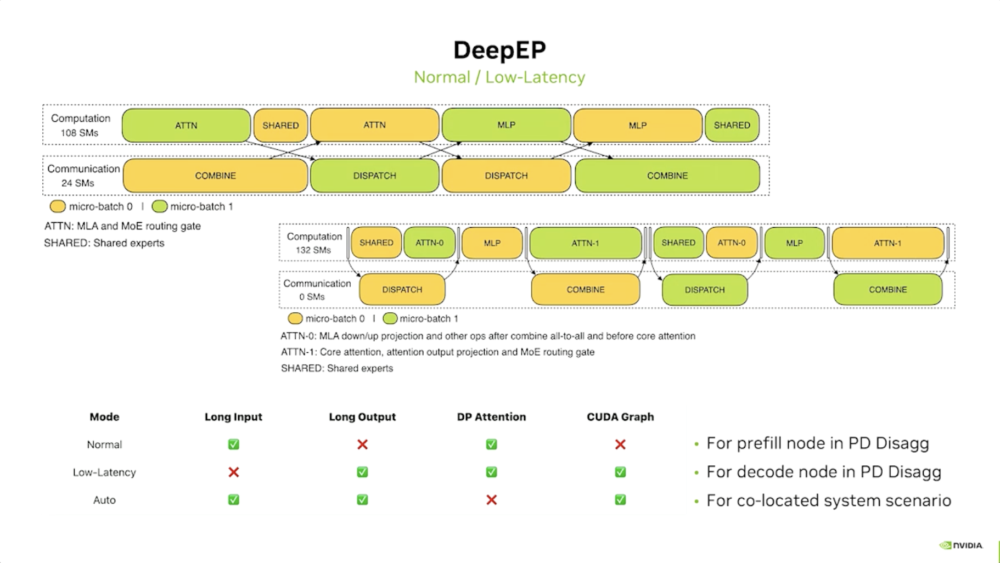

이 Slides는 DeepEP의 workflow를 보여 준다. 이 workflow는 DeepSeek 공식이 제안한 것으로, DeepEP의 두 가지 형태의 kernel과 TBO를 결합해 계산과 communication을 overlap할 수 있게 한 workflow다.

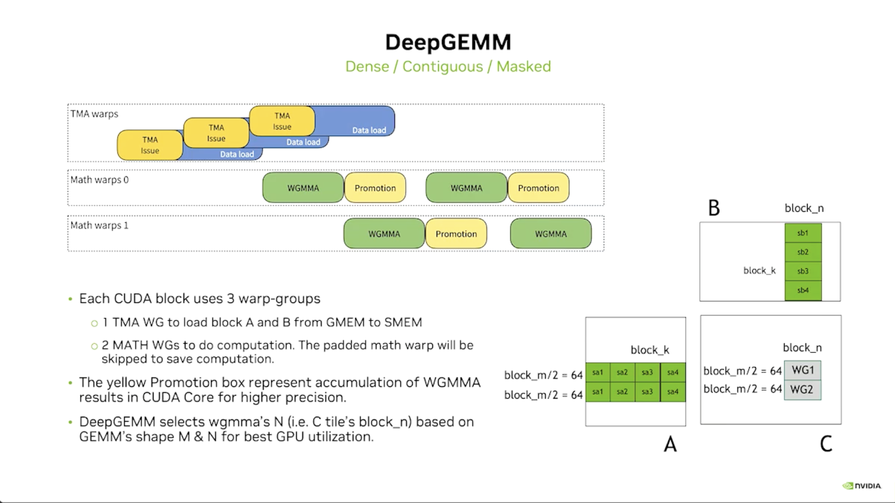

DeepGEMM에는 세 가지 형태의 kernel이 있다. 하나는 q, k, v projection 같은 행렬곱에 쓰이는 Dense이고, 하나는 DeepEP Normal Dispatch 뒤에 쓰이는 Contiguous mode이며, 하나는 DeepEP Low Latency Dispatch 뒤에 쓰이는 Masked mode다.

DeepGEMM 최적화에서는 주로 warp specialization을 사용했다. Warp scheduling과 execution flow chart는 세 가지 유형의 warp를 보여 준다. TMA warps는 data loading을 담당하며, "TMA Issue"(노란색 박스)를 통해 명령을 발행하고 "Data load"(파란색 bar)를 실행해 global memory(GMEM)에서 shared memory(SMEM)로 데이터를 load한다. Math warps 0과 Math warps 1은 실제 계산을 담당하며, 서로 번갈아 "WGMMA"(Warp Group Matrix Multiply Accumulate, 초록색 박스)를 실행해 Tensor Core 계산을 수행하고, "Promotion"(노란색 박스)을 통해 WGMMA 결과를 CUDA Core에서 accumulate해 precision을 높인다.

CUDA Block의 Warp Group 할당은 각 CUDA block이 3개의 warp-groups를 사용함을 보여 준다. 1개의 TMA Warp Group은 GMEM에서 matrix A와 B의 block을 SMEM으로 load하는 데 전담되고, 2개의 Math Warp Groups는 계산 실행에 사용된다. 계산 자원을 아끼기 위해 padding된 math warp는 건너뛴다. "Promotion" 노란색 박스는 WGMMA 결과가 CUDA Core에서 accumulate되는 과정을 명확히 나타낸다.

DeepGEMM의 최적화 전략은 GEMM 작업의 전체 shape M과 N에 따라 WGMMA의 N dimension(output C tile의 block_n)을 intelligent하게 선택해 최적 GPU utilization을 달성한다. matrix block partition 예시는 그림 A가 block_k가 두 개의 block_m/2=64 sub-block으로 어떻게 나뉘는지 보여 주고(각 sub-block은 sa1부터 sa4까지 네 부분으로 세분화됨), 그림 B는 block_n이 sb1부터 sb4까지 네 개 sub-block으로 수직 분할되는 방식을 보여 주며, 그림 C는 output matrix C의 block_n dimension이 두 개의 block_m/2=64 영역으로 나뉘고 각각 WG1과 WG2 두 Warp Group이 처리하는 방식을 보여 준다.

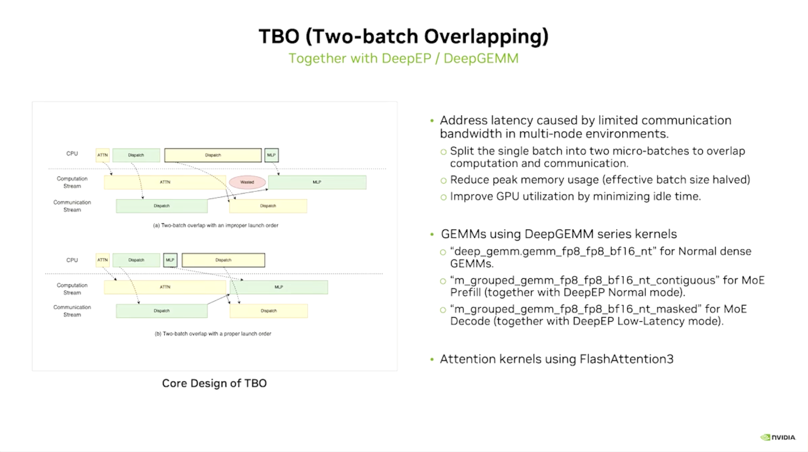

이 Slides는 "TBO(Two-batch Overlapping)"를 자세히 소개한다. 이 기술은 DeepEP 및 DeepGEMM과 함께 동작해 multi-node 환경에서 communication bandwidth 제한으로 인한 latency 문제를 해결하는 것을 목표로 한다. Slides는 좌우 두 부분으로 구성된다.

**왼쪽의 "Core Design of TBO" 그림**은 두 가지 TBO scheduling 방식을 보여 준다. 그림 (a) "Two-batch overlap with an improper launch order"는 CPU, computation stream, communication stream이 부적절한 scheduling 아래에서 보이는 상황을 묘사한다. CPU가 두 개의 Dispatch 명령을 내고, computation stream의 ATTN 및 MLP 작업과 communication stream의 Dispatch 작업이 교차해 진행되지만, scheduling이 부적절해 두 번째 ATTN 작업 완료 후 communication stream의 두 번째 Dispatch 작업이 기다려야 하고, 뚜렷한 "Wasted" 시간 구간이 나타나 GPU가 idle 상태임을 보여 준다. 그림 (b) "Two-batch overlap with a proper launch order"는 scheduling 최적화를 통해 그림 (a)의 "Wasted" 시간을 제거하는 방식을 보여 준다. CPU는 마찬가지로 두 개의 Dispatch 명령을 내지만, computation stream의 두 번째 ATTN 작업과 communication stream의 두 번째 Dispatch 작업이 앞당겨 시작되어 이전 batch의 communication 및 compute 작업과 효과적으로 overlap된다. 이 "proper launch order"는 단일 batch를 두 개의 Micro Batch로 분할해 compute와 communication이 병렬로 진행될 수 있게 하여 efficiency를 크게 높인다.

**오른쪽의 텍스트 부분**은 TBO의 장점과 구체적 기술을 자세히 설명한다. 주요 목표는 multi-node 환경에서 제한된 communication bandwidth로 인한 latency 문제를 해결하는 것이며, 핵심 전략은 단일 batch를 두 개의 Micro Batch로 나누어 compute와 communication overlap을 구현하는 것이다. 주요 이점에는 peak memory usage 감소와 idle time 최소화를 통한 GPU utilization 향상이 포함된다. 사용한 GEMM kernel에는 일반 dense GEMM용 "deep_gemm.gemm_fp8_fp8_bf16_nt", MoE Prefill용 "m_grouped_gemm_fp8_fp8_bf16_nt_contiguous", MoE Decode용 "m_grouped_gemm_fp8_fp8_bf16_nt_masked"가 포함되며, 사용한 attention kernel은 FlashAttention3이다.

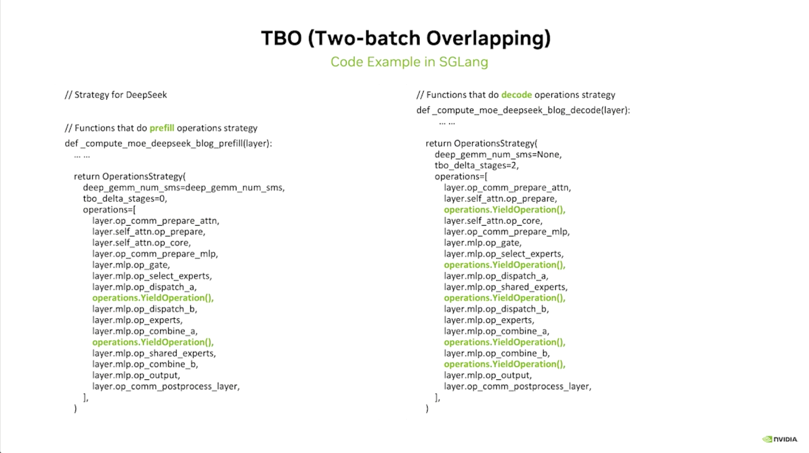

이 Slides는 SGLang framework 아래에서 "TBO(Two-batch Overlapping)" 기술의 코드 구현 예시를 보여 주며, 특히 DeepSeek 모델의 Prefill(Prefill)과 Decode(Decode) 작업 전략을 대상으로 한다.

좌우 두 부분은 각각 두 가지 작업의 Python code snippet을 보여 준다. **왼쪽은 Prefill 작업 전략**(`_compute_moe_deepseek_blog_prefill`)으로, 하나의 `OperationsStrategy`를 정의하고 `tbo_delta_stages`를 0으로 설정하며, attention(`attn`), multi-layer perceptron(`mlp`)의 준비, core compute, gating, expert selection, dispatch, combine, postprocess 등 일련의 작업을 나열한다. 그 사이에 `operations.YieldOperation()` 호출이 두 번 삽입되어 있으며, 이 지점에서 batch 간 operation overlap을 수행할 수 있음을 나타낸다.

**오른쪽은 Decode 작업 전략**(`_compute_moe_deepseek_blog_decode`)이다. 마찬가지로 하나의 `OperationsStrategy`를 정의하지만 `tbo_delta_stages`는 2로 설정되어 있고, operation sequence에는 최대 다섯 번의 `operations.YieldOperation()` 호출이 포함된다. 이는 Decode 단계의 overlap 전략이 더 세밀하고 빈번하며, memory-intensive하고 latency-sensitive한 특성에 맞추기 위한 것임을 보여 준다. 예를 들어 attention 준비, expert selection, shared expert 처리, 두 번의 combine 작업 이후 모두 `YieldOperation`이 설정되어 있으며, compute와 communication의 parallelism을 최대화해 전체 throughput과 efficiency를 높이는 것을 목표로 한다. 비교해 보면 `tbo_delta_stages` parameter와 `YieldOperation`의 배치가 서로 다른 단계에서 TBO 최적화 효과를 구현하는 핵심임을 알 수 있다.

Qwen처럼 다른 모델의 경우 shared experts가 없으므로, TBO를 사용하려면 이러한 전략을 모델에 맞게 조정해야 한다.

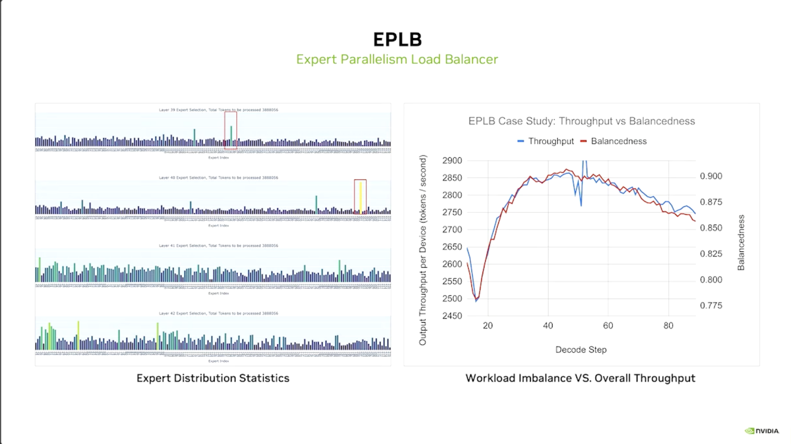

이 Slides는 **EPLB(Expert Parallelism Load Balancer, expert parallel load balancer)**의 역할과 성능에 미치는 영향을 설명한다.

그림은 두 가지 주요 부분으로 나뉜다. **expert distribution statistics**는 네 개의 bar chart를 보여 주며, 각각 모델의 서로 다른 layer(Layer 39, 40, 41, 42)의 expert selection 상황에 대응한다. 각 layer가 처리해야 하는 총 token 수는 모두 3888056이다. Layer 39와 Layer 40의 chart는 뚜렷한 load imbalance를 보여 준다. 몇몇 expert가 빨간색 박스처럼 강조된 bar를 통해 다른 expert보다 훨씬 많은 token 처리 작업을 할당받고, 대부분의 expert는 load가 매우 낮거나 아예 load가 없다. 이는 효과적인 load balancing이 없을 때 compute resource utilization이 낮고 bottleneck이 존재함을 나타낸다. Layer 41과 Layer 42의 chart는 더 균일한 expert load distribution을 보여 준다. bar 높이가 더 일관되고 뚜렷한 peak가 없으며, token이 모든 expert에 더 평균적으로 할당되어 parallel processing efficiency와 overall resource utilization이 향상되었음을 뜻한다.

**EPLB case study: throughput과 balancedness**는 line chart로, 서로 다른 Decode step에서 output throughput(Output Throughput per Device, 단위 tokens/second, 파란색 선)과 balancedness(빨간색 선)의 변화 추이를 보여 준다. chart는 throughput과 balancedness 사이에 높은 positive correlation이 있음을 보여 준다. Decode step 20에서 40 근처까지 둘 다 빠르게 상승해 peak에 도달하고, throughput은 약 2850 tokens/second에 가까우며 balancedness는 약 0.88에 가깝다. 이후 둘 다 점차 하락하지만 추세는 일관되게 유지된다. Decode step 50 근처에서 throughput이 뚜렷하게 하락하고 balancedness도 함께 약간 낮아져, load balancing이 system throughput에 직접적인 영향을 준다는 점을 한층 더 입증한다.

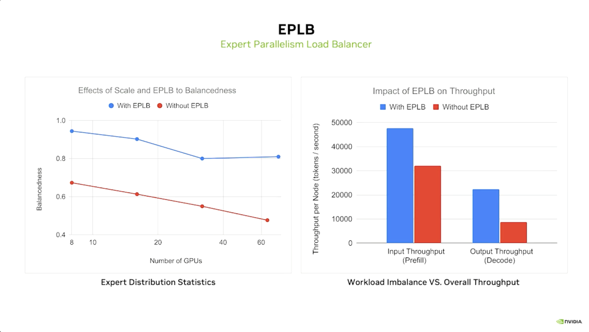

여기서는 simulated data distribution에서 EPLB를 켰을 때의 이득을 보여 준다. 이는 단지 참고 데이터일 뿐이며, 실제 data distribution에서 자체 측정한 결과를 기준으로 삼아야 한다.

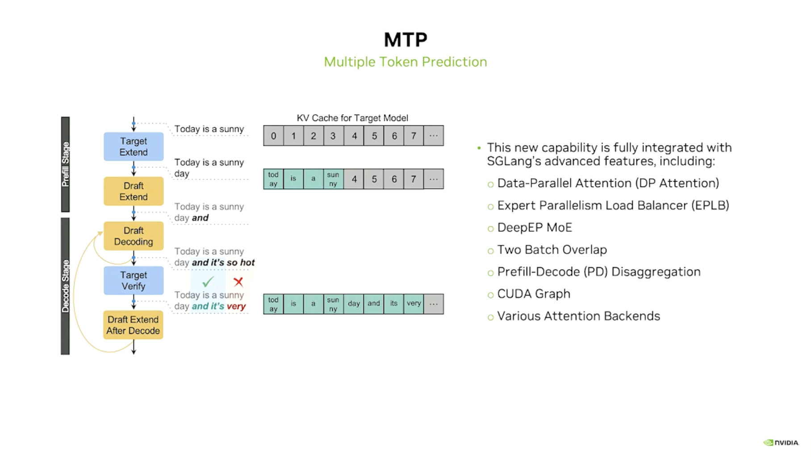

이 Slides는 **MTP(Multiple Token Prediction, multi-token prediction)** 기술 및 SGLang framework 아래에서의 integration과 optimization을 소개한다.

flow chart는 MTP의 working mechanism을 보여 주며, **Prefill 단계(Prefill Stage)**와 **Decode 단계(Decode Stage)**로 나뉜다. 실제로 여기의 working mechanism은 https://github.com/zhaochenyang20/Awesome-ML-SYS-Tutorial/blob/main/sglang/speculative-decoding/speculative-decoding.md 에 자세히 설명되어 있다.

앞에서 언급한 다른 최적화와 MTP는 모두 compatible하다.

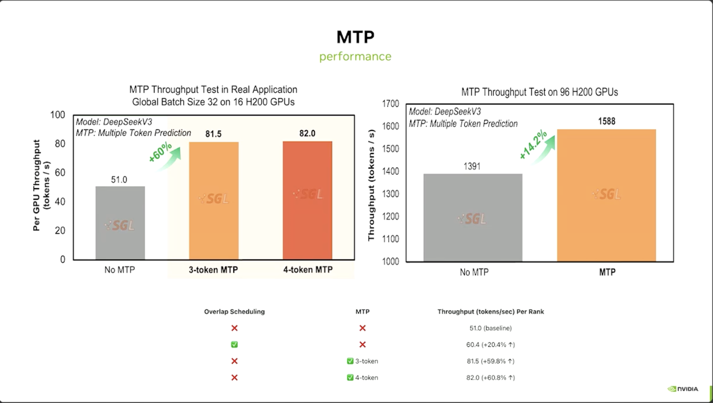

이 Slides는 MTP가 대형 언어 모델 추론 성능 향상에 미치는 뚜렷한 효과를 보여 주며, 두 개의 bar chart와 하나의 table을 통해 서로 다른 설정에서의 throughput 데이터를 제시한다. **실제 응용에서의 MTP throughput 테스트(16개 H200 GPU)**는 DeepSeekV3 모델에서 global batch size 32를 사용할 때, MTP를 켜지 않으면 GPU당 throughput이 51.0 tokens/s이고, 3-token MTP를 켜면 GPU당 throughput이 81.5 tokens/s로 상승해 60% 성능 향상을 달성하며, 4-token MTP를 켜면 GPU당 throughput이 82.0 tokens/s로 더 올라가 60.8% 성능 향상을 달성함을 보여 준다.

**대규모 배포에서의 MTP throughput 테스트(96개 H200 GPU)**는 DeepSeekV3 모델에서 MTP를 켜지 않으면 total throughput이 1391 tokens/s이고, MTP를 켜면 total throughput이 1588 tokens/s로 상승해 14.2% 성능 향상을 달성함을 보여 준다.

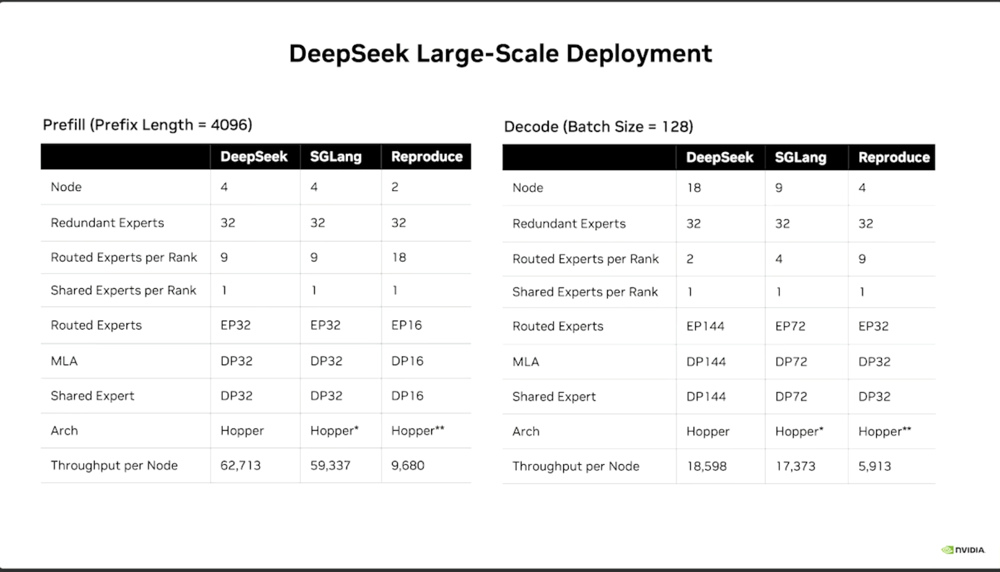

여기서는 DeepSeek 공식, SGLang, NVIDIA가 H20에서 SGLang 대규모 EP+PD 분리 방안을 재현한 구체적 데이터를 보여 준다.

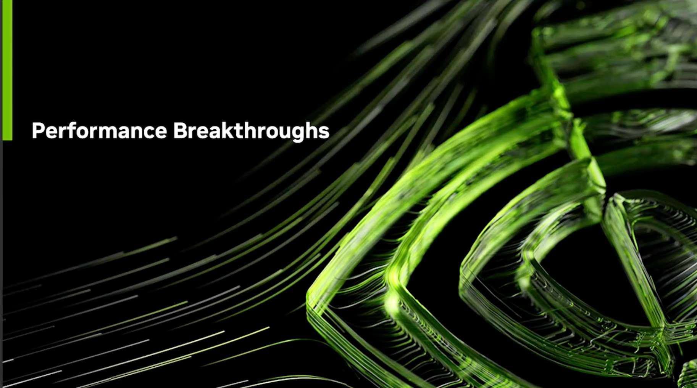

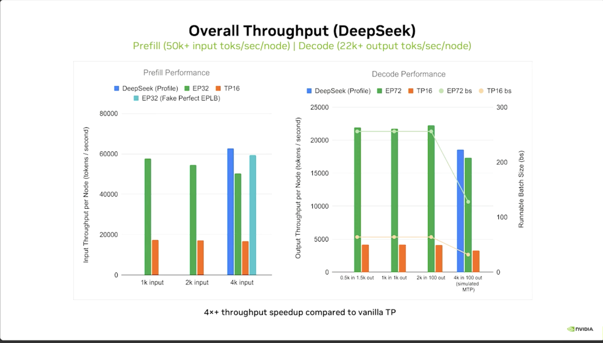

이 Slides는 DeepSeek 모델이 Prefill(Prefill)과 Decode(Decode) 단계에서 보이는 전체 throughput 성능을 보여 주고, 이를 전통적인 tensor parallel(TP16) 및 다른 expert parallel(EP) 설정과 비교해 전통 TP(노란색) 대비 뚜렷한 throughput 향상을 강조한다.

 
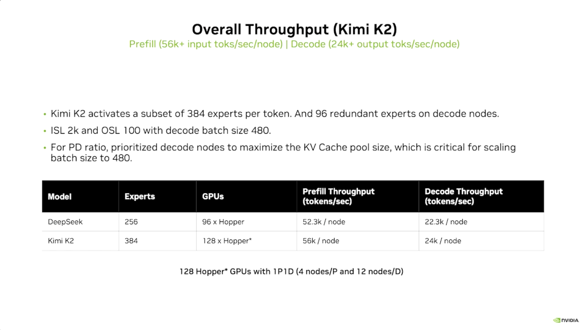

이 Slides는 **Kimi K2 모델이 Prefill(Prefill)과 Decode(Decode) 단계에서 보이는 전체 throughput 성능**을 보여 주고, 이를 DeepSeek 모델과 비교하며, 동시에 이러한 성능을 구현하는 핵심 기술 세부사항과 설정을 설명한다.

Slides 상단 제목은 "Overall Throughput (Kimi K2)"라고 명확히 쓰여 있고, 목표 성능 지표(Prefill throughput 56k+ input tokens/second/node, Decode throughput 24k+ output tokens/second/node)를 제시한다. 아래에는 Kimi K2의 세 가지 핵심 특성과 최적화 포인트가 나열되어 있다. Kimi K2는 token마다 384개 expert의 subset을 activate하고 Decode node에서 96개의 redundant expert를 사용한다(이는 MoE 아키텍처를 채택했고 Decode 단계에 대해 expert redundancy 최적화를 수행했음을 나타냄). 모델은 2k input sequence length(ISL)와 100 output sequence length(OSL)를 지원하며 Decode batch size는 480이다. PD 분리 아키텍처의 비율을 최적화하기 위해 Decode node를 우선시해 KV Cache Pool size를 최대화한다. 이는 batch size를 480까지 확장하는 데 매우 중요하다.

하단에는 상세한 성능 비교 표가 제공되며, DeepSeek와 Kimi K2 두 모델을 비교한다. DeepSeek 모델은 256개 expert를 설정하고 96개 Hopper GPU를 사용해 52.3k tokens/second/node의 Prefill throughput과 22.3k tokens/second/node의 Decode throughput을 달성한다. Kimi K2 모델은 384개 expert를 설정하고 128개 Hopper* GPU를 사용해 56k tokens/second/node의 Prefill throughput과 24k tokens/second/node의 Decode throughput을 달성한다. 표 아래 footnote는 Kimi K2의 128개 Hopper* GPU 설정이 1P3D 아키텍처를 사용한다고 설명한다(구체적으로 4개 Prefill node와 12개 Decode node). Slides 위쪽의 1P1D는 typo인 것 같다.

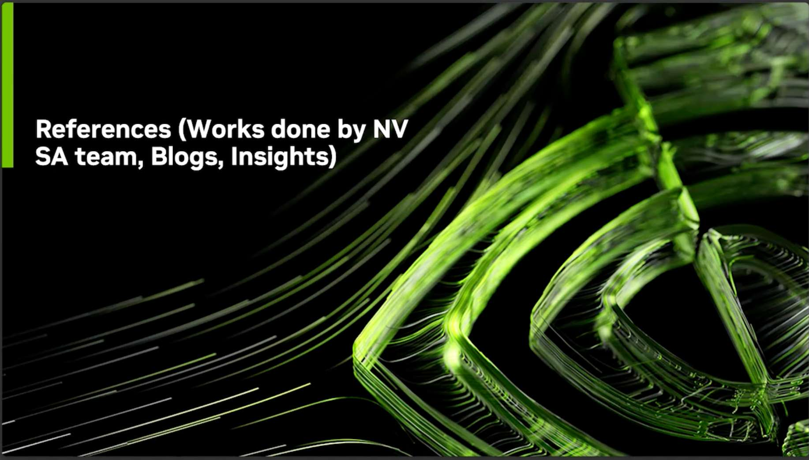

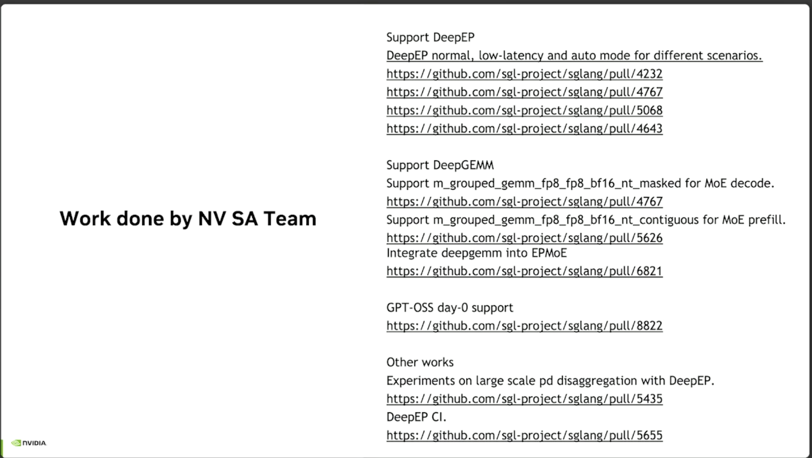

Slides 마지막에는 그들이 SGLang 위에서 수행한 작업을 보여 준다.
