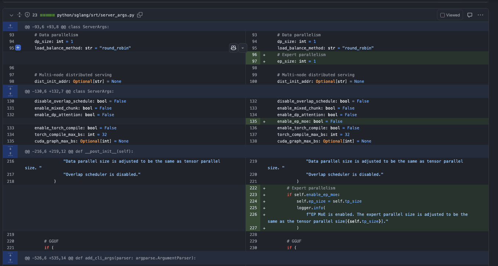
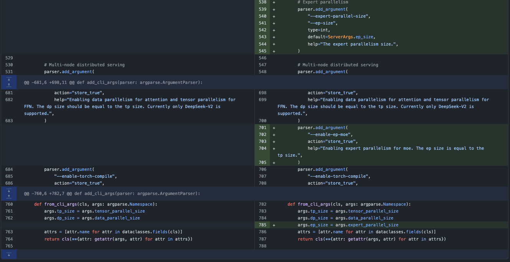
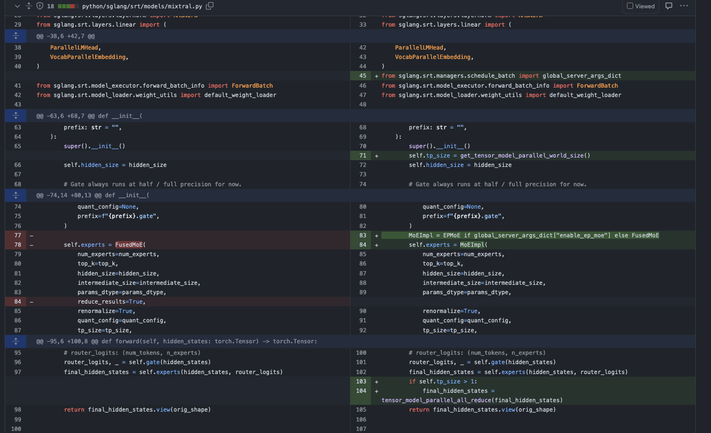

# SGLang의 Expert Parallel 특성 해설

## 0x0. 머리말

최근에서SGlang저장소하하다관련 내용의관련 내용와관련 내용대해SGLang의관련 내용새의Feature도관련 내용있다관련 내용이 글관련 내용이다관련 내용와서관련 내용하SGLang중Expert Parallel의구현，관련 내용필자는이 부분은 원문의 해당 기술 설명을 이어서 서술한다 (SGlang)이다이 부분은 원문의 해당 기술 설명을 이어서 서술한다중관련 내용구현Expert Parallel의。우리는가능로관련 내용하관련 내용이다관련 내용구현의，로및관련 내용와 비교하면일반의EP주요최적화관련 내용에서이 부분은 원문의 해당 기술 설명을 이어서 서술한다 (SGLang)에서 https://github.com/sgl-project/sglang/pull/2371 중구현Expert Parallel，우리는부터여기보다관련 내용 (row)만약대해MoE EP아니관련 내용가능로관련 내용https://zhuanlan.zhihu.com/p/681154742 이 글또는관련 내용읽다 DeepSeek 관련의관련 내용

## 0x1. 상layer의인터페이스





먼저우리는볼 수 있다server_args.py중의이 부분은 원문의 해당 기술 설명을 이어서 서술한다 (Expert Parallel Tensor Parallel)의관련 내용로Deepseek V3로관련 내용있다256개Expert，관련 내용에서켜다Expert Parallel그리고관련 내용`expert_parallel_size`로 설정8의관련 내용그러면각관련 내용상나누어 받는다완전한의32개Expert。관련 내용볼 수 있다에서초기화파라미터의관련 내용만약이 부분은 원문의 해당 기술 설명을 이어서 서술한다 (Expert Paralle)된다관련 내용`expert_parallel_size`로 설정TP의크기。




이어서보다관련 내용하Mixtral모델구현상의관련 내용주목할 점은에서호출한다EPMoE인터페이스의관련 내용있다`reduce_results=True,`이파라미터，하지만에서EPMoE계산완료이후대해결과호출한다`tensor_model_parallel_all_reduce` 。제거`reduce_results=True,`파라미터관련 내용좋은관련 내용에서EP중우리는관련 내용있다대해Expert의파라미터하다분할，만이 부분은 원문의 해당 기술 설명을 이어서 서술한다 (token)까지대응의expert상，하다의matrix multiply모두이다완전한의，그래서관련 내용의결과도이다완전한의。로관련 내용대해결과관련 내용사용`tensor_model_parallel_all_reduce`？관련 내용읽다관련 내용하코드관련 내용답，필자는에서이후의0x4관련 내용이유。

상layer인터페이스차이아니많은보다까지여기관련 내용가능로，핵심 구현관련 내용부분，관련 내용부분이다EP MoE Layer，관련 내용부분이다EP MoE의kernel。관련 내용인내심을 갖고보다관련 내용개。

## 0x2. SGLang EP MoE Layer구현

파일관련 내용https://github.com/sgl-project/sglang/blob/main/python/sglang/srt/layers/moe/ep_moe/layer.py

### 0x2.1 GroupedGemmRunner

먼저보다까지관련 내용개사용된다실행한다Group GEMM의관련 내용먼저간단히 해석관련 내용하이관련 내용낮춘다후관련 내용의부담。필자는관련 내용추가관련 내용하관련 내용

```python
# 사용된다실행한다그룹화matrix multiplication의Runner관련 내용
class GroupedGemmRunner(torch.nn.Module):
    # flashinfer의gemm관련 내용,사용된다가속계산
    flashinfer_gemm_warpper = None

    def __init__(self, device, use_flashinfer: bool = False):
        """
        초기화GroupedGemmRunner
        Args:
            device: 이 부분은 원문의 해당 기술 설명을 이어서 서술한다 (row)
            use_flashinfer: 여부관련 내용사용flashinfer가속
        """
        super().__init__()
        self.device = device
        self.use_flashinfer = use_flashinfer
        if self.use_flashinfer and GroupedGemmRunner.flashinfer_gemm_warpper is None:
            GroupedGemmRunner._init_flashinfer_wrapper(device)

    @classmethod
    def _init_flashinfer_wrapper(cls, device):
        """
        초기화flashinfer의gemm관련 내용
        Args:
            device: 이 부분은 원문의 해당 기술 설명을 이어서 서술한다 (row)
        """
        from flashinfer import SegmentGEMMWrapper

        # 생성한다이 부분은 원문의 해당 기술 설명을 이어서 서술한다
        workspace_buffer = torch.empty(
            128 * 1024 * 1024, dtype=torch.int8, device=device
        )
        cls.flashinfer_gemm_warpper = SegmentGEMMWrapper(workspace_buffer)

    # c = a * b
    def forward(
        self,
        a: torch.Tensor,  # 입력matrixa
        b: torch.Tensor,  # 입력matrixb
        c: torch.Tensor,  # 출력matrixc
        batch_size: int,  # batch크기
        weight_column_major: bool,  # weight여부로column관련 내용
        seg_indptr: Optional[torch.Tensor] = None,  # 관련 내용포인터
        weight_indices: Optional[torch.Tensor] = None,  # weight인덱스
        use_fp8_w8a8: bool = False,  # 여부관련 내용사용fp8관련 내용
        scale_a: torch.Tensor = None,  # a의관련 내용
        scale_b: torch.Tensor = None,  # b의관련 내용
    ):
        """실행한다그룹화matrix multiplication"""
        if self.use_flashinfer:
            # TODO: flashinfer
            assert False
            assert GroupedGemmRunner.flashinfer_gemm_warpper is not None
            c = GroupedGemmRunner.flashinfer_gemm_warpper.run(
                x=a,
                weights=b,
                batch_size=batch_size,
                weight_column_major=weight_column_major,
                seg_indptr=seg_indptr,
                weight_indices=weight_indices,
            )
        else:
            # 관련 내용사용triton구현의그룹화matrix multiplication
            assert weight_column_major == True
            c = grouped_gemm_triton(
                a,
                b,
                c,
                batch_size,
                weight_column_major,
                seg_indptr,
                weight_indices,
                use_fp8_w8a8,
                scale_a,
                scale_b,
            )
        return c
```

관련 내용의와서관련 내용이관련 내용하다Group GEMM의이 부분은 원문의 해당 기술 설명을 이어서 서술한다하，우리는가능로선택관련 내용사용CUDA구현의FlashInfer，도가능로선택Triton의구현。

### 0x2.2 EPMoE관련 내용

이관련 내용이다관련 내용상layer의모델구현와이 부분은 원문의 해당 기술 설명을 이어서 서술한다 (layer)의EPMoE Kernel의핵심관련 내용우리는이 부분은 원문의 해당 기술 설명을 이어서 서술한다하이관련 내용의구현。

#### EPMoE관련 내용의관련 내용

```python
class EPMoE(torch.nn.Module):
    """
    MoEexpert그리고row구현
    
    Args:
        num_experts: expert총수
        top_k: 각개token선택의expert개수
        hidden_size: 이 부분은 원문의 해당 기술 설명을 이어서 서술한다 (layer)크기
        intermediate_size: 중이 부분은 원문의 해당 기술 설명을 이어서 서술한다 (layer)크기
        params_dtype: 파라미터관련 내용,기본로None관련 내용사용관련 내용기본관련 내용
        renormalize: 여부관련 내용새정규화,기본True
        use_grouped_topk: 여부관련 내용사용그룹화topk,기본False
        num_expert_group: expert관련 내용개수,관련 내용에서use_grouped_topk=True관련 내용사용
        topk_group: 각관련 내용선택의expert개수,관련 내용에서use_grouped_topk=True관련 내용사용
        quant_config: 관련 내용설정,기본None
        tp_size: 텐서그리고row크기,기본None
        prefix: 전관련 내용,기본관련 내용
        correction_bias: 이 부분은 원문의 해당 기술 설명을 이어서 서술한다 (bias),기본None
    """

    def __init__(
        self,
        num_experts: int,
        top_k: int,
        hidden_size: int,
        intermediate_size: int,
        params_dtype: Optional[torch.dtype] = None,
        renormalize: bool = True,
        use_grouped_topk: bool = False,
        num_expert_group: Optional[int] = None,
        topk_group: Optional[int] = None,
        quant_config: Optional[QuantizationConfig] = None,
        tp_size: Optional[int] = None,
        prefix: str = "",
        correction_bias: Optional[torch.Tensor] = None,
    ):
        super().__init__()

        # 만약관련 내용파라미터관련 내용,관련 내용사용관련 내용기본관련 내용
        if params_dtype is None:
            params_dtype = torch.get_default_dtype()

        # 관련 내용텐서그리고row관련파라미터
        self.tp_size = (
            tp_size if tp_size is not None else get_tensor_model_parallel_world_size()
        )
        self.tp_rank = get_tensor_model_parallel_rank()

        # 이 부분은 원문의 해당 기술 설명을 이어서 서술한다 (expert)관련파라미터
        self.num_experts = num_experts
        assert self.num_experts % self.tp_size == 0  # 보장expert관련 내용가능로이 부분은 원문의 해당 기술 설명을 이어서 서술한다 (tp_size)
        self.num_experts_per_partition = self.num_experts // self.tp_size  # 각개관련 내용의expert관련 내용
        self.start_expert_id = self.tp_rank * self.num_experts_per_partition  # 현재이 부분은 원문의 해당 기술 설명을 이어서 서술한다 (expertID)
        self.end_expert_id = self.start_expert_id + self.num_experts_per_partition - 1  # 현재이 부분은 원문의 해당 기술 설명을 이어서 서술한다 (expertID)

        # 관련 내용파라미터
        self.top_k = top_k
        self.intermediate_size = intermediate_size
        self.renormalize = renormalize
        self.use_grouped_topk = use_grouped_topk
        if self.use_grouped_topk:
            assert num_expert_group is not None and topk_group is not None
        self.num_expert_group = num_expert_group
        self.topk_group = topk_group
        self.correction_bias = correction_bias

        # 이 부분은 원문의 해당 기술 설명을 이어서 서술한다
        if quant_config is None:
            self.quant_method: Optional[QuantizeMethodBase] = UnquantizedEPMoEMethod()
            self.use_fp8_w8a8 = False
            self.activation_scheme = None
        else:
            self.quant_method: Optional[QuantizeMethodBase] = Fp8EPMoEMethod(
                quant_config
            )
            self.use_fp8_w8a8 = True
            self.fp8_dtype = torch.float8_e4m3fn
            self.activation_scheme = quant_config.activation_scheme

        # 생성한다weight
        self.quant_method.create_weights(
            layer=self,
            num_experts_per_partition=self.num_experts_per_partition,
            hidden_size=hidden_size,
            intermediate_size=self.intermediate_size,
            params_dtype=params_dtype,
            weight_loader=self.weight_loader,
        )

        # 초기화그룹화matrix multiplication이 부분은 원문의 해당 기술 설명을 이어서 서술한다 (row)
        self.grouped_gemm_runner = None
```

이관련 내용중우리는볼 수 있다관련 내용주요이다하다이 부분은 원문의 해당 기술 설명을 이어서 서술한다 (EPMoE)사용Tensor Parallel의관련 내용그래서도이다관련 내용에서Tensor Parallel관련 내용상얻는다현재Rank관련 내용의이다이 부분은 원문의 해당 기술 설명을 이어서 서술한다 (Expert ID)

#### EPMoE 관련 내용의 Forward

관련 내용추가이 부분은 원문의 해당 기술 설명을 이어서 서술한다 (row)

```python
def forward(self, hidden_states: torch.Tensor, router_logits: torch.Tensor):
        """전관련 내용함수
        Args:
            hidden_states: 입력의hidden state텐서
            router_logits: 관련 내용에 의해관련 내용출력의logits텐서
        Returns:
            output: 이 부분은 원문의 해당 기술 설명을 이어서 서술한다 (MoElayer)후의출력텐서
        """
        assert self.quant_method is not None

        # 초기화그룹화matrix multiplication이 부분은 원문의 해당 기술 설명을 이어서 서술한다 (row)
        if self.grouped_gemm_runner is None:
            self.grouped_gemm_runner = GroupedGemmRunner(
                hidden_states.device, use_flashinfer=False  # TODO: use flashinfer
            )

        # 선택expert,얻는다topkweight와ID
        topk_weights, topk_ids = select_experts(
            hidden_states=hidden_states,
            router_logits=router_logits,
            top_k=self.top_k,
            use_grouped_topk=self.use_grouped_topk,
            renormalize=self.renormalize,
            topk_group=self.topk_group,
            num_expert_group=self.num_expert_group,
            correction_bias=self.correction_bias,
        )

        # 이 부분은 원문의 해당 기술 설명을 이어서 서술한다 (topk ID),얻는다관련 내용정렬관련 내용
        reorder_topk_ids, src2dst, seg_indptr = run_moe_ep_preproess(
            topk_ids, self.num_experts
        )

        # 초기화gating입력텐서
        gateup_input = torch.empty(
            (int(hidden_states.shape[0] * self.top_k), hidden_states.shape[1]),
            device=hidden_states.device,
            dtype=self.fp8_dtype if self.use_fp8_w8a8 else hidden_states.dtype,
        )
        
        # 이 부분은 원문의 해당 기술 설명을 이어서 서술한다계산입력관련 내용
        if self.activation_scheme == "dynamic":
            max_value = (
                torch.max(hidden_states)
.repeat(self.num_experts_per_partition)
.to(torch.float32)
            )
            self.w13_input_scale = max_value / torch.finfo(self.fp8_dtype).max

        # 관련 내용정렬,관련 내용새이 부분은 원문의 해당 기술 설명을 이어서 서술한다 (column)입력관련 내용
        pre_reorder_triton_kernel[(hidden_states.shape[0],)](
            hidden_states,
            gateup_input,
            src2dst,
            topk_ids,
            self.w13_input_scale,
            self.start_expert_id,
            self.end_expert_id,
            self.top_k,
            hidden_states.shape[1],
            BLOCK_SIZE=512,
        )

        # 얻는다현재rank의관련 내용포인터와weight인덱스
        seg_indptr_cur_rank = seg_indptr[self.start_expert_id: self.end_expert_id + 2]
        weight_indices_cur_rank = torch.arange(
            0,
            self.num_experts_per_partition,
            device=hidden_states.device,
            dtype=torch.int64,
        )
        
        # 제관련 내용그룹화matrix multiplication
        gateup_output = torch.empty(
            gateup_input.shape[0],
            self.w13_weight.shape[1],
            device=hidden_states.device,
            dtype=hidden_states.dtype,
        )
        gateup_output = self.grouped_gemm_runner(
            a=gateup_input,
            b=self.w13_weight,
            c=gateup_output,
            batch_size=self.num_experts_per_partition,
            weight_column_major=True,
            seg_indptr=seg_indptr_cur_rank,
            weight_indices=weight_indices_cur_rank,
            use_fp8_w8a8=self.use_fp8_w8a8,
            scale_a=self.w13_input_scale,
            scale_b=self.w13_weight_scale,
        )

        # 관련 내용함수관련 내용
        down_input = torch.empty(
            gateup_output.shape[0],
            gateup_output.shape[1] // 2,
            device=gateup_output.device,
            dtype=self.fp8_dtype if self.use_fp8_w8a8 else hidden_states.dtype,
        )
        if self.w2_input_scale is None:
            self.w2_input_scale = torch.ones(
                self.num_experts_per_partition,
                dtype=torch.float32,
                device=hidden_states.device,
            )
        silu_and_mul_triton_kernel[(gateup_output.shape[0],)](
            gateup_output,
            down_input,
            gateup_output.shape[1],
            reorder_topk_ids,
            self.w2_input_scale,
            self.start_expert_id,
            self.end_expert_id,
            BLOCK_SIZE=512,
        )

        # 제관련 내용그룹화matrix multiplication
        down_output = torch.empty(
            down_input.shape[0],
            self.w2_weight.shape[1],
            device=hidden_states.device,
            dtype=hidden_states.dtype,
        )
        down_output = self.grouped_gemm_runner(
            a=down_input,
            b=self.w2_weight,
            c=down_output,
            batch_size=self.num_experts_per_partition,
            weight_column_major=True,
            seg_indptr=seg_indptr_cur_rank,
            weight_indices=weight_indices_cur_rank,
            use_fp8_w8a8=self.use_fp8_w8a8,
            scale_a=self.w2_input_scale,
            scale_b=self.w2_weight_scale,
        )

        # 후관련 내용정렬,생성한다관련 내용출력
        output = torch.empty_like(hidden_states)
        post_reorder_triton_kernel[(hidden_states.size(0),)](
            down_output,
            output,
            src2dst,
            topk_ids,
            topk_weights,
            self.start_expert_id,
            self.end_expert_id,
            self.top_k,
            hidden_states.size(1),
            BLOCK_SIZE=512,
        )
        return output
```

이forward함수의관련 내용이다관련 내용의：
- 먼저이 부분은 원문의 해당 기술 설명을 이어서 서술한다 (router_logits)선택각개token관련 내용사용의top-k개expert및이 부분은 원문의 해당 기술 설명을 이어서 서술한다 (weight)
- 대해입력관련 내용수행한다관련 내용와관련 내용정렬,할 것이다이 부분은 원문의 해당 기술 설명을 이어서 서술한다 (expert)의관련 내용그룹화에서관련 내용로관련 내용후관련 내용계산
- 실행한다제관련 내용그룹화matrix multiplication(grouped gemm),할 것이다입력와gate와up이 부분은 원문의 해당 기술 설명을 이어서 서술한다 (weight w13_weight)
- 대해제이 부분은 원문의 해당 기술 설명을 이어서 서술한다 (matrix multiplication)의결과응용SiLU관련 내용함수그리고수행한다관련 내용
- 실행한다제관련 내용그룹화matrix multiplication,할 것이다관련 내용후의결과와down이 부분은 원문의 해당 기술 설명을 이어서 서술한다 (weight w2_weight)
- 마지막으로수행한다후관련 내용정렬,할 것이다관련 내용개expert의출력관련 내용원본token관련 내용,그리고이 부분은 원문의 해당 기술 설명을 이어서 서술한다 (expertweight)수행한다이 부분은 원문의 해당 기술 설명을 이어서 서술한다까지관련 내용출력

이관련 내용상와EP MoE관련 내용의관련 내용여기서제관련 내용와마지막으로관련 내용대응EP중의이 부분은 원문의 해당 기술 설명을 이어서 서술한다 (All2All)

#### weight로드관련 내용

**관련 내용**：대해이 부분은 원문의 해당 기술 설명을 이어서 서술한다의관련 내용와서관련 내용가능로아니사용에서관련 내용개관련 내용함수。

EPMoE관련 내용중관련 내용있다3개와weight로드관련의함수，여기도관련 내용추가관련 내용

```python
    @classmethod
    def make_expert_params_mapping(
        cls,
        ckpt_gate_proj_name: str,
        ckpt_down_proj_name: str,
        ckpt_up_proj_name: str,
        num_experts: int,
    ) -> List[Tuple[str, str, int, str]]:
        """생성한다expert파라미터관련 내용
        
        Args:
            ckpt_gate_proj_name: 관련 내용중gate이 부분은 원문의 해당 기술 설명을 이어서 서술한다 (layer)의관련 내용
            ckpt_down_proj_name: 관련 내용중down이 부분은 원문의 해당 기술 설명을 이어서 서술한다 (layer)의관련 내용
            ckpt_up_proj_name: 관련 내용중up이 부분은 원문의 해당 기술 설명을 이어서 서술한다 (layer)의관련 내용
            num_experts: expert총수
            
        Returns:
            List[Tuple[str, str, int, str]]: 반환한다파라미터이 부분은 원문의 해당 기술 설명을 이어서 서술한다 (column),각개관련 내용로관련 내용 (:)
                - param_name: 파라미터관련 내용전이 부분은 원문의 해당 기술 설명을 이어서 서술한다 (w13)또는w2)
                - weight_name: weight완전한관련 내용
                - expert_id: expertID
                - shard_id: 이 부분은 원문의 해당 기술 설명을 이어서 서술한다 (ID w1/w2/w3)
        """
        return [
            # (param_name, weight_name, expert_id, shard_id)
            (
                (
                    "experts.w13_"
                    if weight_name in [ckpt_gate_proj_name, ckpt_up_proj_name]
                    else "experts.w2_"
                ),
                f"experts.{expert_id}.{weight_name}.",
                expert_id,
                shard_id,
            )
            for expert_id in range(num_experts)
            for shard_id, weight_name in [
                ("w1", ckpt_gate_proj_name),
                ("w2", ckpt_down_proj_name),
                ("w3", ckpt_up_proj_name),
            ]
        ]

    def weight_loader(
        self,
        param: torch.nn.Parameter,
        loaded_weight: torch.Tensor,
        weight_name: str,
        shard_id: str,
        expert_id: int,
    ) -> None:
        """로드weight파라미터
        
        Args:
            param: 관련 내용파라미터
            loaded_weight: 로드의weight텐서
            weight_name: weight관련 내용
            shard_id: 이 부분은 원문의 해당 기술 설명을 이어서 서술한다 (ID w1/w2/w3)
            expert_id: expertID
            
        Raises:
            ValueError: 이 부분은 원문의 해당 기술 설명을 이어서 서술한다 (shard_id)아니이 부분은 원문의 해당 기술 설명을 이어서 서술한다
        """
        if expert_id < self.start_expert_id or expert_id > self.end_expert_id:
            return
        expert_id = expert_id - self.start_expert_id

        if shard_id not in ("w1", "w2", "w3"):
            raise ValueError(
                f"shard_id must be ['w1','w2','w3'] but " f"got {shard_id}."
            )

        # 이 부분은 원문의 해당 기술 설명을 이어서 서술한다 (FP8)의관련 내용
        if "scale" in weight_name:
            self._load_fp8_scale(
                param.data, loaded_weight, weight_name, shard_id, expert_id
            )
            return

        expert_data = param.data[expert_id]
        if shard_id == "w2":
            param.data[expert_id] = loaded_weight
        elif shard_id == "w1":
            param.data[expert_id][: self.intermediate_size,:] = loaded_weight
        elif shard_id == "w3":
            param.data[expert_id][self.intermediate_size:,:] = loaded_weight
        else:
            raise ValueError(f"Expected shard_id w1,w2 or w3 but got {shard_id}")

    def _load_fp8_scale(
        self,
        param: torch.nn.Parameter,
        loaded_weight: torch.Tensor,
        weight_name: str,
        shard_id: str,
        expert_id: int,
    ) -> None:
        """로드FP8관련 내용의관련 내용
        
        Args:
            param: 관련 내용파라미터
            loaded_weight: 로드의weight텐서
            weight_name: weight관련 내용
            shard_id: 이 부분은 원문의 해당 기술 설명을 이어서 서술한다 (ID w1/w2/w3)
            expert_id: expertID
            
        Raises:
            ValueError: 관련 내용입력관련 내용아니이 부분은 원문의 해당 기술 설명을 이어서 서술한다
        """
        param_data = param.data

        # 입력관련 내용가능로관련 내용로드,관련 내용반드시관련 내용
        if "input_scale" in weight_name:
            if (
                param_data[expert_id]!= 1
                and (param_data[expert_id] - loaded_weight).abs() > 1e-5
            ):
                raise ValueError(
                    "input_scales of w1 and w3 of a layer "
                    f"must be equal. But got {param_data[expert_id]} "
                    f"vs. {loaded_weight}"
                )
            param_data[expert_id] = loaded_weight
        # weight관련 내용
        elif "weight_scale" in weight_name:
            # 관련 내용그리고column의이 부분은 원문의 해당 기술 설명을 이어서 서술한다 (gate_up_proj)
            if shard_id in ("w1", "w3"):
                # 이 부분은 원문의 해당 기술 설명을 이어서 서술한다 (w1)와w3의weight관련 내용,왜냐하면로드weight후관련 내용새관련 내용
                idx = 0 if shard_id == "w1" else 1
                param_data[expert_id][idx] = loaded_weight
            # row그리고row의이 부분은 원문의 해당 기술 설명을 이어서 서술한다 (down_proj)
            else:
                param_data[expert_id] = loaded_weight
```

관련 내용개weight로드관련의관련 내용함수된다에서모델구현중의`load_weights`관련 내용중관련 내용호출한다，이 글관련 내용아니이 부분은 원문의 해당 기술 설명을 이어서 서술한다부분，관련 내용의읽다관련 내용가능로관련 내용보다관련 내용하VLLM와SGLang이다관련 내용의하다모델weight로드관련 내용의。

관련 내용까지여기관련 내용가능로，우리는이 부분은 원문의 해당 기술 설명을 이어서 서술한다 (EPMoE)의forward의이 부분은 원문의 해당 기술 설명을 이어서 서술한다 (row)

## 0x3. SGLang EP MoE Kernel구현

코드관련 내용https://github.com/sgl-project/sglang/blob/main/python/sglang/srt/layers/moe/ep_moe/kernels.py


다시이 부분은 원문의 해당 기술 설명을 이어서 서술한다 (EPMoE Layer)구현중의forward의주요관련 내용와이 부분은 원문의 해당 기술 설명을 이어서 서술한다의kernel가능로대응관련 내용와서。EPMoE Layer의 forward주요관련 내용로：

- 먼저이 부분은 원문의 해당 기술 설명을 이어서 서술한다 (router_logits)선택각개token관련 내용사용의top-k개expert및이 부분은 원문의 해당 기술 설명을 이어서 서술한다 (weight)
- 대해입력관련 내용수행한다관련 내용와관련 내용정렬,할 것이다이 부분은 원문의 해당 기술 설명을 이어서 서술한다 (expert)의관련 내용그룹화에서관련 내용로관련 내용후관련 내용계산
- 실행한다제관련 내용그룹화matrix multiplication(grouped gemm),할 것이다입력와gate와up이 부분은 원문의 해당 기술 설명을 이어서 서술한다 (weight w13_weight)
- 대해제이 부분은 원문의 해당 기술 설명을 이어서 서술한다 (matrix multiplication)의결과응용SiLU관련 내용함수그리고수행한다관련 내용
- 실행한다제관련 내용그룹화matrix multiplication,할 것이다관련 내용후의결과와down이 부분은 원문의 해당 기술 설명을 이어서 서술한다 (weight w2_weight)
- 마지막으로수행한다후관련 내용정렬,할 것이다관련 내용개expert의출력관련 내용원본token관련 내용,그리고이 부분은 원문의 해당 기술 설명을 이어서 서술한다 (expertweight)수행한다이 부분은 원문의 해당 기술 설명을 이어서 서술한다까지관련 내용출력

### Token이 부분은 원문의 해당 기술 설명을 이어서 서술한다 (Expert index)

에서 forward 함수중이 부분은 원문의 해당 기술 설명을 이어서 서술한다 (topk_ids)이후먼저수행한다이 부분은 원문의 해당 기술 설명을 이어서 서술한다 (topk ID),얻는다관련 내용정렬관련 내용

```python
reorder_topk_ids, src2dst, seg_indptr = run_moe_ep_preproess(topk_ids, self.num_experts)
```

대응의Triton Kernel추가관련 내용

```python

@triton.jit
def compute_seg_indptr_triton_kernel(reorder_topk_ids, seg_indptr, num_toks):
    """계산각개expert대응token관련 내용의관련 내용
    
    Args:
        reorder_topk_ids: 정렬후의expertID
        seg_indptr: 관련 내용포인터배열
        num_toks: token총수
    """
    # 얻는다현재expertID
    expert = tl.program_id(0)
    
    # 관련 내용현재expert대응의token관련 내용
    low = 0
    high = num_toks - 1
    target_location = -1
    while low <= high:
        mid = (low + high) // 2

        # 만약중관련 내용의expertID큰관련 내용현재expertID,에서관련 내용부분관련 내용
        if tl.load(reorder_topk_ids + mid) > expert:
            high = mid - 1
        # 관련 내용에서관련 내용부분관련 내용,그리고갱신관련 내용
        else:
            low = mid + 1
            target_location = mid
            
    # 관련 내용현재expert대응token관련 내용의관련 내용
    tl.store(seg_indptr + expert + 1, target_location + 1)


@triton.jit
def compute_src2dst_triton_kernel(
    reorder_ids, src2dst, num_toks, BLOCK_SIZE: tl.constexpr
):
    """계산관련 내용인덱스까지관련 내용인덱스의관련 내용
    
    Args:
        reorder_ids: 관련 내용정렬후의인덱스
        src2dst: 관련 내용인덱스까지관련 내용인덱스의관련 내용배열
        num_toks: token총수
        BLOCK_SIZE: 각개threadblock관련 내용의token개수
    """
    # 얻는다현재이 부분은 원문의 해당 기술 설명을 이어서 서술한다 (blockID)
    pid = tl.program_id(axis=0)
    
    # 계산현재block관련 내용의관련 내용인덱스
    dst_id = pid * BLOCK_SIZE + tl.arange(0, BLOCK_SIZE)
    
    # 생성한다있다이 부분은 원문의 해당 기술 설명을 이어서 서술한다 (token)의mask
    mask = dst_id < num_toks
    
    # 로드관련 내용인덱스
    src_id = tl.load(reorder_ids + dst_id, mask=mask)
    
    # 관련 내용인덱스까지관련 내용인덱스의관련 내용
    tl.store(src2dst + src_id, dst_id, mask=mask)


def run_moe_ep_preproess(topk_ids: torch.Tensor, num_experts: int):
    """이 부분은 원문의 해당 기술 설명을 이어서 서술한다 (MoEexpert)그리고row의topk ID,생성한다관련 내용정렬관련 내용
    
    Args:
        topk_ids: 각개token선택의expertID텐서
        num_experts: expert총수
        
    Returns:
        reorder_topk_ids: 정렬후의expertID
        src2dst: 관련 내용인덱스까지관련 내용인덱스의관련 내용
        seg_indptr: 각개expert대응의token관련 내용의관련 내용
    """
    # 대해expertID수행한다관련 내용정렬
    reorder_topk_ids, reorder_ids = torch.sort(topk_ids.view(-1), stable=True)
    
    # 초기화관련 내용포인터와이 부분은 원문의 해당 기술 설명을 이어서 서술한다배열
    seg_indptr = torch.zeros(num_experts + 1, device=topk_ids.device, dtype=torch.int64)
    src2dst = torch.empty(topk_ids.numel(), device=topk_ids.device, dtype=torch.int32)

    # 계산각개expert대응token관련 내용의관련 내용
    compute_seg_indptr_triton_kernel[(num_experts,)](
        reorder_topk_ids, seg_indptr, topk_ids.numel()
    )

    # 계산관련 내용인덱스까지관련 내용인덱스의관련 내용
    BLOCK_SIZE = 512
    grid = (triton.cdiv(topk_ids.numel(), BLOCK_SIZE),)
    compute_src2dst_triton_kernel[grid](
        reorder_ids, src2dst, topk_ids.numel(), BLOCK_SIZE
    )
    return reorder_topk_ids, src2dst, seg_indptr
```

관련 내용코드관련 내용상관련 내용이다관련 내용좋은관련 내용의，필자는여기관련 내용개관련 내용와서설명관련 내용하。

관련 내용있다10개token，4개expert(expert_id: 0,1,2,3)，각개token선택의expert할당관련 내용하：

```shell
# 원본의token까지expert의할당 (topk_ids)
token_idx:     [0, 1, 2, 3, 4, 5, 6, 7, 8, 9]
expert_ids:    [1, 3, 2, 1, 0, 2, 3, 1, 2, 0]
```

위코드관련 내용후된다관련 내용까지：

1. 정렬후의expertID (reorder_topk_ids):

```shell
[0, 0, 1, 1, 1, 2, 2, 2, 3, 3]
```

2. 각개expert담당의token이 부분은 원문의 해당 기술 설명을 이어서 서술한다 (seg_indptr:)

```shell
expert_id:     [0,    1,    2,    3,    4]
seg_indptr:    [0,    2,    5,    8,    10]
# 관련 내용
# - expert 0 관련 내용인덱스 0-1 의token
# - expert 1 관련 내용인덱스 2-4 의token
# - expert 2 관련 내용인덱스 5-7 의token
# - expert 3 관련 내용인덱스 8-9 의token
```

3. 원본관련 내용까지관련 내용정렬후관련 내용의이 부분은 원문의 해당 기술 설명을 이어서 서술한다 (src2dst:)

```shell
원본관련 내용 (:)[0, 1, 2, 3, 4, 5, 6, 7, 8, 9]
관련 내용정렬후관련 내용 (:)[4, 9, 2, 3, 7, 5, 8, 6, 0, 1]
```

관련 내용정렬후，이 부분은 원문의 해당 기술 설명을 이어서 서술한다 (expert)의token관련 내용에서관련 내용

```shell
관련 내용정렬후관련 내용 (:)[0, 1, 2, 3, 4, 5, 6, 7, 8, 9]
expertID:        [0, 0, 1, 1, 1, 2, 2, 2, 3, 3]
```


### 실행한다관련 내용의Token이 부분은 원문의 해당 기술 설명을 이어서 서술한다 (Expert)제이 부분은 원문의 해당 기술 설명을 이어서 서술한다 (All2All)

대응 EPMoE Layer forward 의아래관련 내용 (row)코드：

```python
pre_reorder_triton_kernel[(hidden_states.shape[0],)](
            hidden_states,
            gateup_input,
            src2dst,
            topk_ids,
            self.w13_input_scale,
            self.start_expert_id,
            self.end_expert_id,
            self.top_k,
            hidden_states.shape[1],
            BLOCK_SIZE=512,
        )
```

우리는보다관련 내용하Triton의구현：

```python
@triton.jit
def pre_reorder_triton_kernel(
    input_ptr,          # 입력텐서포인터
    gateup_input_ptr,   # gating입력텐서포인터
    src2dst_ptr,        # 관련 내용까지관련 내용인덱스관련 내용포인터
    topk_ids_ptr,       # topkexpertID포인터
    a1_scales_ptr,      # 입력관련 내용포인터
    start_expert_id,    # 현재rank이 부분은 원문의 해당 기술 설명을 이어서 서술한다 (expertID)
    end_expert_id,      # 현재rank이 부분은 원문의 해당 기술 설명을 이어서 서술한다 (expertID)
    topk,               # 각개token선택의expert개수
    hidden_size,        # 이 부분은 원문의 해당 기술 설명을 이어서 서술한다 (layer)크기
    BLOCK_SIZE: tl.constexpr,  # 계산block크기
):
    """관련 내용정렬kernel,할 것이다입력관련 내용새이 부분은 원문의 해당 기술 설명을 이어서 서술한다 (column)그리고응용관련 내용
    
    이 부분은 원문의 해당 기술 설명을 이어서 서술한다 (kernel)할 것이다입력이 부분은 원문의 해당 기술 설명을 이어서 서술한다 (expert)할당관련 내용새이 부분은 원문의 해당 기술 설명을 이어서 서술한다 (column),그리고대해할당까지현재rank의expert관련 내용수행한다관련 내용
    대해관련 내용각개입력token,관련 내용선택의topk개expert,만약expert관련 내용현재rank,관련 내용할 것이다이 부분은 원문의 해당 기술 설명을 이어서 서술한다 (token)의관련 내용
    관련 내용까지대응관련 내용그리고응용관련 내용
    """
    # 얻는다출력관련 내용
    OutDtype = gateup_input_ptr.dtype.element_ty

    # 얻는다현재관련 내용의입력token인덱스
    src_idx = tl.program_id(0)
    # 계산현재token의src2dst와topk_ids포인터관련 내용
    src2dst_ptr = src2dst_ptr + src_idx * topk
    topk_ids_ptr = topk_ids_ptr + src_idx * topk

    # 계산입력관련 내용포인터관련 내용
    src_ptr = input_ptr + src_idx * hidden_size
    
    # 관련 내용현재token선택의topk개expert
    for idx in range(topk):
        # 로드expertID
        expert_id = tl.load(topk_ids_ptr + idx)
        # 이 부분은 원문의 해당 기술 설명을 이어서 서술한다 (expert)여부관련 내용현재rank
        if expert_id >= start_expert_id and expert_id <= end_expert_id:
            # 계산관련 내용
            if a1_scales_ptr is not None:
                scale = 1.0 / tl.load(a1_scales_ptr + expert_id - start_expert_id)
            else:
                scale = 1.0

            # 얻는다관련 내용인덱스와포인터
            dst_idx = tl.load(src2dst_ptr + idx)
            dst_ptr = gateup_input_ptr + dst_idx * hidden_size
            
            # 이 부분은 원문의 해당 기술 설명을 이어서 서술한다 (block hidden_size)차원의관련 내용
            for start_offset in tl.range(0, hidden_size, BLOCK_SIZE):
                offset = start_offset + tl.arange(0, BLOCK_SIZE)
                mask = offset < hidden_size
                # 로드입력관련 내용그리고관련 내용로float32
                in_data = tl.load(src_ptr + offset, mask=mask).to(tl.float32)
                # 응용관련 내용그리고관련 내용로출력관련 내용
                out_data = (in_data * scale).to(OutDtype)
                # 관련 내용까지관련 내용
                tl.store(dst_ptr + offset, out_data, mask=mask)
```

이kernel관련 내용이다관련 내용우리는상관련 내용의관련 내용와서실행한다관련 내용의관련 내용

### Group GEMM와관련 내용함수

관련 내용하와서관련 내용이다실행한다gateup와down의Group GEMM로및관련 내용에서관련 내용중관련 내용의silu_and_mul관련 내용에서EPMoE Forward대응의함수로：

```python
# 얻는다현재rank의관련 내용포인터와weight인덱스
        seg_indptr_cur_rank = seg_indptr[self.start_expert_id: self.end_expert_id + 2]
        weight_indices_cur_rank = torch.arange(
            0,
            self.num_experts_per_partition,
            device=hidden_states.device,
            dtype=torch.int64,
        )
        
        # 제관련 내용그룹화matrix multiplication
        gateup_output = torch.empty(
            gateup_input.shape[0],
            self.w13_weight.shape[1],
            device=hidden_states.device,
            dtype=hidden_states.dtype,
        )
        gateup_output = self.grouped_gemm_runner(
            a=gateup_input,
            b=self.w13_weight,
            c=gateup_output,
            batch_size=self.num_experts_per_partition,
            weight_column_major=True,
            seg_indptr=seg_indptr_cur_rank,
            weight_indices=weight_indices_cur_rank,
            use_fp8_w8a8=self.use_fp8_w8a8,
            scale_a=self.w13_input_scale,
            scale_b=self.w13_weight_scale,
        )

        # 관련 내용함수관련 내용
        down_input = torch.empty(
            gateup_output.shape[0],
            gateup_output.shape[1] // 2,
            device=gateup_output.device,
            dtype=self.fp8_dtype if self.use_fp8_w8a8 else hidden_states.dtype,
        )
        if self.w2_input_scale is None:
            self.w2_input_scale = torch.ones(
                self.num_experts_per_partition,
                dtype=torch.float32,
                device=hidden_states.device,
            )
        silu_and_mul_triton_kernel[(gateup_output.shape[0],)](
            gateup_output,
            down_input,
            gateup_output.shape[1],
            reorder_topk_ids,
            self.w2_input_scale,
            self.start_expert_id,
            self.end_expert_id,
            BLOCK_SIZE=512,
        )

        # 제관련 내용그룹화matrix multiplication
        down_output = torch.empty(
            down_input.shape[0],
            self.w2_weight.shape[1],
            device=hidden_states.device,
            dtype=hidden_states.dtype,
        )
        down_output = self.grouped_gemm_runner(
            a=down_input,
            b=self.w2_weight,
            c=down_output,
            batch_size=self.num_experts_per_partition,
            weight_column_major=True,
            seg_indptr=seg_indptr_cur_rank,
            weight_indices=weight_indices_cur_rank,
            use_fp8_w8a8=self.use_fp8_w8a8,
            scale_a=self.w2_input_scale,
            scale_b=self.w2_weight_scale,
        )

```


Group GEMM와관련 내용함수모두이다관련 내용의，여기관련 내용아니관련 내용개관련 내용의Triton구현，관련 내용사용Triton와서구현관련 내용개관련 내용도이다관련 내용아니높은관련 내용의。

### 후관련 내용정렬（관련 내용제이 부분은 원문의 해당 기술 설명을 이어서 서술한다 (All2All)생성한다관련 내용출력

대응EPMoE의마지막으로2row코드：

```python
output = torch.empty_like(hidden_states)
post_reorder_triton_kernel[(hidden_states.size(0),)](
    down_output,
    output,
    src2dst,
    topk_ids,
    topk_weights,
    self.start_expert_id,
    self.end_expert_id,
    self.top_k,
    hidden_states.size(1),
    BLOCK_SIZE=512,
)
```

Triton Kernel코드관련 내용하：

```python
@triton.jit
def post_reorder_triton_kernel(
    down_output_ptr  # 이 부분은 원문의 해당 기술 설명을 이어서 서술한다 (expert)후의출력
    output_ptr       # 관련 내용출력결과의관련 내용
    src2dst_ptr      # 관련 내용정렬관련 내용
    topk_ids_ptr     # 각개token대응의expertID
    topk_weights_ptr # 각개token대응의expertweight
    start_expert_id,    # 이 부분은 원문의 해당 기술 설명을 이어서 서술한다 (expertID)
    end_expert_id,      # 이 부분은 원문의 해당 기술 설명을 이어서 서술한다 (expertID)
    topk,               # topk관련 내용
    hidden_size,        # 이 부분은 원문의 해당 기술 설명을 이어서 서술한다 (layer)크기
    BLOCK_SIZE: tl.constexpr,  # block크기관련 내용
):
    """후관련 내용정렬triton관련 내용함수
    
    관련 내용함수할 것이다expert출력관련 내용새정렬그리고관련 내용와,생성한다관련 내용출력。
    주요관련 내용 (:)
    1. 얻는다입력관련 내용와관련 내용 (ID)
    2. 계산관련 내용포인터관련 내용
    3. 대해각개block:
       - 생성한다관련 내용사용된다관련 내용
       - 대해각개topkexpert:
         * 만약expertID에서관련 내용,로드그리고관련 내용출력
    4. 만약관련 내용있다계산관련 내용의expert,출력관련 내용
    """
    # 얻는다입력관련 내용
    InDtype = down_output_ptr.dtype.element_ty

    # 얻는다현재이 부분은 원문의 해당 기술 설명을 이어서 서술한다 (ID)로관련 내용인덱스
    src_idx = tl.program_id(0)
    # 계산관련 내용포인터의관련 내용
    src2dst_ptr = src2dst_ptr + src_idx * topk
    topk_ids_ptr = topk_ids_ptr + src_idx * topk
    topk_weights_ptr = topk_weights_ptr + src_idx * topk

    # 관련 내용여부있다expert관련 내용와계산
    computed = False
    # 계산관련 내용
    store_ptr = output_ptr + src_idx * hidden_size
    
    # 이 부분은 원문의 해당 기술 설명을 이어서 서술한다 (block)크기이 부분은 원문의 해당 기술 설명을 이어서 서술한다 (hidden_size)
    for start_offset in tl.range(0, hidden_size, BLOCK_SIZE):
        offset = start_offset + tl.arange(0, BLOCK_SIZE)
        mask = offset < hidden_size

        # 생성한다관련 내용사용된다관련 내용
        sum_vec = tl.zeros([BLOCK_SIZE], dtype=InDtype)
        # 이 부분은 원문의 해당 기술 설명을 이어서 서술한다 (topk)개expert
        for idx in range(topk):
            expert_id = tl.load(topk_ids_ptr + idx)
            # 이 부분은 원문의 해당 기술 설명을 이어서 서술한다 (expertID)여부에서있다관련 내용
            if expert_id >= start_expert_id and expert_id <= end_expert_id:
                computed = True
                # 로드관련 내용인덱스와weight
                dst_idx = tl.load(src2dst_ptr + idx)
                weigh_scale = tl.load(topk_weights_ptr + idx).to(InDtype)
                # 계산로드관련 내용그리고로드관련 내용
                load_ptr = down_output_ptr + dst_idx * hidden_size
                in_data = tl.load(load_ptr + offset, mask=mask)
                # 관련 내용
                sum_vec += in_data * weigh_scale
        # 관련 내용결과
        tl.store(store_ptr + offset, sum_vec, mask=mask)

    # 만약관련 내용있다expert관련 내용와계산,출력관련 내용
    if computed == False:
        for start_offset in tl.range(0, hidden_size, BLOCK_SIZE):
            offset = start_offset + tl.arange(0, BLOCK_SIZE)
            mask = offset < hidden_size
            tl.store(
                store_ptr + offset, tl.zeros([BLOCK_SIZE], dtype=InDtype), mask=mask
            )

```

만보다이코드가능가능관련 내용이다있다관련 내용필자는관련 내용사용위의Token이 부분은 원문의 해당 기술 설명을 이어서 서술한다 (Expert index)의관련 내용와서설명하，필자는새이 부분은 원문의 해당 기술 설명을 이어서 서술한다 (expert_weights)

> 주의，각개token있다topk개weight，도관련 내용이다select_experts출력의topk_weights。

```shell
# 원본의token할당와weight
token_idx:        [0,  1,  2,  3,  4,  5,  6,  7,  8,  9]
expert_ids:       [1,  3,  2,  1,  0,  2,  3,  1,  2,  0]
expert_weights:   [0.6,0.8,0.7,0.5,0.9,0.6,0.7,0.4,0.8,0.5]

# 관련 내용정렬후의관련 내용이전에는관련 내용의결과）
관련 내용정렬관련 내용 (:)[0,  1,  2,  3,  4,  5,  6,  7,  8,  9]
expertID:           [0,  0,  1,  1,  1,  2,  2,  2,  3,  3]
```

관련 내용에서，`post_reorder_triton_kernel` kernel의workflow관련 내용이다：

1. 대해각개원본token관련 내용통해src_idx = tl.program_id(0)얻는다）：

```python
 # 관련 내용원본token_idx=0의관련 내용
 expert_id = 1
 weight = 0.6
 # 관련 내용부터관련 내용정렬후의관련 내용 (2),3,4중관련 내용까지대응의출력결과
 도관련 내용이다아래관련 내용 (row)코드：
src2dst_ptr = src2dst_ptr + src_idx * topk
```

2. 이 부분은 원문의 해당 기술 설명을 이어서 서술한다 (hidden_size)차원의관련 내용

이 부분은 원문의 해당 기술 설명을 이어서 서술한다 (hidden_size=1024 BLOCK_SIZE=256)코드된다할 것이다1024관련 내용의이 부분은 원문의 해당 기술 설명을 이어서 서술한다 (4)개block와서관련 내용각개block생성한다관련 내용개관련 내용사용된다관련 내용결과

3. 대해각개token의expert출력수행한다관련 내용

```python
# 로token_idx=0로관련 내용
   sum_vec = 0  # 초기화관련 내용
   expert_output = load_expert_output(expert_id=1)  # 로드expert1의출력
   sum_vec += expert_output * 0.6  # 응용weight0.6
```

4. 만약현재token있다expert이 부분은 원문의 해당 기술 설명을 이어서 서술한다 (computed=True)후의결과，이 부분은 원문의 해당 기술 설명을 이어서 서술한다

통해이후관련 내용정렬，우리는관련 내용가능로지원관련 내용개token관련 내용많은개expert그리고row관련 내용로및관련 내용사용topk weights와서관련 내용아니이 부분은 원문의 해당 기술 설명을 이어서 서술한다 (expert)의관련 내용

## 0x4. SGLang EPMoE 와 MoE EP관련 내용의관련 내용

이 부분은 원문의 해당 기술 설명을 이어서 서술한다 (EPMoE Layer forward)의마지막으로로관련 내용대해결과관련 내용사용`tensor_model_parallel_all_reduce`？

관련 내용상부터위의EPMoE Forward의관련 내용와서보다，필자는이 부분은 원문의 해당 기술 설명을 이어서 서술한다이다관련 내용구현관련 내용개Triton Kernel와서관련 내용원본의Expert Parallel중의2이 부분은 원문의 해당 기술 설명을 이어서 서술한다 (All2All)그리고관련 내용있다이 부분은 원문의 해당 기술 설명을 이어서 서술한다호출한다관련 내용와서하다All2All。그다음부터위의`post_reorder_triton_kernel`중대해각개token의관련 내용와서보다，만약관련 내용개Rank상의현재token관련 내용있다관련 내용이Rank관련 내용있다의Expert관련 내용의관련 내용의출력된다로 설정0，하지만만약에서관련 내용개EP Rank상대해현재이token이다된다관련 내용있다의Expert관련 내용의관련 내용우리는이 부분은 원문의 해당 기술 설명을 이어서 서술한다하다이 부분은 원문의 해당 기술 설명을 이어서 서술한다 (allreduce)있다rank상의결과관련 내용와서。에서관련 내용의이 부분은 원문의 해당 기술 설명을 이어서 서술한다 (All2All)있다관련 내용된다，이 부분은 원문의 해당 기술 설명을 이어서 서술한다 (All2All)의관련 내용이다관련 내용느린의，통해여기의대해All2All관련 내용의최적화관련 내용도가능로낮춘다관련 내용의관련 내용

## 0x5. 정리

SGLang EPMoE현재이구현관련 내용상이 부분은 원문의 해당 기술 설명을 이어서 서술한다현재관련 내용있다이 부분은 원문의 해당 기술 설명을 이어서 서술한다이Feature，그래서아니관련 내용와일반의TP의성능관련 내용더좋은，관련 내용이EPMoE계산관련 내용중관련 내용의Group GEMM도관련 내용있다관련 내용사용FalshInfer의최적화버전，Triton의구현관련 내용된다관련 내용느린。


