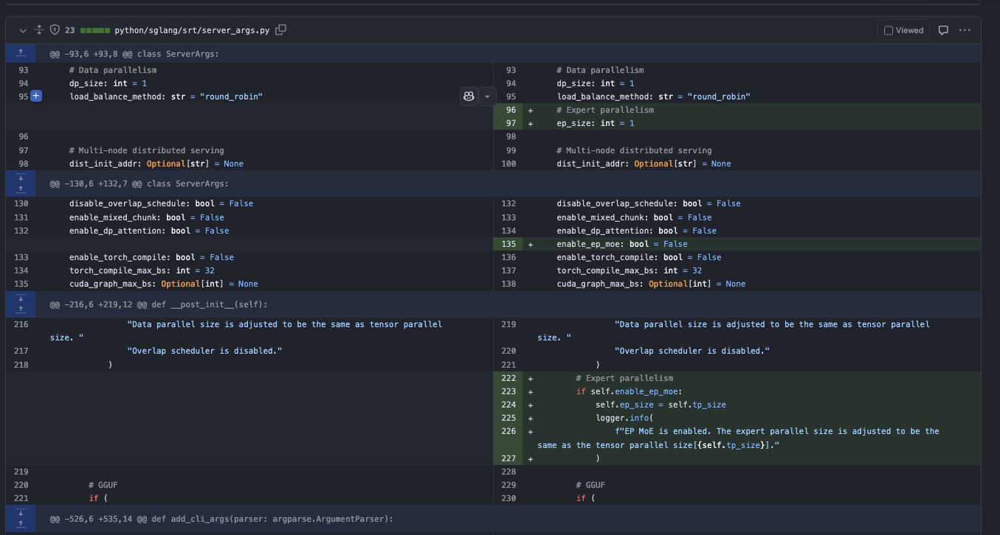
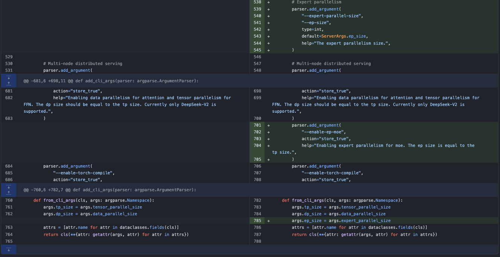
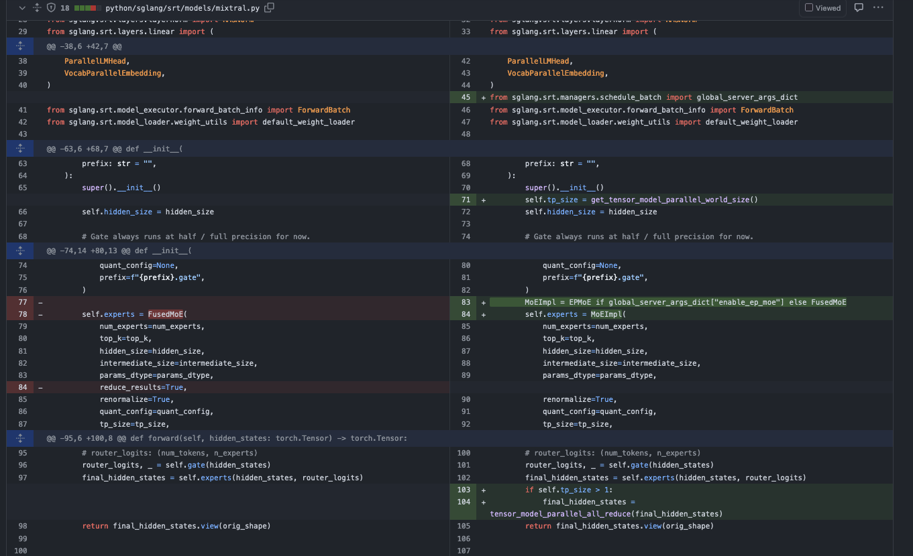

# 0x0. 서문

최근 SGlang 저장소에서 한동안 개발과 학습을 하면서 SGLang의 비교적 새로운 Feature들에 대해서도 조금씩 이해하게 되었다. 이 글은 SGLang의 Expert Parallel 구현을 정리해 보려는 시도다. 내가 아는 한 SGlang은 오픈소스 추론 프레임워크 중에서 Expert Parallel을 가장 먼저 구현한 프레임워크일 것이다. 그것이 어떻게 구현되어 있는지, 그리고 일반적인 EP에 비해 주된 최적화 포인트가 어디에 있는지 살펴보자. SGLang은 https://github.com/sgl-project/sglang/pull/2371 에서 Expert Parallel을 구현했으므로 여기서부터 보면 된다. MoE EP에 익숙하지 않다면 https://zhuanlan.zhihu.com/p/681154742 이 글을 참고하거나 DeepSeek 관련 자료를 읽어 보면 된다.

# 0x1. 상위 레벨 인터페이스





먼저 server_args.py의 변경을 볼 수 있는데, Expert Parallel이 Tensor Parallel의 자리를 넘겨받았다. Deepseek V3를 예로 들면 Expert가 256개 있는데, 지금 Expert Parallel을 켜고 `expert_parallel_size`를 8로 설정하면 각 카드마다 완전한 형태의 Expert 32개를 나눠 받는다. 또한 파라미터를 초기화할 때 Expert Paralle이 켜져 있으면 먼저 `expert_parallel_size`를 TP 크기로 설정하는 것도 볼 수 있다.




이어서 Mixtral 모델 구현상의 수정을 보자. 주목할 만한 점은 EPMoE 인터페이스를 호출할 때 `reduce_results=True,` 파라미터가 사라졌지만, EPMoE 계산이 끝난 뒤 결과에 대해 `tensor_model_parallel_all_reduce` 를 호출한다는 것이다. `reduce_results=True,` 파라미터를 없앤 것은 비교적 이해하기 쉽다. EP에서는 Expert의 파라미터를 쪼개지 않고 token을 대응하는 expert로 보내기만 하면 되며, 수행하는 행렬 곱은 모두 완전한 것이므로 얻어지는 결과도 완전하다. 그렇다면 왜 결과에 `tensor_model_parallel_all_reduce`를 사용해야 할까? 계속 코드를 읽으며 답을 찾아보자. 이유는 뒤의 0x4절에서 제시했다.

상위 레벨 인터페이스는 여기까지 보면 충분하다. 핵심 구현은 두 부분으로 나뉘는데, 하나는 EP MoE Layer이고 다른 하나는 EP MoE의 kernel이다. 이 둘은 인내심을 갖고 봐야 한다.

# 0x2. SGLang EP MoE Layer 구현

파일 위치: https://github.com/sgl-project/sglang/blob/main/python/sglang/srt/layers/moe/ep_moe/layer.py

## 0x2.1 GroupedGemmRunner

먼저 Group GEMM을 수행하기 위한 유틸리티 클래스가 보인다. 우선 이 클래스를 간단히 분석해서 이후의 이해 부담을 줄이자. 먼저 주석을 좀 달아 보겠다.

```python
# 그룹 행렬 곱을 수행하는 Runner 클래스
class GroupedGemmRunner(torch.nn.Module):
    # flashinfer의 gemm 래퍼, 계산 가속에 사용
    flashinfer_gemm_warpper = None

    def __init__(self, device, use_flashinfer: bool = False):
        """
        GroupedGemmRunner 초기화
        Args:
            device: 실행 디바이스
            use_flashinfer: flashinfer 가속 사용 여부
        """
        super().__init__()
        self.device = device
        self.use_flashinfer = use_flashinfer
        if self.use_flashinfer and GroupedGemmRunner.flashinfer_gemm_warpper is None:
            GroupedGemmRunner._init_flashinfer_wrapper(device)

    @classmethod
    def _init_flashinfer_wrapper(cls, device):
        """
        flashinfer의 gemm 래퍼 초기화
        Args:
            device: 실행 디바이스
        """
        from flashinfer import SegmentGEMMWrapper

        # workspace 버퍼 생성
        workspace_buffer = torch.empty(
            128 * 1024 * 1024, dtype=torch.int8, device=device
        )
        cls.flashinfer_gemm_warpper = SegmentGEMMWrapper(workspace_buffer)

    # c = a * b
    def forward(
        self,
        a: torch.Tensor,  # 입력 행렬 a
        b: torch.Tensor,  # 입력 행렬 b
        c: torch.Tensor,  # 출력 행렬 c
        batch_size: int,  # batch 크기
        weight_column_major: bool,  # 가중치가 column major인지 여부
        seg_indptr: Optional[torch.Tensor] = None,  # 세그먼트 포인터
        weight_indices: Optional[torch.Tensor] = None,  # 가중치 인덱스
        use_fp8_w8a8: bool = False,  # fp8 양자화 사용 여부
        scale_a: torch.Tensor = None,  # a의 스케일 팩터
        scale_b: torch.Tensor = None,  # b의 스케일 팩터
    ):
        """그룹 행렬 곱 수행"""
        if self.use_flashinfer:
            # TODO: flashinfer
            assert False
            assert GroupedGemmRunner.flashinfer_gemm_warpper is not None
            c = GroupedGemmRunner.flashinfer_gemm_warpper.run(
                x=a,
                weights=b,
                batch_size=batch_size,
                weight_column_major=weight_column_major,
                seg_indptr=seg_indptr,
                weight_indices=weight_indices,
            )
        else:
            # triton으로 구현한 그룹 행렬 곱 사용
            assert weight_column_major == True
            c = grouped_gemm_triton(
                a,
                b,
                c,
                batch_size,
                weight_column_major,
                seg_indptr,
                weight_indices,
                use_fp8_w8a8,
                scale_a,
                scale_b,
            )
        return c
```

전체적으로 보면 이 클래스는 Group GEMM을 하는 두 가지 방법을 추상화한 것으로, CUDA로 구현된 FlashInfer를 선택할 수도 있고 Triton 구현을 선택할 수도 있다.

## 0x2.2 EPMoE 클래스

이 클래스는 상위 레벨 모델 구현과 하위 레벨 EPMoE Kernel을 연결하는 핵심 컴포넌트이므로, 먼저 이 클래스의 구현을 이해할 필요가 있다.

### EPMoE 클래스의 정의

```python
class EPMoE(torch.nn.Module):
    """
    MoE expert parallel 구현
    
    Args:
        num_experts: 전체 expert 수
        top_k: 각 token이 선택하는 expert 개수
        hidden_size: hidden layer 크기
        intermediate_size: intermediate layer 크기
        params_dtype: 파라미터 데이터 타입, 기본값 None이면 시스템 기본 타입 사용
        renormalize: 재정규화 여부, 기본값 True
        use_grouped_topk: grouped topk 사용 여부, 기본값 False
        num_expert_group: expert group 개수, use_grouped_topk=True일 때만 사용
        topk_group: 각 group에서 선택하는 expert 개수, use_grouped_topk=True일 때만 사용
        quant_config: 양자화 설정, 기본값 None
        tp_size: tensor parallel 크기, 기본값 None
        prefix: 접두사, 기본값은 빈 문자열
        correction_bias: 보정 bias, 기본값 None
    """

    def __init__(
        self,
        num_experts: int,
        top_k: int,
        hidden_size: int,
        intermediate_size: int,
        params_dtype: Optional[torch.dtype] = None,
        renormalize: bool = True,
        use_grouped_topk: bool = False,
        num_expert_group: Optional[int] = None,
        topk_group: Optional[int] = None,
        quant_config: Optional[QuantizationConfig] = None,
        tp_size: Optional[int] = None,
        prefix: str = "",
        correction_bias: Optional[torch.Tensor] = None,
    ):
        super().__init__()

        # 파라미터 타입이 지정되지 않았으면 시스템 기본 타입 사용
        if params_dtype is None:
            params_dtype = torch.get_default_dtype()

        # tensor parallel 관련 파라미터 설정
        self.tp_size = (
            tp_size if tp_size is not None else get_tensor_model_parallel_world_size()
        )
        self.tp_rank = get_tensor_model_parallel_rank()

        # expert 관련 파라미터 설정
        self.num_experts = num_experts
        assert self.num_experts % self.tp_size == 0  # expert 수가 tp_size로 나누어떨어지는지 확인
        self.num_experts_per_partition = self.num_experts // self.tp_size  # 파티션당 expert 수
        self.start_expert_id = self.tp_rank * self.num_experts_per_partition  # 현재 파티션의 시작 expert ID
        self.end_expert_id = self.start_expert_id + self.num_experts_per_partition - 1  # 현재 파티션의 끝 expert ID

        # 기타 파라미터 설정
        self.top_k = top_k
        self.intermediate_size = intermediate_size
        self.renormalize = renormalize
        self.use_grouped_topk = use_grouped_topk
        if self.use_grouped_topk:
            assert num_expert_group is not None and topk_group is not None
        self.num_expert_group = num_expert_group
        self.topk_group = topk_group
        self.correction_bias = correction_bias

        # 양자화 방법 설정
        if quant_config is None:
            self.quant_method: Optional[QuantizeMethodBase] = UnquantizedEPMoEMethod()
            self.use_fp8_w8a8 = False
            self.activation_scheme = None
        else:
            self.quant_method: Optional[QuantizeMethodBase] = Fp8EPMoEMethod(
                quant_config
            )
            self.use_fp8_w8a8 = True
            self.fp8_dtype = torch.float8_e4m3fn
            self.activation_scheme = quant_config.activation_scheme

        # 가중치 생성
        self.quant_method.create_weights(
            layer=self,
            num_experts_per_partition=self.num_experts_per_partition,
            hidden_size=hidden_size,
            intermediate_size=self.intermediate_size,
            params_dtype=params_dtype,
            weight_loader=self.weight_loader,
        )

        # 그룹 행렬 곱 runner 초기화
        self.grouped_gemm_runner = None
```

이 클래스 정의에서 볼 수 있듯이 여기서는 주로 준비 작업을 한다. 동시에 EPMoE는 Tensor Parallel의 프로세스 그룹을 재사용하므로, 현재 Rank가 처리해야 할 Expert ID가 무엇인지도 Tensor Parallel 프로세스 그룹에서 바로 가져온다.

### EPMoE 클래스의 Forward

간단히 주석을 몇 줄 추가한다.

```python
def forward(self, hidden_states: torch.Tensor, router_logits: torch.Tensor):
        """순전파 함수
        Args:
            hidden_states: 입력 hidden state 텐서
            router_logits: router가 출력한 logits 텐서
        Returns:
            output: MoE layer 처리를 거친 출력 텐서
        """
        assert self.quant_method is not None

        # 그룹 행렬 곱 runner 초기화
        if self.grouped_gemm_runner is None:
            self.grouped_gemm_runner = GroupedGemmRunner(
                hidden_states.device, use_flashinfer=False  # TODO: use flashinfer
            )

        # expert 선택, topk 가중치와 ID 획득
        topk_weights, topk_ids = select_experts(
            hidden_states=hidden_states,
            router_logits=router_logits,
            top_k=self.top_k,
            use_grouped_topk=self.use_grouped_topk,
            renormalize=self.renormalize,
            topk_group=self.topk_group,
            num_expert_group=self.num_expert_group,
            correction_bias=self.correction_bias,
        )

        # topk ID 전처리, 재정렬 정보 획득
        reorder_topk_ids, src2dst, seg_indptr = run_moe_ep_preproess(
            topk_ids, self.num_experts
        )

        # gate 입력 텐서 초기화
        gateup_input = torch.empty(
            (int(hidden_states.shape[0] * self.top_k), hidden_states.shape[1]),
            device=hidden_states.device,
            dtype=self.fp8_dtype if self.use_fp8_w8a8 else hidden_states.dtype,
        )
        
        # 동적 양자화 시 입력 스케일 팩터 계산
        if self.activation_scheme == "dynamic":
            max_value = (
                torch.max(hidden_states)
                .repeat(self.num_experts_per_partition)
                .to(torch.float32)
            )
            self.w13_input_scale = max_value / torch.finfo(self.fp8_dtype).max

        # 사전 재정렬, 입력 데이터를 다시 배열
        pre_reorder_triton_kernel[(hidden_states.shape[0],)](
            hidden_states,
            gateup_input,
            src2dst,
            topk_ids,
            self.w13_input_scale,
            self.start_expert_id,
            self.end_expert_id,
            self.top_k,
            hidden_states.shape[1],
            BLOCK_SIZE=512,
        )

        # 현재 rank의 세그먼트 포인터와 가중치 인덱스 획득
        seg_indptr_cur_rank = seg_indptr[self.start_expert_id : self.end_expert_id + 2]
        weight_indices_cur_rank = torch.arange(
            0,
            self.num_experts_per_partition,
            device=hidden_states.device,
            dtype=torch.int64,
        )
        
        # 첫 번째 그룹 행렬 곱
        gateup_output = torch.empty(
            gateup_input.shape[0],
            self.w13_weight.shape[1],
            device=hidden_states.device,
            dtype=hidden_states.dtype,
        )
        gateup_output = self.grouped_gemm_runner(
            a=gateup_input,
            b=self.w13_weight,
            c=gateup_output,
            batch_size=self.num_experts_per_partition,
            weight_column_major=True,
            seg_indptr=seg_indptr_cur_rank,
            weight_indices=weight_indices_cur_rank,
            use_fp8_w8a8=self.use_fp8_w8a8,
            scale_a=self.w13_input_scale,
            scale_b=self.w13_weight_scale,
        )

        # 활성화 함수 처리
        down_input = torch.empty(
            gateup_output.shape[0],
            gateup_output.shape[1] // 2,
            device=gateup_output.device,
            dtype=self.fp8_dtype if self.use_fp8_w8a8 else hidden_states.dtype,
        )
        if self.w2_input_scale is None:
            self.w2_input_scale = torch.ones(
                self.num_experts_per_partition,
                dtype=torch.float32,
                device=hidden_states.device,
            )
        silu_and_mul_triton_kernel[(gateup_output.shape[0],)](
            gateup_output,
            down_input,
            gateup_output.shape[1],
            reorder_topk_ids,
            self.w2_input_scale,
            self.start_expert_id,
            self.end_expert_id,
            BLOCK_SIZE=512,
        )

        # 두 번째 그룹 행렬 곱
        down_output = torch.empty(
            down_input.shape[0],
            self.w2_weight.shape[1],
            device=hidden_states.device,
            dtype=hidden_states.dtype,
        )
        down_output = self.grouped_gemm_runner(
            a=down_input,
            b=self.w2_weight,
            c=down_output,
            batch_size=self.num_experts_per_partition,
            weight_column_major=True,
            seg_indptr=seg_indptr_cur_rank,
            weight_indices=weight_indices_cur_rank,
            use_fp8_w8a8=self.use_fp8_w8a8,
            scale_a=self.w2_input_scale,
            scale_b=self.w2_weight_scale,
        )

        # 사후 재정렬, 최종 출력 생성
        output = torch.empty_like(hidden_states)
        post_reorder_triton_kernel[(hidden_states.size(0),)](
            down_output,
            output,
            src2dst,
            topk_ids,
            topk_weights,
            self.start_expert_id,
            self.end_expert_id,
            self.top_k,
            hidden_states.size(1),
            BLOCK_SIZE=512,
        )
        return output
```

이 forward 함수의 흐름은 비교적 명확하다.
- 먼저 router_logits에 따라 각 token이 사용할 top-k개의 expert와 그 가중치를 선택한다
- 입력 데이터를 전처리하고 재정렬하여, 같은 expert의 데이터를 한데 모아 이후의 배치 계산이 편하도록 한다
- 첫 번째 그룹 행렬 곱(grouped gemm)을 수행하여 입력을 gate와 up projection 가중치(w13_weight)와 곱한다
- 첫 번째 행렬 곱의 결과에 SiLU 활성화 함수를 적용해 처리한다
- 두 번째 그룹 행렬 곱을 수행하여 활성화된 결과를 down projection 가중치(w2_weight)와 곱한다
- 마지막으로 사후 재정렬을 수행하여 각 expert의 출력을 원래 token 순서대로 재구성하고, expert 가중치에 따라 가중 합산해서 최종 출력을 얻는다

이 과정은 기본적으로 EP MoE 학습 시의 단계와 일치하며, 그중 두 번째 단계와 마지막 단계가 EP에서의 두 번의 All2All에 대응한다.

### 가중치 로딩 로직

**필자 주**: 이 글의 주제에 대해서는 이 몇 개의 유틸리티 함수는 신경 쓰지 않아도 된다.

EPMoE 클래스에는 가중치 로딩과 관련된 함수가 3개 더 있는데, 여기에도 겸사겸사 주석을 달아 두었다.

```python
    @classmethod
    def make_expert_params_mapping(
        cls,
        ckpt_gate_proj_name: str,
        ckpt_down_proj_name: str,
        ckpt_up_proj_name: str,
        num_experts: int,
    ) -> List[Tuple[str, str, int, str]]:
        """expert 파라미터 매핑 관계 생성
        
        Args:
            ckpt_gate_proj_name: 체크포인트에서 gate projection layer의 이름
            ckpt_down_proj_name: 체크포인트에서 down projection layer의 이름 
            ckpt_up_proj_name: 체크포인트에서 up projection layer의 이름
            num_experts: 전체 expert 수
            
        Returns:
            List[Tuple[str, str, int, str]]: 파라미터 매핑 리스트를 반환, 각 원소는 튜플:
                - param_name: 파라미터 이름 접두사(w13 또는 w2)
                - weight_name: 가중치의 전체 이름
                - expert_id: expert ID
                - shard_id: shard ID(w1/w2/w3)
        """
        return [
            # (param_name, weight_name, expert_id, shard_id)
            (
                (
                    "experts.w13_"
                    if weight_name in [ckpt_gate_proj_name, ckpt_up_proj_name]
                    else "experts.w2_"
                ),
                f"experts.{expert_id}.{weight_name}.",
                expert_id,
                shard_id,
            )
            for expert_id in range(num_experts)
            for shard_id, weight_name in [
                ("w1", ckpt_gate_proj_name),
                ("w2", ckpt_down_proj_name),
                ("w3", ckpt_up_proj_name),
            ]
        ]

    def weight_loader(
        self,
        param: torch.nn.Parameter,
        loaded_weight: torch.Tensor,
        weight_name: str,
        shard_id: str,
        expert_id: int,
    ) -> None:
        """가중치 파라미터 로드
        
        Args:
            param: 대상 파라미터
            loaded_weight: 로드된 가중치 텐서
            weight_name: 가중치 이름
            shard_id: shard ID(w1/w2/w3)
            expert_id: expert ID
            
        Raises:
            ValueError: shard_id가 올바르지 않을 때 예외 발생
        """
        if expert_id < self.start_expert_id or expert_id > self.end_expert_id:
            return
        expert_id = expert_id - self.start_expert_id

        if shard_id not in ("w1", "w2", "w3"):
            raise ValueError(
                f"shard_id must be ['w1','w2','w3'] but " f"got {shard_id}."
            )

        # FP8 스케일 팩터의 특수한 경우 처리
        if "scale" in weight_name:
            self._load_fp8_scale(
                param.data, loaded_weight, weight_name, shard_id, expert_id
            )
            return

        expert_data = param.data[expert_id]
        if shard_id == "w2":
            param.data[expert_id] = loaded_weight
        elif shard_id == "w1":
            param.data[expert_id][: self.intermediate_size, :] = loaded_weight
        elif shard_id == "w3":
            param.data[expert_id][self.intermediate_size :, :] = loaded_weight
        else:
            raise ValueError(f"Expected shard_id w1,w2 or w3 but got {shard_id}")

    def _load_fp8_scale(
        self,
        param: torch.nn.Parameter,
        loaded_weight: torch.Tensor,
        weight_name: str,
        shard_id: str,
        expert_id: int,
    ) -> None:
        """FP8 양자화의 스케일 팩터 로드
        
        Args:
            param: 대상 파라미터
            loaded_weight: 로드된 가중치 텐서
            weight_name: 가중치 이름
            shard_id: shard ID(w1/w2/w3)
            expert_id: expert ID
            
        Raises:
            ValueError: 입력 스케일 팩터가 서로 같지 않을 때 예외 발생
        """
        param_data = param.data

        # 입력 스케일 팩터는 바로 로드할 수 있으며, 반드시 서로 같아야 한다
        if "input_scale" in weight_name:
            if (
                param_data[expert_id] != 1
                and (param_data[expert_id] - loaded_weight).abs() > 1e-5
            ):
                raise ValueError(
                    "input_scales of w1 and w3 of a layer "
                    f"must be equal. But got {param_data[expert_id]} "
                    f"vs. {loaded_weight}"
                )
            param_data[expert_id] = loaded_weight
        # 가중치 스케일 팩터
        elif "weight_scale" in weight_name:
            # 열을 합치는 경우(gate_up_proj)
            if shard_id in ("w1", "w3"):
                # 가중치 로드 후 재양자화가 필요하므로 w1과 w3의 가중치 스케일 팩터를 남겨 두어야 한다
                idx = 0 if shard_id == "w1" else 1
                param_data[expert_id][idx] = loaded_weight
            # 행 방향 병렬의 경우(down_proj)
            else:
                param_data[expert_id] = loaded_weight
```

이 가중치 로딩 관련 유틸리티 함수들은 모델 구현의 `load_weights` 메서드에서 호출된다. 이 글에서는 이 부분을 계속 다루지 않으니, 관심 있는 독자는 VLLM과 SGLang이 모델 가중치 로딩 작업을 얼마나 우아하게 처리하는지 살펴보면 된다.

분석은 여기까지면 충분하다. EPMoE 클래스 forward의 전체적인 로직만 붙잡으면 된다.

# 0x3. SGLang EP MoE Kernel 구현

코드 위치: https://github.com/sgl-project/sglang/blob/main/python/sglang/srt/layers/moe/ep_moe/kernels.py


EPMoE Layer 구현에서 forward의 주요 흐름을 한 번 더 되짚어 보자. 이 절에서 분석할 kernel과 대응시킬 수 있다. EPMoE Layer의 forward 주요 흐름은 다음과 같다.

- 먼저 router_logits에 따라 각 token이 사용할 top-k개의 expert와 그 가중치를 선택한다
- 입력 데이터를 전처리하고 재정렬하여, 같은 expert의 데이터를 한데 모아 이후의 배치 계산이 편하도록 한다
- 첫 번째 그룹 행렬 곱(grouped gemm)을 수행하여 입력을 gate와 up projection 가중치(w13_weight)와 곱한다
- 첫 번째 행렬 곱의 결과에 SiLU 활성화 함수를 적용해 처리한다
- 두 번째 그룹 행렬 곱을 수행하여 활성화된 결과를 down projection 가중치(w2_weight)와 곱한다
- 마지막으로 사후 재정렬을 수행하여 각 expert의 출력을 원래 token 순서대로 재구성하고, expert 가중치에 따라 가중 합산해서 최종 출력을 얻는다

## Token을 Expert 기준으로 재배치하기 위한 index 정보 전처리

forward 함수에서 topk_ids를 얻은 다음, 먼저 topk ID를 전처리하여 재정렬 정보를 획득한다.

```python
reorder_topk_ids, src2dst, seg_indptr = run_moe_ep_preproess(topk_ids, self.num_experts)
```

대응하는 Triton Kernel에 주석을 달았다.

```python

@triton.jit
def compute_seg_indptr_triton_kernel(reorder_topk_ids, seg_indptr, num_toks):
    """각 expert에 대응하는 token 세그먼트의 시작 위치 계산
    
    Args:
        reorder_topk_ids: 정렬된 expert ID
        seg_indptr: 세그먼트 포인터 배열
        num_toks: 전체 token 수
    """
    # 현재 expert ID 획득
    expert = tl.program_id(0)
    
    # 이진 탐색으로 현재 expert에 대응하는 token 세그먼트 위치를 찾는다
    low = 0
    high = num_toks - 1
    target_location = -1
    while low <= high:
        mid = (low + high) // 2

        # 중간 위치의 expert ID가 현재 expert ID보다 크면 왼쪽 절반에서 계속 탐색
        if tl.load(reorder_topk_ids + mid) > expert:
            high = mid - 1
        # 그렇지 않으면 오른쪽 절반에서 계속 탐색하고 목표 위치를 갱신
        else:
            low = mid + 1
            target_location = mid
            
    # 현재 expert에 대응하는 token 세그먼트의 끝 위치를 저장
    tl.store(seg_indptr + expert + 1, target_location + 1)


@triton.jit
def compute_src2dst_triton_kernel(
    reorder_ids, src2dst, num_toks, BLOCK_SIZE: tl.constexpr
):
    """소스 인덱스에서 타깃 인덱스로의 매핑 계산
    
    Args:
        reorder_ids: 재정렬된 인덱스
        src2dst: 소스 인덱스에서 타깃 인덱스로의 매핑 배열
        num_toks: 전체 token 수
        BLOCK_SIZE: 각 thread block이 처리하는 token 수
    """
    # 현재 program block ID 획득
    pid = tl.program_id(axis=0)
    
    # 현재 block 내의 타깃 인덱스 계산
    dst_id = pid * BLOCK_SIZE + tl.arange(0, BLOCK_SIZE)
    
    # 유효한 token의 mask 생성
    mask = dst_id < num_toks
    
    # 소스 인덱스 로드
    src_id = tl.load(reorder_ids + dst_id, mask=mask)
    
    # 소스 인덱스에서 타깃 인덱스로의 매핑 저장
    tl.store(src2dst + src_id, dst_id, mask=mask)


def run_moe_ep_preproess(topk_ids: torch.Tensor, num_experts: int):
    """MoE expert parallel의 topk ID를 전처리하여 재정렬 정보 생성
    
    Args:
        topk_ids: 각 token이 선택한 expert ID 텐서
        num_experts: 전체 expert 수
        
    Returns:
        reorder_topk_ids: 정렬된 expert ID
        src2dst: 소스 인덱스에서 타깃 인덱스로의 매핑
        seg_indptr: 각 expert에 대응하는 token 세그먼트의 시작 위치
    """
    # expert ID에 대해 안정 정렬 수행
    reorder_topk_ids, reorder_ids = torch.sort(topk_ids.view(-1), stable=True)
    
    # 세그먼트 포인터와 소스-타깃 매핑 배열 초기화
    seg_indptr = torch.zeros(num_experts + 1, device=topk_ids.device, dtype=torch.int64)
    src2dst = torch.empty(topk_ids.numel(), device=topk_ids.device, dtype=torch.int32)

    # 각 expert에 대응하는 token 세그먼트의 시작 위치 계산
    compute_seg_indptr_triton_kernel[(num_experts,)](
        reorder_topk_ids, seg_indptr, topk_ids.numel()
    )

    # 소스 인덱스에서 타깃 인덱스로의 매핑 계산
    BLOCK_SIZE = 512
    grid = (triton.cdiv(topk_ids.numel(), BLOCK_SIZE),)
    compute_src2dst_triton_kernel[grid](
        reorder_ids, src2dst, topk_ids.numel(), BLOCK_SIZE
    )
    return reorder_topk_ids, src2dst, seg_indptr
```

이 코드는 사실 비교적 이해하기 쉬운 편인데, 여기서 예를 하나 들어 설명해 보겠다.

token이 10개, expert가 4개(expert_id: 0,1,2,3)이고 각 token이 선택한 expert 배정이 다음과 같다고 하자.

```shell
# 원래의 token에서 expert로의 배정 (topk_ids)
token_idx:     [0, 1, 2, 3, 4, 5, 6, 7, 8, 9]
expert_ids:    [1, 3, 2, 1, 0, 2, 3, 1, 2, 0]
```

위 코드로 처리하면 다음을 얻는다.

1. 정렬된 expert ID (reorder_topk_ids):

```shell
[0, 0, 1, 1, 1, 2, 2, 2, 3, 3]
```

2. 각 expert가 담당하는 token 세그먼트 위치 (seg_indptr):

```shell
expert_id:     [0,    1,    2,    3,    4]
seg_indptr:    [0,    2,    5,    8,    10]
# 의미:
# - expert 0은 인덱스 0-1의 token을 처리
# - expert 1은 인덱스 2-4의 token을 처리
# - expert 2는 인덱스 5-7의 token을 처리
# - expert 3은 인덱스 8-9의 token을 처리
```

3. 원래 위치에서 재정렬 후 위치로의 매핑 (src2dst):

```shell
원래 위치:        [0, 1, 2, 3, 4, 5, 6, 7, 8, 9]
재정렬 후 위치:    [4, 9, 2, 3, 7, 5, 8, 6, 0, 1]
```

이렇게 재정렬하고 나면 같은 expert가 처리해야 할 token이 한데 모이게 된다

```shell
재정렬 후 위치:    [0, 1, 2, 3, 4, 5, 6, 7, 8, 9]
expert ID:        [0, 0, 1, 1, 1, 2, 2, 2, 3, 3]
```


## 실제 Token의 Expert 기준 재배치 수행(첫 번째 All2All과 등가)

EPMoE Layer forward의 아래 코드 한 줄에 대응한다.

```python
pre_reorder_triton_kernel[(hidden_states.shape[0],)](
            hidden_states,
            gateup_input,
            src2dst,
            topk_ids,
            self.w13_input_scale,
            self.start_expert_id,
            self.end_expert_id,
            self.top_k,
            hidden_states.shape[1],
            BLOCK_SIZE=512,
        )
```

Triton 구현을 살펴보자.

```python
@triton.jit
def pre_reorder_triton_kernel(
    input_ptr,          # 입력 텐서 포인터
    gateup_input_ptr,   # gate 입력 텐서 포인터
    src2dst_ptr,        # 소스에서 타깃으로의 인덱스 매핑 포인터
    topk_ids_ptr,       # topk expert ID 포인터
    a1_scales_ptr,      # 입력 스케일 팩터 포인터
    start_expert_id,    # 현재 rank의 시작 expert ID
    end_expert_id,      # 현재 rank의 끝 expert ID
    topk,               # 각 token이 선택하는 expert 개수
    hidden_size,        # hidden layer 크기
    BLOCK_SIZE: tl.constexpr,  # 계산 block 크기
):
    """사전 재정렬 kernel, 입력 데이터를 다시 배열하고 스케일링을 적용한다
    
    이 kernel은 입력 데이터를 expert 배정에 따라 재배열하고, 현재 rank에 배정된 expert 데이터에 대해 스케일링 처리를 한다.
    각 입력 token에 대해 그 token이 선택한 topk개의 expert를 순회하면서, expert가 현재 rank에 속하면 그 token의 데이터를
    대응하는 위치로 복사하고 스케일 팩터를 적용한다.
    """
    # 출력 데이터 타입 획득
    OutDtype = gateup_input_ptr.dtype.element_ty

    # 현재 처리 중인 입력 token 인덱스 획득
    src_idx = tl.program_id(0)
    # 현재 token의 src2dst와 topk_ids 포인터 위치 계산
    src2dst_ptr = src2dst_ptr + src_idx * topk
    topk_ids_ptr = topk_ids_ptr + src_idx * topk

    # 입력 데이터 포인터 위치 계산
    src_ptr = input_ptr + src_idx * hidden_size
    
    # 현재 token이 선택한 topk개의 expert를 순회
    for idx in range(topk):
        # expert ID 로드
        expert_id = tl.load(topk_ids_ptr + idx)
        # expert가 현재 rank에 속하는지 확인
        if expert_id >= start_expert_id and expert_id <= end_expert_id:
            # 스케일 팩터 계산
            if a1_scales_ptr is not None:
                scale = 1.0 / tl.load(a1_scales_ptr + expert_id - start_expert_id)
            else:
                scale = 1.0

            # 목표 위치 인덱스와 포인터 획득
            dst_idx = tl.load(src2dst_ptr + idx)
            dst_ptr = gateup_input_ptr + dst_idx * hidden_size
            
            # hidden_size 차원의 데이터를 block 단위로 처리
            for start_offset in tl.range(0, hidden_size, BLOCK_SIZE):
                offset = start_offset + tl.arange(0, BLOCK_SIZE)
                mask = offset < hidden_size
                # 입력 데이터를 로드하고 float32로 변환
                in_data = tl.load(src_ptr + offset, mask=mask).to(tl.float32)
                # 스케일링을 적용하고 출력 타입으로 변환
                out_data = (in_data * scale).to(OutDtype)
                # 목표 위치에 저장
                tl.store(dst_ptr + offset, out_data, mask=mask)
```

이 kernel은 앞 단계에서 얻은 재배치 정보를 바탕으로 실제 재배치를 수행한다.

## Group GEMM과 활성화 함수

다음은 gateup과 down의 Group GEMM, 그리고 그 사이에 끼어 있는 silu_and_mul 활성화 연산을 수행하는 부분이다. EPMoE Forward에서 대응하는 함수는 다음과 같다.

```python
# 현재 rank의 세그먼트 포인터와 가중치 인덱스 획득
        seg_indptr_cur_rank = seg_indptr[self.start_expert_id : self.end_expert_id + 2]
        weight_indices_cur_rank = torch.arange(
            0,
            self.num_experts_per_partition,
            device=hidden_states.device,
            dtype=torch.int64,
        )
        
        # 첫 번째 그룹 행렬 곱
        gateup_output = torch.empty(
            gateup_input.shape[0],
            self.w13_weight.shape[1],
            device=hidden_states.device,
            dtype=hidden_states.dtype,
        )
        gateup_output = self.grouped_gemm_runner(
            a=gateup_input,
            b=self.w13_weight,
            c=gateup_output,
            batch_size=self.num_experts_per_partition,
            weight_column_major=True,
            seg_indptr=seg_indptr_cur_rank,
            weight_indices=weight_indices_cur_rank,
            use_fp8_w8a8=self.use_fp8_w8a8,
            scale_a=self.w13_input_scale,
            scale_b=self.w13_weight_scale,
        )

        # 활성화 함수 처리
        down_input = torch.empty(
            gateup_output.shape[0],
            gateup_output.shape[1] // 2,
            device=gateup_output.device,
            dtype=self.fp8_dtype if self.use_fp8_w8a8 else hidden_states.dtype,
        )
        if self.w2_input_scale is None:
            self.w2_input_scale = torch.ones(
                self.num_experts_per_partition,
                dtype=torch.float32,
                device=hidden_states.device,
            )
        silu_and_mul_triton_kernel[(gateup_output.shape[0],)](
            gateup_output,
            down_input,
            gateup_output.shape[1],
            reorder_topk_ids,
            self.w2_input_scale,
            self.start_expert_id,
            self.end_expert_id,
            BLOCK_SIZE=512,
        )

        # 두 번째 그룹 행렬 곱
        down_output = torch.empty(
            down_input.shape[0],
            self.w2_weight.shape[1],
            device=hidden_states.device,
            dtype=hidden_states.dtype,
        )
        down_output = self.grouped_gemm_runner(
            a=down_input,
            b=self.w2_weight,
            c=down_output,
            batch_size=self.num_experts_per_partition,
            weight_column_major=True,
            seg_indptr=seg_indptr_cur_rank,
            weight_indices=weight_indices_cur_rank,
            use_fp8_w8a8=self.use_fp8_w8a8,
            scale_a=self.w2_input_scale,
            scale_b=self.w2_weight_scale,
        )

```


Group GEMM과 활성화 함수는 모두 비교적 일반적인 내용이라, 여기서는 이 두 개의 다소 긴 Triton 구현을 분석하지 않는다. Triton으로 이 두 연산을 구현하는 것은 상당히 비효율적이기도 하다.

## 사후 재정렬(두 번째 All2All과 등가), 최종 출력 생성

EPMoE의 마지막 2줄 코드에 대응한다.

```python
output = torch.empty_like(hidden_states)
post_reorder_triton_kernel[(hidden_states.size(0),)](
    down_output,
    output,
    src2dst,
    topk_ids,
    topk_weights,
    self.start_expert_id,
    self.end_expert_id,
    self.top_k,
    hidden_states.size(1),
    BLOCK_SIZE=512,
)
```

Triton Kernel 코드는 다음과 같다.

```python
@triton.jit
def post_reorder_triton_kernel(
    down_output_ptr  # expert 처리 후의 출력을 저장
    output_ptr       # 최종 출력 결과의 저장 위치
    src2dst_ptr      # 재정렬 매핑 관계
    topk_ids_ptr     # 각 token에 대응하는 expert ID
    topk_weights_ptr # 각 token에 대응하는 expert 가중치
    start_expert_id,    # 시작 expert ID
    end_expert_id,      # 끝 expert ID
    topk,               # topk 값
    hidden_size,        # hidden layer 크기
    BLOCK_SIZE: tl.constexpr,  # block 크기 상수
):
    """사후 재정렬 triton 커널 함수
    
    이 함수는 expert 출력을 재정렬하고 가중 합산하여 최종 출력을 생성한다.
    주요 단계:
    1. 입력 데이터 타입과 program ID 획득
    2. 각 포인터의 오프셋 계산
    3. 각 block에 대해:
       - 누적용 영벡터 생성
       - 각 topk expert에 대해:
         * expert ID가 범위 안에 있으면 그 출력을 로드하여 누적
    4. 계산을 거친 expert가 하나도 없으면 전부 0인 벡터를 출력
    """
    # 입력 데이터 타입 획득
    InDtype = down_output_ptr.dtype.element_ty

    # 현재 program ID를 소스 인덱스로 획득
    src_idx = tl.program_id(0)
    # 각 포인터의 실제 위치 계산
    src2dst_ptr = src2dst_ptr + src_idx * topk
    topk_ids_ptr = topk_ids_ptr + src_idx * topk
    topk_weights_ptr = topk_weights_ptr + src_idx * topk

    # 계산에 참여한 expert가 있는지 표시
    computed = False
    # 저장 위치 계산
    store_ptr = output_ptr + src_idx * hidden_size
    
    # block 크기 단위로 hidden_size를 순회
    for start_offset in tl.range(0, hidden_size, BLOCK_SIZE):
        offset = start_offset + tl.arange(0, BLOCK_SIZE)
        mask = offset < hidden_size

        # 누적용 영벡터 생성
        sum_vec = tl.zeros([BLOCK_SIZE], dtype=InDtype)
        # topk개의 expert를 순회
        for idx in range(topk):
            expert_id = tl.load(topk_ids_ptr + idx)
            # expert ID가 유효 범위 안에 있는지 확인
            if expert_id >= start_expert_id and expert_id <= end_expert_id:
                computed = True
                # 목표 인덱스와 가중치 로드
                dst_idx = tl.load(src2dst_ptr + idx)
                weigh_scale = tl.load(topk_weights_ptr + idx).to(InDtype)
                # 로드 위치를 계산하고 데이터 로드
                load_ptr = down_output_ptr + dst_idx * hidden_size
                in_data = tl.load(load_ptr + offset, mask=mask)
                # 가중 누적
                sum_vec += in_data * weigh_scale
        # 누적 결과 저장
        tl.store(store_ptr + offset, sum_vec, mask=mask)

    # 계산에 참여한 expert가 없으면 전부 0을 출력
    if computed == False:
        for start_offset in tl.range(0, hidden_size, BLOCK_SIZE):
            offset = start_offset + tl.arange(0, BLOCK_SIZE)
            mask = offset < hidden_size
            tl.store(
                store_ptr + offset, tl.zeros([BLOCK_SIZE], dtype=InDtype), mask=mask
            )

```

이 코드만 봐서는 아직 조금 추상적일 수 있으니, 앞의 Token을 Expert 기준으로 재배치하는 index 예시를 이어서 사용해 설명하겠다. expert_weights 한 세트를 새로 추가한다.

> 주의할 점은 각 token이 topk개의 가중치를 가진다는 것이고, 이는 곧 select_experts가 출력하는 topk_weights다.

```shell
# 원래의 token 배정과 가중치
token_idx:        [0,  1,  2,  3,  4,  5,  6,  7,  8,  9]
expert_ids:       [1,  3,  2,  1,  0,  2,  3,  1,  2,  0]
expert_weights:   [0.6,0.8,0.7,0.5,0.9,0.6,0.7,0.4,0.8,0.5]

# 재정렬 후의 순서(앞 예시의 결과)
재정렬 위치:       [0,  1,  2,  3,  4,  5,  6,  7,  8,  9]
expert ID:        [0,  0,  1,  1,  1,  2,  2,  2,  3,  3]
```

이제 `post_reorder_triton_kernel` kernel의 동작 흐름은 다음과 같다.

1. 각 원래 token 위치에 대해(src_idx = tl.program_id(0)으로 획득):

```python
 # 예를 들어 원래 token_idx=0의 데이터를 처리할 때:
 expert_id = 1
 weight = 0.6
 # 재정렬 후의 위치 2,3,4 중에서 대응하는 출력 결과를 찾아야 한다
 즉 아래 코드 줄이다:
src2dst_ptr = src2dst_ptr + src_idx * topk
```

2. hidden_size 차원의 데이터 처리:

hidden_size=1024, BLOCK_SIZE=256이라고 하면, 코드는 1024차원 데이터를 4개의 block으로 나누어 처리하고, 각 block마다 결과 누적에 사용할 영벡터를 하나 생성한다

3. 각 token의 expert 출력에 대해 가중 결합 수행:

```python
# token_idx=0을 예로 들면:
   sum_vec = 0  # 누적 벡터 초기화
   expert_output = load_expert_output(expert_id=1)  # expert 1의 출력 로드
   sum_vec += expert_output * 0.6  # 가중치 0.6 적용
```

4. 현재 token을 처리한 expert가 있으면(computed=True) 가중 합산된 결과를 저장하고, 그렇지 않으면 전부 0인 벡터를 저장한다.

이 사후 재정렬을 통해 하나의 token이 여러 expert에서 병렬로 처리되는 것을 지원할 수 있고, topk weights로 서로 다른 expert의 기여 정도를 제어할 수 있다.

# 0x4. SGLang EPMoE와 MoE EP 학습 흐름의 차이

서두의 질문을 다시 가져와 보자. EPMoE Layer forward의 마지막에서 왜 결과에 `tensor_model_parallel_all_reduce`를 사용해야 할까?

사실 위의 EPMoE Forward 흐름을 보면, 원래 Expert Parallel에서의 2번의 All2All과 등가인 동작을 Triton Kernel 몇 개로 직접 구현했을 뿐, 학습에서처럼 통신 프리미티브를 호출해 All2All을 하지는 않는다는 것을 알 수 있다. 그리고 위의 `post_reorder_triton_kernel`에서 각 token에 대한 누적 과정을 보면, 어떤 Rank에서 현재 token이 그 Rank가 보유한 Expert에 의해 처리되지 않으면 그 출력은 0으로 설정된다. 하지만 다른 EP Rank에서는 현재 이 token이 그 Rank가 보유한 Expert에 의해 처리될 수 있으므로, 최종적으로는 allreduce를 한 번 수행해 모든 rank의 결과를 더해 주어야 한다. 추론할 때 All2All은 overlap할 기회가 거의 없고 All2All의 속도는 비교적 느린데, 여기서처럼 All2All 흐름을 최적화하면 사실 통신 비용도 낮출 수 있다.

# 0x5. 요약

SGLang EPMoE의 현재 구현은 전체적으로 비교적 명확하다. 다만 필자는 아직 이 Feature를 자세히 실측해 보지 않아서 일반적인 TP와 비교해 어느 쪽 성능이 더 나은지는 확실하지 않다. 또한 이 EPMoE 계산 흐름에서 가장 시간이 많이 드는 Group GEMM도 아직 FalshInfer의 최적화 버전을 사용하지 않고 있어서, Triton 구현은 비교적 느릴 것이다.


