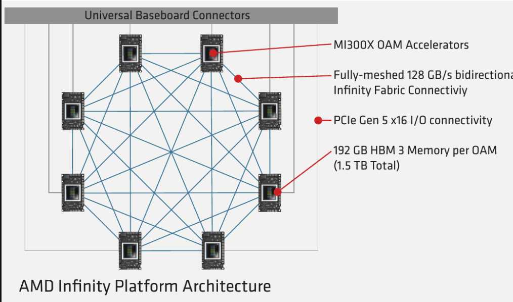
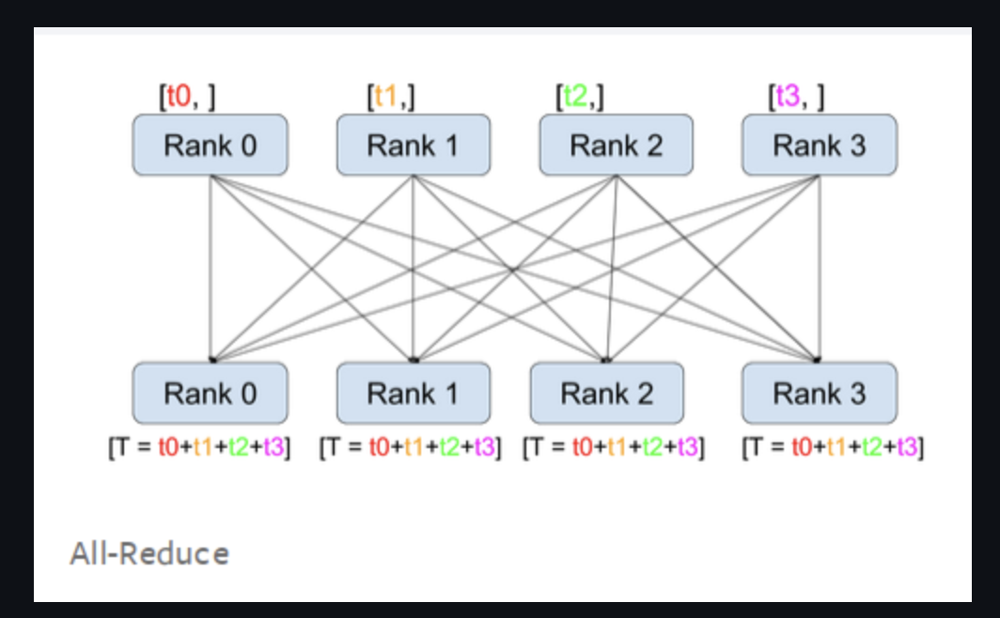
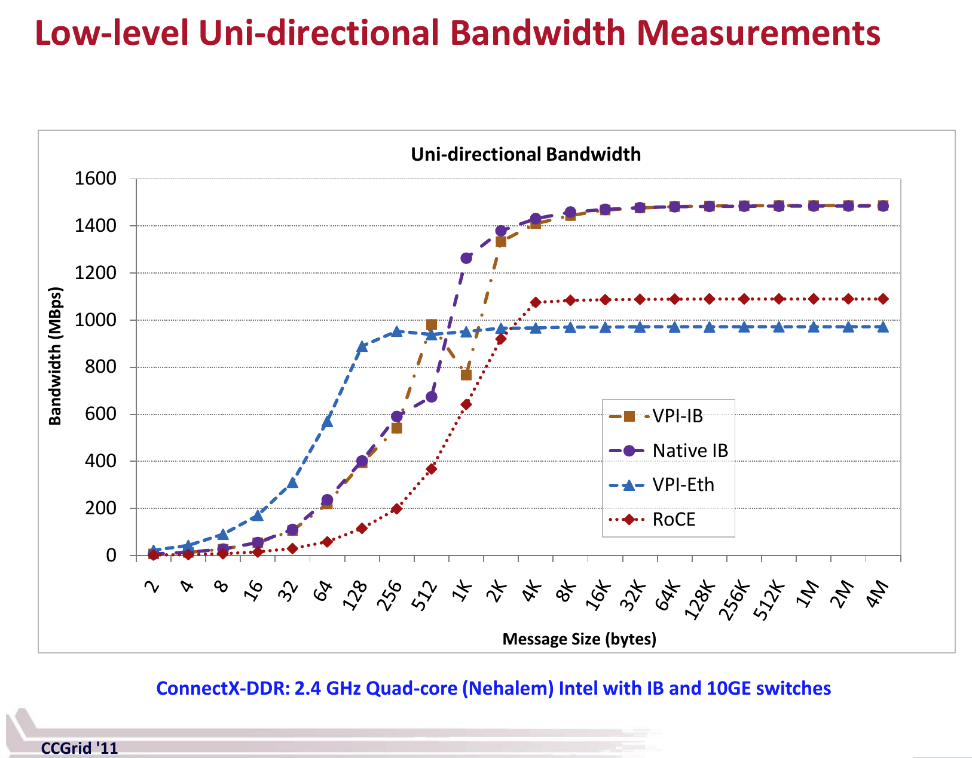
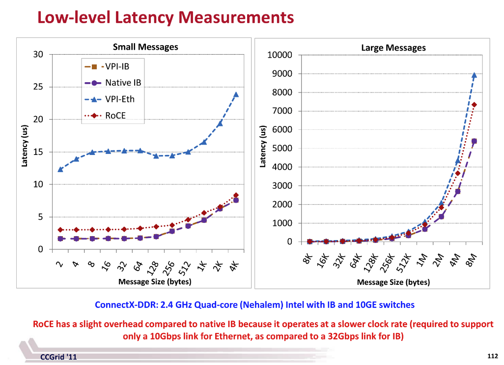

> 내 강의 노트이며, 많은 관심 바란다: https://github.com/BBuf/how-to-optim-algorithm-in-cuda/tree/master/cuda-mode 

> 이 문서의 출처: https://github.com/stas00/ml-engineering 。이 문서는 대규모 머신러닝 학습에서 노드 간 및 노드 내 네트워크 하드웨어의 핵심적인 역할을 깊이 있게 다룬다. 먼저 비싼 가속기를 충분히 활용하기 위한 네트워크 속도의 중요성, 특히 대규모 언어 모델을 학습할 때의 중요성을 강조한다. 이어서 일련의 핵심 용어와 개념을 설명하고, 클러스터 네트워크의 세 가지 주요 구성 요소인 프런트엔드 네트워크, 백엔드 네트워크, 대역 외 네트워크를 자세히 소개한다. 또한 RDMA 네트워크 기술을 논의하고, 서로 다른 노드 내 네트워크 기술의 이론적 대역폭을 비교하며, 사례 분석을 통해 단일 GPU 학습, 단일 노드 다중 GPU 학습, 다중 노드 학습의 성능 차이를 설명한다. 이 문서는 통신과 연산의 중첩 개념, 그리고 TFLOPS를 계산하는 방법도 깊이 있게 다루면서, 대규모 모델 학습에 대한 고속 노드 간 네트워크의 중요성을 강조한다. 또한 실제 네트워크 처리량과 이론적 대역폭의 차이를 설명하고, 벤치마크 결과를 제공하며, 네트워크 지연의 영향을 논의한다. 그 밖에도 전용 네트워크 하드웨어와 NCCL 사용에 관한 내용을 다루며, 노드 근접성의 중요성을 강조하고, 일부 클라우드 서비스 제공자의 관련 솔루션을 제공한다. 마지막으로, 공유 노드 간 네트워크가 가져올 수 있는 성능 변동 문제를 논의한다. 전체적으로 이 문서는 독자에게 풍부한 기술적 세부 사항과 실용적 조언을 제공하며, 대규모 머신러닝 학습에서 네트워크 하드웨어의 중요성을 종합적으로 설명한다. AI 시스템의 네트워크 부분에 관심 있는 분들에게 읽어 보기를 추천한다.

# 노드 간 및 노드 내 네트워크 하드웨어

**하위 장**:

- 네트워크 디버깅
- 네트워크 벤치마킹

> 이 두 하위 장은 코드를 다루기 때문에, 이후에 별도로 번역하고 코드를 해설할 예정이다.

## 소개

빠른 학습과 추론을 위해 비싼 가속기를 구매/임대하는 것만으로는 충분하지 않다. 당신은 스토리지 IO, CPU, 네트워크가 "가속기 용광로에 충분히 먹일" 만큼 충분히 빠른지 확인해야 한다. 그렇게 하지 못하면, 비싼 가속기는 충분히 활용되지 못하여 자금 손실, 학습 시간 둔화, 추론 처리량 감소를 초래할 것이다. 언급한 다른 구성 요소 중 하나일 수도 있지만, 네트워크는 보통 학습 중의 병목이다(당신의 DataLoader가 빠르다고 가정할 때).

당신의 모델이 단일 가속기에 맞는다면, 거의 걱정할 필요가 없다. 하지만 오늘날 대부분의 모델은 로드하기 위해 여러 가속기가 필요하며, LLM/VLM 모델은 학습을 위해 여러 컴퓨팅 노드가 필요하고, 일부는 추론에도 필요하다.

대부분의 컴퓨팅 노드는 8개의 가속기를 포함하며, 일부는 4개, 일부는 16개, 심지어 더 많은 가속기를 가지고 있고, 최근에는 노드당 하나의 슈퍼 가속기를 가진 것도 있다.

모델이 여러 가속기에 걸쳐 있지만 단일 노드를 벗어나지 않을 때, 당신은 단지 빠른 노드 내 네트워크에만 신경 쓰면 된다. 일단 모델이 여러 노드를 필요로 하면 - 이것은 보통 학습의 경우인데, 여러 복제본을 사용하여 학습을 병렬화하고 가속할 수 있기 때문이다 - 빠른 노드 간 네트워크가 핵심이 된다.

이 문서는 이 두 가지 유형의 네트워크 하드웨어를 다루며, 그것들의 이론적 및 실제 대역폭을 보고하고, 그것들이 어떻게 상호작용하는지 설명한다.

## 용어와 개념

여기에 나열된 많은 개념과 약어는 필요할 때까지 안심하고 무시한 다음, 나중에 여기로 돌아와도 된다.

- ALU: 산술 논리 장치(Arithmetic Logic Unit)
- AR: 적응형 라우팅(Adaptive Routing)(집계 라우터를 의미할 수도 있다)
- DMA: 직접 메모리 접근(Direct Memory Access)
- EFA: 탄력적 패브릭 어댑터(Elastic Fabric Adapter)
- HCA: 호스트 채널 어댑터(Host Channel Adapter)
- IB: Infiniband
- MFV... MFU: 모델 부동소수점 연산 이용률(예를 들어, A100에서 반정밀도일 때 `mfu=0.5`는 156TFLOPs를 얻은 것에서 비롯되는데, 반정밀도의 피크 사양이 312TFLOPS이므로 `156/312=0.5`이다)
- NIC: 네트워크 인터페이스 카드(Network Interface Card)
- OPA: 옴니패스 아키텍처(Omni-Path Architecture)
- OPX: 옴니패스 익스프레스(Omni-Path Express)
- OSFP: 8채널 소형 핫플러그(트랜시버)(Octal Small Form Factor Pluggable)
- RDMA: 원격 직접 메모리 접근(Remote Direct Memory Access)
- RoCE: 이더넷 융합 RDMA(RDMA over Converged Ethernet)
- RoE: 이더넷 RDMA(RDMA over Ethernet)
- SHARP: 확장 가능한 계층적 집계 및 리덕션 프로토콜(Scalable Hierarchical Aggregation and Reduction Protocol)
- VPI: 가상 프로토콜 상호 연결(Virtual Protocol Interconnect)
- xGMI: 소켓 간 전역 메모리 인터페이스(socket to socket Global Memory Interface)

속도와 관련된 용어:
- 단방향: 한 지점에서 다른 지점으로의 단방향 전송 A -> B
- 양방향, 전이중: 한 지점에서 다른 지점으로의 양방향 전송 A <-> B, 보통 단방향 속도의 2배
- GBps, GB/s: 초당 기가바이트(1GBps = 8Gbps), 하나의 채널에서 전송
- GT/s: 초당 기가트랜스퍼 - 초당 발생하는 데이터 전송 연산 수
- Gbps, Gb/s: 초당 기가비트(1Gbps = 1/8GBps), 하나의 채널에서 전송
- 양분 폭(bisection width): 네트워크를 두 부분(반드시 같지는 않음)으로 나누기 위해 절단해야 하는 최소 링크 수. 이러한 링크의 대역폭을 양분 대역폭(bisection bandwidth)이라고 하며 - 보통 실제 네트워크 대역폭의 척도로 사용된다. 때로는 최악의 경우 네트워크 용량이라고도 한다. 이것과 관련 개념을 설명하는 좋은 답변(https://networkengineering.stackexchange.com/a/29662/93656)이 여기 있지만, 당신의 클러스터 토폴로지는 제공자가 이미 완성했을 가능성이 높으므로, 이것을 깊이 이해할 필요는 거의 없고 그 의미만 알면 된다.
- 적응형 라우팅은 정적 라우팅을 개선하여 네트워크에서 순서가 뒤바뀐 패킷을 가능하게 한다. 패킷은 각 스위치에서 부하 분산되어, 네트워크 워크로드를 더 잘 분배한다.
- 원격 직접 메모리 접근

각주: 다음 절에서 1GBps = 8Gbps임에 유의하라.


### 단방향 vs 양방향(전이중)

대부분의 벤치마크/대역폭 측정 도구는 단방향 대역폭을 보고한다. 따라서 단방향과 양방향(전이중) 속도를 볼 때 주의하라. 보통 후자의 속도가 전자의 약 2배다.

당신의 설정에서 대역폭을 측정했는데 공식 표기 속도의 약 40%라는 것을 발견했다면, 공식 표기 속도가 양방향으로 표기되어 있는지 다시 확인하라. 그렇다면 그것을 반으로 줄여라. 그러면 당신이 측정한 대역폭이 이제 약 80%가 되어야 하며, 이것이 예상되는 값이다.

사례 연구: 한동안 나는 A100 노드에서 nccl-tests all_reduce 벤치마크를 실행할 때, 공식 표기된 노드 내 속도가 600GBps인데 왜 나는 235GBps(40%)만 얻는지 이해할 수 없었다. Horace He가 친절하게도 내가 단방향 속도, 즉 300GBps를 봐야 한다고 지적해 줄 때까지 그랬고, 그러자 나는 이론적 사양의 80%를 얻었으며, 이것이 맞았다.


## 클러스터 네트워크

클러스터의 각 노드에는 3개의 네트워크가 있으며, 각 네트워크의 운영 속도는 매우 다르다.

1. 프런트엔드
2. 백엔드
3. 대역 외

### 프런트엔드 네트워크

프런트엔드 네트워크는 보통 인터넷 연결(예: Python 패키지 다운로드 및 클라우드 스토리지로의 업로드), 분산 네트워크 스토리지(예: 체크포인트 및 데이터셋), 오케스트레이션(예: SLURM 및 Kubernetes)에 사용된다. 이 글을 쓰는 시점에, 전형적인 노드는 100-400Gbps 연결을 가질 수 있다.

각주: 모든 클러스터가 외부 인터넷 연결을 사용할 수 있는 것은 아니다. 예를 들어, 많은 HPC 환경은 특수한 CPU 전용 노드를 통해서만 외부 접근을 제공한다.

### 백엔드 네트워크

백엔드 네트워크는 GPU 간 연결을 수행하는 데 사용되며, 이를 통해 학습과 추론을 여러 가속기로 확장할 수 있다(예: all-reduce, all-gather 및 기타 집합 통신). 이것은 AI 클러스터에서 가장 중요한 부분이다. 보통 이것은 Infiniband 또는 RoCEv2 이더넷이다. 그런 다음 이것은 노드 내 네트워크와 노드 간 네트워크로 나뉜다 - 같은 노드에 있는 GPU는 보통 다른 노드에 있는 GPU와 통신하는 것보다 더 빠르게 통신할 수 있다. 이 글을 쓰는 시점에, 전형적인 최고 속도는 대략 노드 내 5600Gbps와 노드 간 노드당 3200Gbps다. 각 가속기는 적어도 하나의 백엔드 연결을 가지며, 때로는 각 가속기가 여러 연결을 가질 수도 있는데, 특히 저대역폭 NIC를 사용할 때 그렇다.

각주: 모든 제공자가 업계 표준 네트워크 속도에 도달할 수 있는 것은 아니다 - 어떤 경우에는 노드 간 네트워크 속도가 10배 느릴 수도 있다. 따라서 당신이 무엇을 얻고 있는지 항상 확인하라.

### 대역 외 네트워크

대역 외(OOB) 네트워크는 백엔드 네트워크를 부팅하고, 노드의 건강 상태를 모니터링하고, 노드를 원격으로 재이미징하는 등에 사용된다. 보통 단일 저속 1Gbps 이더넷 연결을 사용한다.


## RDMA 네트워크

원격 직접 메모리 접근은 노드 상의 DMA(직접 메모리 접근)와 유사하지만, 노드 간이다. 이것은 로컬 프로세서, 운영체제 커널, 캐시의 오버헤드를 사용하지 않고 노드 간 데이터 교환을 가능하게 하며, 이러한 오버헤드는 TCP/IP가 사용하는 것이다. 주로 3가지 구현이 있다:

1. Infiniband
2. 융합 이더넷 상의 RDMA(RoCE)(IB 또는 UDP 기반 RDMA)
3. iWARP(TCP 기반 RDMA)

좋은 개요 글이 여기 있다(https://community.fs.com/article/roce-vs-infiniband-vs-tcp-ip.html).


## 노드 내 네트워크

노드 내 네트워크를 제공하는 여러 플랫폼/솔루션이 있다:

1. 범용: PCIe
2. NVIDIA: NVLink 및 NVSwitch
3. AMD: Infinity Fabric
4. Intel: Gaudi2, Gaudi3

다음은 현재 솔루션의 노드 내 단방향 이론적 점대점 피크 대역폭 비교로, 대역폭순으로 정렬되어 있다:

| 상호 연결 기술        | 가속기       |  GBps |
| :-------------- | :---------- | ----: |
| NVIDIA NVLink 5 | B200, B*    | 900.0 |
| Intel           | Gaudi3      | 600.0 |
| NVIDIA NVLink 4 | H100, H*    | 450.0 |
| AMD XGMI        | MI300X      | 448.0 |
| AMD XGMI        | MI250X      | 350.0 |
| NVIDIA NVLink 3 | A100        | 300.0 |
| Intel           | Gaudi2      | 300.0 |
| PCIe 5          |             |  63.0 |
| PCIe 4          |             |  31.0 |

주의 사항:

* NVSwitch의 운영 속도는 같은 세대의 NVLink와 동일하다. NVSwitch와 노드 간에 사용되는 NVLink Switch를 참고하라.
* 사양에서 언급된 단방향(unidirectional)과 양방향(bidirectional, 이중) 속도에 특별히 주의하라 - 만약 당신이 온라인에서 본 사양이 방향성을 명확히 밝히지 않는다면, 답을 찾아라. 나는 아래 표의 일부 데이터를 파악하기 위해 많은 문서를 참조해야 했는데, 일부 공급업체가 발표한 사양에서 이 핵심 정보를 생략했기 때문이다. 나는 심지어 누락된 정보를 추가하기 위해 일부 위키 페이지를 편집해야 했다. 기억하라, 공급업체에게는 숫자가 클수록 좋으므로, 그들은 거의 항상 이중 숫자를 사용할 것이며, 이것은 보통 단방향 숫자의 2배다.

각 기술에 대한 자세한 분석은 다음 각 절에서 찾을 수 있다.

### PCIe

PCIe(https://en.wikipedia.org/wiki/PCI_Express)는 가장 저렴한 데스크톱 컴퓨터에서도 찾을 수 있는 고속 직렬 컴퓨터 확장 버스 표준이다.

| 상호 연결 기술 | 채널/방향 | 채널 수 | 단방향 대역폭 | 양방향 대역폭 |
| :------ | --------: | -----: | -------: | -------: |
| PCIe 4  |  ~2.0 GBps |    16 |  31 GBps |  62 GBps |
| PCIe 5  |  ~4.0 GBps |    16 |  63 GBps | 126 GBps |
| PCIe 6  |  ~7.5 GBps |    16 | 121 GBps | 242 GBps |
| PCIe 7  | ~15.0 GBps |    16 | 242 GBps | 484 GBps |

최신 세대의 서로 다른 노드 내 네트워크 기술을 비교하면(아래 각 절 참조), PCIe는 보통 한 자릿수 크기만큼 뒤처진다.

### NVLink

- NVLink(https://en.wikipedia.org/wiki/NVLink)는 Nvidia가 개발한, 와이어 기반 멀티채널 근거리 직렬 통신 링크다. 그것에 관한 [What Is NVLink](https://blogs.nvidia.com/blog/what-is-nvidia-nvlink/) 블로그 글이 여기 있다.

나는 위키 페이지가 이해하기 어렵다는 것을 발견했으므로, 이것을 명확히 하는 데 도움을 주려고 노력하겠다.

유효 페이로드율:

| 상호 연결 기술     | 채널/방향       | 채널 수 | 링크 수 | 단방향 대역폭     | 양방향 대역폭   | GPU               |
| :----------- | -------------:   | ----: | ----: | -----------: | ---------: | :---------------- |
| NVLink 2     | 6.250 GBps       |     4 |     6 | 150 GBps     | 300 GBps   | V100              |
| NVLink 3     | 6.250 GBps       |     4 |    12 | 300 GBps     | 600 GBps   | A100              |
| NVLink 4     | 6.250 GBps       |     4 |    18 | 450 GBps     | 900 GBps   | H100, H200, GH200 |
|              |                  |       |       |              |            |                   |
|              | not sure yet     |       |       |              |            |                   |
|              | which is correct |       |       |              |            |                   |
| NVLink 5     | 6.250 GBps       |     8 |    18 | 900 GBps     | 1800 GBps  | B100, B\*, GB\*   |
| NVLink 5     | 12.50 GBps       |     4 |    18 | 900 GBps     | 1800 GBps  | B100, B\*, GB\*   |
|              |                  |       |       |              |            |                   |


NVLink 2, 3, 4는 동일한 하드웨어를 사용하며, 각 링크는 4개의 6.250 GBps 채널을 가진다. 각 링크의 단방향 대역폭은 25GB/s이므로, 각 이중 링크의 대역폭은 50GB/s다. 유일한 차이는 링크의 수에 있다:

- NVLink 2는 6개의 링크를 가진다 => `25* 6` => 150 GBps 단방향 및 300 GBps 양방향
- NVLink 3은 12개의 링크를 가진다 => `25*12` => 300 GBps 단방향 및 600 GBps 양방향
- NVLink 4는 18개의 링크를 가진다 => `25*18` => 450 GBps 단방향 및 900 GBps 양방향

(답을 기다리는 중)
- NVLink 5는 18개의 링크를 가진다 => 900 GBps 단방향 및 1800 GBps 양방향

가장 큰 PCIe 16x 슬롯은 16개의 채널을 가진다. 더 작은 슬롯은 더 적은 채널을 가지며, 1x == 1개의 채널이다.

NVIDIA Hopper 노드는 보통 PCIe 5와 NVLink 4를 탑재한다. 따라서 NVLink는 PCIe보다 7배 빠르다.

NVIDIA Blackwell 노드는 PCIe 5와 NVLink 5를 탑재할 것이다. 따라서 NVLink는 PCIe보다 14배 빠를 것이다.

몇 가지 노드의 예를 살펴보고, 이론을 실제 상황과 연결해 보자.

여러 GPU를 사용한다면, 카드 간의 상호 연결 방식이 총 학습 시간에 큰 영향을 미친다. GPU가 동일한 물리 노드에 있다면, 다음을 실행할 수 있다:

```
nvidia-smi topo -m
```

이것은 GPU가 어떻게 상호 연결되어 있는지 알려준다.

이중 GPU를 가지고 NVLink로 연결된 머신에서는, 다음과 같은 내용을 볼 가능성이 매우 높다:

```
        GPU0    GPU1    CPU Affinity    NUMA Affinity
GPU0     X      NV2     0-23            N/A
GPU1    NV2      X      0-23            N/A
```

NVLink가 없는 다른 머신에서는, 다음과 같은 것을 볼 수 있다:
```
        GPU0    GPU1    CPU Affinity    NUMA Affinity
GPU0     X      PHB     0-11            N/A
GPU1    PHB      X      0-11            N/A
```

보고서에는 다음 범례가 포함되어 있다:

```
  X    = 자기 자신
  SYS  = PCIe 및 NUMA 노드 간의 SMP 상호 연결(예: QPI/UPI)을 통과하는 연결
  NODE = PCIe 및 NUMA 노드 내의 PCIe 호스트 브리지 간의 상호 연결을 통과하는 연결
  PHB  = PCIe 및 PCIe 호스트 브리지(보통 CPU)를 통과하는 연결
  PXB  = 여러 PCIe 브리지를 통과하는 연결(PCIe 호스트 브리지는 통과하지 않음)
  PIX  = 최대 하나의 PCIe 브리지를 통과하는 연결
  NV#  = 묶인 # NVLink 한 세트를 통과하는 연결
```

첫 번째 보고서의 `NV2`는 GPU 간에 2개의 NVLink로 상호 연결되어 있음을 알려주고, 두 번째 보고서의 `PHB`는 전형적인 소비자급 PCIe+브리지 설정이다.

당신의 시스템에서 사용되는 연결 유형을 확인하라. 어떤 연결 유형은 카드 간 통신을 더 빠르게 만들고(예: NVLink), 다른 유형은 더 느리게 만든다(예: PHB).

사용되는 확장 솔루션의 유형에 따라, 연결 속도는 큰 영향이나 작은 영향을 미칠 수 있다. DDP에서처럼 GPU가 거의 동기화할 필요가 없다면, 더 느린 연결의 영향은 덜 두드러질 것이다. ZeRO-DP에서처럼 GPU가 서로 자주 메시지를 보내야 한다면, 더 빠른 학습을 실현하기 위해 더 빠른 연결이 매우 중요해진다.

이제 A100과 H100 노드의 토폴로지 구조를 살펴보자:


- A100 토폴로지 구조:

```
$ nvidia-smi topo -m
      GPU0  GPU1  GPU2  GPU3  GPU4  GPU5  GPU6  GPU7  CPU Affinity  NUMA Affinity
GPU0   X    NV12  NV12  NV12  NV12  NV12  NV12  NV12   0-23         0
GPU1  NV12   X    NV12  NV12  NV12  NV12  NV12  NV12   0-23         0
GPU2  NV12  NV12   X    NV12  NV12  NV12  NV12  NV12   0-23         0
GPU3  NV12  NV12  NV12   X    NV12  NV12  NV12  NV12   0-23         0
GPU4  NV12  NV12  NV12  NV12   X    NV12  NV12  NV12  24-47         1
GPU5  NV12  NV12  NV12  NV12  NV12   X    NV12  NV12  24-47         1
GPU6  NV12  NV12  NV12  NV12  NV12  NV12   X    NV12  24-47         1
GPU7  NV12  NV12  NV12  NV12  NV12  NV12  NV12   X    24-47         1
```
12개의 NVLink와 2개의 NUMA 그룹(각 CPU는 24개의 코어를 가짐)이 있음을 볼 수 있다.

- H100 토폴로지 구조:
```
$ nvidia-smi topo -m
      GPU0  GPU1  GPU2  GPU3  GPU4  GPU5  GPU6  GPU7  CPU Affinity  NUMA Affinity
GPU0   X    NV18  NV18  NV18  NV18  NV18  NV18  NV18   0-51         0
GPU1  NV18   X    NV18  NV18  NV18  NV18  NV18  NV18   0-51         0
GPU2  NV18  NV18   X    NV18  NV18  NV18  NV18  NV18   0-51         0
GPU3  NV18  NV18  NV18   X    NV18  NV18  NV18  NV18   0-51         0
GPU4  NV18  NV18  NV18  NV18   X    NV18  NV18  NV18  52-103        1
GPU5  NV18  NV18  NV18  NV18  NV18   X    NV18  NV18  52-103        1
GPU6  NV18  NV18  NV18  NV18  NV18  NV18   X    NV18  52-103        1
GPU7  NV18  NV18  NV18  NV18  NV18  NV18  NV18   X    52-103        1
```
18개의 NVLink와 2개의 NUMA 그룹(각 CPU는 52개의 코어를 가짐)이 있음을 볼 수 있다.

물론, 다른 A100과 H100 노드의 보고서는 다를 수 있다. 예를 들어 CPU 코어 수가 다를 수 있다.

### NVSwitch

NVSwitch(https://www.nvidia.com/en-us/data-center/nvlink/)는 NVLink의 속도로 8개를 넘는 GPU를 연결할 수 있다. 그것은 미래 세대에서 최대 256개의 GPU를 연결할 수 있다고 홍보된다.

더 많은 GPU를 NVLink 속도로 연결하는 것의 이점은, 모든 GPU 간의 통신 속도가 어떤 노드 내 하드웨어가 제공할 수 있는 속도보다 훨씬 빠르도록 해준다는 것이다. 연산 속도가 계속 증가함에 따라, 네트워크가 GPU 이용률 부족을 초래하는 병목이 되어, GPU 이용률 부족을 초래할 수 있다.

예를 들어, 텐서 병렬(Megatron)의 세계에서는 8을 넘는 TP 차수를 사용하지 않는데, TP는 NVLink 속도에서만 효과적이기 때문이다. ZeRO-DP(Deepspeed/FSDP)는 전체 클러스터가 NVLink 속도를 사용하고 느린 노드 간 연결이 없다면 훨씬 빨라진다.

두 종류의 NVSwitch가 있다:
1. 노드 내 연결(L1)에 사용되는 NVSwitch
2. 노드 간 연결(L2)에 사용되는 NVLink Switch

NVSwitch gen 1은 V100에서 출시되었고, gen 2는 A100에서, gen 3는 H100에서 출시되었다 - 속도는 같은 기술의 NVLink 버전에 대응한다.

NVIDIA DGX H100(https://developer.nvidia.com/blog/upgrading-multi-gpu-interconnectivity-with-the-third-generation-nvidia-nvswitch/)은 72개의 NVLink(NVLink 4)가 제공하는 3.6 TBps의 전이중 NVLink 네트워크 대역폭을 가진다. 표준 NVLink 4는 18개의 NVLink(0.9 TBps 전이중)를 가진다. 따라서 이 설정은 4개의 스위치(`18*4=72`)를 가지므로, `0.9*4=3.6` TBps다. 이 서버는 8개의 GPU를 가지므로, 여기서 우리는 0.9 TBps의 전이중 연결만 제공하는 표준 NVLink 4.0보다 빠른 노드 내 통신을 얻게 된다.

NVIDIA DGX A100은 12개 NVLink를 가진 6개의 스위치를 가지며, 총 72개다.

DGX H100 SuperPOD(https://developer.nvidia.com/blog/upgrading-multi-gpu-interconnectivity-with-the-third-generation-nvidia-nvswitch/)은 32대의 DGX H100 서버를 결합하여, 총 256개의 GPU를 가진다. 여기서 그들은 단일 DGX H100의 NVLink 절반만 사용한 것으로 보이므로, 각 노드는 1.8 TBps만 가지며, 총 57.6 TBps다.

또한, NVSwitch gen3 및 그 이후 버전에는 NVIDIA 확장 가능한 계층적 집계 리덕션 프로토콜(SHARP)이 함께 제공되어, 노드 내 및 노드 간 속도를 향상시킬 수 있다. 예를 들어, NCCL은 `NCCL_ALGO=NVLS`를 연구하고 있는데, 이것은 이미 노드 내 대역폭을 정상 사양 이상으로 향상시켰으며, 이 글을 쓰는 시점에 따르면 노드 간 대역폭을 향상시키는 작업도 진행 중이다.


### Infinity Fabric / xGMI

AMD MI* 가속기의 노드 내 통신은 AMD Infinity Fabric을 통해 이루어지며, xGMI(Socket to Socket Global Memory Interface)라고도 한다.

이것은 NVLink에 대한 AMD의 응답이다.

다음은 전 연결(all-to-all) 대역폭이다.

|               | peer-to-peer   |       | all-to-all   | all-to-all |
| :------------ | -------------: | ----: | -----------: | ---------: |
| MI375X        | 64 GBps        |     7 | 448 GBps     | 896 GBps   |
| MI350X        | 64 GBps        |     7 | 448 GBps     | 896 GBps   |
| MI300X        | 64 GBps        |     7 | 448 GBps     | 896 GBps   |
| MI250X        | 50 GBps        |     7 | 350 GBps     | 700 GBps   |

점대점 대역폭은 단지 단일 링크/방향의 대역폭이다(2번째 열).

다른 노드 내 솔루션은 보통 동일한 점대점 대역폭과 전 연결 대역폭을 가지므로, Infinity Fabric은 분명히 더 느린 것으로 보인다. 내 추측으로는 이것들이 주로 추론을 위해 만들어졌기 때문인데, 이러한 느린 속도는 LLM 학습 속도를 크게 떨어뜨릴 것이기 때문이다.



Platform 설명:
- MI250X(https://www.amd.com/en/products/accelerators/instinct/mi200/mi250x.html)
- MI300x(https://www.amd.com/en/products/accelerators/instinct/mi300/platform.html)

### Gaudi2

Gaudi2 사양(https://habana.ai/wp-content/uploads/2023/10/HLS-Gaudi2_Datasheet_10_23.pdf)에 따르면, 이러한 노드는 노드 내 및 노드 간 연결에 사용되는 동일한 100GbE RoCE v2 RDMA 하드웨어를 제공한다(카드당 24x 100Gbps).

- 노드 내: 8x 7x3 NIC - 카드 간 300Gbps
- 노드 간: 8x 1x3 NIC - 총 2.4Tbps(300GBps)

### Gaudi3

Gaudi3 사양(https://www.intel.com/content/www/us/en/content-details/817486/intel-gaudi-3-ai-accelerator-white-paper.html)에 따르면, 이러한 노드의 설정은 Gaudi2와 동일하지만, 카드 속도가 2배 향상되어, 노드 내 및 노드 간 연결에 200GbE RoCE v2 RDMA를 사용한다(카드당 24x 200Gbps).

- 노드 내: 8x 7x3 NIC - 카드 간 600Gbps
- 노드 간: 8x 1x3 NIC - 총 4.8Tbps(600GBps)

## 노드 간 네트워크

노드 간 하드웨어가 한때 노드 내 하드웨어보다 한 자릿수 크기만큼 느렸기 때문에, 이 영역에서는 GBps 대신 Gbps를 사용한다.(1 GBps = 8 Gbps)(다만 최근에는 노드 간 속도가 노드 내와 거의 같을 만큼 빨라졌다)

노드 간 네트워크 하드웨어에는 NVIDIA의 성숙한 InfiniBand와 다른 몇몇 업체의 제품, 다양한 NVLink 기반 NVIDIA 제품이 있으며, 또한 많은 신흥 업체가 있는데, 주로 컴퓨팅 클라우드 제공자들로, 그들은 타인의 하드웨어를 임대하는 박한 이윤에서 경쟁할 수 없어서 자신들이 직접 하드웨어를 구축하며(AWS EFA, Google GPUDirect-TCPX), 또한 HPE와 Cornelis Networks가 최근 업데이트한 제품도 있다.

다음은 현재 기술의 노드 간 단방향 이론적 피크 대역폭 비교로, 일반적인 노드 설정의 총 대역폭순으로 정렬되어 있다:

| Interconnect              | NICs x Gbps | Total GBps | Notes   |
| :-------------------      | ----------: | ---------: | :------ |
| Intel Gaudi3              |      24x200 |        600 |         |
| NVIDIA NVLink Switch gen3 |       8x450 |        450 | H100    |
| NVIDIA Quantum-2 IB       |       8x400 |        400 | H100    |
| AWS EFA v2                |      32x100 |        400 | H100    |
| NVLink Switch gen2        |       8x300 |        300 | A100    |
| Intel Gaudi2              |      24x100 |        300 |         |
| InfiniBand XDR1600        |       8x200 |        200 |         |
| NVIDIA NVLink Switch gen1 |       8x150 |        150 | V100    |
| Intel GPUDirect-TCPX      |       4x200 |        100 |         |
| HPE Slingshot             |       4x200 |        100 |         |
| Omni-Path CN100           |       8x100 |        100 |         |
| AWS EFA v1                |       4x100 |         50 |         |
| InfiniBand NDR400         |       4x100 |         50 |         |
|                           |             |            |         |
| in the future:            |             |            |         |
|                           |             |            |         |
| Omni-Path CN5000          |       8x400 |        400 | Q3-2024 |
| InfiniBand GDR3200        |       8x400 |        400 | 2025    |
| Omni-Path CN6000          |       8x800 |        800 | 2026    |

주의:

* 이것들은 일반적/인기 있는 노드 설정이다 - 일부 커스텀 노드는 다른 구성을 가질 수 있으며, 보통 더 적은 네트워크 카드를, 드물게는 더 많은 네트워크 카드를 가진 경우도 있다. 그렇다, AWS EFA v2는 각 노드에 32개의 네트워크 카드를 배치했다 - 그것은 분명히 많은 케이블일 것이다.
* 한때 존재했던 노드 간과 노드 내 대역폭 사이의 한 자릿수 크기 차이가 사라지고 있음에 주의하라 - 나는 최근에 여기서 속도를 Gbps에서 GBps로 다시 조정했다.

각 기술에 대한 자세한 분석은 다음 절에서 찾을 수 있다.

### NVLink Switch

NVSwitch(1층 스위치)가 노드 내 통신(L1)에 사용되는 반면, NVLink Switch(2층 스위치)는 노드 간 통신에 사용된다. 이러한 링크는 NVLink와 동일한 속도를 사용하므로 - 둘 다 사용될 때 노드 간과 노드 내의 링크당 대역폭은 동일하다.

실제 대역폭에 대해서는 NVLink 절을 참고하라.

NVLinks Switch gen3은 일반 네트워크를 NVLink Network로 대체했다(https://developer.nvidia.com/blog/upgrading-multi-gpu-interconnectivity-with-the-third-generation-nvidia-nvswitch/)

### InfiniBand

InfiniBand(https://en.wikipedia.org/wiki/InfiniBand)(IB)는 수십 년 동안 존재해 왔으므로, 사용 가능한 많은 구성을 찾을 수 있다. 따라서 누군가가 자신이 InfiniBand를 가지고 있다고 말한다면, 이것은 충분한 정보가 아니다. 당신이 알아야 할 것은 신호 속도와 IB 링크의 수다.

InfiniBand는 RDMA를 구현하는 완전한 네트워크 프로토콜이다(TCP/IP를 우회한다).

다음은 현재 하드웨어 제품에서 볼 수 있는 최신 신호 속도다:

단방향 링크의 신호 속도(단위: Gbps):
| Links | EDR | HDR |  NDR |  XDR |  GDR |  LDR |
| ----: | --: | --: |  --: |  --: |  --: |  --: |
|     1 |  25 |  50 |  100 |  200 |  400 |  800 |
|     4 | 100 | 200 |  400 |  800 | 1600 | 3200 |
|     8 | 200 | 400 |  800 | 1600 | 3200 | 4800 |
|    12 | 300 | 600 | 1200 | 2400 | 4800 | 9600 |

주의:
* GDR은 2025년에 출시될 예정이며, LDR은 몇 년 후에 출시될 것이다

지연(단위: 마이크로초):
| EDR | HDR | NDR | XDR | GDR | LDR |
| --: | --: | --: | --: | --: | --: |
| 0.5 | 0.6 | ??  | ??  | ??  | ??  |

`??` = NDR 및 그 이후 버전은 지연 데이터를 공개하지 않았다

InfiniBand는 RDMA(원격 직접 메모리 접근)(https://en.wikipedia.org/wiki/Remote_direct_memory_access)를 제공한다.

다음은 가장 빠른 IB를 사용하는 NVIDIA 장치의 몇 가지 예다:

- NVIDIA DGX H100의 한 구성은 8개의 NVIDIA ConnectX-7(CX7) 이더넷/InfiniBand 포트를 탑재하며, 각 포트는 200Gbps, 총 1.6 Tbps로, 다른 DGX 서버와의 연결에 사용된다.
- DGX H100 SuperPOD의 경우, 32대의 모든 DGX 서버와 관련 InfiniBand 스위치 상의 ConnectX-7은 25.6 TBps의 전이중 대역폭을 제공하며, pod 내부 사용 또는 여러 SuperPOD로의 확장에 사용된다 - 이것은 노드당 0.8 TBps(6.4Tbps!)에 해당한다.
- NVIDIA GB200 기반 솔루션은 Quantum-2 InfiniBand 800G 스위치(2x400G NDR 인터페이스)를 통해 400Gbps 또는 800Gbps NDR을 제공할 것이다.

위키백과에 따르면, InfiniBand(https://en.wikipedia.org/wiki/InfiniBand)는 한때 여러 제조업체가 있었지만, 현재는 인텔(QLogic을 인수)과 NVIDIA(Mellanox를 인수)만 있다. InfiniBand 무역 협회(https://www.infinibandta.org/)도 참고하라.

실용적인 링크:
- InfiniBand 실용 도구(https://docs.nvidia.com/networking/display/ofedv512580/infiniband+fabric+utilities)(버전화되어 있으므로 링크가 오래되었을 수 있다) - 이것들은 IB 설정을 디버깅할 때 유용하다.

### NVIDIA Quantum-2 InfiniBand

NVIDIA Quantum-2 InfiniBand 플랫폼(https://www.nvidia.com/en-us/networking/quantum2/)은 링크당 400Gbps 대역폭을 지원하며, SHARP를 통한 네트워크 내 연산을 포함한 RDMA를 제공하고, PCIe-5를 지원한다.

스위치는 400Gbps의 속도로 64개의 장치를 연결할 수 있다.

NVLink Switch 외에, 이것은 현재 업계에서 가장 빠른 H100 노드가 사용하는 유일한 다른 기술이다.


### EFA

탄력적 패브릭 어댑터(EFA)(https://aws.amazon.com/hpc/efa/)는 AWS가 만든 최신 노드 간 네트워크 기술이다.

- EFA v1 0.4 Tbps(all_reduce 테스트의 유효 대역폭은 340 Gbps)(AWS P4 인스턴스)
- EFA v2 3.2 Tbps(2023년 3분기부터, AWS P5 인스턴스 - 32개의 네트워크 카드!)


### Gaudi2(노드 간)

Gaudi2 사양(https://habana.ai/wp-content/uploads/2023/10/HLS-Gaudi2_Datasheet_10_23.pdf)에 따르면, 이러한 노드는 `3*8=24`개의 100GbE RoCE v2 RDMA 네트워크 카드를 제공하며, 총 2.4Tbps의 노드 간 연결 대역폭으로, 다른 Gaudi2 노드와의 연결에 사용된다.


### Gaudi3(노드 간)

Gaudi3 사양(https://www.intel.com/content/www/us/en/content-details/817486/intel-gaudi-3-ai-accelerator-white-paper.html)에 따르면, 이러한 노드는 `3*8=24`개의 200GbE RoCE v2 RDMA 네트워크 카드를 제공하며, 총 4.8Tbps의 노드 간 연결 대역폭으로, 다른 Gaudi3 노드와의 연결에 사용된다.


### HPE Slingshot 상호 연결

HPE Slingshot 상호 연결(https://www.hpe.com/ca/en/compute/hpc/slingshot-interconnect.html)은 고성능 컴퓨팅(HPC)에서 사용되는 것으로 보인다. 이 글을 쓰는 시점에, 그것은 링크당 200Gbps의 대역폭을 제공한다. 일부 HPC는 이러한 4개의 링크를 사용하여 800Gbps의 상호 연결을 구축하며, 물론 더 많은 링크를 사용하면 더 높은 전체 대역폭을 제공할 것이다.


### GPUDirect-TCPX

GPUDirect-TCPX는 GCP의 A3 인스턴스에 도입된 새로운 하드웨어/소프트웨어 네트워크 스택이다. 문서는 적지만, 여기에 일부 정보가 있다(https://cloud.google.com/compute/docs/gpus/gpudirect).


### Omni-Path

Omni-Path 아키텍처(https://en.wikipedia.org/wiki/Omni-Path)(OPA). 처음에 인텔이 개발했으며, 이 기술은 이후 Cornelis Networks에 매각되었다. 그것은 Omni-Path Express(OPX)라고도 한다.

사례 연구: 나는 2022년에 프랑스의 JeanZay HPC에서 이 기술을 사용했다. 당시 그것은 135Gbps의 속도만 가졌으며, 공급업체가 1년 후에 수정을 시도했지만 속도는 여전히 동일했다. 이제 이 문제가 해결되어 속도가 크게 향상되었기를 바란다. 속도가 너무 느렸기 때문에, 우리는 더 쉬운 DeepSpeed ZeRO를 사용하는 대신 Megatron-Deepspeed(https://github.com/bigscience-workshop/Megatron-DeepSpeed)를 사용하여 BLOOM-176B를 학습해야 했다.

이 글을 쓰는 시점에, 나는 이 제품이 100 또는 200Gbps의 대역폭을 제공하는 것을 보았다. 따라서 그들이 많은 네트워크 카드를 설치하지 않는 한, 누군가가 ML 워크로드를 위해 이러한 솔루션을 제공하는 것을 볼 가능성은 낮다.

[CN-100](Cornelis Omni-Path Accelerated Host Fabric Adapter CN-100HFA) 100Gbps 네트워크 카드는 이미 수년간 존재해 왔다.

CN5000(https://www.cornelisnetworks.com/solutions/cornelis-cn5000/) 400Gbps 네트워크 카드는 2024년 3분기에 Cornelis Networks에 의해 출시될 것이다. 곧 출시될 MI300X 설정은 이러한 8개의 네트워크 카드를 사용하여, 총 3200Gbps의 단방향 노드 간 대역폭을 가진다.

Omni-Path는 RDMA(https://en.wikipedia.org/wiki/Remote_direct_memory_access)를 제공한다.


### Ultra Accelerator Link (UALink)

UALink 이니셔티브(https://www.google.ca/search?q=Ultra+Accelerator+Link)는 NVLink와 경쟁하기 위한 개방 표준을 만들려는 시도다. 그것은 AMD의 Infinity Fabric을 기반으로 할 것이라고 한다. 이 글을 쓰는 시점에, 아직 실제 하드웨어는 없다.


## 기타 중요한 네트워크 기술

### SHARP

NVIDIA 확장 가능한 계층적 집계 및 리덕션 프로토콜(SHARP)(https://docs.nvidia.com/networking/display/sharpv300) - 네트워크 자체에서 데이터 리덕션과 집계를 수행할 수 있게 한다(네트워크 내 연산). 당신이 SHARP를 지원하는 MPI, NCCL 및 기타 네트워크 집합 연산을 많이 수행한다면, 이것은 매우 유용한데, 이러한 연산의 지연이 크게 개선되어야 하기 때문이다.

이 기술의 중요성을 이해하려면 - all-reduce 연산의 경우, 그것은 2N번의 전송 대신 N+1번의 전송만 필요하므로 - 큰 N의 경우 유효 all-reduce 처리량이 거의 두 배가 된다.(N은 통신하는 rank/gpu의 수다). 자세한 내용은 all-reduce 연산 호환성(https://developer.nvidia.com/blog/upgrading-multi-gpu-interconnectivity-with-the-third-generation-nvidia-nvswitch/)을 참고하라(해당 절까지 아래로 스크롤해야 한다).

최신 NCCL 버전은 사용 가능하다고 감지하면 이 기술을 자동으로 사용할 것이다.

NVSwitch나 Infiniband 스위치의 일부인 SHARP 하드웨어는 산술 논리 장치(ALU)를 포함하여, GPU를 사용하는 대신 직접 연산을 수행한다. 그것은 FP64, FP32, FP16, BF16 데이터 타입에서 수학 연산을 수행할 수 있다고 한다.

사례 연구: 나는 H100 노드 내 NVLink 4.0 all-reduce(benchmarks/all_reduce_bench.py) 벤치마크를 수행할 때 우연히 SHARP를 발견했는데, 4GB 부하가 480GBps를 보고했고, 이론적 사양은 450GBps에 불과했다! 우리는 이것이 NCCL이 새로운 `NVLS` 알고리즘을 켰기 때문이라는 것을 발견했는데, 그것이 Infiniband SHARP를 감지했기 때문이다. 나는 그것이 어떻게 물리적 매체가 허용하는 것보다 빠른 속도에 도달하는지 여전히 이해하지 못한다. 나는 거기서 `busbw` 계산 알고리즘이 실제 속도를 얻기 위해 2N에서 N+1로 조정되어야 한다고 꽤 확신한다. 여기에 자세한 논의(https://github.com/NVIDIA/nccl-tests/issues/153#issuecomment-1628415956)가 있다. 결론: `busbw`는 NCCL이 사용하기로 선택한 `algo`에 따라 실제 대역폭 수치를 줄 수도 있고 주지 않을 수도 있으며, `Ring` 알고리즘을 사용할 때에만 `busbw`가 정확하다.

## 노드 간 네트워크 속도가 왜 그렇게 중요한지 이해하기

이것은 당신이 정말로 잘 이해할 필요가 있는 가장 중요한 다단락 부분 중 하나일 수 있다. 이것은 노드 간 속도의 중요성을 보여주는 것을 목표로 하지만, 사례를 구축하는 과정에서 학습과 관련된 많은 중요한 개념도 가르쳐 줄 것이다.

### 기초 지식

먼저, 이 모든 Gbps/GBps가 실제로 무엇을 의미하는지 어느 정도 감을 잡아 보자.

당신의 모델에 800억 개의 파라미터가 있고, 각 파라미터나 그래디언트를 네트워크로 한 번씩 전송해야 하며, float32(fp32) 형식을 사용한다면, 각 파라미터는 4바이트가 필요하므로, `80*4` 320GB의 데이터, 즉 2560Gb(`*8`)를 보내야 한다. 만약 당신의 네트워크 대역폭이 200Gbps라면, 전송에는 12.8초(`2560/200`)가 걸린다. 그리고 만약 1600Gbps의 네트워크를 가지고 있다면, 1.6초만 걸린다. 이것이 왜 중요한가?

### 단일 GPU 학습

훨씬 더 작은 모델, 예를 들어 20억 개의 파라미터부터 시작해 보자. 그것을 학습하려면, 혼합 반정밀도에서 적어도 파라미터당 18바이트가 필요하다(https://github.com/stas00/ml-engineering/blob/master/training/performance/README.md#anatomy-of-models-memory-usage). 따라서 단지 모델 가중치, 옵티마이저 상태, 그래디언트만으로 `18*2` 36GB의 메모리가 필요하다. 또한, 활성화를 위한 추가 메모리가 필요하며, 이것은 배치 크기와 시퀀스 길이에 따라 달라진다. 하지만 80GB의 A100 GPU를 사용하면, 우리는 확실히 단일 GPU에서 이 모델을 학습할 수 있다.

당분간 DataLoader의 속도가 연산 시간에 비해 무시할 수 있을 만큼 충분히 빠르다고 가정하자. 따라서 우리는 거의 완벽한 MFU(모델 FLOP 이용률)를 얻는다:

```
[DL][  compute  ][DL][  compute  ][DL][  compute  ]
---------------------------------------------------> time
|<--iteration-->||<--iteration-->||<--iteration-->|
```

이것은 GPU가 단지 많은 행렬 곱셈 연산을 수행하기만 하면 되고, 그것을 놀라운 속도로 완료한다는 것을 의미한다. 이 경우, 당신은 최고의 투자 수익률(ROI)을 얻는다.

### 단일 노드 학습

이전 경우는 거의 완벽한 MFU 때문에 매우 이상적이지만, 단일 GPU에서의 학습은 상당히 긴 시간이 걸릴 것임을 깨닫게 될 것이다. 우리는 AI 경쟁의 한가운데에 있으므로, 당신은 가능한 한 빨리 학습을 완료하기를 원할 것이다. 그래서 당신은 물을 것이다 - 8개의 GPU에서 모델을 학습할 수 있을까? 답은 - 물론 가능하다. 하지만 한 가지 주의 사항이 있다 - 매 반복이 끝날 때, 당신은 8개의 프로세스(GPU당 하나의 프로세스) 사이에서 그래디언트를 동기화해야 하며, 그래야 학습에 참여하는 각 프로세스가 다른 7개의 프로세스가 이전 반복에서 배운 것으로부터 이익을 얻을 수 있다.

참고: 물론, 8개보다 적은 GPU를 사용할 수 있지만, 이제 대부분의 NVIDIA GPU 기반 컴퓨팅 노드는 8개의 GPU를 가지고 있으므로, 왜 최고의 투자 수익을 얻지 않겠는가?

참고: 이상적인 세계에서는, 1개의 GPU에서 8 시간 단위 동안 학습하는 것이 8개의 GPU에서 1 시간 단위 동안 학습하는 것과 같은 비용이어야 한다. 사람들은 같은 돈을 쓰고 8배 빠르게 완료하기를 기대할 것이다. 하지만 데이터 동기화의 요구사항 때문에, 실제 상황은 그렇지 않다.

만약 실험 모델이 여전히 이전 절에서처럼 20억 개의 파라미터를 포함하고 있고, 그래디언트가 fp32 형식으로 저장된다면, 학습 프로그램은 매 반복마다 8GB(20억 * 4바이트)의 데이터를 보내야 한다. 또한, 그래디언트를 동기화하려면 all_reduce 집합 통신 연산을 수행해야 하므로, 데이터를 두 번 전송해야 한다 - 먼저 각 GPU가 그래디언트 데이터를 보내고, 그래디언트 합을 계산한 다음, 이 값을 참여하는 각 GPU로 다시 보내, 각 학습 프로세스가 이전 반복에서 동료 프로세스가 한 학습 진전으로부터 이익을 얻을 수 있도록 한다.

다음은 all-reduce 집합 통신 연산의 시각화다:



(source(https://pytorch.org/tutorials/intermediate/dist_tuto.html#collective-communication))

따라서 우리는 8GB를 두 번 보내야 하며, 이것은 16GB의 데이터를 보내야 함을 의미한다.

비고: 정확히 말하면, all-reduce의 2배 통신량은 실제로 `2*(n-1)/n`이며, 여기서 n은 참여하는 GPU의 수다. 따라서 n=2라면 계수는 1인데, `2*(2-1)/2=1`이기 때문이고; n=8의 경우 계수는 1.75인데, `2*(8-1)/8=1.75`이기 때문이며; n=64일 때는 이미 2에 매우 가깝다.

비고: 또 하나의 중요한 문제는 네트워크 지연이다 - 데이터가 참여하는 모든 GPU로부터 수집되는 방식 때문에, 지연이 몇 배로 증폭된다. 하지만 여기서 우리가 옮기는 것이 매우 큰 페이로드임을 고려하면, 지연이 기여하는 오버헤드는 매우 작아서 단순화를 위해 무시할 수 있다.

16GB의 데이터를 보내는 데 얼마나 걸리는가?

- A100 @ 300GBps: `16/300` = 0.053초
- H100 @ 450GBps: `16/450` = 0.035초

이것은 매우 빠르다!

다음은 우리의 타임라인이 어떻게 보일지를 나타낸다:

```
[DL][  compute ][comms][DL][  compute ][comms][DL][  compute ][comms]|
-----------------------------------------------------------------------> time
|<---- iteration ---->||<---- iteration ---->||<---- iteration ----->|
```

아, 이 전체 동기화 프로토콜은 PyTorch 용어로 DDP(DistributedDataParallel, 분산 데이터 병렬)(https://pytorch.org/docs/stable/generated/torch.nn.parallel.DistributedDataParallel.html)라고 불린다.

#### 통신과 연산의 중첩

통신 속도가 이렇게 빠르더라도, 네트워크는 여전히 병목을 일으켜 GPU가 잠시 유휴 상태가 되게 한다. 이 문제를 해결하기 위해, 고급 알고리즘은 통신과 연산의 중첩을 구현한다. 지금까지 우리는 이 문제를 단일 전송으로 보았지만, 실제로 각 모델은 많은 레이어로 구성되어 있으며, 각 레이어는 다음 레이어가 그래디언트를 계산하는 동안 이미 계산해 둔 그래디언트를 전송할 수 있다. 따라서 모델 레이어 측면에서 본다면, `backward` 경로에서 일어나는 일은 다음과 같다:


```
[   compute   ][   compute   ][   compute   ]
               [comms]        [comms]        [comms]
---------------------------------------------> time
<- layer -1 ->|<- layer -2 ->|<- layer -3 ->|
```

따라서 마지막 레이어(-1)가 그래디언트 계산을 완료하면, 그것은 all-reduce 연산을 수행하고, 동시에 뒤에서 두 번째 레이어가 `backward`를 수행하며, 이런 식으로 첫 번째 레이어가 그래디언트 계산을 완료하고 마침내 그 그래디언트를 보낼 때까지 계속된다.

이제 당신이 중첩이 어떻게 작동하는지 이해했으므로, 우리는 전체 그림을 다음과 같이 업데이트할 수 있다:

이제 우리의 타이밍 다이어그램은 이전에 단일 GPU에 대해 그렸던 다이어그램과 매우 유사해진다:

```
[DL][  compute  ][DL][  compute  ][DL][  compute  ]
[  comms ]       [  comms]        [  comms]
---------------------------------------------------> time
|<--iteration-->||<--iteration-->||<--iteration-->|
```

우리는 통신 속도가 데이터 로딩과 연산보다 빠르기를 원하는데, 통신 속도가 충분히 빠르지 않다면 다음과 같은 GPU 유휴 간격이 발생하기 때문이다:

```
[DL][  compute  ][idle][DL][  compute  ][idle][DL][  compute  ][idle]
[         comms       ][         comms       ][         comms       ]
----------------------------------------------------------------------> time
|<---  iteration  --->||<---  iteration  --->||<---  iteration  --->|
```

#### TFLOPS 계산

TFLOPS 계산은 연산을 수행하는 데 얼마나 오래 걸리는지에 대한 질문에 답한다.

여기서 용어상 약간의 혼동이 있는데, TFLOPS에서 마지막 `s`가 때로는 `초`를 의미하고, 때로는 단지 `연산`만을 의미하기 때문이다.

예를 들어, A100 사양(https://www.nvidia.com/en-us/data-center/a100/#specifications)을 읽을 때, 거기서 TFLOPS는 초당 조 단위 부동소수점 연산을 의미한다.

따라서 이러한 약어를 정확하게 정의해 보자:

- TFLOPS - 초당 조 단위 부동소수점 연산(다른 표기는 TFLOP/s)
- TFLOP - 조 단위 부동소수점 연산(또는 TFLOPs - 소문자 `s`이지만 이미 매우 혼동스럽다)

더 많은 설명은 위키 페이지(https://en.wikipedia.org/wiki/FLOPS)를 참고하라.

GPT 계열의 디코더 transformer 모델의 경우, 우리는 BLOOM-176 문서(https://github.com/bigscience-workshop/bigscience/tree/master/math#calculate-tflops)에 설명된 수학 공식을 사용할 수 있다:

다음은 초당 처리되는 TFLOP 수다:


이 공식은 활성화 재계산(https://github.com/stas00/ml-engineering/blob/master/training/performance/README.md#gradient-checkpointing)을 사용한다고 가정하며, 이것은 약간의 오버헤드를 도입하면서 GPU 메모리를 절약한다. 그것을 사용하지 않는다면, `4`를 `3`으로 대체하라. 모델은 `forward`에서 1x 연산, `backward`에서 2x 연산만 필요하기 때문이다(그래디언트가 두 번 계산되므로 - 한 번은 입력용, 한 번은 가중치용). 활성화 재계산을 사용하면, `forward`가 두 번 수행되므로, 추가 경로가 하나 더 있어 승수가 `3`이 아니라 `4`가 된다.

비고: 활성화 재계산과 그래디언트 체크포인팅은 모두 같은 기술을 가리킨다.

따라서 시간 성분을 제거해 보자. 이것은 우리에게 총 TFLOP를 줄 것이다:

```
tflop = model_size_in_B * 4 * 2 * seqlen * global_batch_size / (total_gpus * 1e3)
```

따라서 우리가 다음을 가지고 있다고 가정하자:
- `seqlen=2048` (sequence length)
- `global_batch_size=16`

그리고 우리는 이미 다음을 정의했다:
- `total_gpus=8`
- `model_size_in_B=2`

이것은 우리에게 다음을 줄 것이다:

```
tflop = 2 * 4 * 2 * 2048 * 16 / (8 * 1e3) = 65.536 TFLOP
```

따라서 우리가 혼합 반정밀도 학습을 하고 대부분의 연산이 반정밀도에서 완료된다면, 우리는 대략 A100에서 312 TFLOPS(https://www.nvidia.com/en-us/data-center/a100/#specifications)를 수행한다고 말할 수 있고, 보통 잘 최적화된 프레임워크는 잘 최적화된 하드웨어에서 적어도 50%의 MFU에 도달할 수 있다 - 즉 그것은 피크 성능의 약 절반으로 연산할 수 있다.

비고: H100에서는, 그것은 약 ~3x 989 TFLOPS(https://www.nvidia.com/en-us/data-center/h100)이며(끝까지 아래로 스크롤하라), 그것은 오해의 소지가 있는 2x 희소성을 보여주므로, 당신은 머릿속으로 2로 나누어야 한다.

따라서 이 사고를 이어가면, 이것은 이 설정이 약 156TFLOPS를 가질 것임을 의미한다 - 그래서 우리가 DataLoader의 오버헤드를 무시한다면(우리는 그것이 거의 즉각적이기를 바란다), 단일 반복(2번의 `forward`와 2번의 `backward` 연산)을 처리하는 데 0.42초가 걸릴 것이다.

앞서 우리는 전형적인 A100 노드가 300GBps의 노드 내 NVLink 연결을 가진다고 말했으므로, 16GB의 그래디언트를 보내는 데 `16/300` = 0.053초가 걸린다고 말했다.

우리가 측정한 연산 시간은 0.42초이므로, 여기서 네트워크는 병목이 아니다. `0.42 > 0.053`이므로 연산이 통신보다 느릴 것이기 때문이다.

이제 당신은 몇 가지 사고 실험을 할 수 있다 - 예를 들어, 배치 크기나 시퀀스 길이를 반으로 줄이면, 연산 시간을 반으로 줄이게 될 것이다.

비고: 이것은 매우 대략적인 제안인데, GPU는 거대한 행렬을 곱할 때 가장 빠르게 작동하기 때문이다. 하지만 우리가 여기서 하는 단순화된 사고 실험에 대해서는, 이것으로 충분히 좋다. 현실에서, 차원을 반으로 줄이는 것이 연산 시간을 반으로 줄이지는 않는다.

좋다, 하지만 이 시점에서, 당신이 단일 노드의 경계 안에 머문다면 GPU가 유휴 상태가 되는 것에 대해 걱정할 필요가 없다는 것이 분명해졌기를 바란다.

하지만 만약 당신이 학습을 더 가속하고 싶다면, 예를 들어 4개의 8-gpu 노드를 사용한다면? (물론, 더 큰 모델을 가지고 있다면, 여러 노드를 사용하는 것 외에 선택의 여지가 없다.) 갑자기, 통신이 더 큰 병목이 될 수 있다.


### 다중 노드 학습

여기서, 우리는 2B 파라미터 모델의 아이디어를 계속 사용하며, 이제 우리는 학습을 더욱 가속하기 위해 4개의 노드에 걸친 32개의 GPU를 사용할 것이다.

각 8개 GPU 그룹은 여전히 초고속 NVLink 기술로 연결되어 있지만, 노드 간의 연결은 보통 한 자릿수 크기만큼 느리다.

당신이 200Gbps의 연결을 가지고 있다고 가정하자. 이전 절의 계산을 반복하여, 16GB의 그래디언트를 reduce하는 데 얼마나 걸리는지 보자.

16GB는 128Gb와 같으므로, 200Gbps의 속도에서, 이것은 0.64초가 걸릴 것이다.

만약 우리가 연산 시간을 0.42초로 유지한다면, 여기서 우리는 결국 통신 시간이 연산 시간보다 길다는 것을 발견하게 된다. `0.64 > 0.42`이기 때문이다.

두 가지 사용 사례를 함께 놓고 비교해 보자:

| nodes | comms | compute | comms is a bottleneck |
|-------|-------|---------|-----------------------|
|     1 | 0.027 |    0.42 | no                    |
|     4 |  0.64 |    0.42 | yes                   |

이 200Gbps의 노드 간 설정에서, 통신 속도는 노드 내 NVLink 연결에서 수행되는 속도보다 23배 느리다.

따라서 이 특정 설정에서, 만약 당신이 400Gbps의 노드 간 연결을 얻을 수 있다면, 속도는 두 배가 되고, 통신은 0.32초 안에 완료될 것이므로, 연산 시간 0.42초보다 빠를 것이다.

비고: 당신은 애플리케이션 수준에서 공식 규정의 완전한 속도를 결코 얻을 수 없으므로, 공식 규정이 400Gbps라면, 최선의 경우 320Gbps(약 80%)를 얻을 것으로 예상하라. 따라서 이것도 고려하라. 또한, 각 집합 통신의 부하 크기에 따라, 부하가 작을수록 실제 네트워크 처리량이 작아진다.

기억하라, 이 모든 것은 2B 파라미터 모델을 고려한 상당히 작은 모델을 다루는 것이다.

이제 20B와 200B 파라미터 모델로 같은 수학을 해보면, 효과적으로 확장하기 위해 훨씬 빠른 노드 간 연결이 필요하다는 것을 알게 될 것이다.

### 대규모 모델 학습

물론, 우리가 대규모 모델을 학습할 때, 우리는 DDP를 사용하지 않는데, 전체 모델을 단일 GPU에 넣을 수 없기 때문이며, 따라서 다양한 다른 기술을 사용하게 된다. 자세한 내용은 전용 모델 병렬화 장(https://github.com/stas00/ml-engineering/tree/master/training/model-parallelism)에서 논의되지만, 지금 즉시 이해해야 할 중요한 점은, 모든 확장성 기술이 더 큰 통신 오버헤드를 발생시킨다는 것이다. 그것들은 그래디언트뿐만 아니라 그 이상을 전송해야 하기 때문이다. 따라서, 네트워크 상의 트래픽은 우리가 지금까지 탐구한 DDP 프로토콜 오버헤드의 3배 또는 그 이상으로 쉽게 증가할 수 있다.

이 장에서 우리가 했던 것처럼 근사 계산을 하는 것은 어려운데, 실제 연산 시간이 선택된 프레임워크의 효율성, 튜닝 정도, DataLoader가 배치를 제공하는 속도, 그리고 많은 다른 요인에 따라 달라지기 때문이며, 따라서 계산에 사용할 수 있는 표준 MFU가 없으므로, 당신은 대규모 모델 학습을 구성하고 실행하는 첫 몇 단계에서 당신의 MFU를 발견하게 될 것이다. 그런 다음 성능 장(https://github.com/stas00/ml-engineering/tree/master/training/performance)을 읽고 당신의 MFU를 더욱 향상시킬 수 있다.

내가 이 부분들에서 보여준 것처럼, 일단 특정 확장성 기술과 그 네트워크 비용을 이해하면, 대략적인 계산을 할 수 있어야 하며, 그래야 조달 관리자에게 어떤 종류의 노드 간 네트워크 속도를 요구해야 하는지 미리 알 수 있다. 물론, 당신은 또한 특정 모델 아키텍처를 이해하고, 단일 반복을 완료하는 데 몇 TFLOP가 필요한지 계산해야 한다.

## 중요한 세부 사항

### 실제 네트워크 처리량

광고된 네트워크 처리량 사양과 실제 처리량은 결코 같지 않다. 최선의 경우, 당신은 광고된 사양의 약 80-90%에 도달할 것으로 기대할 수 있다.

그런 다음, 네트워크 처리량은 각 통신 중에 보내지는 페이로드 크기에 따라 달라진다. 페이로드가 클수록, 처리량이 높아진다.

nccl-tests(https://github.com/NVIDIA/nccl-tests)를 사용하여 단일 A100 노드에서 이것을 시연해 보자.
```
$ ./build/all_reduce_perf -b 32k -e 16G -f 2 -g 8 -n 50
[...]
           size    time   algbw   busbw
            (B)    (us)  (GB/s)  (GB/s)
         32_768   43.83    0.75    1.31
         65_536   46.80    1.40    2.45
        131_072   51.76    2.53    4.43
        262_144   61.38    4.27    7.47
        524_288   80.40    6.52   11.41
       1048_576   101.9   10.29   18.00
       2097_152   101.4   20.68   36.18
      4_194_304   101.5   41.33   72.33
      8_388_608   133.5   62.82  109.93
     16_777_216   276.6   60.66  106.16
     33_554_432   424.0   79.14  138.49
     67_108_864   684.6   98.02  171.54
    134_217_728  1327.6  101.10  176.92
    268_435_456  2420.6  110.90  194.07
    536_870_912  4218.4  127.27  222.72
  1_073_741_824  8203.9  130.88  229.04
  2_147_483_648   16240  132.23  231.41
  4_294_967_296   32136  133.65  233.88
  8_589_934_592   64074  134.06  234.61
 17_179_869_184  127997  134.22  234.89
```

비고: 나는 출력을 가공하여, 필요 없는 열을 삭제하고, 크기를 더 읽기 쉽게 만들었다.

이 벤치마크는 32KB에서 16GB까지의 다양한 페이로드 크기에 대해 `all_reduce` 집합 연산을 실행했다. 우리가 관심을 갖는 값은 `busbw`다 - 이 열은 여기에 설명된 대로(https://github.com/NVIDIA/nccl-tests/blob/master/doc/PERFORMANCE.md#bus-bandwidth) 실제 네트워크 처리량을 알려준다.

보다시피, 8MB보다 작은 페이로드의 경우, 처리량이 매우 낮다 - 그리고 페이로드 크기가 약 536MB일 때 포화되기 시작한다. 이것은 주로 지연 때문이다. 단일 4GB 페이로드를 reduce하는 것이 1000개의 4MB 페이로드를 reduce하는 것보다 훨씬 빠르다.

이것을 시연하는 벤치마크가 여기 있다: all_reduce_latency_comp.py(https://github.com/stas00/ml-engineering/blob/master/network/benchmarks/all_reduce_latency_comp.py). 같은 A100 노드에서 그것을 실행해 보자:

```
$ python -u -m torch.distributed.run --nproc_per_node=8 all_reduce_latency_comp.py

----------- 1x 4.0GB ----------------
 busbw: 1257.165 Gbps

----------- 1000x 0.004GB ----------------
 busbw: 374.391 Gbps
```

이 경우, 같은 페이로드를 보내지만 1000개의 더 작은 청크로 보내면, 속도가 3배 느리다는 것을 쉽게 알 수 있다.

따라서, 주어진 페이로드 크기에 대해 `all_reduce`가 얼마나 오래 걸리는지 계산할 때, 당신은 그에 해당하는 `busbw` 항목을 사용해야 한다(물론, 당신은 이미 당신의 특정 하드웨어/환경에서 이 벤치마크를 실행했을 것이다).

페이로드를 파악하는 것은 까다로울 수 있는데, 그것이 프레임워크의 구현에 따라 달라지기 때문이다. 일부 구현은 각 가중치의 그래디언트를 개별적으로 reduce하는데, 이것은 분명히 매우 작은 페이로드를 초래하며, 네트워크가 매우 느려진다. 다른 구현은 reduce하기 전에 여러 그래디언트를 함께 조합하여, 페이로드를 늘리고 지연의 영향을 최소화한다.

하지만 벤치마크 결과 표로 돌아가 보자. 이 테스트는 NVLink를 실행하는 A100 노드에서 수행되었으며, uni-directional 300GBs로 광고되었으므로, 우리는 17GB 페이로드에서 이론적 속도의 약 78%를 얻었고, 그 값을 초과하면 벤치마크가 충돌한다. 표의 마지막 몇 줄에서 볼 수 있듯이, 더 짜낼 수 있는 것이 많지 않다.

우리는 또한 저수준 p2p 벤치마크를 수행하는 p2pBandwidthLatencyTest(https://github.com/NVIDIA/cuda-samples/tree/master/Samples/5_Domain_Specific/p2pBandwidthLatencyTest)를 실행할 수 있다:
단방향 300GBs이므로, 우리는 17GB 페이로드에서 이론적 속도의 약 78%를 얻었고, 이 값을 초과하면 벤치마크가 충돌한다. 표의 마지막 몇 줄에서 볼 수 있듯이, 더 짜낼 수 있는 것이 많지 않다.

우리는 또한 저수준 점대점 벤치마크를 수행하는 p2pBandwidthLatencyTest(https://github.com/NVIDIA/cuda-samples/tree/master/Samples/5_Domain_Specific/p2pBandwidthLatencyTest)를 실행할 수 있다:

```
./p2pBandwidthLatencyTest
[...]
Unidirectional P2P=Enabled Bandwidth (P2P Writes) Matrix (GB/s)
   D\D     0      1      2      3      4      5      6      7
     0 1581.48 274.55 275.92 272.02 275.35 275.28 273.62 273.20
     1 274.70 1581.48 275.33 272.83 275.38 273.70 273.45 273.70
     2 274.81 276.90 1594.39 272.66 275.39 275.79 273.97 273.94
     3 273.25 274.87 272.12 1545.50 274.38 274.37 274.22 274.38
     4 274.24 275.15 273.44 271.57 1584.69 275.76 275.04 273.49
     5 274.37 275.77 273.53 270.84 274.59 1583.08 276.04 273.74
     6 275.61 274.86 275.47 273.19 272.58 275.69 1586.29 274.76
     7 275.26 275.46 275.49 273.61 275.50 273.28 272.24 1591.14
[...]
```

보고서의 단방향 부분에서 볼 수 있듯이, 우리는 광고된 300GBps 중에서 실제로 274 GBps(약 91%)를 얻었다.

내가 H100(NVLink 4.0)에서 이 동일한 테스트를 다시 실행했을 때, 더 나쁜 효율을 얻었음에 유의하라:

```
Unidirectional P2P=Enabled Bandwidth (P2P Writes) Matrix (GB/s)
   D\D     0      1      2      3      4      5      6      7
     0 2494.51 364.13 375.99 378.03 376.77 376.71 374.85 375.66
     1 375.18 2533.95 376.08 374.98 376.21 375.96 375.76 375.12
     2 363.43 393.28 2532.67 376.35 377.14 376.47 375.76 375.48
     3 369.90 375.92 393.63 2525.38 376.58 375.88 376.13 377.01
     4 376.20 376.28 375.20 393.52 2526.02 375.82 375.05 376.10
     5 376.26 376.60 375.54 375.52 376.81 2521.18 376.37 376.60
     6 374.31 376.19 376.80 376.32 376.83 376.44 2529.85 376.39
     7 376.17 376.49 376.53 374.95 376.30 376.82 375.71 2519.78
```

따라서 450GBps 중 376GBps는 83%다(그다지 좋지 않다).

결론 - 이 특정 설정에서:
1. 만약 당신이 매우 큰 페이로드를 가지고 있다면, 광고된 300GBps의 약 80%를 사용할 수 있을 것이다.
2. 만약 각 통신의 페이로드가 더 작다면, 훨씬 더 낮을 수 있다.

이 그림도 실제 대역폭이 메시지 크기의 변화에 따라 어떻게 변하는지를 시연하는 데 도움이 된다:




(source(https://ieeexplore.ieee.org/document/5238655))

NVIDIA GPU 대역폭 측정에 사용되는 또 다른 도구는 NVIDIA/nvbandwidth(https://github.com/NVIDIA/nvbandwidth)다.

### 지연



(source(https://ieeexplore.ieee.org/document/5238655))

XXX: integrate/expand


### 전용 네트워크 하드웨어와 NCCL

AWS(EFA)와 같은 전용 네트워크 하드웨어 공급업체는 그들의 비밀을 공개하지 않으므로, nccl(https://github.com/NVIDIA/nccl)과 같은 공개 라이브러리는 그것들을 지원할 수 없다. 이러한 공급업체는 자신의 하드웨어 사용자에게 자신만의 네트워크 집합 통신 라이브러리 버전을 제공해야 한다.

처음에, 전용 하드웨어 공급업체는 사용자에게 `LD_LIBRARY_PATH` 및/또는 `LD_PRELOAD`를 사용하여 `libnccl.so`를 동적으로 다시 로드하여 그들의 커스텀 버전을 가져와 PyTorch나 다른 프레임워크에 로드하도록 하는 트릭을 사용했다. 하지만 최근에 NCCL은 NCCL Net Plugin(https://github.com/NVIDIA/nccl/tree/master/ext-net)을 개발했고, 이제 이것을 사용해야 한다. 이 기능은 NCCL v2.12에 추가되었다.

이제, NCCL이 초기화될 때, 그것은 `libnccl-net.so` 라이브러리를 찾아 동적으로 로드한 다음, 라이브러리에서 심볼을 찾는다. 이것이 전용 하드웨어 공급업체가 이제 자신의 커스텀 API를 두어야 하는 곳이다. 물론, 이 라이브러리는 여전히 `LD_LIBRARY_PATH`에 있거나, `/etc/ld.so.conf` 구성에 있어야 한다.

동적 라이브러리 로딩에 대한 더 많은 정보는 이 부분(https://github.com/stas00/the-art-of-debugging/tree/master/compiled-programs#shared-libraries-ldsoconf-nm-unresolved-symbols-ldd-ld_library_path-ld_preload)을 참고하라.

### 노드 근접성

만약 당신이 클라우드에서 2개의 무작위 노드를 얻는다면, 그것들은 같은 서브넷에 있지 않을 수 있으며, 모든 전송에 추가 지연이 발생할 것이다.

당신은 단일 학습에 사용되는 모든 노드가 같은 서브넷/스파인에 위치하여, 그것들 사이가 모두 한 홉(hop) 거리에 있도록 보장하기를 원한다.

당신이 결국 대규모 클러스터를 갖되 소규모 클러스터부터 시작할 계획이라면, 당신의 제공자가 모든 노드를 서로 가깝게 유지하면서 클러스터를 확장할 수 있는지 확인하라.

다음은 노드 근접성을 실현하기 위한 클라우드별 방법이다:

- Azure: availability set(https://learn.microsoft.com/en-us/azure/virtual-machines/availability-set-overview?source=recommendations)
- GCP: compact placement policies(https://cloud.google.com/compute/docs/instances/use-compact-placement-policies)

당신이 가진 패키지 유형이나 임대한 머신 유형에 따라, 이러한 방법을 사용할 수 있거나 사용할 수 없을 수 있다.

### 공유 노드 간 네트워크

만약 당신이 공유 HPC 환경을 사용하거나, 자신의 클러스터를 가지고 있더라도 동료와 공유한다면, 네트워크 대역폭이 신뢰할 수 없고 하루 중 다른 시간에 변동할 것으로 예상하라.

이러한 상황은 불행히도 학습 설정의 성능을 미세 조정하기 매우 어렵게 만든다. 매번 테스트를 실행할 때마다 TFLOPs가 달라진다면, 어떻게 최적화하겠는가? 이것은 적어도 SLURM 기반 클러스터에서 발생하는 상황이다. 분명히, Kubernetes를 사용할 때는, 클러스터 네임스페이스를 사용하여 네트워크를 격리할 수 있다.

사례 연구: 우리는 JeanZay HPC에서 초기 실험을 수행할 때 이 문제에 부딪혔는데, 당시 우리는 BLOOM-176B를 학습하고 있었다. 그 HPC에는 많은 사용자가 있었기 때문에, 속도 최적화가 거의 불가능했는데, 완전히 동일한 설정을 다시 실행해도 다른 처리량 결과를 주었기 때문이다. 다행히, 우리가 BLOOM-176B 학습을 시작하기 전에, 우리는 당시 새로운 A100 파티션에 대한 독점 접근 권한을 받았으므로, 우리는 유일한 사용자가 되었고, 처리량을 크게 최적화할 수 있었다.
