# [도해 대규모 모델 학습 시리즈] 시퀀스 병렬 1 - Megatron SP

> 원문: https://zhuanlan.zhihu.com/p/4083427292

안녕하세요. 최근 짬이 날 때마다 예전에 정리해 둔 "sequence parallel" 관련 학습 노트를 손보고 있습니다. dp, pp, tp, ep는 이미 다 써 두었는데 sp만 빠져 있어 늘 아쉬웠던 터라, 열정이 남아 있을 때 서둘러 채워 넣으려 합니다. 이 분야에 대한 제 나름의 정리이기도 합니다.

사실 sequence parallel은 상당히 넓은 개념입니다. 본질적으로는 모두 seq 차원에서 분할을 수행하지만, 각자가 문제를 바라보는 출발점과 실제 동작 방식은 서로 다릅니다. 예를 들어 흔히 볼 수 있는 sequence parallel 프레임워크/방법에는 다음과 같은 것들이 있습니다.

- **Megatron Sequence Parallelism**: 본질적으로는 단일 GPU의 activation 크기를 낮추는 방식으로, activation을 최대한 많이 저장하고 recomputation을 적게 해서 전체 학습 속도를 높이려는 것입니다. 일반적으로 같은 집안의 tp와 짝을 지어 사용합니다.
- **DeepSpeed Ulysses**: 알다시피 ds 집안의 zero는 model parallel의 형태를 띠지만 본질은 data parallel입니다. 이 경우 GPU 1장이 하나의 sequence에 대한 MHA 과정을 온전히 수행하므로, sequence length가 길어지면 단일 GPU 메모리에 부담이 생깁니다. **그래서 Ulysses의 해결책은 GPU 1장이 일부 head의 결과만 계산하도록 하는 것입니다.** 구체적으로 실행할 때는 먼저 GPU의 입력을 seq 차원을 따라 자르고, 그다음 all2all 통신을 통해 처리합니다.
- **Ring-Attention**: 분산 버전의 Flash Attention V2에 해당합니다(제 개인적인 이해입니다). 최종적으로는 각 GPU가 자신이 담당하는 seq_chunk 부분의 MHA만 계산하도록 만드는 효과를 냅니다.
- **Megatron Context Parallelism**: 강화판 sp라고 볼 수 있습니다. ring-attention과 유사한 기술을 도입해(tp-pp-dp rank가 같은 위치에서 ring-attention을 수행) Megatron의 다양한 혼합 병렬 방식과 함께 학습을 진행합니다.

**【지난 글 모음】**

[猛猿: 【필독】 지난 기술 문서 내비게이션](https://zhuanlan.zhihu.com/p/654910335)

---

## 1. 텐서 병렬(Tensor Parallelism)

이 절을 읽기 전에, tensor parallel을 전혀 모르시는 분은 먼저 [이 글](https://zhuanlan.zhihu.com/p/622212228)을 봐 주시기 바랍니다. 이미 알고 계신 분은 아래의 빠른 복습으로 넘어가셔도 됩니다.

아래 그림은 tensor parallel의 전체 프레임을 보여 줍니다.

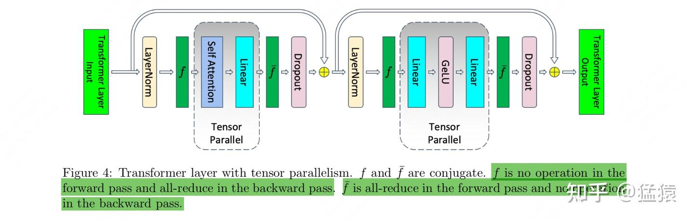

**그림에서 알 수 있듯이, megatron은 【attention】과 【mlp】 층의 계산에서만 tensor parallel을 사용합니다.**

- 각 GPU가 attention/mlp를 수행하기 전, 모든 GPU의 input은 완전히 동일합니다.
- 이어서 각 GPU는 각자의 attention/mlp 부분을 독립적으로 계산할 수 있습니다.
- 각 GPU가 attention/mlp를 끝낸 뒤에는 output에 대해 통신을 수행해, 최종적으로 모든 GPU의 output이 동일하도록 보장합니다. 이는 다음 block의 attention/mlp의 input이 동일하다는 점도 보장해 줍니다.

【attention】과 【mlp】 층의 계산 시점에 무슨 일이 일어나는지 좀 더 자세히 살펴보겠습니다.

### 1.1 MLP 층의 tensor parallel

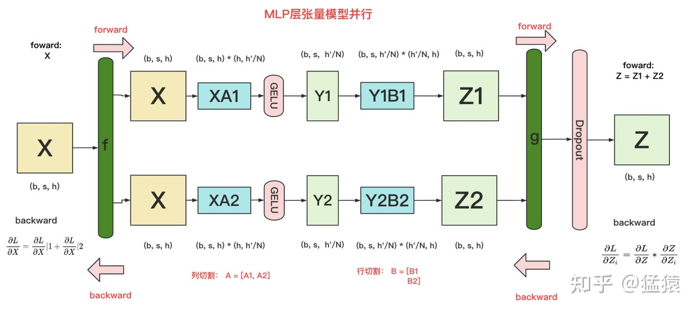

알다시피 MLP 층은 보통 두 개의 linear projection으로 구성되며, 여기서는 이를 A, B라고 적겠습니다. 동시에 모델을 GPU 2장에 나누었다고 가정합니다(tp_size = 2).

MLP 층에서는 **A에 "열 분할(column split)"을, B에 "행 분할(row split)"을 적용합니다.**

- `f`의 forward 계산: 각 GPU는 완전한 입력 X를 보유하고 있으므로, 각 GPU가 독립적으로 forward 계산을 할 수 있습니다. **여기서의 X는 figure4에서 layernorm 모듈을 거친 뒤의 결과에 대응합니다.**
- `g`의 forward 계산: 각 GPU에서 forward 계산이 끝나 Z1과 Z2를 얻으면, GPU 사이에서 **AllReduce**를 한 번 수행해 결과를 더해 Z를 만듭니다.
- `g`의 backward 계산: 이 시점에는 각 GPU가 완전한 Z를 보유하고 있으므로 $\frac{\partial L}{\partial Z}$(여기서 L=Loss)를 정상적으로 계산할 수 있고, 그 뒤 두 GPU는 각자 독립적으로 gradient 계산을 할 수 있습니다.
- `f`의 backward 계산: 현재 층의 gradient 계산이 끝나 다음 층으로 전달해 gradient 계산을 이어가야 할 때는 $\frac{\partial L}{\partial X}$를 구해야 합니다. 이때 두 GPU가 **AllReduce**를 한 번 수행해 각자의 gradient $\frac{\partial L}{\partial X}|1$과 $\frac{\partial L}{\partial X}|2$를 더하면 됩니다.

(여기서의 f는 figure4의 f에 대응하고, g는 figure4의 $\bar{f}$에 대응합니다)

### 1.2 Attention 층의 tensor parallel

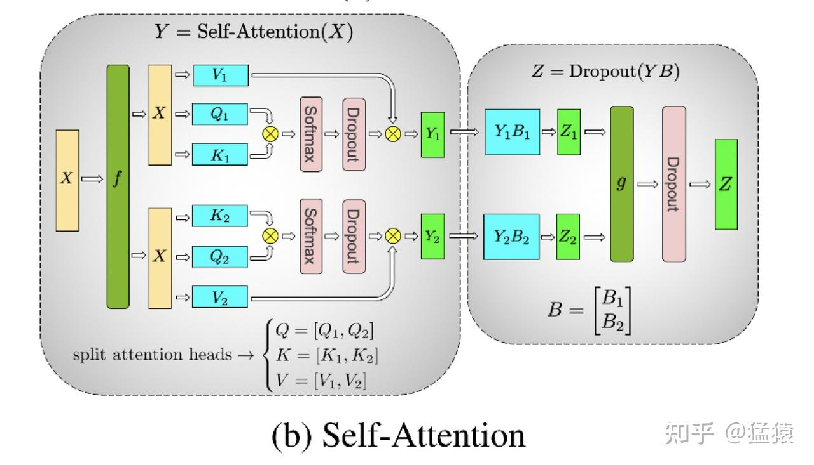

세 개의 파라미터 행렬 Q, K, V에 대해서는 **"열 분할"**을 적용합니다. **즉 각 GPU가 1개 또는 여러 개의 head 계산을 담당합니다.** linear 층 B에 대해서는 **"행 분할"**을 적용합니다. 분할 방식은 MLP 층과 기본적으로 같고 forward/backward 원리도 같으므로, 여기서는 반복하지 않겠습니다.

## 2. Attention과 MLP의 activation 크기

알다시피 gpu의 메모리 크기는 모델 학습의 병목 중 하나입니다. 모델 weight, gradient, optimizer, activation 등이 모두 메모리를 차지합니다. **그중에서도 bwd 과정에서 chain rule로 층층이 내려가며 gradient를 계산할 때, activation은 전달의 중간 매개체가 됩니다(예를 들어 1.1절 그림의 X, Y1, Z1 등이 activation에 속합니다).** activation이 메모리를 차지하는 정도 역시 상당하므로, activation의 저장을 최적화할 필요가 있습니다.

기존 방식에서는 activation이 차지하는 메모리를 줄이기 위해 **recomputation(재계산) 기술**을 사용했습니다. 여전히 1.1절 그림을 예로 들면 다음과 같습니다.

- fwd 과정에서 Y1을 계산합니다. 이때 메모리를 아끼기 위해 Y1을 저장하지 않기로 선택합니다.
- bwd 과정에서 gradient 계산이 Y1까지 전달되면, fwd 과정을 다시 수행해 Y1을 계산한 다음 bwd를 진행합니다.
- recomputation 방법을 사용하면 **당장 쓰지 않는 activation이 메모리를 오래 점유해서** 다른 계산 과정이 충분한 저장 자원을 확보하지 못해 대기 상태에 빠지는 일을 피할 수 있습니다.
- **하지만 recomputation은 모델의 계산 시간도 늘리므로(fwd를 한 번 더 했으므로) 모델의 throughput에 영향을 줍니다.**

그래서 자연스럽게 이런 생각이 떠오릅니다. **recomputation을 쓰지 않고 당장 쓰지 않는 activation을 그대로 gpu에 저장해 두되, 어떤 방법으로 각 gpu에 저장되는 activation 크기를 줄일 수 있다면 추가 fwd를 하지 않아도 되지 않을까요?** 다시 tensor parallel로 돌아오면, 이 시점에 모델 weight는 이미 잘려서 각 GPU에 올라가 있습니다. **그렇다면 activation도 잘라서 각 GPU에 올려 두는 방법을 생각해 보면 되지 않을까요?**

**이 아이디어를 중심으로, 이제 다음 3가지 문제를 차례로 해결해야 합니다.**

1. Attention과 MLP 층은 어떤 activation을 산출하며, 이들은 얼마만큼의 메모리를 차지하는가?
2. 이 activation 중에서 잘라서 저장할 수 있는 것은 무엇이며, 또 어떤 차원에서 자르는가?
3. 자르고 난 뒤 Attention과 MLP 층 전체는 어떻게 fwd와 bwd 계산을 수행하는가?

이 3가지 문제에 차례로 답하되, 이번 절에서는 먼저 문제 1에 답하겠습니다. **이후 설명에서는 모두 fp16으로 학습한다고 가정하며, 이는 행렬의 각 원소가 2bytes의 메모리를 차지한다는 뜻입니다.**

### 2.1 MLP 층의 activation 크기

먼저 어떤 분할 방식도 무시하고, 완전한 mlp 층 하나의 activation 크기 계산을 살펴보겠습니다.

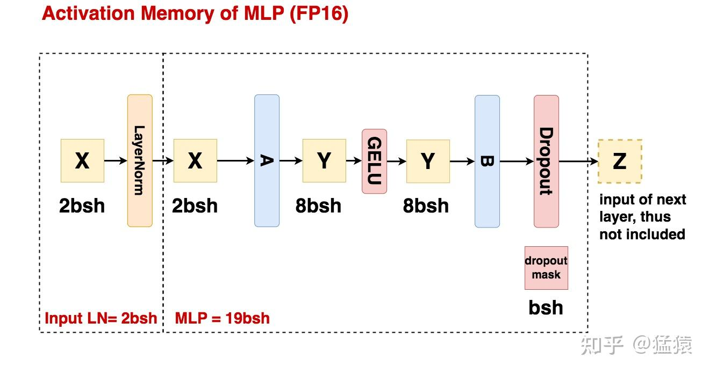

**`b=batch_size, s=seq_len, h=hidden_size`로 둡니다.**

- **Input LN:** 데이터가 layernorm을 거치기 전의 결과는 bwd 계산에서 사용되므로 activation으로 저장됩니다. 차지하는 저장 크기는 **`2bsh`**이며, **단위는 bytes**입니다.
- **MLP 과정:**
  - 선형 행렬 A(h, 4h)의 입력이 activation으로 저장되며, 크기는 2bsh입니다.
  - 선형 행렬 B(4h, h)의 입력이 activation으로 저장되며, 크기는 8bsh입니다.
  - GELU 함수의 입력이 activation으로 저장되며, 크기는 8bsh입니다.
  - Dropout mask 행렬(B의 출력 결과 중 hidden_size 차원에서 어떤 원소가 무작위로 mask되었는지 기록하는 용도)이 activation으로 저장되며, 크기는 bsh입니다. (단순한 0/1 mask 행렬이므로 원소 하나를 1 byte로 저장할 수 있습니다)
  - 정리하면 **MLP 과정의 activation 크기 = 19bsh**입니다.

MLP 과정에 대한 설명을 다 읽고 나면 이런 의문이 생길 수 있습니다. 보기에는 모든 연산(예: linear, gelu 등)의 입력이 곧 activation이고, 그것만 저장하면 될 것 같습니다. 그런데 그렇다면 왜 dropout의 입력은 저장하지 않는 것일까요?

그래서 이제 어떤 데이터가 activation에 해당하는지 더 잘 이해할 수 있도록 구체적인 예를 몇 가지 들어 보겠습니다.

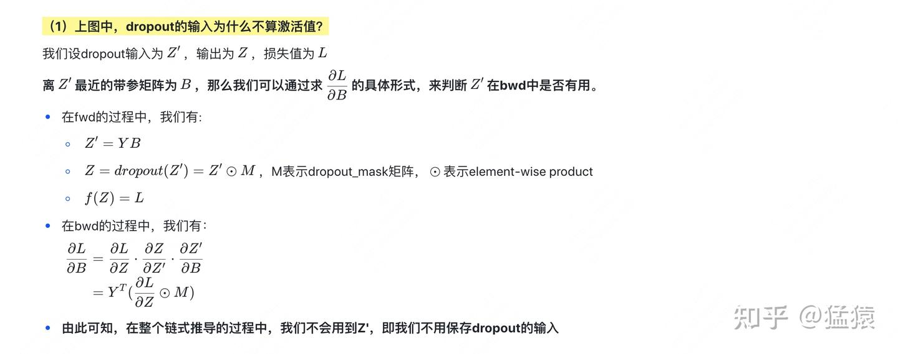

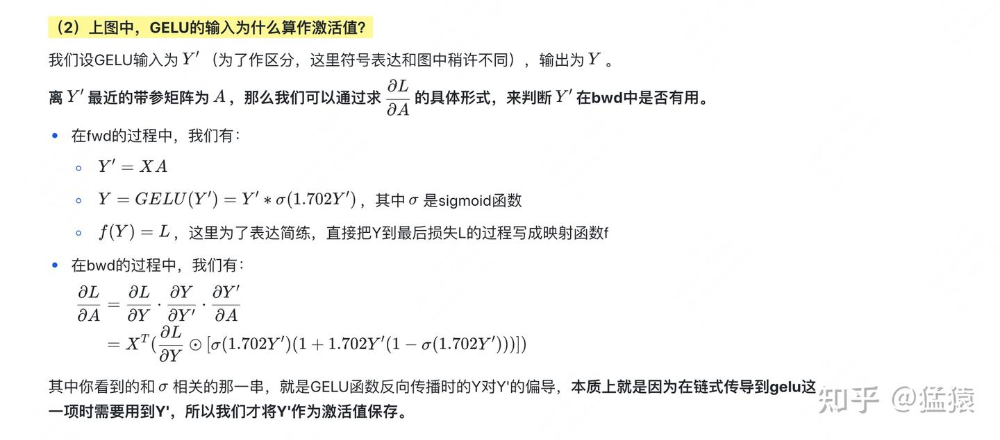

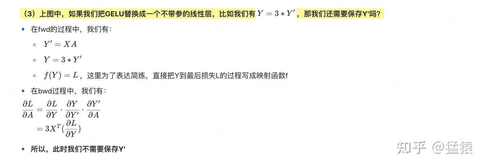

**위 3가지 예가 말해 주는 것은, 어떤 데이터가 activation으로 저장될 수 있는지를 결정하는 핵심은 그것이 bwd의 chain rule 전파 과정에서 사용되는지 여부라는 점입니다. *그러니 "파라미터가 있는 행렬의 입력과 출력은 반드시 activation이다"라고 주관적으로 단정하지 마시고*,** 반드시 직접 손으로 한 번 유도해 보시기 바랍니다. 물론 많이 보다 보면 손으로 유도하지 않아도 어떤 데이터가 activation인지 금방 알 수 있게 됩니다.

### 2.2 Attention 층의 activation 크기

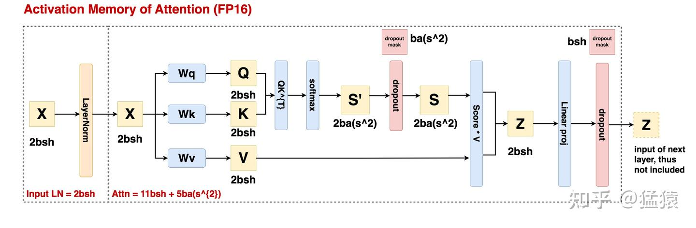

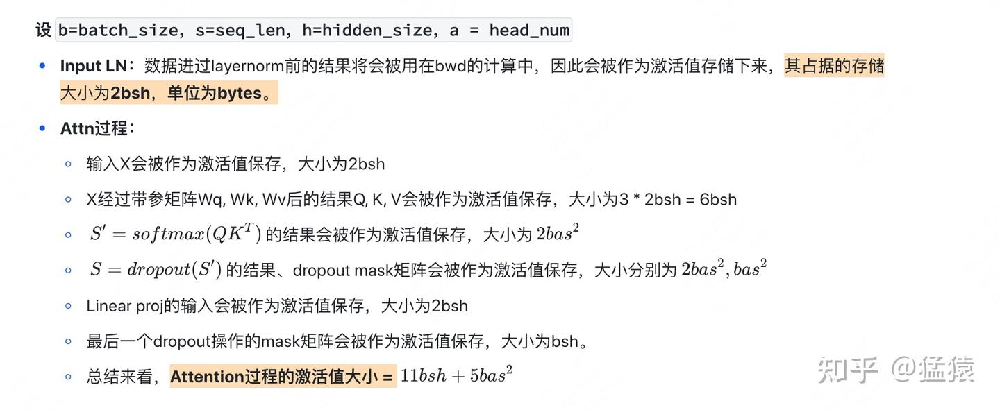

### 2.3 정리

- MLP 층의 activation 크기: $19bsh$
- Attention 층의 activation 크기: $11bsh + 5bas^{2}$
- MLP 층과 Attention 층의 입력 데이터는 모두 먼저 layernorm 처리를 거치며, layernorm과 관련된 activation 크기는 $2 * 2bsh = 4bs$입니다.
- **따라서 Attention + MLP로 구성된 block 하나의 전체 activation 크기는** $34bsh + 5bas^{2}$입니다.

## 3. Megatron SP

지금까지 어떤 데이터가 activation인지, 그리고 그것들이 차지하는 메모리 크기가 얼마인지 알아보았습니다. ***megatron sp의 핵심 사상은 tp가 모델 weight를 여러 GPU에 분할하는 방식을 참고해 activation도 각 GPU에 분할하는 것*이므로, 이제 어떤 activation을 자를 수 있고 또 어떻게 자르는지 논의해 보겠습니다.**

### 3.1 전체 구현 개요

먼저 최종적인 megatron sp의 구현 방안을 보고 전체적인 인상을 잡은 다음, 자세한 설명을 하겠습니다.

**우선 아래 그림은 개조 전(tp만 있는 경우)의 상황입니다.**

**그리고 아래 그림은 개조 후(tp+sp인 경우)의 상황입니다.**

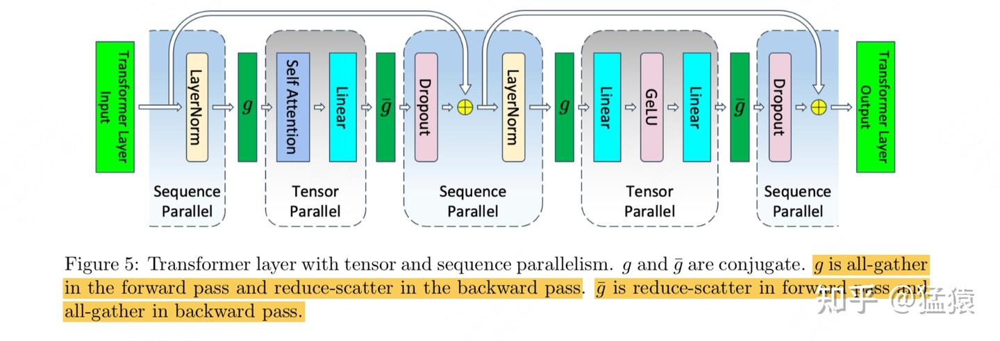

**어렵지 않게 알 수 있듯이, tp와 비교해 tp+sp는 원래의 tp 병렬 모듈은 그대로 유지하고, 단지 Attn과 MLP의 입력/출력 부분에 대해서만 sp(sequence parallel 처리)를 적용했습니다. 이어서 sp가 구체적으로 어떻게 분할하는지 살펴보겠습니다.**

### 3.2 MLP 층의 tp+sp

**(1) 순수 tp에서의 단일 GPU activation 크기 분석**

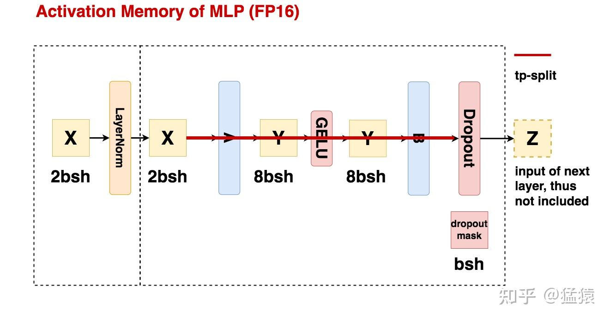

위 두 그림을 비교하면 **순수 tp에서 GPU 1장이 유지하는 activation 크기를 계산할 수 있습니다.**

- 먼저 layernorm 전후의 activation X는 각 GPU가 중복해서 저장하므로, 여기서 차지하는 저장 공간은 $2*2bsh = 4bs$입니다.
- 이어서 mlp의 tp 계산에 들어가면, 각 GPU가 결과의 일부를 따로 계산하므로 여기서의 activation은 자연스럽게 잘려서 저장됩니다. 차지하는 저장 공간은 $\frac{8bsh+8bsh}{t} = \frac{16bsh}{t}$입니다.
- 마지막으로 계산이 끝나면, tp는 출력 결과에 대해 먼저 allreduce를 수행해 각 GPU가 완전한 출력 Z를 가진 뒤에 dropout을 수행합니다. 따라서 dropout mask와 관련된 activation도 중복 저장되며, 크기는 bsh입니다.
- **종합하면 순수 tp 상황에서 단일 GPU의 activation 크기는** $5bsh + \frac{16bsh}{t}$입니다.
- **따라서 단일 GPU의 activation 크기를 낮추기 위한 우리의 목표는, 이 중복된 5bsh를 여러 GPU에 분할하는 것입니다.**

**(2) tp+sp에서의 단일 GPU activation 크기 분석**

megatron sp가 이 5bsh 중복 문제를 어떻게 해결하는지 바로 살펴보겠습니다.

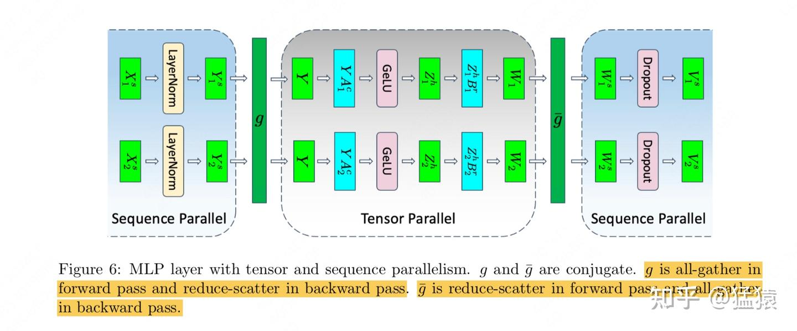

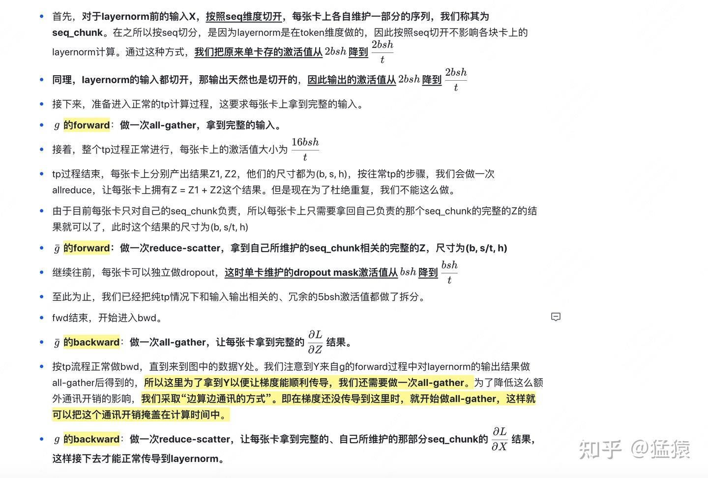

(이 절을 읽으실 때는 3.2(1)의 mlp tp 흐름도와 대조해 가며 보시면, 왜 여기서는 all-gather를 하고 저기서는 reduce-scatter를 쓰는지 이해하는 데 도움이 됩니다)

**tp+sp의 도움으로, 단일 GPU에서 mlp 층이 유지하는 activation 크기를** $5bsh + \frac{16bsh}{t}$에서 $\frac{21bsh}{t}$로 낮추었고, **동시에 all-gather 2회와 reduce-scatter 2회를 수행했습니다. 이는 순수 tp에서 mlp 층이 allreduce 2회를 하는 경우(ring allreduce 같은 최적화 방법을 사용했다고 가정)와 통신량이 동일합니다.**

### 3.3 Attention 층의 tp+sp

**여기서는 반복하지 않겠습니다. 기본 흐름은 mlp와 같으며, 최종적으로 단일 GPU의 activation 크기는** $\frac{(5bas^{2}+8bsh) + 5bsh}{t}$**로 낮아집니다(괄호 안은 순수 tp 상황에서 이미 분할되어 있던 activation을, 괄호 밖은 sp를 도입한 뒤 추가로 분할된 activation을 나타내며, 이 역시 layernorm의 입력/출력과 마지막 dropout mask 행렬입니다).** **통신량도 순수 tp와 동일하게 유지됩니다.**

### 3.4 정리

- **아무런 병렬 처리를 하지 않을 때**, 단일 GPU에서 attn+mlp 층의 activation 크기는 $sbh(34 + 5\frac{as}{h})$입니다.
- **GPU가 t장 있고 순수 tp 처리를 할 때**, 단일 GPU에서 attn+mlp 층의 activation 크기는 $sbh(10 + \frac{24}{t} + 5\frac{as}{ht})$입니다. 여기서 유일하게 t로 나누어지지 않은 10은 attn과 mlp에서 layernorm의 입력, 출력 및 마지막 dropout mask와 관련된 부분을 나타냅니다. 이 부분이 바로 sp가 주목하는 최적화 지점입니다.
- **GPU가 t장 있고 tp+sp 처리를 할 때**, 단일 GPU에서 attn+mlp 층의 activation 크기는 $sbh(\frac{34}{t} + 5\frac{as}{ht})$입니다.

## 4. Selective Activation Recomputation

지금까지 **megatron은 tp+sp 방식을 통해, tp를 기반으로 Attn과 MLP의 입력, 출력 결과를 seq 차원에 따라 추가로 분할했습니다.** 그 결과 통신량은 순수 tp와 동일하게 유지하면서도 단일 GPU가 유지하는 activation 크기를 한층 더 줄였습니다. **이런 방식으로 단일 GPU의 메모리 공간을 최대한 확보하면 모든 activation을 저장할 수 있게 됩니다. 그러면 bwd 과정에서 recomputation을 할 필요가 없어지므로 bwd 과정이 빨라지고, 모델의 전체 학습 속도가 올라갑니다.**

하지만 때로는 sp+tp를 쓰더라도 메모리에 모든 activation을 담지 못할 수 있습니다. 또한 우리는 언제나 계산과 통신을 겹쳐 수행할 수 있으므로, 모든 activation을 한꺼번에 저장해 둘 필요가 없을 수도 있습니다. 예를 들어 몇 가지 최적화를 통해, 모델이 아직 이전 층에서 통신하고 있는 동안 다음 층에서 recomputation을 시작하게 할 수 있습니다(여기서의 층은 모델의 layer가 아니라 bwd의 시간축을 가리키며, 그저 대략적인 예시입니다). **따라서 절충안 하나는 다음과 같습니다. tp+sp를 사용한다는 전제하에 일부 activation만 남겨 두고, 나머지는 recomputation으로 처리하는 것입니다. 그렇다면 어떤 activation을 남기고 싶지 않을까요? 당연히 메모리는 많이 차지하지만 그 자체의 계산량은 크지 않은 activation입니다(예를 들어 Attention score와 관련된 계산에서 softmax 같은 연산은 행렬 곱셈에 비해 훨씬 빠릅니다). megatron은 이 방법을 *selective activation recomputation*이라고 부릅니다.**

구체적인 동작 방식을 보겠습니다.

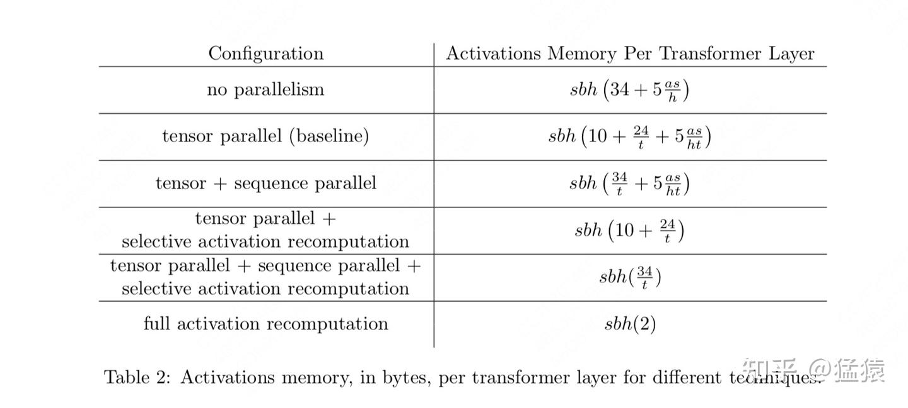

- **tp + selective activation recomputation**: tp와 선택적 recomputation만 사용하며, 여기서는 attention과 mlp의 입력, 출력과 관련된 부분(즉 sp가 집중적으로 최적화하는 부분)만 남기고 중간 계산 결과의 activation은 전부 버린 다음, 나중에 recomputation합니다.
- **tp + sp + selective activation recomputation**: 여기서는 attention score softmax와 관련된 activation(저장 공간은 많이 차지하고 계산량은 작은 부분)을 버리고 나머지 activation은 전부 저장하는 쪽을 선택합니다.
- **Full activation recomputation**: 우리가 말하는 소박한 recomputation으로, 맨 처음 입력 하나만 남깁니다.

몇 가지 방법의 실험 결과는 다음과 같습니다. tp+sp+선택적 recomputation 방안의 전체 성능이 가장 좋다는 것을 알 수 있습니다.

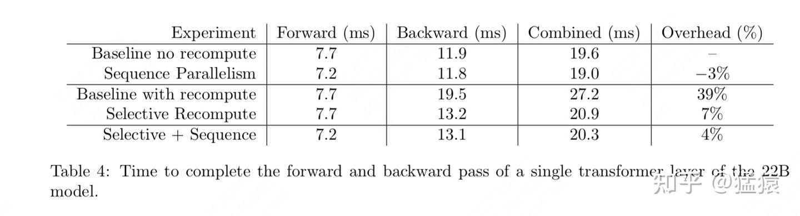

---

**【대규모 모델 사전학습 시리즈】**

- [猛猿: 도해 대규모 모델 학습: 파이프라인 병렬(Pipeline Parallelism), Gpipe를 예로](https://zhuanlan.zhihu.com/p/613196255)
- [猛猿: 도해 대규모 모델 학습: 데이터 병렬 상편(DP, DDP와 ZeRO)](https://zhuanlan.zhihu.com/p/617133971)
- [猛猿: 도해 대규모 모델 학습: 데이터 병렬 하편(ZeRO, 제로 중복 최적화)](https://zhuanlan.zhihu.com/p/618865052)
- [猛猿: 도해 대규모 모델 시리즈: 텐서 모델 병렬, Megatron-LM](https://zhuanlan.zhihu.com/p/622212228)
- [猛猿: 도해 대규모 모델 시리즈: Megatron 소스 코드 해설 1, 분산 환경 초기화](https://zhuanlan.zhihu.com/p/629121480)
- [猛猿: 도해 대규모 모델 학습: Megatron 소스 코드 해설 2, 모델 병렬](https://zhuanlan.zhihu.com/p/634377071)
- [猛猿: 도해 대규모 모델 학습 시리즈: Megatron 소스 코드 해설 3, 분산 혼합 정밀도 학습](https://zhuanlan.zhihu.com/p/662700424)
- [猛猿: 도해 대규모 모델 학습 시리즈: DeepSpeed-Megatron MoE 병렬 학습(원리편)](https://zhuanlan.zhihu.com/p/681154742)
- [猛猿: 도해 대규모 모델 학습 시리즈: DeepSpeed-Megatron MoE 병렬 학습(소스 코드 해설편)](https://zhuanlan.zhihu.com/p/681692152)
- [猛猿: 도해 대규모 모델 학습 시리즈: 시퀀스 병렬 1, Megatron SP](https://zhuanlan.zhihu.com/p/4083427292)
- [猛猿: 도해 대규모 모델 학습 시리즈: 시퀀스 병렬 2, DeepSpeed Ulysses](https://zhuanlan.zhihu.com/p/4496065391)
- [猛猿: 도해 대규모 모델 학습 시리즈: 시퀀스 병렬 3, Ring Attention](https://zhuanlan.zhihu.com/p/4963530231)
- [猛猿: 도해 대규모 모델 학습 시리즈: 시퀀스 병렬 4, Megatron Context Parallel](https://zhuanlan.zhihu.com/p/5502876106)
