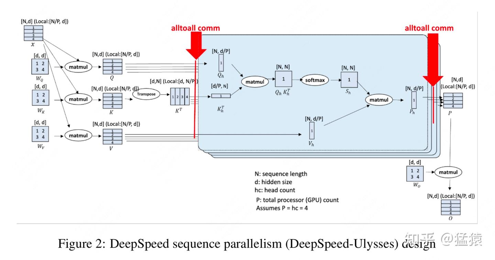
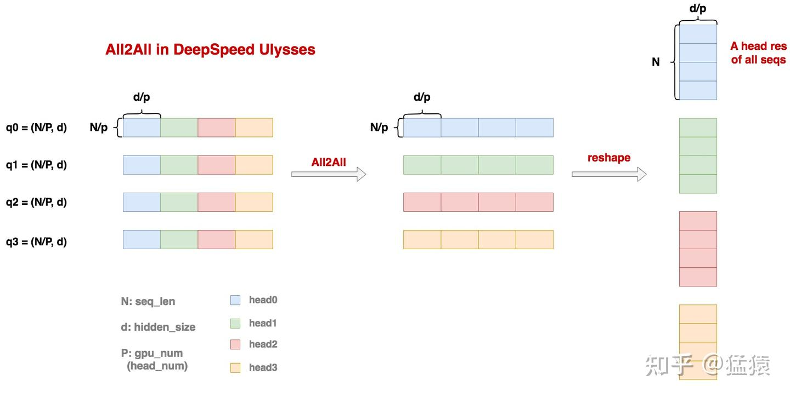
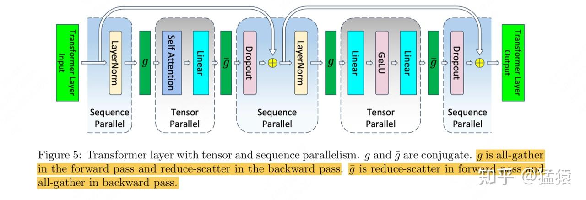
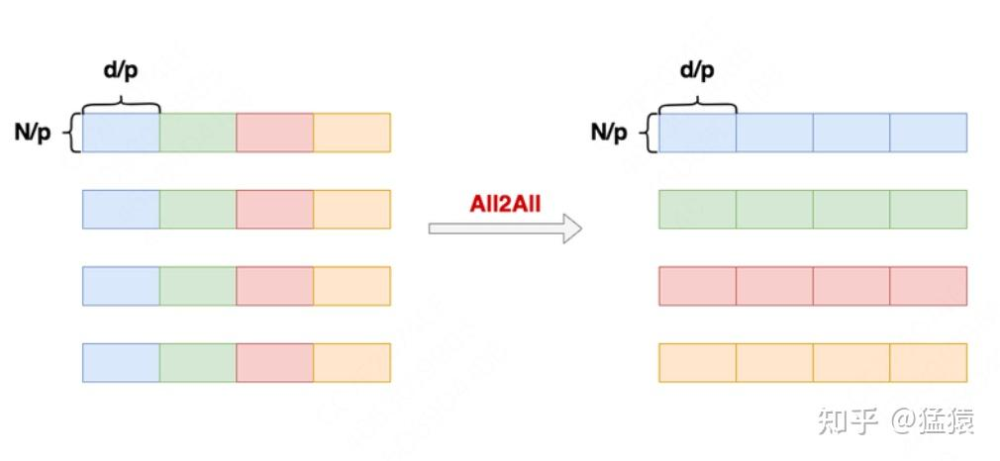
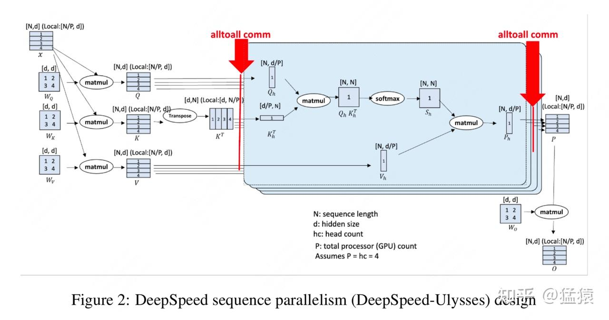
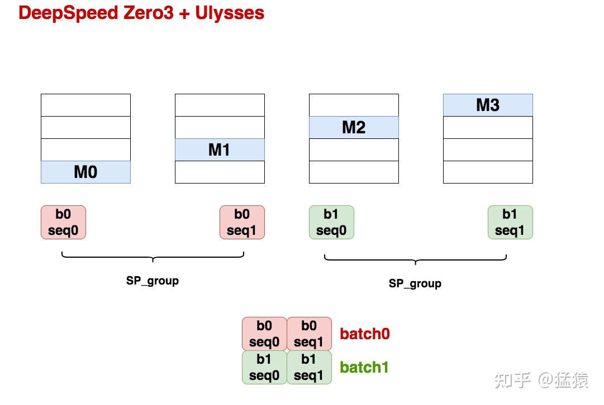

# [도해 대규모 모델 학습 시리즈] 시퀀스 병렬 2 - DeepSpeed Ulysses

> 원문: https://zhuanlan.zhihu.com/p/4496065391

안녕하세요. sequence parallel 시리즈에서는 이미 [Megatron SP](https://zhuanlan.zhihu.com/p/4083427292)를 소개했고, 오늘은 DeepSpeed Ulysses를 살펴보겠습니다.

본문을 시작하기 전에 한마디 투덜거림을 허락해 주시기 바랍니다. **DeepSpeed Ulysses는 DS 특유의 글쓰기와 coding 스타일을 그대로 물려받았습니다. 구름 속인지 안개 속인지, 꿈속인지 마음속인지 알 수 없지만, 어쨌든 독자의 머릿속으로는 들어오지 않습니다.** 그래서 paper는 짧고 coding 변경량도 적으며 **모든 것을 아낌없이 오픈소스로 공개했지만, 동시에 아무것도 공개하지 않은 것처럼 느껴져서** 이해하는 과정 전체가 지나치게 눈이 시리고 코가 시큰해지는 일이 되었습니다. 몇 가지 예를 들면 다음과 같습니다.

- Ulysses의 셀링 포인트 중 하나인 【통신량】을 한두 문장으로 넘겨 버립니다.
- Ulysses SP의 핵심 동작인 All-To-All 과정을 All2All이라고 적힌 빨간 화살표 하나로 요약해 버립니다.
- Ulysses + zero3처럼 공식적으로 권장하는 학습 방법인데도 그림 한 장이 없습니다.
- 이런 식입니다.

그래서 원래는 게으름을 피워 소스 코드를 보지 않으려 했지만, 결국 소스 코드부터 다시 읽어야 했습니다. 코드 이야기가 나온 김에 덧붙이자면, 여러분도 DS 쪽 코드 스타일을 본 적이 있다면 제가 여기에 다 기록하지 못한 눈물을 이해하실 것입니다(다만 Ulysses는 그래도 나은 편입니다).

그럼에도 불구하고 Ulysses의 설계 사상을 제대로 이해하고 나면, 그 간편함과 가벼움에 감탄할 수밖에 없습니다. 만약 제가 sequence parallel을 실제로 도입해야 한다면, 높은 확률로 Ulysses부터 손대기 시작할 것입니다. 서론은 이쯤 하고 본문으로 들어가겠습니다.

**【지난 글 모음】**

[猛猿: 【필독】 지난 기술 문서 내비게이션](https://zhuanlan.zhihu.com/p/654910335)

---

## 1. Ulysses 전체 동작 흐름

Ulysses의 전체 동작 흐름은 아래 그림과 같습니다. 자세히 설명해 보겠습니다.

다음과 같이 둡니다.

- **N = seq_len**
- **d = hidden_size**
- **P = gpu_num**. 뒤에서 살펴보면 알 수 있듯이, Ulysses는 실제 동작에서 GPU 1장이 1개 또는 여러 개의 head 결과를 계산합니다. 따라서 여기서는 head_num이 P의 정수배여야 한다는 조건도 만족해야 합니다. **다만 이후 설명을 간단히 하기 위해, 이 P를 head_num으로 통일해서 이해하겠습니다.**

이 그림을 따라 Ulysses의 fwd 과정을 한 번 따라가 보겠습니다.

**(1) seq 차원을 따라 입력 데이터를 분할합니다.**

입력 `X = (N, d)`에 대해, 이를 여러 개의 seq_chunk로 분할해 각 GPU의 입력으로 삼습니다. **각 seq_chunk의 크기는 `(N/P, d)`입니다.**

**(2) 각 GPU는 자신이 담당하는 seq_chunk의 qkv 값을 계산합니다.**

- **Ulysses 자체는 모델을 전혀 분할하지 않으므로, 각 GPU에는 완전한 모델, 즉 완전한** W_Q, W_K, W_V 행렬이 저장되어 있으며 크기는 모두 `(d, d)`입니다.
- 여기서 한 가지 덧붙이면, Ulysses를 zero3와 함께 사용할 수 있다는 이야기를 자주 듣습니다. 이 경우 본격적인 계산에 들어가기 전에는 각 GPU가 실제로 모델의 일부만 저장하지만(model parallel의 형태), 실제 계산 시점에는 all-gather를 수행해 각 GPU가 완전한 모델을 다시 가져온 뒤 계산합니다(data parallel의 실질). 따라서 여전히 GPU에 완전한 모델이 저장되어 있다고 이해해도 무방합니다.
- **각 GPU의 seq_chunk는 평소대로** W_Q, W_K, W_V **와 곱해져 `q/k/v_chunk = (N/p, d)`를 얻습니다.**

**(3) q/k/v_chunk에 대해 모든 GPU 사이에서 All-To-All 통신을 한 번 수행해, 각 GPU가 전체 seq에 대한 특정 1개 head의 q/k/v_chunk를 갖도록 만듭니다.**

- 이 All-To-All 통신을 하기 전, 각 GPU가 보유한 **`q/k/v_chunk = (N/p, d)`**는 어떤 seq_chunk의 모든 head에 대한 qkv 값이라고 이해할 수 있습니다.
- 이 All-To-All 통신을 한 뒤, 각 GPU가 보유한 **`q/k/v_chunk = (N, d/P)`**는 전체 seq에 대한 어떤 head의 qkv 값이라고 이해할 수 있습니다.

**q_chunk를 예로 들어** All-To-All이 이를 어떻게 구현하는지 구체적으로 살펴보겠습니다(**아래 그림은 Ulysses 소스 코드를 바탕으로 그렸으며, 약간 단순화했습니다**).

- 위 그림과 같이, 여기서는 GPU가 4장(head 4개)이라고 가정합니다. 최종적으로 gpu0이 head0의 결과를, gpu1이 head1의 결과를 계산하기를 원합니다. 나머지도 같은 식입니다. 서로 다른 head를 계산하는 데 필요한 q 데이터를 서로 다른 색의 사각형으로 표시했습니다.
- 위 그림 가장 왼쪽의 gpu0에 있는 q0부터 보겠습니다. q0은 seq_chunk0의 q 결과를 의미하며 크기는 `(N/P, d)`입니다. 어렵지 않게 알 수 있듯이, q0을 d 차원을 따라 P개 블록으로 자르면 각 블록은 대응하는 head를 계산하는 데 필요한 q 결과가 됩니다. 다른 GPU의 q_chunk도 마찬가지입니다.
- **이제 All-To-All 알고리즘을 실행합니다. 이것은 일종의 "전치(transpose)식" 통신 방법이라고 이해할 수 있습니다.** 위 그림과 함께 보면, 각 GPU의 1번째 열 파란색 블록은 모두 gpu0으로 가고, 2번째 열 초록색 블록은 모두 gpu1로 가는 것을 볼 수 있습니다. 이것이 바로 우리가 말하는 "전치"의 의미입니다.
- All-To-All이 끝난 뒤 다시 gpu0을 예로 들면, **gpu0은 P개의 `(N/P, d/P)` 데이터를 갖게 되며, 이는 전체 seq의 head0에 대한 q 결과를 의미합니다. 이를 약간 reshape하면 각 GPU가 최종적으로 보유하는 q_chunk는 `(N, d/P)`가 됩니다.** 각 GPU의 k/v_chunk도 같은 방식으로 All-To-All 통신을 수행합니다.

**(4) 각 GPU가 전체 seq에 대한 특정 1개 head의 q/k/v_chunk를 얻은 뒤에는 평소대로 Attention 계산을 수행합니다. 최종적으로 각 GPU는 $P_h$ chunk를 산출하며, 크기는 `(N, d/P)`입니다.**

**(5) $P_h$ chunk에 대해 모든 GPU 사이에서 All-To-All 통신을 다시 한 번 수행하면, 최종적으로 단일 GPU가 보유하는 P chunk 크기는 다시 `(N/P, d)`로 돌아옵니다.** 이 All-To-All 과정은 앞서 설명한 All-To-All의 역연산이라고 이해할 수 있으며, 작용 과정이 비슷하므로 여기서는 반복하지 않겠습니다.

**(6) 단일 GPU는 완전한 $W_O$ 행렬을 보유하고 있습니다. P chunk를 이와 곱하면 최종 출력 O chunk를 얻으며, 크기는 `(N/P, d)`입니다.**

**(7) MLP 층으로 들어갑니다. MLP 층에서는 token과 token 사이의 상관관계 계산이 없으므로, 각 seq_chunk 블록은 독립적으로 계산할 수 있습니다.**

**(8) 위 과정을 Loss를 계산할 때까지 반복합니다.**

- 여기서 제가 잠정적으로 판단한 바로는, 각 GPU에서 계산되는 Loss는 그 GPU가 담당하는 seq_chunk의 Loss일 것입니다. Ulysses 코드를 대략 훑어보니, 현재 핵심은 sp 병렬을 구현할 수 있는 DistributionAttention 모듈을 따로 설계한 다음, 이 모듈로 기존 Attention Module을 교체하는 방식입니다. 이렇게 간단한 교체만으로 Ulysses의 기본 기능을 구현합니다. 여기에 MLP 계산에서 seq_chunk가 갖는 독립성과 data parallel의 특성까지 고려하면, 최종적으로 단일 GPU의 Loss는 곧 seq_chunk의 Loss일 것입니다. 이는 또한 sp 그룹의 gradient에 All-Reduce 통신이 필요하다는 뜻이기도 합니다. 이 부분은 뒤의 Ulysses 통신량 분석에서 다시 이야기하겠습니다.

## 2. Megatron VS Ulysses

어렵지 않게 알 수 있듯이, Ulysses와 Megatron은 attention을 분산 계산한다는 점에서 어느 정도 비슷한 면이 있습니다.

- **Megatron은 tp를 통해 Wq, Wk, Wv를 명시적으로 분할하고**, 각 GPU에서 **전체 seq에 대한 어떤 head의 결과**를 계산합니다.
- **Ulysses는 sp + All-To-All을 통해, 각 GPU가 Wq, Wk, Wv를 완전하게 보유한 상태에서** 각 GPU가 **전체 seq에 대한 어떤 head의 결과**를 계산하도록 합니다.

비슷한 기능을 구현하는 상황에서 **Ulysses가 내세우는 중요한 셀링 포인트는 "통신량이 낮다"는 것입니다.** 그래서 이제 이 점을 자세히 분석해 보겠습니다.

***(⚠️⚠️⚠️: 아래 내용을 읽다가 통신량, activation 등의 계산에 의문이 생기신 분은 먼저 [Megatron SP](https://zhuanlan.zhihu.com/p/4083427292)에 관한 글을 읽어 보시기 바랍니다.)***

### 2.1 Megatron 통신량

위 그림은 megatron tp + sp의 전체 동작 흐름을 보여 줍니다.

**Attention 부분에 대해서:**

- **fwd 과정에서 all-gather 1회, reduce-scatter 1회를 수행합니다.**
- **bwd 과정에서 reduce-scatter 1회, all-gather 1회를 수행합니다**(사실 bwd에서 g로 역전파되기 전에 all-gather를 1회 더 해야 하지만, 이 통신량은 계산으로 가려질 수 있습니다. 즉 g로 전파되기 전에 아직 상위 층의 chain rule 계산을 하는 동안 all-gather를 시작할 수 있습니다. 그래서 여기서는 이 추가 all-gather를 일단 무시합니다. 물론 포함시켜서 계산하셔도 무방합니다).
- **all-gather 1회 / reduce-scatter 1회의 통신량은 대략 `Nd`입니다(batch_size는 무시). 따라서 Megatron Attn 부분의 통신량은 대략 `4Nd`입니다.**

**MLP 부분에 대해서:**

- 마찬가지로 all-gather 2회 + reduce-scatter 2회이며, 같은 이유로 bwd 과정의 계산 시간으로 가려질 수 있는 all-gather가 1회 더 있지만 역시 계산에 넣지 않습니다.

**Attention과 MLP를 합치면:**

- 최종적으로 Megatron에서 **Attention + MLP의 통신량은 all-gather 4회 + reduce-scatter 4회입니다(bwd 계산으로 가려질 수 있는 all-gather 2회는 여기에 포함하지 않습니다). all-gather 1회 / reduce-scatter 1회의 통신량은 대략 `Nd`이므로(batch_size는 무시), Megatron Attn 부분의 통신량은 대략 `8Nd`입니다.**

### 2.2 Ulysses 통신량

**(1) All-To-All 연산의 통신량**

- All-To-All 연산 전, 각 GPU에 저장된 데이터 크기는 `(N*d)/P`이고, 각 작은 데이터 블록의 크기는 `(N*d)/(P*P)`입니다.
- 단일 GPU 입장에서 보면 통신량에는 send와 accept가 모두 관여하지만, 시스템 전체의 통신량은 각 GPU의 send 총합이라고 이해할 수 있습니다(내가 받는 accept는 언제나 남의 send에서 오고, 그 반대도 마찬가지이기 때문입니다). 따라서 단일 GPU의 통신량도 send만 보면 됩니다.
- **단일 GPU 입장에서 send 양은 `[(N*d)/(P*P)]*(P-1)`이며, 대략 `(N*d)/P`입니다. 즉 단일 GPU가 All-To-All을 1회 수행할 때의 통신량은 대략 `(N*d)/P`입니다【다시 떠올려 보면, 단일 GPU가 all-gather 또는 reduce-scatter를 1회 수행할 때의 통신량은 `N*d`입니다】.**

**(2) Ulysses fwd 통신량**

1부에서 본 Ulysses의 fwd 과정을 되짚어 보겠습니다.

- q/k/v_chunk가 각각 All-To-All 통신을 1회씩 수행하므로, 여기서 합쳐서 All-To-All 통신 3회를 수행합니다.
- 각 GPU의 원래 Attention 결과 $P_h$가 All-To-All 통신을 1회 수행합니다.
- **종합하면 Ulysses fwd 과정에서는 총 4회의 All-To-All 통신을 수행합니다.**

(주의: zero 연산을 함께 사용한다면 fwd 과정에서 모델 weight의 all-gather도 발생하지만, 여기서는 이 점을 고려하지 않고 가장 소박한 Ulysses, 즉 단일 GPU에 완전한 모델이 있는 경우를 가정합니다.)

**(3) Ulysses bwd 통신량**

이 부분도 제가 중요하다고 생각하는 지점인데, 논문에서는 다루지 않았습니다(눈물을 닦습니다). 그래서 소스 코드를 뒤져 보고(또 눈물을 닦습니다), 제 이해를 바탕으로 bwd 과정을 대략 설명해 보겠습니다.

**Ulysses bwd 과정에서, 다음 두 종류의 통신은 이론적으로 bwd의 계산 시간으로 가려질 수 있으므로 총 통신량에 포함하지 않습니다.**

- **activation의 재계산**: 알다시피 chain rule을 따라 미분하는 과정에서 일부 activation(예: 위 그림의 P)을 사용하게 됩니다. 그런데 메모리를 아끼기 위해 대부분의 프레임워크는 이 activation들을 저장해 두지 않고, chain rule 전파가 해당 activation에 도달했을 때 fwd를 다시 수행해 그 값을 계산합니다. 예를 들어 chain rule 전파가 위 그림의 P에 거의 도달했을 때, fwd의 All-To-All을 다시 수행해 P를 계산해야 합니다. 이 작업은 P를 사용하기 전에 미리 할 수 있으므로, P를 재계산하는 All-To-All 통신은 가려질 수 있습니다. 그림의 $S_h, V_h, Q_h, K_h$ 등도 마찬가지입니다.
- **gradient의 All-Reduce**:
  - 지금 $W_O$에 대한 gradient를 계산한다고 가정하고, GPU가 2장이며 각 GPU가 어떤 seq_chunk의 P_chunk 결과를 보유하고 있으며 P_chunk의 크기가 `(N/2, d)`라고 하겠습니다. 그러면 다음과 같습니다.
  - $O_0 = P_0 * W_O$
  - $O_1 = P_1 * W_O$
  - 각 GPU가 담당하는 seq_chunk의 최종 loss는 $L_0 = f(O_0), L_1 = f(O_1)$이고, 전체 sequence의 Loss는 $L = L_0 + L_1$입니다. 여기서는 표현을 간단히 하기 위해 O를 계산한 이후의 모든 연산을 함수 f로 표시했습니다.
  - 따라서 $\frac{\partial L}{\partial W_O} = \frac{\partial L_1}{\partial W_O} + \frac{\partial L_2}{\partial W_O}$임을 쉽게 알 수 있습니다. 즉 $W_O$의 전체 gradient는 각 GPU가 계산한 gradient를 All-Reduce해야 얻을 수 있습니다.
  - 그림으로 돌아오면, 각 GPU가 각자의 $W_O$에 대한 gradient를 다 계산한 뒤에는 chain rule 전파를 계속하면서 동시에 gradient를 내보내 All-Reduce를 할 수 있습니다(gradient의 All-Reduce가 끝났는지 여부는 이후의 chain rule 전파 과정에 영향을 주지 않기 때문입니다). 따라서 gradient의 All-Reduce도 bwd의 계산 시간으로 가려진 것으로 보고, Ulysses bwd 통신량 계산에 넣지 않습니다.

이 두 가지를 분명히 했으니, **이제 Ulysses bwd에서 실제로 영향을 주는 통신 연산을 분석해 보겠습니다**(위 그림과 함께 읽어 주시기 바랍니다).

- 먼저 gradient가 P까지 전파되면, dP에 대해 All-To-All 연산을 1회 수행해야 fwd의 경로를 복원할 수 있습니다.
- 마찬가지로 gradient가 V, Q, K까지 전파되면 이들에 대해서도 All-To-All 연산을 수행해야 하며, 여기서 총 3회의 All-To-All 연산을 수행합니다.
- bwd 과정의 All-To-All은 fwd 과정의 All-To-All과 같은 위치에서 반대 연산을 하는 것이라고 이해할 수 있습니다. **따라서 bwd 과정 전체에서도 4회의 All-To-All 연산을 수행합니다.**

**여기서 한 가지 더 덧붙이면, 사실 이 4회의 All-To-All 연산끼리도 서로 가려질 수 있습니다.** 예를 들어 chain rule이 V까지 전파되면 dV에 대해 All-To-All을 할 수 있고, 이때 단일 GPU에서는 dQ와 dK 계산을 계속할 수 있으므로 dV의 All-To-All 연산은 가려질 수 있습니다. 같은 이치로 dQ와 dK 중 먼저 계산이 끝나는 쪽이 가려질 수 있습니다. **다만 Ulysses 소스 코드에서는 dQ와 dK만 이 가리기 처리를 한 것으로 보입니다. 어쨌든 여기서는 bwd의 이 4회 All-To-All이 서로 가려지는 것은 일단 고려하지 않겠습니다.**

따라서 다음과 같습니다.

- **Ulysses는 fwd에서 All-To-All 4회, bwd에서 All-To-All 4회, 총 8회의 All-To-All을 수행합니다.**
- **매 All-To-All의 통신량은 대략 `(N*d)/P`이므로, Ulysses의 총 통신량은 `(8Nd)/P`입니다.**

### 2.3 통신량의 비교

앞서 말한 대로, 가려질 수 있는 일부 통신을 고려하지 않는 경우 단일 GPU에서 layer(mlp+attn) 1개당 통신량은 다음과 같습니다.

- **Megatron tp+sp**: **all-gather 4회 + reduce-scatter 4회, 총 통신량 `8Nd`**
- **DeepSpeed Ulysses**: **All-To-All 8회, 총 통신량 `(8Nd)/P`**

이 두 통신량을 자세히 들여다보면 다음을 알 수 있습니다.

- **Megatron은 GPU를 몇 장 쓰든 단일 GPU의 총 통신량이 항상 `8Nd`입니다.** 이는 sequence length가 길어질 때(N이 커질 때) GPU 수를 늘려서 단일 GPU의 통신량을 줄일 수 없다는 뜻입니다. 그러면 단일 GPU가 통신에 쓰는 시간이 더 많아지고, 결과적으로 학습 속도가 떨어질 수 있습니다.
- **DeepSpeed Ulysses는 단일 GPU 통신량이 `(8Nd)/P`입니다. 이는 N이 커질 때 GPU 수(P)를 같은 배수로 조정할 수만 있다면, 단일 GPU 통신량을 변하지 않는 상수로 유지해 N이 늘어나도 커지지 않게 만들 수 있다는 뜻입니다.** 다만 주의할 점은 **P의 수가 사실 head_num에 의해 제한된다는 것입니다(Ulysses 소스 코드에도 이 제한이 걸려 있습니다).** 그래서 실제로는 P를 무한히 늘릴 수 없고, **따라서 소박한 Ulysses는 【단일 GPU 통신량을 P에 따라 scaling하며 변하지 않는 상수로 유지한다】는 셀링 포인트를 완벽하게 달성하지는 못합니다.** 그래서 Ulysses를 조금 개조할 수 있는데, 여기서는 더 다루지 않고 이후 시리즈에서 차차 소개하겠습니다.

## 3. Ulysses + Zero3

논문과 공식 튜토리얼에서 언급하는 ulysses + zero3 방법(이것 역시 셀링 포인트인데 ds는 또 설명하지 않았습니다, 눈물을 닦습니다)에 대해, 제가 프레임을 대략 그려 보았습니다.

- sp_size = 2, dp_size = 2라고 가정합니다. 그러면 필요한 GPU 수는 world_size = sp_size * dp_size = 4입니다.
- zero3의 원칙에 따라 모델 weight를 M0~M3의 4개 블록으로 나누어 서로 다른 GPU에 분산합니다.
- fwd 계산을 시작하기 전에, zero3의 원칙에 따라 모든 GPU의 weight가 통신을 한 번 수행해 각 GPU가 완전한 M0을 가져오게 하고, 그 뒤 평소대로 Ulysses 과정을 진행합니다. 이후도 같은 방식입니다.

Ulysses에 대한 기본 소개는 여기까지입니다. 다음에는 sequence parallel 세 번째 글인 ring attention을 함께 살펴보겠습니다.

## 4. 참고

- 1、https://arxiv.org/pdf/2309.14509
- 2、https://github.com/microsoft/DeepSpeed/blob/master/deepspeed/sequence/layer.py
- 3、https://github.com/microsoft/Megatron-DeepSpeed/blob/main/megatron/model/transformer.py
- 4、https://www.deepspeed.ai/tutorials/ds-sequence/

---

**【대규모 모델 사전학습 시리즈】**

- [猛猿: 도해 대규모 모델 학습: 파이프라인 병렬(Pipeline Parallelism), Gpipe를 예로](https://zhuanlan.zhihu.com/p/613196255)
- [猛猿: 도해 대규모 모델 학습: 데이터 병렬 상편(DP, DDP와 ZeRO)](https://zhuanlan.zhihu.com/p/617133971)
- [猛猿: 도해 대규모 모델 학습: 데이터 병렬 하편(ZeRO, 제로 중복 최적화)](https://zhuanlan.zhihu.com/p/618865052)
- [猛猿: 도해 대규모 모델 시리즈: 텐서 모델 병렬, Megatron-LM](https://zhuanlan.zhihu.com/p/622212228)
- [猛猿: 도해 대규모 모델 시리즈: Megatron 소스 코드 해설 1, 분산 환경 초기화](https://zhuanlan.zhihu.com/p/629121480)
- [猛猿: 도해 대규모 모델 학습: Megatron 소스 코드 해설 2, 모델 병렬](https://zhuanlan.zhihu.com/p/634377071)
- [猛猿: 도해 대규모 모델 학습 시리즈: Megatron 소스 코드 해설 3, 분산 혼합 정밀도 학습](https://zhuanlan.zhihu.com/p/662700424)
- [猛猿: 도해 대규모 모델 학습 시리즈: DeepSpeed-Megatron MoE 병렬 학습(원리편)](https://zhuanlan.zhihu.com/p/681154742)
- [猛猿: 도해 대규모 모델 학습 시리즈: DeepSpeed-Megatron MoE 병렬 학습(소스 코드 해설편)](https://zhuanlan.zhihu.com/p/681692152)
- [猛猿: 도해 대규모 모델 학습 시리즈: 시퀀스 병렬 1, Megatron SP](https://zhuanlan.zhihu.com/p/4083427292)
- [猛猿: 도해 대규모 모델 학습 시리즈: 시퀀스 병렬 2, DeepSpeed Ulysses](https://zhuanlan.zhihu.com/p/4496065391)
- [猛猿: 도해 대규모 모델 학습 시리즈: 시퀀스 병렬 3, Ring Attention](https://zhuanlan.zhihu.com/p/4963530231)
- [猛猿: 도해 대규모 모델 학습 시리즈: 시퀀스 병렬 4, Megatron Context Parallel](https://zhuanlan.zhihu.com/p/5502876106)
