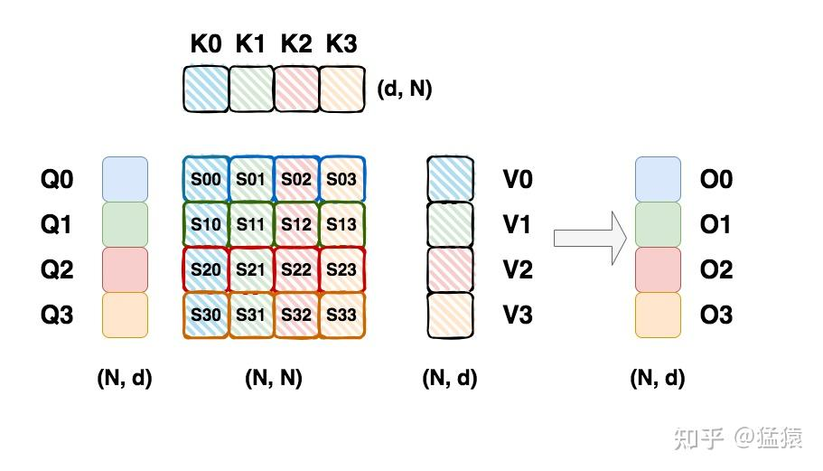
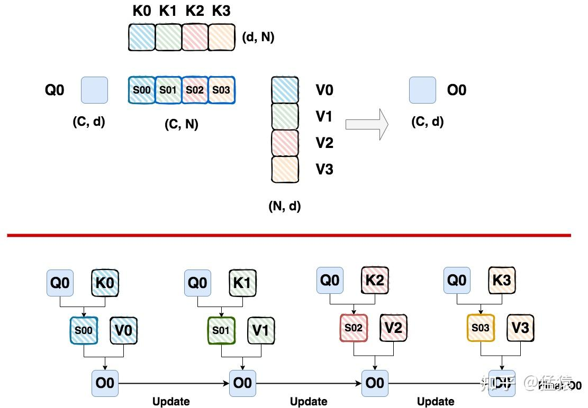
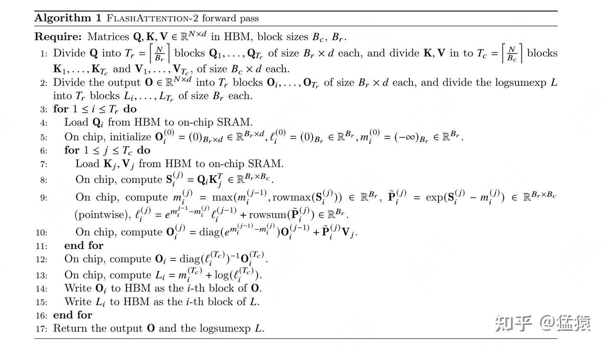
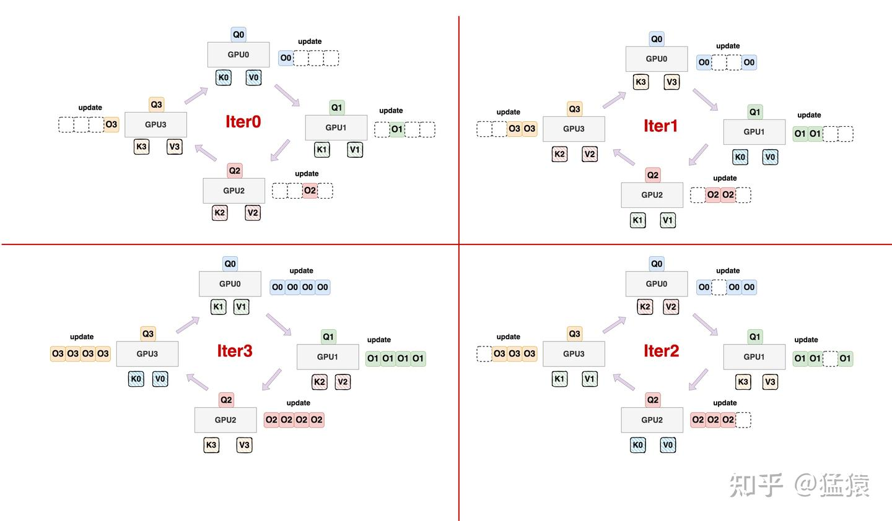

# [도해 대규모 모델 학습 시리즈] 시퀀스 병렬 3 - Ring Attention

> 원문: https://zhuanlan.zhihu.com/p/4963530231

sequence parallel 시리즈에서는 아래 네 가지 자주 쓰이는 프레임워크/방법을 자세히 소개하려 합니다.

1. **[Megatron Sequence Parallelism](https://zhuanlan.zhihu.com/p/4083427292)**: 본질은 단일 GPU의 activation 크기를 줄이는 방식으로 가능한 한 activation을 많이 보존하고 재계산을 적게 해서, 전체 학습 속도를 높이려는 것입니다. 보통 같은 집안의 tp와 짝을 지어 사용합니다.
2. **[DeepSpeed Ulysses](https://zhuanlan.zhihu.com/p/4496065391)**: 알다시피 ds 집안의 zero는 model parallel의 형태를 띠지만 본질은 data parallel입니다. 이 경우 GPU 1장이 시퀀스 하나의 MHA 과정을 온전히 수행하게 되므로, sequence length가 길어지면 단일 GPU 메모리에 부담이 생깁니다. **그래서 Ulysses의 해결책은, GPU 1장이 전체 seq에 대한 특정 1개/여러 개 head의 결과만 계산하도록 만드는 것입니다.** 구체적인 구현은 먼저 seq 차원을 따라 GPU의 입력을 분할하고, 그다음 all2all 통신을 수행하는 방식입니다.
3. **Ring Attention**: 분산 버전의 Flash Attention V2에 해당합니다(제 개인적인 이해입니다). **최종적인 효과는 각 GPU가 자신이 담당하는 그 seq_chunk 부분의 MHA만 계산하도록 만드는 것입니다.**
4. **Megatron Context Parallelism**: 강화판 sp로 볼 수 있습니다. ring-attention과 유사한 기술을 도입하고(tp-pp-dp rank가 같은 위치에서 ring-attention을 수행합니다), Megatron의 각종 혼합 병렬 방식과 결합해 학습합니다.

이 중 1과 2는 앞선 시리즈에서 이미 다루었고, 오늘은 【3. Ring attention】을 살펴보겠습니다. 본문을 읽기 전에 [Flash Attention V2](https://zhuanlan.zhihu.com/p/691067658)와 [Flash attention V1](https://zhuanlan.zhihu.com/p/669926191)의 블록 분할 계산 과정을 어느 정도 알고 계시면 좋습니다.

**【지난 글 모음】**

[猛猿: 【필독】 지난 기술 문서 내비게이션](https://zhuanlan.zhihu.com/p/654910335)

---

## 1. 단일 GPU: 소박한 attention과 safe softmax

소박한 attention의 계산 과정은 위 그림과 같습니다. 여기서 Q, K, V의 크기는 모두 `(N, d)`로 두며, N = seq_len, d = hidden_size입니다. 이어서 ring attention의 블록 분할 계산법을 더 잘 표현하기 위해, 위 그림에서는 Q, K, V를 모두 4개 블록으로 나누었고 각 블록의 크기는 `(C, d)`입니다. 다만 블록으로 나누지 않은 관점으로 위 그림을 읽어도 무방합니다. **특히 주의할 점은, 그림에서 크기가 `(N, N)`인 attention 행렬은 softmax를 마친 뒤에야 V 행렬과 곱할 수 있다는 것입니다. 표현을 간단히 하기 위해 그림에 softmax 과정을 그리지는 않았지만, 이 과정이 있다는 것은 반드시 기억해야 하며 이는 매우 중요합니다.**

보통 softmax는 다음과 같이 계산합니다.

$$softmax(x_{i}) = \frac{e^{x_{i}}}{\sum_{j=1}^{d}e^{x_{j}}}$$

**그런데** $X_i$ **가 지나치게 크면, softmax를 계산하는 과정에서 데이터 오버플로가 발생할 수 있습니다.** 이 문제를 해결하기 위해 **safe softmax 방법**을 쓸 수 있습니다.

$$m(x) = \mathop{max}\limits_{i}x_{i}\\ softmax(x_{i}) = \frac{e^{x_{i}-m(x)}}{\sum_{j=1}^{d}e^{x_{j}-m(x)}}$$

## 2. 단일 GPU: 블록 분할 계산

블록으로 나누는 경우의 기본적인 아이디어는 다음과 같습니다.

- 어떤 Qi를 고정합니다. 크기는 `(C, d)`입니다.
- 이 Qi에 서로 다른 Kj, Vj 데이터 블록을 차례로 넣어 대응하는 Oij를 계산합니다.
- **어떤 방식을 통해**, (Kj, Vj)를 하나 넣을 때마다 Oij를 한 번씩 갱신합니다. 이렇게 하면 마지막 (Kj, Vj)가 들어와 계산을 마쳤을 때 최종 Oi를 얻게 됩니다. 이 과정은 **크기가 `(C, d)`인 Oi 하나만을 계속 유지하면서, 매번 계산이 끝날 때마다 이 Oi를 갱신하는 것**이라고 이해하면 됩니다. **여기까지는 Oi의 구체적인 갱신 방식에 집착하지 말고, 그것이 【롤링 방식으로 갱신된다】는 점만 알아 두면 충분합니다.**
- **어렵지 않게 이해할 수 있듯이, 코드로 작성하는 경우 Q 블록을 순회하는 과정은 outer loop로, KV 블록을 순회하는 과정은 inner loop로 표현할 수 있습니다.**

전체 계산 과정은 아래 그림과 같습니다.

어렵지 않게 알 수 있습니다.

- **만약 Attention score에 softmax를 적용하지 않는다면, O0의 갱신 방식은 단순한 누적 형태가 될 수 있습니다.** 즉 이번에 계산해 낸 $O_{0}$ + 직전 단계 이후의 $O_{0}$ 결과입니다.
- **그러나 Attention score에 softmax(별도 언급이 없으면 모두 safe softmax를 뜻합니다)를 적용하면 상황이 크게 달라집니다. 예를 들면 다음과 같습니다.**
  - safe softmax를 계산하려면 score 행렬의 각 행에 대한 max와 각 행에 대한 sum을 알아야 하며, 이를 **global max와 global sum**이라고 부르겠습니다.
  - $S_{00}$의 결과를 사용해 $O_{0}$을 계산할 때, 우리가 쓰는 것은 $S_{00}$이라는 행렬의 **local max와 global sum**입니다.
  - **따라서 softmax를 쓰는 경우** $O_0$ **에 대해 단순한 누적을 할 수 없습니다.**

그렇다면 블록으로 나눈 상황에서 $O_{i}$는 도대체 어떤 방식으로 갱신해야 할까요? **본질적으로 말하면, ring attention이 채택하는 것은 flash attention V2와 매우 유사한** $O_{i}$ **갱신 방식입니다.** 구체적인 내용은 제가 이전에 쓴 Flash Attention V2 해설을 참고하시기 바랍니다.

- [Flash Attention V2](https://zhuanlan.zhihu.com/p/691067658): 이 글의 1.2 (1) 부분에서 $O_{i}$의 갱신 방식을 자세히 소개했습니다.
- [Flash Attention V1](https://zhuanlan.zhihu.com/p/669926191): 이 글의 4부에서 소박한 attention -> safe softmax -> 블록 분할 safe softmax로 이어지는 전체 과정을 자세히 소개하고, 재귀법으로 $O_{i}$의 갱신 방식을 증명했습니다. 이 증명 방법은 V2의 $O_{i}$에도 그대로 유추해 적용할 수 있습니다.

그래서 본문에서는 $O_{i}$의 갱신 세부 사항과 수학적 유도를 더 이상 다루지 않겠습니다.

다만 여기서 한 가지는 추가로 짚고 넘어가겠습니다. **Ring Attention과 Flash Attention V2의** $O_{i}$ **갱신 방식은 매우 유사하지만 완전히 같지는 않습니다.** 이 점을 더 잘 설명하기 위해, 먼저 Flash Attention V2에서의 $O_{i}$ 갱신 방식을 살펴보겠습니다.

위 그림은 Flash Attention V2의 fwd 알고리즘 과정을 보여 주며, 10번째 줄이 $O_{i}$의 갱신 방식입니다. 동시에 주목할 점은, outer loop와 inner loop를 전부 마친 뒤 12번째 줄에서 $O_{i}$를 한 번 더 갱신하는데 이 갱신은 일회성이며, 갱신 공식의 $l$은 global sum과 관련된다는 것입니다. Flash Attention V2는 왜 이렇게 할까요? 그 이유는 다음과 같습니다.

- **우선, 12번째 줄의 갱신을 10번째 줄 안으로 넣는 것도 당연히 가능합니다.** 즉 어떤 블록 $Q_{i}$에 대해 대응하는 $O_{i}$를 점진적으로 갱신할 때, 지금까지 얻은 global sum 정보를 고려하는 것입니다. **"지금까지 얻은 global sum" 정보란 무엇일까요?** 예를 들어 $S_{00}$을 계산해 내면 그로부터 sum 하나를 얻고, $S_{01}$을 계산해 내면 그것과 $S_{00}$으로부터 다시 sum 하나를 얻으며, 모든 S 블록을 다 계산하고 나면 그때 얻은 sum이 진짜 global sum이 됩니다. **그러므로 여기서 자세한 수학적 유도를 제시하지는 않았지만 직관적으로도 어렵지 않게 이해할 수 있듯이, 10번째 줄 안에서 "지금까지 얻은 global sum"으로 *반복 갱신*을 하도록 선택할 수도 있고, 12번째 줄에서 최종 global sum으로 *일회성 갱신*을 하도록 선택할 수도 있습니다. Flash Attention V1과 ring Attention은 12번째 줄을 10번째 줄 안에 넣는 쪽을 택했고, Flash Attention V2는 둘을 분리하는 쪽을 택했습니다.**
- **12번째 줄의 갱신을 10번째 줄에서 떼어 낸 주된 이유는, GPU에서 행렬 곱이 아닌 연산량을 최대한 줄이기 위해서입니다.** 현대 GPU(예: NV GPU)에서는 행렬 곱이 아닌 연산이 행렬 곱 연산보다 약 16배 느리기 때문입니다. NV A100을 예로 들면, fp16/bf16 행렬 곱의 이론상 최대 처리량은 312 TFLOPs/s이지만 행렬 곱이 아닌 연산은 19.5TFLOPs/s에 불과합니다.

**자, 여기까지 블록으로 나눈 상황에서 단일 GPU 위에서 Attention 계산을 어떻게 하는지 알게 되었습니다. 이제 이 계산 과정을 여러 GPU로 쪼개서, ring attention의 ring이 어떻게 동작하는지 살펴보겠습니다.**

## 3. 다중 GPU: 원형 통신

먼저 $Q_{0}$의 블록 분할 계산 흐름을 다시 한 번 자세히 들여다보겠습니다.

이 계산 흐름에서 다음 몇 가지를 어렵지 않게 알 수 있습니다.

- $(Q_0, K_j, V_j)$ **의 계산 순서는 중요하지 않습니다.** 위 그림에서 우리는 $S_{00}, S_{01}, S_{02}, S_{03}$을 차례로 계산하고, 그 순서대로 매번 계산된 $O_{0}$을 갱신했습니다. 하지만 앞서 제시한 Flash Attention V2의 계산 논리를 보셨다면, 이 계산 순서가 중요하지 않다는 것을 알 수 있습니다. 즉 $S_{01}, S_{00}, S_{03}, S_{02}$처럼 임의의 순서로 갱신 계산을 하더라도 최종 결과에는 영향을 주지 않습니다. 핵심은, **매번 계산할 때마다 현재의** $O_{0}$ **과 현재의 max, 현재의 sum에 관련된 정보를 가져올 수만 있다면 정상적으로 갱신할 수 있다**는 점이기 때문입니다.
- **사용되지 않은** $(Kj, Vj)$ **블록은 메모리를 낭비하는 셈입니다.** 예를 들어 $S_{00}$을 계산할 때 K1~K3, V1~V3은 당장은 쓰이지 않을 수 있는데도 여전히 메모리에 존재하므로 낭비가 발생합니다.

이 두 가지 점에서 착안해 Ring Attention이 탄생했으며, 전체 동작은 다음과 같습니다.

- **먼저 Q 블록을 각 GPU에 올려놓고 고정합니다.** 즉 각 GPU에 저장된 Q 블록은 처음부터 끝까지 바뀌지 않습니다.
- **다음으로 각 GPU에는 (K, V) 쌍을 하나만 올려 둡니다.** 즉 매번 계산할 때 그 GPU가 쓰게 될 (K, V) 쌍만 그 GPU에 놓여 있습니다. 초기화 상태는 그림의 iter0과 같습니다.
- **그리고 각 GPU가 현재의 (K, V) 쌍으로 Attention 계산을 하는 동안**,
  - **앞쪽 GPU로부터 (K, V) 쌍을 수신합니다.**
  - **자신이 현재 보유한 (K, V) 쌍을 다음 GPU로 송신합니다.**
  - 예를 들어 gpu0이 (K0, V0)으로 계산하고 있을 때, gpu3으로부터 (K3, V3)을 수신하는 동시에 자신의 (K0, V0)을 gpu1로 송신합니다. **나머지 GPU도 같은 식이며, 전체적으로 원형 통신 토폴로지를 이룹니다.**
  - (K, V) 쌍을 전송하는 동안 각 GPU도 Attention 계산을 하고 있으므로, **설계만 적절히 해서 【전송 시간 <= 계산 시간】이 되도록 만들면, 데이터 전송으로 인한 추가 비용은 계산 시간으로 가려질 수 있습니다.** 그러면 시스템 전체의 계산 효율에 영향을 주지 않으면서 단일 GPU의 메모리를 절약할 수도 있습니다. 어떻게 해야 "설계를 적절히 한" 것인지는 뒤에서 분석하겠습니다.
  - 그림에서는 이 갱신 과정을 더 잘 표현하기 위해 어떤 $Q_{i}$에 대해 여러 개의 $O_{i}$를 그렸지만, **앞서 말했듯이 실제 동작에서는** $O_{i}$ **하나만 유지하면서 계속 갱신합니다.** 여기서 여러 개의 $O_i$를 그린 것은 이해를 돕기 위한 것일 뿐입니다.

- **따라서 각 GPU가 attention을 수행하는 동안의 메모리 점유는 다음과 같습니다.**
  - q block 1개(2cd bytes)
  - 현재 attention 계산에 쓰이는 k block 1개 + v block 1개(4cd bytes)
  - 원형 통신 토폴로지에서 앞쪽 GPU로부터 온 k block 1개 + v block 1개(4cd bytes)
  - 최종 output을 저장하고 갱신하기 위한 o block 1개(2cd bytes)

이제 글 첫머리에서 "**ring attention은 사실상 분산 버전의 flash attention2와 거의 같다**"고 말한 이유를 더 잘 이해할 수 있을 것입니다.

- **Flash Attention V2에서는** outer loop(Q 블록 분할)와 inner loop(KV 블록 분할)가 모두 단일 GPU 위에서 진행됩니다.
- **Ring Attention에서는** outer loop(Q 블록 분할)가 먼저 여러 GPU에 분배되고, 그다음 inner loop(KV 블록 분할)가 원형 통신 방식으로 각 GPU에 차례로 전달되어 계산됩니다. 각 Q 블록이 대응하는 O 블록을 갱신하는 방법은 Flash Attention V2와 기본적으로 동일합니다.

## 4. 최적 chunk_size

3부에서 매우 중요한 점을 하나 언급했습니다. ring attention은 추가적인 (K, V) 쌍 전송 시간 비용을 가져오므로, **【전송 시간 <= 계산 시간】**이 되도록 만들어야 이 비용이 계산으로 가려지고 시스템 전체의 계산 효율에 영향을 주지 않는다는 것입니다. **그리고 이를 달성하려면, 사용하는 GPU의 구성에 맞추어 최적의 블록 크기, 즉 위 그림에서 말한 C(chunk_size)를 잘 설계해야 합니다. 이는 한 블록이 포함하는 시퀀스의 길이를 나타냅니다.**

다음과 같이 가정합니다.

- **하드웨어(예: 단일 GPU)의 연산 성능 상한은 F**이며, 이는 그 하드웨어가 전력을 다해 1초에 완수할 수 있는 부동소수점 연산 수를 나타내고 단위는 `FLOPS` 또는 `FLOP/s`입니다.
- **하드웨어의 대역폭 상한은 B**이며, 이는 그 하드웨어가 전력을 다해 1초에 완수할 수 있는 메모리 교환량을 나타내고 단위는 `Byte/s`입니다.

이어서 표현을 간단히 하기 위해, 각종 지표를 계산할 때 batch_size 차원은 무시하겠습니다.

**단일 GPU에서 어떤 QKV chunk에 대해 attention을 계산할 때, 다음이 성립합니다.**

- $Q*K^{T} = (c, d) * (d, c)$이므로 Attention score의 계산량은 $2dc^{2}$ FLOPs입니다. (행렬 곱의 FLOPs 계산이 익숙하지 않은 분은 [이 글](https://zhuanlan.zhihu.com/p/669926191)의 6.1절을 보시기 바랍니다.)
- $Score * V = (c, c) * (c, d)$이므로 score*v의 계산량도 $2dc^{2}$ FLOPs입니다.
- **정리하면, 단일 GPU chunk가 attention을 계산할 때의 총 계산량은** $4dc^{2}$ **FLOPs입니다.**

**bf16/fp16으로 학습한다고 가정하면, 전송되는 KV 데이터량의 크기(단위 bytes)는 다음과 같습니다.**

- K chunk 크기는 $2dc$ bytes입니다.
- V chunk 크기는 $2dc$ bytes입니다.
- **정리하면, 매번 전송되는 KV 데이터량의 크기는** $4dc$ **bytes입니다.**

**그러면 【전송 시간 <= 계산 시간】이라는 기본 요구에 근거해 다음을 얻습니다.**

$$\frac{4dc}{B} <= \frac{4dc^{2}}{F}$$

더 나아가면 다음과 같습니다.

$c >= \frac{F}{B}$ **이며, 즉 하드웨어의 F와 B로부터 최적의 블록 크기 c를 계산할 수 있습니다.**

위에서 계산량을 집계하는 과정에서, 데이터가 $W_{Q}, W_{K}, W_{V}$를 통과하는 계산 과정과 데이터가 $W_{0}$을 통과하는 계산 과정은 포함하지 않고 attention score 부분의 계산량에만 집중했다는 점에 주목하시기 바랍니다. 이 계산 과정들은 통신과 무관하며 단순히 계산량만 늘릴 뿐이기 때문입니다. **동시에 이 계산 과정들을 제외하면 c에 대한 요구 조건은 사실 더 엄격해집니다**(지금은 attn score의 계산 시간 안에만 통신을 끝내도록 허용하는 반면, 제외하지 않으면 proj + attn + proj의 계산 시간 안에 끝내도록 허용한다는 점을 생각해 보시기 바랍니다). **그러므로 이것이 위에서 구한 최적 c의 해에 영향을 주지는 않습니다.**

---

**【대규모 모델 사전학습 시리즈】**

- [猛猿: 도해 대규모 모델 학습: 파이프라인 병렬(Pipeline Parallelism), Gpipe를 예로](https://zhuanlan.zhihu.com/p/613196255)
- [猛猿: 도해 대규모 모델 학습: 데이터 병렬 상편(DP, DDP와 ZeRO)](https://zhuanlan.zhihu.com/p/617133971)
- [猛猿: 도해 대규모 모델 학습: 데이터 병렬 하편(ZeRO, 제로 중복 최적화)](https://zhuanlan.zhihu.com/p/618865052)
- [猛猿: 도해 대규모 모델 시리즈: 텐서 모델 병렬, Megatron-LM](https://zhuanlan.zhihu.com/p/622212228)
- [猛猿: 도해 대규모 모델 시리즈: Megatron 소스 코드 해설 1, 분산 환경 초기화](https://zhuanlan.zhihu.com/p/629121480)
- [猛猿: 도해 대규모 모델 학습: Megatron 소스 코드 해설 2, 모델 병렬](https://zhuanlan.zhihu.com/p/634377071)
- [猛猿: 도해 대규모 모델 학습 시리즈: Megatron 소스 코드 해설 3, 분산 혼합 정밀도 학습](https://zhuanlan.zhihu.com/p/662700424)
- [猛猿: 도해 대규모 모델 학습 시리즈: DeepSpeed-Megatron MoE 병렬 학습(원리편)](https://zhuanlan.zhihu.com/p/681154742)
- [猛猿: 도해 대규모 모델 학습 시리즈: DeepSpeed-Megatron MoE 병렬 학습(소스 코드 해설편)](https://zhuanlan.zhihu.com/p/681692152)
- [猛猿: 도해 대규모 모델 학습 시리즈: 시퀀스 병렬 1, Megatron SP](https://zhuanlan.zhihu.com/p/4083427292)
- [猛猿: 도해 대규모 모델 학습 시리즈: 시퀀스 병렬 2, DeepSpeed Ulysses](https://zhuanlan.zhihu.com/p/4496065391)
- [猛猿: 도해 대규모 모델 학습 시리즈: 시퀀스 병렬 3, Ring Attention](https://zhuanlan.zhihu.com/p/4963530231)
- [猛猿: 도해 대규모 모델 학습 시리즈: 시퀀스 병렬 4, Megatron Context Parallel](https://zhuanlan.zhihu.com/p/5502876106)
