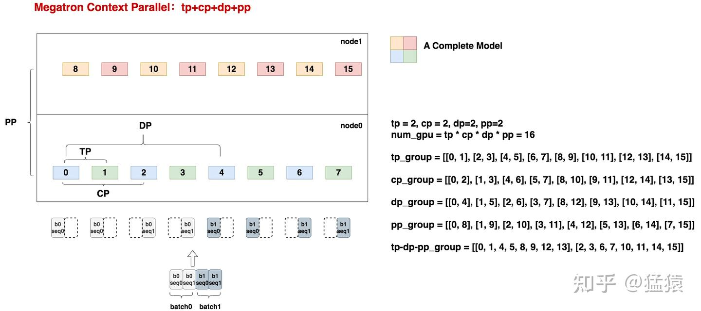
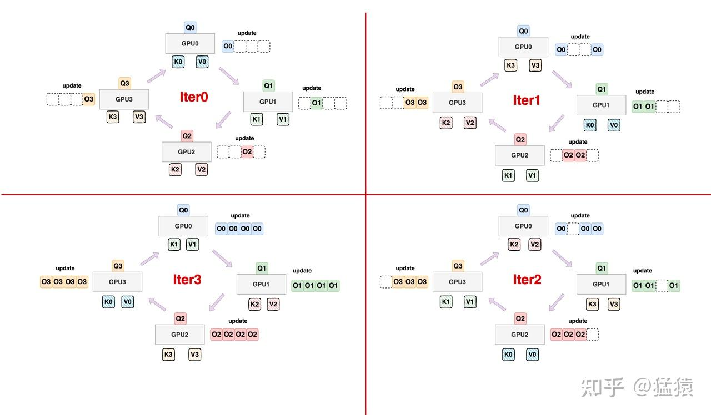
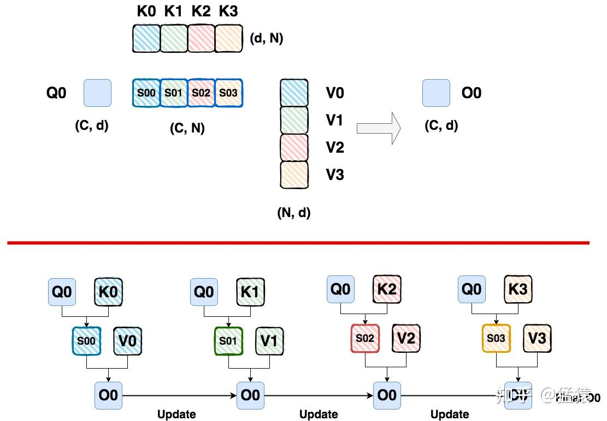
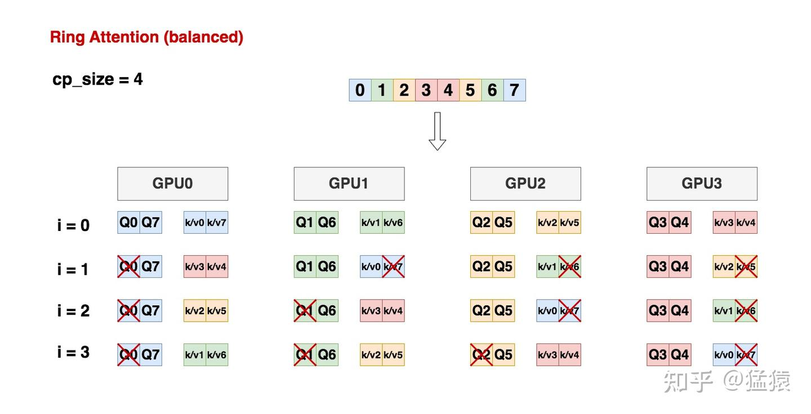
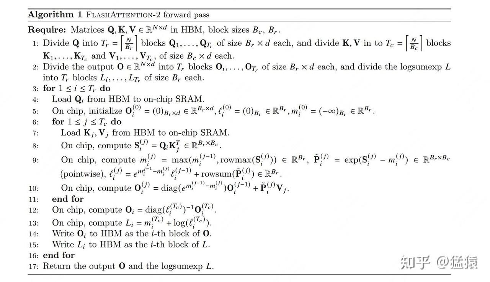
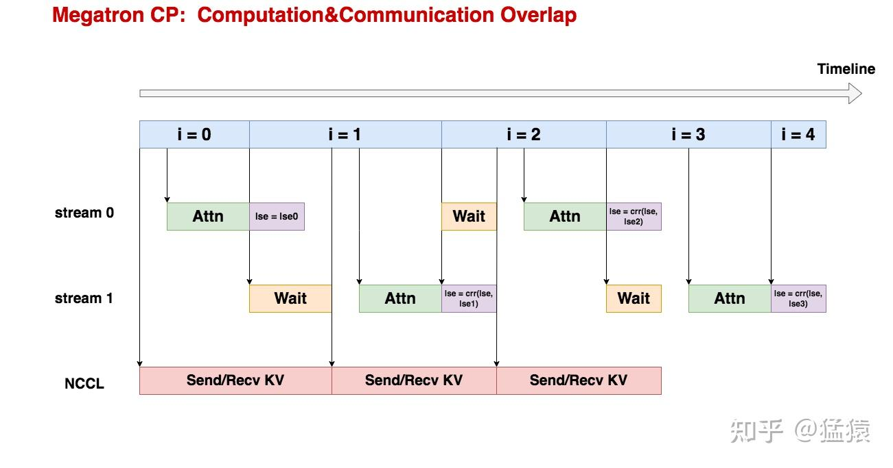

# [도해 대규모 모델 학습 시리즈] 시퀀스 병렬 4 - Megatron Context Parallel

> 원문: https://zhuanlan.zhihu.com/p/5502876106

sequence parallel 시리즈에서는 자주 쓰이는 다음 네 가지 프레임워크/방법을 자세히 소개합니다.

1. **[Megatron Sequence Parallelism](https://zhuanlan.zhihu.com/p/4083427292)**: 본질적으로는 단일 GPU의 activation 크기를 줄이는 방식으로 activation을 최대한 많이 저장하고 recomputation을 적게 해서, 전체 학습 속도를 끌어올리려는 것입니다. 보통 같은 회사의 tp와 짝을 이루어 사용합니다.
2. **[DeepSpeed Ulysses](https://zhuanlan.zhihu.com/p/4496065391)**: 알다시피 ds의 zero는 model parallel의 형태에 data parallel의 본질을 가집니다. 이 경우 단일 GPU가 하나의 sequence에 대한 MHA 과정을 완전하게 수행하므로, sequence length가 길어지면 단일 GPU의 메모리에 부담을 주게 됩니다. **그래서 Ulysses의 해결 방법은 단일 GPU가 전체 seq에 대한 특정 1개/여러 개 head의 결과만 계산하게 하는 것입니다.** 구체적으로는 먼저 seq 차원을 따라 GPU의 입력을 분할하고, 그다음 all2all 통신을 통해 구현합니다.
3. **[Ring Attention](https://zhuanlan.zhihu.com/p/4963530231)**: 분산 버전의 Flash Attention V2에 해당합니다(제 개인적인 이해입니다). **최종적인 효과는 각 GPU가 자신이 담당하는 seq_chunk의 MHA만 계산하도록 만드는 것입니다.**
4. **Megatron Context Parallelism**: 강화판 sp라고 볼 수 있습니다. ring-attention류의 기술을 도입하고(tp-pp-dp rank가 같은 위치에서 ring-attention을 수행합니다), Megatron의 여러 혼합 병렬 방식과 결합해 학습을 진행합니다.

오늘은 마지막 부분인 **Megatron Context Parallelism**을 다루겠습니다. 이것을 마지막에 배치한 이유는 다음과 같습니다.

- **Megatron cp는 megatron sp 혼합 병렬 프레임워크를 유지한 상태에서 cp 차원의 병렬을 도입한 것으로 볼 수 있습니다.** 그리고 cp 병렬의 본질은 사실 attention 부분의 최적화입니다. 따라서 megatron sp 혼합 병렬은 전체 프레임워크, cp는 국소적인 최적화라고 이해하셔도 됩니다.
- **Megatron cp는 실제 구현에서 소박한 ring attention과 매우 비슷하지만, 계산에 대한 load balancing 처리를 추가했습니다.** 이 글에서 이 점을 자세히 설명하겠습니다.
- Megatron cp는 deepspeed ulysses + ring attention의 결합도 시도하고 있으며, 이 내용 역시 cp의 핵심 로직 안에 작성되어 있습니다. 다만 이 글의 설명 중심은 아닙니다.
- **종합하면, 이 글에서 설명할 핵심은 megatron tp + cp + dp + pp의 혼합 병렬이며, 동시에 순수 cp 부분의 실제 구현 방법에 중점을 둡니다.**

megatron cp는 비교적 새롭고 지금도 계속 발전하고 있는 프로젝트입니다. 현재 공식적으로 구체적인 논문이 나와 있지 않고, 아주 짧은 [공식 홈페이지 소개](https://docs.nvidia.com/megatron-core/developer-guide/latest/api-guide/context_parallel.html)만 있습니다. 이 소개를 통해 앞에서 말한 "megatron sp 혼합 병렬 프레임워크를 유지한 상태에서 cp 차원의 병렬을 도입한다"는 말의 대략적인 의미를 이해할 수 있습니다. 다만 이 문서는 정말로 너무 짧아서(쓴웃음), cp의 세부 사항은 소스 코드 수준에서 해석할 수밖에 없습니다. (그런데 다시 한번 투덜거리는 것을 허락해 주시기 바랍니다. cp의 구현은 megatron-lm과 TransformerEngine 두 저장소에 걸쳐 있는데, 코드가 정말 너무 중복되고, 너무 복잡하고, 너무 어지럽습니다... 그래서 이것은 정말 눈물을 머금은 해설입니다.)

**소스 코드를 읽으면서 cp의 핵심 기술을 추론해 냈지만, 이 글을 소스 코드 해설 글로 쓸 생각은 없습니다.** 이 글에서는 소스 코드의 동작 흐름을 하나하나의 구체적인 그림으로 추상화해서, cp가 주로 무슨 일을 하는지 설명하겠습니다. 각 절의 마지막에는 관련 코드 링크를 붙여 둘 테니, 그림과 함께 직접 읽어 보시면 됩니다. **이렇게 해서 가능한 한 이 글을 순수한 원리 중심의 글로 만들어, 여러분이 장황한 코드에 주의를 빼앗기지 않도록 하겠습니다.**

**【지난 글 모음】**

[猛猿: 【필독】 지난 기술 문서 내비게이션](https://zhuanlan.zhihu.com/p/654910335)

---

## 1. 분산 환경 초기화

먼저 cp를 도입한 전제에서 megatron이 혼합 병렬을 어떻게 수행하는지 보겠습니다. 구체적인 상황은 다음과 같습니다.

- **`tp = 2, cp = 2, dp = 2, pp = 2`**. 그러면 `num_gpu = tp * cp * dp * pp = 2*2*2*2 = 16`입니다. 즉 GPU 16장이 필요합니다. 한 대의 머신에 GPU 8장이 있다고 가정하면, 머신 2대가 필요합니다.
- ep 차원은 고려하지 않습니다(즉 ep=1). 본질적으로 ep는 cp 차원의 병렬에 영향을 주지 않기 때문입니다(cp 차원은 attention을 최적화하는 것이고, ep는 mlp 층의 연산이라고 이해할 수 있습니다).
- **병렬 group을 어떻게 설정할지 고려할 때, 우리는 `tp-cp-ep-dp-pp` 순서를 사용합니다. 앞쪽에 있는 병렬 그룹일수록 통신량이 크다고 보고, 가능한 한 한 대의 머신 안에 배치합니다.** 예를 들어 tp group의 경우, 각 sub-tp group에 연결된 GPU 2장은 모두 같은 머신 안에 위치합니다. `tp-cp-ep-dp-pp`는 megatron 코드의 기본 순서이며, 물론 실제 상황에 따라 수정할 수 있지만 그 전제는 통신량을 고려해야 한다는 것입니다.
- dp=2이므로, micro-batch가 2개(batch0과 batch1)라고 가정합니다. cp=2이므로, 각 batch는 seq 차원에서 두 조각으로 나뉩니다.

이런 전제 조건 아래에서 위의 분산 구성 그림을 그렸습니다. gpu0을 예로 들어 보겠습니다.

- 먼저 하나의 모델에 대해, layer 층을 따라 가로로 2등분하고(pp=2), weight를 따라 세로로 2등분합니다(tp=2). 그림에 대응시키면, 서로 다른 색의 색 블록 4개가 하나의 완전한 모델을 구성합니다.
- gpu0 입장에서 [0,1,8,9]는 하나의 mp group을 구성하며, 완전한 모델 하나를 보유합니다.
- gpu0 입장에서 [0,1]은 tp 그룹을 구성합니다. 이는 0과 1이 같은 입력 X를 받고, 각각 X의 서로 다른 head의 결과를 계산한다는 뜻입니다.
- gpu0 입장에서 [0,8]은 pp 그룹을 구성합니다. 이는 0과 8 사이에서 층간 activation 전달이 이루어진다는 뜻입니다.
- **gpu0 입장에서 [0,2]는 cp 그룹을 구성합니다. 0과 2는 같은 모델 weight를 유지하면서, 같은 batch의 seq_chunk0과 seq_chunk1을 각각 유지합니다.**
- gpu0 입장에서 [0,4]는 dp 그룹을 구성합니다. 0과 4는 같은 모델 weight를 유지하면서, 서로 다른 batch의 seq_chunk0을 각각 유지합니다.

**정리하면, megatron cp를 도입한다는 것은 사실 다음과 같습니다.**

- 먼저 입력 X에 대해 sequence 차원의 분할을 전혀 하지 않는다고 가정합니다. 이때 우리가 얻는 것은 원래의 megatron tp-dp-pp 그룹입니다.
- **이제 cp를 도입한다는 것은 입력 X를 cp_size 조각으로 나눈다는 뜻입니다. 따라서 원래의 tp-dp-pp 그룹을 cp_size개만큼 복사하기만 하면 최종적인 분산 구성을 얻게 됩니다.**
- **그래서 앞에서 같은 tp-dp-pp rank 위치가 새로운 cp 그룹이라고 말한 것입니다.** 예를 들어 그림에서 보여 주는 tp-dp-pp group에서, 0과 2는 각자의 group 내에서 local rank = 0인 원소이므로 하나의 cp 그룹을 구성합니다. 1과 3은 각자의 group 내에서 local rank = 1인 원소이므로 하나의 cp 그룹을 구성합니다. 나머지도 같은 식입니다.

**자, 이제 우리는 다음 내용을 알게 되었습니다.**

- **cp 그룹의 설정 방식**
- **같은 cp_group 내의 각 GPU가 유지하는 것: 【같은 모델 weight】, 【같은 batch의 서로 다른 seq_chunk】**
- **하나의 cp 그룹의 최종 목표는, ring attention과 유사한 방식을 통해 자신이 유지하는 이 seq_chunk가 자신이 담당하는 head에서 갖는 결과를 계산해 내는 것입니다.**

그럼 이어서 계산의 세부 사항을 바로 살펴보겠습니다.

분산 초기화 코드는 https://github.com/NVIDIA/Megatron-LM/blob/main/megatron/core/parallel_state.py 에 있으니, 위 설명과 함께 직접 읽어 보시기 바랍니다.

## 2. load balancing을 적용한 Ring Attention

### 2.1 소박한 Ring Attention

위 그림과 같이, [ring attention 편](https://zhuanlan.zhihu.com/p/4963530231)에서 소박한 ring attention의 동작 흐름을 설명한 바 있습니다.

- 각 GPU에는 특정 seq_chunk의 Q가 고정적으로 유지됩니다.
- 각 GPU에서 서로 다른 seq_chunk의 KV 값이 순환합니다.
- 각 GPU에서 Q와 현재 순환해 온 (K, V) 데이터가 attention 계산을 수행하고, Flash Attention V2와 비슷한 방식으로 output을 갱신합니다(세부 사항은 여기서 반복하지 않겠습니다. 위 링크의 글을 참고하시기 바랍니다).
- 모든 KV 값의 순환이 끝나면, 각 GPU는 최종 output을 얻게 됩니다.

예를 들어 Q0을 예로 들면, 전체 계산 과정은 다음과 같습니다.

**하지만 소박한 ring attention에는 비교적 큰 문제가 하나 있습니다. 계산 부하가 균등하지 않다는 것입니다.**

causal mask를 사용한다고 가정하겠습니다. 즉 attention 계산에서 어떤 token은 자기 자신과 그 이전의 token들하고만 attn을 수행하고, 뒤쪽 token에는 관심을 두지 않습니다. 그런데 현재 ring attention의 분할 방식에서는 다음과 같습니다.

- gpu0의 경우 Q0을 유지하고 있는데, 이는 뒤에 순환해 오는 (K1, V1)(K2, V2)(K3, V3)가 모두 자신보다 뒤에 있는 token들이 만들어 낸 결과라는 뜻이기도 합니다. 그들과 attn을 수행할 필요가 전혀 없으므로, 이때 gpu0의 계산은 낭비됩니다.
- 나머지 gpu도 마찬가지입니다. 마지막 Q 블록을 유지하는 gpu3만이 매 순환마다 제대로 계산을 수행하며, 계산 자원을 낭비하지 않습니다.
- **이것이 우리가 말하는, causal mask 하에서 소박한 ring attention이 갖는 계산 부하 불균형 문제입니다.**

### 2.2 load balancing 버전의 Ring Attention

이전의 [ring attention 편](https://zhuanlan.zhihu.com/p/4963530231), 그리고 [Flash Attention V1](https://zhuanlan.zhihu.com/p/669926191) / [Flash Attention V2](https://zhuanlan.zhihu.com/p/691067658)에서 설명했듯이, 블록 단위 attention 계산은 사실 계산 순서와 무관합니다. 핵심은 **매번 계산할 때 현재 블록의 output과, 현재 softmax를 수행하기 전 attention score 행렬의 max 및 sum 관련 정보를 가져올 수만 있다면 최종 output을 정상적으로 갱신할 수 있다는 것입니다. (이 문장이 잘 이해되지 않으면 위 링크의 글을 보시기 바랍니다. 여기서는 더 다루지 않겠습니다.)**

이 점을 이해한 바탕 위에서, Ring Attention에서 각 GPU에 올려 두는 seq_chunk를 다시 설계합니다.

위 그림과 같이, cp_size = 4라고 가정합니다. 즉 GPU 4장에서 ring attention을 수행하려고 합니다.

- 먼저 원래의 입력 데이터 X를 2\*cp_size = 8개 블록으로 분할합니다. 즉 위 그림의 0~7 chunk입니다.
- [0,7], [1, 6], [2, 5], [3, 4]가 각각 4개의 seq_chunk를 구성해 gpu0~gpu3에 배치됩니다.
- 그러면 ring attention 하에서 각 gpu는 cp_size번 계산한 뒤에 최종 output을 얻을 수 있습니다. 예를 들어 gpu0의 경우 4번 계산하면 [0, 7] 두 위치의 최종 attention 결과를 얻습니다.
- 그림에서는 이어서 서로 다른 iteration에서 각 GPU의 계산 상황을 보여 주고 있으며, 다음을 알 수 있습니다.
  - i = 0일 때, 각 GPU에서 작은 사각형 4개가 attn 계산을 수행합니다.
  - i = 1/2/3일 때, 각 GPU에서 작은 사각형 3개가 attn 계산을 수행합니다.
  - **정리하면, 각 iteration에서 각 GPU의 계산량은 동일합니다. 소박한 ring attention처럼 일부 GPU가 헛도는 상황이 존재하지 않습니다.**

동시에 i = 1/2/3일 때는 항상 계산에 참여하지 않는 Q 또는 KV 블록이 있다는 점에 주목하시기 바랍니다. rank로 이것이 cp_group 내에서 몇 번째 GPU인지를 나타낸다고 하면(예를 들어 rank=0은 위 cp_group에서 0번째 GPU입니다), **어떤 GPU에 대해 다음과 같은 규칙이 성립합니다.**

- **`i = 0`일 때, 그 GPU의 모든 QKV 블록이 계산에 참여합니다.**
- **`i <= rank`일 때, 그 GPU의 2번째 KV 블록은 계산에 참여하지 않습니다.**
- **`i > rank`일 때, 그 GPU의 1번째 Q 블록은 계산에 참여하지 않습니다.**

- 어느 GPU가 어떤 Q 블록을 유지해야 하는지 할당하는 코드는 https://github.com/NVIDIA/Megatron-LM/blob/main/megatron/training/utils.py#L233 에 있습니다.
- 실제 QKV 계산 시 어떤 데이터 블록을 남기고 어떤 데이터 블록을 제거해야 하는지 처리하는 코드는 https://github.com/NVIDIA/TransformerEngine/blob/main/transformer_engine/pytorch/attention.py#L1901 에 있습니다.

직접 읽어 보시기 바랍니다.

## 3. 계산과 통신의 overlap

ring attention에서 설명했듯이, 어떤 GPU가 attn을 계산하는 동시에 자신의 KV를 다음 GPU로 보내고 이전 GPU로부터 새로운 KV를 받아 올 수 있다면, **이렇게 해서 【계산】과 【통신】의 병렬을 구현할 수 있고, 통신이 가져오는 추가 시간 비용을 가릴 수 있습니다.**

코드 차원에서 구체적으로 보면, 서로 다른 cuda stream(`torch.cuda.Stream()`)을 만들어 이 목표를 달성할 수 있습니다. cuda stream의 역할은 간단히 이렇게 이해하셔도 됩니다. **하나의 cuda stream에는 여러 개의 직렬 연산이 포함될 수 있고, 서로 다른 cuda stream은 병렬로 실행될 수 있습니다. 이렇게 하면 attn 계산용 cuda stream 하나와 통신용 cuda stream 하나를 정의할 수 있습니다.**

**그런데 megatron cp에는 사실 총 3개의 cuda stream이 포함되어 있습니다.** 간단히 살펴보겠습니다.

- **NCCL stream**: cp_group 내에 정의되며, KV 송신과 수신을 담당하는 cuda stream입니다.
- **Stream0과 Stream1**: 둘 다 계산용 cuda stream입니다. 이 두 stream의 역할은 attn 계산과 softmax_lse 갱신을 병렬로 실행할 수 있게 하는 것입니다.
- **즉 megatron cp에서는 【계산】과 【통신】을 병렬화했을 뿐만 아니라, 계산 안에서도 【attn】과 【softmax_lse 갱신】을 병렬화했습니다.**

【계산】과 【통신】의 병렬은 이해하기 쉬우니, 이제 【attn】과 【softmax_lse 갱신】의 병렬이 무슨 의미인지 빠르게 설명하겠습니다.

앞선 시리즈에서 이미 설명했듯이 ring attention이 output을 갱신하는 방식은 Flash Attention V2와 매우 유사합니다. 그래서 Flash Attention V2의 fwd 과정을 가져와서, output이 어떻게 갱신되는지 보겠습니다.

- 그림의 10행은 매번의 output 갱신 과정을 보여 줍니다.
- 그림의 12행은, 하나의 Q 블록에 대해 모든 (K, V)를 순환시킨 뒤 12행의 수식으로 output을 한 번에 다시 갱신하는 부분입니다. 이렇게 해서 이 Q 블록의 최종 output을 얻습니다. 그리고 12행의 결과가 바로 우리가 말하는 softmax_lse입니다.
- **하지만 또 다른 방법은, 12행의 결과를 10행 안에 넣어서 처리하는 것입니다.** **즉 하나의 Q 블록에 대해 (K,V)를 1번 순환시킬 때마다, attn을 계산할 때 이번 순환에서 계산한 attn score 행렬로부터 max와 sum을 구하고, 나아가 softmax_lse를 *갱신*한 다음, 이것으로 이번 순환의 output을 갱신하는 것입니다. 이것이 바로 ring attention이 채택한 방식이며,** 목적은 정밀도 손실을 최대한 줄이는 데 있을 것입니다. FA2에서 10행과 12행을 왜 나누어 처리하는지는, 본질적으로 비행렬곱 연산량을 줄여 계산 속도를 높이기 위해서입니다(이전 글에서 설명했으므로 여기서는 반복하지 않겠습니다).
- **따라서 ring attention에 대해 정리하면, 매번의 계산은 두 부분으로 나뉩니다.**
  - **【attn: 이번 순환의 output을 계산한다】**
  - **【softmax_lse 갱신: 이번 순환의 결과를 바탕으로 softmax_lse를 갱신하고, output을 보정하는 데 사용한다】**

이제 【attn】과 【softmax_lse 갱신】의 정의를 대체로 이해했으니, megatron cp에서 이 3개 cuda stream의 실행 과정을 바로 살펴보고, 【attn】과 【softmax_lse 갱신】의 병렬이 무엇을 뜻하는지 설명하겠습니다.

위 그림은 cp_size = 4인 상황에서 어떤 GPU의 순환 과정을 묘사한 것입니다. 구체적으로 보면 다음과 같습니다.

- `i = 0`일 때
  - stream0으로 전환해 실행을 시작합니다.
  - stream0에서 KV 데이터의 송신/수신 흐름을 시작하며, 이 흐름은 실제로는 NCCL stream이 실행합니다.
  - stream0에서 attn 계산을 수행합니다. attn 계산이 끝나면 output과 softmax_lse0을 얻습니다. 이것은 i=0 단계이므로 softmax_lse 갱신은 할 필요가 없습니다.
  - **"softmax_lse_i를 계산한다"와 "softmax_lse를 갱신한다"의 차이를 구분해야 한다는 점에 주의하시기 바랍니다.**

- `i = 1`일 때
  - stream0과 stream1 흐름을 동시에 시작합니다.
  - stream0 흐름에서는 `softmax_lse = softmax_lse0`으로 두고, 이때는 아직 softmax_lse 갱신을 하지 않습니다.
  - stream1 흐름에서는 다음과 같습니다.
    - 이번 계산에 필요한 KV 값이 도착할 때까지 기다려야(wait) 합니다. 여기서는 계산이 통신을 완벽하게 덮지 못하는 상황을 일부러 가정했기 때문에 대기 시간이 생깁니다.
    - 데이터가 도착하면 새로운 KV 데이터 송신/수신 흐름을 시작하며, 이 흐름 역시 실제로는 NCCL stream이 실행합니다.
    - 이어서 평소대로 attn 계산을 수행해 이번의 output과 softmax_lse1을 얻습니다.

  - **어렵지 않게 알 수 있듯이, 이때 stream0과 stream1에서 이미 【attn】과 【softmax_lse 갱신】의 병렬이 구현되었습니다. 다만 여기서는 엄밀한 의미의 softmax_lse 갱신은 아닙니다.**

- `i = 2`일 때
  - stream0과 stream1 흐름을 동시에 시작합니다.
  - stream1 흐름에서 진정한 의미의 【softmax_lse 갱신】을 시작합니다. 즉 `softmax_lse = correction(softmax_lse, softmax_lse1)`입니다.
  - stream0 흐름에서는 【attn】 계산을 수행해 새로운 output과 softmax_lse2를 얻습니다. 동시에 NCCL stream을 시작해 데이터 송신을 수행합니다.

- `i = 3`일 때
  - stream0과 stream1 흐름을 동시에 시작합니다.
  - stream0 흐름에서 【softmax_lse 갱신】을 수행합니다. 즉 `softmax_lse = correction(softmax_lse, softmax_lse2)`입니다.
  - stream1 흐름에서 【attn】 계산을 수행해 새로운 output과 softmax_lse3을 얻습니다. 이때는 더 이상 데이터 통신을 할 필요가 없습니다. 이것이 마지막 순환이기 때문입니다.

- `i = 4`일 때
  - stream1만 시작해서 마지막 【softmax_lse 갱신】, 즉 `softmax_lse = correction(softmax_lse, softmax_lse3)`을 수행하면 됩니다.

**이 통신 그림에는 몇 가지 단순화도 들어 있습니다. 예를 들어 매번 【softmax_lse 갱신】을 할 때마다 직전 갱신의 결과가 이미 계산 완료되었음을 보장해야 하므로, 여기서도 wait가 필요할 수 있습니다. 표현을 간단히 하기 위해 이 부분은 생략했습니다.**

이 절과 cp 전체의 핵심 코드는 https://github.com/NVIDIA/TransformerEngine/blob/main/transformer_engine/pytorch/attention.py#L1867 에 있으니, 위의 그림과 함께 보시면 코드를 더 잘 읽으실 수 있습니다.

---

**【대규모 모델 사전학습 시리즈】**

- [猛猿: 도해 대규모 모델 학습: 파이프라인 병렬(Pipeline Parallelism), Gpipe를 예로](https://zhuanlan.zhihu.com/p/613196255)
- [猛猿: 도해 대규모 모델 학습: 데이터 병렬 상편(DP, DDP와 ZeRO)](https://zhuanlan.zhihu.com/p/617133971)
- [猛猿: 도해 대규모 모델 학습: 데이터 병렬 하편(ZeRO, 제로 중복 최적화)](https://zhuanlan.zhihu.com/p/618865052)
- [猛猿: 도해 대규모 모델 시리즈: 텐서 모델 병렬, Megatron-LM](https://zhuanlan.zhihu.com/p/622212228)
- [猛猿: 도해 대규모 모델 시리즈: Megatron 소스 코드 해설 1, 분산 환경 초기화](https://zhuanlan.zhihu.com/p/629121480)
- [猛猿: 도해 대규모 모델 학습: Megatron 소스 코드 해설 2, 모델 병렬](https://zhuanlan.zhihu.com/p/634377071)
- [猛猿: 도해 대규모 모델 학습 시리즈: Megatron 소스 코드 해설 3, 분산 혼합 정밀도 학습](https://zhuanlan.zhihu.com/p/662700424)
- [猛猿: 도해 대규모 모델 학습 시리즈: DeepSpeed-Megatron MoE 병렬 학습(원리편)](https://zhuanlan.zhihu.com/p/681154742)
- [猛猿: 도해 대규모 모델 학습 시리즈: DeepSpeed-Megatron MoE 병렬 학습(소스 코드 해설편)](https://zhuanlan.zhihu.com/p/681692152)
- [猛猿: 도해 대규모 모델 학습 시리즈: 시퀀스 병렬 1, Megatron SP](https://zhuanlan.zhihu.com/p/4083427292)
- [猛猿: 도해 대규모 모델 학습 시리즈: 시퀀스 병렬 2, DeepSpeed Ulysses](https://zhuanlan.zhihu.com/p/4496065391)
- [猛猿: 도해 대규모 모델 학습 시리즈: 시퀀스 병렬 3, Ring Attention](https://zhuanlan.zhihu.com/p/4963530231)
- [猛猿: 도해 대규모 모델 학습 시리즈: 시퀀스 병렬 4, Megatron Context Parallel](https://zhuanlan.zhihu.com/p/5502876106)
