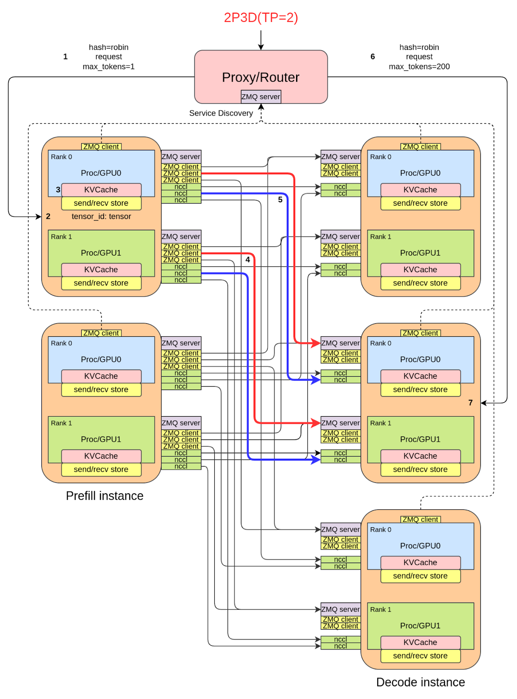
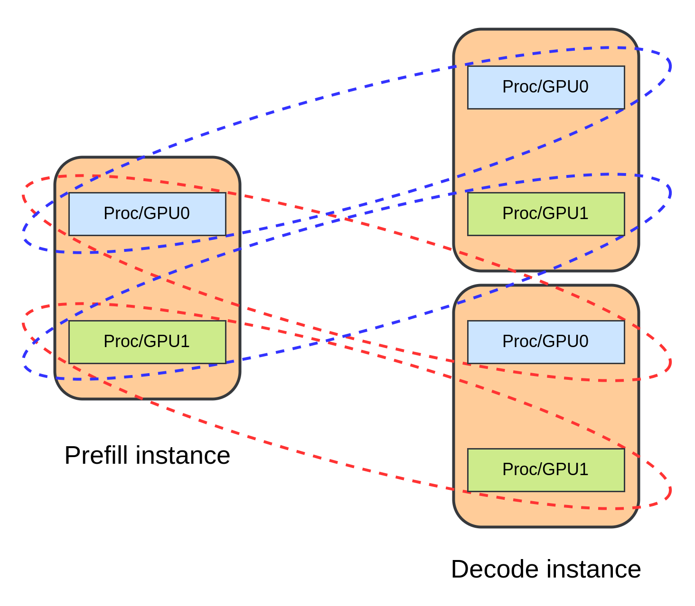
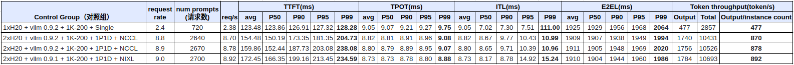

> 원본 문서: https://github.com/vllm-project/vllm/blob/main/docs/design/v1/p2p_nccl_connector.md

point-to-point 통신 기반 xPyD dynamic scaling 구현이며, 일부는 Dynamo에서 영감을 받았습니다.

# 상세 설계

## 전체 흐름

그림 1처럼 이 **PD disaggregation** 솔루션의 전체 흐름은 request flow로 설명할 수 있습니다.

1. client가 Proxy/Router의 `/v1/completions` endpoint로 HTTP request를 보냅니다.
2. Proxy/Router는 round-robin 또는 random selection 방식으로 **1P1D(Prefill instance 1개 + Decode instance 1개)**를 선택하고, `request_id`를 생성합니다(규칙은 뒤에서 소개). HTTP request message의 `max_tokens`를 **1**로 수정한 뒤 request를 **P instance**로 forward합니다.
3. 곧바로 Proxy/Router는 **원본 HTTP request**를 **D instance**로 forward합니다.
4. **P instance**는 **Prefill**을 수행한 뒤 **생성된 KV cache를 능동적으로** D instance로 전송합니다(**PUT_ASYNC** mode 사용). D instance의 `zmq_addr`는 `request_id`를 통해 parse할 수 있습니다.
5. **D instance**에는 KV cache 수신을 위한 **전용 thread**가 있습니다(메인 프로세스 block 방지). 수신된 KV cache는 **GPU memory buffer**에 저장되고, 그 크기는 vLLM 시작 파라미터 `kv_buffer_size`로 결정됩니다. GPU buffer가 가득 차면 KV cache는 **local Tensor memory pool**에 저장됩니다.
6. **Decode** 과정에서 D instance의 main process는 **GPU buffer** 또는 **memory pool**에서 P instance가 전송한 KV cache를 검색해 **Prefill을 건너뜁니다**.
7. **Decode**가 끝나면 D instance는 결과를 **Proxy/Router**로 반환하고, Proxy/Router는 이를 **client**로 전달합니다.



## Proxy/Router(데모)

간단한 HTTP service가 client request의 entry point로 동작하며, background thread를 시작해 P/D instance가 보고하는 HTTP IP와 PORT, ZMQ IP와 PORT를 listen합니다. 이 서비스는 `http_addr -> zmq_addr` dictionary를 유지합니다. `http_addr`는 vLLM instance request의 IP:PORT이고, `zmq_addr`는 KV cache handshake와 metadata 수신 주소입니다.

Proxy/Router는 client request의 특징(prompt 등)에 따라 1P1D를 선택하고, 대응하는 `request_id`를 생성합니다. 예:

```
cmpl-___prefill_addr_10.0.1.2:21001___decode_addr_10.0.1.3:22001_93923d63113b4b338973f24d19d4bf11-0
```

현재는 xPyD가 동작하는지 빠르게 검증하기 위해 round-robin 방식으로 1P1D를 선택합니다. 앞으로는 trie와 instance load 상태를 결합해 적절한 P와 D를 선택할 계획입니다.

각 P/D instance는 정기적으로 Proxy/Router에 heartbeat packet을 보내 등록(`http_addr -> zmq_addr` 보고)하고 연결을 유지합니다(현재 3초마다 한 번). instance가 crash되어 일정 시간 안에 ping을 보낼 수 없으면 Proxy/Router는 timeout된 instance를 제거합니다(이 기능은 아직 개발되지 않았습니다).

## KV cache 전송 방식

KV cache 전송에는 PUT, GET, PUT_ASYNC 세 가지 방식이 있습니다. 이 방식들은 `--kv-transfer-config`와 `kv_connector_extra_config` 파라미터를 통해 지정할 수 있으며, 구체적으로는 `send_type` field로 지정합니다. PUT과 PUT_ASYNC는 모두 P instance가 D instance로 KV cache를 능동적으로 전송합니다. 차이는 PUT이 synchronous transfer method라 main process를 block한다는 점이고, PUT_ASYNC는 asynchronous transfer method라는 점입니다. PUT_ASYNC는 전용 thread로 KV cache를 보내므로 main process를 block하지 않습니다. 반면 GET 방식은 P instance가 prefill 계산 뒤 KV cache를 memory buffer에 저장합니다. D instance는 KV cache 공간을 할당한 뒤 P instance에서 계산된 KV cache를 능동적으로 가져옵니다.

실험 결과에 따르면 이 방식들의 성능은 높은 순서부터 PUT_ASYNC -> GET -> PUT입니다.

## ZMQ와 NCCL을 통한 P2P 통신

상대 주소만 알면 rank와 world size 제한 없이 point-to-point KV cache 전송(NCCL 사용)을 수행할 수 있습니다. PD disaggregation instance의 dynamic scaling(scale out/in)을 지원합니다. 즉 P/D instance를 추가하거나 제거해도 시스템을 완전히 재시작할 필요가 없습니다.

각 P/D instance는 `P2pNcclEngine` instance 하나만 만들면 됩니다. 이 instance는 ZMQ server를 유지하고, 전용 thread에서 `zmq_addr` 주소를 listen하며 다른 instance에서 온 control-flow request를 수신합니다. 이런 request에는 NCCL 연결 수립 request와 KV cache metadata(tensor shape, dtype 등) 전송 request가 포함됩니다. 하지만 실제 KV cache data 자체를 전송하지는 않습니다.

P instance와 D instance가 KV cache를 처음 전송할 때는 ZMQ connection과 NCCL group을 수립해야 합니다. 이후 KV cache 전송에서는 이 ZMQ connection과 NCCL group을 재사용합니다. NCCL group은 두 rank만 포함하므로 world size는 2입니다. 이 설계는 dynamic scaling을 지원하기 위한 것입니다. 즉 P/D instance를 추가하거나 제거해도 시스템을 완전히 재시작할 필요가 없습니다. 상대 주소만 알면 rank나 world size 제한 없이 point-to-point KV cache 전송을 수행할 수 있습니다.

## NCCL group topology

현재 KV cache 전송은 symmetric TP(tensor parallel) 방식만 지원합니다. asymmetric TP와 PP(pipeline parallel)는 앞으로 지원할 예정입니다. 그림 2는 1P2D 설정을 보여주며, 각 instance의 TP(tensor parallel) degree는 2입니다. 총 7개의 NCCL group이 있습니다. 세 vLLM instance 각각에는 TP=2 NCCL group이 하나씩 있습니다. 또한 P instance의 0번 GPU와 각 D instance의 0번 GPU가 NCCL group을 만들고, 마찬가지로 P instance의 1번 GPU와 각 D instance의 1번 GPU가 NCCL group을 만듭니다.



각 NCCL group은 통신용 GPU memory buffer를 일정량 점유하며, 크기는 주로 `NCCL_MAX_NCHANNELS` environment variable의 영향을 받습니다. `NCCL_MAX_NCHANNELS=16`일 때 NCCL group 하나는 보통 100MB를 점유하고, `NCCL_MAX_NCHANNELS=8`일 때는 보통 52MB를 점유합니다. DeepSeek의 96P144D 같은 대규모 xPyD 구성에서는 현재 이 구현이 실현 가능하지 않습니다. 앞으로는 RDMA를 사용한 point-to-point 통신을 고려하고 있으며, UCCL도 주시하고 있습니다.

## GPU memory buffer와 Tensor memory pool

memory buffer 크기의 trade-off는 다음과 같습니다. P instance의 경우 PUT과 PUT_ASYNC mode는 memory buffer가 필요 없지만 GET mode는 필요합니다. D instance는 세 mode 모두 memory buffer가 필요합니다. D instance의 memory buffer는 너무 커서는 안 됩니다. 마찬가지로 GET mode의 P instance도 memory buffer가 너무 커서는 안 됩니다. D instance의 memory buffer는 P instance가 보낸 KV cache를 임시 저장하는 데 사용됩니다. 너무 크면 D instance에서 정상 추론에 사용할 수 있는 KV cache 공간이 줄어들고, 그 결과 inference batch size가 작아지며 최종 output throughput이 낮아집니다. memory buffer 크기는 `kv_buffer_size` 파라미터로 byte 단위로 설정하며, 보통 memory size의 5%-10%로 설정합니다.

P instance의 `--max-num-seqs` 파라미터를 큰 값으로 설정하면 batch size가 커서 P instance가 동시에 많은 KV cache를 생성할 수 있습니다. 이 양이 D instance memory buffer 용량을 초과해 KV cache loss가 발생할 수 있습니다. KV cache가 손실되면 D instance는 Prefill을 다시 계산해야 하며, 이는 Prefill을 두 번 수행하는 것과 같습니다. 따라서 first-token time(TTFT)이 크게 증가해 성능이 떨어집니다.

위 문제를 해결하기 위해 저는 KV cache 저장용 local Tensor memory pool을 설계하고 개발했습니다. Linux memory module의 buddy system에서 영감을 받았습니다. 서버에서는 memory가 보통 TB 단위로 충분히 크기 때문에 prefix cache를 고려하거나 block 기반 설계를 사용해 memory를 재사용하며 공간을 아낄 필요가 없습니다. memory buffer가 부족하면 KV cache를 Tensor memory pool에 직접 저장하고, D instance가 이후 여기서 KV cache를 가져올 수 있습니다. 읽기/쓰기 속도는 PCIe 속도이며, PCIe 4.0은 약 21 GB/s로 보통 Prefill 속도보다 빠릅니다. 그렇지 않다면 Mooncake나 lmcache 같은 솔루션이 필요하지 않았을 것입니다. Tensor memory pool은 flood spillway 역할을 하며 보통 burst traffic spike 때 사용됩니다. 최악의 경우에도 제 솔루션은 cache storage가 있는 일반 상황보다 나쁘지 않습니다.

# vLLM 설치

```shell
pip install "vllm>=0.9.2"
```

# xPyD 실행

## 설명

- 아래 예시는 A800(80GB) device에서 Meta-Llama-3.1-8B-Instruct model로 실행합니다.
- `kv_buffer_size`(byte 단위) 설정에 주의하세요. 경험값은 GPU memory size의 10%입니다. 이는 kvcache size와 관련이 있습니다. 너무 작으면 수신한 kvcache를 임시 저장하는 GPU memory buffer가 overflow되어 kvcache가 tensor memory pool에 저장되고 latency가 증가합니다. 너무 크면 inference에 사용할 수 있는 kvcache가 줄어 batch size가 작아지고 throughput이 떨어집니다.
- Prefill instance에서는 non-GET mode를 사용할 때 `kv_buffer_size`를 1로 설정할 수 있습니다. Prefill은 현재 kvcache 수신이 필요 없기 때문입니다. 하지만 GET mode를 사용할 때는 D instance로 보낼 kvcache를 저장해야 하므로 더 큰 `kv_buffer_size`가 필요합니다.
- 아래 명령의 `kv_buffer_size`와 `port`는 충돌이 있으면 수정해야 할 수 있습니다.
- `PUT_ASYNC`가 최고 성능을 제공하므로 우선 고려해야 합니다.
- `--port`는 `--kv-transfer-config`의 `http_port`와 일치해야 합니다.
- `disagg_proxy_p2p_nccl_xpyd.py` script는 port 10001(client request 수신용)과 port 30001(P와 D instance의 service discovery 수신용)을 사용합니다.
- proxy를 실행하는 node에는 `quart`가 설치되어 있어야 합니다.
- multi-node를 지원합니다. `--kv-transfer-config`의 `proxy_ip`와 `proxy_port`만 수정하면 됩니다.
- 아래 예시에서는 **proxy IP가 10.0.1.1**이라고 가정합니다.

## 1P3D 실행

### Proxy(예: 10.0.1.1)

```shell
cd {your vllm directory}/examples/online_serving/disaggregated_serving_p2p_nccl_xpyd/
python3 disagg_proxy_p2p_nccl_xpyd.py &
```

### Prefill1(예: 10.0.1.2 또는 10.0.1.1)

??? console "command"

    ```shell
    VLLM_USE_V1=1 CUDA_VISIBLE_DEVICES=0 vllm serve {your model directory} \
        --host 0.0.0.0 \
        --port 20001 \
        --tensor-parallel-size 1 \
        --seed 1024 \
        --served-model-name base_model \
        --dtype float16 \
        --max-model-len 10000 \
        --max-num-batched-tokens 10000 \
        --max-num-seqs 256 \
        --trust-remote-code \
        --gpu-memory-utilization 0.9 \
        --disable-log-request \
        --kv-transfer-config \
        '{"kv_connector":"P2pNcclConnector","kv_role":"kv_producer","kv_buffer_size":"1e1","kv_port":"21001","kv_connector_extra_config":{"proxy_ip":"10.0.1.1","proxy_port":"30001","http_port":"20001"}}' > /var/vllm.log 2>&1 &
    ```

### Decode1(예: 10.0.1.3 또는 10.0.1.1)

??? console "command"

    ```shell
    VLLM_USE_V1=1 CUDA_VISIBLE_DEVICES=1 vllm serve {your model directory} \
        --host 0.0.0.0 \
        --port 20002 \
        --tensor-parallel-size 1 \
        --seed 1024 \
        --served-model-name base_model \
        --dtype float16 \
        --max-model-len 10000 \
        --max-num-batched-tokens 10000 \
        --max-num-seqs 256 \
        --trust-remote-code \
        --gpu-memory-utilization 0.7 \
        --disable-log-request \
        --kv-transfer-config \
        '{"kv_connector":"P2pNcclConnector","kv_role":"kv_consumer","kv_buffer_size":"8e9","kv_port":"22001","kv_connector_extra_config":{"proxy_ip":"10.0.1.1","proxy_port":"30001","http_port":"20002"}}' > /var/vllm.log 2>&1 &
    ```

### Decode2(예: 10.0.1.4 또는 10.0.1.1)

??? console "command"

    ```shell
    VLLM_USE_V1=1 CUDA_VISIBLE_DEVICES=2 vllm serve {your model directory} \
        --host 0.0.0.0 \
        --port 20003 \
        --tensor-parallel-size 1 \
        --seed 1024 \
        --served-model-name base_model \
        --dtype float16 \
        --max-model-len 10000 \
        --max-num-batched-tokens 10000 \
        --max-num-seqs 256 \
        --trust-remote-code \
        --gpu-memory-utilization 0.7 \
        --disable-log-request \
        --kv-transfer-config \
        '{"kv_connector":"P2pNcclConnector","kv_role":"kv_consumer","kv_buffer_size":"8e9","kv_port":"23001","kv_connector_extra_config":{"proxy_ip":"10.0.1.1","proxy_port":"30001","http_port":"20003"}}' > /var/vllm.log 2>&1 &
    ```

### Decode3(예: 10.0.1.5 또는 10.0.1.1)

??? console "command"

    ```shell
    VLLM_USE_V1=1 CUDA_VISIBLE_DEVICES=3 vllm serve {your model directory} \
        --host 0.0.0.0 \
        --port 20004 \
        --tensor-parallel-size 1 \
        --seed 1024 \
        --served-model-name base_model \
        --dtype float16 \
        --max-model-len 10000 \
        --max-num-batched-tokens 10000 \
        --max-num-seqs 256 \
        --trust-remote-code \
        --gpu-memory-utilization 0.7 \
        --disable-log-request \
        --kv-transfer-config \
        '{"kv_connector":"P2pNcclConnector","kv_role":"kv_consumer","kv_buffer_size":"8e9","kv_port":"24001","kv_connector_extra_config":{"proxy_ip":"10.0.1.1","proxy_port":"30001","http_port":"20004"}}' > /var/vllm.log 2>&1 &
    ```

## 3P1D 실행

### Proxy(예: 10.0.1.1)

```shell
cd {your vllm directory}/examples/online_serving/disaggregated_serving_p2p_nccl_xpyd/
python3 disagg_proxy_p2p_nccl_xpyd.py &
```

### Prefill1(예: 10.0.1.2 또는 10.0.1.1)

??? console "command"

    ```shell
    VLLM_USE_V1=1 CUDA_VISIBLE_DEVICES=0 vllm serve {your model directory} \
        --host 0.0.0.0 \
        --port 20001 \
        --tensor-parallel-size 1 \
        --seed 1024 \
        --served-model-name base_model \
        --dtype float16 \
        --max-model-len 10000 \
        --max-num-batched-tokens 10000 \
        --max-num-seqs 256 \
        --trust-remote-code \
        --gpu-memory-utilization 0.9 \
        --disable-log-request \
        --kv-transfer-config \
        '{"kv_connector":"P2pNcclConnector","kv_role":"kv_producer","kv_buffer_size":"1e1","kv_port":"21001","kv_connector_extra_config":{"proxy_ip":"10.0.1.1","proxy_port":"30001","http_port":"20001"}}' > /var/vllm.log 2>&1 &
    ```

### Prefill2(예: 10.0.1.3 또는 10.0.1.1)

??? console "command"

    ```shell
    VLLM_USE_V1=1 CUDA_VISIBLE_DEVICES=1 vllm serve {your model directory} \
        --host 0.0.0.0 \
        --port 20002 \
        --tensor-parallel-size 1 \
        --seed 1024 \
        --served-model-name base_model \
        --dtype float16 \
        --max-model-len 10000 \
        --max-num-batched-tokens 10000 \
        --max-num-seqs 256 \
        --trust-remote-code \
        --gpu-memory-utilization 0.9 \
        --disable-log-request \
        --kv-transfer-config \
        '{"kv_connector":"P2pNcclConnector","kv_role":"kv_producer","kv_buffer_size":"1e1","kv_port":"22001","kv_connector_extra_config":{"proxy_ip":"10.0.1.1","proxy_port":"30001","http_port":"20002"}}' > /var/vllm.log 2>&1 &
    ```

### Prefill3(예: 10.0.1.4 또는 10.0.1.1)

??? console "command"

    ```shell
    VLLM_USE_V1=1 CUDA_VISIBLE_DEVICES=2 vllm serve {your model directory} \
        --host 0.0.0.0 \
        --port 20003 \
        --tensor-parallel-size 1 \
        --seed 1024 \
        --served-model-name base_model \
        --dtype float16 \
        --max-model-len 10000 \
        --max-num-batched-tokens 10000 \
        --max-num-seqs 256 \
        --trust-remote-code \
        --gpu-memory-utilization 0.9 \
        --disable-log-request \
        --kv-transfer-config \
        '{"kv_connector":"P2pNcclConnector","kv_role":"kv_producer","kv_buffer_size":"1e1","kv_port":"23001","kv_connector_extra_config":{"proxy_ip":"10.0.1.1","proxy_port":"30001","http_port":"20003"}}' > /var/vllm.log 2>&1 &
    ```

### Decode1(예: 10.0.1.5 또는 10.0.1.1)

??? console "command"

    ```shell
    VLLM_USE_V1=1 CUDA_VISIBLE_DEVICES=3 vllm serve {your model directory} \
        --host 0.0.0.0 \
        --port 20004 \
        --tensor-parallel-size 1 \
        --seed 1024 \
        --served-model-name base_model \
        --dtype float16 \
        --max-model-len 10000 \
        --max-num-batched-tokens 10000 \
        --max-num-seqs 256 \
        --trust-remote-code \
        --gpu-memory-utilization 0.7 \
        --disable-log-request \
        --kv-transfer-config \
        '{"kv_connector":"P2pNcclConnector","kv_role":"kv_consumer","kv_buffer_size":"8e9","kv_port":"24001","kv_connector_extra_config":{"proxy_ip":"10.0.1.1","proxy_port":"30001","http_port":"20004"}}' > /var/vllm.log 2>&1 &
    ```

# 단일 request

```shell
curl -X POST -s http://10.0.1.1:10001/v1/completions \
-H "Content-Type: application/json" \
-d '{
    "model": "base_model",
    "prompt": "San Francisco is a",
    "max_tokens": 10,
    "temperature": 0
}'
```

# benchmark

??? console "command"

    ```shell
    python3 benchmark_serving.py \
        --backend vllm \
        --model base_model \
        --tokenizer meta-llama/Llama-3.1-8B-Instruct \
        --dataset-name "random" \
        --host 10.0.1.1 \
        --port 10001 \
        --random-input-len 1024 \
        --random-output-len 1024 \
        --ignore-eos \
        --burstiness 100 \
        --percentile-metrics "ttft,tpot,itl,e2el" \
        --metric-percentiles "90,95,99" \
        --seed $(date +%s) \
        --trust-remote-code \
        --request-rate 3 \
        --num-prompts 1000
    ```

# 종료

```shell
pgrep python | xargs kill -9 && pkill -f python
```

# 테스트 데이터

## **시나리오**: 1K input과 200 output token, end-to-end P99 latency 약 2초


