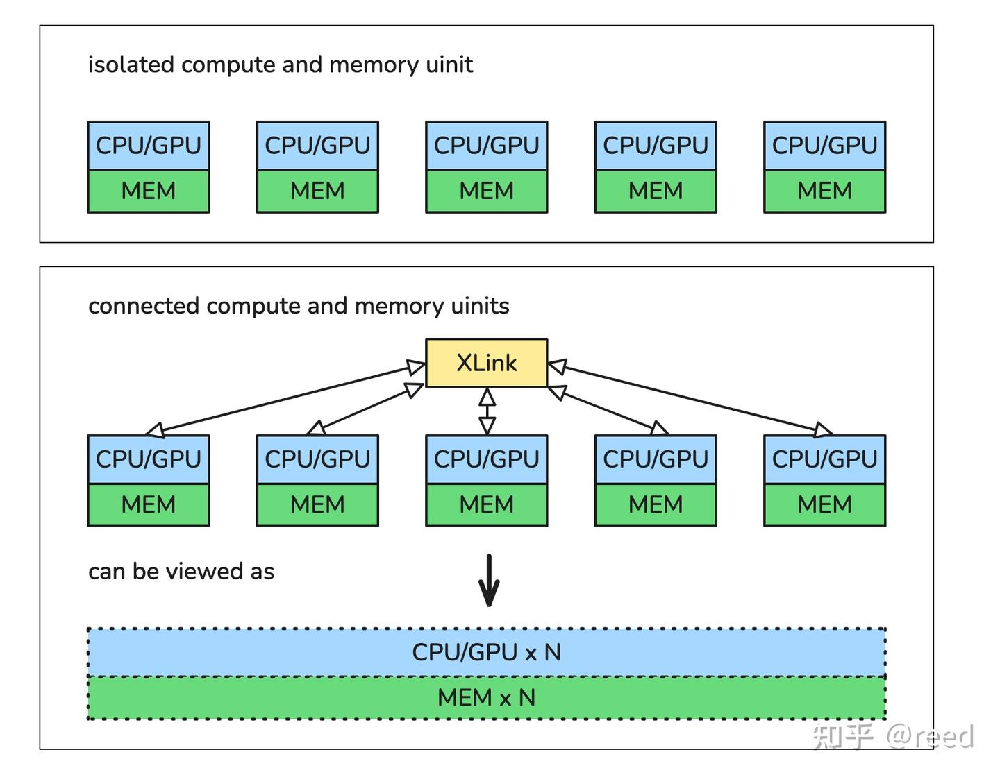
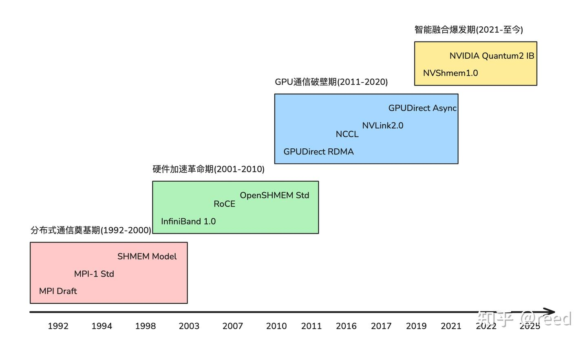

# 고성능 통신 기술 - 서문

> 원문: https://zhuanlan.zhihu.com/p/1913335501454311749

2022년 ACM 튜링상은 Robert M. Metcalfe에게 수여되었습니다. 이더넷의 발명·표준화·상업화에 기여한 선구적 업적을 인정한 것으로, 이 성과 덕분에 수억 대의 유선·무선 장치가 효율적으로 상호연결될 수 있었습니다. 이 이정표는 과거에 대한 평가에 그치지 않고, 통신 기술 발전의 핵심 논리를 드러냅니다 — **개방 표준과 하드웨어 혁신이 성능 병목을 지속적으로 돌파하는 핵심 동력**이라는 점입니다.

통신 기술의 본질은 물리적으로 분리된 저장 유닛과 계산 유닛 사이의 간극을 메우는 데 있습니다. 효율적인 통신 메커니즘을 통해 흩어져 있던 자원들이 논리 계층에서 통합되고, 서로 협동하여 더 큰 규모의 계산 작업을 수행하며, 용량이 더 크고 접근성이 더 좋은 저장 시스템을 구성합니다(그림 1).

그러나 계산 규모가 단일 node의 한계를 넘어 수천 개, 나아가 수만 개의 프로세서(CPU, GPU, 전용 accelerator)로 구성된 대규모 클러스터로 확장되면, 기본적인 연결 능력 자체가 시스템 성능의 핵심 제약 요인이 됩니다. 데이터를 node 사이에서 어떻게 high bandwidth, low latency로 전송할 것인가, 방대한 수의 계산 유닛 간 동기화를 어떻게 효과적으로 조율할 것인가, 통신 연산이 전체 계산의 병목이 되는 것을 어떻게 피할 것인가 — 이러한 과제들이 **고성능 통신 기술**(High-Performance Communication)의 핵심 연구·응용 목표를 이룹니다. 현대 슈퍼컴퓨터와 인공지능 인프라에서 통신 서브시스템의 성능은 시스템이 도달할 수 있는 최대 연산 능력, 병렬 효율, 전체 에너지 효율비를 직접 결정합니다.

전통적인 고성능 컴퓨팅(HPC) 영역에서 대규모 병렬 시뮬레이션은 효율적인 통신 메커니즘에 의존해 핵심 협동을 구현합니다. 기후 모델링이나 분자 동역학 시뮬레이션 같은 대표적 응용은 계산 도메인을 수만 개 코어로 분해해야 하며, 이때 MPI가 제공하는 message passing과 collective 통신(global reduction, boundary exchange 등)이 데이터 동기화의 기반이 됩니다. 통신 latency와 bandwidth의 최적화는 계산 효율에 직접 영향을 주며, RDMA 하드웨어 오프로드 기술은 zero-copy와 kernel bypass로 CPU 오버헤드를 낮추고, InfiniBand/RoCE 프로토콜 스택은 물리 링크 활용률 향상에 힘을 쏟습니다. 시스템 규모가 커짐에 따라 PGAS 모델(OpenSHMEM 등)은 global address space 추상으로 분산 메모리 프로그래밍의 확장성을 높입니다.

인공지능 영역에서는 천 장·만 장 규모 GPU 클러스터의 대형 모델 학습이 밀집된 통신 과제에 직면합니다. 데이터 병렬 등의 전략에서는 gradient 동기화(all-reduce), 파라미터 broadcast 같은 연산이 계산 시간의 상당 부분을 차지합니다. NCCL 라이브러리는 topology 인식을 통해 NVLink/InfiniBand 네트워크의 collective 통신 경로를 최적화하며, 그 성능이 학습 throughput을 직접 좌우합니다. GPU 메모리 제약에 대해서는 GPU Direct RDMA와 NVSHMEM 기술이 디바이스 메모리와 네트워크 사이의 직접 데이터 교환을 구현해 호스트 메모리 복사를 우회합니다. 또한 IB GPUDirect Async(IBGDA)는 SM이 네트워크 작업을 직접 발사하도록 하여 CPU의 개입을 완전히 배제하고, 통신 집약적 모델의 학습·추론 효율을 크게 끌어올립니다. 이 기술들은 통신 오버헤드를 낮춤으로써 GPU 자원 활용률을 직접 높이고, 학습 주기를 단축하며, 추론 latency를 줄이고 비용 효율을 개선합니다.

따라서 고성능 통신 기술의 지속적인 진화는 더 큰 용량의 슈퍼컴퓨터를 실현하고 현재의 대형 모델 기술 흐름을 이끄는 데 없어서는 안 될 인프라 요소입니다. 이는 방대한 이기종 계산 유닛을 연결하는 핵심 서브시스템을 구성하며, HPC와 AI 영역의 중대한 돌파를 가능하게 하는 핵심 기술입니다.

통신 기술의 진화는 1992년 MPI 표준의 원형에서 출발해 InfiniBand NIC를 거쳐 NVLink와 GPUDirect 기술의 등장으로 이어졌고, 오늘날 GPUDirect Async로 대표되는 고성능 이기종 통신 능력에 이르기까지 통신 능력을 끊임없이 더 높은 수준으로 밀어 올리고 있습니다(그림 2).

본 시리즈는 고성능 통신의 핵심 기술을 체계적으로 해설하며, 전체를 세 부분으로 계획하고 있습니다.

- **1부 — 기초 모델과 프로토콜**: 이더넷 broadcast 프로토콜의 협동 메커니즘, MPI message passing 인터페이스 소개와 대규모 병렬 컴퓨팅에서의 역할, OpenSHMEM PGAS 모델이 분산 프로그래밍의 확장성을 높이는 방법
- **2부 — 하드웨어 최적화**: RDMA 하드웨어 오프로드가 low latency와 CPU 오버헤드 절감을 구현하는 원리 분석, InfiniBand와 RoCE 프로토콜 스택의 설계 차이 비교
- **3부 — GPU 특화 기술**: NCCL 라이브러리의 topology 인식 collective 통신 최적화, NVSHMEM의 디바이스 메모리 직접 접근 메커니즘, GPUDirect Async가 GPU 통신 효율을 높이는 방식

위 기술들의 설계 원리, 성능 특성, 응용 시나리오를 분석함으로써 본 시리즈는 고성능 통신 기술 체계에 대한 완결된 이해를 구축하는 것을 목표로 합니다.

## 참고

- [Robert Melancton Metcalfe](https://amturing.acm.org/award_winners/metcalfe_3968158.cfm)
- [Event & Meeting Planning Networking and Education | Meeting Professionals International](https://www.mpi.org/)
- [Welcome to OpenSHMEM.org | OpenSHMEM.org](http://openshmem.org/site/)
- [Introduction to InfiniBand (whitepaper)](https://network.nvidia.com/pdf/whitepapers/IB_Intro_WP_190.pdf)
- [RoCE in the Data Center (whitepaper)](https://network.nvidia.com/sites/default/files/pdf/whitepapers/WP_RoCE_in_the_Data_Center.pdf)
- [NVIDIA Collective Communications Library (NCCL)](https://developer.nvidia.com/nccl)
- [NVLink & NVSwitch for Advanced Multi-GPU Communication](https://www.nvidia.com/en-us/data-center/nvlink/)
- [NVIDIA NVSHMEM](https://docs.nvidia.com/nvshmem/)
- [GPUDirect](https://developer.nvidia.com/gpudirect)
- [The Landscape of GPU-Centric Communication](https://arxiv.org/abs/2409.09874v2)
- [Magnum IO NVSHMEM and GPUDirect Async](https://developer.nvidia.com/blog/improving-network-performance-of-hpc-systems-using-nvidia-magnum-io-nvshmem-and-gpudirect-async/)
