# Ant 오픈소스 x SGLang Meetup 기술 회고 해설 - CUTE DSL 기반 통신-계산 overlap operator 실전

> 이 글은 2026년 1월 17일 Ant Open Source x SGLang Meetup의 "SGLang community가 CuTe DSL 기반 communication-computation overlap kernel을 실전 적용한 경험" 발표 replay 해설이다. 원본 slides는 상당히 하드코어한 kernel 최적화를 다룬다. Tensor Parallel의 GEMM과 AllReduce를 하나의 CuTe DSL kernel로 fuse하고, Blackwell의 multimem/NVLS instruction으로 일부 communication을 GEMM epilogue 뒤에 숨기는 내용이다. 여기서는 slides 순서대로 분해하되, 공개 code에 초점을 둔다. SGLang PR [#15103 Support TP overlap on Blackwell](https://github.com/sgl-project/sglang/pull/15103), FlashInfer PR [#1695 cute_dsl gemm + all reduce two_shot](https://github.com/flashinfer-ai/flashinfer/pull/1695), 그리고 CUTLASS 공식 CuTe DSL distributed examples를 중심으로 본다.

## 0x0. 들어가며

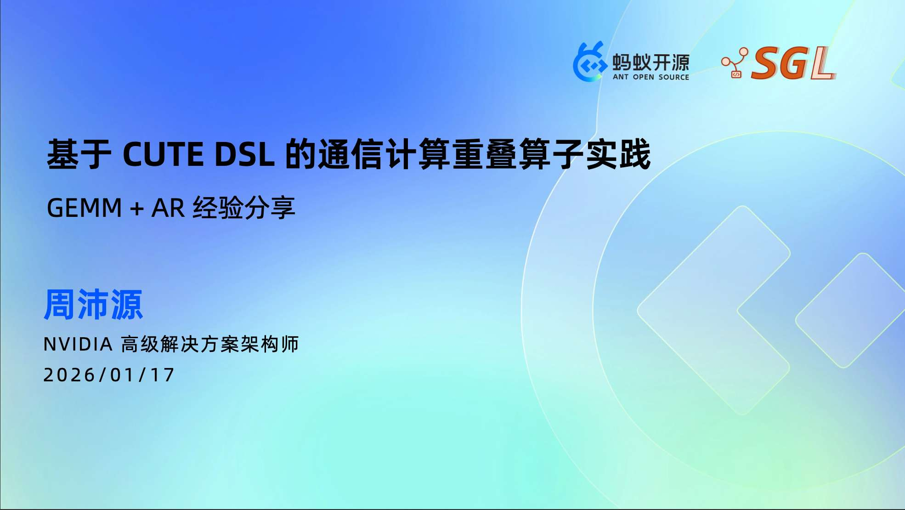

이 slides를 읽으며 든 느낌은, 이것이 "더 빠른 AllReduce를 어떻게 호출하는가"를 말하는 것이 아니라 더 낮은 level의 문제를 다룬다는 점이다. Tensor Parallel의 `RowParallelLinear`가 layer마다 GEMM 뒤 AllReduce를 한 번 해야 한다면, 이 AllReduce를 timeline 위에 독립 단계로 노출하지 않을 수 있을까? 더 구체적으로는 GEMM이 result를 write back한 직후, 같은 persistent kernel 안의 communication warp가 multimem reduce/broadcast를 즉시 발행하게 해서 communication과 이후 tile 계산을 overlap할 수 있을까?

SGLang 쪽에서 현재 가장 직접적인 공개 구현은 PR [#15103](https://github.com/sgl-project/sglang/pull/15103)이다. PR description은 아주 직설적이다.

```text
We do GEMM+AllReduce overlap during TensorParallel via cutlass based fused kernel on B200.
```

이 PR은 fused GEMM+AllReduce를 model의 두 위치에 연결했다.

- Attention 뒤의 `o_proj`, 즉 TP에서 all-reduce가 필요한 output projection
- MLP 뒤의 `down_proj`, 마찬가지로 row parallel 뒤 aggregate가 필요한 layer

이 내용은 꽤 low-level이다. slides 뒤쪽에 나오는 용어는 거의 CUTLASS/CuTe DSL, NVSHMEM, NVLS, multicast address, TMA store, persistent scheduler 근처에서 맴돈다. 이전 DeepSeek 배포 최적화 글과는 다르다. 그 글은 SGLang server layer와 model execution path의 조합에 더 가까웠고, 이 글은 거의 하나의 kernel pipeline 안쪽으로 파고든다.

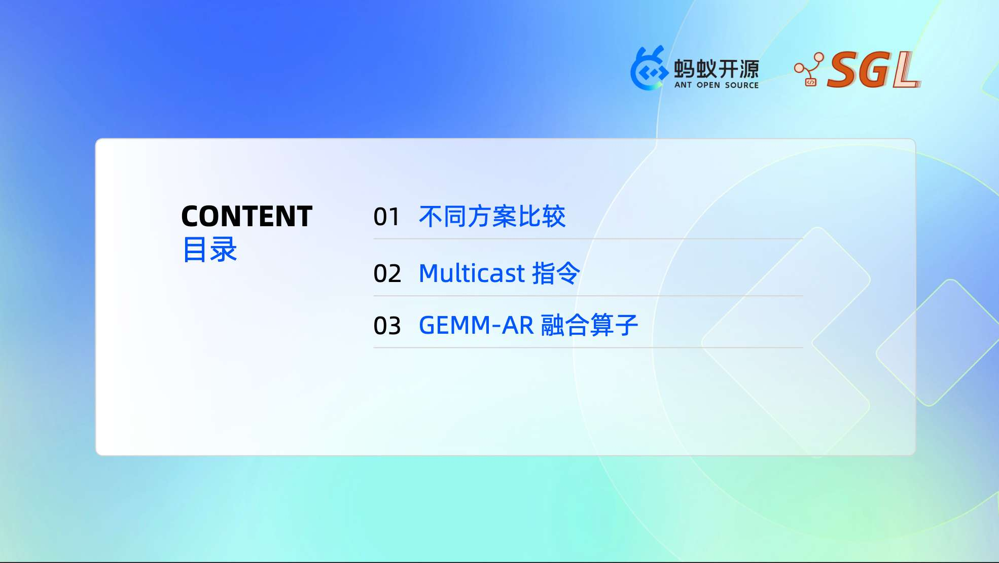

목차는 세 부분뿐이다.

1. 서로 다른 communication-computation overlap 방안 비교
2. Blackwell에서 사용하는 multicast / multimem instruction
3. GEMM + AllReduce fused operator 구현

아래도 이 순서대로 쓴다. code와 대조하기 쉽도록 "AllReduce"는 AR로 줄여 쓴다.

## 0x1. 왜 단순히 kernel 두 개를 켜면 안 되는가

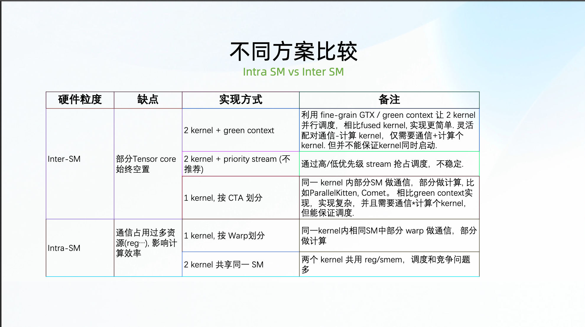

이 페이지는 communication-computation overlap 방안을 두 종류로 나눈다. Inter-SM과 Intra-SM이다.

Inter-SM의 아이디어는 서로 다른 SM이 서로 다른 일을 하게 하는 것이다. 예를 들어 일부 SM은 GEMM을 돌리고, 일부 SM은 communication을 돌린다. slides에는 흔한 방식 세 가지가 나열되어 있다.

- kernel 두 개 + green context
- kernel 두 개 + priority stream
- 하나의 kernel 안에서 CTA를 나누어, 일부 CTA는 compute를 하고 일부 CTA는 communication을 한다

이런 방식의 어려움은 GEMM이 Tensor Core를 많이 사용한다는 점이다. 일부 SM을 communication 전용으로 고정해 버리면 Tensor Core utilization이 떨어진다. kernel 두 개를 사용하면 scheduling order가 원하는 overlap 위치에 딱 맞기 어렵다. 특히 compute kernel이 먼저 모든 SM을 차지하면 communication kernel은 queue에서 기다릴 수밖에 없고, timeline에서는 concurrent처럼 보여도 실제 overlap은 많지 않을 수 있다.

Intra-SM의 아이디어는 같은 SM 안에서 역할을 다시 나누는 것이다. 예를 들어 하나의 kernel 안에서 warp를 나누어 MMA warp는 GEMM을 하고, 다른 warp는 communication을 한다. 대가도 분명하다. communication warp는 register, shared memory, issue slot, scheduling resource를 먹고, 잘못 작성하면 오히려 GEMM을 끌어내린다.

따라서 이 페이지의 핵심은 어떤 방식이 항상 최고라는 말이 아니라 하나의 판단을 끌어내는 것이다. GEMM+AR 같은 scenario를 섬세하게 처리하려면 결국 warp specialization으로 내려갈 가능성이 크다. 즉 하나의 persistent kernel 내부에서 TMA, MMA, Epilogue, AllReduce를 서로 다른 warp group의 일로 본다.

SGLang community에서 볼 수 있는 공개 탐색 경로는 두 가지다.

첫 번째는 PR [#9058 Support TP overlap](https://github.com/sgl-project/sglang/pull/9058)이다. ByteDance Seed의 Triton-Distributed 기반으로 H20에서 GEMM+AR overlap을 수행한다. 대략 이런 방식으로 연결된다.

```python
from triton_dist.layers.nvidia import GemmARLayer

gemm_ar_attn_op = GemmARLayer(
    group=ps._TP,
    max_M=server_args.max_running_requests * model_config.context_len,
    N=model_config.hidden_size,
    K=model_config.hidden_size // server_args.tp_size,
    dtype=torch.bfloat16,
    NUM_COMM_SMS=2,
    persistent=True,
    copy_to_local=False,
)
```

이 경로의 PR data는 8xH20에서 Qwen2.5-72B를 돌릴 때 `bench_serving` input throughput이 `6466.94 token/s`에서 `6959.78 token/s`로 올라가고, median TTFT가 `6302.95 ms`에서 `5838.61 ms`로 낮아졌음을 보여준다. 다만 이 PR은 뒤에서 Triton-Distributed 설치, memory allocation, mainline integration 문제에 걸렸다.

두 번째가 이번 slides의 주된 경로다. SGLang PR [#15103](https://github.com/sgl-project/sglang/pull/15103)은 CUTLASS/CuTe DSL 기반으로 B200/Blackwell에서 fused GEMM+AR를 수행한다. 이 경로는 slides 뒤에서 다루는 multimem instruction과 CuTe DSL kernel에 더 가깝다.

## 0x2. granularity: tile인가 chunk인가

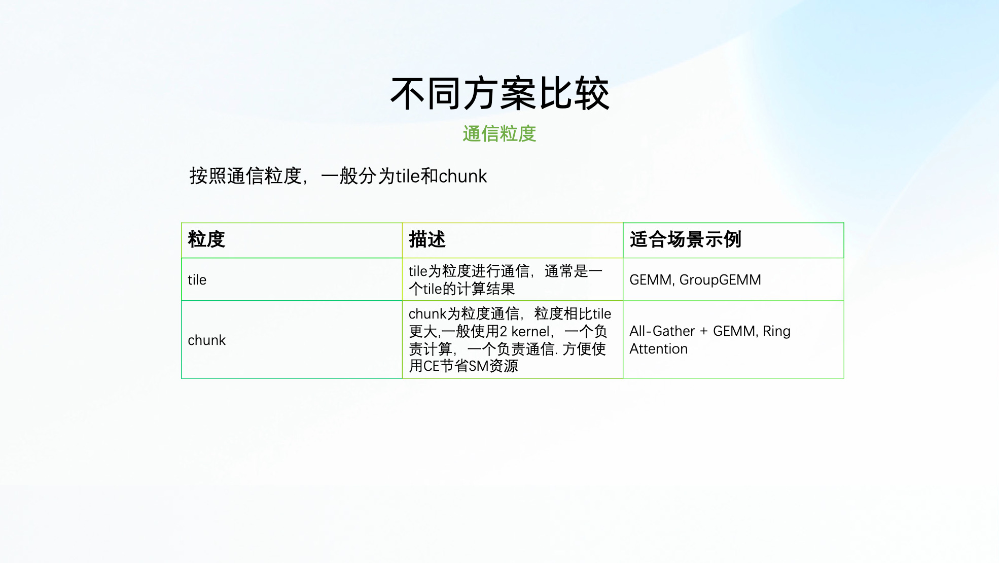

communication-computation overlap에는 또 하나의 핵심 문제가 있다. overlap granularity를 얼마나 크게 잡을 것인가?

slides는 이를 tile grain과 chunk grain으로 나눈다.

Tile grain은 더 세밀한 방식이다. 보통 GEMM tile 하나를 계산하면 이 tile result를 communication으로 보낸다. GEMM, GroupGEMM 같은 2D tile structure에 자연스럽게 맞는다. CTA tile 자체가 GEMM kernel의 기본 scheduling unit이기 때문이다. 단점은 communication logic을 kernel 안에 넣어야 하므로 kernel complexity가 상당히 올라간다는 것이다.

Chunk grain은 더 거친 방식이다. 먼저 비교적 큰 chunk를 계산하고, 다른 kernel 또는 Copy Engine으로 communication을 수행한다. All-Gather+GEMM, Ring Attention 같은 workload에서 흔하다. engineering 측면에서는 상대적으로 깔끔하지만 granularity가 거칠어 communication tail이 더 길게 노출된다.

GEMM+AR는 tile grain이 더 적합하다. 이유는 단순하다. RowParallelLinear의 output matrix는 원래 tile 단위로 생성된다. tile 하나가 계산된 뒤에는 이 data가 이미 register/shared/global path 위에 있다. 전체 GEMM이 끝날 때까지 기다렸다가 AR kernel을 열면 가장 자연스러운 overlap window를 놓치게 된다.

## 0x3. 왜 Blackwell에서 GEMM+AR fused kernel이 더 적합한가

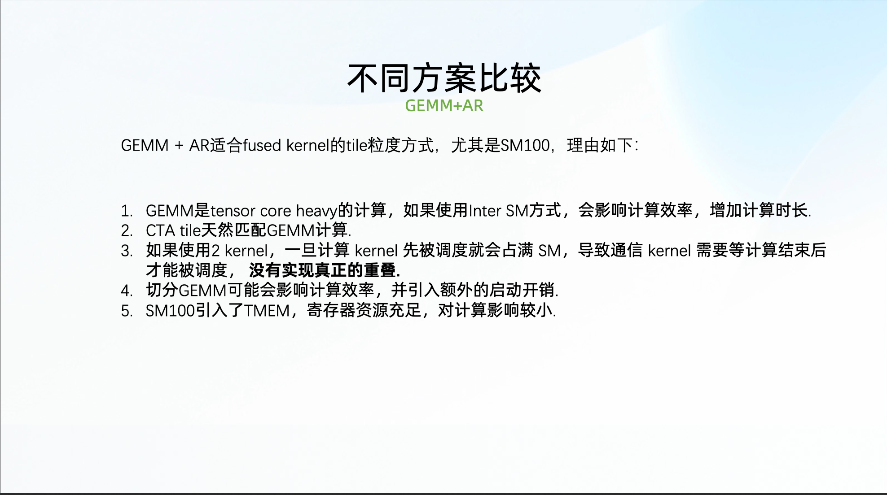

이 페이지는 앞의 두 페이지의 결론이다. GEMM+AR fused operator는 tile-grain fused kernel에 매우 적합하며, 특히 SM100/Blackwell에서 그렇다.

여기에는 hardware와 kernel structure 관점의 이유가 몇 가지 있다.

첫째, GEMM은 Tensor Core heavy workload다. communication을 위해 SM을 따로 남겨두면 compute throughput이 떨어진다. large model MLP/Attention projection 같은 matrix multiplication에서는 특히 명확하다.

둘째, GEMM의 CTA tile 자체가 좋은 communication unit이다. 각 tile의 epilogue가 accumulator를 write out하고, AllReduce의 input은 정확히 이 output이다.

셋째, 두 kernel로 나누면 GEMM kernel이 먼저 모든 SM을 점유하기 쉽고, communication kernel은 뒤에서 scheduling을 기다린다. priority stream으로 일부 상황을 개선할 수는 있지만 안정적이지 않고, kernel level deterministic solution처럼 보이지도 않는다.

넷째, Blackwell은 TMEM을 도입했다. MMA accumulator가 과거와 같은 방식으로 일반 register를 강하게 압박하지 않으므로 register pressure가 다소 완화된다. 그러면 같은 CTA 안에 AR warp group을 추가할 여지가 더 커진다. SGLang PR [#15103](https://github.com/sgl-project/sglang/pull/15103)의 `PersistentDenseGemmKernel`도 이 생각으로 작성되었고, docstring에는 이런 keyword가 적혀 있다.

```python
class PersistentDenseGemmKernel:
    """
    This class implements batched matrix multiplication (C = A x B) with support
    for various data types and optimized for NVIDIA Blackwell architecture.

    It supports persistent tile scheduling, warp specialization, and optional
    all-reduce operations for distributed computation.
    """
```

더 중요한 것은 warp role을 추가로 잘라 all-reduce warp를 둔다는 점이다.

```python
if self.all_reduce != "none":
    self.epilog_warp_id = (0, 1, 2, 3)
    self.mma_warp_id = 4
    self.tma_warp_id = 5
    self.all_reduce_warp_id = (6, 7, 8, 9)
    self.threads_per_cta = 32 * (
        len(self.epilog_warp_id)
        + 1
        + 1
        + len(self.all_reduce_warp_id)
    )
```

이 code는 사실상 slide의 Intra-SM 방안을 구현한 것이다. TMA warp가 data를 옮기고, MMA warp가 Tensor Core를 구동하며, epilogue warp가 output을 수행하고, AR warp group은 tile ready 뒤에 multimem reduce와 broadcast를 전담한다.

## 0x4. Multimem address와 세 instruction

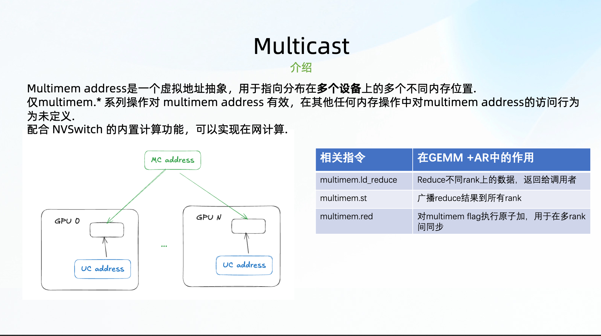

이 페이지부터 multimem으로 들어간다. 먼저 개념을 쉽게 말해 보자.

일반 UC address는 하나의 GPU 위의 물리 memory block을 가리킨다. Multicast address, 즉 slides의 MC address는 여러 rank의 대응되는 physical memory에 mapping되는 special virtual address다. 이것은 일반 load/store로 마음대로 접근할 수 없고, `multimem.*` 계열 instruction으로만 접근할 수 있다.

이 mechanism은 NVSwitch/NVLS가 뒤에서 처리한다. AR 관점에서 가장 중요한 instruction은 세 가지다.

- `multimem.ld_reduce`: 여러 rank의 동일 MC address에서 data를 읽고 NVSwitch 안에서 reduce한 뒤, 결과를 instruction을 발행한 rank로 반환한다
- `multimem.st`: data를 NVSwitch로 보내고 여러 rank로 multicast한다
- `multimem.red`: 여러 rank의 target address에 atomic reduce를 수행한다. cross-rank flag/barrier 구현에 자주 사용된다

CUTLASS 공식 distributed README도 이 개념들을 같은 context에서 설명한다. CuTe DSL distributed examples는 NVSHMEM4Py로 symmetric tensor와 multicast tensor를 만들고, multimem instruction을 통해 NVLS/NVLink SHARP 경로를 사용해 reduce와 broadcast를 가능한 한 switch chip에 맡긴다.

SGLang PR [#15103](https://github.com/sgl-project/sglang/pull/15103)에는 inline asm을 직접 쓰지 않고 CUTLASS/CuTe DSL wrapper를 호출한다.

```python
if self.c_dtype == cutlass.Float16:
    x, y, z, w = utils.distributed.multimem_ld_reduce_8xf16(mc_ptr)
elif self.c_dtype == cutlass.Float32:
    x, y, z, w = utils.distributed.multimem_ld_reduce_4xf32(mc_ptr)
elif self.c_dtype == cutlass.BFloat16:
    x, y, z, w = utils.distributed.multimem_ld_reduce_8xbf16(mc_ptr)
elif self.c_dtype == cutlass.Float8E4M3FN:
    x, y, z, w = utils.distributed.multimem_ld_reduce_16xe4m3(mc_ptr)
elif self.c_dtype == cutlass.Float8E5M2:
    x, y, z, w = utils.distributed.multimem_ld_reduce_16xe5m2(mc_ptr)

utils.distributed.multimem_st_4xb32(mc_ptr, x, y, z, w)
```

이 code는 뒤의 task partition과 함께 봐야 한다. 각 thread는 자신이 담당하는 128bit data만 처리한다. `ld_reduce`가 이 작은 조각을 각 rank에서 aggregate해 오고, `st`가 다시 모든 rank의 대응 위치로 broadcast한다.

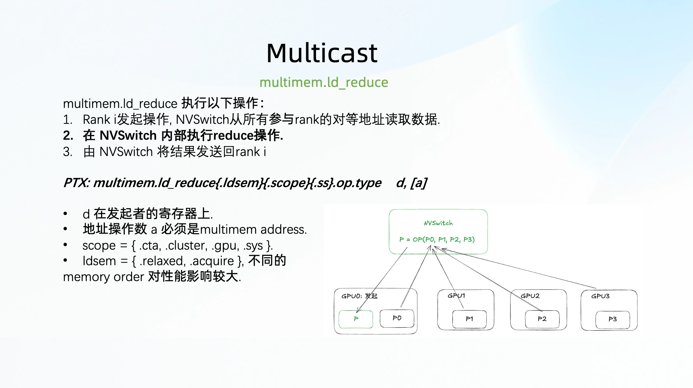

`multimem.ld_reduce`는 reduce load다. slide의 flow는 다음과 같다.

1. 어떤 GPU가 `multimem.ld_reduce`를 발행한다
2. NVSwitch가 MC address를 바탕으로 각 rank의 대응 physical address를 찾는다
3. 각 rank에서 data를 읽고 switch chip 안에서 reduce한다
4. reduce된 data를 발행자 register로 반환한다

공식 CuTe DSL wrapper에서 128bit는 기본 granularity 중 하나다. FP32를 예로 들면 FP32 네 개가 정확히 128bit다.

```python
@cute.jit
def multimem_ld_reduce_4xf32(mc_ptr: cute.Pointer) -> tuple:
    return multimem_ld_reduce_128bit_base(
        "multimem.ld_reduce.weak.global.add.v4.f32 "
        "{$0, $1, $2, $3}, [$4];",
        mc_ptr,
    )
```

FP16/BF16/FP8은 128bit 안에 들어가는 element 수가 다를 뿐이다.

```python
multimem_ld_reduce_8xf16(...)
multimem_ld_reduce_8xbf16(...)
multimem_ld_reduce_16xe4m3(...)
multimem_ld_reduce_16xe5m2(...)
```

slide에는 `sys.relaxed` 형식으로 적혀 있고, 공식 helper의 일부 version은 `.weak`을 사용한다. 여기서는 spelling 차이에 집착할 필요가 없다. 핵심 semantics는 같다. MC address에 reduce load를 한 번 수행하고, 결과는 register에 들어간다.

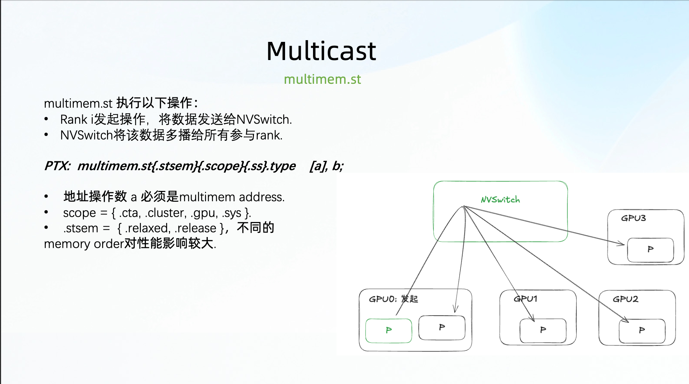

`multimem.st`는 broadcast store다. `ld_reduce` 뒤에 붙여 쓰는 것이 가장 자연스럽다. 어떤 rank가 이미 이 128bit reduce result를 얻었다면, 바로 모든 rank의 output address로 broadcast하면 된다.

CuTe DSL helper의 대응 구현은 다음과 같다.

```python
@cute.jit
def multimem_st_4xb32(mc_ptr: cute.Pointer, val0, val1, val2, val3):
    cute.arch.asm(
        "multimem.st.weak.global.v4.f32 [$0], {$1, $2, $3, $4};",
        inputs=[mc_ptr.toint(), val0, val1, val2, val3],
        is_volatile=True,
    )
```

이름의 `4xb32`는 inline asm이 32bit register 4개로 parameter를 넘긴다는 뜻이다. FP16/BF16/FP8의 경우, 앞의 `ld_reduce`가 이미 여러 low-precision element를 이 네 32bit register에 pack해 두었으므로 store 단계는 원래 dtype을 신경 쓸 필요가 없다.

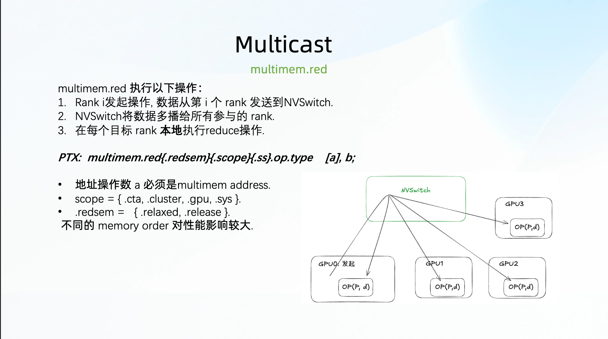

`multimem.red`는 cross-rank atomic operation에 더 가깝다. slide는 이것을 multi-rank sync에 사용할 수 있다고 말하는데, GEMM+AR kernel에서도 정확히 그렇게 사용한다.

예를 들어 tile의 TMA store가 완료된 뒤 epilogue warp는 AR warp에게 알려야 한다. 이 tile은 모든 rank에서 write가 끝났으니 reduce를 시작해도 된다는 뜻이다. 이 flag는 MC address에 `multimem.red.add`를 한 번 수행해 구현할 수 있다.

CUTLASS wrapper는 대략 다음과 같다.

```python
@cute.jit
def multimem_red_add1(lock_ptr: cute.Pointer, order: cutlass.Constexpr, scope: cutlass.Constexpr):
    if order == "release" and scope == "sys":
        cute.arch.asm(
            "multimem.red.release.sys.global.add.s32 [$0], 1;",
            inputs=[lock_ptr.toint()],
            is_volatile=True,
        )
    elif order == "relaxed" and scope == "gpu":
        cute.arch.asm(
            "multimem.red.relaxed.gpu.global.add.s32 [$0], 1;",
            inputs=[lock_ptr.toint()],
            is_volatile=True,
        )
```

뒤에서 볼 수 있듯 tile ready의 local flag와 kernel 종료 전 global sync는 서로 다른 scope/order를 사용한다.

## 0x5. MC address를 어떻게 얻는가

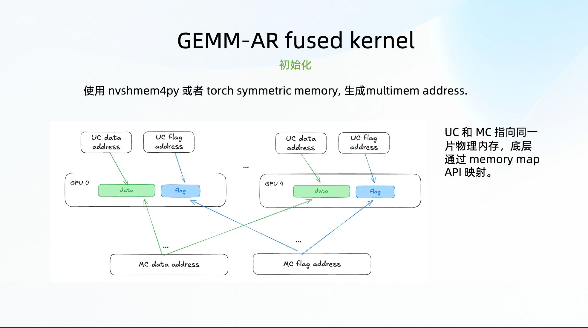

이 페이지는 initialization을 다룬다. multimem instruction을 사용하려면 먼저 MC address가 있어야 한다. slides에는 두 방법이 나온다.

- nvshmem4py
- torch symmetric memory

둘의 본질은 같은 문제를 해결하는 것이다. 여러 GPU에 symmetric memory 묶음을 할당하고, multimem instruction으로 접근할 수 있는 multicast pointer를 얻는다. UC address와 MC address는 같은 physical memory 묶음을 가리키지만 access path가 다르다.

SGLang PR [#15103](https://github.com/sgl-project/sglang/pull/15103)은 `NvshmemCommunicator`를 새로 추가해 nvshmem4py로 이 일을 한다.

```python
class NvshmemCommunicator:
    def __init__(self, group, device, rank, world_size):
        from nvshmem.core import get_unique_id, init

        unique_id = get_unique_id()
        torch.distributed.broadcast_object_list([unique_id], src=0, group=group)
        init(unique_id, rank, world_size)

    def create_symmetric_tensor(self, size, dtype):
        return nvshmem.core.tensor(size, dtype=dtype, device=self.device)

    def create_multicast_pointer(self, tensor):
        local_ptr = tensor.data_ptr()
        return nvshmem.bindings.mc_ptr(nvshmem.core.Teams.TEAM_NODE, local_ptr)
```

`GemmARLayer`에서는 barrier flag가 우선 NVSHMEM을 사용하고, 실패하면 PyTorch symmetric memory로 fallback한다.

```python
def _create_barrier_flags(self):
    num_flags = self.num_tiles + self.num_sms

    nvshmem_comm = get_nvshmem_comm()
    if nvshmem_comm is not None:
        barrier_flag = nvshmem_comm.create_symmetric_tensor(
            num_flags, dtype=torch.int32
        )
        barrier_flag_mc = nvshmem_comm.create_multicast_pointer(barrier_flag)
        return barrier_flag, barrier_flag_mc

    barrier_flag = symm_mem.empty(
        num_flags, dtype=torch.int32, device=torch.cuda.current_device()
    )
    handle = symm_mem.rendezvous(barrier_flag, self.group_name)
    barrier_flag_mc = handle.multicast_ptr
    return barrier_flag, barrier_flag_mc
```

SGLang mainline에는 symmetric memory와 관련된 일반 AllReduce 경로도 있다. PR [#10571 Support Torch Symm Mem AllReduce](https://github.com/sgl-project/sglang/pull/10571)이다. GEMM fusion은 하지 않지만 MC address를 이해하는 데 도움이 된다. 현재 code는 먼저 symmetric buffer를 할당하고 rendezvous handle을 얻는다.

```python
self.buffer = torch_symm_mem.empty(
    buffer_size,
    dtype=torch.uint8,
    device=device,
)
self.symm_mem_hdl = torch_symm_mem.rendezvous(
    self.buffer,
    self.group.group_name,
)

if self.symm_mem_hdl.multicast_ptr == 0:
    self.disabled = True
```

그런 다음 hardware와 world size에 따라 `multimem_all_reduce_` 또는 `two_shot_all_reduce_`를 선택한다.

```python
if self.world_size in self._WORLD_SIZES_MULTIMEM[cc]:
    torch.ops.symm_mem.multimem_all_reduce_(
        self.buffer[: inp.numel()].view(inp.shape),
        "sum",
        self.group.group_name,
    )
else:
    torch.ops.symm_mem.two_shot_all_reduce_(
        self.buffer[: inp.numel()].view(inp.shape),
        "sum",
        self.group.group_name,
    )
```

따라서 slide 11은 단순한 initialization 그림처럼 보이지만, 사실 전체 fused kernel이 성립하기 위한 전제다. output matrix와 barrier flag 모두 MC address를 지원하는 memory 위에 있어야 한다.

## 0x6. Kernel workflow: AR warp group 하나 더 넣기

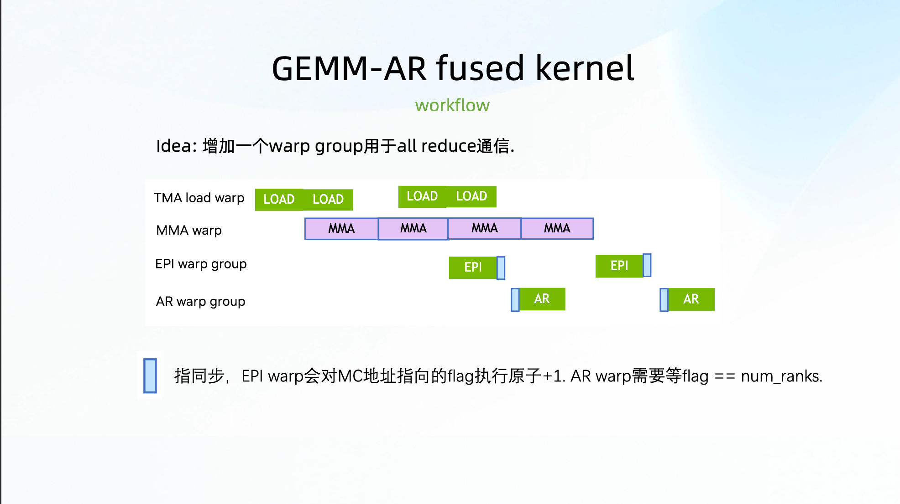

이 페이지는 kernel의 main flow를 제시한다. 원래 persistent GEMM kernel에는 이미 TMA load, MMA, epilogue가 있다. 이제 AR warp group을 하나 더 추가한다.

1. MMA warp가 tile을 계산한다
2. epilogue warp가 tile result를 MC address에 대응되는 global memory에 쓴다
3. epilogue warp가 `multimem.red`로 flag에 1을 더한다
4. AR warp가 이 flag가 `num_ranks`가 될 때까지 기다린다
5. AR warp가 자신이 담당하는 tile fragment에 대해 `multimem.ld_reduce`를 수행한다
6. AR warp가 다시 `multimem.st`로 reduce result를 모든 rank로 broadcast한다

SGLang PR [#15103](https://github.com/sgl-project/sglang/pull/15103)에서 tile ready wait logic은 다음과 같다.

```python
if warp_idx == self.all_reduce_warp_id[0]:
    with cute.arch.elect_one():
        flag = barrier_flag.iterator + tile_id
        utils.distributed.spin_lock_atom_cas_relaxed_wait(
            lock_ptr=flag,
            expected_val=num_ranks,
            reset_val=0,
            scope="gpu",
        )

self.all_reduce_sync_barrier.arrive_and_wait()
```

여기서 `expected_val=num_ranks`가 핵심이다. 각 rank의 epilogue는 같은 tile flag에 한 번 `+1`을 수행한다. AR warp가 flag가 `num_ranks`에 도달한 것을 보면, 이 tile의 input이 모든 rank에 write되었다는 뜻이다.

FlashInfer PR [#1695](https://github.com/flashinfer-ai/flashinfer/pull/1695)의 CuTe DSL kernel도 같은 two-shot 아이디어를 사용한다. epilogue 뒤 TMA store 완료를 기다리고, MC flag에 arrive한다.

```python
if self.all_reduce == "two_shot":
    if warp_idx == self.epilog_warp_id[0]:
        cute.arch.cp_async_bulk_wait_group(0, read=False)
        with cute.arch.elect_one():
            flag = barrier_flag_mc.iterator + tile_id
            cute.arch.fence_acq_rel_gpu()
            spin_lock_multimem_arrive(flag)
            cute.arch.fence_proxy("alias")
```

이 code는 SGLang PR보다 최소 교육용 version에 더 가깝다. `cp_async_bulk_wait_group(0, read=False)`는 TMA store가 실제 완료되었음을 보장하고, `spin_lock_multimem_arrive`는 본질적으로 multicast flag에 `multimem.red.add`를 한 번 수행한다.

해당 helper는 매우 짧다.

```python
@cute.jit
def spin_lock_multimem_arrive(lock_ptr: cute.Pointer):
    distributed.multimem_red_relaxed_gpu_add1(lock_ptr)
```

이 flow는 복잡해 보이지만 조건은 명확하다. AllReduce는 아직 write되지 않은 tile을 읽으면 안 된다. flag는 tile granularity의 producer-consumer 관계이고, multimem red는 이 flag를 multi-GPU에 동시에 visible하게 한다.

## 0x7. task partition: 각 rank는 tile의 한 조각만 담당한다

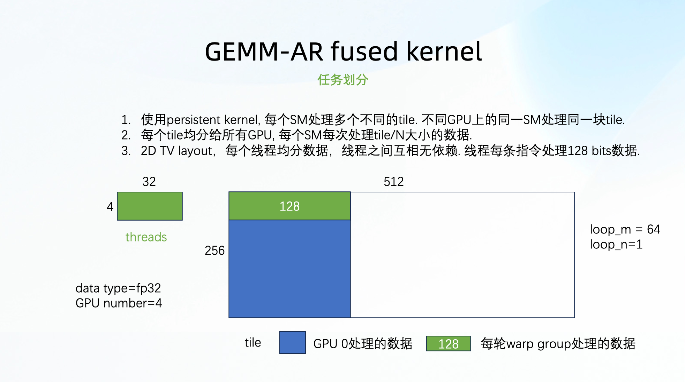

이 페이지는 task partition을 설명한다. two-shot algorithm의 communication volume을 줄일 수 있는지는 여기의 분업에 달려 있다.

output tile이 `M x N`이고 `num_ranks`개의 GPU가 있다고 하자. 각 rank가 전체 tile에 대해 `ld_reduce + st`를 하면 모든 rank가 중복 작업을 한다. two-shot은 tile을 rank별로 나눠 각 rank가 그중 한 부분만 담당하게 한다. reduce를 마친 뒤 `multimem.st`로 자신이 담당한 result를 모든 rank로 broadcast한다. 이렇게 하면 최종적으로 각 GPU는 complete all-reduce output을 얻지만, reduce work는 분산된다.

SGLang PR [#15103](https://github.com/sgl-project/sglang/pull/15103)의 대응 code는 다음과 같다.

```python
cta_mma_tile_m = self.mma_tiler[0] // cute.size(tiled_mma.thr_id.shape)
m_local_rank = int(cta_mma_tile_m / self.num_ranks)

tCgC_mc_slice_partitioned = cute.zipped_divide(
    tCgC_mc_slice,
    (m_local_rank, self.mma_tiler[1]),
)
tCgC_mc_local_rank = cute.slice_(
    tCgC_mc_slice_partitioned,
    ((None, None), (rank_id, 0)),
)

frgC_mc = thr_copy_fake.partition_S(tCgC_mc_local_rank)
```

`m_local_rank`는 각 rank가 M dimension에서 담당하는 height다. `zipped_divide`는 tile을 `(m_local_rank, N)` 작은 block으로 나누고, `cute.slice_(..., (rank_id, 0))`는 현재 rank가 담당하는 조각을 가져온다.

그 다음 각 thread는 128bit granularity로 자신이 맡은 element를 순회한다.

```python
atom, loop_m, loop_n = frgC_mc.shape

for i in cutlass.range_constexpr(loop_m):
    for j in cutlass.range_constexpr(loop_n):
        if cute.elem_less(frpC[0, i, j], c_mc.shape):
            mc_ptr = frgC_mc[None, i, j].iterator

            x, y, z, w = utils.distributed.multimem_ld_reduce_8xbf16(mc_ptr)
            utils.distributed.multimem_st_4xb32(mc_ptr, x, y, z, w)
```

FlashInfer 구현에서는 128bit granularity에서 thread layout을 어떻게 역으로 계산하는지도 볼 수 있다.

```python
atom_val = 128 // c_mc.element_type.width
atom_thr_n = self.mma_tiler[1] // atom_val
atom_thr_m = len(self.all_reduce_warp_id) * (WARP_SIZE // atom_thr_n)
```

예를 들어 BF16의 element width는 16bit이므로 `atom_val=8`이고 thread 하나가 한 번에 BF16 8개를 처리한다. FP32는 4개, FP8은 16개다. slides의 "each instruction handle 128 bits"는 바로 이 뜻이다.

여기에는 또 하나의 세부 사항이 있다. slides는 같은 SM이 서로 다른 GPU에서 같은 tile을 처리한다고 쓴다. 이렇게 하면 flag와 tile id의 대응 관계가 훨씬 단순해진다. AR warp가 기다리는 것은 "이 tile이 모든 rank에서 준비되었는가"다. 이것이 persistent scheduler와 distributed allreduce logic이 맞물려야 하는 부분이기도 하다.

## 0x8. Workflow 세부 사항: pre-sync, tile AR, final sync

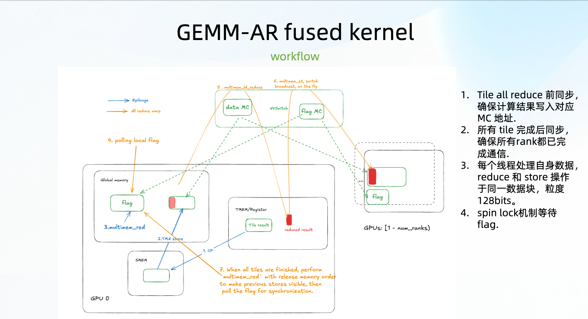

이 페이지는 flow를 더 세밀하게 그린다. 내 이해로는 동기화가 세 층 있다.

첫 번째는 tile allreduce pre-sync다. 각 tile의 epilogue가 write를 마친 뒤, MC flag로 다른 rank에 알린다. 이 tile은 ready다. AR warp는 flag가 `num_ranks`가 될 때까지 기다린 뒤 이 tile을 읽기 시작한다.

두 번째는 tile 내부의 `ld_reduce + st`다. 각 thread는 자신의 128bit data만 처리하고 cross-thread dependency가 없으므로 element마다 추가 synchronization이 필요하지 않다. 이 설계는 아주 깔끔하고, thread 사이의 번거로움이 많이 줄어든다.

세 번째는 kernel 끝의 final sync다. `multimem.st`가 result를 모든 rank에 broadcast하므로, kernel이 끝나기 전에 모든 SM의 AR work가 완료되었음을 보장해야 한다. 그렇지 않으면 이후 kernel이 아직 완전히 broadcast되지 않은 data를 읽을 수 있다.

SGLang PR [#15103](https://github.com/sgl-project/sglang/pull/15103)에서 final sync는 SM 단위로 수행된다.

```python
last_tile_id_linear = self.num_tiles

utils.distributed.multimem_red_add1(
    lock_ptr=barrier_flag_mc.iterator + last_tile_id_linear + sm_id_linear,
    scope="sys",
    order="release",
)

utils.distributed.spin_lock_atom_cas_relaxed_wait(
    lock_ptr=barrier_flag.iterator + last_tile_id_linear + sm_id_linear,
    expected_val=num_ranks,
    reset_val=0,
    scope="sys",
)
```

여기서는 tile ready flag와 달리 scope가 `sys`가 되고 order도 `release`를 사용한다. 이 sync는 한 GPU 안의 warp만 조율하는 것이 아니라, 모든 GPU 위의 multimem store가 이후 system에서 visible하도록 보장해야 하기 때문이다.

FlashInfer PR [#2171](https://github.com/flashinfer-ai/flashinfer/pull/2171)은 이후 이 부분을 따로 수정했다. `sm_wise_inter_gpu_multimem_barrier`를 분리했다.

```python
@cute.jit
def sm_wise_inter_gpu_multimem_barrier(barrier, barrier_mc, num_ranks):
    pid = cute.arch.block_idx()[0]

    distributed.multimem_red_release_sys_add1(barrier_mc + pid)
    cute.arch.fence_proxy("alias")
    spin_lock_atom_cas_acquire_wait(
        barrier + pid,
        expected_val=num_ranks,
        reset_val=0,
        scope="sys",
    )
```

이 fix PR의 배경은 CUTLASS DSL upgrade 뒤 two-shot allreduce regression이 발생한 것이다. 즉 이런 kernel은 memory ordering과 barrier 작성법에 민감하다. 수학적으로 equivalent한지만 보면 안 된다.

## 0x9. Memory order: relax할 수 있는 곳은 relax한다

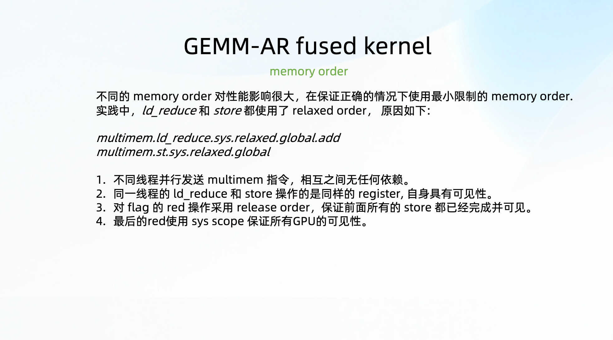

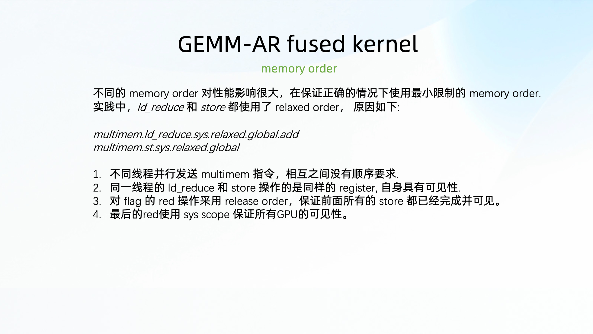

slides에는 memory order 페이지가 두 장 있는데, 내용은 거의 같다. 핵심 관점은 memory order를 가능한 한 약하게 잡되, 잘못 약하게 잡으면 안 된다는 것이다.

data path, 즉 `multimem.ld_reduce`와 `multimem.st`에 대해 slides는 relaxed를 제시한다.

```ptx
multimem.ld_reduce.sys.relaxed.global.add.v4.f32 {$0, $1, $2, $3}, [$4];
multimem.st.sys.relaxed.global.v4.f32 [$1], {$2, $3, $4, $5};
```

이유는 두 가지다.

첫째, thread 사이에 복잡한 dependency가 없다. 앞의 task partition이 이미 각 thread가 담당하는 128bit를 나눠 두었고, 같은 data chunk를 여러 thread가 중복 처리하지 않는다.

둘째, 같은 thread 안에서 `ld_reduce` output register가 곧바로 `multimem.st` input이 된다. 이 순서는 single-thread program order로 보장되므로 각 data element에 더 강한 acquire/release semantics를 붙일 필요가 없다.

하지만 flag는 다르다. flag는 "data가 이미 write되었다" 또는 "모든 rank의 AR이 이미 완료되었다"를 표현한다. 여기서는 이후 waiter가 올바른 memory state를 봐야 하므로 slide는 release를 사용한다.

```ptx
multimem.red.release.sys.global.add.u32 [$0], 1;
```

SGLang PR [#15103](https://github.com/sgl-project/sglang/pull/15103)의 final barrier도 바로 이 생각이다.

```python
utils.distributed.multimem_red_add1(
    lock_ptr=barrier_flag_mc.iterator + last_tile_id_linear + sm_id_linear,
    scope="sys",
    order="release",
)
```

tile 안에서 flag를 기다리는 곳은 relaxed atomic CAS wait을 사용한다.

```python
utils.distributed.spin_lock_atom_cas_relaxed_wait(
    lock_ptr=flag,
    expected_val=num_ranks,
    reset_val=0,
    scope="gpu",
)
```

여기서 slide의 설명은 꽤 실용적이다. 모든 operation을 처음부터 가장 강한 semantics로 쓰는 것이 아니라, data dependency가 실제로 어디에 있는지 먼저 본다. data element 자체는 relaxed일 수 있고, cross-rank completion signal만 release/sys 같은 더 강한 semantics가 필요하다. 그렇지 않으면 performance가 ordering에 불필요하게 먹힌다.

## 0xA. SGLang에서 model execution path에 어떻게 연결하는가

앞에서는 kernel을 다뤘다. SGLang PR [#15103](https://github.com/sgl-project/sglang/pull/15103)은 꽤 완전한 upper-layer integration도 수행했고, entry는 `model_runner.py`에 있다.

시작 switch는 environment variable이다.

```bash
SGL_USE_TP_OVERLAP=1
```

`ModelRunner` initialization 때 별도 TP overlap group을 만들고, symmetric tensor / multicast pointer를 initialize한다. 이어 두 `GemmARLayer`를 만든다.

```python
self.gemm_ar_attn_op = GemmARLayer(
    group=_TP_OVERLAP_GROUP,
    N=self.model_config.hidden_size,
    K=self.model_config.hidden_size // self.tp_size,
    dtype=torch.bfloat16,
    mma_tiler_mn=(256, 256),
    cluster_shape_mn=(2, 1),
    use_2cta_instrs=True,
    use_tma_store=True,
    all_reduce="LDMCxSTMC",
)

self.gemm_ar_mlp_op = GemmARLayer(
    group=_TP_OVERLAP_GROUP,
    N=self.model_config.hidden_size,
    K=self.model_config.intermediate_size // self.tp_size,
    dtype=torch.bfloat16,
    mma_tiler_mn=(256, 256),
    cluster_shape_mn=(2, 2),
    use_2cta_instrs=True,
    use_tma_store=True,
    all_reduce="LDMCxSTMC",
)
```

이 두 op는 각 layer의 `self_attn.o_proj`와 `mlp.down_proj`에 붙는다.

```python
layer.self_attn.o_proj.gemm_ar_attn_op = self.gemm_ar_attn_op
layer.mlp.down_proj.gemm_ar_mlp_op = self.gemm_ar_mlp_op
```

원래 all-reduce를 실제로 대체하는 위치는 `linear.py`다. 기존 `RowParallelLinear` path는 먼저 local GEMM을 수행하고 `tensor_model_parallel_all_reduce(output_parallel)`을 호출한다. PR에서는 빠른 branch를 하나 추가했다.

```python
def forward(self, input_, skip_all_reduce=False):
    if (
        input_.shape[0] >= 128
        and get_int_env_var("SGL_USE_TP_OVERLAP", 0) == 1
    ):
        if self.gemm_ar_attn_op:
            output = self.gemm_ar_attn_op.forward(input_, self.weight, self.bias)
        else:
            output = self.gemm_ar_mlp_op.forward(input_, self.weight, self.bias)

        output_bias = self.bias if self.skip_bias_add else None
        return output, output_bias

    output_parallel = self.quant_method.apply(self, input_, bias=bias)

    if self.reduce_results and self.tp_size > 1 and not skip_all_reduce:
        output = tensor_model_parallel_all_reduce(output_parallel)
```

이 `input_.shape[0] >= 128`은 현실적인 조건이다. 작은 batch/token 수에서는 fused kernel의 추가 complexity와 launch cost가 반드시 이득이 아닐 수 있다. PR은 먼저 더 쉽게 이득을 얻을 수 있는 large M scenario에 놓았다.

`GemmARLayer` 자체도 몇 가지 constraint check를 수행한다.

```python
assert self.world_size in [2, 4, 8]
assert bias is None
```

따라서 이것은 모든 model, 모든 dtype, 모든 parallel strategy를 이미 cover하는 generic replacement가 아니다. B200에서 TP overlap을 위한 engineering starting point에 더 가깝다.

PR discussion의 boundary도 기억할 만하다. 누군가 Qwen3 / DeepSeek 지원 가능성을 물었고, maintainer 답변의 요지는 이렇다. Qwen3 MoE에서 dense attention의 O projection은 사용할 수 있지만, MoE MLP down projection에는 group GEMM + AR이 더 필요하다. DeepSeek-V3 FP8 blockwise는 activation/weight scale도 관련되어 있고, 현재 kernel은 아직 이 scale path를 지원하지 않는다. 즉 "switch를 켜면 모든 model이 빨라진다"가 아니라, model structure와 quantization format이 맞아야 한다.

## 0xB. CUTLASS 공식 예제와 SGLang PR의 관계

이 구현은 허공에서 나온 것이 아니다. SGLang PR discussion에는 CUTLASS 공식 examples 위치가 직접 붙어 있다.

```text
https://github.com/NVIDIA/cutlass/tree/main/examples/python/CuTeDSL/distributed
```

현재 CUTLASS repository에서는 slides와 매우 가까운 file 몇 개를 볼 수 있다.

- [`all_reduce_two_shot_multimem.py`](https://github.com/NVIDIA/cutlass/blob/main/examples/python/CuTeDSL/cute/blackwell/kernel/distributed/all_reduce_two_shot_multimem.py)
- [`distributed_gemm_all_reduce_blackwell.py`](https://github.com/NVIDIA/cutlass/blob/main/examples/python/CuTeDSL/cute/blackwell/kernel/distributed/distributed_gemm_all_reduce_blackwell.py)
- [`distributed.py`](https://github.com/NVIDIA/cutlass/blob/main/python/CuTeDSL/cutlass/utils/distributed.py)

그중 `distributed_gemm_all_reduce_blackwell.py`의 structure는 SGLang PR과 매우 비슷하다. docstring에는 몇 가지 keyword가 직접 적혀 있다.

```text
Persistent tile scheduling, warp specialization, TMA, tcgen05.mma,
and LDMCxSTMC all-reduce.
```

`LDMCxSTMC`라는 이름도 딱 맞다. load multicast reduce, 그리고 store multicast다. SGLang의 `all_reduce="LDMCxSTMC"`도 이 생각에서 온 것이다.

FlashInfer PR [#1695](https://github.com/flashinfer-ai/flashinfer/pull/1695)는 이 기술 경로의 초기 독립 구현에 더 가깝다. PR title은 `[cute_dsl] add gemm + all reduce (two_shot)`이고, description은 한 문장뿐이다.

```text
this pr adds gemm overlapped with two-shot allreduce (with multimem instructions)
```

이후 CUTLASS DSL version과 관련한 유지보수 PR도 몇 개 거쳤다.

- [#1812](https://github.com/flashinfer-ai/flashinfer/pull/1812): cutlass upgrade, non-SM100에서는 two-shot allreduce test skip
- [#2171](https://github.com/flashinfer-ai/flashinfer/pull/2171): CUTLASS DSL 4.3.1 upgrade 뒤 regression 수정, `sm_wise_inter_gpu_multimem_barrier` 보강
- [#2833](https://github.com/flashinfer-ai/flashinfer/pull/2833): `nvidia-cutlass-dsl` requirement를 `>=4.4.2`로 올림

이 PR들을 함께 보면 slides가 memory order와 final sync를 따로 설명한 이유가 더 잘 이해된다. GEMM+AR은 두 operator를 파일 하나에 써 넣는다고 끝나는 것이 아니다. CuTe DSL version, NVSHMEM/symmetric memory, barrier semantics, SM100 instruction support에 모두 민감하다.

## 0xC. 성능 결과

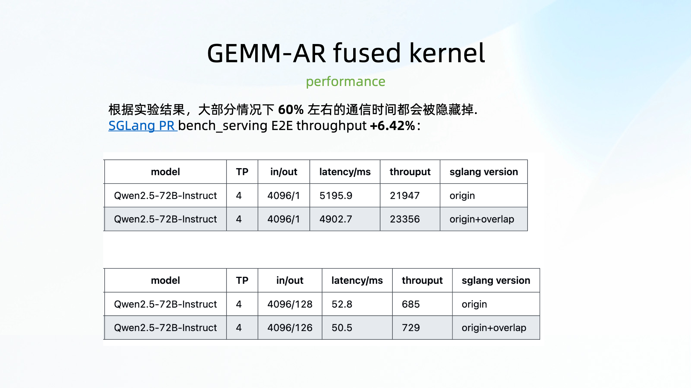

slides의 결론은 communication time 약 60%를 숨길 수 있고, SGLang `bench_serving` end-to-end throughput이 `+6.42%` 향상된다는 것이다.

PR [#15103](https://github.com/sgl-project/sglang/pull/15103)의 data도 이 slide와 맞는다. 테스트 model은 Qwen2.5-72B-Instruct, TP4, B200이다. original throughput과 overlap을 켠 뒤 throughput은 다음과 같다.

```text
original total token throughput: 22633.41 tok/s
overlap  total token throughput: 24086.24 tok/s
```

향상폭은 대략 `6.42%`다.

slides의 table은 prefill과 decode도 나누어 보여준다.

```text
Prefill, Qwen2.5-72B-Instruct, TP4, ISL/OSL=4096/1
origin:          latency 5195.9 ms, throughput 21947 tok/s
origin+overlap:  latency 4902.7 ms, throughput 23356 tok/s

Decode, Qwen2.5-72B-Instruct, TP4, ISL/OSL=4096/128
origin:          latency 52.8 ms, throughput 685 tok/s
origin+overlap:  latency 50.5 ms, throughput 729 tok/s
```

이 숫자는 과장되어 있지 않지만 현실적이다. TP overlap은 GEMM 계산 자체를 더 빠르게 하는 것이 아니라 communication tail의 일부를 숨긴다. end-to-end throughput 관점에서 6% 안팎은 충분히 가져갈 가치가 있는 수익이다. 특히 이 수익은 large model의 각 layer가 지나가는 row parallel projection에서 발생한다.

PR에는 timeline 비교도 붙어 있다. GEMM+AR가 `552us`에서 `423us`로 바뀐다. 이것 역시 slide의 설명과 맞는다. communication이 완전히 사라지는 것이 아니라, 일부가 GEMM의 이후 tile 실행에 가려진다.

## 0xD. 소결

이 GEMM+AR overlap의 main line은 몇 문장으로 압축할 수 있다.

1. RowParallelLinear의 GEMM 뒤에는 반드시 AllReduce가 있으므로, tile을 계산한 직후 AR을 처리하는 것이 전체 GEMM이 끝난 뒤 communication kernel을 띄우는 것보다 overlap 기회가 크다.
2. Blackwell의 TMEM, TMA, NVLS/multimem은 이 fused kernel에 비교적 적절한 hardware window를 제공한다.
3. kernel 내부에서는 warp specialization으로 AR warp group을 나누고, epilogue warp가 MC address에 write하고 flag를 발행하며, AR warp가 tile ready를 기다린 뒤 `ld_reduce + st`를 수행한다.
4. two-shot partition은 각 rank가 tile의 일부만 reduce하고 모든 rank에 broadcast하게 해 중복 작업을 피한다.
5. memory order는 조심해야 한다. data path는 가능한 relaxed로 두고, completion signal과 final sync만 release/sys를 사용한다.
6. SGLang의 현재 공개 PR은 이미 attention `o_proj`와 MLP `down_proj`에 이를 연결했지만, model structure, world size, quantization format, CuTe DSL/NVSHMEM 환경에는 아직 제한이 있다.

이 slides에서 가장 가치 있는 부분은 "communication-computation overlap"을 timeline 설명에 멈추지 않고 instruction과 thread 분업까지 직접 내린다는 점이라고 생각한다. 어느 warp가 flag를 발행하고, 어느 warp가 spin wait하며, 어떤 multimem instruction이 reduce하고, 어떤 store가 broadcast하는지, 마지막에 어떤 scope의 barrier로 마무리하는지를 보여준다. 이런 발표는 하기는 어렵지만 kernel을 쓰는 사람에게는 매우 유용하다.

앞으로 이 경로가 계속 진행된다면 자연스러운 방향은 group GEMM + AR, FP8 blockwise scale 지원, 더 안정적인 SGLang mainline integration일 것이다. 특히 MoE model에서 MLP down projection의 group GEMM도 비슷한 granularity로 overlap할 수 있다면 수익 공간이 더 흥미로워질 것이다.

