# Ant 오픈소스 x SGLang Meetup 기술 회고 해설 - DeepSeek 시리즈 모델을 위한 심층 최적화와 실전

> 이 글은 2026년 1월 17일 Ant 오픈소스 x SGLang Meetup의 "Ant Theta: DeepSeek 시리즈 모델을 위한 심층 최적화와 실전" 발표 replay 해설이다. 원본 slides는 H20-96G에서 DeepSeek-R1/V3/V3.1/V3.2를 deploy하기 위한 engineering optimization 전체를 다룬다. 여기서는 각 page 뒤의 SGLang PR, DeepEP/DeepGEMM/FlashMLA code path와 implementation detail을 최대한 이어서 설명한다.

## 0x0. 서문


이번 sharing의 주인공은 Ant Theta team이 H20-96G 위에서 수행한 DeepSeek series model inference optimization practice다. 이것은 단일 kernel optimization이 아니라 deployment shape, Prefill, Decode, MoE communication, Expert Load Balance, speculative decoding, observability/diagnosis, DeepSeek-V3.2 DSA support까지 포함하는 full-stack solution이다.

slides와 public PR을 함께 보면, 이 optimization의 main line은 어떤 trick 하나가 아니라 H20 hardware characteristic을 매우 세밀하게 활용한다는 데 있다. H20은 H800보다 compute가 약하지만 memory capacity, bandwidth, NVLink는 나쁘지 않다. 따라서 Prefill과 Decode를 하나의 fixed pattern으로 처리하면 안 되고, deployment를 분리한 뒤 bottleneck별로 optimize해야 한다.

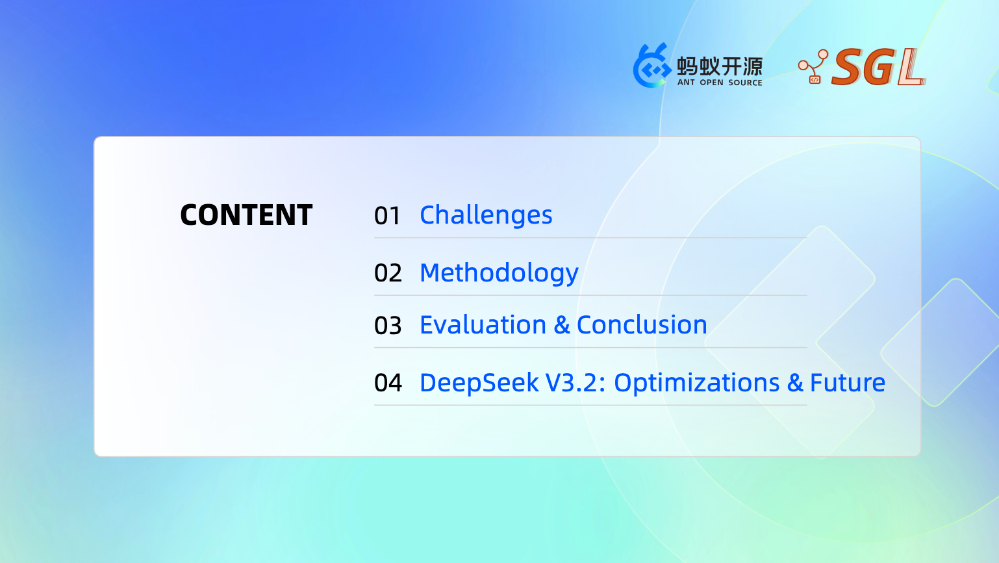

public PR 관점에서 보면, 이번 slides의 여러 optimization은 SGLang과 Ant fork PR에서 대응 implementation을 찾을 수 있다. 중요한 entry는 AntGroup deployment summary PR인 [Deploying DeepSeek-R1 on H20-96G with SGLang: Best Practices](https://github.com/antgroup/sglang/pull/4)다. merge를 위한 PR이 아니라 reproduction image, startup parameters, profile links, related PR을 한 곳에 모아 둔 PR이며, 뒤의 많은 clue가 여기서 출발한다.

이 optimization set은 LMSYS blog [Together with SGLang: Best Practices for Serving DeepSeek-R1 on H20-96G](https://www.lmsys.org/blog/2025-09-26-sglang-ant-group/)와도 대응한다. blog는 H20 challenge, Prefill/Decode separation, FP8 FlashMLA, SwapAB, SBO, Expert Affinity EPLB, DeepXTrace를 production deployment 관점에서 이어 설명한다. 이 글은 slides와 PR code를 따라 implementation detail을 더 펼친다.

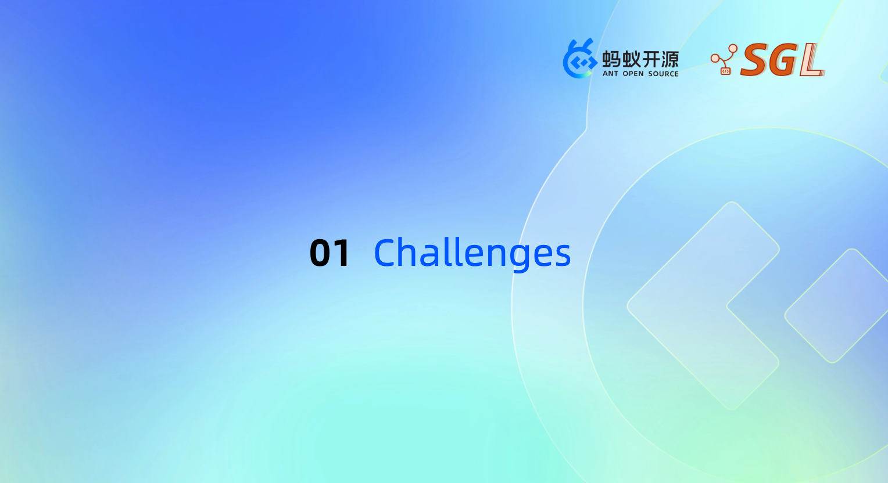

Slides의 agenda는 Challenges, Methodology, Evaluation & Conclusion, DeepSeek V3.2 네 part로 나뉜다. 아래도 같은 순서로 설명하되, Methodology의 code implementation에 더 초점을 둔다.

## 0x1. H20-96G의 제약

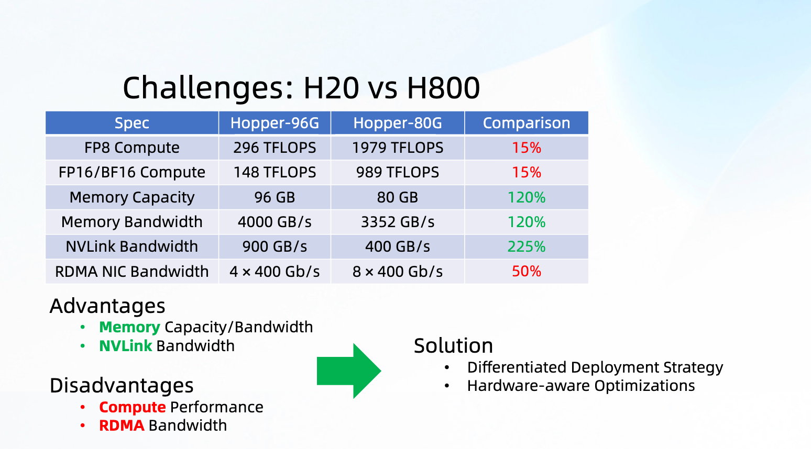

이 page는 먼저 H20과 H800의 hardware difference를 보여준다. H20-96G는 H800-80G와 비교하면 다음 특징을 갖는다.

- FP8 / BF16 peak compute는 H800의 약 15%뿐이다.
- memory capacity는 96GB로 H800의 80GB보다 크다.
- memory bandwidth는 4000GB/s로 H800의 3352GB/s보다 높다.
- NVLink bandwidth는 900GB/s로 H800의 400GB/s보다 훨씬 높다.
- RDMA NIC bandwidth는 H800의 절반뿐이다.

따라서 H20은 "전반적으로 더 약한" card가 아니라 매우 편향된 card다. compute는 약하지만 memory와 single-node interconnect condition은 좋다. 이 특성은 뒤의 deployment strategy를 직접 결정한다.

- Prefill stage는 attention, long context, TTFT에 더 민감하므로 single request latency를 control해야 한다.
- Decode stage는 small batch에서의 MoE, cross-card communication, TPOT에 더 민감하므로 per-token stable latency를 control해야 한다.
- cross-node RDMA는 약점이므로 node-local NVLink에 둘 수 있는 것은 최대한 node 안에 둔다.
- memory가 충분히 크므로 Decode를 더 큰 DP/EP 형태로 만들어 smaller failure domain과 better throughput을 얻을 수 있다.

## 0x2. Prefill/Decode 분리

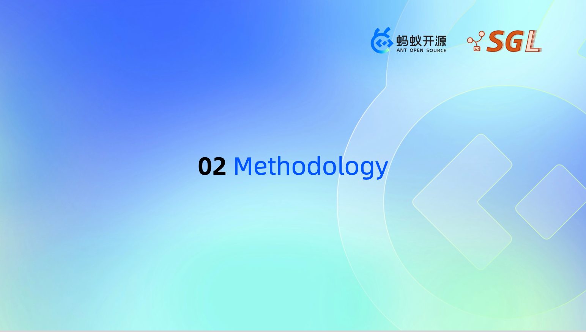

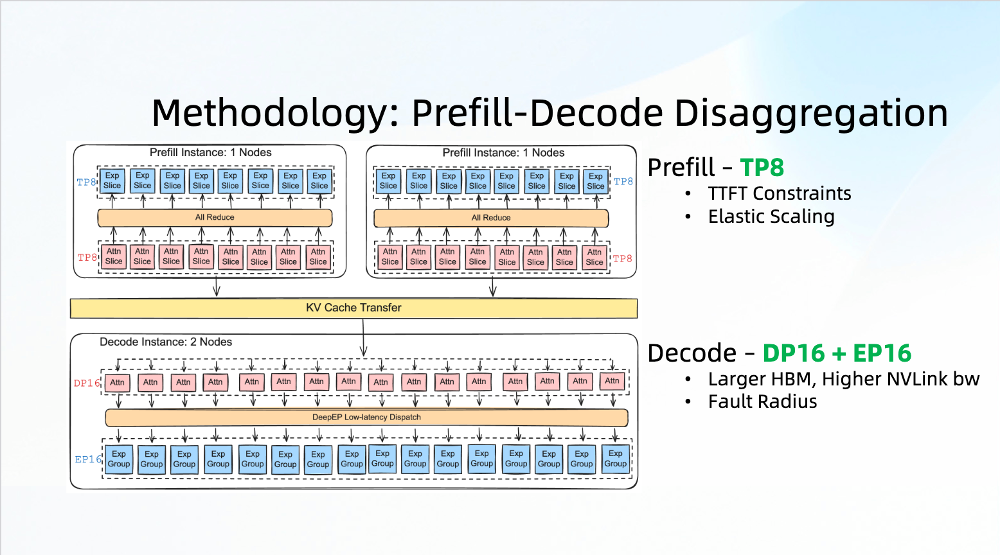

여기의 deployment strategy는 전형적인 PD disaggregation이다.

- Prefill은 TP8을 사용한다. goal은 TTFT constraint를 만족하고, traffic에 따라 Prefill node를 elastic scale하는 것이다.
- Decode는 DP16 + EP16을 사용한다. H20-96G는 memory가 더 크고 NVLink bandwidth도 높으므로, Decode attention은 DP로, MoE는 EP로 처리해 불필요한 TP communication을 줄이는 데 적합하다.

Ant reproduction PR은 매우 구체적인 startup parameters를 제공한다. Prefill side는 대략 다음과 같다.

```bash
PYTHONUNBUFFERED=1 \
SGL_CHUNKED_PREFIX_CACHE_THRESHOLD=0 \
python3 -m sglang.launch_server \
  --model-path /path/to/DeepSeek-R1 \
  --disaggregation-mode prefill \
  --tp-size 8 \
  --attention-backend fa3 \
  --chunked-prefill-size 16384 \
  --quantization fp8 \
  --kv-cache-dtype fp8_e4m3
```

Decode side의 key parameters는 다음과 같다.

```bash
PYTHONUNBUFFERED=1 \
SGL_ENABLE_JIT_DEEPGEMM=1 \
SGLANG_DEEPEP_NUM_MAX_DISPATCH_TOKENS_PER_RANK=96 \
ENABLE_SWAPAB=1 \
python3 -m sglang.launch_server \
  --model-path /path/to/DeepSeek-R1 \
  --disaggregation-mode decode \
  --attention-backend flashmla \
  --nnodes 2 \
  --tp-size 16 \
  --dp-size 16 \
  --enable-dp-attention \
  --moe-dense-tp-size 1 \
  --enable-deepep-moe \
  --enable-dp-lm-head \
  --cuda-graph-max-bs 48 \
  --speculative-algorithm NEXTN \
  --speculative-num-steps 1 \
  --speculative-eagle-topk 1 \
  --speculative-num-draft-tokens 2 \
  --init-expert-location /root/expert_workload.json \
  --moe-a2a-backend deepep \
  --deepep-mode low_latency_overlap \
  --enable-single-batch-overlap
```

이 parameter group은 뒤의 optimization을 거의 모두 잇는다. Prefill side에는 `fa3`, chunked prefix, TP scattered input이 있고, Decode side에는 `flashmla`, DP attention, DeepEP low latency, SwapAB, SBO, Expert location initialization, NEXTN/Eagle이 있다.

## 0x3. Prefill 최적화

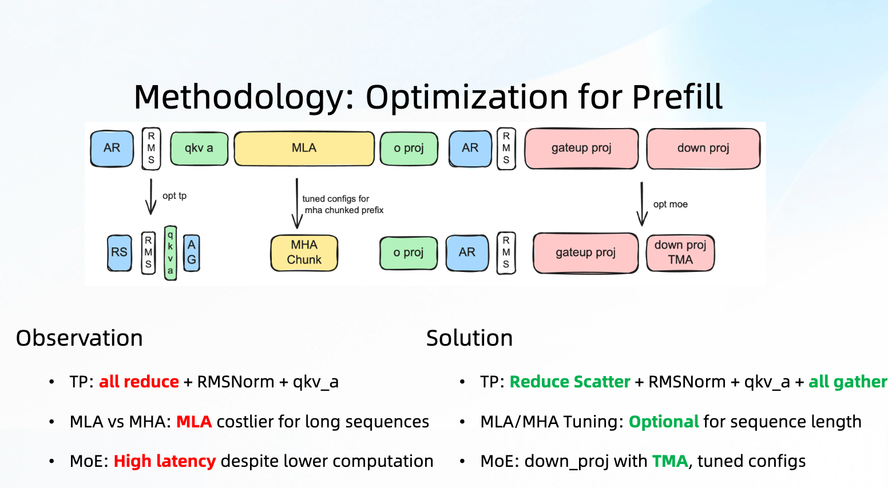

Prefill page는 세 main bottleneck을 나열한다.

- TP communication 직후 RMSNorm과 `qkv_a`가 따라오며, original path에서는 많은 operator가 full hidden을 처리한다.
- chunked prefix에서 MLA/MHA 선택은 항상 MLA가 더 나은 것은 아니다.
- MoE compute amount는 더 작지만 down projection latency가 비정상적으로 크다.

대응하는 public PR은 주로 세 개다.

- [#10568 Opt tp: tp attn support tp reduce scattered input](https://github.com/sgl-project/sglang/pull/10568)
- [#10953 Opt MHA chunked prefix: merge prefix and extend kv cache to run mha once](https://github.com/sgl-project/sglang/pull/10953)
- [#10567 Opt fused triton moe: add tma for down proj kernel](https://github.com/sgl-project/sglang/pull/10567)

### 0x3.1 TP Reduce Scatter + RMSNorm + qkv_a

PR [#10568](https://github.com/sgl-project/sglang/pull/10568)의 core는 직관적이다. 원래는 다음이었다.

```text
embed/mlp all reduce + RMSNorm + fused_qkv_a_proj_with_mqa
```

optimization 뒤에는 이렇게 바뀐다.

```text
embed/mlp reduce scatter + RMSNorm + fused_qkv_a_proj_with_mqa + all gather
```

왜 절약되는가? TP8에서 `RMSNorm`과 `fused_qkv_a_proj_with_mqa`는 원래 full hidden을 처리해야 했다. 이제 먼저 reduce-scatter를 수행하므로 각 card는 token shard 1/8만 처리한다. 이후 all-gather할 때 마지막 dimension은 이미 hidden size 7168에서 `(q_lora_rank + kv_lora_rank + qk_rope_head_dim)`, 즉 `1536 + 512 + 64`로 바뀌어 communication volume이 크게 줄어든다.

PR의 16K chunked prefill profile data는 대표적이다.

- `fused_qkv_a_proj_with_mqa`는 205.1ms에서 26.14ms로 줄었다.
- communication total latency는 267.1ms에서 249.63ms로 줄었다.
- `RMSNorm`은 82.303ms에서 43.398ms로 줄었다.
- input length 1000/2000/4000/4096에서 request throughput은 각각 12.82/6.52/2.49/2.41 req/s에서 14.22/7.33/2.72/2.63 req/s로 올랐다.

현재 SGLang code에서 이 optimization은 `--enable-attn-tp-input-scattered`가 control한다. `AttnTpContext`는 일련의 constraint를 검사하며, DeepSeek MLA처럼 `q_lora_rank`가 non-null이고, TP가 1보다 크며, DP attention, MoE A2A, EAGLE3 등을 사용하지 않는 조건에서만 enable한다.

```python
class AttnTpContext:
    def init_context(self, q_lora_rank, is_nsa):
        self.allow_input_scattered = (
            get_global_server_args().enable_attn_tp_input_scattered
            and (_is_cuda or _is_npu)
            and q_lora_rank is not None
            and not is_nsa
            and get_tensor_model_parallel_world_size() > 1
            and not is_dp_attention_enabled()
            and get_moe_a2a_backend().is_none()
            and not enable_moe_dense_fully_dp()
            and get_global_server_args().disable_piecewise_cuda_graph
            and get_global_server_args().speculative_algorithm != "EAGLE3"
        )

    def use_input_scattered(self, forward_batch: ForwardBatch):
        return (
            self.allow_input_scattered
            and forward_batch.forward_mode.is_extend()
            and not forward_batch.forward_mode.is_target_verify()
            and not forward_batch.forward_mode.is_draft_extend()
            and forward_batch.input_ids is not None
            and not forward_batch.can_run_tbo
        )
```

뒤에서 attention이 실제로 full hidden을 필요로 하면 `fetch_hidden_states()`에서 TP all-gather를 한 번 수행한다.

```python
def fetch_hidden_states(self):
    if self.hidden_states_ is not None:
        return self.hidden_states_
    self.hidden_states_ = self.hidden_states_local
    if get_attn_tp_context().input_scattered:
        self.hidden_states_ = self.tp_all_gather_hidden_states(
            self.hidden_states_, self.forward_batch
        )
    return self.hidden_states_
```

이 optimization은 "수학은 바꾸지 않고 intermediate tensor가 언제 full shape가 되는지만 바꾸는" 유형이며, benefit도 이 timing adjustment에서 나온다.

### 0x3.2 Chunked Prefix에서 MHA One-Shot

PR [#10953](https://github.com/sgl-project/sglang/pull/10953)는 다른 Prefill 문제를 해결한다. DeepSeek MLA는 long context에서 유용하지만, chunked prefix cache 아래에서 prefix와 extend를 분리해 MHA를 돌리고 `merge_state`로 합치면 중간에 여러 copy, type conversion, extra attention call이 생긴다. 이 PR의 strategy는 `seq_lens <= 128K`일 때 prefix KV와 extend KV를 합쳐 `attn_mha`를 한 번만 실행하는 것이다.

PR은 환경 변수로 MHA path로 직접 전환하라고 제안한다.

```bash
export SGL_CHUNKED_PREFIX_CACHE_THRESHOLD=0
```

현재 code에서 attention backend handler는 `fa3`, `flashinfer`, `flashmla` backend에서 `MHA_ONE_SHOT` path를 사용할 수 있는지 판단한다.

```python
MHA_ONE_SHOT_SUPPORTED_BACKENDS = ["fa3", "flashinfer", "flashmla"]

def _support_mha_one_shot(attn, forward_batch, backend_name):
    attn_supported = backend_name in MHA_ONE_SHOT_SUPPORTED_BACKENDS
    sum_seq_lens = (
        sum(forward_batch.seq_lens_cpu) if forward_batch.seq_lens_cpu is not None else 0
    )
    return attn_supported and sum_seq_lens <= forward_batch.get_max_chunk_capacity()

def _handle_attention_backend(attn, forward_batch, backend_name):
    ...
    if forward_batch.forward_mode.is_extend_without_speculative():
        if _support_mha_one_shot(attn, forward_batch, backend_name):
            return AttnForwardMethod.MHA_ONE_SHOT
        return AttnForwardMethod.MHA_CHUNKED_KV
    else:
        return _dispatch_mla_subtype(attn, forward_batch)
```

`forward_mha.py`는 세 path를 분명하게 설명한다.

```python
# 1. forward_normal: AttnForwardMethod.MHA
#    use multi-head attention with empty kv cache
#
# 2. forward_normal_one_shot: AttnForwardMethod.MHA_ONE_SHOT
#    use multi-head attention with short kv prefix length
#    the kv latent vectors are fetched from memory pool,
#    with combined kv_indices of prefix part and extended part
#
# 3. forward_normal_chunked_kv: AttnForwardMethod.MHA_CHUNKED_KV
#    multiple phases of multi-head attention with chunked kv cache
#    acc_o_i, acc_lse_i = merge_state(...)
```

benchmark도 문제를 잘 보여준다. prefix/extend가 섞인 example에서:

- BF16에서 MLA는 117us, optimization 전 MHA chunked KV는 193us, MHA merged KV는 101us다.
- FP8에서 MLA는 373us이고 그중 FP8 KV cache cast가 244us다. MHA chunked KV는 227us, MHA merged KV는 125us다.

따라서 slides의 "MLA vs MHA tuning optional by seq len"은 일반론이 아니다. 비교적 짧고 one-shot에 들어갈 수 있으면 MHA가 더 싸다.

### 0x3.3 FusedMoE Down Projection TMA

이 부분은 이전에 별도 글 [SGLang Optimizing Triton FusedMoE의 새로운 기법](./SGLang%20%E4%BC%98%E5%8C%96Triton%20FusedMoE%20%E7%9A%84%E4%B8%80%E4%B8%AA%E6%96%B0%E6%8A%80%E5%B7%A7%E2%80%8B.md)으로 쓴 적이 있다. 여기서는 그 main idea를 그대로 따른다.

H20(96GB) TP8 prefill profile에서 author는 이상한 현상을 발견했다. 각 layer의 두 번째 MoE, 즉 down projection의 Fused Triton MoE latency가 첫 번째 up projection과 비슷했다. 하지만 down projection의 weight data volume과 compute amount는 up projection의 절반밖에 되지 않는다. 이는 분명히 비정상적이다.

PR [#10567](https://github.com/sgl-project/sglang/pull/10567)은 이 문제에 대해 여러 optimization을 수행했다.

- FP8 block quant에서 `b_scale` read와 computation을 optimize한다.
- TMA 기반으로 down projection의 input A와 weight B access를 restructure한다.
- real inference process에서 수집한 `topk_ids`로 tuning한다.
- up projection과 down projection이 서로 다른 tuned config를 load한다.

PR의 key number는 down projection compute utilization이 **45.20%에서 81.12%**로 올라갔고, 8K tokens scenario에서 100 sample average latency가 **2.430ms에서 1.435ms**로 줄었다는 것이다.

real topk tuning flow도 실용적이다. 먼저 inference 중 각 layer의 `topk_ids`를 저장한다.

```python
# DeepseekV2MoE::forward_normal
if hidden_states.shape[0] == 16384 and get_tensor_model_parallel_rank() == 0:
    topk_ids_dir = xxxx
    if not hasattr(self, "save_idx"):
        self.save_idx = 0
    if self.save_idx <= 1:
        torch.save(
            topk_output.topk_ids,
            f"{topk_ids_dir}/topk_idx_layer{self.layer_id}_idx{self.save_idx}.pt",
        )
    self.save_idx += 1
```

그 다음 `tuning_fused_moe_triton_sep.py`로 real distribution에 대해 tuning한다.

```bash
python benchmark/kernels/fused_moe_triton/tuning_fused_moe_triton_sep.py \
    --model $model_path \
    --tp-size 8 \
    --dtype fp8_w8a8 \
    --topk-ids-dir ${topk_ids_dir} \
    --tune
```

이 과정은 config 두 set을 만든다. 하나는 up projection용이고, 다른 하나는 down projection용이며, 후자의 file name에는 `_down`이 붙는다.

현재 SGLang mainline code는 `moe_runner/triton_utils` 아래로 이동했다. 핵심 logic은 `_prepare_fused_moe_run`이 ordinary config와 down config를 동시에 가져오고, down config에서 `USE_TMA`를 읽는 것이다.

```python
config, (down_config, _) = try_get_optimal_moe_config(
    w1.shape,
    (w2.shape[0], w2.shape[1], w2.shape[2] - padded_size),
    topk_ids.shape[1],
    config_dtype,
    num_tokens,
    block_shape=block_shape,
    per_channel_quant=per_channel_quant,
    return_down_config=True,
)
down_moe_use_tma = (
    _down_moe_use_tma()
    and down_config is not None
    and down_config.pop("USE_TMA", False)
)
```

TMA를 enable하면 up projection output을 down projection이 원하는 order로 미리 write한다.

```python
invoke_fused_moe_kernel(
    hidden_states,
    w1,
    ...,
    config,
    ...,
    c_sorted=down_moe_use_tma,
)
```

이어 down projection kernel call은 input A와 weight B를 모두 TMA descriptor path로 넘긴다.

```python
invoke_fused_moe_kernel(
    intermediate_cache2,
    w2,
    ...,
    down_config or config,
    ...,
    a_use_tma=down_moe_use_tma,
    b_use_tma=down_moe_use_tma,
)
```

이것이 slides의 "MoE down_proj with TMA, tuned configs" 뒤의 핵심이다. 단순히 TMA flag 하나를 더하는 것이 아니라, 먼저 real expert distribution으로 tuning하고, up kernel output layout이 down kernel의 TMA access를 위해 봉사하게 만든다.

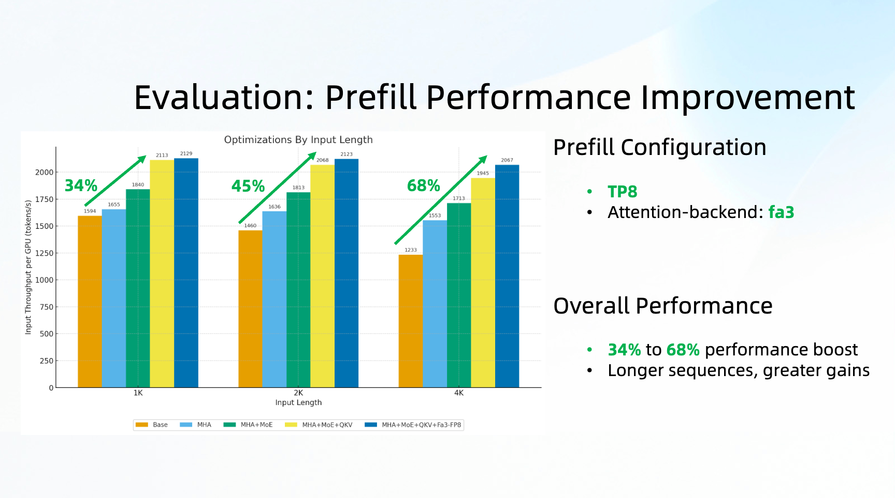

Prefill evaluation page의 improvement도 앞의 세 optimization과 잘 맞는다. input이 길수록 attention과 MoE가 TTFT에서 차지하는 비중이 커지므로 gain이 더 뚜렷해진다. Slides의 overall improvement는 다음과 같다.

- 1K input: 34% improvement
- 2K input: 45% improvement
- 4K input: 68% improvement

## 0x4. Decode 최적화 1: SwapAB GEMM

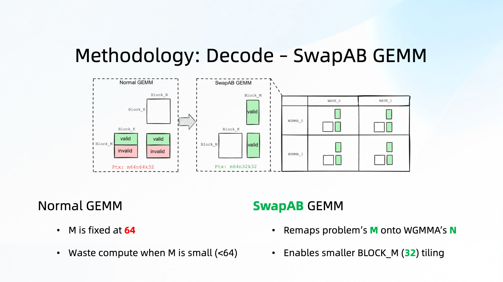

Decode의 MoE는 Prefill과 다르다. Prefill은 token이 많아 GEMM의 M이 비교적 크다. Decode는 small batch라서 매번 MoE로 들어가는 token 수가 적다. Hopper WGMMA의 `block_m`은 흔히 64 granularity인데, actual M이 64보다 작으면 많은 invalid computation이 생긴다.

이 page의 SwapAB는 본질적으로 original GEMM의 small M dimension을 WGMMA가 더 편하게 처리할 수 있는 dimension에 mapping하는 것이다. DeepGEMM side에서는 [deepseek-ai/DeepGEMM#192](https://github.com/deepseek-ai/DeepGEMM/pull/192) PR이 대응하며, title은 `support swapAB for m_grouped_fp8_gemm_nt_masked`다. PR description은 매우 직접적이다.

- `BLOCK_M = 32` 또는 `M % 64 < 32` case에서 gain이 뚜렷하다.
- 방식은 `Swap A B: WGMMA::wgmma(desc_b, desc_a, accum, k)`다.
- H20에서 `BLOCK_N=256`이 중요한 configuration이다.
- `export ENABLE_SWAPAB=1`로 enable한다.

SGLang mainline에도 대응 implementation chain이 있다.

- [#15712 Add SwapAB Optimization for triton fused_moe_kernel on SM90](https://github.com/sgl-project/sglang/pull/15712)
- [#16723 Rework Add SwapAB Optimization for triton fused_moe_kernel on SM90](https://github.com/sgl-project/sglang/pull/16723)
- [#17133 Optimize fused moe configs for H20 & H20-3E based on swapab](https://github.com/sgl-project/sglang/pull/17133)
- [#17965 Triton TP MoE Dpsk V3/Qwen3 Coder with SwapAB](https://github.com/sgl-project/sglang/pull/17965)

현재 Triton FusedMoE kernel에서 SwapAB enable 판단은 매우 제한적이다.

```python
# swap_ab benefits SM90 GPUs (H20, H100, H200, etc.) for certain block shapes.
@functools.lru_cache(maxsize=8)
def should_enable_swap_ab(
    BLOCK_SIZE_M: int,
    BLOCK_SIZE_N: int,
) -> bool:
    if not _is_cuda or is_batch_invariant_mode_enabled():
        return False

    return is_sm90_supported() and BLOCK_SIZE_M < 64 and BLOCK_SIZE_N >= 64
```

즉 SM90이고 `BLOCK_SIZE_M < 64`, `BLOCK_SIZE_N >= 64`인 경우에만 이 path를 탄다. kernel에 들어가면 accumulator shape도 반대로 잡힌다.

```python
if swap_ab:
    accumulator = tl.zeros((BLOCK_SIZE_N, BLOCK_SIZE_M), dtype=tl.float32)
else:
    accumulator = tl.zeros((BLOCK_SIZE_M, BLOCK_SIZE_N), dtype=tl.float32)
```

FP8 dot 전에 A/B와 scale도 swap된다.

```python
if swap_ab:
    a, b = tl.trans(b, (1, 0)), tl.trans(a, (1, 0))
    a_scale, b_scale = b_scale, a_scale
...
accumulator += tl.dot(a, b) * a_scale[:, None] * b_scale[None, :]
```

마지막에는 accumulator를 다시 transpose해서 write한다.

```python
if swap_ab:
    accumulator = tl.trans(accumulator, (1, 0))
```

이 implementation은 짧지만 그 뒤의 point는 중요하다. Decode small batch에서 실제로 작은 token dimension을 WGMMA의 M dimension에 억지로 맞추지 말아야 한다. A/B를 swap하면 small M의 waste가 훨씬 줄어든다.

PR [#17965](https://github.com/sgl-project/sglang/pull/17965)는 H200 end-to-end data를 제공한다. DeepSeek-V3.1 TP8에서 2048 tokens decode는 18.790s에서 17.074s로 줄고, speed는 109.00 token/s에서 119.95 token/s로 올라 약 8% improvement를 보인다. Qwen3 Coder spec decode scenario도 172.27 token/s에서 186.87 token/s로 올랐다.

### 0x4.1 Decode Attention: FP8 FlashMLA

Decode startup parameter는 `--attention-backend flashmla`를 사용하고, Ant summary PR도 [deepseek-ai/FlashMLA#82](https://github.com/deepseek-ai/FlashMLA/pull/82)를 FP8 MLA related optimization으로 따로 나열한다. 이 PR의 theme은 new FP8 MLA pipeline이다.

이전 BF16 / FP8 MLA와 비교하면 주로 다음을 수행한다.

- WGMMA FP8을 사용하고, Q와 KV가 모두 FP8 dtype을 탄다.
- shared memory usage를 줄이고 `sP0/sP1/sVt0/sVt1`를 재구성해 ping-pong을 수행한다.
- TMA copy와 WGMMA 사이 pipeline을 더 fine-grained하게 schedule한다.
- transposed V pipeline을 다시 구성하고, 4 named barriers로 4 buffer 사이를 switch한다.
- 128-bit STSM/LDSM으로 `rP`와 `sP` 사이 data를 이동한다.
- fine-grained QK tiles 덕분에 ROPE를 BF16으로 계산할 수 있어, 기존 FP8 path의 precision issue를 고친다.

code level에서는 주로 `csrc/sm90/kernels/splitkv_mla_fp8.cu`가 추가되었고, `traits.h`, `utils.h`, `fp8_transpose_v.h`, `flash_mla_interface.py`도 수정되었다. 이 files는 각각 kernel traits, FP8 transposed V, SM90 utility function, Python entry에 대응한다.

PR의 H20 data에서 cache length=8196, head_num=64일 때 batch size 32/48/64/128에서 new FP8 MLA는 BF16 MLA 대비 69%/62%/62%/74% improvement를 보이고, 이전 FP8 PR 대비로도 약 5% improvement가 있다. Decode side에서는 small batch MoE 외에도 attention backend line이 중요하다. 그렇지 않으면 MoE optimization 뒤 bottleneck이 빠르게 MLA로 이동한다.

## 0x5. Decode 최적화 2: TBO를 쓰지 않고 SBO로 바꾸는 이유

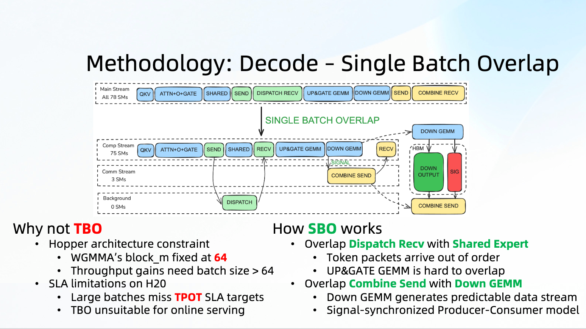

이 page의 왼쪽은 왜 H20 Decode에서 Two-Batch Overlap(TBO)이 이상적이지 않은지 설명한다. Hopper architecture에서 WGMMA의 `block_m`은 보통 64로 fixed되어 있고, small batch Decode의 MLP GEMM에는 redundant computation이 생긴다. TBO는 batch size가 64보다 커야 throughput gain을 얻기 쉬운데, H20은 compute가 약하므로 large batch가 TPOT SLA를 밀어 올린다. 그래서 slides에는 TBO unsuitable for online serving이라고 적혀 있다.

오른쪽은 SBO의 방법이다. overlap은 두 갈래다. 첫 번째는 Dispatch Recv와 Shared Expert overlap이다. DeepEP가 token packet을 받는 순서는 뒤섞일 수 있지만 shared expert는 remote expert result에 의존하지 않으므로 먼저 계산할 수 있다. slides도 UP&GATE GEMM은 dispatch 뒤 routed token이 더 완전해져야 하므로 overlap하기 어렵다고 표시한다. 두 번째는 Combine Send와 Down GEMM overlap이다. down projection output은 token/block 단위로 점진적으로 생성되고 dataflow가 더 predictable하므로 signal-synchronized producer-consumer에 적합하다. public implementation은 [#9660 Single Batch Overlap for MoE Models](https://github.com/sgl-project/sglang/pull/9660)에 대응한다. Motivation도 slides와 거의 같다. small batch에서는 TBO positive gain이 충분히 stable하지 않아 single batch에도 effective한 overlap이 필요하다.

## 0x6. Decode 최적화 3: SBO code path

SBO는 두 overlap을 수행한다.

1. Shared Expert computation과 Dispatch Recv communication overlap
2. Down GEMM computation과 Combine Send communication overlap

이 chain은 세 repository를 포함한다.

- SGLang integration PR: [sgl-project/sglang#9660](https://github.com/sgl-project/sglang/pull/9660)
- DeepEP communication-side PR: [deepseek-ai/DeepEP#390](https://github.com/deepseek-ai/DeepEP/pull/390). SGLang PR body는 후속 DeepEP [#483](https://github.com/deepseek-ai/DeepEP/pull/483)도 언급한다.
- DeepGEMM computation-side PR: [deepseek-ai/DeepGEMM#183](https://github.com/deepseek-ai/DeepGEMM/pull/183). SGLang PR body는 `sgl-project/DeepGEMM#14`도 언급한다.

Down GEMM과 Combine Send의 overlap은 producer-consumer model이다. 각 local expert에 대해 `block_m` token granularity로 signal을 배정한다. Down GEMM이 어떤 `block_m`을 계산하면 atomic으로 signal을 update한다. Combine Send는 signal을 polling하고 threshold에 도달하면 해당 token을 send한다.

현재 SGLang의 `single_batch_overlap.py`는 overlap parameter를 계산한다. key fields는 다음과 같다.

```python
@dataclass
class CombineOverlapArgs:
    # this "overlap" flag means overlapping with down gemm
    overlap: bool
    stream: torch.cuda.Stream
    wait_event: torch.cuda.Event
    num_sms: Optional[int] = None
    signal: Optional[torch.Tensor] = None
    block_m: Optional[int] = 64
    threshold: Optional[int] = 0

@dataclass
class DownGemmOverlapArgs:
    num_sms: int
    signal: torch.Tensor
    start_event: torch.cuda.Event
```

`compute_overlap_args`는 SM을 communication part와 computation part로 나눈다. Hopper에서는 default로 communication에 3 SM을 쓰고 나머지를 DeepGEMM에 준다.

```python
if envs.SGLANG_DEEPEP_LL_COMBINE_SEND_NUM_SMS.is_set():
    communicate_num_sms = envs.SGLANG_DEEPEP_LL_COMBINE_SEND_NUM_SMS.get()
else:
    communicate_num_sms = 32 if is_blackwell() else 3
compute_num_sms = total_num_sms - communicate_num_sms
```

Down GEMM + Combine Send overlap을 enable하면 signal을 만들고, signal을 combine과 down gemm에 동시에 전달한다.

```python
combine_signal_size = num_local_experts * (
    (num_tokens_static + MIN_BLOCK_M - 1) // MIN_BLOCK_M
)
combine_signal = torch.zeros(
    combine_signal_size, dtype=torch.int32, device=hidden_states.device
)

down_gemm_overlap_args = DownGemmOverlapArgs(
    signal=combine_signal,
    start_event=combine_wait_event,
    num_sms=compute_num_sms,
)
combine_overlap_args.overlap = True
combine_overlap_args.signal = combine_signal
combine_overlap_args.threshold = compute_num_sms
```

`DeepseekV2MoE`에서 SBO는 hook으로 DeepEP dispatcher에 들어간다. Dispatch 후 overlap args를 계산하고 각각 dispatcher와 experts runner에 넣는다.

```python
def _post_dispatch_hook(dispatcher: BaseDispatcher, dispatch_output: DispatchOutput):
    combine_overlap_args, down_gemm_overlap_args, meta_overlap_args = (
        compute_overlap_args(dispatch_output, self.alt_stream)
    )
    dispatcher.set_overlap_args(
        combine_overlap_args=combine_overlap_args,
        meta_overlap_args=meta_overlap_args,
    )
    self.experts.set_overlap_args(
        down_gemm_overlap_args=down_gemm_overlap_args,
        meta_overlap_args=meta_overlap_args,
    )
```

DeepEP combine side는 이 parameters를 `low_latency_combine`에 넘긴다.

```python
overlap_args_dict = dict(
    overlap=overlap_args.overlap,
    packed_recv_count=self.packed_recv_count,
    comp_signal=overlap_args.signal,
    block_m=meta_overlap_args["block_m"],
    threshold=meta_overlap_args["threshold"],
    num_sms=overlap_args.num_sms,
)

combined_hidden_states, event, hook = buffer.low_latency_combine(
    x=hidden_states,
    topk_idx=topk_ids,
    topk_weights=topk_weights,
    handle=self.handle,
    async_finish=not self.return_recv_hook,
    return_recv_hook=self.return_recv_hook,
    **overlap_args_dict,
)
```

DeepGEMM runner side는 signal GEMM return value에서 dynamic `block_m`과 `threshold`를 얻어 `meta_overlap_args`에 다시 write하고, combine이 이를 사용하게 한다.

```python
deep_gemm_return_value = deep_gemm_wrapper.grouped_gemm_nt_f8f8bf16_masked(
    (down_input, down_input_scale),
    (w2_weight, w2_scale),
    down_output,
    masked_m,
    expected_m,
    **gemm_overlap_args_dict,
)
meta_overlap_args = running_state.get("meta_overlap_args", None)
if meta_overlap_args is not None:
    block_m, threshold = deep_gemm_return_value
    meta_overlap_args["block_m"] = block_m
    meta_overlap_args["threshold"] = threshold
```

DeepEP PR [#390](https://github.com/deepseek-ai/DeepEP/pull/390)은 `low_latency_dispatch`가 token의 `src_rank`를 기록하는 것과, `internode_ll::combine`이 overlap mode에서 SM을 줄이고 signal을 polling하며 token을 send하고 finish flag를 write하는 것에 대응한다. DeepGEMM PR [#183](https://github.com/deepseek-ai/DeepGEMM/pull/183)은 `m_grouped_fp8_gemm_nt_signal`, `SM90FP8SignalGemm1D2DRuntime`, 그리고 kernel이 해당 `block_m` 계산 후 `atomicAdd`로 signal을 write하는 것에 대응한다.

PR [#9660](https://github.com/sgl-project/sglang/pull/9660)의 end-to-end evaluation은 5 nodes, 각 node 8 H20, Prefill TP8, Decode DP_Attn16 + EP16, input 4096, output 1536이다. bs 32에서 output throughput은 약 6667 tok/s에서 7111/7169 tok/s로 올라갔고, request throughput은 4.34 req/s에서 4.63/4.67 req/s로 올랐으며, average ITL은 73.1ms에서 약 67ms로 내려갔다. online Decode에는 꽤 실질적인 gain이다.

## 0x7. Expert Affinity EPLB

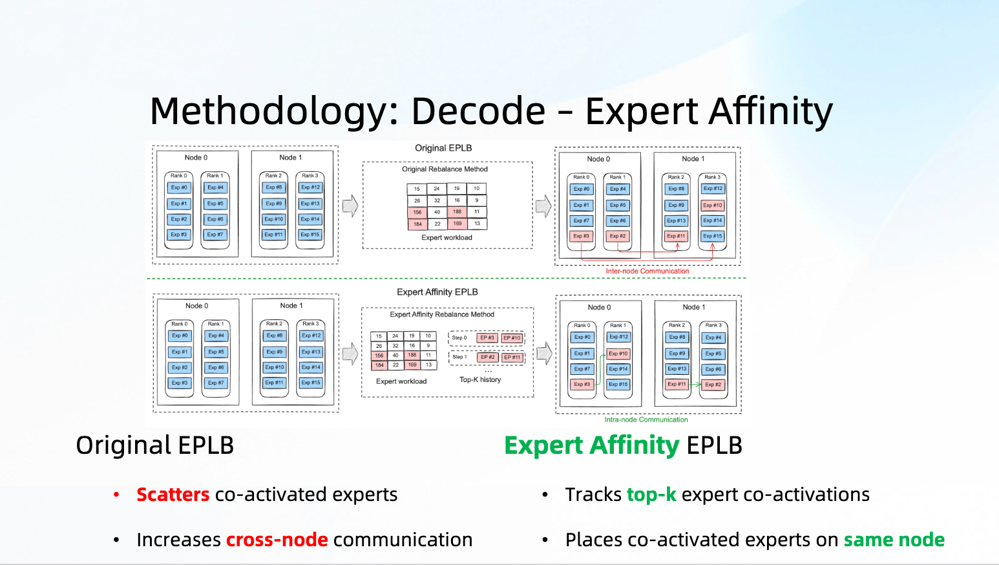

DeepSeek 같은 MoE model의 Expert Load Balance는 단지 "각 card의 compute를 balance"하는 문제가 아니다. standard EPLB는 expert compute load를 최대한 flatten하려 한다. 하지만 자주 함께 활성화되는 experts가 서로 다른 node에 놓이면 cross-node communication이 더 많이 생긴다. H20의 RDMA bandwidth는 약점이므로 이 문제가 더 커진다.

AntGroup의 [#2 feat: Add Expert Affinity Aware EPLB algorithm](https://github.com/antgroup/sglang/pull/2)이 바로 이것을 수행한다. 기존 expert load tracking 위에 매 iteration에서 activated top-k expert groups를 추가로 기록하고, expert co-activation affinity matrix를 계산한 뒤, EPLB load balancing 후 affinity에 따라 placement를 다시 조정하여 자주 함께 등장하는 experts를 가능한 한 같은 node에 둔다.

새로 추가된 `comm_matrix_process.py`는 짧다.

```python
def compute_expert_co_occurrence_matrix(history_data, num_experts):
    history_data = history_data.cpu().numpy()
    num_samples, num_layers, top_k = history_data.shape
    expert_co_occurrence = np.zeros(
        (num_layers, num_experts, num_experts), dtype=np.int64
    )

    for sample_idx in range(num_samples):
        for layer_idx in range(num_layers):
            experts = history_data[sample_idx, layer_idx]
            if (-1 in experts) or (len(set(experts)) < top_k):
                continue
            for i in range(top_k):
                for j in range(i + 1, top_k):
                    expert_i = experts[i]
                    expert_j = experts[j]
                    if expert_i < num_experts and expert_j < num_experts:
                        expert_co_occurrence[layer_idx, expert_i, expert_j] += 1
                        expert_co_occurrence[layer_idx, expert_j, expert_i] += 1
    return torch.tensor(expert_co_occurrence, dtype=torch.int64)

def generate_comm_matrix(history_data, num_experts):
    if history_data.numel() == 0:
        return None
    co_occurrence = compute_expert_co_occurrence_matrix(history_data, num_experts)
    comm_matrix = co_occurrence.float()
    comm_matrix = comm_matrix / comm_matrix.max()
    return comm_matrix
```

즉 같은 token의 top-k experts를 pairwise count하고, 이를 normalize해서 communication matrix로 만든다.

data source는 DeepEP dispatcher다. PR은 `dispatch_a`에서 `topk_idx`를 기록한다.

```python
if topk_idx.numel() > 0:
    get_global_expert_distribution_recorder().record_topk_ids(topk_idx)
else:
    logger.warning("topk_idx is empty in DeepEP low latency dispatch.")
```

placement optimization의 core는 `optimize_group_placement`다. 먼저 physical experts를 group으로 나누고, group-to-node mapping을 구성한 뒤, 각 group의 leader expert로 communication cost를 조회한다. 이후 다른 node의 group swap을 시도하고, swap이 cross-node communication cost를 줄이면 실행한다.

```python
if best_gain > 0 and best_swap:
    node1, g1_idx, node2, g2_idx = best_swap
    g1 = node_groups[node1][g1_idx]
    g2 = node_groups[node2][g2_idx]

    node_groups[node1][g1_idx] = g2
    node_groups[node2][g2_idx] = g1

    for offset in range(group_size):
        idx1 = g1 * group_size + offset
        idx2 = g2 * group_size + offset
        optimized_pphy2log[layer, idx1], optimized_pphy2log[layer, idx2] = \
            optimized_pphy2log[layer, idx2].item(), optimized_pphy2log[layer, idx1].item()

    improved = True
```

이 PR benchmark에서 batch 1536/2048일 때 Expert-Affinity Aware EPLB는 vanilla EPLB 대비 P90-TPOT을 약 84ms에서 약 81ms로, P95-ITL을 약 100ms에서 약 97ms로 낮춘다. PR은 standard EPLB 대비 추가로 약 5% improvement라고 쓴다.

관련 PR로 [sgl-project/sglang#8529](https://github.com/sgl-project/sglang/pull/8529)도 있다. 이는 EPLB async rebalance를 수행한다. background thread가 `logical_count`를 broadcast하고 `ExpertLocationMetadata`를 계산한 뒤, TP barrier와 gloo CPU signal로 모든 rank가 expert location을 atomic하게 switch하도록 보장한다. affinity placement와는 complement 관계다. 하나는 placement strategy를 optimize하고, 하나는 rebalance execution method를 optimize한다.

## 0x8. Hierarchical Dispatch

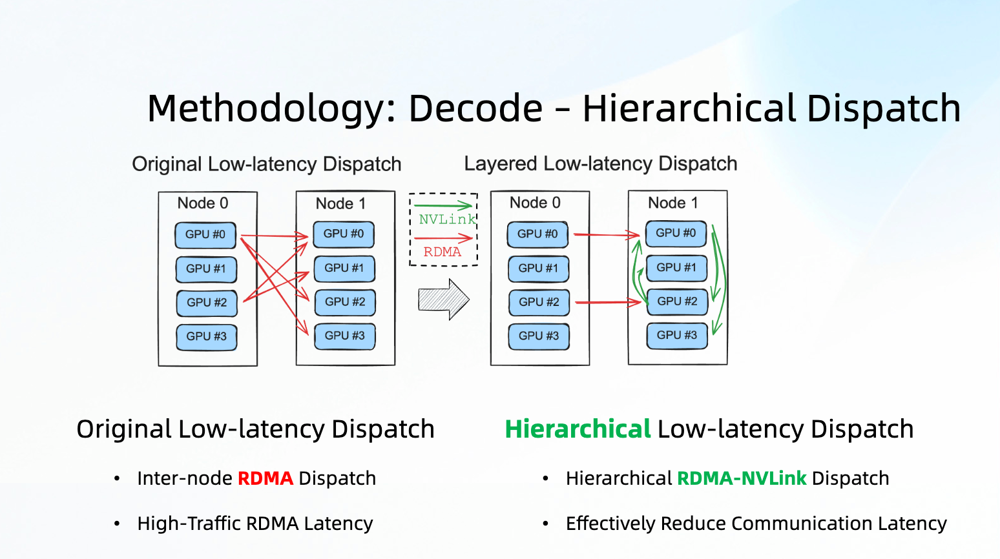

이 slides는 Hierarchical Low-latency Dispatch를 다룬다. original low-latency dispatch는 모든 rank가 inter-node RDMA를 직접 사용하고, high-volume RDMA는 latency를 끌어올린다. hierarchical dispatch의 idea는 먼저 cross-node RDMA로 1st-stage forwarding을 하고, 그 다음 node 안에서 NVLink로 2nd-stage forwarding을 수행하는 것이다. 앞서 본 H20 hardware characteristic을 생각하면 매우 자연스럽다. RDMA는 약점이고 NVLink는 강점이다.

다만 이 page에 대응하는 public PR은 찾지 못했다. `sgl-project/sglang`, `antgroup/sglang`, `deepseek-ai/DeepEP`, DeepGEMM related repositories를 `Hierarchical Dispatch`, `RDMA-NVLink`, `hierarchical dispatch`, `low_latency_dispatch` 같은 keyword로 살펴봤지만, slides의 이 page와 완전히 대응하는 public implementation은 찾지 못했다.

현재 public code에서 맞출 수 있는 base path는 SGLang의 DeepEP low-latency dispatcher, 즉 Decode side의 `--moe-a2a-backend deepep --deepep-mode low_latency_overlap` path다. core call은 `token_dispatcher/deepep.py`에 있다.

```python
DeepEPBuffer.set_dispatch_mode_as_low_latency()
return DeepEPBuffer.get_deepep_buffer(
    self.group,
    self.hidden_size,
    self.params_bytes,
    self.deepep_mode,
    self.num_max_dispatch_tokens_per_rank,
    self.num_experts,
)
```

이 page에 대응하는 code가 나중에 공개되면 우선 볼 위치는 두 곳이다.

- DeepEP의 low-latency dispatch/combine kernel, 특히 inter-node와 intra-node의 hierarchical routing
- SGLang `token_dispatcher/deepep.py`에서 dispatch handle을 조직하는 방식, 그리고 node-local relay 또는 NVLink second-stage dispatch가 등장하는지 여부

여기서는 PR을 억지로 지어내지 않는다. public information으로 확인할 수 있는 것은 direction과 bottleneck이고, concrete implementation이 open되었는지는 확인할 수 없다.

## 0x9. Simple Eagle

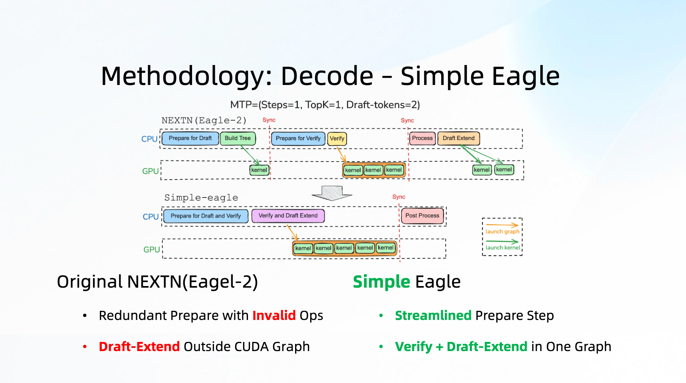

Slides의 Simple Eagle은 두 문제를 말한다.

- original NEXTN/Eagle-2에는 prepare invalid ops가 있다.
- draft-extend가 CUDA Graph 안에 없어 decode graph capture와 replay가 충분히 clean하지 않다.

public PR 중 이 page에 가까운 것은 다음 series다.

- [#11398 Beta spec-overlap for EAGLE](https://github.com/sgl-project/sglang/pull/11398)
- [#11434 move eagle draft post process to cuda graph](https://github.com/sgl-project/sglang/pull/11434)
- [#11643 Abstraction for spec worker and code cleanup](https://github.com/sgl-project/sglang/pull/11643)
- [#11653 Fix 1-step draft model forward](https://github.com/sgl-project/sglang/pull/11653)
- [#12443 spec-overlap supporting DP-ATTN/PD-disaggregation/NPU graph](https://github.com/sgl-project/sglang/pull/12443)

PR [#11398](https://github.com/sgl-project/sglang/pull/11398)은 beta EAGLE v2를 도입했고, `SGLANG_ENABLE_SPEC_V2=1`로 enable한다. initial test에서 Llama3.1 8B + EAGLE speed는 246.80 token/s에서 273.43 token/s로 올랐다.

현재 `eagle_worker_v2.py`의 decode path는 slides에서 말한 "verify + draft extend" pipeline에 꽤 가깝다.

```python
with self.draft_worker.draft_tp_context(
    self.draft_worker.draft_runner.tp_group
), speculative_moe_backend_context(), speculative_moe_a2a_backend_context():
    verify_input: EagleVerifyInput = self.draft_worker.draft(model_worker_batch)

assert verify_input.is_verify_input()
model_worker_batch.spec_info = verify_input
batch_output = self.verify(model_worker_batch)

with self.draft_worker.draft_tp_context(
    self.draft_worker.draft_runner.tp_group
), speculative_moe_backend_context(), speculative_moe_a2a_backend_context():
    self.draft_worker._draft_extend_for_decode(model_worker_batch, batch_output)
return batch_output
```

PR [#11434](https://github.com/sgl-project/sglang/pull/11434)는 draft post-processing을 CUDA Graph로 옮기고, tree-building utility를 `eagle_utils.py`로 정리했다. 현재 `EAGLEDraftExtendCudaGraphRunner`는 draft extend를 위해 static input과 batch sizes를 준비한다.

```python
class EAGLEDraftExtendCudaGraphRunner:
    def __init__(self, eagle_worker: EAGLEWorker, ...):
        ...
        self.forward_mode = ForwardMode.DRAFT_EXTEND_V2
        self.graphs = {}
        self.output_buffers = {}
        self.capture_bs, self.compile_bs = get_batch_sizes_to_capture(model_runner)

        self.num_tokens_per_bs = self.speculative_num_steps + 1
        self.max_bs = max(self.capture_bs)
        self.max_num_token = self.max_bs * self.num_tokens_per_bs

        self.draft_extend_attn_backend.init_cuda_graph_state(
            self.max_bs, self.max_num_token
        )
```

이런 optimization의 gain은 반드시 single operator latency에만 나타나지는 않는다. decode loop에서 매 step마다 생기는 Python/prepare/graph-external fragment를 줄이는 효과가 크다. small batch decode에서는 이런 fragment도 visible TPOT이 된다.

## 0xA. DeepXTrace

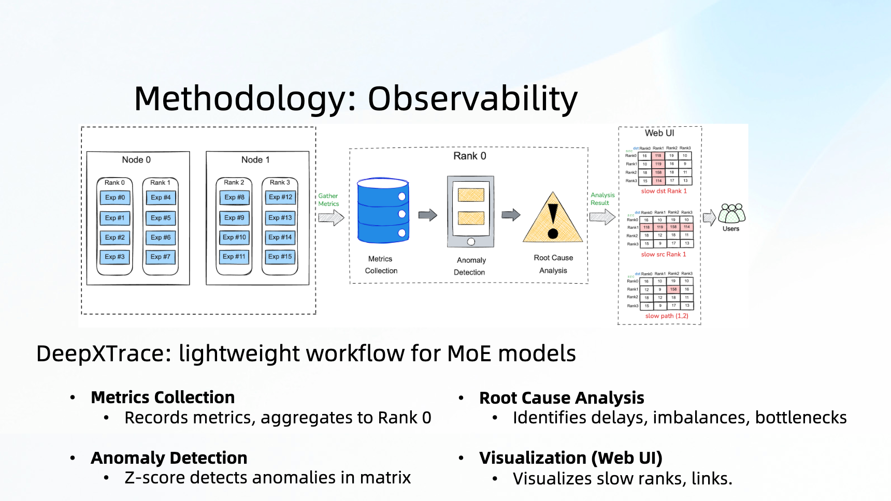

이 page는 observability를 다룬다. MoE distributed inference에서 가장 골치 아픈 문제 중 하나는 "slow rank"다. 겉으로는 어떤 dispatch/combine이 느려 보이지만, 실제 원인은 sender-side compute slowdown, receiver hotspot, network link issue, 또는 이 셋의 mixture일 수 있다.

Ant는 [DeepXTrace](https://github.com/antgroup/DeepXTrace)를 open-source했다. README에서의 positioning은 DeepEP/MC2 같은 communication library에 probe를 넣어 low overhead로 MoE distributed environment의 slow ranks를 찾는 것이다. 두 part로 나뉜다.

- MoE COMM Metrics Probe: communication operator 안에서 diagnostic metrics를 수집한다.
- DeepXTrace Metrics Analysis: 각 rank의 metrics를 aggregate해 latency matrix를 만들고 anomaly analysis와 visualization을 수행한다.

세 가지 slowdown을 지원한다.

- Comp-Slow: sender가 Attention/MoE 등 compute가 느려 send를 늦게 시작한다.
- Mixed-Slow: receiver 또는 hotspot expert 때문에 recv behavior가 abnormal하거나 network incast가 생긴다.
- Comm-Slow: communication link 자체가 느리다.

DeepXTrace의 core view는 `N x N` matrix `M`을 구성하는 것이다. 여기서 `Mij`는 `rank_i`가 `rank_j`를 기다리는 latency를 나타낸다. 예를 들어 Dispatch matrix에서 특정 column이 뚜렷하게 높으면, 보통 그 column의 rank가 bottleneck source라는 뜻이다. 이 view는 single rank log만 보는 것보다 훨씬 낫다. MoE communication problem은 자주 "내가 느린 이유가 남을 기다리기 때문"인 형태로 나타나기 때문이다.

README가 제시하는 DeepEP LL mode integration은 대략 다음과 같다.

```python
_diagnose = ds.Diagnose(group=group, enable_async=True)
_diagnose.start_async_diagnose()

dispatch_wait_recv_cost_stats = _diagnose.get_stats_ll_stats_tensor()[0]
_buffer.low_latency_dispatch(
    hidden_states,
    topk_idx,
    num_max_dispatch_tokens_per_rank,
    num_experts,
    dispatch_wait_recv_cost_stats=dispatch_wait_recv_cost_stats,
    use_fp8=True,
)

combine_wait_recv_cost_stats = _diagnose.get_stats_ll_stats_tensor()[1]
_buffer.low_latency_combine(
    hidden_states,
    topk_idx,
    topk_weights,
    handle,
    combine_wait_recv_cost_stats=combine_wait_recv_cost_stats,
)
```

이것이 slides가 DeepXTrace를 Methodology 마지막에 둔 이유다. 앞의 SwapAB/SBO/EPLB/Dispatch는 "어떻게 optimize하는가"이고, DeepXTrace는 "production에서 어디가 다시 망가졌는지 어떻게 아는가"다.

## 0xB. Decode evaluation and conclusion

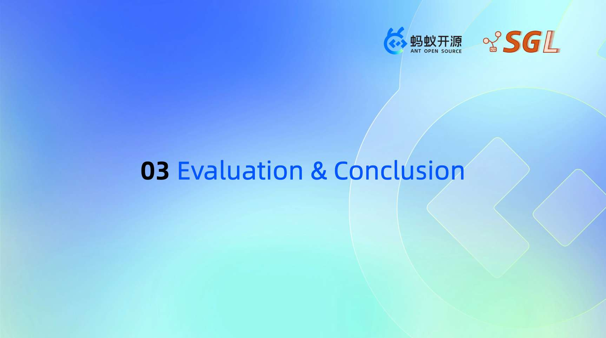

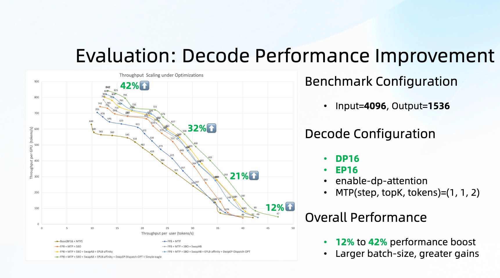

Decode evaluation configuration은 input=4096, output=1536이며, Decode side는 DP16 + EP16을 사용하고 DP attention, MTP=(1,1,2) 같은 decode optimization을 enable한다. Slides가 제시한 improvement는 batch가 작을 때 크고, batch가 커질수록 줄어든다.

- batch 32: 42% improvement
- batch 48: 32% improvement
- batch 64: 21% improvement
- batch 96: 12% improvement

이는 앞의 optimization direction과도 맞다. small batch에서는 SwapAB/SBO가 invalid computation과 communication waiting을 개선하는 효과가 가장 뚜렷하다. batch가 커지면 GEMM utilization 자체가 올라가므로 gain ratio는 자연스럽게 낮아진다.

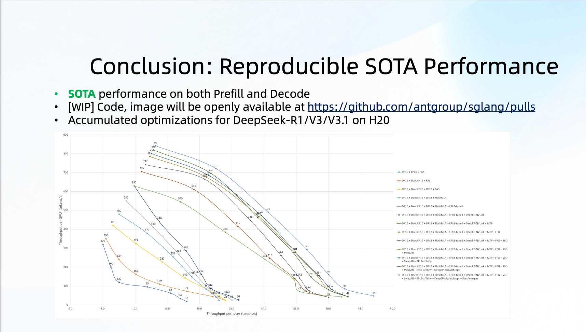

Conclusion page는 Ant가 H20에서 DeepSeek-R1/V3/V3.1에 대해 비교적 완성도 높은 optimization set을 쌓았고, Prefill과 Decode 모두 강한 수준에 도달했다고 말한다. public entry는 주로 두 가지다.

- AntGroup reproduction/summary PR: [antgroup/sglang#4](https://github.com/antgroup/sglang/pull/4)
- 관련 SGLang/DeepEP/DeepGEMM/FlashMLA PR, 즉 위에서 계속 인용한 PR들

## 0xC. DeepSeek-V3.2: DSA가 가져오는 새 문제

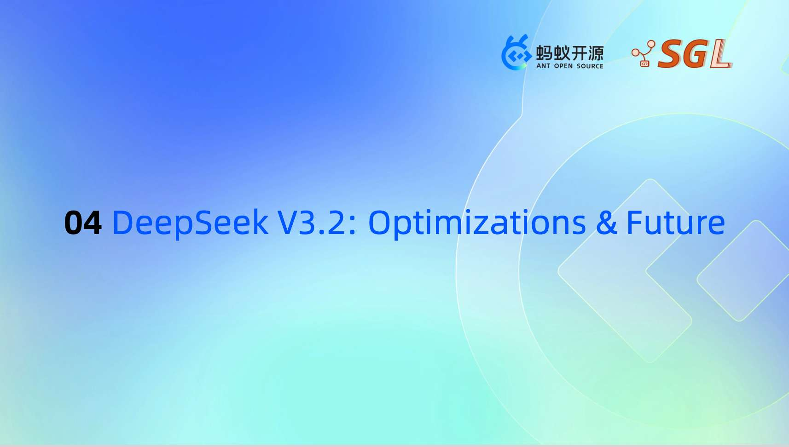

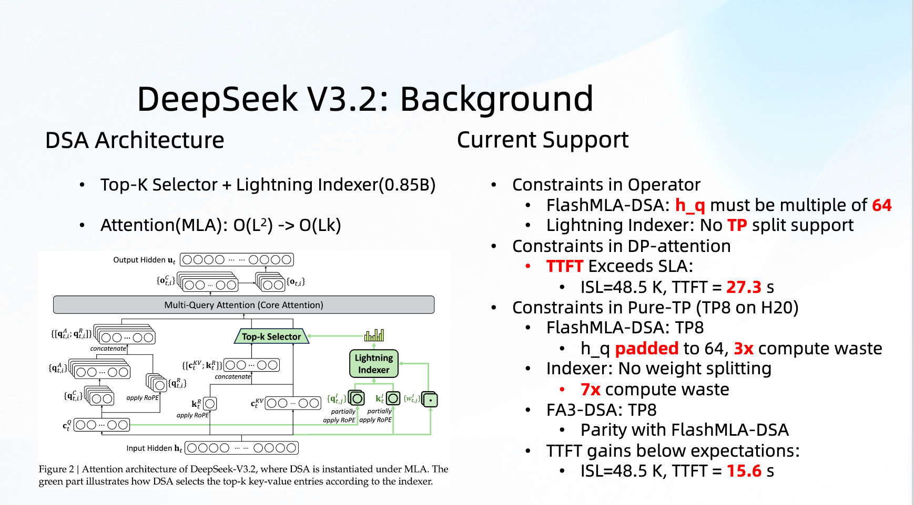

DeepSeek-V3.2의 new variable은 DSA, 즉 Dynamic Sparse Attention이다. Slides는 이것을 두 part로 나눈다.

- Top-K Selector + Lightning Indexer, 약 0.85B parameters
- Attention은 traditional MLA의 `O(L^2)`에서 selected sparse KV count에 관련된 `O(Lk)`로 바뀐다.

이 structure는 long context에 매력적이지만 engineering implementation에는 몇 가지 골치 아픈 점이 있다.

- FlashMLA-DSA는 `h_q`에 multiple-of-64 constraint가 있다.
- Lightning Indexer는 당시 TP split을 지원하지 않았다.
- DP attention을 쓰면 48.5K ISL의 TTFT가 너무 높다.
- pure TP8을 쓰면 H20에서 `h_q` padding to 64가 3x compute waste를 만들고, Indexer weight를 split하지 못하면 7x compute waste도 생긴다.

즉 DSA는 theory상 attention complexity를 줄이지만, new indexer와 kernel constraint가 benefit 일부를 다시 먹는다.

public PR 중 DeepSeek-V3.2 related key PR은 다음과 같다.

- [#12065 support context parallel with deepseekv3.2-DSA](https://github.com/sgl-project/sglang/pull/12065)
- [#11892 DeepSeek-V3.2: Add Adaptive MHA Attention Pathway for Short-Sequence Prefill](https://github.com/sgl-project/sglang/pull/11892)
- [#12094 Fuse wk and weight_proj in Indexer for DeepSeekV3.2-FP4](https://github.com/sgl-project/sglang/pull/12094)
- [#17205 DeepSeekV3.2: optimize indexer weight_proj-mma performance](https://github.com/sgl-project/sglang/pull/17205)
- [#16637 Overlap indexer weights_proj during dual_stream decode](https://github.com/sgl-project/sglang/pull/16637)

PR [#12065](https://github.com/sgl-project/sglang/pull/12065)의 idea는 DSA prefill에 context parallel을 도입하는 것이다. TP=EP=4, DP=2를 예로 들면, 각 DP가 independent request 하나를 받고, embedding 후 `(batch * seq_len, H)`를 context parallel에 따라 attention TP ranks에 split한다. MoE도 split된 hidden을 사용하고, 마지막에는 all-gather로 full hidden을 되돌린다.

현재 code의 switch는 다음과 같다.

```python
def is_nsa_enable_prefill_cp():
    return get_global_server_args().enable_nsa_prefill_context_parallel
```

두 split mode를 지원한다.

```python
def is_nsa_prefill_cp_in_seq_split():
    return (
        is_nsa_enable_prefill_cp()
        and get_global_server_args().nsa_prefill_cp_mode == "in-seq-split"
    )

def is_nsa_prefill_cp_round_robin_split():
    return (
        is_nsa_enable_prefill_cp()
        and get_global_server_args().nsa_prefill_cp_mode == "round-robin-split"
    )
```

round-robin split comment는 분명하다. continuous token을 rank별로 나누는 것이 아니라 `token_idx % cp_size`로 interleaved split한다.

```python
# token0, token1, token2, token3, token4, token5, ...
#
# dp_atten_tp0: token0, token4, token8,  token12, ...
# dp_atten_tp1: token1, token5, token9,  token13, ...
# dp_atten_tp2: token2, token6, token10, token14, ...
# dp_atten_tp3: token3, token7, token11, token15, ...
```

이렇게 하는 이유는 causal attention에서 rank별 computation imbalance를 완화하기 위해서다. ordinary continuous split에서는 앞 rank는 history KV를 적게 보고, 뒤 rank는 많이 본다. interleaving하면 각 rank의 token이 sequence 전체에 더 균등하게 분포한다.

model forward entry는 CP metadata를 준비한다.

```python
if self.nsa_enable_prefill_cp:
    if can_nsa_cp_split(len(input_ids), self.cp_size, self.use_nsa, forward_batch):
        forward_batch.attn_cp_metadata = prepare_context_parallel_metadata(
            len(input_ids),
            self.cp_rank,
            self.cp_size,
            forward_batch.seq_lens_cpu.tolist(),
        )
```

각 layer에서 NSA prefill CP가 enable되면 `NSACPLayerCommunicator`로 바꾼다.

```python
if self.nsa_enable_prefill_cp:
    self.layer_communicator = NSACPLayerCommunicator(
        layer_scatter_modes=self.layer_scatter_modes,
        input_layernorm=self.input_layernorm,
        post_attention_layernorm=self.post_attention_layernorm,
        allow_reduce_scatter=True,
        is_last_layer=(
            is_nextn or (self.layer_id == self.config.num_hidden_layers - 1)
        ),
        qkv_latent_func=self.self_attn.prepare_qkv_latent,
    )
```

PR [#11892](https://github.com/sgl-project/sglang/pull/11892)는 slides의 Future Work에 나온 "seq_len < 2K이면 masked MHA 사용"에 대응한다. logic은 DeepSeek-V3.2 prefill에서 모든 길이를 MLA로 돌리는 것이 항상 optimal하지 않다는 것이다. short sequence에서는 MLA의 compression/decompression과 absorbed attention overhead가 아깝고 MHA가 더 빠르다. 현재 NSA backend는 prefill 때 length, device, dtype, chunk capacity 등 조건으로 MHA를 사용할지 결정한다.

```python
def set_nsa_prefill_impl(self, forward_batch: Optional[ForwardBatch] = None):
    if forward_batch and forward_batch.forward_mode.is_extend_without_speculative():
        max_kv_len = forward_batch.seq_lens_cpu.max().item()
        sum_seq_lens = sum(forward_batch.seq_lens_cpu)
        device_sm = get_device_sm()

        self.use_mha = (
            (device_sm == 90 or (device_sm >= 100 and device_sm < 110))
            and max_kv_len
            <= envs.SGLANG_NSA_PREFILL_DENSE_ATTN_KV_LEN_THRESHOLD.get()
            and forward_batch.token_to_kv_pool.dtype
            in [torch.bfloat16, torch.float8_e4m3fn]
            and sum_seq_lens <= forward_batch.get_max_chunk_capacity()
            and (not is_nsa_enable_prefill_cp())
            and (forward_batch.hisparse_coordinator is None)
        )
    else:
        self.use_mha = False
```

PR [#12094](https://github.com/sgl-project/sglang/pull/12094)와 [#17205](https://github.com/sgl-project/sglang/pull/17205)는 모두 Indexer side optimization이다. 전자는 FP4 model에서 `wk`와 `weight_proj`를 하나의 GEMM으로 fuse하고, 후자는 `weights_proj` computation을 FP32에서 BF16 weight computation으로 바꾼 뒤 output을 FP32로 되돌려 indexer에서 상대적으로 오래 걸리는 `weight_proj-mma`를 해결한다.

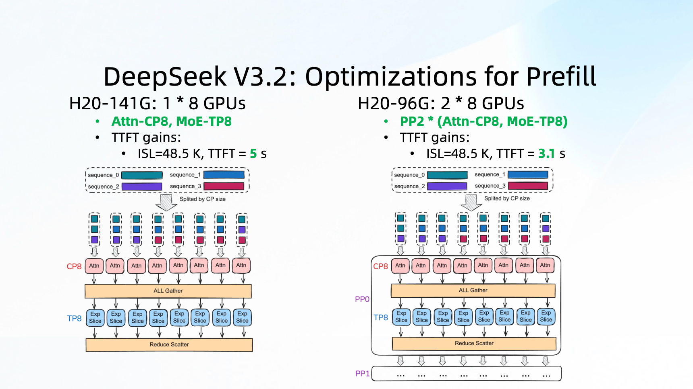

Slides의 DeepSeek-V3.2 Prefill final solution은 다음과 같다.

- H20-141G single node 8 cards: Attention-CP8, MoE-TP8, ISL=48.5K, TTFT=5s
- H20-96G two nodes 16 cards: PP2 * (Attention-CP8, MoE-TP8), TTFT=3.1s

여기서 가장 중요한 것은 attention의 context parallel과 MoE의 TP를 분리해 보는 것이다. Attention은 sequence 기준으로 split해야 하고, MoE는 hidden/expert 기준으로 organize해야 한다. 둘을 같은 parallel dimension에 억지로 묶으면 한쪽이 불편해지는 경우가 많다.

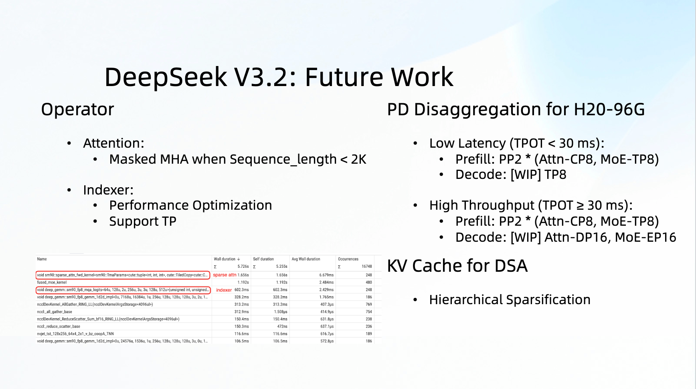

Future Work는 몇 가지를 제시한다.

- Operator: `seq_len < 2K`일 때 masked MHA 사용
- Indexer: performance를 계속 optimize하고 TP를 지원
- H20-96G PD: Prefill은 `PP2 * (Attn-CP8, MoE-TP8)`, Decode side는 TPOT SLA에 따라 두 tier로 나눔
- KV cache for DSA: Hierarchical Sparsification

그중 masked MHA와 일부 Indexer optimization은 위의 public PR에서 이미 확인할 수 있다. Decode side의 TP8 또는 DP16/EP16 DeepSeek-V3.2 full shape는 계속 진행 중으로 보인다.

## 0xD. 요약

이번 sharing은 slides만 보면 optimization point가 많이 쌓인 것처럼 보인다. 하지만 PR과 code를 이어 보면 main line은 꽤 명확하다.

1. 먼저 H20의 편향을 인정한다. compute는 약하고, memory/NVLink는 강하며, RDMA는 약하다.
2. PD disaggregation으로 Prefill과 Decode bottleneck을 분리한다.
3. Prefill side에서는 TP scattered input, MHA one-shot, MoE down projection TMA를 수행한다.
4. Decode side에서는 small batch MoE를 중심으로 SwapAB와 SBO를 수행한다.
5. communication side에서는 Expert Affinity EPLB로 cross-node communication을 줄이고, DeepXTrace로 slow rank를 찾는다.
6. DeepSeek-V3.2 side에서는 DSA가 가져온 CP, Indexer, MHA/MLA selection 문제를 다시 처리한다.

이 sharing에는 남겨 둘 만한 습관이 두 가지 있다. 첫째, optimization은 "kernel 하나가 느려 보이니 kernel 하나를 조정한다"가 아니라, hardware constraint와 deployment shape를 먼저 정한 뒤 kernel, communication, scheduling이 각각 무엇을 해결해야 하는지 결정한다는 점이다. 둘째, 여러 optimization이 실제 online distribution을 사용한다. MoE tuning은 real `topk_ids`를 쓰고, EPLB는 co-activation matrix를 쓴다. 이는 random benchmark보다 real serving에 더 가깝다.

Reference links:

- AntGroup reproduction summary PR: https://github.com/antgroup/sglang/pull/4
- LMSYS Blog: https://www.lmsys.org/blog/2025-09-26-sglang-ant-group/
- Prefill TP scattered input: https://github.com/sgl-project/sglang/pull/10568
- Prefill MHA one-shot: https://github.com/sgl-project/sglang/pull/10953
- FusedMoE down projection TMA: https://github.com/sgl-project/sglang/pull/10567
- SwapAB DeepGEMM: https://github.com/deepseek-ai/DeepGEMM/pull/192
- SGLang SwapAB rework: https://github.com/sgl-project/sglang/pull/16723
- FP8 FlashMLA: https://github.com/deepseek-ai/FlashMLA/pull/82
- SBO in SGLang: https://github.com/sgl-project/sglang/pull/9660
- SBO in DeepEP: https://github.com/deepseek-ai/DeepEP/pull/390
- SBO in DeepGEMM: https://github.com/deepseek-ai/DeepGEMM/pull/183
- Expert Affinity EPLB: https://github.com/antgroup/sglang/pull/2
- EAGLE spec-overlap: https://github.com/sgl-project/sglang/pull/11398
- EAGLE draft post process CUDA Graph: https://github.com/sgl-project/sglang/pull/11434
- DeepXTrace: https://github.com/antgroup/DeepXTrace
- DeepSeek-V3.2 DSA CP: https://github.com/sgl-project/sglang/pull/12065
- DeepSeek-V3.2 adaptive MHA: https://github.com/sgl-project/sglang/pull/11892
