> 이 글은 datacrunch 블로그 저자 @Paul Chang의 허가를 받아 repost 및 번역해 이 public account에 게시한 것입니다.

# DeepSeek V3 SGLang 최적화

DeepSeek V3와 SGLang integration에 관한 기술 시리즈를 이어가며, 여기서는 performance와 efficiency를 높이는 데 사용할 수 있는 여러 optimization strategy를 종합적으로 개관하고자 합니다. 최종 목표는 DeepSeek V3 model family(R1 포함)에 native optimization 기반의 경쟁력 있는 inference performance를 제공하는 동시에, LLM frontier improvement에 대한 전문성을 키우는 것입니다. inference serving engine으로서 SGLang은 ML infrastructure stack의 여러 component와 상호작용하므로, 서로 다른 level에서 optimization 기회가 있습니다. 대부분의 optimization은 `launch_server` CLI flag 형태로 제공됩니다. 이 flag들은 SGLang ecosystem이 시간이 지나며 구현해 온 다양한 performance enhancement를 이해하는 편리한 entrypoint입니다.

## 최적화 요약 표

| 최적화                                  | 설명/장점                                                      | 관련 flag/비고                                                     |
|--------------------------------------|--------------------------------------------------------------|------------------------------------------------------------------|
| **CUDA Graph execution**                        | 기록된 CUDA operation을 replay해 kernel launch overhead 감소                          | `--cuda_graph_max_bs`, `--disable_cuda_graph`                     |
| **Torch compile**                         | kernel fusion, operator elimination, graph optimization 적용                                  | `--enable-torch-compile`, `--torch-compile-max-bs`                |
| **BF16 / FP8 BMM kernel**                | high-precision memory-efficient batched matrix multiplication                                    | flag 없음(internal kernel optimization)                                             |
| **NextN speculative decoding (EAGLE-2)**            | tree-based verification을 통한 parallel speculative token generation                                  | `--speculative-algo`, `--speculative-draft`, `--speculative-*`    |
| **MLA data-parallel attention**                | multi-head latent attention에 data parallelism 활성화                                    | `--enable-dp-attention`                                           |
| **Overlap scheduler**                         | CPU scheduling과 GPU execution을 overlap해 idle time 감소                            | `--disable-overlap-schedule`                                      |
| **FlashInfer MLA optimization**                | MLA operation을 fuse해 prefill과 decode 가속                                  | `--enable-flashinfer-mla`                                         |
| **FP8 precision improvement**                        | block/shard scaling, FP32 accumulation으로 overflow 감소                               | flag 없음(kernel 내부 처리)                                             |
| **FP8 GEMM kernel tuning**                   | 각 GPU에 best block shape를 선택해 optimal FP8 performance 확보                        | script: `quantizationtuning_block_wise_fp8.py`                      |
| **FP8 GEMM (CUTLASS kernel)**             | efficient fused quantization과 matrix multiplication                                        | flag 없음(kernel-level implementation)                                               |
| **Fused MoE kernel + tuning**                   | custom SGLang kernel tuning을 사용하는 더 빠른 mixture-of-experts                          | script: `tuning_fused_moe_triton.py`                                |


## kernel execution optimization


#### 관련 flag:

```bash
--disable_cuda_graph: # CUDA Graph 비활성화.
--cuda_graph_bs: # `CudaGraphRunner`가 capture하는 batch size.
--cuda_graph_max_bs: # CUDA Graph 사용 시 max batch size 조정.
--enable-torch-compile: # captured CUDA Graph에 대한 torch.compile compilation 활성화.
```

#### **배경:**

CUDA Graph(https://pytorch.org/blog/accelerating-pytorch-with-cuda-graphs/)와 `torch.compile`(https://pytorch.org/tutorials/intermediate/torch_compile_tutorial.html) flag는 모두 kernel operation efficiency 향상을 목표로 합니다. CUDA Graph는 CUDA operation sequence를 하나의 unit으로 record/replay해 kernel launch overhead를 크게 줄이고, inference 중 각 kernel의 launch cost를 제거합니다. 한편 `torch.compile`은 kernel fusion, operator elimination, specialized kernel selection을 적용해 computation graph를 optimize합니다. SGLang의 `torch.compile`은 PyTorch가 생성한 graph 또는 CUDA Graph를 사용해 이 두 optimization을 연결할 수 있습니다.

#### **Commit:**

Triton backend CUDA Graph support(https://github.com/sgl-project/sglang/pull/1401), DP attention CUDA Graph support #2061(https://github.com/sgl-project/sglang/pull/2061)


#### **Benchmark:**

```bash
$ python3 -m sglang.bench_one_batch --batch-size 1  --input 256
--output 32 --model deepseek-ai/DeepSeek-V3  --trust-remote-code  --tp 8
--torch-compile-max-bs 1 --disable-cuda-graph
--profile

$ python3 -m sglang.bench_one_batch --batch-size 1  --input 256
--output 32 --model deepseek-ai/DeepSeek-V3  --trust-remote-code  --tp 8
--torch-compile-max-bs 1 --cuda-graph-max-bs 1
--profile

$ python3 -m sglang.bench_one_batch --batch-size 1  --input 256
--output 32 --model deepseek-ai/DeepSeek-V3  --trust-remote-code  --tp 8
--enable-torch-compile --torch-compile-max-bs 1 --cuda-graph-max-bs 1
 
```

#### **Result:**

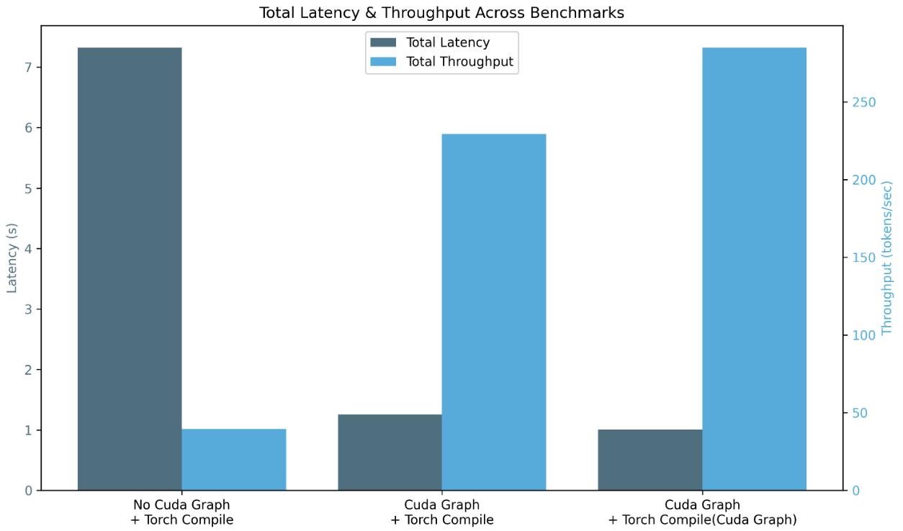

예상대로 optimization(torch.compiler / CUDA Graph + torch.compiler / torch.compiler(CUDA Graph) + torch.compiler)을 stack할 때 total latency(`7.322 / 1.256 / 1.011 s`)가 줄고 total throughput(`39.34 / 229.27 / 284.86 token/s`)이 향상됩니다.

**Note:** prefill stage latency가 감소하는 것을 볼 수 있습니다. 이는 torch.compiler compilation과 CUDA Graph가 prefill stage operation을 capture하지 않아 initial computation이 늘어난 것(`0.21180 / 0.25809 / 0.26079 s`) 및 throughput(`1208.67 / 991.92 / 981.64 token/s`) 때문입니다.

### bf16 batched matrix multiplication (bmm)

#### **배경:**

batched matrix multiplication은 LLM에서 수행되는 주요 workload입니다. DeepSeek-V3는 서로 다른 quantized fp8 data type(float8_e5m2와 float8_e4m3fn)으로 training되어 memory allocation을 줄이므로, 우리는 다양한 fp8 및 base bf16 data type 조합의 random bmm 집합에 대해 accuracy와 latency를 test했습니다. 이 optimization은 flag에 의존하지 않습니다.

#### **Commit:** 

(MLA fp8 수정 및 DeepSeek V2 bmm fp8 support(https://github.com/sgl-project/sglang/pull/1285), AMD GPU에서 DeepseekV3 활성화(https://github.com/sgl-project/sglang/pull/2601), bmm_fp8 kernel을 sgl-kernel에 통합(https://github.com/sgl-project/sglang/pull/3056))

#### **Benchmark:**

```bash
$ pytest -s test_bmm_fp8.py
```

* 수정된 `test_bmm_fp8.py`로 얻은 결과  

#### **Result:**

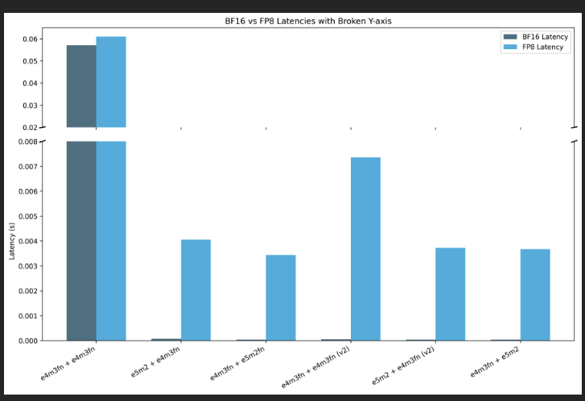

결과 간 similarity는 거의 동일합니다(cosine similarity=1이면 동일). 이는 accuracy loss가 없음을 뜻합니다. 반면 fp8 latency가 bf16보다 나쁜데, 이는 type conversion computation 때문입니다. 

### nextn speculative decoding support

#### **관련 flag:**

```bash
--speculative-num-steps: # draft model에서 sampling하는 step 수.
--speculative-eagle-topk: # EAGLE-2의 각 step에서 draft model이 sampling하는 token 수.
--speculative-num-draft-tokens: # speculative decoding에서 draft model이 sampling하는 token 수.
--speculative-draft: # 사용할 draft model. verifier model과 같은 tokenizer가 필요합니다(default: SGLang/DeepSeek-V3-NextN).
```

#### **배경:**

speculative decoding은 더 작고 빠른 draft model을 도입해 inference를 가속합니다. 이 draft model은 한 번에 여러 token을 생성합니다. 이후 verification step이 이 draft token들이 더 크고 정확한 LLM의 prediction과 일치하는지 확인합니다.

주요 단점은 Naive speculative decoding이 단일 linear draft token sequence를 생성하므로, sequence 안의 token 하나가 reject되면 그 뒤의 모든 token이 버려져 acceptance rate가 낮아진다는 것입니다.

SGLang의 NextN 구현은 EAGLE-2와 SpecInfer를 기반으로 합니다.

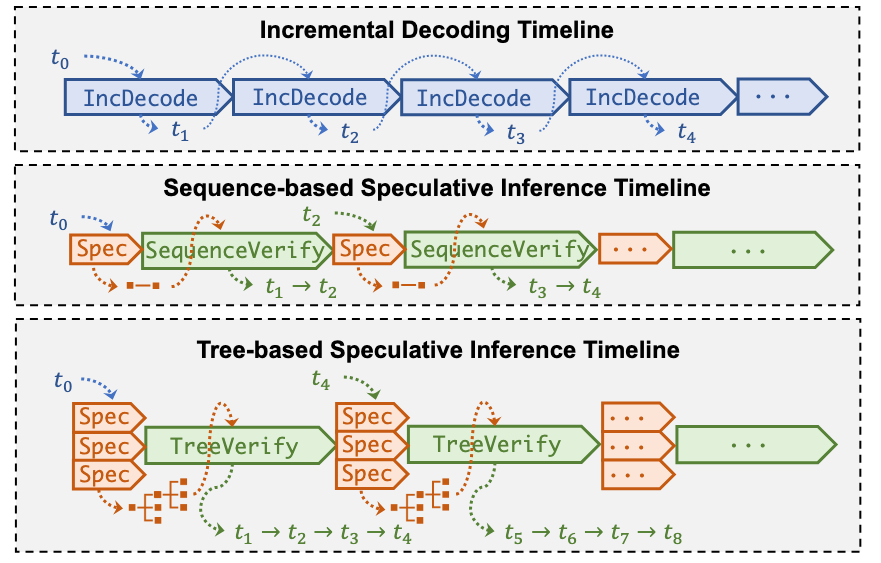

tree-based speculative decoding(SpecInfer와 EAGLE-2)을 사용하면 prediction이 tree로 구성되며 각 node는 가능한 next token을 나타냅니다. 이 방식은 verifier LLM이 parallel하게 검증할 수 있는 여러 speculative branch를 생성해 acceptance rate를 높입니다.

EAGLE-2의 핵심 개선은 context 기반 dynamic draft tree와 draft model confidence score 기반 node pruning입니다.

#### **Commit:** 

([Track] DeepSeek V3/R1 nextn progress #3472,(https://github.com/sgl-project/sglang/issues/3472), DeepSeek-V3/R1 NextN (MTP) speculative decoding support #3582(https://github.com/sgl-project/sglang/pull/3582), Triton backend EAGLE2 support #3466(https://github.com/sgl-project/sglang/pull/3466), Eagle speculative decoding part 4: add EAGLE2 worker #2150(https://github.com/sgl-project/sglang/pull/2150))

#### **Benchmark:**

flag 없음.

```bash
python3 -m sglang.launch_server --model deepseek-ai/DeepSeek-V3 --tp 8 --trust-remote-code
python3 -m sglang.bench_serving --backend sglang --dataset-name random --random-input 256 --random-output 32 --random-range-ratio 1 --num-prompts 1 --host 127.0.0.1 --port 30000
```

`--speculative-algo NEXTN --speculative-draft SGLang/DeepSeek-V3-NextN --speculative-num-steps 2 --speculative-eagle-topk 4 --speculative-num-draft-tokens 4`

```bash
python3 -m sglang.launch_server --model deepseek-ai/DeepSeek-V3 --speculative-algo NEXTN --speculative-draft SGLang/DeepSeek-V3-NextN --speculative-num-steps 2 --speculative-eagle-topk 4 --speculative-num-draft-tokens 4 --tp 8 --trust-remote-code
python3 -m sglang.bench_serving --backend sglang --dataset-name random --random-input 256 --random-output 32 --random-range-ratio 1 --num-prompts 1 --host 127.0.0.1 --port 30000 
```

#### **Result:**

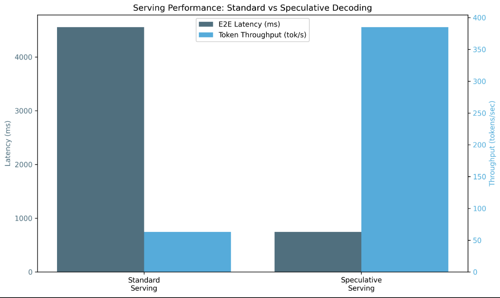

overall throughput(request, input, output)을 개선했고, end-to-end latency를 크게(x6) 줄였습니다.

> GiantPandaLLM note: 여기 test result는 의심스럽습니다. 이 정도로 큰 acceleration은 아닐 것 같지만, 일단 유용한 optimization이라는 점만 이해하면 됩니다.

## MLA

### TP+DP attention

#### **관련 flag:**

```bash
--enable-dp-attention: # compatible MLA data parallel 활성화.
```

#### **배경:**

tensor parallelism(TP)은 KV Cache를 TP device 수(보통 8)에 따라 분할해 MHA와 함께 동작합니다. 따라서 각 device는 KV Cache의 1/TP를 처리합니다. [1]

이를 multi-head latent attention(MLA)과 TP에 적용하면 각 GPU는 `head_num` dimension을 따라 `kv cache`를 분할합니다. 하지만 MLA의 `kvcache`는 `head_num`이 `1`이므로 분할할 수 없습니다. 따라서 각 GPU는 완전한 `kvcache`를 유지해야 하고, `kvcache`가 각 device에 복제됩니다.

MLA에 DP(data parallel)를 사용할 때는 request 기준으로 분할합니다. 서로 다른 request의 latent state cache는 서로 다른 GPU에 저장됩니다. 예를 들어 유일한 KV Cache를 분할할 수 없으므로 data를 batch로 나누고, prefill/decode 같은 서로 다른 task를 실행하는 worker에 parallelize합니다.

MLA 이후에는 all-gather operation을 수행해 각 GPU가 모든 sequence의 `hidden_state`를 가져옵니다. 이후 **MOE(Mixture of Experts)** 뒤에는 각 GPU가 **slice** operation으로 자기 sequence를 추출합니다.

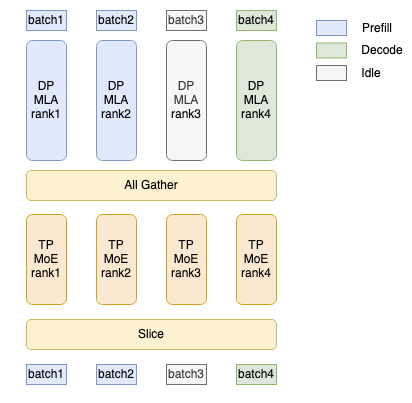

#### **Commit:** 

(DP attention CUDA Graph support(https://github.com/sgl-project/sglang/pull/2061), multi-node DP attention support(https://github.com/sgl-project/sglang/pull/2925), multi-node tensor parallelism(https://github.com/sgl-project/sglang/pull/550), DP MLA support(https://github.com/sgl-project/sglang/pull/1970))

#### **Benchmark:**

flag 없음

```bash
# profiler environment로 server 시작
export SGLANG_TORCH_PROFILER_DIR=/sgl-workspace/profiler_env_folders/ # optional for analysis
python3 -m sglang.launch_server --model deepseek-ai/DeepSeek-V3 --tp 8 --trust-remote-code

# prefill
python3 -m sglang.bench_serving --backend sglang --dataset-name random --random-input 512 --random-output 1 --random-range-ratio 1 --num-prompts 10000 --host 127.0.0.1 --port 30000 
# decode
python3 -m sglang.bench_serving --backend sglang --dataset-name random --random-input 1 --random-output 512 --random-range-ratio 1 --num-prompts 10000 --host 127.0.0.1 --port 30000
```

`—enable-dp-attention`

```bash
# profiler environment로 server 시작
export SGLANG_TORCH_PROFILER_DIR=/sgl-workspace/profiler_env_folders/
python3 -m sglang.launch_server --model deepseek-ai/DeepSeek-V3 --tp 8 --trust-remote-code --enable-dp-attention

# prefill
python3 -m sglang.bench_serving --backend sglang --dataset-name random --random-input 512 --random-output 1 --random-range-ratio 1 --num-prompts 10000 --host 127.0.0.1 --port 30000
# decode
python3 -m sglang.bench_serving --backend sglang --dataset-name random --random-input 1 --random-output 512 --random-range-ratio 1 --num-prompts 10000 --host 127.0.0.1 --port 30000
```

#### **Result:**

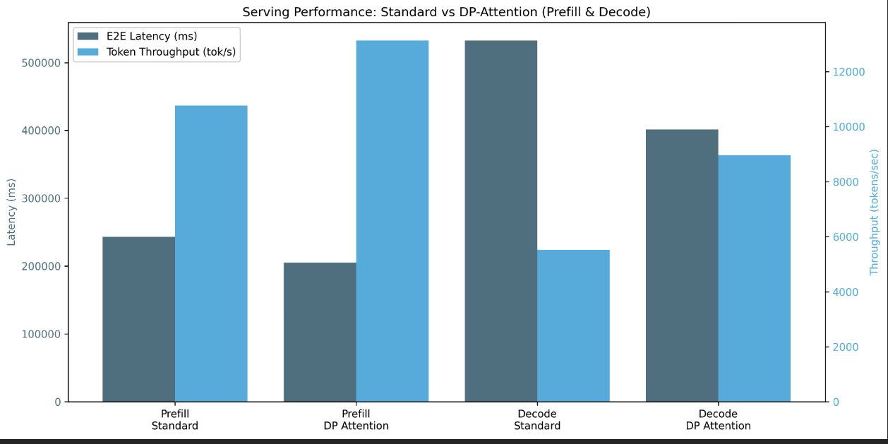

이는 scheduler paradigm이므로 큰 batch size를 사용할 때 더 잘 동작합니다. 그렇지 않으면 추가 overhead가 실제 data parallelization보다 큽니다.

더 큰 batch size(이 경우 10,000)에서는 prefill과 decode stage 모두에서 end-to-end latency, overall throughput, concurrency가 전반적으로 개선되는 것을 볼 수 있습니다.

### DP attention과 overlap scheduler support


#### **관련 flag:**

```bash
--disable-overlap-schedule: # overhead scheduler 비활성화
```

#### **배경:**

CPU scheduling과 GPU computation을 overlap할 수 있습니다. scheduler는 한 batch를 미리 실행하고 다음 batch에 필요한 모든 metadata를 준비합니다. 이렇게 하면 전체 duration 동안 GPU를 바쁘게 유지하고 radix cache operation 같은 expensive overhead를 숨길 수 있습니다. 

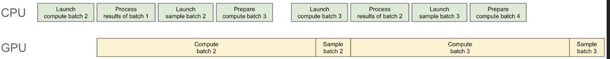

#### **Commit:** 

(faster overlap scheduler(https://github.com/sgl-project/sglang/pull/1738), overlap default enable(https://github.com/sgl-project/sglang/pull/2067), Triton attention backend에서 overlap scheduler default enable(https://github.com/sgl-project/sglang/pull/2105))

#### **Benchmark:**

`--disable-overlap-schedule`

```bash
python3 -m sglang.launch_server --model deepseek-ai/DeepSeek-V3 --tp 8 --trust-remote-code --disable-overlap-schedule
python3 -m sglang.bench_serving --backend sglang --dataset-name random --random-input 256 --random-output 32 --random-range-ratio 1 --num-prompts 10000 --host 127.0.0.1 --port 30000
```

flag 없음 → overlap scheduler 활성화:

```bash
python3 -m sglang.launch_server --model deepseek-ai/DeepSeek-V3 --tp 8 --trust-remote-code

python3 -m sglang.bench_serving --backend sglang --dataset-name random --num-prompts 2500 --random-input-len 1024 --random-output-len 1024 --random-range-ratio 1
```

#### **Result:**

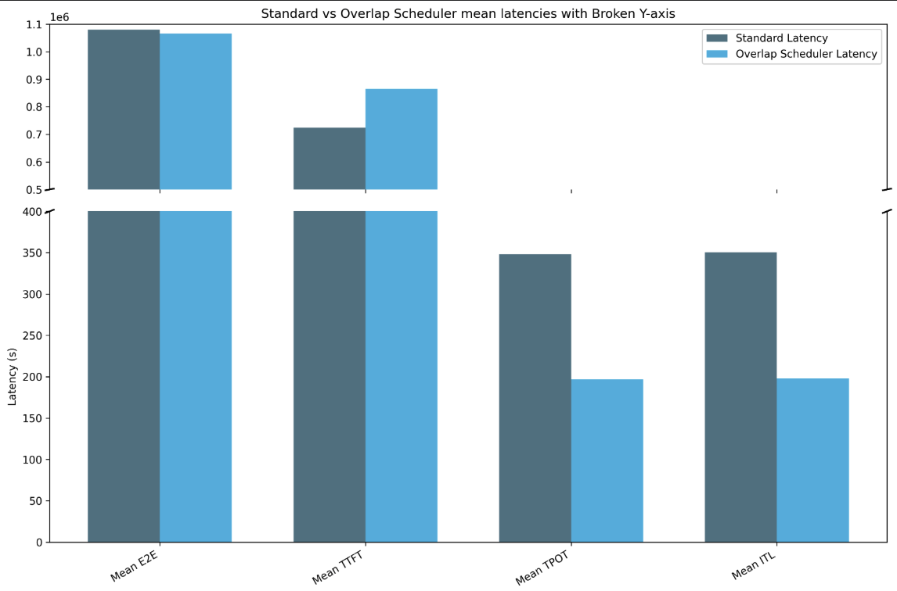

latency가 전반적으로 줄어든 것을 볼 수 있습니다. end-to-end(standard: `1080152.26s` | overlap: `1066166.84s`), time per output token(standard: `348.10s` | overlap: `196.79s`), inter-token latency(standard: `350.62s` | overlap: `197.96s`)가 감소했습니다. 다만 time to first token은 scheduler overhead의 감소 결과를 보였습니다(standard: `724050.93s` | overlap: `864850.926s`).

더 큰 input/output request size에서는 overlap scheduler의 효과가 더 명확해집니다.

### FlashInfer prefill과 MLA decode

#### **관련 flag:**

```bash
--enable-flashinfer-mla: # FlashInfer MLA optimization 활성화
```

#### **배경:**

Triton 대신 FlashInfer backend를 사용합니다.

#### **Commit:**
(FlashInfer MLA용 fast decode plan 추가,(https://github.com/sgl-project/sglang/pull/3987) weight absorption 없는 MLA prefill(https://github.com/sgl-project/sglang/pull/2349))

#### **Benchmark:**

flag 없음:

```bash
python3 -m sglang.launch_server --model deepseek-ai/DeepSeek-V3 --tp 8 --trust-remote-code
python3 benchmark/gsm8k/bench_sglang.py --num-shots 8 --num-questions 1319 --parallel 1319
```

```bash
Accuracy: 0.951
Latency: 77.397 s
Output throughput: 1809.790 token/s
```

`--enable-flashinfer-mla` 사용

```bash
python3 -m sglang.launch_server --model deepseek-ai/DeepSeek-V3 --tp 8 --trust-remote-code --enable-flashinfer-mla
python3 benchmark/gsm8k/bench_sglang.py --num-shots 8 --num-questions 1319 --parallel 1319
```

```bash
Accuracy: 0.948
Latency: 71.480 s
Output throughput: 1920.021 token/s
```


#### **Result:**

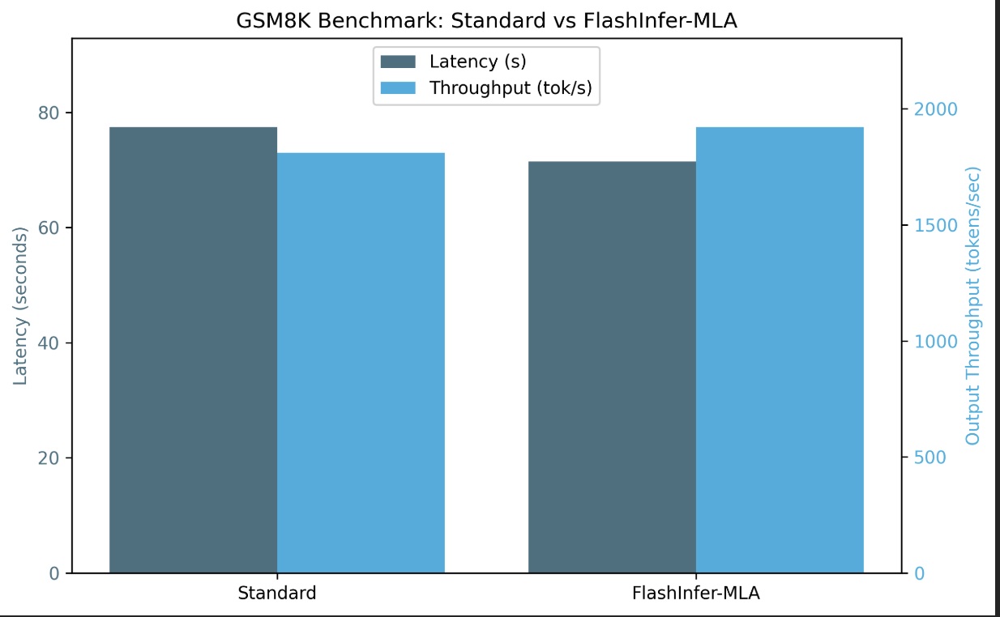


FlashInfer fused operation 덕분에 비슷한 accuracy에서 더 낮은 latency와 더 높은 output throughput을 얻었습니다.

## FP8

### FP8 accuracy 개선

#### **배경:**

값이 FP8 같은 주어진 numerical format의 representable range를 넘으면 numerical overflow가 발생하고, 잘못된 값 또는 infinite value가 됩니다. Tensor Core에서 FP8 quantization을 사용하는 context에서 overflow가 발생하는 이유는 FP8의 dynamic range가 매우 제한적이기 때문입니다. numerical overflow를 방지하기 위해 quantization 전에 matrix의 maximum element로 값을 줄이지만, 이 방식은 outlier에 민감합니다. 이를 피하기 위해 DeepSeek team은 block 및 shard scaling을 제안했습니다. weight matrix의 각 128×128 submatrix와 activation vector의 각 1×128 subvector를 각각 scale 및 quantize합니다.

NVIDIA H800 Tensor Core의 FP8 GEMM accumulation은 약 `14 bit` precision으로 제한되며, 이는 FP32 accumulation precision보다 상당히 낮습니다. 그래서 DeepSeek은 CUDA Core의 별도 FP32 accumulator register를 사용해 precision loss를 줄입니다. dequantization scale factor도 이 FP32 accumulator에 적용됩니다.

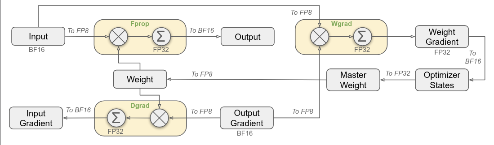

#### **Commit:** 
(block fp8 matrix multiplication kernel support #3267(https://github.com/sgl-project/sglang/pull/3267), block fp8 unit test 추가 #3156(https://github.com/sgl-project/sglang/pull/3156), block fp8 kernel 통합 #3529(https://github.com/sgl-project/sglang/pull/3529), [Track] DeepSeek V3/R1 accuracy(https://github.com/sgl-project/sglang/issues/3486))

#### **Benchmark:**

```bash
python3 -m sglang.launch_server --model deepseek-ai/DeepSeek-R1 --tp 8 --trust-remote-code
python3 benchmark/gsm8k/bench_sglang.py --num-shots 8 --num-questions 1319 --parallel 1319
```
#### **Result:**

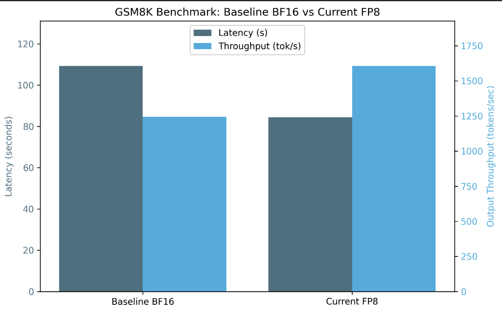


동일한 accuracy(gsm8k에서 `0.955` vs `0.957`)에서 더 높은 output throughput과 더 낮은 latency를 관찰했습니다.

### FP8 GEMM tuning

#### **배경:**

SGLang은 FP8 block quantization tuning을 사용해 서로 다른 GPU의 performance를 optimize합니다. 이 구현은 특히 AMD와 CUDA architecture를 대상으로 FP8 GEMM(general matrix multiplication) kernel을 benchmark하고, latency를 기준으로 가장 효율적인 configuration을 결정하기 위해 서로 다른 block shape를 test합니다.

이 방식은 block quantization이 GEMM operation의 best block size와 맞도록 보장하고, computation efficiency를 maximize하면서 precision loss를 minimize합니다. computation은 FP8에서 수행하지만, final output store 전에 numerical stability를 유지하기 위해 accumulation은 BF16에서 수행합니다.

핵심 함수:

```bash
# fn: benchmark_config(A_fp8, B_fp8, As, Bs, block_size, config, out_dtype=torch.float16, num_iters=10)
A: torch.Tensor,     # input matrix (FP8) - usually activation
B: torch.Tensor,     # input matrix (FP8) - usually weight
As: torch.Tensor,    # per-token group scale factor for `A`
Bs: torch.Tensor,    # per-block scale factor for `B`
block_size: List[int],  # quantization block size (e.g., [128, 128])
config: Dict[str, Any],  # kernel configuration parameter
output_dtype: torch.dtype = torch.float16,  # output precision
```

```bash
# fn: tune(M, N, K, block_size, out_dtype, search_space):
M,N,K: int  # matrix multiplication shape (M × K @ K × N → M × N)
block_size: int # tuple defining block quantization size ([block_n, block_k])
out_dtype: str # output precision (e.g., float16, bfloat16)
search_space: List[dict{str,int}] # configuration list to test (e.g., block size, number of warps).

# search_space example:
{
"BLOCK_SIZE_M": block_m,
"BLOCK_SIZE_N": block_n,
"BLOCK_SIZE_K": block_k,
"GROUP_SIZE_M": group_size,
"num_warps": num_warps,
"num_stages": num_stages,
}
```

#### **Commit:** 
(block fp8 tuning 추가 #3242]https://github.com/sgl-project/sglang/pull/3242))

#### **Benchmark:**

```bash
$python3 benchmark/kernels/quantizationtuning_block_wise_fp8.py
```

#### **Result:**

kernel best configuration example: `N=512,K=7168,device_name=NVIDIA_H200,dtype=fp8_w8a8,block_shape=[128, 128]`

```bash
[...]
{
    "2048": {
        "BLOCK_SIZE_M": 64,
        "BLOCK_SIZE_N": 64,
        "BLOCK_SIZE_K": 128,
        "GROUP_SIZE_M": 1,
        "num_warps": 4,
        "num_stages": 4
    },
    "3072": {
        "BLOCK_SIZE_M": 64,
        "BLOCK_SIZE_N": 64,
        "BLOCK_SIZE_K": 128,
        "GROUP_SIZE_M": 1,
        "num_warps": 4,
        "num_stages": 3
    },
    "4096": {
        "BLOCK_SIZE_M": 64,
        "BLOCK_SIZE_N": 128,
        "BLOCK_SIZE_K": 128,
        "GROUP_SIZE_M": 64,
        "num_warps": 4,
        "num_stages": 3
    }
}
```

주어진 FP8 data type과 tuning할 모든 batch size에 대해, script는 서로 다른 model weight dimension(N과 K)을 test하고 비교해 lowest latency 기준으로 FP8 GEMM block quantization을 optimize합니다. 이를 통해 각 batch size에 대한 block tiling dimension(`BLOCK_SIZE_M/N/K`), group size(`GROUP_SIZE_M`)(함께 grouping되는 block 수로 L2 cache 사용을 개선), thread block당 warp 수(`num_warps`), prefetch로 block을 shared memory에 load하는 stage 수(`num_stages`)의 optimal configuration을 얻습니다. 이는 서로 다른 configuration의 computation parameter를 자동 tuning하게 해 줍니다.

### FP8 GEMM CUTLASS implementation

#### 배경:

quantization operation은 efficiency를 위해 FP8 matrix multiplication operation에 fuse될 수 있습니다. `sgl-kernel/src/sgl-kernel/csrc/int8_gemm_kernel.cu`에는 W8A8 quantization과 fuse된 CUDA-accelerated 8-bit integer(int8) scaled matrix multiplication implementation이 있습니다.

#### **Commit:** 
(CUTLASS w8a8 fp8 kernel support #3047(https://github.com/sgl-project/sglang/pull/3047), cutlass Int8 gemm support #2752(https://github.com/sgl-project/sglang/pull/2752), sm90 Int8 gemm support #3035(https://github.com/sgl-project/sglang/pull/3035), NVIDIA/cutlass의 FP8 block scaling #1932(https://github.com/NVIDIA/cutlass/pull/1932))

#### **Benchmark:**

```bash
root@cluster-h200-02-f2:/sgl-workspace/sglang/sgl-kernel/benchmark# python3 bench_int8_gemm.py 
```
#### **Result:**

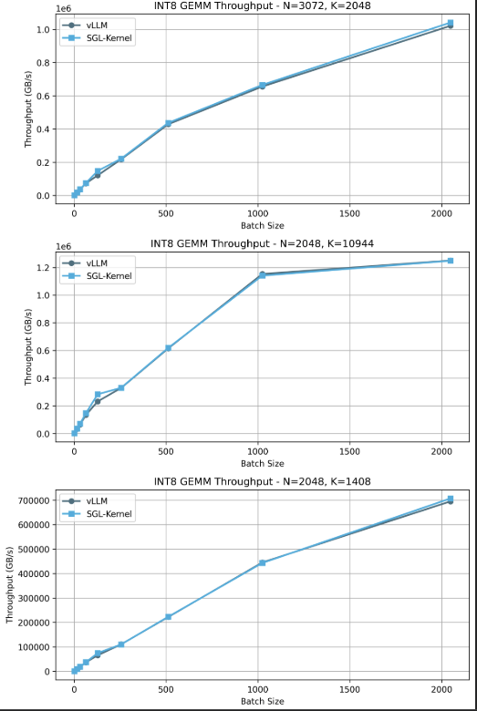


benchmark는 각 batch size의 GB/s(throughput의 또 다른 measure)를 측정합니다. vLLM kernel(int8 gemm)과 SGLang kernel을 비교하면, 서로 다른 configuration(N과 K)의 서로 다른 batch size에서 더 높은 throughput을 얻습니다.

**Note**: 이 benchmark는 DeepSeek-Coder-V2-Lite-Instruct로 test했습니다. DeepSeek-V3 code가 아직 SGLang에 구현되지 않았기 때문입니다.

## MoE

### H200 FusedMoE tuning

아래는 token과 expert matrix를 사용하는 mixture-of-experts(MOE) fused computation implementation입니다. multiplication `A @ B`(token × expert matrix multiplication)를 사용해 top-k routing을 수행하며 다음을 지원합니다.

- `fp16`, `bfloat16`, `fp8`, `int8` format
- `A_scale`, `B_scale`을 통한 weight/activation scaling
- block quantization
- `expert_ids`를 통한 expert routing

#### **배경:**

SGLang의 custom fused MoE kernel은 vLLM을 reference와 benchmark로 사용하며, 다음으로 구성됩니다. 

`tuning_fused_moe_triton.py`: `fused_moe_triton` kernel tuning tool. vllm의 benchmark_moe.py(https://github.com/vllm-project/vllm/blob/main/benchmarks/kernels/benchmark_moe.py)를 개조했으며 다양한 model architecture support를 추가했습니다.

`benchmark_vllm_vs_sglang_fused_moe_triton.py`: vLLM과 SGLang implementation 사이의 fused MoE kernel performance를 비교하는 tool. 다양한 model architecture와 data type을 지원합니다.

`benchmark_torch_compile_fused_moe.py`: fused MoE kernel을 `torch.compile` 및 raw fused MoE kernel과 benchmark하는 tool.

#### **Commit:** 
(fused_moe unit test 추가(https://github.com/sgl-project/sglang/pull/2416), MoE expert parallelism implementation(https://github.com/sgl-project/sglang/pull/2203), `benchmark/kernels/fused_moe_triton/README.md`(https://github.com/sgl-project/sglang/tree/main/benchmark/kernels/fused_moe_triton))

#### **Benchmark:**

```bash
$ python3 benchmark/kernels/fused_moe_triton/tuning_fused_moe_triton.py --model deepseek-ai/DeepSeek-V3 --tp-size 8  --dtype fp8_w8a8 --tune
                                                                          
Writing best config to E=256,N=256,device_name=NVIDIA_H200,dtype=fp8_w8a8,block_shape=[128, 128].json...                                                                       
Tuning took 5267.05 seconds
```

FusedMoE benchmark sgl-kernel vs vllm:
```bash
python3 benchmark/kernels/fused_moe_triton/benchmark_vllm_vs_sglang_fused_moe_triton.py
[...]
benchmark sglang_fused_moe_triton with batch_size=505
benchmark vllm_fused_moe_triton with batch_size=506
benchmark sglang_fused_moe_triton with batch_size=506
benchmark vllm_fused_moe_triton with batch_size=507
benchmark sglang_fused_moe_triton with batch_size=507
benchmark vllm_fused_moe_triton with batch_size=508
benchmark sglang_fused_moe_triton with batch_size=508
benchmark vllm_fused_moe_triton with batch_size=509
benchmark sglang_fused_moe_triton with batch_size=509
benchmark vllm_fused_moe_triton with batch_size=510
benchmark sglang_fused_moe_triton with batch_size=510
benchmark vllm_fused_moe_triton with batch_size=511
benchmark sglang_fused_moe_triton with batch_size=511
benchmark vllm_fused_moe_triton with batch_size=512
benchmark sglang_fused_moe_triton with batch_size=512

fused-moe-performance:
[...]
     batch_size  vllm_fused_moe_triton  sglang_fused_moe_triton
505       506.0               1.014688                 0.507488
506       507.0               1.011744                 0.509344
507       508.0               1.007200                 0.504288
508       509.0               1.007232                 0.505696
509       510.0               1.007792                 0.507712
510       511.0               1.011072                 0.507248
511       512.0               1.012992                 0.507840
````

#### Result:

DeepSeek-V3의 fused MoE kernel에 FP8 quantization tuning을 수행해, FP8 GEMM tuning과 유사하게 각 batch size의 optimal configuration을 얻었습니다.

> block tiling dimension(`BLOCK_SIZE_M/N/K`), 함께 grouping되는 block 수인 group size(`GROUP_SIZE_M`)는 L2 cache 사용을 개선하고, thread block당 warp 수(`num_warps`)와 prefetch로 block을 shared memory에 load하는 stage 수(`num_stages`)를 설정합니다.

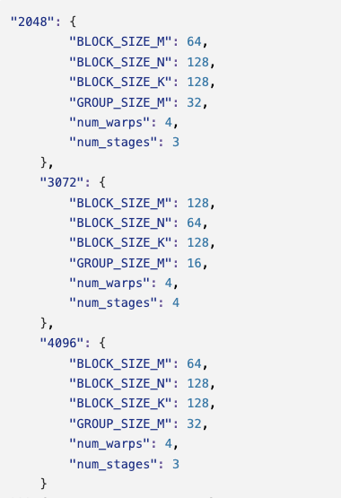


그다음 SGLang의 fused MoE kernel implementation과 vLLM benchmark implementation을 비교해, batch size가 증가해도 latency가 거의 일정하게 유지되는 더 정교한 version을 얻었습니다.

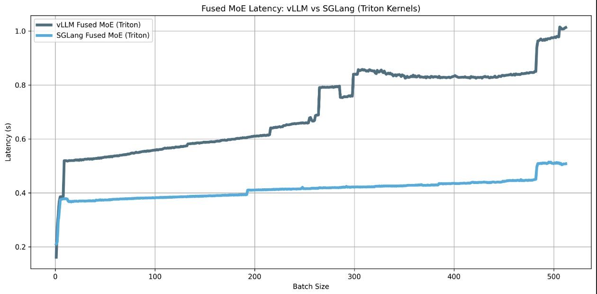

마무리하자면, 이 technical blog가 사용한 version은 sglang: v0.4.3.post2, sgl-kernel: 0.0.3.post6, torch: 2.5.1, CUDA: 12.5입니다. 

우리는 DeepSeek model family의 사실상 open-source inference engine인 sglang과의 collaboration을 강력히 지지합니다. 

future work에서는 FlashMLA kernel, FlashAttention, sglang Triton kernel 같은 key component의 performance와 incremental improvement를 분석해 이 optimization을 더 탐구할 계획입니다. 또한 prefill/decode stage split과 DeepGemm/FusedMoE integration처럼 sglang team이 구현한 새로운 optimization도 탐색할 것을 제안합니다.

sglang team의 도움, 이 blog review, 그리고 project에서의 공동 협업에 감사드립니다.

## References

- sglang kernel tests: https://github.com/sgl-project/sglang/tree/main/sgl-kernel/tests

- sglang kernel benchmarks: https://github.com/sgl-project/sglang/tree/main/sgl-kernel/benchmark

- [Feature] DeepSeek V3 optimization #2591: https://github.com/sgl-project/sglang/issues/2591

- blog deepseek v3 10x efficiency key techniques: https://dataturbo.medium.com/key-techniques-behind-deepseek-models-10x-efficiency-1-moe-9bd2534987c8

- AI compiler Sglang optimization work: https://carpedm30.notion.site/02-19-2024-2nd-meeting

- lmsys sglang 0.4 data parallel: https://lmsys.org/blog/2024-12-04-sglang-v0-4/#data-parallelism-attention-for-deepseek-models

- lmsys sglang 0.4 zero-overhead batch scheduler: https://lmsys.org/blog/2024-12-04-sglang-v0-4/#zero-overhead-batch-scheduler

- spaces.ac.cn: MQA, GQA, MLA blog: https://spaces.ac.cn/archives/10091

- tree-based speculative decoding paper: https://arxiv.org/pdf/2305.09781

- EAGLE2 speculative decoding paper: https://arxiv.org/pdf/2406.16858

- DeepSeek v3 paper: https://arxiv.org/pdf/2412.19437

- Zhihu blog: EAGLE: speculative sampling requires rethinking feature uncertainty: https://zhuanlan.zhihu.com/p/687404563

- Zhihu blog: MLA tp and dp: https://zhuanlan.zhihu.com/p/25573883266

- Zhihu blog: MLA tp and dp part 2: https://zhuanlan.zhihu.com/p/15280741714

- Colfax deepseekv3 fp8 mixed precision training: https://research.colfax-intl.com/deepseek-r1-and-fp8-mixed-precision-training/

  
