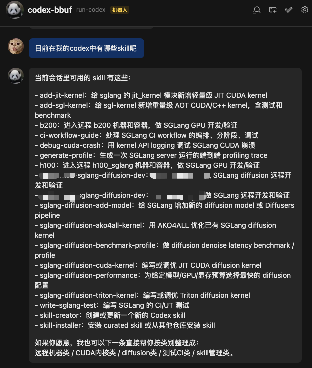
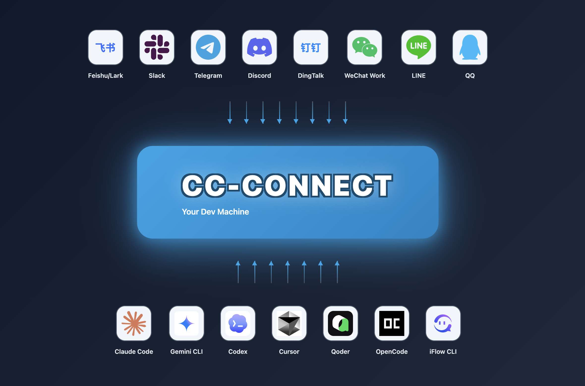
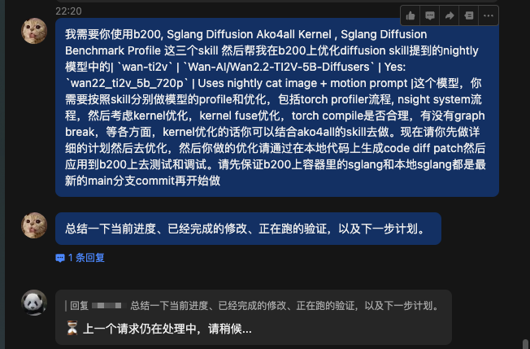
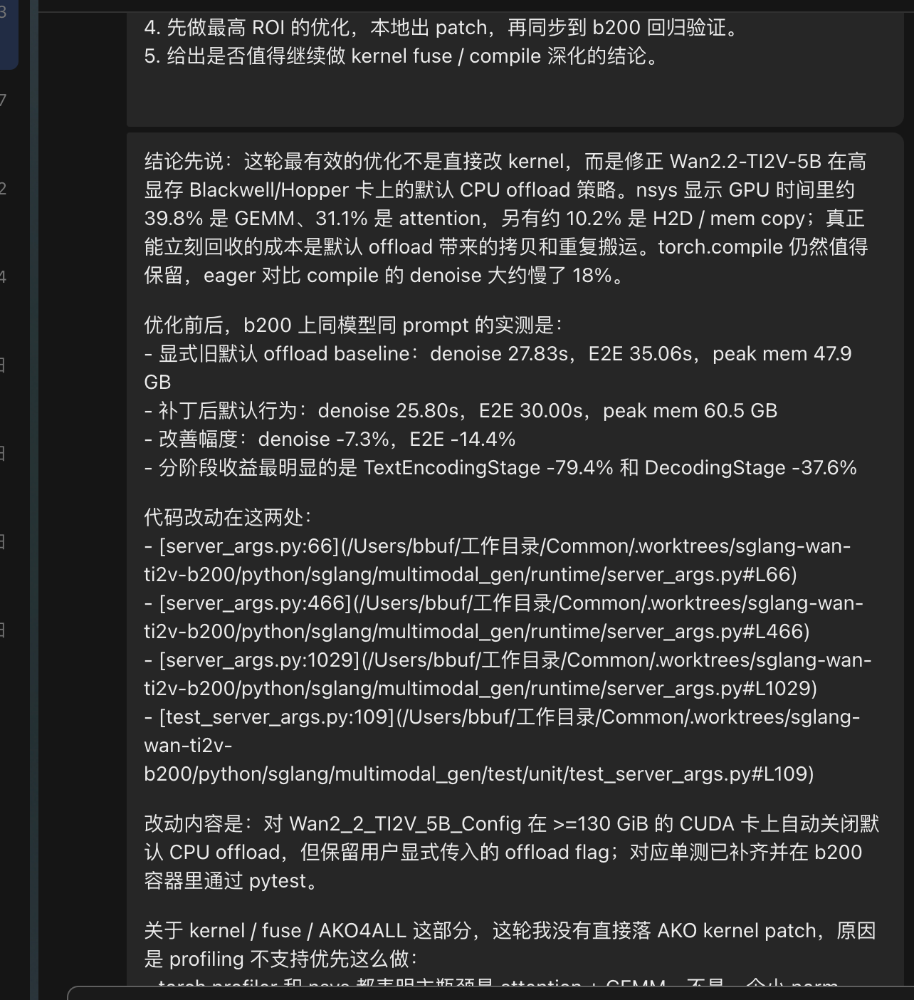
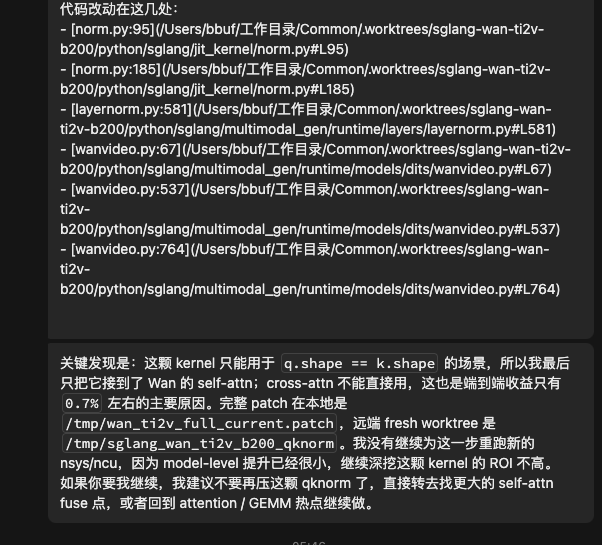

# Feishu에 Codex를 넣어 모바일에서 SGLang 추론 프레임워크 원격 개발하기

## 0x0. 머리말

앞선 [SGLang 개발, 최적화, debug 팁 기록: 대 SKILL 시대가 왔다](./SGLang-dev-opt-debug-skills.md)와 [Codex가 전통적인 추론 프레임워크 개발 흐름을 재구성하고 있다](./Codex-reshaping-inference-framework-development.md)에서 제가 더 많이 이야기한 것은 한 가지입니다. Agent 시대에 SGLang 같은 inference framework의 개발, 최적화, debug, benchmark, 일반 model optimization은 점점 "충분한 context를 준 뒤 model이 고속으로 밀어붙이게 하는" 문제가 되고 있습니다.

이번 주말에는 cc-connect로 Feishu와 local Codex를 연결해 SGLang model optimization workflow를 만들어 봤습니다. 장난감처럼 들릴 수 있지만 실제로 돌려 보면, 이것은 "휴대폰에서 code를 작성하는 것"이 아니라 "휴대폰에서 SSH도 하고, benchmark도 하고, SGLang도 수정하고, remote GPU machine에 연결해 profile도 하고, kernel도 쓰고, ncu로 iterative optimization도 하고, 여러 benchmark verification도 할 수 있는 진짜 Agent engineering body를 dispatch하는 것"입니다. 이제 거의 무엇이든 할 수 있게 될 것입니다. 언제 어디서든 자신의 idea를 현실로 바꾸는 데 더 가까워졌습니다. 이 workflow를 완성할 수 있었던 것도 몇 가지 선행 skills 작업에 의존했습니다.



SGLang 관련 skills는 SGLang repository를 pull한 뒤 one-click install할 수 있습니다: https://github.com/sgl-project/sglang

remote connection 관련 skills는 Codex나 Claude Code가 직접 만들게 할 수 있습니다.

cc-connect 설명은 https://github.com/chenhg5/cc-connect 에 있고, architecture diagram은 다음과 같습니다.



Feishu 외에도 WeChat, Slack, Telegram 등 거의 모든 mainstream social media를 설정할 수 있습니다. Codex 외에도 Claude Code, Gemini CLI, Cursor 등 여러 mainstream Agent를 설정할 수 있으니 충분히 쓸 만합니다.


## 0x1. 왜 Feishu와 cc-connect인가

저는 현재 local Mac의 고정 folder 아래에서 Codex로 작업을 처리하는 mode에 있습니다. 이 mode의 불편한 점은 반드시 computer에서 조작해야 하고, task가 잘 완료되도록 그 사고 과정을 계속 보고 있어야 한다는 것입니다. 일부 핵심 정보를 놓치기 쉽고, 전체 대화가 길며, tool call log도 많아 읽기 어렵습니다. 중간 과정을 넘기기 귀찮아지면 문제가 생기기 쉽습니다.

cc-connect로 Feishu와 local Codex를 연결하는 흐름은 대략 다음과 같습니다.

```text
Feishu message
  -> cc-connect
  -> local Codex CLI
  -> local SGLang repo / local SKILL
  -> SSH to b200 / h100 and other remote machines
  -> run benchmark / profile / test
  -> key results back to Feishu
```

Feishu는 단지 entry이고, `cc-connect`는 bridge일 뿐입니다. 실제로 일하는 것은 local에서 검증된 Codex, SGLang SKILLs, remote server입니다. 핵심은 정말로 mobile chatting 방식으로 개발할 수 있다는 점입니다(희망 사항).

OpenClaw도 분명히 이런 일을 할 수 있을 것 같습니다. 하지만 제가 더 원한 것은 mobile message에서 local Codex, local repo, remote GPU machine까지 바로 이어지는 가장 짧은 control chain이며, 설정도 더 단순한 방식입니다. 이미 Codex CLI, SGLang SKILL, SSH SKILL이 갖춰진 complete development environment가 있으므로, `cc-connect + Feishu`의 가장 큰 가치는 이러한 module을 거의 건드리지 않고 control plane만 자연스럽게 mobile로 확장하는 데 있습니다. bridge 하나가 추가되는 셈입니다. 그래서 조사해 보니 cc-connect가 꽤 적합해 보였습니다.

## 0x2. 왜 이 방식을 선택했는가

Feishu에서 제가 Codex에 직접 던진 prompt 예시는 다음과 같습니다.







이 prompt는 아래 흐름을 탑니다.

- **Preflight**: repository에 포함된 `diffusion_skill_env.py`로 repo root를 찾고 writable 여부를 확인합니다. `HF_TOKEN`, FlashInfer version check 끄기, idle GPU, nightly preset을 실행할 수 있다면 cat image 같은 resource path도 준비합니다.
- **Metric**: 주로 **denoise total time**을 봅니다(DiT forward across steps의 누적). end-to-end latency는 보조로 봅니다. kernel 수정 전후에는 image quality를 맞춰야 하며, 빨라졌지만 망가진 image가 되면 안 됩니다.
- **Torch Profiler(Level 1)**: `sglang generate`에 `--profile`을 붙이고, 필요하면 `record_function`을 block level에 표시해 trace에서 가장 무거운 CUDA op 이름을 뽑습니다. 동시에 **torch.compile**도 봅니다. 새 fused kernel은 `torch._dynamo.explain`으로 **graph break**가 있는지 확인하고, 안 되면 custom op로 한 겹 감쌉니다(extern 또는 `@register_custom_op`).
- **Nsight Systems(Level 2)**: `nsys profile`로 trace를 한 번 잡고, 별도로 sampling 없는 wall-clock을 `time`으로 측정합니다. `gputrc2graph.py`에 넣어 category별(gemm / attn / norm / NCCL...) 비율을 봅니다. `CPU(non-GPU)`가 높다면 torch graph fragmentation이나 Python scheduling과 관련이 있는 경우가 많습니다.
- **Nsight Compute(Level 3)**: 새 kernel을 작성하거나 특정 top kernel performance를 profile할 때 `ncu`를 사용해 bandwidth, occupancy, stall 등을 봅니다.
- **Baseline / regression**: 매 benchmark마다 `--perf-dump-path`를 기록하고, 수정 후 `compare_perf.py`로 전후 JSON을 비교합니다. kernel fusion이나 AKO4ALL iterative replacement는 **ako4all** skill의 microbench, ncu profile 결과와 함께 진행할 수 있습니다.

이 흐름은 SKILL과 remote environment가 준비된 뒤에는 자동으로 진행됩니다. 그리고 Feishu message를 통해 key information을 interact할 수 있어 optimization direction을 잡기 편합니다. 전체 tuning process가 automation으로 바뀝니다. 이 workflow가 유용한 점은, 어떤 free time이든 chat 몇 마디로 idea를 Codex에게 넘겨 움직이게 만들 수 있다는 것입니다.

## 0x3. cc-connect Feishu + Codex Tricks

### 0x3.1 진짜 remote development를 가능하게 만들기

`cc-connect`에서 Codex를 default `suggest`에서 `yolo`로 바꾸는 것은 거의 필수입니다. network, SSH, shell, Docker 진입, remote GPU 사용 중 어느 것도 conservative sandbox로는 끝내기 어렵습니다. yolo mode로 바꾸지 않으면 GPU server에서의 operation을 구현할 수 없습니다.

### 0x3.2 Feishu에는 사람이 볼 가치가 있는 message만 남기기

Bash, `rg`, thinking 같은 전체 내용을 Feishu로 다 밀어 넣으면 chat window가 금방 spam 현장이 됩니다. mobile에서 보면 특히 괴롭습니다.

저는 아래처럼 조정했습니다.

- default `quiet = true`
- `stream_preview` 끄기
- Feishu progress style은 `compact`

완료 후 화면에는 대체로 milestone, conclusion, decision이 필요한 key reply가 남습니다. "tool #35: Bash" 같은 것 뒤에 복잡한 내용이 잔뜩 붙는 식이 아닙니다.

### 0x3.3 하나의 project에 여러 Feishu bot을 동시에 붙일 수 있음

같은 `common` project 아래에 Feishu bot 두 개를 붙여도 문제없습니다. 양쪽 모두 같은 `Codex + SGLang repo`를 가리킬 수 있고, 제가 시도해 보니 가능했습니다.

사용법은 매우 자유롭습니다. 하나는 stable entry로, 하나는 실험용으로 둘 수 있습니다. 또는 하나는 자신이 쓰고, 하나는 고정 partner에게 줄 수도 있습니다. 본질적으로 같은 backend에 여러 chat entry를 둔 구조라서, "bot마다 환경을 따로 띄우는" 것보다 훨씬 가볍고, 평소 하나의 repo에 여러 사람이 서로 다른 session으로 들어오는 습관과도 맞습니다. 물론 token consumption은 감당해야 합니다.

### 0x3.4 자주 쓰는 Feishu command

한번 연결한 뒤에는 몇 가지 작은 command를 사용할 수 있습니다.

- `/new`, `/new b200-debug`: 새 session 열기. 새 task가 old context에 섞이지 않게 합니다.
- `/stop`: 실행 중인 task 중지.
- `/list`, `/switch <id>`, `/current`: session 나열, 전환.
- `/history 20`: 최근 chat 훑어보기.
- `/mode yolo`, `/reasoning high`, `/quiet`: permission mode, reasoning strength, thinking/tool progress를 펼칠지 여부.
- `/help`: 잊으면 확인.

현재 어디까지 진행됐는지 알고 싶을 때 저는 굳이 command를 외우지 않고 직접 한 문장으로 씁니다.

```text
현재 진행 상황, 이미 완료한 수정, 실행 중인 검증, 다음 계획을 요약해줘.
```

model은 기존 context를 가지고 답해 줍니다.

## 0x4. 주의

물론 이 workflow에도 cost가 있습니다.

첫째, `yolo`를 켜면 capability boundary가 정말 커집니다. 강력한 이유는 SSH, shell, remote machine 조작이 가능하기 때문입니다. 하지만 바로 그 이유 때문에 review와 결과 확인이 더 중요해집니다.

둘째, mobile은 본질적으로 "판단"과 "지휘"에는 더 적합하지만 "line-by-line patch review"에는 적합하지 않습니다. 따라서 정말 중요한 수정은 desktop으로 돌아와 diff, benchmark, test result를 보는 것이 좋습니다.

셋째, entry가 가벼워진 뒤에는 Agent를 full-auto black box로 대하는 것을 더 조심해야 합니다. 계속 움직이게 할 수는 있지만, 움직여 나온 결과를 보지 않을 수는 없습니다.

마지막으로 token consumption에 다시 한 번 주의하세요.

## 0x5. 정리

앞의 두 글이 Codex와 SKILL이 SGLang 같은 inference framework의 development style을 재구성하고 있다는 내용이었다면, 이 글이 보충하고 싶은 점은 다음입니다.

**`cc-connect + Feishu`는 이 development style을 desktop에서 mobile로 더 풀어냈습니다.**

밥 먹을 때, 게임 중간 쉬는 시간에 mobile에서 Feishu message를 보내 Codex에게 어떤 Triton kernel, CUDA kernel을 작성하게 하거나, CUDA crash를 debug하게 하거나, model을 optimize하게 하거나, model을 추가하게 할 수 있습니다. framework side에서 할 수 있는 모든 일과 자신의 어떤 idea든 시도할 수 있습니다. 전제는 Skills와 development environment가 갖춰져 있어야 한다는 것입니다. Skills 쪽은 community가 계속 추진 중이고, 나중에 model이 크게 발전하더라도 우리의 skills는 계속 남겨 쓸 수 있어 outdated되지 않습니다.


## 0x6. Feishu와 cc-connect 상세 설정 tutorial

상세 설정은 대부분 Codex에게 직접 시켰고, 저는 Feishu 부분만 약간 설정했습니다. 자세한 tutorial은 Codex로 요약해 여기에 두었습니다: https://github.com/BBuf/how-to-optim-algorithm-in-cuda/blob/master/large-language-model/sglang/%E9%A3%9E%E4%B9%A6%E5%92%8C%20cc-connect%20%E8%AF%A6%E7%BB%86%E9%85%8D%E7%BD%AE%E6%95%99%E7%A8%8B.md . Feishu app 생성 작은 subsection만 몇 분 직접 조작하면 되고, 나머지는 Codex에게 one-click configuration을 맡길 수 있습니다.
