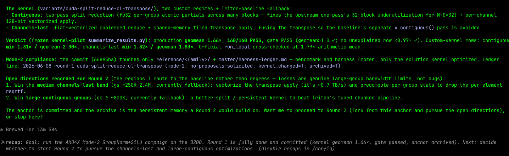
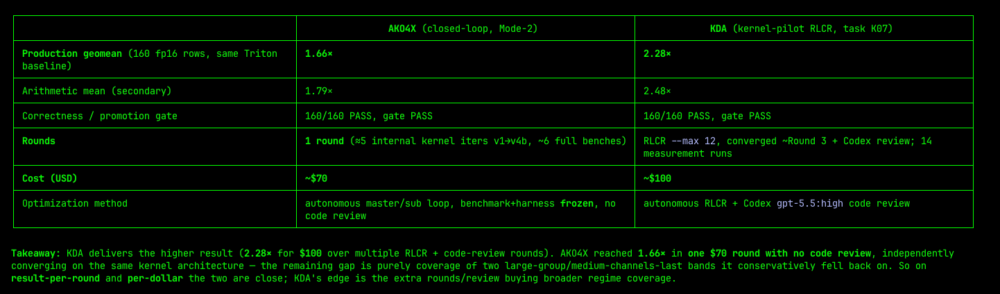

# KDA-Pilot로 SGLang Diffusion Kernel을 최적화한 효과와 경험

## Task definition

Diffusion의 경우 대부분의 task가 compute heavy이고, GEMM(cublas)과 Attention(FA3)이 compute를 지배하므로 LLM과 비교하면 Kernel Agent를 사용할 수 있는 여지가 그리 크지 않습니다. 또한 일반적으로 bs=1입니다.

최적화해야 할 Kernel은 현재 SGLang Diffusion에서 이미 다양한 방식으로 구현된 일부 fuse kernel, 또는 Torch implementation보다 더 빠른 kernel에 주로 집중됩니다.

Diffusion task를 정의할 때 저는 https://github.com/sgl-project/sglang/tree/main/python/sglang/multimodal_gen/.claude/skills/sglang-diffusion-benchmark-profile 이 skill의 benchmark command를 기반으로 실제 diffusion model 20개를 실행했습니다. 그런 다음 각 model 안의 대응 operator input meta 등 정보를 기록하고, 마지막으로 각 kernel의 서로 다른 meta 정보를 모아 하나의 kernel optimization task로 만들었습니다. 이 task들은 거의 compute bound가 아니며, 주로 memory bound와 latency bound입니다.

LLM의 경우 CookBook command를 기준으로 삼고, 서로 다른 두 scenario의 dataset(chat과 summary)에서 high/mid/low concurrency를 설정한 뒤, 이 model들을 해당 설정 조합으로 실행합니다. 동시에 profile을 통해 kernel 비중을 얻고, cudnn gemm과 Attention을 제외한 다른 >1% 비중의 kernel도 하나의 kernel optimization task로 모읍니다. 이 task들도 서로 다른 dataset과 concurrency 아래의 meta 정보를 포함합니다. LLM 쪽에서 기록되는 meta 정보는 많을 수 있으므로, batch 단위로 filtering해야 합니다. 구체적으로는 roofline model을 통해 density gap이 크지 않은 kernel을 하나의 class로 merge합니다. 현재는 이 task를 수행할 때 resource bound에 걸렸습니다. machine과 card가 필요하지만 open source community machine으로는 완전한 8장 idle card를 더 이상 모으기 어렵습니다. 이후에는 GEMM류 compute bound operator가 어느 정도까지 최적화될 수 있는지 더 살펴볼 예정입니다.

## SGLang Diffusion Kernel 최적화 효과

아래 표는 B200에서의 wall metric, 즉 사용자가 실제로 볼 수 있는 end-to-end latency를 보여줍니다. 여기에는 Python, dispatch, wrapper, kernel launch, 그리고 `cuda.synchronize()`에서 보이는 synchronization overhead가 포함됩니다. optimization task와 reproduction code는 모두 [BBuf/KDA-Pilot](https://github.com/BBuf/KDA-Pilot)에서 가져왔습니다.

| Kernel | B200 wall geomean | Per-shape wall speedup | Notes |
|---|---:|---|---|
| qknorm_rope | 1.1341x | large 1.145-1.279x; small 1.043-1.059x | B/T/S = tokens; H = heads; D = head dim; R = RoPE dim |
| norm_infer | 1.3523x | helios 1.201x; RMS large 1.078x; RMS small 1.634-1.641x | M/N = matrix dimensions; S = token/row count; D = hidden dim |
| rotary_embedding | 1.4912x | hunyuanvideo 2.087x; ltx2 1.133-1.622x | B = batch; S/T = seq len; H = heads; half64/half32 = RoPE half-dim bucket |
| cutedsl_norm_tanh_mul_add | 1.4953x | v1 1.602-1.625x; v2 1.378-1.394x | S = tokens; v1 = single op; v2 = dual op |
| cutedsl_norm_scale_shift | 1.3201x | firered 1.277-1.364x; helios 1.111-1.283x; hunyuan 1.388-1.516x; joyai 1.477-1.495x; mova 1.193-1.350x; qwen 1.243-1.489x; wan 1.096-1.351x | 11D = [1,1,D]; 1D = [1,D]; 1SD = [1,S,D]; g = gate tensor |
| fuse_scale_shift | 2.7499x | qwen/qwen-edit/firered small bcast11 7.365-7.891x; 8424 bcast/full3d 1.462-1.747x; gated/resgated 1.020-1.068x; hunyuanvideo 1.166-8.878x; wan 1.267-1.904x | B = batch; s/S/L = tokens; c/C = channels; bcast11 = [1,1,C] broadcast; full3d = [B,S,C]; NC = non-contiguous layout |
| group_norm_silu | 2.3118x | C-layout giant/fallback rows 0.947-1.192x; NC large rows 1.158-3.648x; small/mid C rows 1.369-4.982x; small/mid NC rows 1.791-3.240x | Shape format BxCx... from frozen HunyuanVideo rows; C = contiguous; NC = non-contiguous/channels-last path; apply/triton are both public entry paths |

아래 표는 B200 kernel task에서 최신 code에 실제로 남은 optimization path만 설명합니다. 여기서 round는 `solutions.jsonl`, `docs/run_log.md`, 최종 source code의 traceable record를 기준으로 통계냈습니다. 일부는 완전한 RLCR round이고, 일부는 같은 round 안의 candidate number 또는 remote run입니다. 표의 16B/32B는 최종 code가 선택한 per-thread vector access width를 뜻하며, B200의 hardware upper bound가 아닙니다. B200은 256-bit vectorized access를 지원하지만, 일부 kernel은 alignment, register pressure, occupancy, cache hint 때문에 여전히 128-bit를 선택합니다.

| Kernel | RLCR / candidate line | 최신 code에 남은 path | KernelWiki / reference implementation | 이 task의 key technique |
|---|---|---|---|---|
| qknorm_rope | R4-R9: R5 staged, R8 overlay no-go, R9 in-tree arbiter pass | SGLang in-tree `.cuh` replacement를 사용하고 `kda_kernels` Python overlay는 사용하지 않음; production template bf16, head=128, rope=128, non-NeoX, token >= 512일 때 `QKNormRopeKernel` 내부에서 staged kernel로 전환, 다른 template과 small shape은 원래 warp path 유지 | **TensorRT-LLM PR-13052/11869 fused DiT QKNorm+RoPE; SGLang PR-15141/19059/21440/21654 fused qknorm_rope; pattern-memory-bound** | CTA-per-token, cos/sin row를 shared memory에 staged한 뒤 Q/K heads 사이에서 재사용; NCU long-scoreboard evidence로 device win 확인; `register_custom_op`를 유지해 Python dispatch tax 회피; two token/CTA staged2는 거절 |
| norm_infer | Round 1 + Round 2; large RMS는 cand-0008/0009 no-go에서 cand-0010/0012 promoted | fp32 LayerNorm은 `LayerNormInferKernel`; bf16 RMS small/mid는 one-warp-per-row; huge-S RMS는 `RmsNormTiledKernel<128,32,bf16>` persistent grid; 나머지 signature는 fail-closed fallback | **pattern-memory-bound; technique-vectorized-loads; technique-register-budgeting; vLLM PR-31828 SM100 RMSNorm opt-in path** | LN은 16B `float4` load/store, small RMS는 8B bf16 vector, huge RMS는 16B bf16 vector; small/mid는 low-overhead warp-row mode; huge-S는 multi-row tile, half-warp segmented reduction, persistent whole-wave grid로 load latency 숨김 |
| rotary_embedding | R0-R2 + continuation; cuda-v1 to cuda-v7, 최종 cuda-v6 유지 및 sglang main으로 재측정 | captured standard RoPE와 LTX2 split RoPE signature에만 CUDA fast path 활성화; non-captured signature는 원래 SGLang baseline으로 fallback | **SGLang PR-24411 LTX2 split rotary; technique-vectorized-loads; vLLM PR-21126/30729 FlashInfer RoPE routing** | 128-bit vectorized load/store; standard path는 shared cos/sin sync를 제거하고 cos/sin을 register로 hoist; LTX2는 block-size matching; two rows/CTA, double-buffer, TMA/persistent 방향은 evidence로 거절 |
| cutedsl_norm_tanh_mul_add | r0-r4: baseline NCU -> hoisted tanh v1 -> launch-bounds K sweep v2 -> prefetch/v2hint no-go -> dispatch-symmetric arbiter | 두 public custom-op body 안에서 먼저 native CUDA를 시도하고, `native_supported`가 만족되지 않으면 원래 CuTe-DSL fallback 유지; 최종 default는 K=8, PDL off, no fast-math | **pattern-memory-bound; technique-vectorized-loads; technique-register-budgeting** | production scale이 row-invariant임을 식별하고 `tanh(scale)`과 `1+scale2`를 hoist; `__launch_bounds__`로 register를 줄이고 4 CTA/SM 유지; bf16/fp16은 128-bit, fp32는 256-bit vectorized load/store; exact `tanhf`와 baseline rounding semantic 유지 |
| cutedsl_norm_scale_shift | r0-r6: native v1 -> audit/vec16/two-pass v2 -> Welford no-go -> r6 rebind | fail-closed dispatcher가 entry, operand class, dtype, gate, weight/bias에 따라 10개 native CUDA template 선택; 다른 signature는 vendored baseline으로 fallback | **SGLang PR-14717 CuTe-DSL norm/scale/shift fusion; technique-vectorized-loads; technique-register-budgeting** | row-per-CTA; bf16-only bucket은 32B vector, fp32 operand가 닿는 bucket은 16B vector; two-pass variance로 numerical contract 유지; scalar/row/token operand classification; Welford/Chan single-pass merge는 dependency chain 때문에 느려져 거절 |
| fuse_scale_shift | RLCR Round 0-2: v0 correct port -> v1 rowgrid/flatvec/exact-C -> v2 one-pass reduction -> review-phase numerics fix | 하나의 CUDA module 내부 dispatch: EP1은 rowgrid, flatvec 또는 strided generic; EP2/EP3은 exact-C vector kernel 또는 generic; production row에는 baseline fallback 불필요 | **SGLang PR-14717 fused norm/scale/shift family; technique-vectorized-loads; technique-cache-policy; pattern-memory-bound** | 최종 code는 16B `uint4` vectorized streaming 사용; `__ldcs`/`__stcs`는 x/out stream 처리, `__ldg`는 재사용되는 modulation row 처리; small S는 flatvec으로 occupancy 향상; exact-C는 Triton block padding 회피; bf16/fp16은 shifted one-pass, fp32는 centered two-pass |
| group_norm_silu | Run 1-14; Run 5 이후 세 round의 NCU-backed fix, Run 14는 review-phase final evidence | Python이 group_size/layout에 따라 baseline fallback 또는 CUDA 선택; CUDA 내부에는 `cont_small`, `cont_split`, `nchw_last`, generic 네 regime가 있음; giant contiguous bucket은 copied Triton baseline으로 fallback | **SGLang PR-22814/23148/23938 GroupNorm+SiLU; pattern-memory-bound; technique-vectorized-loads** | contiguous small은 one-CTA/group의 16B two-pass; contiguous mid는 split-group stats, last-CTA finalize, generation counters, division-free apply; channels-last는 original layout대로 읽고 shared-memory staged transpose 후 contiguous output 작성; giant bucket은 NCU가 bandwidth/writeback 제한을 증명해 fallback |

## Reward Hacking

첫 번째는 fast math입니다. Opus 4.8의 optimization 과정에서 각 kernel이 기본적으로 fast math를 켰는데, 이는 맞지 않습니다. 이후 prompt에서 nvcc compile command를 강하게 제한했고, fast math를 켜지 말라고 했습니다. SGLang framework의 kernel도 fast math를 켜지 않기 때문입니다.

두 번째는 어떤 SGLang code도 침범하지 말라는 것입니다. 처음 benchmark를 비교할 때는 Agent가 SGLang operator를 직접 호출하게 하면 된다고 생각했습니다. 하지만 나중에 low latency shape에 대응하는 kernel에서는 SGLang 자체 overhead, 예를 들어 register custom op가 Opus 4.8의 optimization을 완전히 방해했고, 최종 결과가 어긋났습니다. Benchmark framework와 operator export 방식(tvm-ffi)을 하나의 고정 template로 통일하고, SGLang main branch에서 kernel code를 copy하는 것만 허용했습니다. interface export와 call은 [BBuf/KDA-Pilot](https://github.com/BBuf/KDA-Pilot) 안에서 완전히 통일해 이런 Reward Hacking을 피했습니다.

## Humanize RLCR Loop에서 직접 밟은 2가지 함정

Bash version은 Humanize hook의 stability에 영향을 줍니다. macOS 기본 `/bin/bash`는 아직 3.2이고, `set -u` 아래에서 empty array를 expand하면 `unbound variable`이 발생해 일부 Stop hook의 static template rendering이 실패합니다. BBuf/humanize #1(https://github.com/BBuf/humanize/pull/1)은 `env "${env_vars[@]}" awk ...`를 Bash 3.2와 compatible한 empty array 방식으로 바꿨습니다. BBuf/KDA-Pilot #28(https://github.com/BBuf/KDA-Pilot/pull/28)은 launcher layer에서 Homebrew Bash를 우선 선택하고 `/bin/bash` 3.2를 거절합니다. 비교적 새로운 macOS system에서는 문제가 없습니다.

Codex hook feature 이름 변화도 Humanize RLCR을 멈추게 만들 수 있습니다. 이전 logic은 `codex_hooks`만 disable했지만, 새 Codex가 expose하는 것은 `hooks`와 `plugin_hooks`입니다. nested `codex exec/review`가 outer Stop Hook을 다시 trigger해 recursion을 만들 수 있습니다. PolyArch/humanize #194(https://github.com/PolyArch/humanize/pull/194)는 현재 Codex가 어떤 `--disable` feature를 지원하는지 먼저 probe한 뒤, 지원하는 항목만 전달하고 결과를 cache하도록 바꿨습니다. 대응하는 Humanize plugin version도 `1.17.0`으로 동기화되었습니다. 오래 `running stop hook`에 머문다면 먼저 upgrade를 확인하세요.

## vs AKO

AKO의 Mode 2 — Closed-loop (default)를 켜면 이후 각 Round마다 제가 직접 눌러야 합니다.

cost, convergence speed, interactivity를 고려하면 현재 KDA가 SGLang Kernel 최적화에 더 적합합니다.

AKO는 external skill을 지원하므로 kernel-wiki와 ncu-report-skill을 붙일 수도 있지만, interaction experience를 개선할 수는 없습니다.

## 기존 open source Kernel Agent가 해결하지 못하는 문제

https://github.com/BBuf/KDA-Pilot/tree/main/kernels/b200_fa4_mha__bf16_head128_total32768 에서는 KDA로 CUDA를 작성해 AVO처럼 7일 iteration 후 cutedsl fa4를 넘어서는 결과를 재현할 수 없습니다. 아직 갈 길이 더 남아 있습니다.
