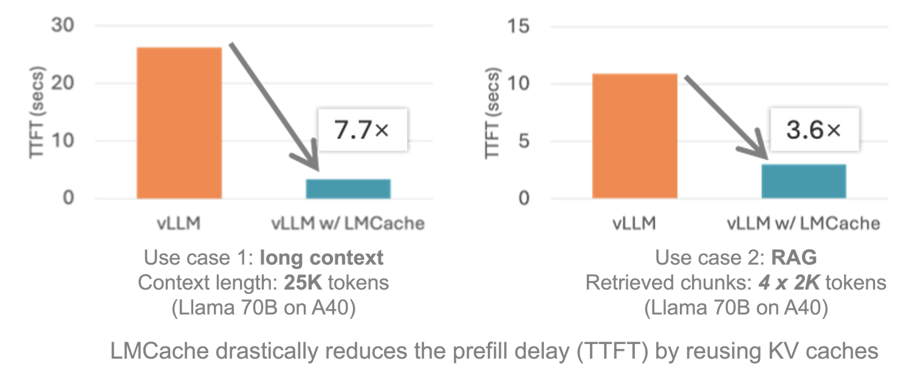

# LMCache + SGLang Feature 해설

## 0x0. 머리말

전통적인 대형 모델 추론은 새 요청을 받을 때마다 KV Cache를 처음부터 계산해야 한다. 현재 요청이 다른 요청과 공통 prefix를 갖는 경우에는 그 prefix에 대해 이미 계산된 KV Cache를 재사용할 수 있지만, 그렇지 않으면 다시 계산해야 한다. 특히 긴 텍스트, 예를 들어 100K token 문서를 처리할 때 GPU memory와 compute resource 소모가 매우 크다. LMCache(https://github.com/LMCache/LMCache)의 핵심 돌파구는 KV Cache의 생성과 사용을 분리한 데 있다. 핵심 feature는 다음과 같다.

**cross-level storage**: 자주 쓰이는 KV Cache를 GPU memory → CPU memory → local disk의 3단계 storage에 cache하고, GPU memory가 부족하면 자동으로 아래 tier로 내린다.
**cross-request reuse**: 같은 prefix만 재사용하는 전통적인 Prefix Caching과 달리, **임의 위치에서 반복되는 텍스트의 KV Cache도 추출해 재사용**할 수 있다.
**distributed sharing**: 여러 vLLM instance가 같은 cache pool을 공유해 중복 계산을 피한다.
**pinned memory + cuda kernel 기반 zero-copy transfer**: cuda kernel 안에서 pinned memory를 직접 access해 copy한다. CUDA는 pinned memory에는 직접 access할 수 있지만 일반 CPU memory에는 직접 access할 수 없다.

32K context의 multi-turn conversation 시나리오에서 TTFT(first token latency)는 1.8초에서 0.4초로 내려갔고, GPU utilization은 40% 감소했다.



최근 LMCache도 SGLang을 지원하기 시작했다. SGLang 자체에도 이미 HiCache라는 비슷한 기능의 component가 있다. 또한 LMCache가 SGLang code를 수정한 부분은 SGLang repository에 merge되지는 않았다. 그래도 이 adaptation 방식을 이해하면 LMCache의 runtime flow와 SGLang의 KV Cache management를 더 깊이 이해할 수 있다. 그래서 이 글은 https://github.com/LMCache/LMCache/pull/869 의 end-to-end SGLang support PR과 https://github.com/Oasis-Git/sglang/tree/lmcache/benchmark/benchmark_lmcache 의 SGLang 개조 내용을 바탕으로, LMCache에서 새 inference framework를 어떻게 지원하고 위에서 언급한 cross-level storage, cross-request reuse, distributed sharing feature를 어떻게 얻게 하는지 빠르게 훑어본다. 현재 한 가지 제한은 LMCache가 adapt한 SGLang이 Layer-by-Layer KV Cache transfer를 지원하지 않고, 각 layer의 KV Cache를 하나의 tensor로 concat해 transfer한다는 점이다.

## 0x1. LMCache + SGLang 사용 방식

이 예시는 SGLang과 LMCache integration을 사용하는 방법을 보여준다.

### 설치

이 프로젝트는 SGLang repository의 pending pull request에 의존한다. 해당 PR이 merge되기 전에는 SGLang main branch가 아니라 특정 branch의 code를 사용해야 한다.

```bash
git clone https://github.com/Oasis-Git/sglang/tree/lmcache
cd sglang

pip install --upgrade pip
pip install -e "python[all]"
```

### Server script

LMCache가 포함된 SGLang server를 실행하려면 다음을 실행한다.

```bash
export LMCACHE_USE_EXPERIMENTAL=True
export LMCACHE_CONFIG_FILE=lmcache_config.yaml
python -m sglang.launch_server --model-path Qwen/Qwen2.5-14B-Instruct --port 30000 --tp 2 --page-size 32 --enable-lmcache-connector
```

benchmark를 실행하려면 `https://github.com/Oasis-Git/sglang/tree/lmcache/benchmark/benchmark_lmcache` 를 참고한다.

그리고 `lmcache_config.yaml` 파일 내용은 다음과 같다.

```shell
# Basic configurations
chunk_size: 64

# CPU offloading configurations
local_cpu: true
max_local_cpu_size: 60.0
```

여기서 `max_local_cpu_size`는 local 최대 offload memory size를 제어하며 단위는 GB다. 여기서 말하는 memory는 pinned memory다. LMCache가 KV Cache transfer에 쓰는 것이 바로 pinned memory + cuda kernel 기반 zero-copy transfer이다. 즉 kernel에서 pinned memory를 직접 access해 copy한다. CUDA는 pinned memory에는 직접 access할 수 있지만 일반 CPU memory에는 직접 access할 수 없다.

다음 절에서 transfer CUDA kernel 구현을 분석할 때 `get_kernel_ptr` 함수가 나온다. 이 함수가 얻는 CPU memory는 반드시 pinned memory여야 한다.

```c++
template <typename T, typename TENSOR_TYPE>
T* get_kernel_ptr(TENSOR_TYPE& tensor) {
  // Get the kernel-accessible pointer of the given type T
  // Returns NULL if the tensor is on CPU and non-pinned
  torch::Device device = tensor.device();
  if (device.is_cuda()) {
    return static_cast<T*>(tensor.data_ptr());
  } else if (device.is_cpu() && tensor.is_pinned()) {
    T* ptr;
    cudaHostGetDevicePointer((void**)&ptr,
                             static_cast<void*>(tensor.data_ptr()), 0);
    return ptr;
  } else if (device.is_cpu()) {
    // return NULL;
    TORCH_CHECK(false, "Invalid device. Device must be cuda or pinned cpu.");
  } else {
    TORCH_CHECK(false, "Invalid device. Device must be cuda or pinned cpu.");
  }
}
```

## 0x2. LMCache SGLangGPUConnector 구현

SGLangGPUConnector는 LMCache 안에서 SGLang의 CPU/GPU memory 사이 KV Cache data transfer를 관리하는 connector이며, LMCache의 GPUConnectorInterface class를 상속한다. 아래 code를 보면 SGLangGPUConnector는 multi-layer transformer의 key/value cache를 관리하고, slot mapping으로 prefix cache와 partial cache scenario를 처리하며, multi-GPU 환경을 지원한다. 핵심 장점은 memory copy overhead를 줄이고 asynchronous transfer와 intelligent synchronization mechanism을 지원해, large language model inference의 performance와 memory efficiency를 크게 높인다는 점이다.

```python
class SGLangGPUConnector(GPUConnectorInterface):
    """
    SGLang GPU connector for managing GPU KV Cache data transfer.
    
    GPU KV Cache should be a list of tensors, one tensor per layer,
    with independent key and value pointers. Concretely:
    - kvcaches: Tuple[List[Tensor], List[Tensor]]
      - first element is the list of key tensors, one tensor per layer
      - second element is the list of value tensors, one tensor per layer
    - each tensor shape: [page_buffer_size, head_num, head_size]

    This connector uses pointer arrays for efficient access and manages
    KV Cache data transfer between SGLang CPU/GPU memory and LMCache.
    It produces/consumes memory objects in KV_2LTD format.
    """

    def __init__(
        self, hidden_dim_size: int, num_layers: int, use_gpu: bool = False, **kwargs
    ):
        """
        Initialize the SGLang GPU connector.
        
        Args:
            hidden_dim_size: hidden dimension size
            num_layers: number of model layers
            use_gpu: whether to use a GPU buffer
            **kwargs: additional arguments including chunk_size, device, dtype, etc.
        """
        self.hidden_dim_size = hidden_dim_size
        self.num_layers = num_layers
        
        # Create key and value pointer arrays on CPU to store tensor pointers for each layer
        self.key_pointers = torch.empty(num_layers, dtype=torch.int64, device="cpu")
        self.value_pointers = torch.empty(num_layers, dtype=torch.int64, device="cpu")

        # Dictionaries storing key/value pointers on GPU, organized by device index
        self.key_pointers_on_gpu: dict[int, torch.Tensor] = {}
        self.value_pointers_on_gpu: dict[int, torch.Tensor] = {}
        self.page_buffer_size = 0

        # GPU buffer for temporary data
        self.gpu_buffer: Optional[torch.Tensor] = None
        if use_gpu:
            # chunk_size and device must be provided when using GPU
            assert "chunk_size" in kwargs, (
                "chunk_size should be provided to create a GPU buffer."
            )
            assert "device" in kwargs, (
                "device should be provided to create a GPU buffer."
            )
            # Create GPU buffer according to chunk_size
            shape = self.get_shape(kwargs["chunk_size"])
            self.gpu_buffer = torch.empty(
                shape, dtype=kwargs["dtype"], device=kwargs["device"]
            )
            logger.info(f"GPU buffer: {self.gpu_buffer.shape}")

    def _initialize_pointers(self, kv_caches: List[torch.Tensor]) -> torch.Tensor:
        """
        Initialize pointer arrays and copy the CPU pointers to GPU.
        
        Args:
            kv_caches: KV Cache list containing key and value tensors
            
        Returns:
            key and value pointer arrays on GPU
        """
        k, v = kv_caches
        # Store the memory addresses of each layer's key/value tensors into CPU pointer arrays
        self.key_pointers.numpy()[:] = [t.data_ptr() for t in k]
        self.value_pointers.numpy()[:] = [t.data_ptr() for t in v]
        
        device = k[0].device
        assert device.type == "cuda", "The device should be CUDA."
        idx = device.index
        
        # Create pointer arrays if this GPU device does not have them yet
        if idx not in self.key_pointers_on_gpu:
            self.key_pointers_on_gpu[idx] = torch.empty(
                self.num_layers, dtype=torch.int64, device=device
            )
        if idx not in self.value_pointers_on_gpu:
            self.value_pointers_on_gpu[idx] = torch.empty(
                self.num_layers, dtype=torch.int64, device=device
            )
        
        # Copy CPU pointers to GPU
        self.key_pointers_on_gpu[idx].copy_(self.key_pointers)
        self.value_pointers_on_gpu[idx].copy_(self.value_pointers)

        # Record page buffer size
        self.page_buffer_size = k[0].shape[0]
        return self.key_pointers_on_gpu[idx], self.value_pointers_on_gpu[idx]

    @_lmcache_nvtx_annotate
    def to_gpu(self, memory_obj: MemoryObj, start: int, end: int, **kwargs):
        """
        Transfer data in the memory object to GPU.
        
        Expects 'kvcaches' in kwargs, a nested tuple of K and V tensors.
        kvcaches should correspond to the entire token sequence.
        
        Notes:
          1. This function expects 'slot_mapping' to be a partial slot mapping
             whose length is the same as the uncached token sequence.
          2. With prefix cache, slot_mapping starts with -1 until the matched
             prefix ends. start and end should never overlap the prefix cache,
             which means the underlying CUDA kernel should never see -1 in slot_mapping.
        
        Args:
            memory_obj: memory object to transfer
            start: start position
            end: end position
            **kwargs: arguments such as kvcaches and slot_mapping
            
        Raises:
            ValueError: if 'kvcaches' or 'slot_mapping' is not provided
            AssertionError: if the memory object has no tensor
        """
        assert memory_obj.tensor is not None

        # Check memory object format
        if memory_obj.metadata.fmt != MemoryFormat.KV_2LTD:
            raise ValueError(
                "The memory object should be in KV_2LTD format in"
                " order to be processed by VLLMPagedMemGPUConnector"
            )

        # Validate required arguments
        if "kvcaches" not in kwargs:
            raise ValueError("'kvcaches' should be provided in kwargs.")

        if "slot_mapping" not in kwargs:
            raise ValueError("'slot_mapping' should be provided in kwargs.")

        offset = kwargs.get("offset", 0)

        kvcaches: List[torch.Tensor] = kwargs["kvcaches"]
        slot_mapping: torch.Tensor = kwargs["slot_mapping"]

        # Initialize pointers and perform data transfer
        key_pointers, value_pointers = self._initialize_pointers(kvcaches)
        lmc_ops.multi_layer_kv_transfer_unilateral(
            memory_obj.tensor,
            key_pointers,
            value_pointers,
            slot_mapping[start - offset : end - offset],
            kvcaches[0][0].device,
            self.page_buffer_size,
            False,  # False means transfer from CPU to GPU
        )

    @_lmcache_nvtx_annotate
    def from_gpu(self, memory_obj: MemoryObj, start: int, end: int, **kwargs):
        """
        Transfer data from GPU to the memory object.
        
        Expects 'kvcaches' in kwargs, a nested tuple of K and V tensors.
        kvcaches should correspond to the entire token sequence.
        
        This function sets memory_obj.metadata.fmt to MemoryFormat.KV_2LTD.
        
        Notes:
          1. This function expects 'slot_mapping' to be a partial slot mapping
             whose length is the same as the uncached token sequence.
          2. With prefix cache, slot_mapping starts with -1 until the matched
             prefix ends. start and end should never overlap the prefix cache,
             which means the underlying CUDA kernel should never see -1 in slot_mapping.
        
        Args:
            memory_obj: target memory object
            start: start position
            end: end position
            **kwargs: arguments such as kvcaches and slot_mapping
            
        Raises:
            ValueError: if 'kvcaches' or 'slot_mapping' is not provided
            AssertionError: if the memory object has no tensor
        """
        assert memory_obj.tensor is not None

        # Validate required arguments
        if "kvcaches" not in kwargs:
            raise ValueError("'kvcaches' should be provided in kwargs.")

        if "slot_mapping" not in kwargs:
            raise ValueError("'slot_mapping' should be provided in kwargs.")

        kvcaches: List[torch.Tensor] = kwargs["kvcaches"]
        slot_mapping: torch.Tensor = kwargs["slot_mapping"]

        # Initialize pointers
        key_pointers, value_pointers = self._initialize_pointers(kvcaches)

        # Select transfer strategy based on whether a GPU buffer exists
        if self.gpu_buffer is None or end - start != self.gpu_buffer.shape[2]:
            # Direct transfer: GPU -> memory object
            lmc_ops.multi_layer_kv_transfer_unilateral(
                memory_obj.tensor,
                key_pointers,
                value_pointers,
                slot_mapping[start:end],
                kvcaches[0][0].device,
                self.page_buffer_size,
                True,  # True means transfer from GPU to CPU
            )
        else:
            # Use GPU buffer as intermediate storage: kvcaches -> gpu_buffer -> memobj
            assert self.gpu_buffer.device == kvcaches[0][0].device
            tmp_gpu_buffer = self.gpu_buffer[:, :, : end - start, :]
            lmc_ops.multi_layer_kv_transfer_unilateral(
                tmp_gpu_buffer,
                key_pointers,
                value_pointers,
                slot_mapping[start:end],
                kvcaches[0][0].device,
                self.page_buffer_size,
                True,
            )
            # Copy GPU buffer data into the memory object
            memory_obj.tensor.copy_(tmp_gpu_buffer, non_blocking=True)

        # Force synchronization if the destination buffer is not a CUDA device
        if not memory_obj.tensor.is_cuda:
            # Note: for better performance, we may not want to synchronize every memory object
            torch.cuda.synchronize()

    def get_shape(self, num_tokens: int) -> torch.Size:
        """
        Get tensor shape for the specified number of tokens.
        
        Args:
            num_tokens: number of tokens
            
        Returns:
            tensor shape: [2, num_layers, num_tokens, hidden_dim_size]
        """
        return torch.Size([2, self.num_layers, num_tokens, self.hidden_dim_size])

    # TODO(Yuwei): need to optimize to enable real batching
    def batched_from_gpu(self, memory_objs, starts, ends, **kwargs):
        """
        Batch-transfer data from GPU to multiple memory objects.
        
        Note: the current implementation is serial and needs optimization for real batching.
        
        Args:
            memory_objs: list of memory objects
            starts: list of start positions
            ends: list of end positions
            **kwargs: other arguments
        """
        for memory_obj, start, end in zip(memory_objs, starts, ends, strict=False):
            self.from_gpu(memory_obj, start, end, **kwargs)
```

여기서 `memory_obj` object의 출처는 다음과 같다.

```python
kv_shape = self.gpu_connector.get_shape(num_tokens)
kv_dtype = self.metadata.kv_dtype

# TODO (Jiayi): should be batched in the future
memory_obj = self.storage_manager.allocate(kv_shape, kv_dtype)
```

위 `get_shape` 함수가 반환하는 shape는 `return torch.Size([2, self.num_layers, num_tokens, self.hidden_dim_size])`다. 이것도 token 하나의 계산을 끝낸 뒤 전체를 transfer한다는 점을 보여준다.

이 connector 안의 핵심 kernel은 `lmc_ops.multi_layer_kv_transfer_unilateral`이다. 아래에서 이 kernel 구현을 분석한다.

```c++
/* Compute the linear offset of the KV Cache tensor in LMCache.
 * k_or_v: 0 means key, 1 means value
 * layer_idx: layer index
 * token_idx: token index
 * scalar_offset: scalar offset inside one token
 * scalars_per_token: number of scalars per token
 * num_tokens: total number of tokens
 * num_layers: number of model layers
 */
__device__ __forceinline__ int64_t
key_value_offset(const int k_or_v, const int layer_idx, const int token_idx,
                 const int scalar_offset, const int scalars_per_token,
                 const int num_tokens, const int num_layers) {
  return k_or_v * num_layers * num_tokens * scalars_per_token +
         layer_idx * num_tokens * scalars_per_token +
         token_idx * scalars_per_token + scalar_offset;
}

/* Compute the linear offset inside the paged buffer.
 * token_idx: token index in the sequence
 * scalar_offset: scalar offset inside one token
 * scalars_per_token: number of scalars per token
 */
__device__ __forceinline__ int64_t page_buffer_offset_unilateral(
    const int token_idx, const int scalar_offset, const int scalars_per_token) {
  return token_idx * scalars_per_token + scalar_offset; // Linear address calculation
}

/* Multi-layer KV Cache transfer kernel.
 * Template parameters:
 *   scalar_t: data type template
 *   DIRECTION: transfer direction (true: paged buffer -> LMCache, false: LMCache -> paged buffer)
 * Arguments:
 *   key_value: LMCache KV Cache tensor [2, num_layers, num_tokens, scalars_per_token]
 *   key_ptrs/value_ptrs: pointer arrays for each layer's key/value
 *   slot_mapping: slot mapping from tokens to paged buffer
 *   scalars_per_token: number of scalar elements per token
 *   num_tokens: total number of tokens
 *   num_layers: number of model layers
 *   page_buffer_size: paged buffer size
 */
template <typename scalar_t, bool DIRECTION>
__global__ void load_and_reshape_multi_layer_kernel_unilateral(
    scalar_t* __restrict__ key_value,    // LMCache KV Cache tensor
    scalar_t** __restrict__ key_ptrs,    // key pointer array for each layer
    scalar_t** __restrict__ value_ptrs,  // value pointer array for each layer
    const int64_t* __restrict__ slot_mapping,  // slot mapping table
    const int scalars_per_token, const int num_tokens, const int num_layers,
    const int page_buffer_size) {
  // Get dimension information processed by the current thread
  const int token_id = blockIdx.x;   // Which token to process
  const int layer_id = blockIdx.y;   // Which layer to process
  const int k_or_v = blockIdx.z;     // 0: process key, 1: process value
  const int tid = threadIdx.x;       // Thread ID
  const int num_threads = blockDim.x;// Total number of threads

  // Get the paged-buffer slot for the current token
  const int64_t slot_idx = slot_mapping[token_id];
  int64_t* key_ptr = key_ptrs[layer_id];   // key pointer of the current layer
  int64_t* value_ptr = value_ptrs[layer_id]; // value pointer of the current layer

  if (slot_idx < 0) { // Invalid slot returns directly
    return;
  }

  // Parallel data copy: each thread processes part of the elements in one token
  for (int i = tid; i < scalars_per_token; i += num_threads) {
    // Compute target offset in LMCache
    const int64_t lmcache_offset = key_value_offset(
        k_or_v, layer_id, token_id, i, scalars_per_token, num_tokens, num_layers);
    
    // Compute source offset in the paged buffer
    const int64_t sgl_offset = page_buffer_offset_unilateral(
        slot_idx, i, scalars_per_token);

    // Copy data according to key/value type and direction
    if (k_or_v == 0) { // Process key
      if (DIRECTION)  // paged buffer -> LMCache
        key_value[lmcache_offset] = key_ptr[sgl_offset];
      else            // LMCache -> paged buffer
        key_ptr[sgl_offset] = key_value[lmcache_offset];
    } else {          // Process value
      if (DIRECTION)  // paged buffer -> LMCache
        key_value[lmcache_offset] = value_ptr[sgl_offset];
      else            // LMCache -> paged buffer
        value_ptr[sgl_offset] = key_value[lmcache_offset];
    }
  }
}

/* Multi-layer KV Cache transfer entry function.
 * Arguments:
 *   key_value: target cache tensor [2, num_layers, num_tokens, elements]
 *   key_ptrs/value_ptrs: tensors containing key/value pointers for each layer
 *   slot_mapping: slot mapping tensor [num_tokens]
 *   paged_memory_device: device where paged memory is located
 *   page_buffer_size: paged buffer size
 *   direction: transfer direction (true: paged buffer -> LMCache)
 */
void multi_layer_kv_transfer_unilateral(
    torch::Tensor& key_value,  // Target cache tensor
    const torch::Tensor& key_ptrs,     // key pointer array
    const torch::Tensor& value_ptrs,   // value pointer array
    const torch::Tensor& slot_mapping, // slot mapping
    const torch::Device& paged_memory_device, // paged memory device
    const int page_buffer_size, // paged buffer size
    const bool direction) {     // transfer direction
  // Get the underlying pointers for each tensor
  int64_t* key_value_ptr = get_kernel_ptr<int64_t, torch::Tensor>(key_value);
  int64_t** key_ptrs_ptr = get_kernel_ptr<int64_t*, const torch::Tensor>(key_ptrs);
  int64_t** value_ptrs_ptr = get_kernel_ptr<int64_t*, const torch::Tensor>(value_ptrs);
  const int64_t* slot_mapping_ptr = get_kernel_ptr<const int64_t, const torch::Tensor>(slot_mapping);

  // Compute kernel parameters
  int num_layers = key_value.size(1);    // Number of model layers
  int num_tokens = slot_mapping.size(0); // Total number of tokens
  int num_origin_elements = key_value.size(3); // Number of elements per token
  int elements_per_qword = 8 / key_value.element_size(); // Elements per qword
  int num_qwords = num_origin_elements / elements_per_qword; // Number of qwords to process

  int k_or_v_size = 2; // Process both key and value

  // Set CUDA kernel execution configuration
  dim3 grid(key_value.size(2), key_value.size(1), k_or_v_size); // Three-dimensional grid
  dim3 block(std::min(num_qwords, 128)); // Up to 128 threads per block

  // Set device context and CUDA stream
  const at::cuda::OptionalCUDAGuard device_guard(paged_memory_device);
  const cudaStream_t stream = at::cuda::getCurrentCUDAStream();

  // Select kernel template according to transfer direction
  if (not direction) { // LMCache -> paged buffer
    lmc::load_and_reshape_multi_layer_kernel_unilateral<int64_t, false>
        <<<grid, block, 0, stream>>>(
            key_value_ptr, key_ptrs_ptr, value_ptrs_ptr, slot_mapping_ptr,
            num_qwords, num_tokens, num_layers, page_buffer_size);
    C10_CUDA_KERNEL_LAUNCH_CHECK(); // Check kernel launch status
  } else { // paged buffer -> LMCache
    lmc::load_and_reshape_multi_layer_kernel_unilateral<int64_t, true>
        <<<grid, block, 0, stream>>>(
            key_value_ptr, key_ptrs_ptr, value_ptrs_ptr, slot_mapping_ptr,
            num_qwords, num_tokens, num_layers, page_buffer_size);
    C10_CUDA_KERNEL_LAUNCH_CHECK();
  }
}

void multi_layer_kv_transfer_unilateral(
    torch::Tensor& key_value, const torch::Tensor& key_ptrs,
    const torch::Tensor& value_ptrs, const torch::Tensor& slot_mapping,
    const torch::Device& paged_memory_device, const int page_buffer_size,
    const bool direction);
```

## 0x3. SGLangGPUConnector wrapper

이 SGLangGPUConnector connector가 생긴 뒤에는 https://github.com/LMCache/LMCache/blob/dev/lmcache/integration/sglang/sglang_adapter.py 안에서 한 단계 더 높은 LMCacheConnector class로 감싸야 한다. 이 class에는 두 가지 핵심 API가 있다.

- `load_kv`: LMCache cache에서 저장된 KV Cache를 retrieve해 SGLang의 GPU memory slot에 load하며, prefix token loading skip을 지원한다.
- `store_kv`: SGLang이 계산한 KV Cache를 LMCache cache에 저장해 후속 request에서 재사용하게 한다.

또한 이 class는 model config, distributed 관련 rank, world_size, 그리고 KV Cache pool reference 같은 다른 핵심 정보도 보관한다.

추가로 `init_lmcache_engine` 함수로 LMCache cache engine을 생성하고, KV Cache shape parameter(layer 수, head 수, head dimension 등)를 configure하며, `SGLangGPUConnector` instance를 만들어 GPU memory와 cache 사이 data transfer를 처리해야 한다.

```python
# Standard
from typing import List, Optional

# Third Party
from sglang.srt.configs.model_config import ModelConfig
import torch

# First Party
from lmcache.config import LMCacheEngineMetadata
from lmcache.integration.sglang.utils import ENGINE_NAME, lmcache_get_config
from lmcache.logging import init_logger
from lmcache.v1.cache_engine import LMCacheEngine, LMCacheEngineBuilder
from lmcache.v1.config import LMCacheEngineConfig
from lmcache.v1.gpu_connector import (
    SGLangGPUConnector,
)

logger = init_logger(__name__)


def get_kv_cache_torch_dtype(dtype: str) -> torch.dtype:
    """Get the torch dtype used by KV Cache. Currently only bfloat16 is supported."""
    # TODO: add support for other dtypes
    return torch.bfloat16


def need_gpu_interm_buffer(lmcache_config: LMCacheEngineConfig):
    """Decide whether a GPU intermediate buffer is needed. It is needed when NIXL optimization is not enabled."""
    if lmcache_config.enable_nixl:
        return False  # Direct transfer when NIXL optimization is enabled; no intermediate buffer needed
    else:
        return True   # Intermediate buffer is needed by default


def init_lmcache_engine(
    model_config: ModelConfig,
    tp_size: int,
    rank: int,
    world_size: int,
) -> Optional[LMCacheEngine]:
    """
    Initialize the LMCache engine.
    
    Args:
        model_config: model configuration
        tp_size: tensor parallel size
        rank: GPU rank of the current process
        world_size: total number of GPUs
    Returns:
        LMCacheEngine instance, or None if it already exists
    """
    # Check whether an engine instance already exists
    if LMCacheEngineBuilder.get(ENGINE_NAME) is not None:
        return None

    # Get LMCache configuration
    config = lmcache_get_config()
    assert isinstance(config, LMCacheEngineConfig), "LMCache v1 config parameters are required"

    # Build KV Cache shape parameters for memory pool allocation
    kv_dtype = get_kv_cache_torch_dtype(model_config.dtype)
    num_layer = model_config.num_hidden_layers       # Number of model layers
    chunk_size = config.chunk_size                   # Cache chunk size
    num_kv_head = model_config.get_num_kv_heads(tp_size)  # Number of KV heads
    head_dim = model_config.head_dim                 # Attention head dimension
    kv_shape = (num_layer, 2, chunk_size, num_kv_head, head_dim)  # Shape: [layers, K/V, chunk size, heads, head dim]

    # Set current CUDA device
    torch.cuda.device(rank)
    device = torch.device(f"cuda:{rank}")
    
    # Build engine metadata
    metadata = LMCacheEngineMetadata(
        model_config.model_path,  # Model path
        world_size,               # Total number of GPUs
        rank,                     # Current GPU rank
        "sgl",                    # Backend identifier (sglang)
        kv_dtype,                 # KV dtype
        kv_shape,                 # KV Cache shape
    )

    # Create GPU connector
    use_gpu = need_gpu_interm_buffer(config)
    hidden_dim_size = num_kv_head * head_dim  # Hidden dimension = heads * head dimension
    
    if config.use_layerwise:
        raise ValueError("Layerwise connector is not supported yet")
    else:
        # Create SGLang GPU connector instance
        sglang_gpu_connector = SGLangGPUConnector(
            hidden_dim_size,
            num_layer,
            use_gpu=use_gpu,
            chunk_size=chunk_size,
            dtype=kv_dtype,
            device=device,
        )
    
    # Create/get cache engine instance
    engine = LMCacheEngineBuilder.get_or_create(
        ENGINE_NAME, config, metadata, sglang_gpu_connector
    )

    return engine


class LMCacheConnector:
    """Adapter class between LMCache and SGLang. It manages KV Cache loading/storage."""
    
    def __init__(
        self,
        sgl_config: ModelConfig,
        tp_size: int,
        rank: int,
        world_size: int,
        k_pool: List[torch.Tensor],  # Key cache pool
        v_pool: List[torch.Tensor],  # Value cache pool
    ):
        """Initialize connector and create LMCache engine instance."""
        self.lmcache_engine = init_lmcache_engine(
            sgl_config,
            tp_size,
            rank,
            world_size,
        )
        # Save configuration information
        self.sgl_config = sgl_config
        self.tp_size = tp_size      # Tensor parallel size
        self.rank = rank            # Current GPU rank
        self.world_size = world_size # Total number of GPUs
        self.k_pool = k_pool        # Reference to key cache pool
        self.v_pool = v_pool        # Reference to value cache pool

    ####################
    # Worker side APIs
    ####################

    def load_kv(
        self, token_ids: torch.Tensor, slot_mapping: torch.Tensor, offset: int = 0
    ) -> None:
        """Load KV from cache into specified slots.
        Args:
            token_ids: input token ID sequence
            slot_mapping: mapping from token to cache slot
            offset: number of starting tokens to skip
        Returns:
            number of tokens actually loaded
        """
        # Validate arguments
        assert isinstance(token_ids, torch.Tensor)
        assert isinstance(slot_mapping, torch.Tensor)
        assert (len(token_ids) - offset) == len(slot_mapping)

        # Move slot mapping to GPU
        slot_mapping = slot_mapping.cuda()
        # Create load mask, skipping tokens before offset
        load_mask = torch.ones_like(token_ids, dtype=torch.bool)
        load_mask[:offset] = False

        # Call engine retrieve API
        ret_token_mask = self.lmcache_engine.retrieve(
            token_ids,
            mask=load_mask,
            kvcaches=[self.k_pool, self.v_pool],  # Pass in KV Cache pool
            slot_mapping=slot_mapping,
            offset=offset,
        )

        return ret_token_mask.sum().item()  # Return number of tokens actually loaded

    def store_kv(
        self, token_ids: torch.Tensor, slot_mapping: torch.Tensor, offset: int = 0
    ) -> None:
        """Store KV into specified cache slots.
        Args:
            token_ids: input token ID sequence
            slot_mapping: mapping from token to cache slot
            offset: number of starting tokens to skip
        """
        # Validate arguments
        assert isinstance(token_ids, torch.Tensor)
        assert isinstance(slot_mapping, torch.Tensor)
        assert len(token_ids) == len(slot_mapping)

        # Move slot mapping to GPU
        slot_mapping = slot_mapping.cuda()
        # Create all-True store mask
        store_mask = torch.ones_like(token_ids, dtype=torch.bool)

        # Call engine store API
        self.lmcache_engine.store(
            token_ids,
            mask=store_mask,
            kvcaches=[self.k_pool, self.v_pool],  # Pass in KV Cache pool
            slot_mapping=slot_mapping,
            offset=offset,
        )

    def chunk_size(self):
        """Get cache chunk size of the current configuration."""
        return self.lmcache_engine.config.chunk_size

    def reset(self):
        """Reset cache engine."""
        self.lmcache_engine.clear()

    def close(self):
        """Close cache engine."""
        self.lmcache_engine.close()
```

개인적으로는 여기 이름을 SGLangLMCacheConnector라고 부르는 편이 더 적절해 보인다.

## 0x4. SGLang에서 wrapper된 LMCacheConnector 사용하기

SGLang은 RadixCache 구현 안에서 LMCacheConnector와의 integration을 마무리한다. code 위치는 다음과 같다.

https://github.com/Oasis-Git/sglang/blob/lmcache/python/sglang/srt/mem_cache/radix_cache.py#L102-L461 

RadixCache와 SGLang KV Cache code 분석은 https://github.com/zhaochenyang20/Awesome-ML-SYS-Tutorial/blob/main/sglang/kvcache-code-walk-through/readme-CN.md 를 보면 된다. 먼저 이 문서를 읽어 보는 것을 권한다.

**136-147행에서 initialization 수행**

```python
if self.token_to_kv_pool_allocator is not None and enable_lmcache_connector:
    self.lmcache_connector = LMCacheConnector(
        sgl_config=model_config,
        tp_size=tp_size,
        rank=rank,
        world_size=world_size,
        k_pool=self.token_to_kv_pool_allocator._kvcache.k_buffer,
        v_pool=self.token_to_kv_pool_allocator._kvcache.v_buffer,
    )
    # Create asynchronous write queue and thread
    self.writer_queue = queue.Queue()
    self.shutdown_event = threading.Event()
    self.writer_thread = threading.Thread(target=self._lmcache_writer_worker)
    self.writer_thread.start()
```

- LMCacheConnector instance를 만들고 underlying KV cache pool에 연결한다.
- 독립 write thread를 시작해 main thread blocking을 피한다.
- GPU memory pool reference를 LMCache에 전달한다.

**`match_prefix`의 핵심 logic(187-254행)**

- 사전 검사와 준비

```python
if self.lmcache_connector_enabled():
    # Check whether the prefix is page-aligned
    if len(value) % self.page_size != 0:
        raise ValueError("The prefix is not page-aligned")
    
    uncached_paged_aligned_len = len(key) - len(value)
    chunk_size = self.lmcache_connector.chunk_size()
```

- full hit 처리. RadixCache가 이미 필요한 모든 tokens를 포함하면 바로 반환한다.

```python
if uncached_paged_aligned_len == 0:
    return MatchResult(
        device_indices=value,
        last_device_node=last_node,
        last_host_node=last_node,
    )
```

- prefix padding 계산. LMCache는 chunk alignment를 사용하므로 padding length를 계산해야 한다.

```python
if len(value) % chunk_size != 0:
    prefix_padding_len = len(value) % chunk_size
else:
    prefix_padding_len = 0
```

- slot mapping 구성. prefix padding 부분은 -1로 표시해 저장이 필요 없음을 나타내고, 뒤쪽은 실제 할당된 memory index다.

```python
slot_mapping = torch.cat([
    torch.tensor([-1] * prefix_padding_len, dtype=torch.int64, device=self.device), 
    token_prealloc_indices.detach().clone().to(torch.int64).to(self.device)
])
```

- LMCache에서 data를 load한다.

```python
num_retrieved_tokens = self.lmcache_connector.load_kv(
    key_tokens,
    slot_mapping,
    offset=len(value) - prefix_padding_len,
)
```

- load 결과 처리

```python
if num_retrieved_tokens > 0:
    # Free unused memory
    self.token_to_kv_pool_allocator.free(
        token_prealloc_indices[(num_retrieved_tokens - prefix_padding_len):]
    )
    
    # Create a new tree node
    new_node = TreeNode()
    new_node.key = key[len(value):len(value) + (num_retrieved_tokens - prefix_padding_len)]
    new_node.value = token_prealloc_indices[:num_retrieved_tokens - prefix_padding_len]
    new_node.parent = last_node
    last_node.children[self.get_child_key_fn(...)] = new_node
    
    # Update cache state
    last_node = new_node
    value = torch.cat([value, token_prealloc_indices[:num_retrieved_tokens - prefix_padding_len]])
    self.evictable_size_ += (num_retrieved_tokens - prefix_padding_len)
else:
    # No data retrieved; free all preallocated memory
    self.token_to_kv_pool_allocator.free(token_prealloc_indices)
```

**asynchronous storage logic(311-319행)**

`cache_finished_req` method 안에서:

```python
if self.lmcache_connector_enabled():
    kv_indices_storage, last_node, _, _ = self.match_prefix(token_ids[:page_aligned_len])
    if len(kv_indices_storage) != len(token_ids[:page_aligned_len]):
        raise ValueError("The KV cache is not page-aligned")
    
    self.inc_lock_ref(last_node)  # Increase reference count to prevent eviction
    self.writer_queue.put((token_ids[:page_aligned_len], kv_indices_storage, last_node))
```

**asynchronous write thread(420-444행)**

```python
def _lmcache_writer_worker(self):
    while not self.shutdown_event.is_set():
        try:
            item = self.writer_queue.get(timeout=1)
            if item is None:
                break
            
            token_ids, kv_indices_to_store, last_node = item
            try:
                self.lmcache_connector.store_kv(
                    torch.tensor(token_ids, device=self.device),
                    kv_indices_to_store.detach().clone().to(torch.int64).to(self.device),
                )
            finally:
                self.dec_lock_ref(last_node)  # Release reference count
            self.writer_queue.task_done()
        except queue.Empty:
            continue
        except Exception as e:
            logger.error(f"Error in LMCache writer thread: {e}", exc_info=True)
```

## 0x5. 정리

LMCache는 KV Cache의 생성과 사용을 분리해 cross-level storage, cross-request reuse, distributed sharing 같은 핵심 기능을 구현한다. SGLang과의 integration은 주로 SGLangGPUConnector connector로 이루어진다. 이 connector는 pinned memory 기반 zero-copy transfer 기술과 CUDA kernel을 활용해 GPU memory와 CPU memory 사이에서 multi-layer KV Cache data를 효율적으로 transfer한다. SGLang의 RadixCache에서는 LMCacheConnector wrapper class가 `load_kv`와 `store_kv` interface를 제공하고, asynchronous write mechanism과 결합해 long-context/RAG 같은 scenario의 inference performance를 크게 높일 수 있다.
