# PyTorch 모델 추론 성능 병목을 체계적으로 찾고 분석하는 방법

## 0x0. 서문

블로그 제목은 사실 Zhihu의 질문입니다. 이 글에서는 최근 이틀 동안 SGLang Diffusion이 Qwen-Image-Edit-2511을 추론할 때 LightX2V보다 느린 문제를 실제 예시로 삼아, PyTorch 모델 추론의 성능 병목을 어떻게 체계적으로 찾고 분석하는지 보여줍니다.


## 0x1. H100 단일 카드 benchmark 맞추기

먼저 결과를 재현한 뒤 문제를 찾아야 합니다. [커뮤니티 투고 | LightX2V Day-0 Qwen-Image-Edit-2511 모델 지원, 42배 이상 가속!](https://mp.weixin.qq.com/s/F3o8pwr-KfnCxdX9LsfRMw) 이 글의 데이터 이미지를 보면, 전체 40 steps를 실행할 때 SGLang generate가 LightX2V보다 느리다는 것을 알 수 있습니다.

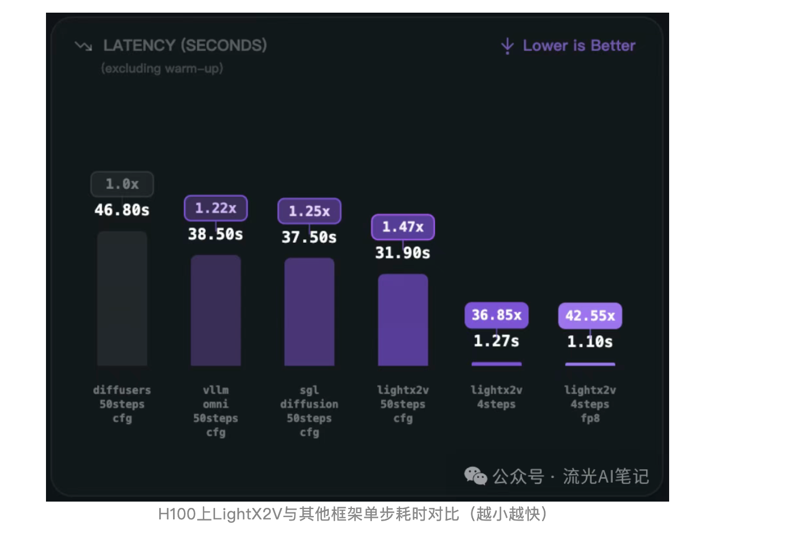

그래서 저는 LightX2V 그룹에 들어가 이 성능을 어떻게 재현하는지 물어보았습니다. 여러 노이즈를 제거한 뒤, 이 성능을 재현하는 스크립트와 prompt, 편집해야 할 이미지를 얻었습니다. 이어서 LightX2V를 설치해 실행했고, 환경을 설정한 뒤 아래 스크립트를 사용했습니다. 실행 환경은 H100 단일 카드입니다.

```shell
#!/bin/bash

# set path and first
export lightx2v_path=/home/lmsys/bbuf/LightX2V
export model_path=Qwen/Qwen-Image-Edit-2511

export CUDA_VISIBLE_DEVICES=0

# set environment variables
source ${lightx2v_path}/scripts/base/base.sh

python -m lightx2v.infer \
    --model_cls qwen_image \
    --task i2i \
    --model_path $model_path \
    --config_json ${lightx2v_path}/configs/qwen_image/qwen_image_i2i_2511.json \
    --prompt "Change the person to a standing position, bending over to hold the dog's front paws." \
    --negative_prompt " " \
    --image_path "/home/lmsys/bbuf/LightX2V/examples/qwen_image/1.png" \
    --save_result_path ${lightx2v_path}/save_results/qwen_image_i2i_2511.png \
    --seed 0
```

실행 결과는 공식 설명과 같았습니다. warmup 이후 DIT의 한 step은 대략 0.63s 정도였습니다.

그런 다음 SGLang에서도 같은 데이터, 같은 prompt, 같은 이미지, 같은 환경, 같은 H100 단일 카드를 사용했습니다.

그리고 https://github.com/sgl-project/sglang/blob/main/python/sglang/multimodal_gen/configs/models/dits/qwenimage.py#L23 의 zero_cond_t를 True로 바꾸어야 위 결과와 맞출 수 있습니다.

```shell
sglang generate --model-path Qwen/Qwen-Image-Edit-2511 --prompt "Change the person to a standing position, bending over to hold the dog's front paws."  --image-path "/home/lmsys/bbuf/LightX2V/examples/qwen_image/1.png"
```

아래는 실행 결과입니다.

```shell
100%|███████████████████████████████████████████████████████████████████████████████████████████████████████████████████████████| 40/40 [00:30<00:00,  1.29it/s]
[12-25 07:11:20] [DenoisingStage] average time per step: 0.7722 seconds
[12-25 07:11:20] [DenoisingStage] finished in 30.8956 seconds
[12-25 07:11:20] [DecodingStage] started...
[12-25 07:11:20] [DecodingStage] finished in 0.5390 seconds
[12-25 07:11:20] Output saved to outputs/Change_the_person_to_a_standing_position_bending_over_to_hold_the_dog_s_front_paws._20251225-071047_08c591d4.jpg
[12-25 07:11:20] Pixel data generated successfully in 33.13 seconds
```


평균 한 step이 0.77s로, LightX2V보다 0.14s 느립니다.

성능 문제가 명확해졌으니, 다음은 성능 병목을 분석하는 단계입니다.

## 0x2. 최종 결과

먼저 결과를 말하겠습니다. 뒤의 두 절에서 설명하는 분석과 최적화를 거친 뒤, https://github.com/sgl-project/sglang/pull/15812 이 PR을 통해 SGLang generate의 한 step 시간도 0.77s에서 0.63s 수준으로 낮췄고, 거의 LightX2V와 같아졌습니다.

PR 이후에도 테스트 명령과 결과는 동일합니다.


```shell
sglang generate --model-path Qwen/Qwen-Image-Edit-2511 --prompt "Change the person to a standing position, bending over to hold the dog's front paws."  --image-path "/home/lmsys/bbuf/LightX2V/examples/qwen_image/1.png"
```

```shell
[12-25 07:00:34] [DenoisingStage] started...
100%|███████████████████████████████████████████████████████████████████████████████████████████████████████████████████████████| 40/40 [00:25<00:00,  1.58it/s]
[12-25 07:00:59] [DenoisingStage] average time per step: 0.6327 seconds
[12-25 07:00:59] [DenoisingStage] finished in 25.3114 seconds
[12-25 07:00:59] [DecodingStage] started...
[12-25 07:01:00] [DecodingStage] finished in 0.5667 seconds
```


아래 두 절에서는 이 성능 병목을 어떻게 체계적으로 찾고 분석했는지 설명합니다.

## 0x3. 모델 구현 계층 분석

첫 번째 분석 지점은 모델 구현 계층입니다. Cursor 같은 AI의 도움을 받아 두 모델 구현의 차이를 초기에 찾을 수 있습니다. 제가 발견한 주요 차이는 LightX2V에 `fuse_scale_shift_gate_select01_kernel`이라는 Triton 연산자가 하나 더 있다는 점입니다. 이 연산자는 https://github.com/sgl-project/sglang/pull/15812/files#diff-a1d4f7adbfc068b3af9b02dbca9fda29b80c734364bc03d6e251600dafbdf6b4R503-R529 이 함수 안의 where 3개와 elementwise 연산자 1개를 하나로 바꿉니다. 저도 바로 적용해 보았고 실제로 향상이 있었습니다. 한 step 속도는 0.77s에서 약 0.73s로 빨라졌습니다. 이후 Nsight Systems 분석에서도 이 차이를 볼 수 있습니다.

#### fuse_scale_shift_gate_select01_kernel: 148us->66us.

main:

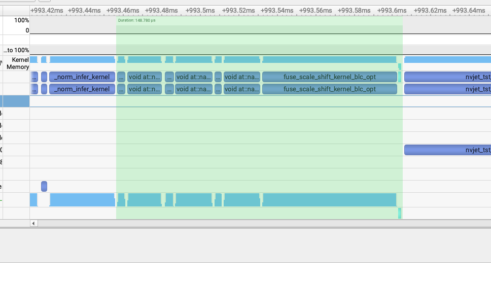

pr:

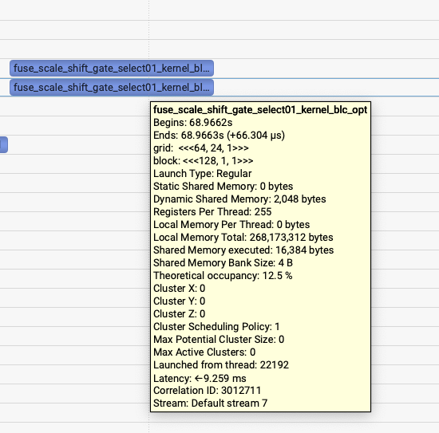


이 triton fuse kernel 최적화가 효과적이라는 것을 볼 수 있습니다.

> 여기서는 nsys profile --trace-fork-before-exec=true --cuda-graph-trace=node  --force-overwrite=true -o qwen_image_edit sglang generate --model-path Qwen/Qwen-Image-Edit-2511 --prompt "Change the person to a standing position, bending over to hold the dog's front paws."  --image-path "/home/lmsys/bbuf/LightX2V/examples/qwen_image/1.png" 명령으로 Nsight Systems profile 결과를 얻었습니다. 이후 windows/mac의 Nsight Systems 데스크톱 소프트웨어로 열면 분석할 수 있습니다. 성능 분석을 할 때는 한 step의 한 layer를 골라 비교하면 됩니다.

## 0x4. Nsight Systems와 결합해 kernel 분석하기

이 시점부터는 AI가 도와주기 어렵습니다. Nsight Systems의 profile 결과를 올바르게 읽기가 어렵기 때문입니다. 그래서 경험을 바탕으로 직접 분석해야 합니다.

위 문제를 해결한 뒤에도 격차가 남아 있었으므로, 다음은 한 step의 한 layer를 고정한 뒤 분석하는 것이었습니다. 같은 방법으로 LightX2V의 profile 결과도 생성했습니다.

```shell
#!/bin/bash

# set path and first
export lightx2v_path=/home/lmsys/bbuf/LightX2V
export model_path=Qwen/Qwen-Image-Edit-2511

export CUDA_VISIBLE_DEVICES=0

# set environment variables
source ${lightx2v_path}/scripts/base/base.sh

nsys profile --trace-fork-before-exec=true --cuda-graph-trace=node  --force-overwrite=true -o lightx2v_qwen_image_edit python -m lightx2v.infer \
    --model_cls qwen_image \
    --task i2i \
    --model_path $model_path \
    --config_json ${lightx2v_path}/configs/qwen_image/qwen_image_i2i_2511.json \
    --prompt "Change the person to a standing position, bending over to hold the dog's front paws." \
    --negative_prompt " " \
    --image_path "/home/lmsys/bbuf/LightX2V/examples/qwen_image/1.png" \
    --save_result_path ${lightx2v_path}/save_results/qwen_image_i2i_2511.png \
    --seed 0
```

이제 비교를 시작합니다. flash attention kernel은 비교적 명확하므로, 두 flash attention kernel을 TimeLine의 좌우 끝점으로 삼고 중간의 각 kernel을 비교했습니다. 비교 후 세 가지 문제를 발견했습니다.

### use upstream fa3 , not sgl-kernel fa3 : 1.7ms->1.2ms

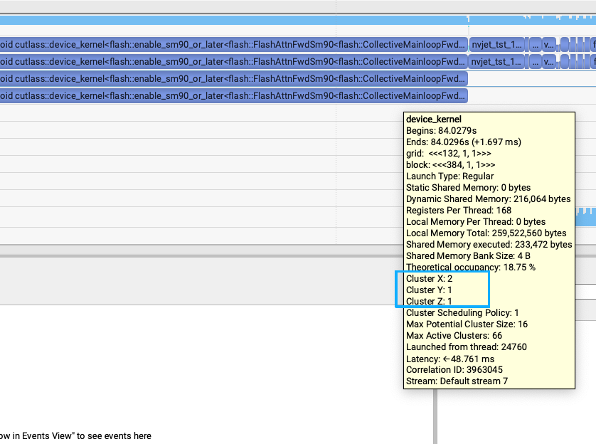

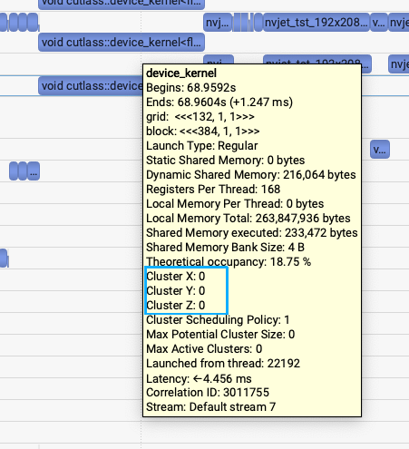


첫 번째 문제는 SGLang generate와 LightX2V generate의 flash attention V3 kernel 시간이 꽤 크게 다르다는 점이었습니다. 1.7ms와 1.1-1.2ms의 차이입니다. 핵심 차이는 SGLang Diffusion은 sgl-kernel의 fa3 인터페이스를 사용하지만, LightX2V는 공식 flash-attention 라이브러리의 fa3 인터페이스를 사용한다는 점입니다. 위 두 그림에서도 미묘한 차이를 발견할 수 있습니다. 그래서 SGLang Diffusion의 fa3 인터페이스를 upstream fa3 인터페이스로 바꾼 뒤, 시간은 약 1.7ms에서 약 1.2ms로 내려갔습니다.

### flashinfer rope: 241us->82us

두 번째 발견은 LightX2V가 FlashInfer 라이브러리의 rope 구현을 사용하고, SGLang Diffusion은 Triton 구현의 rope를 사용한다는 점입니다.

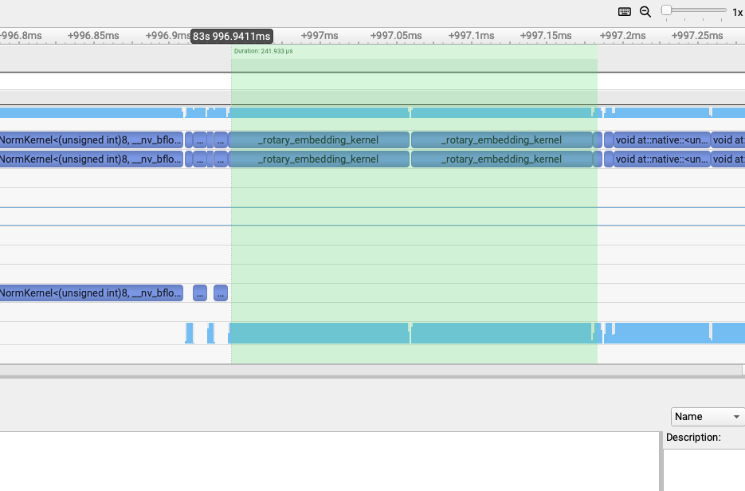

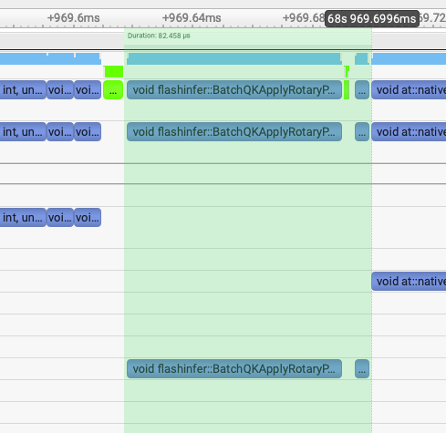

SGLang Diffusion의 rope 구현을 FlashInfer의 rope 구현으로 바꾼 뒤, 두 rope 부분의 kernel 총 시간은 약 241us에서 82us로 줄었습니다.

### revert pack qkv to avoid unaligned cat kernel: 154.5us->70us

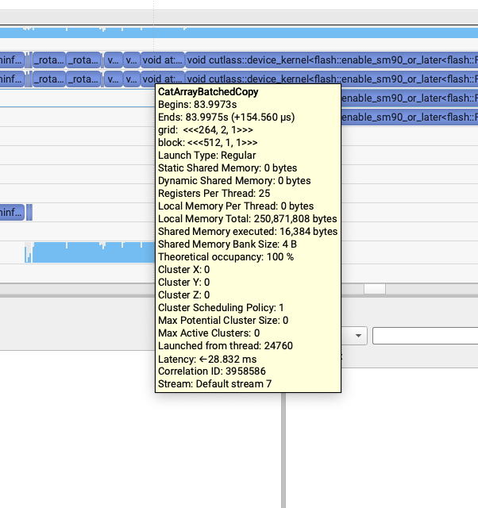

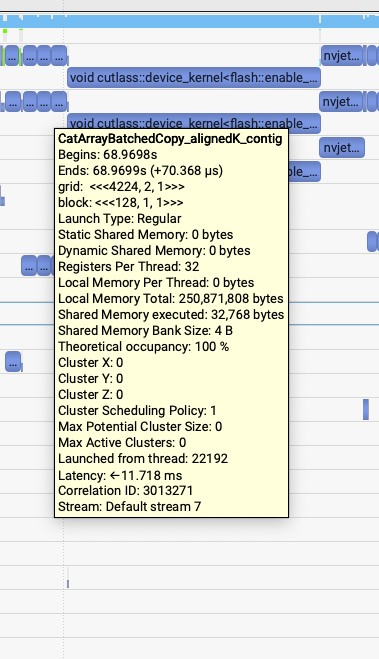

이 문제는 꽤 흥미로웠습니다. rope 이후 attention 이전에 다음 세 줄의 코드가 있다는 것을 발견했습니다.

https://github.com/sgl-project/sglang/blob/a8785f5a87ae4ba5315d33da7aba1db33d45ed95/python/sglang/multimodal_gen/runtime/models/dits/qwen_image.py#L406

```shell
    # Concatenate for joint attention
    # Order: [text, image]
    joint_query = torch.cat([txt_query, img_query], dim=1)
    joint_key = torch.cat([txt_key, img_key], dim=1)
    joint_value = torch.cat([txt_value, img_value], dim=1)

    # Compute joint attention
    joint_hidden_states = self.attn(
        joint_query,
        joint_key,
        joint_value,
    )
```

LightX2V 안에서 이 세 concat은 아래 그림처럼 모두 약 50us이고, 모두 같은 contiguous kernel template를 호출합니다.

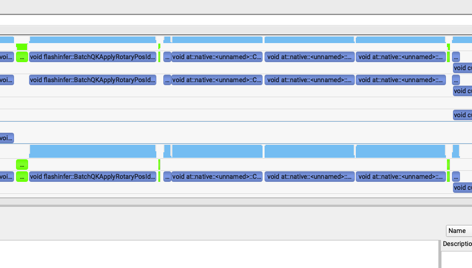

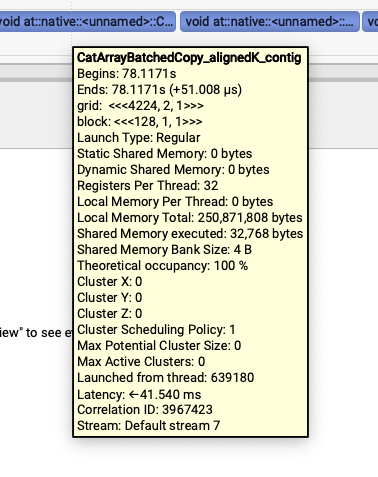

하지만 SGLang generate에서는 이상한 문제가 나타났습니다. 세 번째 kernel이 매우 느렸고, 앞의 두 개를 합친 것보다도 느렸습니다. 첫 번째와 두 번째 kernel은 62us였고, 세 번째는 155us였습니다.

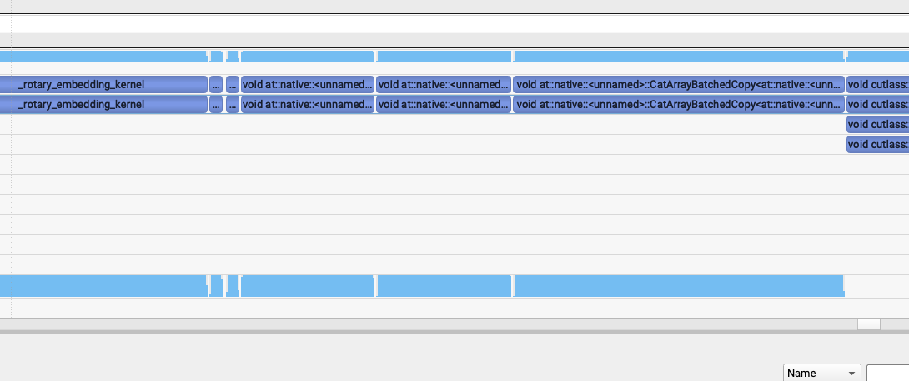

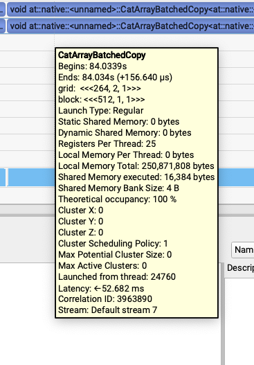

그래서 이 template 안에 align 표시가 없다는 점에 주목했고, `joint_query = torch.cat([txt_query, img_query], dim=1)`에서 출력해 보니 `txt_value`와 `img_value`만 contiguous가 아니었습니다. 계속 거슬러 올라가 보니, 이 모델에서 이전에 했던 pack qkv가 마지막 단계에서 torch.chunk로 Tensor를 나눌 때 non-contiguous Tensor를 만들었기 때문이었습니다. 또한 이 두 Tensor는 이후 non-contiguous를 지원하지 않는 다른 kernel 호출을 거치지 않았기 때문에 이 속성이 유지되었고, 결국 마지막 성능 문제로 이어졌습니다.

## 0x5. 한 step의 한 layer 결과 비교

위에서 분석한 문제를 고친 뒤, 한 step의 한 layer profile 결과를 비교했습니다.

### LightX2V(5.1ms)


### sglang main(6.1ms)

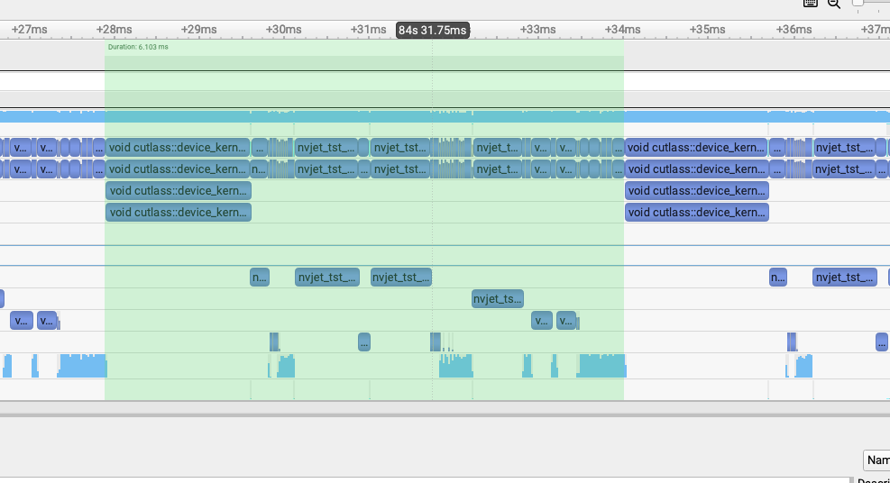

### pr(5.19ms)

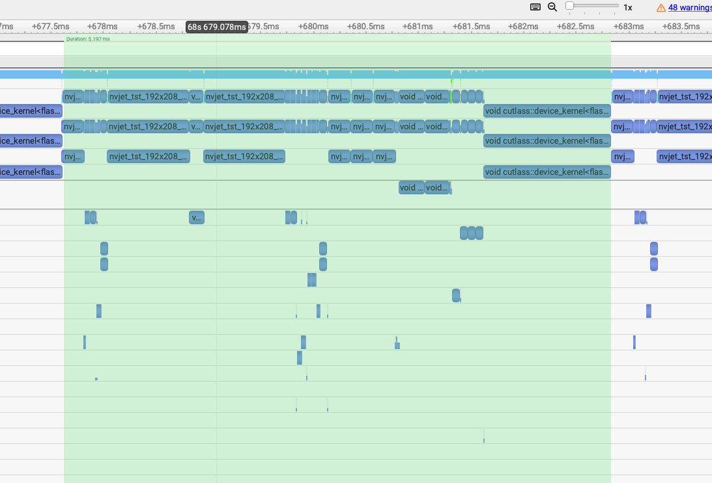

이미 꽤 가까워졌으므로, 이 성능 분석과 최적화는 초기에 완료된 셈입니다.

## 0x6. 요약

따라서 같은 모델이 두 프레임워크에서 추론 속도 차이가 꽤 크다는 것을 발견했다면, 먼저 재현 조건을 완전히 맞추세요. 같은 이미지, 같은 prompt, 같은 GPU, 같은 파라미터로 "정말 어디가 느린지" 확인해야 합니다. 그런 다음 가장 직접적인 방법으로 Nsight Systems나 Torch Profiler 같은 도구를 사용해 한 번 profile을 잡고, "같은 step, 같은 layer"로 고정해 비교합니다. 양쪽 kernel을 timeline에서 하나씩 대조해 차이가 정확히 어디에서 나는지 확인한 뒤 계속 진행하면 됩니다.
