이 노트는 2025년 8월 SGLang framework의 성능 최적화 실천을 기록한다. 주요 기술 포인트는 다음과 같다.

1. timeline 설명: 20번 및 이후 내용은 8월 하순에 새로 추가된 최적화 포인트이며, 실제로는 문서 맨 앞에 배치되는 것이 맞다. 1-19번은 8월 전반 3주 동안 이미 구현된 방안이다.

2. 내용 범위: 개인 관점에서 익숙하거나 흥미 있는 일부 최적화 포인트를 골라 핵심 원리를 설명했다. 각 최적화 포인트는 기술 개요 분석만 다루며, 구체적인 구현 세부 사항은 해당 PR을 참고하라.

3. 특별 고지:
   - 이 노트는 지식 전파 목적이며 공식 관점을 대표하지 않는다
   - 모든 최적화 효과 데이터는 원본 PR의 검증 결과에서 가져왔다
   - 기술 세부 사항에 대한 지적과 토론을 환영한다

## 1. GPT-OSS와 DeepSeek-V3/R1에 allreduce_add_rmsnorm 최적화 적용

FlashInfer가 제공하는 trt-llm-allreduce-add-rmsnorm kernel api를 사용했고, SGLang에 적용한 뒤 GPT-OSS와 DeepSeek-V3/R1에서 성능 향상을 얻었다. 여기서는 성능에 영향을 주는 parameter도 일부 조정했다.

관련 PR: https://github.com/sgl-project/sglang/pull/9278 & https://github.com/sgl-project/sglang/pull/8731 & https://github.com/sgl-project/sglang/pull/7775 & https://github.com/sgl-project/sglang/pull/7621

Benchmark 결과는 https://github.com/sgl-project/sglang/pull/8731#issuecomment-3173435636 & https://github.com/sgl-project/sglang/pull/7775#issue-3201868800 을 참고할 수 있다. 예를 들어 bs=1의 경우, gpt-oss-120b b200 tp4 배포에서 이 최적화를 켜면 end-to-end output throughput이 8% 향상되고, b200 tp8로 DeepSeek-V3/R1을 배포할 때는 output throughput이 14% 향상된다.

이후 https://github.com/sgl-project/sglang/pull/9339 에서 Hopper에서도 이 최적화를 켤 수 있게 되었다.

## 2. Quant와 RoPE kernel의 PDL 지원

PR: https://github.com/sgl-project/sglang/pull/9106

bs=1의 경우 gpt-oss-120b tp4 배포에서 end-to-end throughput이 3% 향상된다.

## 3. H20에서 Cutlass Fused MoE 성능 최적화

PR: https://github.com/sgl-project/sglang/pull/9272

H20에서 `fp8_blockwise_scaled_group_mm` kernel에 전용 tuning parameter를 구성했다.

- `MmaTileShape: 64x128x128`
- `ClusterShape: 1x2x1`
- `KernelPtrArrayTmaWarpSpecializedPingpongFP8BlockScaledAccum` scheduling strategy 사용

Hopper에서 `fp8_blockwise_scaled_group_mm`의 전체 로직은 다음과 같다.

```c++
if (is_h20 && tuning_H20_kernel) {
    // H20 전용 최적화 configuration을 사용한다
    using execute_gemm_config = sm90_fp8_pp_config_64_128_128_1_2_1;
} else {
    if (multiProcessorCount == 78 && a.size(1) > 128) {
        // K > 128이면 Pingpong scheduling strategy를 사용한다 (MmaConfig0)
        // MmaTileShape: 64x128x128, ClusterShape: 2x1x1
    } else {
        // K <= 128이면 Cooperative scheduling strategy를 사용한다 (MmaConfig1) 
        // MmaTileShape: 128x128x128, ClusterShape: 1x2x1
    }
}
```

Benchmark 결과:

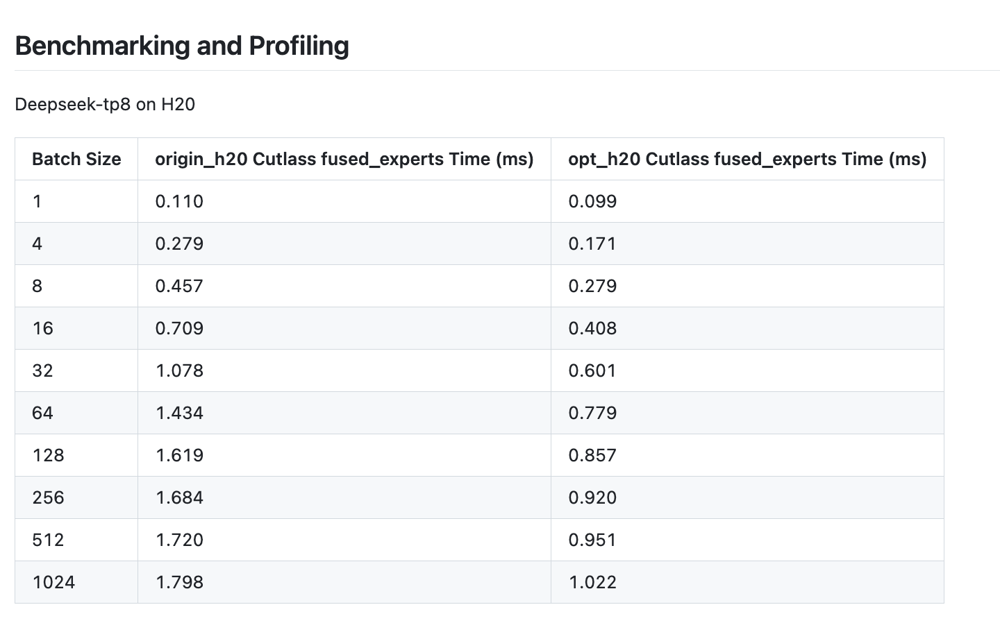


## 4. FlashInfer Cutlass MoE DP 통신 최적화: FP4 quantization + Allgatherv

FlashInfer Cutlass MoE가 data parallel(DP) scenario에서 갖는 communication bottleneck을 전용으로 최적화했다. allgather 전에 FP4 quantization을 수행해 communication volume을 줄이고, Allgatherv와 Reducescatterv collective communication operation을 도입했다.

관련 PR: https://github.com/sgl-project/sglang/pull/7667

주요 개선은 다음과 같다.

1. Allgatherv collective communication operation 추가: PyNCCL 기반 TensorRT-LLM allgather 버전으로, 서로 다른 rank의 variable-length input과 tensor list input을 지원한다
2. Reducescatterv collective communication operation 추가: PyNCCL 기반 TensorRT-LLM reducescatter 버전으로, 서로 다른 rank의 variable-length input을 지원한다
3. MoE communication flow 최적화: DP가 있는 FlashInfer MoE에서 allgatherv로 tokens를 분배하고, allgather 전에 FP4 quantization으로 communication volume을 줄이며, 마지막에는 all_reduce 대신 reducescatterv로 결과를 merge한다

활성화 조건: `--enable-flashinfer-cutlass-moe`, `--enable-dp-attention`, `dp_size == ep_size`가 동시에 만족되면 자동으로 활성화된다. `--disable-flashinfer-cutlass-moe-fp4-allgather`로 비활성화할 수 있다.

성능 향상: DeepSeek-R1-0528-FP4 모델에서 테스트했을 때 end-to-end throughput이 9.38% 향상되었다(27,763 tok/s에서 30,367 tok/s).

## 5. per_token_group_quant_8bit kernel에 Fast Math 최적화 활성화

CUDA version 간 성능 차이 문제를 대상으로, `per_token_group_quant_8bit` kernel에 Fast Math compile option을 켜 quantization operator 성능을 크게 높였다.

관련 PR: https://github.com/sgl-project/sglang/pull/9177

문제 발견: 테스트 중 SGLang이 CUDA 12.8보다 CUDA 12.4에서 더 빠르다는 것을 발견했다. SASS code를 분석해 보니 CUDA 12.4는 기본적으로 `-ftz` 또는 `--use_fast_math` option을 켜고 있었고, CUDA 12.8은 그렇지 않았다.

기술 구현: CMake의 `set_source_files_properties`를 통해 특정 source file `csrc/gemm/per_token_group_quant_8bit`에 `--use_fast_math` compile option을 추가했다.

```cmake
set_source_files_properties("csrc/gemm/per_token_group_quant_8bit" 
                            PROPERTIES COMPILE_OPTIONS "--use_fast_math")
```

성능 향상 비교:
- CUDA 12.4(기본 Fast Math): Duration 53.60μs, SM throughput 70.90%
- CUDA 12.8(Fast Math 없음): Duration 81.02μs, SM throughput 68.67%
- 최적화 효과: Fast Math를 켜면 성능이 약 34% 향상되어 실행 시간이 81.02μs에서 53.60μs로 줄어든다

핵심 SASS code 차이:
```asm
// CUDA 12.4 (Fast Math)
FMNMX.FTZ R14, R15, |R14|, !PT

// CUDA 12.8 (Standard Math)  
FMNMX R8, R8, |R17|, !PT
```

## 6. FP4 MoE quantization Kernel 최적화: Grid-Stride layout + dynamic launch configuration tuning

vLLM의 FP4 MoE kernel 최적화 방안을 SGLang으로 이식했다. NVIDIA Blackwell GPU 위의 mixture-of-experts FP4 quantization 성능을 전용으로 전면 최적화했다.

관련 PR: https://github.com/sgl-project/sglang/pull/8777

최적화 기법:

1. Grid-Stride loop layout: 전통적인 block당 row 처리 방식을 대체해 더 좋은 thread-level parallelism을 구현한다
2. Dynamic launch configuration tuning: grid size가 SM 수보다 작고 block size가 클 때 grid size를 자동으로 두 배로 늘리고 block size를 절반으로 줄여 GPU occupancy를 높인다
3. 계층적 memory access 최적화:
   - 작은 scale scenario: expert offset을 register로 직접 읽어 낮은 overhead lookup을 구현한다
   - 큰 scale scenario: expert offset을 먼저 shared memory에 로드하고 binary search로 접근해 효율을 높인다

Dynamic launch configuration tuning 구현:
```c++
// dynamic launch configuration tuning logic
int const numBlocksPerSM = 2048 / block.x;
if (grid.x < numSMs && block.x > threshold) {
    grid.x *= 2;    // grid size를 두 배로 늘린다
    block.x /= 2;   // block size를 절반으로 줄인다
}
```

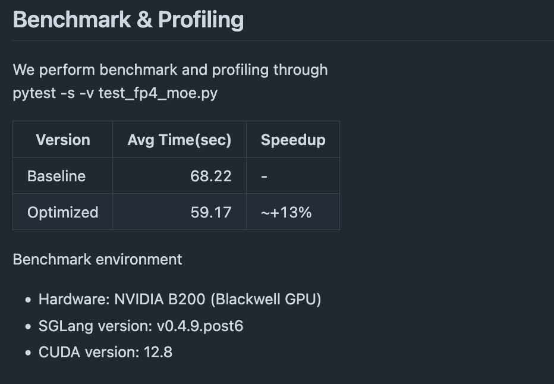

## 7. DeeoSeek-V3, Qwen, Llama4 모델이 DP Attention에서 Reduce-Scatter 통신 최적화 지원

reduce-scatter communication 최적화를 더 많은 model architecture로 확장했다. DeepSeek-V3, Qwen2 MoE, Qwen3 MoE, Llama4가 DP attention max padding을 활성화했을 때 MoE/MLP layer 뒤에서 all-reduce operation을 reduce-scatter로 대체한다.

관련 PR: https://github.com/sgl-project/sglang/pull/8539 & https://github.com/sgl-project/sglang/pull/9101

최적화 원리: data parallel(DP) attention의 max padding scenario에서 LayerCommunicator로 all-reduce를 reduce-scatter로 대체해 communication overhead와 memory footprint를 줄인다.

관련 모델:
- Qwen2 MoE: `qwen2_moe.py`를 수정해 reduce-scatter communication mode를 지원한다
- Qwen3 MoE: `qwen3_moe.py`를 수정해 reduce-scatter communication mode를 지원한다
- Llama4: `llama.py`와 `llama4.py`를 수정해 MLP layer 구현의 일관성을 보장한다

핵심 구현: `LayerCommunicator` framework를 재사용하고 forward pass에서 DP state에 따라 communication strategy를 자동 선택한다.
```python
if self.tp_size > 1:
    if skip_all_reduce:
        # reduce-scatter mode를 사용한다
        output = tensor_model_parallel_reduce_scatter(output)
    else:
        # 전통적인 all-reduce mode를 사용한다
        output = tensor_model_parallel_all_reduce(output)
```

성능 향상:
- Qwen3-235B 테스트: total token throughput이 12,692 tok/s에 도달했고 end-to-end latency가 크게 낮아졌다

관련 자료: [SGLang의 DP Attention과 Padding 문제 정리](https://mp.weixin.qq.com/s/W0e6W4-v8PmzP10qXY71rQ)

여기에 한 가지 질문이 있다. 왜 reduce-scatter가 all-reduce를 대체할 수 있을까?

전통적인 communication flow:
```
MLP/MoE layer -> all-reduce -> layer 후처리 -> 각 DP rank로 scatter
```

최적화 후 communication flow:
```
MLP/MoE layer -> all-reduce 건너뜀 -> layer 후처리 -> reduce-scatter (reduce+scatter merge)
```

source 구현의 핵심 로직:

1. 판단 조건(`communicator.py:264-270`):
```python
def should_use_reduce_scatter(self, forward_batch: ForwardBatch):
    return (
        self.allow_reduce_scatter
        and forward_batch.dp_padding_mode.is_max_len()  # max padding을 사용한다
        and self._communicate_summable_tensor_pair_fn is _scatter_hidden_states
    )
```

2. MoE layer에서 all-reduce 건너뛰기(`qwen2_moe.py:190-191`):
```python
if self.tp_size > 1 and not use_reduce_scatter:
    final_hidden_states = tensor_model_parallel_all_reduce(final_hidden_states)
```

3. layer 끝에서 reduce-scatter 지연 실행(`communicator.py:603-605`):
```python
if allow_reduce_scatter and forward_batch.dp_padding_mode.is_max_len():
    # 여기에서 reduce-scatter를 실행해 이전 all-reduce + scatter를 대체한다
    dp_reduce_scatter_tensor(hidden_states, global_hidden_states)
```

수학적 동등성:
- 전통 방식: `scatter(all_reduce(X)) = scatter(sum(X_i)) = sum(X_i) / DP_size`
- 최적화 방식: `reduce_scatter(X) = sum(X_i) / DP_size` 

성능 장점:
- communication volume 감소: 중간의 full data transfer를 피하고 reduce와 scatter operation을 직접 merge한다
- memory 최적화: full all-reduce result를 저장할 필요가 없다
- Pipeline 효율: synchronization point를 줄여 parallelism을 높인다

전제 조건:
- Max Padding mode: rank 간 data alignment를 보장해 직접 reduce-scatter를 지원한다
- DP scenario: data parallel 환경에서 각 rank가 같은 내용의 서로 다른 부분을 계산한다
- Layer structure: MLP/MoE output은 최종적으로 각 DP rank에 분산되어야 한다

## 8. GPT-OSS 모델의 FlashAttention-3 backend 지원: Attention Sinks 최적화

GPT-OSS 모델에 FlashAttention-3(FA3) backend 지원을 추가하고 attention sinks 기능을 도입해 long sequence inference의 성능과 memory efficiency를 더 높였다.

관련 PR: https://github.com/sgl-project/sglang/pull/9028

핵심 특성:
- Attention Sinks 지원: attention layer를 통해 `sinks` parameter를 전달하고 FA3의 attention sinks 기능을 활성화한다
- dtype 최적화: `sinks` parameter dtype을 `bfloat16`으로 update해 계산 효율과 일관성을 높인다
- backend 확장: server parameter에 "fa3"를 valid attention backend option으로 추가한다

기술 구현:
```python
# FA3 attention sinks 지원
def forward(self, sinks=None, **kwargs):
    if self.attention_backend == "fa3":
        # FA3 backend로 attention sinks를 처리한다
        attn_output = flashattn3_forward(sinks=sinks, ...)
```

Benchmark 결과:

GPT-OSS-20B (TP1, 4k input/1k output):
- Triton backend:
  - Concurrency=1: output throughput 303.066 tok/s, TTFT 95.071ms
  - Concurrency=32: output throughput 3,067.798 tok/s, TTFT 1,861.553ms
- FA3 backend:
  - Concurrency=1: output throughput 309.425 tok/s, TTFT 75.511ms (2.1% 향상)
  - Concurrency=32: output throughput 3,057.230 tok/s, TTFT 1,271.047ms (TTFT 31.7% 감소)

Benchmark 결과만 보면 concurrency=32일 때 throughput은 약간 낮아진 것처럼 보인다.

## 9. Blackwell GPU의 FP8 CUTLASS Kernel tuning: dynamic configuration dispatch

NVIDIA Blackwell(SM100) GPU architecture를 대상으로 vLLM의 FP8 GEMM 성능 tuning 기술을 이식하고, dynamic kernel dispatch mechanism으로 matrix multiplication 성능을 크게 높였다.

관련 PR: https://github.com/sgl-project/sglang/pull/8818

최적화 기법:
- Dynamic Kernel dispatch: input matrix의 M dimension에 따라 최적 CUTLASS kernel configuration을 자동 선택한다
- segmented configuration 최적화: 서로 다른 matrix size range에 전용 launch configuration을 제공한다
- single configuration 대체: 기존 generic configuration에서 정교한 segmented configuration strategy로 바꾼다

구체적인 구현 세부 사항:

configuration segmentation strategy:
- [1, 16]: 작은 matrix를 위한 lightweight configuration
- (16, 64]: 중소형 matrix를 위한 balanced configuration
- (64, 256]: 중간 규모 matrix를 위한 performance configuration
- (256, xxx]: 대규모 matrix를 위한 high-throughput configuration

dynamic dispatch logic:
```cpp
// M dimension에 따라 kernel configuration을 dynamic하게 선택한다
template<typename T>
auto select_fp8_gemm_config(int M) {
    if (M <= 16) return small_config;
    else if (M <= 64) return medium_small_config;  
    else if (M <= 256) return medium_config;
    else return large_config;
}
```

benchmark가 조금 길어졌으므로 PR을 바로 보면 된다.

## 10. FlashInfer의 TensorRT-LLM FP8 Blockscale GEMM backend 최적화

SGLang의 FlashInfer CUTLASS backend를 TensorRT-LLM FP8 GEMM 구현으로 upgrade하고 Low Latency 최적화에 집중했다. DeepSeek-R1-0528 모델 TP8+DP8 배포에서 request throughput이 6%(0.83 -> 0.88 req/s) 향상되고, first token latency가 9%(10.1 -> 9.2초) 낮아졌으며, overall throughput은 6.7%(7.6k -> 8.1k tok/s) 향상되었다.

관련 PR: https://github.com/sgl-project/sglang/pull/8588

## 11. custom set kv buffer Kernel fuse

H100 GPU의 `set_kv_cache` operation 성능 overhead를 대상으로, key와 value cache 저장 operation을 fuse하는 custom CUDA kernel을 개발해 memory operation overhead를 크게 낮췄다.

관련 PR: https://github.com/sgl-project/sglang/pull/8884

문제 식별: nsys 성능 분석 도구로 H100에서 `set_kv_cache` operation에 뚜렷한 성능 overhead가 있으며, inference 과정의 병목 중 하나가 된다는 것을 발견했다.

핵심 최적화:
- operation fusion: 기존에 분리되어 있던 key cache와 value cache 저장 operation을 하나의 CUDA kernel로 fuse한다
- memory access 최적화: memory operation 횟수를 줄여 memory bandwidth utilization을 높인다

기술 구현:

custom CUDA Kernel:
```cpp
// KV cache 저장을 fuse한 CUDA kernel
__global__ void set_kv_buffer_kernel(
    scalar_t* k_cache,
    scalar_t* v_cache, 
    const int64_t* loc,
    const scalar_t* k,
    const scalar_t* v
) {
    // key와 value 저장 operation을 동시에 처리한다
    // memory access overhead를 줄인다
}
```

Python interface wrapper:
```python
def set_kv_buffer_kernel(k_cache, v_cache, loc, k, v, fallback=False):
    try:
        if fallback:
            raise RuntimeError("Fallback to torch implementation")
        torch.ops.sgl_kernel.store_kv_cache(k_cache, v_cache, loc, k, v)
    except RuntimeError:  # PyTorch 구현으로 fallback한다
        k_cache[loc] = k
        v_cache[loc] = v
```

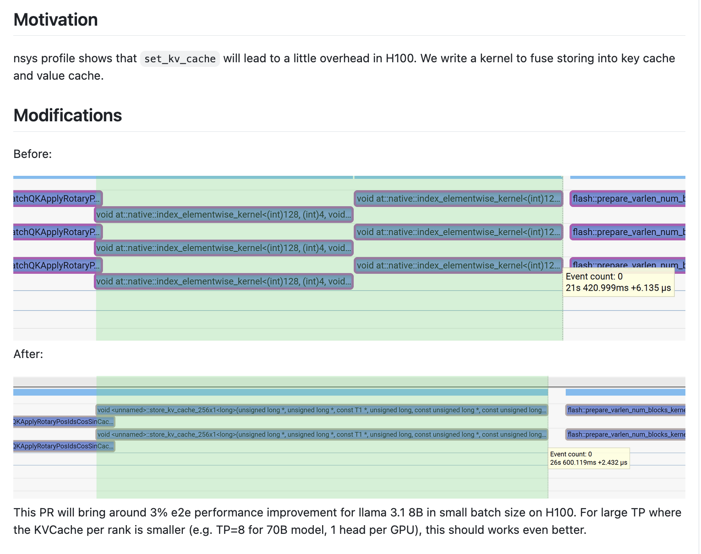

## 12. RoPE + Set KV Buffer kernel fuse

KV cache write operation을 RoPE(rotary position encoding) kernel에 직접 fuse해, 독립적인 memory operation과 kernel launch overhead를 제거하고 inference 성능을 높였다.

관련 PR: https://github.com/sgl-project/sglang/pull/9077 & https://github.com/sgl-project/sglang/pull/9014

pseudocode:

```cpp
// RoPE kernel 안에서 KV cache에 직접 쓴다
__global__ void BatchQKApplyRotaryPosIdsCosSinCacheEnhanced(
    // RoPE 관련 parameter
    scalar_t* __restrict__ query,
    scalar_t* __restrict__ key, 
    const scalar_t* cos_ptr,
    const scalar_t* sin_ptr,
    // KV cache fusion parameter
    std::optional<scalar_t*> kv_buffer = std::nullopt,
    std::optional<int64_t*> cache_loc = std::nullopt
) {
    // RoPE 계산을 실행한다
    apply_rotary_embedding(query, key, cos, sin);
    
    // fused KV cache write
    if (kv_buffer.has_value()) {
        write_to_kv_cache(key, value, kv_buffer, cache_loc);
    }
}
```

gpt-oss-120b tp4 배포 결과를 보면, end-to-end throughput이 3% 향상된다.

## 13. GPT-OSS 모델 MoE layer padding과 quantization Kernel fusion 최적화

GPT-OSS 모델의 MoE layer 특성을 대상으로 hidden state padding operation을 quantization kernel에 fuse해 redundant memory operation을 제거했다. 관련 PR: https://github.com/sgl-project/sglang/pull/9005

핵심 개선:
- GPT-OSS 모델의 `FusedMoELayer`에서 explicit padding/unpadding step 제거
- quantization function `mxfp8_quantize`에서 dimension alignment를 직접 처리
- `output_hidden_size` parameter로 padding logic을 dynamic하게 제어

구현 비교:
```python
# 최적화 전(separated)
def forward(self, hidden_states):
    hidden_states = pad(hidden_states, target_size)  # explicit padding
    x_quant = mxfp8_quantize(hidden_states)
    output = moe_computation(x_quant)
    return unpad(output, original_size)  # explicit unpadding

# 최적화 후(fused) 
def forward(self, hidden_states):
    x_quant = mxfp8_quantize(hidden_states, output_hidden_size=target_size)
    return trtllm_fp4_block_scale_moe(x_quant)
```

quantization function 개선:
```python
def mxfp8_quantize(x, output_hidden_size=None):
    if output_hidden_size:  # GPT-OSS의 dimension alignment requirement를 자동 처리한다
        x = F.pad(x, (0, output_hidden_size - x.shape[-1]))
    return quantize_fp8(x)  # 기존 quantization logic을 유지한다
```

## 14. DP scenario MoE non-padding Token count 최적화

data parallel scenario에서 MoE 계산 중 token count가 부정확한 문제를 수정했다.

PR: https://github.com/sgl-project/sglang/pull/9107

문제 분석: 기존 구현은 global DP rank의 token 수를 잘못 사용해 다음 문제가 생겼다.
1. 실제 valid token 수를 과대평가한다
2. MoE routing이 padding token을 올바르게 mask하지 못한다
3. invalid token 처리에 compute resource를 낭비한다

해결 방안:

```python
# accurate local token count
def get_num_token_non_padded_local(total_tokens, tp_size, tp_rank):
    base = total_tokens // tp_size
    extra = 1 if tp_rank < (total_tokens % tp_size) else 0
    return base + extra

# MoE layer call
def forward(self, hidden_states, batch_info):
    local_tokens = get_num_token_non_padded_local(
        batch_info.total_tokens,
        batch_info.tp_size,
        batch_info.tp_rank
    )
    return moe_layer(hidden_states, num_token=local_tokens)
```

주요 변경:
- batch 정보에 TP parallel dimension parameter 추가
- 모든 MoE layer가 새 count logic에 통일적으로 적응
- 기존 interface compatibility 유지

Benchmark 결과, DeepSeek-V3-0324 DP 배포:

```shell
python3 -m sglang.launch_server --model-path deepseek-ai/DeepSeek-V3-0324 --trust-remote-code --tp 8 --enable-dp-attention --dp 2 --moe-dense-tp-size 1 --moe-a2a-backend deepep --cuda-graph-max-bs 32 --max-running-requests 32 --speculative-algo EAGLE --speculative-draft lmsys/DeepSeek-V3-0324-NextN --speculative-num-steps 2 --speculative-eagle-topk 4 --speculative-num-draft-tokens 4 --disable-radix-cache --stream-output
python3 -m sglang.bench_serving --backend sglang --dataset-name random --num-prompt 32 --random-input 512 --random-output 32 --random-range-ratio 1 --host 127.0.0.1 --port 30000 --max-concurrency 1
```

throughput이 53.05 -> 57.07 tok/s로 7.6% 향상되었다.

## 15. TRTLLM-MLA FP8 

FlashInfer의 TRTLLM-MLA FP8 KV Cache Backend를 지원한다. 자세한 내용은 PR을 참고하라: https://github.com/sgl-project/sglang/pull/8638

Benchmark 결과:

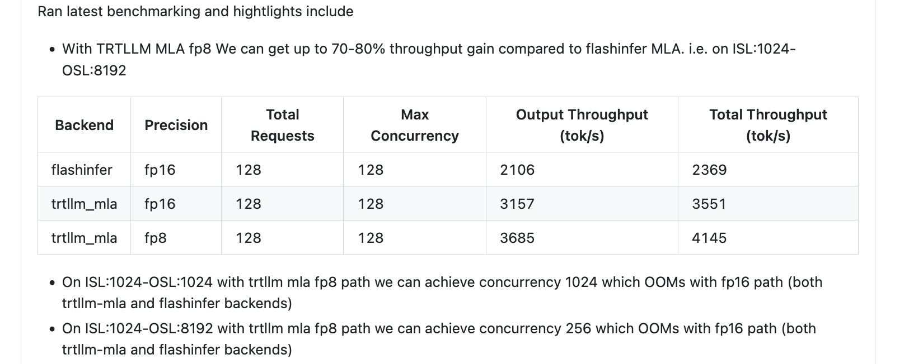

## 16. MoE routed scaling factor kernel fuse

routed scaling factor 계산을 `moe_fused_gate`와 `select_experts` kernel에 fuse해 독립 operation overhead를 줄인다.

PR: https://github.com/sgl-project/sglang/pull/8770


구현 예:
```python
def moe_fused_gate(..., apply_routed_scaling_factor_on_output=False):
    return fused_gate_with_scaling(...) if apply else traditional(...)
```

```cpp
__global__ void moe_fused_gate_kernel(...) {
    if (apply_scaling_factor) gate_output *= topk_weights[idx];
}
```

Benchmark 결과:

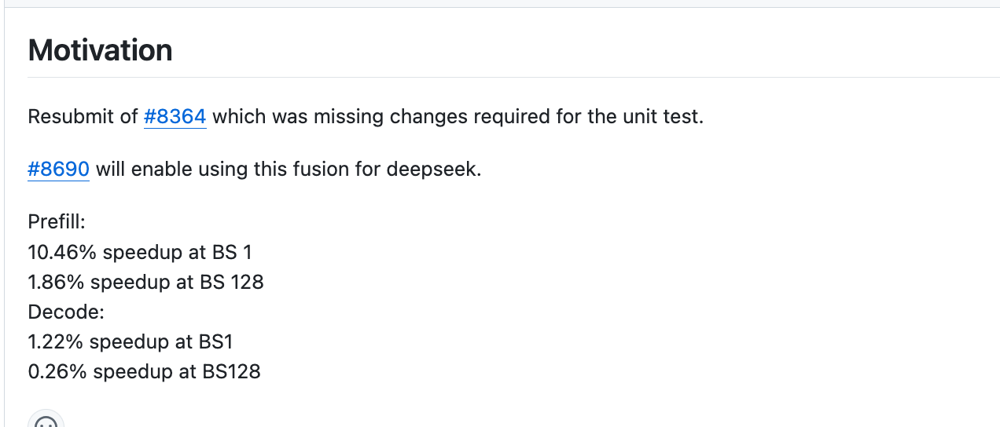

## 17. GPT-OSS 모델 Attention Sinks 지원과 TRT-LLM MHA backend 최적화

GPT-OSS open-source 모델을 대상으로 TensorRT-LLM multi-head attention(MHA) backend 지원을 강화하고 Attention Sinks mechanism을 도입해 long sequence inference 성능과 memory efficiency를 크게 높였다.

관련 PR: https://github.com/sgl-project/sglang/pull/8834 & https://github.com/sgl-project/sglang/pull/8782

주요 변경:

1. TRT-LLM MHA backend integration: TensorRT-LLM이 생성한 multi-head attention module을 직접 호출해 고도로 최적화된 kernel 구현을 활용한다
2. Attention Sinks 지원: TRT-LLM backend에 attention sinks 기능을 추가하고 `sk` parameter로 sink configuration 정보를 전달한다
3. long sequence 최적화: long sequence inference scenario를 위한 memory와 compute 전용 최적화

Attention Sinks integration:
```python
# TRT-LLM MHA backend의 attention sinks 지원
def forward_extend(layer, forward_batch, save_kv_cache=True, **kwargs):
    # attention sink configuration을 가져온다
    attention_sink = kwargs.get("sk", None)
    
    # TRT-LLM MHA에 attention sinks를 적용한다
    if attention_sink is not None:
        # sink: additional value per head in the denominator of the softmax
        trtllm_mha_forward_with_sinks(attention_sink=attention_sink, ...)
```

backend 선택 로직:
```python
# trtllm_mha를 attention backend option으로 지원한다
def get_attention_backend():
    valid_backends = ["triton", "fa3", "trtllm_mha"]
    if backend == "trtllm_mha":
        return TRTLLMMHABackend()
```

Benchmark 결과:

GPT-OSS-20B 모델 테스트:
```bash
# TRT-LLM MHA backend test
python3 -m sglang.launch_server --model-path lmsys/gpt-oss-20b-bf16 \
    --trust-remote-code --attention-backend trtllm_mha \
    --enable-triton-kernel-moe --mem-fraction-static 0.7 \
    --tp-size 8 --disable-cuda-graph --disable-hybrid-swa-memory

# Benchmark comparison
python3 benchmark/gsm8k/bench_sglang.py --num-shots 8 --num-questions 1000 --parallel 1000
```

- TRT-LLM MHA backend: 17,151.680 token/s 
- Triton backend: 14,607.150 token/s


## 18. TBO 최적화: Two Chunk Overlap 기술

Two Batch Overlap(TBO) strategy를 개선해 Two Chunk Overlap 기술을 도입했다. 긴 sequence를 두 chunk로 지능적으로 나누어 parallel하게 실행함으로써 대규모 distributed inference의 throughput 성능을 크게 높인다.

관련 PR: https://github.com/sgl-project/sglang/pull/8144

주요 변경:

1. Two Chunk Overlap strategy: 전통적인 Two Batch Overlap을 Two Chunk Overlap으로 개선해 idle batch를 제거하고 GPU utilization을 높인다
2. 지능형 sequence split: token distribution threshold에 따라 chunk split을 활성화할지 dynamic하게 결정해 서로 다른 input length 처리 효율을 최적화한다
3. distributed optimization configuration: multi-node DP+TP deployment scenario에 특화해 최적화하고, 대규모 model inference를 지원한다
4. parameter로 조절 가능한 제어: `tbo-token-distribution-threshold` parameter로 optimization strategy trigger condition을 정밀하게 제어한다

핵심 기술 원리:

전통적인 Two Batch Overlap vs Two Chunk Overlap:
```python
# traditional Two Batch Overlap (idle batch 문제가 있음)
# batch_size = 1, extend_seq_len = [3072], extend_prefix_len = [0]
micro_batch0: extend_seq_len = [3072], extend_prefix_len = [0]  # active batch
micro_batch1: extend_seq_len = [0], extend_prefix_len = [0]     # idle batch

# Two Chunk Overlap (idle batch 제거)  
# batch_size = 1, extend_seq_len = [3072], extend_prefix_len = [0]
micro_batch0: extend_seq_len = [1536], extend_prefix_len = [0]    # first chunk
micro_batch1: extend_seq_len = [1536], extend_prefix_len = [1536] # second chunk
```

dynamic enabling logic:
```python
# token distribution threshold에 따라 Two Chunk Overlap 활성화 여부를 결정한다
def should_enable_two_chunk_overlap(batch_info, threshold=0.48):
    token_distribution_ratio = calculate_token_distribution(batch_info)
    return token_distribution_ratio > threshold and enable_tbo
```

distributed deployment configuration 최적화:
```bash
# DeepSeek-V3 large-scale deployment configuration
SGLANG_TBO_DEBUG=1 SGL_CHUNKED_PREFIX_CACHE_THRESHOLD=1 \
python3 -m sglang.launch_server \
    --model-path /dev/shm/DeepSeek-V3-0324 --tp 16 --dp 16 \
    --chunked-prefill-size 65536 --max-prefill-tokens 170000 \
    --enable-dp-attention --enable-deepep-moe \
    --enable-two-batch-overlap --tbo-token-distribution-threshold 0.48 \
    --disable-overlap-schedule --disable-radix-cache --disable-cuda-graph
```

Benchmark 결과:

테스트 환경: 2x8x H800, DeepSeek-V3-0324

scenario 1: 특수 상황(각 DP마다 단일 long request, length 3072):
```bash
# test configuration  
python3 -m sglang.bench_serving --backend sglang \
    --dataset-name random --num-prompt 1024 \
    --random-input 3072 --random-output 1 --random-range-ratio 1 \
    --max-concurrency 1024
```

성능 향상:
- Baseline(Two Chunk Overlap 비활성화): 64,820.55 / 64,901.24 / 63,900.35 / 63,931.12 tok/s
- Two Chunk Overlap 최적화 후: 72,391.92 / 72,845.28 / 71,511.55 / 73,152.61 tok/s  
- throughput 향상: 평균 12.56%

scenario 2: general case(variable-length input 30-3072 tokens):
```bash
# test configuration
python3 -m sglang.bench_serving --backend sglang \
    --dataset-name random --num-prompt 2048 \
    --random-input 3072 --random-output 1 --random-range-ratio 0.01 \
    --max-concurrency 1024
```

성능 향상:
- Baseline(Two Chunk Overlap 비활성화): 71,695.06 / 68,585.39 / 75,784.86 / 77,115.82 tok/s
- Two Chunk Overlap 최적화 후: 77,532.36 / 77,059.32 / 75,654.72 / 78,041.45 tok/s
- throughput 향상: 평균 5.15%

핵심 장점:
- Idle Batch 제거: 전통적인 TBO와 비교해 idle micro-batch를 없애 GPU compute efficiency를 높인다
- 더 나은 Overlap 효과: 두 micro-batch의 latency가 더 균형 잡혀 compute-communication overlap에 유리하다
- 지능형 adaptation: input length distribution에 따라 optimization strategy를 자동 조절한다
- large-scale scalability: multi-node DP scenario에서 효과가 뚜렷하다

이 최적화는 long sequence와 large batch size를 처리하는 distributed inference scenario에 적합하며, GPU cluster 전체 throughput을 크게 높일 수 있다. 테스트 결과를 보면 general scenario에서도 어느 정도 향상이 있는 듯하다.

여기의 intelligent split scheme은 비교적 복잡하므로 관심 있는 독자는 SGLang 구현에서 직접 살펴보길 바란다.

## 19. DP Attention 최적화: LayerNorm을 AllGather 전에 배치

LayerNorm operation을 data parallel(DP)의 allgather communication 전에 실행하도록 앞당긴다. 1/DP 수의 token 위에서 normalization을 계산해 compute overhead를 줄인다. 수치 안정성을 보장하기 위해 DP==TP일 때만 활성화한다.

관련 PR: https://github.com/sgl-project/sglang/pull/8631

Benchmark 결과:

DeepSeek-R1-0528-FP4 모델에서 end-to-end throughput이 3.79% 향상되었다(27,310 -> 28,345 tok/s).


## 20. H100/H200/H800 GPU에서 FP8 MoE Kernel scheduling strategy 최적화

H20에서 H100/H200/H800으로 migration할 때 `fp8_blockwise_scaled_grouped_mm` 성능이 regression되는 문제를 대상으로 GPU architecture에 따라 최적 scheduling strategy를 dynamic하게 선택한다. H20은 Pingpong Schedule을 사용하고, H100/H200/H800은 Cooperative Schedule을 사용한다.

관련 PR: https://github.com/sgl-project/sglang/pull/8722

문제 분석: H20에서 H100/H200/H800으로 migration할 때 Tensor Core MMA 시간이 1/4로 줄어들지만, Pingpong scheduling에서는 CUDA Core FMA가 overlap되지 않아 SM Tensor Pipe throughput이 하락한다.

**해결 방법**: SM 수로 GPU architecture를 식별한다. H20(78 SMs)은 계속 Pingpong scheduling을 사용하고, 다른 Hopper architecture는 Cooperative scheduling을 사용해 Tensor Core competition 문제를 해결한다.

Benchmark 결과:

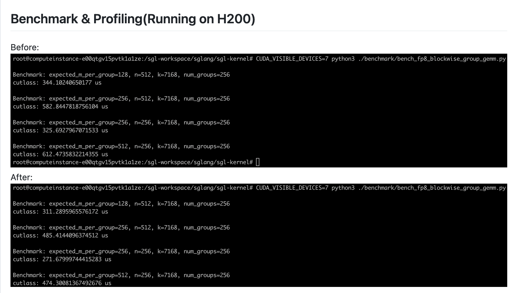

관련 자료: Pingpong과 Cooperative에 대한 직관적 이해(https://zhuanlan.zhihu.com/p/1922067252909434076) 그리고 이 PR에 대한 자세한 설명: Pingpong Schedule은 만능 열쇠가 아니다(https://zhuanlan.zhihu.com/p/1935338652726204054)

## 21. FlashInfer MoE Blockscale FP8 backend의 TP MoE 지원

FlashInfer MoE blockscale FP8 backend 지원을 tensor parallel(TP) MoE configuration까지 확장하고, 최적화 로직을 감싸는 `FlashInferFusedMoE` class를 추가해 EP MoE 의존성을 분리했다.

관련 PR: https://github.com/sgl-project/sglang/pull/8450

`enable_ep_moe` 강제 요구를 제거해 TP MoE가 독립적으로 `trtllm_fp8_block_scale_moe` kernel 최적화를 사용할 수 있게 했다. per-token group quantization과 weight reorder를 지원한다.

Benchmark 결과: https://github.com/sgl-project/sglang/pull/8450#issuecomment-3129426265

## 22. TRTLLM 생성 MLA decoding Kernel 통합

TensorRT-LLM이 생성한 multi-head latent attention(MLA) decoding kernel을 통합해 DeepSeek series 모델에 전용 최적화 attention 구현을 제공하고 SM100 architecture를 지원한다.

관련 PR: https://github.com/sgl-project/sglang/pull/8632

MLA architecture의 decoding 단계에 맞춘 최적화로, special optimized kernel을 통해 DeepSeek model inference 성능을 높이고 SM100 compatibility check를 추가해 hardware support를 보장한다.

Benchmark 결과:

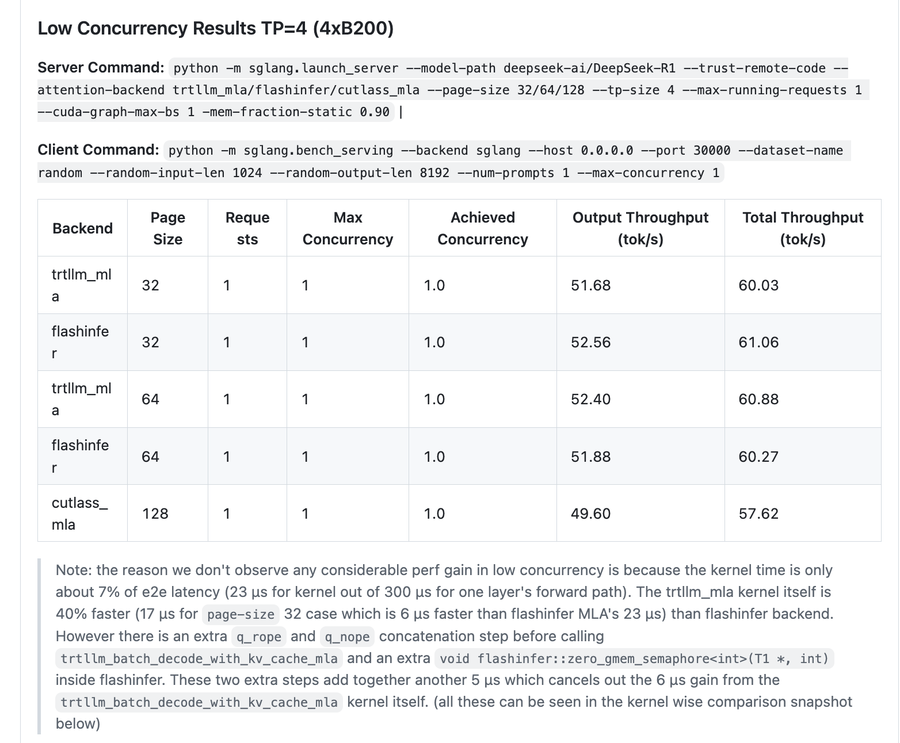

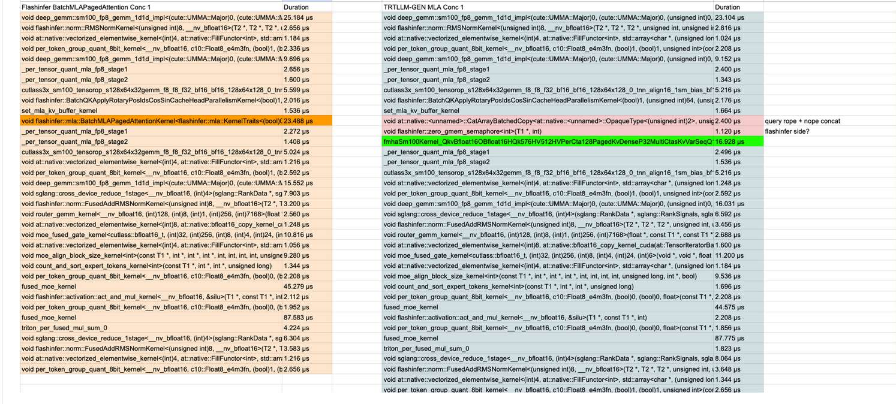

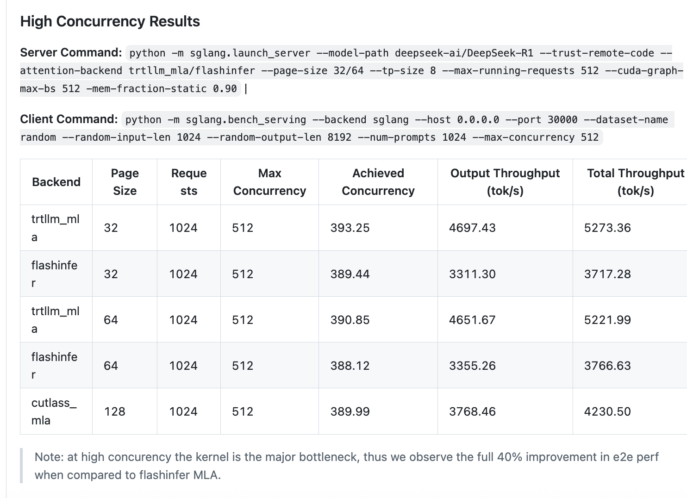

## 23. CUDA graph capture 때 Python garbage collector 비활성화 최적화

CUDA graph capture 동안 Python garbage collector(GC)를 비활성화하고 `gc.freeze()`로 장기 생존 object의 GC scan을 피함으로써 startup speed를 크게 높인다.

관련 PR: https://github.com/sgl-project/sglang/pull/8577

성능 향상: CUDA graph capture 속도가 2.3x-3.7x 향상된다. Llama4 모델은 25초에서 10초로, Qwen3-0.6B 모델은 6초에서 1초로 줄었다.

## 24. MRoPE multimodal rotary position encoding torch.compile 최적화

`MRotaryEmbedding.forward()`에 `torch.compile(dynamic=True)`를 추가해 kernel launch overhead를 줄이고, small VLM model inference 성능을 크게 높였다.

관련 PR: https://github.com/sgl-project/sglang/pull/9487

성능 향상: Qwen2.5-VL-3B-Instruct에서 request throughput이 28%(2.53 -> 3.25 req/s) 향상되었고, MRoPE latency가 8배 줄었으며, ITL은 5.86ms에서 4.48ms로 낮아졌다.

## 25. garbage collector freeze 기능으로 latency jitter 감소

GC freeze 기능을 추가했다. `freeze_gc` API로 server warmup 후의 long-lived object를 garbage collection 범위에서 제외해 gen2 GC가 일으키는 100ms-300ms pause를 피하고 low latency를 유지한다.

관련 PR: https://github.com/sgl-project/sglang/pull/9241

구현 특성: `/freeze_gc` HTTP endpoint, distributed GC management, configurable GC warning threshold(`gc_warning_threshold_secs`)를 새로 추가해 P99 latency jitter 문제를 효과적으로 해결한다. 핵심 수정은 다음과 같다.

```python
def gc_object_counts():
    """각 generation garbage collector의 object count statistics를 가져온다
    
    Python garbage collector는 generational mechanism을 사용한다:
    - gen0: 새로 생성된 object, collection frequency가 가장 높다
    - gen1: gen0에서 살아남은 object  
    - gen2: gen1에서 살아남은 long-lived object, collection cost가 가장 높다
    """
    import gc

    g0 = len(gc.get_objects(0))  # generation 0 object count를 센다
    g1 = len(gc.get_objects(1))  # generation 1 object count를 센다
    g2 = len(gc.get_objects(2))  # generation 2 object count를 센다(long-lived object)
    return g0, g1, g2


def configure_gc_warning(warn_threshold_secs):
    """garbage collection warning mechanism을 설정한다
    
    GC duration이 지정 threshold를 넘으면 warning log를 기록하고 optimization suggestion을 제공한다.
    이것은 latency jitter를 유발할 수 있는 long GC operation을 식별하는 데 도움이 된다.
    
    Args:
        warn_threshold_secs: GC duration warning threshold(seconds)
    """
    import gc

    gc_start_time = {}  # 각 generation GC start time을 기록한다

    def gc_callback(phase, info):
        """GC event callback function, GC execution time을 monitor한다"""
        gen = info.get("generation", "?")  # 현재 collection generation을 가져온다
        
        if phase == "start":
            # GC start 때 timestamp를 기록한다
            gc_start_time[gen] = time.time()
        elif phase == "stop":
            # GC stop 때 duration을 계산하고 warning이 필요한지 검사한다
            duration = time.time() - gc_start_time.get(gen, time.time())
            if duration > warn_threshold_secs:
                g0, g1, g2 = gc_object_counts()
                logger.warn(
                    f"LONG GARBAGE COLLECTION DETECTED | Generation {gen} | Duration: {duration:.4f}s | # Objects: gen0={g0}, gen1={g1}, gen2={g2} | "
                    f"This may cause latency jitter. Consider calling the freeze_gc API after sending a few warmup requests."
                )

    # GC event callback function을 등록한다
    gc.callbacks.append(gc_callback)


def freeze_gc(context: str):
    """garbage collector를 freeze해 현재 object를 GC management 범위 밖으로 이동한다
    
    gc.freeze()를 호출하면 현재 존재하는 모든 object가 "permanent generation"으로 이동하며,
    더 이상 garbage collection 과정에 참여하지 않는다. 이는 GC overhead, 특히
    gen2 collection cost를 크게 줄여 latency jitter를 감소시킨다.
    
    server warmup이 끝난 뒤 호출해 long-lived object(model parameter,
    cache 등)를 GC 범위에서 제외하는 데 적합하다.
    
    Args:
        context: log record에 사용할 call context description
    """
    import gc

    # freeze 전 각 generation object count를 기록한다
    g0_before, g1_before, g2_before = gc_object_counts()
    
    # GC freeze operation을 실행한다 - 핵심 function call
    gc.freeze()
    
    # freeze 후 각 generation object count 변화를 기록한다
    g0_after, g1_after, g2_after = gc_object_counts()
    
    # monitoring과 debugging을 위해 freeze operation의 effect를 기록한다
    logger.info(
        f"Freezing GC in {context} process. "
        f"gen0: {g0_before}->{g0_after}, "
        f"gen1: {g1_before}->{g1_after}, "
        f"gen2: {g2_before}->{g2_after}"
    )
```

## 26. FlashInfer GPU-CPU synchronization 최적화

FlashInfer에서 page size=1일 때 발생하는 불필요한 GPU-CPU synchronization 문제를 수정했다. page-size가 1이면 GPU에서 CPU로 data transfer하지 않고 `torch.ones` tensor를 직접 구성한다.

관련 PR: https://github.com/sgl-project/sglang/pull/9409

변경:

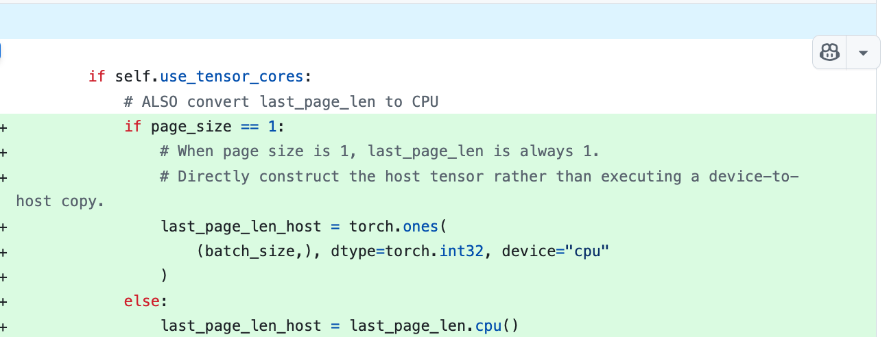

Benchmark 결과:

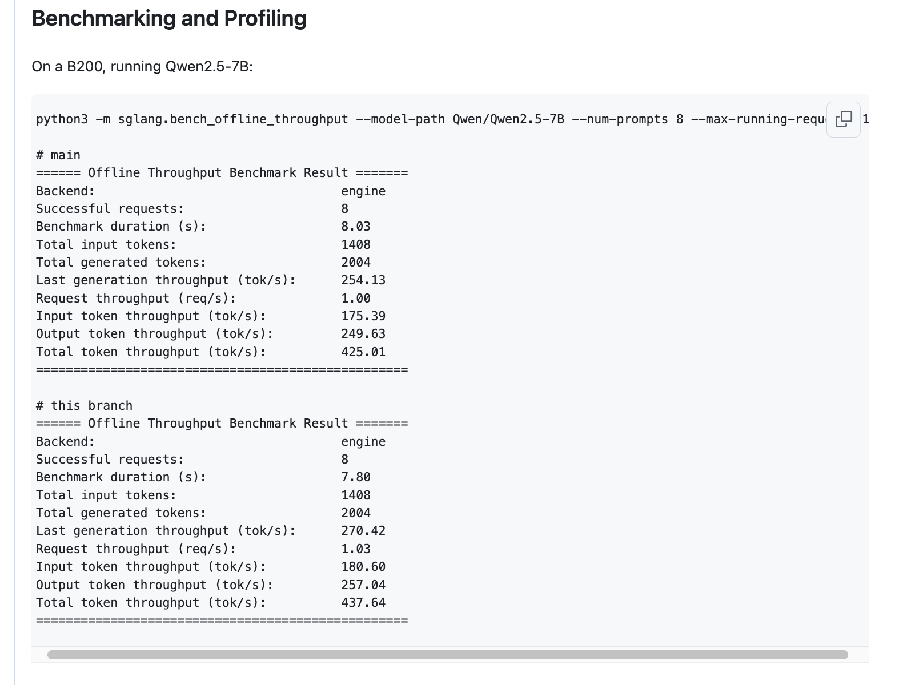

B200에서 concurrency=1로 Qwen2.5-7B 모델을 실행했을 때 total throughput이 425.01에서 437.64 tok/s로 3.0% 향상되었다.

## 27. FlashInfer GQA Tensor Core decoding threshold 최적화

FlashInfer에서 Tensor Core decoding을 활성화하는 GQA group size threshold를 `>4`에서 `>=4`로 낮춰, Llama3-8B처럼 GQA group이 4개인 model도 Tensor Core acceleration을 활용할 수 있게 했다.

관련 PR: https://github.com/sgl-project/sglang/pull/8624

성능 향상: ITL(Inter-Token Latency)이 크게 줄었다. 특히 GQA group size가 4인 Llama3-8B 같은 model에서 그렇다. FlashInfer가 head group과 token dimension을 fuse하므로 group size가 4여도 Tensor Core의 이점을 얻기에 충분하기 때문이다.

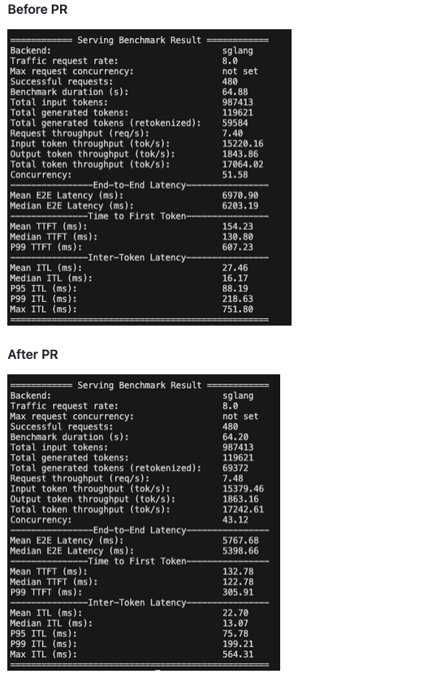


## 28. CUTLASS 4.2 upgrade와 K-Major Scale Factor 지원

CUTLASS library를 4.2 version으로 upgrade하고, SM90 FP8 Blockwise Group GEMM에 K-Major Scale Factor를 활성화해 Blackwell code path와 통일하며 `per_group_transpose` format conversion overhead를 제거했다.

관련 PR: https://github.com/sgl-project/sglang/pull/9559

최적화 개선: K-Major format scale factors 지원, matrix swap으로 small M scenario(M<=2048) 최적화, ATen interface로 H20 device detection 성능 최적화, `cudaGetDeviceProperties` call overhead 회피.

최적화 향상은 이 comment를 참고하라: https://github.com/sgl-project/sglang/pull/9559#issue-3349421711

## 29. FlashInfer/FlashMLA backend의 Chunked Prefill cache 최적화 지원

FlashInfer와 FlashMLA backend에 MHA Chunked Prefill cache support를 추가하고, page size=1 제한을 제거해 더 큰 Page Size를 지원함으로써 memory efficiency를 높였다.

관련 PR: https://github.com/sgl-project/sglang/pull/8616

기능 확장: page size>1의 MHA Chunked Prefill cache를 지원하고 FlashInfer/FlashMLA backend compatibility를 강화했다. accuracy test는 서로 다른 page size configuration에서도 precision이 유지됨을 보였다(GSM8K: 0.954-0.955).

Benchmark 결과에서는 TTFT 감소에 뚜렷한 효과가 있다.

https://github.com/sgl-project/sglang/pull/8616#issue-3280333135

