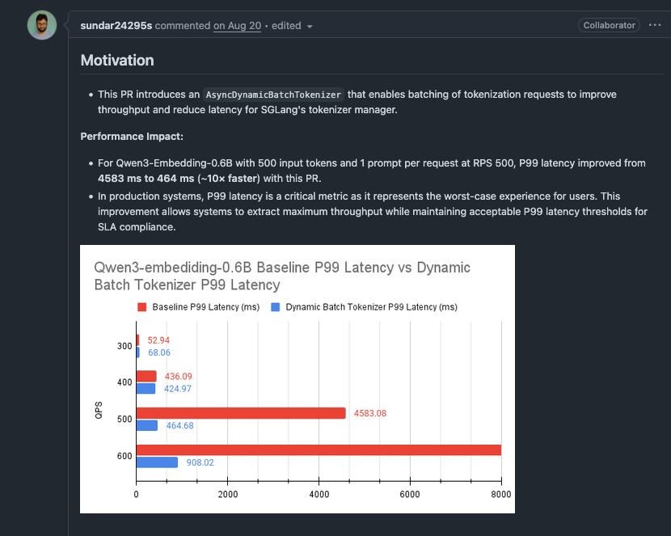

본 노트는 2025년 9월 SGLang 프레임워크의 성능 최적화 실천을 기록하며, 주로 다음 기술 요점을 포함한다.

1. 타임라인 설명: 9월 SGLang 프레임워크의 핵심 성능 최적화 개선 사항을 기록한다.

2. 내용 범위: 개인적 관점에 기반하여, 익숙하거나 관심 있는 일부 최적화 항목을 선정하여 핵심 원리를 설명한다. 각 최적화 항목에 대해서는 기술 개요 분석만 수행하며, 구체적인 구현 세부 사항은 해당 PR을 참고하기 바란다. 특히 Qwen3-Next 모델, HiCache 및 PD 분리 관련 최적화는 비교적 복잡하고 필자가 익숙하지 않으며 잘 모르기 때문에 생략하였음을 밝혀둔다.

3. 특별 고지:
   - 본 노트는 지식 전파 목적이며, 공식 견해를 대표하지 않는다
   - 모든 최적화 효과 데이터는 원본 PR 검증 결과에서 가져온 것이다
   - 기술 세부 사항에 대한 지적과 토론을 환영한다

## 1. Mooncake Store 메타데이터 획득 최적화: CPU Tensor를 List로 변환하여 가속

Mooncake 분산 KV 캐시의 `get_buffer_meta` 메서드에 대해, CPU tensor를 미리 Python list로 변환함으로써 루프 안에서 반복되는 PyTorch 인덱싱 오버헤드를 피한다.

관련 PR: https://github.com/sgl-project/sglang/pull/9857

문제 발견: `MHATokenToKVPoolHost` 및 `MLATokenToKVPoolHost` 클래스의 `get_buffer_meta` 메서드에서 `indices`는 CPU tensor이며, for 루프에서 매번 `indices[index]`로 접근할 때 PyTorch의 타입 검사, 경계 검사, 디바이스 검사 등의 오버헤드가 발생하여 성능이 좋지 않다.

핵심 최적화: 루프 전에 CPU tensor를 list로 변환하는 코드 한 줄을 추가한다.

```python
def get_buffer_meta(self, keys, indices, local_rank):
    ptr_list = []
    key_list = []
    kv_buffer_data_ptr = self.kv_buffer.data_ptr()
    
    # 핵심 최적화: 미리 list로 변환
    indices = indices.tolist()
    
    # 루프에서 list 원소에 접근하여 tensor 인덱싱 오버헤드 회피
    for index in range(0, len(indices), self.page_size):
        k_ptr = kv_buffer_data_ptr + indices[index] * ...
        ptr_list.append(k_ptr)
    ...
```

성능 향상:
- **L20**: 8ms → 0.7ms(11배 향상)
- **H800**: 0.5-3초 → 1-2ms(250-1500배 향상)
- **A10**: 향상이 뚜렷하지 않음

GPU별 차이는 CPU 성능, PCIe 대역폭, 시스템 부하의 차이에서 비롯된다.

## 2. GPT-OSS 모델 FP8 KV 캐시 지원: Fused Set KV Buffer 최적화 비활성화

GPT-OSS 모델이 B200/GB200에서 FP8 KV 캐시를 사용하는 시나리오에 대해, fused set kv buffer 연산을 조건부로 비활성화함으로써 Hybrid Attention 백엔드가 FP8 KV 캐시를 지원할 수 있도록 한다.

관련 PR: https://github.com/sgl-project/sglang/pull/9783

Motivation:
- B200/GB200에서 KV 캐시의 데이터량이 GPT-OSS 성능의 병목이 되어 배치 크기를 제한한다
- FP8 KV 캐시를 사용하면 배치 크기를 크게 늘릴 수 있다(630에서 768로 향상)
- 그러나 기존 fused set kv buffer kernel은 bfloat16 타입의 KV 캐시만 지원하며 FP8은 지원하지 않는다

`_enable_fused_set_kv_buffer` 함수를 수정하여 KV 캐시 dtype 검사를 추가하고, bfloat16일 때만 fusion을 활성화한다.

사용 방법 및 제한: Hybrid Attention 백엔드(prefill: Triton, decode: TRT-LLM MHA)를 사용하여 GPT-OSS를 배포할 때, `--kv-cache-dtype fp8`로 FP8 KV 캐시를 활성화하면 이 최적화가 자동으로 적용된다.

## 3. DeepSeek-R1 W4AFP8 양자화의 TP 모드 지원: 통합 MoE Kernel 구현

DeepSeek-R1의 W4AFP8(가중치 INT4, 활성화 FP8) 양자화 모델에 TP(Tensor Parallelism) 모드 지원을 추가하며, EP(Expert Parallelism) 모드 대비 더 나은 first token 지연 성능을 보인다.

관련 PR: https://github.com/sgl-project/sglang/pull/8118

효과:

1. W4AFp8MoEMethod 양자화 방법 추가: `create_weights`, `process_weights_after_loading`, `apply` 함수를 구현하며, apply에서 EP MoE와 동일한 `cutlass_w4a8_moe` kernel을 재사용한다
2. TP MoE의 Kernel 설정 추가: `cutlass_w4a8_moe` kernel에 TP 모드용 tile shape 및 cluster shape 설정을 추가한다
3. 자동 모드 라우팅 로직: W4AFP8 양자화 설정에 라우팅 판단을 추가하여, `enable_ep_moe` 파라미터가 감지되면 EP 모드를 사용하고, 그렇지 않으면 기본적으로 TP 모드를 사용한다

8x H20 GPU에서 DeepSeek-R1-W4AFP8(ISL1000/OSL1000)을 테스트하였다.

TP8 모드:
- TTFT 중앙값: 6,612 ms
- ITL 중앙값: 68.05 ms
- 출력 처리량: 1,610 tok/s

EP8 모드:
- TTFT 중앙값: 8,145 ms
- ITL 중앙값: 66.38 ms  
- 출력 처리량: 1,586 tok/s

성능 비교: TP8 모드는 EP8 대비 TTFT가 약 19% 낮아지고, 출력 처리량이 1.5% 향상된다

이 최적화의 지식 요점 정리: TP 모드는 EP 모드 대비 first token 지연 측면에서 우위가 있으며, 통합 MoE kernel 구현과 자동 라우팅 로직을 통해 배포 요구에 따라 최적의 병렬 모드를 선택할 수 있다.

## 4. Nsys 성능 분석 도구: GPU Kernel 자동 분류 및 시각화

자동화된 nsys 성능 분석 도구를 추가하였으며, NVIDIA Nsight Systems가 수집한 GPU trace 파일에 대해 kernel 수준의 분류, 통계, 시각화를 수행할 수 있고, Llama, DeepSeek, GPT-OSS 등의 모델을 지원한다.

관련 PR: https://github.com/sgl-project/sglang/pull/9314

효과:

1. 자동 Kernel 분류: 정규 표현식 규칙을 통해 kernel 이름을 서로 다른 카테고리(attention, gemm, MoE, 양자화 등)로 자동 분류한다
2. 정확한 시간 계산: 비중첩 GPU kernel 실행 시간의 정밀한 계산 알고리즘을 구현하여, 동시 실행 kernel의 시간 통계 시 발생하는 중복 계산 문제를 제거한다
3. 다중 포맷 출력: HTML 시각화 보고서(누적 막대 차트)와 CSV 상세 데이터를 생성하여 성능 병목 위치 파악을 용이하게 한다
4. 확장 가능한 아키텍처: JSON 설정 파일을 통해 새로운 모델과 새로운 engine에 대한 지원을 손쉽게 확장한다

사용 예시:

```bash
# 1. nsys profile 수집
nsys profile -t cuda -o nsys_res -f true --trace-fork-before-exec=true \
  --cuda-graph-trace=node --delay 10 --duration 60 \
  python3 -m sglang.launch_server --model meta-llama/Llama-3.1-8B ...

# 2. 클라이언트 부하 테스트 실행(실제 실행 시간을 기록, 132초로 가정)

# 3. profile 결과 분석
python3 examples/profiler/nsys_profile_tools/gputrc2graph.py \
  --in_file nsys_res.nsys-rep,sglang,llama,132 \
  --title "Llama-3.1-8B 성능 분석"
```

출력 파일:
- result.html: 누적 막대 차트로, 각 종류 kernel의 GPU 시간 비중을 표시한다(예: attention 63초, gemm 40초 등)
- result.csv: kernel과 카테고리의 상세 매핑 관계로, 특정 카테고리의 kernel을 심층 분석하기에 용이하다

새로운 모델 확장: kernel 분류 규칙을 정의하는 JSON 설정 파일 하나만 추가하면 도구가 자동으로 인식한다.

```json
{
  "sglang": {
    "new_model": {
      "flash_attn|flashinfer": "attention",
      "gemm|cutlass": "gemm",
      "CUDA mem": "non-gpu-H_D_memops",
      ".*": "misc"
    }
  }
}
```

사용 방법 및 제한: 성능 튜닝을 수행할 때 이 도구를 통해 성능 병목이 있는 kernel 카테고리를 빠르게 파악하고, GPU 시간을 가장 많이 차지하는 카테고리를 우선 최적화하여 최적화 효율을 높인다.

이 최적화의 지식 요점 정리: 자동화된 kernel 분류와 시각화를 통해 성능 병목을 빠르게 식별할 수 있으며, nsys trace 파일을 수동으로 분석하는 번거로운 과정을 피하여 성능 튜닝 효율을 높인다.

## 5. Expert Model Parallel 통신 그룹 메모리 최적화: TP 통신 그룹의 지능적 재사용

MoE 모델의 전문가 병렬(Expert Parallel) 시나리오에 대해, 기존의 텐서 병렬(TP) 통신 그룹을 재사용함으로써 중복된 통신 자원 할당을 줄이고 GPU 메모리를 절약한다.

관련 PR: https://github.com/sgl-project/sglang/pull/9957

Motivation: 분산 학습/추론에서 MoE 모델은 전문가 병렬을 위해 독립적인 통신 그룹(`_MOE_EP` 및 `_MOE_TP`)을 생성해야 하는데, 이 통신 그룹의 규모가 기존 TP 그룹과 동일할 경우 동일한 통신 자원을 중복 생성하여 GPU 메모리를 낭비하게 된다.

효과:

`initialize_model_parallel` 함수에 조건 판단을 추가하여 기존 통신 그룹을 지능적으로 재사용한다.

```python
# Expert Parallel (EP) 통신 그룹 초기화
global _MOE_EP
if moe_ep_size == tensor_model_parallel_size:
    _MOE_EP = _TP  # TP 그룹 재사용, 새 그룹 생성 회피
else:
    # 독립적인 EP 통신 그룹 생성
    _MOE_EP = init_model_parallel_group(
        group_ranks=...,
        local_rank=...,
        ...
    )

# Expert Tensor Parallel (ETP) 통신 그룹 초기화
global _MOE_TP
if moe_tp_size == tensor_model_parallel_size:
    _MOE_TP = _TP  # TP 그룹 재사용, 새 그룹 생성 회피
else:
    # 독립적인 ETP 통신 그룹 생성
    _MOE_TP = init_model_parallel_group(
        group_ranks=...,
        local_rank=...,
        ...
    )
```

사용 방법 및 제한: `moe_ep_size == tp_size` 또는 `moe_tp_size == tp_size`일 때 자동으로 트리거된다

이 최적화의 지식 요점 정리: 기존 통신 그룹을 지능적으로 재사용함으로써 동일한 NCCL 통신 자원의 중복 생성을 피하고 GPU 메모리를 절약하며, 특히 MoE 모델의 분산 배포 시나리오에 적합하다.

## 6. DeepSeek-V3/R1 MXFP4 양자화: Kernel 융합으로 활성화 양자화 오버헤드 최적화 (AMD)

DeepSeek-V3/R1 모델의 MXFP4 양자화 추론 시나리오에 대해, 활성화 tensor 양자화 연산을 여러 연산자(activation, layernorm, gemm, flatten)에 융합함으로써 독립적인 양자화 kernel 호출 오버헤드를 제거한다.

관련 PR: https://github.com/sgl-project/sglang/pull/10008

Motivation: MXFP4 양자화 모델은 추론 시 활성화 tensor를 여러 위치에서 양자화해야 하며, 이러한 독립적인 양자화 kernel 호출은 상당한 계산 오버헤드와 메모리 접근 오버헤드를 초래한다.

효과:

1. Fused Quant-GEMM: GEMM kernel에서 입력 양자화를 직접 수행하여 사전 양자화 오버헤드를 회피한다
```python
   # 최적화 전: 독립 양자화 + GEMM
   x_q, x_s = dynamic_mxfp4_quant(x)  # 독립 양자화 kernel
   y = gemm_afp4wfp4(x_q, weight, x_s, weight_scale)
   
   # 최적화 후: 융합 양자화-GEMM
   # use_fused_quant_gemm=True일 때, GEMM 내부에서 양자화 완료
   y = gemm_afp4wfp4_pre_quant(x, weight, weight_scale)
```

2. BumpAllocator로 출력 buffer 할당 최적화: 사전 할당된 메모리 풀을 재사용하여 동적 할당 오버헤드를 줄인다
```python
   # BumpAllocator를 사용하여 GEMM 출력에 buffer 사전 할당
   if gemm_output_zero_allocator is not None and x.shape[0] <= 256:
       y = gemm_output_zero_allocator.allocate(
           x.shape[0] * output_size
       ).view(x.shape[0], output_size)
```

3. MoE Gate의 최적화된 양자화 GEMM 호출: MoE gate 계산과 shared experts에 융합 최적화를 적용한다
```python
   # gate 계산에서 gemm_output_zero_allocator 전달
   router_logits = self.gate(hidden_states, gemm_output_zero_allocator)
   shared_output = self._forward_shared_experts(
       hidden_states, gemm_output_zero_allocator
   )
```

사용 방법 및 제한:
- AMD MI300X 등 MXFP4를 지원하는 GPU 아키텍처(`is_gfx95_supported`)
- 작은 batch 시나리오(x.shape[0] <= 256)에서 효과가 가장 좋다
- 해당 컴파일 옵션과 환경 변수를 활성화해야 한다

성능 향상:

DeepSeek-R1-WMXFP4-Preview 모델에서 테스트(TP8 배포, 512 입력/800 출력):

- 종단 간 지연 약 9% 감소(126.31s → 114.92s)
- 입력 처리량 약 10% 향상(12,666 → 13,922 tok/s)
- 출력 처리량 약 10% 향상(3,167 → 3,481 tok/s)

테스트 명령:
```bash
# Server
SGLANG_USE_AITER=1 python3 -m sglang.launch_server \
    --model-path ams/DeepSeek-R1-WMXFP4-Preview --tp 8 \
    --trust-remote-code --chunked-prefill-size 131072

# Client  
python3 -m sglang.bench_serving --dataset-name random \
    --random-range-ratio 1 --num-prompt 500 \
    --random-input 3200 --random-output 800 --max-concurrency 128
```

이 최적화의 지식 요점 정리: kernel 융합 기법을 통해 활성화 양자화 연산을 GEMM 계산에 융합하여 독립적인 kernel 호출 오버헤드를 줄인다. BumpAllocator로 메모리 할당을 최적화하며, 특히 AMD MI300X 등 MXFP4를 지원하는 GPU 아키텍처에 적합하다. 작은 batch 시나리오에서 효과가 가장 좋으며, 큰 batch일 때는 자동으로 독립 양자화 모드로 복귀한다.

## 7. Qwen3-MoE 모델: FlashInfer 융합 AllReduce 최적화

Qwen3-MoE 모델 코드 구현을 단순화(deepep 경로, dual stream 등 복잡한 로직 제거)하여, FlashInfer fused allreduce 기능을 올바르게 활용함으로써 AllReduce+RMSNorm+ResidualAdd를 단일 kernel로 융합한다.

관련 PR: https://github.com/sgl-project/sglang/pull/9973

효과(Qwen3-30B-A3B, TP8):
- 입력 처리량 2.2% 향상
- Kernel 융합: GPU 시간이 19.71%에서 12.98%로 감소하여 약 6.73 퍼센트 포인트 절약

이 최적화의 지식 요점 정리: 모델 구현을 단순화하고 FlashInfer의 fused allreduce 기능을 활용함으로써 여러 연산을 단일 kernel로 융합하여 GPU 시간 점유를 줄이고 추론 성능을 향상시킨다.

## 8. DeepSeek-R1 TRT-LLM MLA Backend: Prefill 성능 최적화

TRT-LLM MLA backend에 prefill 지원을 추가하며, FlashInfer의 `trtllm_ragged_attention_deepseek` kernel로 기존 구현을 대체하고 FP8 KV cache를 지원한다.

관련 PR: https://github.com/sgl-project/sglang/pull/9801

효과:
- prefill 단계에 TRT-LLM ragged attention kernel을 도입하여 flashinfer 표준 attention을 대체한다
- prefill에 필요한 시퀀스 길이, 누적 시퀀스 길이 등의 메타데이터를 관리하는 `TRTLLMMLAPrefillMetadata`를 추가한다
- `flashinfer.prefill.trtllm_ragged_attention_deepseek`를 호출하는 `forward_extend` 메서드를 신규 추가한다
- FP8 KV cache를 지원하여 메모리 점유를 한층 더 낮춘다

DeepSeek-R1, 8k ISL prefill 테스트에서:
- Prefill 처리량 2배 향상(benchmark duration이 93초에서 143초로 감소, 처리량은 ~1500 tok/s에서 ~1526 tok/s로 향상에 대응)
- 정확도: 0.961(정밀도 손실 없음)

테스트 명령:
```bash
# Server
SGLANG_CUTLASS_MOE=1 python3 -m sglang.launch_server \
    --tokenizer-path deepseek-ai/DeepSeek-R1-0528 \
    --trust-remote-code --attention-backend=trtllm_mla

# Client
python3 benchmark/gsm8k/bench_sglang.py --num-shots 8 \
    --num-questions 1316 --parallel 1316 --port 8000
```

이 최적화의 지식 요점 정리: TRT-LLM의 ragged attention kernel과 FP8 KV cache 지원을 통해 prefill 단계의 성능을 크게 향상시키며, 특히 DeepSeek-R1 등 MLA 아키텍처 모델의 긴 시퀀스 추론 시나리오에 적합하다.

## 9. Per-Token Group Quant 8bit Kernel 통합 및 강화

INT8/FP8 양자화 kernel에 대해 전면적인 리팩토링과 최적화를 수행하여, v2 버전 분기를 제거하고 구현을 통합하며 MoE 시나리오의 핵심 최적화 지원을 추가한다.

관련 PR: https://github.com/sgl-project/sglang/pull/9534

Motivation: 기존의 `per_token_group_quant_8bit` kernel은 두 가지 버전(v1과 v2)이 존재하여 코드 유지보수가 복잡하였고, MoE 시나리오에 대한 최적화 지원이 부족하였다.

효과:

1. Kernel 구현 통합: v2 분기를 제거하고 v2의 최적화 특성을 단일 구현으로 병합한다
   - `enable_v2` 파라미터와 `per_token_group_quant_8bit_v2.cu` 파일을 삭제한다
   - 메인 kernel에 v2의 모든 최적화 기능을 통합한다
   - Python 인터페이스 호출 로직을 단순화한다

2. Fuse SiLU and Mul 지원 추가: 양자화 kernel에 SiLU 활성화와 곱셈 연산을 융합한다
```cpp
   template <bool FUSE_SILU_AND_MUL>
   __device__ __forceinline__ int compute_input_group_start_offset(...) {
     return expert_idx * num_tokens_per_expert * hidden_size * (FUSE_SILU_AND_MUL ? 2 : 1) +
            token_idx * hidden_size * (FUSE_SILU_AND_MUL ? 2 : 1) + 
            hidden_dim_group_idx * group_size;
   }
   
   // Blackwell 아키텍처는 최적화된 SiLU 구현 사용
   __device__ __forceinline__ float silu(const float& val) {
   #if defined(__CUDA_ARCH__) && (__CUDA_ARCH__ >= 1000)
     float half = 0.5f * val;
     float t = __tanhf(half);
     return half * (1.0f + t);
   #else
     return val / (1.0f + __expf(-val));
   #endif
   }
```

3. Masked Layout 지원 추가: MoE EP 시나리오를 위해 `masked_m` 파라미터 지원을 추가한다
```cpp
   template <bool FUSE_SILU_AND_MUL, int GROUP_SIZE, int THREADS_PER_SUBWARP, typename FUNC>
   __device__ __forceinline__ static void execute(
       const int subwarps_per_block,
       const int hidden_dim_num_groups,
       const int32_t* masked_m,  // 각 expert의 실제 token 수
       const int num_tokens_per_expert,
       FUNC fn) {
     const int expert_idx = blockIdx.z;
     const int curr_expert_token_num = masked_m[expert_idx];
     // masked_m에 따라 무효 token의 처리를 건너뜀
   }
```

4. Group Reduce 로직 최적화: subwarp 크기를 파라미터화하여 더 유연한 설정을 지원한다
```cpp
   template <int THREADS_PER_SUBWARP>
   __device__ __forceinline__ float GroupReduceMax(float val, const int tid) {
     unsigned mask = 0xffff;
     
     if constexpr (THREADS_PER_SUBWARP >= 16) {
       val = fmaxf(val, __shfl_xor_sync(mask, val, 8));
     }
     if constexpr (THREADS_PER_SUBWARP >= 8) {
       val = fmaxf(val, __shfl_xor_sync(mask, val, 4));
     }
     // ... 1/2/4/8/16개 thread의 subwarp 설정 지원
   }
```

5. DeepEP 최적화 기법 추가: Fast Math 함수와 Scale 계산 최적화를 통합한다
```cpp
   // 빠른 2의 거듭제곱 계산(expf 회피)
   __forceinline__ __device__ float fast_pow2(int x) {
     uint32_t bits_x = (x + 127) << 23;
     return *reinterpret_cast<float*>(&bits_x);
   }
   
   // FP8 scale 계산 최적화(선택적 round_scale 모드)
   template <bool ROUND_SCALE, typename dtype_info>
   __forceinline__ __device__ void calculate_fp8_scales(
       float amax, float& scale, float& scale_inv) {
     if constexpr (ROUND_SCALE) {
       auto exp_scale_inv = fast_log2_ceil(amax * MAX_8BIT_INV);
       scale = fast_pow2(-exp_scale_inv);
       scale_inv = fast_pow2(exp_scale_inv);
     }
   }
```

6. 메모리 접근 최적화: PTX 어셈블리 명령어를 사용하여 전역 메모리 접근을 최적화한다
```cpp
   // st.global을 사용하여 쓰기 성능 향상
   __device__ __forceinline__ void st_global(const int4* ptr, const int4& value) {
     asm volatile("st.global.v4.s32 [%0], {%1, %2, %3, %4};" 
                  :: "l"(ptr), "r"(value.x), "r"(value.y), "r"(value.z), "r"(value.w));
   }
   
   // ld.global.nc를 사용하여 읽기 성능 향상
   __device__ __forceinline__ int4 ld_global_nc(const int4* ptr) {
     int4 ret;
     asm volatile("ld.global.nc.v4.s32 {%0, %1, %2, %3}, [%4];"
                  : "=r"(ret.x), "=r"(ret.y), "=r"(ret.z), "=r"(ret.w)
                  : "l"(ptr));
     return ret;
   }
```

Python 인터페이스 단순화:

```python
# 최적화 전: enable_v2 파라미터로 제어 필요
sgl_per_token_group_quant_8bit(x, x_q, x_s, group_size, eps, 
                               fp8_min, fp8_max, scale_ue8m0, 
                               enable_v2=True)

# 최적화 후: 통합 인터페이스, 모든 특성 자동 지원
sgl_per_token_group_quant_8bit(x, x_q, x_s, group_size, eps,
                               fp8_min, fp8_max, scale_ue8m0,
                               fuse_silu_and_mul=True,  # 신규 추가
                               masked_m=masked_m)        # 신규 추가
```

사용 방법 및 제한:
- MoE 모델의 EP(Expert Parallel) 양자화 시나리오(masked_m을 통해 서로 다른 expert의 가변 길이 token 지원)
- SiLU 활성화 융합이 필요한 FP8 양자화 추론(fuse_silu_and_mul을 통해 kernel 실행 감소)
- Blackwell 아키텍처(SM100+)에서의 양자화 추론(아키텍처 특화 최적화 명령어 사용)

이 최적화의 지식 요점 정리: kernel 구현을 통합하고 MoE 시나리오 최적화를 추가하여 SiLU 융합, masked layout, PTX 어셈블리 최적화를 지원한다. C++ 템플릿을 사용하여 컴파일 시점 분기 선택을 구현하며, 서로 다른 GPU 아키텍처에 대해 전용 최적화 명령어 구현을 제공하여 양자화 추론 성능을 크게 향상시킨다.


## 10. DeepSeek-V3 Blackwell 아키텍처 최적화: Router GEMM 데이터 타입과 Correction Bias 수정

DeepSeek-V3의 Blackwell 아키텍처 성능에 대해, Router GEMM 출력 타입을 최적화하고 FP4 양자화 시나리오의 correction bias 데이터 타입을 수정함으로써 불필요한 타입 변환 오버헤드를 제거한다.

관련 PR: https://github.com/sgl-project/sglang/pull/9834

효과:

1. Router GEMM 출력 타입 최적화: `dsv3_router_gemm` 출력을 기본 bfloat16에서 float32로 변경한다
```python
   # 최적화 전: 기본적으로 bfloat16 출력 사용
   logits = dsv3_router_gemm(hidden_states, self.weight)
   
   # 최적화 후: 명시적으로 float32 출력 지정
   logits = dsv3_router_gemm(
       hidden_states, self.weight, out_dtype=torch.float32
   )
```

2. FP4 양자화 시나리오 correction bias 타입 수정: ModelOpt FP4 양자화 모드에서 bfloat16으로 변환한다
```python
   correction_bias = self.gate.e_score_correction_bias
   if _is_fp4_quantization_enabled():
       correction_bias = correction_bias.to(torch.bfloat16)
   self.topk = TopK(
       correction_bias=correction_bias,
       ...
   )
```

3. TRTLLM_ENABLE_PDL 환경 변수 유연성 강화: `TRTLLM_ENABLE_PDL=0` 설정을 통해 PDL 특성을 비활성화할 수 있도록 허용한다
```python
   # 최적화 전: PDL 강제 활성화
   os.environ["TRTLLM_ENABLE_PDL"] = "1"
   
   # 최적화 후: 사용자 정의 비활성화 지원
   if os.environ.get("TRTLLM_ENABLE_PDL", "1") != "0":
       os.environ["TRTLLM_ENABLE_PDL"] = "1"
```

사용 방법 및 제한:

- Blackwell 아키텍처(SM90+)에서 DeepSeek-V3 모델 배포
- ModelOpt FP4 양자화를 사용하는 DeepSeek-V3 추론 시나리오
- PDL 특성을 정밀하게 제어해야 하는 배포 환경

이 최적화의 지식 요점 정리: Router GEMM 출력 타입과 correction bias 데이터 타입을 최적화함으로써 불필요한 타입 변환 오버헤드를 제거한다. Router GEMM이 직접 float32를 출력하여 후속 변환을 회피하고, FP4 양자화 모드에서 타입 일치 일관성을 보장하며, 특히 Blackwell 아키텍처의 DeepSeek-V3 모델 배포에 적합하다.

## 11. MoE Sum Reduce Kernel 최적화: 2D Tile 배치 처리

MoE 모델의 sum reduce 연산에 대해, 순차적인 token 단위 처리를 2D tile 배치 처리로 변경함으로써 kernel의 병렬도와 메모리 접근 효율을 크게 향상시킨다.

관련 PR: https://github.com/sgl-project/sglang/pull/9477

효과:

1. 루프 구조 리팩토링: 외부에서 token을 순회하고 내부에서 topk를 순회하는 방식을 배치 처리로 변경한다
```python
   # 최적화 전: token 단위 순차 처리
   for token_index in range(token_start, token_end):
       accumulator = tl.zeros((BLOCK_DIM,), dtype=tl.float32)
       for i in range(topk_num):
           tmp = tl.load(input_t_ptr + i * input_stride_1, ...)
           accumulator += tmp
       # 단일 token 결과 기록
   
   # 최적화 후: 배치 2D tile 처리
   accumulator = tl.zeros((BLOCK_M, BLOCK_DIM), dtype=tl.float32)
   for i in range(topk_num):
       tile = tl.load(base_ptrs + i * input_stride_1, ...)
       accumulator += tile.to(tl.float32)
   # 여러 token 배치 기록
```

2. 2D Accumulator 설계: `(BLOCK_M, BLOCK_DIM)`의 2D accumulator로 1D를 대체한다
   - 여러 token의 동시 누적 지원
   - GPU SIMD 유닛 이용률 향상
   - 더 나은 메모리 접근 coalescing

3. Warp 수 조정: 8개 warp에서 16개 warp로 증가한다
```python
   # num_warps를 8에서 16으로 증가하여 병렬도 향상
   num_warps = 16
```

4. 통합 Mask 처리: 2D mask를 사용하여 경계 조건 처리를 단순화한다
```python
   # 최적화 전: 각 token마다 개별적으로 경계 검사
   mask = offs_dim < dim_end
   
   # 최적화 후: 통합된 2D mask
   mask_token = offs_token < token_num
   mask_dim = offs_dim < hidden_dim
   mask = mask_token[:, None] & mask_dim[None, :]
```

이 최적화의 지식 요점 정리: 2D tile 배치 처리로 순차적인 token 단위 처리를 대체함으로써 MoE sum reduce 연산의 병렬도와 메모리 접근 효율을 크게 향상시킨다. 2D accumulator와 통합 mask 처리를 사용하여 GPU SIMD 유닛 이용률과 메모리 접근 coalescing 효과를 높인다.


## 12. SM120 아키텍처 FP8 Blockwise GEMM 지원: 차세대 GPU 최적화

SM120 아키텍처(미래의 GPU 아키텍처)에 FP8 blockwise scaled matrix multiplication 지원을 추가하며, 전용으로 최적화된 tile 설정과 스케줄링 전략을 통해 차세대 GPU에 고성능 양자화 추론 능력을 제공한다.

관련 PR: https://github.com/sgl-project/sglang/pull/9969

효과:

1. SM120 전용 Kernel 구현: `launch_sm120_fp8_blockwise_scaled_mm` 템플릿 함수를 신규 추가한다
```cpp
   template <typename OutType, typename MmaTileShape, typename PerSmTileShape,
             typename EpilogueTileShape, typename ScalesPerTile, ...>
   void launch_sm120_fp8_blockwise_scaled_mm(
       torch::Tensor& out, const torch::Tensor& a, const torch::Tensor& b,
       const torch::Tensor& scales_a, const torch::Tensor& scales_b) {
     using ElementA = cutlass::float_e4m3_t;  // FP8 E4M3 포맷
     using ElementB = cutlass::float_e4m3_t;
     using ArchTag = cutlass::arch::Sm120;    // SM120 아키텍처 태그
     ...
   }
```

2. Tile 설정 최적화: SM120 아키텍처에 대한 전용 튜닝 파라미터
```cpp
   // SM120의 최적 tile 설정
   using MmaTileShape = Shape<_128, _128, _128>;      // MMA tile 크기
   using PerSmTileShape = Shape<_128, _128, _128>;    // 각 SM의 tile 크기
   using EpilogueTileShape = Shape<_128, _64>;        // Epilogue tile 크기
   using ScalesPerTile = Shape<_128, _1, _1>;         // 각 tile의 scale 수
```

3. Blockwise Scale 설정: 세밀한 scale 입도 제어
```cpp
   // Scale 입도 계산
   constexpr int ScaleGranularityM = size<0>(MmaTileShape{}) / ScaleMsPerTile;  // 128/128=1
   constexpr int ScaleGranularityN = size<1>(MmaTileShape{}) / size<1>(ScalesPerTile{});  // 128/1=128
   constexpr int ScaleGranularityK = size<2>(MmaTileShape{}) / size<2>(ScalesPerTile{});  // 128/1=128
   
   using ScaleConfig = cutlass::detail::Sm120BlockwiseScaleConfig<
       ScaleGranularityM, ScaleGranularityN, ScaleGranularityK,
       cute::UMMA::Major::MN, cute::UMMA::Major::K>;
```

4. 이중 정밀도 출력 지원: BFloat16과 Half 출력 타입을 동시에 지원한다
```cpp
   if (out_dtype == torch::kBFloat16) {
       sm120_fp8_blockwise_dispatch_shape<cutlass::bfloat16_t>(
           out_padded, mat_a_padded, mat_b, scales_a_padded, scales_b);
   } else {
       sm120_fp8_blockwise_dispatch_shape<cutlass::half_t>(
           out_padded, mat_a_padded, mat_b, scales_a_padded, scales_b);
   }
```

5. 버전 의존성 검사: 컴파일 환경이 SM120 특성을 지원하는지 보장한다
```cpp
   #if defined(CUTLASS_ARCH_MMA_SM120A_SUPPORTED) || defined(CUTLASS_ARCH_MMA_SM120_SUPPORTED)
   #if defined(CUDA_VERSION) && CUDA_VERSION >= 12080
     if (sm_version == 120) {
       // SM120 전용 경로
     }
   #endif
   #endif
```

사용 방법 및 제한:
- CUDA 버전 >= 12.8
- CUTLASS의 SM120 아키텍처 지원(CUTLASS_ARCH_MMA_SM120_SUPPORTED)
- `CUTLASS_ARCH_MMA_SM120A_SUPPORTED` 또는 `CUTLASS_ARCH_MMA_SM120_SUPPORTED` 매크로 설정

이 최적화의 지식 요점 정리: SM120 아키텍처에 전용 FP8 blockwise GEMM 지원을 제공하며, 최적화된 tile 설정과 스케줄링 전략을 통해 차세대 GPU에 고성능 양자화 추론 능력을 제공한다. 이중 정밀도 출력과 세밀한 scale 입도 제어를 지원하여 미래 GPU 아키텍처의 성능 최적화 기반을 마련한다.


## 13. NVFP4 GEMM Kernel 동적 설정 최적화: 작은 Batch의 중복 계산 제거

NVIDIA FP4 block-scaled GEMM kernel에 대해, M 차원 적응형 ClusterShape와 TileShape 설정을 통해 작은 batch 시나리오에서의 중복 계산을 제거하고 decode 단계 성능을 크게 향상시킨다.

관련 PR: https://github.com/sgl-project/sglang/pull/10101

Motivation: 기존 CUTLASS nvfp4 block-scaled GEMM은 통일된 성능 설정을 사용하는데, 이 설정은 M이 클 때는 잘 작동하지만 M이 작을 때는 중복 계산을 초래한다. ClusterShapeM > 1일 때 Cluster 내의 ThreadBlock들은 TMA Multicast로 B 행렬을 공유 로드하지만, 각 ThreadBlock은 서로 다른 A 행렬을 로드하므로 작은 M 시나리오에서 계산과 메모리 자원 낭비를 초래한다.

효과:

1. ClusterShape 세밀한 튜닝: M 크기에 따라 ClusterShapeM을 동적으로 조정한다
```cpp
   // 작은 batch 설정 (M <= 128) - 중복 계산 회피
   struct KernelConfigM128 {
     using MmaTileShape = Shape<_128, _256, _256>;
     const static dim3 preferred_cluster(1, 4, 1);  // ClusterShapeM=1
     using MainloopSchedule = KernelTmaWarpSpecialized1SmNvf4Sm100;  // 1SM 전략
   };
   
   // 중간 batch 설정 (128 < M <= 256)
   struct KernelConfigM256 {
     using MmaTileShape = Shape<_256, _256, _256>;
     const static dim3 preferred_cluster(2, 4, 1);  // ClusterShapeM=2
     using MainloopSchedule = KernelTmaWarpSpecialized2SmNvf4Sm100;  // 2SM 전략
   };
   
   // 큰 batch 설정 (M > 256) - TMA Multicast 이득 최대화
   struct KernelConfigDefault {
     using MmaTileShape = Shape<_256, _256, _256>;
     const static dim3 preferred_cluster(4, 4, 1);  // ClusterShapeM=4
     using MainloopSchedule = KernelTmaWarpSpecialized2SmNvf4Sm100;  // 2SM 전략
   };
```

2. TMA Multicast 최적화 전략:
   - 작은 M 시나리오: ClusterShapeM=1로 설정하여 중복 계산을 회피하되, ClusterShapeN>1을 유지하여 TMA multicast를 활용한다
   - 큰 M 시나리오: ClusterShapeM을 키워서 B 행렬의 TMA Multicast 공유를 충분히 활용한다
   - ClusterMmaTileShape 계산:
     - 1SM 전략: `(MmaTileShapeM * ClusterShapeM, MmaTileShapeN, MmaTileShapeK)`
     - 2SM 전략: `(MmaTileShapeM * ClusterShapeM/2, MmaTileShapeN * ClusterShapeN, MmaTileShapeK)`

3. Epilogue Tile 정확한 설정: 레지스터 스필을 회피한다
```cpp
   // EpilogueTileAuto를 사용하면 레지스터 스필을 초래할 수 있음
   // 정확한 할당으로 변경: 각 Epilogue Warp가 (128, 64) 출력 tile 처리
   using EpilogueTile = Shape<_128, _64>;
   using EpilogueSchedule = cutlass::epilogue::TmaWarpSpecialized1Sm;  // 1SM
   using EpilogueSchedule = cutlass::epilogue::TmaWarpSpecialized2Sm;  // 2SM
```

4. Dynamic Clusters 메커니즘: 높은 SM 점유율을 보장한다
```cpp
   // Preferred cluster: 성능 최적 설정
   arguments.hw_info.cluster_shape = KernelConfig::preferred_cluster;
   // Fallback cluster: 자원 제약 시의 최후 설정
   arguments.hw_info.cluster_shape_fallback = KernelConfig::fallback_cluster;
```

5. M 차원 적응형 Dispatch:
```cpp
   template <typename OutType>
   void cutlassFp4GemmDispatch(..., int64_t m, ...) {
     if (m <= 128) {
       // 1SM 전략 + ClusterShapeM=1, 중복 계산 제거
       runGemm<Fp4GemmSm100<KernelConfigM128<OutType>>>(...);
     } else if (m <= 256) {
       // 2SM 전략 + ClusterShapeM=2, 계산과 통신 균형
       runGemm<Fp4GemmSm100<KernelConfigM256<OutType>>>(...);
     } else {
       // 2SM 전략 + ClusterShapeM=4, TMA 이득 최대화
       runGemm<Fp4GemmSm100<KernelConfigDefault<OutType>>>(...);
     }
   }
```

설정 전략 상세:

| M 범위 | MMA Tile | Cluster Shape | SM 전략 | ClusterMmaTile (1SM) | 최적화 목표 |
|-------|----------|---------------|--------|---------------------|----------|
| ≤128 | 128×256×256 | (1,4,1) | 1SM | 128×256×256 | M 방향 중복 계산 제거 |
| 128-256 | 256×256×256 | (2,4,1) | 2SM | 256×512×256 | 계산과 TMA 이득 균형 |
| >256 | 256×256×256 | (4,4,1) | 2SM | 512×512×256 | B 행렬 공유 최대화 |

기술 요점:

- TMA Multicast 메커니즘: ClusterShapeM>1일 때 Cluster 내 ThreadBlock들은 B를 공유하지만 서로 다른 A를 로드하며, M이 작을 때 A 로드가 중복된다
- 레지스터 스필 회피: `EpilogueTileAuto`는 과도한 레지스터를 할당할 수 있으며, `Shape<_128,_64>`를 수동 지정하여 안정성을 보장한다
- 1SM vs 2SM 전략: 1SM은 작은 M에서 더 효율적이고, 2SM은 큰 M에서 계산과 데이터 전송을 더 잘 중첩할 수 있다
- Fallback 메커니즘: GPU 자원이 부족할 때 자동으로 더 작은 cluster 설정으로 강등된다

성능 향상 원리:

- 작은 M 시나리오: ClusterShapeM=1로 중복 계산을 직접 제거하여, 여러 ThreadBlock이 겹치는 A 행렬 영역을 처리하는 것을 회피한다
- 큰 M 시나리오: ClusterShapeM=4로 TMA Multicast를 최대한 활용하며, B 행렬은 한 번만 로드되어 4개 ThreadBlock에 공유된다
- ClusterShapeN=4: 모든 설정에서 N 방향의 TMA Multicast를 유지하여, B 행렬이 N 방향으로 효율적으로 공유된다

사용 방법 및 제한:

- SM100 아키텍처(Blackwell GPU)의 NVFP4 양자화 추론
- Decode 단계(batch size는 보통 ≤128)의 저지연 추론
- DeepSeek-V3/R1 등 FP4 양자화 대규모 모델의 온라인 서비스

이 최적화의 지식 요점 정리: M 차원 적응형 ClusterShape와 TileShape 설정을 통해 작은 batch 시나리오에서의 중복 계산을 제거한다. 작은 M 시나리오에서는 ClusterShapeM=1로 설정하여 중복을 회피하고, 큰 M 시나리오에서는 ClusterShapeM을 키워서 TMA Multicast를 충분히 활용하여 decode 단계 성능을 크게 향상시킨다. 특히 Blackwell 아키텍처의 FP4 양자화 추론 시나리오에 적합하다.

참고 자료:
- Blackwell Functionality 문서(https://github.com/NVIDIA/cutlass/blob/main/media/docs/cpp/blackwell_functionality.md)
- Blackwell GEMM Preferred Cluster 예시(https://github.com/NVIDIA/cutlass/blob/main/examples/73_blackwell_gemm_preferred_cluster/blackwell_gemm_preferred_cluster.cu)

## 14. Retract 메모리 해제 수정: Page Size > 1 시나리오의 OOM 문제 해결

page size > 1일 때 retract 연산이 메모리를 올바르게 해제하지 못하여 발생하는 OOM 문제를 수정하며, 메모리 검사 로직을 통합하고 요청 부분집합의 메모리를 정밀하게 계산함으로써 메모리가 올바르게 회수되도록 보장한다.

관련 PR: https://github.com/sgl-project/sglang/pull/9989

Motivation: paged attention을 사용하고 page_size > 1일 때, retract_decode 과정의 메모리 검사 로직에 버그가 존재하여 메모리가 올바르게 해제되지 않았다. 기존 구현은 수동 계산 방식으로 필요한 token 수를 추정하였으나, page size > 1 시나리오에서는 계산이 부정확하여 OOM 오류를 초래하였다.

효과:

1. 메모리 검사 메서드 강화: `new_page_count_next_decode`와 `check_decode_mem`에 `selected_indices` 파라미터를 추가한다
```python
   def new_page_count_next_decode(self, selected_indices: Optional[List[int]] = None):
       page_size = self.token_to_kv_pool_allocator.page_size
       # 특정 요청 부분집합의 page 수요 계산 지원
       requests = (
           self.reqs
           if selected_indices is None
           else [self.reqs[i] for i in selected_indices]
       )
       if page_size == 1:
           return len(requests)
       # page 정렬을 고려한 정밀 계산
       return (
           sum(1 for req in requests if req.seqlen % page_size == 0)
           if self.enable_overlap
           else sum(1 for req in requests if (req.seqlen - 1) % page_size == 0)
       )
```

2. retract 메모리 검사 로직 단순화: 중복된 보조 함수를 제거하고 `check_decode_mem`로 통합한다
```python
   # 최적화 전: 필요 token 수와 가용 메모리를 수동 계산
   def get_required_tokens(num_reqs: int):
       headroom_for_spec_decode = 0
       if server_args.speculative_algorithm:
           headroom_for_spec_decode += ...
       return num_reqs * global_config.retract_decode_steps + headroom_for_spec_decode
   
   def _get_available_size():
       if self.is_hybrid:
           return min(...)
       else:
           return self.token_to_kv_pool_allocator.available_size()
   
   while _get_available_size() < get_required_tokens(len(sorted_indices)) or first_iter:
       # retract 로직
   
   # 최적화 후: 통합된 check_decode_mem 메서드 사용
   while first_iter or (not self.check_decode_mem(selected_indices=sorted_indices)):
       # retract 로직
```

3. 중복된 tree cache evict 호출 제거: 루프 내의 `_evict_tree_cache_if_needed`를 삭제한다
```python
   # 최적화 전: retract 루프에서 evict를 수동 트리거
   self.tree_cache.dec_lock_ref(req.last_node)
   num_tokens = len(sorted_indices) * global_config.retract_decode_steps
   self._evict_tree_cache_if_needed(num_tokens)  # 중복 호출
   
   # 최적화 후: check_decode_mem의 자동 evict 메커니즘에 의존
   self.tree_cache.dec_lock_ref(req.last_node)
   # check_decode_mem 내부에서 이미 evict 로직 처리
```

4. Page 정렬 기반 정밀 메모리 계산: page 경계 정렬을 고려한 메모리 수요
   - page_size == 1: 각 요청은 1개 token 필요
   - page_size > 1: `seqlen % page_size == 0`인 요청만 새 page 필요
   - enable_overlap 모드: `seqlen`으로 판단, 그렇지 않으면 `seqlen - 1` 사용

문제의 근원:

기존 구현의 `get_required_tokens`는 각 요청이 고정된 수의 token(`retract_decode_steps`)을 필요로 한다고 가정하였으나, page size > 1일 때:
- page 경계를 넘는 요청만 새 page가 필요하다
- page 정렬을 고려하지 않아 메모리 수요가 과대 또는 과소 추정된다
- `_get_available_size`와 `get_required_tokens`의 계산 로직이 일관되지 않다

기술 요점:

- 통합 메모리 검사 인터페이스: `check_decode_mem(selected_indices)`를 통해 일관된 메모리 검사 로직을 제공한다
- 동적 요청 부분집합 계산: retract 루프에서 남은 요청 인덱스를 전달하여 메모리 수요를 정확히 계산한다
- Page 정렬 인식: `seqlen % page_size`에 따라 새 page 필요 여부를 정밀하게 판단한다
- Speculative decoding 지원: `check_decode_mem` 내부에 이미 speculative decoding의 headroom 계산이 포함되어 있다

이 최적화의 지식 요점 정리: 메모리 검사 로직을 통합하고 요청 부분집합의 메모리를 정밀하게 계산함으로써 page size > 1 시나리오의 OOM 문제를 해결한다. page 정렬을 고려한 정밀 계산으로 동적 요청 부분집합을 지원하여, retract 연산이 메모리를 올바르게 해제하도록 보장한다. 특히 FP8 KV cache를 사용하는 고동시성 시나리오에 적합하다.


## 15. Speculative Decoding Attention Backend 설정 가능화

speculative decoding(추측 디코딩)에 attention backend 선택 기능을 추가하여, target verify와 draft extend 연산이 prefill 또는 decode backend를 사용할 수 있도록 허용하고 더 유연한 성능 튜닝 옵션을 제공한다.

관련 PR: https://github.com/sgl-project/sglang/pull/9981

Motivation: speculative decoding에서 target_verify와 draft_extend 연산은 기본적으로 prefill backend를 사용하지만, 일부 시나리오에서는 decode backend를 사용하는 것이 더 효율적일 수 있다. 기존 구현은 유연성이 부족하여 서로 다른 모델과 하드웨어 설정에 따라 최적의 backend를 선택할 수 없었다.

효과:

1. 설정 파라미터 신규 추가: `--speculative-attention-backend` 파라미터를 추가한다
```python
   parser.add_argument(
       "--speculative-attention-backend",
       type=str,
       choices=["prefill", "decode"],
       help="Attention backend for speculative decoding operations. 'prefill' (default) or 'decode'.",
       default="prefill",
   )
```

2. Backend 선택 로직 리팩토링: HybridAttnBackend에 `_select_backend` 메서드를 추가한다
```python
   def _select_backend(self, forward_mode: ForwardMode) -> AttentionBackend:
       """
       forward mode에 따라 적절한 attention backend 선택
       - decode_or_idle: 항상 decode backend 사용
       - target_verify 또는 draft_extend: speculative_attention_backend 파라미터에 따라 선택
       - prefill: 항상 prefill backend 사용
       """
       if forward_mode.is_decode_or_idle():
           return self.decode_backend
       elif forward_mode.is_target_verify() or forward_mode.is_draft_extend():
           return (
               self.decode_backend
               if self.model_runner.server_args.speculative_attention_backend == "decode"
               else self.prefill_backend
           )
       else:
           return self.prefill_backend
```

3. EAGLE Worker 적응: draft extend backend를 설정에 따라 동적으로 선택한다
```python
   def _create_draft_extend_backend(self):
       backend_name = (
           "decode_attention_backend"
           if self.server_args.speculative_attention_backend == "decode"
           else "prefill_attention_backend"
       )
       return self._create_backend(
           backend_name,
           backend_map,
           "EAGLE is not supported in attention backend {backend_type}",
       )
```

4. CUDA Graph 초기화 최적화: 실제로 사용되는 backend에 대해서만 CUDA graph를 초기화한다
```python
   def init_cuda_graph_state(self, max_bs: int, max_num_tokens: int):
       self.decode_backend.init_cuda_graph_state(max_bs, max_num_tokens)
       if (
           self.model_runner.server_args.speculative_algorithm is not None
           and self.model_runner.server_args.speculative_attention_backend == "prefill"
       ):
           # prefill backend를 사용할 때만 prefill의 CUDA graph 초기화
           self.prefill_backend.init_cuda_graph_state(max_bs, max_num_tokens)
```

5. 통합 metadata 초기화: 모든 forward metadata 연산을 `_select_backend`를 통해 통합 라우팅한다
```python
   def init_forward_metadata(self, forward_batch: ForwardBatch):
       backend = self._select_backend(forward_batch.forward_mode)
       backend.init_forward_metadata(forward_batch)
   
   def init_forward_metadata_capture_cuda_graph(...):
       backend = self._select_backend(forward_mode)
       backend.init_forward_metadata_capture_cuda_graph(...)
   
   def init_forward_metadata_replay_cuda_graph(...):
       backend = self._select_backend(forward_mode)
       backend.init_forward_metadata_replay_cuda_graph(...)
```

사용 방법:

```bash
# prefill backend 사용(기본값)
python -m sglang.launch_server \
    --model-path MODEL \
    --speculative-algorithm EAGLE \
    --speculative-draft DRAFT_MODEL \
    --speculative-attention-backend prefill

# decode backend 사용
python -m sglang.launch_server \
    --model-path MODEL \
    --speculative-algorithm EAGLE \
    --speculative-draft DRAFT_MODEL \
    --speculative-attention-backend decode
```

사용 방법 및 제한:

- EAGLE 등 speculative decoding 알고리즘의 성능 튜닝
- latency와 throughput 사이의 절충이 필요한 배포 시나리오
- 서로 다른 하드웨어 아키텍처에서의 backend 성능 비교 테스트
- Hybrid attention backend의 유연한 설정 수요

이 최적화의 지식 요점 정리: speculative decoding의 attention backend 선택 기능을 추가하여 더 유연한 성능 튜닝 옵션을 제공한다. Prefill backend는 throughput 우선 시나리오에 적합하고, decode backend는 저지연 시나리오에 적합하다. `_select_backend`로 backend 선택 로직을 통합하고, 선택된 backend에 따라 선택적으로 CUDA graph를 초기화하여 메모리와 초기화 시간을 절약한다.

## 16. MLA K 행렬 연결 최적화: Warp 수준 벡터화 메모리 접근

DeepSeek-V2/V3의 MLA(Multi-Head Latent Attention) 아키텍처를 위해 고도로 최적화된 K 행렬 연결 kernel을 구현하며, warp 수준 협력과 벡터화 메모리 접근을 통해 concat 연산 성능을 크게 향상시킨다.

관련 PR: https://github.com/sgl-project/sglang/pull/10156

Motivation: MLA 아키텍처에서 K 행렬은 두 부분으로 구성된다. k_nope(128차원)와 k_rope(64차원)이며, 이를 연결하여 완전한 192차원 K 행렬로 만들어야 한다. 기존 구현은 PyTorch의 연결 연산을 사용하여 효율이 낮았고 성능 병목이 되었다.

효과:

1. Warp 수준 병렬 설계: 각 warp가 하나의 head chunk(16개 head)를 처리한다
```cpp
   constexpr int NUM_LOCAL_HEADS = 128;
   constexpr int HEAD_CHUNK_SIZE = 16;
   constexpr int NUM_HEAD_CHUNKS = NUM_LOCAL_HEADS / HEAD_CHUNK_SIZE;  // 8 chunks
   
   const int flat_warp_id = (blockIdx.x * blockDim.x + threadIdx.x) / 32;
   const int token_id = flat_warp_id / NUM_HEAD_CHUNKS;
   const int head_chunk_id = flat_warp_id % NUM_HEAD_CHUNKS;
```

2. 벡터화 메모리 접근: int2와 int 타입을 사용하여 128-bit 및 64-bit 정렬 읽기/쓰기를 수행한다
```cpp
   // k_nope는 int2 (128-bit) 사용, 각 thread가 4개 bfloat16 원소 처리
   using KNopeBufType = int2;
   static_assert(sizeof(KNopeBufType) == QK_NOPE_HEAD_DIM * sizeof(nv_bfloat16) / 32);
   KNopeBufType k_nope_buf[HEAD_CHUNK_SIZE];
   
   // k_rope는 int (64-bit) 사용, 각 thread가 2개 bfloat16 원소 처리
   using KRopeBufType = int;
   static_assert(sizeof(KRopeBufType) == QK_ROPE_HEAD_DIM * sizeof(nv_bfloat16) / 32);
   KRopeBufType k_rope_buf;
```

3. k_rope 데이터 공유: warp 전체가 동일한 k_rope 데이터를 공유하며 한 번만 읽는다
```cpp
   // k_rope는 모든 head 간에 공유되며 한 번만 읽음
   const int* base_addr = reinterpret_cast<int*>(k_rope + token_id * k_rope_stride_0);
   k_rope_buf = *(base_addr + lane_id);
```

4. 배치 읽기/쓰기 최적화: 루프 언롤링으로 16개 head를 처리한다
```cpp
   // k_nope 배치 읽기 (16 heads)
   #pragma unroll
   for (int i = 0; i < HEAD_CHUNK_SIZE; ++i) {
       const int head_id = head_chunk_id * HEAD_CHUNK_SIZE + i;
       const int2* base_addr = reinterpret_cast<int2*>(
           k_nope + token_id * k_nope_stride_0 + head_id * k_nope_stride_1);
       k_nope_buf[i] = *(base_addr + lane_id);
   }
   
   // 연결된 k 배치 쓰기 (16 heads)
   #pragma unroll
   for (int i = 0; i < HEAD_CHUNK_SIZE; ++i) {
       const int head_id = head_chunk_id * HEAD_CHUNK_SIZE + i;
       // k_nope 부분 쓰기 (128차원)
       int2* nope_addr = reinterpret_cast<int2*>(
           k + token_id * k_stride_0 + head_id * k_stride_1);
       *(nope_addr + lane_id) = k_nope_buf[i];
       
       // k_rope 부분 쓰기 (64차원)
       int* rope_addr = reinterpret_cast<int*>(
           k + token_id * k_stride_0 + head_id * k_stride_1 + QK_NOPE_HEAD_DIM);
       *(rope_addr + lane_id) = k_rope_buf;
   }
```

메모리 접근 패턴:

- 정렬 요구: 모든 tensor 포인터는 16바이트 정렬되어 벡터화 로드 효율을 보장한다
- Coalescing 접근: warp 내 32개 thread가 인접 메모리를 연속적으로 접근하여 최적 대역폭을 달성한다
- 접근량 통계(각 warp가 16개 head 처리):
  - k_nope 읽기: 16 heads × 128 dim × 2 bytes = 4,096 bytes
  - k_rope 읽기: 1 × 64 dim × 2 bytes = 128 bytes(모든 head 공유)
  - k 쓰기: 16 heads × 192 dim × 2 bytes = 6,144 bytes
  - 총계: 10,368 bytes/warp

Kernel 설정:

```cpp
constexpr int num_warps_per_block = 32;  // 각 block당 1024개 thread
const int grid_size = ceil_div(num_tokens * NUM_HEAD_CHUNKS, num_warps_per_block);
```

기술 요점:

- Warp 협력: 32개 thread가 협력하여 한 head chunk의 모든 데이터를 처리한다
- 레지스터 최적화: 각 thread는 17개 벡터 레지스터를 사용한다(16개 k_nope + 1개 k_rope)
- 루프 언롤링: `#pragma unroll`로 컴파일러가 루프를 완전히 언롤링하도록 보장하여 분기 오버헤드를 제거한다
- 타입 변환: `reinterpret_cast`를 통해 bfloat16에서 int로의 제로 오버헤드 타입 변환을 구현한다

사용 방법 및 제한:

- DeepSeek-V2/V3/R1의 MLA attention 구현
- k_nope와 k_rope를 효율적으로 연결해야 하는 시나리오
- 128개 local head의 고정 설정(다른 head 수로 확장 가능)

이 최적화의 지식 요점 정리: warp 수준 협력과 벡터화 메모리 접근을 통해 MLA 아키텍처 K 행렬 연결 성능을 크게 향상시킨다. int2와 int 타입으로 128-bit 및 64-bit 정렬 읽기/쓰기를 구현하고, 32개 thread가 협력하여 하나의 head chunk를 처리하며, 루프 언롤링과 타입 변환 최적화를 통해 bfloat16에서 int로의 제로 오버헤드 타입 변환을 구현한다.

## 17. FlashAttention-4(FA Cute) 지원: CUTLASS DSL 구현

SGLang에 FlashAttention-4(CUTLASS Cute DSL 기반) 지원을 추가하며, Hopper 및 Blackwell 아키텍처에 특화 최적화되어 더 유연한 kernel 커스터마이징 능력을 제공한다.

관련 PR: https://github.com/sgl-project/sglang/pull/10205

Motivation: FlashAttention-3은 손으로 작성한 CUDA kernel을 사용하여 성능은 우수하지만 커스터마이징이 어렵다. FlashAttention-4는 CUTLASS Cute DSL로 재작성되어 더 나은 유지보수성과 확장성을 제공하며, 동시에 최신 GPU 아키텍처에 최적화되었다.

효과:

1. FA4 Python 인터페이스 추가: CUTLASS Cute DSL의 attention 구현을 래핑한다
```python
   # _fa4_interface.py
   from flash_attn.cute.flash_fwd import FlashAttentionForwardSm90  # Hopper
   from flash_attn.cute.flash_fwd_sm100 import FlashAttentionForwardSm100  # Blackwell
   
   def _flash_attn_fwd(
       q, k, v,
       cu_seqlens_q=None, cu_seqlens_k=None,
       page_table=None,  # paged attention 지원
       softmax_scale=None,
       causal=False,
       softcap=None,
       window_size_left=None, window_size_right=None,
       learnable_sink=None,  # attention sinks 지원
       m_block_size=128, n_block_size=128,  # 조절 가능한 block size
       num_threads=384,
       pack_gqa=None,
       ...
   ):
```

2. 버전 선택 메커니즘: `flash_attn_varlen_func`에 ver 파라미터를 추가한다
```python
   def flash_attn_varlen_func(..., ver=3):
       if ver == 4:
           # FA4 구현 사용
           return flash_attn_varlen_func_v4(
               q, k, v,
               cu_seqlens_q, cu_seqlens_k,
               softmax_scale=softmax_scale,
               causal=causal,
               window_size=window_size,
               softcap=softcap,
               pack_gqa=pack_gqa,
               learnable_sink=sinks,
           )
       # 그렇지 않으면 FA3 구현 사용
```

사용 방법 및 제한:

- FA4는 현재 `flash_attn_with_kvcache`(decode 시나리오)를 지원하지 않는다
- `nvidia-cutlass-dsl==4.1.0` 설치 필요
- Window size 전달 시 `(-1, -1)`을 `(None, None)`으로 변경해야 한다

이 최적화의 지식 요점 정리: FlashAttention-4 지원을 추가하여 CUTLASS Cute DSL로 더 나은 유지보수성과 확장성을 제공한다. Hopper 및 Blackwell 아키텍처에 특화 최적화되어 paged attention, attention sinks 등 고급 특성을 지원하며, 더 유연한 kernel 커스터마이징 능력을 제공한다.

## 18. Pipeline Parallelism KV Cache 수정: 교차 Rank 메모리 동기화

Pipeline Parallelism(PP) 시나리오에서 서로 다른 rank의 KV cache token 용량이 일치하지 않아 발생하는 메모리 할당 오류를 수정하며, all-reduce 동기화를 통해 모든 rank가 동일한 최소 용량을 사용하도록 보장한다.

관련 PR: https://github.com/sgl-project/sglang/pull/10214

Motivation: Pipeline Parallelism 배포에서 서로 다른 PP rank는 서로 다른 수의 모델 레이어를 가질 수 있다(예: 앞쪽 몇 rank는 한 레이어 더 많고, 뒤쪽 몇 rank는 한 레이어 적음). KV cache 용량은 레이어 수에 따라 계산되므로, 이로 인해 서로 다른 rank가 서로 다른 `max_total_num_tokens`를 계산하게 되어 메모리 할당 불일치와 잠재적 범위 초과 접근을 초래한다.

효과:

`max_total_num_tokens` 계산 후, 교차 PP rank의 all-reduce 연산을 추가하여 최소값을 취한다.

```python
# 단일 rank의 max_total_num_tokens 계산
self.max_total_num_tokens = (
    self.max_total_num_tokens
    // self.server_args.page_size
    * self.server_args.page_size
)

# PP 시나리오에서 모든 rank의 용량 동기화, 최소값 취함
if self.pp_size > 1:
    tensor = torch.tensor(self.max_total_num_tokens, dtype=torch.int64)
    torch.distributed.all_reduce(
        tensor,
        op=torch.distributed.ReduceOp.MIN,  # MIN으로 모든 rank가 한계를 넘지 않도록 보장
        group=get_world_group().cpu_group,
    )
    self.max_total_num_tokens = tensor.item()
```

문제 예시:

4개 PP rank의 레이어 수 분배를 가정한다.
- Rank 0: 33레이어 → max_tokens = 10000 계산
- Rank 1: 33레이어 → max_tokens = 10000 계산  
- Rank 2: 33레이어 → max_tokens = 10000 계산
- Rank 3: 32레이어 → max_tokens = 9700 계산

수정 전: 각 rank가 각자의 max_tokens를 사용하여, 교차 rank 통신 시 주소 범위 초과 발생
수정 후: 모든 rank가 통일하여 min(10000, 10000, 10000, 9700) = 9700 사용

사용 방법 및 제한:

- Pipeline Parallelism 배포(pp_size > 1)
- 레이어 수가 PP size로 나누어떨어지지 않는 모델
- 교차 rank 메모리 일관성이 필요한 분산 추론

이 최적화의 지식 요점 정리: 교차 PP rank의 all-reduce 동기화를 통해 모든 rank가 동일한 최소 KV cache 용량을 사용하도록 보장하여 메모리 할당 불일치 문제를 해결한다. ReduceOp.MIN을 사용하여 모든 rank의 메모리 접근이 안전 범위 내에 있도록 보장하고, CPU group 통신을 통해 GPU 통신 자원 점유를 회피하며, 특히 레이어 수가 PP size로 나누어떨어지지 않는 모델 배포에 적합하다.

## 19. Data Parallel Controller 프로세스 관리 최적화: 고아 프로세스 방지

Data Parallel Controller에 부모 프로세스 모니터링과 장애 처리 메커니즘을 추가하여, 부모 프로세스가 예기치 않게 종료된 후 자식 프로세스가 고아 프로세스가 되는 것을 방지하고 시스템 안정성과 디버깅 가능성을 높인다.

관련 PR: https://github.com/sgl-project/sglang/pull/7995

Motivation: Data Parallel 배포에서 메인 프로세스가 예기치 않게 충돌하거나 강제 종료될 때, DP controller 자식 프로세스가 계속 실행되어 고아 프로세스가 될 수 있으며, GPU 자원을 점유하고 정상적으로 정리되지 못하여 자원 누수와 후속 배포 실패를 초래한다.

효과:

1. 부모 프로세스 모니터링 메커니즘 추가: `kill_itself_when_parent_died()`를 호출한다
```python
   def run_data_parallel_controller_process(
       server_args: ServerArgs,
       port_args: PortArgs,
       pipe_writer,
   ):
       kill_itself_when_parent_died()  # 부모 프로세스 모니터링, 부모 종료 시 자동 종료
       setproctitle.setproctitle("sglang::data_parallel_controller")
       ...
```

2. 장애 처리기 활성화: `faulthandler.enable()`를 추가한다
```python
   import faulthandler
   
   def run_data_parallel_controller_process(...):
       kill_itself_when_parent_died()
       setproctitle.setproctitle("sglang::data_parallel_controller")
       faulthandler.enable()  # 충돌 시 스택 정보 자동 출력
       configure_logger(server_args)
       ...
```

기능 설명:

- `kill_itself_when_parent_died()`:
  - 자식 프로세스에서 부모 프로세스 사망 신호 수신을 설정한다
  - 부모 프로세스 종료를 감지하면 자신에게 SIGTERM 신호를 자동으로 보낸다
  - 자식 프로세스가 고아 프로세스가 되어 자원을 계속 점유하지 않도록 보장한다

- `faulthandler.enable()`:
  - 세그멘테이션 오류, 부동소수점 예외 등 치명적 신호를 포착한다
  - 프로세스 충돌 시 Python 스택 추적을 자동으로 출력한다
  - 충돌 원인을 빠르게 파악하도록 도와 디버깅 가능성을 높인다

사용 방법 및 제한:

- Data Parallel 다중 프로세스 배포(dp_size > 1)
- 안정성 보장이 필요한 프로덕션 환경
- 서비스를 자주 시작/정지하는 개발 디버깅 시나리오
- GPU 자원이 제한되어 적시 해제가 필요한 환경

이 최적화의 지식 요점 정리: 부모 프로세스 모니터링과 장애 처리 메커니즘을 추가하여 DP controller 자식 프로세스가 고아 프로세스가 되는 것을 방지한다. 자식 프로세스 생명주기를 부모 프로세스와 강하게 결합하여 잔류 프로세스를 자동 정리하고, 충돌 시 스택 정보를 자동 출력하여 시스템 안정성과 디버깅 가능성을 높이며, 특히 프로덕션 환경의 안정성 보장에 적합하다.

## 20. Qwen2-MoE 이중 스트림 병렬 최적화: Shared Experts와 Router Experts 동시 실행

Qwen2-MoE 모델에 대해, 이중 스트림(dual stream) 메커니즘을 통해 shared experts와 router experts의 계산을 병렬화하여, 작은 batch 시나리오에서 MoE 레이어의 실행 효율을 높인다.

관련 PR: https://github.com/sgl-project/sglang/pull/10252

효과:

1. 대체 CUDA 스트림 생성: 모델 초기화 시 병렬 계산을 위한 독립적인 CUDA 스트림을 생성한다
```python
   # 초기화 시 alt_stream 생성
   alt_stream = torch.cuda.Stream() if _is_cuda else None
   self.model = Qwen2MoeModel(
       config, quant_config,
       prefix=add_prefix("model", prefix),
       alt_stream=alt_stream,  # MoE 레이어에 전달
   )
```

2. Forward 메서드 분리: 기존 forward 로직을 독립적인 하위 함수로 분리한다
```python
   def _forward_shared_experts(self, hidden_states: torch.Tensor):
       """shared experts 출력 계산"""
       shared_output = None
       if self.shared_expert is not None:
           shared_output = self.shared_expert(hidden_states)
           if self.shared_expert_gate:
               shared_output = F.sigmoid(
                   self.shared_expert_gate(hidden_states)
               ) * shared_output
       return shared_output
   
   def _forward_router_experts(self, hidden_states: torch.Tensor):
       """router experts 출력 계산"""
       router_logits, _ = self.gate(hidden_states)
       topk_output = self.topk(hidden_states, router_logits)
       return self.experts(hidden_states, topk_output)
```

3. 이중 스트림 병렬 실행: CUDA 스트림을 사용하여 두 부분을 병렬 계산한다
```python
   def forward_normal_dual_stream(self, hidden_states: torch.Tensor):
       current_stream = torch.cuda.current_stream()
       self.alt_stream.wait_stream(current_stream)
       
       # 메인 스트림에서 shared experts 계산
       shared_output = self._forward_shared_experts(hidden_states)
       
       # 대체 스트림에서 router experts 병렬 계산
       with torch.cuda.stream(self.alt_stream):
           router_output = self._forward_router_experts(hidden_states)
       
       # 대체 스트림 완료 대기
       current_stream.wait_stream(self.alt_stream)
       
       return router_output, shared_output
```

4. 적응형 활성화 전략: 적절한 batch size일 때만 이중 스트림 최적화를 활성화한다
```python
   DUAL_STREAM_TOKEN_THRESHOLD = 1024
   
   def forward(self, hidden_states, forward_batch=None, use_reduce_scatter=False):
       num_tokens = hidden_states.shape[0]
       
       # 조건 판단: 작은 batch 시나리오에서만 활성화
       if (
           self.alt_stream is not None
           and 0 < num_tokens <= DUAL_STREAM_TOKEN_THRESHOLD
       ):
           final_hidden_states, shared_output = self.forward_normal_dual_stream(
               hidden_states
           )
       else:
           # 큰 batch 시나리오에서는 순차 실행 사용
           shared_output = self._forward_shared_experts(hidden_states)
           final_hidden_states = self._forward_router_experts(hidden_states)
       
       # 출력 병합
       if shared_output is not None:
           final_hidden_states = final_hidden_states + shared_output
       ...
```

최적화 원리:

- 병렬 계산: shared experts와 router experts 사이에는 데이터 의존성이 없어 병렬 실행이 가능하다
- 지연 은닉: 작은 batch 시나리오에서 두 계산 분기가 동시에 GPU 자원을 점유하여 순차 대기 시간을 줄인다
- 스트림 동기화: `wait_stream`을 통해 데이터 의존 관계를 올바르게 보장하여 데이터 경쟁을 회피한다

적용 시나리오:

- Qwen2-MoE 모델 추론(Qwen2.5-MoE 등 시리즈 포함)
- 작은 batch 시나리오(token 수 ≤ 1024), 예를 들어 온라인 서비스의 저지연 추론
- shared experts와 router experts를 동시에 사용하는 MoE 아키텍처

이 최적화의 지식 요점 정리: 이중 스트림 메커니즘을 통해 shared experts와 router experts의 계산을 병렬화하여 작은 batch 시나리오에서 MoE 레이어 실행 효율을 높인다. CUDA 스트림으로 두 부분을 병렬 계산하고, `wait_stream`을 통해 데이터 의존 관계를 올바르게 보장하며, 적절한 batch size일 때만 이중 스트림 최적화를 활성화하여 큰 batch일 때 이중 스트림 오버헤드가 이득을 초과하는 것을 회피한다.

## 21. HiCache Page First Direct 메모리 레이아웃: 분산 KV 캐시 전송 최적화

HiCache 분산 KV 캐시 시나리오에 대해, `page_first_direct` 메모리 레이아웃 지원을 추가하여 page 수준의 직접 메모리 접근을 통해 host-device 간 데이터 전송 효율을 최적화한다.

관련 PR: https://github.com/sgl-project/sglang/pull/10060

효과:

1. page_first_direct 레이아웃 신규 추가: page 수준의 메모리 조직 방식을 정의한다
```python
   # 기존 레이아웃
   # layer_first: (2, layer_num, size, head_num, head_dim)
   # page_first: (2, size, layer_num, head_num, head_dim)
   
   # 신규 레이아웃
   # page_first_direct: (2, page_num, layer_num, page_size, head_num, head_dim)
   dims = (2, self.page_num, self.layer_num, self.page_size, 
           self.head_num, self.head_dim)
```

2. Direct IO kernel 추가: 레이아웃 간 효율적 변환을 구현한다
```cpp
   // Page First에서 Layer First로 변환(단일 레이어)
   void transfer_kv_per_layer_direct_pf_lf(
       const std::vector<at::Tensor>& src_ptrs,
       std::vector<at::Tensor> dst_ptrs,
       const at::Tensor& src_indices,
       const at::Tensor& dst_indices,
       int64_t layer_id,
       int64_t page_size)
   
   // Layer First에서 Page First로 변환(모든 레이어)
   void transfer_kv_all_layer_direct_lf_pf(
       const std::vector<at::Tensor>& src_ptrs,
       std::vector<at::Tensor> dst_ptrs,
       const at::Tensor& src_indices,
       const at::Tensor& dst_indices,
       int64_t page_size)
```

3. 통합 Direct IO 인터페이스: host와 device 전송에서 신규 레이아웃을 지원한다
```python
   if io_backend == "direct":
       if self.layout == "page_first_direct":
           # host에서 device로 로드
           transfer_kv_per_layer_direct_pf_lf(
               src_ptrs=[self.k_buffer, self.v_buffer],
               dst_ptrs=[device_pool.k_buffer[layer_id],
                        device_pool.v_buffer[layer_id]],
               src_indices=host_indices,
               dst_indices=device_indices,
               layer_id=layer_id,
               page_size=self.page_size,
           )
```

4. 명령행 파라미터 지원: `--hicache-mem-layout`을 통해 레이아웃을 지정한다
```bash
   python -m sglang.launch_server \
       --model MODEL \
       --hicache-mem-layout page_first_direct \
       ...
```

메모리 레이아웃 비교:

| 레이아웃 타입 | 차원 조직 | 특징 | 적용 시나리오 |
|---------|---------|------|---------|
| layer_first | [2][layer][token][head][dim] | 레이어 단위 연속 저장 | 레이어별 처리 |
| page_first | [2][token][layer][head][dim] | token 단위 연속 저장 | 교차 레이어 접근 |
| page_first_direct | [2][page][layer][page_size][head][dim] | page 단위 분할 저장 | page 수준 전송 |

최적화 원리:

- Page 정렬 접근: 메모리가 page 경계 단위로 조직되어, 매번 전체 page 데이터를 전송하여 단편화 접근을 줄인다
- 배치 전송: page_first_direct 레이아웃은 본질적으로 배치 page 전송을 지원하여 kernel 실행 횟수를 줄인다
- 인덱스 단순화: page 인덱스가 메모리 주소에 직접 매핑되어 복잡한 offset 계산을 회피한다

적용 시나리오:

- HiCache 분산 KV 캐시 배포
- 빈번한 host-device 데이터 교환이 필요한 disaggregation 시나리오
- 대규모 paged attention 추론 시스템

이 최적화의 지식 요점 정리: page_first_direct 메모리 레이아웃 지원을 추가하여 HiCache 분산 KV 캐시의 host-device 데이터 전송 효율을 최적화한다. Page 정렬 접근으로 단편화 접근을 줄이고, 배치 전송으로 kernel 실행 횟수를 줄이며, 인덱스 단순화로 복잡한 offset 계산을 회피하여, 특히 대규모 paged attention 추론 시스템에 적합하다.

## 22. DP Attention Race Condition 수정: 독립 Buffer로 데이터 경쟁 회피

DP Attention 시나리오에서 다중 요청 동시 처리 시의 race condition 문제를 수정하며, 각 LogitsMetadata에 독립 buffer를 할당하여 전역 공유 buffer를 대체함으로써 데이터 덮어쓰기를 회피한다.

관련 PR: https://github.com/sgl-project/sglang/pull/10361

Motivation:

DP Attention 시나리오에서 기존 구현은 전역 공유 buffer(`get_global_dp_buffer()`를 통해)를 사용하여 all-gather 후의 hidden states를 저장하였다. 여러 요청이 동시에 처리될 때, 서로 다른 요청이 동일한 전역 buffer에 동시에 쓰기/읽기를 수행하여 race condition과 데이터 덮어쓰기를 초래한다.

효과:

1. 독립 Buffer 할당: 각 LogitsMetadata에 전용 buffer를 생성한다
```python
   # 최적화 전: 전역 공유 buffer 사용
   hidden_states, local_hidden_states = (
       get_global_dp_buffer(),  # 전역 공유, 경쟁 존재
       hidden_states,
   )
   
   # 최적화 후: 독립 buffer 사용
   hidden_states, local_hidden_states = (
       logits_metadata.gathered_buffer,  # 각 metadata 독립
       hidden_states,
   )
```

2. 동적 Buffer 크기: 실제 수요에 따라 크기를 할당한다
```python
   if self.global_num_tokens_for_logprob_cpu is not None:
       # logprob 필요 시: 필요한 크기만 할당
       buffer_size = sum(self.global_num_tokens_for_logprob_cpu)
   else:
       # logprob 불필요 시: 사전 설정 크기 사용
       buffer_size = self.global_dp_buffer_len
   
   self.gathered_buffer = torch.empty(
       (buffer_size, hidden_size),
       dtype=dtype,
       device=device,
   )
```

3. Buffer 속성 획득 인터페이스 추가: 필요한 파라미터 정보를 제공한다
```python
   # dp_attention.py에 신규 추가된 메서드
   @classmethod
   def get_dp_hidden_size(cls) -> int:
       return cls._hidden_size
   
   @classmethod
   def get_dp_dtype(cls) -> torch.dtype:
       return cls._dtype
   
   @classmethod
   def get_dp_device(cls) -> torch.device:
       return cls._device
```

사용 방법 및 제한:

- DP Attention을 활성화한 다중 요청 동시 추론
- torch.compile을 사용하는 DP 시나리오
- logprob 계산이 필요한 DP 추론 시나리오

이 최적화의 지식 요점 정리: 각 LogitsMetadata에 독립 buffer를 할당하여 전역 공유 buffer를 대체함으로써 DP Attention 시나리오의 race condition 문제를 제거한다. 각 요청이 독립 buffer를 사용하여 동시성 충돌을 회피하고, 실제 수요에 따라 buffer 크기를 동적 할당하여 피크 메모리 사용을 줄이고 시스템 안정성을 높인다.

## 23. DP Attention Extend 모드 일관성 수정: 통합된 Padding Mode 결정

DP Attention의 extend 모드에서 padding mode 불일치 문제를 수정하며, 모든 DP rank가 동일한 padding 전략을 사용하도록 보장하여 통신 오류를 회피한다.

관련 PR: https://github.com/sgl-project/sglang/pull/10414

Motivation:

DP Attention 시나리오에서 서로 다른 rank는 padding mode에 대해 일치된 결정을 내려야 한다. 기존 구현은 extend 모드에서 `forward_mode.is_extend()`로 판단하였는데, 이로 인해 서로 다른 rank가 로컬 정보의 차이로 인해 서로 다른 padding mode(MAX_LEN vs SUM_LEN)를 선택하여 all-gather/all-reduce 통신 차원 불일치를 초래할 수 있었다.

효과:

1. Extend 모드에서 SUM_LEN 강제 사용: extend 시나리오에서 padding 전략을 고정한다
```python
   # 최적화 전: token 분포에 따라 다른 mode 선택 가능
   dp_padding_mode = DpPaddingMode.get_dp_padding_mode(global_num_tokens)
   
   # 최적화 후: extend 모드에서 SUM_LEN 고정 사용
   if self.forward_mode.is_extend():
       dp_padding_mode = DpPaddingMode.SUM_LEN
   else:
       dp_padding_mode = DpPaddingMode.get_dp_padding_mode(global_num_tokens)
```

2. Mode 결정 근거 통합: 전역적으로 일관된 `is_extend_in_batch` 플래그를 사용한다
```python
   # 최적화 전: local forward_mode 기반 판단
   def get_dp_padding_mode(cls, forward_mode, global_num_tokens):
       if forward_mode.is_extend():
           return DpPaddingMode.SUM_LEN
   
   # 최적화 후: 전역 is_extend_in_batch 기반 판단
   def get_dp_padding_mode(cls, is_extend_in_batch, global_num_tokens):
       if is_extend_in_batch:
           return DpPaddingMode.SUM_LEN
```

최적화 원리:

- 전역적 관점: `is_extend_in_batch`는 모든 rank에서 일관되게 유지되어, local 상태 기반 결정을 회피한다
- 결정론적 전략: extend 모드는 통일하여 SUM_LEN을 사용하여, token 분포에 따른 동적 선택의 불확실성을 제거한다
- 통신 정렬: 모든 rank가 동일한 padding mode를 사용하여 all-gather/reduce의 tensor 차원 일치를 보장한다

문제 시나리오 예시:

```python
# 문제 시나리오: 서로 다른 rank가 다른 mode 선택 가능
Rank 0: global_num_tokens=[100, 200]  → MAX_LEN 선택 (200*2로 padding)
Rank 1: global_num_tokens=[150, 150]  → SUM_LEN 선택 (300으로 padding)
# all-gather 시 차원 불일치 초래

# 수정 후: 모든 rank 통일
All Ranks: is_extend_in_batch=True → SUM_LEN 통일 사용
```

사용 방법 및 제한:

- DP Attention의 extend(chunked prefill) 시나리오
- 다중 rank 분산 추론 시스템
- 통신 일관성을 보장해야 하는 DP 배포

이 최적화의 지식 요점 정리: padding mode 결정을 통합하여 모든 DP rank가 동일한 padding 전략을 사용하도록 보장하여 통신 오류를 회피한다. Extend 모드는 SUM_LEN을 고정 사용하고, 전역적으로 일관된 `is_extend_in_batch` 플래그를 기반으로 결정하여 all-gather/reduce의 tensor 차원 일치를 보장하며, 특히 다중 rank 분산 추론 시스템에 적합하다.

## 24. 동적 배치 처리 Tokenizer: 비동기 큐로 동시성 오버헤드 감소

비동기 동적 배치 처리 tokenizer를 도입하여, 큐와 배치 처리 메커니즘을 통해 다중 요청 동시 도착 시의 tokenization 오버헤드를 줄이고, 고동시성 시나리오의 first token 지연을 개선한다.

관련 PR: https://github.com/sgl-project/sglang/pull/9382

Motivation:

고동시성 시나리오에서 여러 요청이 거의 동시에 도착할 때, 각 요청이 독립적으로 tokenizer를 호출하면 대량의 중복 오버헤드가 발생한다. tokenizer를 배치로 호출하는 것이 하나씩 호출하는 것보다 효율적이지만, 동시 요청을 동적으로 수집하는 메커니즘이 필요하다.

효과:

1. 비동기 큐로 요청 수집: asyncio.Queue로 tokenize 대기 요청을 수집한다
```python
   class AsyncDynamicbatchTokenizer:
       def __init__(self, tokenizer, max_batch_size=32, batch_wait_timeout_s=0.002):
           self.tokenizer = tokenizer
           self.max_batch_size = max_batch_size
           self.batch_wait_timeout_s = batch_wait_timeout_s
           self._queue = asyncio.Queue()  # 지연 초기화
           self._executor = ThreadPoolExecutor(max_workers=1)
   
       async def encode(self, prompt: str, **kwargs):
           result_future = asyncio.get_running_loop().create_future()
           await self._queue.put((prompt, kwargs, result_future))
           return await result_future
```

2. 동적 배치 처리 루프: 백그라운드 태스크가 지속적으로 요청을 수집하여 배치 처리한다
```python
   async def _dynamic_batch_loop(self):
       while True:
           # 첫 번째 요청 획득
           prompt, kwargs, result_future = await self._queue.get()
           prompts = [prompt]
           result_futures = [result_future]
           
           # 큐가 비어 있으면 즉시 처리, 그렇지 않으면 대기하며 더 많은 요청 수집
           if not self._queue.empty():
               start_time = asyncio.get_running_loop().time()
               while len(prompts) < self.max_batch_size:
                   elapsed = asyncio.get_running_loop().time() - start_time
                   if elapsed >= self.batch_wait_timeout_s:
                       break
                   try:
                       prompt, kwargs, fut = await asyncio.wait_for(
                           self._queue.get(), 
                           self.batch_wait_timeout_s - elapsed
                       )
                       prompts.append(prompt)
                       result_futures.append(fut)
                   except asyncio.TimeoutError:
                       break
           
           await self._process_dynamic_batch(prompts, kwargs_list, result_futures)
```

3. 배치 호출 최적화: kwargs가 동일할 때 단일 배치 호출을 사용한다
```python
   async def _process_dynamic_batch(self, prompts, kwargs_list, result_futures):
       # 모든 kwargs가 동일한지 검사
       can_batch = len(set(str(sorted(kw.items())) for kw in kwargs_list)) == 1
       
       if can_batch and len(prompts) > 1:
           # 단일 배치 호출, 성능 대폭 향상
           encode_fn = partial(self.tokenizer, prompts, **kwargs_list[0])
           results = await loop.run_in_executor(self._executor, encode_fn)
           for i, fut in enumerate(result_futures):
               fut.set_result({k: v[i] for k, v in results.items()})
       else:
           # 하나씩 처리(kwargs가 다를 때)
           results = [self.tokenizer(p, **kw) for p, kw in zip(prompts, kwargs_list)]
           for fut, res in zip(result_futures, results):
               fut.set_result(res)
```

4. TokenizerManager에 통합: 기존 tokenizer 호출을 대체한다
```python
   # TokenizerManager 초기화
   if server_args.enable_dynamic_batch_tokenizer:
       self.async_dynamic_batch_tokenizer = AsyncDynamicbatchTokenizer(
           self.tokenizer,
           max_batch_size=server_args.dynamic_batch_tokenizer_batch_size,
           batch_wait_timeout_s=server_args.dynamic_batch_tokenizer_batch_timeout,
       )
   
   # 사용 시
   async def _tokenize_texts(self, texts, is_cross_encoder=False):
       if self.async_dynamic_batch_tokenizer and isinstance(texts, str):
           # 단일 텍스트는 동적 배치 처리 사용
           result = await self.async_dynamic_batch_tokenizer.encode(texts)
           return result["input_ids"], result.get("token_type_ids")
       else:
           # 배치 텍스트는 기존 tokenizer 직접 사용(이미 배치)
           encoded = self.tokenizer(texts)
           return encoded["input_ids"], encoded.get("token_type_ids")
```

사용 방법:

```bash
python -m sglang.launch_server \
    --model MODEL \
    --enable-dynamic-batch-tokenizer \
    --dynamic-batch-tokenizer-batch-size 32 \
    --dynamic-batch-tokenizer-batch-timeout 0.002
```

사용 방법 및 제한:

- 고동시성 온라인 추론 서비스
- 요청 도착 시간이 집중되는 시나리오
- Tokenization이 병목이 되는 배포

이 최적화의 지식 요점 정리: 비동기 동적 배치 처리 tokenizer를 통해 다중 요청 동시 도착 시의 tokenization 오버헤드를 줄인다. asyncio.Queue로 동시 요청을 수집하고, 지능적 대기 메커니즘으로 지연과 처리량의 균형을 맞추며, 파라미터가 동일할 때만 배치 처리하여 오류를 회피하며, 특히 고동시성 온라인 추론 서비스 시나리오에 적합하다.




## 25. Generative Score API Prefill-Only 최적화: 불필요한 Sampling과 Logprobs 계산 건너뛰기

생성형 점수 평가 API(Generative Score API)의 prefill-only 시나리오에 대해, 입력 token logprobs 계산, sampling 단계 및 지연된 GPU→CPU 복사를 건너뜀으로써 지연을 대폭 낮추고 처리량을 높인다.

관련 PR: https://github.com/sgl-project/sglang/pull/9748

Motivation:

점수 평가 시나리오에서, 예를 들어 여러 후보 답변에 점수를 매길 때:
```python
# Item 1: "What is the capital of California? Answer Yes or No: Sacramento"
# Item 2: "What is the capital of California? Answer Yes or No: San Jose"
```

우리는 마지막 token 위치의 확률 분포 `P(Yes|full_prompt)`와 `P(No|full_prompt)`만 필요하며, 다음은 필요하지 않다.
- 입력 token의 개별 logprobs(예: `P(California | What is the capital of)`)
- 실제로 다음 token 생성(sampling 연산)

그러나 기존 구현은 prefill 단계에서 여전히 모든 token의 logprobs를 계산하고 완전한 sampling 흐름을 실행하여, 대량의 불필요한 계산과 GPU-CPU 동기화 오버헤드를 초래하였다.

효과:

1. 입력 Token Logprobs 계산 건너뛰기: `is_prefill_only` 플래그를 추가하여 점수 평가 요청을 식별한다
```python
   # schedule_batch.py의 최적화
   if (
       self.is_prefill_only
       and req.logprob_start_len == len(req.origin_input_ids) - 1
   ):
       # prefill-only 요청은 마지막 token으로 직접 건너뜀
       req.extend_logprob_start_len = req.extend_input_len
   else:
       req.extend_logprob_start_len = min(
           req.logprob_start_len - pre_len,
           req.extend_input_len,
           req.seqlen - 1,
       )
```

2. Sampling 단계 건너뛰기: logprobs만 계산하는 `compute_logprobs_only()` 메서드를 신규 추가한다
```python
   # tp_worker.py의 조건 판단
   if skip_sample:
       next_token_ids = None
       # prefill-only 요청은 여전히 token_ids_logprobs 계산 필요
       if any(
           token_ids is not None
           for token_ids in model_worker_batch.token_ids_logprobs
       ):
           # logprobs만 계산, sampling 건너뜀
           self.model_runner.compute_logprobs_only(
               logits_output, model_worker_batch
           )
```

3. 배치 벡터화 Logprobs 추출: 단일 GPU kernel로 모든 요청의 token logprobs를 수집한다
```python
   def get_token_ids_logprobs_batch_optimized(
       logprobs: torch.Tensor,
       token_ids_logprobs: List[List[int]],
       delay_cpu_copy: bool = False,
   ):
       """
       단일 벡터화 indexing 연산으로 모든 token logprobs를 추출하여,
       요청별 다중 kernel 호출을 대체
       """
       # 모든 유효 요청의 인덱스 수집
       batch_row_indices = []
       batch_col_indices = []
       for i, token_ids in enumerate(token_ids_logprobs):
           if token_ids is not None:
               batch_row_indices.extend([i] * len(token_ids))
               batch_col_indices.extend(token_ids)
       
       # 단일 벡터화 gather
       batch_logprobs = logprobs[
           torch.tensor(batch_row_indices),
           torch.tensor(batch_col_indices)
       ]
       
       # 선택적 지연 CPU 복사, 다음 배치 계산과 overlap
       if delay_cpu_copy:
           return batch_logprobs  # GPU tensor
       else:
           return batch_logprobs.tolist()  # 즉시 CPU로 전환
```

4. 지연된 GPU→CPU 복사 최적화: logprobs 결과를 GPU에 유지하고 출력 처리 단계로 변환을 미룬다
```python
   # scheduler_output_processor_mixin.py에서 지연 복사 처리
   logprobs_val = output.next_token_token_ids_logprobs_val[i]
   if isinstance(logprobs_val, torch.Tensor):
       logprobs_val = logprobs_val.tolist()  # 지연 변환
   req.output_token_ids_logprobs_val.append(logprobs_val)
```

성능 향상:

테스트 환경: Qwen3-0.6B on H100, 300 tokens 입력, 요청당 10 items

| Items/s | Baseline P99 (ms) | 최적화 후 P99 (ms) | 향상 |
|---------|------------------|-----------------|------|
| 600     | 226.00           | 139.16          | 38% ↓ |
| 700     | 282.21           | 193.78          | 31% ↓ |
| 800     | 413.14           | 227.20          | 45% ↓ |
| 900     | 1200.72          | 302.39          | 75% ↓ |
| **1000** | **6220.00**     | **454.20**      | **92.7% ↓** |
| 1100    | 8694.97          | 1459.81         | 83% ↓ |

핵심 이득:

- 지연 감소: QPS 100, 요청당 10 items 시나리오에서 P99 지연이 6220ms에서 454ms로 감소(13.7배 향상)
- 처리량 향상: P99 < 500ms 임계값 하에서 처리량이 800 items/s에서 1000 items/s로 향상(25% 향상)
- GPU 이용률: batch 간 공백을 제거하여 연속적인 kernel 실행 달성

적용 시나리오:

- Generative Score API 시나리오(예: 언어 모델 reranker)
- 배치 후보 답변 점수 평가(예: 다지선다, RAG 재정렬)
- 최종 token 확률 분포만 필요한 추론 작업
- Prefill-only 추론(decode 단계 없음)

이 최적화의 지식 요점 정리: 불필요한 sampling과 logprobs 계산을 건너뜀으로써 Generative Score API의 지연을 대폭 낮춘다. `is_prefill_only` 플래그로 점수 평가 요청을 식별하고, 여러 요청의 logprobs 추출을 벡터화 처리하며, CPU 복사를 지연시켜 비동기 최적화를 구현하며, 특히 배치 후보 답변 점수 평가와 RAG 재정렬 시나리오에 적합하다.

## 26. Triton Attention 결정론적 추론 최적화: 고정 Tile Size의 Split-KV 전략

Triton Attention 백엔드에 고정 tile size의 split-KV 전략을 추가하여, 고정 split 수 전략을 대체하고 추론 결과의 결정성을 보장하여 비결정론적 출력 문제를 해결한다.

관련 PR: https://github.com/sgl-project/sglang/pull/10425

Motivation:

Triton attention의 flash decoding 구현에서 기존 전략은 고정된 split 수(기본 8)를 사용하여 KV cache를 분할하고 병렬 계산을 수행하였다. 그러나 서로 다른 시퀀스 길이에서 각 split이 처리하는 tile 크기가 고정되지 않아, 부동소수점 연산 순서와 정밀도 누적에 차이가 발생하여 비결정론적 결과를 산출하였다.

효과:

1. split tile size 파라미터 추가: 각 split의 고정 크기를 제어하는 `--triton-attention-split-tile-size` 파라미터를 신규 추가한다
```python
   # server_args.py
   parser.add_argument(
       "--triton-attention-split-tile-size",
       type=int,
       default=None,
       help="The size of split KV tile in flash decoding Triton kernel. "
            "Used for deterministic inference.",
   )
```

2. tile size 기반 split 수 계산: 시퀀스 길이와 고정 tile size에 따라 split 수를 동적으로 계산한다
```python
   # triton_backend.py
   if self.split_tile_size is not None:
       # 초기화 시 최대 컨텍스트 길이에 따라 max_kv_splits 사전 계산
       self.max_kv_splits = (
           self.max_context_len + self.split_tile_size - 1
       ) // self.split_tile_size
```

3. 런타임 동적 split 수 조정: 실제 시퀀스 길이에 따라 정확한 split 수를 계산한다
```python
   def _prepare_decode_metadata(self, forward_batch: ForwardBatch):
       if self.split_tile_size is not None:
           # 각 요청은 그 시퀀스 길이에 따라 split 수 계산
           num_kv_splits[:] = (
               seq_lens + self.split_tile_size - 1
           ) // self.split_tile_size
           return
```

최적화 원리:

- 고정 split 수 전략(기존 구현):
  ```
  시퀀스 길이 1000, 8개 splits → 각 split이 125개 token 처리
  시퀀스 길이 2000, 8개 splits → 각 split이 250개 token 처리
  # tile 크기가 고정되지 않아 부동소수점 누적 순서가 불일치
  ```

- 고정 tile size 전략(신규 구현):
  ```
  tile_size=256
  시퀀스 길이 1000 → 1000÷256=4개 splits, 각 split이 256개 token 처리(마지막은 244)
  시퀀스 길이 2000 → 2000÷256=8개 splits, 각 split이 256개 token 처리(마지막은 240)
  # tile 크기가 고정되어 부동소수점 누적 순서가 일치
  ```

결정성 테스트 결과:

테스트 명령:
```bash
# 서버 시작
python3 -m sglang.launch_server \
    --model-path Qwen/Qwen3-8B \
    --attention-backend triton \
    --disable-radix --disable-cuda-graph \
    --triton-attention-split-tile-size 256

# 결정성 테스트 실행
python3 -m sglang.test.test_deterministic
```

테스트 결과:
```
Total samples: 50, Unique samples: 1
```
50회 추론이 완전히 일치하는 출력을 산출하여 완전한 결정성을 달성하였음을 설명한다.

사용 방법:

```bash
# 결정론적 추론 활성화(tile_size=256 권장)
python -m sglang.launch_server \
    --model-path MODEL \
    --attention-backend triton \
    --triton-attention-split-tile-size 256
```

사용 방법 및 제한:

- 결정론적 출력이 필요한 프로덕션 환경(예: A/B 테스트, 결과 재현)
- 여러 번의 추론이 완전히 일치하는 결과를 필요로 하는 응용(예: 평가, 디버깅)
- 부동소수점 정밀도에 민감한 시나리오

이 최적화의 지식 요점 정리: 고정 tile size의 split-KV 전략을 통해 Triton Attention 추론 결과의 결정성을 보장한다. 고정 split 수 전략을 대체하고 고정 tile size를 사용하여 부동소수점 연산 순서의 일관성을 보장하며, 결정성과 성능의 균형을 위해 tile size=256을 권장하며, 특히 결정론적 출력이 필요한 프로덕션 환경에 적합하다.

## 27. OpenTelemetry 요청 추적 시스템: 세밀한 지연 모니터링과 시각화

SGLang에 OpenTelemetry 기반의 분산 요청 추적 기능을 추가하여, 추론 요청 전체 생명주기의 세밀한 지연 모니터링을 지원하고 Jaeger를 통한 시각화 분석을 구현한다.

관련 PR: https://github.com/sgl-project/sglang/pull/9962

효과:

1. 3계층 추적 컨텍스트 설계: 요청 수준(SglangTraceReqContext), 스레드 수준(SglangTraceThreadContext), 슬라이스 수준(SglangTraceSliceContext)의 계층적 추적 아키텍처를 구축한다
```python
   SglangTraceReqContext (req_id="req-123")
   ├── SglangTraceThreadContext(thread_label="scheduler", tp_rank=0)
   │   └── SglangTraceSliceContext (name="prefill")
   └── SglangTraceThreadContext(thread_label="tokenizer", tp_rank=0)
       └── SglangTraceSliceContext (name="tokenize")
```

2. 핵심 경로 자동 계측: tokenizer와 scheduler에 추적 지점을 자동 삽입한다
```python
   # Tokenizer Manager: 요청 시작 및 tokenize 단계
   trace_req_start(obj.rid, bootstrap_room, ts=int(created_time * 1e9))
   trace_slice_start("", obj.rid, anonymous=True)
   trace_slice_end("tokenize", obj.rid)
   
   # Scheduler: prefill/decode 단계
   trace_slice_start("", req.rid, anonymous=True)
   trace_slice_end("prefill", req.rid, auto_next_anon=True)
   trace_slice("decode loop", req.rid, thread_finish_flag=req.finished())
```

3. 프로세스 간 컨텍스트 전파: ZMQ를 통해 trace context를 전달하여 분산 추적을 구현한다
```python
   # 송신 측
   trace_context = trace_get_proc_propagate_context(rid)
   req.trace_context = trace_context
   
   # 수신 측
   trace_set_proc_propagate_context(rid, req.trace_context)
```

4. 익명 슬라이스 최적화: 지연 명명과 자동 링크를 지원하여 계측 코드를 줄인다
```python
   trace_slice_start("", rid, anonymous=True)  # 익명 슬라이스 생성
   trace_slice_end("tokenize", rid, auto_next_anon=True)  # 명명 및 다음 자동 생성
   trace_slice_end("dispatch", rid, thread_finish_flag=True)  # 마지막 슬라이스
```

사용 방법:

```bash
# 1. 의존성 설치
pip install -e "python[tracing]"

# 2. OpenTelemetry Collector와 Jaeger 시작
docker compose -f examples/monitoring/tracing_compose.yaml up -d

# 3. SGLang 서버 시작
python -m sglang.launch_server \
    --model-path MODEL \
    --enable-trace \
    --oltp-traces-endpoint localhost:4317

# 4. Jaeger UI에 접속하여 추적 데이터 확인
# 브라우저에서 http://localhost:16686 접속
```

사용 방법 및 제한:

- 프로덕션 환경 요청 지연 진단 및 성능 분석
- 다단계 추론 흐름의 병목 위치 파악(tokenize, prefill, decode)
- 분산 배포의 종단 간 지연 모니터링
- 요청 수준의 SLA 모니터링 및 이상 탐지

이 최적화의 지식 요점 정리: OpenTelemetry 분산 요청 추적 시스템을 통해 추론 요청 전체 생명주기의 세밀한 지연 모니터링을 지원한다. 3계층 추적 컨텍스트 설계가 분산 배포를 지원하고 Jaeger를 통한 시각화 분석을 구현하며, 특히 프로덕션 환경의 성능 진단과 병목 위치 파악에 적합하다.

## 28. CUTLASS 업데이트와 FP8 Blockwise GEMM Kernel Schedule 최적화

CUTLASS 라이브러리 버전을 업데이트하고 FP8 blockwise GEMM의 kernel schedule 명명을 통합하여, `FP8BlockScaledAccum`에서 `FP8Blockwise`로 변경함으로써 명명 일관성과 kernel 성능을 높인다.

관련 PR: https://github.com/sgl-project/sglang/pull/10491

효과:

1. CUTLASS 버전 업데이트: 버전 `a49a78f`에서 `57e3cfb`로 업데이트한다
```cmake
   # CMakeLists.txt
   FetchContent_Declare(
       repo-cutlass
       GIT_REPOSITORY https://github.com/NVIDIA/cutlass
   -   GIT_TAG        a49a78ffefc86a87160dfe0ccc3a3a2d1622c918
   +   GIT_TAG        57e3cfb47a2d9e0d46eb6335c3dc411498efa198
   )
```

2. Kernel Schedule 명명 통합: FP8 blockwise 관련 모든 kernel schedule을 통일하여 개명한다
```cpp
   // 단일 GEMM 시나리오
   - using KernelSchedule = cutlass::gemm::KernelTmaWarpSpecializedCooperativeFP8BlockScaledAccum;
   + using KernelSchedule = cutlass::gemm::KernelTmaWarpSpecializedCooperativeFP8Blockwise;
   
   // Grouped GEMM 시나리오(Pingpong 스케줄)
   - using KernelSchedule = cutlass::gemm::KernelPtrArrayTmaWarpSpecializedPingpongFP8BlockScaledAccum;
   + using KernelSchedule = cutlass::gemm::KernelPtrArrayTmaWarpSpecializedPingpongFP8Blockwise;
   
   // Grouped GEMM 시나리오(Cooperative 스케줄)
   - using KernelSchedule = cutlass::gemm::KernelPtrArrayTmaWarpSpecializedCooperativeFP8BlockScaledAccum;
   + using KernelSchedule = cutlass::gemm::KernelPtrArrayTmaWarpSpecializedCooperativeFP8Blockwise;
```

기술 배경:

- FP8 Blockwise Scale: CUTLASS 4.x에서 도입된 FP8 blockwise scale 메커니즘으로, block 수준에서 activation과 weight에 대해 세밀한 scale을 지원한다
- Kernel Schedule 타입:
  - Cooperative: 대규모 GEMM에 적합하며, warp 간 협력을 통해 SM 이용률을 높인다
  - Pingpong: 중소 규모 GEMM에 적합하며, pingpong buffer를 통해 데이터 전송 지연을 줄인다
  - TmaWarpSpecialized: TMA(Tensor Memory Accelerator)를 활용하여 H100/H200의 메모리 접근을 최적화한다

최적화 효과:

- 명명 통합: `FP8Blockwise`가 `FP8BlockScaledAccum`보다 더 간결하고 명확하며, 다른 scale 타입과의 혼동을 회피한다
- CUTLASS 업데이트 이득: 새 버전 CUTLASS는 Hopper 아키텍처를 겨냥한 여러 성능 최적화와 버그 수정을 포함한다
- 하위 호환: API가 일관되게 유지되고 내부 구현만 최적화되어, 상위 호출 코드를 수정할 필요가 없다

적용 시나리오:

- DeepSeek-V3/R1 등 FP8 blockwise 양자화를 사용하는 MoE 모델
- H100/H200/B200 등 Hopper 아키텍처 GPU에서의 FP8 추론
- 세밀한 scale 제어가 필요한 양자화 추론 시나리오

이 최적화의 지식 요점 정리: CUTLASS 라이브러리 버전을 업데이트하고 FP8 blockwise GEMM의 kernel schedule 명명을 통합하여 명명 일관성과 kernel 성능을 높인다. 새 버전 CUTLASS는 Hopper 아키텍처를 겨냥한 여러 성능 최적화와 버그 수정을 포함하며, 더 세밀한 scale 입도 제어와 TMA 가속을 지원하여, 특히 H100/H200 등 Hopper 아키텍처 GPU에서의 FP8 추론에 적합하다.

## 29. DP 시나리오에서 Prefix Cache 활성화: Blackwell 정밀도 문제 Workaround 제거

이전에 Blackwell GPU에서 DP(Data Parallel) 시나리오의 정밀도 문제를 회피하기 위해 prefix cache를 강제 비활성화했던 제한 코드를 제거하여, DP 시나리오에서 prefix cache 최적화를 정상적으로 사용할 수 있도록 한다.

관련 PR: https://github.com/sgl-project/sglang/pull/10459

Motivation:

이전 Blackwell(SM100) GPU에서 DP + FlashInfer/TRT-LLM MLA 백엔드 조합에 정밀도 문제(issue #9806)가 존재하여 chunked prefix cache를 비활성화해야 했다. 기저의 문제가 수정됨에 따라 이러한 workaround 코드는 더 이상 필요하지 않다.

효과:

1. model_runner의 DP 제한 제거: Blackwell + DP 시나리오에서 chunked prefix cache를 강제 비활성화하는 코드를 삭제한다
```python
   # 삭제된 제한 코드
   - elif (
   -     self.dp_size > 1
   -     and is_sm100_supported()
   -     and server_args.attention_backend != "triton"
   -     and server_args.attention_backend == "trtllm_mla"
   - ):
   -     logger.info(
   -         "Disable chunked prefix cache when dp size > 1 and attention backend is not triton."
   -     )
   -     server_args.disable_chunked_prefix_cache = True
```

2. DeepSeek-V2의 정밀도 workaround 제거: attention backend 선택 시 DP+Blackwell을 겨냥한 특수 처리를 삭제한다
```python
   # 삭제된 workaround 코드
   - original_mode = getattr(forward_batch, "_original_forward_mode", None)
   - # TODO: Flashinfer cutlass와 trtllm_mla backend가 Blackwell에서 DP 시나리오 정밀도 문제 있음
   - # mla kernel로 리디렉션하여 임시 해결책으로 사용
   - and not (
   -     original_mode is not None
   -     and original_mode.is_decode()
   -     and is_sm100_supported()
   -     and self.current_attention_backend in ("cutlass_mla", "flashinfer")
   - )
```

사용 방법 및 제한:

- Blackwell GPU(B200/GB200)에서의 DP 배포
- FlashInfer 또는 TRT-LLM MLA 백엔드를 사용하는 DeepSeek-V2/V3
- 공통 prefix가 있는 배치 추론 시나리오(예: GSM8K 평가)

이 최적화의 지식 요점 정리: Blackwell GPU에서 DP 시나리오의 정밀도 문제 workaround를 제거함으로써 DP 시나리오에서 prefix cache 최적화를 정상적으로 사용할 수 있도록 한다. 기저의 문제가 수정됨에 따라 DP 시나리오는 이제 prefix cache로 중복 계산을 줄일 수 있으며, 특히 공통 prefix가 있는 배치 추론 시나리오에 적합하여 처리량을 크게 향상시킨다.

## 30. FlexAttention Backend: 유연한 희소 attention 패턴 지원

PyTorch FlexAttention 기반의 attention backend를 신규 추가하여, 사용자 정의 희소 attention mask 패턴을 지원하고 더 유연한 attention 계산 능력을 제공한다.

관련 PR: https://github.com/sgl-project/sglang/pull/9947

효과:

1. torch.nn.attention.flex_attention 기반: PyTorch 2.5+의 FlexAttention API를 활용하여 구현한다
```python
   from torch.nn.attention.flex_attention import create_block_mask, flex_attention
   
   class TorchFlexAttnBackend(AttentionBackend):
       def __init__(self, model_runner: ModelRunner):
           self.flex_attention = torch.compile(flex_attention, dynamic=True)
           torch._dynamo.config.cache_size_limit = 1024
```

2. 동적 Block Mask 생성: 각 시퀀스에 대해 block mask를 동적으로 생성한다
```python
   # Prefill 단계: causal mask
   def _causal_mask(self, b, h, q_idx, kv_idx):
       return q_idx >= kv_idx
   
   # Decode 단계: 전체 시퀀스 mask
   def _decode_mask(self, b, h, q_idx, kv_idx):
       return q_idx <= kv_idx
   
   # 각 시퀀스에 대해 독립적인 block mask 생성
   self.extend_block_masks.append(
       create_block_mask(
           self._causal_mask, None, None,
           seq_len_q, seq_len_kv,
           device=self.device, _compile=False
       )
   )
```

3. Per-Sequence 처리: 시퀀스별로 attention 계산을 실행하여 가변 길이 입력을 지원한다
```python
   for seq_idx in range(seq_lens.shape[0]):
       per_req_query = query[:, start_q:end_q, :]
       per_req_key = k_cache[per_req_tokens].movedim(0, query.dim() - 2)
       per_req_value = v_cache[per_req_tokens].movedim(0, query.dim() - 2)
       
       per_req_out = self.flex_attention(
           per_req_query.unsqueeze(0),
           per_req_key.unsqueeze(0),
           per_req_value.unsqueeze(0),
           block_mask=self.extend_block_masks[seq_idx],
           scale=scaling, enable_gqa=enable_gqa
       )
```

4. GQA 지원: enable_gqa 파라미터를 통해 Grouped Query Attention을 지원한다
```python
   use_gqa = layer.tp_q_head_num != layer.tp_k_head_num
```

사용 방법:

```bash
# 서버 시작 시 flex_attention backend 지정
python -m sglang.launch_server \
    --model MODEL \
    --attention-backend flex_attention
```

적용 시나리오:

- 사용자 정의 희소 attention pattern이 필요한 모델
- 신규 attention 메커니즘의 연구 및 개발
- 비표준 causal attention 시나리오(예: sliding window, local attention)
- PyTorch 생태계에서의 유연한 실험

기술 요점:

- torch.compile 최적화: torch.compile로 flex_attention을 동적 컴파일하여 성능을 높인다
- 메모리 관리: 각 forward 전에 torch.cuda.empty_cache()를 호출하여 캐시를 해제한다
- 시퀀스별 처리: 현재 구현은 시퀀스를 하나씩 처리하여 연구 시나리오에 적합하며, 프로덕션 시나리오는 배치 처리를 추가로 최적화해야 한다
- causal만 지원: 현재 causal attention만 구현되어 있으며, non-causal 모드는 구현 예정이다

이 최적화의 지식 요점 정리: PyTorch FlexAttention 기반의 attention backend를 신규 추가하여 사용자 정의 희소 attention mask 패턴을 지원한다. PyTorch 2.5+의 FlexAttention API를 활용하여 구현하며, GQA와 동적 block mask 생성을 지원하여 더 유연한 attention 계산 능력을 제공하며, 특히 신규 attention 메커니즘의 연구 및 개발 시나리오에 적합하다.

## 31. MoE Sum Reduce CUDA Kernel: 다중 전략 최적화로 메모리 접근 감소

전용으로 최적화된 MoE sum reduce CUDA kernel을 신규 추가하여, 벡터화 로드, warp 수준 병렬, topk 루프 언롤링을 통해 MoE 모델에서 전문가 출력 집계 성능을 크게 향상시킨다.

관련 PR: https://github.com/sgl-project/sglang/pull/10321

효과:

1. BF16 벡터화 Fast Path: 큰 batch와 정렬 시나리오를 겨냥한 고도로 최적화된 경로
```cpp
   // 16바이트 정렬 벡터화 로드 사용
   constexpr int VEC = 16;
   Pack16B pack = {ldg_cg(reinterpret_cast<const uint4*>(x + offset))};
   
   // 각 warp가 한 token 처리, 각 lane이 여러 차원 처리
   for (int k = 0; k < topk_num; ++k) {
       for (int p = 0; p < PACKS; ++p) {
           // 8개 bfloat16 원소 벡터화 로드
           for (int i = 0; i < 8; ++i) {
               acc[p * 8 + i] += __bfloat162float(pack.u16[i]);
           }
       }
   }
```
   - 트리거 조건: `token_num > 256 && hidden_dim % 8 == 0 && dtype == bfloat16`
   - block당 8개 warp 사용, SM 자원을 효율적으로 활용

2. Warp-Token 모드: 중간 batch 시나리오의 최적화 전략
```cpp
   // 각 warp가 한 token, 모든 차원 처리
   template <typename scalar_t, int TOPK, int WARPS_PER_BLOCK>
   __global__ void moe_sum_reduce_kernel_warp_token_topk(...)
```
   - 트리거 조건: `token_num > 128`
   - block당 4개 warp 사용
   - topk 루프 언롤링 지원(2, 4, 8, 9)

3. Small-Token 모드: 작은 batch 시나리오의 대체 전략
```cpp
   // 전통적인 block 수준 병렬
   template <typename scalar_t, int TOPK>
   __global__ void moe_sum_reduce_kernel(...)
```
   - 트리거 조건: `token_num <= 128`
   - block당 256 threads
   - 더 세밀한 병렬

최적화 기법:

- 벡터화 메모리 접근: `uint4` 타입을 사용하여 16바이트 정렬 로드를 구현하고 메모리 대역폭을 최대화한다
- 루프 언롤링: 일반적인 topk 값(2, 4, 8, 9)에 대해 컴파일 시점 루프 언롤링을 수행한다
- Warp 수준 병렬: warp 내 32개 thread의 자연스러운 동기화를 활용하여 동기화 오버헤드를 줄인다
- FP32 누적: 중간 결과를 float로 누적하여 정밀도를 보장하고, 마지막에 bfloat16으로 되돌린다

성능 향상:

기존 Triton 구현이나 단순 CUDA kernel 대비:
- BF16 Fast Path는 큰 batch 시나리오(token > 256)에 적합하며, 벡터화로 2-3배 가속
- Warp-Token 모드는 중간 batch에 적합하며, topk 언롤링으로 분기 예측 실패를 줄인다
- 입력 shape에 따라 최적 전략을 자동 선택하여 수동 튜닝이 불필요하다

사용 방법:

```python
from sgl_kernel import moe_sum_reduce

# input: [token_num, topk_num, hidden_dim]
# output: [token_num, hidden_dim]
moe_sum_reduce(
    input_tensor,
    output_tensor,
    routed_scaling_factor=1.0 / topk_num
)
```

적용 시나리오:

- DeepSeek-V2/V3 등 MoE 모델의 전문가 출력 집계
- topk개 전문가의 출력을 합산하고 scale해야 하는 경우
- Prefill 및 decode 단계의 MoE 계산

이 최적화의 지식 요점 정리: 전용으로 최적화된 MoE sum reduce CUDA kernel을 신규 추가하여 MoE 모델에서 전문가 출력 집계 성능을 크게 향상시킨다. 벡터화 로드, warp 수준 병렬, topk 루프 언롤링을 사용하고 입력 shape에 따라 최적 전략을 자동 선택하며, BF16 벡터화 fast path와 여러 병렬 모드를 지원하여, 특히 DeepSeek-V2/V3 등 MoE 모델의 전문가 출력 집계에 적합하다.

## 32. FlashInfer Fast Decode Plan 통합 활성화와 환경 변수 설정

FlashInfer attention backend에 fast decode plan 최적화를 통합 활성화하고, 결정론적 추론 모드의 제한을 제거하며, split tile size 설정을 명령행 파라미터에서 환경 변수로 변경한다.

**Motivation:** 기존 구현에서 fast decode plan은 비결정론적 추론 모드에서만 활성화되었고, split tile size는 명령행 파라미터로 설정되어 유연성이 부족하였다. fast decode plan을 통합 활성화하고 환경 변수 설정을 지원할 필요가 있었다.

**효과:**

1. fast decode plan 통합 활성화: 결정론적 추론 모드의 제한 제거
```python
   # 최적화 전: 비결정론적 모드에서만 활성화
   if not self.deterministic:
       self.fast_decode_plan = True
   
   # 최적화 후: 통합 활성화
   self.fast_decode_plan = True
```

2. 환경 변수로 split tile size 설정: `SGLANG_FLASHINFER_SPLIT_TILE_SIZE` 환경 변수를 통한 설정 지원
```python
   # 최적화 전: 명령행 파라미터로 설정
   parser.add_argument("--flashinfer-split-tile-size", type=int, default=128)
   
   # 최적화 후: 환경 변수로 설정
   split_tile_size = int(os.environ.get("SGLANG_FLASHINFER_SPLIT_TILE_SIZE", "128"))
```

3. 명령행 파라미터 제거: `--flashinfer-split-tile-size` 파라미터를 삭제하여 설정을 단순화

**사용 방법 및 제한:**
- `SGLANG_FLASHINFER_SPLIT_TILE_SIZE` 환경 변수로 split tile size 설정
- 기본값은 128이며, 하드웨어 특성에 따라 조정 가능
- FlashInfer attention backend의 모든 시나리오에 적용

**이 최적화의 지식 요점 정리:** fast decode plan을 통합 활성화하고 환경 변수 설정을 지원함으로써 FlashInfer attention backend의 설정을 단순화하였다. 결정론적 추론 모드의 제한을 제거하고 더 유연한 split tile size 설정 방식을 제공하여, 특히 세밀한 튜닝이 필요한 배포 시나리오에 적합하다.

관련 PR: https://github.com/sgl-project/sglang/pull/10645


## 33. Cache Salt 메커니즘: 요청 캐시 격리와 분류

SGLang에 cache_salt와 extra_key 지원을 추가하여, 요청 수준의 캐시 격리와 분류를 구현하고 멀티 테넌트 시나리오의 캐시 관리를 지원한다.

**Motivation:** 멀티 테넌트 시나리오에서 서로 다른 테넌트의 요청은 캐시 격리가 필요하여 캐시 오염을 회피해야 한다. 동시에 요청 분류와 우선순위 관리를 지원하여 더 유연한 캐시 전략을 제공해야 한다.

**효과:**

1. 요청 모델 확장: 모든 요청 타입에 `cache_salt`와 `extra_key` 필드를 추가한다
```python
   class CompletionRequest(BaseModel):
       # 기존 필드...
       rid: Optional[Union[List[str], str]] = None
       # 신규 필드
       extra_key: Optional[Union[List[str], str]] = None
       cache_salt: Optional[Union[List[str], str]] = None
       priority: Optional[int] = None
   
   class ChatCompletionRequest(BaseModel):
       # 마찬가지로 extra_key와 cache_salt 필드 추가
```

2. Extra Key 계산 로직: cache_salt와 extra_key를 조합하는 `_compute_extra_key` 메서드를 구현한다
```python
   def _compute_extra_key(self, request: OpenAIServingRequest) -> Optional[str]:
       """최종 extra_key 계산, cache_salt와 extra_key 연결"""
       keys = ["cache_salt", "extra_key"]
       ret = None
       for key in keys:
           value = getattr(request, key, None)
           assert isinstance(value, str), f"Value of {key} must be a string"
           if value:
               ret = value if ret is None else ret + value
       return ret
```

3. 요청 처리 통합: 모든 serving 클래스에 extra_key를 통합한다
```python
   # Chat Completion
   req = GenerateReqInput(
       # 기존 파라미터...
       extra_key=self._compute_extra_key(request),
       priority=request.priority,
   )
   
   # Completions
   req = GenerateReqInput(
       # 기존 파라미터...
       extra_key=self._compute_extra_key(request),
       priority=request.priority,
   )
```

4. 캐시 격리 테스트: 서로 다른 cache_salt의 캐시 격리 효과를 검증한다
```python
   def test_cache_salt_effectiveness(self):
       # 동일한 cache_salt의 요청은 캐시를 공유해야 함
       response1 = client.chat.completions.create(
           messages=[{"role": "user", "content": "What is the capital of Japan?"}],
           extra_body={"cache_salt": "salt1"}
       )
       response2 = client.chat.completions.create(
           messages=[{"role": "user", "content": "What is the capital of Japan?"}],
           extra_body={"cache_salt": "salt1"}
       )
       # response2는 캐시 히트가 있어야 함
       
       # 서로 다른 cache_salt의 요청은 캐시를 격리해야 함
       response3 = client.chat.completions.create(
           messages=[{"role": "user", "content": "What is the capital of Japan?"}],
           extra_body={"cache_salt": "salt2"}
       )
       # response3는 캐시 히트가 없어야 함
```

기술 요점:

- 문자열 연결: cache_salt와 extra_key를 순서대로 연결하여 최종 extra_key를 형성한다
- 타입 검사: cache_salt와 extra_key가 모두 문자열 타입인지 확인한다
- 하위 호환: cache_salt/extra_key를 제공하지 않으면 extra_key가 None이 되어 기본 캐시 동작을 사용한다
- 멀티 테넌트 지원: 서로 다른 cache_salt의 요청이 완전히 격리되어 캐시 오염을 회피한다

적용 시나리오:

- 멀티 테넌트 SaaS 서비스로, 서로 다른 사용자의 캐시를 격리해야 하는 경우
- A/B 테스트 시나리오로, 서로 다른 실험 그룹의 캐시를 격리해야 하는 경우
- 다중 모델 배포로, 서로 다른 모델의 캐시를 격리해야 하는 경우
- 보안 민감 시나리오로, 캐시 누출을 방지해야 하는 경우

사용 방법:

```python
# cache_salt로 캐시 격리
response = client.chat.completions.create(
    model="model",
    messages=[{"role": "user", "content": "Hello"}],
    extra_body={"cache_salt": "tenant_123"}
)

# extra_key로 추가 분류
response = client.chat.completions.create(
    model="model", 
    messages=[{"role": "user", "content": "Hello"}],
    extra_body={
        "cache_salt": "tenant_123",
        "extra_key": "experiment_A"
    }
)
```

## 34. KV Buffer 쓰기 융합 최적화: RoPE와 Attention의 Kernel 융합

Qwen3-MoE와 Bailing-MoE 모델을 위해 KV buffer 쓰기와 RoPE 계산의 kernel 융합을 구현하여, 메모리 접근 횟수를 줄이고 추론 성능을 높인다.

**Motivation:** MoE 모델에서 KV buffer 쓰기와 RoPE 계산은 분리된 연산이어서, 추가적인 메모리 접근과 kernel 실행 오버헤드를 초래한다. kernel 융합을 통해 메모리 접근 횟수를 줄이고 추론 성능을 높일 수 있다.

**효과:**

1. 범용 유틸리티 함수 생성: `models/utils.py`에 재사용 가능한 융합 로직을 구현한다
```python
   def enable_fused_set_kv_buffer(forward_batch: ForwardBatch):
       """CUDA + bfloat16 KV cache일 때만 융합 활성화"""
       return _is_cuda and forward_batch.token_to_kv_pool.dtype == torch.bfloat16
   
   def create_fused_set_kv_buffer_arg(value, layer, forward_batch):
       """융합 KV buffer 쓰기 파라미터 생성"""
       layer_id = layer.layer_id
       token_to_kv_pool = forward_batch.token_to_kv_pool
       
       k_buffer = token_to_kv_pool.get_key_buffer(layer_id)
       v_buffer = token_to_kv_pool.get_value_buffer(layer_id)
       
       return FusedSetKVBufferArg(
           value=value,
           k_buffer=k_buffer.view(k_buffer.shape[0], -1),
           v_buffer=v_buffer.view(v_buffer.shape[0], -1),
           k_scale=layer.k_scale,
           v_scale=layer.v_scale,
           cache_loc=forward_batch.out_cache_loc,
       )
```

2. Qwen3-MoE 융합 구현: RoPE 계산에 KV buffer 쓰기를 융합한다
```python
   # 최적화 전: 분리된 RoPE와 attention 계산
   q, k = self.rotary_emb(positions, q, k)
   attn_output = self.attn(*inner_state)
   
   # 최적화 후: RoPE와 KV buffer 쓰기 융합
   q, k = self.rotary_emb(
       positions, q, k,
       fused_set_kv_buffer_arg=(
           create_fused_set_kv_buffer_arg(
               value=v, layer=self.attn, forward_batch=forward_batch
           ) if enable_fused_set_kv_buffer(forward_batch) else None
       )
   )
   attn_output = self.attn(
       *inner_state,
       save_kv_cache=not enable_fused_set_kv_buffer(forward_batch)
   )
```

3. Bailing-MoE 융합 구현: 유사한 융합 패턴
```python
   q, k = self.rotary_emb(
       positions, q, k,
       fused_set_kv_buffer_arg=(
           create_fused_set_kv_buffer_arg(
               value=v, layer=self.attn, forward_batch=forward_batch
           ) if enable_fused_set_kv_buffer(forward_batch) else None
       )
   )
   context_layer = self.attn(
       q, k, v, forward_batch,
       save_kv_cache=not enable_fused_set_kv_buffer(forward_batch)
   )
```

4. GPT-OSS 코드 리팩토링: 기존 인라인 함수를 범용 유틸리티 모듈로 이동한다
```python
   # 최적화 전: gpt_oss.py에 인라인 함수 정의
   def _enable_fused_set_kv_buffer(forward_batch):
       return _is_cuda and forward_batch.token_to_kv_pool.dtype == torch.bfloat16
   
   # 최적화 후: 범용 유틸리티 함수 사용
   from sglang.srt.models.utils import (
       create_fused_set_kv_buffer_arg,
       enable_fused_set_kv_buffer,
   )
```

**사용 방법 및 제한:**
- CUDA + bfloat16 KV cache 시나리오만 지원
- Qwen3-MoE와 Bailing-MoE 모델에 적용
- 해당 융합 파라미터를 활성화해야 함

**이 최적화의 지식 요점 정리:** KV buffer 쓰기와 RoPE 계산을 융합하여 메모리 접근 횟수와 kernel 실행 오버헤드를 줄인다. 범용 유틸리티 함수로 코드 재사용을 구현하고, CUDA + bfloat16 시나리오에서만 활성화하여 호환성 문제를 회피한다. 특히 MoE 모델의 추론 최적화에 적합하며, 전체 추론 처리량을 크게 향상시킨다.

## 35. MLA K 행렬 연결 다단계 최적화: 벡터화 메모리 접근과 프리페치 최적화

MLA(Multi-Head Latent Attention) 아키텍처의 K 행렬 연결 연산에 대해, 다단계 벡터화 메모리 접근, L2 프리페치, 파이프라인 최적화를 통해 concat 연산 성능을 크게 향상시킨다.

**Motivation:** MLA 아키텍처에서 K 행렬은 k_nope(128차원)와 k_rope(64차원)로 구성되며, 192차원 K 행렬로 연결해야 한다. 기존 구현은 PyTorch 연결 연산을 사용하여 효율이 낮아 성능 병목이 되었다. 벡터화 메모리 접근과 프리페치 최적화를 통해 성능을 높일 필요가 있었다.

**효과:**

1. 다단계 벡터화 접근: int2와 int 타입을 사용하여 128-bit 및 64-bit 정렬 읽기/쓰기를 구현한다
```cpp
   // 최적화 전: head를 하나씩 처리
   for (int i = 0; i < HEAD_CHUNK_SIZE; ++i) {
       const int head_id = head_chunk_id * HEAD_CHUNK_SIZE + i;
       // k_nope와 k_rope를 각각 처리
   }
   
   // 최적화 후: 벡터화 배치 처리
   using NopeVec = int2;  // 8B/thread, 32 thread = 256B/row
   using RopeVec = int;   // 4B/thread, 32 thread = 128B/row
   
   const int2* __restrict__ nope_src = 
       reinterpret_cast<const int2*>(k_nope + token_id * k_nope_stride_0 + head_row0 * k_nope_stride_1) + lane_id;
   int2* __restrict__ nope_dst = 
       reinterpret_cast<int2*>(k + token_id * k_stride_0 + head_row0 * k_stride_1) + lane_id;
```

2. 파이프라인 프리페치 최적화: 현재 데이터를 계산하는 동안 다음 배치 데이터를 프리페치한다
```cpp
   #pragma unroll
   for (int i = 0; i < HEAD_CHUNK_SIZE; ++i) {
       NopeVec next;
       if (i + 1 < HEAD_CHUNK_SIZE) {
           const int2* next_src = nope_src + nope_src_stride_v;
           prefetch_L2(next_src);  // 다음 배치 데이터 L2 프리페치
           next = ld_na_global_v2(next_src);
       }
       
       st_na_global_v2(nope_dst, cur);  // 현재 데이터 저장
       st_na_global_v1(rope_dst, rope_val);
       
       // 포인터 업데이트, 다음 라운드 준비
       nope_src += nope_src_stride_v;
       nope_dst += nope_dst_stride_v;
       rope_dst += rope_dst_stride_v;
       cur = next;
   }
```

3. PTX 어셈블리 최적화: 전용 PTX 명령어를 사용하여 메모리 접근을 최적화한다
```cpp
   // 신규 추가된 utils.cuh 유틸리티 함수
   __device__ __forceinline__ void st_na_global_v1(const int* ptr, int v) {
       asm volatile("st.global.L1::no_allocate.s32 [%0], %1;" ::"l"(ptr), "r"(v) : "memory");
   }
   
   __device__ __forceinline__ int2 ld_na_global_v2(const int2* ptr) {
       int2 r;
       asm volatile("ld.global.nc.L1::no_allocate.v2.s32 {%0, %1}, [%2];" 
                    : "=r"(r.x), "=r"(r.y) : "l"(ptr));
       return r;
   }
   
   __device__ __forceinline__ void prefetch_L2(const void* p) {
       asm volatile("prefetch.global.L2 [%0];" ::"l"(p));
   }
```

4. 메모리 접근 패턴 최적화: stride 계산과 포인터 연산을 줄인다
```cpp
   // stride 사전 계산, 루프에서 반복 계산 회피
   const int nope_src_stride_v = (k_nope_stride_1 >> 2);  // int2 covers 4 bf16
   const int nope_dst_stride_v = (k_stride_1 >> 2);
   const int rope_dst_stride_v = (k_stride_1 >> 1);  // int covers 2 bf16
   
   // k_rope 데이터 공유, 반복 로드 회피
   const int* rope_base = reinterpret_cast<const int*>(k_rope + token_id * k_rope_stride_0);
   const RopeVec rope_val = ld_na_global_v1(rope_base + lane_id);
```

5. 성능 벤치마크 테스트: comprehensive benchmark를 추가하여 최적화 효과를 검증한다
```python
   # benchmark_concat_mla.py
   @triton.testing.perf_report(
       triton.testing.Benchmark(
           x_names=["num_tokens"],
           x_vals=[2048, 4096, 8192, 16384, 32768],
           line_vals=["torch", "torch_compiled", "triton", "cuda"],
           plot_name="concat-mla-performance",
       )
   )
   def benchmark(num_tokens, provider):
       # 서로 다른 구현 방식의 성능 비교
```

**사용 방법 및 제한:**
- DeepSeek-V2/V3/R1 등 MLA 아키텍처 모델에 적용
- 128개 local head의 고정 설정 필요
- 메모리 대역폭에 민감한 대규모 추론 시나리오

**이 최적화의 지식 요점 정리:** 다단계 벡터화 메모리 접근, L2 프리페치, 파이프라인 최적화를 통해 MLA 아키텍처 K 행렬 연결 성능을 크게 향상시킨다. int2와 int 타입으로 128-bit 및 64-bit 정렬 읽기/쓰기를 구현하고, 파이프라인 처리로 메모리 접근 지연을 은닉하여, PyTorch 구현 대비 2-3배 가속을 달성하며, 특히 메모리 대역폭에 민감한 대규모 추론 시나리오에 적합하다.
