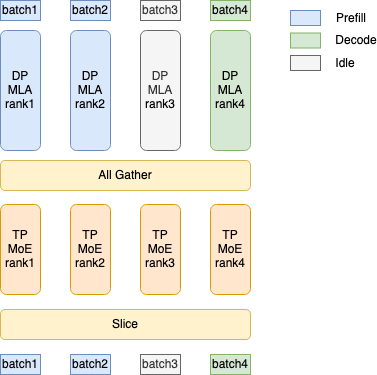
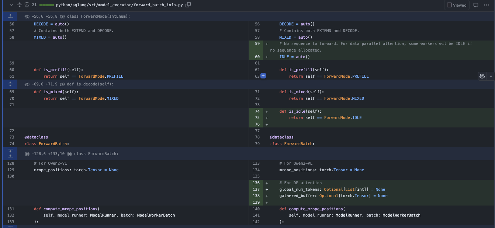
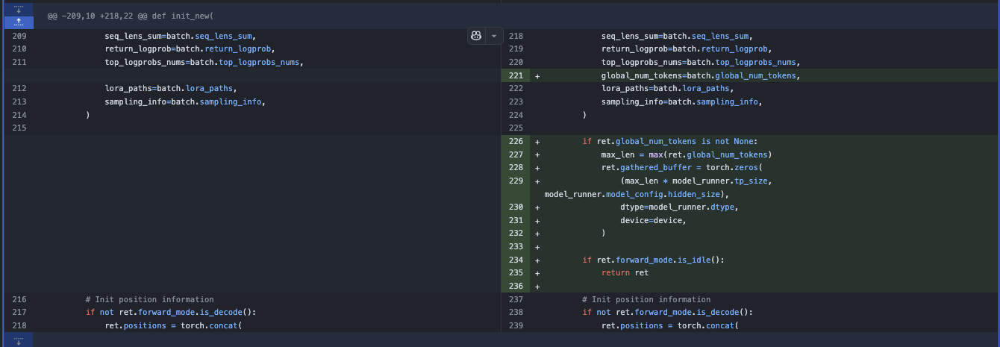
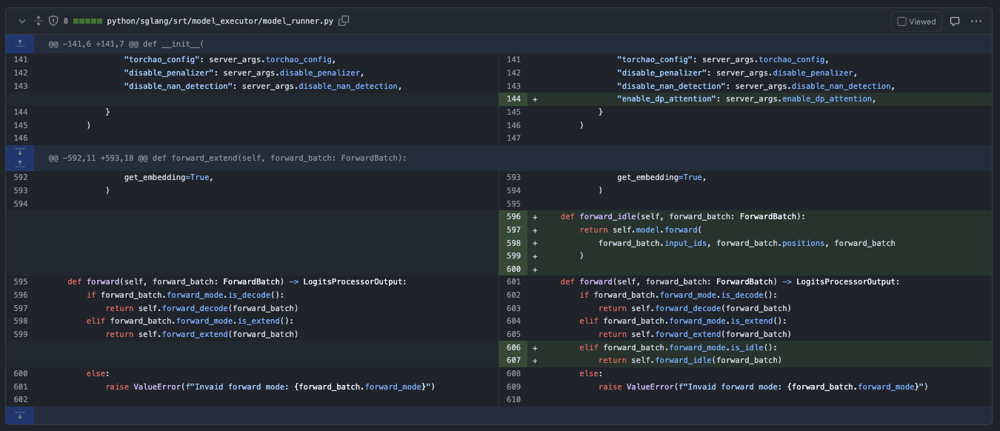
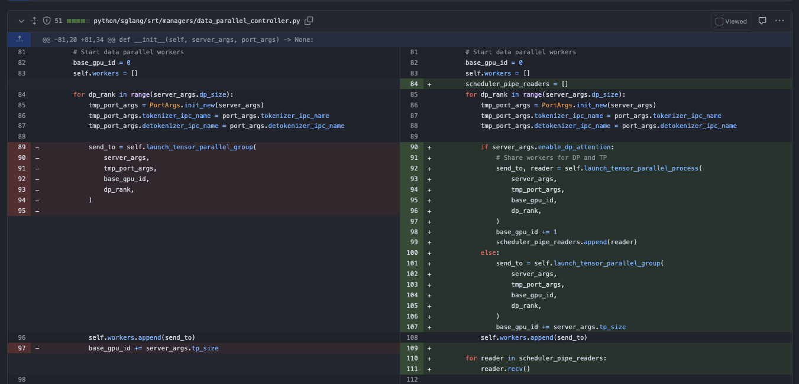
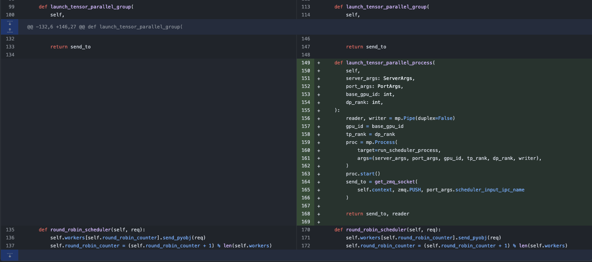
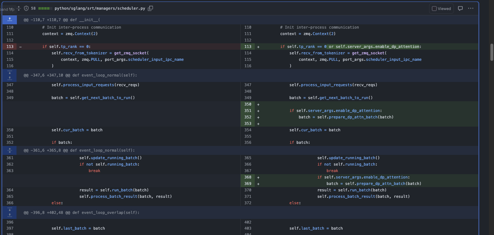
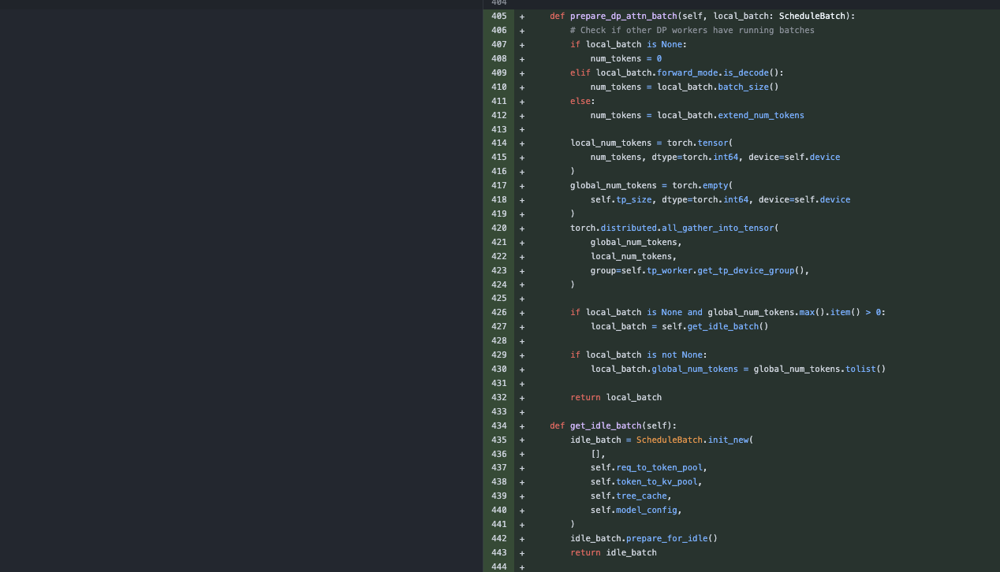
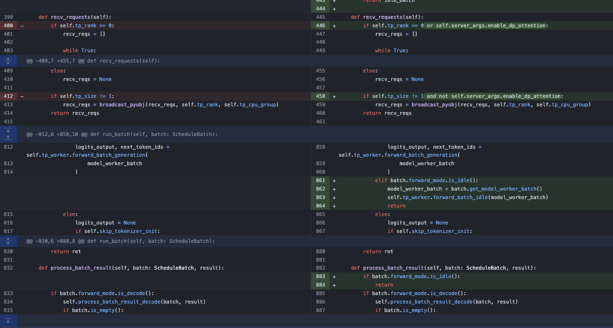

# SGLang DP MLA 특성 해설

> 내 강의 노트다. 관심 있으면 봐도 좋다: https://github.com/BBuf/how-to-optim-algorithm-in-cuda .

> 여기서는 SGLang v0.4 버전에서 DeepSeek 모델을 위해 도입한 MLA Data Parallelism Attention 최적화를 간단히 분석한다. 이 최적화는 Data Parallelism 방식으로 KV Head를 공유해 각 TP Worker가 KV Head를 반복 계산하는 일을 피한다. DeepSeek 계열 모델에는 매우 유용하다. MLA KV Head는 TP 방식으로 여러 GPU에 정상적으로 나눌 수 없어서 서로 다른 RANK에 복제할 수밖에 없기 때문이다. 그런데 TP를 켜면 KV Cache 점유가 MLA Data Parallelism Attention보다 TP배 높아진다. TP번 계산해야 하기 때문이다. 멀티 노드 MLA Data Parallelism Attention 구현에 관심이 있다면 https://github.com/sgl-project/sglang/pull/2925 를 보면 된다.

## 0x0. 서문

SGLang은 v0.4 버전에서 DeepSeek V2/V3/R1을 위해 Data Parallelism Attention 최적화를 도입했다. 여기서는 이를 해설해 본다. 원래 소개는 https://lmsys.org/blog/2024-12-04-sglang-v0-4/#data-parallelism-attention-for-deepseek-models 에 있으며, 그 설명을 옮기면 다음과 같다.

우리가 가장 자주 쓰는 parallel 전략은 tensor parallel이다. 하지만 어떤 모델에서는 이것이 가장 효율적인 전략이 아닐 수 있다. 예를 들어 DeepSeek 모델은 MLA 메커니즘을 사용하고 KV head가 하나뿐이다. 8개 GPU에서 tensor parallel을 사용하면 KV cache 중복과 불필요한 메모리 사용이 발생한다.

이 문제를 극복하기 위해 DeepSeek 모델에 data parallel(DP) 방식의 multi-head latent attention(MLA) 메커니즘을 구현해 추론 throughput을 높였다. attention 컴포넌트에 DP를 적용하면 KV cache를 크게 줄일 수 있고, 더 큰 batch size를 사용할 수 있다. DP attention 구현에서는 각 DP worker가 서로 다른 유형의 batch(prefill, decode, idle)를 독립적으로 처리한 뒤, attention 처리 후 데이터를 모든 worker 사이에서 all-gather해 Mixture-of-Experts(MoE) layer에서 사용한다. 마지막으로 MoE layer 처리가 끝나면 데이터를 다시 각 worker로 재분배한다. 아래 그림이 이 아이디어를 보여준다.



이 설명을 봐도 이해가 잘 되지 않거나 구현 방식이 명확하지 않다면, 나머지 부분을 계속 읽으면 된다. 단일 노드에서 MLA Data Parallelism Attention의 핵심 구현은 https://github.com/sgl-project/sglang/pull/1970 PR이 완료했다. 아래에서는 높은 관점에서 낮은 관점으로 이 feature의 엔지니어링 구현을 이해해 본다.

## 0x1. 모델 구현 변경

여기서는 SGLang DeepSeek의 모델 구현을 간소화해 MLA DP Attention 사용과 관련된 로직만 남겼다. 이렇게 보면 MLA DP Attention이 일반 tensor parallel mode와 비교해 어떤 핵심 변경을 갖는지 빠르게 볼 수 있다.

```python
class DeepseekV2AttentionMLA(nn.Module):
    """DeepSeek V2 모델의 multi-head attention layer로, MLA(Memory-Latency-Aware) 최적화와 data parallel을 지원한다.
    
    이 module은 두 가지 parallel 전략을 구현한다.
    1. Data Parallel (DP): ReplicatedLinear layer를 사용하며 각 device가 전체 parameter 사본을 가진다.
    2. Tensor Parallel (TP): ColumnParallelLinear와 RowParallelLinear layer를 사용해 device 간 parameter를 shard한다.
    """
    def __init__(
        self,
        config: PretrainedConfig,
        hidden_size: int,          # hidden layer dimension
        num_heads: int,            # attention head 수
        qk_nope_head_dim: int,     # rotary position encoding을 사용하지 않는 Q/K head dimension
        qk_rope_head_dim: int,     # rotary position encoding을 사용하는 Q/K head dimension
        v_head_dim: int,           # V head dimension
        q_lora_rank: int,          # Q matrix의 LoRA rank
        kv_lora_rank: int,         # KV matrix의 LoRA rank
        rope_theta: float = 10000, # RoPE position encoding theta parameter
        rope_scaling: Optional[Dict[str, Any]] = None,  # RoPE scaling config
        max_position_embeddings: int = 8192,  # 최대 position encoding length
        quant_config: Optional[QuantizationConfig] = None,  # quantization config
        layer_id=None,             # layer ID
        use_dp=False,              # data parallel 사용 여부
    ) -> None:
        super().__init__()
        self.layer_id = layer_id
        self.hidden_size = hidden_size
        self.qk_nope_head_dim = qk_nope_head_dim
        self.qk_rope_head_dim = qk_rope_head_dim
        self.qk_head_dim = qk_nope_head_dim + qk_rope_head_dim
        self.v_head_dim = v_head_dim
        self.q_lora_rank = q_lora_rank
        self.kv_lora_rank = kv_lora_rank
        self.num_heads = num_heads
        
        # tensor parallel world size 획득
        tp_size = get_tensor_model_parallel_world_size()
        assert num_heads % tp_size == 0
        # DP를 사용하면 각 device가 모든 head를 사용하고, 아니면 device 간 shard한다
        self.num_local_heads = num_heads if use_dp else num_heads // tp_size

        if use_dp:
            # data parallel mode: ReplicatedLinear를 사용하며 각 device가 전체 parameter 사본을 가진다
            if self.q_lora_rank is not None:
                # LoRA를 사용할 때 Q projection
                self.q_a_proj = ReplicatedLinear(
                    self.hidden_size,
                    self.q_lora_rank,
                    bias=False,
                    quant_config=quant_config,
                )
                self.q_a_layernorm = RMSNorm(self.q_lora_rank, eps=config.rms_norm_eps)
                self.q_b_proj = ReplicatedLinear(
                    q_lora_rank,
                    self.num_heads * self.qk_head_dim,
                    bias=False,
                    quant_config=quant_config,
                )
            else:
                # LoRA를 사용하지 않을 때 Q projection
                self.q_proj = ReplicatedLinear(
                    self.hidden_size,
                    self.num_heads * self.qk_head_dim,
                    bias=False,
                    quant_config=quant_config,
                )
            # KV와 output projection
            self.kv_b_proj = ReplicatedLinear(
                self.kv_lora_rank,
                self.num_heads * (self.qk_nope_head_dim + self.v_head_dim),
                bias=False,
                quant_config=quant_config,
            )
            self.o_proj = ReplicatedLinear(
                self.num_heads * self.v_head_dim,
                self.hidden_size,
                bias=False,
                quant_config=quant_config,
            )
        else:
            # tensor parallel mode: ColumnParallelLinear와 RowParallelLinear로 device 간 parameter shard
            if self.q_lora_rank is not None:
                self.q_a_proj = ReplicatedLinear(
                    self.hidden_size,
                    self.q_lora_rank,
                    bias=False,
                    quant_config=quant_config,
                )
                self.q_a_layernorm = RMSNorm(self.q_lora_rank, eps=config.rms_norm_eps)
                self.q_b_proj = ColumnParallelLinear(
                    q_lora_rank,
                    self.num_heads * self.qk_head_dim,
                    bias=False,
                    quant_config=quant_config,
                )
            else:
                self.q_proj = ColumnParallelLinear(
                    self.hidden_size,
                    self.num_heads * self.qk_head_dim,
                    bias=False,
                    quant_config=quant_config,
                )
            self.kv_b_proj = ColumnParallelLinear(
                self.kv_lora_rank,
                self.num_heads * (self.qk_nope_head_dim + self.v_head_dim),
                bias=False,
                quant_config=quant_config,
            )
            self.o_proj = RowParallelLinear(
                self.num_heads * self.v_head_dim,
                self.hidden_size,
                bias=False,
                quant_config=quant_config,
            )

def all_gather(
    input_tensor: torch.Tensor, forward_batch: ForwardBatch, rank, world_size, group
):
    """data parallel mode에서 각 device의 tensor를 수집하고 동기화한다.
    
    Args:
        input_tensor: input tensor
        forward_batch: forward 계산 batch 정보
        rank: 현재 device rank
        world_size: parallel device 총수
        group: communication group
        
    Returns:
        tuple: (gathered_tensors, start_index, end_index)
            - gathered_tensors: 수집된 모든 device의 tensor
            - start_index: 현재 device data의 시작 index
            - end_index: 현재 device data의 끝 index
    """
    if world_size == 1:
        return input_tensor

    # 각 device의 token 수 획득
    all_lens = forward_batch.global_num_tokens
    max_len = max(forward_batch.global_num_tokens)

    # input tensor를 padding해 길이를 max_len에 맞춘다
    padded_tensor = torch.nn.functional.pad(
        input_tensor, (0, 0, 0, max_len - input_tensor.shape[0])
    )

    # all_gather로 모든 device의 tensor 수집
    torch.distributed.all_gather_into_tensor(
        forward_batch.gathered_buffer, padded_tensor, group=group
    )

    # 수집한 tensor를 실제 길이에 따라 concat
    gathered_tensors = torch.concat(
        [
            forward_batch.gathered_buffer[i * max_len : i * max_len + all_lens[i]]
            for i in range(world_size)
        ]
    )

    # 현재 device data의 시작/끝 index 계산
    start_index = 0 if rank == 0 else sum(all_lens[:rank])
    end_index = start_index + all_lens[rank]

    return gathered_tensors, start_index, end_index


class DeepseekV2DecoderLayer(nn.Module):
    """DeepSeek V2 모델의 decoder layer로, data parallel attention mechanism을 지원한다."""
    def __init__(
        self,
        config: PretrainedConfig,
        layer_id: int,
        quant_config: Optional[QuantizationConfig] = None,
    ) -> None:
        super().__init__()
        self.hidden_size = config.hidden_size
        # config에 따라 data parallel attention 활성화 여부 결정
        self.enable_dp_attention = (
            not global_server_args_dict["disable_mla"]
            and global_server_args_dict["enable_dp_attention"]
        )
        if self.enable_dp_attention:
            # data parallel 관련 parameter 초기화
            self.tp_rank = get_tensor_model_parallel_rank()
            self.tp_size = get_tensor_model_parallel_world_size()
            self.tp_group = get_tp_group().device_group

    def forward(
        self,
        positions: torch.Tensor,
        hidden_states: torch.Tensor,
        forward_batch: ForwardBatch,
        residual: Optional[torch.Tensor],
    ) -> torch.Tensor:
        # data parallel mode의 forward 계산
        if self.enable_dp_attention:
            # 모든 device의 hidden states 수집
            hidden_states, start_idx, end_idx = all_gather(
                hidden_states, forward_batch, self.tp_rank, self.tp_size, self.tp_group
            )
            # Fused MoE MLP 계산 수행
            hidden_states = self.mlp(hidden_states)
            # 현재 device에 대응하는 부분 추출
            hidden_states = hidden_states[start_idx:end_idx]

        return hidden_states, residual


class DeepseekV2ForCausalLM(nn.Module):
    """DeepSeek V2 causal language model로, data parallel과 tensor parallel 두 mode를 지원한다."""
    def __init__(
        self,
        config: PretrainedConfig,
        quant_config: Optional[QuantizationConfig] = None,
    ) -> None:
        super().__init__()
        self.config = config
        self.quant_config = quant_config
        self.model = DeepseekV2Model(config, quant_config)
        
        if global_server_args_dict["enable_dp_attention"]:
            # data parallel mode: language model head로 ReplicatedLinear 사용
            self.lm_head = ReplicatedLinear(
                config.hidden_size,
                config.vocab_size,
                bias=False,
            )
            # all_gather operation을 건너뛰는 LogitsProcessor
            self.logits_processor = LogitsProcessor(config, skip_all_gather=True)
        else:
            # tensor parallel mode: ParallelLMHead 사용
            self.lm_head = ParallelLMHead(
                config.vocab_size, config.hidden_size, quant_config=quant_config
            )
            self.logits_processor = LogitsProcessor(config)
```

이 모델 구현 코드에서 볼 수 있듯, SGLang의 DeepSeek 모델 대상 Data Parallelism Attention 최적화는 MLA Attention 사용 시 KV cache 중복 문제를 주로 해결한다. 이 최적화는 전통적인 tensor parallel(TP)을 data parallel(DP) 방식으로 바꿔 구현한다. `DeepseekV2AttentionMLA` 클래스에서는 `ReplicatedLinear` layer를 사용해 전체 parameter를 복제하는 DP mode와, `ColumnParallelLinear/RowParallelLinear` layer로 parameter를 shard하는 TP mode를 모두 지원한다. `all_gather` 함수는 DP worker 사이의 데이터 동기화를 구현해 각 worker가 서로 다른 유형의 batch를 독립적으로 처리한 뒤, MoE layer 처리 후 데이터를 다시 재분배할 수 있게 한다. 이런 parallel 전략 변경은 KV cache 메모리 점유를 줄일 뿐 아니라 더 큰 batch size를 가능하게 해 모델 추론 throughput을 높인다.

위 `all_gather` 구현에서는 `forward_batch`(`ForwardBatch` 타입)가 `global_num_tokens`와 `gathered_buffer`라는 두 member variable을 유지해 Fused MoE Layer 전 allgather와 Fused MoE 계산 뒤 split을 돕는 것을 볼 수 있다.

다음으로 Data Parallelism Attention 최적화와 관련된 더 낮은 수준 변경을 본다. managers와 model_executor 두 측면이다. 실제 변경에는 SGLang의 TPModelWorker(https://github.com/sgl-project/sglang/blob/main/python/sglang/srt/managers/tp_worker.py)와 ModelRunner(https://github.com/sgl-project/sglang/blob/main/python/sglang/srt/model_executor/model_runner.py) 두 부분이 포함된다. 물론 `TpModelWorker` 스케줄링을 담당하는 Scheduler 부분에도 대응 수정이 있지만, 바뀐 내용은 많지 않다. 아래에서 나누어 본다.

## 0x2. model_executor 변경

### `python/sglang/srt/model_executor/forward_batch_info.py` 변경




먼저 `ForwardMode` 클래스에 새로운 mode `IDLE`이 추가되었다. 주석은 어떤 worker에 forward할 sequence가 없을 때 worker가 IDLE 상태가 된다고 설명한다. 글 앞의 그림을 떠올리면 된다.

이어 `ForwardBatch`에는 data parallel attention 관련 member variable이 추가되었다.
- `global_num_tokens`: 타입은 `Optional[List[int]]`, 초기값은 None
- `gathered_buffer`: 타입은 `Optional[torch.Tensor]`, 초기값은 None

마지막은 `compute_erope_positions` method 변경이다. `global_num_tokens`가 None이 아니면 최대 길이 `max_len = max(ret.global_num_tokens)`를 계산한다. 새 `gathered_buffer` tensor를 만들고, `torch.zeros`로 `size`, `dtype`, `device` 같은 tensor 속성을 설정한다. 또한 `forward_mode.is_idle()` 판단이 추가되어, IDLE mode이면 ret를 바로 반환한다.

### `python/sglang/srt/model_executor/model_runner.py` 변경



여기서는 `idel` mode 판단만 추가되었다.

## 0x3. managers 변경

여기서 주된 변경 위치는 scheduler 관련 부분과 data_parallel_controller다. 각각 훑어보자.

### `python/sglang/srt/managers/data_parallel_controller.py` 변경




수정 흐름을 보면, 먼저 가장 바깥 loop가 각 data parallel(DP) rank마다 전용 프로세스를 만든다. 이 프로세스들은 data parallel과 tensor parallel 계산을 동시에 처리한다. 이어 각 프로세스에는 고유 GPU가 할당된다. 이는 `base_gpu_id`를 증가시키는 방식으로 구현되어, 서로 다른 data parallel rank가 서로 다른 GPU 자원을 쓰게 한다. 통신에서는 `mp.Pipe`로 프로세스 간 통신 pipe를 만들고 ZMQ socket으로 메시지를 전달한다. 마지막으로 모든 reader가 scheduler_pipe_readers 목록에 수집되어 이후 통신에 사용된다.

### `python/sglang/srt/managers/scheduler.py` 변경





여기서 주목할 것은 새로 추가된 `prepare_dp_attn_batch` 함수다. 이 함수는 각 DP worker의 `local_num_tokens`에 대해 allgather 통신을 수행해 `global_num_tokens`를 얻는다. 마지막으로 이 정보는 1절에서 언급했듯 Fused MoE layer 뒤 데이터를 다시 split하는 데 사용된다.

```python
def prepare_dp_attn_batch(self, local_batch: ScheduleBatch):
    # Check if other DP workers have running batches
    if local_batch is None:
        num_tokens = 0
    elif local_batch.forward_mode.is_decode():
        num_tokens = local_batch.batch_size()
    else:
        num_tokens = local_batch.extend_num_tokens

    local_num_tokens = torch.tensor(
        num_tokens, dtype=torch.int64, device=self.device
    )
    global_num_tokens = torch.empty(
        self.tp_size, dtype=torch.int64, device=self.device
    )
    torch.distributed.all_gather_into_tensor(
        global_num_tokens,
        local_num_tokens,
        group=self.tp_worker.get_tp_device_group(),
    )

    if local_batch is None and global_num_tokens.max().item() > 0:
        local_batch = self.get_idle_batch()

    if local_batch is not None:
        local_batch.global_num_tokens = global_num_tokens.tolist()

    return local_batch
```

## 0x4. 확장

위에서는 단일 노드의 원리와 구현을 소개했다. 이 Feature를 여러 노드로 확장하려면 더 복잡하다. x-AI contributor가 https://github.com/sgl-project/sglang/pull/2925 에서 DP Attention의 멀티 노드 확장을 구현했고, 현재 DeepSeek V3/R1 같은 모델의 멀티 노드 배포에서도 이 최적화를 원활하게 켤 수 있다. 관심 있는 독자는 멀티 노드 구현 부분을 직접 읽고 연구해 볼 수 있다.

## 0x5. 정리

여기서는 SGLang v0.4 버전에서 DeepSeek 모델을 위해 도입한 MLA Data Parallelism Attention 최적화를 간단히 분석했다. 이 최적화는 Data Parallelism 방식으로 KV Head를 공유해 각 TP Worker가 KV Head를 반복 계산하는 일을 피한다. DeepSeek 계열 모델에는 매우 유용하다. MLA KV Head는 TP 방식으로 여러 GPU에 정상적으로 나눌 수 없어서 서로 다른 RANK에 복제할 수밖에 없기 때문이다. 그런데 TP를 켜면 KV Cache 점유가 MLA Data Parallelism Attention보다 TP배 높아진다. TP번 계산해야 하기 때문이다. 멀티 노드 MLA Data Parallelism Attention 구현에 관심이 있다면 https://github.com/sgl-project/sglang/pull/2925 를 보면 된다.
