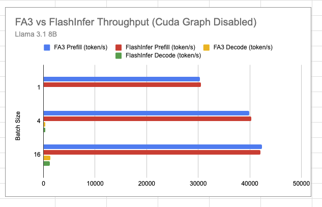
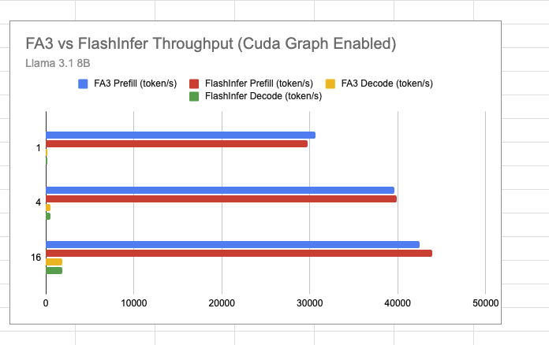
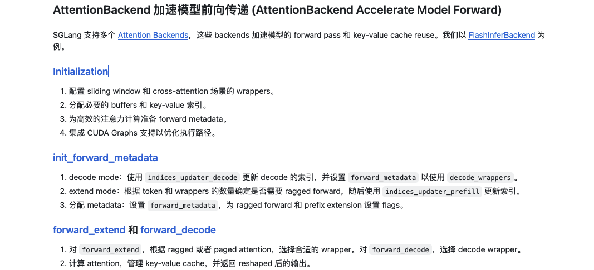
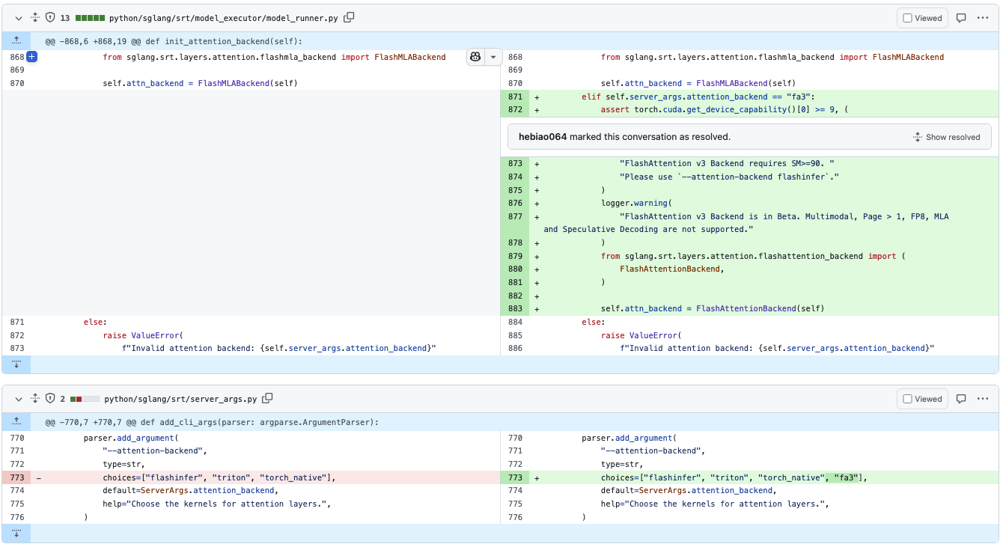
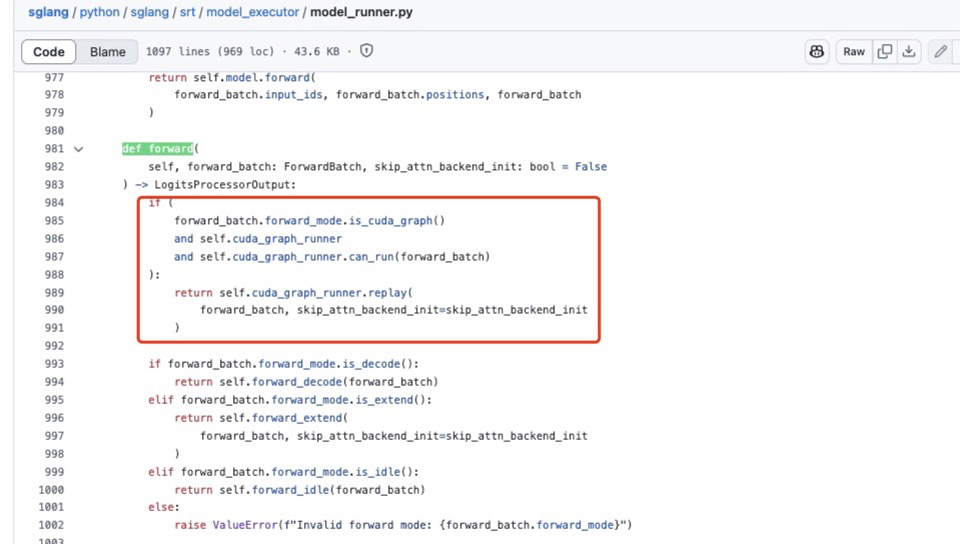

# SGLang Flash Attention V3 Backend 지원

> 내 강의 노트다. 관심 있으면 봐도 좋다: https://github.com/BBuf/how-to-optim-algorithm-in-cuda/tree/master/cuda-mode . 주로 LLM과 CUDA 관련 내용이다.

## 0x0 서문

최근 SGLang은 https://github.com/sgl-project/sglang/pull/4356 에서 page_size>1의 KV Cache Allocator를 지원한 뒤 프레임워크가 더 유연해졌다. 사용자는 새로운 Attention Backend, FlashMLA 같은 고급 기능을 접속할 수 있다. 이어서 LinkedIn의 몇몇 동료가 SGLang에 FlashAttention V3 Backend를 빠르게 지원했다. 자세한 내용은 https://github.com/sgl-project/sglang/issues/4709 를 보면 된다. 좋은 예시다. 여기서는 SGLang이 Flash Attention V3를 지원하는 방법을 해설해 본다. 다른 Attention Backend를 접속해야 하는 경우에도 이 작업을 참고할 수 있다.

## 0x1. 효과





Llama3의 end2end 테스트 결과를 보면 Flash Attention V3 기반 Backend와 기본 FlashInfer Backend의 차이는 크지 않다. 다만 FA3는 FP8 Attention을 지원하므로, 이후 지원이 붙으면 성능을 기대해 볼 수 있다. 또한 이 지원은 비교적 초기 단계라 Page Size=1만 지원하고 FP8과 멀티모달 모델 등은 아직 지원하지 않는다. Roadmap은 https://github.com/sgl-project/sglang/pull/4680 에서 볼 수 있고, 관심 있다면 참여해도 좋다.

## 0x2. 입구

먼저 https://github.com/zhaochenyang20/Awesome-ML-SYS-Tutorial/blob/main/sglang/code-walk-through/readme-CN.md 의 SGLang 코드 walk through를 읽으면 SGLang 프레임워크 전체를 이해할 수 있다. 문서의 ModelRunner Manages Model Execution 절은 ModelRunner와 Attention Backend의 관계, 그리고 Flashinfer Attention Backend 구현의 핵심 컴포넌트를 지적한다.

또한 Flash Attention Backend 구현에 쓰이는 KV Cache 관련 데이터 구조를 이해하려면 https://github.com/zhaochenyang20/Awesome-ML-SYS-Tutorial/blob/main/sglang/kvcache-code-walk-through/readme-CN.md#kv-cache%E4%B8%8E%E5%86%85%E5%AD%98%E6%B1%A0 의 SGLang KV Cache Walk Through 문서를 미리 읽는 것이 좋다.



Flash Attention V3 지원의 입구 부분은 다음과 같다.



이 그림에서 SGLang FA3 Backend의 몇 가지 제한을 볼 수 있다.

## 0x3. Flash Attention V3 Backend 컴포넌트

앞서 말했듯 Flash Attention V3 Backend의 몇 가지 컴포넌트를 구현해야 한다. 예를 들어 prefill/extend용 `forward_extend`, decode용 `forward_decode`가 필요하고, forward에 필요한 Meta 정보도 유지해야 한다. 그 밖에 cuda graph를 지원하려면 cuda graph 초기화와 replay 관련 Meta 정보도 추가해야 한다. 아래에서 이 단계들을 간단히 walk through한다.

### FlashAttentionBackend 초기화

```python
@dataclass
class FlashAttentionMetadata:
    """decode 연산에 사용하는 Meta 정보로, 반복 계산을 피한다."""

    cu_seqlens_q: torch.Tensor = None  # query sequence의 누적 길이, batch 안 각 sequence 시작 위치를 찾는 데 사용
    cu_seqlens_k: torch.Tensor = None  # key sequence의 누적 길이, batch 안 각 sequence 시작 위치를 찾는 데 사용
    max_seq_len_k: int = 0             # batch에서 가장 긴 key sequence 길이
    window_size: tuple = (-1, -1)      # attention window 크기, sliding window attention에 사용, (-1, -1)은 무제한 window
    page_table: torch.Tensor = None    # page table, KV Cache에서 token 위치를 찾는 데 사용
    cache_seqlens_int32: torch.Tensor = None  # int32 타입 sequence 길이, CUDA 최적화용
    max_seq_len_q: int = 0             # batch에서 가장 긴 query sequence 길이


class FlashAttentionBackend(AttentionBackend):
    """FlashAttention backend 구현으로, 효율적인 attention 계산을 제공한다."""

    def __init__(
        self,
        model_runner: ModelRunner,
        skip_prefill: bool = False,  # prefill 단계를 건너뛸지 여부
    ):
        super().__init__()

        # assert check: sliding window와 encoder-decoder 구조는 동시에 사용할 수 없다
        assert not (
            model_runner.sliding_window_size is not None
            and model_runner.model_config.is_encoder_decoder
        ), "Sliding window and cross attention are not supported together"

        # Meta 정보 초기화
        self.forward_metadata: FlashAttentionMetadata = None  # forward Meta 정보, 반복 계산 캐시용
        self.max_context_len = model_runner.model_config.context_len  # 최대 context 길이
        self.device = model_runner.device  # 계산 device(GPU)
        self.decode_cuda_graph_metadata = {}  # CUDA Graph Meta 정보, decode 추론 가속용
        self.req_to_token = model_runner.req_to_token_pool.req_to_token  # request에서 token으로 가는 mapping pool
```

`model_runner.req_to_token_pool`과 KV Cache의 구체적인 유지 과정은 SGLang KV Cache Walk Through 문서(링크: https://github.com/zhaochenyang20/Awesome-ML-SYS-Tutorial/blob/main/sglang/kvcache-code-walk-through/readme-CN.md#kv-cache%E4%B8%8E%E5%86%85%E5%AD%98%E6%B1%A0)를 보면 된다.

### forward에 필요한 Meta 정보 초기화

```python
def init_forward_metadata(self, forward_batch: ForwardBatch):
    """forward Meta 정보를 초기화해 계산 결과를 캐시하고 반복 계산을 피한다.
    
    이 함수는 들어온 batch 정보에 따라 FlashAttentionMetadata 객체를 만들고 초기화한다.
    이 객체에는 attention 계산에 필요한 여러 Meta 정보가 들어 있다.
    
    Args:
        forward_batch: forward batch 정보를 담은 ForwardBatch 객체
    """
    # 새 Meta 정보 객체 생성
    metadata = FlashAttentionMetadata()

    # extend sequence 길이 정보 획득
    extend_seq_lens = forward_batch.extend_seq_lens
    # batch에서 원본 sequence 길이 정보 획득
    seqlens_in_batch = forward_batch.seq_lens
    # sequence 길이를 int32로 변환해 이후 계산에 사용
    metadata.cache_seqlens_int32 = seqlens_in_batch.to(torch.int32)
    # batch size와 device 정보 계산
    batch_size = len(seqlens_in_batch)
    device = seqlens_in_batch.device
    
    # cumulative sequence lengths 계산, KV cache index에 사용
    # pad는 앞에 0을 붙여 결과 길이를 batch_size+1로 만든다
    metadata.cu_seqlens_k = torch.nn.functional.pad(
        torch.cumsum(seqlens_in_batch, dim=0, dtype=torch.int32), (1, 0)
    )
    
    # batch에서 최대 sequence 길이를 계산해 memory allocation과 계산 최적화에 사용
    metadata.max_seq_len_k = seqlens_in_batch.max().item()
    
    # request index에 따라 page table을 구성해 token 접근에 사용
    metadata.page_table = forward_batch.req_to_token_pool.req_to_token[
        forward_batch.req_pool_indices, : metadata.max_seq_len_k
    ]
    
    if forward_batch.forward_mode == ForwardMode.DECODE:
        # decode mode에서는 각 request에 query token이 하나뿐이다
        # 따라서 cumulative lengths는 0부터 batch_size까지의 단순 sequence다
        metadata.cu_seqlens_q = torch.arange(
            0, batch_size + 1, dtype=torch.int32, device=device
        )
    else:
        # 모든 request에 prefix가 없는지 확인
        extend_no_prefix = not any(forward_batch.extend_prefix_lens)
        
        # prefix 유무에 따라 query 누적 길이를 계산
        if not extend_no_prefix:
            # prefix가 있을 때는 extend sequence 길이로 계산
            metadata.cu_seqlens_q = torch.nn.functional.pad(
                torch.cumsum(extend_seq_lens, dim=0, dtype=torch.int32), (1, 0)
            )
        else:
            # prefix가 없을 때 query와 key의 누적 길이가 같다
            metadata.cu_seqlens_q = metadata.cu_seqlens_k
            
        # query의 최대 sequence 길이를 설정해 memory allocation에 사용
        metadata.max_seq_len_q = seqlens_in_batch.max().item()
        
    # 계산된 Meta 정보 저장
    self.forward_metadata = metadata
```

### forward_extend와 foward_decode 구현

```python
def forward_extend(
        self,
        q: torch.Tensor,
        k: torch.Tensor,
        v: torch.Tensor,
        layer: RadixAttention,
        forward_batch: ForwardBatch,
        save_kv_cache=True,
    ):
        # cache 위치 결정 - cross attention 여부에 따라 선택
        cache_loc = (
            forward_batch.out_cache_loc
            if not layer.is_cross_attention
            else forward_batch.encoder_out_cache_loc
        )

        # 새 key와 value가 있으면 KV cache에 저장
        if k is not None:
            assert v is not None  # value도 존재하는지 확인
            if save_kv_cache:
                forward_batch.token_to_kv_pool.set_kv_buffer(
                    layer, cache_loc, k, v, layer.k_scale, layer.v_scale
                )

        # 미리 계산한 Meta 정보를 사용해 반복 계산을 피한다
        metadata = self.forward_metadata

        # sliding window 크기 계산
        # 주: model.get_attention_sliding_window_size()에서 이미 1을 뺐으므로 layer.sliding_window_size - 1이 필요 없다
        # 여기서 window는 양방향 포함이다
        window_size = (
            (layer.sliding_window_size, 0)  # sliding window가 있으면 왼쪽 window 크기 설정
            if layer.sliding_window_size is not None
            else (-1, -1)  # 아니면 full attention, 즉 무제한 window 사용
        )
        
        # KV cache를 가져와 key와 value로 푼다
        kv_cache = forward_batch.token_to_kv_pool.get_kv_buffer(layer.layer_id)
        key_cache, value_cache = kv_cache[0], kv_cache[1]
        
        # flash_attn_with_kvcache로 attention 계산 수행
        o = flash_attn_with_kvcache(
            # query tensor를 필요한 shape로 reshape
            q=q.contiguous().view(-1, layer.tp_q_head_num, layer.head_dim),
            # key와 value cache 차원 확장
            k_cache=key_cache.unsqueeze(1),
            v_cache=value_cache.unsqueeze(1),
            # page table은 token 위치 지정에 사용
            page_table=metadata.page_table,
            # cache 안 sequence 길이
            cache_seqlens=metadata.cache_seqlens_int32,
            # query와 key의 누적 sequence 길이, batch index에 사용
            cu_seqlens_q=metadata.cu_seqlens_q,
            cu_seqlens_k_new=metadata.cu_seqlens_k,
            # query의 최대 sequence 길이
            max_seqlen_q=metadata.max_seq_len_q,
            # attention 계산 scaling factor
            softmax_scale=layer.scaling,
            # causal mask 사용 여부, prefix가 suffix를 보지 않게 한다
            causal=True,
            # attention window 크기
            window_size=window_size,
            # logits soft cap, 수치 불안정을 막는다
            softcap=layer.logit_cap,
            # key와 value descale factor
            k_descale=layer.k_scale,
            v_descale=layer.v_scale,
        )

        # 출력 tensor를 reshape해 반환
        return o.view(-1, layer.tp_q_head_num * layer.head_dim)
```

`forward_decode` 구현은 `forward_extend`와 비슷하므로 여기서는 반복하지 않는다.

### CUDA-Graph 지원

아래 코드는 두 함수를 포함한다. `init_cuda_graph_state`는 CUDA Graph replay 때 memory allocation을 피하기 위해 page_table 같은 고정 크기 tensor를 초기화한다. `init_forward_metadata_capture_cuda_graph`는 CUDA Graph capture 단계에서 필요한 Meta 정보를 준비한다. 여기에는 sequence 길이, 누적 sequence 길이, Page Table 같은 핵심 정보가 포함된다.

```python
def init_cuda_graph_state(self, max_bs: int):
    """Initialize CUDA graph state for the attention backend.

    Args:
        max_bs (int): Maximum batch size to support in CUDA graphs

    This creates fixed-size tensors that will be reused during CUDA graph replay
    to avoid memory allocations.
    """
    # decode 연산용 고정 크기 tensor 초기화
    # CUDA graph의 Meta 정보를 저장할 dict 생성
    self.decode_cuda_graph_metadata = {
        # Page Table은 token mapping에 사용 (batch_size, max_context_len)
        # 이 tensor는 KV cache에서 올바른 위치를 찾는 데 사용된다
        "page_table": torch.zeros(
            max_bs, self.max_context_len, dtype=torch.int32, device=self.device
        ),
    }

def init_forward_metadata_capture_cuda_graph(
    self,
    bs: int,
    num_tokens: int,
    req_pool_indices: torch.Tensor,
    seq_lens: torch.Tensor,
    encoder_lens: Optional[torch.Tensor],
    forward_mode: ForwardMode,
    spec_info: Optional[Union[EagleDraftInput, EagleVerifyInput]],
):
    """Initialize forward metadata for capturing CUDA graph."""
    # forward에 필요한 정보를 저장할 새 Meta 정보 객체 생성
    metadata = FlashAttentionMetadata()
    
    # sequence 정보를 가져와 int32 타입으로 변환(CUDA 필요)
    metadata.cache_seqlens_int32 = seq_lens.to(torch.int32)
    batch_size = len(seq_lens)
    device = seq_lens.device
    
    # 누적 sequence 길이 계산, batch index에 사용
    # 앞에 0을 추가해 shape을 [batch_size]에서 [batch_size+1]로 만든다
    metadata.cu_seqlens_k = torch.nn.functional.pad(
        torch.cumsum(seq_lens, dim=0, dtype=torch.int32), (1, 0)
    )
    
    # 최대 sequence 길이를 미리 계산해 attention 계산 최적화에 사용
    metadata.max_seq_len_k = seq_lens.max().item()
    
    # Page Table 설정, KV cache에서 올바른 위치를 찾는 데 사용
    # request pool index에 따라 해당 row 선택
    metadata.page_table = self.decode_cuda_graph_metadata["page_table"][
        req_pool_indices, :
    ]
    
    if forward_mode == ForwardMode.DECODE:
        # decode mode에서는 query의 누적 sequence 길이를 미리 계산
        # decode mode에서 각 batch는 query token 하나만 가진다
        metadata.cu_seqlens_q = torch.arange(
            0, batch_size + 1, dtype=torch.int32, device=device
        )
    else:
        # 현재는 decode mode CUDA graph만 지원
        raise ValueError("Do not support Prefill Mode cuda graph")
        
    # 이후 사용을 위해 Meta 정보를 dict에 저장
    self.decode_cuda_graph_metadata[bs] = metadata
    self.forward_metadata = metadata
```

이 두 함수는 CUDA Graph replay 단계의 Meta 정보 초기화를 구현한다.

```python
def init_forward_metadata_replay_cuda_graph(
    self,
    bs: int,
    req_pool_indices: torch.Tensor,
    seq_lens: torch.Tensor,
    seq_lens_sum: int,
    encoder_lens: Optional[torch.Tensor],
    forward_mode: ForwardMode,
    spec_info: Optional[Union[EagleDraftInput, EagleVerifyInput]],
    seq_lens_cpu: Optional[torch.Tensor],
):
    """CUDA graph replay에 사용할 forward Meta 정보를 초기화한다.
    
    Args:
        bs: batch size
        req_pool_indices: request pool index, 각 request의 token 위치 지정에 사용
        seq_lens: 각 request의 sequence 길이
        seq_lens_sum: 모든 sequence 길이의 합
        encoder_lens: encoder sequence 길이(optional)
        forward_mode: forward mode(decode/verify 등)
        spec_info: 특수 입력 정보(Eagle mode에 사용)
        seq_lens_cpu: CPU 위의 sequence 길이(optional)
    """
    # 실제 batch size만큼 sequence 길이를 자른다
    seqlens_in_batch = seq_lens[:bs]
    # 미리 할당된 Meta 정보 객체 획득
    metadata = self.decode_cuda_graph_metadata[bs]
    # sequence 길이를 int32 타입으로 변환, CUDA 연산에 필요
    metadata.cache_seqlens_int32 = seqlens_in_batch.to(torch.int32)
    # 누적 sequence 길이를 계산하고 앞에 0을 붙여 batch index에 사용
    metadata.cu_seqlens_k = torch.nn.functional.pad(
        torch.cumsum(seqlens_in_batch, dim=0, dtype=torch.int32), (1, 0)
    )
    # 최대 sequence 길이를 미리 계산해 memory 최적화에 사용
    metadata.max_seq_len_k = seqlens_in_batch.max().item()
    # 최대 sequence 길이를 넘는 page table 부분을 0으로 비워 낡은 data 사용을 피한다
    metadata.page_table[:, metadata.max_seq_len_k :].fill_(0)
    # request에 대응하는 token mapping을 page table에 복사한다
    metadata.page_table[:, : metadata.max_seq_len_k].copy_(
        self.req_to_token[req_pool_indices[:bs], : metadata.max_seq_len_k]
    )
    # decode 단계에서 사용할 Meta 정보 저장
    self.forward_decode_metadata = metadata

def get_cuda_graph_seq_len_fill_value(self):
    """CUDA graph에서 sequence length fill value를 얻는다.
    
    Returns:
        int: sequence length를 채울 기본값(0)
    """
    return 0
```

지적해야 할 점은 이 함수들이 모두 CUDA Graph capture와 replay 준비를 위한 것이라는 점이다. 실제 CUDA Graph capture는 https://github.com/sgl-project/sglang/blob/main/python/sglang/srt/model_executor/cuda_graph_runner.py#L165 의 CudaGraphRunner가 수행한다. Decode에 적용되는 capture 이후 CUDA Graph replay는 https://github.com/sgl-project/sglang/blob/d89c0e4b7ed3b9d4b119cf66544765cc4c7adadb/python/sglang/srt/model_executor/model_runner.py#L90C7-L90C18 의 ModelRunner 클래스 `forward`에서 완료된다. 아래 빨간 박스 부분이다.



## 0x4. 정리

SGLang에서 Flash Attention V3 Backend를 지원하는 단계를 간단히 정리하고, Meta 정보 초기화, 서로 다른 mode의 forward 구현, cuda graph 준비 작업 같은 핵심 컴포넌트에 주석을 달았다. 비슷한 요구가 있는 독자는 참고할 수 있다. 또한 블로그에서 언급한 두 편의 사전 SGLang Code walk through와 KV Cache code walk through도 강하게 추천한다.
