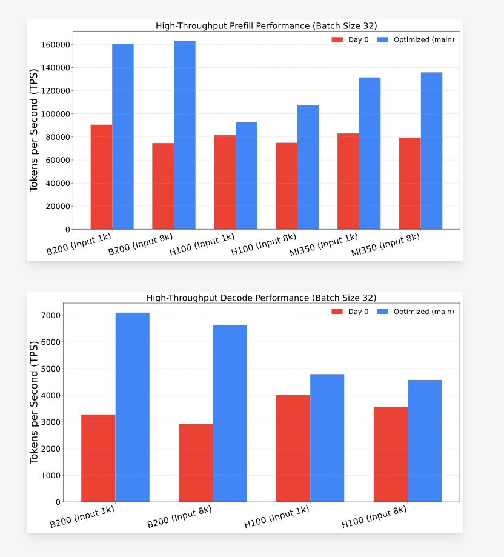
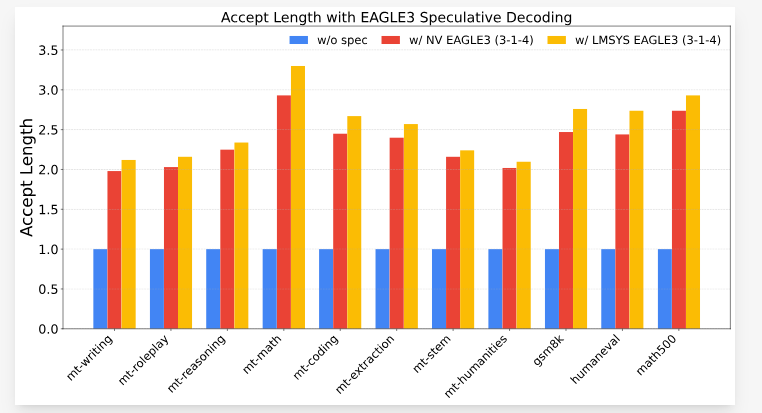
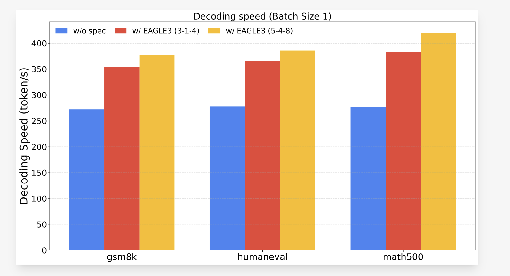

> 원 블로그 링크: https://lmsys.org/blog/2025-08-27-gpt-oss/ , 여기서는 번역과 지식 공유만을 목적으로 합니다.


# SGLang의 GPT-OSS 지원: Day 0 지원부터 성능 최적화까지

> 작성자: Liangsheng Yin, Ke Bao, 2025년 8월 27일

최근 공개된 openai/gpt-oss-120b 모델의 깊은 성능 최적화와 새 기능에 초점을 둔 SGLang의 중요한 업데이트를 발표하게 되어 기쁩니다. **우리는 Day 0부터 지원을 제공했지만, 최근 몇 주 동안 엔진을 강화해 최상의 성능을 보장하는 데 시간을 썼습니다.**

이 글은 최신 성과를 중점적으로 소개합니다. GPT-OSS의 성능이 크게 향상되어 prefill 단계 처리량은 최대 **2.1배**, decode 단계 처리량은 최대 **2.25배** 높아졌고, NVIDIA Blackwell & Hopper와 AMD MI350 GPU를 바로 지원하며, speculative decoding을 지원하고, 복잡한 agent 애플리케이션을 지원하기 위한 API도 강화했습니다. 이 모든 변화는 모델의 높은 정확도를 유지하면서 이루어졌습니다.

모든 변경은 이제 main 브랜치에서 사용할 수 있습니다.

### SGLang 시작하기

```bash
pip install "sglang[all]>=0.5.1.post3"
python3 -m sglang.launch_server --model-path openai/gpt-oss-120b --tp 4
```

환경 설정과 최적 성능을 얻는 방법에 대한 자세한 설명은 awesome-sglang(https://github.com/sgl-project/awesome-sglang/tree/main/gpt-oss)의 가이드를 참고하세요.

## 데이터가 말한다: 포괄적인 benchmark 결과

최적화의 영향을 보여주기 위해 다양한 하드웨어 구성에서 SGLang을 benchmark했습니다. 모든 결과의 재현 명령은 여기(https://github.com/sgl-project/sglang/tree/main/benchmark/gpt_oss)에서 확인할 수 있습니다.

##### 낮은 지연 시간 성능(batch size = 1)

지연 시간에 민감한 애플리케이션을 위해 B200과 H100 GPU에서 단일 batch decode 처리량을 측정했고, 뛰어난 성능을 확인했습니다.

| 하드웨어 / 정밀도 | NVIDIA B200  | NVIDIA H100  |
| ------------ | ------------ | ------------ |
| MXFP4        | 416.02 tok/s | 318.53 tok/s |
| BF16         | 315.63 tok/s | 293.12 tok/s |

<span style="color: grey; font-size: 12px;">
B200은 TP=4로 테스트했고, H100은 TP=8 및 triton attention으로 테스트했습니다.
</span>

##### 높은 처리량 성능(batch size = 32)

높은 처리량 애플리케이션에서 SGLang은 초기 Day 0 지원 대비 뚜렷한 성능 향상을 제공하며, 여러 하드웨어에서 prefill과 decode 모두 훌륭한 결과를 보입니다.

<!-- 회색 텍스트 -->

<span style="color: grey; font-size: 12px;">
AMD MI350 결과는 아직 완전히 최적화되지 않은 triton backend로 테스트했습니다. AMD AITER를 사용하는 더 많은 최적화는 곧 공개될 예정입니다.
</span>



## 성능 심층 분석

성능 향상은 kernel 수준의 몇 가지 핵심 최적화에서 나왔습니다.

- **Blackwell용 FlashInfer kernel**: Blackwell GPU에서 GPT-OSS의 최대 성능을 끌어내기 위해 FlashInfer의 고도로 최적화된 kernel을 통합했습니다. 이는 multi-head attention과 MoE 계층을 포함해 새 하드웨어의 핵심 구성 요소를 가속합니다.
- **Hopper용 FlashAttention-3**: Hopper GPU에서 추론을 크게 가속하기 위해 attention sinks를 지원하도록 FlashAttention-3 kernel을 수정했습니다.
- **kernel fusion과 감소**: overhead를 줄이기 위해 여러 low-level fusion을 수행했습니다. 여기에는 Resdiual_RMS_Norm과 all-reduce fusion, set KV Buffer 작업을 RoPE에 병합, hidden state Padding을 quantization에 fusion하는 작업이 포함됩니다. 또한 불필요한 kernel을 제거하고, 일부 kernel에는 PDL(https://docs.nvidia.com/cuda/cuda-c-programming-guide/index.html#programmatic-dependent-launch-and-synchronization)을 활성화했으며, 효율을 높이기 위해 CPU overhead를 줄였습니다.

## 공식 보고 정확도와 맞추기

우리는 GPQA benchmark로 최적화된 GPT-OSS 구현을 검증했고, 결과가 공식 model card와 매우 가깝게 맞는다는 점을 확인했습니다. 이는 이러한 가속이 모델의 추론 능력을 해치지 않음을 보장합니다.

| 추론 난도 | SGLang | vLLM | 공식 |
| -------- | ------ | ---- | ---- |
| 낮음       | 65.6   | 65.3 | 67.1 |
| 중간       | 72.1   | 72.4 | 73.1 |
| 높음       | 79.8   | 79.4 | 80.1 |

- vLLM: https://docs.vllm.ai/projects/recipes/en/latest/OpenAI/GPT-OSS.html#accuracy-evaluation-panels
- 공식: https://cdn.openai.com/pdf/419b6906-9da6-406c-a19d-1bb078ac7637/oai_gpt-oss_model_card.pdf

## Speculative decoding 지원

**Speculative decoding**은 LLM 추론 성능을 높이는 핵심 기술입니다. [**EAGLE3**](https://arxiv.org/abs/2503.01840)는 현재 가장 앞선 speculative decoding 방법이며, SGLang은 EAGLE 팀과의 긴밀한 협력 덕분에 이를 지원하는 첫 번째 프레임워크가 되었습니다.

SGLang에서는 EAGLE3 speculative decoding을 사용하는 GPT-OSS 모델을 쉽게 시작할 수 있습니다.

```bash
# Hopper에서:
# - tree decoding(topk > 1)과 chain decoding(topk = 1)은 FA3와 Triton backend 모두에서 지원됩니다.
python3 -m sglang.launch_server --model openai/gpt-oss-120b --speculative-algorithm EAGLE3 --speculative-draft-model-path lmsys/EAGLE3-gpt-oss-120b-bf16 --speculative-num-steps 3 --speculative-eagle-topk 1 --speculative-num-draft-tokens 4 --tp 4
python3 -m sglang.launch_server --model openai/gpt-oss-120b --speculative-algorithm EAGLE3 --speculative-draft-model-path lmsys/EAGLE3-gpt-oss-120b-bf16 --speculative-num-steps 5 --speculative-eagle-topk 4 --speculative-num-draft-tokens 8 --tp 4

# Blackwell에서:
# - chain decoding(topk = 1)은 TRTLLM-MHA backend에서 지원됩니다. tree decoding(topk > 1)은 진행 중이니 기대해 주세요.
# - tree decoding(topk > 1)과 chain decoding(topk = 1)은 Triton backend 모두에서 지원됩니다.
python3 -m sglang.launch_server --model openai/gpt-oss-120b --speculative-algorithm EAGLE3 --speculative-draft lmsys/EAGLE3-gpt-oss-120b-bf16 --speculative-num-steps 3 --speculative-eagle-topk 1 --speculative-num-draft-tokens 4 --tp 4
python3 -m sglang.launch_server --model openai/gpt-oss-120b --speculative-algorithm EAGLE3 --speculative-draft lmsys/EAGLE3-gpt-oss-120b-bf16 --speculative-num-steps 5 --speculative-eagle-topk 4 --speculative-num-draft-tokens 8 --attention-backend triton --tp 4
```

`openai/gpt-oss-120b` 모델에 대해 우리는 speculative draft model 학습을 위한 효율적인 프레임워크인 SpecForge(https://github.com/sgl-project/SpecForge)를 사용해 EAGLE3 draft model `lmsys/EAGLE3-gpt-oss-120b-bf16`(https://huggingface.co/lmsys/EAGLE3-gpt-oss-120b-bf16)을 학습했습니다. 우리가 학습한 draft model은 NVIDIA의 GPT-OSS draft model(https://huggingface.co/nvidia/gpt-oss-120b-Eagle3)보다 더 높은 평균 accepted length를 달성했습니다.



우리는 H200 TP4에서도 EAGLE3를 사용하는 `openai/gpt-oss-120b`를 benchmark했고, 몇 가지 표준 benchmark dataset에서 유망한 결과를 관찰했습니다.



이는 다음을 달성했습니다.

- `steps=3, topk=1, num_draft_tokens=4` 설정에서 **1.39배** 가속.
- `steps=5, topk=4, num_draft_tokens=8` 설정에서 **1.52배** 가속.

## Agent 애플리케이션 지원

Agent workflow를 더 잘 지원하기 위해 SGLang은 OpenAI Response API 지원(https://docs.sglang.ai/basic_usage/gpt_oss.html#responses-api)과 native Chat Completion 지원(https://docs.sglang.ai/advanced_features/function_calling.html#)을 제공합니다. 아래는 SGLang으로 간단한 web search agent를 만드는 예시입니다. 내장 도구에는 `python3.12`와 `gpt-oss` 패키지가 필요하며, 더 많은 설정 세부 사항은 여기(https://docs.sglang.ai/basic_usage/gpt_oss.html#responses-api)에서 확인할 수 있습니다.

서버 시작:

```bash
export EXA_API_KEY=YOUR_EXA_KEY
python3 -m sglang.launch_server --port 30000 --model-path openai/gpt-oss-120b --tp 4 --tool-server demo 
```

Response API로 web search agent 만들기:

```python
import openai

client = openai.OpenAI(
    base_url="http://localhost:30000/v1",
    api_key="EMPTY"
)
response = client.responses.create(
    model="openai/gpt-oss-120b",
    tools=[{"type": "web_search_preview"}],
    input="SGLang은 오늘 무엇을 업데이트했나요?"
)

print(response.output_text)
```

## 다음 단계는 무엇인가?

SGLang 커뮤니티의 공동 노력이 없었다면 Day-0 지원과 후속 최적화는 모두 불가능했을 것입니다. 이 과정을 함께 밀어준 SGLang 팀, SpecForge 팀, FlashInfer 팀, Oracle 팀, Eigen AI 팀, NVIDIA 팀, AMD 팀에 감사드립니다.

우리는 계속해서 LLM 추론의 한계를 밀어붙일 것입니다. 로드맵에는 SWA, 즉 sliding window attention 최적화의 추가 탐색, AMD AITER 통합, speculative decoding의 새로운 진전이 포함되어 있으며, 이를 통해 더 큰 성능 향상을 제공하려고 합니다.

최신 버전의 SGLang을 사용해 보고 피드백을 공유해 주시기 바랍니다. 이 여정의 중요한 일부가 되어 주셔서 감사합니다.
