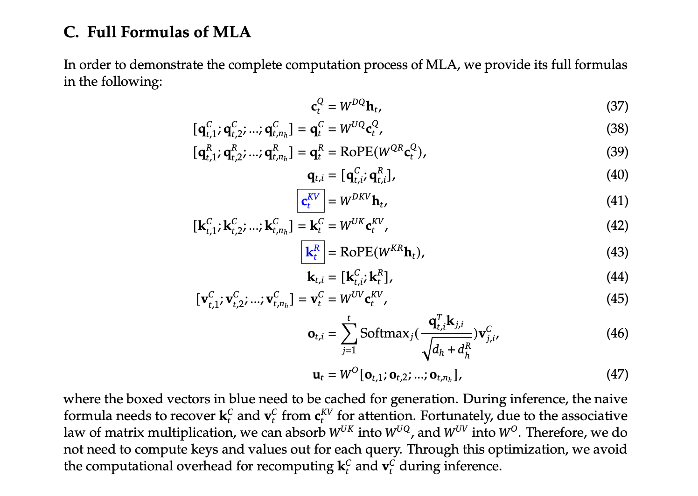
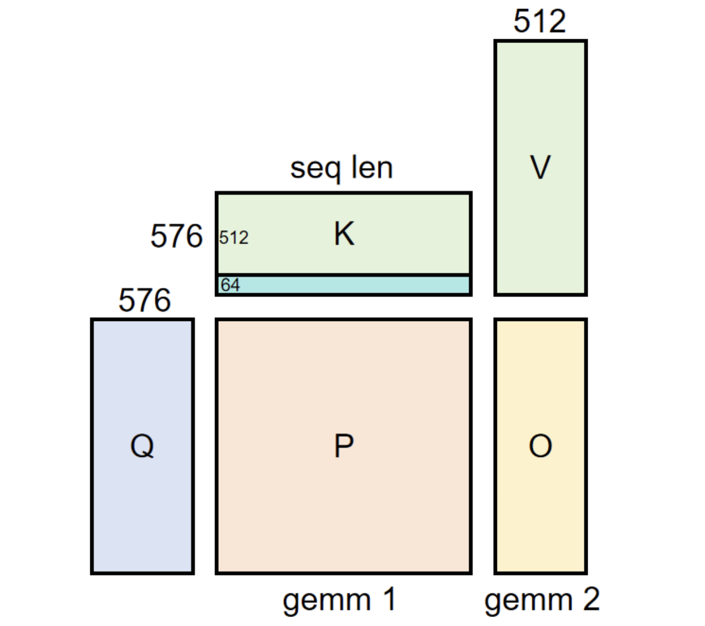
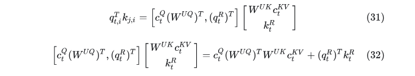

# SGLang MLA 구현 해설

## 0x0. 들어가며

지난번에는 SGLang의 DP MLA feature [SGLang DP MLA feature 해설](https://mp.weixin.qq.com/s/X2uA507VbQVCv3JIQ8EtPA)을 다뤘다. 여기서 핵심 idea를 간단히 되짚어 보자. MLA에서 DP 방식을 사용하는 이유는 MLA가 KV Cache를 저장할 때 token 하나의 shape이 `(1, 1, kv_lora_rank+qk_rope_head_dim)`이고, 일반 MHA의 `(1, kv_head_num, head_dim)`이 아니기 때문이다. 이로 인해 예전 TP parallel 방식대로라면 각 card마다 중복 KV Cache를 유지해야 한다. 이를 피하기 위해 DP를 도입해 각 card가 자신이 가진 batch의 전체 KV Cache를 유지하게 하면, 모든 rank에서 모든 batch의 KV Cache를 복사할 필요가 없다. 물론 여기에는 또 다른 문제가 있다. DP MLA에서 load imbalance가 생기면 일부 GPU가 wait state에 들어갈 수밖에 없는데, 이 문제를 어떻게 해결할지는 나도 현재 잘 모른다.

이번 주제로 돌아오자. SGLang MLA는 DP 외에도 관련 feature가 꽤 많으므로, 여기서 SGLang MLA의 구현과 지원 feature를 다시 정리하려 한다. 9개월 전에 [large model KV Cache 절약 도구 MLA 학습 노트(추론 시 matrix absorption 분석 포함)](https://mp.weixin.qq.com/s/cBMrRUdM1IM0T1ji_ODxng) 글에서 MLA 학습 노트를 기록한 적이 있다. 그때는 DeepSeek V2가 출시된 시기였다. 그 노트에는 MLA 원리와 matrix absorption 분석 등을 기록했다. 독자는 그 노트를 선수 지식으로 보면 되고, 이 글에서는 주로 SGLang의 MLA 구현에 초점을 둔다. 오류 제보는 환영한다.

여기 code 해설도 위에서 아래로 읽는 방식을 따른다.

## 0x1. `DeepseekV2DecoderLayer` class 빠르게 보기

```python
class DeepseekV2DecoderLayer(nn.Module):
    """
    DeepseekV2 model의 decoder layer 구현.
    
    이 class는 Deepseek V2 model의 단일 Transformer decoder layer를 구현하며,
    self-attention mechanism과 feed-forward neural network를 포함한다.
    configuration에 따라 서로 다른 attention mechanism(MLA 또는 standard)과
    서로 다른 feed-forward network(MoE 또는 standard MLP)를 사용할 수 있다.
    """

    def __init__(
        self,
        config: PretrainedConfig,
        layer_id: int,
        quant_config: Optional[QuantizationConfig] = None,
        is_nextn: bool = False,
    ) -> None:
        """
        DeepseekV2 decoder layer를 initialize한다.
        
        Args:
            config: pretrained model configuration object, model structure parameter를 포함한다
            layer_id: current layer ID, MoE 사용 여부와 attention 계산의 position 정보를 결정하는 데 사용한다
            quant_config: optional quantization configuration, model quantization에 사용한다
            is_nextn: nextn model인지 여부, MoE 사용 여부에 영향을 준다
        """
        super().__init__()
        # hidden size를 저장한다
        self.hidden_size = config.hidden_size
        # RoPE(rotary position encoding) 관련 parameter를 가져오고, config에 없으면 default value를 사용한다
        rope_theta = getattr(config, "rope_theta", 10000)
        rope_scaling = getattr(config, "rope_scaling", None)
        max_position_embeddings = getattr(config, "max_position_embeddings", 8192)
        
        # data parallel attention mechanism을 활성화할지 결정한다
        # MLA(multi-query attention)가 disable되지 않았고 data parallel attention이 활성화되었을 때 True
        self.enable_dp_attention = (
            not global_server_args_dict["disable_mla"]
            and global_server_args_dict["enable_dp_attention"]
        )
        
        # data parallel attention이 활성화되면 tensor parallel 관련 정보를 가져온다
        if self.enable_dp_attention:
            self.tp_rank = get_tensor_model_parallel_rank()  # 현재 tensor parallel rank
            self.tp_size = get_tensor_model_parallel_world_size()  # tensor parallel world size
            self.tp_group = get_tp_group()  # tensor parallel communication group
            
        # MLA disable 여부에 따라 서로 다른 attention mechanism 구현을 선택한다
        if not global_server_args_dict["disable_mla"]:
            # DeepseekV2AttentionMLA를 사용한다
            self.self_attn = DeepseekV2AttentionMLA(
                config=config,
                hidden_size=self.hidden_size,
                num_heads=config.num_attention_heads,
                qk_nope_head_dim=config.qk_nope_head_dim,  # position encoding을 사용하지 않는 Q와 K의 head dimension
                qk_rope_head_dim=config.qk_rope_head_dim,  # position encoding을 사용하는 Q와 K의 head dimension
                v_head_dim=config.v_head_dim,  # V의 head dimension
                q_lora_rank=(
                    config.q_lora_rank if hasattr(config, "q_lora_rank") else None
                ),  # query compression 이후 latent vector dimension d'_c
                kv_lora_rank=config.kv_lora_rank,  # key-value compression 이후 latent vector dimension d_c
                rope_theta=rope_theta,  # RoPE theta parameter
                rope_scaling=rope_scaling,  # RoPE scaling parameter
                max_position_embeddings=max_position_embeddings,  # maximum position embedding length
                quant_config=quant_config,  # quantization configuration
                layer_id=layer_id,  # layer ID
                use_dp=self.enable_dp_attention,  # data parallel attention 사용 여부
            )
        else:
            # standard DeepseekV2Attention을 사용한다
            self.self_attn = DeepseekV2Attention(
                config=config,
                hidden_size=self.hidden_size,
                num_heads=config.num_attention_heads,
                qk_nope_head_dim=config.qk_nope_head_dim,
                qk_rope_head_dim=config.qk_rope_head_dim,
                v_head_dim=config.v_head_dim,
                q_lora_rank=(
                    config.q_lora_rank if hasattr(config, "q_lora_rank") else None
                ),
                kv_lora_rank=config.kv_lora_rank,
                rope_theta=rope_theta,
                rope_scaling=rope_scaling,
                max_position_embeddings=max_position_embeddings,
                quant_config=quant_config,
                layer_id=layer_id,
            )
            
        # MoE(mixture of experts)를 feed-forward network로 사용할지 결정한다
        # 다음 경우 MoE를 사용한다:
        # 1. nextn model이다
        # 2. config에 routed expert 수가 지정되어 있고, current layer ID가 first_k_dense_replace 이상이며,
        #    layer ID가 moe_layer_freq의 배수다
        if is_nextn or (
            config.n_routed_experts is not None
            and layer_id >= config.first_k_dense_replace
            and layer_id % config.moe_layer_freq == 0
        ):
            # MoE를 feed-forward network로 사용한다
            self.mlp = DeepseekV2MoE(config=config, quant_config=quant_config)
        else:
            # standard MLP를 feed-forward network로 사용한다
            self.mlp = DeepseekV2MLP(
                hidden_size=config.hidden_size,
                intermediate_size=config.intermediate_size,
                hidden_act=config.hidden_act,
                quant_config=quant_config,
            )
            
        # self-attention 전 input normalization에 사용할 layer normalization을 initialize한다
        self.input_layernorm = RMSNorm(config.hidden_size, eps=config.rms_norm_eps)
        # self-attention 후 output normalization에 사용할 layer normalization을 initialize한다
        self.post_attention_layernorm = RMSNorm(
            config.hidden_size, eps=config.rms_norm_eps
        )

    def forward(
        self,
        positions: torch.Tensor,
        hidden_states: torch.Tensor,
        forward_batch: ForwardBatch,
        residual: Optional[torch.Tensor],
    ) -> torch.Tensor:
        """
        decoder layer의 forward propagation function.
        
        Args:
            positions: RoPE 계산에 사용할 position encoding tensor
            hidden_states: input hidden states
            forward_batch: forward computation batch information, mode와 batch size 등을 포함한다
            residual: optional residual connection tensor, None이면 hidden_states를 residual로 사용한다
            
        Returns:
            hidden_states: updated hidden states
            residual: updated residual connection
        """
        # self-attention 부분
        # idle mode가 아닐 때만 계산을 수행한다
        if not forward_batch.forward_mode.is_idle():
            # residual이 제공되지 않으면 current hidden states를 residual로 사용하고 hidden states를 normalize한다
            if residual is None:
                residual = hidden_states
                hidden_states = self.input_layernorm(hidden_states)
            else:
                # residual이 제공되면 hidden states와 residual을 동시에 normalize한다
                hidden_states, residual = self.input_layernorm(hidden_states, residual)

            # self-attention 계산을 수행한다
            hidden_states = self.self_attn(
                positions=positions,
                hidden_states=hidden_states,
                forward_batch=forward_batch,
            )
            
            # self-attention output과 residual을 normalize한다
            hidden_states, residual = self.post_attention_layernorm(
                hidden_states, residual
            )

        # feed-forward neural network 부분
        if self.enable_dp_attention:
            # data parallel attention이 활성화되면 MLP 계산 전에 모든 process의 hidden_states를 gather해야 한다
            hidden_states, start_idx, end_idx = all_gather(
                hidden_states, forward_batch, self.tp_rank, self.tp_size, self.tp_group
            )
            # MLP 계산을 수행한다
            hidden_states = self.mlp(hidden_states)
            # current process가 담당하는 부분만 유지한다
            hidden_states = hidden_states[start_idx:end_idx]
        else:
            # standard MLP 계산
            hidden_states = self.mlp(hidden_states)

        # updated hidden states와 residual을 반환한다
        return hidden_states, residual
```

이것은 upper-level interface다. `disable_mla`를 켜면 MLA 부분은 original `DeepseekV2Attention` 구현을 사용하고, default에서는 `DeepseekV2AttentionMLA` 구현을 사용한다는 것을 알 수 있다.

## 0x2. `DeepseekV2Attention` class 빠르게 보기

```python
class DeepseekV2Attention(nn.Module):
    """
    DeepseekV2 model의 attention mechanism 구현.
    
    이 class는 Deepseek V2 model의 self-attention mechanism을 구현하며,
    tensor parallel과 rotary position encoding(RoPE)을 지원한다.
    attention mechanism에는 query(Q), key(K), value(V)의 projection과 multi-head attention 계산이 포함된다.
    """

    def __init__(
        self,
        config: PretrainedConfig,
        hidden_size: int,
        num_heads: int,
        qk_nope_head_dim: int,
        qk_rope_head_dim: int,
        v_head_dim: int,
        q_lora_rank: int,
        kv_lora_rank: int,
        rope_theta: float = 10000,
        rope_scaling: Optional[Dict[str, Any]] = None,
        max_position_embeddings: int = 8192,
        quant_config: Optional[QuantizationConfig] = None,
        layer_id=None,
    ) -> None:
        """
        DeepseekV2 attention layer를 initialize한다.
        
        Args:
            config: pretrained model configuration object
            hidden_size: hidden layer dimension
            num_heads: attention head 수
            qk_nope_head_dim: position encoding을 사용하지 않는 Q와 K의 head dimension
            qk_rope_head_dim: position encoding을 사용하는 Q와 K의 head dimension
            v_head_dim: V의 head dimension
            q_lora_rank: query compression 이후 latent vector dimension d'_c
            kv_lora_rank: key-value compression 이후 latent vector dimension d_c
            rope_theta: RoPE theta parameter, default 10000
            rope_scaling: RoPE scaling parameter, default None
            max_position_embeddings: maximum position embedding length, default 8192
            quant_config: quantization configuration, default None
            layer_id: attention 계산에 사용할 layer ID
        """
        super().__init__()
        # layer ID를 저장한다
        self.layer_id = layer_id
        # hidden size를 저장한다
        self.hidden_size = hidden_size
        # position encoding을 사용하지 않는 Q와 K의 head dimension
        self.qk_nope_head_dim = qk_nope_head_dim
        # $d_h^R$에 대응하며, rope가 적용된 queries와 key의 한 head dimension을 의미한다
        self.qk_rope_head_dim = qk_rope_head_dim
        # 각 attention head dimension은 두 부분의 합이어야 한다
        self.qk_head_dim = qk_nope_head_dim + qk_rope_head_dim
        # value의 한 attention head hidden dimension
        self.v_head_dim = v_head_dim
        # query compression 이후 latent vector dimension d'_c
        self.q_lora_rank = q_lora_rank
        # key-value compression 이후 latent vector dimension d_c
        self.kv_lora_rank = kv_lora_rank
        # 전체 attention head 수
        self.num_heads = num_heads
        # tensor parallel size를 가져온다
        tp_size = get_tensor_model_parallel_world_size()
        # attention head 수가 tensor parallel size로 나누어떨어지는지 보장한다
        assert num_heads % tp_size == 0
        # 각 parallel process의 local attention head 수를 계산한다
        self.num_local_heads = num_heads // tp_size
        # attention scaling factor를 계산한다
        self.scaling = self.qk_head_dim**-0.5
        # RoPE theta parameter를 저장한다
        self.rope_theta = rope_theta
        # maximum position embedding length를 저장한다
        self.max_position_embeddings = max_position_embeddings

        # q_lora_rank 제공 여부에 따라 서로 다른 Q projection 구현을 선택한다
        if self.q_lora_rank is not None:
            # two-stage projection 사용: hidden_size -> q_lora_rank -> final dimension
            # first-stage projection: hidden_size -> q_lora_rank, paper formula의 W^DQ에 대응
            self.q_a_proj = ReplicatedLinear(
                self.hidden_size,
                self.q_lora_rank,
                bias=False,
                quant_config=quant_config,
            )
            # first-stage projection output을 normalize한다
            self.q_a_layernorm = RMSNorm(self.q_lora_rank, eps=config.rms_norm_eps)
            # q_b_proj size는 [q_lora_rank, num_heads * q_head_dim] =
            # [q_lora_rank, num_attention_heads * (qk_nope_head_dim + qk_rope_head_dim)]
            # 위 formula의 W^UQ와 W^QR을 합친 큰 matrix에 대응하며, memory에 함께 놓였을 뿐이다
            self.q_b_proj = ColumnParallelLinear(
                q_lora_rank,
                self.num_heads * self.qk_head_dim,
                bias=False,
                quant_config=quant_config,
            )
        else:
            # direct projection: hidden_size -> num_heads * qk_head_dim
            self.q_proj = ColumnParallelLinear(
                self.hidden_size,
                self.num_heads * self.qk_head_dim,
                bias=False,
                quant_config=quant_config,
            )

        # KV first-stage projection: hidden_size -> kv_lora_rank + qk_rope_head_dim
        # Q vector와 비슷하게 KV vector도 먼저 low-dimensional compressed_kv vector(c_t^{KV})로 projection한 뒤
        # 다시 up-projection한다. 구체적인 code에는 kv_a_proj_with_mqa와 kv_b_proj 두 parameter matrix가 관련된다.
        # kv_a_proj_with_mqa size는 [hidden_size, kv_lora_rank + qk_rope_head_dim]
        self.kv_a_proj_with_mqa = ReplicatedLinear(
            self.hidden_size,
            self.kv_lora_rank + self.qk_rope_head_dim,
            bias=False,
            quant_config=quant_config,
            # FIXME: quick fix for skip quantization
            prefix=f"self_attn.kv_a_proj_with_mqa",
        )
        # KV first-stage projection output을 normalize한다
        self.kv_a_layernorm = RMSNorm(self.kv_lora_rank, eps=config.rms_norm_eps)
        # KV second-stage projection: kv_lora_rank -> num_heads * (qk_nope_head_dim + v_head_dim)
        # kv_b_proj size는 [kv_lora_rank, num_heads * (q_head_dim - qk_rope_head_dim + v_head_dim)]
        # paper formula의 W^{UK}와 W^{UV}에 대응한다.
        # W^{UK}는 non-rope 부분만 관련되므로 dimension에서 qk_rope_head_dim을 제거한다. 위의 minus가 그 의미다.
        self.kv_b_proj = ColumnParallelLinear(
            self.kv_lora_rank,
            self.num_heads * (self.qk_nope_head_dim + self.v_head_dim),
            bias=False,
            quant_config=quant_config,
        )
        # output projection: attention output을 original hidden layer dimension으로 projection한다
        self.o_proj = RowParallelLinear(
            self.num_heads * self.v_head_dim,
            self.hidden_size,
            bias=False,
            quant_config=quant_config,
        )
        # RoPE type을 "deepseek_yarn"으로 설정한다
        rope_scaling["rope_type"] = "deepseek_yarn"
        # RoPE wrapper를 initialize한다
        self.rotary_emb = get_rope_wrapper(
            qk_rope_head_dim,
            rotary_dim=qk_rope_head_dim,
            max_position=max_position_embeddings,
            base=rope_theta,
            rope_scaling=rope_scaling,
            is_neox_style=False,
            device=global_server_args_dict["device"],
        )

        # RoPE scaling parameter가 제공되면 attention scaling factor를 조정한다
        if rope_scaling:
            mscale_all_dim = rope_scaling.get("mscale_all_dim", False)
            scaling_factor = rope_scaling["factor"]
            mscale = yarn_get_mscale(scaling_factor, float(mscale_all_dim))
            self.scaling = self.scaling * mscale * mscale

        # efficient attention 계산에 사용할 RadixAttention을 initialize한다
        # TODO, support head_size 192
        self.attn = RadixAttention(
            self.num_local_heads,
            256,  # 계산 효율을 위한 fixed internal dimension
            self.scaling,
            num_kv_heads=self.num_local_heads,
            layer_id=layer_id,
        )

    def forward(
        self,
        positions: torch.Tensor,
        hidden_states: torch.Tensor,
        forward_batch: ForwardBatch,
    ) -> torch.Tensor:
        """
        attention layer의 forward propagation function.
        
        Args:
            positions: RoPE 계산에 사용할 position encoding tensor
            hidden_states: input hidden states
            forward_batch: forward computation batch information
            
        Returns:
            output: attention layer output
        """
        # query vector Q를 계산한다
        if self.q_lora_rank is not None:
            # two-stage projection으로 Q를 계산한다
            # first stage: hidden_states -> q_lora_rank
            q = self.q_a_proj(hidden_states)[0]
            # first-stage output을 normalize한다
            q = self.q_a_layernorm(q)
            # second stage: q_lora_rank -> num_heads * qk_head_dim, multi-head 형태로 reshape한다
            q = self.q_b_proj(q)[0].view(-1, self.num_local_heads, self.qk_head_dim)
        else:
            # direct projection으로 Q를 계산하고 multi-head 형태로 reshape한다
            q = self.q_proj(hidden_states)[0].view(
                -1, self.num_local_heads, self.qk_head_dim
            )
        
        # Q를 position encoding을 사용하지 않는 부분과 사용하는 부분으로 나눈다
        _, q_pe = q.split([self.qk_nope_head_dim, self.qk_rope_head_dim], dim=-1)
        
        # KV first-stage projection을 계산한다
        latent_cache = self.kv_a_proj_with_mqa(hidden_states)[0]
        # KV first-stage output과 RoPE용 부분을 분리한다
        kv_a, _ = latent_cache.split([self.kv_lora_rank, self.qk_rope_head_dim], dim=-1)
        # 이후 처리를 위해 dimension을 추가한다
        latent_cache = latent_cache.unsqueeze(1)
        # KV first-stage output을 normalize한다
        kv_a = self.kv_a_layernorm(kv_a.contiguous())
        # KV second-stage projection을 계산한다
        kv = self.kv_b_proj(kv_a)[0]
        # multi-head 형태로 reshape한다
        kv = kv.view(-1, self.num_local_heads, self.qk_nope_head_dim + self.v_head_dim)
        # K의 position encoding을 사용하지 않는 부분과 V를 분리한다
        k_nope, v = kv.split([self.qk_nope_head_dim, self.v_head_dim], dim=-1)
        # K의 position encoding 사용 부분을 가져온다
        k_pe = latent_cache[:, :, self.kv_lora_rank :]
        
        # Q와 K의 position encoding 부분에 RoPE를 적용한다
        q_pe, k_pe = self.rotary_emb(positions, q_pe, k_pe)
        # 처리된 position encoding 부분을 Q에 다시 넣는다
        q[..., self.qk_nope_head_dim :] = q_pe
        
        # position encoding을 사용하지 않는 부분과 사용하는 부분을 포함하는 complete K를 구성한다
        k = torch.empty_like(q)
        k[..., : self.qk_nope_head_dim] = k_nope
        k[..., self.qk_nope_head_dim :] = k_pe
        
        # Q, K, V를 fixed dimension 256(RadixAttention internal dimension)으로 pad하고 attention 계산에 맞는 형태로 reshape한다
        q = torch.nn.functional.pad(q, [0, 256 - self.qk_head_dim], value=0).view(
            -1, self.num_local_heads * 256
        )
        k = torch.nn.functional.pad(k, [0, 256 - self.qk_head_dim], value=0).view(
            -1, self.num_local_heads * 256
        )
        v = torch.nn.functional.pad(v, [0, 256 - self.v_head_dim], value=0).view(
            -1, self.num_local_heads * 256
        )
        
        # attention 계산을 수행한다
        attn_output = self.attn(q, k, v, forward_batch)
        
        # attention output을 reshape하고 valid V dimension 부분만 유지한다
        attn_output = attn_output.view(-1, self.num_local_heads, 256)[
            ..., : self.v_head_dim
        ].reshape(-1, self.num_local_heads * self.v_head_dim)
        
        # output projection으로 attention output을 original hidden layer dimension으로 projection한다
        output, _ = self.o_proj(attn_output)
        
        return output
```

`DeepseekV2Attention` class의 경우 DeepSeek V2/V3의 HuggingFace 제공 MLA 구현과 마찬가지로 여기서 사용하는 KV Cache는 실제로 decompressed MHA KV Cache format이지 cached Latent가 아니다. 따라서 MLA의 cache saving 효과는 구현하지 않았다.

## 0x3. `DeepseekV2AttentionMLA` 자세히 보기

여기 code는 비교적 길기 때문에, 흐름 중심으로만 설명하고 code는 가능한 적게 보여준다. 먼저 DeepSeek MLA formula screenshot을 여기에 둔다.



### 0x3.1 weight 소개

먼저 init의 각 weight를 정리해 보자. 사실 위의 `DeepseekV2Attention` weight와 거의 같지만 `self.kv_b_proj`를 split했다는 차이가 있다.

구체적으로 `DeepseekV2AttentionMLA` initialization 부분에는 다음이 포함된다.

```python
# two-stage projection 사용: hidden_size -> q_lora_rank -> final dimension
# first-stage projection: hidden_size -> q_lora_rank, paper formula의 W^DQ에 대응
self.q_a_proj = ReplicatedLinear(
    self.hidden_size,
    self.q_lora_rank,
    bias=False,
    quant_config=quant_config,
)
# q_b_proj size는 [q_lora_rank, num_heads * q_head_dim] =
# [q_lora_rank, num_attention_heads * (qk_nope_head_dim + qk_rope_head_dim)]
# 위 formula의 W^UQ와 W^QR을 합친 큰 matrix에 대응하며, memory에 함께 놓였을 뿐이다
self.q_b_proj = ColumnParallelLinear(
    q_lora_rank,
    self.num_heads * self.qk_head_dim,
    bias=False,
    quant_config=quant_config,
)
# KV first-stage projection: hidden_size -> kv_lora_rank + qk_rope_head_dim
# Q vector와 비슷하게 KV vector도 먼저 low-dimensional compressed_kv vector(c_t^{KV}=w^{DKV}h_t)로 projection한 뒤
# 다시 up-projection한다. 구체적인 code에는 kv_a_proj_with_mqa와 kv_b_proj 두 parameter matrix가 관련된다.
# kv_a_proj_with_mqa size는 [hidden_size, kv_lora_rank + qk_rope_head_dim]
self.kv_a_proj_with_mqa = ReplicatedLinear(
    self.hidden_size,
    self.kv_lora_rank + self.qk_rope_head_dim,
    bias=False,
    quant_config=quant_config,
    # FIXME: quick fix for skip quantization
    prefix=f"self_attn.kv_a_proj_with_mqa",
)
# KV second-stage projection: kv_lora_rank -> num_heads * (qk_nope_head_dim + v_head_dim)
# kv_b_proj size는 [kv_lora_rank, num_heads * (q_head_dim - qk_rope_head_dim + v_head_dim)]
# paper formula의 W^{UK}와 W^{UV}에 대응한다.
# W^{UK}는 non-rope 부분만 관련되므로 dimension에서 qk_rope_head_dim을 제거한다. 위의 minus가 그 의미다.
self.kv_b_proj = ColumnParallelLinear(
    self.kv_lora_rank,
    self.num_heads * (self.qk_nope_head_dim + self.v_head_dim),
    bias=False,
    quant_config=quant_config,
)
# output projection: attention output을 original hidden layer dimension으로 projection한다
self.o_proj = RowParallelLinear(
    self.num_heads * self.v_head_dim,
    self.hidden_size,
    bias=False,
    quant_config=quant_config,
)
```

이어서 initialization 과정에는 `self.w_kc`, `self.w_vc`도 있다. 이 둘은 각각 `self.kv_b_proj`를 split한 뒤의 $W^{UK}$와 $W^{UV}$에 대응한다. split code는 다음과 같다.

```python
w = self_attn.kv_b_proj.weight
w_kc, w_vc = w.unflatten(
                    0, (-1, self_attn.qk_nope_head_dim + self_attn.v_head_dim)
                ).split([self_attn.qk_nope_head_dim, self_attn.v_head_dim], dim=1)
self_attn.w_kc = w_kc.transpose(1, 2).contiguous().transpose(1, 2)
self_attn.w_vc = w_vc.contiguous().transpose(1, 2)
```

여기의 shape 변화를 분석해 보자. 먼저 DeepSeek R1의 관련 hyperparameter를 확인한다. `self.qk_nope_head_dim = 128`, `self.v_head_dim = 128`, `self.kv_lora_rank = 512`, `self.num_heads = 128`이며, w의 shape은 `[32768, 512]`, 즉 `[128*(128+128), 512]`다.

`w.unflatten(0, (-1, self_attn.qk_nope_head_dim + self_attn.v_head_dim))` 단계는 w의 첫 dimension 32768을 `[-1, 256]` 두 dimension으로 다시 구성한다. 여기서 256 = 128 + 128이다. `-1`은 자동으로 `32768 / 256 = 128`로 계산되므로 unflatten 뒤 shape은 `[128, 256, 512]`다. `.split([self_attn.qk_nope_head_dim, self_attn.v_head_dim], dim=1)` 단계는 두 번째 dimension(index 1)을 따라 tensor를 두 부분으로 나눈다. `w_kc`의 shape은 `[128, 128, 512]`, `w_vc`의 shape은 `[128, 128, 512]`다.

`self_attn.w_kc`의 최종 shape은 `[128, 128, 512]`, 즉 `[num_heads, qk_nope_head_dim, kv_lora_rank]`다. `self_attn.w_vc`의 최종 shape은 `[128, 512, 128]`, 즉 `[num_heads, kv_lora_rank, v_head_dim]`이다.

### 0x3.2 `forward` control logic

`DeepseekV2AttentionMLA` class의 forward 구현은 normal implementation(matrix absorption 없는 version), matrix absorption version, 그리고 ROCM을 위한 absorption 및 mla+rope fused version으로 나뉜다. 어떤 forward 구현을 사용할지는 `forward`에서 제어한다. code는 짧고, 해설은 다음과 같다.

```python
def forward(
        self,
        positions: torch.Tensor,
        hidden_states: torch.Tensor,
        forward_batch: ForwardBatch,
    ) -> torch.Tensor:
        """
        DeepseekV2 multi-layer attention(MLA)의 forward propagation function.
        
        서로 다른 execution mode(prefill/extend/decode)에 따라 서로 다른 computation path를 선택한다:
        1. forward_normal: weight absorption을 사용하지 않는 standard attention calculation
        2. forward_absorb: weight absorption optimization을 사용하는 attention calculation
        3. forward_absorb_fused_mla_rope: ROCm platform을 위한 fused MLA+RoPE optimized calculation
        
        Args:
            positions: RoPE 계산에 사용할 position encoding tensor
            hidden_states: input hidden states
            forward_batch: forward computation batch information, computation mode와 cache information을 포함한다
            
        Returns:
            torch.Tensor: attention layer output
        """

        def no_absorb() -> bool:
            """
            weight absorption optimization 대신 standard attention calculation을 사용할지 판단한다.
            
            execution environment와 mode에 따라 결정한다:
            - flashinfer MLA가 활성화된 경우: radix cache가 disable되고 extend mode일 때만 weight absorption을 사용하지 않는다
            - Triton을 사용하는 경우: prefill 단계에서는 standard calculation, extend/decode 단계에서는 weight absorption을 사용한다
              단 target verification, draft extension, prefix length가 있는 경우 같은 special case는 예외다
              
            Returns:
                bool: True면 standard calculation 사용, False면 weight absorption optimization 사용
            """
            if global_server_args_dict["enable_flashinfer_mla"]:
                # Flashinfer MLA mode: radix cache가 disable되고 extend mode일 때만 weight absorption을 사용하지 않는다
                return (
                    global_server_args_dict["disable_radix_cache"]
                    and forward_batch.forward_mode.is_extend()
                )
            else:
                # Triton mode: prefill 단계에서는 standard calculation, extend/decode 단계에서는 weight absorption을 사용한다
                # 다만 다음 special case는 예외다:
                # 1. target verification mode(target_verify)
                # 2. draft extension mode(draft_extend)
                # 3. prefix length가 있는 경우
                return (
                    forward_batch.forward_mode.is_extend()
                    and not forward_batch.forward_mode.is_target_verify()
                    and not forward_batch.forward_mode.is_draft_extend()
                    and forward_batch.extend_prefix_lens.sum() == 0
                )

        # no_absorb() 결과에 따라 서로 다른 computation path를 선택한다
        if no_absorb():
            # standard attention calculation 사용(weight absorption optimization 없음)
            return self.forward_normal(positions, hidden_states, forward_batch)
        else:
            # weight absorption optimization computation path 사용
            if is_hip_:
                # AMD GPU(ROCm) platform을 위한 special optimization
                if (
                    os.getenv("SGLANG_ROCM_FUSED_DECODE_MLA") == "1"
                    and forward_batch.forward_mode.is_decode()
                ):
                    # fused MLA+RoPE optimized calculation 사용(ROCm platform decode mode에서만)
                    return self.forward_absorb_fused_mla_rope(
                        positions, hidden_states, forward_batch
                    )
                else:
                    # standard weight absorption optimization 사용
                    return self.forward_absorb(positions, hidden_states, forward_batch)
            else:
                # non-ROCm platform(CUDA 등)은 standard weight absorption optimization 사용
                return self.forward_absorb(positions, hidden_states, forward_batch)
```

### 0x3.3 `forward_normal` 구현

`forward_normal` 구현은 위의 `DeepseekV2Attention` class 구현과 같다. 다만 이 구현에서는 현재 cache하는 것이 Latent이지 decompressed MHA KV Cache format이 아니므로 GPU memory 절약 목적을 달성할 수 있다.

또 하나 주의할 점은 `forward_normal` 구현에서 MHA를 실행하기 전에 q, k, v의 `head_dim`을 다시 256으로 padding하지 않는다는 것이다. 이는 아마 historical issue일 텐데, 이 함수를 구현할 때 FlashInfer가 이 headdim을 지원했기 때문으로 보인다. 여기의 `self.attn_mha` definition과 비교해 보자.

```python
self.attn_mha = RadixAttention(
            self.num_local_heads,
            self.qk_nope_head_dim + self.qk_rope_head_dim,
            self.scaling,
            num_kv_heads=self.num_local_heads,
            layer_id=layer_id,
            v_head_dim=self.v_head_dim,
        )
```

그리고 이전 구현은 다음과 같다.

```python
# efficient attention 계산에 사용할 RadixAttention을 initialize한다
# TODO, support head_size 192
self.attn = RadixAttention(
    self.num_local_heads,
    256, 
    self.scaling,
    num_kv_heads=self.num_local_heads,
    layer_id=layer_id,
)
```

TODO가 해결된 것을 볼 수 있다.

### 0x3.4 `forward_absorb` 구현

이 부분 code는 길지 않으므로 DeepSeek R1의 hyperparameter를 직접 대입해 읽어 보자. TP=8, `self.num_local_heads=128/8=16`, `self.kv_lora_rank=512`, `self.qk_rope_head_dim=64`라고 가정한다.

#### 000

```python
def forward_absorb(
        self,
        positions: torch.Tensor,
        hidden_states: torch.Tensor,
        forward_batch: ForwardBatch,
    ) -> torch.Tensor:
        q_len = hidden_states.shape[0] # sequence length, token 수
        # attention input Q, shape: ([q_len, 16, 576]),
        # 여기서 576은 kv_lora_rank(512) + qk_rope_head_dim(64)를 포함한다.
        # 여기서는 uninitialized Tensor를 만들고, 이후 안을 채운다.
        q_input = hidden_states.new_empty(
            q_len, self.num_local_heads, self.kv_lora_rank + self.qk_rope_head_dim
        )
```

아래의 `q_lora_rank`는 query compression 이후 latent vector dimension `d'_c`에 대응하며, DeepSeek R1에서는 `q_lora_rank=1536`이다.

또 hidden_states의 shape은 `[bs, q_len, hidden_size]`이고, `self.qk_head_dim = qk_nope_head_dim + qk_rope_head_dim = 128 + 64 = 192`라는 점에 주의한다.

```python
# self.q_a_proj = ReplicatedLinear(
#    self.hidden_size,
#    self.q_lora_rank,
#    bias=False,
#    quant_config=quant_config,
# )
# self.q_b_proj = ColumnParallelLinear(
#    q_lora_rank,
#    self.num_heads * self.qk_head_dim,
#    bias=False,
#    quant_config=quant_config,
# )

if self.q_lora_rank is not None:
    q = self.q_a_proj(hidden_states)[0]
    q = self.q_a_layernorm(q)
    q = self.q_b_proj(q)[0].view(-1, self.num_local_heads, self.qk_head_dim)
else:
    q = self.q_proj(hidden_states)[0].view(
        -1, self.num_local_heads, self.qk_head_dim
    )
```

- `q = self.q_a_proj(hidden_states)[0]`의 경우, input shape은 `[bs, q_len, hidden_size]`다. `self.q_a_proj`는 ReplicatedLinear layer로 hidden_size dimension을 q_lora_rank dimension으로 mapping한다. output shape은 `[bs, q_len, q_lora_rank] = [bs, q_len, 1536]`이다.
- `q = self.q_b_proj(q)[0].view(-1, self.num_local_heads, self.qk_head_dim)`의 경우, input shape은 `[bs, q_len, 1536]`이다. `self.q_b_proj`는 ColumnParallelLinear layer로 q_lora_rank dimension을 `num_heads * qk_head_dim` dimension으로 mapping한다. intermediate output shape은 `[bs, q_len, num_heads * qk_head_dim] = [bs, q_len, 128 * 192]`이다. 다만 TP=8이므로 각 GPU는 128/8=16개 head만 담당한다. 따라서 실제 output shape은 `[bs, q_len, 16 * 192]`이고, view operation으로 `[-1, self.num_local_heads, self.qk_head_dim] = [bs * q_len, 16, 192]`로 reshape된다.

이후 분석은 bs=1이라고 가정한다. 아래 code 분석을 편하게 하기 위해 paper의 MLA formula를 다시 붙인다.


#### 001

```python
q_nope, q_pe = q.split([self.qk_nope_head_dim, self.qk_rope_head_dim], dim=-1)
```

q는 q_nope와 q_pe로 나뉘며, shape은 각각 `[q_len, 16, 128]`, `[q_len, 16, 64]`다.

q_nope는 paper의 formula 38로 얻은 $q_t^C$이고, q_pe는 이후 ROPE를 적용할 부분이다. 이는 paper formula 39의 RoPE 괄호 안 부분이다.

#### 002

```python
if self.w_kc.dtype == torch.float8_e4m3fnuz:
    # TODO(kernel): add bmm_fp8 for torch.float8_e4m3fnuz
    q_nope_out = torch.bmm(
        q_nope.to(torch.bfloat16).transpose(0, 1),
        self.w_kc.to(torch.bfloat16) * self.w_scale,
    )
elif self.w_kc.dtype == torch.float8_e4m3fn:
    q_nope_val, q_nope_scale = input_to_float8(
        q_nope.transpose(0, 1), torch.float8_e4m3fn
    )
    q_nope_out = bmm_fp8(
        q_nope_val, self.w_kc, q_nope_scale, self.w_scale, torch.bfloat16
    )
else:
    q_nope_out = torch.bmm(q_nope.transpose(0, 1), self.w_kc)
q_input[..., : self.kv_lora_rank] = q_nope_out.transpose(0, 1)
```

fp8 branch를 무시하자. 앞의 분석에서 `self.w_kc`, `self.w_vc`는 각각 `self.kv_b_proj`를 split한 뒤의 $W^{UK}$와 $W^{UV}$에 대응한다는 것을 알았다. `q_nope_out = torch.bmm(q_nope.transpose(0, 1), self.w_kc)` 이 줄은 paper의 formula 42다. 이 code에서 q_nope와 `self.w_kc`가 곱해져 `q_nope_out`을 얻고, shape은 `[q_len, 16, 128]`에서 `[q_len, 16, 512]`로 바뀐다.

그 다음 `q_input[..., : self.kv_lora_rank] = q_nope_out.transpose(0, 1)`가 `q_nope_out`을 `q_input`의 앞 512개 channel에 채운다.

#### 003 W^{UK} absorption

```python
latent_cache = self.kv_a_proj_with_mqa(hidden_states)[0]
v_input = latent_cache[..., : self.kv_lora_rank]
v_input = self.kv_a_layernorm(v_input.contiguous()).unsqueeze(1)
k_input = latent_cache.unsqueeze(1)
k_input[..., : self.kv_lora_rank] = v_input
k_pe = k_input[..., self.kv_lora_rank :]

q_pe, k_pe = self.rotary_emb(positions, q_pe, k_pe)
q_input[..., self.kv_lora_rank :] = q_pe
k_input[..., self.kv_lora_rank :] = k_pe

attn_output = self.attn_mqa(q_input, k_input, v_input, forward_batch)
attn_output = attn_output.view(-1, self.num_local_heads, self.kv_lora_rank)
```

`self.kv_a_proj_with_mqa`는 formula의 $W^{DKV}$와 $W^{KR}$ 두 weight를 포함한다. `latent_cache = self.kv_a_proj_with_mqa(hidden_states)[0]`는 hidden_states를 projection해 Latent를 얻는다. shape은 `[q_len, 576]`이며, 앞 512개 dim은 $c_t^{KV}$에 대응한다. 이것은 formula 41에 대응한다. 뒤 64개 dim은 formula 43의 RoPE 괄호 안 부분, 즉 아직 RoPE가 적용되지 않은 $W^{KR}h_t$에 대응한다.

이어서 `v_input = latent_cache[..., : self.kv_lora_rank]`가 $c_t^{KV}$를 꺼낸다. `k_input[..., : self.kv_lora_rank] = v_input`는 k와 v가 같은 latent를 공유한다는 뜻이다. 다음 `k_pe = k_input[..., self.kv_lora_rank :]`로 k_pe를 얻어 RoPE를 준비하고, 마지막으로 RoPE와 Attention을 수행한다.

여기의 shape 변화를 보자. `q_input`의 shape은 `[q_len, 16, 576]`이다. `k_input`의 shape은 `[q_len, 1, 576]`, `v_input`의 shape은 `[q_len, 1, 512]`다. `attn_output`의 shape은 `[q_len, 16, 512]`다.

또 다음을 보자.

```python
self.attn_mqa = RadixAttention(
      self.num_local_heads,
      self.kv_lora_rank + self.qk_rope_head_dim,
      self.scaling,
      num_kv_heads=1,
      layer_id=layer_id,
      v_head_dim=self.kv_lora_rank,
  )
```

따라서 이 attention 계산은 Multi Query Attention으로 볼 수 있다. Query head는 16개, QK head_dim은 576, V head_dim은 512다. QK head_dim에는 RoPE를 하지 않는 512 dimension과 RoPE를 하는 64 dimension이 포함된다.

사실 이 MQA가 바로 DeepSeek가 open-source week에 공개한 FlashMLA다. 아래 그림과 같다.



또 주의할 점은 여기서 $W^{UK}$ matrix absorption이 init에서 미리 완료된 것이 아니라 forward 때 matrix operation associativity로 직접 계산된다는 것이다. paper formula 31과 32로 설명할 수 있다.



만약 `forward_normal` 같은 계산 방식을 유지한다면, 즉 Latent를 먼저 decompress한 뒤 계산한다면 Attn 계산은 실제 Multi Head Attention이 되어 compute량이 증가한다.

#### 004 W^{UV} absorption

```python
if self.w_vc.dtype == torch.float8_e4m3fnuz:
  # TODO(kernel): add bmm_fp8 for torch.float8_e4m3fnuz
  attn_bmm_output = torch.bmm(
      attn_output.to(torch.bfloat16).transpose(0, 1),
      self.w_vc.to(torch.bfloat16) * self.w_scale,
  )
elif self.w_vc.dtype == torch.float8_e4m3fn:
  attn_output_val, attn_output_scale = input_to_float8(
      attn_output.transpose(0, 1), torch.float8_e4m3fn
  )
  attn_bmm_output = bmm_fp8(
      attn_output_val,
      self.w_vc,
      attn_output_scale,
      self.w_scale,
      torch.bfloat16,
  )
else:
  attn_bmm_output = torch.bmm(attn_output.transpose(0, 1), self.w_vc)
attn_output = attn_bmm_output.transpose(0, 1).flatten(1, 2)
output, _ = self.o_proj(attn_output)

return output
```

fp8 branch를 무시하자. 앞의 분석에서 `self.w_kc`, `self.w_vc`는 각각 `self.kv_b_proj`를 split한 뒤의 $W^{UK}$와 $W^{UV}$에 대응한다는 것을 알았다. 마찬가지로 $W^{UV}$도 $W_O$ 안으로 absorb할 수 있다. 이는 `attn_bmm_output = torch.bmm(attn_output.transpose(0, 1), self.w_vc)`와 `output, _ = self.o_proj(attn_output)` 두 줄로 수행되며, init에서 미리 하지 않는다. 앞서 [large model KV Cache 절약 도구 MLA 학습 노트(추론 시 matrix absorption 분석 포함)](https://mp.weixin.qq.com/s/cBMrRUdM1IM0T1ji_ODxng) 에서 언급한 결론에 따르면, init 때 matrix absorption preprocessing을 하지 않는 쪽이 오히려 더 빠르다. SGLang MLA도 이 결론을 따랐다.

## 0x4. 결론

이 글은 SGLang MLA code 구현을 자세히 분석하고, matrix absorption과 FlashMLA가 적용되어야 하는 위치를 지적했다. 주로 관련 로직을 스스로 정리하기 위한 노트다.

## 0x5. 참고 자료

- https://zhuanlan.zhihu.com/p/714686419
- https://zhuanlan.zhihu.com/p/19849661536
- https://arxiv.org/abs/2405.04434

