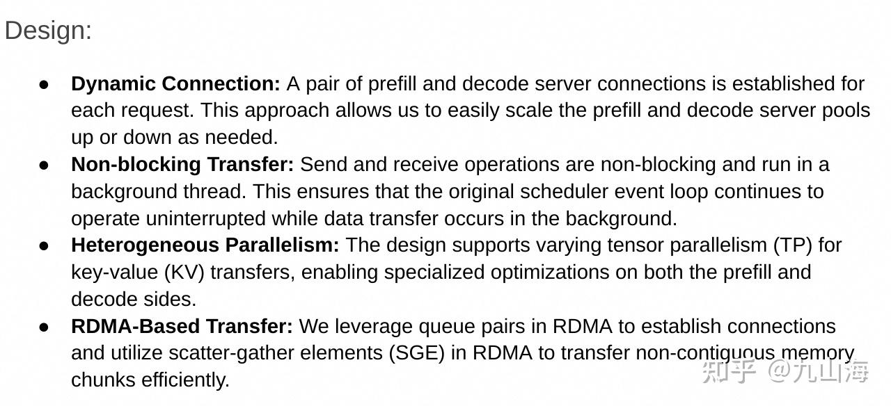
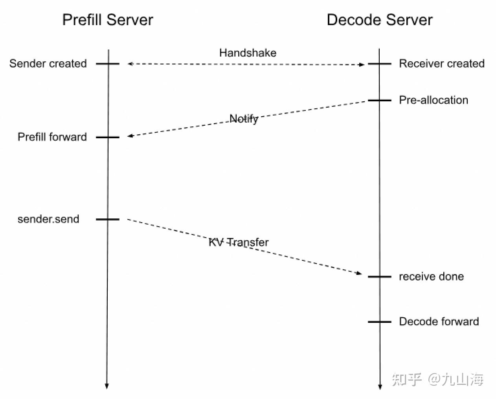
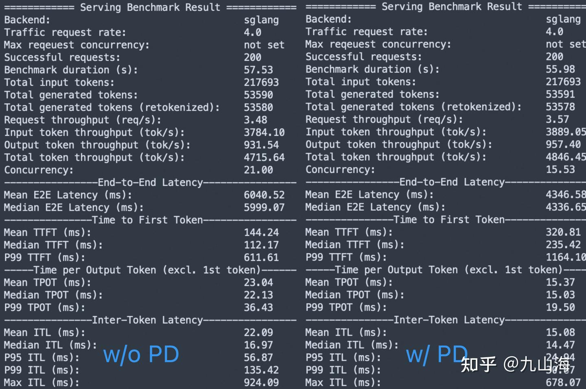

# SGLang PD 분리와 Mooncake

> 원문: https://zhuanlan.zhihu.com/p/1912106909617624371

PD 분리는 매우 복잡한 분산 시스템 방안이고 고려할 것이 많다. 먼저 PD 분리의 목적을 되짚어 보자.

- TTFT와 TPOT는 원리상 전혀 다른 두 가지 성능 지표이면서 둘 다 매우 중요하다. 기존 chunked prefill 방식으로는 이 두 목표를 동시에 잘 최적화하기 어렵다.
- prefill과 decode는 하드웨어 요구사항이 크게 다르다. prefill은 계산 능력이 강해야 하고 decode는 메모리가 커야 한다. 나누어서 최적화하면 서로 다른 하드웨어, 예를 들어 서로 다른 GPU 모델을 더 잘 활용할 수 있다.
- PD 분리는 KV cache 관리를 분리해 내므로, 프레임워크 자체가 복잡한 KV cache 다층 하드웨어 관리를 지원할 필요가 없어진다.

PD 분리가 가장 먼저 가져오는 것은 KV cache의 전송 문제다. GPU RDMA 방식으로 통신량을 효과적으로 줄일 수 있지만, P가 수 GB의 KV cache를 한 번에 전송하면 네트워크에 큰 부담이 되고 계산과 통신을 잘 overlap하지도 못한다. 따라서 layerwise KV transfer가 PD 분리의 기본 요구사항이다.

지후(知乎)에서 PD 분리에 관한 여러 고수의 글을 참고했는데, 초보 입장에서는 SGLang으로 PD 분리 구현을 이해하는 편이 더 편하다고 느꼈다. 그래서 이 글은 SGLang v0.4.6을 기준으로 PD 분리에 대한 연구와 실습을 해 본다.

SGLang의 설계 목표를 참고하자.



- 확장 가능한 prefill 서버와 decode 서버의 쌍 연결
- non-blocking KV transfer
- 동적 TP 병렬
- RDMA 지원

SGLang의 PD 분리는 Producer-Consumer 패턴이며, 여러 queue를 사용해 non-blocking KV transfer를 구현한다. 자세한 내용은 [@kaiyuan](https://www.zhihu.com/people/da4e6b50eb50d6f120b604f6cf15b33e) 님의 글 [kaiyuan: vLLM PD 분리 방안 간단 분석](https://zhuanlan.zhihu.com/p/1889243870430201414)을 참고하면 된다.

SGLang은 두 가지 KV connector 백엔드, 즉 Mooncake와 NIXL을 구현했다. 각 connector에는 네 가지 역할이 있다.

|  |  |
|----|----|
| KVBootstrap | prefill에서만 사용한다. prefill과 decode의 상호작용에 쓰이는 정보를 기록한다. 종류는 여러 가지일 수 있으며, decode가 이 정보를 요청해 prefill과 연결한다 |
| KVManager | 메모리와 Bootstrap server 초기화, 그리고 KV cache 전송을 담당한다. prefill과 decode 모두에 있으며, KV connector의 관리자 역할을 한다 |
| KVSender | prefill 전용이며, KV cache를 보낸다 |
| KVReceiver | decode 전용이며, prefill과 handshake하고 bootstrap server의 상호작용 정보를 얻어 KV cache를 받는다 |

### Prefill Node와 Decode Node는 어떻게 연결을 맺는가

TokenizerManager를 생성할 때 prefill은 KVBootstrap을 초기화한다.

```python
# srt/managers/tokenizer_manager.py
class TokenizerManager:
    """TokenizerManager is a process that tokenizes the text."""

    def __init__(
        self,
        server_args: ServerArgs,
        port_args: PortArgs,
    ):
        ...
        # for disaggregtion, start kv boostrap server on prefill
        if self.disaggregation_mode == DisaggregationMode.PREFILL:
            # only start bootstrap server on prefill tm
            kv_bootstrap_server_class = get_kv_class(
                self.transfer_backend, KVClassType.BOOTSTRAP_SERVER
            )
            self.bootstrap_server = kv_bootstrap_server_class(
                self.server_args.disaggregation_bootstrap_port
            )
```

KVBootstrap은 server를 하나 띄우고 두 개의 interface를 제공한다. /metadata는 meta 정보를 저장하는 역할을 하고, /route는 prefill의 ip와 port 등의 정보를 전달하는 역할을 한다.

prefill은 BootstrapQueue에서 KVManager를 초기화한다. Manager는 socket을 하나 띄워 decode에서 오는 전송 요청을 listen하고, 자신의 정보를 /route를 통해 bootstrap server에 등록한다. decode는 PreallocQueue에서 KVManager를 초기화한다.



위에서 SGLang이 제시한 prefill과 decode의 전체 전송 과정을 Mooncake KV connector의 관점에서 이해해 보자.

1.  prefill과 decode는 각각 KV manager 객체를 생성하고, 둘 다 manager 안에서 tcp server를 띄운다. prefill은 추가로 자신의 port를 bootstrap server에 넘겨 저장시킨다. **이 과정이 바로 "handshake"다.** **prefill은 KV cache를 비동기로 전송하기 위해 transfer 스레드를 하나 더 띄운다.**
2.  manager 안에서 prefill과 decode는 동시에 각자 스레드를 하나씩 띄운다. prefill은 decode에서 오는 pre-allocated 신호를 listen해 몇 가지 정보를 얻은 뒤 자신의 상태를 WaitingForInput으로 설정한다. decode는 prefill에서 오는 두 가지 정보, 즉 room id와 status를 listen한다.
3.  scheduler에서는 각 req마다 무작위 room id를 생성해 KV manager 안에서 prefill과 decode 한 쌍을 유일하게 식별한다. prefill과 decode는 각각 KV sender와 KV receiver를 만들어 req에 bind하고, KV receiver는 bootstrap server에서 prefill의 ip와 port를 얻는다. DP group과 TP group은 모두 일대일로 대응된다.
4.  그 다음 prefill과 decode 각자의 event_loop에서는
    1.  prefill의 경우 BootstrapQueue의 pop_bootstrapped를 호출해 각 req의 status를 가져온다. status가 WaitingForInput인 req만 KV sender를 초기화하고, req를 WaitingQueue로 옮긴다.
    2.  decode의 경우 먼저 PreallocQueue의 pop_preallocated를 호출해 KV cache를 미리 할당하고 KV receiver를 초기화한다. 초기화 과정은 prefill의 listen 스레드로 다섯 가지 정보를 보내는 것이다. room id, decode의 ip와 port, Mooncake engine의 session id, **현재 req에 할당된 KV cache 인덱스**, first token의 출력 위치(ReqToMetadataIdxAllocator가 생성)다. prefill의 manager는 이를 받은 뒤 정보를 기록하고 자신의 상태를 WaitingForInput으로 변경한다. **이 단계가 바로 "notify"다.** 그 다음 req를 TransferQueue로 옮긴다.
5.  앞에서 KV manager 안에서 decode도 prefill을 listen한다고 했는데, 이 listen은 사실 prefill이 KV transfer를 끝내기를 기다리는 것이다. **KV transfer는 언제 끝나는가?** SGLang은 chunked prefill을 고려한다. chunk를 한 번 실행할 때마다 prefill의 scheduler가 send_kv_chunk를 호출하고, 그 내부에서 KV sender를 호출해 KV cache의 가상 주소와 Mooncake에서의 물리 주소를 decode에 전달한다. 구체적인 전송 방식은 **멀티스레드로 모든 layer의 KV cache를 한 번에 보내는 것**이다. 마지막 chunk에 이르면 sender는 보조 데이터를 추가로 보내고, room id와 status(상태는 Success)를 decode의 listen 스레드로 보낸다. 이 단계가 바로 **"KV Transfer"**다.

여기까지가 SGLang의 **대략적인** prefill과 decode 상호작용 과정이며, 전체 구현은 매우 복잡하다. SGLang의 PD 분리 구현은 단순한 방안이다. decode가 prefill 완료를 기다리고, prefill 내부에서 prefix caching을 한다.

다음으로는 **Mooncake 관점에서 본 KV cache의 관리와 전송**을 중점적으로 살펴본다. 이것들은 프레임워크와 독립적으로 이해할 수 있고, SGLang을 통해 Mooncake의 설계도 더 잘 알 수 있다.

초기화 단계에서 prefill과 decode는 모두 KVManager에서 Mooncake engine을 하나 초기화해야 한다.

```python
class MooncakeTransferEngine:

    def __init__(self, hostname: str, gpu_id: int, ib_device: Optional[str] = None):
        try:
            from mooncake.engine import TransferEngine
        except ImportError as e:
            raise ImportError(
                "Please install mooncake by following the instructions at "
                "https://github.com/kvcache-ai/Mooncake/blob/main/doc/en/build.md "  # noqa: E501
                "to run SGLang with MooncakeTransferEngine."
            ) from e

        self.engine = TransferEngine()
        self.hostname = hostname
        self.gpu_id = gpu_id
        # 외부에서 infiniband 장치를 지정할 수 있고, 지정하지 않으면 mooncake가 자동으로 탐지한다
        self.ib_device = ib_device

        self.initialize(
            hostname=self.hostname,
            device_name=self.ib_device,
        )
        self.session_id = f"{self.hostname}:{self.engine.get_rpc_port()}"

    def initialize(
        self,
        hostname: str,
        device_name: Optional[str],
    ) -> None:
        """Initialize the mooncake instance."""
        # 네 개의 parameter는 각각 다음과 같다
        # ip
        # metadata server 주소. etcd일 수 있으며, P2PHANDSHAKE는 socket으로만 handshake하고 metadata storage를 만들지 않는다는 뜻이다
        # Transport의 데이터 전송 방식. rdma/tcp/nvmeof
        # infiniband 장치 이름
        ret_value = self.engine.initialize(
            hostname,
            "P2PHANDSHAKE",
            "rdma",
            device_name if device_name is not None else "",
        )
        if ret_value != 0:
            logger.error("Mooncake Transfer Engine initialization failed.")
            raise RuntimeError("Mooncake Transfer Engine initialization failed.")
```

infiniband device는 NVIDIA의 infiniband 네트워크 카드를 말한다. [NVIDIA InfiniBand 네트워크 카드](https://www.nvidia.cn/networking/infiniband-adapters/)를 참고하라. GPUDirect RDMA를 지원한다.

Mooncake transfer engine의 초기화는 다음과 같다. 첫째로 TransferMeta를 생성한다. Mooncake의 모든 메타데이터를 관리하며 두 개의 plugin을 포함한다.

- rpc 기반 handshake socket.
- metadata storage 관리 plugin. 메타데이터 저장소로 etcd, redis 또는 http를 쓸 수 있고, 로컬에서는 보통 redis면 충분하다.

둘째로 MultiTransport를 생성한다. Mooncake의 데이터 전송 기능을 구현하며 tcp, rdma, nvmeof를 지원한다.

SGLang의 소스 코드와 함께 보면, KVManager를 초기화할 때 SGLang은 이미 할당된 KV cache 주소 정보와 metadata 주소 정보를 Transfer Engine에 등록한다. 이 단계는 prefill과 decode의 로직이 동일하다.

```python
class PrefillBootstrapQueue:

    def _init_kv_manager(self) -> BaseKVManager:
        kv_args = KVArgs()
        # tp의 rank를 기록한다. tp group 안에서 prefill과 decode는 일대일로 대응된다
        kv_args.engine_rank = self.tp_rank
        # 형식은 N개 layer의 K 주소 + N개 layer의 V 주소다
        # KV_item에는 K와 V page 하나의 바이트 수가 들어 있다
        kv_data_ptrs, kv_data_lens, kv_item_lens = (
            self.token_to_kv_pool.get_contiguous_buf_infos()
        )

        kv_args.kv_data_ptrs = kv_data_ptrs
        kv_args.kv_data_lens = kv_data_lens
        kv_args.kv_item_lens = kv_item_lens

        # Define req -> input ids buffer
        kv_args.aux_data_ptrs = [
            metadata_buffer.data_ptr() for metadata_buffer in self.metadata_buffers
        ]
        kv_args.aux_data_lens = [
            metadata_buffer.nbytes for metadata_buffer in self.metadata_buffers
        ]
        kv_args.aux_item_lens = [
            metadata_buffer[0].nbytes for metadata_buffer in self.metadata_buffers
        ]
        kv_args.ib_device = self.scheduler.server_args.disaggregation_ib_device
        kv_args.gpu_id = self.scheduler.gpu_id
        kv_manager_class = get_kv_class(self.transfer_backend, KVClassType.MANAGER)
        kv_manager = kv_manager_class(
            kv_args, DisaggregationMode.PREFILL, self.scheduler.server_args
        )
        return kv_manager

class MooncakeKVManager(BaseKVManager):

    def register_buffer_to_engine(self):
        for kv_data_ptr, kv_data_len in zip(
            self.kv_args.kv_data_ptrs, self.kv_args.kv_data_lens
        ):
            # layer 단위로 memory를 등록한다. 먼저 모든 K를 등록하고 그 다음 모든 V를 등록한다
            self.engine.register(kv_data_ptr, kv_data_len)

        for aux_data_ptr, aux_data_len in zip(
            self.kv_args.aux_data_ptrs, self.kv_args.aux_data_lens
        ):
            self.engine.register(aux_data_ptr, aux_data_len)
```

Transfer Engine은 Transport의 등록 메서드를 호출한다. RDMA를 사용하면 KV cache의 물리 주소와 infiniband 장치를 매핑하는 것이다. 앞에서 KV sender가 각 layer의 KV cache를 병렬로 보낸다고 했는데, prefill이 chunk 하나를 forward한 뒤 KV sender의 send 메서드를 호출해 kv_indices를 prefill의 transfer thread로 보낸다. kv_indices의 정의는 다음과 같다.

```python
kv_indices = (
    self.req_to_token_pool.req_to_token[req.req_pool_idx, start_idx:end_idx]
    .cpu()
    .numpy()
)
```

얻어지는 것은 가상 주소, 즉 물리 주소 위의 인덱스다. transfer thread는 send_kvcache를 호출하며 세 가지 정보가 필요하다. prefill에서의 kv chunk 가상 주소, **decode 쪽의** 전역 KV 물리 주소, **decode 쪽의** KV cache 물리 주소 위 인덱스다.

```python
ret = self.send_kvcache(
    req.mooncake_session_id,
    kv_chunk.prefill_kv_indices,
    self.decode_kv_args_table[req.mooncake_session_id].dst_kv_ptrs,
    chunked_dst_kv_indice,
)
```

send_kvcache는 prefill_kv_indices와 dst_kv_indices를 연속 메모리 단위로 묶고, 연속된 메모리 주소를 한 번에 보낸다.

예를 들어 prefill_kv_indices=\[1,2,3,5,6\], dst_kv_indices=\[2,3,4,7,8\]이면 전송은 다음과 같다.

```python
transfer_sync(src=[1,2,3], dst=[2,3,4])和transfer_sync(src=[5,6], dst=[7,8])
```

chunk prefill이 한 번 끝날 때마다 모든 layer의 KV cache를 한 번에 보낸다. 앞에서 prefill의 마지막 chunk가 끝난 뒤 transfer engine이 보조 정보를 추가로 보낸다고 했는데, 이 보조 정보가 바로 prefill의 첫 번째 token id다. decode는 이를 받은 뒤 decode batch의 output_ids 결과에 초기화해 넣는다.

```python
# sglang/srt/disaggregation/decode.py

def process_prebuilt_extend(
    self: ScheduleBatch, server_args: ServerArgs, model_config: ModelConfig
):
    """Assign the buffered last input id to schedule batch"""
    self.output_ids = []
    for req in self.reqs:
        if req.output_ids and len(req.output_ids) > 0:
            # resumed retracted req
            self.output_ids.append(req.output_ids[-1])
        else:
            assert req.transferred_output_id is not None
            req.output_ids.append(req.transferred_output_id)
            self.output_ids.append(req.transferred_output_id)
        self.tree_cache.cache_unfinished_req(req)
    self.output_ids = torch.tensor(self.output_ids, device=self.device)
```

여기서 first token은 decode에 넘겨지고, decode가 한 번 forward한 뒤에 한꺼번에 Proxy로 반환된다. 따라서 TTFT 시간은 사실 prefill + decode 한 번이다. 즉 TTFT가 decode의 영향을 받으며, decode 쪽에서 자원 문제로 아직 대기 중이라면 해당 요청의 TTFT가 눈에 띄게 올라간다.

정리하면 SGLang은 표준적인 PD 분리 방안 구현을 제시했다. prefill이 모든 layer의 KV cache를 얻은 뒤 한 번에 decode로 보내고, prefill의 첫 번째 token은 proxy로 바로 반환되지 않고 decode에 넘겨 계속 처리하게 한다. **KV cache의 저장**도 사실 prefill과 decode 각자에게 맡겨져 있으며, 아직 Mooncake의 store를 활용하지 않는다. 즉 **P2P 방식의 KV cache 저장 방안**이다.

### Benchmark

단순한 PD 분리 방안이 이득을 가져오는지 비교해 보자. **어떤 경우에 이득이 있다고 할 수 있을까?**

먼저 GPU 모델이 한 종류뿐인 경우를 생각해 보자. PD 분리를 하지 않은 상태에서는 보통 prefill을 우선한다. 분리하고 나면 하드웨어 자원이 줄어 TTFT는 늘어나고, decode가 독립적으로 돌아가므로 ITL은 줄어든다. 최종적인 전체 throughput은 이 둘의 합이다. **PD 분리 후 throughput이 지나치게 떨어지지 않으면서 TPOT를 크게 낮추고 안정적으로 유지할 수 있다면 이득이 있다고 할 수 있다. PD 분리가 주는 가장 큰 이점이 바로 안정적으로 낮은 TPOT이기 때문이다.**

=======================

이 글 [https://hao-ai-lab.github.io/blogs/distserve/#collocating-prefill-and-decode-causes-interference](https://hao-ai-lab.github.io/blogs/distserve/#collocating-prefill-and-decode-causes-interference) 을 한번 읽어 보기를 권한다. 읽고 나면 왜 PD 분리를 하는지 더 잘 이해할 수 있다. 요약하면, SLO 목표를 하나 정했을 때 그 목표는 TTFT와 TPOT를 동시에 만족해야 한다. 예를 들어 SLO 목표가 P90 TTFT \<= 0.4s & P90 TPOT \<= 0.04s라고 하자. **이 목표 아래에서 우리 시스템은 얼마나 큰 QPS를 지탱할 수 있을까? 예를 들어 머신 세 대가 주어졌을 때 QPS를 어떻게 최대화할 것인가.** 독립적인 LLM 인스턴스 3개와 2P1D를 비교해, 같은 목표 아래에서 어느 쪽 QPS가 더 큰지 볼 수 있다. SGLang의 다중 인스턴스 배포는 사실 TP 병렬이고 TP는 통신 오버헤드를 도입하므로 비교가 공정하지 않다. 그래서 단일 LLM 인스턴스의 qps와 2P1D의 \frac{1}{3}qps 중 어느 쪽이 더 큰지를 비교할 수 있다.

비교적 범용적인 meta-llama/Llama-3.1-8B-Instruct 모델을 4xH20에서 테스트한다. 테스트 방법은 LMCache가 vLLM에서 사용한 방법을 따른다. GPU 2개를 쓰며, w/o PD는 단일 GPU SGLang 인스턴스 2개이고, w/ PD는 1P1D다.

PD 분리 테스트는 분산 시나리오를 대상으로 하므로, PD 분리를 하지 않은 쪽도 분산 방식으로 기동한다. 실제로는 TP 병렬이기는 하다.

w/o PD

```bash
python -m sglang.launch_server --model meta-llama/Llama-3.1-8B-Instruct \
  --tp-size 2 --disable-cuda-graph \
  --dist-init-addr 127.0.0.1:20000 --nnodes 2 --node-rank 0
python -m sglang.launch_server --model meta-llama/Llama-3.1-8B-Instruct \
  --tp-size 2 --disable-cuda-graph \
  --dist-init-addr 127.0.0.1:20000 --nnodes 2 --node-rank 1 --base-gpu-id 1
```

1P1D이고 백엔드는 Mooncake다.

```bash
# Prefill
python -m sglang.launch_server --model meta-llama/Llama-3.1-8B-Instruct \
  --disable-cuda-graph --disaggregation-mode prefill --port 30000
# Decode
python -m sglang.launch_server --model meta-llama/Llama-3.1-8B-Instruct \
  --disable-cuda-graph --disaggregation-mode decode --port 30001 --base-gpu-id 1
# Proxy. 이 Proxy는 기능이 많지 않고, 통일된 interface를 제공할 뿐이다
python -m sglang.srt.disaggregation.mini_lb \
  --prefill http://127.0.0.1:30000 --decode http://127.0.0.1:30001 \
  --host 0.0.0.0 --port 8000
```

공통 benchmark 명령

```bash
python -m sglang.bench_serving --backend sglang --dataset-name random \
  --dataset-path ./ShareGPT_V3_unfiltered_cleaned_split/ShareGPT_V3_unfiltered_cleaned_split.json \
  --random-input-len 2048 --random-output-len 512 --num-prompts 200 --request-rate 4
```

random-input-len을 너무 크게 잡지 않은 것은 prefill의 영향을 최대한 줄이기 위해서다. prefill heavy한 시나리오라면 prefix caching 최적화도 추가로 고려해야 하는데, 이는 P2P 모드에서는 할 수 없다.



Mooncake가 제시한 benchmark [Mooncake/docs/source/performance/sglang-benchmark-results-v1.md at main · kvcache-ai/Mooncake](https://github.com/kvcache-ai/Mooncake/blob/main/docs/source/performance/sglang-benchmark-results-v1.md) 와 비슷하게 Mean ITL이 3분의 1 줄었다. **Mooncake의 공식 결과를 재현한 것이다.** 하지만 앞에서 말한 기준으로 보면 **이 결과만으로는 PD 분리가 더 낫다고 증명할 수 없다.** w/ PD의 TTFT가 w/o PD의 두 배인 것을 볼 수 있는데, 이제는 TTFT를 희생해 ITL을 지키는 모양이 되었다.

**덧붙여 TPOT와 ITL의 차이를 말해 두면**, SGLang의 bench 스크립트는 사실 이제 TPOT를 출력하지 않는다. 위 그림의 TPOT는 내가 스크립트를 고쳐서 출력한 것이다. 코드를 보면 TPOT는 request마다 (latency - ttft) / (output_len - 1)로 평균 하나를 계산하고, ITL은 request마다 output token 사이의 지연을 각각 기록한다. 구체적으로 예를 들면, output_len=10인 request 10개는 길이 10짜리 TPOT 리스트를 만들고, ITL은 길이 100짜리 ITL 리스트를 만든다. 그래서 ITL이 Time Between Token의 의미에 더 가깝고, 이것이 SGLang이 TPOT를 출력하지 않는 이유다.

=======================

위 단일 노드 테스트에서 GPU 사이의 통신은 NVLink를 사용했고, 흔히 보는 RDMA NIC이 아니다. 그래서 L20 노드 두 대를 쓰는 테스트를 추가한다. 각 노드는 L20 GPU 한 장이며, prefill과 decode의 통신은 Mooncake Transfer Engine을 거친다. Mooncake는 GPUDirect RDMA(GDR)를 지원하는데, 이 기술은 CPU를 우회해 GPU가 데이터를 RDMA NIC에 직접 쓰게 한다. 테스트 전에 ibv_devinfo로 서버에 RDMA NIC이 있는지 먼저 확인해야 한다.

RDMA의 대역폭은 NVLink에 비해 최소 한 자릿수 이상 낮으므로, 다중 노드 배포에는 비교적 큰 모델이 필요하다. 그래서 Qwen3-14B로 바꿔 테스트한다.

2P1D의 기동 명령을 따로 적는다.

```bash
# Prefill 1
python -m sglang.launch_server --model Qwen/Qwen3-14B --disaggregation-mode prefill --disaggregation-bootstrap-port 8998 --host 0.0.0.0 --port 30000
# Prefill 2
python -m sglang.launch_server --model Qwen/Qwen3-14B --disaggregation-mode prefill --disaggregation-bootstrap-port 8997 --host 0.0.0.0 --port 30000
# Decode
python -m sglang.launch_server --model Qwen/Qwen3-14B --disaggregation-mode decode --host 0.0.0.0 --port 30001
# Proxy
python -m sglang.srt.disaggregation.mini_lb --prefill http://xx:30000,http://xx:30010 --prefill-bootstrap-ports 8998,8997 --decode http://xx:30001 --host 0.0.0.0 --port 8000
```

테스트 명령은 다음과 같다.

```bash
python -m sglang.bench_serving --backend sglang --dataset-name random \
  --dataset-path ./ShareGPT_V3_unfiltered_cleaned_split/ShareGPT_V3_unfiltered_cleaned_split.json \
  --random-input-len 512 --random-output-len 64 --random-range-ratio 1 \
  --num-prompts 200 --request-rate xxx
```

SLO 목표를 하나 정한다. **P90 TTFT \<400ms, P90 ITL \<50ms.**

- w/o PD에서는 request rate(QPS)가 최대 1.2다.
- w/ PD 1P1D에서는 QPS 2.4일 때 TTFT가 목표를 만족하지 못한다.
- w/ PD 2P1D에서는 QPS 3.6일 때 TTFT가 역시 목표를 만족하지 못한다.

xPyD 테스트는 비교적 복잡하다. L20은 Hopper 아키텍처가 아니고 성능도 그리 높지 않아 prefill이 느린 편이며, 입력 길이와 출력 길이에 따라 성능 양상이 모두 다르게 나타난다. 또한 PD 분리의 설계와도 관계가 있다. 여기서 PD 분리가 꽤 복잡하다는 것을 알 수 있다. **여기서는 재현해 볼 수 있는 예시 하나만 제공한다.**

=======================

SGLang의 구현은 Mooncake를 많이 활용하지 않는다. Mooncake 자체는 KV cache를 중심으로 한 저장형 솔루션이다. SGLang이 지원하는 또 다른 백엔드 **NIXL**은 NVIDIA의 P2P 통신 라이브러리다(플러그인 형태로 storage를 통합할 수도 있지만, 현재 vLLM과 SGLang 모두 그렇게 하지는 않았다). **다만 측정할 수가 없었다. 매우 느렸고 버그가 있을지도 모른다.**
