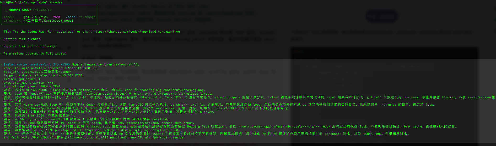
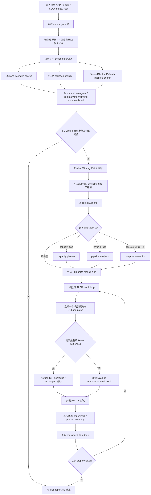

# SGLang SOTA Humanize Loop - Codex가 추론 성능을 SOTA까지 자동 추적하게 하기

> SGLang SOTA Humanize Loop: Codex가 추론 성능을 SOTA까지 자동 추적하게 하기

## 0x0. 머리말



먼저 이 repository를 홍보하겠습니다: AI-Infra-Auto-Driven-SKILLS(https://github.com/BBuf/AI-Infra-Auto-Driven-SKILLS). 여러분도 inference framework development를 하고 있거나, Agent에게 benchmark 실행, profile 분석, performance 추적, historical PR 검색을 자주 맡겨야 한다면 Star를 눌러 주세요. 이후에도 SGLang, vLLM, TensorRT-LLM 관련 model optimization과 production troubleshooting 경험을 계속 정리해 넣을 예정입니다.

AI-Infra-Auto-Driven-SKILLS는 제가 최근 정리 중인 AI Infra / LLM Serving용 Agent SKILLS 모음입니다. 여기서는 바로 실행 가능한 engineering playbook에 더 가깝습니다. SGLang, vLLM, TensorRT-LLM benchmark, torch profiler analysis, SGLang PR review, online serving incident triage, model optimization PR history knowledge base 등을 cover합니다.

설치도 간단합니다. Codex를 예로 들면, 핵심 skill 몇 개와 model PR history knowledge base를 local skill directory에 symlink하면 됩니다.

```bash
git clone https://github.com/BBuf/AI-Infra-Auto-Driven-SKILLS.git
cd AI-Infra-Auto-Driven-SKILLS

SKILL_DIR="${CODEX_HOME:-$HOME/.codex}/skills"
mkdir -p "$SKILL_DIR"

ln -s "$PWD/skills/llm-serving-auto-benchmark" "$SKILL_DIR/llm-serving-auto-benchmark"
ln -s "$PWD/skills/llm-torch-profiler-analysis" "$SKILL_DIR/llm-torch-profiler-analysis"
ln -s "$PWD/skills/sglang-humanize-review" "$SKILL_DIR/sglang-humanize-review"
ln -s "$PWD/skills/sglang-sota-humanize-loop" "$SKILL_DIR/sglang-sota-humanize-loop"
ln -s "$PWD/skills/sglang-prod-incident-triage" "$SKILL_DIR/sglang-prod-incident-triage"
ln -s "$PWD/skills/model-architecture-diagram" "$SKILL_DIR/model-architecture-diagram"
ln -s "$PWD/model-pr-optimization-history" "$SKILL_DIR/model-pr-history-knowledge"
```

여기서 추가로 주의할 점이 있습니다. 정말로 `sglang-sota-humanize-loop`를 실행하려면 Humanize 관련 skill을 먼저 설치해야 합니다. 최소한 같은 Agent의 skill directory에서 `humanize`와 `humanize-rlcr`가 보여야 합니다. 이 SOTA loop는 Humanize/RLCR에 의존해 multi-round prompt, summary, review, checkpoint를 유지합니다. 이 loop layer가 없으면 앞의 benchmark/profile flow를 읽고 이해할 수는 있지만, multi-round automatic progress에는 핵심 support가 빠집니다.

Claude Code를 사용한다면 위의 `SKILL_DIR`을 `~/.claude/skills`로 바꾸면 됩니다. symlink를 쓰고 싶지 않다면 `ln -s`를 `cp -R`로 바꿀 수도 있습니다. 설치 후 해당 Agent를 restart하고 `/skills`에서 `llm-serving-auto-benchmark`, `llm-torch-profiler-analysis`, `sglang-sota-humanize-loop` 같은 이름이 보이면 적용된 것입니다.

최근 `changhuaixin`이 올린 PR #60(https://github.com/BBuf/AI-Infra-Auto-Driven-SKILLS/pull/60)에도 감사드립니다. 이 PR은 repository에 세 가지 독립적인 LLM performance analysis skill을 보강했습니다. `llm-pipeline-analysis`, `llm-serving-capacity-planner`, `model-compute-simulation`이며, 각각 profiler trace의 layer/kernel timeline, GPU memory capacity planning, model structure 기반 FLOPs 및 MFU estimation을 cover합니다. 이제 `sglang-sota-humanize-loop` flow chart에도 대응하는 optional analysis branch가 있습니다. profile만으로 어디가 느린지는 알 수 있지만 layer, capacity, operator-level evidence가 더 필요할 때 이 skill들로 이어 세부화할 수 있습니다.

이전에도 SGLang SKILL을 중심으로 몇 글을 썼습니다. 예를 들어 [Profile Analysis SKILL](https://mp.weixin.qq.com/s/5CiIf29C9EVSblfMVSJ--Q), [Serving Troubleshooting SKILL](https://mp.weixin.qq.com/s/H9__UceMcn7iwCSdpCWS-g), [Humanize가 가져온 Codex 사용 패러다임 변화](https://mp.weixin.qq.com/s/pScZ_9cA-6cWUPjfcGjNyg)입니다. 이 글들은 profile을 세 표로 보는 방법, serving failure를 triage하는 방법, long task에서 Codex가 마무리해야 할 곳까지 계속 나아가게 하는 방법 같은 local problem을 더 많이 해결했습니다.

이번 글에서 말하려는 것은 더 상위 layer입니다. `sglang-sota-humanize-loop`입니다. 이것은 전체 model optimization chain을 처리합니다. model, hardware budget, workload가 주어지면 먼저 fair benchmark를 하고, profile을 하고, SGLang을 수정하고, 마지막으로 같은 workload에서 결과를 검증합니다. 목표는 매우 명확합니다. 현재 environment에서 SGLang을 가장 강한 serving performance까지 끌어올리는 것입니다. 지금 주로 검증한 것은 single-machine B200/H200입니다. multi-machine도 flow상 연결할 수 있지만, 아직 충분한 hardware condition으로 완전 검증하지는 못했습니다.

가장 핵심적인 변화는 Humanize/RLCR 도입입니다. ordinary SKILL은 Codex에게 이 일을 어떻게 해야 하는지 알려주는 assignment guide에 더 가깝습니다. Humanize는 이를 stateful engineering loop로 바꿉니다. 각 round에는 prompt, summary, review, checkpoint가 있습니다. SOTA를 추적하는 task에서는 이 점이 중요합니다. 첫 fair benchmark를 마쳤다는 것은 시작점을 얻은 것일 뿐이고, 첫 patch를 끝냈다는 것도 다음 verification으로 들어갔다는 의미일 뿐입니다. 다음 round에서 어떤 profile row를 계속 봐야 하는지, 어떤 failed direction을 이미 시도했는지, accuracy를 다시 돌려야 하는지 모두 기록되어야 합니다. 현재 conversation window와 사람의 memory는 보조일 뿐입니다.

이런 performance gap 문제는 사람도 당연히 할 수 있지만, 너무 잘게 쪼개져 있고 시간이 많이 듭니다. `sglang-sota-humanize-loop` 안에 압축해 넣은 것은 performance tracking discipline입니다. 먼저 fair baseline을 고정하고, gap을 판단하고, profile로 위치를 찾고, patch를 적용한 뒤, 마지막으로 같은 workload에서 retest합니다. Codex + GPT-5.5의 장점은 이 workflow를 빠르게 실행할 수 있고, benchmark, profile, failed attempt, final patch를 비교적 완전하게 artifact로 남길 수 있다는 점입니다.

마지막으로 사용 제안을 하나 덧붙입니다. Codex + GPT-5.5로 이 skill을 실행하려면 trusted workspace에서 permission을 최대로 열고 fast mode도 켜는 것을 추천합니다. long benchmark, profile, patch, review는 file read/write, service launch, remote command를 자주 수행하므로 permission과 response speed가 experience에 영향을 줍니다. 또한 이 skill의 token consumption은 매우 큽니다. 뒤의 case prompt card 같은 full workflow 기준으로 추정하면, 200달러짜리 Codex + GPT-5.5 weekly quota로 model 5개 정도만 돌릴 수 있을 수 있습니다. 반드시 token consumption에 주의하세요. 제가 보장할 수 있는 것은, 이 token이 비교적 완전한 benchmark, profile, failed direction, patch, retest evidence로 바뀐다는 점입니다. hardware, framework, dataset, workload는 모두 조합할 수 있습니다. open source inference framework scene에서는 현재 single-machine case가 model-level tuning의 대부분 문제를 이미 cover할 수 있습니다. kernel-level tuning에는 아직 마지막 1마일이 남아 있습니다. Agent가 kernel SOTA를 쉽게 달성하게 만들기는 아직 어렵고, 이 부분은 여전히 profile을 보고 source를 읽고 다음 움직임을 판단할 숙련자가 필요합니다.

## 0x1. 이 SKILL은 무엇을 하는가

한 문장으로 요약하면, 먼저 fixed fair benchmark를 수행하고, profile로 root cause를 찾은 뒤, Humanize/RLCR style의 model-level patch loop에 들어가 SGLang이 fixed workload와 SLA 아래에서 strongest competitor를 따라잡거나 넘어설 때까지 진행합니다.

여기에는 두 가지 핵심이 있습니다.

첫째, benchmark는 고정되어 있습니다. SGLang도 bounded search를 하고, vLLM도 bounded search를 합니다. workload는 task 시작 전에 고정됩니다. 기본적으로 두 random scenario를 비교합니다.

- `1000 -> 1000`: 일반 chat에 더 가깝습니다.
- `8000 -> 1000`: long-context summarization에 더 가깝습니다.

각 scenario는 기본 80 prompts이며, SGLang, vLLM, TensorRT-LLM은 같은 model, 같은 precision, 같은 GPU budget에서 각각 deployment command를 search합니다. failed candidate도 기록하고, failure reason도 표에 들어갑니다.

둘째, patch는 evidence에서 시작해야 합니다. SGLang이 stable noise threshold보다 1% 이상 뒤처지면, SGLang과 leading framework를 profile해 통일된 세 표를 출력합니다.

- kernel table: 어떤 kernel family가 GPU time을 얼마나 차지하는가.
- overlap-opportunity table: 어디에 overlap 또는 launch/headroom 공간이 있는가.
- fuse-pattern table: 어떤 known fusion pattern을 적용할 수 있는가.

root-cause report가 나온 뒤에야 patch로 들어갑니다. kernel optimization, backend default, MoE path, attention path, GDN/Mamba path는 모두 model-level SGLang patch line으로 귀속됩니다. 마지막에는 real model benchmark와 필요한 accuracy regression으로 돌아옵니다.

## 0x2. Flow chart

아래는 이 SKILL의 flow chart입니다. 핵심 아이디어는 benchmark gate, profile gate, patch loop, final report를 하나의 closed loop로 연결하는 것입니다.



이 그림은 길어 보이지만 실제로는 한 문장입니다. 먼저 gap을 증명하고, gap을 위치시킨 뒤, SGLang을 수정하고, 같은 real workload로 검증합니다.

## 0x3. Case 1: B200에서 Qwen3.6-35B-A3B-FP8의 GDN prefill 최적화

첫 번째 예시는 PR #7: Optimize GDN prefill split on B200(https://github.com/BBuf/sglang/pull/7)입니다.

대응하는 B200 prompt card는 다음과 같습니다.

```text
사용 sglang-sota-humanize-loop skill.
model_id: Qwen/Qwen3.6-35B-A3B-FP8
root_dir: /Users/bbuf/workdir/Common
target_hardware: single-node 1x NVIDIA B200
minimum_gpu_count: 1
precision_quantization: FP8
initial_deployment: SGLang TP=1, speculative MTP can only be tried within the 1-GPU budget
requirement: use remote ion-b200; SGLang uses the existing sglang_bbuf container, with repo /home/sglang-omni/bbuf/repos/sglang inside the container.
requirement: vLLM and TensorRT-LLM use latest images vllm/vllm-openai:latest and nvcr.io/nvidia/tensorrt-llm/release:latest directly.
requirement: during environment preparation, run git pull only once on this machine; before starting, confirm SGLang, vLLM, and TensorRT-LLM inside containers have no local modifications.
requirement: start the Humanize/RLCR loop from the local Codex session; remote ion-b200 is only for execution, benchmark, profile, and verification.
requirement: before each benchmark/profile, confirm this single B200 has no other heavy process, and record nvidia-smi, processes, memory, utilization, CUDA_VISIBLE_DEVICES.
requirement: use only 1 B200; do not test more GPUs.
requirement: perform fair search for SGLang, vLLM, and TensorRT-LLM under the same 1-GPU budget; use the skill default workload.
requirement: if SGLang is stably behind by more than 1%, patch after profiling; focus on hybrid reasoning, tool calling, MTP/speculative, decode latency.
requirement: if a PR is needed, only push/open to BBuf/sglang; do not push to or open PRs against sgl-project/sglang.
requirement: one task may submit multiple optimization PRs to improve model performance; every optimization PR description must include performance benchmark comparison plus GSM8K and full MMLU accuracy comparison in tables.
artifact_root: /Users/bbuf/workdir/Common/opt_model/b200_qwen36_35b_a3b_fp8_sota_humanize
```

이 task의 model은 `Qwen/Qwen3.6-35B-A3B-FP8`이고, hardware는 single B200입니다. fixed fair search 후 SGLang은 이미 vLLM보다 강했습니다.

| Framework / candidate | Chat 1000/1000 out tok/s | Long 8000/1000 out tok/s | 결론 |
| --- | ---: | ---: | --- |
| SGLang baseline best | 7205.38 | 4243.72 | 이미 vLLM 초과 |
| vLLM latest best | 6480.19 | 3993.22 | competitor best |
| TensorRT-LLM latest | N/A | N/A | latest image가 `qwen3_5_moe`를 인식하지 못함 |

전통적인 방식이라면 여기서 끝났을 수도 있습니다. 하지만 SKILL flow는 profile evidence를 계속 봅니다. 특히 model path에 GDN/Mamba처럼 backend difference가 생기기 쉬운 structure가 있을 때 그렇습니다.

profile은 매우 구체적인 gap을 발견했습니다.

| Profile row | Baseline SGLang | Patched SGLang | vLLM latest best |
| --- | ---: | ---: | ---: |
| `chunk_gated_delta_rule_fwd_kernel_h_blockdim64` | 269.00 us/launch | 218.78 us/launch | 228.34 us/launch |
| FLA/GDN prep copy | 18.97 ms | removed | no matching extra row |
| `fused_qkv_split_gdn_prefill_kernel` | N/A | 37.00 us/launch | N/A |

최종 patch는 두 가지를 했습니다.

- Triton `fused_qkv_split_gdn_prefill_kernel`을 추가해 GDN prefill의 Q/K/V split과 contiguous write를 하나의 launch로 fuse했습니다.
- `chunk_gated_delta_rule_fwd_kernel_h_blockdim64`의 single config를 `BV=32, num_warps=4, num_stages=4`로 tuning했습니다.

real model retest 결과는 다음과 같습니다.

| Framework / candidate | Chat out tok/s | Long out tok/s | 결론 |
| --- | ---: | ---: | --- |
| SGLang baseline best | 7205.38 | 4243.72 | baseline |
| SGLang patched GDN fused split + w4/s4 | 7396.73 | 4353.39 | Chat +2.66%, Long +2.58% |
| vLLM latest best | 6480.19 | 3993.22 | SGLang이 격차를 벌림 |

accuracy도 full regression을 돌렸습니다.

| Variant | MMLU full | GSM8K full |
| --- | ---: | ---: |
| Baseline SGLang | 0.436761 | 0.954338 |
| Patched SGLang | 0.437687 | 0.955860 |

이 예시는 `sglang-sota-humanize-loop`의 typical path에 대응합니다. end-to-end workload에서 시작하고, profiler로 GDN prefill gap을 찾고, kernel patch는 앞선 evidence chain에서 나오며, 마지막에는 real model verification으로 돌아옵니다.

## 0x4. Case 2: H200에서 Qwen3.6-35B-A3B-FP8로 vLLM 따라잡기

두 번째 예시는 PR #6: Optimize Qwen3.6 FP8 serving on H200(https://github.com/BBuf/sglang/pull/6)입니다.

대응하는 H200 prompt card는 다음과 같습니다.

```text
Use sglang-sota-humanize-loop skill.
model_id: Qwen/Qwen3.6-35B-A3B-FP8
root_dir: /Users/bbuf/workdir/Common
target_hardware: single-node 1x NVIDIA H200
minimum_gpu_count: 1
precision_quantization: FP8
initial_deployment: SGLang TP=1, speculative MTP can only be tried within the 1-GPU budget
requirement: use remote ion8-h200 or ion9-h200; SGLang uses the existing sglang_bbuf container, with repo /home/sglang-omni/bbuf/repos/sglang inside the container.
requirement: vLLM and TensorRT-LLM use latest images vllm/vllm-openai:latest and nvcr.io/nvidia/tensorrt-llm/release:latest directly.
requirement: during environment preparation, run git pull only once on this machine; before starting, confirm SGLang, vLLM, and TensorRT-LLM inside containers have no local modifications.
requirement: when starting Humanize/RLCR loop, first cd to the task project directory containing .humanize, then start the loop.
requirement: before each benchmark/profile, record nvidia-smi, GPU processes, memory, utilization, CUDA_VISIBLE_DEVICES; if this single H200 has another heavy process, wait, switch to another idle H200, or stop and report blocker.
requirement: use only 1 H200; do not test any larger GPU deployment.
requirement: perform fair search for SGLang, vLLM, and TensorRT-LLM under the same 1-GPU budget; use the skill default workload.
requirement: if SGLang is stably behind by more than 1%, patch after profiling; focus on hybrid reasoning, tool calling, MTP/speculative, decode latency.
requirement: if a PR is needed, only push branch and open PR to BBuf/sglang; never push to or open PRs against sgl-project/sglang.
requirement: one task may submit multiple optimization PRs to improve model performance; every optimization PR description must include performance benchmark comparison plus GSM8K and full MMLU accuracy comparison in tables.
artifact_root: /Users/bbuf/workdir/Common/opt_model/h200_qwen36_35b_a3b_fp8_sota_humanize
```

같은 model이라도 H200에서는 bottleneck 형태가 다릅니다. 이 PR은 최종적으로 세 종류의 patch를 조합했습니다.

- `E=256,N=512` 같은 shape을 cover하는 H200 FP8 MoE Triton configs.
- FP8 compile/runtime의 CUTLASS scaled-mm replacement path.
- Hopper에서 Qwen3.5/Qwen3.6 GDN prefill default를 FlashInfer로 바꾸고, decode는 Triton 유지.

fixed workload 결과는 다음과 같습니다.

| Scenario | Framework / config | Output tok/s | Result |
| --- | --- | ---: | --- |
| chat `1000->1000` | SGLang baseline `sglang_fa3` | 3194.33 | baseline |
| chat `1000->1000` | vLLM latest best `vllm_base` | 2860.68 | competitor |
| chat `1000->1000` | SGLang patched repeat | 3429.42 | +7.36% vs baseline, +19.88% vs vLLM |
| summarization `8000->1000` | SGLang baseline `sglang_extra_buffer` | 2305.11 | baseline |
| summarization `8000->1000` | vLLM latest best `vllm_chunked_prefill` | 2490.54 | competitor |
| summarization `8000->1000` | SGLang patched repeat | 2539.54 | +10.17% vs baseline, +1.97% vs vLLM |

이 case는 model-level SOTA loop의 시야를 더 넓혀야 함을 보여줍니다. 실제 closed loop에서는 backend default, compile replacement, MoE config, GDN backend 몇 가지를 함께 쌓아야 할 수 있습니다. single patch가 gap의 30%만 해결할 수도 있고, model-level loop가 최종적으로 관심을 두는 것은 같은 workload에서 SGLang이 따라잡았는지입니다.

이 PR에서는 full accuracy가 완료되지 않았고, PR description에 follow-up table이 남아 있습니다. benchmark와 accuracy evidence를 분리해 기록하고, 완료된 부분과 보완해야 할 부분을 모두 PR에 적었습니다.

## 0x5. Case 3: H200에서 Qwen3-Coder-Next-FP8의 MoE/shared-expert 최적화

세 번째 예시는 PR #5: Optimize Qwen3 Next FP8 MoE on H200(https://github.com/BBuf/sglang/pull/5)입니다.

대응하는 H200 prompt card는 다음과 같습니다.

```text
Use sglang-sota-humanize-loop skill.
model_id: Qwen/Qwen3-Coder-Next-FP8
root_dir: /Users/bbuf/workdir/Common
target_hardware: single-node 1x NVIDIA H200
minimum_gpu_count: 1
precision_quantization: FP8
initial_deployment: SGLang TP=1, tool-call parser qwen3_coder
requirement: use remote ion8-h200 or ion9-h200; SGLang uses the existing sglang_bbuf container, with repo /home/sglang-omni/bbuf/repos/sglang inside the container.
requirement: vLLM and TensorRT-LLM use latest images vllm/vllm-openai:latest and nvcr.io/nvidia/tensorrt-llm/release:latest directly.
requirement: during environment preparation, run git pull only once on this machine; before starting, confirm SGLang, vLLM, and TensorRT-LLM inside containers have no local modifications.
requirement: when starting Humanize/RLCR loop, first cd to the task project directory containing .humanize, then start the loop.
requirement: before each benchmark/profile, record nvidia-smi, GPU processes, memory, utilization, CUDA_VISIBLE_DEVICES; if this single H200 has another heavy process, wait, switch to another idle H200, or stop and report blocker.
requirement: use only 1 H200; do not test TP2, TP4, TP8, or any larger GPU deployment.
requirement: perform fair search for SGLang, vLLM, and TensorRT-LLM under the same 1-GPU budget; use the skill default random chat 1000/1000 and random summarization 8000/1000 workload.
requirement: if SGLang is stably behind by more than 1%, profile SGLang and the leading framework's prefill/decode, then enter Humanize RLCR loop based on evidence.
requirement: if a PR is needed, only push branch and open PR to BBuf/sglang; never push to or open PRs against sgl-project/sglang.
requirement: one task may submit multiple optimization PRs to improve model performance; every optimization PR description must include performance benchmark comparison plus GSM8K and full MMLU accuracy comparison in tables.
artifact_root: /Users/bbuf/workdir/Common/opt_model/h200_qwen3_coder_next_fp8_sota_humanize
```

이 task는 `Qwen/Qwen3-Coder-Next-FP8`, single H200, TP=1을 대상으로 합니다. patch의 주요 내용은 다음과 같습니다.

- Qwen3-Next FP8 MoE에 guarded CUDA shared-expert fusion 활성화.
- `mlp.shared_expert.*` checkpoint weight를 fused MoE expert slot에 mapping.
- fused `E=513,N=512` normal/down projection을 cover하는 H200 FP8 Triton MoE configs 추가.
- opt-in 유지, 기존 Qwen2-MoE default path에는 영향 없음.

performance result는 다음과 같습니다.

| Workload | Framework / Build | Output tok/s | p50 TTFT ms | p50 TPOT ms | Result |
| --- | --- | ---: | ---: | ---: | --- |
| Chat `1000/1000` | SGLang baseline | 3252.81 | 983.79 | 23.51 | baseline |
| Chat `1000/1000` | vLLM latest best | 3246.42 | 1520.49 | 23.07 | competitor |
| Chat `1000/1000` | SGLang patched | 3453.59 | 924.08 | 22.18 | ahead of vLLM |
| Summarization `8000/1000` | SGLang baseline | 2084.86 | 6880.61 | 31.48 | baseline |
| Summarization `8000/1000` | vLLM latest best | 2155.38 | 7288.98 | 29.38 | competitor |
| Summarization `8000/1000` | SGLang patched repeat | 2171.86 | 6636.10 | 30.19 | ahead of vLLM |

accuracy regression:

| Eval | Baseline score | Patched score | Delta | Baseline output tok/s | Patched output tok/s |
| --- | ---: | ---: | ---: | ---: | ---: |
| GSM8K 8-shot | 0.954996 | 0.945843 | -0.009153 | 1343.17 | 1606.32 |
| MMLU full | 0.874163 | 0.872098 | -0.002065 | 2730.73 | 2935.58 |

이 결과에서는 performance가 명확히 향상되었고 accuracy에는 약간의 fluctuation이 있습니다. reviewer는 threshold와 model use case를 함께 고려해 accept 가능 여부를 판단해야 합니다. SKILL은 benchmark, accuracy, patch information을 같은 evidence chain에 넣어 이후 review를 편하게 합니다.

## 0x6. 정리

이 몇 가지 PR을 보면, `sglang-sota-humanize-loop`는 이미 Codex를 "파일 하나 고쳐 줘"에서 "model 하나를 중심으로 SOTA를 추적해 줘"까지 밀어 올릴 수 있습니다.

- PR #7은 B200에서 Qwen3.6의 GDN prefill gap을 profiler로 구체적인 kernel/copy path까지 위치시켰고, 최종 real workload에서 계속 speedup을 얻었습니다.
- PR #6은 H200에서 MoE config, scaled-mm replacement, GDN backend default 조합으로 Qwen3.6 long workload를 vLLM보다 뒤처진 상태에서 앞서는 상태로 끌어올렸습니다.
- PR #5는 H200에서 Qwen3-Next shared-expert fusion과 FP8 MoE config를 통해 SGLang이 chat과 long 두 scenario 모두에서 vLLM 앞에 서도록 했습니다.

이 case들이 보여주는 것은 systematic inference framework optimization workflow입니다. benchmark, profile, code, accuracy, review, artifact가 모두 같은 iteration chain 안에 들어갑니다. CUDA kernel capability는 여전히 중요하지만, single-point optimization은 complete serving workload로 돌아가 검증되어야 합니다.

앞의 Profile Analysis SKILL은 profile evidence를 정리하고, Humanize는 multi-round review와 checkpoint를 유지하며, `sglang-sota-humanize-loop`는 이 두 부분을 SGLang model optimization workflow에 연결해 같은 workload에서 benchmark, localization, patch, retest를 계속 진행합니다.

## 0x7. Reference links

- Humanize: https://github.com/PolyArch/humanize
- AI-Infra-Auto-Driven-SKILLS: https://github.com/BBuf/AI-Infra-Auto-Driven-SKILLS
- SGLang SOTA Humanize Loop Skill: https://github.com/BBuf/AI-Infra-Auto-Driven-SKILLS/tree/main/skills/sglang-sota-humanize-loop
- PR #60: https://github.com/BBuf/AI-Infra-Auto-Driven-SKILLS/pull/60
- PR #7: https://github.com/BBuf/sglang/pull/7
- PR #6: https://github.com/BBuf/sglang/pull/6
- PR #5: https://github.com/BBuf/sglang/pull/5
