# SGLang Team - 96개 H100 GPU에 PD 분해와 대규모 Expert Parallelism으로 DeepSeek 배포하기

> 원문: https://lmsys.org/blog/2025-05-05-large-scale-ep/
> 중국어 전재: https://mp.weixin.qq.com/s/DJpuqJnTCelMvNerDD2_Og

DeepSeek은 뛰어난 성능으로 호평받는 인기 있는 오픈소스 대규모 언어 모델(LLM)입니다. 하지만 모델 크기가 크고 Multi-head Latent Attention(MLA)과 Mixture of Experts(MoE)를 사용하는 독특한 구조를 가지고 있어서, 대규모로 효율적인 서빙을 하려면 발전된 시스템이 필요합니다. 이 글에서는 SGLang으로 DeepSeek 추론 시스템의 성능에 어떻게 도달했는지 설명합니다.

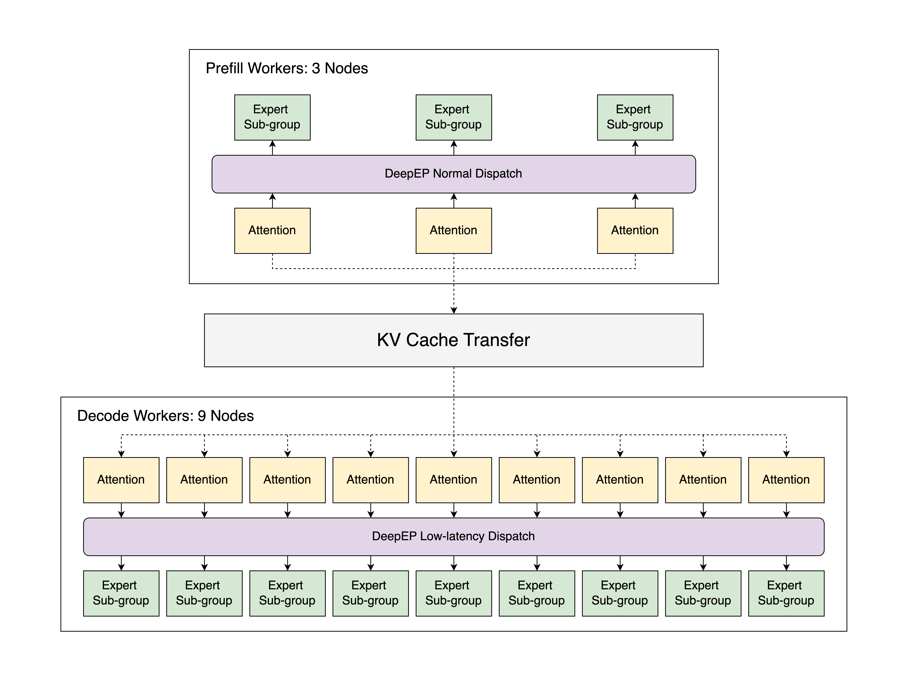

위 그림에 나타난 우리의 구현은 Atlas Cloud의 12개 node에서 동작하며, 각 node는 8개의 H100 GPU를 갖추고 있습니다. 이 구현은 prefill-decode 분해와 대규모 expert parallelism(EP)을 사용하며, 2000-token 입력 시퀀스에 대해 **node당 초당 52.3k input token과 초당 22.3k output token**의 속도를 달성합니다. 우리가 아는 한 이는 **대규모 환경에서 공식 DeepSeek 블로그가 보고한 throughput에 거의 근접한 최초의 오픈소스 구현**입니다. 이 구현을 로컬에 배포하면 output token 100만 개당 \$0.20의 비용에 해당하며, 이는 공식 DeepSeek Chat API 비용의 약 5분의 1입니다. 동일한 자원을 사용하는 기본 tensor parallelism과 비교하면, 이 최적화 전략은 output throughput을 최대 5배까지 높입니다. 이 글에서는 우리의 parallelism 설계, 최적화 방법, 그리고 결과를 자세히 다룹니다. 우리 작업의 모든 구성 요소는 완전히 오픈소스로 공개되어 있어서, 다른 사람들이 이를 살펴보고 그 위에 무언가를 만들 수 있습니다. 실험을 재현하기 위한 지침은 [여기](https://github.com/sgl-project/sglang/issues/6017)에서 모두 확인할 수 있습니다.

## 핵심 요약

✅ SGLang은 이제 prefill-decode(PD) 분해와 대규모 EP를 지원하며, 여기에는 [DeepEP](https://github.com/deepseek-ai/DeepEP), [DeepGEMM](https://github.com/deepseek-ai/DeepGEMM), [EPLB](https://github.com/deepseek-ai/eplb)의 전체 기능이 포함됩니다.

✅ 이 새로운 기능들을 활용해 우리 팀은 각각 8개의 H100 GPU를 갖춘 12개 node로 DeepSeek의 추론 시스템을 성공적으로 재현했습니다. 전체적으로 SGLang은 2000 token 입력 시퀀스에 대해 node당 초당 52.3k input token과 초당 22.3k output token의 throughput을 달성합니다.

✅ 이 글에서는 효율성, peak memory 사용량 감소, workload 균형에 대한 최적화에 초점을 맞춰 우리 접근 방식의 기술적 세부 사항을 설명합니다. profile 결과를 보면 우리 구현이 DeepSeek 공식 보고서와 거의 대등한 성능을 달성한다는 것을 알 수 있습니다.

✅ 모든 실험과 코드는 커뮤니티가 접근하고 더 발전시킬 수 있도록 완전히 오픈소스로 공개되어 있습니다.

## 목차

- [Parallelism 설계](#parallelism-design)
- [Prefill과 Decode 분해](#prefill-and-decode-disaggregation)
- [대규모 Expert Parallelism](#large-scale-expert-parallelism)
- [평가](#evaluation)
- [도구 모음](#toolkits)
- [한계와 향후 과제](#limitations-and-future-work)
- [결론](#conclusion)
- [감사의 말](#acknowledgment)

## Parallelism 설계

DeepSeek 구조의 계산 복잡도와 메모리 요구를 다루려면 효율적인 parallelism이 필수적입니다. 이 절에서는 attention layer, dense feed-forward network(FFN), sparse FFN, language model(LM) head라는 핵심 구성 요소를 최적화하는 우리의 접근 방식을 설명합니다. 각 구성 요소는 확장성, 메모리 효율, 성능을 높이기 위해 각각에 맞춘 parallelism 전략을 사용합니다.

### Attention Layer

DeepSeek은 입력 시퀀스 내부의 복잡한 의존 관계를 효과적으로 모델링하기 위해 **Multi-head Latent Attention(MLA)**을 사용합니다. 이 메커니즘을 최적화하기 위해 우리는 **DP Attention**을 구현했습니다. 이는 장치 사이의 KV cache 중복을 없애서 메모리 overhead를 크게 줄이는 data parallelism 전략입니다. [SGLang v0.4](https://lmsys.org/blog/2024-12-04-sglang-v0-4/#data-parallelism-attention-for-deepseek-models)에서 도입된 이 방식은 **data parallelism과 tensor parallelism의 혼합**을 지원하도록 확장되어, 작은 batch size를 효율적으로 처리할 수 있는 유연성을 제공합니다.

### Dense FFN

DeepSeek-V3는 dense FFN layer를 3개만 사용하지만, 그 계산은 peak memory 사용량을 크게 늘릴 수 있어서 주의 깊게 관리하지 않으면 시스템이 멈출 수도 있습니다. 이를 해결하기 위해 우리는 tensor parallelism(TP) 대신 **Data Parallelism(DP)**을 채택했으며, 그 이유는 다음과 같은 장점 때문입니다.

- **확장성 향상**: intermediate dimension이 18,432이므로, 높은 TP 차수(예: TP32)를 쓰면 비효율적으로 작은 단위(예: 576 단위)로 쪼개집니다. 이 값은 H100 같은 최신 GPU의 일반적인 정렬 경계인 128로 나누어떨어지지 않습니다. 이 불일치는 계산 효율과 메모리 활용을 저해합니다. DP는 이런 단편화를 피해서 더 확장성 있는 해법을 제공하며, 장치 사이의 workload 분배를 균형 있게 유지합니다.
- **메모리 효율 최적화**: 전통적으로 TP는 worker 수가 늘어날수록 메모리 사용량을 줄여 주지만, DP attention 아래에서는 이 장점이 줄어듭니다. 순수 TP 구성에서 단일 layer Transformer 모델의 메모리 요구는 DP size에 따라 다음과 같이 변합니다.

  $$\text{Memory}=\frac{N_{\text{param}}}{\text{TP}}+(1+k)N_{\text{hidden\_state}}\cdot \text{DP}$$

  여기서 $N_{\text{hidden\_state}}=n_\text{token}\times n_\text{hidden\_size}$는 각 장치(DP rank)에 있는 hidden state의 크기이고, $N_{\text{param}}=n_\text{intermediate\_size}\times n_\text{hidden\_size}$는 모델 parameter 수이며, $k$는 CUDA Graph 중복으로 생기는 추가 메모리 overhead를 나타내는 계수입니다. $\text{DP}=\text{TP}$라고 가정하면, 이 메모리 사용량 함수는 $\text{TP}=\sqrt{\frac{N_{\text{param}}}{(1+k)N_{\text{hidden\_state}}}}$일 때 최소가 됩니다. DeepSeek-V3는 intermediate size로 18,432를 사용합니다. prefill 단계에서는 보통 CUDA Graph가 비활성화되므로 $k = 0$입니다. 그런데 장치당 token 크기는 쉽게 2,048을 넘을 수 있어서, 최적 TP size는 3 이하가 됩니다. decode 단계에서는 실용적인 구성으로 장치당 128 token을 쓰고 $k = 3$으로 둘 수 있습니다. 이 경우 메모리 최적 TP size는 6입니다. 두 단계 모두에서 더 낮은 TP 차수가 장치당 메모리 사용량을 최소화합니다. 결과적으로 TP에만 의존하는 것보다 DP가 확장에 더 메모리 효율적인 접근일 수 있습니다.

- **통신 overhead 최소화**: 순수 TP에서는 각 FFN마다 all-reduce 연산이 두 번 필요해서 상당한 통신 overhead가 생깁니다. DP를 활용하면 이 과정을 앞선 attention layer 뒤의 reduce-scatter 한 번과 다음 layer 앞의 all-gather 한 번으로 최적화할 수 있어서, 통신 비용이 50% 줄어듭니다. 또한 attention도 순수 DP로 계산하면 장치 사이의 통신이 완전히 사라져서 전체 효율이 크게 높아집니다.

DP dense FFN과 DP attention의 통합은 아래 그림의 왼쪽에 나타나 있습니다. 사용자는 `--moe-dense-tp-size=1`을 설정해 이 기능을 켤 수 있습니다.


### Sparse FFN

DeepSeek-V3의 Mixture of Experts(MoE) 구조에서 sparse FFN은 상당한 양의 expert weight를 필요로 하며, 이는 큰 메모리 bottleneck이 됩니다. 이를 해결하기 위해 우리는 expert weight를 여러 장치에 분산시키는 **Expert Parallelism(EP)**을 구현했습니다. 이 방식은 높은 성능을 유지하면서 메모리 용량을 효과적으로 확장하지만, 불규칙한 all-to-all 통신과 workload 불균형 같은 과제도 함께 가져옵니다.

위 그림의 오른쪽은 DeepEP 프레임워크를 사용한 우리의 EP 구현을 보여줍니다. EP 설계와 최적화에 대한 더 자세한 내용은 [뒤의 절](#large-scale-expert-parallelism)에서 다룹니다.

### LM Head

LM head는 큰 vocabulary에 대한 출력 확률을 계산하는 자원 소모가 큰 연산이며, 전통적으로는 TP group에서 token logit을 모으는 vocabulary parallelism으로 처리합니다. 확장성과 효율을 높이기 위해 우리는 dense FFN 전략과 같은 방식으로 **Data Parallelism(DP)**을 채택했습니다. 이로써 메모리 overhead가 줄어들고 장치 사이의 통신이 단순해져서 더 간결한 해법이 됩니다.

## Prefill과 Decode 분해

LLM 추론은 **Prefill**과 **Decode**라는 서로 다른 두 단계로 구성됩니다. Prefill 단계는 입력 시퀀스 전체를 처리하는 계산 집약적인 단계이고, Decode 단계는 token 생성을 위해 Key-Value(KV) cache를 관리하는 메모리 집약적인 단계입니다. 전통적으로 이 두 단계는 하나의 엔진 안에서 처리되는데, prefill batch와 decode batch를 함께 scheduling하면 비효율이 생깁니다. 이 문제를 해결하기 위해 우리는 SGLang에 **Prefill과 Decode(PD) 분해**를 도입했습니다.

### 통합 scheduling의 문제

prefill batch와 decode batch를 함께 처리하는 기존의 통합 엔진에는 세 가지 중요한 문제가 있습니다.

1. **Prefill 중단**: 들어오는 prefill batch가 진행 중인 decode batch를 자주 중단시켜서 token 생성에 큰 지연을 일으킵니다.
2. **DP Attention 불균형**: DP attention에서는 한 DP worker가 prefill batch를 처리하는 동안 다른 worker는 decode batch를 처리할 수 있으며, 이로 인해 decode latency가 늘어납니다.
3. **DeepEP와의 비호환**: [뒤의 절](#expert-parallelism-with-deepep)에서 논의하겠지만 DeepEP는 prefill과 decode에 서로 다른 dispatch 모드를 실행하므로, 통합 scheduling은 DeepEP와 호환되지 않습니다.

PD 분해는 두 단계를 분리해서 이 문제들을 해결하며, 각 단계에 맞춘 최적화를 가능하게 합니다.

### 구현 세부 사항

아래 그림에 나타난 SGLang의 PD 분해 설계는 Prefill Server와 Decode Server 사이에서 실행을 번갈아 진행합니다.

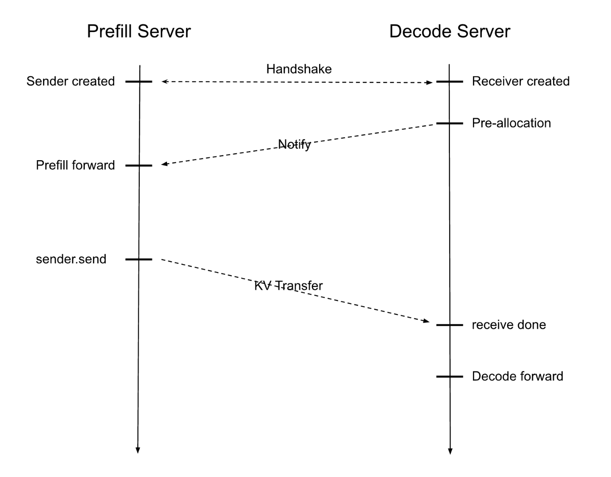

입력 request를 받으면 workflow는 다음과 같이 진행됩니다.

1. Prefill Server와 Decode Server가 handshake로 짝을 이루며, 각각 local sender와 receiver를 설정합니다.
2. Decode Server가 KV cache를 미리 할당하고, Prefill Server에게 모델 forward pass를 시작해 KV cache를 계산하라고 알립니다.
3. 계산이 끝나면 데이터가 Decode Server로 전송되고, Decode Server가 반복적인 token 생성을 담당합니다.

이렇게 분리하면 각 단계가 최적의 조건에서 동작하게 되어 GPU 자원 활용이 극대화됩니다. 성능을 더 높이기 위해 우리 구현에는 다음이 포함되어 있습니다.

- **Non-blocking 전송**: 데이터 송수신 연산이 background thread에서 실행되어 scheduler의 event loop가 중단되지 않습니다.
- **RDMA 기반 전송**: Remote Direct Memory Access(RDMA)는 연결에 queue pair를 사용하고, 연속되지 않은 메모리 chunk를 효율적으로 전송하기 위해 scatter-gather element(SGE)를 사용합니다.
- **유연한 API 통합**: SGLang은 Mooncake와 NIXL 같은 고성능 RDMA 라이브러리를 통합할 수 있는 유연한 API를 제공해 데이터 전송을 간소화합니다.

더 자세한 내용은 우리 [설계 문서](https://docs.google.com/document/d/1rQXJwKd5b9b1aOzLh98mnyMhBMhlxXA5ATZTHoQrwvc/edit?tab=t.0)에서 확인할 수 있습니다.

## 대규모 Expert Parallelism

### DeepEP를 사용하는 Expert Parallelism

DeepSeek 팀이 구현한 [DeepEP](https://github.com/deepseek-ai/DeepEP)는 MoE 모델에서 EP를 간소화하기 위해 설계된 통신 라이브러리입니다. 이는 여러 GPU에 걸쳐 token을 특정 expert로 효율적으로 라우팅하는 문제를 다룹니다. 최적화된 통신 kernel을 제공함으로써 DeepEP는 latency를 줄이고 throughput을 높여서 대규모 추론 작업에 적합합니다.

DeepEP는 서로 다른 workload 요구에 대응하기 위해 두 가지 특화된 dispatch 모드를 제공합니다.

- **Normal Dispatch**: prefill 단계처럼 긴 입력 시퀀스를 다루는 데 최적화된 모드로, 최대 계산 throughput을 우선합니다. 다만 CUDA Graph와 호환되지 않는 symbolic shape을 생성하므로, kernel launch overhead가 중요한 bottleneck이 되는 decode 단계에는 효과적이지 않습니다.
- **Low-Latency Dispatch**: decode 단계에서 output token을 생성하는 데 맞춰진 모드로, 실시간 성능을 보장하기 위해 지연을 최소화하는 것을 우선합니다. CUDA Graph를 지원하지만 고정된 크기의 메모리를 미리 할당해야 합니다. 메모리 요구가 이 사전 할당량을 넘으면 runtime error가 발생합니다.

SGLang에서 DeepEP를 통합하면 workload에 따라 이 두 dispatch 모드 사이에서 동적으로 선택하는 **auto 모드**를 사용할 수 있습니다. 하지만 PD 분해가 없으면 auto 모드에는 제약이 있습니다. 같은 통신 group 안에서 normal dispatch(prefill용)와 low-latency dispatch(decode용)를 동시에 지원할 수 없다는 점입니다. 이 제약은 메모리 효율적인 추론에 매우 중요한 DP attention과의 호환을 가로막습니다. 각 모드의 호환성은 아래 표에 정리되어 있습니다.

| **모드**    | **긴 입력** | **긴 출력** | **DP Attention** | **CUDA Graph** |
|-------------|----------------|-----------------|------------------|----------------|
| Normal      | ✅             | ❌              | ✅               | ❌             |
| Low-Latency | ❌             | ✅              | ✅               | ✅             |
| Auto        | ✅             | ✅              | ❌               | ✅             |

PD 분해는 prefill 단계와 decode 단계를 분리해서 이 문제를 해결하며, DP attention 아래에서 prefill 단계에는 normal dispatch를, decode 단계에는 low-latency dispatch를 사용할 수 있게 합니다. 이 통합은 각 단계의 구체적인 요구에 dispatch 모드를 맞춤으로써 자원 활용을 최적화하고 전체 성능을 높입니다.

### DeepGEMM 통합

[DeepGEMM](https://github.com/deepseek-ai/DeepGEMM)은 DeepSeek 팀이 개발한 또 다른 고효율 라이브러리로, MoE 모델의 계산을 최적화하기 위해 특별히 설계되었습니다. 이 라이브러리는 MoE 관련 행렬 곱셈(Grouped GEMM)을 처리하는 두 가지 특화된 함수를 제공하며, 각각은 추론 과정의 서로 다른 단계에 맞춰져 있습니다.

- **Grouped GEMM(contiguous layout)**: 이 kernel은 동적인 입력 shape을 위해 설계되어 MoE 추론의 prefill 단계에 적합합니다. 서로 다른 expert의 데이터가 연속적으로 이어 붙여진 입력을 처리하므로, 다양한 입력 크기를 유연하게 다룰 수 있습니다.
- **Grouped GEMM(masked layout)**: 이 kernel은 고정된 입력 shape을 가정하고 mask tensor를 사용해 입력의 유효한 부분만 계산합니다. kernel launch를 최적화하는 CUDA Graph와 호환되므로, overhead 감소가 중요한 decode 단계에 잘 맞습니다.

DeepGEMM은 DeepEP의 dispatch 모드와 매끄럽게 통합됩니다.

- prefill 단계에서 **normal dispatch**와 함께 사용되는 **contiguous layout kernel**의 경우 추가 단계가 필요합니다. normal dispatch는 symbolic shape을 출력하므로, kernel이 기대하는 contiguous 형식으로 출력을 변환하는 permutation이 필요합니다. 우리는 LightLLM 프로젝트를 참고해 효율적인 permutation을 위한 custom Triton kernel을 구현했습니다. 이 kernel은 normal dispatch의 출력이 올바르게 재배열되도록 보장해서, contiguous GEMM kernel과 매끄럽게 통합되게 합니다.
- **masked layout kernel**은 DeepEP의 **low-latency dispatch**와 자연스럽게 짝을 이룹니다. 둘 다 decode 단계에 최적화되어 있고 CUDA Graph를 지원하기 때문입니다.

SGLang은 tensor parallelism 아래의 MoE 계산에도 DeepGEMM을 통합했습니다. 또한 DeepGEMM은 매우 효율적인 범용 GEMM kernel도 제공하는데, SGLang에서는 환경 변수 `SGL_ENABLE_JIT_DEEPGEMM`을 1로 설정해 활성화할 수 있으며, MoE가 아닌 연산에서도 더 높은 계산 효율을 얻을 수 있습니다.

### Two-batch Overlap

다중 node 환경에서는 제한된 통신 대역폭이 전체 latency를 크게 늘릴 수 있습니다. 이 과제를 해결하기 위해 우리는 [DeepSeek의 시스템 설계](https://github.com/deepseek-ai/profile-data)를 따라 **Two-batch Overlap(TBO)**을 구현했습니다. TBO는 하나의 batch를 두 개의 micro-batch로 나눠서 계산과 통신이 겹치도록 하며, 실질적인 batch size를 절반으로 줄여서 peak memory 사용량도 낮춥니다. 하지만 TBO를 실제로 구현하는 데에는 구체적인 어려움이 따릅니다.

##### 구현상의 과제

DeepSeek이 TBO의 설계 틀을 공개하기는 했지만, 구현상 두 가지 작은 과제가 있습니다.

- **코드 복잡도**: TBO를 직접 코딩하면 여러 micro-batch를 관리하는 로직이 중복될 수 있습니다. 이는 코드베이스의 복잡도를 높여서 유지보수를 어렵게 하고 오류가 생기기 쉽게 만들며, micro-batch 수나 겹치는 구간이 늘어날수록 더 심해집니다.
- **Prefill 단계의 동기화 문제**: DeepEP의 normal dispatch가 CPU를 blocking할 때 계산과 통신을 효과적으로 겹치게 하려면 고려가 필요합니다. 이 blocking 동작은 파이프라인을 멈추게 해서 GPU를 놀게 만들고 TBO의 성능 이점을 깎아먹을 수 있습니다.

##### 깔끔한 구현을 위한 추상화

유지보수하기 좋고 재사용 가능한 코드베이스를 만들기 위해, 우리는 operation과 yield point로 구성된 추상화 계층을 사용합니다. 이 방식은 micro-batch 하나만 다루는 것처럼 코드를 작성할 수 있게 하면서, 전략적으로 yield point를 삽입해 실행을 잠시 멈추고 다른 micro-batch가 진행되게 합니다. 코드 중복이 사라지고, 변수 접미사를 붙여야 할 필요가 줄어들며, 어떤 실행은 layer 끝에서 완료되었는데 다른 실행은 그렇지 않은 경우도 효율적으로 관리됩니다. 또한 겹치는 구간의 선택을 바꾸거나 three-batch overlap 같은 향후 개선을 적용할 때도 최소한의 코드 변경으로 쉽게 대응할 수 있습니다. 아래는 이 방식을 간단히 보여 주는 예시입니다.

``` python
operations = [
    self._forward_attn,
    YieldOperation(),  # 다른 micro-batch를 위해 실행을 잠시 멈춤
    self._forward_dispatch,
    self._forward_mlp,
    YieldOperation(),  # 또 하나의 멈춤 지점
    self._forward_combine,
]

# 코드 중복 없이 micro-batch 하나를 처리
def _forward_attn(self, state):
    state.hidden_states = self.self_attn(state.hidden_states, ...)
```

##### Prefill 겹침 구현

우리는 DeepEP의 비동기 모드를 쓰고 있음에도 dispatch 연산을 통해 CPU가 blocking되는 것을 피하기 위해, prefill 단계의 launch 순서를 다듬었습니다. 구체적으로 다음과 같습니다.

- dispatch 연산은 적절한 크기의 tensor를 할당하기 위해 GPU가 다른 rank로부터 metadata를 받을 때까지 CPU를 blocking합니다.
- 구현이 적절하지 않으면 이 기간 동안 GPU에 제출된 계산 작업이 없어서 계산 stream이 놀게 됩니다.

이를 최적화하기 위해 우리는 CPU를 blocking하는 통신을 시작하기 전에 계산 작업을 GPU에 먼저 제출합니다. 이렇게 하면 통신 중에도 GPU가 계속 일하게 됩니다. 아래 그림에서 볼 수 있듯이, 굵은 테두리로 표시된 적절한 launch 순서를 가진 TBO는 CPU를 blocking하는 연산(즉, normal dispatch) 때문에 생기는 bubble을 피합니다.

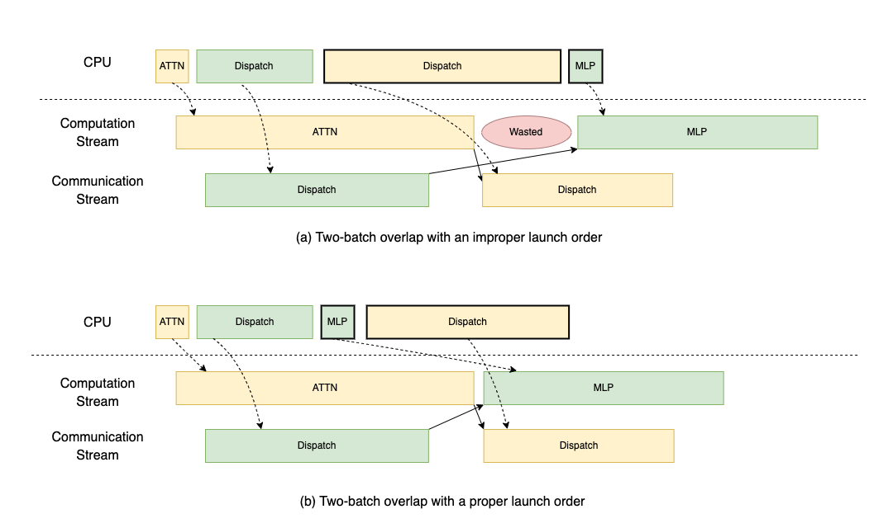

### Expert Parallelism Load Balancer

MoE 모델에서 EP는 종종 GPU 사이의 workload 분배를 불균등하게 만듭니다. 이 불균형은 시스템이 가장 느린 GPU의 계산이나 통신을 기다리게 만들어서 계산 cycle을 낭비하고, expert activation 때문에 메모리 사용량도 늘립니다. GPU 수(EP size)가 늘어날수록 불균형 문제는 더 심각해집니다.

이를 해결하기 위해 DeepSeek은 [Expert Parallelism Load Balancer(EPLB)](https://github.com/deepseek-ai/EPLB)를 개발했습니다. EPLB는 expert 분포 통계를 입력으로 받아서 불균형을 최소화하는 최적의 expert 배치를 계산합니다. 사용자는 redundant expert(예: 32개 추가)를 할당할 수 있고, 이를 원래의 256개와 합치면 288개 expert의 pool이 만들어집니다. 이 pool 덕분에 EPLB는 expert를 전략적으로 배치하거나 복제할 수 있습니다. 예를 들어 가장 자주 쓰이는 expert를 여러 번 복제하거나, 적당히 쓰이는 expert를 거의 쓰이지 않는 expert들과 묶어서 한 GPU에 올리는 식입니다.

workload 균형을 맞추는 것 외에도 EPLB는 parallelism 설계에 더 큰 유연성을 제공합니다. 원래의 256개 expert로는 parallelism 크기가 2의 거듭제곱으로 제한됩니다. EPLB가 288개 expert를 사용하면 12나 72 같은 더 다양한 구성이 가능해집니다.

아래 그림에서는 시뮬레이션을 통해 규모와 EPLB 알고리즘이 불균형 문제에 미치는 영향을 보여 줍니다. 우리는 GPU balancedness를 한 MoE layer에서 GPU 사이의 평균 계산 시간과 최대 계산 시간의 비율로 계산하며, 각 GPU의 계산 시간은 그 GPU가 처리하는 token 수로 추정합니다. 그림에서 볼 수 있듯이 node 수가 늘어나며 시스템이 확장될수록 활용률이 떨어지고, EPLB를 켜면 활용률이 크게 개선됩니다.

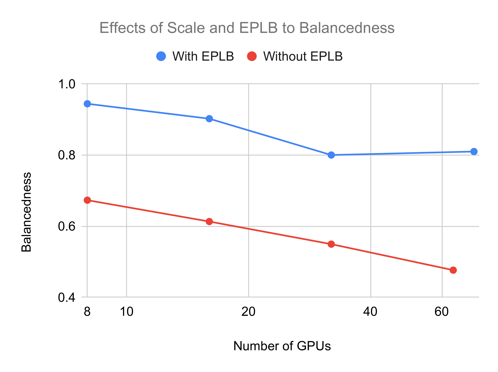

##### 실제 서빙에서의 EPLB

EPLB가 효과를 내려면 입력 분포가 실제 서빙 workload와 비슷해야 합니다. 이 정합성을 높이는 두 가지 전략이 있습니다.

- **Batch size 늘리기**: batch가 커지면 expert 사용의 무작위 변동이 줄어들어 균형이 좋아집니다. 이는 클러스터를 확장하거나 Multi-Token Prediction(MTP) 같은 기법을 사용해 달성할 수 있습니다.
- **주기적 재균형**: expert 배치를 정기적으로 갱신하면 시간적 지역성을 활용할 수 있지만, expert를 효율적으로 다시 올릴 수 있어야 합니다. 따라서 expert 재적재 연산의 비용을 최소화해야 합니다.

EPLB를 쓰더라도 어느 정도의 불균형은 피할 수 없으므로, 추가 최적화는 가치 있는 향후 방향입니다.

##### 재균형의 구현

SGLang은 효율성과 최소한의 방해를 보장하기 위해 expert 재균형을 세 단계로 구현합니다.

1. **시스템 적재 단계**: 더 빠른 재균형을 위해 weight를 디스크에서 메인 메모리로 미리 올리거나, 메모리 사용량을 줄이기 위해 memory mapping(mmap)으로 디스크에 둘 수 있습니다.
2. **재균형 준비 단계**: 필요한 weight가 background에서 비동기적으로 장치 메모리로 전송되며, 진행 중인 GPU 연산을 방해하지 않고 유휴 DMA 하드웨어 엔진을 활용합니다.
3. **재균형 실행 단계**: device-to-device 복사로 weight를 갱신합니다. 이 단계는 physical memory rebinding 기법으로 더 최적화할 수 있습니다.

이 단계적 접근은 재균형이 효율적이면서도 방해가 되지 않도록 보장하며, 갱신 중에도 시스템 성능을 유지합니다.

## 평가

### End-to-end 성능

##### 실험 설정

우리는 InfiniBand로 연결되고 각각 8개의 H100 GPU를 갖춘 12개 node 클러스터에서 DeepSeek-V3를 사용해 SGLang의 여러 구성에 대한 end-to-end 성능을 평가했습니다. 이 평가는 우리의 고급 최적화 기법이 가져오는 throughput 향상을 보여 줍니다. 비교한 네 가지 설정은 다음과 같습니다.

- **SGLang with TP16 x 6**: 두 node씩 묶어 독립적인 group을 구성하고, TP size 16과 DP attention으로 DeepSeek-V3 추론을 실행합니다.
- **SGLang with PD Disaggregation**: PD 분해와 전체 EP 최적화를 적용한 버전입니다. EPLB의 경우 실시간 서빙 통계를 구할 수 없어서 입출력 데이터에 맞는 분포를 채택했습니다.
- **SGLang with PD Disaggregation and simulated MTP**: MTP의 효과를 시뮬레이션하기 위해 먼저 batch size를 두 배로 하고 Key-Value KV cache 길이를 절반으로 줄여서 GroupedGeMM 계산과 메모리 접근의 workload를 동일하게 유지했습니다. 또한 실제 attention 계산 뒤에 dummy kernel을 삽입해 attention 단계가 DeepSeek의 profile과 같은 시간이 걸리도록 해서, MTP의 attention 메커니즘이 유발하는 느려짐을 정확히 반영했습니다. MTP 아래의 acceptance rate는 보수적으로 70%라고 가정했습니다.
- **DeepSeek Profile Results**: [DeepSeek의 공식 profiling 데이터](https://github.com/deepseek-ai/profile-data)에서 도출한 throughput 추정치입니다.

##### Prefill과 Decode 단계의 성능 분석

서로 다른 workload 요구에 대응하기 위해, 우리는 prefill(P) 단계와 decode(D) 단계를 독립적으로 평가했습니다. 테스트하지 않는 단계에는 자원이 무제한이라고 가정해서 테스트 대상 node의 부하를 분리하고 최대화했으며, 이는 DeepSeek이 사용한 설정과 같습니다. 결과는 아래에 정리되어 있습니다.

- **Prefill 단계**: 4개 node(4×8×H100, EP32)에서 시스템은 prompt 길이 1K, 2K, 4K에 대해 각각 node당 초당 57,674, 54,543, 50,302 token의 throughput을 달성했습니다. 아래 막대 그래프에서 볼 수 있듯이, 이는 TP16 기준선 대비 최대 3.3배 향상이며, 주로 최적화된 GroupedGeMM kernel(DeepGEMM)과 two-batch overlap 덕분입니다. workload가 완벽히 균형 잡혔다고 가정하면, 우리 시스템의 throughput은 DeepSeek 공식 profile의 5.6% 이내입니다.
- **Decode 단계**: 9개 node(9×8×H100, EP72, DeepSeek 규모의 절반)에서 평가했을 때, 시스템은 2K 입력에 대해 node당 초당 22,282 token을 달성했으며 이는 TP16 기준선 대비 5.2배 가속입니다. attention kernel을 의도적으로 느리게 해서 실제 latency를 반영한 시뮬레이션 MTP 조건에서는, 4K 입력에 대해 node당 초당 17,373 token이라는 높은 throughput을 유지했고 이는 DeepSeek 공식 profile보다 6.6%만 낮은 수치입니다. 오른쪽 그림에서 볼 수 있듯이, 이러한 성능 향상은 주로 EP가 가능하게 한 4배 큰 batch size 덕분이며, EP는 모델 weight의 GPU당 메모리 소비를 크게 줄여서 확장성을 높입니다.

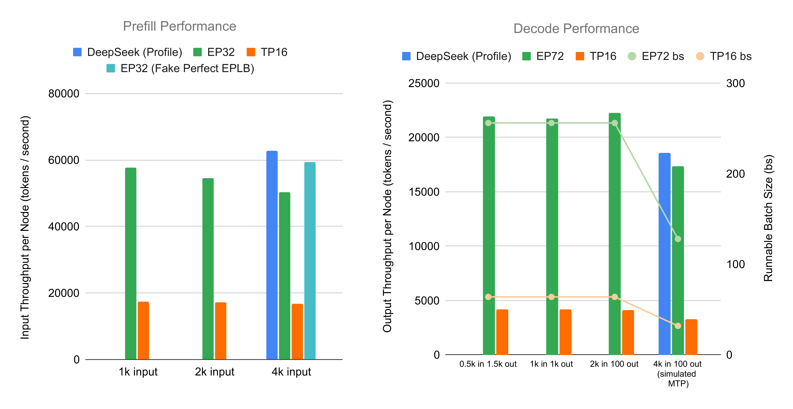

### Profile 결과

이 절에서는 실험 설정을 DeepSeek의 production 환경에 최대한 가깝게 맞춰서 SGLang의 성능을 DeepSeek 추론 시스템과 비교합니다. 전체 throughput과 kernel별 상세 분석을 DeepSeek의 블로그 및 공개 profile 데이터와 비교해 분석합니다.

##### 전체 Throughput

prefill의 경우 장치당 16,384 token, 입력 길이 4,096인 시나리오를 테스트했습니다. DeepSeek의 expert 분포가 불확실하므로 두 가지 경우를 평가했습니다. 하나는 기본 expert 분포이고, 다른 하나는 성능 상한으로서의 시뮬레이션된 완벽한 EPLB(group-limited routing 의미론을 따르는 무작위 expert 선택)입니다.

결과는 다음과 같습니다.

|  | DeepSeek Blog (cache hit 제외) | DeepSeek Profile | SGLang (기본) | SGLang + 시뮬레이션된 완벽한 EPLB |
|----|----|----|----|----|
| Batch Size | N/A | 16,384 | 16,384 | 16,384 |
| 입력 길이 | N/A | 4,096 | 4,096 | 4,096 |
| Throughput (node당) | 32,206 | 62,713 | 50,302 | 59,337 |

DeepSeek의 profile은 production 환경의 약 두 배에 해당하는 throughput을 보고합니다. 기본 expert 불균형 상태의 SGLang은 DeepSeek profile보다 20% 느리고, 시뮬레이션된 완벽한 EPLB의 경우 그 차이가 6%로 좁혀집니다.

decode의 결과는 아래와 같습니다.

|  | DeepSeek Blog | DeepSeek Profile | SGLang (기본) | SGLang + 시뮬레이션된 MTP (느린 Attention) |
|----|----|----|----|----|
| Batch Size | N/A | 128 | 256 | 128 |
| KV Cache 길이 | 4,989 | 4,096 | 2,000 | 4,000 |
| Node 수 | 18 | 16 | 9 | 9 |
| Throughput (node당) | 14,800 | 18,598 | 22,282 | 17,373 |

DeepSeek의 절반에 해당하는 node를 사용하면서도, 시뮬레이션된 MTP를 적용한 SGLang은 DeepSeek profile보다 아주 조금 느릴 뿐입니다. 더 높은 batch size 설정(256 시퀀스, 입력 길이 2,000)에서 SGLang은 node당 초당 22,282 token을 달성해 강한 확장성을 보여 줍니다.

##### 상세 분석

아래 그림은 prefill의 kernel 실행 시간을 분해해 보여 주며, 이론적 상한으로서 unit test 결과도 함께 포함합니다.

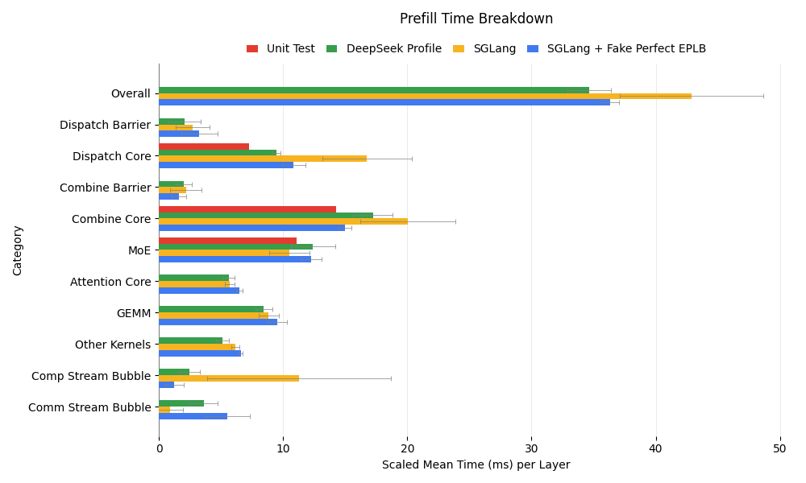

- **기본 EPLB**: 통신 kernel이 DeepSeek profile에 비해 실행 시간이 길고 분산도 큰데, 이는 expert 불균형이 더 크기 때문으로 보입니다. 이로 인해 계산 stream의 bubble이 길어져서 전체 성능이 떨어집니다.
- **시뮬레이션된 완벽한 EPLB**: 이 설정은 DeepSeek profile에 더 가깝게 맞춰지지만 여전히 차이가 남아 있으며, 이는 최적화 여지가 있음을 시사합니다.
- **Unit test와의 비교**: DeepSeek과 SGLang 모두 통신 시간이 unit test 결과보다 느린데, unit test 수준은 TBO를 끄면 달성할 수 있습니다. 이는 통신이 bottleneck인 경우에 가능한 최적화 방향을 보여 줍니다.

아래에서 볼 수 있듯이, SGLang의 decode kernel 분해 결과는 DeepSeek과 매우 비슷합니다.

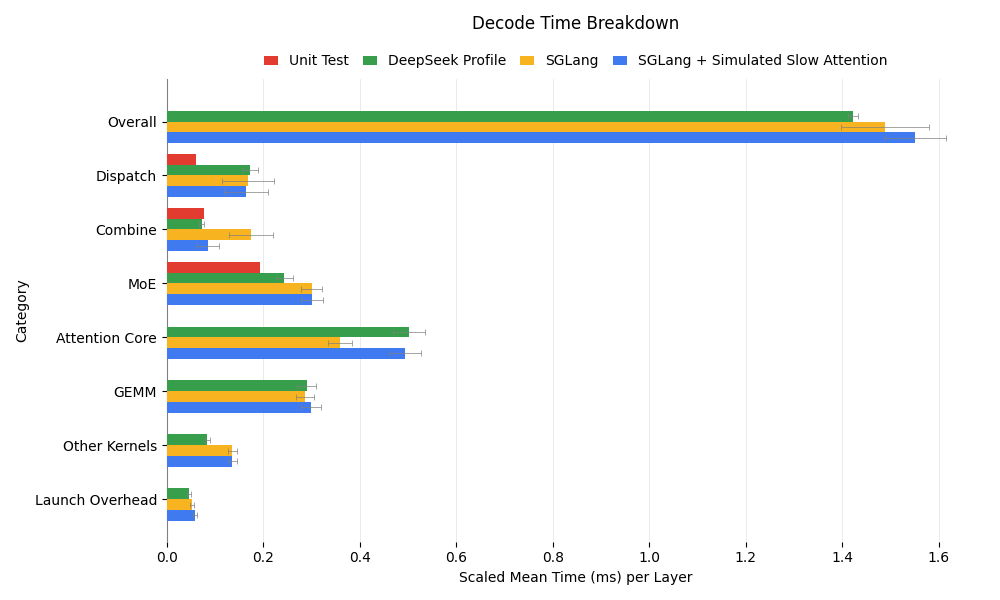

주요 관찰 사항은 다음과 같습니다.

- **Combine 시간 차이**: SGLang의 combine 연산은 DeepSeek보다 2배 느려 보이는데, 이는 attention 계산이 더 짧아서 통신 kernel이 busy-wait하기 때문입니다. 시뮬레이션된 느린 attention 실험에서는 combine 시간이 DeepSeek과 일치해서 이 가설이 확인되었습니다.
- **MoE 성능**: SGLang의 MoE kernel은 25% 느린데, 이는 DeepSeek의 18개 node(우리는 9개)가 expert를 더 효율적으로 분산시켜서 GEMM 연산의 메모리 접근 overhead를 줄이기 때문일 수 있습니다.
- **Dispatch 최적화 여지**: DeepSeek과 SGLang 모두 layer당 약 0.17ms의 dispatch 시간을 보이지만, DeepEP를 사용한 unit test에서는 SM을 점유하는 시간이 0.06ms까지 가능하다는 점이 드러났습니다. 현재 dispatch는 데이터를 기다리는 busy-wait에 상당한 시간을 씁니다. send/receive 연산 사이에 느린 dummy kernel을 삽입하면 dispatch 시간이 0.09ms로 줄어들며, unit test 데이터를 사용한 in-flight duration 분석은 추가 개선이 가능함을 시사합니다.

"Other Kernels"의 kernel fusion을 중심으로 소소한 개선 여지가 남아 있기는 하지만, SGLang의 decode 성능은 대체로 DeepSeek과 비슷한 수준이며 다음 초점은 prefill 최적화입니다.

### Ablation 연구: Two-batch Overlap

##### Batch Size와 Attention 시간의 영향

이 절에서는 다양한 batch size와 시뮬레이션된 MTP 시나리오에 걸쳐 TBO 성능을 조사합니다.

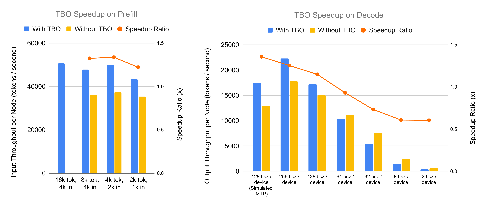

throughput 비교와 메모리 사용량 최적화에서 알 수 있듯이, TBO는 prefill 단계에서 두 가지 중요한 이점을 제공합니다.

- **더 큰 Batch Size 지원**: 기본 구성에서는 각 장치가 최대 8,192 token까지 처리할 수 있고 16,384 token에서는 out-of-memory(OOM) 오류가 발생합니다. TBO는 입력 token의 메모리 사용을 최적화해 이를 완화하며, 장치당 16,384 token에 이르는 batch로 추론할 수 있게 합니다. 다른 모든 구성을 최적으로 맞춘 상태에서 TBO 플래그만 비교하면 성능이 40.5% 더 향상됩니다.
- **Throughput 향상**: 계산(예: attention과 MLP 단계)과 통신(예: DeepEP Combine과 Dispatch)을 겹치게 함으로써, TBO는 장치당 동일한 token 수를 처리할 때에도 기본 설정 대비 27%에서 35%의 throughput 향상을 달성합니다.

decode 단계에서 TBO의 효과는 시나리오에 따라 다르며, 성능은 batch size와 attention 처리 시간에 좌우됩니다.

- **실제 테스트 사례**: 실제 시나리오에서의 가속은 batch size가 64에서 128 token 사이의 어떤 임계값을 넘는지에 달려 있습니다. 그 아래에서는 작은 decode batch size가 kernel 효율을 떨어뜨리기 때문에 TBO의 이득이 미미하거나 오히려 손해입니다(예: 장치당 32 token에서 -27%). 가속은 256 token에서 25.5%에 도달하며, 이때 성능은 초당 22,310 token입니다.
- **시뮬레이션된 MTP 시나리오**: TBO는 decode step당 256 token을 생성하기 위해 128개 request를 처리하는 시뮬레이션 MTP 사례에서 가장 큰 가속을 제공합니다. 이는 attention 처리 시간이 길어져서 계산(예: DP Attention layer)이 DeepEP 통신 overhead(예: combine과 dispatch 단계)와 잘 맞물리기 때문입니다. 평가 결과 장치당 128 시퀀스에서 35% 가속을 보였으며, throughput은 TBO 없이 초당 12,929 token인 것에 비해 초당 17,552 token이었습니다.

##### 상세 분석

우리는 세 가지 prefill 시나리오를 평가했습니다. batch당 16k token의 TBO, 8k token의 TBO, 그리고 8k token의 no-TBO입니다. 아래 그림에서 핵심적인 내용을 알 수 있습니다.

- **TBO 효율**: 8k 사례들을 비교하면, 예상대로 TBO가 계산과 통신을 겹치게 해서 전체 효율을 높입니다.
- **Batch Size의 영향**: TBO에서 batch size를 16k에서 8k로 줄이면 약간 느려지는데, 이는 batch가 작아질수록 kernel 효율이 떨어지는 것을 반영합니다.
- **Kernel 성능**: 흥미롭게도 no-TBO 8k 사례는 kernel당 속도에서 TBO 16k 사례보다 우수한데, 두 경우 모두 kernel 입장에서는 실질적인 batch size가 8k로 같습니다. 이는 TBO로 인해 사용 가능한 streaming multiprocessor(SM)가 줄어들었거나, 겹침 중에 noisy neighbor 효과가 발생했거나, 계산과 통신 kernel 사이의 비호환성 때문일 수 있습니다. 이러한 발견은 SGLang의 향후 최적화 방향을 시사합니다.

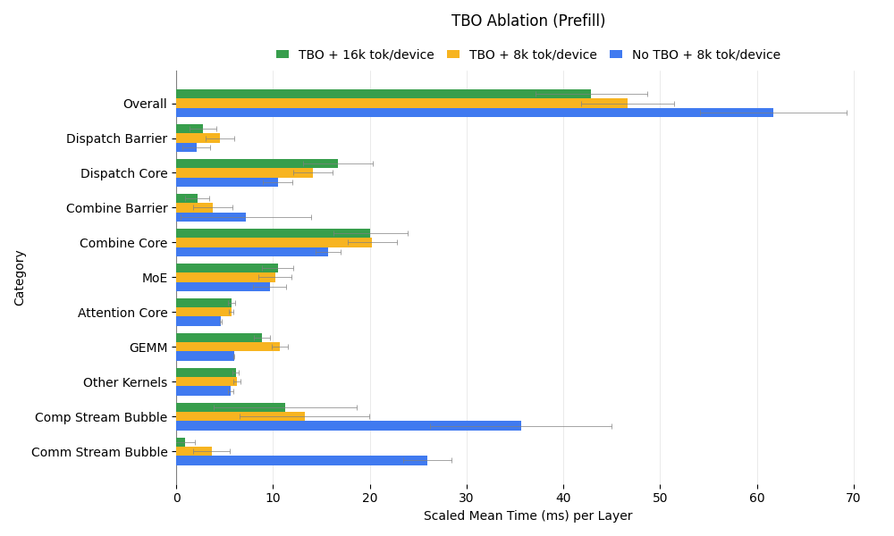

decode 단계에 대해서는 세 가지 구성을 분석했습니다. batch size 256의 TBO, 256의 no-TBO, 그리고 128의 no-TBO입니다. 시간 분해 결과는 아래와 같습니다.

- **TBO 대 No-TBO (Batch Size 256)**: TBO가 없으면 겹침이 없어서 통신 시간이 크게 늘어납니다. 하지만 계산 kernel, 특히 GEMM은 실질적인 batch size가 커지는 이점을 얻어서 더 빠르게 실행됩니다.
- **TBO (256) 대 No-TBO (128)**: kernel 입장에서 batch size가 같은 경우를 비교하면, no-TBO 설정에서는 겹치지 않은 통신만 느려지고 계산은 그대로입니다. prefill과 달리 decode 통신 kernel은 SM을 완전히 사용하거나(송수신 중) 전혀 사용하지 않아서(inflight 대기 중), 계산 kernel과 자원 경합을 일으키지 않습니다.

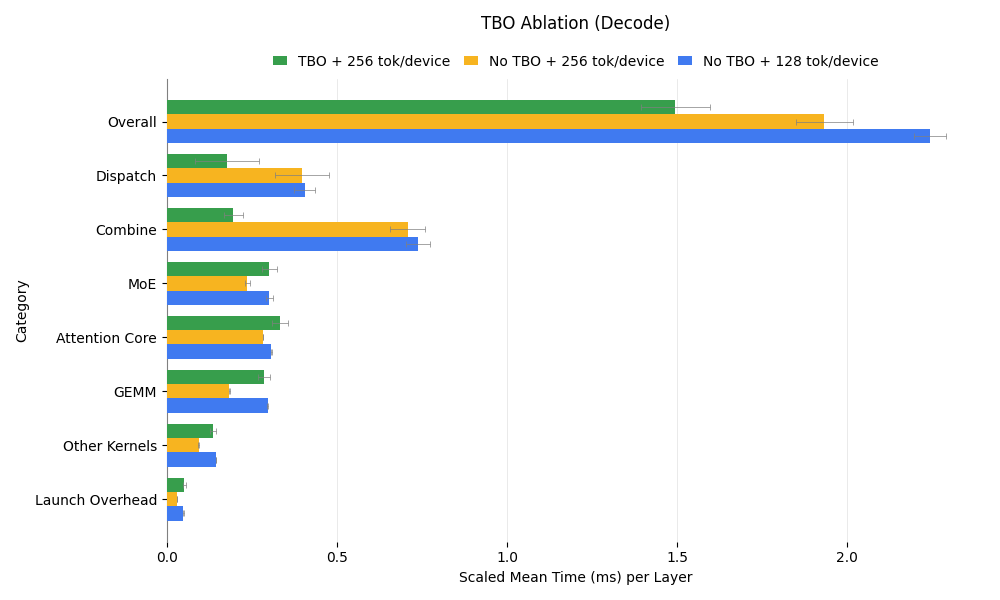

### Ablation 연구: EPLB

이 절에서는 전체 throughput 분석과 상세한 사례 연구를 통해 EPLB가 시스템 성능에 미치는 영향을 평가합니다. EPLB는 workload 분포와 production 환경의 분포 변화에 민감하므로, production 데이터가 필요한 실제 성능보다는 정성적이고 일반화 가능한 통찰에 초점을 맞춥니다.

##### 전체 결과

아래 그림은 대규모 환경에서 EPLB가 throughput에 미치는 영향을 보여 줍니다. EPLB는 예상대로 prefill에서 1.49배, decode에서 2.54배라는 상당한 가속을 제공하는데, 이는 GPU 사이의 workload 불균형을 완화하는 능력 덕분입니다. rank 수가 늘어날수록 불균형이 커지며, EPLB는 우리의 대규모 실험에서 이를 효과적으로 해결해 눈에 띄는 throughput 향상을 가져옵니다.

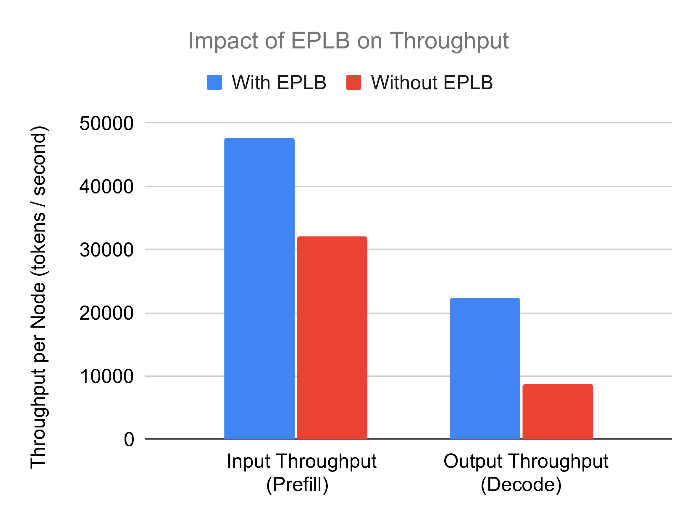

##### 사례 연구: Workload 불균형과 전체 Throughput

workload 불균형과 throughput 사이의 관계를 알아보기 위해, 입력 token 1800개, 출력 token 100개, batch size 256으로 decode 실험을 진행하는 사례 연구를 수행했습니다. throughput과 balancedness(expert 사이의 평균 token 수를 최대 token 수로 나눈 값)를 decoding step에 대해 그렸습니다.

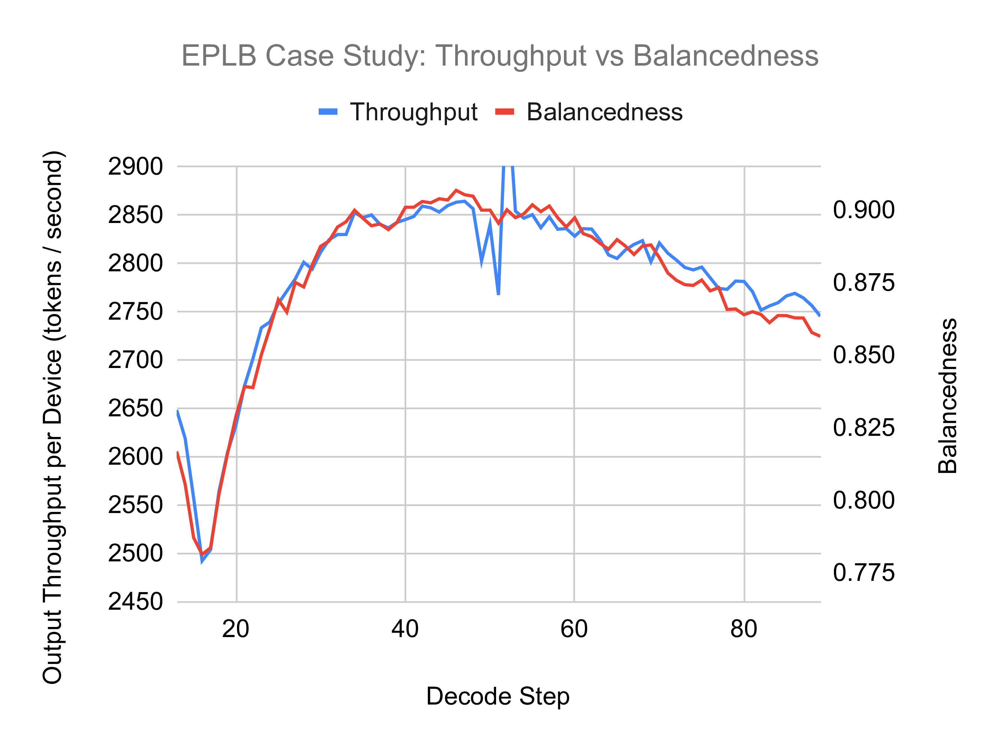

결과는 balancedness와 throughput 사이에 강한 상관관계가 있음을 보여 주며, 최적의 성능을 위해 높은 balancedness를 유지하는 것이 중요하다는 점을 강조합니다.

##### 사례 연구: Expert 분포 통계

다음 그림은 prefill과 decode 샘플 데이터에 대한 expert 분포 통계를 보여 줍니다.

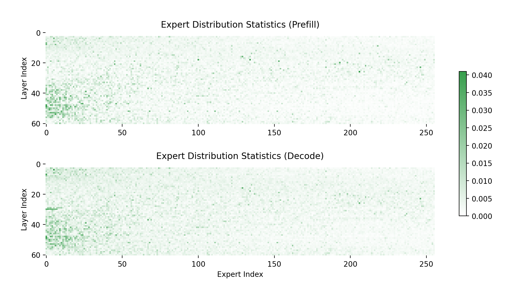

주요 관찰 사항은 다음과 같습니다.

- **Expert 사용의 불균형**: 대부분의 expert는 거의 쓰이지 않는 반면 소수의 expert가 집중적으로 사용되며, 이는 MoE 모델에 내재된 불균형을 보여 줍니다.
- **Prefill과 Decode의 차이**: prefill과 decode의 분포는 비슷한 면도 있지만 눈에 띄는 차이도 존재합니다. 이는 각 단계에 서로 다른 expert 배치를 적용해 성능을 최적화할 수 있게 하는 PD 분해의 타당성을 뒷받침합니다.

이러한 발견은 workload 불균형을 해결하는 데 있어 EPLB의 역할과, 단계별 요구에 맞춰 expert 배치를 조정하는 것의 가치를 보여 줍니다.

## 도구 모음

### Disposable Tensor

PyTorch에서 메모리 관리는 객체 참조가 계속 남아 있기 때문에 까다로울 수 있으며, CUDA 메모리가 희소한 자원인 GPU 집약적 workflow에서는 특히 그렇습니다. 다음 예시를 생각해 봅시다.

``` python
def ffn(hidden_state: torch.Tensor, linear1: nn.Linear, linear2: nn.Linear):
    intermediate_state = linear1(hidden_state)
    del hidden_state  # 메모리를 해제하려 하지만, 외부 참조 때문에 효과가 없음
    return linear2(nn.ReLU(intermediate_state))

hidden_state = ffn(hidden_state, linear1, linear2)
```

이 코드에서 `del hidden_state`는 `intermediate_state`를 계산한 뒤 `hidden_state`가 차지한 메모리를 해제하려는 의도입니다. 하지만 `hidden_state`는 함수 바깥에서 여전히 참조되고 있으므로 `del` 연산은 아무런 효과가 없습니다. 이는 peak memory 사용량을 늘려서 성능 저하나 out-of-memory 오류를 일으킬 위험이 있습니다.

SGLang은 DisposableTensor 클래스로 이를 해결합니다. 이 클래스는 `torch.Tensor`의 하위 클래스로, tensor의 메모리를 명시적으로 즉시 해제하는 dispose() 메서드를 도입해 Python의 참조 카운팅 한계를 우회합니다. 동작 방식은 다음과 같습니다.

``` python
def ffn(hidden_state: torch.Tensor, linear1: nn.Linear, linear2: nn.Linear):
    intermediate_state = linear1(hidden_state)
    hidden_state.dispose()  # CUDA 메모리를 즉시 해제
    return linear2(nn.ReLU(intermediate_state))

# tensor를 DisposableTensor로 감쌈
hidden_state = DisposableTensor(hidden_state)
hidden_state = ffn(hidden_state, linear1, linear2)
```

`hidden_state`를 `DisposableTensor`로 감싸고 더 이상 필요하지 않을 때 `dispose()`를 호출하면 CUDA 메모리가 바로 해제됩니다. 이로써 tensor가 계산에서 맡은 역할이 끝나는 즉시 메모리가 반환되어 peak memory 사용량이 줄고 전체 효율이 높아집니다.

### Expert Workload 추출과 시뮬레이션

SGLang에는 MoE 모델의 expert workload 분포를 분석하고 시뮬레이션하는 도구 모음도 포함되어 있습니다. 이 기능으로 사용자는 다음을 할 수 있습니다.

- **Expert workload 통계 덤프**: 누적 통계나 batch별 workload 데이터를 추출합니다. 누적 통계는 실시간 최적화를 위한 EPLB manager를 지원하고, batch별 데이터는 분석과 시뮬레이션을 위한 세밀한 통찰을 제공합니다.
- **Expert 활용 시뮬레이션**: 값비싼 하드웨어나 반복적인 시도 없이 다양한 구성에서 expert 균형을 모델링합니다. 예를 들어 사용자는 적당한 규모의 환경(예: 2x8xH100 또는 8xH200)에서 workload 데이터를 수집한 뒤, 대규모 22-node 배포의 성능을 시뮬레이션할 수 있습니다.

이 시뮬레이션 기능을 통해 사용자는 재균형 주기, node 수, batch size 같은 요소가 시스템 성능에 어떤 영향을 주는지 평가할 수 있습니다. 규모를 키우기 전에 구성을 세밀하게 조정할 수 있는 비용 효율적인 방법입니다.

## 한계와 향후 과제

DeepSeek-V3 추론을 위한 우리의 SGLang 구현이 상당한 throughput 향상을 보여 주기는 했지만, 몇 가지 한계와 개선이 필요한 영역이 남아 있습니다.

1. **Latency 최적화**: 현재는 throughput에 초점을 맞추고 있어서 Time to First Token(TTFT)은 2~5초, Inter-Token Latency(ITL)는 약 100ms 수준이며, 실시간 사용 사례를 위해서는 추가 최적화가 필요합니다.
2. **시퀀스 길이 제약**: 96개 GPU를 사용하기 때문에 짧은 시퀀스로 제한됩니다. GPU 자원을 늘리면 특정 애플리케이션에 필수적인 더 긴 시퀀스를 지원할 수 있습니다.
3. **Multi-Token Prediction(MTP) 통합**: SGLang은 MTP를 지원하지만 DP attention과 완전히 통합되어 있지는 않아서, 혼합 parallelism 구성에서 효율이 떨어집니다.
4. **EPLB 분포**: 이 글의 실험은 Expert Parallelism Load Balancer(EPLB)에 분포 내 데이터를 사용하는데, 이는 실제 환경의 변동을 반영하지 못할 수 있습니다. 향후에는 분포 변화가 있을 때의 성능을 실험해야 합니다.
5. **유연한 Tensor Parallelism(TP) 크기**: DeepSeek-V3에서 dense FFN의 메모리 최적 TP size는 작지만 1보다는 큽니다. 현재 SGLang은 순수 TP 또는 순수 DP만 지원해서 메모리 사용이 최적이 아닙니다. 유연한 TP 옵션이 필요합니다.
6. **Blackwell 지원**: 현재 우리 구현은 NVIDIA Hopper 아키텍처만 지원합니다. 차세대 Blackwell 아키텍처로 호환성을 넓히는 작업을 적극적으로 진행하고 있습니다. 이 개발을 지원하거나 후원하는 데 관심이 있다면 <lmsys.org@gmail.com>으로 연락해 주시기 바랍니다.

## 결론

PD 분해, EP, 그리고 세심하게 설계한 parallelism을 활용해, 우리는 SGLang에서 DeepSeek의 추론 프레임워크를 뛰어난 성능으로 재현했습니다. 초당 52.3k input token과 초당 22.3k output token을 달성한 우리의 오픈소스 작업은 대규모 LLM 추론에서 SGLang의 역량을 보여 줍니다. 커뮤니티가 이 작업을 살펴보고, 재현하고, 확장해서 효율적인 AI 배포의 한계를 함께 밀어붙이기를 바랍니다.

## 감사의 말

다음 팀과 협력자 여러분께 진심으로 감사드립니다.

- **SGLang Core Team and Community Contributors** — Jingyi Chen, Cheng Wan, Liangsheng Yin, Baizhou Zhang, Ke Bao, Jiexin Liang, Xiaoyu Zhang, Yanbo Yang, Fan Yin, Chao Wang, Laixin Xie, Runkai Tao, Yuhong Guo, Kaihong Zhang, Lei Yu, Yu-Hsuan Tseng, Qilin Tian, Peng Zhang, Yi Zhang, Yineng Zhang, Byron Hsu 외 여러분.
- **[Atlas Cloud](https://www.atlascloud.ai) Team** — Jerry Tang, Wei Xu, Simon Xue, Harry He, Eva Ma 외 동료 여러분 — 96개 장치의 NVIDIA H100 클러스터를 제공하고 신속한 엔지니어링 지원을 해 주셨습니다.
- **NVIDIA Solution Architect Team** — Xuting Zhou, Jinyan Chen 외 동료 여러분 — expert parallelism의 매끄러운 통합 작업을 해 주셨습니다.
- **NVIDIA Enterprise Product Team** — Trevor Morris, Elfie Guo, Kaixi Hou, Kushan Ahmadian 외 동료 여러분 — DeepSeek R1 kernel을 최적화해 주셨습니다.
- **LinkedIn Team** — Biao He, Qingquan Song, Chunan Zeng, Yun Dai, Yubo Wang 외 동료 여러분 — Flash-Attention 3 backend를 최적화해 주셨습니다.
- **Mooncake Team** — Shangming Cai, Teng Ma, Mingxing Zhang 외 동료 여러분 — SGLang의 PD 분해에 협력해 주셨습니다.
- **FlashInfer Team** — Zihao Ye, Yong Wu, Yaxing Cai — DeepSeek R1 kernel을 추가로 최적화해 주셨습니다.
- **Dynamo Team** — Kyle Kranen, Vikram Sharma Mailthody 외 동료 여러분 — SGLang의 PD 분해를 추가로 지원해 주셨습니다.

여러분의 소중한 지원과 협력에 감사드립니다.

## 부록

**관련 PR**: [\#1970](https://github.com/sgl-project/sglang/pull/1970) [\#2925](https://github.com/sgl-project/sglang/pull/2925) [\#4068](https://github.com/sgl-project/sglang/pull/4068) [\#4165](https://github.com/sgl-project/sglang/pull/4165) [\#4232](https://github.com/sgl-project/sglang/pull/4232) [\#4390](https://github.com/sgl-project/sglang/pull/4390) [\#4435](https://github.com/sgl-project/sglang/pull/4435) [\#4521](https://github.com/sgl-project/sglang/pull/4521) [\#4654](https://github.com/sgl-project/sglang/pull/4654) [\#4767](https://github.com/sgl-project/sglang/pull/4767) [\#4770](https://github.com/sgl-project/sglang/pull/4770) [\#4836](https://github.com/sgl-project/sglang/pull/4836) [\#4880](https://github.com/sgl-project/sglang/pull/4880) [\#4957](https://github.com/sgl-project/sglang/pull/4957) [\#5068](https://github.com/sgl-project/sglang/pull/5068) [\#5085](https://github.com/sgl-project/sglang/pull/5085) [\#5295](https://github.com/sgl-project/sglang/pull/5295) [\#5415](https://github.com/sgl-project/sglang/pull/5415) [\#5432](https://github.com/sgl-project/sglang/pull/5432) [\#5435](https://github.com/sgl-project/sglang/pull/5435) [\#5530](https://github.com/sgl-project/sglang/pull/5530) [\#5558](https://github.com/sgl-project/sglang/pull/5558) [\#5561](https://github.com/sgl-project/sglang/pull/5561) [\#5626](https://github.com/sgl-project/sglang/pull/5626) [\#5657](https://github.com/sgl-project/sglang/pull/5657) [\#5805](https://github.com/sgl-project/sglang/pull/5805) [\#5819](https://github.com/sgl-project/sglang/pull/5819) [\#5890](https://github.com/sgl-project/sglang/pull/5890) [DeepEP#142](https://github.com/deepseek-ai/DeepEP/pull/142)
