> 우리는 13x8 H800 DGX SuperPod node를 사용하는 disaggregated LLM inference architecture에서, service level objectives(SLOs) 제약, 즉 TTFT < 2s, ITL < 50ms 아래의 최대 prefill 및 decode throughput(goodput)[^6]을 평가했다. system은 여러 server-side disaggregated configuration, 예를 들어 (P3x3)D4, 즉 P3 group 3개와 D4 group 1개, P4D9, P4D6, P2D4, P4D2, P2D2에서 약 130만 tokens/sec의 input throughput과 2만 tokens/sec의 최대 output throughput에 도달했다. 대부분의 경우 prefill stage가 performance bottleneck을 구성해 더 높은 TTFT를 유발했다. DeepSeek workload에서 도출한 decode node와 prefill node의 비율(1.4)[^9]을 참고해 server-side goodput을 높이기 위해 더 큰 prefill node group, 예를 들어 P=3, 그리고 더 작은 tensor parallel(TP) size, TP=24를 시도했다. performance evaluation은 SGLang의 bench_one_batch_server.py benchmark script[^1]로 URL API interface의 responsiveness를 테스트했고, 이후 genai-bench[^10]로 서로 다른 concurrency에서 output throughput을 더 신뢰성 있게 측정했다. client side에서는 evalscope[^2]를 통해 OpenAI interface compatible API(API key verification 사용)를 online observation 및 evaluation했다. 작은 input request scenario에서 system은 concurrency 50일 때 2.5만 toks/sec output throughput을 유지할 수 있고, concurrency 150일 때 5.5만 toks/sec에 도달할 수 있다. batch size x input length가 어떤 threshold를 넘으면, 예를 들어 KV cache transfer limit 때문에[^7], TTFT가 급격히 상승하는 것을 관찰했다. 또한 더 높은 goodput을 얻기 위해서는 input sequence length(ISL)와 output sequence length(OSL)를 특정 비율로 유지하는 것을 권장하며, 최적은 4:1이다. 따라서 high throughput을 달성하기 위해 batch size와 sequence length를 키우면 total latency는 대개 TTFT가 지배한다. 높은 GPU utilization과 goodput을 유지하려면 concurrency를 128 이하로 제어해 TTFT가 급격히 상승하는 것을 피하는 것이 좋다. 이런 balance strategy는 H800 DGX SuperPod system에서 특히 효과적이다. 지나치게 높은 TTFT는 output throughput을 불안정하게 만들고 server-side goodput performance를 크게 낮춘다.


author: LEI WANG]https://github.com/yiakwy-xpu-ml-framework-team) (yiakwang@ust.hk), Yujie Pu (yujiepu@ust.hk), Andy Guo (guozhenhua@hkgai.org), Yi Chao (chao.yi@hkgai.org), Yiwen Wang (yepmanwong@hkgai.org), Xue Wei (weixue@ust.hk)
editor: GiantPandaCV


## motivation and background

Prefill-Decode aggregated LLM inference architecture에서 vLLM은 2024년 2분기(https://github.com/vllm-project/vllm/issues/3861) 이전에 prefill token과 decode token을 interleaved scheduling하는 방식을 구현했고, 이후 continuous scheduling mechanism으로 개선하여 전체 GPU utilization을 높였다[^3].


하지만 prefill stage와 decode stage는 computation characteristic이 크게 다르다. unchunked complete prefill token, 즉 new request에서 온 token을 running request의 decode token과 함께 계속 batching하면 decode latency가 크게 증가한다. 이는 큰 inter-token latency(ITL)를 유발하고, system responsiveness를 낮춘다.


이 문제를 해결하기 위해 [PR#3130](https://github.com/vllm-project/vllm/issues/3130)에서 chunk-prefill feature[^4]가 도입되었다. 이를 통해 new request의 prefill token이 chunk된 뒤 running request의 decode token과 함께 batching될 수 있다. 이 feature는 동종 deployment system에서 그림처럼 ITL을 개선하고 GPU utilization을 높이는 데 도움이 된다.

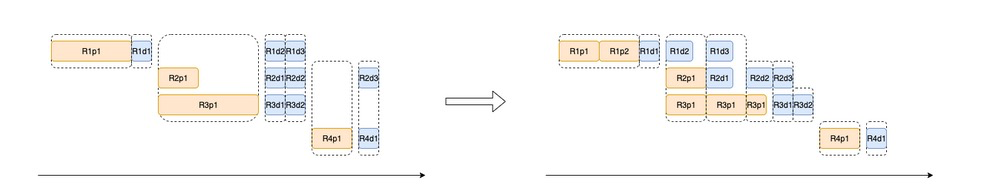


하지만 chunked-prefill은 prefill과 decode 두 stage의 computation characteristic에 있는 본질적 차이를 진정으로 고려하지 않는다.


decode process는 보통 CUDA Graph를 통해 여러 round의 generation computation을 capture하여 efficiency를 높인다. 따라서 decode task가 chunked prefill과 함께 batching되면 CUDA Graph를 사용할 수 없고, 오히려 additional overhead를 도입한다.


또한 DistServe[^4][^5][^6]가 13B dense model에서 관찰한 결과와, 우리가 671B MoE model experiment에서 검증한 것처럼, colocated service system에서 `batch_size x output_length`가 어떤 threshold를 넘으면, 예를 들어 128(bs) x 128(OSL), prefill computation cost가 크게 상승하며 chunked prefill split size와는 무관하다.


따라서 literature [4]에서는 disaggregated serving architecture를 제안했다. DeepSeek은 이를 바탕으로 DeepEP와 MLA technique으로 latency를 낮추고 throughput을 높였으며, 빠르게 SGLang에 통합했다. P4D18 deployment unit에서 system은 SLOs를 만족하면서 놀라운 73.7k toks/node/sec(input)와 14.8k toks/node/sec(output)에 도달했다.


하지만 많은 사람이 `P` node 수가 `D` node 수를 넘으면 안 된다고 오해한다. 실제로 DeepSeek은 blog에서 `P`와 `D` node의 실제 비율을 공개하지 않았다[^8].


공개된 data, 즉 daily service total 608B input token과 168B output token을 prefill/decode token processing speed와 결합하면, 전체 prefill node 수를 다음처럼 추산할 수 있다.

$$955 = 608 * 1e^{10} / (24 * 3600 * 73.7 * 1e^3)$$

전체 decode node 수는 다음과 같다.

$$1314 = 168 * 1e^{10} / (24 * 3600 * 14.8 * 1e^3)$$

이로부터 계산한 Decode/Prefill node ratio는 약 `1.4 = 1314 / 955`이고, P4D18의 group configuration ratio는 `3.27 : 1 = (955 / 4) : (1314 / 18)`이다. 따라서 `(P3x2)D4`, `(P3x3)D4` and `(P4x2)D4`가 test configuration candidate가 된다. H800 13x8 DGX SuperPod P/D disaggregated architecture의 경우, 우리의 experiment analysis에 따르면 Prefill node가 system bottleneck이 되기 더 쉽다. 따라서 TP size는 최대 4로 제한한다. 더 큰 TP size는 inference speed를 낮추고, 너무 작은 TP size는 KV cache reserved space 부족을 유발하기 때문이다.


따라서 H800 13x8 DGX SuperPod에서는 다음 P/D disaggregated configuration을 권장한다.

```
1. (P3x2)D4

2. (P3x3)D4

3. (P4x2)D4

4. P4D6
```


prefill이 system bottleneck이 될 가능성이 더 높다는 분석 때문에, TP size를 4로 제한한다. 더 큰 TP size는 inference speed를 낮추고, 더 작은 TP는 KV cache reserved space 부족을 유발할 수 있다.


우리 test에서 (P3x3)D4와 P4D6 configuration은 TTFT 측면에서 P9D4보다 분명히 좋았다. 주된 이유는 더 작은 TP setting을 사용하면서 prefill computation capability가 더 강하기 때문이다.

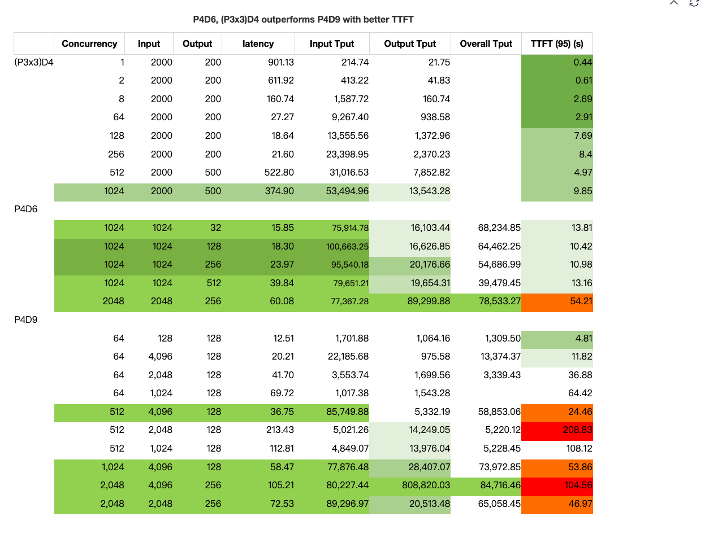

우리는 SGLang v0.4.8에서, 직접 fine-tuning한 DeepSeek V3(0324) 계열 model을 사용해 aggregated inference deployment와 disaggregated inference deployment experiment를 수행하고, 더 큰 scale에서 효과를 검증했다.


주어진 input sequence length(in_seq_len: 128 ~ 4096)와 더 짧은 output sequence length(out_seq_len: 1 ~ 256)에 대해 서로 다른 batch size(bs)를 tuning하여 다음 결론을 얻었다.


- aggregated LLM inference architecture에서는 Prefill goodput의 maximum이 보통 특정 `batch_size (bs) x output_length (out_seq_len)`에서 나타난다.

- disaggregated LLM inference architecture에서는 Prefill goodput의 maximum이 특정 `batch_size (bs) x input_length (in_seq_len)`에서 나타난다.

- Prefill이 system bottleneck이 되기 더 쉽다. 따라서 더 많은 prefill node를 사용하는 것을 권장한다. 아래 test data에 따르면 더 많은 Prefill group, 즉 `(P3)x3`을 사용할 수 있으며, Prefill `WORLD_SIZE`와 `Decode WORLD_SIZE` ratio는 0.75(P3D4) ~ 1.0(PXDX) 사이다.


DistServe[^4][^5][^6]에서 13B dense model을 deploy한 경우와 달리, `671B` large-scale MoE model, 즉 `256` experts 중 8개를 enable하고 추가로 `P * 8` redundant experts를 설정한 경우, prefill goodput은 `output_length x batch_size` product size의 영향을 받으며 maximum에 도달하기 전까지 계속 하락한다. detailed statistical analysis는 appendix를 참고하라.


#### `H800 x 2` test: Prefill과 Decode의 colocated deployment architecture

`H800 x 2 (DGX SuperPod)` test configuration에서는 각 node가 InfiniBand로 interconnect되어 있으며, input throughput의 maximum은 약 20k toks/sec다.


batch size와 output length의 product가 128(bs)x128(OSL)을 넘으면 input throughput이 크게 떨어지고, TTFT(time to first token)가 갑작스럽고 급격히 상승하는 것을 관찰했다. 반면 output throughput은 batch size가 증가함에 따라 점진적으로 상승하고 결국 peak에 도달한다.

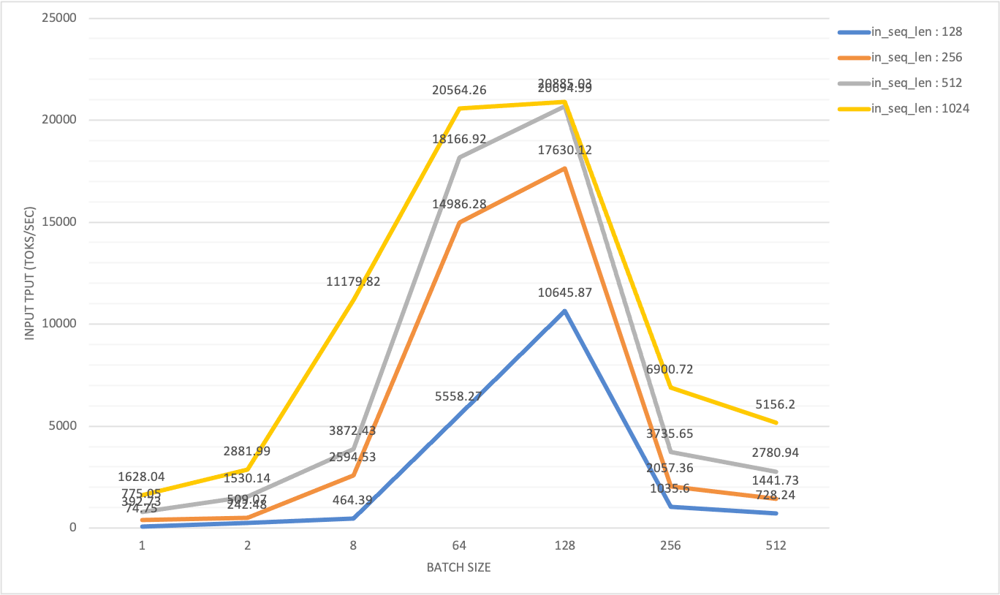

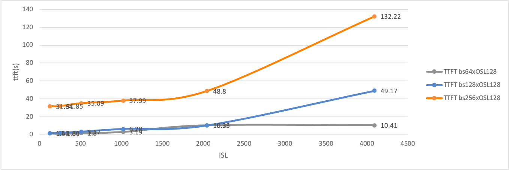


이 모든 statistics는 prefill과 decode의 maximum throughput에 각각 도달하기 위해 필요한 workload pattern이 다르다는 것을 보여준다.


직관적으로 disaggregated deployment architecture에서, Prefill node의 effective throughput(goodput)은 적절한 chunk-prefill size와 TP(tensor parallel) scale을 설정한 뒤에도 특정 batch size에 의해 제한된다. KV cache transfer speed가 bottleneck을 갖기 때문이다[^7].

#### SGLang P/D disaggregation은 어떻게 동작하는가

SGLang의 Loader Balancer service는 이제 multi-prefill node(Prefill, 약칭 P) configuration, 즉 여러 P node의 master address와 multi-decode node(Decode, 약칭 D) configuration, 즉 여러 D node의 master address를 지원한다.


```
# start_lb_service.sh
...
docker_args=$(echo -it --rm --privileged \
 --name $tag \
 --ulimit memlock=-1:-1 --net=host --cap-add=IPC_LOCK --ipc=host \
 --device=/dev/infiniband \
 -v $(readlink -f $SGLang):/workspace \
 -v $MODEL_DIR:/root/models \
 -v /etc/localtime:/etc/localtime:ro \
 -e LOG_DIR=$LOG_DIR \
 --workdir /workspace \
 --cpus=64 \
 --shm-size 32g \
 $IMG
)

# (P3x3)D4 setup
docker run --gpus all "${docker_args[@]}" python -m sglang.srt.disaggregation.mini_lb \
  --prefill "http://${prefill_group_0_master_addr}:${api_port}" \
            "http://${prefill_group_1_master_addr}:${api_port}" \
            "http://${prefill_group_2_master_addr}:${api_port}" \
  --decode "http://${decode_group_0_master_addr}:${api_port}" \
  --rust-lb
```

사용자는 TP(tensor parallel) scale도 조정할 수 있다. P node는 D node보다 더 작은 TP scale을 설정해 더 좋은 TTFT(time to first token)를 얻을 수 있기 때문이다.


현재 두 load balancer가 제공된다. RustLB와 legacy MiniLoadBalancer다. 둘은 같은 HTTP interface를 따르며, HTTP request를 각각 prefill server와 decode server로 redirect하는 데 사용된다.

```
# load balance API interface
INFO:     10.33.4.141:41296 - "GET /get_server_info HTTP/1.1" 200 OK
INFO:     10.33.4.141:41312 - "POST /flush_cache HTTP/1.1" 200 OK
INFO:     10.33.4.141:41328 - "POST /generate HTTP/1.1" 200 OK
```


internal implementation도 incoming request를 처리하는 방식이 동일하다.


```
# Rust : sgl-pdlb/src/lb_state.rs
    pub async fn generate(
        &self,
        api_path: &str,
        mut req: Box<dyn Bootstrap>,
    ) -> Result<HttpResponse, actix_web::Error> {
        let (prefill, decode) = self.strategy_lb.select_pair(&self.client).await;
        let stream = req.is_stream();
        req.add_bootstrap_info(&prefill)?;
        let json = serde_json::to_value(req)?;
        let prefill_task = self.route_one(&prefill, Method::POST, api_path, Some(&json), false);
        let decode_task = self.route_one(&decode, Method::POST, api_path, Some(&json), stream);
        let (_, decode_response) = tokio::join!(prefill_task, decode_task);
        decode_response?.into()
    }
```


SGLang load balancer의 문제는 한 pair의 prefill server와 decode server를 선택할 때 traffic이나 load 기반이 아니라는 점이다. 따라서 각 prefill server 사이의 load balancing을 보장할 수 없다.


request processing 중 prefill server는 KV cache generation을 완료하기 위해 항상 가장 먼저 result를 반환한다.


Dynamo workflow[^11]를 참고해, 이후 workflow optimization을 더 명확히 이해하기 위해 SGLang RustLB 기반 P/D architecture의 simplified flow chart를 초안으로 만들었다.

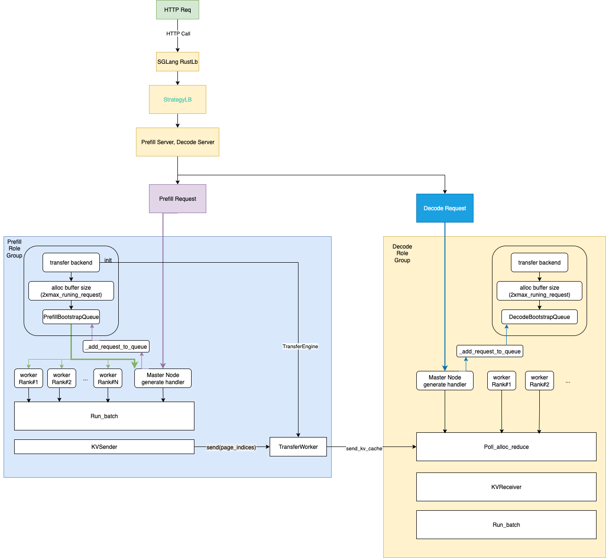


각 P/D process는 background thread 하나를 시작하고, permanent event loop를 실행한다. 이 loop는 request를 수집하고 input과 필요한 KV cache를 batch로 구성해 inference task 실행을 시작한다.

## test method

우리는 13대 H800 DGX SuperPod server에서 가능한 모든 P/D disaggregated deployment configuration을 systematic하게 조사했고, SGLang v0.4.8의 disaggregated deployment mode를 깊이 분석했다. 그리고 server side와 client side 두 관점에서 online P/D disaggregated inference evaluation을 수행했다.


test 준비 과정에서 hardware와 software environment를 최신 open-source community standard에 맞추고, SGLang team의 official guide[1]를 참고해 configuration file 준비를 완료했다.


| name                            | role           | example                                                                          |
| ------------------------------- | -------------- | -------------------------------------------------------------------------------- |
| EXPERT_DISTRIBUTION_PT_LOCATION | decode         | ./attachment_ep_statistics/decode_in1000out1000.json                             |
| EXPERT_DISTRIBUTION_PT_LOCATION | prefill        | ./attachment_ep_statistics/prefill_in1024.json                                   |
| DEEP_EP_CFG                     | prefill        | ./benchmark/kernels/deepep/deepep_nnodes_H800x4_tuned.json                       |


configuration file 준비를 완료하고 test script를 올바르게 설정한 뒤, CURL API를 통해 여러 batch의 query request를 보내 service를 warmup했다. SGLang event loop worker thread는 cold start 시 JIT kernel compile에 긴 시간이 필요하기 때문이다. service warmup이 완료되면 공식 test statistics collection을 시작할 수 있다.

#### hardware and software

이번 experiment에 사용한 H800 SuperPod hardware는 rack 단위로 organize되어 deploy되어 있다.

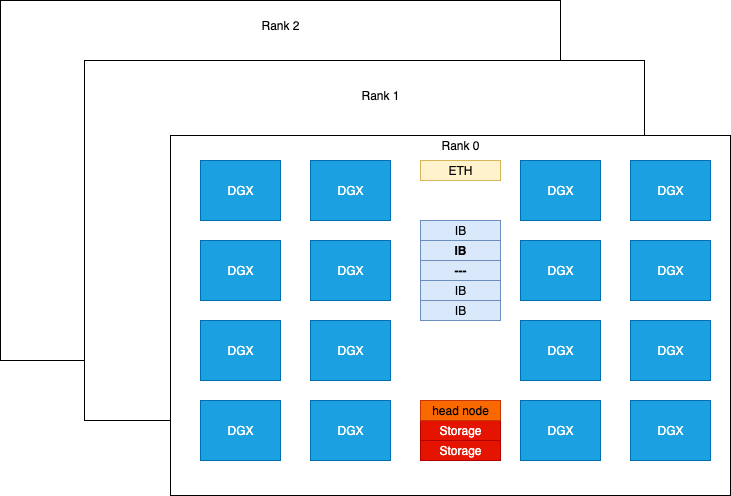


NVIDIA H800 DGX는 compute performance 측면에서 H100 DGX와 비슷하다. 유일한 차이는 FP64/FP32 data type processing capability가 더 약하고, NVLINK configuration 감소 때문에 communication bandwidth가 후자의 약 절반이라는 점이다. 각 H800 card는 Mellanox CX-7(MT2910) network card 하나와 연결되며, InfiniBand switch로 interconnect된다. peak bidirectional bandwidth는 50 GB/s에 도달할 수 있다.


single-node NCCL test에서 `nccl_all_reduce`의 bus bandwidth는 213 GB/s였다. dual-node test에서는 이 bandwidth가 171 GB/s였고, cross-rack test, 즉 모든 GPU가 같은 InfiniBand link를 통해 cross-rack으로 연결된 test에서는 bandwidth가 49 GB/s였다.


P/D disaggregated test에서는 대부분의 communication function이 `DeepEP`와 `NVSHMEM`으로 drive된다. DeepEP는 SGLang core team이 2025년 5월 `P/D` experiment를 수행한 이후 큰 변경이 있었다. 따라서 우리는 custom Docker environment에서 `DeepEP`를 scratch부터 build했다.


> Deepep : deep-ep==1.1.0+c50f3d6

현재는 Mooncake를 disaggregation backend로 선택했지만, future에는 다른 backend도 시도할 것이다.

```
# optional for disaggregation option
disaggregation_opt=" \
  $disaggregation_opt \
  --disaggregation-transfer-backend mooncake \
"
```

We require the latest transfer engine as it is 10x faster ( see PR#499(https://github.com/kvcache-ai/Mooncake/pull/499) and PR#7236(https://github.com/sgl-project/sglang/pull/7236) ) than that was used in May 2025.


> mooncake-transfer-engine==v0.3.4

DeepEP tuning은 우리가 수행한 test의 첫 번째 step이다. prefill node 수는 2, 3, 그리고 4다. 현재 SGLang v0.4.8 configuration에서는 3개 prefill node를 직접 사용하면 문제가 발생할 수 있다.


| Prefill GPU | dtype | dispatch (RDMA GB/s) | dispatch (NVL GB/s) | combine (RDMA GB/s) | combine (NVL GB/s) | loc                             |
| ----------- | ----- | -------------------- | ------------------- | ------------------- | ------------------ | ------------------------------- |
| 4           | bf16  | 60.58                | 121.63              | 56.72               | 113.88             | deepep_nnodes_H800x4_tuned.json |
| 2           | bf16  | 47.93                | 156.45              | 42.97               | 140.26             | deepep_nnodes_H800x2_tuned.json |


이번 experiment에서 DeepEP test는 `bf16` performance가 `OCP fp8e4m3`보다 훨씬 높다는 것을 보여주었다. 우리는 서로 다른 NCCL, NVSHMEM 환경 변수 조합을 시도했지만 libtorch compatibility 문제 때문에 소수의 조합만 test에 성공했다.


```
# env - nccl 2.23, nccl 2.27 symmetric memroy branch
export NCCL_IB_HCA=mlx5_0,mlx5_3,mlx5_4,mlx5_5,mlx5_6,mlx5_9,mlx5_10,mlx5_11

# traffic class for QoS tunning
# export NCCL_IB_TC=136
# service level that maps virtual lane
# export NCCL_IB_SL=5

export NCCL_IB_GID_INDEX=3

export NCCL_SOCKET_IFNAME=ibp24s0,ibp41s0f0,ibp64s0,ibp79s0,ibp94s0,ibp154s0,ibp170s0f0,ibp192s0
# export NCCL_DEBUG=DEBUG

# export NCCL_IB_QPS_PER_CONNECTION=8
# export NCCL_IB_SPLIT_DATA_ON_QPS=1
# export NCCL_MIN_NCHANNELS=4

# NOTE Torch 2.7 has issues to support commented options


# env - nvshmem
# export NVSHMEM_ENABLE_NIC_PE_MAPPING=1
# export NVSHMEM_HCA_LIST=$NCCL_IB_HCA

# export NVSHMEM_IB_GID_INDEX=3

# NOTE Torch 2.7 has issues to support commented options, see Appendix
```


successful tuning 후에는 다음 performance를 볼 수 있어야 한다.

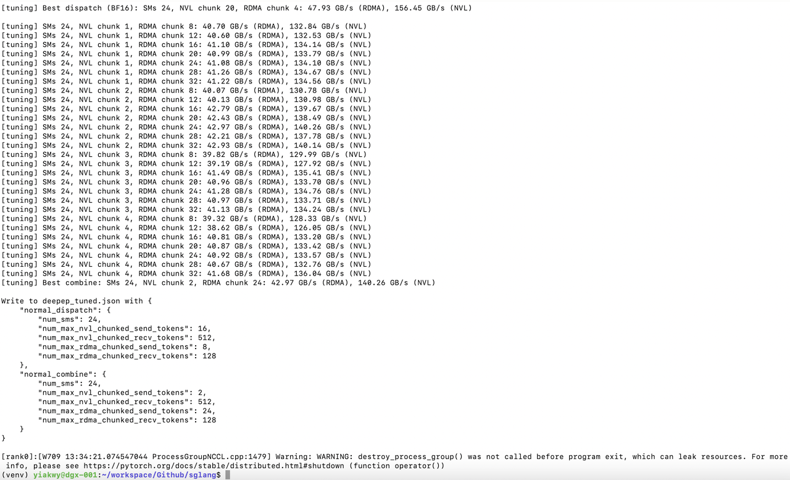

SGLang v0.4.8에서는 기본적으로 DeepGEMM이 enable되어 있지 않고, H800에서 실행되는 fused MoE Triton kernel에 대한 tuning configuration도 없다.


따라서 우리는 fused MoE Triton kernel을 fine-tuning하여 H800용 Triton kernel configuration을 생성했고, 최종적으로 DeepEP와 DeepGEMM의 JIT GEMM kernel을 enable하여 prefill을 가속했다.


H800 system memory limit 때문에 Prefill과 Decode의 deployment unit은 다음 option 중에서 선택해야 한다.


|                   | Deploy Unit | TP       | E(D)P    |
| ----------------- | ----------- | -------- | -------- |
| H100 / H800       | 2+X         | 16 + 8 X | 16 + 8 X |
| H200 / H20 / B200 | 2+Y         | 8 + 8 Y  | 8 + 8 Y  |


우리 test script에서는 configuration을 scaling config, model info, server info, basic config, disaggregation config, tuning parameters, environmental variables로 분류했다.

#### Common Basic Config

```
#### Scaling config

RANK=${RANK:-0}

WORLD_SIZE=${WORLD_SIZE:-2}

TP=${TP:-16} # 32

DP=${DP:-1} # 32

#### Model config

bs=${bs:-128} # 8192

ctx_len=${ctx_len:-65536} # 4096

#### Basic config

concurrency_opt=" \
  --max-running-requests $bs
"

if [ "$DP" -eq 1 ]; then
  dp_attention_opt=""
  dp_lm_head_opt=""
  deepep_moe_opt=""
else
  dp_attention_opt=" \
    --enable-dp-attention \
  "
  dp_lm_head_opt=" \
    --enable-dp-lm-head \
  "
  # in this test, we use deep-ep==1.1.0+c50f3d6
  # decode is in low_latency mode
  deepep_moe_opt=" \
    --enable-deepep-moe \
    --deepep-mode normal \
  "
fi

log_opt=" \
 --decode-log-interval 1 \
"

timeout_opt=" \
  --watchdog-timeout 1000000 \
"

# dp_lm_head_opt and moe_dense_tp_opt are needed

dp_lm_head_opt=" \
  --enable-dp-lm-head \
"

moe_dense_tp_opt=" \
  --moe-dense-tp-size ${moe_dense_tp_size} \
"

page_opt=" \
  --page-size ${page_size} \
"

radix_cache_opt=" \
  --disable-radix-cache \
"

##### Optimization Options

batch_overlap_opt=" \
  --enable-two-batch-overlap \
"

#### Disaggregation config

ib_devices="mlx5_0,mlx5_3,mlx5_4,mlx5_5,mlx5_6,mlx5_9,mlx5_10,mlx5_11"
disaggregation_opt=" \
  --disaggregation-ib-device ${ib_devices} \
  --disaggregation-mode ${disaggregation_mode} \
"
```

이 common configuration은 `Prefill`과 `Decode` disaggregated role에 적용되며, tunable parameter `WORLD_SIZE`, `TP`, `DP`, `max_running_request_size`, `page_size`를 포함한다.

여기서 `max_running_request_size`는 batch processing size와 buffer size에 영향을 주고, `page_size`는 transfer token 수에 영향을 준다. 우리는 `max_running_request_size`를 `128`, `page_size`를 `32`로 설정하는 것을 권장한다.


For Prefill node, `deepep_mode` is set to `normal`, while in decode node, is set to `low_latency`:

`Prefill` node에서는 `deepep_mode`를 `normal`로 설정하고, `Decode` node에서는 `low_latency`로 설정한다.


|         | deepep mode | input | ouput     | cuda graph                                |
| ------- | ----------- | ----- | --------- | ----------------------------------------- |
| prefill | normal      | long  | short (1) | \--disable-cuda-graph                     |
| deocde  | low-latency | short | very long | \--cuda-graph-bs 256,128,64,32,16,8,4,2,1 |


또한 prefill node는 TTFT를 줄이기 위해 작은 또는 중간 정도의 `chunk-prefill` size를 설정하는 것이 좋다.


그 외에도 prefill-decode configuration 외에 expert parallel load balancing도 설정해야 한다.

```
#### expert distribution options

if [ "$stage" == "create_ep_dis" ]; then
create_ep_dis_opt=" \
  --expert-distribution-recorder-mode stat \
  --disable-overlap-schedule \
  --expert-distribution-recorder-buffer-size -1 \
"

expert_distribution_opt=""
else
create_ep_dis_opt=""

expert_distribution_opt=" \
  --init-expert-location ${EXPERT_DISTRIBUTION_PT_LOCATION} \
"
fi

ep_num_redundant_experts_opt=" \
  --ep-num-redundant-experts 32 \
"

#### EP Load balance - Prefill

deepep_opt=" \
  --deepep-config $DEEP_EP_CFG \
"

eplb_opt=" \
  --enable-eplb \
  --eplb-algorithm deepseek \
  --ep-dispatch-algorithm dynamic \
  --eplb-rebalance-num-iterations 500 \
  $ep_num_redundant_experts_opt \
  $deepep_opt \
"

#### EP Load balance - Decode

deepep_opt=""

eplb_opt=" \
  $ep_num_redundant_experts_opt \
"
```


따라서 test의 full configuration은 다음과 같다.


```
#### Full basic config
basic_config_opt=" \
  --dist-init-addr $MASTER_ADDR:$MASTER_PORT \
  --nnodes ${WORLD_SIZE} --node-rank $RANK --tp $TP --dp $DP \
  --mem-fraction-static ${memory_fraction_static} \
  $moe_dense_tp_opt \
  $dp_lm_head_opt \
  $log_opt \
  $timeout_opt \
  $dp_attention_opt \
  $deepep_moe_opt \
  $page_opt \
  $radix_cache_opt \
  --trust-remote-code --host "0.0.0.0" --port 30000 \
  --log-requests \
  --served-model-name DeepSeek-0324 \
  --context-length $ctx_len \
"

#### Prefill Config

chunk_prefill_opt=" \
  --chunked-prefill-size ${chunked_prefill_size} \
"

max_token_opt=" \
  --max-total-tokens 131072 \
"

ep_num_redundant_experts_opt=" \
  --ep-num-redundant-experts 32 \
"

prefill_node_opt=" \
  $disaggregation_opt \
  $chunk_prefill_opt \
  $max_token_opt \
  --disable-cuda-graph
"

# optional for prefill node
prefill_node_opt=" \
  $prefill_node_opt \
  --max-prefill-tokens ${max_prefill_tokens} \
"

#### Decode Config

decode_node_opt=" \
  $disaggregation_opt \
  --cuda-graph-bs {cubs} \
"
```

#### environment variables

현재 SGLang은 DeepGEMM의 GEMM kernel을 지원한다. 우리가 관찰한 것처럼 batch size가 어떤 threshold를 넘으면 prefill이 항상 system throughput의 bottleneck이 되므로, 기본적으로 DeepGEMM의 더 빠른 GEMM implementation을 enable하고 moon-cake(0.3.4)를 default version으로 설정한다.

이 configuration은 environment variable로 control된다.

```
#### SGLang env

MC_TE_METRIC=true
SGLANG_TBO_DEBUG=1

export MC_TE_METRIC=$MC_TE_METRIC
export SGLANG_TBO_DEBUG=$SGLANG_TBO_DEBUG

export SGL_ENABLE_JIT_DEEPGEMM=1
export SGLANG_SET_CPU_AFFINITY=1

export SGLANG_DEEPEP_NUM_MAX_DISPATCH_TOKENS_PER_RANK=256
export SGLANG_HACK_DEEPEP_NEW_MODE=0
export SGLANG_HACK_DEEPEP_NUM_SMS=8

export SGLANG_DISAGGREGATION_BOOTSTRAP_TIMEOUT=360000

# env - nccl
export NCCL_IB_HCA=mlx5_0,mlx5_3,mlx5_4,mlx5_5,mlx5_6,mlx5_9,mlx5_10,mlx5_11

export NCCL_IB_GID_INDEX=3

export NCCL_SOCKET_IFNAME=ibp24s0,ibp41s0f0,ibp64s0,ibp79s0,ibp94s0,ibp154s0,ibp170s0f0,ibp192s0
```

#### parameter debugging

basic tuning parameter는 prefill node와 decode node의 WORLD_SIZE, 즉 P${P}D${D}다. 우리는 서로 다른 P/D disaggregated configuration을 iterate하며, client benchmark에서 관찰되는 throughput이 optimized target에 도달하도록 합리적인 server-side partition을 찾았다.


SLOs 아래에서 DeepSeek performance에 도달하지는 못했지만, P4D6과 (P3x3)D4가 throughput performance에서 P4D9보다 낫다는 것을 발견했다. batch size 1024, input length 1K / output length 256을 예로 들면, system은 약 95k tokens/sec input throughput, 20k tokens/sec output throughput, 최고 transfer rate 356 MB/sec를 달성할 수 있다. TTFT는 약 9~10초이며 total latency의 30% 미만을 차지한다.


```
#### Scaling config

RANK=${RANK:-0}

WORLD_SIZE=${WORLD_SIZE:-2}

TP=${TP:-16} # 32

DP=${DP:-1} # 32

#### Model config

bs=${bs:-128} # 8192

# ctx_len=${ctx_len:-65536}

ctx_len=4096

#### Tunning info

EXPERT_DISTRIBUTION_PT_LOCATION="./attachment_ep_statistics/decode_in1000out1000.json"

# NOTE (yiakwy) : create in 'create_ep_dis' stage
moe_dense_tp_size=${moe_dense_tp_size:-1}

page_size=${page_size:-1}

cubs=${cubs:-256}

memory_fraction_static=${memory_fraction_static:-0.81}
```


#### other options

###### MTP

우리의 preliminary attempt에서, Yujie Pu에게 감사한다, DeepSeek draft model의 MTP decoding은 overall throughput을 높이지 못했다. 이 문제는 이후 계속 조사할 것이다.

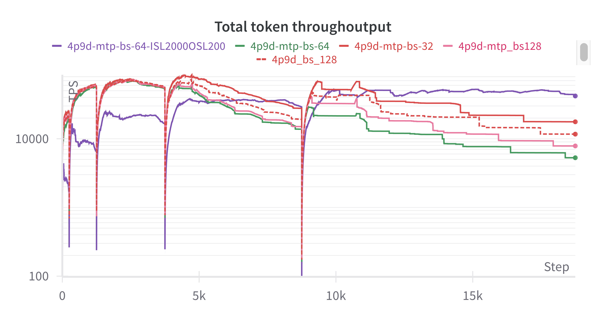


## Benchmarking of P/D

#### P2D2

P2D2 configuration의 경우 KV cache reserved space가 제한되어 있다. P node HBM utilization은 65 GB / 79 GB, D node는 70 GB / 79 GB이다. client side에서 batch size 1024일 때 KV cache memory overflow(OOM) 문제를 자주 만났다. batch size x input length가 128을 넘으면 TTFT가 급격히 증가하고, SGLang의 output throughput measurement가 unreliable해지는 것을 관찰했다.

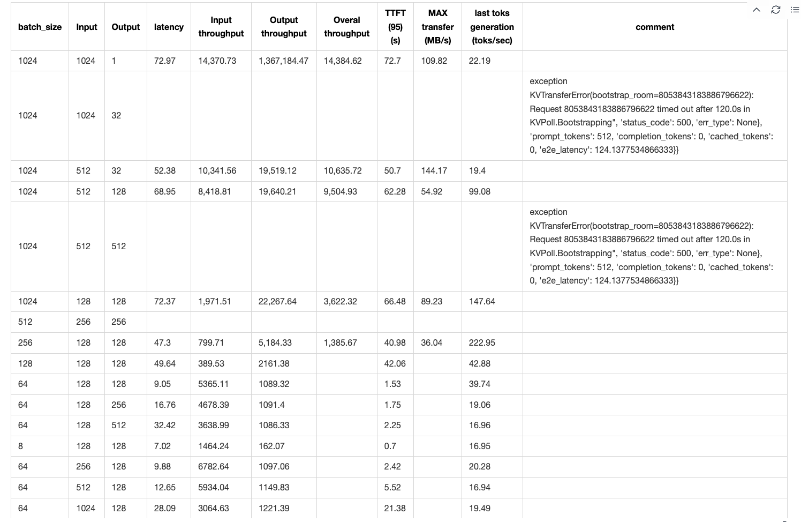

위 observation을 바탕으로 이후 user-side online test input을 두 category로 나누었다.

- short query(input sequence length in_seq_len < 128), 최대 128 concurrency에서 high throughput을 달성하기 위한 것이다.

- long query, maximum throughput을 추구하며 longest return time은 120초다.

batch size x input length가 128 x 128을 넘으면, P2D2 configuration을 예로 들 때 KV cache transfer가 inference speed의 bottleneck이 되고, 전체 system의 data plane이 network I/O bound가 된다.


Mooncake development team은 [PR#499](https://github.com/kvcache-ai/Mooncake/pull/499)에서 transfer engine performance issue를 찾아냈고, 새로운 batch transfer feature를 SGLang v0.4.8에 빠르게 통합했다. 동시에 transfer-engine==0.3.4를 설치해야 한다. [PR#7236](https://github.com/sgl-project/sglang/pull/7236)을 참고하라.

transfer engine이 10배 performance improvement를 가져왔지만, data plane의 network I/O bound 문제는 서로 다른 P/D configuration에서 여전히 보편적으로 존재한다.


SLOs 아래의 throughput을 고려하지 않으면 maximum input throughput 45k toks/sec를 얻기는 쉽다. 앞에서 분석했듯 output throughput은 TTFT에 의해 제한되므로 measurement result가 정확하지 않다.


주목할 점은 input sequence length와 output sequence length의 ratio가 4:1일 때, 이 H800 SuperPod machine에서 GPU utilization이 최적이고, last token generation speed가 maximum에 도달한다는 것이다.

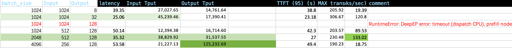

#### P2D4/P4D2

P2D4와 P4D2 test의 목표 중 하나는 TTFT를 줄이고 maximum throughput을 높이기 위한 scaling direction을 결정하는 것이다. motivation section에서 논의한 것처럼, TTFT를 줄이는 한 방법은 Chunk-prefill size를 줄이면서 Prefill node의 data parallelism을 낮추는 것이다.

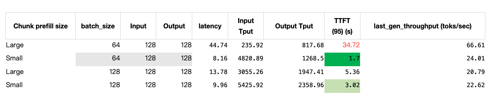

Data Parallel과 DP Attention, 즉 DP > 1은 반드시 켜야 한다. 그렇지 않으면 TTFT와 throughput이 크게 떨어지는 것을 관찰한다.

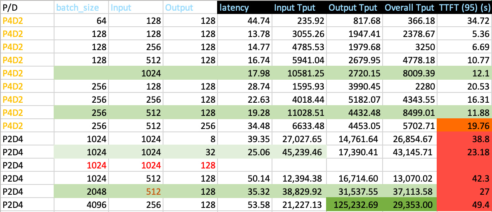


위 statistics에 따르면, P2D4 configuration에서 1024보다 큰 input sequence length를 support하려면 대부분의 runtime이 prefill stage에서 소비된다. 따라서 TTFT는 overall latency에 매우 가깝다.


따라서 prefill node ratio r을 늘리는 것을 고려한다. r > 1이고 r < 2다.


#### P4D6

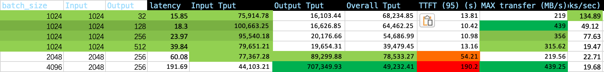

P4D6 disaggregated test에서 average time to first generated token(TTFT)은 약 10초까지 올라갔다. batch size x input length가 2048 x 1024를 넘으면 TTFT가 급한 slope로 빠르게 증가한다.

#### P4D9

P4D9는 SGLang team이 권장하는 golden configuration[^8]이지만, 우리 test에서는 만족스러운 throughput을 내지 못했고, input length 4K, output length 256일 때 overall throughput은 8만 token/s로 제한되었다.

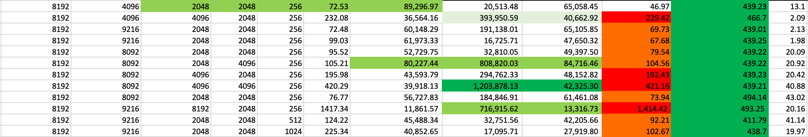

우리는 user-side online test에서 P4D9 disaggregated configuration을 검증했다. short query의 경우 user side, 즉 user's SDK에서 관찰한 total output token throughput은 8천 token/s뿐이었다.

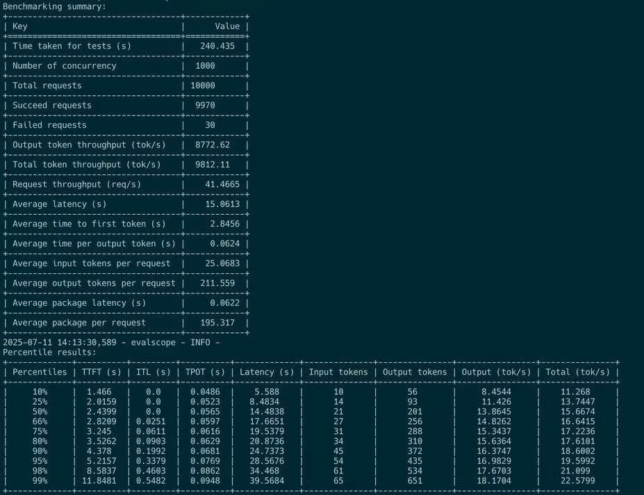

long query의 경우 user side, 즉 user's SDK에서는 maximum 400 token/s throughput만 관찰되었다.

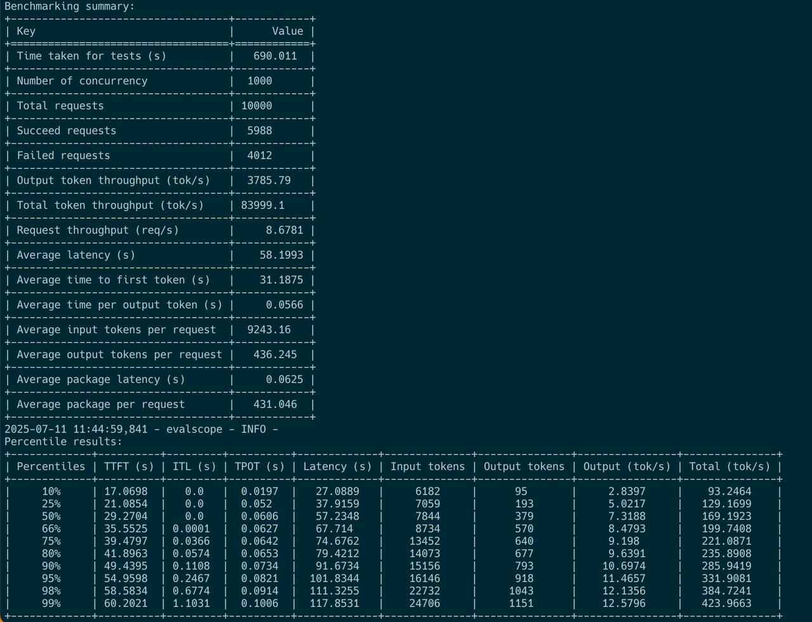

## conclusion

우리는 13x8 H800 SuperPod에서 SGLang V0.4.8을 사용해 DeepSeek V3 671B 계열 model을 disaggregated architecture로 host하는 방법을 comprehensive하게 연구했다.


먼저 더 큰 Prefill group, Prefill과 Decode group ratio는 3:1이 가장 좋다, 그리고 더 작은 TP size, Prefill node와 Decode node total number ratio는 1:1이 가장 좋다, 가 더 좋은 TTFT와 더 높은 goodput을 가져올 수 있음을 요약하고 검증했다.


둘째, large-scale MoE model의 P/D setting을 검증했고, input length에 batch size를 곱한 값이 어떤 threshold를 넘으면 TTFT가 급격히 상승한다는 것을 발견했다. 따라서 actual deployment에서는 `max_running_request_size`를 제한해야 한다.


Prefill node의 TTFT와 compute efficiency를 높이기 위해 더 작은 chunked-prefill size를 선택했다.


이 configuration은 short query scenario에서 거의 8만 tokens/sec에 가까운 overall goodput을 달성했고, user side에서 약 8천 tokens/sec throughput이 관찰되었다. 이는 2xH800 shared deployment unit의 maximum 1만 tokens/sec overall goodput에 비해 크게 향상된 것이다.

## Future Work

disaggregated serving architecture는 여러 node를 하나의 deployment unit으로 expose한다. Prefill stage와 decode stage의 computation characteristic 차이를 충분히 활용하며, traditional colocated deployment architecture에 비해 overall throughput(goodput)이 크게 향상된다.


하지만 더 큰 deployment unit은 더 높은 risk도 가져온다. card 하나만 repair가 필요해도 전체 unit이 영향을 받을 수 있다. 따라서 competitive throughput을 보장하면서 deployment unit의 scale을 합리적으로 선택하는 것이 이 scheme의 real-world success에 매우 중요하다.


다음으로 우리는 communication layer library에 집중해 Prefill node의 potential을 발굴하고, TTFT(time to first token)를 더 낮출 것이다.

## Acknowledgement

이 글에 대한 support와 suggestion을 준 Mr Yiwen Wang (yepmanwong@hkgai.org) 및 Prof Wei Xue (weixue@ust.hk), user-side test를 담당한 Andy Guo (guozhenhua@hkgai.org), MTP와 (P3x3)D4의 effectiveness를 검증하기 위한 deployment를 담당한 Yu Jiepu (yujiepu@hkgai.org), resource arrangement를 도운 Yi Chao (chao.yi@hkgai.org)에게 감사한다.


우리는 자체 H800 DGX SuperPod machine에서 P/D disaggregated deployment의 performance를 독립적으로 reproduce했으며, engineering implementation, reproduction suggestion, report에 대한 빠른 feedback에 기여한 SGLang core team과 community에 가장 진심 어린 감사를 전한다.

## appendix

#### Prefill decode nodes Colocated H800 X 2 test full reference

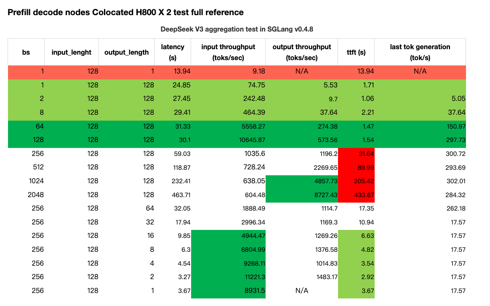

## references

[^1]: Instruction for Running DeepSeek with Large-scale PD and EP, https://github.com/sgl-project/sglang/issues/6017, retrieved on 12 July 2025.

[^2]: Evaluation Framework for Large Models, ModelScope team, 2024, https://github.com/modelscope/evalscope, retrieved on 12 July 2025.

[^3]: Orca : A Distributed Serving System for transformer-Based Generative Models, https://www.usenix.org/conference/osdi22/presentation/yu, Gyeong-In Yu and Joo Seong Jeong and Geon-Woo Kim and Soojeong Kim and Byung-Gon Chun, OSDI 2022, https://www.usenix.org/conference/osdi22/presentation/yu

[^4]: SARATHI : efficient LLM inference by piggybacking decodes with chunked prefills, https://arxiv.org/pdf/2308.16369

[^5]: DistServe : Disaggregating Prefill and Decoding for Goodput-optimized large language model serving, Yinmin Zhong, Shengyu Liu, Junda Chen, Jianbo Hu, Yibo Zhu, Xuanzhe Liu, Xin Jin, Hao Zhang, 6 Jun 2024, https://arxiv.org/pdf/2401.09670

[^6]: Throughput is Not All You Need : Maximizing Goodput in LLM Serving using Prefill-decode Disaggregation, Junda Chen, Yinmin Zhong, Shengyu Liu, Yibo Zhu, Xin Jin, Hao Zhang, 3 March 2024, accessed online on 12 July 2025.

[^7]: MoonCake transfer engine performance : https://kvcache-ai.github.io/Mooncake/performance/sglang-benchmark-results-v1.html, accessed online 18 july 2025

[^8]: https://lmsys.org/blog/2025-05-05-large-scale-ep/, accessed online on 12 July 2025

[^9]: DeepSeek OpenWeek : https://github.com/deepseek-ai/open-infra-index?tab=readme-ov-file

[^10]: SGLang genai-bench : https://github.com/sgl-project/genai-bench, accessed online on 18 July

[^11]: https://github.com/ai-dynamo/dynamo/blob/main/docs/images/dynamo_flow.png, accessed online on 18 July
