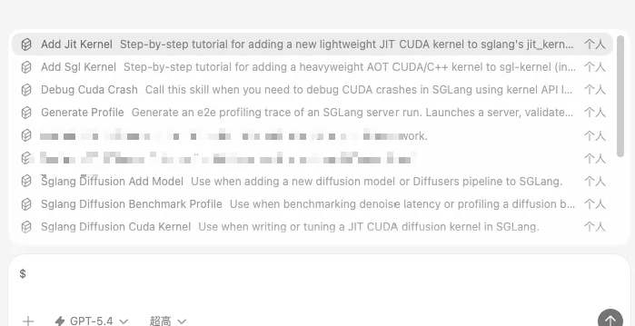
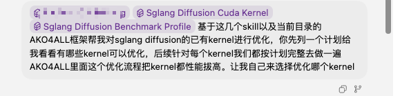
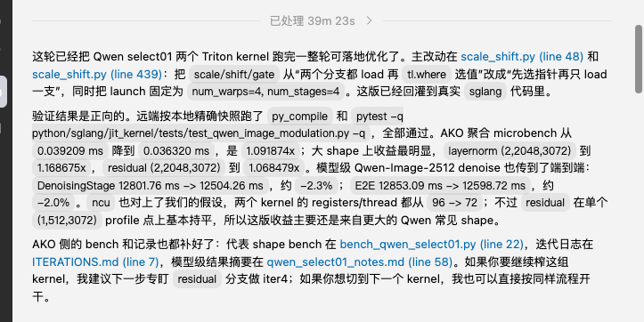

# SGLang 개발, 최적화, debug 팁 기록 - 대 SKILL 시대가 왔다

## 0x0. 서문

이전에 [SGLang 개발, compile, profile의 몇 가지 작은 팁 기록](https://zhuanlan.zhihu.com/p/1939041055208112436)과 [SGLang 개발, debug의 몇 가지 팁 2탄](https://zhuanlan.zhihu.com/p/1984750078074839122)에서 SGLang 개발, debug, profile 관련 팁을 기록했다. 이번 글에서는 Agent(Claude Code/Codex) 시대의 최근 상황을 계속 이야기해 본다.

## 0x1. Agent의 충격

Codex + GPT5.4 Extra High가 2주 동안 미친 듯이 해낸 일들을 겪고 나니, 예전의 내 학습은 기본적으로 의미를 잃은 것 같다는 생각이 들었다. 이해하기 어려운 지식과 내가 정리했던 일부 팁은 사실 적절한 context(SKILL)를 설정했을 때 대형 모델이 다룰 수 있는 token일 뿐이었다. Codex + GPT5.4는 이미 매우 강한 능력에 도달했고, 이는 2025년에 느꼈던 것과 완전히 다르다. 진짜 지능이 등장한 듯하며, 적어도 programming development 영역에서는 그렇다. 독자는 Codex 또는 Claude Code에 SGLang이 제공하는 몇 가지 SKILL을 설치해 kernel 작성, benchmark 및 test 작성, kernel iterative optimization, model 작성, model optimization, CUDA Crash 자동 debug, 깨진 commit 자동 bisect 등 이전에는 많은 인력이 필요했던 작업을 수행할 수 있다.

관심 있는 사람은 이 SKILL들을 살펴봐도 좋다. 최근 나는 Codex와 이 SKILL들을 기반으로 SGLang Diffusion의 Z-Image single-card 속도를 40% 높였고, Qwen/Qwen-Image-2512의 single-card 속도를 20%+ 높였으며, kernel fuse pattern 하나도 발굴했다: https://github.com/sgl-project/sglang/pull/20395 . 그리고 https://github.com/TongmingLAIC/AKO4ALL 같은 kernel 개발에 더 적합한 Agent framework를 사용하면 기존 kernel을 더 쉽게 개선할 수 있다. 예를 들면 다음과 같다.

그 뒤 40분을 기다렸더니 전체 model의 end-to-end 성능이 다시 2%p 향상됐다.

이것만으로도 현재 단계의 Coding Agent가 매우 뛰어난 능력을 갖췄음을 증명하기에 충분하다. Agent가 아직 별로라고 느낀다면, 자신이 사용하는 방식과 context가 제대로 주어졌는지 생각해 봐야 한다. 물론 일부 영역에서는 Agent가 아직 인간 전문가와 비교되기 어렵다. 하지만 무서운 점은 대형 모델이 계속 진화하고 있고, gap은 작아질 수밖에 없다는 것이다.

## 0x2. Agent 흐름에서 최적화할 수 있는 부분

- 대형 모델 inference 개발에서는 많은 process가 비교적 고정되어 있다. 따라서 Agent가 더 잘 일할 수 있도록 일반적이고 효율적인 SKILL을 추출해야 하며, 이것이 현재 가장 먼저 해야 할 일이다. 예를 들어 https://github.com/sgl-project/sglang/pull/20910 에서는 FlashInfer의 API logging에서 영감을 받아 SGLang CUDA Crash 전용 debug skill을 만들었다. 이 skill이 있으면 model에 CUDA crash가 발생했을 때(interface layer든 kernel layer든) Codex로 문제가 난 kernel을 더 편하고 효율적으로 찾을 수 있다. 사람이 이 과정을 직접 수행하면 매우 번거롭고 시간이 많이 든다. 따라서 첫 번째로 할 수 있는 일은 자신을 distillation하고, 예전 개발자를 distillation하여 inference framework 개발과 model optimization이 Agent를 통해 돌아가게 만드는 것이다. 여기에는 할 일이 많으며, 개발하면서 동시에 정리할 수 있다.
- 더 전문화된 지식을 연구하고, 이를 Agent의 knowledge base로 만들어 더 나은 효과를 얻어야 한다. 예를 들어 인간 전문가의 경험을 정리해 특수한 SKILL로 만들어 Agent에 붙이는 것은 합법적인 치트키에 가깝다. 자신이 내용이 매우 좋다고 생각하는 cutlass series blog, triton series blog, 또는 특정 인간 code optimization library를 골라 그 안의 optimization code 일부를 압축 정리해 SKILL로 Agent에 붙일 수 있다.
- Process도 매우 중요하다. 특정 kernel을 최적화할 때 적절한 process가 없으면 결과가 좋지 않을 수 있다. 이 부분은 https://github.com/TongmingLAIC/AKO4ALL 와 https://github.com/RightNow-AI/autokernel 등을 참고할 수 있다.

예를 들어 [SGLang 개발, debug의 몇 가지 팁 2탄](https://zhuanlan.zhihu.com/p/1984750078074839122)에서 언급한 장기간 crash 문제는 전체 process를 하나의 SKILL로 정리해 production environment에서 나타나는 이런 어려운 문제를 debug하는 데 사용할 수 있다. 물론 개인적으로는 programmer의 전문적 가치도 하나하나의 SKILL 안에서 점차 약화될 것이라고 느낀다.

## 0x3. 경계할 점

Agent를 그냥 띄워 둔 뒤 개발 과정을 전혀 보지 않고 마지막 결과만 가져와 deliver해서는 안 된다. 현재 실제 사용에서는 Agent가 아직 방향에서 벗어난 수정을 하기도 하며, 파괴적인 결과를 만들 수 있으므로 경계해야 한다.

이 meme이 현실이 되는 순간, 세계는 완전히 바뀔 것이다(웃음).

## 0x4. 사람의 가치

지금 우리는 제출된 PR이 인간이 쓴 것인지, AI coding으로 나온 것인지 구분할 수 있을까? 사람의 가치는 어디에 있는가?

이런 걱정은 꽤 자연스럽다. 하지만 사람의 가치는 사라지지 않는다. 단지 "한 줄 한 줄 손으로 code를 쓰는 것"에서 "문제를 정의하고, context를 정리하고, 결과가 믿을 만한지 판단하는 것"으로 바뀔 뿐이다. 예전의 뛰어난 개발자는 직접 kernel을 파고, benchmark와 debug를 손으로 엮는 사람이었을 수 있다. 지금 더 가치 있는 사람은 이런 경험을 SKILL로 침전시키고, 자동 검증 loop를 만들고, Agent 산출물이 방향을 벗어났는지 한눈에 알아보는 사람이다. 사람은 일을 직접 하는 사람에서 설계하는 사람, gatekeeper, 정제하는 사람으로 이동하고 있다. 세계의 지식을 distillation하고, AI의 출력을 distillation하고, 마지막에는 자기 자신을 distillation한다.

Inference framework, kernel optimization, model adaptation 같은 복잡한 장면에서 희소한 것은 이미 단순히 "code를 쓸 줄 아는 것"이 아니다. "무엇을 최적화해야 하는지, bottleneck이 대략 어디인지, 안정적으로 재사용 가능한 process를 어떻게 설계할지 아는 것"이다. Agent는 확실히 일을 매우 빠르게 처리할 수 있지만, 명확한 목표, 충분한 자료, 단단한 검증 기준이 필요하다. 이것들이 빠지면 아무리 강한 model이라도 그럴듯해 보이지만 제대로 work하지 않는 것들을 고속으로 생산할 뿐이다. 인공지능은 결국 "능공 지인"에 기대야 한다(웃음).

종합하면, 개인적으로는 지금 이 시점에 Vibe Coding 고수가 되는 것이 이미 유일한 출구가 되었다고 본다. 동시에 GPT5.4와 Opus 4.6이 어디까지 진화할지도 기대하고 있다.
