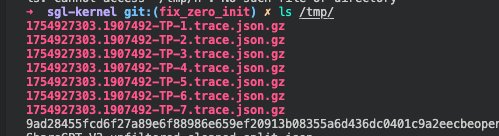
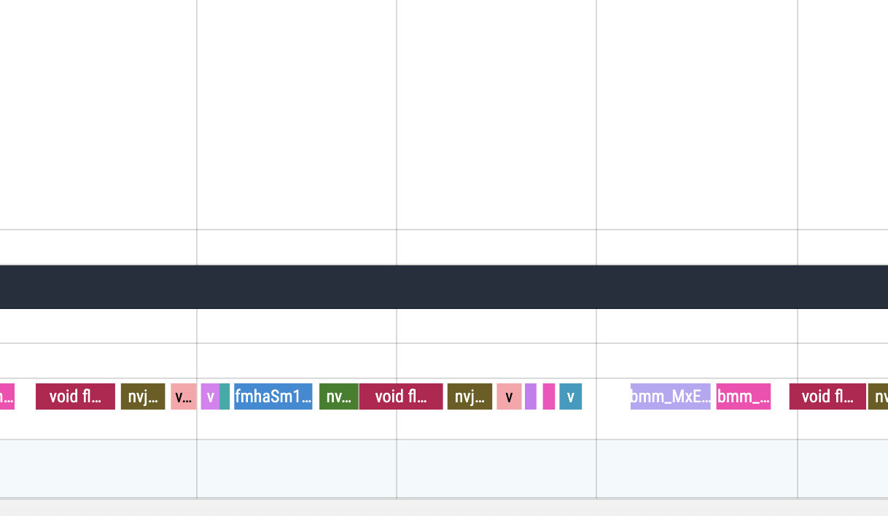
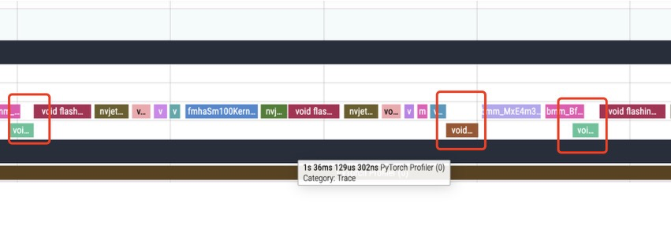
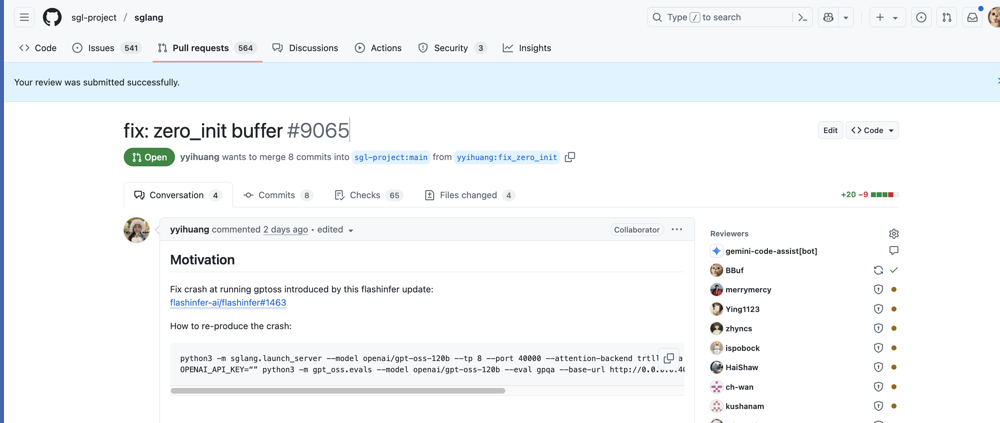
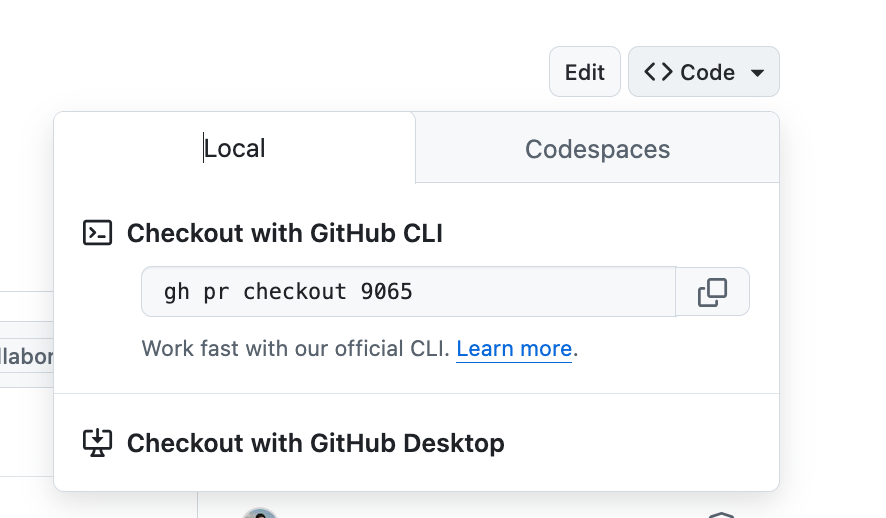

# SGLang 개발, 컴파일, Profile 몇 가지 팁 기록

> 제 강의 노트입니다. 팔로우를 환영합니다: https://github.com/BBuf/how-to-optim-algorithm-in-cuda .

## 0x0. 서문

SGLang 오픈소스에 참여한 지 거의 1년이 되었고, 개발과 Profile에 관한 몇 가지 팁을 배웠습니다. 여기서는 SGLang 컴파일, 개발, Profile에 관한 몇 가지 팁을 기록합니다. 함정을 피하고 개발 과정에서 시간과 힘을 아끼는 데 도움이 될 수 있습니다.

## 0x1. perfetto로 PyTorch Profiler 결과를 시각화할 때 kernel이 사라지는 경우

이전에는 Profile을 볼 때 꽤 골치 아팠던 문제입니다. 아래에서는 전후 사정과 SGLang의 Tom님이 제공한 해결 방법을 공유합니다.

gpt-oss-120b를 예로 들면, 다음 명령으로 Torch Profiler 파일을 만들 수 있습니다. TensorRT-LLM에도 비슷한 방식이 있습니다.

```shell
python3 -m sglang.launch_server --model openai/gpt-oss-120b --tp 8 --port 30000 --attention-backend trtllm_mha

 python3 -m sglang.bench_serving --model openai/gpt-oss-120b --dataset-name random --backend sglang-oai --random-range-ratio 1 --random-input-len 1200 --random-output-len 20 --max-concurrency 1 --num-prompts 5 --profile --port 30000
```

그러면 /tmp에서 아래와 비슷한 profiler 파일을 볼 수 있습니다.



이어서 이 파일을 다운로드한 뒤 perfetto(https://ui.perfetto.dev)에 끌어다 열면, Profiler의 cuda kernel 실행 순서를 보며 최적화할 수 있습니다. Kernel Fuse든 Kernel 자체 가속이든 Torch Profiler를 perfetto로 렌더링한 kernel 시간 실행 그래프에 매우 정확하게 반영됩니다.

그런데 여기에는 몇 가지 문제가 있습니다. 모르면 괜히 의심에 빠질 수 있습니다.

### 0x1.1 kernel 사이에 빈 구간이 생김

gpt-oss-120b decode layer의 kernel 실행 시간 그래프 하나를 골라 보겠습니다.



처음과 중간에 빈 구간이 보입니다. 우리는 이미 cuda graph를 켰기 때문에, 이런 명확한 빈 구간은 이론적으로 cuda kernel이어야 합니다. 그런데 왜 여기서는 빈 구간일까요? Nsight System 결과와 비교해 본 적이 없고 이 코드 구간이 실행하는 kernel에 익숙하지 않다면, 이 점을 쉽게 놓칠 수 있고 이상한 bug라고 생각할 수도 있습니다.

하지만 실제로 이 빈 구간도 정상적인 cuda kernel에 대응합니다. 다만 이 kernel들이 PDL 때문에 직전 kernel과 일부 겹치면서 perfetto 렌더링에 bug가 생겼고, 같은 Stream의 timeline에서 모든 kernel을 정상적으로 표시하지 못해 빈 구간이 생긴 것입니다.

이 문제는 SGLang 핵심 개발자 Tom(https://github.com/fzyzcjy)이 발견하고 해결했습니다. 해결 방법도 간단하고 우아합니다. 자세한 내용은 다음을 참고하세요.

https://github.com/fzyzcjy/torch_utils/blob/master/src/convert_to_perfetto_compatible/convert_to_perfetto_compatible.py

간단히 말하면 kernel 실행 시간을 파싱하고, 겹치는 kernel을 임시로 다른 Stream에 올려 표시하는 방식입니다. 위에서 얻은 Profiler 파일을 이 스크립트로 한 번 처리하면, 빈 구간에 대응하는 kernel을 완전하게 표시할 수 있습니다. 효과는 다음과 같습니다.



이 문제는 저를 오랫동안 괴롭혔습니다. 2024년에도 이 문제를 본 적이 있고, 가끔 Perfetto 구버전 chrome plugin을 쓰면 모든 kernel이 우연히 표시되기도 했습니다. 원인을 알고 나니 Tom님이 정말 대단하다는 생각뿐입니다. 이 스크립트는 Tom님의 저장소에서 받을 수 있습니다. https://github.com/fzyzcjy/torch_utils/blob/master/src/convert_to_perfetto_compatible/convert_to_perfetto_compatible.py

### 0x1.2 여러 Rank의 Profiler 결과 합치기

위 스크린샷처럼 gpt-oss-120b를 TP8로 실행하면 8개 Rank의 Profiler 결과를 볼 수 있습니다. 일반적으로는 rank0 결과를 선택해 단일 gpu에서 kernel 실행 시간과 kernel launch 같은 세부 정보를 봅니다. 하지만 여러 rank 사이의 상호작용, 예를 들어 여러 rank 간 AllReduce를 확인하려면 각 Rank의 Profiler 결과를 합쳐 AllReduce의 시작과 종료 같은 세부 사항을 명확히 볼 수 있습니다.

마찬가지로 Tom이 제공한 다중 Rank Profiler 결과 병합 스크립트(https://github.com/fzyzcjy/torch_utils/blob/master/src/torch_profile_trace_merger/sglang_profiler_trace_merger.py)를 위 Profiler 파일에 적용하면 병합된 Profiler 결과를 얻을 수 있습니다.


## 0x2. PR 브랜치 전환

https://github.com/yyihuang 님이 이틀 전에 알려준 방법입니다.



이 sglang branch를 테스트하고 싶은데 이 branch가 어떤 개발자의 clone branch라면, 어떻게 빠르게 이 branch 코드로 전환할 수 있을까요?

오른쪽 위의 code를 클릭하면 됩니다.



gh를 설치하고 github 계정과 연결해 둔 뒤, 아래 명령으로 이 branch로 전환할 수 있습니다.

```shell
gh pr checkout 9065
```

이 방식이 있으면 관련 있는 fork 저장소의 PR 몇 개를 합쳐 테스트하는 일도 훨씬 쉬워집니다.

저는 몇 년 동안 멍청하게 upstream을 set하거나 PR을 수동 cherry-pick하고 있었습니다. 정말 피 토할 일입니다.

## 0x3. SGLang이 PyTorch 버전과 sgl-kernel 버전을 무시하고 실행되게 하기

이 점이 유용한 이유는 다음과 같습니다. 어떤 장면의 어떤 모델이 SGLang 버전 변화에 따라 성능 bug나 다른 bug를 보인다면, 어떤 commit 또는 PR이 그 bug를 도입했는지 찾아야 합니다. SGLang을 소스에서 컴파일하지 않으면 거의 하기 어렵습니다. 아래는 빠른 전체 컴파일 흐름 명령입니다. 기본적으로 어떤 commit이든 정상적으로 실행되게 만들어, 올바르게 bisect하고 위치를 찾는 데 도움을 줍니다.

```
git clone --recursive git@github.com:flashinfer-ai/flashinfer.git
rm -rf  ~/.cache/flashinfer
python -m pip install -v . 

git clone git@github.com:sgl-project/sglang.git
cd sglang 
pip install -e "python[all]" 
cd sgl-kernel && make build -j8
pip install dist/sgl_xxx.whl --force-install
```

위의 `rm -rf  ~/.cache/flashinfer` 단계에 주의하세요. bug가 flashinfer와 관련 있다면 이 단계는 필수입니다.

대체로 이 절차를 따르면 이전의 임의 SGLang commit으로 전환해 코드가 순조롭게 실행되도록 만들 수 있습니다. 아, 전체 개발 환경은 여전히 개인 GPU 아키텍처에 맞춰 SGLang Docker 환경을 가져온 다음, Docker 환경 안에서 위 컴파일을 완료하는 것을 추천합니다.


## 0x4. 마무리

며칠 전에 몇 가지 더 떠올렸던 것 같은데 지금은 잊어버렸습니다. 일단 여기까지 기억나는 것만 적어 둡니다. 나중에 생각나거나 새로 생기면 다시 보충하겠습니다.
