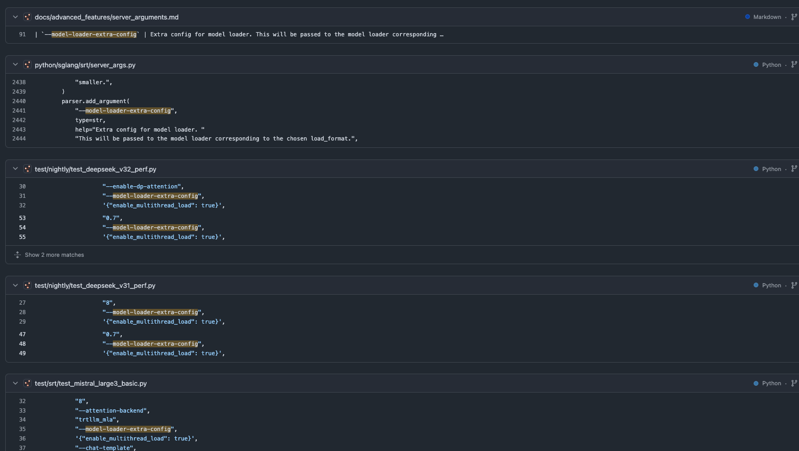
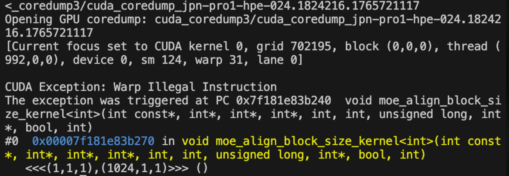
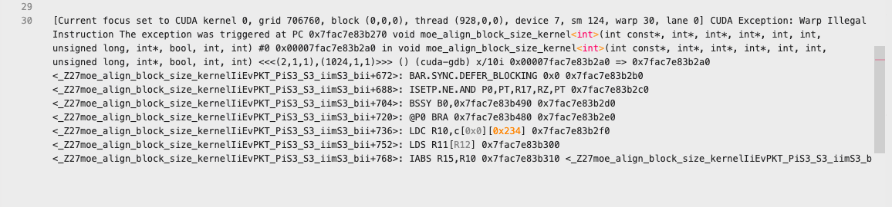
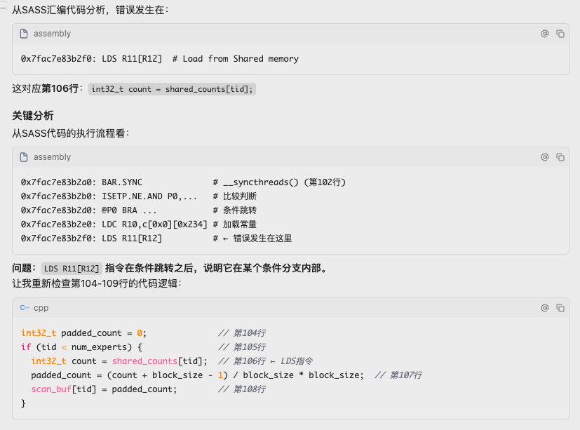
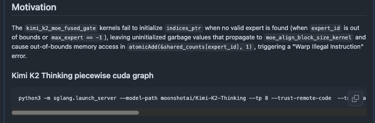
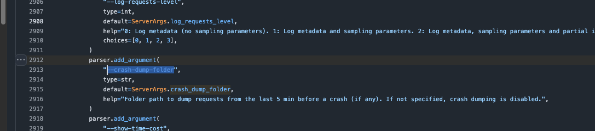

# SGLang 개발과 debug 팁 기록 2편

## 0x0. 서문

몇 달 전 《SGLang 개발, 컴파일, Profile 몇 가지 팁 기록》(https://zhuanlan.zhihu.com/p/1939041055208112436)에서 SGLang 개발 팁 몇 가지를 공유했습니다. 시간이 지나면서 새로운 발견과 지식을 조금 더 얻었고, 계속해서 여러분께 공유합니다. 도움이 된다면 좋아요를 눌러 주세요. 제 cuda 학습 노트: https://github.com/BBuf/how-to-optim-algorithm-in-cuda

## 0x1. 다중 스레드 모델 가중치 로딩 켜기

단일 머신 8카드 또는 2머신 16카드 규모, 예를 들어 H200, B200에서 DeepSeek V3/R1/V3.1/V3.2, Kimi K2 Thinking, Mistral3 Large 같은 대형 MoE 모델을 debug할 때 매우 유용합니다. server args에 `--model-loader-extra-config='{"enable_multithread_load": "true","num_threads": 64}'` 파라미터를 추가하면 모델을 다중 스레드로 로드할 수 있고, 모델 로딩 속도가 크게 향상됩니다. 모델을 한 번 로드할 때마다 게임 한 판 하고 와야 하는 곤란한 상황에서 벗어날 수 있습니다.



## 0x2. SGLang Serve 모델의 단기 및 장기 crash debug

SGLang Server 모델을 사용할 때 crash, 예를 들어 Illegal memory access나 Warp Illegal Instruction을 만나면 어떻게 해야 할까요? 여기서는 두 가지 경우로 나눌 수 있습니다. 첫 번째는 서비스가 시작된 뒤 특정 요청, 예를 들어 gsm8k dataset 테스트를 보내면 바로 crash가 나는 경우입니다. 다른 하나는 서비스가 이미 하루 동안 돌고 있다가 그때서야 crash가 나는 경우입니다.

### 0x2.1 즉시 crash

첫 번째 경우는 재현이 비교적 쉽고 처리도 조금 더 쉬울 수 있습니다. 아래에 예시를 공유하지만, 분석이 모두 맞다고 보장하지는 않습니다. Piecewise CUDA Graph를 켜고 Kimi K2 Thinking을 Serving할 때, 서비스가 뜬 뒤 gsm8k를 테스트하면 crash가 나고 Warp Illegal Instruction 오류가 보고되는 것을 발견했습니다. CUDA의 비동기 특성 때문에 우리가 보는 오류 kernel이 실제 오류 kernel이 아닐 수 있으므로 CUDA-GDB 같은 도구의 도움을 받아야 합니다.

예를 들어 시작 명령에 환경 변수를 한 바퀴 추가합니다.

```shell
CUDA_ENABLE_COREDUMP_ON_EXCEPTION=1 CUDA_COREDUMP_SHOW_PROGRESS=1 CUDA_COREDUMP_GENERATION_FLAGS='skip_nonrelocated_elf_images,skip_global_memory,skip_shared_memory,skip_local_memory,skip_constbank_memory' CUDA_COREDUMP_FILE="/home/sglang/bbuf/dump/cuda_coredump_%h.%p.%t" python3 -m sglang.launch_server --model-path moonshotai/Kimi-K2-Thinking --tp 8 --trust-remote-code  --tool-call-parser kimi_k2 --reasoning-parser kimi_k2 --model-loader-extra-config='{"enable_multithread_load": "true","num_threads": 64}' --enable-piecewise-cuda-graph
```

이 환경 변수들은 이 Zhihu blog https://zhuanlan.zhihu.com/p/1938284538108293922 또는 vLLM 블로그 [GPU hang에서 오류 코드 정확히 찾기: vLLM CUDA debug 실전 팁](https://mp.weixin.qq.com/s/VHFnA9nkasOJ-svIFp7IXQ)을 참고할 수 있습니다.

그런 다음 서비스를 다시 실행해 crash를 트리거하면, 이번에는 더 실제에 가까운 오류 정보를 얻습니다. 스크린샷은 다음과 같습니다.




이때 오류가 난 kernel, 어느 block의 어느 thread인지, 그리고 중요한 오류 주소를 볼 수 있습니다. 이후 CUDA-GDB의 `x/10i ` 명령으로 오류 주소 근처의 SASS를 얻습니다.



저처럼 CUDA 초보에 가까운 사람은 여기서 AI의 도움을 받을 수 있습니다. AI에게 SASS를 분석하게 하고 가능한 오류 원인을 제시하게 합니다.



그러자 단서는 https://github.com/sgl-project/sglang/blob/main/sgl-kernel/csrc/moe/moe_align_kernel.cu#L98 이 줄의 코드로 향했습니다. 여기서 Shared Memory out-of-bounds access가 발생해 최종적으로 Warp Illegal Instruction이 났을 수 있다는 것입니다. 그래서 이곳에 assert를 추가해 expert_id를 `>=0` 및 `<num_experts`로 제한해 보니, 위 오류는 정말 사라졌고 GSM8K도 정상적으로 실행되었습니다.

하지만 다시 생각해 보면 expert_id는 본래 자연스럽게 `>=0` 및 `<num_experts`를 만족해야 합니다. AI에게 다시 물으면 분명 "아, 당신 말이 맞습니다"라고 하면서 이전 분석이 틀렸다고 말할 것입니다.

이어서 생각해 보기 시작했습니다. 이 topk_ids 값이 어떻게 범위를 넘을 수 있을까요? 그 출처는 이 moe_align_block_size_kernel kernel 안이 아니라, 반드시 그 직전 kernel에 있습니다. 그렇다면 직전 kernel은 무엇일까요? Serving하는 모델이 Kimi K2 Thinking이므로 topk_ids를 만들어내는 직전 kernel은 분명 kimi_k2_moe_fused_gate_kernel입니다. 이 kernel은 마침 얼마 전에 추가된 것이고, 그 안에서 topk_ids를 초기화하지 않아 garbage input이 생길 수 있었습니다. 초기화를 빠르게 수정한 뒤 다시 검증하니 실제로 이 문제를 해결할 수 있었습니다. moe_align_block_size kernel에는 어떤 제한도 넣을 필요가 없었습니다.



여기서 핵심은 쉽게 재현되는 crash bug의 경우 cuda-gdb로 죽는 위치를 찾을 수 있다는 점입니다. 하지만 AI 보조 분석이나 가짜 해결책에 기대다가 debug 전체를 통제하는 주체가 우리 자신이라는 사실을 잊지 않도록 반드시 주의해야 합니다. 전체 context를 진짜로 가진 사람은 우리뿐이기 때문입니다.


### 0x2.2 장기 crash

서비스가 하루, 심지어 며칠 동안 돌다가 crash가 나면 어떻게 해야 할까요?

첫 번째 방법은 매일 밤 서비스를 한 번 재시작하는 것입니다. 그러면 안 죽습니다. 농담입니다.

두 번째는 SGLang이 제공하는 정석적인 재현 방식입니다. 서비스를 시작할 때 https://github.com/sgl-project/sglang/blob/main/python/sglang/srt/server_args.py#L2912 의 `--crash-dump-folder` 파라미터를 추가할 수 있습니다. 이 파라미터는 장기 crash가 발생하기 전 5분 동안의 요청을 기록합니다.



이 데이터는 `.pkl` 파일로 저장됩니다.

그런 다음 위의 cuda-gdb 변수들을 모두 추가해 모델을 다시 시작하고, 아래 명령을 실행해 사고 현장을 replay할 수 있습니다.

```shell
python3 scripts/playground/replay_request_dump.py --input-file crash_dump.pkl
```

우리는 이 방법으로 실제 장면에서 Kimi K2 Thinking Serving이 24시간 뒤에야 crash 나던 문제를 해결했습니다. 시도해 볼 만합니다.

### 0x2.3 도움을 요청하는 용기

문제를 찾은 뒤 해당 kernel을 이해하지 못한다면 ISSUE를 올리거나 그 kernel의 개발자를 찾는 것을 추천합니다. 완전한 context를 가진 사람은 그들뿐이고, 부분적인 환각에 쉽게 빠지지 않습니다.

## 0x3. 계층별 NVTX Profiling

`--enable-layerwise-nvtx-marker`를 사용하면 모델의 각 계층에 NVTX marker를 자동으로 추가할 수 있고, Nsight Systems와 함께 세밀한 성능 분석을 할 수 있습니다.

```shell
# 서버 시작
nsys profile --trace-fork-before-exec=true \
  --cuda-graph-trace=node \
  --capture-range=cudaProfilerApi \
  --capture-range-end=stop \
  -o layerwise_profile \
  python -m sglang.launch_server \
    --model-path meta-llama/Llama-3.1-8B-Instruct \
    --enable-layerwise-nvtx-marker \
    --disable-cuda-graph

# API로 profiling 제어
curl -X POST http://127.0.0.1:30000/start_profile \
  -H "Content-Type: application/json" \
  -d '{
    "start_step": 3,
    "num_steps": 10,
    "activities": ["CUDA_PROFILER"]
  }'
```

Nsight Systems 사용에 익숙한 분들은 이 방법을 시도해 볼 수 있습니다. 어느 정도 도움이 됩니다.

## 0x4. Decode 고정 batch_size 설정 후의 성능

개발 중 쓸 수 있는 작은 팁입니다. 고정 batch_size에서 Decoding 성능을 보려면 다음을 사용할 수 있습니다.

```shell
python3 -m sglang.test.send_one --batch-size 128
```

그런 다음 server log 안의 decoding 성능을 보면 편리합니다.

## 0x5. 요약

일단 생각나는 것은 여기까지입니다. 감사합니다.
