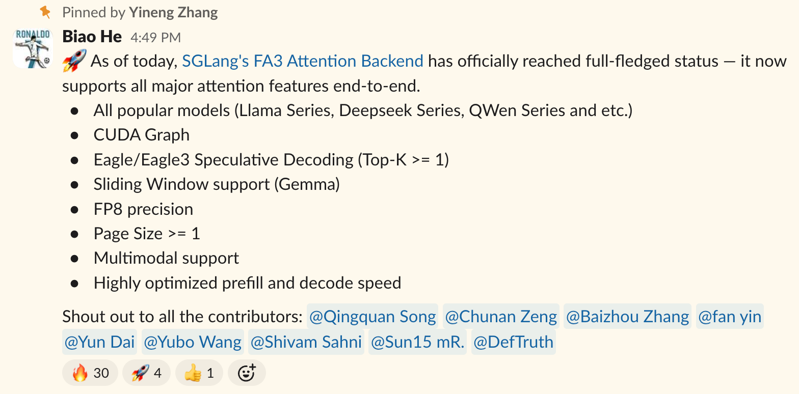
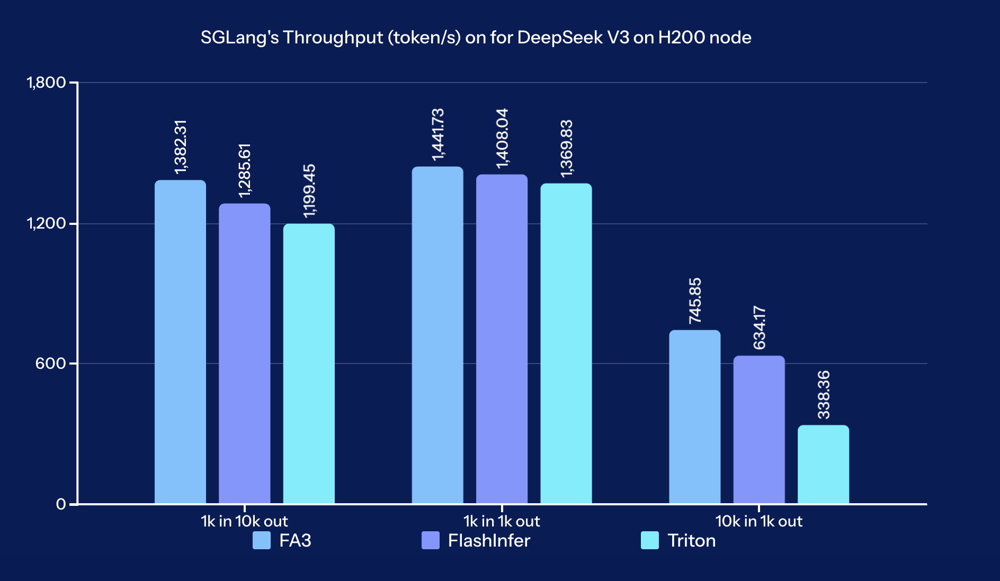
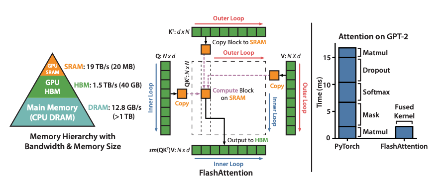
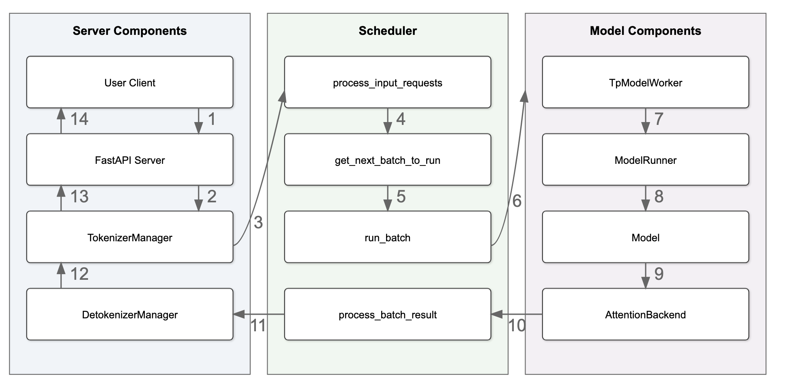
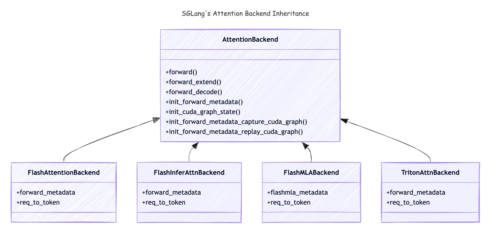
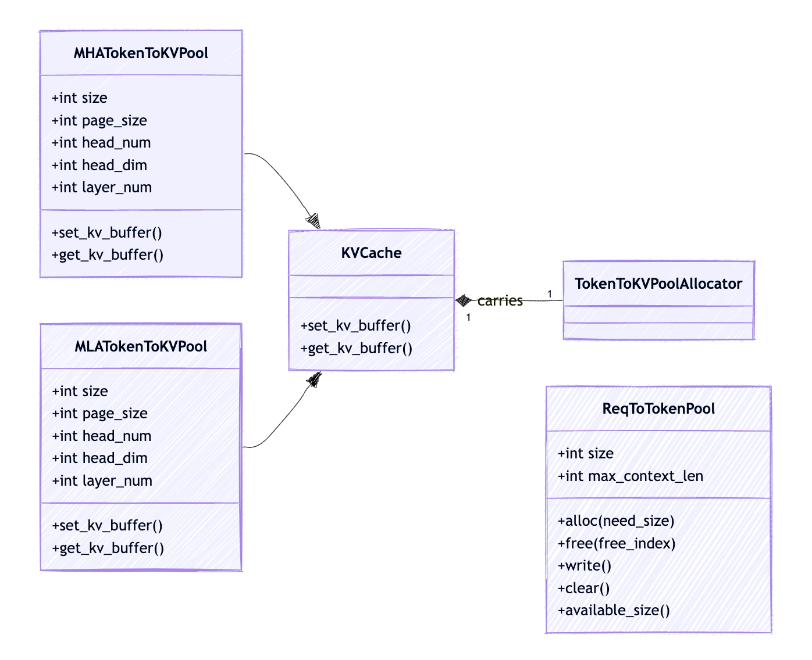
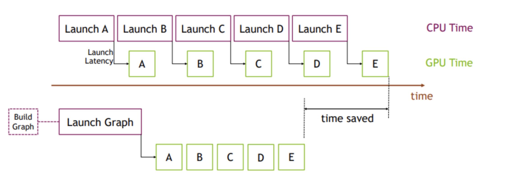
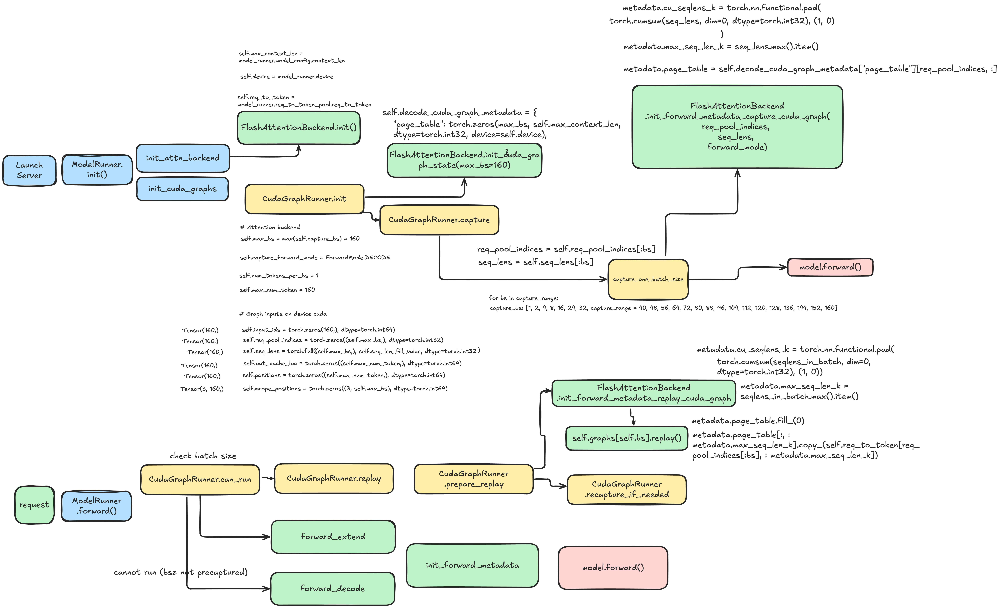

> 이 글은 https://hebiao064.github.io/fa3-attn-backend-basic 에서 가져왔으며, GiantPandaLLM이 번역하고 repost했습니다. 저자는 Linkedin의 Biaoh He && Qingquan Song 입니다.

# SGLang에서 Flash Attention Backend 구현하기 - 기초와 KV Cache

## 0x0. 소개

지난 몇 주 동안 우리는 SGLang에 Flash Attention backend를 완전히 구현했고, SGLang 0.4.6 version(https://github.com/sgl-project/sglang/releases/tag/v0.4.6)부터 이는 default attention backend가 되었습니다.



이 여정 전체에서 우리는 modern LLM serving engine의 Attention Backend가 어떻게 동작하는지 많이 배웠고, Flash Attention 자체도 더 깊이 이해하게 되었습니다.

이 글에서는 기본 Flash Attention backend를 어떻게 구현하는지 소개하고, LLM serving engine에서 자신만의 attention backend를 구현하려는 사람에게 도움이 되길 바라는 insight를 공유합니다.

### 시리즈 글 목차

이 시리즈는 3부분으로 나뉩니다.

- Part 1: Basics, KV Cache and CUDA Graph Support (this post)
- Part 2: Speculative Decoding Support (coming soon)
- Part 3: MLA, Llama 4, Sliding Window and Multimodal Support (coming soon)

### SGLang의 Attention Backend 최신 상태

| Backend | Page Size > 1 | Spec Decoding | MLA | Llama 4 | MultiModal | FP8 |
|---------|--------------|---------------|-----|---------|------------|-----|
| FlashAttention | ✅ | ✅ | ✅ | ✅ | ✅ | ✅ |
| FlashInfer | ✅ | ✅ | ✅ | ✅ | ✅ | ❌ |
| Triton | ❌ | ✅ | ✅ | ❌ | ❌ | ✅ |
| Torch | ❌ | ❌ | ❌ | ❌ | ❌ | ❌ |

### Benchmark Results



benchmark 결과는 FA3가 모든 test scenario에서 가장 높은 throughput을 보이며, 특히 input 또는 output size가 커질 때 FlashInfer와 Triton보다 명확히 우수함을 보여 줍니다.

> 우리는 이 comment(https://github.com/sgl-project/sglang/issues/5514#issuecomment-2814763352)에서 사용한 것과 같은 benchmark setting을 따랐습니다. 자세한 benchmark result는 이 spreadsheet(https://docs.google.com/spreadsheets/d/14SjCU5Iphf2EsD4cZJqsYKQn8YbPPt0ZA5viba3gB1Y/edit?gid=0#gid=0)에서 찾을 수 있습니다.


## 0x1. 배경과 동기

### Flash Attention이란?

Flash Attention[^1]은 IO-aware exact attention algorithm입니다. blocking을 사용해 GPU high bandwidth memory(HBM)와 GPU on-chip SRAM 사이의 memory read/write 횟수를 줄입니다.



LLM inference와 training에서는 이미 SGLang, vLLM 같은 modern serving engine의 default attention backend가 되었습니다.

대부분의 경우 이것을 black box로 볼 수 있습니다. 하지만 핵심 logic을 이해하면 더 똑똑하게 사용할 수 있습니다.

Flash Attention의 핵심 logic을 이해하려면 이 글[^2]을 강력히 추천합니다. 또한 Flash Attention이란 무엇인가?에 대한 제 블로그(https://hebiao064.github.io/flash-attn)도 있는데, 거기서는 code level에서 짧게 소개했습니다.

### SGLang의 attention backend는 어떻게 동작하는가

#### SGLang architecture



SGLang은 modern LLM serving engine으로서 logical view에서 세 가지 주요 component를 갖습니다[^3].

- **Server Components**: 들어오는 request를 처리하고 response를 보냅니다.
- **Scheduler Components**: batch를 만들고 Worker에 보냅니다.
- **Model Components**: model inference를 담당합니다.

위 그림의 model forward pass에 집중해 봅시다.

**Step 8**: `ModelRunner`가 `ForwardBatch`를 처리하고 `model.forward`를 호출해 model forward pass를 수행합니다.

**Step 9**: `model.forward`는 각 layer의 `forward` 함수를 호출하며, 대부분의 시간은 self-attention 부분에서 소비됩니다. 따라서 attention backend는 model inference의 bottleneck이 됩니다. performance 외에도 **MHA**, **MLA**, **GQA**, **Sliding Window**, **Local Attention** 같은 다양한 attention variant가 있으므로, attention backend 구현은 세심하게 optimize해야 합니다.

#### Attention backend inheritance 관계

아래는 attention variant의 inheritance 관계입니다.



`AttentionBackend` class의 method를 통해 SGLang의 attention backend가 무엇인지 살펴보겠습니다.

1. `forward()`: `model.forward()`가 호출되면 `AttentionBackend`의 `forward` method가 호출됩니다. 이는 `forward_batch.forward_mode`에 따라 `forward_extend()`와 `forward_decode()`를 호출합니다. 이 블로그에서는 `EXTEND`와 `DECODE` mode에만 집중합니다.
2. `forward_extend()`: `forward_mode`가 `EXTEND`일 때 호출됩니다.
3. `forward_decode()`: `forward_mode`가 `DECODE`일 때 호출됩니다.
4. `init_cuda_graph_state()`: server startup 중 호출되며, CUDA Graph replay에서 사용할 tensor를 preallocate합니다.
5. `init_forward_metadata()`: `model.forward()`가 호출될 때 호출됩니다. 전체 `model.forward()` 호출 동안 일부 metadata를 미리 계산하고 각 **layer**가 재사용할 수 있게 합니다. 이는 model inference acceleration에 매우 중요합니다. 흥미롭게도 이 metadata가 attention backend에서 가장 복잡한 부분이며, 일단 이것을 잘 설정하면 이 경우의 **$softmax(QK⊤)V$** 계산 자체는 상당히 단순합니다.
6. `init_forward_metadata_capture_cuda_graph()`: server startup 중 호출되며, `CUDAGraphRunner`가 CUDA Graph capture 동안 이 method를 호출합니다. CUDA Graph는 `CUDAGraphRunner`의 `self.graphs` object에 저장됩니다.
7. `init_forward_metadata_replay_cuda_graph()`: 각 layer의 `forward_decode`가 호출될 때 호출됩니다. CUDA Graph replay가 올바르게 완료되도록 metadata를 설정합니다.

여기까지 attention backend가 구현해야 하는 모든 method를 다뤘습니다. 다음 section에서 이를 논의합니다.

### SGLang에서 KV Cache를 사용하는 방식

각 `AttentionBackend` class에 왜 `req_to_token`이 있는지 궁금할 수 있습니다. 사실 KV Cache는 모든 LLM serving engine의 backbone이며, attention backend에도 매우 중요합니다. 따라서 간단히 살펴보겠습니다.

KV Cache management에는 두 level의 memory pool이 있습니다[^4].




#### req_to_token_pool

request에서 해당 tokens의 KV cache index로 가는 mapping입니다. attention backend diagram에서 언급한 `req_to_token`이 바로 이것입니다.

- **shape**: 최대 허용 request 수(parameter `max-running-requests`로 설정, 동시에 실행할 수 있는 최대 request 수 제어) * 각 request의 최대 context length(configuration `model_config.context_len`으로 설정)
- **access**:
    - dimension 0: `req_pool_indices`가 특정 request를 식별합니다.
    - dimension 1: request 안의 token position(0, 1, 2...부터 시작)이 request 안의 특정 token을 식별합니다.
    - value: token의 `out_cache_loc`이며, dimension 0과 dimension 1이 식별하는 token에 연결된 KV cache index를 가리킵니다.

#### token_to_cache_pool

`req_to_token_pool`은 request에서 tokens의 KV cache index로 가는 mapping을 유지하고, `token_to_kv_pool`은 token을 KV cache index에서 실제 KV cache data로 다시 mapping합니다. `MHA`, `MLA`, `Double Sparsity` 같은 서로 다른 attention implementation에서는 `token_to_kv_pool` 구현이 다를 수 있습니다.

- **Layout**: layer 수 * 최대 허용 token 수 * head 수 * head dimension
- **access**:
    - dimension 0: `layer_id`가 특정 layer를 식별합니다.
    - dimension 1: `out_cache_loc`이 특정 KV cache index(free slot)를 식별합니다.
    - dimension 2: head 수
    - dimension 3: head dimension
    - value: 실제 KV cache data인 `cache_k`와 `cache_v`

보통 우리는 전체 layer의 KV cache를 함께 retrieve합니다. forward pass를 수행하려면 request 안의 모든 previous token에 대한 KV cache가 필요하기 때문입니다.

attention backend에서는 `req_to_token_pool`이 무엇인지만 알면 됩니다. 나머지 KV cache management는 attention backend에 transparent합니다.

`req_to_token_pool`이 어떻게 생겼는지 직관적인 예를 들어 보겠습니다.

1. request가 두 개 있고 각 request에는 token 7개가 있다고 가정합니다.
2. 그러면 `req_to_token_pool`은 shape가 (2, 7)인 tensor이고, 각 entry는 request 안의 token 하나를 대응하는 KV cache index에 mapping합니다.

```shell
 req_to_token_pool = [
     [1, 2, 3, 4, 5, 6, 7],
     [8, 9, 10, 11, 12, 13, 14]
 ]
```

`seq_lens`는 [7, 7]입니다.
3. 한 번의 `forward_extend`를 실행한 뒤 각 request에 새 token이 추가되면 `req_to_token_pool`은 다음처럼 update됩니다.

```shell
 req_to_token_pool = [
     [1, 2, 3, 4, 5, 6, 7, 15],
     [8, 9, 10, 11, 12, 13, 14, 16]
 ]
```

`seq_lens`는 [8, 8]입니다.
4. 첫 번째 request가 완료되고 두 번째 request에 대해 decode를 한 번 더 실행하면 `req_to_token_pool`은 다음처럼 update됩니다.

```shell
 req_to_token_pool = [
     [1, 2, 3, 4, 5, 6, 7, 15],
     [8, 9, 10, 11, 12, 13, 14, 16, 17]
 ]
```

`seq_lens`는 [8, 9]입니다.

위의 KV cache structure 지식을 갖췄으니 이제 우리만의 FlashAttention backend 구현을 위한 기반이 생겼습니다. 다음 단계는 최소 동작 구현을 만들기 위해 `flash_attn_with_kvcache` API의 올바른 argument를 식별하는 것입니다.

KV cache에 대한 더 자세한 내용은 Awesome-ML-SYS-Tutorial: KV Cache Code Walkthrough(https://github.com/zhaochenyang20/Awesome-ML-SYS-Tutorial/blob/d4d56dc3ab2260a747964ceb18cb1f69d23146ae/sglang/kvcache-code-walk-through/readme.md)를 참고하세요.

## 0x2. FlashAttention3 Backend 기본 구현

좋습니다. 이제 SGLang의 FlashAttention backend 구현으로 들어가 보겠습니다.

> 여기가 최초 구현입니다: sgl-project/sglang#4680(https://github.com/sgl-project/sglang/pull/4680). 간결함을 위해 코드를 단순화하고 핵심 logic에만 집중했습니다.

### Tri Dao의 FlashAttention 3 Kernel API

Tri Dao는 Flash Attention 3용 public API를 몇 가지 제공하며, entrypoint는 hopper/flash_attn_interface.py(https://github.com/Dao-AILab/flash-attention/blob/main/hopper/flash_attn_interface.py)입니다.

우리가 `flash_attn_with_kvcache`를 선택한 데는 두 가지 주요 이유가 있습니다. 첫째, 전체 page table을 직접 받기 때문에 key/value pair를 수동 조립하는 overhead를 제거합니다. 둘째, page size > 1인 paged KV cache에 대한 native support를 제공합니다. 이는 `flash_attn_varlen_func`에서는 사용할 수 없습니다.

`flash_attn_with_kvcache` API를 빠르게 살펴보겠습니다.

```python
# we omiited some arguments for brevity
def flash_attn_with_kvcache(
    q,
    k_cache,
    v_cache,
    cache_seqlens: Optional[Union[(int, torch.Tensor)]] = None,
    page_table: Optional[torch.Tensor] = None,
    cu_seqlens_q: Optional[torch.Tensor] = None,
    cu_seqlens_k_new: Optional[torch.Tensor] = None,
    max_seqlen_q: Optional[int] = None,
    causal=False,
):
    """
    arguments:
        q: (batch_size, seqlen, nheads, headdim)
        k_cache: page_table이 없으면 shape는 (batch_size_cache, seqlen_cache, nheads_k, headdim),
            page_table이 있으면(즉 paged KV cache) shape는 (num_blocks, page_block_size, nheads_k, headdim)
            page_block_size는 256의 배수여야 합니다.
        v_cache: page_table이 없으면 shape는 (batch_size_cache, seqlen_cache, nheads_k, headdim_v),
            page_table이 있으면(즉 paged KV cache) shape는 (num_blocks, page_block_size, nheads_k, headdim_v)
        cache_seqlens: int 또는 (batch_size,), dtype은 torch.int32. KV cache의 sequence length.
        page_table [optional]: (batch_size, max_num_blocks_per_seq), dtype은 torch.int32.
            KV cache의 page table입니다. attention backend의 req_to_token_pool에서 derive됩니다.
        cu_seqlens_q: (batch_size,), dtype은 torch.int32. query의 cumulative sequence length.
        cu_seqlens_k_new: (batch_size,), dtype은 torch.int32. 새 key/value의 cumulative sequence length.
        max_seqlen_q: int. query의 max sequence length.
        causal: bool. causal attention mask를 적용할지 여부(예: autoregressive modeling).

    returns:
        out: (batch_size, seqlen, nheads, headdim).
    """

```

### Initialization

위 정보를 갖췄으니 이제 task는 명확해졌습니다. `flash_attn_with_kvcache` API의 argument만 알아내면 FlashAttention backend의 가장 기본 기능을 구현할 수 있습니다.

`FlashAttentionBackend` class와 `FlashAttentionMetadata` class의 initialization부터 시작하겠습니다.

```python
@dataclass
class FlashAttentionMetadata:
    """metadata는 model forward 과정에서 한 번 생성되고 layer 간 forward propagation에서 반복 사용됩니다."""

    cache_seqlens_int32: torch.Tensor = None # sequence length, int32 type
    max_seq_len_q: int = 0 # Query의 max sequence length
    max_seq_len_k: int = 0 # Key의 max sequence length
    cu_seqlens_q: torch.Tensor = None # Query의 cumulative sequence length
    cu_seqlens_k: torch.Tensor = None # Key의 cumulative sequence length
    page_table: torch.Tensor = None # page table, 각 sequence의 KV cache index를 나타냅니다.


class FlashAttentionBackend(AttentionBackend):
    """FlashAttention backend implementation."""

    def __init__(
        self,
        model_runner: ModelRunner,
    ):
        super().__init__()
        self.forward_metadata: FlashAttentionMetadata = None # forward propagation metadata
        self.max_context_len = model_runner.model_config.context_len # model config에 설정된 max context length
        self.device = model_runner.device # model이 있는 device(GPU)
        self.decode_cuda_graph_metadata = {} # decode 과정을 accelerate하기 위한 metadata
        self.req_to_token = model_runner.req_to_token_pool.req_to_token # request에서 해당 tokens의 KV cache index로 가는 mapping
```

### Forward propagation Metadata 초기화

```python
def init_forward_metadata(self, forward_batch: ForwardBatch):
    """model forward 과정에서 forward propagation metadata를 초기화하고 layer 간 forward propagation에서 반복 사용합니다.
    
    arguments:
        forward_batch: `ForwardBatch` object. forward_mode, batch_size, req_pool_indices, seq_lens, out_cache_loc 같은 forward batch 정보를 포함합니다.
    """
    # metadata 초기화
    metadata = FlashAttentionMetadata()
    # batch size 얻기
    batch_size = forward_batch.batch_size
    # batch 안의 원래 sequence length 얻기
    seqlens_in_batch = forward_batch.seq_lens
    # model이 있는 device 얻기, 예: cuda
    device = seqlens_in_batch.device
    # int32 type sequence length 얻기
    metadata.cache_seqlens_int32 = seqlens_in_batch.to(torch.int32)
    
    # key의 max sequence length 얻기
    # device synchronization을 피하기 위해 seq_lens_cpu를 사용합니다.
    # PR 참고: https://github.com/sgl-project/sglang/pull/4745
    metadata.max_seq_len_k = forward_batch.seq_lens_cpu.max().item()
    # key의 cumulative sequence length 얻기
    metadata.cu_seqlens_k = torch.nn.functional.pad(
        torch.cumsum(seqlens_in_batch, dim=0, dtype=torch.int32), (1, 0)
    )
    # page table 얻기. max sequence length 기준으로 truncate합니다.
    metadata.page_table = forward_batch.req_to_token_pool.req_to_token[
        forward_batch.req_pool_indices, : metadata.max_seq_len_k
    ]

    if forward_batch.forward_mode == ForwardMode.EXTEND:
        # int32 type sequence length 얻기
        metadata.max_seq_len_q = max(forward_batch.extend_seq_lens_cpu)
        metadata.cu_seqlens_q = torch.nn.functional.pad(
            torch.cumsum(forward_batch.extend_seq_lens, dim=0, dtype=torch.int32), (1, 0)
        )
    elif forward_batch.forward_mode == ForwardMode.DECODE:
        # decode에서는 query length가 항상 1입니다.
        metadata.max_seq_len_q = 1
        # query의 cumulative sequence length 얻기
        metadata.cu_seqlens_q = torch.arange(
            0, batch_size + 1, dtype=torch.int32, device=device
        )

    # forward_extend와 forward_decode가 재사용할 수 있도록 metadata 저장
    self.forward_metadata = metadata

```

### forward extend와 forward decode

model forward 과정에서 `model_runner`는 `init_forward_metadata`를 호출해 attention backend의 metadata를 초기화한 뒤 실제 `forward_extend`와 `forward_decode`를 호출합니다. 따라서 `forward_extend`와 `forward_decode` 구현은 직접적입니다.

```python
def forward_extend(
    self,
    q: torch.Tensor,
    k: torch.Tensor,
    v: torch.Tensor,
    layer: RadixAttention,
    forward_batch: ForwardBatch,
    save_kv_cache=True,
):
    # forward batch에서 KV cache 위치 얻기
    cache_loc = forward_batch.out_cache_loc
 
    # 새 token의 KV cache 저장
    if save_kv_cache:
        forward_batch.token_to_kv_pool.set_kv_buffer(layer, cache_loc, k, v)

    # precomputed metadata 사용
    metadata = self.forward_metadata

    # previous token의 KV cache 얻기
    key_cache, value_cache = forward_batch.token_to_kv_pool.get_kv_buffer(layer.layer_id)
    o = flash_attn_with_kvcache(
        q=q.contiguous().view(-1, layer.tp_q_head_num, layer.head_dim),
        k_cache=key_cache.unsqueeze(1),
        v_cache=value_cache.unsqueeze(1),
        page_table=metadata.page_table,
        cache_seqlens=metadata.cache_seqlens_int32,
        cu_seqlens_q=metadata.cu_seqlens_q,
        cu_seqlens_k_new=metadata.cu_seqlens_k,
        max_seqlen_q=metadata.max_seq_len_q,
        causal=True, # autoregressive attention에 사용
    )

# forward_decode는 forward_extend와 완전히 같습니다. init_forward_metadata에서 서로 다른 metadata를 이미 설정했습니다.
```
여기까지 가장 기본적인 FlashAttention backend를 구현했습니다. 이제 이 backend로 attention forward pass를 수행할 수 있습니다.

## 0x3. CUDA Graph 지원

### CUDA Graph란?

CUDA Graph는 NVIDIA CUDA platform의 기능으로, 일련의 GPU operation을 capture하고 이를 하나의 optimized unit으로 replay할 수 있게 합니다. 전통적으로 CPU에서 시작하는 GPU kernel launch마다 launch latency가 생기며, CPU는 각 step을 순서대로 조정해야 합니다. 이런 overhead는 많은 small kernel이 있는 workload에서 특히 커질 수 있습니다.[^5]

CUDA Graph를 사용하면 그림의 A, B, C, D, E 같은 일련의 operation을 하나의 graph에 record한 뒤 전체 graph를 한 번에 launch할 수 있습니다. 이 방식은 반복되는 CPU launch overhead를 제거하고 GPU가 operation을 더 효율적으로 실행할 수 있게 해 많은 시간을 절약합니다. 아래 그림은 이 concept를 설명합니다. 위쪽은 traditional method로, 각 kernel launch마다 CPU overhead가 발생합니다. 아래쪽은 CUDA Graph method로, 전체 sequence가 single graph로 launch되어 CPU time이 줄고 overall throughput이 향상됩니다.



사실 modern LLM serving engine의 많은 뚜렷한 acceleration은 여러 workload를 parallelize하고 execution을 overlap하는 데서 나온다고 느꼈습니다. 쉽게 몇 가지 예를 들 수 있습니다.

- UTLASS의 TMA와 WGMMA overlap[^6]
- Flash Attention의 GEMM과 Softmax overlap[^7]
- SGLang의 zero-overhead batch scheduler[^8]

이 단순하지만 효과적인 idea에는 더 많은 기회가 있다고 믿습니다. 다음 세대 hardware 위에 점점 더 멋진 project가 만들어지는 것을 보면 매우 기대됩니다.

### SGLang의 CUDA Graph는 어떻게 동작하는가

SGLang에서는 CUDA Graph capture와 replay를 `CUDAGraphRunner` class가 수행합니다. framework에 이미 꽤 좋은 design이 있으므로, CUDAGraphRunner가 attention backend와 어떻게 함께 동작하는지에 대해서는 다음 세 method 구현에 집중하면 됩니다.

- `init_cuda_graph_state()`
- `init_forward_metadata_capture_cuda_graph()`
- `init_forward_metadata_replay_cuda_graph()`

CUDAGraphRunner가 attention backend와 어떻게 함께 동작하는지의 상세 흐름은 아래 diagram에서 확인할 수 있습니다.




### CUDA Graph state 초기화

```python
def init_cuda_graph_state(self, max_bs: int):
    """attention backend의 CUDA graph state를 초기화합니다.

    arguments:
        max_bs (int): CUDA graphs가 지원하는 max batch size

    server startup 중 fixed-size tensor를 생성합니다. 이 tensor들은 CUDA graph replay 동안 반복 사용되어 memory allocation을 피합니다.
    """
    self.decode_cuda_graph_metadata = {
        # sequence length, int32 type (batch_size)
        "cache_seqlens": torch.zeros(max_bs, dtype=torch.int32, device=self.device),
        # Query의 cumulative sequence length (batch_size + 1) 
        "cu_seqlens_q": torch.arange(
            0, max_bs + 1, dtype=torch.int32, device=self.device
        ),
        # Key의 cumulative sequence length (batch_size + 1)
        "cu_seqlens_k": torch.zeros(
            max_bs + 1, dtype=torch.int32, device=self.device
        ),
        # request 안의 token을 tokens' KV cache index에 mapping하는 page table (batch_size, max_context_len)
        "page_table": torch.zeros(
            max_bs,
            self.max_context_len,
            dtype=torch.int32,
            device=self.device,
        ),
    }
```

> 주목할 점은 tensor type metadata의 경우 먼저 initialize한 뒤 값을 preallocated tensor에 copy해야 한다는 것입니다. 그렇지 않으면 CUDA Graph가 작동하지 않습니다. scalar type metadata(예: `max_seq_len_q`, `max_seq_len_k`)는 새 variable을 직접 만들 수 있습니다.

### capture용 metadata 준비

```python
def init_forward_metadata_capture_cuda_graph(
        self,
        bs: int,
        num_tokens: int,
        req_pool_indices: torch.Tensor,
        seq_lens: torch.Tensor,
        encoder_lens: Optional[torch.Tensor],
        forward_mode: ForwardMode,
    ):
        """Initialize forward metadata for capturing CUDA graph."""
        metadata = FlashAttentionMetadata()
        device = seq_lens.device
        batch_size = len(seq_lens)
        metadata.cache_seqlens_int32 = seq_lens.to(torch.int32)

        if forward_mode == ForwardMode.DECODE:
            metadata.cu_seqlens_q = torch.arange(
                0, batch_size + 1, dtype=torch.int32, device=device
            )
            metadata.max_seq_len_k = seq_lens.max().item()
            metadata.cu_seqlens_k = torch.nn.functional.pad(
                torch.cumsum(seq_lens, dim=0, dtype=torch.int32), (1, 0)
            )
            metadata.page_table = self.decode_cuda_graph_metadata["page_table"][
                req_pool_indices, :
            ]
        else:
            raise NotImplementedError(f"Forward mode {forward_mode} is not supported yet")

        self.decode_cuda_graph_metadata[bs] = metadata
```

> 솔직히 말하면 `init_forward_metadata_capture_cuda_graph`에서 실제로 설정되는 값에는 크게 관심이 없습니다. `init_forward_metadata_replay_cuda_graph`에서 이를 덮어쓰기 때문입니다. tensor shape가 올바른지만 보장하면 됩니다.

### replay용 metadata 준비

```python
def init_forward_metadata_replay_cuda_graph(
        self,
        bs: int,
        req_pool_indices: torch.Tensor,
        seq_lens: torch.Tensor,
        seq_lens_sum: int,
        encoder_lens: Optional[torch.Tensor],
        forward_mode: ForwardMode,
        seq_lens_cpu: Optional[torch.Tensor],
        out_cache_loc: torch.Tensor = None,
    ):
        """Initialize forward metadata for replaying CUDA graph."""
        # preallocated tensor에서 batch 안의 sequence length를 가져오고 slice합니다.
        seq_lens = seq_lens[:bs]
        # preallocated tensor에서 batch 안의 sequence length를 가져오고 slice합니다.
        seq_lens_cpu = seq_lens_cpu[:bs]
        # preallocated tensor에서 request pool index를 가져오고 slice합니다.
        req_pool_indices = req_pool_indices[:bs]
        # model이 있는 device 얻기, 예: cuda
        device = seq_lens.device
        # decode용 metadata 얻기. 이 metadata는 init_forward_metadata_capture_cuda_graph()에서 precompute되고 init_cuda_graph_state()에서 initialize되었습니다.
        metadata = self.decode_cuda_graph_metadata[bs]

        if forward_mode == ForwardMode.DECODE: 
            # sequence length를 실제 값으로 update
            metadata.cache_seqlens_int32 = seq_lens.to(torch.int32)
            # key의 max sequence length를 실제 값으로 update
            metadata.max_seq_len_k = seq_lens_cpu.max().item()
            # key의 cumulative sequence length를 실제 값으로 update
            metadata.cu_seqlens_k.copy_(
                torch.nn.functional.pad(
                    torch.cumsum(seq_lens, dim=0, dtype=torch.int32), (1, 0)
                )
            )
            # page table을 실제 값으로 update
            metadata.page_table[:, : metadata.max_seq_len_k].copy_(
                self.req_to_token[req_pool_indices[:bs], : metadata.max_seq_len_k]
            )

        else:
            raise NotImplementedError(f"Forward mode {forward_mode} is not supported yet")

        self.forward_metadata = metadata
```

> 여기까지 CUDA Graph를 지원하는 FlashAttention backend를 구현했습니다!

# 0x4. 결론

이 글에서는 몇 가지 핵심 component를 살펴봤습니다.

- FlashAttention의 기초 지식과 동작 원리
- SGLang의 attention backend architecture
- SGLang의 KV Cache 구현 세부사항
- 기본 FlashAttention backend 구현의 기초 단계
- performance optimization을 위한 CUDA Graph support 통합 과정

후속 글에서는 더 advanced topic을 깊이 다룰 예정입니다. speculative decoding(구현이 까다로워 3주 이상 걸렸습니다!), 그리고 MLA, Llama 4, multimodal capability 등이 포함됩니다!

## 0x5. open source에 대한 생각

이번은 제가 인기 있는 open source project에 크게 기여한 첫 경험이었고, community support와 maintainer guidance에 매우 감사하고 있습니다.

자신의 open source 여정을 시작하고 싶은 MLSys enthusiast에게는 SGLang community 참여를 강력히 추천합니다. 제 개인적인 조언은 다음과 같습니다.

- contribute를 시작하기 위해 expert가 될 필요는 없습니다. documentation, benchmark, bug fix 기여는 모두 매우 가치 있고 환영받습니다. 실제로 제 첫 두 PR은 documentation과 benchmark에 집중했습니다.
- SGLang처럼 성숙한 project에서 좋은 first issue를 찾는 것은 어려울 수 있습니다. 제 방식은 특정 영역(예: quantization)을 밀접하게 추적하고, 관련 PR과 issue를 monitoring하며, comment나 Slack으로 PR author에게 연락해 도움을 제공하는 것이었습니다.
- 자신의 contribution과 commitment에 책임을 지세요. open source community에서 professional relationship은 trust와 reliability 위에 만들어집니다. 대부분의 contributor는 open source work와 full-time job을 함께 balancing하고 있으므로, 모두의 시간과 노력을 존중하는 것이 매우 중요합니다.


## 0x6. References

[^1]: FlashAttention: Fast and Memory-Efficient Exact Attention with IO-Awareness(https://arxiv.org/abs/2205.14135)
[^2]: From Online Softmax to FlashAttention(https://courses.cs.washington.edu/courses/cse599m/23sp/notes/flashattn.pdf)
[^3]: Awesome-ML-SYS-Tutorial: SGLang Code Walk Through(https://github.com/zhaochenyang20/Awesome-ML-SYS-Tutorial/blob/d4d56dc3ab2260a747964ceb18cb1f69d23146ae/sglang/code-walk-through/readme.md)
[^4]: Awesome-ML-SYS-Tutorial: KV Cache Code Walkthrough(https://github.com/zhaochenyang20/Awesome-ML-SYS-Tutorial/blob/d4d56dc3ab2260a747964ceb18cb1f69d23146ae/sglang/kvcache-code-walk-through/readme.md)
[^5]: Accelerating PyTorch with CUDA Graphs(https://pytorch.org/blog/accelerating-pytorch-with-cuda-graphs/)
[^6]: CUTLASS: CUDA Templates for Linear Algebra Subroutines(https://github.com/NVIDIA/cutlass)
[^7]: Flash Attention 3: Fast and Accurate Attention with Asynchrony and Low-precision(https://tridao.me/blog/2024/flash3/)
[^8]: SGLang: A Zero-Overhead Batch Scheduler for LLM Serving(https://lmsys.org/blog/2024-12-04-sglang-v0-4/#zero-overhead-batch-scheduler)

