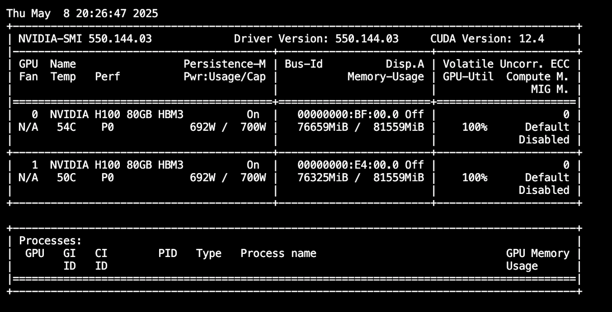

> 이 글은 @Simon V(https://github.com/simveit)의 허가를 받아 재게시 및 번역해 본 공개 계정에 게재한 것입니다. 원문 주소: https://veitner.bearblog.dev/how-to-use-reasoning-models-with-sglang/

# SGLang에서 reasoning 모델 사용하기

2025년 5월 11일

이 문서에서는 SGLang을 빠르게 시작하고 싶은 사람을 위해 실용적인 자료를 제공합니다. SGLang은 대규모 GPU로도 잘 확장되는 고성능 LLM 추론 엔진입니다(https://lmsys.org/blog/2025-05-05-large-scale-ep/). 여기서는 SGLang에서 첫날부터 지원된 새로운 Qwen3(https://github.com/QwenLM/Qwen3) 모델 제품군을 사용합니다. 이 글에서는 8B 모델을 사용합니다. 더 작은 GPU를 사용한다면 더 작은 Qwen 모델도 확인해 보세요. 그 모델들도 마찬가지로 훌륭합니다.

## 개발 환경 설정

다음 명령으로 SGLang이 설정되어 바로 사용할 수 있는 docker container를 실행합니다.

```shell
docker run -it --name h100_simon --gpus device=7 \
    --shm-size 32g \
    -v /.cache:/root/.cache \
    --ipc=host \
    lmsysorg/sglang:dev \
    /bin/zsh
```

이제부터는 이 docker container 안에서 작업합니다. 참고: 위에서 저는 `device = 7`을 선택했지만, 여러분은 임의의 device를 선택하거나 사용 가능한 모든 GPU를 사용할 수 있습니다.

## 기본 추론

다음 명령으로 서버를 시작합니다.

```shell
python3 -m sglang.launch_server --model-path Qwen/Qwen3-8B
```

처음에는 모델 weight를 다운로드해야 하므로 시간이 조금 걸립니다. 이후 서버 시작은 훨씬 빨라집니다. 다른 서버 파라미터는 관련 문서(https://docs.sglang.ai/backend/server_arguments.html)를 참고하세요.

서버가 시작되면 터미널에 다음 메시지가 보입니다.

```shell
The server is fired up and ready to roll!
```

이제 추론을 실행할 준비가 되었습니다.

`Qwen3`를 사용하려면 다음 프로그램을 실행합니다.

```python
from openai import OpenAI
# Set OpenAI's API key and API base to use SGLang's API server.
openai_api_key = "EMPTY"
openai_api_base = "http://localhost:30000/v1"

client = OpenAI(
    api_key=openai_api_key,
    base_url=openai_api_base,
)

chat_response = client.chat.completions.create(
    model="Qwen/Qwen3-8B",
    messages=[
        {"role": "user", "content": "Give me a short introduction to large language models."},
    ],
    max_tokens=32768,
    temperature=0.6,
    top_p=0.95,
    extra_body={
        "top_k": 20,
    }, 
)
print("Chat response:", chat_response)
```

다음과 같은 응답을 받게 됩니다.

```shell
Chat response: ChatCompletion(id='f5f49f3ca0034271b847d960df16563e', choices=[Choice(finish_reason='stop', index=0, logprobs=None, message=ChatCompletionMessage(content="<think>\nOkay, the user wants a short introduction to large language models. Let me start by defining what they are. They're AI systems trained on massive amounts of text data. I should mention their ability to understand and generate human-like text. Maybe include some examples like GPT or BERT. Also, highlight their applications in tasks like answering questions, writing, coding, and more. Keep it concise but cover the key points. Avoid technical jargon so it's accessible. Make sure to note that they're part of the broader field of NLP. Check if there's anything else important, like their training process or significance. Alright, that should cover it.\n</think>\n\nLarge language models (LLMs) are advanced artificial intelligence systems trained on vast amounts of text data to understand and generate human-like language. They can perform tasks such as answering questions, writing stories, coding, and translating languages by recognizing patterns in text. These models, like GPT or BERT, leverage deep learning to process and produce coherent responses, making them powerful tools in natural language processing (NLP) and a cornerstone of modern AI applications.", refusal=None, role='assistant', annotations=None, audio=None, function_call=None, tool_calls=None, reasoning_content=None), matched_stop=151645)], created=1746716570, model='Qwen/Qwen3-8B', object='chat.completion', service_tier=None, system_fingerprint=None, usage=CompletionUsage(completion_tokens=227, prompt_tokens=18, total_tokens=245, completion_tokens_details=None, prompt_tokens_details=None))
```

응답을 얻는 또 다른 동일한 방법은 `curl`을 사용하는 것입니다.

```shell
curl http://localhost:30000/v1/chat/completions -H "Content-Type: application/json" -d '{
  "model": "Qwen/Qwen3-8B",
  "messages": [
    {"role": "user", "content": "Give me a short introduction to large language models."}
  ],
  "temperature": 0.6,
  "top_p": 0.95,
  "top_k": 20,
  "max_tokens": 32768
}'
```

그러면 다음 형식의 응답을 받습니다.

```shell
{"id":"25f606ceada843eb8d980114b0475d87","object":"chat.completion","created":1746716675,"model":"Qwen/Qwen3-8B","choices":[{"index":0,"message":{"role":"assistant","content":"<think>\nOkay, the user wants a short introduction to large language models. Let me start by defining what they are. I should mention that they are AI systems trained on vast amounts of text data. Then, maybe explain how they work, like using deep learning and neural networks. It's important to highlight their ability to understand and generate human-like text. I should also touch on their applications, such as answering questions, creating content, coding, etc. Oh, and maybe mention some examples like GPT or BERT. Wait, the user might not know specific models, so I should keep it general. Also, I need to keep it concise since they asked for a short intro. Let me make sure not to get too technical. Maybe include something about their scale, like the number of parameters. But don't go into too much detail. Alright, let me put that together in a clear, straightforward way.\n</think>\n\nLarge language models (LLMs) are advanced AI systems trained on vast amounts of text data to understand and generate human-like language. They use deep learning techniques, such as transformer architectures, to process and analyze patterns in text, enabling tasks like answering questions, creating content, coding, and even reasoning. These models, often with billions of parameters, excel at tasks requiring contextual understanding and can adapt to diverse applications, from customer service to research. Notable examples include models like GPT, BERT, and others developed by companies like OpenAI and Google. Their ability to mimic human language makes them powerful tools for automation, creativity, and problem-solving.","reasoning_content":null,"tool_calls":null},"logprobs":null,"finish_reason":"stop","matched_stop":151645}],"usage":{"prompt_tokens":18,"total_tokens":335,"completion_tokens":317,"prompt_tokens_details":null}}
```

## reasoning 내용 파싱

reasoning 내용을 응답의 나머지 부분과 분리하고 싶을 수 있습니다. SGLang은 추가 서버 파라미터 `--reasoning-parser`를 제공해 이 기능을 지원합니다.

reasoning parser를 포함해 모델을 시작하려면 다음을 실행합니다.

```shell
python3 -m sglang.launch_server --model-path Qwen/Qwen3-8B --reasoning-parser qwen3
```

그런 다음 아래처럼 reasoning과 나머지 content를 분리할 수 있습니다.

```python
from openai import OpenAI
# Set OpenAI's API key and API base to use SGLang's API server.
openai_api_key = "EMPTY"
openai_api_base = "http://localhost:30000/v1"

client = OpenAI(
    api_key=openai_api_key,
    base_url=openai_api_base,
)

chat_response = client.chat.completions.create(
    model="Qwen/Qwen3-8B",
    messages=[
        {"role": "user", "content": "Give me a short introduction to large language models."},
    ],
    max_tokens=32768,
    temperature=0.6,
    top_p=0.95,
    extra_body={
        "top_k": 20,
        "separate_reasoning": True
    }, 
)

print("==== Reasoning ====")
print(chat_response.choices[0].message.reasoning_content)

print("==== Text ====")
print(chat_response.choices[0].message.content)
```

이는 다음을 제공합니다.

```shell
==== Reasoning ====
Okay, the user wants a short introduction to large language models. Let me start by defining what they are. They are AI systems trained on massive amounts of text data. I should mention their ability to understand and generate human-like text. Maybe include examples like GPT or BERT. Also, highlight their applications in various fields. Need to keep it concise but informative. Let me check if I'm missing any key points. Oh, maybe mention the training process and the scale of data. Avoid technical jargon to keep it accessible. Alright, that should cover the basics without being too lengthy.

==== Text ====
Large language models (LLMs) are advanced artificial intelligence systems trained on vast amounts of text data to understand and generate human-like language. These models, such as GPT or BERT, use deep learning techniques to recognize patterns, answer questions, and create coherent text across diverse topics. Their ability to process and generate natural language makes them valuable for tasks like translation, summarization, chatbots, and content creation. LLMs continue to evolve, driving innovations in fields like education, healthcare, and customer service.

```

더 자세한 내용은 reasoning parser 문서(https://docs.sglang.ai/backend/separate_reasoning.html)를 참고하세요.

## 구조화 출력

구조화 출력은 LLM의 흥미로운 응용입니다. 이를 사용해 예전에는 비정형이던 데이터를 구조화하고, 추가 처리 가능한 형식으로 바꿀 수 있습니다.

`reasoning-parser`로 서버를 시작한 뒤, 다음 스크립트로 구조화 출력을 생성할 수 있습니다.

```python
from openai import OpenAI
from pydantic import BaseModel, Field

# Set OpenAI's API key and API base to use SGLang's API server.
openai_api_key = "EMPTY"
openai_api_base = "http://localhost:30000/v1"

client = OpenAI(
    api_key=openai_api_key,
    base_url=openai_api_base,
)

# Define the schema using Pydantic
class CapitalInfo(BaseModel):
    name: str = Field(..., pattern=r"^\w+$", description="Name of the capital city")
    population: int = Field(..., description="Population of the capital city")


response = client.chat.completions.create(
    model="Qwen/Qwen3-8B",
    messages=[
        {
            "role": "system",
            "content": "Please extract the name and population of the given country as JSON schema."
        },
        {
            "role": "user",
            "content": "Please extract name and population of the Capital of France.",
        },
    ],
    temperature=0,
    max_tokens=2048,
    response_format={
        "type": "json_schema",
        "json_schema": {
            "name": "foo",
            # convert the pydantic model to json schema
            "schema": CapitalInfo.model_json_schema(),
        },
    },
)

print(
    f"reasoning content: {response.choices[0].message.reasoning_content}\n\ncontent: {response.choices[0].message.content}"
)

```

여기서는 Pydantic(https://docs.pydantic.dev/latest/)을 사용해 편리하게 구조를 정의합니다.

```shell
reasoning content: Okay, the user is asking for the name and population of the capital of France. Let me break this down.

First, I need to confirm which city is the capital of France. I know that France's capital is Paris. So the name part is straightforward.

Next, the population. I remember that Paris has a population of around 2.1 million people. But wait, I should check if that's the latest data. The most recent estimates might be a bit higher or lower. Let me think—maybe the 2023 estimate is about 2.16 million? Or is it 2.1 million? I think the commonly cited figure is approximately 2.1 million, but I should be precise. 

Wait, the user might be expecting the exact number. Let me recall. The population of Paris is often cited as around 2.1 million, but the exact figure can vary. For example, the 2022 estimate was about 2.16 million. However, sometimes sources round it to 2.1 million for simplicity. 

I need to make sure I'm not giving outdated information. If I can't recall the exact number, it's better to state the approximate figure. Also, the user might not need the most precise number, just a reasonable estimate. 

So, putting it all together, the capital of France is Paris, and its population is approximately 2.1 million. I should present this as a JSON object with "name" and "population" keys. Let me double-check the structure to ensure it's correct. The JSON should have the name as a string and population as a number. 

Wait, the user said "population of the Capital of France," so the capital is Paris, and the population is that of Paris. I need to make sure there's no confusion with the population of France as a country versus the capital city. The question specifically asks for the capital's population, so Paris is correct. 

Alright, I think that's all. The JSON should be accurate and clear.


content: {

  "name": "Paris",
  "population": 2100000
}
```

더 많은 정보는 해당 SGLang 문서(https://docs.sglang.ai/backend/structured_outputs_for_reasoning_models.html)를 참고하세요.

## 여러 GPU 사용

여러 GPU를 사용하려는 이유는 다양합니다.

- 모델이 단일 GPU에 들어가지 않습니다.
- 여러 GPU를 활용해 입력을 병렬 처리하고 싶습니다.

첫 번째 문제는 tensor parallelism으로 해결할 수 있습니다. 즉 모델 weight를 shard 방식으로 여러 GPU에 분산합니다. 이 기술은 주로 메모리 제한 문제를 해결하는 데 쓰이며, 더 높은 throughput을 얻기 위한 목적은 아니라는 점에 유의하세요. 두 번째 문제는 data parallelism으로 해결할 수 있습니다. 즉 여러 GPU에 모델을 복제하고 요청을 그중 하나로 병렬 전송합니다.

SGLang의 router는 여러 GPU를 편리하게 활용할 수 있게 합니다.

`pip install sglang-router`로 설치할 수 있습니다.

위 docker 시작 스크립트를 여러 GPU를 사용하도록 바꿔 보겠습니다.

```shell
docker run -it --name h100_simon --gpus '"device=6,7"' \
    --shm-size 32g \
    -v /.cache:/root/.cache \
    --ipc=host \
    lmsysorg/sglang:dev \
    /bin/zsh
```

tensor parallelism과 data parallelism 크기는 서버 파라미터 `dp-size`와 `tp-size`로 제어할 수 있습니다. router를 사용해 data parallel mode로 시작하는 것은 매우 간단합니다.

```shell
python3 -m sglang_router.launch_server --model-path Qwen/Qwen3-8B --dp-size 2
```

다음과 같은 메시지를 통해 프로세스가 성공적으로 완료되었음을 알 수 있습니다.

```shell
✅ Serving workers on ["http://127.0.0.1:31000", "http://127.0.0.1:31186"]
```

`dp_size * tp_size = #GPUs`를 만족해야 한다는 점에 유의하세요.

이제 무거운 load를 하나 시뮬레이션해 보겠습니다. 여기서는 최고 성능을 위해 튜닝하지 않습니다. router가 기대대로 동작하고 두 GPU에서 요청을 처리한다는 것을 보여주기 위한 예시일 뿐입니다. 더 잘 이해하려면 router를 시작한 터미널을 관찰하세요. 명령행 파라미터는 bench_serving.py(https://github.com/sgl-project/sglang/blob/main/python/sglang/bench_serving.py)를 참고하세요.

```shell
python3 -m sglang.bench_serving --backend sglang --dataset-name random --num-prompts 1000 --random-input 4096 --random-output 4096 --random-range-ratio 0.5
```

다음을 실행하면

```shell
watch nvidia-smi
```

두 GPU가 모두 많이 사용되는 것을 볼 수 있습니다.



## 결론

이 글이 SGLang과 SGLang의 reasoning 모델을 더 이해하기 쉽게 만들었기를 바랍니다. 더 궁금한 점이 있으면 알려 주세요. LinkedIn으로 저에게 연락할 수 있습니다.

SGLang에는 가치 있는 자료가 여러 개 있습니다.

- SGLang은 오픈소스이며, 그 코드베이스(https://github.com/sgl-project/sglang)는 당연히 매우 가치 있는 자료입니다.
- 문서(https://docs.sglang.ai/index.html)에는 많은 예제(https://github.com/sgl-project/sglang/tree/main/examples)가 포함되어 있습니다. examples 폴더도 있습니다.
- SGLang 저장소의 benchmark(https://github.com/sgl-project/sglang/tree/main/benchmark) 폴더에는 더 복잡한 예제가 들어 있습니다.
- 기술 심층 분석은 Awesome-ML-Sys(https://github.com/zhaochenyang20/Awesome-ML-SYS-Tutorial/tree/main/sglang) 튜토리얼 저장소의 코드 워크스루(https://github.com/zhaochenyang20/Awesome-ML-SYS-Tutorial/tree/main/sglang/code-walk-through)에서 찾을 수 있습니다.
- SGLang Slack 채널은 매우 도움이 되는 커뮤니티입니다.
