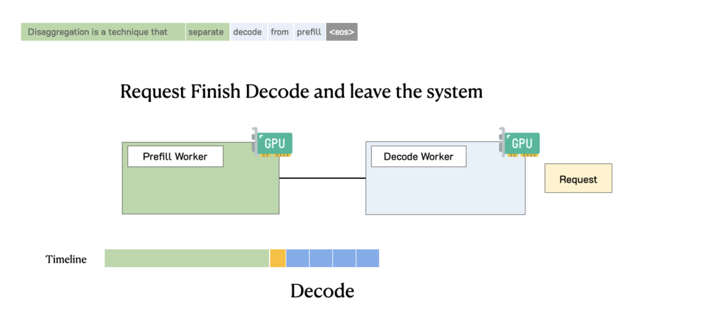
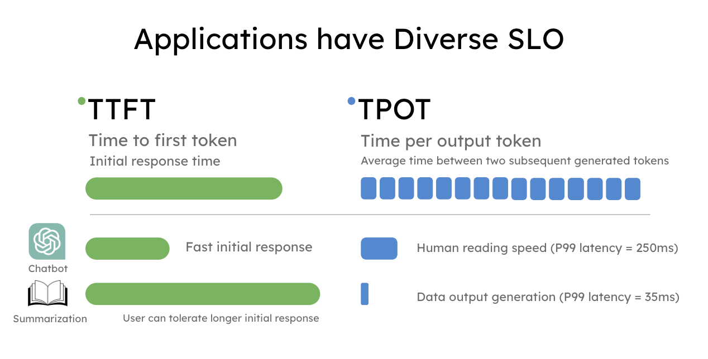
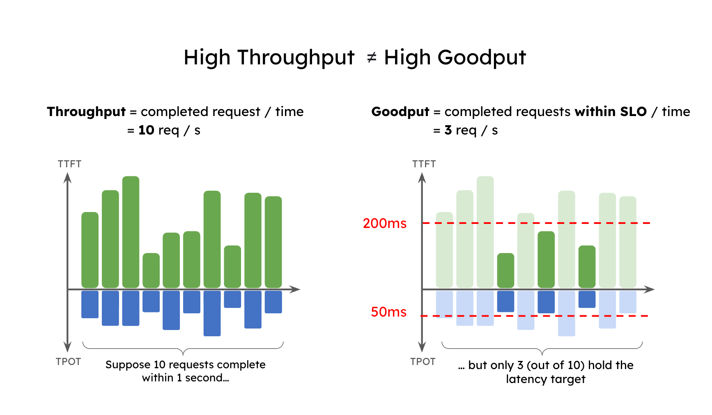
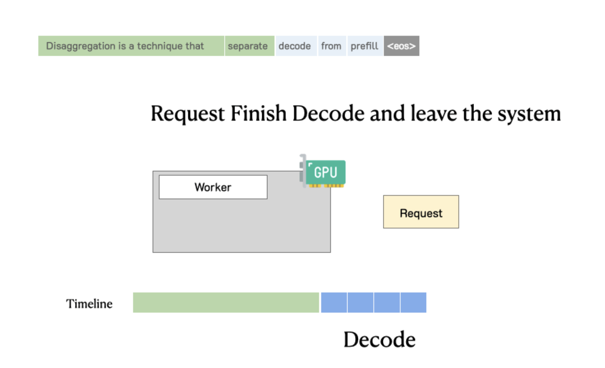
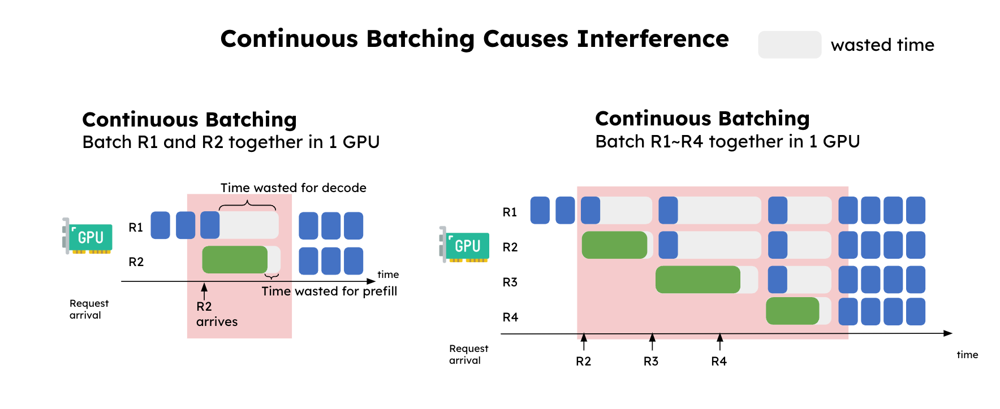
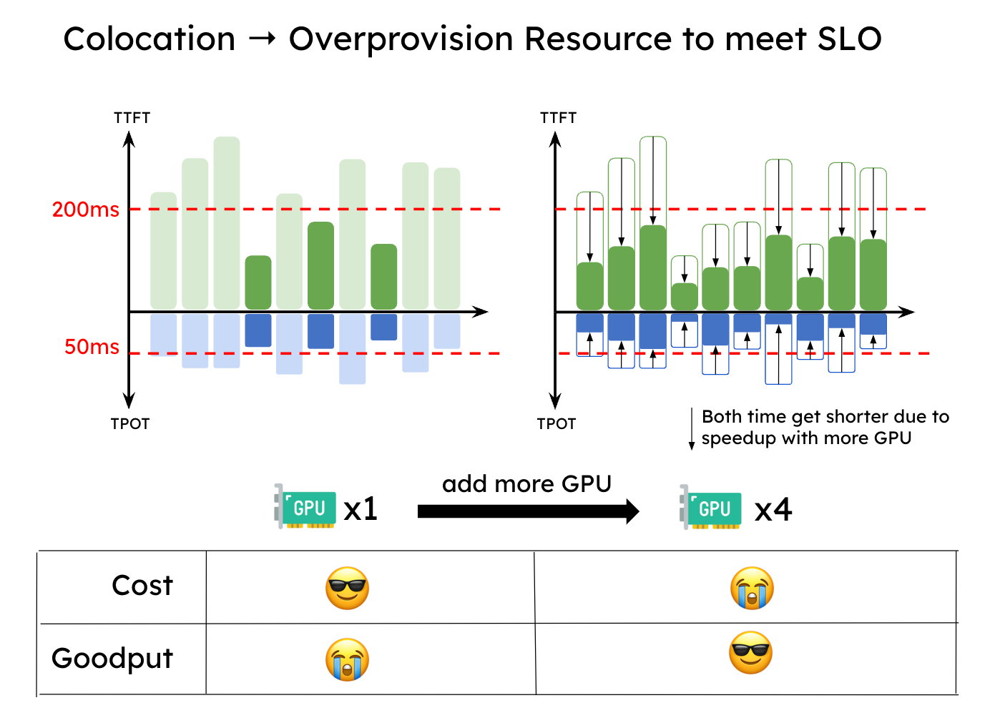
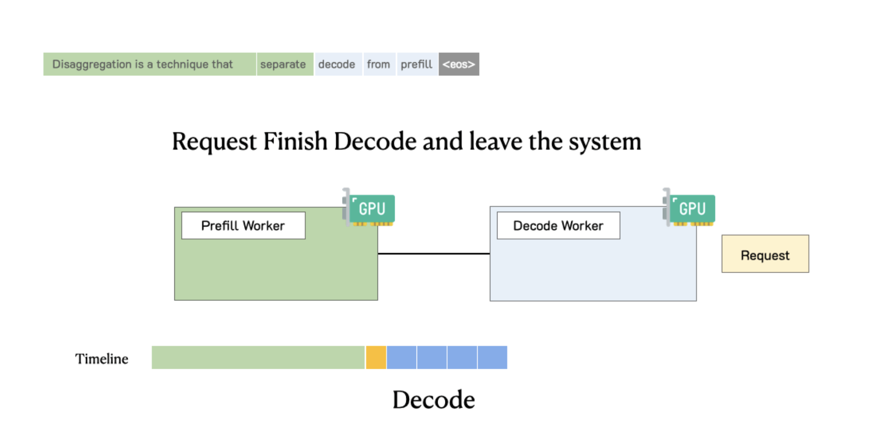
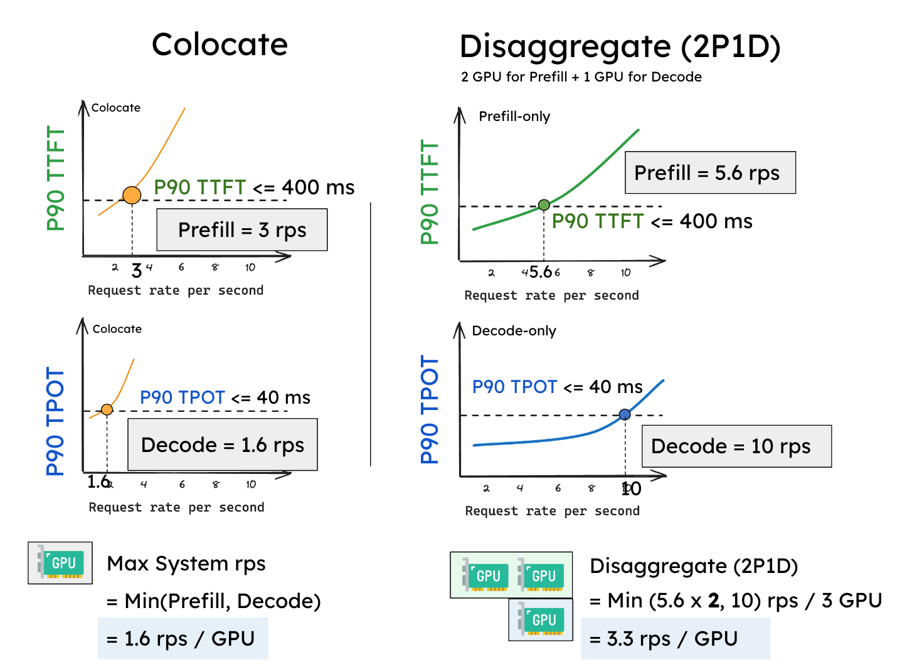
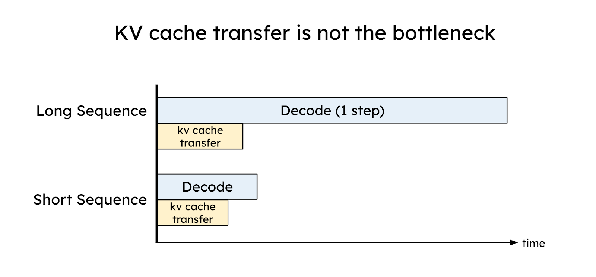
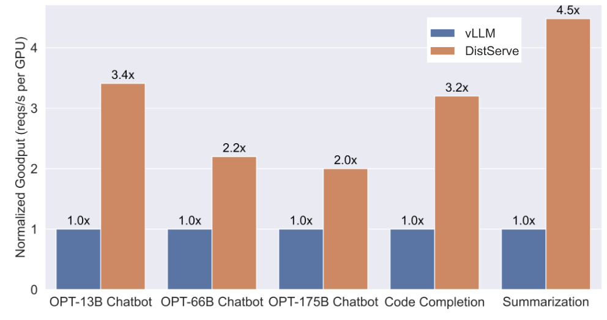

> Blog reposted from: https://hao-ai-lab.github.io/blogs/distserve/ . 학습과 지식 공유 목적으로만 사용한다. Blog에 해당하는 paper는 https://hao-ai-lab.github.io/blogs/distserve/ 를 참고하라.

# Throughput이 전부는 아니다: Prefill-Decode 분리로 LLM 서비스의 최대 Goodput 달성하기

> 2024년 3월 17일 · 13분 · Junda Chen, Yinmin Zhong, Shengyu Liu, Yibo Zhu, Xin Jin, Hao Zhang



> Note: 이 그림은 원 blog에서는 animated gif다. 원 blog link를 클릭하면 best experience를 얻을 수 있다.

**TL;DR**: 오늘날의 LLM application은 다양한 latency requirement를 가진다. 예를 들어 chatbot은 빠른 initial response(예: 0.2초 이내)가 필요할 수 있지만, Decode speed는 moderate하면 되며 인간의 reading speed에 맞추면 충분하다. 반면 code completion은 real-time code suggestion을 제공하기 위해 빠른 end-to-end generation time이 필요하다.

이 blog post에서 우리는 **throughput**을 최적화하는 기존 serving system이 latency criterion 아래에서는 optimal하지 않음을 보여준다. 우리는 **goodput**, 즉 service-level objective(SLO)를 만족하며 초당 완료되는 request 수를 LLM serving performance의 개선된 metric으로 사용할 것을 주장한다. 이는 cost와 user satisfaction을 동시에 고려한다.

Goodput을 최적화하기 위해 우리는 Prefill-Decode separation을 도입한다. 즉 Prefill과 Decode를 서로 다른 GPU로 분리한다. 또한 DistServe라는 system prototype을 구축했으며, 기존 state-of-the-art serving system과 비교해 strict latency constraint에서 최대 4.48배 goodput 또는 10.2배 더 strict한 SLO를 달성했다. 우리는 이 기술을 community에 전달하기 위해 DistServe를 vLLM과 통합하고 있다.

# Background: Throughput vs Goodput

Large language models(LLMs)는 산업계가 service에 AI 기술을 도입하는 방식을 바꾸고 있지만, LLM serving cost는 여전히 높다. Serving cost를 낮추기 위해 오늘날 많은 회사는 **request당 dollar cost($/req)**를 최소화하기 위한 proxy로 전체 LLM serving system의 **throughput**, 즉 초당 service되는 request 수(rps)를 최대화하는 데 집중한다. vLLM과 TensorRT-LLM 같은 거의 모든 인기 LLM serving engine은 서로 performance를 비교하는 주요 metric으로 throughput을 사용한다.

실제로 downstream application에는 서로 다른 type이 있다. 이들은 user experience에 대해 서로 다른 latency requirement를 가질 수 있으므로, 완전히 다른 service-level objective(SLO)를 만족해야 한다. LLM serving에서 가장 널리 쓰이는 SLO는 다음과 같다.

- Time To First Token(**TTFT**): LLM이 사용자에게 첫 generated token을 output하는 데 걸리는 시간.
- Time Per Output Token(**TPOT**): 두 consecutive generated token 사이의 average latency.




Throughput은 모든 user와 request에 대해 완료된 request 또는 token 수를 측정하므로 이러한 latency requirement를 무시한다. 우리는 **goodput**을 도입한다. 이는 SLO(TTFT와 TPOT requirement)를 만족하며 초당 완료되는 request 수다. 이는 SLO를 달성한 request throughput을 포착하므로 cost와 service quality를 동시에 고려하는 더 나은 metric임을 보여준다.

Goodput을 간단히 설명하기 위해, 어떤 application이 TTFT < 200ms 및 TPOT < 50ms를 요구하고 최소 90% request가 이를 만족해야 한다고 가정하자. 그러면 다음과 같이 정의할 수 있다.

Goodput(P90 TTFT < 200ms 및 P90 TPOT < 50ms) = 최소 90% request가 TTFT < 200ms와 TPOT < 50ms를 동시에 만족할 때의 maximum request rate per second

**그림 1**은 high throughput application이 low goodput을 가질 수 있는 simple case를 보여준다. 이 application의 throughput은 초당 10 request다. 하지만 latency constraint 아래에서는 3개 request만 SLO constraint 안에 머물며, 초당 3 request의 goodput을 만든다. 상상할 수 있듯이, 이런 high-throughput but low-goodput serving system을 사용하는 user는 여전히 낮은 service quality를 겪게 된다.



이 subsection에서 도입한 term을 요약하자.

- **Goodput**: cost와 user satisfaction을 동시에 고려하는 LLM serving system effectiveness metric. 지정된 service-level objective(SLO)를 만족하면서 system이 유지할 수 있는 maximum request rate per second로 정의된다.
- **Throughput**: LLM serving system이 초당 처리하는 completed request 수.
- **Service-Level Objective(SLO)**: 만족스러운 user experience를 제공하기 위해 LLM serving system이 만족해야 하는 target set. 일반적인 SLO에는 time to first token(TTFT), time per output token(TPOT), end-to-end latency(E2E), exponential moving average(EMA) latency가 포함된다.
- **Prefill**: LLM inference의 첫 stage. 모든 input token을 소화하고 KV Cache를 채우며 첫 output token을 생성한다.
- **Decode**: 이후 stage. 종료될 때까지 token을 하나씩 생성한다.
- **Time To First Token(TTFT)**: LLM serving system이 user request에 응답해 첫 token을 생성하는 데 필요한 시간.
- **Time Per Output Token(TPOT)**: LLM serving system이 user request에 응답해 후속 token을 생성하는 average time.

# 기존 System은 왜 High Goodput을 달성하지 못하는가?

## LLM Request는 어떻게 처리되는가?

깊이 들어가기 전에 LLM serving에서 request lifecycle을 다시 살펴보자. 그림 2는 이 과정을 보여준다. Request가 LLM inference engine에 들어오면, system은 먼저 user input을 사용해 첫 token(**Prefill**)을 생성한 뒤, autoregressive하게 output을 token 단위로 생성한다(**Decode**). 하나의 request는 보통 하나의 Prefill step과 종료될 때까지 여러 Decode step을 포함한다.

LLM serving system은 보통 iteration-level scheduling 또는 continuous batching이라는 기술을 사용해 모든 Prefill과 Decode를 함께 batch한다. 이를 통해 GPU가 가능한 한 큰 batch size를 처리하고, iteration을 한 번 실행하며, 모든 request에 대해 token 하나를 생성한다. 이 기술은 overall throughput(tokens per second)을 효과적으로 높이며 vLLM과 TensorRT-LLM 같은 popular serving system에서 널리 사용된다.



> Note: 이 그림은 원 blog에서는 animated gif다. 원 blog link를 클릭하면 best experience를 얻을 수 있다.

하지만 **이 두 stage는 computation 측면에서 매우 다른 특성**을 가진다. Prefill은 compute-intensive하다. 즉 small batch의 Prefill 또는 충분히 긴 single Prefill만으로도 GPU computation을 쉽게 saturate할 수 있다. 반면 Decode는 computation bottleneck에 도달하려면 더 큰 batch size가 필요하며, GPU memory bandwidth의 영향을 더 쉽게 받는다.

서로 완전히 다른 computation pattern과 SLO 때문에, 두 stage를 colocate하는 것은 high goodput 달성에 optimal하지 않다. 이유는 다음과 같다.

- Prefill과 Decode를 colocate하면 서로 interference가 발생한다.
- Prefill과 Decode를 colocate하면 resource allocation과 parallel strategy가 coupling된다.

이 문제들을 차례대로 설명한다.

## Colocated Prefill과 Decode는 Interference를 유발한다

**그림 3**은 Prefill과 Decode 사이 interference의 simplified view를 보여준다. 가장 왼쪽에서는 2개 request를 1개 GPU에서 함께 batch한다. Continuous batching이 R1(Decode)의 latency를 크게 늘리고, R2(Prefill)의 latency도 약간 증가시키는 것을 볼 수 있다. 오른쪽에는 stable incoming request stream이 있다. 이제 Decode stage의 request는 Prefill request가 system에 들어올 때마다 "stuck"하게 되고, Decode에 예상치 못하게 긴 latency가 발생한다.



이 interference 때문에 그림 4처럼 service가 TTFT와 TPOT SLO를 동시에 만족해야 할 때, system은 latency target을 만족하기 위해 resource를 over-provision해야 한다. 특히 둘 중 하나의 SLO라도 strict할 때 그렇다.



## Resource Allocation과 Parallel Strategy가 Coupled된다

또한 colocation에서는 Prefill과 Decode computation의 parallel strategy(tensor, pipeline, data parallel)가 본질적으로 coupled된다. 앞서 말했듯 서로 다른 computation pattern과 latency target 때문에 Prefill stage와 Decode stage의 optimal parallel strategy는 보통 다르다. 예를 들어 TTFT가 strict하고 TPOT가 loose할 때, Prefill stage는 strict latency target을 만족하기 위해 tensor parallelism(TP)을 선호하는 반면, Decode stage는 throughput을 높이기 위해 data 또는 pipeline parallelism을 선호한다. 이제 이러한 문제를 해결하는 우리의 새로운 방법을 설명한다.

# Prefill-Decode Separation

직관은 간단하다. Prefill과 Decode를 서로 다른 GPU로 분리하고, 각 stage에 맞는 parallel strategy를 customize하는 것이다. 이는 위 두 문제를 자연스럽게 해결한다.

- **Prefill과 Decode 사이 interference가 없음**: 두 stage 모두 더 빨라지고 각자의 SLO를 더 쉽게 달성한다.
- **Decoupled resource allocation and parallel strategy**: optimization을 Prefill과 Decode 각각에 맞춰 customize할 수 있다.

**그림 5**는 이런 disaggregated system에서 request가 처리되는 방식을 설명한다. Request가 system에 도착하면 먼저 Prefill worker에 들어가 Prefill stage를 완료한다. 그런 다음 system은 intermediate state(주로 KV Cache)를 **Decode worker**로 migrate하고, 여러 Decode step을 수행해 후속 token을 생성한다. Request는 generation 완료 후 system을 떠난다.



> Note: 이 그림은 원 blog에서는 animated gif다. 원 blog link를 클릭하면 best experience를 얻을 수 있다.

간단한 experiment로 separation이 왜 유익한지 보자. 우리는 단일 A100-80GB GPU에서 13B LLM을 serving하고, length 512 input과 length 64 output을 사용하며, Poisson arrival의 synthetic workload를 따른다. Request rate(x축)를 점진적으로 증가시키고 두 latency(P90 TTFT와 P90 TPOT, y축)가 **그림 6**에서 어떻게 변하는지 측정했다.

P90 TTFT SLO를 0.4초, P90 TPOT를 0.04초로 설정한다고 가정하자(**그림 6**의 horizontal line). 기존 system은 1개 GPU로 TTFT latency constraint 안에서 대략 3 rps를 지원할 수 있고, TPOT에 대해서는 1.6 rps를 유지한다(**그림 6a**). 두 constraint를 동시에 만족해야 하므로 기존 colocated system의 goodput은 다음과 같다. goodput(colocated) = min(3, 1.6) = 1.6 rps(per GPU).

Separation 후 성능은 크게 향상된다. 한 stage만 처리하면 Prefill worker와 Decode worker가 모두 이전보다 더 나은 rps를 달성할 수 있다. **그림 6**에 따르면 Prefill worker 하나는 약 5.6 rps, Decode worker 하나는 약 10 rps를 달성한다. 더 중요한 것은, 이제 2개 Prefill worker와 1개 Decode worker를 유연하게 pair로 구성할 수 있다는 점이다(2P1D로 표기). 총 3개 GPU다. Goodput은 다음과 같다.

goodput(2P1D) = min(5.6 x 2, 10) = 10 reqs/s / 3 GPUs ≈ 3.3 reqs/s(per GPU).

이 experiment는 어떤 parallelism도 없는 단순한 separation만으로 2배 goodput을 만든다는 것을 보여준다.



실제로는 stage마다 서로 다른 resource를 할당하는 것 외에도, Prefill과 Decode를 분리하면 goodput을 최적화하기 위해 각 stage에 가장 좋은 parallel strategy를 선택할 수 있다("customized parallelism"이라 부른다). 우리는 paper에서 이를 자세히 연구했다.

## KV Cache Transfer

Separation의 비용은 Prefill과 Decode GPU 사이에서 intermediate state, 즉 KV Cache를 transfer하는 것이다. 얼핏 보면 KV Cache는 LLM inference의 큰 memory expenditure이며, GPU 사이에서 KV Cache를 transfer하는 것은 bottleneck처럼 들린다. 하지만 우리는 그 반대를 보여준다. 적절한 placement를 통해 KV Cache transfer overhead는 Decode step 시간보다 낮게 효과적으로 최소화할 수 있다. 이는 오늘날의 high-speed network, 예를 들어 NVLink와 PCI-e 5.0 덕분이다.

이를 확인하기 위해 GPU 사이의 intra-node network로 8-channel PCIe 5.0 x 16(link당 64GB/s)이 있다고 가정하자. 2048 token request가 주어졌을 때 OPT-175B를 serving하며 KV Cache를 transfer하는 latency는 다음과 같이 추정된다.

latency = 2048 tokens * (4.5 MB/token) / (64GB/s * 8) = 17.6 ms

이 latency는 OPT-175B의 단일 Decode step(A100에서 약 30~50ms)보다 작다. 더 큰 model, 더 긴 sequence, 또는 더 advanced network(예: bandwidth 600GB/s의 A100-NVLink)에서는 그림 7처럼 single Decode step 대비 KV Cache transfer와 관련된 relative overhead가 덜 중요해진다. 요약하면, high-bandwidth network를 활용하도록 Prefill과 Decode worker를 신중히 placement하면 KV Cache transfer overhead를 효과적으로 숨길 수 있으며, 이는 우리 paper에서 자세히 논의한다.



## DistServe: Separation의 Effectiveness 평가

우리는 제안한 기술을 DistServe라는 system prototype에 구현했고, 서로 다른 latency constraint를 가진 세 workload와 dataset에서 기존 system과 비교했다. chatbot, code completion, summarization이며 아래 표와 같다.

| LLM application | Data | TTFT | TPOT |
|---------|------|------|------|
| Chatbot | ShareGPT | Strict | Moderate |
| Code completion | HumanEval | Strict | Strict |
| Summarization | LongBench | Loose | Moderate |

> 표 8. 평가에서 사용한 workload와 latency requirement

**그림 9**는 DistServe와 vLLM의 비교 결과를 보여준다.

- **Chatbot**: DistServe는 vLLM보다 2.0x - 3.41x 더 높은 goodput을 유지한다.
- **Code completion**: DistServe는 vLLM보다 3.2x 더 높은 goodput과 1.5x 더 strict한 SLO를 유지한다. Real-time coding assistant로서 code completion task는 chatbot보다 더 낮은 TTFT가 필요하며, 이로 인해 두 system 모두 결국 TTFT requirement의 constraint를 받는다. 하지만 Decode job의 interference를 제거하고 Prefill을 위한 tensor parallelism을 customize함으로써, DistServe는 Prefill job의 average latency를 줄여 더 많은 request가 TTFT requirement를 만족하게 한다.
- **Summarization**: DistServe는 vLLM보다 4.48x 더 높은 goodput과 10.2x 더 strict한 SLO를 달성한다. 예상대로 vLLM은 Prefill과 Decode를 colocate하기 때문에 Decode에서 더 큰 slowdown을 겪고, TPOT requirement를 만족하지 못한다.

더 세분화된 experiment result는 technical report를 참고하라.



## Prefill-Decode Separation vs Chunked Prefill

이 절에서는 Prefill-Decode separation을 최근 방법인 dynamic splitfuse(Chunked Prefill 및 piggybacking이라고도 부름)와 비교하고, 장단점을 논의한다.

Dynamic splitfuse의 핵심 아이디어는 긴 Prefill을 더 작은 chunk로 나누어, Prefill chunk와 몇 개 Decode task를 조합해 GPU를 완전히 활용하는 batch를 형성하는 것이다. 이 과정을 piggybacking이라고 한다. **Chunk size**는 workload에 따라 의도적으로 선택되며, 이 방법이 모든 step에서 GPU를 완전히 활용해 overall system efficiency를 높이도록 한다. 하지만 이는 TTFT와 TPOT를 증가시킬 수 있고, latency constraint 아래에서는 goodput을 낮출 수 있다. Prefill과 Decode operation을 완전히 분리하지 못해 resource contention과 TTFT/TPOT 사이의 compromise가 발생하기 때문이다.

**TTFT의 경우**, Chunked Prefill은 chunk size와 **무관하게** Prefill의 overhead를 키운다(따라서 TTFT가 높아진다). 첫째, GPU saturation point보다 상당히 낮은 chunk size를 선택하면 Prefill task execution time이 길어진다. 예를 들어 GPU가 Prefill length 512에서 saturate한다고 가정하면, chunk size를 256으로 설정할 경우 512를 넘는 모든 Prefill의 TTFT가 두 배가 된다. 둘째, chunk size가 GPU usage를 거의 최대화하도록 optimize되더라도, Chunked Prefill은 각 subsequent chunk마다 GPU의 HBM에서 KV Cache를 SRM으로 load해야 하므로 Prefill task의 memory access를 크게 증가시킨다. 더 긴 Prefill에서는 특히 심각하다. Unchunked setting의 linear increase와 비교해 KV Cache load operation은 quadratic growth를 보이며, 제한된 Decode token slot 때문에 piggybacking opportunity도 줄어든다. **TPOT에 대해서는**, 앞에서 드러낸 것처럼 batch 안에서 Prefill과 Decode를 colocate하면 본질적으로 모든 Decode task가 느려진다.

요약하면, Chunked Prefill은 overall throughput을 최대화하는 데 유망할 수 있다. 하지만 application이 TTFT와 TPOT 사이에서 tradeoff하지 않고 둘을 동시에 지켜야 한다면, Prefill-Decode separation이 더 나은 선택이 된다.

# Today's DistServe

우리는 vLLM community와 협력해 제안한 기술을 vLLM ecosystem에 통합하고 있다.

우리 작업과 동시에 Splitwise, TetriInfer, DéjàVu도 더 나은 LLM serving goodput을 달성하기 위해 이러한 Prefill-Decode separation strategy를 채택했다. 많은 연구자와 회사가 system goodput을 최적화하기 위해 Prefill-Decode separation을 채택하는 것을 보게 되어 기쁘며, Prefill-Decode separation이 곧 LLM serving engine의 de facto choice가 될 것이라고 믿는다.

# 감사의 말

우리 blog에 깊이 있는 feedback을 제공해 준 Vikranth Srivatsa, Lanxiang Hu, Will Lin에게 감사드린다.

# Citation

```shell
@article{zhong2024distserve,
 title={DistServe: Disaggregating Prefill and Decoding for Goodput-optimized Large Language Model Serving},
 author={Zhong, Yinmin and Liu, Shengyu and Chen, Junda and Hu, Jianbo and Zhu, Yibo and Liu, Xuanzhe and Jin, Xin and Zhang, Hao},
 journal={arXiv preprint arXiv:2401.09670},
 year={2024}
}
```

